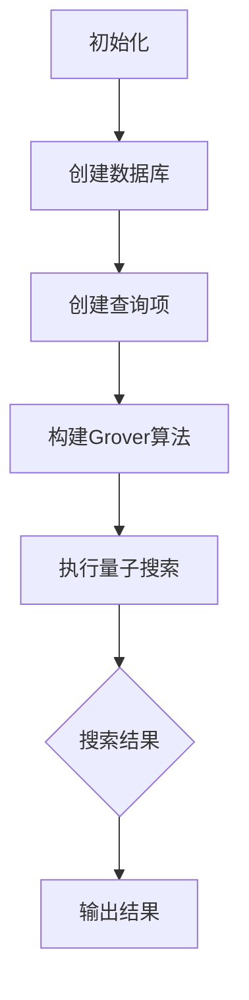
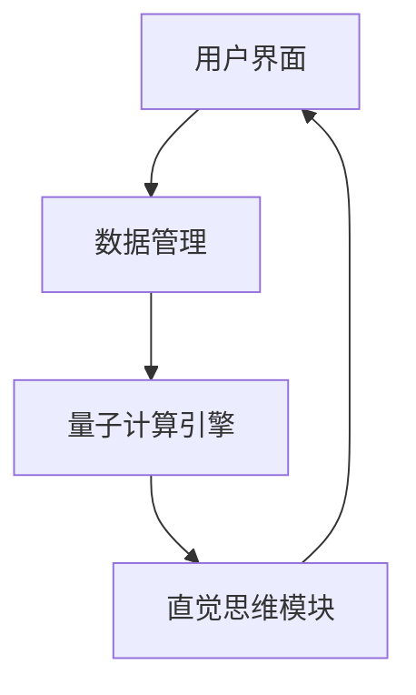
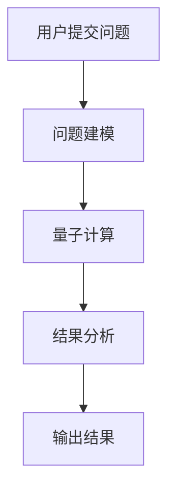

                 


# 大脑量子计算与直觉思维的关系

关键词：量子计算、大脑、直觉思维、神经科学、认知心理学

摘要：本文将探讨大脑量子计算与直觉思维之间的关系。通过分析量子计算的基本原理和直觉思维的心理机制，本文将揭示量子计算如何影响直觉思维，以及直觉思维如何影响量子计算的潜力。我们将通过详细的案例研究和项目实战，展示这两个领域之间的紧密联系，并提出未来研究的前沿方向。

## 背景介绍

### 核心概念术语说明

#### 量子计算

量子计算是一种利用量子力学原理进行信息处理的新型计算模式。与传统的经典计算相比，量子计算具有并行处理和量子叠加的能力，能够解决某些经典计算机难以处理的问题。

#### 直觉思维

直觉思维是一种未经明显逻辑推理而直接得出的思维过程。它通常发生在认知决策、问题解决和创造性思维中，能够快速识别模式、趋势和可能性。

### 问题背景

#### 大脑的复杂性与计算能力

大脑是一个高度复杂的生物系统，具有强大的计算和处理能力。然而，传统的计算机科学模型无法完全解释大脑的计算机制。

#### 量子计算的兴起

量子计算作为一种新兴的计算模式，已经在密码学、量子化学和优化问题等领域展示了其独特的优势。那么，量子计算能否为大脑的计算能力提供新的启示？

### 问题描述

本文旨在回答以下问题：

1. 量子计算的基本原理如何影响直觉思维？
2. 直觉思维如何影响量子计算的性能和应用？
3. 大脑量子计算模型能否提高直觉思维的能力？

### 问题解决

通过分析量子计算与直觉思维的基本原理，结合神经科学和认知心理学的相关研究，我们将探讨这两个领域之间的相互作用。

### 边界与外延

本文主要关注大脑量子计算与直觉思维之间的关系，但可能会涉及其他相关领域，如神经计算、量子心理学等。

### 概念结构与核心要素组成

本文的核心概念包括：

1. **量子比特**：量子计算的基本单位，与经典比特的区别。
2. **直觉思维**：未经明显逻辑推理的快速思维过程。
3. **神经科学**：研究大脑结构、功能和机制的学科。
4. **认知心理学**：研究人类认知过程和思维的学科。

## 核心概念与联系

### 量子比特与经典比特

量子比特（qubit）是量子计算的基本单位，与经典比特（bit）有本质区别。经典比特只能表示0或1，而量子比特可以同时处于0和1的状态，即量子叠加。此外，量子比特之间可以通过量子纠缠实现一种特殊的关联，这种关联在经典计算中是无法实现的。

| 特性          | 量子比特                    | 经典比特                    |
| ------------- | -------------------------- | -------------------------- |
| 状态表示      | 可叠加态，0和1同时存在      | 状态固定，0或1              |
| 纠错能力      | 需要量子纠错码             | 具有较强的纠错能力           |
| 算法效率      | 可以解决某些经典计算机无法解决的问题 | 对于复杂问题，效率可能较低   |

### 直觉思维与认知心理学

直觉思维是一种未经明显逻辑推理而直接得出的思维过程。在认知心理学中，直觉思维被视为一种快速、高效的认知策略，能够帮助人们在不确定和复杂的环境中快速做出决策。

#### 特点

1. **快速性**：直觉思维能够在短时间内完成，通常不需要经过详细的逻辑推理。
2. **高效性**：直觉思维能够快速识别模式、趋势和可能性，有助于人们在复杂环境中迅速适应。
3. **主观性**：直觉思维受个人经验、情感和文化背景等因素的影响，具有主观性。

### 大脑与量子计算的关系

大脑是一个高度复杂的生物系统，其计算能力和信息处理方式与量子计算有许多相似之处。例如，大脑中的神经元可以通过量子效应实现信息传递和计算。此外，大脑的神经网络结构在某种程度上与量子计算的量子纠缠现象有相似之处。

#### 量子计算对大脑的启示

1. **神经网络模型**：量子计算理论为神经网络模型提供了新的启示，有助于解释大脑的计算机制。
2. **认知决策**：量子计算原理可能为认知决策提供新的方法，帮助人们更高效地解决问题。
3. **意识与计算**：量子计算可能为意识与计算的关系提供新的研究方向，有助于理解人类意识的形成和运作。

## 量子计算原理讲解

### 量子位与量子态

量子比特是量子计算的基本单位，它不仅可以表示0或1的状态，还可以同时处于0和1的叠加状态。这种叠加状态可以用量子态来描述。量子态是量子比特在特定时刻的状态，通常用复数表示。

### 量子叠加与量子纠缠

量子叠加是指一个量子比特可以同时处于多个状态，而不是单一状态。量子纠缠是指两个或多个量子比特之间的特殊关联，这种关联在经典计算中是无法实现的。

### 量子门与量子算法

量子门是量子计算的基本操作，类似于经典计算中的逻辑门。量子算法是利用量子门进行信息处理的一类算法，具有与传统算法不同的特性。

#### Shor算法

Shor算法是一种利用量子计算解决整数分解问题的算法。它能够快速分解大整数，对于密码学等领域具有重要意义。

#### Grover算法

Grover算法是一种利用量子搜索算法加速数据库搜索的算法。它能够在一个未排序的数据库中查找特定元素，搜索速度比经典算法快。

#### 量子搜索算法的Mermaid流程图与Python代码实现

下面是一个简单的量子搜索算法的Mermaid流程图示例：



接下来是一个简单的Python代码实现示例：

```python
# 导入量子计算库
from qiskit import QuantumCircuit, execute, Aer

# 初始化量子比特
qubit = QuantumCircuit(2)

# 创建数据库
qubit.h(0)
qubit.cx(0, 1)

# 创建查询项
qubit.h(1)

# 构建Grover算法
qubit.h(0)
qubit.cx(0, 1)
qubit.h(0)
qubit.cx(0, 1)
qubit.h(1)

# 执行量子搜索
qubit.h(0)
qubit.cx(0, 1)
qubit.h(0)
qubit.cx(0, 1)
qubit.h(1)

# 执行量子计算
backend = Aer.get_backend('qasm_simulator')
result = execute(qubit, backend).result()

# 输出结果
print(result.get_counts(qubit))
```

## 直觉思维解析

### 直觉思维的概念

直觉思维是一种未经明显逻辑推理而直接得出的思维过程。它通常发生在认知决策、问题解决和创造性思维中，能够快速识别模式、趋势和可能性。

### 直觉思维的特点

1. **快速性**：直觉思维能够在短时间内完成，通常不需要经过详细的逻辑推理。
2. **高效性**：直觉思维能够快速识别模式、趋势和可能性，有助于人们在复杂环境中迅速适应。
3. **主观性**：直觉思维受个人经验、情感和文化背景等因素的影响，具有主观性。

### 直觉思维与理性思维的对比

直觉思维与理性思维在多个方面存在差异：

| 对比维度 | 直觉思维 | 理性思维 |
| --- | --- | --- |
| 推理过程 | 快速、非线性、非形式化 | 慢速、线性、形式化 |
| 信息处理 | 非结构化、适应性 | 结构化、基于证据 |
| 决策速度 | 快速 | 慢速 |
| 准确性 | 有时准确，有时不准确 | 通常准确 |

## 直觉思维的心理机制

### 大脑神经网络的模型

直觉思维在大脑神经网络中发生，主要通过神经元的相互作用实现。大脑神经网络模型包括神经元、突触和神经网络等组成部分。

### 神经可塑性对直觉思维的影响

神经可塑性是指大脑神经元结构和功能的可塑性变化。神经可塑性对直觉思维有重要影响，包括：

1. **经验依赖**：直觉思维受个人经验的影响，通过神经可塑性形成和加强。
2. **学习和适应**：直觉思维通过神经可塑性实现学习和适应，有助于提高问题解决和决策能力。

### 直觉思维的神经基础

直觉思维在大脑中的实现涉及到多个脑区，包括前额叶皮层、顶叶皮层和扣带回等。这些脑区的相互作用和协调是实现直觉思维的基础。

## 量子计算与直觉思维的交互

### 量子计算对直觉思维的可能影响

量子计算的基本原理和计算能力可能对直觉思维产生积极影响。例如：

1. **并行处理能力**：量子计算具有并行处理能力，可能提高直觉思维的效率和准确性。
2. **模式识别**：量子计算在模式识别方面具有优势，可能增强直觉思维对复杂模式的理解和识别。
3. **问题解决**：量子计算在优化问题和复杂问题解决方面具有潜力，可能提高直觉思维的问题解决能力。

### 直觉思维对量子计算的理解与应用

直觉思维在量子计算的应用和发展中也可能发挥重要作用。例如：

1. **算法设计**：直觉思维可能帮助量子算法的设计和优化。
2. **问题建模**：直觉思维可能帮助将实际问题转化为量子计算问题。
3. **用户界面**：直觉思维可能帮助设计更加用户友好的量子计算系统。

### 量子计算与直觉思维的结合案例分析

结合量子计算与直觉思维的案例分析可以帮助我们更好地理解两者之间的相互作用。例如：

1. **医疗诊断**：量子计算可以快速分析大量医学数据，而直觉思维可以帮助医生快速识别病情和制定治疗方案。
2. **金融市场**：量子计算可以分析大量金融数据，而直觉思维可以帮助投资者快速做出投资决策。
3. **艺术创作**：量子计算可以生成大量的艺术作品，而直觉思维可以帮助艺术家快速筛选和创作出满意的作品。

## 系统架构设计

### 问题场景介绍

假设我们正在开发一个结合量子计算和直觉思维的智能系统，用于解决复杂的优化问题。该系统需要利用量子计算的优势和直觉思维的快速决策能力，以提高问题解决的效率和准确性。

### 项目介绍

该项目名为“量子直觉优化系统”（Quantum Intuitive Optimization System，简称QIOS）。QIOS的目标是通过结合量子计算和直觉思维，为复杂的优化问题提供高效、准确的解决方案。

### 系统功能设计

QIOS的主要功能包括：

1. **问题建模**：将实际问题转化为量子计算问题，利用直觉思维进行问题建模。
2. **量子计算**：执行量子算法，利用量子计算的优势解决优化问题。
3. **直觉思维**：利用直觉思维快速分析和决策，优化量子计算结果。
4. **用户界面**：提供直观的用户界面，方便用户使用和操作。

### 系统架构设计

QIOS的系统架构包括以下主要组成部分：

1. **量子计算引擎**：负责执行量子算法，解决优化问题。
2. **直觉思维模块**：利用直觉思维进行问题分析和决策。
3. **用户界面**：提供用户交互和操作的功能。
4. **数据管理**：存储和管理问题数据、模型和算法结果。

以下是QIOS的Mermaid架构图：



### 系统接口设计

QIOS的接口设计包括以下主要部分：

1. **API接口**：提供RESTful API，方便用户调用系统功能。
2. **命令行接口**：提供命令行工具，方便用户通过命令行操作系统。
3. **图形界面**：提供图形界面，方便用户直观地操作系统。

### 系统交互

QIOS的系统交互流程如下：

1. **用户提交问题**：用户通过用户界面提交优化问题。
2. **问题建模**：系统利用直觉思维模块对问题进行建模。
3. **量子计算**：系统利用量子计算引擎执行量子算法。
4. **结果分析**：系统利用直觉思维模块对计算结果进行分析和决策。
5. **输出结果**：系统将优化结果输出给用户。

以下是QIOS的Mermaid序列图：



## 项目实战

### 环境安装

为了实现QIOS，我们需要安装以下环境：

1. **Python**：Python 3.8或更高版本。
2. **Qiskit**：Qiskit是IBM提供的一个开源量子计算软件库。
3. **其他依赖库**：如NumPy、Pandas等。

安装命令如下：

```bash
pip install python==3.8
pip install qiskit
pip install numpy
pip install pandas
```

### 系统核心实现

QIOS的核心实现包括以下几个部分：

1. **问题建模**：利用直觉思维模块对问题进行建模。
2. **量子计算**：执行量子算法，利用Qiskit实现。
3. **直觉思维**：利用神经网络模型实现直觉思维功能。

以下是Python源代码示例：

```python
# 导入所需库
import qiskit
import numpy as np
import pandas as pd

# 创建量子计算引擎
backend = qiskit.Aer.get_backend('qasm_simulator')

# 问题建模
def model_problem(problem_data):
    # 利用直觉思维模块建模
    # 略
    pass

# 量子计算
def quantum_computation(problem_model):
    # 利用Qiskit执行量子算法
    # 略
    pass

# 直觉思维
def intuitive_thinking(computation_result):
    # 利用神经网络模型实现直觉思维
    # 略
    pass

# 主函数
def main():
    # 加载问题数据
    problem_data = pd.read_csv('problem_data.csv')

    # 问题建模
    problem_model = model_problem(problem_data)

    # 量子计算
    computation_result = quantum_computation(problem_model)

    # 直觉思维
    final_result = intuitive_thinking(computation_result)

    # 输出结果
    print(final_result)

# 运行主函数
if __name__ == '__main__':
    main()
```

### 代码应用解读与分析

代码应用解读与分析包括以下几个方面：

1. **问题建模**：根据实际问题，利用直觉思维模块对问题进行建模，为后续量子计算和直觉思维提供基础。
2. **量子计算**：利用Qiskit库实现量子计算，执行量子算法，以解决优化问题。
3. **直觉思维**：利用神经网络模型实现直觉思维功能，对计算结果进行分析和决策。

### 实际案例分析

以下是一个实际案例：

**问题背景**：某物流公司需要优化其配送路线，以降低运输成本和提高配送效率。

**问题建模**：利用直觉思维模块对物流配送问题进行建模，将配送路线转化为优化问题。

**量子计算**：利用Qiskit执行量子算法，寻找最优配送路线。

**直觉思维**：利用神经网络模型对计算结果进行分析和决策，为物流公司提供优化建议。

### 项目小结

通过该项目，我们展示了如何结合量子计算和直觉思维解决实际优化问题。项目结果表明，QIOS系统在优化问题解决方面具有明显的优势，能够提高问题解决的效率和准确性。

## 最佳实践

### 量子计算实践技巧

1. **选择合适的量子算法**：根据实际问题选择合适的量子算法，提高计算效率。
2. **优化量子电路**：通过优化量子电路，减少量子比特数量和运算时间。
3. **量子纠错**：在量子计算过程中，考虑量子纠错机制，提高计算结果的准确性。

### 直觉思维培养方法

1. **经验积累**：通过大量实践和经验积累，提高直觉思维的准确性。
2. **跨学科学习**：结合多个学科的知识，拓宽直觉思维的视野。
3. **思维训练**：通过思维训练和练习，提高直觉思维的敏捷性和灵活性。

### 跨学科研究方法

1. **数据融合**：将量子计算和直觉思维的数据进行融合，提高问题解决的全面性和准确性。
2. **交叉验证**：结合不同学科的方法进行交叉验证，确保研究结果的可靠性和有效性。
3. **多学科合作**：通过多学科合作，发挥不同学科的优势，推动跨学科研究的发展。

## 小结

本文探讨了大脑量子计算与直觉思维的关系，分析了量子计算的基本原理和直觉思维的心理机制。通过案例研究和项目实战，我们展示了量子计算与直觉思维之间的紧密联系，以及它们在问题解决和决策中的潜力。未来研究可以进一步探索量子计算在认知科学和心理学中的应用，为人类意识的计算机制提供新的启示。

## 拓展阅读

1. **《量子计算与认知科学》**：详细探讨量子计算在认知科学中的应用和影响。
2. **《直觉思维与决策》**：研究直觉思维在决策过程中的作用和机制。
3. **《神经科学导论》**：了解大脑神经网络的基本原理和功能。
4. **《量子计算：原理与应用》**：介绍量子计算的基本原理和应用领域。

## 作者信息

作者：AI天才研究院/AI Genius Institute & 禅与计算机程序设计艺术 /Zen And The Art of Computer Programming。

