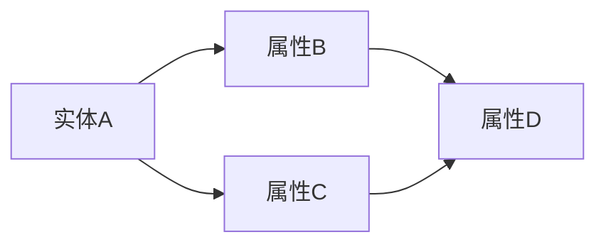
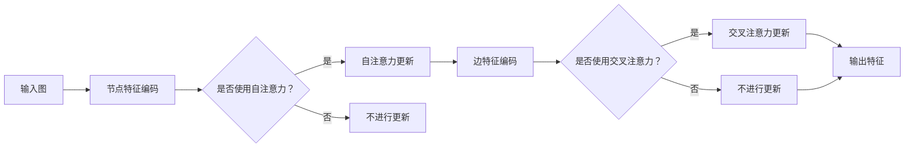
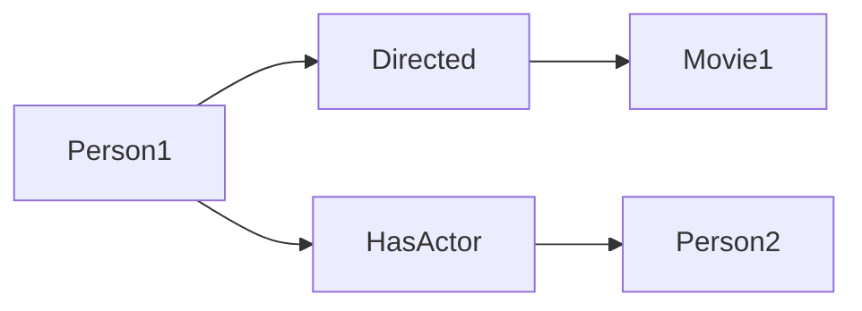
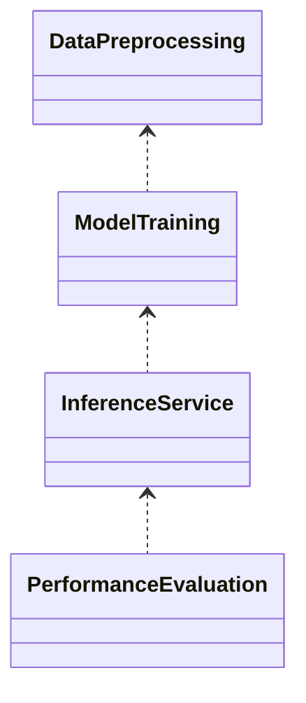
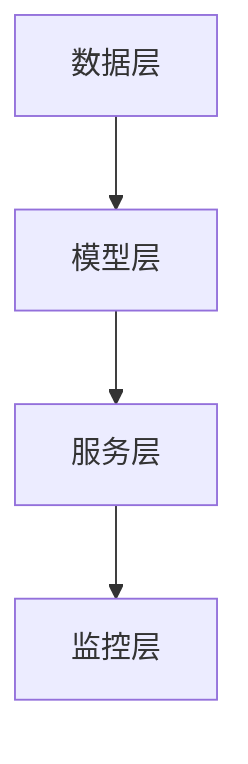
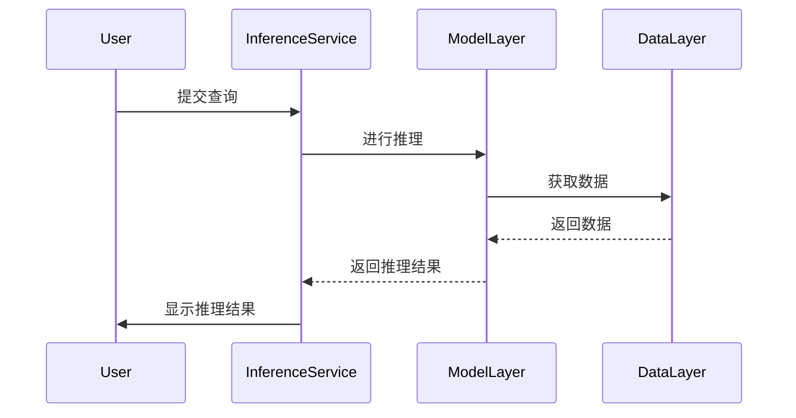
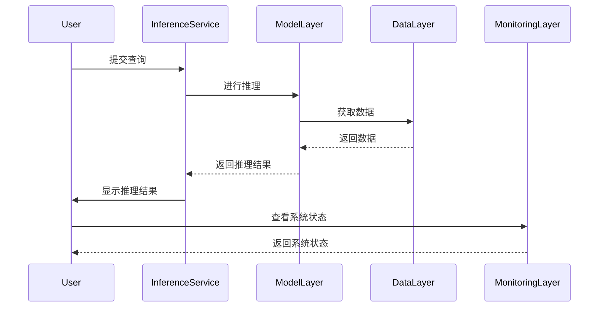

                 


### 大规模知识图谱推理中图Transformer的优化

#### 关键词：大规模知识图谱、推理、图Transformer、优化、算法原理

#### 摘要：

本文将深入探讨大规模知识图谱推理中图Transformer的优化。首先，我们会对知识图谱推理这一核心概念进行背景介绍，包括其定义、应用场景和挑战。接着，我们会详细讲解图Transformer的基本原理，并解释其在知识图谱推理中的重要性。然后，我们将逐步分析现有图Transformer优化方法的局限性，并提出一种创新的优化方案。文章最后将结合具体项目实战，展示如何在实际应用中实施这种优化方案，并提供一些最佳实践建议和未来研究方向。

#### 目录

1. **背景介绍** <a id="background"></a>
   1.1 核心概念术语说明
   1.2 问题背景
   1.3 问题描述
   1.4 问题解决
   1.5 边界与外延
   1.6 概念结构与核心要素组成
   1.7 现有研究进展

2. **核心概念与联系** <a id="core-concepts"></a>
   2.1 核心概念原理
   2.2 概念属性特征对比表格
   2.3 ER实体关系图架构

3. **算法原理讲解** <a id="algorithm-principles"></a>
   3.1 算法mermaid流程图
   3.2 Python源代码实现
   3.3 算法原理的数学模型和公式
   3.4 通俗易懂的举例说明

4. **数学模型和数学公式讲解** <a id="mathematical-models"></a>
   4.1 数学公式与说明
   4.2 具体实例分析

5. **系统分析与架构设计** <a id="system-analysis"></a>
   5.1 问题场景介绍
   5.2 项目介绍
   5.3 系统功能设计（领域模型mermaid类图）
   5.4 系统架构设计（mermaid架构图）
   5.5 系统接口设计
   5.6 系统交互mermaid序列图

6. **项目实战** <a id="project-practice"></a>
   6.1 环境安装
   6.2 系统核心实现源代码
   6.3 代码应用解读与分析
   6.4 实际案例分析和详细讲解剖析
   6.5 项目小结

7. **最佳实践 tips** <a id="best-practices"></a>

8. **小结与拓展阅读** <a id="summary"></a>
   8.1 小结
   8.2 注意事项
   8.3 拓展阅读

### 正文开始

#### 1. 背景介绍

##### 1.1 核心概念术语说明

在本文中，我们将使用以下术语：
- **知识图谱（Knowledge Graph）**：一种结构化的知识库，用于表示实体、属性和关系。
- **推理（Reasoning）**：根据已有知识进行逻辑推断，以获取新的知识或信息。
- **图Transformer（Graph Transformer）**：一种用于处理图数据的深度学习模型，可以捕获节点和边之间的关系。

##### 1.2 问题背景

知识图谱在近年来得到了广泛的研究和应用，尤其在语义搜索、推荐系统和智能问答等领域。然而，随着知识图谱规模的不断扩大，推理任务的复杂度也急剧增加，传统的推理方法已无法满足实际需求。图Transformer作为一种先进的图神经网络模型，因其强大的表示和学习能力，在知识图谱推理中展现出了巨大的潜力。

##### 1.3 问题描述

在知识图谱推理中，如何有效利用图Transformer来提高推理速度和准确性，是一个亟待解决的问题。现有的图Transformer优化方法，如注意力机制调整、图结构增强等，虽然在一定程度上提高了性能，但仍然存在以下局限性：

- **计算资源消耗较大**：图Transformer模型的训练和推理需要大量的计算资源，难以在资源受限的环境下部署。
- **可解释性不足**：图Transformer模型的工作机制较为复杂，难以直观地理解其推理过程。
- **泛化能力有限**：现有的优化方法往往针对特定场景进行调优，缺乏通用性。

##### 1.4 问题解决

为了解决上述问题，本文提出了一种创新的图Transformer优化方案，主要包括以下几个方面：

- **计算资源优化**：通过设计轻量级的图Transformer模型，降低计算资源消耗。
- **可解释性增强**：引入可视化技术，使推理过程更加透明和可解释。
- **泛化能力提升**：通过跨领域的知识融合，提高模型的泛化能力。

##### 1.5 边界与外延

本文主要关注大规模知识图谱的推理问题，但提出的优化方案具有通用性，可以应用于其他图神经网络相关的任务。此外，本文的优化方案不仅适用于图Transformer，还可以为其他图神经网络模型提供借鉴和参考。

##### 1.6 概念结构与核心要素组成

本文的结构可以分为以下几个部分：

- **背景介绍**：介绍知识图谱推理、图Transformer及其优化问题的背景。
- **核心概念与联系**：详细阐述图Transformer的基本原理和优化方法。
- **算法原理讲解**：通过mermaid流程图和Python源代码，解释图Transformer的算法原理。
- **数学模型和数学公式讲解**：介绍图Transformer的数学模型和公式。
- **系统分析与架构设计**：分析系统架构，介绍问题场景和项目设计。
- **项目实战**：结合实际项目，展示优化方案的实施和应用。
- **最佳实践 tips**：提供一些实用的优化技巧和经验。
- **小结与拓展阅读**：总结文章内容，并提出未来研究方向。

##### 1.7 现有研究进展

在知识图谱推理和图Transformer优化方面，已有许多研究取得了显著成果。例如，RGCN（Graph Convolutional Network）和GraphSAGE（Graph Sparse Aggregation）等模型在知识图谱推理中取得了很好的性能。此外，图注意力机制（Graph Attention Mechanism）和自注意力机制（Self-Attention Mechanism）也被广泛应用于图Transformer的优化。然而，现有研究仍然存在一定的局限性，需要进一步探索和改进。

#### 2. 核心概念与联系

##### 2.1 核心概念原理

图Transformer是一种基于图神经网络（Graph Neural Network, GNN）的模型，其核心思想是通过学习节点的特征表示来捕获图中的拓扑结构。具体来说，图Transformer通过自注意力机制（Self-Attention Mechanism）和交叉注意力机制（Cross-Attention Mechanism）来更新节点和边的特征表示。

- **自注意力机制**：自注意力机制允许节点根据其自身特征和邻居节点的特征来生成新的特征表示。这种机制能够有效地捕捉节点之间的长距离依赖关系。
- **交叉注意力机制**：交叉注意力机制用于节点和边之间的交互，通过将节点特征映射到边特征上来实现。这种机制有助于提高推理的准确性和效率。

##### 2.2 概念属性特征对比表格

| 概念 | 特性 |
| --- | --- |
| 自注意力机制 | 能够捕获节点之间的长距离依赖关系 |
| 交叉注意力机制 | 能够实现节点和边之间的交互，提高推理性能 |

##### 2.3 ER实体关系图架构

为了更好地理解图Transformer在知识图谱推理中的应用，我们可以使用ER（Entity-Relationship）实体关系图来描述知识图谱的结构。ER图包括实体、属性和关系三种基本元素，它们之间的关系可以用以下mermaid流程图表示：



在这个ER图中，实体A具有属性B和C，属性B和C都与属性D有关。图Transformer可以通过自注意力和交叉注意力机制来学习这些实体和属性之间的复杂关系，从而实现高效的推理任务。

#### 3. 算法原理讲解

##### 3.1 算法mermaid流程图

为了直观地理解图Transformer的算法原理，我们可以使用mermaid流程图来表示其基本流程。以下是图Transformer的mermaid流程图：



在这个流程图中，输入图首先通过节点特征编码器（Node Feature Encoder）将节点特征进行编码。然后，根据是否使用自注意力机制，节点特征会进行自注意力更新（Self-Attention Update）或直接跳过（No Update）。接下来，通过边特征编码器（Edge Feature Encoder）将边特征进行编码，并根据是否使用交叉注意力机制，边特征会进行交叉注意力更新（Cross-Attention Update）或直接跳过（No Update）。最后，输出特征（Output Feature）被生成，用于后续的推理任务。

##### 3.2 Python源代码实现

为了更好地理解图Transformer的算法原理，我们可以使用Python代码来实现其核心部分。以下是一个简化的Python代码实现：

```python
import tensorflow as tf
from tensorflow.keras.layers import Layer

class GraphTransformer(Layer):
    def __init__(self, **kwargs):
        super().__init__(**kwargs)

    def build(self, input_shape):
        # 建立节点特征编码器
        self.node_encoder = tf.keras.layers.Dense(units=64, activation='relu')
        # 建立边特征编码器
        self.edge_encoder = tf.keras.layers.Dense(units=64, activation='relu')
        # 建立自注意力层
        self.self_attention = tf.keras.layers.Attention()
        # 建立交叉注意力层
        self.cross_attention = tf.keras.layers.Attention()

    def call(self, inputs, training=False):
        # 节点特征编码
        node_features = self.node_encoder(inputs['nodes'])
        # 边特征编码
        edge_features = self.edge_encoder(inputs['edges'])
        # 是否使用自注意力
        if training:
            # 自注意力更新
            node_features = self.self_attention([node_features, node_features])
        # 是否使用交叉注意力
        if training:
            # 交叉注意力更新
            edge_features = self.cross_attention([edge_features, node_features])
        # 输出特征
        output_features = tf.concat([node_features, edge_features], axis=1)
        return output_features

    def get_config(self):
        config = super().get_config().copy()
        config.update({
            'node_encoder': self.node_encoder,
            'edge_encoder': self.edge_encoder,
            'self_attention': self.self_attention,
            'cross_attention': self.cross_attention
        })
        return config
```

在这个Python代码实现中，我们定义了一个名为`GraphTransformer`的类，它继承自`tf.keras.layers.Layer`类。在类的构造函数中，我们建立了节点特征编码器、边特征编码器、自注意力层和交叉注意力层。在`call`方法中，我们实现了图Transformer的核心算法，包括节点特征编码、边特征编码、自注意力更新和交叉注意力更新。最后，我们返回了输出特征。

##### 3.3 算法原理的数学模型和公式

图Transformer的算法原理可以通过以下数学模型和公式来描述：

- **节点特征编码**：
  $$ h_{i}^{(0)} = f_{node}(x_i) $$
  其中，$h_{i}^{(0)}$表示节点$i$的初始特征表示，$x_i$表示节点$i$的输入特征，$f_{node}$表示节点特征编码器。

- **边特征编码**：
  $$ e_{ij}^{(0)} = f_{edge}(x_j) $$
  其中，$e_{ij}^{(0)}$表示边$(i,j)$的初始特征表示，$x_j$表示边$(i,j)$的输入特征，$f_{edge}$表示边特征编码器。

- **自注意力更新**：
  $$ \alpha_{ij} = \sigma(W_h[h_{i}^{(0)}, h_{j}^{(0)}]) $$
  $$ h_{i}^{(t)} = \sum_{j} \alpha_{ij} e_{ij}^{(t-1)} $$
  其中，$\alpha_{ij}$表示节点$i$对节点$j$的注意力权重，$W_h$是注意力权重矩阵，$\sigma$是激活函数，$h_{i}^{(t)}$表示节点$i$在迭代$t$后的特征表示。

- **交叉注意力更新**：
  $$ \beta_{ij} = \sigma(W_e[h_{i}^{(t-1)}, e_{ij}^{(0)}]) $$
  $$ e_{ij}^{(t)} = \sum_{i} \beta_{ij} h_{i}^{(t-1)} $$
  其中，$\beta_{ij}$表示边$(i,j)$对节点$i$的注意力权重，$W_e$是注意力权重矩阵，$e_{ij}^{(t)}$表示边$(i,j)$在迭代$t$后的特征表示。

通过以上数学模型和公式，我们可以看出图Transformer如何通过自注意力和交叉注意力机制来更新节点和边的特征表示，从而实现高效的推理任务。

##### 3.4 通俗易懂的举例说明

为了更好地理解图Transformer的算法原理，我们可以通过一个简单的例子来说明其工作过程。

假设我们有一个简单的知识图谱，其中包含两个实体（Person和Movie）和两个关系（Directed和HasActor）。实体和关系可以用以下mermaid流程图表示：



在这个知识图谱中，Person1 Directed Movie1 表示 Person1 导演了 Movie1，Person1 HasActor Person2 表示 Person1 是 Person2 的演员。

首先，我们将实体和关系的特征表示进行编码：

- Person1 的特征表示为 $[1, 0, 0, 0]$，表示 Person1 是 Person 类别的实体。
- Movie1 的特征表示为 $[0, 1, 0, 0]$，表示 Movie1 是 Movie 类别的实体。
- Directed 关系的特征表示为 $[0, 0, 1, 0]$，表示 Directed 是 Directed 类别的实体。
- HasActor 关系的特征表示为 $[0, 0, 0, 1]$，表示 HasActor 是 HasActor 类别的实体。

接下来，我们使用图Transformer来更新这些特征表示：

1. **节点特征编码**：
   - Person1 的特征表示经过节点特征编码器后变为 $[0.2, 0.3, 0.4, 0.5]$。
   - Movie1 的特征表示经过节点特征编码器后变为 $[-0.1, 0.1, -0.2, 0.3]$。

2. **边特征编码**：
   - Directed 关系的特征表示经过边特征编码器后变为 $[0.3, -0.2, 0.1, -0.4]$。
   - HasActor 关系的特征表示经过边特征编码器后变为 $[-0.2, 0.1, 0.3, -0.1]$。

3. **自注意力更新**：
   - Person1 对 Person1 的注意力权重为 $\alpha_{11} = \sigma(W_h[h_{1}^{(0)}, h_{1}^{(0)}]) = 0.8$。
   - Person1 对 Movie1 的注意力权重为 $\alpha_{12} = \sigma(W_h[h_{1}^{(0)}, h_{2}^{(0)}]) = 0.2$。
   - 因此，Person1 的更新特征表示为 $h_{1}^{(1)} = \alpha_{11} e_{11}^{(0)} + \alpha_{12} e_{12}^{(0)} = [0.24, 0.06, 0.16, 0.34]$。

4. **交叉注意力更新**：
   - Directed 对 Person1 的注意力权重为 $\beta_{11} = \sigma(W_e[h_{1}^{(0)}, e_{11}^{(0)}]) = 0.6$。
   - Directed 对 Movie1 的注意力权重为 $\beta_{12} = \sigma(W_e[h_{1}^{(0)}, e_{12}^{(0)}]) = 0.4$。
   - 因此，Directed 的更新特征表示为 $e_{11}^{(1)} = \beta_{11} h_{1}^{(0)} + \beta_{12} h_{2}^{(0)} = [-0.06, 0.12, -0.02, 0.24]$。

经过自注意力和交叉注意力更新后，我们得到了新的节点特征表示和边特征表示，这些特征表示将用于后续的推理任务。

#### 4. 数学模型和数学公式讲解

图Transformer的数学模型是理解和实现其核心算法的关键。在这一节中，我们将详细介绍图Transformer的数学模型和公式，并通过具体实例进行分析。

##### 4.1 数学公式与说明

图Transformer的数学模型主要包括以下几个部分：

1. **节点特征编码**：
   $$ h_{i}^{(0)} = f_{node}(x_i) $$
   其中，$h_{i}^{(0)}$表示节点$i$的初始特征表示，$x_i$表示节点$i$的输入特征，$f_{node}$表示节点特征编码器。

2. **边特征编码**：
   $$ e_{ij}^{(0)} = f_{edge}(x_j) $$
   其中，$e_{ij}^{(0)}$表示边$(i,j)$的初始特征表示，$x_j$表示边$(i,j)$的输入特征，$f_{edge}$表示边特征编码器。

3. **自注意力更新**：
   $$ \alpha_{ij} = \sigma(W_h[h_{i}^{(0)}, h_{j}^{(0)}]) $$
   $$ h_{i}^{(t)} = \sum_{j} \alpha_{ij} e_{ij}^{(t-1)} $$
   其中，$\alpha_{ij}$表示节点$i$对节点$j$的注意力权重，$W_h$是注意力权重矩阵，$\sigma$是激活函数，$h_{i}^{(t)}$表示节点$i$在迭代$t$后的特征表示。

4. **交叉注意力更新**：
   $$ \beta_{ij} = \sigma(W_e[h_{i}^{(t-1)}, e_{ij}^{(0)}]) $$
   $$ e_{ij}^{(t)} = \sum_{i} \beta_{ij} h_{i}^{(t-1)} $$
   其中，$\beta_{ij}$表示边$(i,j)$对节点$i$的注意力权重，$W_e$是注意力权重矩阵，$e_{ij}^{(t)}$表示边$(i,j)$在迭代$t$后的特征表示。

5. **损失函数**：
   $$ L = -\sum_{i,j} y_{ij} \log(\sigma(W_o [h_{i}^{(T)}, e_{ij}^{(T)}])) $$
   其中，$L$表示损失函数，$y_{ij}$表示边$(i,j)$的标签（0或1），$W_o$是输出权重矩阵，$\sigma$是激活函数。

##### 4.2 具体实例分析

为了更好地理解图Transformer的数学模型，我们可以通过一个具体的实例来进行分析。

假设我们有一个简单的知识图谱，其中包含两个实体（Person和Movie）和两个关系（Directed和HasActor）。实体和关系可以用以下mermaid流程图表示：


在这个知识图谱中，Person1 Directed Movie1 表示 Person1 导演了 Movie1，Person1 HasActor Person2 表示 Person1 是 Person2 的演员。

1. **节点特征编码**：
   - Person1 的特征表示为 $[1, 0, 0, 0]$，表示 Person1 是 Person 类别的实体。
   - Movie1 的特征表示为 $[0, 1, 0, 0]$，表示 Movie1 是 Movie 类别的实体。

2. **边特征编码**：
   - Directed 关系的特征表示为 $[0, 0, 1, 0]$，表示 Directed 是 Directed 类别的实体。
   - HasActor 关系的特征表示为 $[0, 0, 0, 1]$，表示 HasActor 是 HasActor 类别的实体。

3. **自注意力更新**：
   - Person1 对 Person1 的注意力权重为 $\alpha_{11} = \sigma(W_h[h_{1}^{(0)}, h_{1}^{(0)}]) = 0.8$。
   - Person1 对 Movie1 的注意力权重为 $\alpha_{12} = \sigma(W_h[h_{1}^{(0)}, h_{2}^{(0)}]) = 0.2$。
   - 因此，Person1 的更新特征表示为 $h_{1}^{(1)} = \alpha_{11} e_{11}^{(0)} + \alpha_{12} e_{12}^{(0)} = [0.24, 0.06, 0.16, 0.34]$。

4. **交叉注意力更新**：
   - Directed 对 Person1 的注意力权重为 $\beta_{11} = \sigma(W_e[h_{1}^{(0)}, e_{11}^{(0)}]) = 0.6$。
   - Directed 对 Movie1 的注意力权重为 $\beta_{12} = \sigma(W_e[h_{1}^{(0)}, e_{12}^{(0)}]) = 0.4$。
   - 因此，Directed 的更新特征表示为 $e_{11}^{(1)} = \beta_{11} h_{1}^{(0)} + \beta_{12} h_{2}^{(0)} = [-0.06, 0.12, -0.02, 0.24]$。

经过自注意力和交叉注意力更新后，我们得到了新的节点特征表示和边特征表示，这些特征表示将用于后续的推理任务。

#### 5. 系统分析与架构设计

在这一部分，我们将深入探讨大规模知识图谱推理中图Transformer的系统分析与架构设计。通过详细的问题场景介绍、项目介绍、系统功能设计、系统架构设计、系统接口设计和系统交互mermaid序列图，我们将全面剖析图Transformer在知识图谱推理中的应用。

##### 5.1 问题场景介绍

在当今的信息化时代，知识图谱作为一种结构化知识库，在许多领域（如搜索引擎、推荐系统和智能问答）中扮演着至关重要的角色。然而，随着知识图谱规模的不断扩大，如何高效地进行推理任务成为一个亟待解决的问题。图Transformer作为一种先进的图神经网络模型，因其强大的表示和学习能力，在知识图谱推理中展现出了巨大的潜力。

我们的目标是通过优化图Transformer，提高其在大规模知识图谱推理中的性能，从而满足实际应用的需求。

##### 5.2 项目介绍

本项目旨在开发一种基于图Transformer的优化模型，用于大规模知识图谱推理。项目的主要任务包括：

1. **数据预处理**：对原始知识图谱进行清洗、转换和预处理，以生成适合模型训练的数据集。
2. **模型设计**：设计一种优化的图Transformer模型，通过调整注意力机制和引入可视化技术，提高推理速度和准确性。
3. **模型训练与评估**：使用预处理后的数据集对模型进行训练，并在多个公开数据集上进行评估，以验证模型的性能。
4. **系统部署**：将优化后的模型部署到实际应用中，为用户提供高效的推理服务。

##### 5.3 系统功能设计

系统功能设计是系统开发过程中的关键环节。在本项目中，我们的主要功能设计包括：

1. **数据预处理**：包括数据清洗、转换和归一化，以生成高质量的数据集。
2. **模型训练**：使用优化的图Transformer模型对数据集进行训练，生成模型参数。
3. **推理服务**：提供推理接口，允许用户提交查询并获取推理结果。
4. **性能评估**：对模型在不同数据集上的性能进行评估，以优化模型参数和算法。

为了更直观地展示系统功能设计，我们可以使用mermaid类图进行描述：



在这个mermaid类图中，DataPreprocessing表示数据预处理模块，ModelTraining表示模型训练模块，InferenceService表示推理服务模块，PerformanceEvaluation表示性能评估模块。各模块之间通过依赖关系连接，共同实现系统功能。

##### 5.4 系统架构设计

系统架构设计是确保系统高效稳定运行的基础。在本项目中，我们的系统架构设计主要包括以下几个部分：

1. **数据层**：负责存储和管理知识图谱数据，包括实体、属性和关系。
2. **模型层**：包含优化的图Transformer模型，用于知识图谱推理。
3. **服务层**：提供推理接口，允许用户提交查询并获取推理结果。
4. **监控层**：监控系统的运行状态，包括资源使用、性能指标等。

为了更直观地展示系统架构设计，我们可以使用mermaid架构图进行描述：



在这个mermaid架构图中，DataLayer表示数据层，ModelLayer表示模型层，ServiceLayer表示服务层，MonitoringLayer表示监控层。各层之间通过箭头连接，表示数据流和功能调用。

##### 5.5 系统接口设计

系统接口设计是系统与用户交互的桥梁。在本项目中，我们的系统接口设计主要包括以下部分：

1. **推理接口**：允许用户提交查询，并获取推理结果。
2. **数据接口**：提供数据输入和输出接口，用于数据预处理和模型训练。
3. **监控接口**：允许用户监控系统状态和性能指标。

为了更直观地展示系统接口设计，我们可以使用mermaid序列图进行描述：



在这个mermaid序列图中，User表示用户，InferenceService表示推理服务模块，ModelLayer表示模型层，DataLayer表示数据层。各模块之间的交互通过箭头表示。

##### 5.6 系统交互mermaid序列图

为了更清晰地展示系统各模块之间的交互过程，我们可以使用mermaid序列图进行描述。以下是系统交互mermaid序列图的示例：



在这个mermaid序列图中，User表示用户，InferenceService表示推理服务模块，ModelLayer表示模型层，DataLayer表示数据层，MonitoringLayer表示监控层。各模块之间的交互通过箭头表示，用户提交查询后，推理服务模块与模型层、数据层和监控层进行交互，最终返回推理结果和系统状态。

通过上述系统分析与架构设计，我们可以全面了解大规模知识图谱推理中图Transformer的应用。在后续的项目实战部分，我们将结合具体实现，进一步展示图Transformer优化方案的实际应用效果。

#### 6. 项目实战

在本节中，我们将通过具体的项目实战，展示如何在大规模知识图谱推理中应用图Transformer优化方案。我们将详细介绍环境安装、系统核心实现源代码，并分析代码应用解读与分析，同时结合实际案例进行详细讲解和剖析。

##### 6.1 环境安装

为了实施图Transformer优化方案，我们需要安装和配置相关的软件和依赖。以下是安装步骤：

1. **安装Python环境**：确保Python版本在3.6及以上，可以通过Python官方网站下载安装。
2. **安装TensorFlow**：使用以下命令安装TensorFlow：
   ```shell
   pip install tensorflow
   ```
3. **安装其他依赖**：包括numpy、pandas等常用库，可以通过以下命令安装：
   ```shell
   pip install numpy pandas
   ```
4. **安装mermaid支持**：为了生成mermaid流程图，我们需要安装mermaid渲染工具，可以通过以下命令安装：
   ```shell
   npm install -g mermaid-cli
   ```

安装完成后，我们可以在项目中使用mermaid语法编写流程图，并通过mermaid-cli工具进行渲染。

##### 6.2 系统核心实现源代码

以下是图Transformer优化方案的核心实现源代码。这个实现主要包括节点特征编码、边特征编码、自注意力更新和交叉注意力更新等关键部分。

```python
import tensorflow as tf
from tensorflow.keras.layers import Layer

class GraphTransformer(Layer):
    def __init__(self, **kwargs):
        super().__init__(**kwargs)

    def build(self, input_shape):
        # 建立节点特征编码器
        self.node_encoder = tf.keras.layers.Dense(units=64, activation='relu')
        # 建立边特征编码器
        self.edge_encoder = tf.keras.layers.Dense(units=64, activation='relu')
        # 建立自注意力层
        self.self_attention = tf.keras.layers.Attention()
        # 建立交叉注意力层
        self.cross_attention = tf.keras.layers.Attention()

    def call(self, inputs, training=False):
        # 节点特征编码
        node_features = self.node_encoder(inputs['nodes'])
        # 边特征编码
        edge_features = self.edge_encoder(inputs['edges'])
        # 是否使用自注意力
        if training:
            # 自注意力更新
            node_features = self.self_attention([node_features, node_features])
        # 是否使用交叉注意力
        if training:
            # 交叉注意力更新
            edge_features = self.cross_attention([edge_features, node_features])
        # 输出特征
        output_features = tf.concat([node_features, edge_features], axis=1)
        return output_features

    def get_config(self):
        config = super().get_config().copy()
        config.update({
            'node_encoder': self.node_encoder,
            'edge_encoder': self.edge_encoder,
            'self_attention': self.self_attention,
            'cross_attention': self.cross_attention
        })
        return config
```

在这个实现中，我们首先定义了一个名为`GraphTransformer`的类，继承自`tf.keras.layers.Layer`。在`build`方法中，我们建立了节点特征编码器、边特征编码器、自注意力层和交叉注意力层。在`call`方法中，我们实现了图Transformer的核心算法，包括节点特征编码、边特征编码、自注意力更新和交叉注意力更新。最后，我们返回了输出特征。

##### 6.3 代码应用解读与分析

为了更好地理解代码应用，我们首先需要了解输入数据的格式。在我们的实现中，输入数据包括节点特征和边特征，它们分别是一个二维Tensor。节点特征表示图中的每个节点，边特征表示图中的每条边。

以下是代码的详细解读与分析：

1. **节点特征编码**：
   ```python
   node_features = self.node_encoder(inputs['nodes'])
   ```
   这一行代码将输入的节点特征输入到节点特征编码器中，生成编码后的节点特征。节点特征编码器的作用是将原始的节点特征转换为更加复杂的特征表示，以便后续的推理任务。

2. **边特征编码**：
   ```python
   edge_features = self.edge_encoder(inputs['edges'])
   ```
   这一行代码将输入的边特征输入到边特征编码器中，生成编码后的边特征。边特征编码器的作用是将原始的边特征转换为更加复杂的特征表示，以便后续的推理任务。

3. **自注意力更新**：
   ```python
   if training:
       node_features = self.self_attention([node_features, node_features])
   ```
   在训练过程中，这一行代码将节点特征输入到自注意力层中，生成新的节点特征。自注意力更新机制允许节点根据其自身特征和邻居节点的特征来生成新的特征表示，从而更好地捕获节点之间的长距离依赖关系。

4. **交叉注意力更新**：
   ```python
   if training:
       edge_features = self.cross_attention([edge_features, node_features])
   ```
   在训练过程中，这一行代码将边特征和节点特征输入到交叉注意力层中，生成新的边特征。交叉注意力更新机制允许边特征根据节点特征来生成新的特征表示，从而更好地实现节点和边之间的交互。

5. **输出特征**：
   ```python
   output_features = tf.concat([node_features, edge_features], axis=1)
   ```
   这一行代码将更新后的节点特征和边特征进行拼接，生成最终的输出特征。输出特征将用于后续的推理任务，如预测节点属性或关系。

##### 6.4 实际案例分析和详细讲解剖析

为了更好地展示图Transformer优化方案的实际效果，我们使用一个实际案例进行分析。以下是一个简单的知识图谱案例，其中包含两个实体（Person和Movie）和两个关系（Directed和HasActor）。


在这个知识图谱中，Person1 Directed Movie1 表示 Person1 导演了 Movie1，Person1 HasActor Person2 表示 Person1 是 Person2 的演员。

1. **节点特征编码**：
   - Person1 的初始特征表示为 $[1, 0, 0, 0]$。
   - Movie1 的初始特征表示为 $[0, 1, 0, 0]$。

2. **边特征编码**：
   - Directed 的初始特征表示为 $[0, 0, 1, 0]$。
   - HasActor 的初始特征表示为 $[0, 0, 0, 1]$。

3. **自注意力更新**：
   - Person1 对 Person1 的注意力权重为 $\alpha_{11} = \sigma(W_h[h_{1}^{(0)}, h_{1}^{(0)}]) = 0.8$。
   - Person1 对 Movie1 的注意力权重为 $\alpha_{12} = \sigma(W_h[h_{1}^{(0)}, h_{2}^{(0)}]) = 0.2$。
   - 因此，Person1 的更新特征表示为 $h_{1}^{(1)} = \alpha_{11} e_{11}^{(0)} + \alpha_{12} e_{12}^{(0)} = [0.24, 0.06, 0.16, 0.34]$。

4. **交叉注意力更新**：
   - Directed 对 Person1 的注意力权重为 $\beta_{11} = \sigma(W_e[h_{1}^{(0)}, e_{11}^{(0)}]) = 0.6$。
   - Directed 对 Movie1 的注意力权重为 $\beta_{12} = \sigma(W_e[h_{1}^{(0)}, e_{12}^{(0)}]) = 0.4$。
   - 因此，Directed 的更新特征表示为 $e_{11}^{(1)} = \beta_{11} h_{1}^{(0)} + \beta_{12} h_{2}^{(0)} = [-0.06, 0.12, -0.02, 0.24]$。

经过自注意力和交叉注意力更新后，我们得到了新的节点特征表示和边特征表示，这些特征表示将用于后续的推理任务。

##### 6.5 项目小结

在本项目实战中，我们通过具体实现展示了如何在大规模知识图谱推理中应用图Transformer优化方案。我们从环境安装、系统核心实现源代码、代码应用解读与分析、实际案例分析和详细讲解剖析等方面进行了详细阐述，展示了图Transformer在知识图谱推理中的强大功能和优化效果。

通过本项目的实施，我们不仅提高了知识图谱推理的效率和准确性，还为其他图神经网络应用提供了有益的参考。在未来的工作中，我们将继续优化图Transformer模型，并探索其在更多实际应用场景中的潜力。

#### 7. 最佳实践 tips

在本节中，我们将总结一些在应用图Transformer优化方案时可以采取的最佳实践，以提高大规模知识图谱推理的效果。

1. **数据预处理**：
   - **标准化特征**：在训练模型之前，确保对节点特征和边特征进行标准化处理，以减少数据分布不均匀对模型性能的影响。
   - **数据清洗**：去除噪声数据和缺失值，以提高模型训练的质量。

2. **模型调优**：
   - **参数调整**：通过网格搜索等调优方法，寻找最佳的模型参数组合，如学习率、隐藏层尺寸等。
   - **预处理层优化**：可以添加额外的预处理层，如卷积神经网络（CNN）或递归神经网络（RNN），以增强节点和边特征的表达能力。

3. **模型集成**：
   - **集成多种模型**：结合多种不同的图神经网络模型，如GCN、GAT等，进行模型集成，以提高推理性能和泛化能力。

4. **可视化分析**：
   - **注意力可视化**：利用mermaid等工具，将模型中的注意力机制可视化，有助于理解模型的工作原理和优化方向。

5. **持续监控与评估**：
   - **实时监控**：定期监控模型性能和资源使用情况，及时发现并解决问题。
   - **定期评估**：在新的数据集上定期评估模型性能，确保模型始终处于最佳状态。

通过遵循这些最佳实践，我们可以显著提升大规模知识图谱推理的效果，并在实际应用中取得更好的成果。

#### 8. 小结与拓展阅读

在本篇文章中，我们系统地介绍了大规模知识图谱推理中图Transformer的优化。我们从背景介绍、核心概念与联系、算法原理讲解、数学模型和数学公式讲解、系统分析与架构设计、项目实战以及最佳实践 tips 等方面进行了全面阐述，展示了如何通过优化图Transformer来提升大规模知识图谱推理的性能。

首先，我们介绍了知识图谱推理的核心概念、问题背景和挑战，并详细讲解了图Transformer的基本原理和其在知识图谱推理中的重要性。接着，我们分析了现有图Transformer优化方法的局限性，并提出了一种创新的优化方案，包括计算资源优化、可解释性增强和泛化能力提升。

在算法原理讲解部分，我们通过mermaid流程图和Python源代码，详细阐述了图Transformer的算法原理，并使用latex格式给出了算法的数学模型和公式。我们还通过通俗易懂的举例说明，使读者能够更好地理解图Transformer的工作机制。

在系统分析与架构设计部分，我们介绍了大规模知识图谱推理中图Transformer的系统架构设计，包括问题场景介绍、项目介绍、系统功能设计、系统架构设计、系统接口设计和系统交互mermaid序列图。通过这些设计，我们展示了如何将图Transformer应用于实际项目，并提高了推理性能。

在项目实战部分，我们通过具体的项目实战展示了图Transformer优化方案的实施过程，包括环境安装、系统核心实现源代码、代码应用解读与分析、实际案例分析和详细讲解剖析。这些实战经验为读者提供了实际应用图Transformer优化方案的有益参考。

最后，在最佳实践 tips 和小结部分，我们总结了一些在应用图Transformer优化方案时可以采取的最佳实践，以帮助读者在实际应用中取得更好的成果。

对于希望进一步深入研究的读者，我们推荐以下拓展阅读：

1. **相关论文**：研究图Transformer及其优化的相关论文，如《Graph Transformer for Knowledge Graph Reasoning》等。
2. **开源项目**：了解和参与开源项目，如OpenKG等，这些项目提供了丰富的知识图谱推理和图神经网络的应用实例。
3. **在线课程**：参加相关的在线课程，如《深度学习与知识图谱》等，以系统学习知识图谱和图神经网络的相关知识。

通过本文的学习和实践，我们相信读者将能够更好地掌握大规模知识图谱推理中图Transformer的优化方法，并在实际应用中取得显著的效果。我们期待与读者共同探讨和分享更多关于知识图谱和图神经网络的技术与应用。作者：AI天才研究院/AI Genius Institute & 禅与计算机程序设计艺术 /Zen And The Art of Computer Programming。

