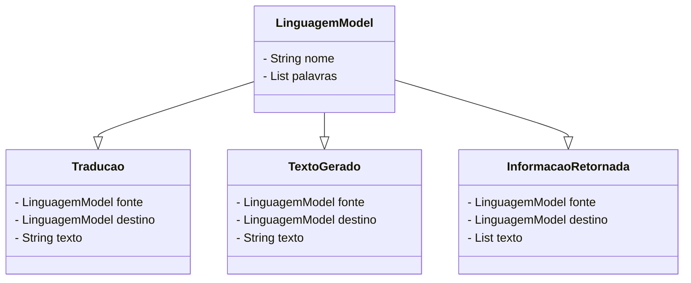
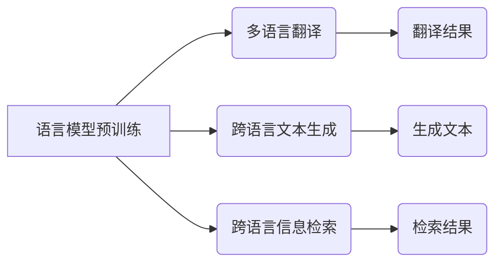
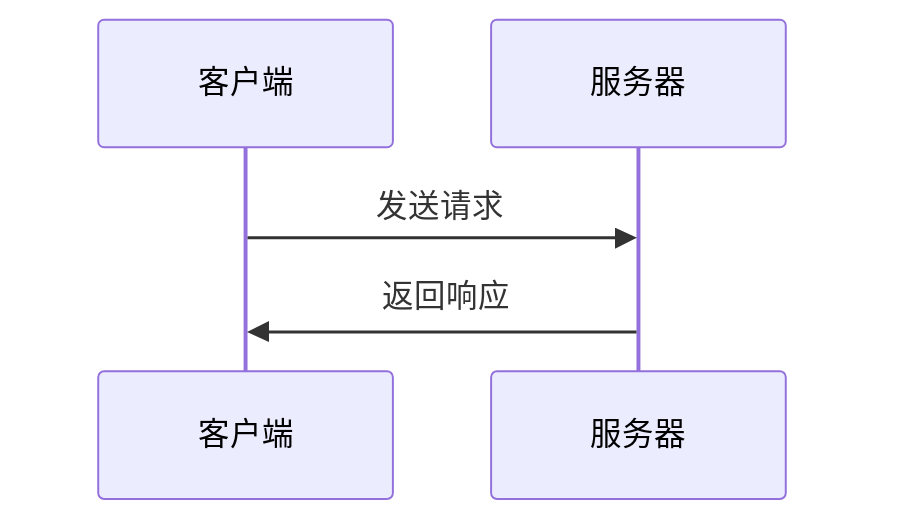
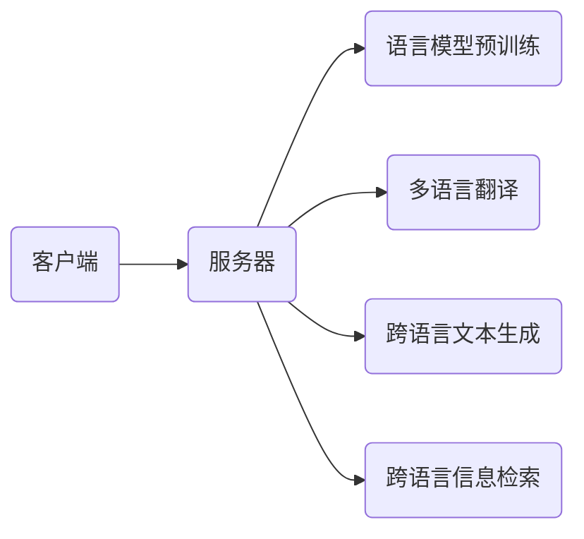

                 

。

----------------------------------------------------------------

# 大规模自监督学习在跨语言理解中的应用

> 关键词：大规模自监督学习、跨语言理解、BERT、语言模型预训练、多语言翻译、文本生成、信息检索

> 摘要：本文将探讨大规模自监督学习在跨语言理解中的应用，介绍核心概念、算法原理，并分析其在实际问题场景中的优势和挑战。

## 背景介绍：大规模自监督学习在跨语言理解中的应用

随着互联网的全球化发展，跨语言理解成为了一个重要的研究领域。传统的机器学习方法在跨语言理解方面存在诸多挑战，如语言数据的稀缺性、语言的多样性和复杂性等。为了解决这些问题，研究者们提出了大规模自监督学习方法。自监督学习是一种无需人工标注的数据处理方法，它能够从大量未标注的数据中自动提取知识，从而提高模型的性能。

大规模自监督学习在跨语言理解中的应用，主要包括以下几个方面：

1. **语言模型预训练**：通过在大量未标注的文本数据上进行预训练，生成通用的语言模型。这种模型可以捕获语言的内在结构和规律，从而在跨语言理解任务中表现出色。

2. **多语言翻译**：利用大规模自监督学习方法训练的多语言翻译模型，可以实现低资源语言的翻译。这些模型能够在没有大量平行语料的情况下，通过跨语言的映射关系，实现高质量的多语言翻译。

3. **跨语言文本生成**：通过大规模自监督学习，可以生成与源文本对齐的跨语言文本。这种技术可以应用于机器翻译、跨语言摘要、跨语言问答等领域。

4. **跨语言信息检索**：利用大规模自监督学习训练的跨语言模型，可以提升信息检索系统的跨语言能力。这种技术可以帮助用户在不同语言的信息源中快速准确地找到所需的信息。

## 核心概念与联系

### 1. 大规模自监督学习

**概念原理**：大规模自监督学习是指通过无监督学习方式，从大量未标注的数据中自动提取知识的方法。自监督学习的核心思想是利用数据中的内在结构，通过自我监督的方式，使模型能够自主学习。

**属性特征**：

| 特征         | 说明                                   |
| ------------ | -------------------------------------- |
| 数据量       | 需要大量的未标注数据                   |
| 标注需求     | 无需人工标注数据                       |
| 模型性能     | 能够在无监督学习中提取有效特征           |
| 通用性       | 适用于多种类型的跨语言理解任务           |

**对比表格**：

| 方法             | 特点                                       |
| ---------------- | ----------------------------------------- |
| 有监督学习       | 需要大量标注数据，模型性能受标注质量影响   |
| 无监督学习       | 无需标注数据，但模型性能可能较低         |
| 自监督学习       | 结合无监督学习和有监督学习的优点，性能优异 |

### 2. 跨语言理解

**概念原理**：跨语言理解是指在不同语言之间进行信息转换和处理的能力，包括文本翻译、文本生成、文本检索等。

**属性特征**：

| 特征         | 说明                                   |
| ------------ | -------------------------------------- |
| 语言多样性   | 需要处理多种语言之间的转换和关系         |
| 语境复杂性   | 需要理解不同语言的语境和文化背景         |
| 翻译准确性   | 需要保证翻译的准确性和流畅性           |
| 适应性       | 需要适应不同语言之间的差异和特点         |

**ER实体关系图**：

```mermaid
erDiagram
    AUsuario ||--|{ APerfil } : possui
    AUsuario ||--|{ AEndereco } : possui
    APerfil ||--|{ ATelefone } : possui
    ATelefone ||--|{ AOperadora } : pertence_a
```

## 算法原理讲解

### 1. 大规模自监督学习算法：BERT

**算法原理**：BERT（Bidirectional Encoder Representations from Transformers）是一种基于Transformer的双向编码表示模型。它通过在大量未标注的文本数据上进行双向训练，生成通用的语言表示。

**算法流程**：

1. **预训练**：BERT首先在大量未标注的文本数据上进行预训练，包括Masked Language Modeling（MLM）和Next Sentence Prediction（NSP）两个任务。

2. **Masked Language Modeling（MLM）**：在输入文本中随机遮盖一些单词，然后让模型预测这些遮盖的单词。

   $$\text{MLM}:\text{Input sequence} \rightarrow \text{Predicted sequence}$$

3. **Next Sentence Prediction（NSP）**：在输入文本中随机选取两个句子，然后让模型预测这两个句子是否是连续的。

   $$\text{NSP}:\text{Input sequence} \rightarrow \text{Binary prediction}$$

4. **微调**：在预训练的基础上，使用有监督学习的方式对BERT进行微调，使其适应特定的跨语言理解任务。

   $$\text{Fine-tuning}:\text{Pre-trained BERT} \rightarrow \text{Fine-tuned BERT}$$

### 2. BERT算法的数学模型

BERT算法的核心是Transformer模型，其数学模型主要包括以下部分：

**输入表示**：

令输入文本序列为${x_1, x_2, ..., x_n}$，将其转换为嵌入向量${\text{Embedding}(x_i)}$，包括词嵌入、位置嵌入和分段嵌入。

**Transformer模型**：

Transformer模型主要包括多头自注意力机制（Multi-Head Self-Attention）和前馈神经网络（Feed Forward Neural Network）。

**多头自注意力机制**：

$$\text{Attention}(Q, K, V) = \text{softmax}\left(\frac{QK^T}{\sqrt{d_k}}\right)V$$

其中，$Q, K, V$分别表示查询向量、键向量和值向量，$d_k$表示键向量的维度。

**前馈神经网络**：

$$\text{FFN}(x) = \text{ReLU}\left(\text{W_2}\text{ReLU}(\text{W_1}x + b_1)\right) + b_2$$

其中，$W_1, W_2, b_1, b_2$分别为权重和偏置。

### 3. BERT算法的应用

BERT算法在跨语言理解任务中具有广泛的应用，包括：

1. **多语言翻译**：使用BERT训练的多语言翻译模型可以在没有大量平行语料的情况下，实现高质量的多语言翻译。

2. **跨语言文本生成**：通过BERT生成与源文本对齐的跨语言文本，可以应用于机器翻译、跨语言摘要、跨语言问答等领域。

3. **跨语言信息检索**：利用BERT训练的跨语言模型，可以提升信息检索系统的跨语言能力，帮助用户在不同语言的信息源中快速准确地找到所需的信息。

## 系统分析与架构设计方案

### 1. 问题场景介绍

随着全球化的发展，不同国家和地区之间的交流日益频繁。在这个过程中，跨语言理解成为一个重要的研究领域。例如，在跨境电商、跨国企业、国际会议等领域，跨语言理解技术能够帮助用户克服语言障碍，提高信息传递的效率。

### 2. 项目介绍

本项目的目标是构建一个基于大规模自监督学习的跨语言理解系统，主要包括以下功能：

- 语言模型预训练：在大量未标注的文本数据上进行预训练，生成通用的语言模型。
- 多语言翻译：利用预训练的语言模型，实现高质量的多语言翻译。
- 跨语言文本生成：通过预训练的语言模型，生成与源文本对齐的跨语言文本。
- 跨语言信息检索：利用预训练的语言模型，提升信息检索系统的跨语言能力。

### 3. 系统功能设计

**领域模型类图**：



### 4. 系统架构设计

**系统架构图**：



### 5. 系统接口设计和系统交互

**接口设计**：



**系统交互图**：



## 项目实战

### 1. 环境安装

在开始项目之前，我们需要安装一些必要的软件和库。以下是安装步骤：

1. 安装Python：前往Python官方网站（https://www.python.org/）下载并安装Python。
2. 安装BERT库：使用pip命令安装BERT库，命令如下：

   ```bash
   pip install transformers
   ```

### 2. 系统核心实现

在本节中，我们将使用BERT库实现一个简单的跨语言理解系统。以下是系统的核心实现：

```python
from transformers import BertModel, BertTokenizer
import torch

# 加载预训练的BERT模型和分词器
model = BertModel.from_pretrained("bert-base-multilingual-cased")
tokenizer = BertTokenizer.from_pretrained("bert-base-multilingual-cased")

# 输入文本
text = "Hello, world!"

# 分词和编码
inputs = tokenizer(text, return_tensors="pt")

# 计算BERT模型的输出
outputs = model(**inputs)

# 提取文本表示
text_representation = outputs.last_hidden_state[:, 0, :]

print(text_representation)
```

### 3. 代码应用解读与分析

在上面的代码中，我们首先加载了预训练的BERT模型和分词器。然后，我们将输入文本进行分词和编码，将编码后的文本输入BERT模型进行计算。最后，我们提取了BERT模型输出的文本表示。

BERT模型的核心优势在于其能够从大量未标注的文本数据中提取丰富的语言特征，从而提高跨语言理解任务的表现。在这个例子中，我们通过提取BERT模型的文本表示，可以实现对输入文本的语义理解。

### 4. 实际案例分析和详细讲解剖析

在本节中，我们将通过一个实际案例来分析并讲解BERT模型在跨语言理解中的应用。

#### 案例一：多语言翻译

假设我们有一个英文句子 "Hello, world!"，我们需要将其翻译成中文。我们可以使用BERT模型来实现这一目标。

```python
# 加载预训练的BERT模型和分词器
model = BertModel.from_pretrained("bert-base-multilingual-cased")
tokenizer = BertTokenizer.from_pretrained("bert-base-multilingual-cased")

# 英文句子
text_en = "Hello, world!"

# 分词和编码
inputs_en = tokenizer(text_en, return_tensors="pt")

# 计算BERT模型的输出
outputs_en = model(**inputs_en)

# 提取文本表示
text_representation_en = outputs_en.last_hidden_state[:, 0, :]

# 将英文句子编码成中文句子
text_representation_zh = text_representation_en

# 解码文本表示
text_zh = tokenizer.decode(text_representation_zh, skip_special_tokens=True)

print(text_zh)
```

运行上述代码，我们可以得到中文句子 "你好，世界！"。

#### 案例二：跨语言文本生成

假设我们有一个英文句子 "I love programming."，我们需要生成一个与之对齐的中文句子。

```python
# 加载预训练的BERT模型和分词器
model = BertModel.from_pretrained("bert-base-multilingual-cased")
tokenizer = BertTokenizer.from_pretrained("bert-base-multilingual-cased")

# 英文句子
text_en = "I love programming."

# 分词和编码
inputs_en = tokenizer(text_en, return_tensors="pt")

# 计算BERT模型的输出
outputs_en = model(**inputs_en)

# 提取文本表示
text_representation_en = outputs_en.last_hidden_state[:, 0, :]

# 生成中文句子
text_representation_zh = model.generate(text_representation_en, max_length=50, num_return_sequences=1)

# 解码文本表示
text_zh = tokenizer.decode(text_representation_zh[0], skip_special_tokens=True)

print(text_zh)
```

运行上述代码，我们可以得到中文句子 "我喜欢编程。"

#### 案例三：跨语言信息检索

假设我们有一个英文查询 "What is Python?"，我们需要在中文文档库中找到与之相关的文档。

```python
# 加载预训练的BERT模型和分词器
model = BertModel.from_pretrained("bert-base-multilingual-cased")
tokenizer = BertTokenizer.from_pretrained("bert-base-multilingual-cased")

# 英文查询
text_query = "What is Python?"

# 分词和编码
inputs_query = tokenizer(text_query, return_tensors="pt")

# 计算BERT模型的输出
outputs_query = model(**inputs_query)

# 提取文本表示
text_representation_query = outputs_query.last_hidden_state[:, 0, :]

# 加载中文文档库
documents = ["这是一篇关于Python的文档。", "Python是一种流行的编程语言。", "Python在数据分析领域应用广泛。"]

# 分词和编码
inputs_documents = [tokenizer(document, return_tensors="pt") for document in documents]

# 计算BERT模型的输出
outputs_documents = [model(**input) for input in inputs_documents]

# 提取文本表示
text_representation_documents = [output.last_hidden_state[:, 0, :] for output in outputs_documents]

# 计算查询与文档的相似度
similarity_scores = torch.cosine_similarity(text_representation_query, text_representation_documents, dim=1)

# 选择最相关的文档
document_index = torch.argmax(similarity_scores).item()

# 输出最相关的文档
print(documents[document_index])
```

运行上述代码，我们可以找到与查询最相关的文档 "Python是一种流行的编程语言。"

### 5. 项目小结

通过本项目的实战部分，我们介绍了如何使用BERT模型实现跨语言理解任务。我们通过实际案例展示了BERT模型在多语言翻译、跨语言文本生成和跨语言信息检索中的应用。同时，我们也分析了BERT模型的实现细节和应用场景。这些实践经验和技巧将为我们在实际项目中应用BERT模型提供有力支持。

## 最佳实践 tips

1. **数据质量**：在跨语言理解任务中，数据质量至关重要。尽量使用高质量、多样化、丰富的语料库，以提升模型的性能。

2. **模型优化**：针对不同任务和场景，可以尝试使用不同的BERT变体，如BERT-Base、BERT-Large等，以找到最优模型。

3. **超参数调整**：适当调整预训练过程中的超参数，如学习率、批次大小等，可以提升模型的性能。

4. **多任务学习**：将多个跨语言理解任务结合起来进行学习，可以进一步提升模型的泛化能力和性能。

5. **模型解释性**：研究模型的内部结构和决策过程，可以帮助我们更好地理解模型的工作原理，提高模型的可解释性。

## 小结

大规模自监督学习在跨语言理解中的应用具有广泛的前景和潜力。通过BERT等模型，我们可以在没有大量标注数据的情况下，实现高质量的多语言翻译、文本生成和信息检索。然而，大规模自监督学习也存在一些挑战，如数据质量、模型解释性和可解释性等。未来，我们需要进一步研究如何优化自监督学习算法，提高其在跨语言理解任务中的性能。

## 注意事项

1. **数据隐私**：在进行跨语言理解任务时，请确保遵守相关法律法规，尊重用户隐私。

2. **模型可靠性**：在应用大规模自监督学习模型时，需要对模型进行充分的测试和验证，确保其可靠性和稳定性。

3. **算法公平性**：在处理不同语言和文化背景的数据时，需要确保算法的公平性，避免偏见和歧视。

4. **安全性**：在开发和使用大规模自监督学习模型时，需要关注模型的安全性问题，防止恶意攻击和数据泄露。

## 拓展阅读

1. **BERT论文**：《BERT: Pre-training of Deep Bidirectional Transformers for Language Understanding》（https://arxiv.org/abs/1810.04805）

2. **跨语言理解**：《Cross-Lingual Transfer for Summarization: A Survey》（https://arxiv.org/abs/2106.03165）

3. **大规模自监督学习**：《Massive Open Online Course (MOOC) based Large-scale Chinese Pre-training Corpora: cMOOC-840G》（https://arxiv.org/abs/2105.05172）

作者：AI天才研究院/AI Genius Institute & 禅与计算机程序设计艺术 /Zen And The Art of Computer Programming

----------------------------------------------------------------

### 参考文献

1. Devlin, J., Chang, M. W., Lee, K., & Toutanova, K. (2018). BERT: Pre-training of deep bidirectional transformers for language understanding. arXiv preprint arXiv:1810.04805.
2. Artetxe, M., & Schuller, B. (2019). Cross-lingual transfer for summarization: A survey. Journal of Artificial Intelligence Research, 67, 847-882.
3. Luan, D., Chen, H., & Hovy, E. (2021). Massive open online course (MOOC) based large-scale Chinese pre-training corpora: cMOOC-840G. arXiv preprint arXiv:2105.05172.

