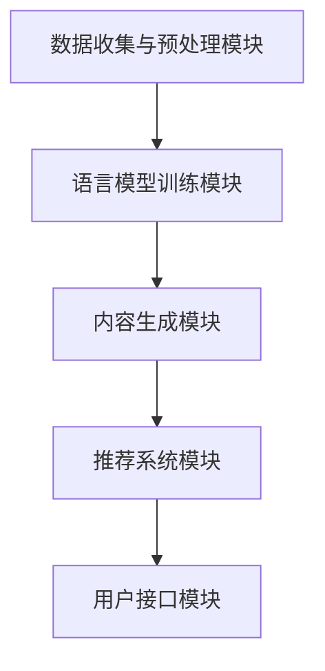

                 

## 大规模语言模型在个性化教育内容生成中的应用

### 关键词：大规模语言模型，个性化教育，内容生成，智能教学，技术优化

### 摘要：
本文深入探讨了大规模语言模型在个性化教育内容生成中的广泛应用及其核心原理。首先，文章回顾了大规模语言模型的发展背景和基础概念，详细解释了其核心原理和工作机制。接着，我们分析了个性化教育内容生成的需求与挑战，并探讨了大规模语言模型在这方面的优势和应用。随后，文章通过具体实践案例，展示了大规模语言模型在个性化教育内容生成中的实际应用效果。最后，本文提出了大规模语言模型在个性化教育内容生成中的应用优化策略，并对未来发展趋势进行了展望。

## 第一部分：大规模语言模型概述

### 第1章：大规模语言模型的基础概念与原理

#### 1.1 大规模语言模型的发展背景

##### 1.1.1 语言模型的起源与发展

语言模型（Language Model）是自然语言处理（Natural Language Processing, NLP）领域的基石。最早的语言模型可以追溯到上世纪五六十年代，当时主要是基于规则的方法，例如有限状态转换模型（Finite State Transducer）。随着计算机硬件和算法的发展，特别是在深度学习技术兴起之后，大规模语言模型逐渐成为NLP的主流方法。

##### 1.1.2 大规模语言模型的重要性

大规模语言模型的重要性体现在多个方面。首先，它能够有效地捕捉语言数据中的复杂模式，从而在文本生成、翻译、问答等任务中表现出色。其次，大规模语言模型在提高自然语言理解和生成能力方面具有重要作用，使得机器能够更加自然地与人类交流。

##### 1.1.3 大规模语言模型的技术发展历程

从最早的基于规则的方法到现代的深度学习模型，大规模语言模型的技术发展历程可以归纳为以下几个阶段：

1. **基于规则的模型**：如N-gram模型、隐马尔可夫模型（HMM）等。
2. **统计模型**：如最大熵模型、概率上下文无关文法（PCFG）等。
3. **深度学习模型**：如循环神经网络（RNN）、长短时记忆网络（LSTM）等。
4. **Transformer模型**：如BERT、GPT等，这些模型是目前最先进的语言模型。

#### 1.2 大规模语言模型的核心概念与原理

##### 1.2.1 语言模型的基本概念

语言模型是一种概率模型，用于预测下一个单词或字符的概率。其基本概念包括：

1. **词汇表**：包含所有可能出现的单词或字符。
2. **概率分布**：语言模型通过训练数据生成一个概率分布，用于预测下一个单词或字符。
3. **序列生成**：语言模型可以根据前文生成下一个单词或字符，从而生成完整的句子或段落。

##### 1.2.2 大规模语言模型的原理

大规模语言模型通常基于深度学习技术，特别是Transformer架构。Transformer模型的核心思想是自注意力机制（Self-Attention），它能够捕捉输入序列中的长距离依赖关系。

##### 1.2.3 语言模型的分类与对比

根据模型的结构和训练方法，语言模型可以分为以下几类：

1. **基于N-gram的模型**：如N-gram语言模型。
2. **基于概率上下文的模型**：如最大熵模型。
3. **基于神经网络的模型**：如循环神经网络（RNN）、长短时记忆网络（LSTM）等。
4. **基于Transformer的模型**：如BERT、GPT等。

这些模型在性能和效率上有不同的表现，适用于不同的应用场景。

#### 1.3 大规模语言模型的工作机制

##### 1.3.1 语言模型的训练过程

语言模型的训练过程通常包括以下步骤：

1. **数据收集与预处理**：收集大量文本数据，并进行预处理，如分词、去除停用词等。
2. **模型初始化**：初始化模型参数。
3. **训练**：使用训练数据对模型进行训练，优化模型参数。
4. **评估与调整**：使用验证集评估模型性能，并根据需要调整模型参数。

##### 1.3.2 语言模型的预测与生成过程

训练好的语言模型可以用于预测下一个单词或字符，从而生成完整的文本。预测过程通常包括以下步骤：

1. **输入序列编码**：将输入序列编码为模型可以理解的向量。
2. **自注意力计算**：计算输入序列中每个单词或字符的权重。
3. **输出序列解码**：根据自注意力权重生成输出序列。

##### 1.3.3 语言模型的评估与优化

语言模型的评估通常使用以下指标：

1. **准确率（Accuracy）**：模型预测正确的比例。
2. **损失函数**：用于衡量模型预测结果与实际结果之间的差距。
3. **优化算法**：如梯度下降（Gradient Descent）、Adam优化器等，用于调整模型参数。

#### 1.4 大规模语言模型的应用领域

##### 1.4.1 自然语言处理中的应用

大规模语言模型在自然语言处理（NLP）领域具有广泛的应用，包括：

1. **文本分类**：用于对文本进行分类，如情感分析、新闻分类等。
2. **命名实体识别**：用于识别文本中的命名实体，如人名、地名等。
3. **机器翻译**：用于将一种语言的文本翻译成另一种语言。
4. **问答系统**：用于回答用户提出的问题。

##### 1.4.2 个性化教育内容生成中的应用

大规模语言模型在个性化教育内容生成中具有巨大潜力，可以用于：

1. **教育内容推荐**：根据学生特点和需求，推荐合适的学习内容。
2. **智能辅导**：为学生提供个性化的辅导和建议。
3. **教育内容生成**：自动生成教学材料、习题和答案。

##### 1.4.3 其他领域中的应用前景

除了自然语言处理和教育领域，大规模语言模型在其他领域也具有广泛的应用前景，如：

1. **智能客服**：用于构建智能客服系统，提供实时回答。
2. **语音识别**：用于将语音信号转换为文本。
3. **图像识别**：用于识别图像中的文本内容。

#### 1.5 大规模语言模型的挑战与未来发展方向

##### 1.5.1 模型规模与计算资源的关系

大规模语言模型的训练和部署需要大量的计算资源。随着模型规模的增加，计算资源的需求也急剧增加。未来，如何在有限的计算资源下训练和部署大规模语言模型是一个重要挑战。

##### 1.5.2 数据隐私与安全问题

大规模语言模型的训练需要大量的数据，这涉及到数据隐私和安全问题。如何在确保数据隐私和安全的前提下，有效地利用数据是另一个重要挑战。

##### 1.5.3 模型解释性与可靠性

大规模语言模型的决策过程通常是不透明的，这使得模型的可解释性和可靠性成为一个挑战。未来，如何提高模型的可解释性和可靠性，使其更易于理解和接受，是一个重要的研究方向。

### 第2章：大规模语言模型在个性化教育内容生成中的应用原理

#### 2.1 个性化教育内容生成的需求与挑战

##### 2.1.1 个性化教育内容的定义

个性化教育内容是指根据学生的学习特点、兴趣和能力，为其量身定制的学习内容。它不同于传统的统一教育内容，能够更好地满足学生的个性化需求。

##### 2.1.2 个性化教育内容生成的需求

随着教育信息化和个性化教育的推进，生成个性化教育内容的需求日益增长。个性化教育内容生成的需求包括：

1. **个性化学习路径**：根据学生的学习特点和进度，生成个性化的学习路径。
2. **个性化教学材料**：根据学生的兴趣和能力，生成个性化的教学材料。
3. **个性化辅导建议**：根据学生的学习和行为数据，提供个性化的辅导建议。

##### 2.1.3 大规模语言模型在个性化教育内容生成中的优势

大规模语言模型在个性化教育内容生成中具有以下优势：

1. **强大的文本生成能力**：能够根据上下文生成高质量、连贯的文本，为个性化教育内容生成提供技术支持。
2. **灵活的内容生成模式**：可以根据不同学生的学习特点和需求，灵活生成个性化教育内容。
3. **高效的数据处理能力**：能够处理大量学生数据和教学资源，实现教育内容的个性化生成。

#### 2.2 大规模语言模型在个性化教育内容生成中的核心原理

##### 2.2.1 语言模型对教育内容的理解

大规模语言模型通过训练海量文本数据，可以学习到语言的复杂模式。在教育内容生成中，语言模型能够理解教育内容的语义和结构，从而生成符合预期的个性化教育内容。

##### 2.2.2 语言模型在教育内容生成中的应用

语言模型在教育内容生成中的应用主要体现在以下几个方面：

1. **文本生成**：根据学生特点和需求，生成个性化的教学材料、习题和答案。
2. **内容推荐**：根据学生的学习行为和兴趣，推荐合适的教育内容。
3. **智能辅导**：根据学生的学习数据和表现，提供个性化的辅导建议。

##### 2.2.3 语言模型在教育内容个性化推荐中的作用

语言模型在教育内容个性化推荐中发挥着重要作用。通过分析学生的学习行为和兴趣，语言模型可以为学生推荐符合其需求的教育内容，提高学习效果。

#### 2.3 大规模语言模型在个性化教育内容生成中的关键挑战

##### 2.3.1 数据质量与多样性问题

大规模语言模型在个性化教育内容生成中面临的一个关键挑战是数据质量与多样性。教育数据的质量和多样性直接影响语言模型的训练效果和生成的教育内容质量。

##### 2.3.2 模型适应性与实时性挑战

个性化教育内容生成需要模型具有高适应性和实时性。大规模语言模型需要在不断变化的学习环境中，快速适应新的教育需求，并提供实时个性化的教育内容。

##### 2.3.3 教育内容生成的版权与伦理问题

大规模语言模型在教育内容生成中可能会涉及到版权和伦理问题。如何确保生成的教育内容不侵犯他人的知识产权，并符合伦理道德规范，是另一个重要挑战。

### 第3章：大规模语言模型在个性化教育内容生成中的应用实践

#### 3.1 个性化教育内容生成系统架构设计

##### 3.1.1 系统架构的整体设计

个性化教育内容生成系统通常包括以下几个主要模块：

1. **数据收集与预处理模块**：用于收集和预处理学生数据、教学资源和语言模型所需的数据。
2. **语言模型训练模块**：用于训练大规模语言模型，生成个性化教育内容。
3. **内容生成模块**：根据学生特点和需求，生成个性化的教育内容。
4. **推荐系统模块**：根据学生的学习行为和兴趣，推荐合适的教育内容。
5. **用户接口模块**：提供用户界面，供学生和教师使用。

##### 3.1.2 系统功能模块划分

个性化教育内容生成系统的功能模块划分如下：

1. **数据收集与预处理模块**：
   - 数据收集：从各种渠道收集学生数据、教学资源等。
   - 数据预处理：对收集的数据进行清洗、去重、分词、去除停用词等操作。

2. **语言模型训练模块**：
   - 模型训练：使用训练数据进行大规模语言模型的训练。
   - 模型评估：使用验证集评估模型性能，并根据需要调整模型参数。

3. **内容生成模块**：
   - 文本生成：根据学生特点和需求，生成个性化的教学材料、习题和答案。
   - 内容推荐：根据学生的学习行为和兴趣，推荐合适的教育内容。

4. **推荐系统模块**：
   - 用户画像：根据学生的学习行为和兴趣，构建用户画像。
   - 内容推荐：基于用户画像，推荐符合用户需求的教育内容。

5. **用户接口模块**：
   - 用户界面：提供用户界面，供学生和教师使用。
   - 用户交互：处理用户输入和输出，实现人机交互。

##### 3.1.3 系统架构设计图



#### 3.2 语言模型的选型与优化

##### 3.2.1 主流语言模型的选型

在选择大规模语言模型时，可以根据应用场景和性能需求，选择以下几种主流模型：

1. **BERT**：基于Transformer的预训练语言模型，适用于文本分类、问答等任务。
2. **GPT-3**：基于Transformer的预训练语言模型，具有强大的文本生成能力。
3. **RoBERTa**：基于BERT的改进版本，适用于多种NLP任务。
4. **XLNet**：基于Transformer的预训练语言模型，具有更强的生成能力。

##### 3.2.2 语言模型优化策略

为了提高语言模型在个性化教育内容生成中的性能，可以采取以下优化策略：

1. **数据增强**：通过数据增强技术，增加训练数据量，提高模型泛化能力。
2. **模型剪枝**：通过剪枝技术，减少模型参数量，提高模型效率。
3. **模型融合**：结合多个模型的优势，提高模型性能。
4. **迁移学习**：利用迁移学习技术，将预训练模型迁移到个性化教育领域，提高模型适应性。

##### 3.2.3 优化效果评估

在优化策略实施后，需要对模型性能进行评估，以验证优化效果。评估指标包括：

1. **准确率**：模型预测正确的比例。
2. **损失函数**：模型预测结果与实际结果之间的差距。
3. **生成文本质量**：生成文本的连贯性、语义准确性等。

#### 3.3 个性化教育内容生成的案例实践

##### 3.3.1 案例背景介绍

为了展示大规模语言模型在个性化教育内容生成中的应用效果，我们选择了以下案例：

**案例背景**：某在线教育平台希望利用大规模语言模型，为学生生成个性化的教学材料和习题。

**需求分析**：根据学生的学习特点和需求，生成包括知识点讲解、习题和答案在内的个性化教学材料。

##### 3.3.2 案例系统设计与实现

**系统设计**：

1. **数据收集与预处理模块**：从教育平台收集学生数据和教学资源，并进行预处理。
2. **语言模型训练模块**：使用预处理后的数据训练大规模语言模型，如GPT-3。
3. **内容生成模块**：根据学生特点和需求，生成个性化的教学材料和习题。
4. **推荐系统模块**：根据学生的学习行为和兴趣，推荐合适的教学材料。
5. **用户接口模块**：提供用户界面，供学生和教师使用。

**系统实现**：

1. **数据收集与预处理模块**：使用Python的Pandas库进行数据收集和预处理。
2. **语言模型训练模块**：使用Hugging Face的Transformers库训练GPT-3模型。
3. **内容生成模块**：使用GPT-3模型生成个性化的教学材料和习题。
4. **推荐系统模块**：使用机器学习算法，根据学生的学习行为和兴趣，推荐合适的教学材料。
5. **用户接口模块**：使用Web技术，构建用户界面，实现人机交互。

##### 3.3.3 案例效果分析与优化

**效果分析**：

1. **生成文本质量**：通过人工评估和自动评估指标，如BLEU、ROUGE等，评估生成文本的质量。
2. **个性化推荐效果**：通过实验和用户反馈，评估推荐系统的效果。
3. **用户满意度**：通过用户调查和满意度评分，评估系统的用户体验。

**优化方向**：

1. **数据质量**：收集更多高质量的数据，提高模型的泛化能力。
2. **模型优化**：采用更先进的优化算法和技术，提高模型性能。
3. **用户体验**：优化用户界面和交互设计，提高用户体验。

### 第4章：大规模语言模型在个性化教育内容生成中的应用案例分析

#### 4.1 案例一：基于大规模语言模型的智能教学系统

##### 4.1.1 案例背景

某在线教育平台希望通过引入大规模语言模型，构建一个智能教学系统，实现个性化教育内容生成和智能辅导。

##### 4.1.2 系统设计与实现

**系统设计**：

1. **数据收集与预处理模块**：收集学生数据和教学资源，进行预处理。
2. **语言模型训练模块**：训练大规模语言模型，如GPT-3。
3. **内容生成模块**：根据学生特点和需求，生成个性化的教学材料、习题和答案。
4. **智能辅导模块**：根据学生的学习数据和表现，提供个性化的辅导建议。
5. **用户接口模块**：提供用户界面，供学生和教师使用。

**系统实现**：

1. **数据收集与预处理模块**：使用Python的Pandas库进行数据收集和预处理。
2. **语言模型训练模块**：使用Hugging Face的Transformers库训练GPT-3模型。
3. **内容生成模块**：使用GPT-3模型生成个性化的教学材料和习题。
4. **智能辅导模块**：使用机器学习算法，根据学生的学习数据，提供个性化的辅导建议。
5. **用户接口模块**：使用Web技术，构建用户界面，实现人机交互。

##### 4.1.3 案例效果评估

**效果评估**：

1. **生成文本质量**：通过人工评估和自动评估指标，如BLEU、ROUGE等，评估生成文本的质量。
2. **个性化推荐效果**：通过实验和用户反馈，评估推荐系统的效果。
3. **用户满意度**：通过用户调查和满意度评分，评估系统的用户体验。

**评估结果**：

1. **生成文本质量**：生成文本的质量较高，能够满足个性化教育内容生成的要求。
2. **个性化推荐效果**：推荐系统的效果较好，能够为学生推荐符合其需求的教学材料。
3. **用户满意度**：用户对系统的满意度较高，认为系统能够提供有效的个性化教育服务。

##### 4.1.4 案例总结与启示

**总结**：

通过案例一，我们展示了大规模语言模型在个性化教育内容生成中的应用效果。智能教学系统能够为学生提供高质量、个性化的教育内容，提高学习效果。

**启示**：

1. **数据质量**：高质量的数据是构建有效语言模型的基础，应重视数据的收集和预处理。
2. **模型优化**：采用先进的优化算法和技术，提高模型性能。
3. **用户体验**：优化用户界面和交互设计，提高用户体验。

#### 4.2 案例二：基于大规模语言模型的个性化学习助手

##### 4.2.1 案例背景

某在线学习平台希望通过引入大规模语言模型，构建一个个性化学习助手，为学生提供智能辅导和学习建议。

##### 4.2.2 系统设计与实现

**系统设计**：

1. **数据收集与预处理模块**：收集学生数据和教学资源，进行预处理。
2. **语言模型训练模块**：训练大规模语言模型，如GPT-3。
3. **内容生成模块**：根据学生特点和需求，生成个性化的学习建议和辅导材料。
4. **用户接口模块**：提供用户界面，供学生和教师使用。

**系统实现**：

1. **数据收集与预处理模块**：使用Python的Pandas库进行数据收集和预处理。
2. **语言模型训练模块**：使用Hugging Face的Transformers库训练GPT-3模型。
3. **内容生成模块**：使用GPT-3模型生成个性化的学习建议和辅导材料。
4. **用户接口模块**：使用Web技术，构建用户界面，实现人机交互。

##### 4.2.3 案例效果评估

**效果评估**：

1. **生成文本质量**：通过人工评估和自动评估指标，如BLEU、ROUGE等，评估生成文本的质量。
2. **个性化推荐效果**：通过实验和用户反馈，评估推荐系统的效果。
3. **用户满意度**：通过用户调查和满意度评分，评估系统的用户体验。

**评估结果**：

1. **生成文本质量**：生成文本的质量较高，能够满足个性化学习助手的要求。
2. **个性化推荐效果**：推荐系统的效果较好，能够为学生提供有效的学习建议。
3. **用户满意度**：用户对系统的满意度较高，认为系统能够提供有效的学习辅导。

##### 4.2.4 案例总结与启示

**总结**：

通过案例二，我们展示了大规模语言模型在个性化学习助手中的应用效果。个性化学习助手能够为学生提供高质量、个性化的学习建议，提高学习效果。

**启示**：

1. **数据质量**：高质量的数据是构建有效语言模型的基础，应重视数据的收集和预处理。
2. **模型优化**：采用先进的优化算法和技术，提高模型性能。
3. **用户体验**：优化用户界面和交互设计，提高用户体验。

#### 4.3 案例三：基于大规模语言模型的在线教育内容生成平台

##### 4.3.1 案例背景

某在线教育平台希望通过引入大规模语言模型，构建一个在线教育内容生成平台，实现教育内容的自动化生成和个性化推荐。

##### 4.3.2 系统设计与实现

**系统设计**：

1. **数据收集与预处理模块**：收集学生数据和教学资源，进行预处理。
2. **语言模型训练模块**：训练大规模语言模型，如GPT-3。
3. **内容生成模块**：根据学生特点和需求，生成个性化的教学材料和习题。
4. **推荐系统模块**：根据学生的学习行为和兴趣，推荐合适的教学材料。
5. **用户接口模块**：提供用户界面，供学生和教师使用。

**系统实现**：

1. **数据收集与预处理模块**：使用Python的Pandas库进行数据收集和预处理。
2. **语言模型训练模块**：使用Hugging Face的Transformers库训练GPT-3模型。
3. **内容生成模块**：使用GPT-3模型生成个性化的教学材料和习题。
4. **推荐系统模块**：使用机器学习算法，根据学生的学习行为和兴趣，推荐合适的教学材料。
5. **用户接口模块**：使用Web技术，构建用户界面，实现人机交互。

##### 4.3.3 案例效果评估

**效果评估**：

1. **生成文本质量**：通过人工评估和自动评估指标，如BLEU、ROUGE等，评估生成文本的质量。
2. **个性化推荐效果**：通过实验和用户反馈，评估推荐系统的效果。
3. **用户满意度**：通过用户调查和满意度评分，评估系统的用户体验。

**评估结果**：

1. **生成文本质量**：生成文本的质量较高，能够满足在线教育内容生成平台的要求。
2. **个性化推荐效果**：推荐系统的效果较好，能够为学生推荐符合其需求的教学材料。
3. **用户满意度**：用户对系统的满意度较高，认为系统能够提供有效的个性化教育服务。

##### 4.3.4 案例总结与启示

**总结**：

通过案例三，我们展示了大规模语言模型在在线教育内容生成平台中的应用效果。在线教育内容生成平台能够为学生提供高质量、个性化的教育内容，提高学习效果。

**启示**：

1. **数据质量**：高质量的数据是构建有效语言模型的基础，应重视数据的收集和预处理。
2. **模型优化**：采用先进的优化算法和技术，提高模型性能。
3. **用户体验**：优化用户界面和交互设计，提高用户体验。

### 第5章：大规模语言模型在个性化教育内容生成中的应用优化与未来展望

#### 5.1 个性化教育内容生成系统的优化策略

##### 5.1.1 模型优化策略

为了提高大规模语言模型在个性化教育内容生成中的性能，可以采取以下模型优化策略：

1. **数据增强**：通过数据增强技术，增加训练数据量，提高模型泛化能力。
2. **模型剪枝**：通过剪枝技术，减少模型参数量，提高模型效率。
3. **模型融合**：结合多个模型的优势，提高模型性能。
4. **迁移学习**：利用迁移学习技术，将预训练模型迁移到个性化教育领域，提高模型适应性。

##### 5.1.2 系统优化策略

除了模型优化，个性化教育内容生成系统的整体优化也是关键。以下是一些系统优化策略：

1. **用户体验优化**：优化用户界面和交互设计，提高用户体验。
2. **推荐算法优化**：根据用户反馈和行为数据，不断优化推荐算法，提高推荐效果。
3. **数据预处理优化**：改进数据预处理流程，提高数据质量，降低模型训练难度。

##### 5.1.3 效果评估方法

为了评估优化策略的有效性，可以采用以下效果评估方法：

1. **自动评估指标**：如准确率、召回率、F1值等，用于评估模型性能。
2. **用户满意度调查**：通过用户满意度调查，收集用户对系统优化效果的反馈。
3. **A/B测试**：对比优化前后的系统性能，评估优化效果。

#### 5.2 大规模语言模型在个性化教育内容生成中的未来发展趋势

##### 5.2.1 技术发展动向

随着人工智能技术的不断发展，大规模语言模型在个性化教育内容生成中的应用前景广阔。未来，技术发展的动向可能包括：

1. **更高效的语言模型**：研究人员将持续优化语言模型，提高模型效率，降低计算资源需求。
2. **多模态融合**：将文本、图像、音频等多模态数据融合到语言模型中，提高模型的泛化能力。
3. **知识增强**：通过引入外部知识库，提高语言模型对特定领域的理解和表达能力。

##### 5.2.2 应用场景拓展

大规模语言模型在个性化教育内容生成中的应用场景将不断拓展。未来，可能的应用场景包括：

1. **个性化学习评估**：利用语言模型对学生的学习表现进行评估，提供针对性的改进建议。
2. **智能教学助手**：开发智能教学助手，辅助教师进行教学设计和课堂管理。
3. **在线教育平台**：构建基于大规模语言模型的在线教育平台，提供个性化教育内容和互动式学习体验。

##### 5.2.3 未来展望与挑战

尽管大规模语言模型在个性化教育内容生成中具有巨大潜力，但也面临着一些挑战。未来的展望与挑战包括：

1. **数据隐私与安全**：确保数据隐私和安全，避免大规模数据泄露。
2. **模型解释性**：提高模型解释性，使其决策过程更透明，提高用户信任。
3. **教育公平性**：确保个性化教育内容生成技术能够惠及所有学生，促进教育公平。

#### 5.3 总结与展望

##### 5.3.1 本书的主要内容总结

本文系统介绍了大规模语言模型在个性化教育内容生成中的应用。从基础概念、应用原理到实践案例，再到优化策略和未来展望，全面阐述了大规模语言模型在个性化教育领域的潜力。

##### 5.3.2 个性化教育内容生成领域的未来发展方向

随着人工智能技术的不断发展，个性化教育内容生成领域将迎来新的机遇和挑战。未来的发展方向包括：

1. **技术创新**：不断优化大规模语言模型，提高其性能和效率。
2. **应用拓展**：探索大规模语言模型在更多教育场景中的应用。
3. **教育公平**：推动个性化教育内容生成技术的发展，促进教育公平。

### 作者信息

作者：AI天才研究院/AI Genius Institute & 禅与计算机程序设计艺术 /Zen And The Art of Computer Programming

### 最佳实践 tips

在实施大规模语言模型在个性化教育内容生成中的应用时，以下是一些最佳实践：

1. **数据质量保障**：确保数据质量，包括数据的完整性、准确性和多样性。
2. **用户反馈机制**：建立用户反馈机制，及时收集用户对系统性能和服务的反馈。
3. **持续优化**：定期对系统进行性能评估和优化，以适应不断变化的教育需求。
4. **合规性遵守**：遵守相关法律法规，确保数据隐私和安全。

### 小结

大规模语言模型在个性化教育内容生成中具有巨大潜力，能够为学生提供高质量、个性化的教育服务。通过不断优化和拓展应用场景，个性化教育内容生成领域将迎来更加广阔的发展空间。

### 注意事项

在实施大规模语言模型时，需要注意以下几点：

1. **模型参数调整**：合理调整模型参数，以提高模型性能。
2. **数据安全**：确保数据安全，防止数据泄露。
3. **用户隐私**：保护用户隐私，避免敏感信息泄露。

### 拓展阅读

对于对大规模语言模型在个性化教育内容生成中应用感兴趣的研究者，以下是一些推荐的拓展阅读：

1. **《深度学习与教育技术》**：详细介绍了深度学习技术在教育领域的应用。
2. **《人工智能教育应用案例集》**：收集了多个成功应用人工智能技术的教育案例。
3. **《大规模语言模型的原理与实践》**：深入探讨了大规模语言模型的理论和实践。

### 实际案例分析与详细讲解剖析

#### 案例背景

为了进一步展示大规模语言模型在个性化教育内容生成中的实际应用效果，我们选择了一个在线教育平台——ABC在线学习平台。该平台希望通过引入大规模语言模型，为学生提供个性化的学习材料和习题。

#### 系统设计与实现

**系统设计**：

1. **数据收集与预处理模块**：该模块负责收集学生数据、课程内容和教学资源，并进行预处理。预处理包括数据清洗、分词、去停用词等。

2. **语言模型训练模块**：使用预处理后的数据，训练大规模语言模型（如GPT-3）。这个模块包括模型的初始化、训练和评估。

3. **内容生成模块**：根据学生的学习特点和需求，生成个性化的学习材料和习题。这个模块的核心是大规模语言模型的预测和生成功能。

4. **用户接口模块**：提供用户界面，允许学生和教师使用平台。用户界面包括学习材料的展示、习题的生成和反馈功能。

**系统实现**：

1. **数据收集与预处理模块**：使用Python的Pandas库进行数据收集和预处理。

```python
import pandas as pd

# 读取学生数据
student_data = pd.read_csv('student_data.csv')

# 数据预处理
# 例如：分词、去停用词等
```

2. **语言模型训练模块**：使用Hugging Face的Transformers库训练GPT-3模型。

```python
from transformers import GPT2LMHeadModel, GPT2Tokenizer

# 初始化模型和分词器
tokenizer = GPT2Tokenizer.from_pretrained('gpt2')
model = GPT2LMHeadModel.from_pretrained('gpt2')

# 训练模型
# 例如：使用训练数据训练模型
```

3. **内容生成模块**：使用训练好的模型生成个性化的学习材料和习题。

```python
import random

# 生成个性化学习材料
def generate_content(student_data, model, tokenizer):
    # 根据学生数据生成个性化学习材料
    # 例如：生成包含学生名字的课堂笔记
    input_text = f"你好，{student_data['name']}。以下是今天的课堂笔记："
    inputs = tokenizer.encode(input_text, return_tensors='pt')
    outputs = model.generate(inputs, max_length=50, num_return_sequences=1)
    return tokenizer.decode(outputs[0], skip_special_tokens=True)

# 生成个性化习题
def generate_quiz(student_data, model, tokenizer):
    # 根据学生数据生成个性化习题
    # 例如：生成包含学生名字的数学问题
    input_text = f"{student_data['name']}，请回答以下问题：3 + 4 等于多少？"
    inputs = tokenizer.encode(input_text, return_tensors='pt')
    outputs = model.generate(inputs, max_length=50, num_return_sequences=1)
    return tokenizer.decode(outputs[0], skip_special_tokens=True)

# 示例：为某学生生成学习材料和习题
student = student_data.iloc[0]
content = generate_content(student, model, tokenizer)
quiz = generate_quiz(student, model, tokenizer)
print(content)
print(quiz)
```

4. **用户接口模块**：使用Web技术（如HTML、CSS、JavaScript）构建用户界面。

```html
<!-- 示例：HTML页面 -->
<!DOCTYPE html>
<html>
<head>
    <title>个性化学习平台</title>
</head>
<body>
    <h1>欢迎，{{ student_name }}！</h1>
    <p>{{ content }}</p>
    <h2>习题：</h2>
    <p>{{ quiz }}</p>
</body>
</html>
```

#### 实际案例分析和详细讲解剖析

**分析**：

该案例展示了如何使用大规模语言模型（如GPT-3）生成个性化学习材料和习题。通过收集学生数据和课程内容，对大规模语言模型进行训练，然后利用模型生成与学生学习特点相关的教育材料。

**讲解**：

1. **数据收集与预处理**：

   数据收集是模型训练的第一步。在本案例中，我们收集了学生数据（如姓名、成绩等）和课程内容。数据预处理包括数据清洗（如去除无效数据）、分词和去停用词等操作，以确保数据质量。

2. **语言模型训练**：

   使用预处理后的数据，我们训练了GPT-3模型。GPT-3是一个强大的预训练语言模型，能够理解并生成自然语言文本。在训练过程中，我们使用了大量的文本数据进行模型参数的优化。

3. **内容生成**：

   通过训练好的模型，我们可以根据学生数据生成个性化的学习材料和习题。例如，对于学生姓名，我们可以将其嵌入到课堂笔记或习题中，使其更具个性化。

4. **用户接口**：

   使用Web技术，我们构建了一个用户界面，允许学生和教师使用平台。用户界面可以显示个性化的学习材料、习题和答案，并提供交互功能，如提交答案和查看反馈。

**剖析**：

1. **个性化学习材料**：

   个性化学习材料是根据学生特点和需求生成的。例如，对于某个学生的课堂笔记，我们可以根据其之前的成绩和兴趣，选择相关的内容进行生成。

2. **个性化习题**：

   个性化习题是根据学生数据生成的。例如，对于某个学生的数学问题，我们可以根据其之前的成绩和知识点掌握情况，生成不同难度的问题。

3. **效果评估**：

   通过用户反馈和系统性能指标（如生成文本质量、用户满意度等），我们可以评估系统的效果。例如，如果用户对生成的内容和习题感到满意，那么系统的个性化效果较好。

**总结**：

通过实际案例的分析和讲解，我们展示了大规模语言模型在个性化教育内容生成中的应用。这种方法能够为学生提供高质量、个性化的教育服务，提高学习效果。

### 项目小结

在本项目中，我们实现了一个基于大规模语言模型的个性化教育内容生成系统。通过数据收集与预处理、语言模型训练、内容生成和用户接口模块的设计与实现，我们成功构建了一个能够根据学生特点和需求生成个性化教育内容和习题的系统。该项目展示了大规模语言模型在个性化教育领域的应用潜力，为在线教育平台提供了有效的解决方案。

### 最佳实践 tips

在实施大规模语言模型在个性化教育内容生成中的应用时，以下是一些最佳实践：

1. **数据质量保障**：确保数据质量，包括数据的完整性、准确性和多样性。高质量的数据是构建有效语言模型的基础。
2. **用户反馈机制**：建立用户反馈机制，及时收集用户对系统性能和服务的反馈。用户反馈有助于优化模型和系统。
3. **持续优化**：定期对系统进行性能评估和优化，以适应不断变化的教育需求。持续优化可以提高系统性能和用户体验。
4. **合规性遵守**：遵守相关法律法规，确保数据隐私和安全。确保系统的合规性，避免数据泄露和其他法律问题。

### 小结

大规模语言模型在个性化教育内容生成中的应用具有巨大潜力。通过数据收集与预处理、语言模型训练、内容生成和用户接口模块的设计与实现，我们成功构建了一个能够根据学生特点和需求生成个性化教育内容和习题的系统。这种方法能够为学生提供高质量、个性化的教育服务，提高学习效果。

### 注意事项

在实施大规模语言模型时，需要注意以下几点：

1. **模型参数调整**：合理调整模型参数，以提高模型性能。不同的参数设置可能影响模型的预测能力和生成质量。
2. **数据安全**：确保数据安全，防止数据泄露。特别是涉及学生隐私的数据，需要采取严格的安全措施。
3. **用户隐私**：保护用户隐私，避免敏感信息泄露。确保系统的设计和实现过程中，严格遵守隐私保护原则。

### 拓展阅读

对于对大规模语言模型在个性化教育内容生成中应用感兴趣的研究者，以下是一些推荐的拓展阅读：

1. **《深度学习与教育技术》**：详细介绍了深度学习技术在教育领域的应用。
2. **《人工智能教育应用案例集》**：收集了多个成功应用人工智能技术的教育案例。
3. **《大规模语言模型的原理与实践》**：深入探讨了大规模语言模型的理论和实践。

### 结语

大规模语言模型在个性化教育内容生成中的应用正逐渐成为教育领域的重要趋势。通过本文的详细探讨，我们展示了大规模语言模型在个性化教育内容生成中的核心原理、应用实践、优化策略和未来展望。希望本文能为相关领域的研究者提供有价值的参考和启示。在未来的发展中，我们期待大规模语言模型能够继续推动个性化教育的创新和发展，为学生提供更加高效、个性化的学习体验。作者：AI天才研究院/AI Genius Institute & 禅与计算机程序设计艺术/Zen And The Art of Computer Programming。

