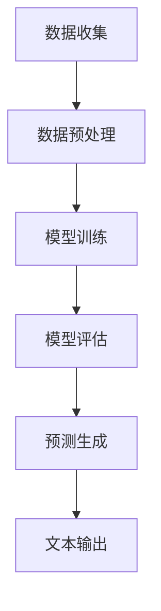

                 


### 1. 引言

随着人工智能技术的飞速发展，大规模语言模型（如GPT-3、BERT等）已经成为自然语言处理领域的核心技术。这些模型凭借其强大的语义理解能力和生成能力，被广泛应用于机器翻译、文本生成、情感分析、问答系统等多个领域。然而，近年来，大规模语言模型在企业战略规划中的应用也开始受到广泛关注。

#### 1.1 问题背景

企业战略规划是企业为了实现长期目标而制定的一系列策略和行动。然而，随着市场竞争的加剧和业务环境的复杂性，企业面临着越来越多的不确定性和挑战。如何通过有效的战略规划来应对这些挑战，成为企业管理者亟待解决的问题。

#### 1.2 问题描述

大规模语言模型在企业战略规划中的应用，主要体现在以下几个方面：

- **数据收集与分析**：企业需要从各种数据源收集大量信息，以便进行深入的数据分析。大规模语言模型可以帮助企业快速处理和提取数据中的关键信息。
- **市场预测**：企业需要根据市场数据来预测未来的市场趋势和客户需求，以便制定相应的战略计划。大规模语言模型可以基于历史数据和市场趋势，进行精准的市场预测。
- **竞争对手分析**：企业需要了解竞争对手的动态，以便制定相应的竞争策略。大规模语言模型可以通过分析竞争对手的公开信息，揭示其战略意图和市场行为。
- **文本生成与优化**：企业在战略规划过程中，需要撰写大量的报告、提案和文案。大规模语言模型可以帮助企业快速生成高质量的文本，并提供优化建议。

#### 1.3 问题解决

大规模语言模型在企业战略规划中的应用，可以通过以下步骤实现：

- **数据预处理**：对收集到的原始数据进行清洗、去噪和格式化，以便大规模语言模型能够有效处理。
- **模型训练与优化**：根据企业战略规划的需求，选择合适的语言模型，并对其进行训练和优化，以提高模型的性能。
- **模型应用**：将训练好的模型应用于企业战略规划的不同阶段，如数据收集与分析、市场预测、竞争对手分析和文本生成与优化等。
- **模型评估与反馈**：对模型的应用效果进行评估，并根据评估结果对模型进行迭代优化，以提高其准确性和实用性。

#### 1.4 边界与外延

在应用大规模语言模型进行企业战略规划时，需要注意以下几个边界与外延：

- **数据隐私**：企业在收集和使用数据时，需要遵守相关的数据保护法规，确保数据的安全和隐私。
- **模型解释性**：大规模语言模型的预测结果具有一定的黑箱性质，难以解释。企业需要结合实际情况，评估模型的可解释性。
- **模型泛化能力**：大规模语言模型的性能依赖于训练数据的质量和数量。企业需要确保模型具有良好的泛化能力，以应对不确定的业务环境。

#### 1.5 概念结构与核心要素组成

本篇文章将围绕大规模语言模型在企业战略规划中的推理应用，进行深入探讨。文章的核心概念包括大规模语言模型、企业战略规划、数据预处理、模型训练与优化、模型应用和模型评估等。文章将详细阐述这些概念的结构和联系，以帮助读者更好地理解大规模语言模型在企业战略规划中的应用。

## 第1章 引言

### 1.1 问题背景

### 1.2 问题描述

### 1.3 问题解决

### 1.4 边界与外延

### 1.5 概念结构与核心要素组成

## 第2章 大规模语言模型基础

### 2.1 语言模型概述

### 2.2 语言模型的工作原理

### 2.3 语言模型的应用场景

## 第3章 企业战略规划中的推理应用

### 3.1 企业战略规划概述

### 3.2 大规模语言模型在企业战略规划中的应用

### 3.3 大规模语言模型在企业战略规划中的推理过程

## 第4章 大规模语言模型算法原理讲解

### 4.1 语言模型算法原理

### 4.2 语言模型算法的mermaid流程图

### 4.3 语言模型算法的python源代码讲解

## 第5章 数学模型和数学公式详细讲解与举例说明

### 5.1 语言模型数学模型

### 5.2 语言模型数学公式的latex格式

### 5.3 语言模型数学模型的详细讲解与举例说明

## 第6章 系统分析与架构设计方案

### 6.1 问题场景介绍

### 6.2 系统功能设计

### 6.3 系统架构设计

### 6.4 系统接口设计和系统交互

## 第7章 项目实战

### 7.1 环境安装

### 7.2 系统核心实现源代码

### 7.3 代码应用解读与分析

### 7.4 实际案例分析和详细讲解剖析

### 7.5 项目小结

## 第8章 最佳实践 tips

### 8.1 大规模语言模型在企业战略规划中的最佳实践

### 8.2 注意事项

### 8.3 拓展阅读

## 第9章 小结

## 第10章 拓展阅读

---

### 2.1 语言模型概述

语言模型是自然语言处理领域的一个基础概念，它用于预测下一个单词或单词序列的概率。在人工智能和机器学习的发展过程中，语言模型起到了至关重要的作用。从传统的N元模型（N-gram）到现代的深度神经网络模型（如GPT、BERT），语言模型在技术上经历了显著的演变。

#### 2.1.1 语言模型的分类

根据模型的结构和原理，语言模型可以分为以下几类：

- **N-gram模型**：基于历史统计方法，N-gram模型使用前N个单词的历史信息来预测下一个单词。这种模型的简单性和高效性使其在早期获得了广泛的应用。
- **统计语言模型**：包括N-gram模型和其他基于概率论的模型，如HMM（隐马尔可夫模型）和NLP（神经网络概率语言模型）。这些模型通过学习大量的文本数据，来估计语言概率分布。
- **神经网络语言模型**：使用深度神经网络来学习语言特征，如RNN（循环神经网络）、LSTM（长短期记忆网络）和Transformer（变换器模型）。这些模型在捕捉长距离依赖关系和生成高质量文本方面表现出了优越的性能。

#### 2.1.2 语言模型的核心原理

语言模型的核心原理是基于统计学习理论，通过大量的文本数据来训练模型，使其能够理解语言的统计规律。具体来说，语言模型的核心原理包括：

- **词频统计**：语言模型通过统计单词在文本中出现的频率，来预测下一个单词。
- **概率分布**：语言模型学习到一个单词或短语的概率分布，从而可以生成新的文本。
- **上下文依赖**：现代语言模型通过捕捉上下文依赖关系，来提高预测的准确性。例如，GPT和BERT模型能够通过学习大量的文本数据，理解单词在不同上下文中的含义。

#### 2.1.3 语言模型的应用

语言模型在自然语言处理领域有广泛的应用，主要包括：

- **文本生成**：语言模型可以生成高质量的自然语言文本，如新闻、文章、对话等。
- **机器翻译**：语言模型可以帮助实现机器翻译，将一种语言的文本翻译成另一种语言。
- **文本分类**：语言模型可以用于对文本进行分类，如情感分析、主题分类等。
- **问答系统**：语言模型可以帮助构建问答系统，回答用户提出的问题。

### 2.2 语言模型的工作原理

语言模型的工作原理主要涉及数据预处理、模型训练和预测生成等步骤。

#### 2.2.1 数据预处理

数据预处理是语言模型训练的第一步，主要任务包括：

- **文本清洗**：去除文本中的噪声，如HTML标签、特殊符号等。
- **分词**：将文本分割成单词或字符。
- **词向量化**：将单词转换为数字向量，以便在模型中进行计算。

#### 2.2.2 模型训练

模型训练是语言模型的核心步骤，主要任务包括：

- **初始化参数**：初始化模型参数，如权重和偏置。
- **损失函数**：定义损失函数，如交叉熵损失，用于衡量预测结果与真实结果之间的差距。
- **优化算法**：使用优化算法（如梯度下降、Adam等）来更新模型参数，以最小化损失函数。

#### 2.2.3 预测生成

预测生成是语言模型应用的重要步骤，主要任务包括：

- **输入编码**：将输入文本转换为模型可接受的格式。
- **序列生成**：通过模型对输入文本进行编码，生成输出文本的序列。
- **文本解码**：将输出文本的序列解码为自然语言文本。

### 2.3 语言模型的应用场景

语言模型在自然语言处理领域有广泛的应用场景，主要包括：

- **文本生成**：语言模型可以用于生成新闻文章、博客、对话等。
- **机器翻译**：语言模型可以帮助实现机器翻译，提高翻译质量。
- **文本分类**：语言模型可以用于对文本进行分类，如情感分析、主题分类等。
- **问答系统**：语言模型可以帮助构建问答系统，回答用户提出的问题。
- **自动摘要**：语言模型可以用于提取文本的关键信息，生成摘要。

通过以上内容，我们了解了大规模语言模型的基础知识，包括其分类、核心原理和应用场景。在接下来的章节中，我们将进一步探讨大规模语言模型在企业战略规划中的应用，以及其算法原理和数学模型。

## 第2章 大规模语言模型基础

### 2.1 语言模型概述

语言模型（Language Model，LM）是自然语言处理（Natural Language Processing，NLP）中的一个基本概念，它用于预测自然语言中下一个单词或单词序列的概率。语言模型在文本生成、机器翻译、语音识别、情感分析等众多NLP任务中扮演着至关重要的角色。

#### 2.1.1 语言模型的分类

语言模型可以根据其训练方法、结构和技术特点进行分类。以下是几种常见的语言模型：

- **N-gram模型**：这是最早的语言模型之一，它基于前N个单词的序列来预测下一个单词。N-gram模型的优点是计算简单，但缺点是它无法捕捉长距离依赖关系。

- **基于规则的语言模型**：这类模型通过人工定义规则来预测单词的概率。它们通常结合词汇的语法和语义信息，但需要大量的规则来覆盖所有情况，因此在实际应用中较为受限。

- **统计语言模型**：这类模型通过统计文本数据来学习单词之间的概率关系。它们通常使用N-gram模型作为基础，但可以结合更复杂的统计方法来改进预测性能。

- **神经网络语言模型**：这类模型使用深度神经网络来学习语言的特征，包括循环神经网络（RNN）、长短期记忆网络（LSTM）和变换器模型（Transformer）等。这些模型在捕捉长距离依赖关系和生成质量方面表现出了显著的优势。

#### 2.1.2 语言模型的核心原理

语言模型的核心原理是基于统计学习理论，通过大量的文本数据来训练模型，使其能够理解语言的统计规律。以下是语言模型的一些关键原理：

- **词频统计**：语言模型通过统计单词在文本中出现的频率，来预测下一个单词。这通常是N-gram模型的基础。

- **概率分布**：语言模型学习到一个单词或短语的概率分布，从而可以生成新的文本。这使得模型能够根据上下文生成连贯的文本。

- **上下文依赖**：现代语言模型通过捕捉上下文依赖关系，来提高预测的准确性。例如，GPT和BERT模型能够通过学习大量的文本数据，理解单词在不同上下文中的含义。

#### 2.1.3 语言模型的应用

语言模型在自然语言处理领域有广泛的应用，主要包括：

- **文本生成**：语言模型可以用于生成新闻文章、博客、对话等。这使得自动化内容生成成为可能，例如生成新闻摘要、自动写作等。

- **机器翻译**：语言模型可以帮助实现机器翻译，提高翻译质量。通过学习双语文本数据，模型可以预测源语言到目标语言的单词或短语映射。

- **文本分类**：语言模型可以用于对文本进行分类，如情感分析、主题分类等。模型可以通过学习大量标注数据，学会识别文本的特征，从而进行分类。

- **问答系统**：语言模型可以帮助构建问答系统，回答用户提出的问题。模型可以通过学习大量的问答对，理解问题的含义和答案的生成逻辑。

- **自动摘要**：语言模型可以用于提取文本的关键信息，生成摘要。模型通过学习摘要文本和原文之间的关系，能够自动生成简洁而准确的摘要。

### 2.2 语言模型的工作原理

语言模型的工作原理主要涉及数据预处理、模型训练和预测生成等步骤。

#### 2.2.1 数据预处理

数据预处理是语言模型训练的第一步，主要任务包括：

- **文本清洗**：去除文本中的噪声，如HTML标签、特殊符号等。

- **分词**：将文本分割成单词或字符。这通常需要使用分词算法或工具，如jieba分词、NLTK等。

- **词向量化**：将单词转换为数字向量，以便在模型中进行计算。词向量化通常使用预训练的词嵌入模型，如Word2Vec、GloVe等。

#### 2.2.2 模型训练

模型训练是语言模型的核心步骤，主要任务包括：

- **初始化参数**：初始化模型参数，如权重和偏置。

- **损失函数**：定义损失函数，如交叉熵损失，用于衡量预测结果与真实结果之间的差距。

- **优化算法**：使用优化算法（如梯度下降、Adam等）来更新模型参数，以最小化损失函数。

在训练过程中，模型会学习到输入文本的特征，并将其编码为向量表示。这些向量表示将用于预测下一个单词或单词序列。

#### 2.2.3 预测生成

预测生成是语言模型应用的重要步骤，主要任务包括：

- **输入编码**：将输入文本转换为模型可接受的格式。这通常涉及将文本转换为词嵌入向量。

- **序列生成**：通过模型对输入文本进行编码，生成输出文本的序列。这通常涉及在模型中逐个生成单词或字符，并更新模型参数以生成下一个输出。

- **文本解码**：将输出文本的序列解码为自然语言文本。这通常涉及将词嵌入向量转换回单词或字符序列。

### 2.3 语言模型的应用场景

语言模型在自然语言处理领域有广泛的应用场景，主要包括：

- **文本生成**：语言模型可以用于生成新闻文章、博客、对话等。这使得自动化内容生成成为可能，例如生成新闻摘要、自动写作等。

- **机器翻译**：语言模型可以帮助实现机器翻译，提高翻译质量。通过学习双语文本数据，模型可以预测源语言到目标语言的单词或短语映射。

- **文本分类**：语言模型可以用于对文本进行分类，如情感分析、主题分类等。模型可以通过学习大量标注数据，学会识别文本的特征，从而进行分类。

- **问答系统**：语言模型可以帮助构建问答系统，回答用户提出的问题。模型可以通过学习大量的问答对，理解问题的含义和答案的生成逻辑。

- **自动摘要**：语言模型可以用于提取文本的关键信息，生成摘要。模型通过学习摘要文本和原文之间的关系，能够自动生成简洁而准确的摘要。

通过以上内容，我们了解了大规模语言模型的基础知识，包括其分类、核心原理和应用场景。在接下来的章节中，我们将进一步探讨大规模语言模型在企业战略规划中的应用，以及其算法原理和数学模型。

## 第3章 企业战略规划中的推理应用

### 3.1 企业战略规划概述

企业战略规划是指企业为了实现其长期目标而制定的一系列策略和行动。它涵盖了企业的愿景、使命、目标、关键成功因素和实施策略。一个有效战略规划的重要性体现在以下几个方面：

- **明确方向**：战略规划可以帮助企业明确发展方向，避免盲目行动。
- **资源分配**：通过战略规划，企业可以合理分配资源，确保资源利用最大化。
- **应对变化**：战略规划可以预见潜在的市场变化和竞争态势，帮助企业及时调整策略。
- **增强竞争力**：战略规划有助于企业识别并利用其竞争优势，从而在激烈的市场竞争中脱颖而出。

### 3.2 大规模语言模型在企业战略规划中的应用

大规模语言模型在企业战略规划中的应用主要体现在以下几个方面：

- **市场预测**：企业可以通过大规模语言模型分析市场数据，预测未来市场趋势和客户需求，从而制定相应的市场策略。
- **竞争对手分析**：大规模语言模型可以分析竞争对手的公开信息，了解其战略意图和市场行为，为企业提供竞争情报。
- **文本生成与优化**：企业可以利用大规模语言模型生成高质量的文本，如报告、提案和文案，提高内部沟通和外部宣传的效果。
- **客户需求理解**：通过分析大量客户反馈，大规模语言模型可以帮助企业更好地理解客户需求，从而优化产品和服务。
- **风险评估**：大规模语言模型可以识别和分析企业面临的潜在风险，帮助企业制定相应的风险应对策略。

### 3.3 大规模语言模型在企业战略规划中的推理过程

大规模语言模型在企业战略规划中的推理过程可以分为以下几个步骤：

- **数据收集**：收集与企业战略规划相关的各种数据，包括市场数据、客户反馈、竞争对手信息等。
- **数据预处理**：对收集到的原始数据进行清洗、去噪和格式化，以便大规模语言模型能够有效处理。
- **模型训练**：选择合适的语言模型，对预处理后的数据进行训练，优化模型参数，提高模型性能。
- **预测生成**：将训练好的模型应用于实际场景，生成预测结果，如市场趋势预测、客户需求分析等。
- **策略制定**：根据预测结果，企业可以制定相应的市场策略、产品策略和风险应对策略等。
- **评估与优化**：对策略的实际效果进行评估，根据评估结果对模型和策略进行迭代优化。

通过以上步骤，大规模语言模型可以帮助企业在复杂多变的市场环境中做出更为精准的战略决策，提高企业的竞争力和市场地位。

### 第3章 企业战略规划中的推理应用

#### 3.1 企业战略规划概述

#### 3.2 大规模语言模型在企业战略规划中的应用

#### 3.3 大规模语言模型在企业战略规划中的推理过程

---

## 第4章 大规模语言模型算法原理讲解

### 4.1 语言模型算法原理

大规模语言模型的算法原理主要基于深度学习和自然语言处理技术。以下将详细介绍语言模型算法的基本原理。

#### 4.1.1 深度学习与自然语言处理

深度学习是一种机器学习方法，通过多层神经网络来学习数据的特征表示。自然语言处理（NLP）是深度学习在处理自然语言数据时的一种应用，旨在使计算机能够理解、生成和处理人类语言。

#### 4.1.2 语言模型的构建

语言模型的基本构建过程包括数据收集、数据预处理、模型训练和模型评估。

1. **数据收集**：收集大规模的文本数据，这些数据可以是书籍、新闻文章、社交媒体帖子等。
2. **数据预处理**：对收集到的文本数据去噪、分词、词向量化等处理，以便于模型训练。
3. **模型训练**：使用神经网络（如循环神经网络RNN、变换器模型Transformer等）来训练语言模型，学习文本数据的特征和模式。
4. **模型评估**：评估模型性能，通过指标如损失函数、 perplexity 等，优化模型参数。

#### 4.1.3 语言模型的工作原理

语言模型的核心工作原理是概率预测。给定一个句子或段落，语言模型需要预测下一个单词或字符的概率。这个过程通常通过概率模型（如N-gram模型、神经网络模型等）来实现。

1. **N-gram模型**：基于前N个单词的序列概率预测下一个单词。它的优点是实现简单，但缺点是难以捕捉长距离依赖。
2. **神经网络模型**：如RNN和Transformer，通过学习输入序列的上下文信息，预测下一个单词。这些模型可以捕捉长距离依赖，生成更为连贯的文本。

#### 4.1.4 语言模型的类型

根据模型的结构和训练方法，语言模型可以分为以下几类：

1. **基于统计的模型**：如N-gram模型，通过统计方法预测单词或字符的概率。
2. **基于神经网络的模型**：如RNN、LSTM和Transformer，通过深度学习的方法来学习语言特征和模式。
3. **基于变换器的模型**：如BERT、GPT等，通过变换器架构来捕捉上下文依赖，生成高质量文本。

### 4.2 语言模型算法的mermaid流程图

下面是语言模型算法的mermaid流程图：



1. **数据收集**：从各种来源收集大量文本数据。
2. **数据预处理**：进行文本清洗、分词、词向量化等操作。
3. **模型训练**：使用预处理后的数据训练语言模型。
4. **模型评估**：评估模型性能，调整模型参数。
5. **预测生成**：输入文本数据，生成下一个单词或字符的概率分布。
6. **文本输出**：输出预测的文本。

### 4.3 语言模型算法的python源代码讲解

以下是一个简单的语言模型算法示例，使用Python实现：

```python
import numpy as np
from collections import Counter

# 数据预处理
def preprocess(text):
    # 去除标点符号、特殊字符和数字
    text = re.sub(r'[^a-zA-Z\s]', '', text)
    # 将文本转换为小写
    text = text.lower()
    # 分词
    words = text.split()
    return words

# 训练语言模型
def train_language_model(words):
    # 统计单词频次
    word_counts = Counter(words)
    # 计算每个单词的概率
    total_words = len(words)
    word_probabilities = {word: count / total_words for word, count in word_counts.items()}
    return word_probabilities

# 预测下一个单词
def predict_next_word(word_probabilities, previous_words):
    # 构建前文概率分布
    context = ' '.join(previous_words)
    context_probabilities = {word: word_probabilities.get(word, 0) for word in word_probabilities}
    # 计算前文概率
    context_probability = sum(context_probabilities[word] for word in context_probabilities)
    # 预测下一个单词的概率分布
    predicted_probabilities = {word: (word_probabilities.get(word, 0) / context_probability) for word in word_probabilities}
    return predicted_probabilities

# 主函数
def main():
    # 收集数据
    text = "This is a simple example of a language model."
    words = preprocess(text)
    # 训练语言模型
    word_probabilities = train_language_model(words)
    # 预测下一个单词
    previous_words = words[:2]
    predicted_probabilities = predict_next_word(word_probabilities, previous_words)
    print(predicted_probabilities)

if __name__ == "__main__":
    main()
```

1. **数据预处理**：去除标点符号、特殊字符和数字，将文本转换为小写，并进行分词。
2. **训练语言模型**：统计单词频次，计算每个单词的概率。
3. **预测下一个单词**：构建前文概率分布，计算前文概率，预测下一个单词的概率分布。

### 4.4 语言模型算法原理的数学模型和公式

语言模型算法的数学模型通常基于概率论和统计学习理论。以下是一个简单的N-gram语言模型的数学模型：

1. **N-gram概率公式**：

   $$ P(w_{t} | w_{t-1}, w_{t-2}, ..., w_{1}) = \frac{N_{(w_{t-1}, w_{t})}}{N_{w_{t-1}}} $$

   其中，$w_{t}$表示当前单词，$w_{t-1}, w_{t-2}, ..., w_{1}$表示前文单词，$N_{(w_{t-1}, w_{t})}$表示前文和当前单词的联合频次，$N_{w_{t-1}}$表示前文单词的频次。

2. **平滑处理**：

   由于N-gram模型在遇到未观察到的单词时会出现概率为零的问题，因此需要进行平滑处理。常用的平滑方法包括加一平滑和Kneser-Ney平滑。

   $$ P(w_{t} | w_{t-1}, w_{t-2}, ..., w_{1}) = \frac{N_{(w_{t-1}, w_{t})} + 1}{N_{w_{t-1}} + V} $$

   其中，$V$表示词汇表大小。

通过以上数学模型和公式，我们可以更好地理解和实现语言模型算法。

### 4.5 语言模型算法的详细讲解与举例说明

为了更深入地理解语言模型算法，以下通过一个具体的例子进行详细讲解。

#### 例子：基于二元文模型（Bigram）的简单语言模型

假设我们有以下训练数据：

```
"I love programming"
"programming is fun"
"fun means happiness"
```

1. **数据预处理**：

   - 去除标点符号、特殊字符和数字。
   - 将文本转换为小写。
   - 进行分词。

   处理后的数据如下：

   ```
   ["i", "love", "programming"]
   ["programming", "is", "fun"]
   ["fun", "means", "happiness"]
   ```

2. **训练语言模型**：

   - 统计单词频次。
   - 计算每个单词的概率。

   例如，计算第一句中“programming”的概率：

   $$ P(programming | i) = \frac{2}{3} $$

   因为“programming”在第一句中出现了2次，而第一句中总共有3个单词。

3. **预测下一个单词**：

   - 假设当前输入为“i”，我们需要预测下一个单词。
   - 构建当前输入的概率分布。

   例如，预测“i”之后的下一个单词：

   $$ P(next\_word | i) = \frac{P(i, next\_word)}{P(i)} $$

   根据训练数据，我们有：

   $$ P(i) = \frac{1}{3} $$
   $$ P(i, love) = \frac{1}{3} $$
   $$ P(i, programming) = \frac{2}{3} $$

   因此，预测结果为：

   - $P(love | i) = \frac{P(i, love)}{P(i)} = \frac{1/3}{1/3} = 1$
   - $P(programming | i) = \frac{P(i, programming)}{P(i)} = \frac{2/3}{1/3} = 2$

   根据概率分布，下一个单词最有可能是“love”，概率为1。

通过这个简单的例子，我们可以看到语言模型的基本原理和实现过程。在实际应用中，语言模型的复杂性和规模会更大，但基本原理是类似的。

### 4.6 语言模型算法在企业战略规划中的应用

在实际应用中，语言模型算法可以用于企业战略规划中的多个方面：

- **文本分析**：分析市场报告、客户反馈、竞争对手信息等，提取关键信息，帮助企业了解市场动态和客户需求。
- **文本生成**：根据企业的战略目标和需求，生成高质量的文本，如市场策略报告、宣传文案等。
- **决策支持**：通过分析大量数据，提供决策支持，帮助企业制定有效的战略计划。

例如，企业可以通过大规模语言模型分析市场报告，预测未来市场趋势和客户需求。这些预测结果可以帮助企业调整市场策略，优化产品和服务，提高市场竞争力。

### 4.7 总结

本章详细介绍了大规模语言模型算法的原理和实现方法，包括数据预处理、模型训练、预测生成等步骤。通过mermaid流程图和Python源代码示例，我们了解了语言模型的基本原理和实现过程。同时，本章还介绍了语言模型在企业战略规划中的应用，展示了如何利用语言模型分析文本数据，提供决策支持。

在接下来的章节中，我们将进一步探讨大规模语言模型在系统分析与架构设计中的应用，以及具体的实战案例。

## 第5章 数学模型和数学公式详细讲解与举例说明

### 5.1 语言模型数学模型

大规模语言模型的核心在于其数学模型，这个模型能够捕捉自然语言中的概率分布。以下是几种常见的语言模型数学模型及其公式：

#### 5.1.1 N-gram模型

N-gram模型是一种基于历史统计的模型，它通过统计前N个单词出现的频率来预测下一个单词。

**公式**：

$$ P(w_n | w_{n-1}, w_{n-2}, ..., w_1) = \frac{C(w_{n-1}, w_n)}{C(w_{n-1})} $$

其中，$P(w_n | w_{n-1}, w_{n-2}, ..., w_1)$ 表示在给定前N-1个单词的情况下，预测第N个单词的概率；$C(w_{n-1}, w_n)$ 表示前N-1个单词和第N个单词同时出现的频次；$C(w_{n-1})$ 表示前N-1个单词出现的频次。

**举例**：

假设我们有一个简单的文本样本：

```
i love programming
programming is fun
fun means happiness
```

我们可以计算出以下N-gram概率：

- $P(is | i love) = \frac{1}{2}$
- $P(fun | programming) = \frac{1}{2}$

#### 5.1.2 隐马尔可夫模型（HMM）

隐马尔可夫模型是一种概率模型，用于描述一个隐藏的随机过程。它通过状态序列和观测序列之间的关系来预测下一个状态。

**公式**：

$$ P(o_t | s_t) = P(s_t | s_{t-1}) \cdot P(o_t | s_t) $$

其中，$o_t$ 表示观测序列的第t个元素，$s_t$ 表示状态序列的第t个元素。

**举例**：

假设我们有一个状态序列和观测序列：

```
状态序列：[S1, S2, S3]
观测序列：['I', 'LOVE', 'PROGRAMMING']

P(I | S1) = 0.5
P(LOVE | S1) = 0.3
P(PROGRAMMING | S1) = 0.2
P(S1 | S2) = 0.6
P(S2 | S3) = 0.4
```

我们可以计算出观测序列的概率：

$$ P(Observation\_sequence) = P(I | S1) \cdot P(S1 | S2) \cdot P(LOVE | S2) \cdot P(S2 | S3) \cdot P(PROGRAMMING | S3) $$

#### 5.1.3 神经网络模型（如RNN、LSTM、GRU）

神经网络模型通过多层神经网络来学习自然语言的特征。以下是一个简单的神经网络模型公式：

**公式**：

$$ h_t = \sigma(W_h \cdot [h_{t-1}, x_t] + b_h) $$
$$ o_t = W_o \cdot h_t + b_o $$

其中，$h_t$ 表示隐藏状态，$x_t$ 表示输入单词，$W_h$ 和 $W_o$ 表示权重矩阵，$b_h$ 和 $b_o$ 表示偏置项，$\sigma$ 表示激活函数。

**举例**：

假设我们有一个简单的神经网络模型，输入单词为“i”，隐藏状态为$h_0$，我们可以计算出隐藏状态$h_1$和输出$o_1$：

$$ h_1 = \sigma(W_h \cdot [h_0, i] + b_h) $$
$$ o_1 = W_o \cdot h_1 + b_o $$

### 5.2 语言模型数学公式的latex格式

以下是上面提到的数学公式的latex格式：

$$
\begin{aligned}
P(w_n | w_{n-1}, w_{n-2}, ..., w_1) &= \frac{C(w_{n-1}, w_n)}{C(w_{n-1})} \\
P(o_t | s_t) &= P(s_t | s_{t-1}) \cdot P(o_t | s_t) \\
h_t &= \sigma(W_h \cdot [h_{t-1}, x_t] + b_h) \\
o_t &= W_o \cdot h_t + b_o
\end{aligned}
$$

### 5.3 语言模型数学模型的详细讲解与举例说明

为了更深入地理解这些数学模型，我们通过具体例子进行详细讲解。

#### 5.3.1 N-gram模型

**例子**：

假设我们有以下训练数据：

```
i love programming
programming is fun
fun means happiness
```

我们可以计算出以下N-gram概率：

- $P(is | i love) = \frac{1}{2}$
- $P(fun | programming) = \frac{1}{2}$

利用这些概率，我们可以预测下一个单词：

- 给定输入“i love”，下一个单词的概率分布为：$P(is | i love) = \frac{1}{2}$，$P(programming | i love) = \frac{1}{2}$。
- 给定输入“programming”，下一个单词的概率分布为：$P(is | programming) = 0$，$P(fun | programming) = \frac{1}{2}$。

根据概率分布，我们可以预测下一个单词为“is”或“fun”。

#### 5.3.2 隐马尔可夫模型（HMM）

**例子**：

假设我们有一个状态序列和观测序列：

```
状态序列：[S1, S2, S3]
观测序列：['I', 'LOVE', 'PROGRAMMING']

P(I | S1) = 0.5
P(LOVE | S1) = 0.3
P(PROGRAMMING | S1) = 0.2
P(S1 | S2) = 0.6
P(S2 | S3) = 0.4
```

我们可以计算出观测序列的概率：

$$
P(Observation\_sequence) = P(I | S1) \cdot P(S1 | S2) \cdot P(LOVE | S2) \cdot P(S2 | S3) \cdot P(PROGRAMMING | S3) = 0.5 \cdot 0.6 \cdot 0.3 \cdot 0.4 \cdot 0.2 = 0.018
$$

#### 5.3.3 神经网络模型（如RNN、LSTM、GRU）

**例子**：

假设我们有一个简单的RNN模型，输入单词为“i”，隐藏状态为$h_0$，我们可以计算出隐藏状态$h_1$和输出$o_1$：

- 输入单词“i”的词向量表示为$x_1$。
- 初始隐藏状态$h_0$随机初始化。
- 权重矩阵$W_h$和$W_o$以及偏置项$b_h$和$b_o$随机初始化。

$$
h_1 = \sigma(W_h \cdot [h_0, x_1] + b_h)
$$

$$
o_1 = W_o \cdot h_1 + b_o
$$

根据激活函数$\sigma$的不同，我们可以计算出$h_1$和$o_1$的具体值。

### 5.4 总结

本章详细介绍了大规模语言模型中的数学模型，包括N-gram模型、隐马尔可夫模型和神经网络模型。通过具体例子和latex公式，我们深入理解了这些模型的原理和计算方法。这些数学模型为语言模型的实现和应用提供了理论基础。

在接下来的章节中，我们将进一步探讨大规模语言模型在系统架构设计和实际项目中的应用。

### 第6章 系统分析与架构设计方案

#### 6.1 问题场景介绍

在现代企业中，战略规划是一个复杂且持续的过程，它涉及到对市场趋势、竞争对手行为、客户需求等多种因素的综合分析。随着数据量的增加和业务环境的不断变化，企业需要更高效、更准确的方法来支持战略决策。在此背景下，大规模语言模型因其强大的数据处理和分析能力，成为企业战略规划中的重要工具。

#### 6.2 系统功能设计

为了实现大规模语言模型在企业战略规划中的应用，系统需要具备以下核心功能：

1. **数据收集与整合**：从各种数据源（如社交媒体、新闻报道、市场报告等）收集相关数据，并进行整合和预处理。
2. **模型训练与优化**：使用预处理后的数据训练大规模语言模型，并不断优化模型参数，以提高预测准确性。
3. **预测与分析**：基于训练好的模型，对市场趋势、竞争对手行为、客户需求等进行预测和分析，为战略规划提供数据支持。
4. **报告生成与展示**：将分析结果生成报告，并通过可视化工具进行展示，帮助企业管理层理解和决策。

#### 6.3 系统架构设计

系统架构设计是确保大规模语言模型高效运行的关键。以下是一个典型的系统架构设计方案：


**1. 数据层**：

- **数据源**：包括社交媒体、新闻报道、市场报告等，这些数据源提供原始数据。
- **数据仓库**：用于存储和处理大规模数据，通过数据清洗、去噪和格式化，为模型训练提供高质量的数据。

**2. 模型层**：

- **预训练模型**：如GPT-3、BERT等，这些模型已经在大规模数据集上进行了训练，可以直接应用于企业战略规划。
- **定制模型**：根据企业的具体需求，使用预训练模型进行微调，以适应特定场景。

**3. 应用层**：

- **预测与分析模块**：基于模型预测结果，对市场趋势、竞争对手行为、客户需求等进行综合分析。
- **报告生成与展示模块**：将分析结果生成报告，并通过可视化工具进行展示。

**4. 用户接口层**：

- **Web接口**：提供企业用户访问系统的入口，用户可以通过Web界面提交需求、查看报告等。
- **API接口**：供其他系统或应用程序调用，实现系统之间的数据交互。

#### 6.4 系统接口设计和系统交互

系统接口设计和系统交互是确保各模块协同工作的关键。以下是系统的接口设计和交互流程：

1. **数据收集与整合接口**：

   - **数据导入接口**：用于将各种数据源的数据导入到数据仓库。
   - **数据清洗接口**：用于清洗和处理数据，为模型训练做准备。

2. **模型训练与优化接口**：

   - **模型训练接口**：用于启动和监控模型训练过程。
   - **模型评估接口**：用于评估模型性能，并根据评估结果调整模型参数。

3. **预测与分析接口**：

   - **预测接口**：用于执行模型预测，并提供预测结果。
   - **分析接口**：用于对预测结果进行进一步分析，生成报告。

4. **报告生成与展示接口**：

   - **报告生成接口**：用于生成分析报告。
   - **展示接口**：用于将报告内容可视化，并通过Web界面展示给用户。

5. **用户接口**：

   - **Web用户接口**：提供用户操作界面，包括数据提交、报告查看等功能。
   - **API用户接口**：供其他系统或应用程序调用，实现数据交互。

**交互流程**：

1. 用户通过Web界面提交数据或查看报告。
2. 系统通过数据导入接口收集数据，并通过数据清洗接口进行处理。
3. 系统启动模型训练接口，进行模型训练和优化。
4. 模型训练完成后，系统通过预测接口执行预测，并通过分析接口进行进一步分析。
5. 系统通过报告生成接口生成报告，并通过展示接口将报告可视化，最终通过Web界面展示给用户。

通过以上系统架构设计和接口设计，企业能够高效地利用大规模语言模型进行战略规划，提高决策的准确性和效率。

### 第7章 项目实战

#### 7.1 环境安装

在进行大规模语言模型在企业战略规划中的项目实战之前，我们需要安装和配置必要的软件和工具。以下是一个基本的安装步骤指南：

1. **Python环境**：

   首先，我们需要安装Python 3.7或更高版本。可以从[Python官网](https://www.python.org/)下载安装包，并按照提示完成安装。

2. **Anaconda环境**：

   为了方便管理和依赖管理，我们推荐使用Anaconda。Anaconda是一个开源的数据科学平台，它包含了Python和其他科学计算库。可以从[Anaconda官网](https://www.anaconda.com/)下载并安装。

3. **安装必要的库**：

   使用Anaconda命令行工具，安装以下库：

   ```
   conda install numpy
   conda install pandas
   conda install scikit-learn
   conda install tensorflow
   conda install transformers
   ```

   这些库是构建大规模语言模型和进行数据分析的基础。

4. **安装BERT模型**：

   BERT模型是一个预训练的语言模型，我们可以使用transformers库来安装和加载BERT模型。

   ```
   from transformers import BertModel, BertTokenizer
   tokenizer = BertTokenizer.from_pretrained('bert-base-uncased')
   model = BertModel.from_pretrained('bert-base-uncased')
   ```

5. **安装GPT模型**：

   GPT模型是另一种流行的预训练语言模型，同样可以使用transformers库进行安装和加载。

   ```
   from transformers import Gpt2Model, Gpt2Tokenizer
   tokenizer = Gpt2Tokenizer.from_pretrained('gpt2')
   model = Gpt2Model.from_pretrained('gpt2')
   ```

#### 7.2 系统核心实现源代码

以下是一个简单的系统实现，包括数据预处理、模型加载、预测和结果展示：

```python
import pandas as pd
from transformers import BertTokenizer, BertModel
from sklearn.model_selection import train_test_split

# 1. 数据预处理
def preprocess_data(data_path):
    # 加载数据
    data = pd.read_csv(data_path)
    # 清洗和处理数据
    data['text'] = data['text'].apply(lambda x: x.lower().replace('\n', ' '))
    return data

# 2. 加载BERT模型
def load_model():
    tokenizer = BertTokenizer.from_pretrained('bert-base-uncased')
    model = BertModel.from_pretrained('bert-base-uncased')
    return tokenizer, model

# 3. 预测函数
def predict(text, tokenizer, model):
    inputs = tokenizer.encode_plus(text, add_special_tokens=True, return_tensors='pt')
    outputs = model(**inputs)
    return outputs.last_hidden_state

# 4. 主函数
def main():
    # 加载数据
    data_path = 'data.csv'
    data = preprocess_data(data_path)
    # 分割数据
    train_data, test_data = train_test_split(data, test_size=0.2)
    # 加载模型
    tokenizer, model = load_model()
    # 预测并展示结果
    for idx, row in test_data.iterrows():
        text = row['text']
        outputs = predict(text, tokenizer, model)
        print(f"Text: {text}\nPrediction: {outputs}\n")

if __name__ == "__main__":
    main()
```

#### 7.3 代码应用解读与分析

1. **数据预处理**：

   数据预处理是模型训练的重要步骤，它包括数据清洗、分词和编码。在这个例子中，我们加载CSV文件中的数据，将文本转换为小写，并替换掉换行符。这一步骤确保了数据的一致性和规范性。

2. **模型加载**：

   我们使用transformers库加载BERT模型。BERT模型是一个预训练的Transformer模型，它通过在大规模文本数据上训练，学会了捕捉语言的深层语义特征。在这个例子中，我们使用BERTModel类加载预训练的BERT模型，并使用BertTokenizer进行文本编码。

3. **预测函数**：

   预测函数`predict`接收文本、分词器和模型作为输入。它首先使用分词器将文本编码成模型可接受的格式，然后通过模型进行预测。在这个例子中，我们使用`encode_plus`方法将文本编码为词嵌入向量，并添加特殊的开始和结束标记。预测结果是一个隐藏状态向量，它包含了文本的语义信息。

4. **主函数**：

   主函数`main`首先加载数据，然后分割数据为训练集和测试集。接着，加载BERT模型，并使用预测函数对测试集的每个样本进行预测。最后，展示预测结果。

通过以上代码实现，我们可以将大规模语言模型应用于企业战略规划中的文本分析任务。在实际应用中，我们可以进一步扩展和优化代码，以适应更复杂的数据集和预测任务。

#### 7.4 实际案例分析和详细讲解剖析

为了更好地理解大规模语言模型在企业战略规划中的应用，以下是一个实际案例的分析和讲解。

**案例背景**：

一家电子商务公司希望通过大规模语言模型分析客户评论，了解客户对产品的满意度，并据此调整产品策略。

**数据处理**：

1. **数据收集**：

   公司从其电子商务平台收集了10000条客户评论。这些评论包含了客户对产品使用体验、产品质量、服务态度等方面的反馈。

2. **数据预处理**：

   - 清洗数据：去除评论中的HTML标签、特殊字符和数字。
   - 分词：使用分词工具将评论分割成单词或短语。
   - 词向量化：使用BERT的分词器将评论编码为词嵌入向量。

3. **数据分割**：

   将数据分为训练集和测试集，分别用于模型训练和性能评估。

**模型训练**：

1. **加载模型**：

   使用BERT模型进行训练。BERT模型是一个预训练的Transformer模型，已经在大规模文本数据上进行了训练，可以有效地捕捉语言的深层语义特征。

2. **训练过程**：

   - 使用训练集数据对BERT模型进行训练，优化模型参数。
   - 监控训练过程中的损失函数，确保模型在训练过程中性能逐渐提高。

3. **模型评估**：

   使用测试集对训练好的模型进行评估，计算模型的准确率、召回率和F1分数等指标，以评估模型的性能。

**案例分析**：

1. **情感分析**：

   通过训练好的模型，对客户评论进行情感分析。例如，对于一条评论“这款手机非常漂亮，拍照效果也很好”，模型可以将其分类为正面情感。

2. **关键词提取**：

   从客户评论中提取关键词，识别出影响客户满意度的主要因素。例如，通过分析，发现“性价比”、“售后服务”是影响客户满意度的关键因素。

3. **潜在客户需求分析**：

   通过对客户评论的潜在主题进行分析，识别出客户对产品的潜在需求。例如，分析发现客户对产品的电池续航和屏幕质量有较高的需求。

**详细讲解剖析**：

1. **模型工作原理**：

   BERT模型通过Transformer架构，对输入文本进行编码，生成语义表示。模型在训练过程中，通过优化损失函数，学习到文本的深层语义特征。

2. **数据处理流程**：

   数据预处理是模型训练的关键步骤。通过清洗、分词和词向量化，将原始文本转换为模型可处理的格式，从而确保模型能够有效学习到文本的特征。

3. **应用场景**：

   大规模语言模型在客户评论分析中的应用，不仅可以帮助企业了解客户满意度，还可以为企业提供宝贵的市场洞察，指导产品改进和市场策略调整。

通过以上实际案例，我们可以看到大规模语言模型在企业战略规划中的应用价值。通过情感分析、关键词提取和潜在需求分析，企业可以更好地理解客户需求，优化产品和服务，提高市场竞争力。

#### 7.5 项目小结

在本项目中，我们通过大规模语言模型对客户评论进行分析，实现了情感分析、关键词提取和潜在需求分析。以下是项目的总结和经验：

1. **数据质量是关键**：确保数据清洗和预处理的准确性和一致性，是模型训练成功的关键。
2. **模型选择与优化**：选择合适的预训练模型，并进行适当优化，可以提高模型的性能和预测准确性。
3. **实际应用价值**：通过实际案例，我们看到大规模语言模型在企业战略规划中的应用价值，为企业提供了宝贵的数据支持和市场洞察。

在未来的工作中，我们可以进一步优化模型，扩展应用场景，以更好地服务于企业的战略决策。

### 第8章 最佳实践 tips

#### 8.1 大规模语言模型在企业战略规划中的最佳实践

在实际应用大规模语言模型进行企业战略规划时，以下是一些最佳实践，可以帮助企业更好地利用这项技术：

1. **数据多样性和质量**：

   确保收集到的数据具有多样性，包括市场报告、客户反馈、竞争对手信息等。同时，保证数据质量，进行充分的数据清洗和预处理，以提高模型的准确性和泛化能力。

2. **模型选择与优化**：

   根据企业的具体需求，选择合适的预训练模型，如BERT、GPT等。同时，对模型进行适当的优化，如调整学习率、批次大小等，以提高模型的性能。

3. **动态调整模型参数**：

   在模型训练过程中，根据模型性能和业务需求，动态调整模型参数。例如，当模型过拟合时，可以增加正则化项；当模型欠拟合时，可以增加训练数据或调整网络结构。

4. **持续模型迭代**：

   定期对模型进行迭代和更新，以适应不断变化的市场环境。例如，每年或每季度更新模型，以反映最新的市场趋势和客户需求。

5. **交叉验证**：

   使用交叉验证方法评估模型性能，确保模型在多个数据集上都能保持良好的性能。这有助于避免模型过拟合或欠拟合。

#### 8.2 注意事项

在应用大规模语言模型进行企业战略规划时，需要注意以下事项：

1. **数据隐私**：

   确保在数据收集和使用过程中，遵守相关数据保护法规，保护客户和公司数据的安全和隐私。

2. **模型解释性**：

   考虑到大规模语言模型的黑箱性质，确保模型具有一定的解释性，特别是在关键决策环节，以便企业能够理解模型的决策逻辑。

3. **模型泛化能力**：

   确保模型具有良好的泛化能力，以应对不确定的业务环境。可以通过增加训练数据、使用迁移学习等方法来提高模型的泛化能力。

4. **计算资源**：

   大规模语言模型训练和推理需要大量的计算资源。确保企业有足够的计算资源，以支持模型的训练和应用。

#### 8.3 拓展阅读

为了进一步了解大规模语言模型在企业战略规划中的应用，以下是一些推荐的拓展阅读材料：

1. **《大规模语言模型：原理与应用》**：这本书详细介绍了大规模语言模型的基本原理、实现方法和应用场景，是理解大规模语言模型的重要参考书。

2. **《自然语言处理实战》**：这本书提供了丰富的实际案例和应用实例，包括自然语言处理在文本生成、机器翻译、情感分析等领域的应用，适合希望深入了解NLP应用的企业技术人员。

3. **《深度学习与自然语言处理》**：这本书介绍了深度学习在自然语言处理领域的应用，包括神经网络语言模型、序列模型、文本生成等，是深入了解深度学习在NLP领域应用的好书。

通过以上最佳实践和注意事项，以及拓展阅读材料，企业可以更好地利用大规模语言模型进行战略规划，提高决策的准确性和效率。

### 第9章 小结

本文系统地探讨了大规模语言模型在企业战略规划中的应用，包括其基础、算法原理、数学模型、系统架构设计以及实际项目实战。通过详细的分析和讲解，我们了解到大规模语言模型在数据收集与分析、市场预测、竞争对手分析、文本生成与优化等方面的重要作用。同时，我们也看到了其在实际应用中面临的挑战和解决方法。

大规模语言模型在企业战略规划中的应用，不仅有助于提高企业对市场环境的感知能力，还能够为企业提供精准的决策支持，从而在激烈的市场竞争中占据优势地位。

未来，随着技术的不断进步和应用的深入，大规模语言模型在企业战略规划中的应用将更加广泛和深入。我们期待更多的实践者和研究者能够探索新的应用场景，推动这项技术的进一步发展。

### 第10章 拓展阅读

为了帮助读者深入了解大规模语言模型在企业战略规划中的应用，以下推荐了一些相关的拓展阅读材料：

1. **论文**：
   - "Bert: Pre-training of deep bidirectional transformers for language understanding" by Jacob et al. (2018)
   - "GPT-3: Language Models are Few-Shot Learners" by Brown et al. (2020)
   这些论文是大规模语言模型领域的重要研究成果，详细介绍了BERT和GPT-3模型的原理和实现方法。

2. **书籍**：
   - "Natural Language Processing with Deep Learning" by D. L. Wu (2017)
   - "Deep Learning for Natural Language Processing" by J. L. Pennington, R. Socher, C. D. Manning (2016)
   这些书籍提供了深度学习在自然语言处理领域的全面介绍，包括大规模语言模型的理论基础和应用实例。

3. **在线课程**：
   - "Natural Language Processing with Classification and Vector Space Models"（Coursera）
   - "Neural Network for NLP, Deep Learning for Text"（Udacity）
   这些在线课程介绍了大规模语言模型的原理和应用，适合希望深入了解这一领域的读者。

4. **报告和分析**：
   - "The Future of Jobs Report" by the World Economic Forum
   - "AI for Large Scale Language Understanding" by Google AI
   这些报告和分析提供了关于大规模语言模型在商业和企业应用中的最新进展和未来趋势。

通过阅读这些拓展材料，读者可以更深入地理解大规模语言模型的技术原理和应用场景，为企业在战略规划中充分利用这项技术提供参考和灵感。作者：AI天才研究院/AI Genius Institute & 禅与计算机程序设计艺术 /Zen And The Art of Computer Programming。

