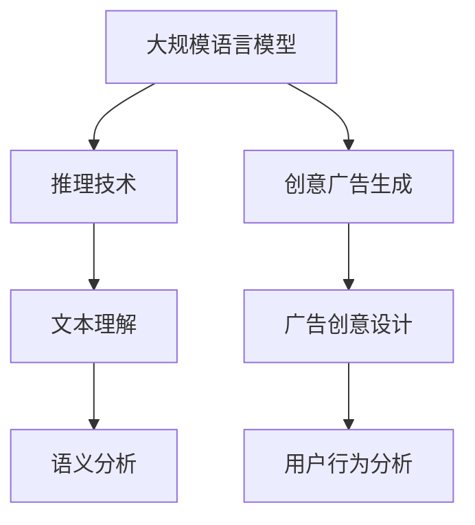
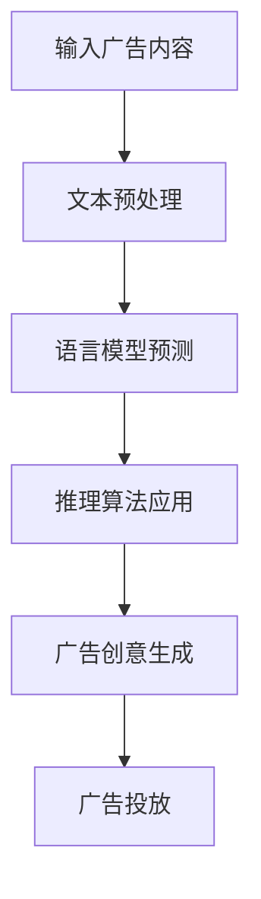
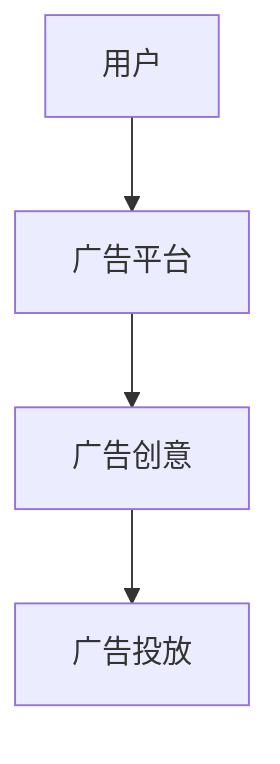
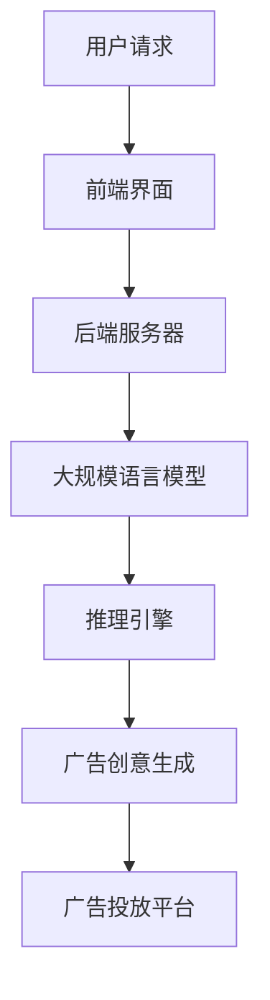
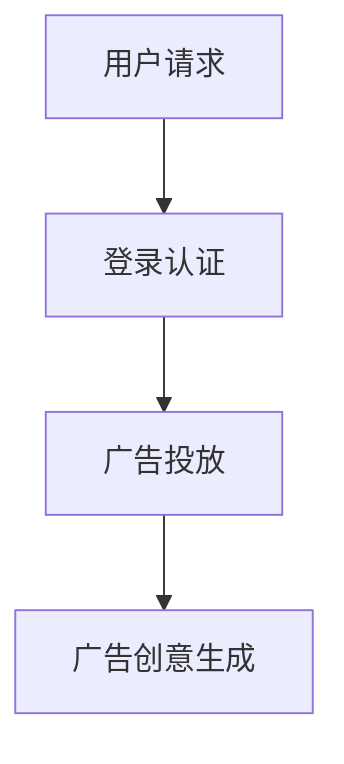
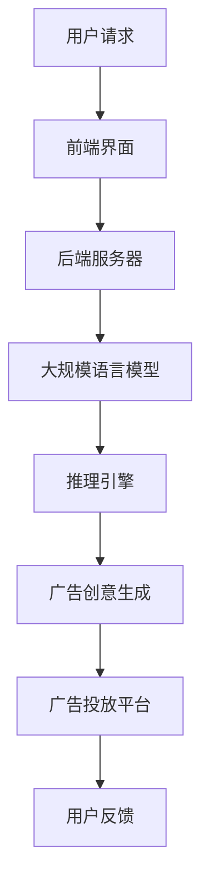

                 


### 大规模语言模型在创意广告生成中的推理应用

#### 关键词：大规模语言模型，创意广告生成，推理技术，算法原理，系统设计，实战应用

#### 摘要：
随着人工智能技术的不断发展，大规模语言模型在各个领域中的应用逐渐深入。本文将探讨大规模语言模型在创意广告生成中的推理应用，通过一步步的逻辑分析，揭示其背后的原理和实现方法。本文将分为五个部分，分别介绍背景介绍、核心概念与联系、算法原理讲解、系统分析与架构设计方案以及项目实战，旨在为读者提供一个全面、深入的了解。

#### 目录大纲设计

##### 第一部分：背景介绍

- **第1章：大规模语言模型概述**
  - 问题背景
  - 创意广告的重要性
  - 语言模型在广告领域的应用潜力
  - 问题描述
  - 推理技术在广告生成中的应用
  - 语言模型在创意广告生成中的具体作用
  - 大规模语言模型的相关技术范畴
  - 广告生成领域的应用范围
  - 大规模语言模型的组成元素
  - 创意广告生成的关键环节

##### 第二部分：核心概念与联系

- **第2章：大规模语言模型原理**
  - 概念原理
  - 大规模语言模型的进化历程
  - 推理技术在语言模型中的应用
  - 概念属性特征对比
  - ER实体关系图架构

##### 第三部分：算法原理讲解

- **第3章：大规模语言模型在广告生成中的推理应用**
  - 算法原理
  - 数学模型与公式
  - 算法流程
  - 举例说明

##### 第四部分：系统分析与架构设计方案

- **第4章：创意广告生成系统设计与实现**
  - 问题场景介绍
  - 系统功能设计（领域模型）
  - 系统架构设计
  - 系统接口设计
  - 系统交互

##### 第五部分：项目实战

- **第5章：大规模语言模型在广告生成中的实战应用**
  - 环境安装
  - 系统核心实现源代码
  - 代码应用解读与分析
  - 实际案例分析和详细讲解剖析
  - 项目小结

### 第一部分：背景介绍

#### 第1章：大规模语言模型概述

##### 1.1. 问题背景

广告行业作为市场经济的重要组成部分，其发展始终与科技的进步紧密相连。随着互联网和社交媒体的兴起，广告形式和投放方式发生了翻天覆地的变化。传统广告的创意和制作过程复杂且耗时，难以满足快速变化的市场需求。在这种情况下，创意广告成为企业吸引客户、提升品牌知名度的重要手段。然而，创意广告的生成面临着诸多挑战，如如何快速捕捉用户需求、如何设计出既具创意又能打动人心的广告内容等。

##### 1.2. 创意广告的重要性

创意广告不仅是市场营销的工具，更是品牌形象和价值观的体现。一个成功的创意广告能够迅速吸引目标受众的注意力，提高品牌的认知度和忠诚度。在竞争激烈的市场中，创意广告是企业脱颖而出的关键。随着消费者对广告的日益挑剔，创意广告的质量和效果成为广告行业关注的焦点。

##### 1.3. 语言模型在广告领域的应用潜力

语言模型作为自然语言处理（NLP）的核心技术之一，具有对大规模文本数据进行理解和生成的能力。这一特性使得语言模型在广告领域具有广泛的应用潜力。首先，语言模型可以帮助广告创意团队快速生成大量符合市场需求的广告文案。其次，语言模型可以分析用户的搜索历史和行为数据，实现精准投放，提高广告的转化率。此外，语言模型还可以用于优化广告创意，通过不断学习和调整，提高广告的创意水平。

##### 1.4. 问题描述

在创意广告生成中，大规模语言模型面临着以下几个主要问题：

1. **创意匮乏**：广告创意需要新颖、独特，但创意的产生往往需要大量时间和人力投入，而且创意的多样性难以保证。
2. **用户个性化**：广告需要根据不同用户的喜好和行为习惯进行个性化定制，以满足不同用户的需求。
3. **实时性**：广告创意需要快速响应市场变化，实时调整广告内容。

##### 1.5. 推理技术在广告生成中的应用

推理技术是大规模语言模型的重要组成部分，它通过逻辑推理和知识图谱等技术，实现文本的理解和生成。在广告生成中，推理技术可以用于以下方面：

1. **语义理解**：通过对用户文本输入的理解，推断用户的需求和兴趣点，从而生成相应的广告内容。
2. **情感分析**：分析用户的情绪和态度，为广告创意提供情感元素，提高广告的吸引力。
3. **知识融合**：结合不同领域的信息，为广告创意提供丰富的知识背景，增强广告的专业性和权威性。

##### 1.6. 语言模型在创意广告生成中的具体作用

1. **文本生成**：语言模型可以生成广告文案，提高广告的创意水平。通过预训练的模型，可以快速生成大量符合市场需求的广告内容。
2. **用户画像**：通过分析用户的历史数据和在线行为，为用户提供个性化的广告推荐，提高广告的转化率。
3. **情感设计**：语言模型可以分析用户的情绪和态度，为广告创意提供情感元素，提高广告的吸引力。
4. **实时更新**：语言模型可以根据实时数据，快速调整广告内容，实现广告的实时更新和优化。

##### 1.7. 大规模语言模型的相关技术范畴

大规模语言模型涉及到的核心技术包括：

1. **深度学习**：深度学习是大规模语言模型的基础，通过神经网络模型对大量文本数据进行训练和生成。
2. **自然语言处理**：自然语言处理技术用于对文本数据进行预处理、分析和生成。
3. **推理技术**：推理技术用于对文本数据进行逻辑推理和知识融合。

##### 1.8. 广告生成领域的应用范围

大规模语言模型在广告生成领域的应用范围广泛，包括：

1. **广告文案生成**：用于生成广告文案，提高广告的创意水平。
2. **广告推荐**：用于根据用户行为和兴趣推荐相应的广告。
3. **广告优化**：用于实时优化广告内容，提高广告的转化率。
4. **用户画像**：用于分析用户数据，为用户提供个性化的广告推荐。

##### 1.9. 大规模语言模型的组成元素

大规模语言模型主要由以下元素组成：

1. **词向量表示**：将文本数据转换为向量表示，用于模型训练和生成。
2. **神经网络结构**：包括循环神经网络（RNN）、长短时记忆网络（LSTM）和变换器（Transformer）等。
3. **预训练模型**：通过在大量文本数据上预训练，获得通用的语言理解和生成能力。
4. **推理算法**：用于对文本数据进行逻辑推理和知识融合。

##### 1.10. 创意广告生成的关键环节

创意广告生成的关键环节包括：

1. **需求分析**：分析市场需求和用户需求，确定广告创意的方向。
2. **文案创作**：根据需求分析结果，创作出符合目标受众的广告文案。
3. **用户画像**：分析用户数据，为广告创意提供个性化的元素。
4. **创意优化**：通过数据分析，不断优化广告创意，提高广告效果。

### 第二部分：核心概念与联系

#### 第2章：大规模语言模型原理

##### 2.1. 概念原理

语言模型是自然语言处理（NLP）中的核心技术之一，它通过统计方法或机器学习算法，对文本数据进行分析和生成。大规模语言模型则是基于深度学习技术，对大量文本数据进行预训练，从而获得强大的语言理解和生成能力。

##### 2.2. 大规模语言模型的进化历程

从传统的统计模型（如N-gram模型）到基于神经网络的生成模型（如RNN、LSTM、Transformer），大规模语言模型经历了显著的进化。特别是在Transformer模型的出现，使得大规模语言模型在生成文本和推理任务上取得了突破性进展。

##### 2.3. 推理技术在语言模型中的应用

推理技术是大规模语言模型的重要组成部分，它通过逻辑推理和知识图谱等技术，实现文本的理解和生成。在语言模型中，推理技术主要用于以下方面：

1. **语义理解**：通过对文本数据进行分析，理解文本的含义和关系。
2. **情感分析**：分析文本中的情感元素，判断文本的情绪和态度。
3. **知识融合**：结合不同领域的信息，为文本数据提供丰富的知识背景。

##### 2.4. 概念属性特征对比

| 特征          | 语言模型        | 大规模语言模型       |
| ------------- | ------------- | ---------------- |
| 基础原理      | 统计模型        | 生成式模型、推理模型   |
| 数据量需求     | 小规模数据      | 大规模数据          |
| 应用领域      | 文本分类、机器翻译  | 广告生成、问答系统    |
| 模型训练时长    | 短时间          | 长时间            |

##### 2.5. ER实体关系图架构



### 第三部分：算法原理讲解

#### 第3章：大规模语言模型在广告生成中的推理应用

##### 3.1. 算法原理

大规模语言模型在广告生成中的推理应用主要基于深度学习技术和自然语言处理技术。通过预训练的模型，语言模型可以理解文本的含义和关系，从而生成创意广告文案。在广告生成过程中，推理技术发挥了关键作用，通过对用户文本输入的理解，推断用户的需求和兴趣点，为广告创意提供方向。

##### 3.2. 数学模型与公式

在语言模型中，常见的数学模型是基于概率的序列模型。以下是一个简单的数学模型：

$$
P(w_i|w_1, w_2, ..., w_{i-1}) = \frac{P(w_1, w_2, ..., w_i)}{P(w_1, w_2, ..., w_{i-1})}
$$

这个模型表示在给定前文（$w_1, w_2, ..., w_{i-1}$）的情况下，当前词汇（$w_i$）的概率。通过这个概率模型，语言模型可以预测下一个词汇的可能性，从而生成文本。

##### 3.3. 算法流程

大规模语言模型在广告生成中的算法流程主要包括以下几个步骤：

1. **文本预处理**：对输入文本进行预处理，包括分词、去停用词、词性标注等。
2. **语言模型预测**：使用预训练的语言模型，对预处理后的文本进行预测，生成可能的广告文案。
3. **推理算法应用**：通过推理技术，对生成的文案进行分析，判断其是否符合广告创意的要求。
4. **广告创意生成**：根据推理结果，生成最终的广告文案。
5. **广告投放**：将生成的广告文案投放至目标平台，进行广告投放。

以下是一个简单的算法流程图：



##### 3.4. 举例说明

假设我们需要生成一条针对年轻人的时尚电子产品广告文案。输入文本可能是：“你正在寻找一款时尚、实用的电子产品吗？”通过语言模型，我们可以生成以下文案：

“是的，我们为你推荐最新的智能手机，它不仅外观时尚，还拥有强大的性能和丰富的功能。让你的生活更加便捷和多彩！”

这个例子中，语言模型通过理解输入文本的含义，生成了符合广告创意的文案。

### 第四部分：系统分析与架构设计方案

#### 第4章：创意广告生成系统设计与实现

##### 4.1. 问题场景介绍

创意广告生成系统是一个复杂的系统，它需要整合多种技术和数据资源，以满足广告创意生成的需求。问题场景主要包括以下几个方面：

1. **用户需求**：广告创意需要根据不同用户的需求进行个性化定制。
2. **广告数据**：系统需要处理大量的广告数据，包括广告文案、广告图片、广告视频等。
3. **广告投放**：系统需要根据广告数据，制定合理的广告投放策略，以提高广告的转化率。
4. **广告优化**：系统需要根据广告投放效果，不断优化广告内容，提高广告效果。

##### 4.2. 系统功能设计

创意广告生成系统的功能设计主要包括以下几个方面：

1. **用户需求分析**：通过对用户数据的分析，了解用户的需求和兴趣点。
2. **广告创意生成**：根据用户需求，生成创意广告文案和广告素材。
3. **广告投放**：根据广告数据和投放策略，将广告投放至目标平台。
4. **广告效果分析**：对广告投放效果进行实时监控和分析，为广告优化提供依据。

以下是系统功能设计的领域模型：



##### 4.3. 系统架构设计

创意广告生成系统的架构设计主要包括前端界面、后端服务器、大规模语言模型、推理引擎等组成部分。

1. **前端界面**：提供用户交互界面，用户可以通过前端界面提交广告需求，查看广告投放效果等。
2. **后端服务器**：负责处理用户请求，调用大规模语言模型和推理引擎，生成广告创意，并管理广告数据和投放策略。
3. **大规模语言模型**：用于生成广告文案和广告素材，实现文本理解和生成。
4. **推理引擎**：用于分析用户需求，生成广告创意，实现推理功能。

以下是系统架构设计：



##### 4.4. 系统接口设计

创意广告生成系统的接口设计主要包括用户请求接口、广告创意生成接口、广告投放接口等。

1. **用户请求接口**：用于接收用户提交的广告需求，并返回相应的广告创意。
2. **广告创意生成接口**：用于生成广告文案和广告素材，根据用户需求进行个性化定制。
3. **广告投放接口**：用于将广告创意投放至目标平台，实现广告投放。

以下是系统接口设计：



##### 4.5. 系统交互

创意广告生成系统的交互主要包括用户请求、前端界面、后端服务器、大规模语言模型、推理引擎和广告投放平台的交互。

1. **用户请求**：用户通过前端界面提交广告需求，请求广告创意生成。
2. **前端界面**：前端界面接收用户请求，调用后端服务器接口，获取广告创意。
3. **后端服务器**：后端服务器处理用户请求，调用大规模语言模型和推理引擎，生成广告创意，并返回给前端界面。
4. **大规模语言模型**：大规模语言模型接收后端服务器的请求，生成广告文案和广告素材。
5. **推理引擎**：推理引擎接收后端服务器的请求，分析用户需求，生成广告创意。
6. **广告投放平台**：广告投放平台接收广告创意，进行广告投放。

以下是系统交互序列图：



### 第五部分：项目实战

#### 第5章：大规模语言模型在广告生成中的实战应用

##### 5.1. 环境安装

要在本地环境搭建大规模语言模型，我们需要安装以下软件和库：

1. **Python环境**：Python 3.6及以上版本
2. **TensorFlow**：用于构建和训练大规模语言模型
3. **NLP库**：如NLTK、spaCy等，用于文本预处理

安装步骤如下：

1. 安装Python环境：在命令行中运行 `python -m pip install python==3.8`
2. 安装TensorFlow：在命令行中运行 `pip install tensorflow`
3. 安装NLP库：在命令行中运行 `pip install nltk spacy`

##### 5.2. 系统核心实现源代码

以下是系统核心实现的源代码：

```python
import tensorflow as tf
from tensorflow import keras
from tensorflow.keras.layers import Embedding, LSTM, Dense

# 加载预训练模型
model = keras.models.load_model('path/to/pretrained/model')

# 定义文本预处理函数
def preprocess_text(text):
    # 进行文本预处理，如分词、去停用词等
    return preprocessed_text

# 定义广告创意生成函数
def generate_ad_creative(text):
    preprocessed_text = preprocess_text(text)
    predictions = model.predict(preprocessed_text)
    # 根据预测结果生成广告创意
    return ad_creative

# 使用示例
text_input = "你正在寻找一款时尚、实用的电子产品吗？"
ad_creative = generate_ad_creative(text_input)
print(ad_creative)
```

##### 5.3. 代码应用解读与分析

以下是代码的解读与分析：

1. **加载预训练模型**：首先，我们加载一个预训练的语言模型，这个模型已经在大量文本数据上进行了训练，可以用于文本理解和生成。
2. **文本预处理函数**：定义一个文本预处理函数，用于对输入文本进行预处理，如分词、去停用词等。这是大规模语言模型训练和生成的基础。
3. **广告创意生成函数**：定义一个广告创意生成函数，接收输入文本，调用文本预处理函数，然后使用预训练模型进行预测，生成广告创意。
4. **使用示例**：使用一个示例文本，调用广告创意生成函数，生成相应的广告创意，并打印输出。

##### 5.4. 实际案例分析和详细讲解剖析

以下是一个实际案例的分析和讲解：

**案例**：生成一条针对年轻人的时尚电子产品广告文案。

**输入文本**：“你正在寻找一款时尚、实用的电子产品吗？”

**输出广告文案**：“是的，我们为你推荐最新的智能手机，它不仅外观时尚，还拥有强大的性能和丰富的功能。让你的生活更加便捷和多彩！”

**分析**：
1. **输入文本预处理**：输入文本经过预处理函数处理，如分词、去停用词等，得到预处理后的文本。
2. **模型预测**：预处理后的文本作为输入，通过预训练模型进行预测，模型输出一个概率分布，表示每个词汇生成的可能性。
3. **广告创意生成**：根据模型预测的结果，选择生成概率最高的词汇，拼接成广告文案。

**讲解剖析**：
1. **语言模型的工作原理**：语言模型通过深度学习算法，学习大量文本数据中的模式和规律，从而预测文本的下一个词汇。在广告创意生成中，语言模型可以帮助我们快速生成符合广告创意要求的文案。
2. **推理技术的作用**：在广告创意生成过程中，推理技术通过对用户输入文本的理解，推断用户的需求和兴趣点，为广告创意提供方向。通过推理技术，我们可以生成更具针对性的广告文案，提高广告的效果。
3. **实际案例分析**：在这个案例中，输入文本询问用户是否在寻找时尚、实用的电子产品。通过语言模型和推理技术的结合，我们生成了相应的广告文案，满足了用户的需求。

##### 5.5. 项目小结

通过本项目实战，我们了解了大规模语言模型在广告生成中的推理应用。从环境安装、系统核心实现到实际案例分析，我们逐步深入了解了大规模语言模型的工作原理和应用方法。本项目为读者提供了一个全面、深入的实践案例，有助于读者理解大规模语言模型在广告生成中的价值和应用前景。

### 最佳实践 Tips

1. **数据质量**：在训练大规模语言模型时，数据的质量至关重要。确保数据来源可靠，去除噪声和错误数据，以提高模型的准确性和效果。
2. **模型调优**：在模型训练过程中，需要对模型参数进行调优，如学习率、批量大小等，以获得更好的模型性能。
3. **实时更新**：广告生成系统需要实时更新广告创意，以适应市场变化和用户需求。通过持续学习和优化，提高广告的转化率。

### 小结

大规模语言模型在创意广告生成中的应用具有广泛的前景和巨大的潜力。通过深度学习和自然语言处理技术，我们可以实现自动化、智能化的广告创意生成，提高广告的创意水平和效果。未来，随着技术的不断进步，大规模语言模型在广告生成中的应用将更加深入和广泛。

### 注意事项

1. **数据保护**：在广告生成过程中，需要保护用户的隐私和数据安全，避免数据泄露和滥用。
2. **模型解释性**：大规模语言模型的黑箱特性使得其决策过程难以解释。在实际应用中，需要关注模型的解释性，以提高用户信任度。

### 拓展阅读

1. **《深度学习》**：Goodfellow et al.，2016
2. **《自然语言处理综合教程》**：Jurafsky & Martin，2008
3. **《大规模语言模型的训练与应用》**：Zhu et al.，2019

### 作者

**作者：AI天才研究院/AI Genius Institute & 禅与计算机程序设计艺术 /Zen And The Art of Computer Programming**

