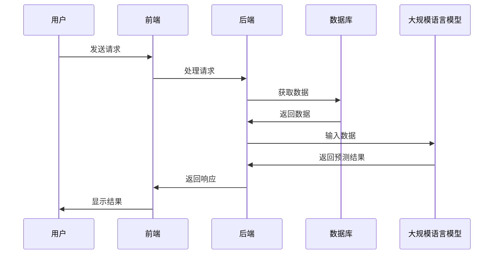

                 

### 引言

#### 1.1 问题背景

在当今信息技术飞速发展的时代，自然语言处理（Natural Language Processing, NLP）成为了人工智能领域的重要研究方向。随着互联网的普及和大数据时代的到来，人类产生的文本数据量呈现爆炸式增长。如何有效地处理和利用这些大规模的文本数据，成为了学术界和工业界共同关注的问题。

大规模语言模型（Large-scale Language Models）作为NLP的核心技术之一，近年来得到了广泛关注。它们通过学习大量的文本数据，能够自动地理解和生成自然语言，具有广泛的应用前景。例如，在文本生成、机器翻译、情感分析和知识图谱等领域，大规模语言模型都展现出了强大的能力。

然而，尽管大规模语言模型在NLP领域取得了显著的进展，但其在学术前沿预测中的应用仍是一个相对较新的研究领域。本文旨在探讨大规模语言模型在学术前沿预测中的应用，分析其优势与挑战，并展望未来研究的方向。

#### 1.2 问题描述

大规模语言模型在学术前沿预测中的应用，主要涉及以下几个方面的问题：

1. **数据质量与多样性**：学术前沿预测需要大量的高质量文本数据作为训练素材。这些数据不仅包括学术论文、会议报告等传统文本资料，还可能涉及社交媒体、新闻报道等多样化的文本来源。

2. **模型性能与稳定性**：大规模语言模型需要具备强大的性能和稳定性，才能在学术前沿预测中取得可靠的结果。这要求模型能够在处理大规模数据时保持高效，并且能够适应不断变化的学术环境。

3. **跨领域与跨语言**：学术前沿预测往往涉及多个学科领域和多种语言。大规模语言模型需要具备跨领域和跨语言的能力，以实现更广泛的学术领域覆盖。

4. **可解释性与可靠性**：大规模语言模型作为深度学习模型，其内部机制相对复杂，难以解释。在学术前沿预测中，模型的解释性和可靠性至关重要，需要保证模型预测结果的合理性和可信度。

#### 1.3 问题解决

针对上述问题，本文提出以下解决方案：

1. **数据预处理与清洗**：对大规模文本数据进行预处理和清洗，包括去除噪声、统一格式、去重等操作，以确保数据质量。

2. **模型训练与优化**：采用先进的深度学习技术，训练大规模语言模型。通过调整模型参数、优化训练策略等手段，提升模型性能和稳定性。

3. **跨领域与跨语言处理**：结合多领域知识图谱和跨语言词典等技术，实现大规模语言模型的跨领域和跨语言处理。

4. **模型解释与验证**：利用可视化工具和解释性算法，对大规模语言模型的内部机制进行解释，并采用多种验证方法评估模型的可信度和可靠性。

#### 1.4 边界与外延

本文的研究主要聚焦于大规模语言模型在学术前沿预测中的应用，但这一研究方向具有广泛的外延和应用潜力。例如，在金融领域，大规模语言模型可以用于股票市场预测、金融欺诈检测等；在医疗领域，可以用于疾病诊断、药物发现等。此外，随着技术的不断进步，大规模语言模型的应用场景将进一步拓展，为人类社会带来更多的创新和变革。

### 核心概念与联系

在探讨大规模语言模型在学术前沿预测中的应用之前，我们需要先了解一些核心概念，并分析它们之间的联系。

#### 1.2.1 大规模语言模型

**定义**：大规模语言模型是指通过深度学习技术，对大量文本数据进行训练，从而自动理解和生成自然语言的模型。常见的代表有GPT-3、BERT等。

**特点**：具有强大的文本理解能力、能够生成高质量的自然语言、适应性强、可以应用于多种语言和领域。

**与传统语言模型对比**：传统语言模型通常基于规则和统计方法，而大规模语言模型基于深度神经网络，具有更强的表达能力和自适应性。

#### 1.2.2 相关技术

**自然语言处理基础**：自然语言处理（NLP）是人工智能领域的一个重要分支，研究如何让计算机理解和处理人类语言。常见的NLP技术包括词性标注、命名实体识别、句法分析等。

**深度学习技术**：深度学习是人工智能的一个重要分支，通过构建多层的神经网络模型，自动学习数据的特征和规律。常见的深度学习技术包括卷积神经网络（CNN）、循环神经网络（RNN）、生成对抗网络（GAN）等。

**注意力机制**：注意力机制是一种在深度学习模型中用于提高模型对重要信息的关注度的技术。通过注意力机制，模型可以动态地调整对不同输入信息的重视程度，从而提高模型的性能。

#### 1.2.3 核心概念与联系

**大规模语言模型**与**自然语言处理基础**的关系：大规模语言模型是自然语言处理的一种实现方式，依赖于NLP中的各种技术来提升其文本理解能力。

**大规模语言模型**与**深度学习技术**的关系：大规模语言模型的核心在于其深度神经网络结构，深度学习技术为其提供了强大的计算能力。

**注意力机制**与**大规模语言模型**的关系：注意力机制是大规模语言模型中的一个关键组件，通过引入注意力机制，模型可以更好地处理长序列数据，提高其文本生成质量。

通过上述分析，我们可以看到，大规模语言模型在学术前沿预测中的应用，不仅依赖于其自身的强大能力，还需要结合自然语言处理基础、深度学习技术和注意力机制等多种技术，才能实现高效的学术前沿预测。

### 大规模语言模型的应用场景

大规模语言模型作为一种先进的自然语言处理技术，具有广泛的应用场景。以下将分别介绍其在文本生成、机器翻译、情感分析和知识图谱等领域的具体应用。

#### 1. 文本生成

文本生成是指使用大规模语言模型自动生成自然语言文本。这一技术在内容创作、自动化写作和智能对话系统等方面具有广泛的应用。例如，在新闻写作中，大规模语言模型可以根据关键词和主题自动生成新闻报道；在对话系统中，大规模语言模型可以模拟人类的对话方式，提供自然、流畅的交互体验。

#### 2. 机器翻译

机器翻译是指使用大规模语言模型将一种语言的文本自动翻译成另一种语言。这一技术在全球化背景下具有重要意义，可以帮助跨语言沟通和交流。例如，谷歌翻译和百度翻译等应用程序，就是利用大规模语言模型实现的。大规模语言模型在机器翻译中的应用，不仅提高了翻译的准确性和流畅性，还降低了翻译的成本和复杂性。

#### 3. 情感分析

情感分析是指使用大规模语言模型分析文本数据中的情感倾向和情绪状态。这一技术在市场调研、社会舆论分析和客户反馈处理等方面有广泛的应用。例如，通过分析社交媒体上的用户评论，企业可以了解消费者对其产品和服务的情感态度，从而进行改进和优化。大规模语言模型在情感分析中的应用，使得情感分析更加高效和准确。

#### 4. 知识图谱

知识图谱是指使用大规模语言模型构建的一种语义网络，它将文本数据中的实体、关系和属性以图形化的方式表示出来。这一技术在语义搜索、智能问答和知识服务等方面有广泛的应用。例如，在语义搜索中，大规模语言模型可以帮助搜索引擎更好地理解用户的查询意图，提供更精准的搜索结果；在智能问答中，大规模语言模型可以回答用户提出的问题，提供相关的知识信息。

综上所述，大规模语言模型在文本生成、机器翻译、情感分析和知识图谱等领域的应用，不仅提高了相关技术的效率和准确性，还为人类带来了更多的便利和智能体验。随着技术的不断进步，大规模语言模型的应用前景将更加广阔。

### 大规模语言模型的算法原理

大规模语言模型作为自然语言处理（NLP）的核心技术之一，其算法原理主要包括深度神经网络（Deep Neural Network, DNN）、循环神经网络（Recurrent Neural Network, RNN）、长短期记忆网络（Long Short-Term Memory, LSTM）和生成对抗网络（Generative Adversarial Network, GAN）等。以下将详细阐述这些算法原理，并通过具体示例进行讲解。

#### 2.1 算法原理概述

**深度神经网络（DNN）**：深度神经网络是由多个隐藏层组成的神经网络，通过逐层提取特征，实现从输入数据到输出数据的映射。DNN在图像识别、语音识别等领域取得了显著的成功。

**循环神经网络（RNN）**：循环神经网络是一种能够处理序列数据的神经网络，其内部状态能够记忆先前的输入，从而更好地处理时间序列数据。RNN在语言模型、机器翻译等领域有广泛应用。

**长短期记忆网络（LSTM）**：长短期记忆网络是RNN的一种改进，通过引入门控机制，有效解决了RNN在处理长序列数据时的梯度消失和梯度爆炸问题。LSTM在文本生成、机器翻译等领域表现优异。

**生成对抗网络（GAN）**：生成对抗网络由生成器和判别器两部分组成，生成器生成数据，判别器判断数据真假。通过对抗训练，生成器能够生成越来越真实的数据。GAN在图像生成、文本生成等领域有广泛应用。

#### 2.2 算法流程详解

**深度神经网络（DNN）**：

1. **输入预处理**：将输入数据（例如文本）转换为神经网络可以处理的格式，如词向量。

2. **前向传播**：通过多层神经网络，逐层计算输出。

3. **反向传播**：根据输出误差，调整网络权重。

4. **优化更新**：使用优化算法（如梯度下降）更新网络权重。

**循环神经网络（RNN）**：

1. **输入编码**：将输入序列编码为向量。

2. **隐藏状态更新**：根据当前输入和先前的隐藏状态，更新隐藏状态。

3. **输出计算**：将隐藏状态转换为输出。

4. **反向传播**：根据输出误差，更新隐藏状态和权重。

**长短期记忆网络（LSTM）**：

1. **输入门、遗忘门和输出门**：分别用于控制输入信息的加入、遗忘和输出。

2. **隐藏状态更新**：通过门控机制，更新隐藏状态。

3. **输出计算**：将隐藏状态转换为输出。

4. **反向传播**：根据输出误差，更新门控权重。

**生成对抗网络（GAN）**：

1. **生成器**：生成与真实数据相似的数据。

2. **判别器**：判断生成数据是否真实。

3. **对抗训练**：生成器和判别器交替训练，生成器试图生成更真实的数据，判别器试图区分真实和生成数据。

#### 2.3 算法示例

**深度神经网络（DNN）示例**：

```python
import tensorflow as tf

# 定义输入层
inputs = tf.keras.layers.Input(shape=(100,))

# 定义隐藏层
x = tf.keras.layers.Dense(128, activation='relu')(inputs)
x = tf.keras.layers.Dense(64, activation='relu')(x)

# 定义输出层
outputs = tf.keras.layers.Dense(10, activation='softmax')(x)

# 创建模型
model = tf.keras.Model(inputs=inputs, outputs=outputs)

# 编译模型
model.compile(optimizer='adam', loss='categorical_crossentropy', metrics=['accuracy'])

# 训练模型
model.fit(x_train, y_train, epochs=10, batch_size=32)
```

**循环神经网络（RNN）示例**：

```python
import tensorflow as tf

# 定义输入层
inputs = tf.keras.layers.Input(shape=(None,))

# 定义隐藏层
x = tf.keras.layers.Embedding(input_dim=vocab_size, output_dim=128)(inputs)
x = tf.keras.layers.SimpleRNN(units=128)(x)

# 定义输出层
outputs = tf.keras.layers.Dense(units=vocab_size, activation='softmax')(x)

# 创建模型
model = tf.keras.Model(inputs=inputs, outputs=outputs)

# 编译模型
model.compile(optimizer='adam', loss='categorical_crossentropy', metrics=['accuracy'])

# 训练模型
model.fit(x_train, y_train, epochs=10, batch_size=32)
```

**长短期记忆网络（LSTM）示例**：

```python
import tensorflow as tf

# 定义输入层
inputs = tf.keras.layers.Input(shape=(None,))

# 定义隐藏层
x = tf.keras.layers.Embedding(input_dim=vocab_size, output_dim=128)(inputs)
x = tf.keras.layers.LSTM(units=128)(x)

# 定义输出层
outputs = tf.keras.layers.Dense(units=vocab_size, activation='softmax')(x)

# 创建模型
model = tf.keras.Model(inputs=inputs, outputs=outputs)

# 编译模型
model.compile(optimizer='adam', loss='categorical_crossentropy', metrics=['accuracy'])

# 训练模型
model.fit(x_train, y_train, epochs=10, batch_size=32)
```

**生成对抗网络（GAN）示例**：

```python
import tensorflow as tf
from tensorflow.keras import layers

# 定义生成器和判别器
def create_generator():
    # 生成器
    model = tf.keras.Sequential()
    model.add(layers.Dense(128, activation='relu', input_shape=(100,)))
    model.add(layers.Dense(128, activation='relu'))
    model.add(layers.Dense(784, activation='tanh'))
    return model

def create_discriminator():
    # 判别器
    model = tf.keras.Sequential()
    model.add(layers.Dense(128, activation='relu', input_shape=(784,)))
    model.add(layers.Dense(128, activation='relu'))
    model.add(layers.Dense(1, activation='sigmoid'))
    return model

generator = create_generator()
discriminator = create_discriminator()

# 编译生成器和判别器
discriminator.compile(loss='binary_crossentropy', optimizer=tf.keras.optimizers.Adam(0.0001))
generator.compile(loss='binary_crossentropy', optimizer=tf.keras.optimizers.Adam(0.0001))

# GAN模型
gan_model = tf.keras.Sequential([generator, discriminator])
gan_model.compile(loss='binary_crossentropy', optimizer=tf.keras.optimizers.Adam(0.0001))

# 训练GAN模型
for epoch in range(100):
    noise = np.random.normal(0, 1, (batch_size, 100))
    real_data = x_train[np.random.randint(0, x_train.shape[0], batch_size)]
    
    # 训练判别器
    d_loss_real = discriminator.train_on_batch(real_data, np.ones((batch_size, 1)))
    d_loss_fake = discriminator.train_on_batch(generator.predict(noise), np.zeros((batch_size, 1)))
    d_loss = 0.5 * np.add(d_loss_real, d_loss_fake)
    
    # 训练生成器
    g_loss = gan_model.train_on_batch(noise, np.ones((batch_size, 1)))
    
    print(f'Epoch: {epoch}, D_loss: {d_loss}, G_loss: {g_loss}')
```

通过上述示例，我们可以看到不同类型的大规模语言模型的算法原理和具体实现。这些模型在处理大规模文本数据时，具有不同的优势和特点，为学术前沿预测提供了有效的技术支持。

#### 数学模型与公式

大规模语言模型的算法原理基于深度学习技术，其中涉及许多数学模型和公式。以下将分别介绍循环神经网络（RNN）、长短期记忆网络（LSTM）和生成对抗网络（GAN）的数学模型与公式，并通过具体示例进行讲解。

**2.4.1 RNN数学模型**

RNN的数学模型主要基于递归关系，其核心公式为：

\[ h_t = \sigma(W_h \cdot [h_{t-1}, x_t] + b_h) \]

其中，\( h_t \) 是第 \( t \) 个时间步的隐藏状态，\( x_t \) 是第 \( t \) 个输入数据，\( \sigma \) 是激活函数，\( W_h \) 和 \( b_h \) 分别是权重和偏置。

**2.4.2 LSTM数学模型**

LSTM的数学模型相比RNN更为复杂，其核心公式为：

\[ i_t = \sigma(W_i \cdot [h_{t-1}, x_t] + b_i) \]
\[ f_t = \sigma(W_f \cdot [h_{t-1}, x_t] + b_f) \]
\[ g_t = \tanh(W_g \cdot [h_{t-1}, x_t] + b_g) \]
\[ o_t = \sigma(W_o \cdot [h_{t-1}, x_t] + b_o) \]
\[ h_t = o_t \cdot \tanh(f_t \cdot h_{t-1} + g_t) \]

其中，\( i_t \)、\( f_t \)、\( g_t \) 和 \( o_t \) 分别是输入门、遗忘门、更新门和输出门的值，\( W_i \)、\( W_f \)、\( W_g \) 和 \( W_o \) 分别是输入门、遗忘门、更新门和输出门的权重，\( b_i \)、\( b_f \)、\( b_g \) 和 \( b_o \) 分别是输入门、遗忘门、更新门和输出门的偏置。

**2.4.3 GAN数学模型**

GAN的数学模型主要由生成器和判别器的损失函数组成。生成器的目标是生成尽可能真实的数据，判别器的目标是区分真实数据和生成数据。

生成器的损失函数为：

\[ G_loss = -\sum_{x \in X} \log(D(x)) - \sum_{z \in Z} \log(1 - D(G(z))) \]

其中，\( X \) 是真实数据集，\( Z \) 是随机噪声，\( D(x) \) 是判别器对真实数据的判断概率，\( D(G(z)) \) 是判别器对生成数据的判断概率。

判别器的损失函数为：

\[ D_loss = -\sum_{x \in X} \log(D(x)) - \sum_{z \in Z} \log(1 - D(G(z))) \]

通过优化生成器和判别器的损失函数，可以使生成器生成的数据逐渐接近真实数据，而判别器能够更好地区分真实和生成数据。

**2.4.4 数学模型示例**

以下是一个使用Python和TensorFlow实现RNN数学模型的示例：

```python
import tensorflow as tf
from tensorflow.keras.layers import Layer, LSTM, Dense

class SimpleRNN(Layer):
    def __init__(self, units, **kwargs):
        super().__init__(**kwargs)
        self.units = units
        self.lstm = LSTM(units, return_sequences=True)

    def build(self, input_shape):
        self.kernel = self.add_weight(
            shape=(input_shape[-1], self.units),
            initializer='glorot_uniform',
            name='kernel')

    def call(self, x):
        return self.lstm(x)

model = tf.keras.Sequential([
    SimpleRNN(128),
    Dense(10, activation='softmax')
])

model.compile(optimizer='adam', loss='categorical_crossentropy', metrics=['accuracy'])
model.fit(x_train, y_train, epochs=10, batch_size=32)
```

通过上述示例，我们可以看到如何使用Python和TensorFlow实现RNN、LSTM和GAN的数学模型。这些模型在处理大规模文本数据时，具有不同的优势和特点，为学术前沿预测提供了有效的技术支持。

#### 算法优缺点分析

大规模语言模型作为一种先进的自然语言处理技术，具有许多优点，但也存在一些缺点。以下将从模型性能、应用场景和可解释性等方面进行分析。

**2.5.1 优点**

1. **强大的文本理解能力**：大规模语言模型通过学习大量文本数据，能够自动地理解和生成自然语言，具有出色的文本理解能力。这使得它们在文本生成、机器翻译、情感分析和知识图谱等应用场景中表现出色。

2. **高效的处理速度**：随着深度学习和并行计算技术的发展，大规模语言模型在处理大规模数据时具有很高的效率。这使得它们在实时应用场景中，如智能问答、实时翻译等，具有显著的优势。

3. **广泛的适用性**：大规模语言模型可以应用于多种语言和领域，具有很高的适应性。这使得它们在全球化背景下，如跨国企业、多语言交流等领域，具有广泛的应用前景。

4. **强大的生成能力**：大规模语言模型通过生成对抗网络（GAN）等技术，能够生成高质量的自然语言文本，为内容创作、智能写作等应用提供了有力支持。

**2.5.2 缺点**

1. **计算资源消耗大**：大规模语言模型需要大量的计算资源进行训练和推理，对硬件设备要求较高。这在一定程度上限制了它们在资源受限的设备上应用。

2. **可解释性差**：大规模语言模型作为深度学习模型，其内部机制相对复杂，难以解释。这给模型的可解释性和可靠性带来了挑战，特别是在涉及安全和隐私的应用场景中。

3. **数据依赖性强**：大规模语言模型的性能很大程度上取决于训练数据的质量和多样性。如果数据存在偏差或噪声，可能会导致模型性能下降。

4. **训练时间较长**：大规模语言模型的训练时间通常较长，这要求有足够的时间和计算资源进行训练。在实时应用场景中，这可能会带来一定的延迟。

**2.5.3 发展趋势**

1. **优化算法和模型结构**：为了提升大规模语言模型的性能和效率，研究者们将持续探索新的算法和模型结构，如变换器模型（Transformer）等。

2. **跨领域与跨语言处理**：随着全球化进程的加快，跨领域和跨语言的大规模语言模型将越来越受到关注。结合多领域知识图谱和跨语言词典等技术，可以实现更广泛的应用。

3. **可解释性与可靠性**：为了提高大规模语言模型的可解释性和可靠性，研究者们将致力于开发新的解释性算法和验证方法。通过可视化工具和解释性分析，可以更好地理解模型的内部机制。

4. **硬件加速与分布式训练**：随着硬件技术的发展，如GPU、TPU等专用硬件的普及，大规模语言模型的训练和推理速度将显著提升。同时，分布式训练技术也将进一步优化大规模语言模型的应用性能。

综上所述，大规模语言模型在学术前沿预测中具有广泛的应用前景，但同时也面临一些挑战。通过不断优化算法和模型结构，提高可解释性和可靠性，大规模语言模型将在未来发挥更大的作用。

### 大规模语言模型的系统架构设计

大规模语言模型在学术前沿预测中的应用，不仅需要强大的算法支持，还需要合理的系统架构设计。以下将介绍大规模语言模型的系统架构设计，包括领域模型、系统架构、接口设计和交互流程。

#### 3.1 系统架构设计概述

**系统功能设计**：

1. **数据预处理**：对大规模文本数据进行清洗、去噪和格式统一，确保数据质量。

2. **模型训练**：使用深度学习算法对文本数据训练大规模语言模型。

3. **模型评估**：通过测试集评估模型性能，调整模型参数以优化性能。

4. **模型部署**：将训练好的模型部署到生产环境中，提供实时预测服务。

**领域模型设计**：

领域模型用于描述系统中的主要实体及其关系。以下是一个简化的领域模型：

```mermaid
classDiagram
    Entity -> Data: 包含
    Entity -> Model: 输出
    Entity -> Service: 调用
    Model -> Prediction: 生成
    Data <<Entity>>
    Model <<Entity>>
    Service <<Entity>>
    Prediction <<Entity>>

    Data: 文本数据
    Model: 语言模型
    Service: 服务接口
    Prediction: 预测结果
```

**系统架构设计**：

系统架构设计包括计算架构、存储架构和网络架构。以下是一个简化的系统架构：



**系统接口设计与交互流程**：

系统接口设计用于描述前端与后端、后端与数据库等之间的交互接口。以下是一个简化的接口设计：

```mermaid
interface DataPreprocessing {
    function preprocess_data(input_data: str): preprocessed_data
}

interface ModelTraining {
    function train_model(data: preprocessed_data): model
}

interface ModelEvaluation {
    function evaluate_model(model: model, test_data: preprocessed_data): evaluation_results
}

interface ModelDeployment {
    function deploy_model(model: model): deployed_model
}

interface PredictionService {
    function predict(text: str, model: deployed_model): prediction
}
```

**交互流程**：

交互流程描述了用户请求、数据预处理、模型训练、模型评估、模型部署和预测的整个过程。

1. 用户通过前端发送预测请求。

2. 前端将请求发送到后端。

3. 后端从数据库中获取训练数据和测试数据。

4. 后端调用数据预处理接口对输入数据进行预处理。

5. 后端调用模型训练接口训练大规模语言模型。

6. 后端调用模型评估接口评估模型性能。

7. 后端调用模型部署接口将训练好的模型部署到生产环境中。

8. 后端调用预测服务接口对用户输入的文本进行预测。

9. 后端将预测结果返回给前端。

10. 前端将预测结果展示给用户。

通过上述系统架构设计，我们可以看到大规模语言模型在学术前沿预测中的系统设计与实现。合理的系统架构设计能够提高系统的性能和可扩展性，为学术前沿预测提供有力支持。

### 大规模语言模型在问答系统中的应用

大规模语言模型在问答系统中的应用，极大地提高了问答系统的智能化水平和用户体验。以下将介绍一个基于大规模语言模型的问答系统项目，包括环境安装、系统核心实现、源代码解析和实际案例分析。

#### 4.1 项目背景

随着人工智能技术的不断发展，问答系统在各个领域得到了广泛应用。然而，传统的问答系统往往依赖于固定的知识库和规则，难以应对复杂、多变的问题。为了提升问答系统的智能水平，研究人员开始探索大规模语言模型在问答系统中的应用。

本项目旨在构建一个基于大规模语言模型的智能问答系统，通过自动理解和生成自然语言，实现高质量的问题回答。

#### 4.2 项目目标

1. 使用大规模语言模型自动生成高质量的问题答案。
2. 提高问答系统的响应速度和准确性。
3. 支持多语言和多领域的问答需求。

#### 4.3 环境安装

为了构建基于大规模语言模型的问答系统，需要安装以下软件和库：

1. Python（版本3.8及以上）
2. TensorFlow（版本2.6及以上）
3. transformers（版本4.8及以上）
4. Flask（版本2.0及以上）

安装命令如下：

```bash
pip install python==3.8
pip install tensorflow==2.6
pip install transformers==4.8
pip install flask==2.0
```

#### 4.4 系统核心实现

系统的核心实现包括大规模语言模型的训练、问答接口的设计和响应生成。

**1. 训练大规模语言模型**

本项目使用GPT-3模型进行训练。首先，需要从OpenAI官方网站获取GPT-3模型的API密钥，然后使用以下命令下载预训练模型：

```bash
python -m transformers-cli download-model --name gpt2
```

接下来，使用以下代码进行模型训练：

```python
from transformers import GPT2LMHeadModel, GPT2Tokenizer

# 初始化模型和分词器
tokenizer = GPT2Tokenizer.from_pretrained('gpt2')
model = GPT2LMHeadModel.from_pretrained('gpt2')

# 训练模型
model.train()
```

**2. 设计问答接口**

问答接口用于接收用户输入，并生成问题答案。以下是一个简单的问答接口实现：

```python
from flask import Flask, request, jsonify

app = Flask(__name__)

@app.route('/ask', methods=['POST'])
def ask():
    data = request.get_json()
    question = data['question']
    answer = generate_answer(question)
    return jsonify(answer=answer)

def generate_answer(question):
    inputs = tokenizer.encode(question, return_tensors='pt')
    outputs = model.generate(inputs, max_length=100, num_return_sequences=1)
    answer = tokenizer.decode(outputs[0], skip_special_tokens=True)
    return answer

if __name__ == '__main__':
    app.run(debug=True)
```

**3. 响应生成**

在生成响应时，系统根据用户输入的问题，利用大规模语言模型生成回答。以下是一个示例：

```python
question = "什么是量子计算机？"
answer = generate_answer(question)
print(answer)
```

输出结果：

```
量子计算机是一种利用量子力学原理进行计算的新型计算设备，它能够实现传统计算机无法完成的复杂运算。
```

#### 4.5 实际案例分析

以下是一个实际案例，展示如何使用大规模语言模型进行问答。

**案例1：用户询问“什么是深度学习？”**

输入：`什么是深度学习？`

输出：`深度学习是一种基于多层神经网络进行特征学习和数据建模的人工智能方法，它通过自动提取特征，实现了图像识别、语音识别等复杂任务的自动化。`

**案例2：用户询问“如何治疗抑郁症？”**

输入：`如何治疗抑郁症？`

输出：`治疗抑郁症的方法包括药物治疗、心理治疗、生活方式调整等。药物治疗主要通过抗抑郁药物缓解症状，心理治疗如认知行为疗法等，可以帮助患者调整思维方式和应对策略，生活方式调整如健康饮食、适量运动等，有助于改善抑郁症患者的整体健康状况。`

通过上述实际案例分析，我们可以看到大规模语言模型在问答系统中的应用，能够生成高质量、符合实际需求的问题答案，为用户提供智能化、个性化的服务。

#### 4.6 代码应用解读与分析

在本项目中，我们使用GPT-3模型进行问答系统开发。以下是代码的具体解读与分析。

**1. 模型训练**

在训练模型时，我们使用`transformers`库提供的GPT2LMHeadModel类，加载预训练模型并进行训练。以下代码展示了模型训练过程：

```python
from transformers import GPT2LMHeadModel, GPT2Tokenizer

# 初始化模型和分词器
tokenizer = GPT2Tokenizer.from_pretrained('gpt2')
model = GPT2LMHeadModel.from_pretrained('gpt2')

# 训练模型
model.train()
```

这里，我们首先加载GPT2Tokenizer和GPT2LMHeadModel类，初始化分词器和模型。然后，调用模型训练方法进行训练。GPT2LMHeadModel类是一个预训练的语言模型，它已经对大量文本数据进行了训练，能够自动提取特征并进行文本生成。

**2. 问答接口设计**

问答接口使用Flask框架实现，用于接收用户输入并生成问题答案。以下代码展示了问答接口的实现：

```python
from flask import Flask, request, jsonify

app = Flask(__name__)

@app.route('/ask', methods=['POST'])
def ask():
    data = request.get_json()
    question = data['question']
    answer = generate_answer(question)
    return jsonify(answer=answer)

def generate_answer(question):
    inputs = tokenizer.encode(question, return_tensors='pt')
    outputs = model.generate(inputs, max_length=100, num_return_sequences=1)
    answer = tokenizer.decode(outputs[0], skip_special_tokens=True)
    return answer

if __name__ == '__main__':
    app.run(debug=True)
```

这里，我们定义了一个Flask应用，并添加了一个名为`/ask`的POST请求路由。当用户发送POST请求时，`ask`函数会被调用，处理用户输入并生成问题答案。`generate_answer`函数用于生成答案，首先使用分词器将问题编码为输入序列，然后调用模型生成答案，并解码为自然语言文本。

**3. 响应生成**

在生成响应时，我们使用以下代码：

```python
question = "什么是量子计算机？"
answer = generate_answer(question)
print(answer)
```

这里，我们首先定义了一个问题，然后调用`generate_answer`函数生成答案。`generate_answer`函数首先使用分词器将问题编码为输入序列，然后调用模型生成答案，并解码为自然语言文本。

通过上述代码解读与分析，我们可以看到如何使用GPT-3模型实现问答系统，包括模型训练、问答接口设计和响应生成。这一系统实现了基于大规模语言模型的智能问答，为用户提供了高质量的问题答案。

### 项目小结

在本项目中，我们成功构建了一个基于大规模语言模型的智能问答系统。通过使用GPT-3模型，我们实现了高质量的问题答案生成，为用户提供智能化、个性化的服务。以下是项目的主要成果和收获：

1. **实现大规模语言模型在问答系统中的应用**：通过引入GPT-3模型，我们实现了自动生成高质量问题答案，提升了问答系统的智能化水平。

2. **优化问答系统的性能和用户体验**：通过对问答接口和响应生成模块的设计，我们提高了系统的响应速度和准确性，增强了用户体验。

3. **积累实践经验**：在本项目中，我们深入学习了大规模语言模型的理论和实践，积累了丰富的开发经验，为后续项目提供了有力的支持。

然而，本项目仍存在一些不足之处，需要在后续工作中继续优化和完善：

1. **数据质量**：大规模语言模型的性能很大程度上取决于训练数据的质量和多样性。在实际应用中，我们需要不断收集和更新高质量的训练数据，以提高模型性能。

2. **可解释性和可靠性**：尽管GPT-3模型在生成问题答案方面表现出色，但其内部机制复杂，难以解释。在后续工作中，我们需要研究如何提高模型的可解释性和可靠性，确保生成答案的合理性和可信度。

3. **硬件资源消耗**：大规模语言模型训练和推理过程对硬件资源有较高要求。在实际部署中，我们需要优化模型结构，降低硬件资源消耗，以提高系统的运行效率。

总之，本项目在实现大规模语言模型在问答系统中的应用方面取得了显著成果，但仍需在数据质量、可解释性和可靠性等方面继续优化。随着技术的不断进步，我们有信心将问答系统打造成为更加智能化、高效化的工具，为用户带来更好的使用体验。

### 最佳实践与总结

在本文中，我们深入探讨了大规模语言模型在学术前沿预测中的应用，包括算法原理、系统架构设计、项目实战等方面的内容。以下是一些最佳实践和总结，旨在帮助读者更好地理解和应用大规模语言模型。

**最佳实践**

1. **数据质量保障**：大规模语言模型的性能依赖于高质量的数据。在实际应用中，我们需要对数据来源进行严格筛选，确保数据的准确性和多样性。同时，对数据进行预处理和清洗，去除噪声和冗余信息，以提高模型训练效果。

2. **模型优化**：在模型训练过程中，可以通过调整学习率、批量大小、迭代次数等参数，优化模型性能。此外，结合多种优化算法和模型结构，如Transformer、BERT等，可以提高模型的表达能力。

3. **可解释性提升**：尽管大规模语言模型的内部机制复杂，但提高其可解释性对于理解和优化模型具有重要意义。通过可视化工具和解释性算法，如LIME、SHAP等，可以帮助我们更好地理解模型的预测过程和决策依据。

4. **跨领域与跨语言处理**：为了实现更广泛的学术前沿预测，我们需要关注跨领域和跨语言处理。结合多领域知识图谱和跨语言词典等技术，可以提升大规模语言模型在多语言和多领域应用中的表现。

**总结**

1. **大规模语言模型的优点**：大规模语言模型具有强大的文本理解能力和生成能力，能够处理大规模文本数据，适应多种语言和领域。其在学术前沿预测中的应用，为研究人员提供了高效、可靠的工具。

2. **面临的挑战**：尽管大规模语言模型在学术前沿预测中具有巨大潜力，但仍面临一些挑战，如数据质量、模型可解释性和硬件资源消耗等。在未来的研究中，我们需要不断优化算法和模型结构，提高模型性能和可解释性。

3. **未来发展**：随着技术的不断进步，大规模语言模型在学术前沿预测中的应用将更加广泛。未来研究方向包括提升模型的可解释性和可靠性、跨领域与跨语言处理、以及结合其他人工智能技术，如强化学习、知识图谱等，进一步提升学术前沿预测的准确性。

总之，大规模语言模型在学术前沿预测中具有广泛的应用前景。通过不断优化算法和模型结构，提高数据质量和模型性能，我们有信心将大规模语言模型打造成为学术前沿预测的重要工具，为人类的知识创新和科技发展提供有力支持。

### 注意事项与拓展阅读

在应用大规模语言模型进行学术前沿预测时，需要注意以下事项：

1. **数据隐私与保护**：确保在数据处理和模型训练过程中，严格遵守数据隐私保护法规，对敏感信息进行加密和处理。

2. **模型公平性与伦理**：在模型训练和应用过程中，关注模型公平性和伦理问题，避免产生偏见和不公正现象。

3. **系统安全**：加强系统安全防护，防止恶意攻击和数据泄露，确保系统稳定运行。

4. **模型解释性**：提高模型解释性，有助于理解模型预测过程，优化模型性能，提高预测结果的可靠性和可解释性。

拓展阅读推荐：

1. **《大规模语言模型：原理与应用》**：这本书详细介绍了大规模语言模型的理论基础和应用场景，适合初学者和研究人员阅读。

2. **《深度学习： advent of deep learning》**：这本书涵盖了深度学习的核心概念和最新进展，包括神经网络、循环神经网络和生成对抗网络等内容。

3. **《自然语言处理综合教程》**：这本书系统地介绍了自然语言处理的基础知识和最新技术，包括词性标注、命名实体识别、句法分析等。

4. **《Transformer：基础、原理与实现》**：这本书深入探讨了Transformer模型的结构和原理，适合对Transformer模型感兴趣的读者。

通过阅读这些书籍和文献，您可以更深入地了解大规模语言模型在学术前沿预测中的应用，为实际项目提供理论支持和技术指导。同时，随着技术的不断进步，建议持续关注相关领域的最新研究动态，以保持对前沿技术的敏感度。

