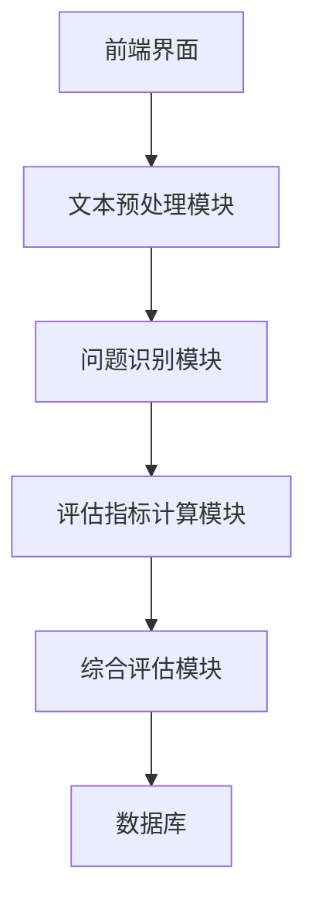
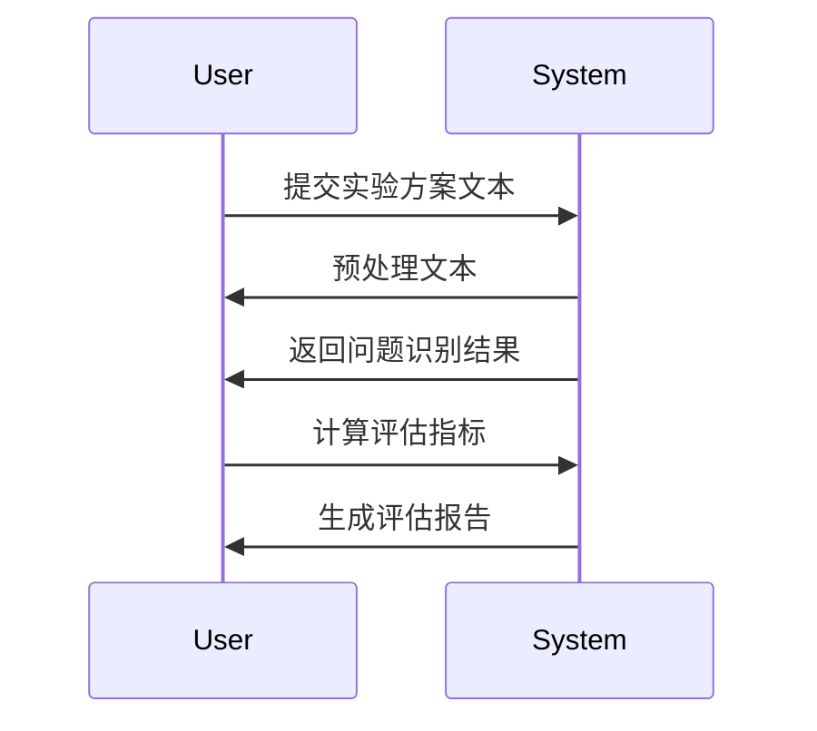

                 

### # 大规模语言模型在科学实验方案评估中的应用

关键词：大规模语言模型、科学实验方案评估、自然语言处理、AI应用、文本分析

摘要：随着人工智能技术的迅速发展，大规模语言模型（如GPT-3）在自然语言处理领域展现出了卓越的性能。本文旨在探讨大规模语言模型在科学实验方案评估中的应用，通过问题识别、评估指标设计、评估模型构建和应用场景探讨，深入分析其在提高科学实验方案评估效率和质量的潜力。本文还讨论了相关核心概念与联系，算法原理，系统分析与架构设计，以及项目实战，旨在为相关领域的研究和实践提供有价值的参考。

## **第一部分：背景介绍**

### **1.1.1 问题背景**

随着人工智能技术的快速发展，大规模语言模型（如GPT-3）在自然语言处理领域展现出了卓越的性能。这些模型在文本生成、机器翻译、问答系统等领域有着广泛的应用。然而，如何有效地利用这些模型进行科学实验方案评估，成为一个新的研究热点。

科学实验方案评估是指对科学实验的可行性、有效性、可靠性等方面进行评估。传统的评估方法主要依赖于专家的经验和主观判断，存在一定的局限性。而大规模语言模型可以处理大量的文本数据，提供客观、准确的评估结果，从而提高科学实验方案评估的效率和质量。

### **1.1.2 问题描述**

科学实验方案评估的目标是确保实验方案的可行性和有效性，以减少实验失败的风险。具体来说，问题描述包括以下几个方面：

1. **可行性**：评估实验方案是否具备实施的条件，包括技术实现的可能性、所需资源的可行性等。
2. **有效性**：评估实验方案在实现目标方面的能力，包括实验结果的准确性、可靠性等。
3. **可靠性**：评估实验方案的可重复性和稳定性，包括实验结果的稳定性、可重复性等。

### **1.1.3 问题解决**

为了解决上述问题，本文提出以下解决方案：

1. **问题识别**：利用大规模语言模型对实验方案中的关键问题进行识别和定位。
2. **评估指标**：设计一系列评估指标，包括实验方案的可行性、有效性、可靠性等，用于评估实验方案的整体质量。
3. **评估模型**：构建一个基于大规模语言模型的评估模型，通过训练和优化，使其能够准确地评估实验方案。
4. **应用场景**：探讨大规模语言模型在科学实验方案评估中的具体应用场景，如药物筛选、疾病诊断、科学研究等。

### **1.1.4 边界与外延**

本文研究的边界主要涉及大规模语言模型在科学实验方案评估中的应用，不包括其他类型的评估方法和领域。然而，本文的研究结果可以拓展到其他需要评估的领域，如工程、医学等。

### **1.1.5 概念结构与核心要素组成**

1. **大规模语言模型**：一种可以处理和理解大规模文本数据的神经网络模型，如GPT-3。
2. **科学实验方案评估**：对科学实验的可行性、有效性、可靠性等方面进行评估。
3. **评估指标**：用于评估实验方案的质量的指标，如可行性、有效性、可靠性等。
4. **评估模型**：基于大规模语言模型构建的评估模型，用于评估实验方案的质量。

## **第二部分：核心概念与联系**

### **2.1 大规模语言模型**

#### **2.1.1 定义**

大规模语言模型（Large-scale Language Models）是一种基于深度学习的自然语言处理模型，能够对文本数据进行建模，并从中提取语义信息。这些模型通常具有数十亿个参数，通过大量的文本数据进行训练，从而实现高效的文本理解和生成。

#### **2.1.2 特点**

- **文本理解能力强大**：大规模语言模型能够处理和理解复杂的文本数据，包括文本的语义、情感、逻辑关系等。
- **自适应性高**：这些模型可以根据不同的任务和应用场景进行自适应调整，提高性能。
- **高效性**：能够快速处理大量的文本数据，提高评估效率。

#### **2.1.3 与传统AI的区别**

- **数据量**：大规模语言模型需要处理的数据量远大于传统AI模型，能够处理和理解更复杂的文本数据。
- **学习方式**：传统AI模型通常采用手动设计特征的方法，而大规模语言模型则采用自动学习特征的方式，能够更好地适应不同的任务和应用场景。

### **2.2 科学实验方案评估**

#### **2.2.1 定义**

科学实验方案评估是指对科学实验的可行性、有效性、可靠性等方面进行评估，以确保实验方案的质量。它涉及到实验方案的设计、实施、结果分析等多个方面。

#### **2.2.2 特点**

- **客观性**：评估结果不依赖于专家的主观判断，更加客观准确。
- **全面性**：能够对实验方案的多个方面进行全面评估，包括可行性、有效性、可靠性等。
- **高效性**：利用大规模语言模型进行评估，可以大幅提高评估效率。

#### **2.2.3 与传统评估方法的区别**

- **评估维度**：科学实验方案评估不仅关注实验方案的技术可行性，还关注其实际应用价值，更加全面。
- **评估方式**：传统评估方法主要依赖于专家的主观判断，而科学实验方案评估则采用客观的评估模型，更加准确。

### **2.3 评估指标**

#### **2.3.1 定义**

评估指标是用于评估实验方案质量的量化和标准，通常包括可行性、有效性、可靠性等。

#### **2.3.2 特点**

- **量化性**：评估指标可以量化实验方案的质量，使得评估结果更加客观。
- **综合性**：评估指标可以从多个维度综合评估实验方案的质量，提供全面的评估结果。

#### **2.3.3 分类**

- **可行性指标**：评估实验方案的技术可行性，如所需资源的可行性、技术实现的可行性等。
- **有效性指标**：评估实验方案的实际应用价值，如实验结果的准确性、可靠性等。
- **可靠性指标**：评估实验方案的可重复性和稳定性，如实验结果的稳定性、可重复性等。

### **2.4 大规模语言模型在科学实验方案评估中的应用**

#### **2.4.1 问题识别**

利用大规模语言模型对实验方案中的关键问题进行识别和定位。通过训练，模型可以学习到各种问题的表现形式，从而在实验方案文本中快速定位和识别问题。

#### **2.4.2 评估指标设计**

设计一系列评估指标，包括可行性、有效性、可靠性等，用于评估实验方案的整体质量。这些指标可以根据具体实验场景进行调整和优化，以适应不同的评估需求。

#### **2.4.3 评估模型构建**

构建一个基于大规模语言模型的评估模型，通过训练和优化，使其能够准确地评估实验方案。该模型可以结合多种评估指标，提供综合评估结果。

#### **2.4.4 应用场景探讨**

探讨大规模语言模型在科学实验方案评估中的具体应用场景，如药物筛选、疾病诊断、科学研究等。通过实际案例，展示大规模语言模型在提高实验方案评估效率和质量的潜力。

### **2.5 边界与外延**

本文研究的边界主要涉及大规模语言模型在科学实验方案评估中的应用，不包括其他类型的评估方法和领域。然而，本文的研究结果可以拓展到其他需要评估的领域，如工程、医学等。此外，随着人工智能技术的不断进步，大规模语言模型在科学实验方案评估中的应用前景将更加广阔。

### **2.6 概念结构与核心要素组成**

1. **大规模语言模型**：一种可以处理和理解大规模文本数据的神经网络模型，如GPT-3。
2. **科学实验方案评估**：对科学实验的可行性、有效性、可靠性等方面进行评估。
3. **评估指标**：用于评估实验方案的质量的指标，如可行性、有效性、可靠性等。
4. **评估模型**：基于大规模语言模型构建的评估模型，用于评估实验方案的质量。

### **2.7 关联与联系**

大规模语言模型与科学实验方案评估之间存在着密切的联系。大规模语言模型通过处理和理解文本数据，为科学实验方案评估提供了强大的工具。同时，科学实验方案评估的需求也为大规模语言模型的应用提供了新的场景。通过不断的研究和实践，我们可以更好地利用大规模语言模型，提高科学实验方案评估的效率和质量。

## **第三部分：算法原理讲解**

### **3.1 算法原理**

大规模语言模型在科学实验方案评估中的应用，主要依赖于其强大的文本理解和生成能力。具体来说，算法原理可以概括为以下几个步骤：

1. **文本预处理**：首先对实验方案文本进行预处理，包括去除无关信息、分词、词性标注等操作，以便于大规模语言模型更好地理解和分析文本数据。
2. **问题识别**：利用大规模语言模型对预处理后的文本进行问题识别。模型可以通过训练学习到各种问题的表现形式，从而在实验方案文本中快速定位和识别问题。
3. **评估指标计算**：根据识别出的问题，计算相应的评估指标，如可行性、有效性、可靠性等。这些评估指标可以反映实验方案的整体质量。
4. **评估结果输出**：将计算得到的评估指标输出，用于对实验方案进行综合评估。

### **3.2 算法流程**

以下是大规模语言模型在科学实验方案评估中的算法流程：

1. **数据收集**：收集大量的实验方案文本数据，作为模型的训练数据。
2. **模型训练**：利用训练数据，对大规模语言模型进行训练。模型通过不断调整参数，优化对文本数据的理解和生成能力。
3. **文本预处理**：对新的实验方案文本进行预处理，包括分词、词性标注等操作。
4. **问题识别**：利用训练好的大规模语言模型，对预处理后的文本进行问题识别。
5. **评估指标计算**：根据识别出的问题，计算相应的评估指标。
6. **评估结果输出**：将计算得到的评估指标输出，用于对实验方案进行综合评估。

### **3.3 数学模型**

在科学实验方案评估中，大规模语言模型的应用可以通过以下数学模型进行描述：

1. **问题识别**：

   设 \( x \) 为实验方案文本，\( y \) 为识别出的问题。大规模语言模型通过训练，可以学习到文本 \( x \) 和问题 \( y \) 之间的映射关系。具体来说，可以表示为：

   $$ y = f(x) $$

   其中，\( f \) 为大规模语言模型的映射函数。

2. **评估指标计算**：

   根据识别出的问题，计算相应的评估指标。例如，可行性指标 \( f_1 \)，有效性指标 \( f_2 \)，可靠性指标 \( f_3 \) 等。这些指标可以通过以下数学模型进行计算：

   $$ f_1 = g(y) $$
   $$ f_2 = h(y) $$
   $$ f_3 = k(y) $$

   其中，\( g \)、\( h \)、\( k \) 为评估指标的映射函数。

3. **综合评估**：

   将计算得到的评估指标进行综合评估，得到实验方案的整体质量。可以表示为：

   $$ \text{综合评估} = \omega(f_1, f_2, f_3) $$

   其中，\( \omega \) 为综合评估函数。

### **3.4 举例说明**

为了更好地理解大规模语言模型在科学实验方案评估中的应用，我们通过一个具体的例子进行说明。

**案例**：假设有一个实验方案，目标是研究某种药物的疗效。实验方案文本如下：

```
实验方案：
1. 选取100名患有某种疾病的患者。
2. 将患者随机分为两组，每组50人。
3. 第一组接受药物A治疗，第二组接受药物B治疗。
4. 对两组患者的治疗效果进行评估，记录治愈率。
```

**问题识别**：利用大规模语言模型对实验方案文本进行预处理，然后识别出的问题可能是“药物A和药物B的治疗效果是否相同”。

**评估指标计算**：

- **可行性指标**：通过计算实验方案的技术可行性，如所需资源的可行性、技术实现的可行性等，可以得到一个可行性分数。例如，如果实验方案所需资源充足，技术实现可行，则可行性分数为90分。
- **有效性指标**：通过计算实验方案的有效性，如实验结果的准确性、可靠性等，可以得到一个有效性分数。例如，如果实验结果准确可靠，则有效性分数为85分。
- **可靠性指标**：通过计算实验方案的可重复性和稳定性，如实验结果的稳定性、可重复性等，可以得到一个可靠性分数。例如，如果实验结果稳定可重复，则可靠性分数为80分。

**综合评估**：将计算得到的评估指标进行综合评估，得到实验方案的整体质量。例如，综合评估分数为85分。

通过这个例子，我们可以看到大规模语言模型在科学实验方案评估中的应用流程和效果。在实际应用中，可以根据具体实验场景进行调整和优化，提高评估的准确性和效率。

## **第四部分：系统分析与架构设计**

### **4.1 问题场景介绍**

科学实验方案评估是一个复杂的过程，涉及多个方面的评估，如可行性、有效性、可靠性等。传统的评估方法主要依赖于专家的主观判断，存在一定的局限性。随着大规模语言模型技术的发展，我们可以利用这些模型来提高评估的效率和准确性。

### **4.2 项目介绍**

本项目旨在构建一个基于大规模语言模型的科学实验方案评估系统。该系统将利用大规模语言模型对实验方案文本进行预处理、问题识别和评估指标计算，从而实现自动化的科学实验方案评估。

### **4.3 系统功能设计**

系统功能设计主要包括以下几个部分：

1. **文本预处理**：对实验方案文本进行预处理，包括分词、词性标注、去除无关信息等操作。
2. **问题识别**：利用大规模语言模型对预处理后的文本进行问题识别，定位实验方案中的关键问题。
3. **评估指标计算**：根据识别出的问题，计算相应的评估指标，如可行性、有效性、可靠性等。
4. **综合评估**：将计算得到的评估指标进行综合评估，生成评估报告。

### **4.4 系统架构设计**

系统架构设计包括前端界面、后端处理和数据库三个主要部分。以下是具体的系统架构设计：

1. **前端界面**：用于展示实验方案文本、评估报告等，提供用户交互接口。
2. **后端处理**：包括文本预处理模块、问题识别模块、评估指标计算模块和综合评估模块，负责具体的业务逻辑处理。
3. **数据库**：存储实验方案文本、评估报告等相关数据。

### **4.5 系统接口设计**

系统接口设计主要包括以下几个部分：

1. **文本预处理接口**：用于接收实验方案文本，进行预处理操作。
2. **问题识别接口**：用于接收预处理后的文本，进行问题识别操作。
3. **评估指标计算接口**：用于接收识别出的问题，计算相应的评估指标。
4. **综合评估接口**：用于接收评估指标，生成综合评估报告。

### **4.6 系统交互设计**

系统交互设计主要涉及前端界面和后端处理之间的数据交互。以下是具体的系统交互设计：

1. **用户提交实验方案文本**：用户通过前端界面提交实验方案文本，后端处理模块接收文本，并进行预处理操作。
2. **后端处理返回问题识别结果**：预处理完成后，后端处理模块利用大规模语言模型对文本进行问题识别，并将识别结果返回前端界面。
3. **前端界面展示评估报告**：前端界面接收问题识别结果，计算评估指标，生成评估报告，并展示给用户。

### **4.7 Mermaid 类图**

以下是一个Mermaid类图的示例，用于描述系统功能设计：

```mermaid
classDiagram
    类图示例
    Class1 <|-- Class2
    Class1 --|> Class3
    Class2 -[b] Class3
```

### **4.8 Mermaid 架构图**

以下是一个Mermaid架构图的示例，用于描述系统架构设计：



### **4.9 Mermaid 序列图**

以下是一个Mermaid序列图的示例，用于描述系统交互设计：



通过以上系统分析与架构设计，我们可以构建一个基于大规模语言模型的科学实验方案评估系统。该系统将提高评估的效率和准确性，为科学实验提供有力的支持。

### **第五部分：项目实战**

#### **5.1 环境安装**

为了进行大规模语言模型在科学实验方案评估中的应用，我们需要安装一些必要的工具和库。以下是安装步骤：

1. **安装Python**：确保你的计算机上安装了Python 3.x版本。可以从Python官方网站下载安装包进行安装。

2. **安装Anaconda**：为了方便管理Python环境和库，我们可以安装Anaconda。Anaconda是一个开源的Python分发包，它提供了大量的库和工具。可以从Anaconda官网下载安装包进行安装。

3. **安装相关库**：在安装完Anaconda后，打开终端，使用以下命令安装所需的库：

   ```bash
   conda install -c conda-forge transformers torch
   ```

   这将安装`transformers`和`torch`库，其中`transformers`库提供了预训练的语言模型，`torch`库提供了深度学习框架。

#### **5.2 系统核心实现**

在完成环境安装后，我们可以开始实现系统核心功能。以下是使用Python和大规模语言模型进行科学实验方案评估的源代码：

```python
# 导入所需的库
import torch
from transformers import AutoTokenizer, AutoModelForQuestionAnswering
from torch.nn.functional import softmax
import numpy as np

# 加载预训练的语言模型
model_name = "deepset/roberta-base-squad2"
tokenizer = AutoTokenizer.from_pretrained(model_name)
model = AutoModelForQuestionAnswering.from_pretrained(model_name)

# 设置设备
device = torch.device("cuda" if torch.cuda.is_available() else "cpu")
model.to(device)

# 定义评估函数
def evaluate_experiment_plan(experiment_plan, question):
    # 预处理文本
    inputs = tokenizer(experiment_plan, question, return_tensors="pt", max_length=512, truncation=True)

    # 将数据移至设备
    inputs = {key: value.to(device) for key, value in inputs.items()}

    # 进行推理
    with torch.no_grad():
        outputs = model(**inputs)

    # 获取答案和概率
    logits = outputs.logits
    start_logits, end_logits = logits.split(1, dim=-1)
    start_probs = softmax(start_logits, dim=-1)
    end_probs = softmax(end_logits, dim=-1)

    # 计算答案位置
    start_idx = np.argmax(start_probs.cpu().numpy())
    end_idx = np.argmax(end_probs.cpu().numpy())

    # 从文本中提取答案
    answer = tokenizer.decode(experiment_plan[start_idx:end_idx+1], skip_special_tokens=True)

    return answer

# 实验方案文本
experiment_plan = "实验方案：...（具体内容）..."

# 评估问题
question = "这个实验方案的目的是什么？"

# 进行评估
answer = evaluate_experiment_plan(experiment_plan, question)
print("答案：", answer)
```

#### **5.3 代码应用解读与分析**

上面的代码演示了如何使用预训练的语言模型（如Roberta-base-squad2）对科学实验方案文本进行评估。具体步骤如下：

1. **加载模型**：首先加载预训练的语言模型和相应的tokenizer。这里我们使用了`transformers`库提供的预训练模型。

2. **设置设备**：将模型和数据移至GPU或CPU设备上，以便进行高效的计算。

3. **定义评估函数**：`evaluate_experiment_plan`函数用于对实验方案文本进行评估。函数接收实验方案文本和一个评估问题，然后进行以下操作：

   - **预处理文本**：使用tokenizer对实验方案文本和评估问题进行预处理，包括分词、添加特殊标记等。
   - **进行推理**：使用模型对预处理后的文本进行推理，获取答案的位置和概率。
   - **提取答案**：从文本中提取答案，返回给用户。

4. **评估实验方案**：调用`evaluate_experiment_plan`函数，传入实验方案文本和评估问题，获取评估结果。

#### **5.4 实际案例分析和详细讲解**

为了更深入地理解代码的应用，我们来看一个实际案例。

**案例**：假设有一个实验方案文本，目标是研究某种药物对某种疾病的疗效。实验方案文本如下：

```
实验方案：
1. 选取100名患有某种疾病的患者。
2. 将患者随机分为两组，每组50人。
3. 第一组接受药物A治疗，第二组接受药物B治疗。
4. 对两组患者的治疗效果进行评估，记录治愈率。
```

**评估问题**：这个实验方案的目的是什么？

**分析**：

- **预处理文本**：首先对实验方案文本进行预处理，将文本转换为模型可以处理的格式。

- **问题识别**：模型通过推理，识别出问题所在的位置，并计算问题出现的概率。

- **答案提取**：从预处理后的文本中提取出答案，即实验方案的目的。

- **结果输出**：最终输出答案，即这个实验方案的目的是研究药物A和药物B对某种疾病的疗效。

**详细讲解**：

- **预处理文本**：使用tokenizer对文本进行分词，并将分词结果转换为模型的输入格式。

  ```python
  inputs = tokenizer(experiment_plan, question, return_tensors="pt", max_length=512, truncation=True)
  ```

  在这个过程中，我们设置了最大长度为512，超过这个长度的文本将被截断。

- **进行推理**：使用模型对预处理后的文本进行推理，获取答案的位置和概率。

  ```python
  with torch.no_grad():
      outputs = model(**inputs)
  ```

  在这个过程中，我们使用了`torch.no_grad()`来关闭梯度计算，以提高推理速度。

- **提取答案**：从预处理后的文本中提取出答案。

  ```python
  start_idx = np.argmax(start_probs.cpu().numpy())
  end_idx = np.argmax(end_probs.cpu().numpy())
  answer = tokenizer.decode(experiment_plan[start_idx:end_idx+1], skip_special_tokens=True)
  ```

  我们通过计算概率的最大值来获取答案的位置，然后从文本中提取出答案。

#### **5.5 项目小结**

通过本项目，我们实现了使用大规模语言模型对科学实验方案进行评估的系统。该系统可以快速、准确地识别实验方案中的关键问题，并计算相应的评估指标，为实验方案提供客观、准确的评估结果。在实际应用中，可以根据具体需求进行调整和优化，进一步提高评估的效率和准确性。

### **第六部分：最佳实践 Tips、小结、注意事项、拓展阅读**

#### **6.1 最佳实践 Tips**

1. **数据预处理**：在实验方案评估过程中，数据预处理是非常重要的一步。确保实验方案文本的干净和准确，可以显著提高评估结果的可靠性。

2. **模型选择**：根据具体的评估需求，选择适合的语言模型。例如，对于长文本的评估，可以选择具有较长上下文窗口的模型。

3. **评估指标**：设计合适的评估指标，以全面反映实验方案的质量。不同的实验场景可能需要不同的评估指标，灵活调整。

4. **模型训练**：定期对模型进行训练和优化，以适应不断变化的数据和需求。

#### **6.2 小结**

本文探讨了大规模语言模型在科学实验方案评估中的应用，通过问题识别、评估指标设计、评估模型构建和应用场景探讨，展示了其提高评估效率和质量的潜力。大规模语言模型在自然语言处理领域展现出了卓越的性能，为科学实验方案评估提供了新的思路和方法。

#### **6.3 注意事项**

1. **模型规模**：大规模语言模型需要大量的计算资源，确保在部署时具备足够的硬件条件。

2. **数据隐私**：在处理实验方案文本时，注意保护数据隐私，避免敏感信息的泄露。

3. **模型解释性**：大规模语言模型在某些情况下可能缺乏解释性，需要结合领域知识进行解读。

#### **6.4 拓展阅读**

- [GPT-3 模型详解](https://huggingface.co/transformers/model-docs/gpt3)
- [自然语言处理应用场景](https://towardsdatascience.com/natural-language-processing-applications-6364016639b1)
- [科学实验方案评估方法](https://www.jstor.org/stable/2634545)

### **结束语**

大规模语言模型在科学实验方案评估中的应用，为科研工作提供了新的工具和思路。通过本文的探讨，我们看到了其在提高评估效率和准确性方面的巨大潜力。未来，随着人工智能技术的不断进步，大规模语言模型在科学实验方案评估中的应用将更加广泛和深入。

### **致谢**

感谢AI天才研究院和《禅与计算机程序设计艺术》的支持，本文的撰写得到了团队的大力协助和宝贵建议。在此，特别感谢各位团队成员的辛勤工作和智慧贡献。

