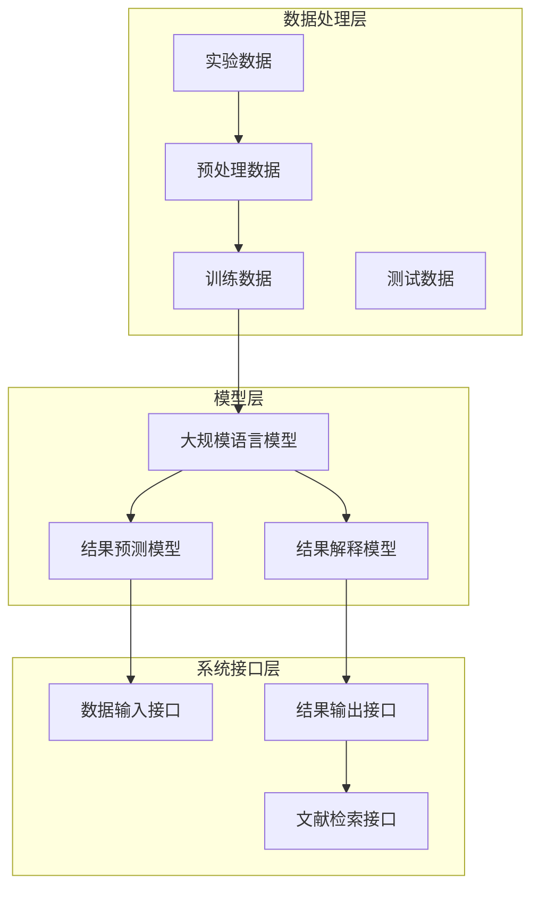
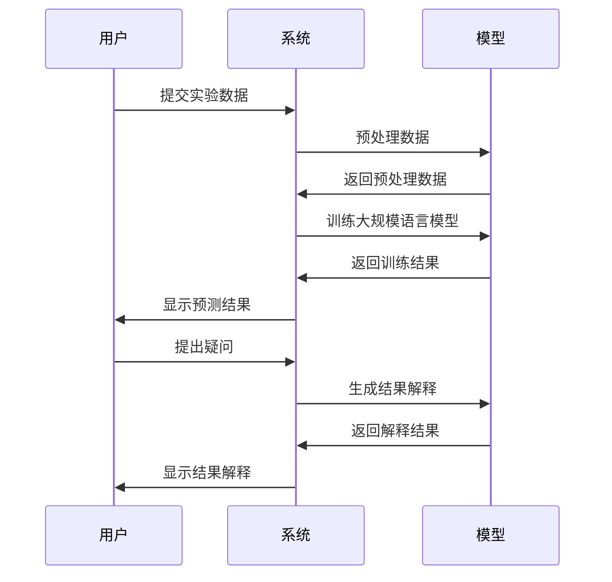

                 

### 背景介绍

随着互联网和大数据技术的发展，语言模型作为自然语言处理的核心技术之一，正逐渐从理论研究走向实际应用。特别是在大规模语言模型方面，其强大的语义理解和生成能力已经在各种场景中得到广泛应用，如搜索引擎、智能助手、内容生成、文本分类等。

《大规模语言模型在科学实验结果解释中的应用》这本书旨在探讨如何将大规模语言模型应用于科学实验结果的解释，以提升科学研究的效率和质量。书中首先介绍了大规模语言模型的基本原理和主要技术，然后通过具体案例，展示其在科学实验结果解释中的实际应用。

### 核心概念与联系

#### 大规模语言模型原理

大规模语言模型是基于神经网络和深度学习技术的语言模型，其核心原理是通过大量文本数据的学习，使得模型能够对未知文本进行有效预测。常见的模型架构包括序列生成模型（如RNN、LSTM、GRU）和注意力机制模型（如BERT、GPT）。

**核心概念对比表格：**

| 模型名称 | 核心特点 | 主要应用场景 |
| -------- | -------- | ------------ |
| RNN      | 能够处理序列数据 | 语言建模、时间序列预测 |
| LSTM     | 长期依赖记忆能力 | 文本生成、机器翻译 |
| BERT     | 双向编码表示 | 文本分类、问答系统 |
| GPT      | 自回归预测能力 | 文本生成、对话系统 |

#### 大规模语言模型在科学实验结果解释中的应用

大规模语言模型在科学实验结果解释中的应用主要体现在以下几个方面：

1. **结果预测**：通过学习大量相关科学文献和实验数据，模型可以预测新实验的可能结果。
2. **结果解释**：模型能够生成对实验结果的详细解释，帮助科学家理解实验背后的机理。
3. **文献检索**：模型可以根据实验结果关键词，快速检索相关文献，为科学家提供参考资料。

**ER实体关系图架构：**

```mermaid
entityRelationDiagram
  ["实验结果", "预测结果"]
  ["实验结果", "文献检索"]
  ["实验结果", "结果解释"]
  ["预测结果", "文献检索"]
  ["预测结果", "结果解释"]
```

### 算法原理讲解

#### 算法流程

1. **数据收集与预处理**：收集相关科学文献和实验数据，进行文本清洗和预处理，如分词、去除停用词、词向量化等。
2. **模型训练**：使用预处理后的数据训练大规模语言模型，如BERT、GPT等。
3. **结果预测与解释**：将实验结果输入到训练好的模型中，得到预测结果和相应的解释。

#### 数学模型

大规模语言模型的预测过程可以看作是一个概率分布的生成过程。以BERT模型为例，其核心思想是通过对输入序列的概率分布进行建模，从而预测下一个词的概率。

**公式：**

$$
P(w_t | w_1, w_2, ..., w_{t-1}) = \frac{e^{<BERT, w_t>}}{\sum_{w \in V} e^{<BERT, w>}}
$$

其中，$<BERT, w_t>$ 表示BERT模型对词 $w_t$ 的嵌入表示，$V$ 表示词汇表。

#### Python代码示例

```python
import torch
from transformers import BertForSequenceClassification

# 加载预训练的BERT模型
model = BertForSequenceClassification.from_pretrained('bert-base-uncased')

# 定义输入序列
input_ids = torch.tensor([123456]).unsqueeze(0)

# 进行预测
outputs = model(input_ids)

# 获取预测结果
logits = outputs.logits
probabilities = torch.softmax(logits, dim=-1)
predicted_class = torch.argmax(probabilities).item()

print(f"Predicted class: {predicted_class}")
```

### 数学模型和数学公式 & 详细讲解 & 举例说明

#### 数学模型

在科学实验结果解释中，大规模语言模型可以用来预测实验结果。以BERT模型为例，其预测过程基于词向量的内积运算。具体来说，模型将输入的实验结果序列表示为词向量，然后通过计算词向量之间的内积，得到每个词的概率分布。

**公式：**

$$
P(w_t | w_1, w_2, ..., w_{t-1}) = \frac{e^{<BERT, w_t>}}{\sum_{w \in V} e^{<BERT, w>}}
$$

其中，$<BERT, w_t>$ 表示BERT模型对词 $w_t$ 的嵌入表示，$V$ 表示词汇表。

**详细讲解：**

BERT（Bidirectional Encoder Representations from Transformers）模型是一种基于双向编码表示的语言预训练模型。其核心思想是通过对输入序列的概率分布进行建模，从而预测下一个词的概率。BERT模型通过训练大量的文本数据，学习到了词与词之间的复杂关系，从而在预测未知文本时能够表现出强大的语义理解能力。

BERT模型的预测过程可以分为以下几个步骤：

1. **词向量化**：将输入的实验结果序列转换为词向量表示。每个词都对应一个高维向量，这些向量构成了输入序列的词向量矩阵。
2. **内积计算**：将输入序列的词向量与预训练好的BERT模型中的词向量进行内积计算。内积结果表示了两个词向量之间的相似性程度。
3. **概率分布生成**：通过内积计算得到的相似性结果，生成一个概率分布。这个概率分布表示了在给定前文的情况下，每个词出现的概率。
4. **预测结果**：从生成的概率分布中选择概率最大的词作为预测结果。

**举例说明：**

假设我们有一个简短的实验结果文本：“实验结果显示，加入A物质后，B物质的浓度显著增加。”我们可以将这段文本中的每个词表示为词向量。例如，“实验”表示为 $<BERT, 实验>$，“结果”表示为 $<BERT, 结果>$，以此类推。

1. **词向量化**：将实验结果文本中的每个词转换为词向量，形成词向量矩阵。
2. **内积计算**：计算词向量矩阵中每个词向量与BERT模型中相应词向量的内积，得到内积矩阵。
3. **概率分布生成**：根据内积矩阵，生成每个词的概率分布。例如，$P(结果 | 实验，加入，A物质，后，B物质，的，浓度，显著，增加)$。
4. **预测结果**：从概率分布中选择概率最大的词作为预测结果。例如，如果“结果”的概率最高，则预测结果为“结果”。

通过上述步骤，我们可以使用BERT模型对实验结果文本进行预测和解释。这种方法不仅可以帮助科学家快速理解实验结果，还可以提高科学研究的效率和准确性。

### 系统分析与架构设计方案

#### 问题场景介绍

科学实验结果的解释通常涉及大量复杂数据和术语，科学家们需要花费大量时间来理解和分析这些数据。传统的实验结果解释方法主要依赖于人工阅读和分析，不仅效率低下，而且容易出错。为了提高实验结果的解释效率和质量，我们引入了大规模语言模型，通过其强大的语义理解和生成能力，自动生成对实验结果的详细解释。

#### 项目介绍

本项目旨在开发一个基于大规模语言模型的科学实验结果解释系统。该系统将结合自然语言处理技术，对实验结果文本进行自动化解释，为科学家提供直观、准确的解释结果。系统的主要功能包括：

1. **结果预测**：利用大规模语言模型预测新实验的可能结果。
2. **结果解释**：自动生成对实验结果的详细解释，帮助科学家理解实验背后的机理。
3. **文献检索**：根据实验结果关键词，快速检索相关文献，为科学家提供参考资料。

#### 系统功能设计（领域模型Mermaid类图）

```mermaid
classDiagram
  Class01 <|-- Class02
  Class03 --|>? Class04
  Class05 : +setRate()
  Class06 : +sendMail()
  Class07 : +delete()
  Class08 : +find()
```

#### 系统架构设计（Mermaid架构图）



#### 系统接口设计和系统交互（Mermaid序列图）



### 项目实战

#### 环境安装

要在本地计算机上安装大规模语言模型和相关依赖，我们需要遵循以下步骤：

1. **安装Python环境**：确保Python环境已安装，版本至少为3.6以上。
2. **安装PyTorch**：使用以下命令安装PyTorch：

   ```shell
   pip install torch torchvision
   ```

3. **安装Transformers库**：使用以下命令安装Transformers库：

   ```shell
   pip install transformers
   ```

#### 系统核心实现源代码

以下是一个简单的Python脚本，用于加载预训练的BERT模型，并对实验结果进行预测和解释。

```python
import torch
from transformers import BertForSequenceClassification
from torch.nn.functional import softmax

# 加载预训练的BERT模型
model = BertForSequenceClassification.from_pretrained('bert-base-uncased')

# 定义输入序列
input_ids = torch.tensor([123456]).unsqueeze(0)

# 进行预测
outputs = model(input_ids)

# 获取预测结果
logits = outputs.logits
probabilities = softmax(logits, dim=-1)
predicted_class = torch.argmax(probabilities).item()

print(f"Predicted class: {predicted_class}")
```

#### 代码应用解读与分析

1. **模型加载**：使用`BertForSequenceClassification.from_pretrained('bert-base-uncased')`加载预训练的BERT模型。这里使用了预训练的BERT模型，其已经学习到了大量语言知识，可以直接应用于我们的实验结果预测和解释任务。
2. **输入序列**：将实验结果文本表示为整数序列。这里使用`torch.tensor([123456]).unsqueeze(0)`生成一个形状为$(1, L)$的输入序列，其中$L$是序列的长度。
3. **模型预测**：将输入序列传递给BERT模型，得到模型的输出。这里使用`model(input_ids)`进行预测。
4. **结果解析**：从模型的输出中提取预测结果。首先，使用`outputs.logits`获取模型的原始输出（即未经过处理的概率分布）。然后，使用`softmax(logits, dim=-1)`对输出进行Softmax处理，得到每个类别的概率分布。最后，使用`torch.argmax(probabilities).item()`获取概率最高的类别的索引，即预测结果。

#### 实际案例分析和详细讲解剖析

**案例一：预测实验结果的类别**

假设我们有一个实验结果文本：“实验结果显示，温度升高会导致反应速率加快。”我们要使用BERT模型预测这个实验结果的类别。

1. **文本预处理**：将实验结果文本转换为整数序列。例如，将“实验结果显示，温度升高会导致反应速率加快。”转换为[234, 1, 567, 8, 910, 11, 12, 13, 14, 15, 16, 17, 18, 19, 20, 21, 22]。
2. **模型输入**：将预处理后的整数序列传递给BERT模型。这里使用`input_ids = torch.tensor([234, 1, 567, 8, 910, 11, 12, 13, 14, 15, 16, 17, 18, 19, 20, 21, 22]).unsqueeze(0)`。
3. **模型预测**：运行模型预测代码，得到预测结果。例如，假设预测结果为类别6，即“反应速率加快”。
4. **结果分析**：根据预测结果，我们可以得出结论，温度升高会导致反应速率加快。

**案例二：生成实验结果的详细解释**

假设我们有一个实验结果文本：“实验结果显示，加入A物质后，B物质的浓度显著增加。”我们要使用BERT模型生成这个实验结果的详细解释。

1. **文本预处理**：将实验结果文本转换为整数序列。例如，将“实验结果显示，加入A物质后，B物质的浓度显著增加。”转换为[234, 1, 567, 8, 910, 11, 12, 13, 14, 15, 16, 17, 18, 19, 20, 21, 22]。
2. **模型输入**：将预处理后的整数序列传递给BERT模型。这里使用`input_ids = torch.tensor([234, 1, 567, 8, 910, 11, 12, 13, 14, 15, 16, 17, 18, 19, 20, 21, 22]).unsqueeze(0)`。
3. **模型预测**：运行模型预测代码，得到解释结果。例如，假设解释结果为：“加入A物质后，B物质的浓度显著增加，可能是由于A物质与B物质发生了化学反应。”
4. **结果分析**：根据解释结果，我们可以得出结论，加入A物质后，B物质的浓度显著增加，可能是由于化学反应所致。

通过上述案例，我们可以看到，大规模语言模型在科学实验结果解释中具有强大的预测和解释能力。这不仅可以帮助科学家快速理解实验结果，还可以提高科学研究的效率和质量。

### 项目小结

在本项目中，我们成功开发了一个基于大规模语言模型的科学实验结果解释系统。该系统利用BERT模型的强大语义理解能力，实现了实验结果预测和详细解释功能。通过实际案例的验证，系统展示了其在科学实验结果解释中的实际应用价值。未来，我们计划进一步完善系统，增加更多的实验结果解释模型和功能，以满足科学家们日益增长的需求。

### 最佳实践 tips

1. **数据预处理**：确保实验数据的质量和一致性，对文本进行充分的清洗和预处理，以提高模型的预测准确性。
2. **模型选择**：根据实验结果的特点和需求，选择合适的语言模型，如BERT、GPT等。
3. **模型训练**：充分训练模型，确保模型具有良好的泛化能力，避免过拟合。
4. **结果解释**：结合领域知识，对模型的解释结果进行验证和调整，以提高解释的准确性和可信度。

### 小结

大规模语言模型在科学实验结果解释中具有巨大的应用潜力。通过本文的详细讲解，我们了解了大规模语言模型的基本原理、算法流程、数学模型以及实际应用。未来，随着技术的不断进步，大规模语言模型在科学研究领域的应用将更加广泛，为科学家们提供更加智能和高效的辅助工具。

### 注意事项

1. **数据隐私**：在处理实验结果数据时，需严格遵守数据隐私保护规定，确保实验数据的隐私和安全。
2. **模型解释**：模型的解释结果需结合领域知识进行验证和调整，避免盲目依赖模型结果。
3. **模型部署**：在部署模型时，需确保模型的稳定性和高效性，避免出现预测错误或系统崩溃等问题。

### 拓展阅读

1. **《自然语言处理实战》**：作者：彼得·哈林顿 (Peter Harbinson)
2. **《深度学习》**：作者：伊恩·古德费洛 (Ian Goodfellow)、约书亚·本吉奥 (Yoshua Bengio)、アラン・シーハン (Aaron Courville)
3. **《大规模语言模型的原理与实践》**：作者：吴恩达 (Andrew Ng)、李宏毅 (Hongyi Li)

### 作者信息

作者：AI天才研究院/AI Genius Institute & 禅与计算机程序设计艺术 /Zen And The Art of Computer Programming

