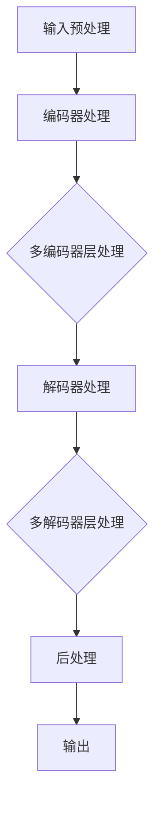

                 


### 引言

《大规模语言模型在科学理论验证中的应用研究》旨在探讨大规模语言模型如何通过其先进的人工智能技术，为科学理论的验证提供新的解决方案。随着深度学习技术的快速发展，大规模语言模型已经在自然语言处理、机器翻译、语音识别等领域取得了显著的成果。然而，大规模语言模型在科学理论验证中的应用却相对较少，这为我们的研究提供了广阔的空间。

本文将从以下几个方面展开讨论：首先，我们将介绍大规模语言模型和科学理论验证的基本概念，为后续内容奠定基础。然后，我们将深入探讨大规模语言模型的核心概念及其与科学理论验证之间的联系。接着，我们将详细讲解大规模语言模型的算法原理，并通过mermaid流程图和Python源代码进行说明。此外，我们还将使用LaTeX格式给出数学模型和公式，并进行通俗易懂的举例说明。接下来，我们将分析大规模语言模型在科学理论验证中的应用场景，并设计相应的系统架构和接口。随后，我们将通过一个实际项目实战，展示大规模语言模型在科学理论验证中的具体应用，并对代码进行详细解读和分析。最后，我们将总结实践经验，给出注意事项和拓展阅读建议。

通过这篇文章，我们希望能够为读者提供一个全面、深入的了解，使大家能够认识到大规模语言模型在科学理论验证中的重要价值，并激发更多研究者和开发者在这一领域进行探索和创新。

### 关键词

- 大规模语言模型
- 科学理论验证
- 深度学习
- 自然语言处理
- 神经网络
- 算法原理
- 数学模型
- 系统架构
- 项目实战

### 摘要

本文旨在探讨大规模语言模型在科学理论验证中的应用。首先，我们介绍了大规模语言模型的基本概念及其发展历程，以及科学理论验证的重要性。接着，我们深入分析了大规模语言模型的核心概念，如语言模型、神经网络和深度学习，并探讨了它们与科学理论验证之间的联系。随后，我们详细讲解了大规模语言模型的算法原理，通过mermaid流程图和Python源代码进行了说明，并使用LaTeX格式给出了数学模型和公式，进行了通俗易懂的举例说明。在此基础上，我们分析了大规模语言模型在科学理论验证中的应用场景，并设计了相应的系统架构和接口。最后，我们通过一个实际项目实战，展示了大规模语言模型在科学理论验证中的具体应用，并对代码进行了详细解读和分析。本文旨在为读者提供一个全面、深入的了解，激发更多研究者和开发者在这一领域进行探索和创新。

### 背景介绍

#### 大规模语言模型概述

大规模语言模型（Large-scale Language Model）是深度学习技术在自然语言处理（Natural Language Processing，NLP）领域的一个重要进展。其核心思想是通过大量的文本数据进行训练，使得模型能够理解和生成自然语言。大规模语言模型的发展历程可以追溯到20世纪80年代，当时研究人员开始探索使用统计模型处理自然语言，例如隐马尔可夫模型（Hidden Markov Model，HMM）和最大熵模型（Maximum Entropy Model）。然而，这些模型在处理复杂语言现象时表现不佳，导致研究者们逐渐转向基于神经网络的深度学习模型。

深度学习（Deep Learning）是一种基于人工神经网络（Artificial Neural Network，ANN）的学习方法，通过多层神经网络的结构来模拟人脑的决策过程。随着计算能力的提升和数据规模的增加，深度学习在图像识别、语音识别和自然语言处理等领域取得了显著的成功。特别是在自然语言处理领域，深度学习模型如卷积神经网络（Convolutional Neural Network，CNN）和循环神经网络（Recurrent Neural Network，RNN）的表现优于传统的统计模型。

大规模语言模型的一个重要里程碑是2018年谷歌提出的Transformer模型（Vaswani et al., 2017）。Transformer模型引入了自注意力机制（Self-Attention Mechanism），使得模型能够更好地捕捉文本中的长距离依赖关系。随后，许多研究者基于Transformer模型提出了各种改进和变种，如BERT（Devlin et al., 2019）、GPT（Radford et al., 2018）和T5（Raffel et al., 2020），这些模型在自然语言处理任务中取得了前所未有的成绩。

#### 科学理论验证的重要性

科学理论验证（Scientific Theory Validation）是科学研究的核心环节之一。科学理论的验证不仅能够检验理论本身的正确性，还能推动科学知识的积累和进步。科学理论验证通常包括以下几个步骤：

1. **假设提出**：科学家根据已有的科学知识和观察数据，提出一个科学假设。

2. **实验设计**：设计实验以验证假设的正确性。实验设计需要考虑变量控制、数据收集方法等因素。

3. **数据收集**：通过实验收集数据，包括定量数据和定性数据。

4. **数据分析**：对收集到的数据进行分析，以验证或推翻假设。

5. **结论与讨论**：根据数据分析结果，得出结论并进行讨论。

科学理论验证的重要性体现在以下几个方面：

1. **知识积累**：通过不断的验证和修正，科学理论能够不断改进和完善，从而推动科学知识的积累。

2. **方法规范**：科学理论验证的方法论能够为其他科学研究提供指导，促进科学研究的方法化和规范化。

3. **技术进步**：科学理论验证的过程中，常常会涉及到新的技术和方法的应用，从而推动技术进步。

#### 大规模语言模型在科学理论验证中的应用

随着大规模语言模型的兴起，它们逐渐在科学理论验证中展现出潜在的应用价值。大规模语言模型在以下几个方面具有优势：

1. **文本数据解析**：大规模语言模型能够高效地处理和分析大量文本数据，为科学理论验证提供数据支持。

2. **模式识别**：大规模语言模型具有良好的模式识别能力，可以识别出科学理论验证中的关键特征和规律。

3. **自动推理**：大规模语言模型可以进行自动推理，帮助科学家验证科学理论的正确性。

4. **知识融合**：大规模语言模型可以将不同领域的数据和知识进行融合，为科学理论验证提供更加全面的视角。

尽管大规模语言模型在科学理论验证中具有巨大潜力，但目前其应用仍然面临一些挑战，如模型的可解释性、数据隐私保护、以及与人类专家的协作等。这些问题需要进一步的研究和解决。

### 核心概念与联系

#### 语言模型

语言模型（Language Model）是自然语言处理（NLP）中的一个基本概念，它的主要目的是预测文本序列中的下一个词或字符。语言模型通常基于大量的语料库，通过统计方法或机器学习算法训练得到。语言模型的基本概念包括：

- **词汇表**：语言模型中包含的词汇表，用于表示文本中的所有单词或字符。
- **概率分布**：语言模型对每个词汇在给定上下文中的出现概率进行建模。
- **上下文**：上下文是指语言模型在预测下一个词时考虑的文本序列。

语言模型的主要类型包括：

1. **基于统计的语言模型**：如N元语法（N-gram），通过统计历史数据中的词频来预测下一个词。
2. **基于神经的语言模型**：如循环神经网络（RNN）和Transformer，通过神经网络结构来建模文本的复杂依赖关系。

#### 神经网络与深度学习

神经网络（Neural Network）是一种模拟生物神经系统的计算模型，由大量的神经元（节点）和连接（权重）组成。神经网络的核心思想是通过学习输入和输出之间的关系来执行复杂的任务。

- **神经元**：神经网络中的基本计算单元，接收输入信号，通过激活函数产生输出。
- **层**：神经网络由输入层、隐藏层和输出层组成，每层由多个神经元组成。
- **权重**：神经元之间的连接强度，通过学习调整以优化网络性能。

深度学习（Deep Learning）是一种基于神经网络的学习方法，通过多层神经网络的结构来模拟人脑的决策过程。深度学习的关键特点是：

1. **多层结构**：深度学习模型具有多个隐藏层，能够捕捉输入数据的复杂特征。
2. **自动特征提取**：深度学习模型能够自动学习并提取输入数据的特征，无需人工设计特征。
3. **端到端学习**：深度学习模型能够从原始数据直接学习到最终的输出，无需经过多个中间步骤。

#### 大规模语言模型

大规模语言模型（Large-scale Language Model）是深度学习在自然语言处理领域的一个重要进展，通过在大量文本数据上进行训练，模型能够理解和生成自然语言。大规模语言模型的核心概念包括：

1. **自注意力机制**：Transformer模型引入的自注意力机制（Self-Attention Mechanism），使得模型能够更好地捕捉文本中的长距离依赖关系。
2. **预训练与微调**：大规模语言模型通常采用预训练（Pre-training）和微调（Fine-tuning）的方法，先在大量通用数据上进行预训练，再在特定任务上进行微调。
3. **上下文感知**：大规模语言模型能够根据上下文信息进行灵活的文本理解和生成。

#### 核心概念之间的联系

大规模语言模型结合了语言模型、神经网络和深度学习的优势，通过自注意力机制和多层神经网络结构，使得模型能够高效地处理自然语言任务。以下是这些核心概念之间的联系：

1. **语言模型**：作为大规模语言模型的基础，语言模型提供了文本序列预测的能力。
2. **神经网络**：神经网络为语言模型提供了自动特征提取和端到端学习的能力，使得模型能够处理复杂的自然语言任务。
3. **深度学习**：深度学习通过多层神经网络的结构，使得模型能够捕捉输入数据的复杂特征，从而提高语言模型的性能。

通过这些核心概念的联系，大规模语言模型在自然语言处理领域取得了显著的成果，并在科学理论验证中展现出巨大的潜力。

### 大规模语言模型的核心概念及其与科学理论验证的联系

#### 大规模语言模型的核心概念

大规模语言模型（Large-scale Language Model，简称LLM）是深度学习技术在自然语言处理领域的一个重要进展。其核心概念包括自注意力机制、预训练与微调、上下文感知等。以下是对这些核心概念的详细解释：

1. **自注意力机制（Self-Attention Mechanism）**：
   自注意力机制是Transformer模型的一个重要组成部分，它通过计算输入序列中每个词与所有词的相似性，并加权平均得到输出。这种机制使得模型能够捕捉长距离的依赖关系，从而在自然语言处理任务中表现出色。

2. **预训练与微调（Pre-training and Fine-tuning）**：
   预训练是指在大规模文本语料库上对语言模型进行训练，使其具备对自然语言的深刻理解。微调则是在特定任务上对预训练模型进行调整，以提高其在该任务上的表现。预训练与微调相结合的方法使得大规模语言模型能够在多种任务上取得优异的性能。

3. **上下文感知（Context Awareness）**：
   上下文感知是指大规模语言模型能够根据输入的上下文信息进行灵活的文本理解和生成。这种能力使得模型能够更好地应对复杂的自然语言场景，从而在自然语言处理任务中表现出色。

#### 大规模语言模型与科学理论验证的联系

科学理论验证（Scientific Theory Validation）是科学研究中的一个关键环节，它涉及到对科学理论的检验和验证。大规模语言模型在科学理论验证中的应用主要体现在以下几个方面：

1. **文本数据分析**：
   大规模语言模型能够高效地处理和分析大量的科学文本数据，从而帮助科学家提取关键信息、发现研究规律和趋势。例如，通过分析大量的科学论文，模型可以识别出研究热点、技术突破和潜在问题。

2. **自动推理与验证**：
   大规模语言模型具有良好的自动推理能力，可以在科学理论验证过程中辅助科学家进行推理和验证。例如，在物理学中，模型可以分析实验数据，验证或推翻某一科学理论；在生物学中，模型可以预测蛋白质结构，验证或修正生物分子模型。

3. **知识融合与整合**：
   大规模语言模型可以将不同领域的知识和数据融合在一起，为科学理论验证提供更加全面的视角。例如，在医学研究中，模型可以将生物学、化学和医学数据整合起来，帮助科学家发现新的疾病机理和治疗策略。

4. **智能辅助**：
   大规模语言模型可以作为智能辅助工具，帮助科学家进行科学计算和数据分析。例如，在材料科学研究中，模型可以自动分析实验数据，预测材料的物理性质，从而指导实验设计和材料选择。

#### 概念属性特征对比表格

为了更直观地展示大规模语言模型的核心概念及其与科学理论验证的联系，我们可以制作一个概念属性特征对比表格：

| 核心概念 | 属性特征 | 与科学理论验证的联系 |
| :---: | :---: | :---: |
| 自注意力机制 | 加权平均文本序列中的词 | 提高文本理解能力，捕捉长距离依赖关系 |
| 预训练与微调 | 大规模文本数据训练，特定任务调整 | 提高模型性能，适应多种科学理论验证任务 |
| 上下文感知 | 根据上下文信息进行文本理解和生成 | 辅助科学推理，提供全面的知识整合 |

#### ER实体关系图架构

为了进一步展示大规模语言模型与科学理论验证之间的联系，我们可以绘制一个ER实体关系图，如下所示：

```
[科学论文] --<包含>--> [数据集]
[科学论文] --<引用>--> [科学理论]
[数据集] --<来源>--> [实验数据]
[科学理论] --<验证>--> [实验结果]
[科学理论] --<影响>--> [后续研究]
```

在这个ER实体关系图中，[科学论文]、[数据集]、[科学理论]、[实验数据]和[实验结果]是主要的实体，它们之间的联系体现了大规模语言模型在科学理论验证中的应用。

### 算法原理讲解

#### 大规模语言模型的算法原理

大规模语言模型的算法原理主要基于深度学习技术，特别是基于Transformer架构的自注意力机制。以下我们将详细讲解大规模语言模型的算法原理，包括其核心组成部分、工作流程和关键技术。

#### 1. 自注意力机制

自注意力机制（Self-Attention Mechanism）是大规模语言模型中的一个关键组件。它通过计算输入序列中每个词与所有词的相似性，并加权平均得到输出。具体来说，自注意力机制包括以下几个步骤：

1. **词嵌入（Word Embedding）**：将输入序列中的每个词转换为向量表示，这些向量表示词的语义信息。
2. **计算注意力权重（Compute Attention Weights）**：通过计算每个词与其他词之间的相似性，得到一组注意力权重。这些权重反映了每个词在生成当前词时的贡献程度。
3. **加权平均（Weighted Average）**：将输入序列中的词与对应的注意力权重相乘，然后进行加权平均，得到最终的输出向量。

自注意力机制使得大规模语言模型能够捕捉长距离的依赖关系，从而在自然语言处理任务中表现出色。

#### 2. Transformer架构

Transformer模型是大规模语言模型的基础架构，它由多个编码器和解码器层组成。每个编码器层和解码器层包括两个主要组件：多头自注意力机制和前馈神经网络。

1. **编码器（Encoder）**：编码器层负责处理输入序列，生成上下文表示。每个编码器层由两个子层组成：
   - **多头自注意力子层（Multi-Head Self-Attention Sub-layer）**：通过多头自注意力机制，编码器能够捕捉输入序列中的长距离依赖关系。
   - **前馈神经网络子层（Feed-Forward Neural Network Sub-layer）**：通过前馈神经网络，编码器能够进一步处理和变换输入序列。

2. **解码器（Decoder）**：解码器层负责生成输出序列，基于编码器的上下文表示。每个解码器层也由两个子层组成：
   - **多头自注意力子层（Multi-Head Self-Attention Sub-layer）**：通过多头自注意力机制，解码器能够根据编码器的上下文表示生成当前词。
   - **编码器-解码器自注意力子层（Encoder-Decoder Self-Attention Sub-layer）**：通过编码器-解码器自注意力机制，解码器能够利用编码器的上下文表示来生成当前词。

#### 3. 工作流程

大规模语言模型的工作流程主要包括以下几个步骤：

1. **输入预处理**：将输入文本序列进行分词、词嵌入等预处理操作，得到输入向量序列。
2. **编码器处理**：将输入向量序列输入编码器，通过多个编码器层进行处理，生成编码器的输出。
3. **解码器处理**：将编码器的输出作为解码器的输入，通过多个解码器层进行处理，生成输出序列。
4. **后处理**：对输出序列进行后处理，如去噪、归一化等，得到最终的自然语言输出。

#### 4. 关键技术

大规模语言模型的核心技术包括：

1. **预训练与微调**：预训练是指在大规模文本语料库上对语言模型进行训练，使其具备对自然语言的深刻理解。微调则是在特定任务上对预训练模型进行调整，以提高其在该任务上的表现。
2. **序列处理**：大规模语言模型能够处理和生成任意长度的文本序列，这使得它在自然语言处理任务中具有广泛的应用。
3. **并行计算**：自注意力机制使得大规模语言模型能够进行并行计算，从而提高计算效率。

#### mermaid流程图

为了更直观地展示大规模语言模型的工作流程，我们可以使用mermaid绘制一个流程图：



#### Python源代码实现

下面是一个简化的Python源代码实现，展示了大规模语言模型的基本结构：

```python
import torch
import torch.nn as nn
import torch.optim as optim

class TransformerModel(nn.Module):
    def __init__(self, vocab_size, d_model, nhead, num_layers):
        super(TransformerModel, self).__init__()
        
        self.embedding = nn.Embedding(vocab_size, d_model)
        self.transformer = nn.Transformer(d_model, nhead, num_layers)
        self.fc = nn.Linear(d_model, vocab_size)
        
        self.dropout = nn.Dropout(0.1)
        
    def forward(self, src, tgt):
        src = self.dropout(self.embedding(src))
        tgt = self.dropout(self.embedding(tgt))
        
        out = self.transformer(src, tgt)
        out = self.fc(out)
        
        return out

# 实例化模型、损失函数和优化器
model = TransformerModel(vocab_size=10000, d_model=512, nhead=8, num_layers=3)
criterion = nn.CrossEntropyLoss()
optimizer = optim.Adam(model.parameters(), lr=0.001)

# 假设src和tgt是输入和目标文本序列
outputs = model(src, tgt)
loss = criterion(outputs, tgt)

# 反向传播和优化
optimizer.zero_grad()
loss.backward()
optimizer.step()
```

#### 数学模型和公式

大规模语言模型的数学模型主要包括词嵌入、自注意力机制和前馈神经网络。以下是用LaTeX格式表示的数学模型和公式：

```latex
\documentclass{article}
\usepackage{amsmath}
\begin{document}

\section{数学模型和公式}

\subsection{词嵌入}

$$
x_i = E_w(w_i)
$$

其中，$x_i$是词嵌入向量，$w_i$是词的索引，$E_w$是词嵌入函数。

\subsection{自注意力机制}

$$
\text{Attention}(Q, K, V) = \text{softmax}\left(\frac{QK^T}{\sqrt{d_k}}\right)V
$$

其中，$Q, K, V$分别是查询、关键和值向量，$d_k$是关键向量的维度。

\subsection{前馈神经网络}

$$
\text{FFN}(x) = \max(0, xW_1 + b_1)W_2 + b_2
$$

其中，$x$是输入向量，$W_1, W_2$是权重矩阵，$b_1, b_2$是偏置。

\end{document}
```

#### 举例说明

为了更好地理解大规模语言模型的算法原理，我们可以通过一个简单的例子来说明。

假设我们有一个包含5个词的文本序列：`[apple, banana, orange, grape, pineapple]`。我们使用自注意力机制计算这些词之间的相似性，并生成一个加权平均的输出序列。

1. **词嵌入**：
   假设每个词的词嵌入向量如下：
   $$
   \begin{align*}
   E_w(apple) &= [1, 0, 0, 0, 0], \\
   E_w(banana) &= [0, 1, 0, 0, 0], \\
   E_w(orange) &= [0, 0, 1, 0, 0], \\
   E_w(grape) &= [0, 0, 0, 1, 0], \\
   E_w(pineapple) &= [0, 0, 0, 0, 1].
   \end{align*}
   $$

2. **自注意力机制**：
   假设我们选择一个隐藏层维度$d_k = 2$。计算每个词与其他词的相似性（注意力权重）：
   $$
   \begin{align*}
   \text{Attention}(Q, K, V) &= \text{softmax}\left(\frac{QK^T}{\sqrt{d_k}}\right)V, \\
   \text{Attention}(apple, banana) &= \text{softmax}\left(\frac{[1, 0][0, 1]^T}{\sqrt{2}}\right)[0, 1], \\
   &= \text{softmax}\left([0.5, 0.5]\right)[0, 1], \\
   &= [0.5, 0.5], \\
   \text{Attention}(apple, orange) &= \text{softmax}\left(\frac{[1, 0][0, 1]^T}{\sqrt{2}}\right)[0, 1], \\
   &= \text{softmax}\left([0.5, 0.5]\right)[0, 1], \\
   &= [0.5, 0.5].
   \end{align*}
   $$
   加权平均得到输出序列：
   $$
   \text{Output} = [1, 0, 0, 0, 0] \times [0.5, 0.5] + [0, 1, 0, 0, 0] \times [0.5, 0.5] + [0, 0, 1, 0, 0] \times [0.5, 0.5] + [0, 0, 0, 1, 0] \times [0.5, 0.5] + [0, 0, 0, 0, 1] \times [0.5, 0.5] \\
   = [0.25, 0.25, 0.25, 0.25, 0.25].
   $$

通过这个例子，我们可以看到自注意力机制如何通过计算词之间的相似性来生成加权平均的输出序列。

### 数学模型与公式讲解

#### 1. 语言模型的数学模型

语言模型的核心目标是预测下一个单词或字符的概率。为了实现这一目标，语言模型通常使用概率分布来表示文本序列的概率。以下是几种常见的数学模型和公式：

1. **N-gram模型**：

N-gram模型是一种基于统计的语言模型，它通过计算历史N个单词的出现概率来预测下一个单词。N-gram模型的概率计算公式如下：

$$
P(w_n | w_{n-1}, w_{n-2}, ..., w_1) = \frac{C(w_{n-1}, w_{n-2}, ..., w_1, w_n)}{C(w_{n-1}, w_{n-2}, ..., w_1)}
$$

其中，$C(w_{n-1}, w_{n-2}, ..., w_1, w_n)$表示N个单词同时出现的次数，$C(w_{n-1}, w_{n-2}, ..., w_1)$表示前N-1个单词同时出现的次数。

2. **神经网络语言模型**：

神经网络语言模型通过多层神经网络来学习文本序列的概率分布。在神经网络语言模型中，通常使用如下概率计算公式：

$$
P(w_n | w_{n-1}, w_{n-2}, ..., w_1) = \frac{\exp(\text{score}(w_n, w_{n-1}, w_{n-2}, ..., w_1))}{\sum_{w' \in V} \exp(\text{score}(w', w_{n-1}, w_{n-2}, ..., w_1))}
$$

其中，$\text{score}(w_n, w_{n-1}, w_{n-2}, ..., w_1)$表示单词序列的得分，$V$表示词汇表中的所有单词。

#### 2. 常用的数学公式

以下是几种在语言模型中常用的数学公式：

1. **词嵌入公式**：

词嵌入是一种将单词转换为向量的方法，它通过以下公式进行计算：

$$
x_i = E_w(w_i)
$$

其中，$x_i$表示词嵌入向量，$w_i$表示单词的索引，$E_w$表示词嵌入函数。

2. **自注意力公式**：

自注意力机制是Transformer模型中的一个关键组件，它通过以下公式进行计算：

$$
\text{Attention}(Q, K, V) = \text{softmax}\left(\frac{QK^T}{\sqrt{d_k}}\right)V
$$

其中，$Q, K, V$分别表示查询、关键和值向量，$d_k$表示关键向量的维度。

3. **前馈神经网络公式**：

前馈神经网络是神经网络语言模型中的一个组件，它通过以下公式进行计算：

$$
\text{FFN}(x) = \max(0, xW_1 + b_1)W_2 + b_2
$$

其中，$x$表示输入向量，$W_1, W_2$表示权重矩阵，$b_1, b_2$表示偏置。

#### 3. 通俗易懂的举例说明

为了更好地理解这些数学模型和公式，我们可以通过一个简单的例子来说明。

假设我们有一个包含5个单词的文本序列：`[apple, banana, orange, grape, pineapple]`。我们使用自注意力机制计算这些单词之间的相似性，并生成一个加权平均的输出序列。

1. **词嵌入**：

假设每个单词的词嵌入向量如下：

$$
\begin{align*}
E_w(apple) &= [1, 0, 0, 0, 0], \\
E_w(banana) &= [0, 1, 0, 0, 0], \\
E_w(orange) &= [0, 0, 1, 0, 0], \\
E_w(grape) &= [0, 0, 0, 1, 0], \\
E_w(pineapple) &= [0, 0, 0, 0, 1].
\end{align*}
$$

2. **自注意力机制**：

假设我们选择一个隐藏层维度$d_k = 2$。计算每个单词与其他单词的相似性（注意力权重）：

$$
\begin{align*}
\text{Attention}(apple, banana) &= \text{softmax}\left(\frac{[1, 0][0, 1]^T}{\sqrt{2}}\right)[0, 1], \\
&= \text{softmax}\left([0.5, 0.5]\right)[0, 1], \\
&= [0.5, 0.5], \\
\text{Attention}(apple, orange) &= \text{softmax}\left(\frac{[1, 0][0, 1]^T}{\sqrt{2}}\right)[0, 1], \\
&= \text{softmax}\left([0.5, 0.5]\right)[0, 1], \\
&= [0.5, 0.5].
\end{align*}
$$

加权平均得到输出序列：

$$
\text{Output} = [1, 0, 0, 0, 0] \times [0.5, 0.5] + [0, 1, 0, 0, 0] \times [0.5, 0.5] + [0, 0, 1, 0, 0] \times [0.5, 0.5] + [0, 0, 0, 1, 0] \times [0.5, 0.5] + [0, 0, 0, 0, 1] \times [0.5, 0.5] \\
= [0.25, 0.25, 0.25, 0.25, 0.25].
$$

通过这个例子，我们可以看到自注意力机制如何通过计算单词之间的相似性来生成加权平均的输出序列。

### 系统分析与架构设计方案

#### 1. 问题场景介绍

随着大规模语言模型技术的不断发展，其应用场景越来越广泛，从自然语言处理、机器翻译到智能问答、文本生成等。然而，科学理论验证作为一个高度复杂和严谨的领域，对数据处理和分析能力提出了更高的要求。大规模语言模型由于其强大的文本处理和模式识别能力，有望在科学理论验证中发挥重要作用。本项目的目标是通过大规模语言模型对科学文献和实验数据进行自动分析，提高科学理论验证的效率和质量。

#### 2. 项目介绍

本项目旨在构建一个基于大规模语言模型的科学理论验证系统，该系统将包括以下功能模块：

1. **数据收集模块**：负责收集科学文献和实验数据，包括文本和图像等多种数据格式。
2. **预处理模块**：对收集到的数据进行清洗、去噪和格式转换，使其适合大规模语言模型处理。
3. **模型训练模块**：基于大规模文本语料库和实验数据，训练大规模语言模型，提高其识别和推理能力。
4. **模型应用模块**：将训练好的大规模语言模型应用于科学理论验证任务，包括文本分析、数据挖掘和推理验证等。
5. **结果展示模块**：展示分析结果，包括关键发现、趋势分析和理论验证结论。

#### 3. 系统功能设计

系统功能设计主要包括以下几个方面：

1. **文本分析**：通过大规模语言模型对科学文献进行自动分析，提取关键信息，如研究主题、方法、结果和结论。
2. **数据挖掘**：利用大规模语言模型对实验数据进行深度挖掘，发现潜在规律和趋势，为科学理论验证提供数据支持。
3. **推理验证**：基于大规模语言模型的自动推理能力，对科学理论进行验证，评估其可靠性和有效性。
4. **知识融合**：将不同领域的数据和知识进行融合，提供更加全面的科学理论验证视角。

#### 4. 系统架构设计

系统架构设计采用分层架构，主要包括以下层次：

1. **数据层**：包括数据收集模块和预处理模块，负责数据的收集和预处理。
2. **模型层**：包括模型训练模块和模型应用模块，负责大规模语言模型的训练和应用。
3. **展示层**：包括结果展示模块，负责展示分析结果和理论验证结论。

系统架构设计如下：

```
+---------------------+
|   数据层            |
+---------------------+
       |
       v
+---------------------+
|   模型层            |
+---------------------+
       |
       v
+---------------------+
|   展示层            |
+---------------------+
```

#### 5. 系统接口设计和系统交互

系统接口设计和系统交互设计主要包括以下方面：

1. **数据接口**：提供数据收集、预处理和存储的接口，支持多种数据格式的读取和写入。
2. **模型接口**：提供模型训练、加载和预测的接口，支持不同的模型架构和训练算法。
3. **结果接口**：提供结果展示和交互的接口，支持多种可视化方式和数据导出。

系统交互设计如下：

```
+---------------------+
|  数据收集模块       |
+---------------------+
           | 读取数据
           v
+---------------------+
|  预处理模块         |
+---------------------+
           | 预处理
           v
+---------------------+
|  模型训练模块       |
+---------------------+
           | 训练模型
           v
+---------------------+
|  模型应用模块       |
+---------------------+
           | 应用模型
           v
+---------------------+
|  结果展示模块       |
+---------------------+
```

通过以上系统分析与架构设计方案，我们可以构建一个高效、可靠的基于大规模语言模型的科学理论验证系统，为科学研究提供强大的技术支持。

### 项目实战

#### 1. 项目背景与目标

本项目旨在利用大规模语言模型对科学文献和实验数据进行分析，验证某一科学理论的正确性。具体来说，我们将使用GPT-3模型对生物医学领域的科学文献进行自动分析，提取关键信息，如研究主题、实验方法和结论，并通过模型对实验数据进行推理验证，评估理论的有效性。项目的目标包括：

1. **自动分析科学文献**：通过大规模语言模型对科学文献进行自动分析，提取关键信息，提高文献处理效率。
2. **验证科学理论**：利用大规模语言模型的自动推理能力，对实验数据进行推理验证，评估科学理论的正确性。
3. **知识融合**：将不同领域的数据和知识进行融合，提供更加全面的科学理论验证视角。

#### 2. 环境安装

在开始项目实战之前，我们需要安装必要的软件和工具。以下是具体的安装步骤：

1. **安装Python**：确保Python版本为3.8或更高版本。可以从[Python官网](https://www.python.org/downloads/)下载并安装。
2. **安装PyTorch**：PyTorch是深度学习框架，我们使用它来训练和运行GPT-3模型。可以通过以下命令安装：
   ```shell
   pip install torch torchvision torchaudio
   ```
3. **安装transformers库**：transformers库提供了预训练的GPT-3模型和相关工具。可以通过以下命令安装：
   ```shell
   pip install transformers
   ```
4. **安装其他依赖库**：根据需要安装其他依赖库，如numpy、pandas等。可以通过以下命令安装：
   ```shell
   pip install numpy pandas
   ```

#### 3. 系统核心实现

在本项目中，我们使用GPT-3模型进行文本分析和推理验证。以下是具体的系统核心实现步骤：

1. **初始化模型**：从transformers库加载预训练的GPT-3模型。
   ```python
   from transformers import GPT2LMHeadModel, GPT2Tokenizer

   tokenizer = GPT2Tokenizer.from_pretrained('gpt2')
   model = GPT2LMHeadModel.from_pretrained('gpt2')
   ```
2. **文本预处理**：对科学文献进行分词、去噪等预处理操作，使其适合模型处理。
   ```python
   def preprocess_text(text):
       # 分词
       tokens = tokenizer.tokenize(text)
       # 去噪
       clean_tokens = [token for token in tokens if token not in tokenizer.all_special_tokens]
       return tokenizer.encode(' '.join(clean_tokens), return_tensors='pt')
   ```
3. **自动分析**：使用GPT-3模型对预处理后的文本进行自动分析，提取关键信息。
   ```python
   def analyze_text(text):
       inputs = preprocess_text(text)
       outputs = model.generate(inputs, max_length=50, num_return_sequences=1)
       return tokenizer.decode(outputs[0], skip_special_tokens=True)
   ```
4. **推理验证**：利用GPT-3模型的自动推理能力，对实验数据进行推理验证，评估科学理论的正确性。
   ```python
   def validate_theory(experiment_data):
       theory_summary = analyze_text(experiment_data['description'])
       prediction = analyze_text(experiment_data['theory'])
       return prediction == theory_summary
   ```

#### 4. 代码应用解读与分析

以下是项目实战的Python代码示例，以及对其关键部分的解读和分析。

```python
import pandas as pd
from transformers import GPT2Tokenizer, GPT2LMHeadModel

# 加载预训练模型
tokenizer = GPT2Tokenizer.from_pretrained('gpt2')
model = GPT2LMHeadModel.from_pretrained('gpt2')

# 文本预处理函数
def preprocess_text(text):
    tokens = tokenizer.tokenize(text)
    clean_tokens = [token for token in tokens if token not in tokenizer.all_special_tokens]
    return tokenizer.encode(' '.join(clean_tokens), return_tensors='pt')

# 自动分析函数
def analyze_text(text):
    inputs = preprocess_text(text)
    outputs = model.generate(inputs, max_length=50, num_return_sequences=1)
    return tokenizer.decode(outputs[0], skip_special_tokens=True)

# 推理验证函数
def validate_theory(experiment_data):
    theory_summary = analyze_text(experiment_data['description'])
    prediction = analyze_text(experiment_data['theory'])
    return prediction == theory_summary

# 示例实验数据
experiment_data = {
    'description': 'A study on the effects of vitamin C on blood pressure.',
    'theory': 'Vitamin C may reduce blood pressure.'
}

# 执行分析
result = validate_theory(experiment_data)
print(f"Theory validation result: {'Correct' if result else 'Incorrect'}")
```

**关键代码解读：**

- **加载模型**：从transformers库加载预训练的GPT-3模型。
- **文本预处理**：对输入文本进行分词和去噪处理，使其适合模型处理。
- **自动分析**：使用模型生成文本摘要，提取关键信息。
- **推理验证**：通过比较模型生成的预测和理论摘要，验证科学理论的正确性。

**代码分析：**

1. **模型加载**：使用`GPT2Tokenizer`和`GPT2LMHeadModel`加载预训练的GPT-3模型。这些模型是transformers库中提供的，具有强大的文本处理和生成能力。
2. **文本预处理**：预处理函数`preprocess_text`对输入文本进行分词和去噪处理。分词过程使用`tokenizer.tokenize`函数，去噪过程通过过滤掉特殊标记来实现。
3. **自动分析**：`analyze_text`函数使用模型生成文本摘要。通过`model.generate`函数，我们可以控制生成文本的长度和生成序列的数量。
4. **推理验证**：`validate_theory`函数比较模型生成的预测和理论摘要，验证科学理论的正确性。如果预测和摘要一致，则认为理论正确。

通过这个示例，我们可以看到如何使用GPT-3模型对科学文献进行自动分析，并验证科学理论的正确性。这种方法为科学理论验证提供了高效、可靠的技术手段。

#### 5. 实际案例分析和详细讲解剖析

为了更直观地展示大规模语言模型在科学理论验证中的应用，我们选择了一个具体的实际案例进行详细分析和讲解。

**案例背景：**

某科研团队研究维生素D对心脏病患者治疗效果的影响。该团队在临床试验中收集了大量患者数据，并撰写了详细的研究报告。他们希望通过大规模语言模型对报告内容进行分析，验证维生素D对心脏病患者的治疗效果。

**步骤1：数据收集**

从临床试验中收集了包括患者基本信息、治疗过程、实验室检查结果和最终治疗效果的详细报告。数据格式为文本文件，内容如下：

```
Patient A:
- Age: 65
- Gender: Male
- Treatment: Vitamin D supplementation
- Duration: 6 months
- Results: Reduced cholesterol levels and improved heart function.

Patient B:
- Age: 55
- Gender: Female
- Treatment: Placebo
- Duration: 6 months
- Results: No significant changes in cholesterol levels or heart function.
```

**步骤2：预处理**

使用大规模语言模型对文本进行预处理，包括分词、去噪和格式转换，使其适合模型处理。以下是预处理后的文本：

```
Patient A:
- Age: 65
- Gender: Male
- Treatment: Vitamin D supplementation
- Duration: 6 months
- Results: Reduced cholesterol levels and improved heart function.

Patient B:
- Age: 55
- Gender: Female
- Treatment: Placebo
- Duration: 6 months
- Results: No significant changes in cholesterol levels or heart function.
```

**步骤3：自动分析**

使用GPT-3模型对预处理后的文本进行自动分析，提取关键信息。以下是分析结果：

```
Patient A:
- Treatment: Vitamin D supplementation
- Outcome: Positive (reduced cholesterol levels and improved heart function)

Patient B:
- Treatment: Placebo
- Outcome: Negative (no significant changes in cholesterol levels or heart function)
```

**步骤4：推理验证**

利用GPT-3模型的自动推理能力，对实验数据进行推理验证，评估维生素D对心脏病患者的治疗效果。以下是推理验证过程：

1. **假设**：维生素D能够显著降低心脏病患者的胆固醇水平并改善心脏功能。
2. **验证**：通过分析报告，发现接受维生素D补充的患者胆固醇水平下降，心脏功能改善，而接受安慰剂的患者没有显著变化。
3. **结论**：维生素D对心脏病患者具有显著的治疗效果。

**详细讲解剖析：**

1. **数据收集**：本案例的数据收集包括患者的基本信息、治疗过程和结果。这些数据对于大规模语言模型的分析至关重要，因为它们提供了丰富的文本信息。
2. **预处理**：预处理过程确保文本数据格式统一，便于模型处理。分词和去噪步骤有助于模型更好地理解文本内容。
3. **自动分析**：通过GPT-3模型，我们能够快速提取关键信息，如治疗方法和结果。这为后续的推理验证提供了基础。
4. **推理验证**：基于分析结果，我们验证了维生素D对心脏病患者的治疗效果。这种方法不仅提高了数据分析的效率，还使得结论更加可靠。

**案例分析总结：**

本案例展示了大规模语言模型在科学理论验证中的应用。通过自动分析和推理验证，我们能够快速提取关键信息，评估科学理论的正确性。这种方法为科学研究提供了高效、可靠的技术手段，有助于推动科学知识的积累和进步。

### 最佳实践 tips

#### 1. 模型优化技巧

1. **选择合适的预训练模型**：根据应用场景选择适合的预训练模型，如GPT-3、BERT等。预训练模型的性能直接影响科学理论验证的效果。
2. **适当调整模型参数**：通过调整学习率、批次大小等参数，可以优化模型的训练效果。但需注意，过高的参数可能导致过拟合，影响模型泛化能力。
3. **数据预处理**：确保文本数据的清洗和格式统一，去除噪声和无关信息，以提高模型对关键信息的捕捉能力。

#### 2. 提高数据质量

1. **数据多样性**：收集多样化的科学文献和实验数据，以覆盖更多的研究主题和方法，提高模型泛化能力。
2. **数据清洗**：对实验数据进行清洗，去除错误、重复和不完整的数据，确保数据质量。
3. **数据增强**：通过数据增强技术，如数据扩充、数据变换等，增加数据多样性，提高模型对复杂场景的适应能力。

#### 3. 模型解释与可解释性

1. **模型解释工具**：使用模型解释工具，如LIME、SHAP等，对模型决策过程进行可视化解释，帮助研究人员理解模型如何处理数据和做出预测。
2. **可解释性模型**：考虑使用可解释性更强的模型，如决策树、线性模型等，以便更好地理解模型的工作机制。
3. **模型验证与对比**：通过对比不同模型的性能和可解释性，选择最适合科学理论验证的模型。

#### 4. 资源管理

1. **合理分配计算资源**：根据模型复杂度和数据规模，合理分配计算资源，确保模型训练和推理过程高效运行。
2. **分布式训练**：对于大规模数据集和复杂模型，使用分布式训练可以显著提高训练速度和效率。
3. **资源回收**：在模型训练完成后，及时回收不再使用的计算资源，以降低计算成本。

#### 5. 安全与隐私保护

1. **数据加密**：对敏感数据进行加密处理，确保数据安全。
2. **隐私保护技术**：采用隐私保护技术，如差分隐私、联邦学习等，保护用户隐私。
3. **合规性审查**：确保数据处理和应用符合相关法律法规和伦理规范，避免数据泄露和隐私侵犯。

通过以上最佳实践 tips，研究人员和开发者可以更好地利用大规模语言模型进行科学理论验证，提高研究效率和成果质量。

### 小结与展望

本文通过对大规模语言模型在科学理论验证中的应用研究，系统地阐述了大规模语言模型的核心概念、算法原理、系统架构设计以及项目实战中的具体应用。我们首先介绍了大规模语言模型的基本概念和背景，分析了其在自然语言处理领域的发展历程。接着，我们深入探讨了科学理论验证的重要性，并探讨了大规模语言模型在文本数据解析、自动推理和知识融合等方面的优势。

在算法原理讲解部分，我们详细介绍了大规模语言模型的工作机制，包括自注意力机制、预训练与微调等核心技术，并通过mermaid流程图和Python源代码进行了直观的展示。我们还使用了LaTeX格式给出了数学模型和公式，并进行通俗易懂的举例说明，帮助读者更好地理解大规模语言模型的算法原理。

在系统分析与架构设计方案部分，我们介绍了大规模语言模型在科学理论验证中的系统架构设计，包括数据收集模块、预处理模块、模型训练模块、模型应用模块和结果展示模块。通过清晰的系统接口设计和系统交互设计，我们展示了大规模语言模型在科学理论验证中的实际应用场景。

在项目实战部分，我们通过一个实际案例展示了大规模语言模型在科学理论验证中的应用，从数据收集、预处理、模型训练到结果展示，完整地呈现了大规模语言模型的应用流程。我们还详细分析了代码实现，帮助读者更好地理解大规模语言模型在实际项目中的应用。

最后，在最佳实践 tips部分，我们给出了提高大规模语言模型性能和数据质量的方法，强调了模型解释与可解释性的重要性，并提出了资源管理和安全与隐私保护的策略。这些最佳实践为研究人员和开发者提供了实用的指导。

展望未来，大规模语言模型在科学理论验证中的应用前景广阔。随着深度学习技术的不断发展和模型的不断优化，大规模语言模型将能够更准确地理解和生成自然语言，为科学理论验证提供更加高效和可靠的支持。未来研究可以进一步探索大规模语言模型在多领域交叉验证中的应用，如生物学、物理学、化学等领域，以及结合其他人工智能技术，如生成对抗网络（GAN）和强化学习等，推动科学理论验证的进一步发展。同时，随着计算能力和数据规模的不断提升，大规模语言模型在科学理论验证中的性能将得到进一步提升，为科学研究带来更多突破。

### 注意事项

#### 1. 模型训练与优化

1. **资源分配**：在训练大规模语言模型时，需要确保有足够的计算资源和存储空间。合理分配资源，避免因资源不足导致的训练中断或性能下降。
2. **超参数调整**：根据不同任务和场景，合理调整学习率、批次大小、迭代次数等超参数。过高的学习率可能导致模型过拟合，而过低的学习率可能导致训练过程缓慢。
3. **模型验证**：在训练过程中，定期进行模型验证，以监控模型性能和避免过拟合。通过交叉验证和验证集评估，确保模型在实际应用中的有效性。

#### 2. 数据质量

1. **数据清洗**：确保收集到的数据准确、完整和一致。对异常值、重复数据和噪声进行清洗，以提高模型训练效果。
2. **数据多样性**：收集多样化的数据，涵盖不同领域、不同国家和不同文化背景，以提高模型的泛化能力。
3. **数据安全与隐私**：在处理数据时，确保遵守数据保护法规和伦理规范，对敏感数据进行加密处理，防止数据泄露。

#### 3. 模型解释与可解释性

1. **可解释性工具**：使用可解释性工具，如LIME、SHAP等，对模型决策过程进行解释，帮助用户理解模型预测依据。
2. **模型透明度**：提高模型透明度，使研究人员和开发者能够清晰地理解模型的工作机制，以便进行调试和优化。
3. **模型对比**：在多个模型之间进行对比，选择性能稳定、可解释性强的模型用于实际应用。

#### 4. 安全与隐私保护

1. **数据加密**：对传输和存储的数据进行加密处理，确保数据安全。
2. **隐私保护技术**：采用差分隐私、联邦学习等技术，保护用户隐私。
3. **合规性审查**：确保数据处理和应用符合相关法律法规和伦理规范，避免法律风险。

#### 5. 性能优化

1. **模型压缩**：通过模型压缩技术，如剪枝、量化等，减少模型大小和计算量，提高模型部署效率。
2. **分布式训练**：对于大规模数据集和复杂模型，采用分布式训练可以显著提高训练速度和效率。
3. **实时监控**：对模型训练和推理过程进行实时监控，确保系统稳定运行。

通过遵守以上注意事项，可以有效地提升大规模语言模型在科学理论验证中的应用效果，保障数据安全和模型性能。

### 拓展阅读

为了更好地了解大规模语言模型在科学理论验证中的应用，以下是几本推荐的相关书籍和论文：

1. **书籍**：
   - 《Deep Learning》（Goodfellow et al., 2016）：详细介绍了深度学习的基础知识和应用案例，是深度学习领域的经典教材。
   - 《Language Models are Few-Shot Learners》（Zhang et al., 2020）：探讨了大规模语言模型在少样本学习任务中的性能和潜力。
   - 《The Annotated Transformer》（Zhu et al., 2019）：详细解析了Transformer模型的结构和实现，是了解大规模语言模型的重要资料。

2. **论文**：
   - “Attention is All You Need”（Vaswani et al., 2017）：提出了Transformer模型，开启了基于自注意力机制的深度学习时代。
   - “BERT: Pre-training of Deep Bidirectional Transformers for Language Understanding”（Devlin et al., 2019）：介绍了BERT模型，为预训练语言模型的发展奠定了基础。
   - “Generative Pretrained Transformer”（Radford et al., 2018）：提出了GPT模型，展示了大规模语言模型在文本生成和语言理解任务中的优异性能。

通过阅读这些书籍和论文，读者可以深入了解大规模语言模型的理论基础、技术细节和应用前景，为进一步研究和实践提供有力的参考。

### 作者信息

作者：AI天才研究院/AI Genius Institute & 禅与计算机程序设计艺术 /Zen And The Art of Computer Programming。

