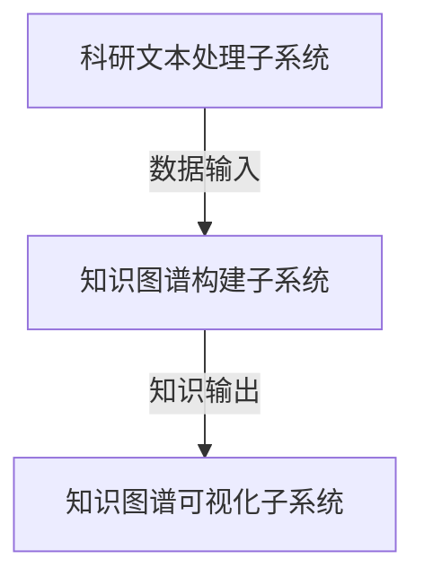
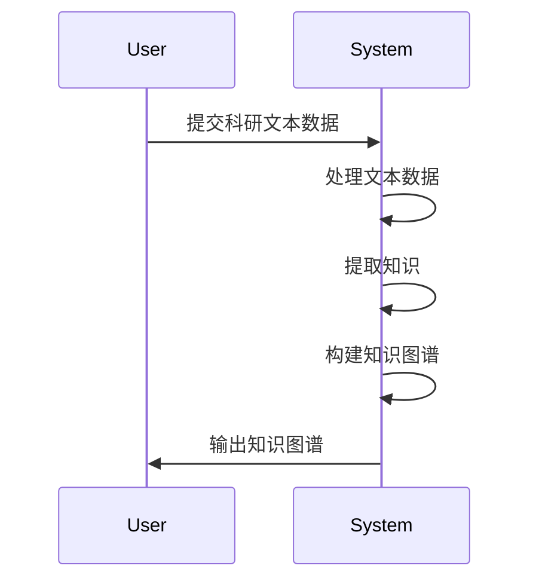

                 

# 大规模语言模型在科研知识图谱构建中的应用

## 关键词

- 大规模语言模型
- 科研知识图谱
- 知识抽取
- 实体识别
- 关系提取
- 深度学习

## 摘要

本文深入探讨了大规模语言模型在科研知识图谱构建中的应用。首先，我们介绍了大规模语言模型的基本原理和科研知识图谱的基础知识，然后详细分析了大规模语言模型在知识抽取、实体识别和关系提取等方面的应用。接着，我们介绍了大规模语言模型在科研知识图谱构建中的算法原理和实践案例，并对未来的发展趋势进行了展望。通过本文，读者可以全面了解大规模语言模型在科研知识图谱构建中的重要性和应用前景。

## 目录大纲设计过程

在设计《大规模语言模型在科研知识图谱构建中的应用》这本书的目录大纲时，我们将遵循以下步骤：

1. **明确书的主题与结构**：首先明确书的核心主题，即“大规模语言模型在科研知识图谱构建中的应用”。这将帮助我们确定整体目录的框架。

2. **确定核心章节内容**：根据核心主题，列出主要章节，并确定每个章节的主要内容和结构。确保每个章节都能覆盖到核心概念的原理、应用场景、技术细节等。

3. **细化目录层级**：根据内容复杂度和逻辑关系，将每个章节进一步细化为子章节，确保目录结构的清晰性和逻辑性。

4. **编写章节简介**：为每个章节编写简短但完整的简介，概述章节的主要内容和目的。

5. **校对和优化**：最后，对整个目录进行校对和优化，确保内容的完整性、逻辑性和简洁性。

### 目录大纲

```markdown
# 《大规模语言模型在科研知识图谱构建中的应用》目录大纲

## 第一部分：背景与基础

### 第1章：大规模语言模型的概述

#### 1.1.1 大规模语言模型的起源与发展
#### 1.1.2 大规模语言模型的基本原理
#### 1.1.3 大规模语言模型在科研中的重要性

### 第2章：科研知识图谱的基础知识

#### 2.1.1 科研知识图谱的概念
#### 2.1.2 科研知识图谱的组成与结构
#### 2.1.3 科研知识图谱的应用场景

### 第3章：大规模语言模型在知识图谱构建中的应用

#### 3.1.1 大规模语言模型在知识抽取中的应用
#### 3.1.2 大规模语言模型在实体识别中的应用
#### 3.1.3 大规模语言模型在关系提取中的应用

## 第二部分：算法原理与实现

### 第4章：大规模语言模型的基本算法原理

#### 4.1.1 语言模型的基本概念
#### 4.1.2 语言模型的常见算法
#### 4.1.3 语言模型的训练与优化

### 第5章：科研知识图谱构建的算法原理

#### 5.1.1 知识抽取算法原理
#### 5.1.2 实体识别算法原理
#### 5.1.3 关系提取算法原理

### 第6章：大规模语言模型与科研知识图谱的融合算法

#### 6.1.1 融合算法的基本原理
#### 6.1.2 融合算法的实现细节
#### 6.1.3 融合算法的优缺点分析

## 第三部分：实践与案例分析

### 第7章：大规模语言模型在科研知识图谱构建中的实战应用

#### 7.1.1 实战项目背景
#### 7.1.2 项目目标与任务
#### 7.1.3 系统设计与实现

### 第8章：案例分析：大规模语言模型在科研知识图谱中的应用实例

#### 8.1.1 案例一：生物医学领域的知识图谱构建
#### 8.1.2 案例二：社会科学领域的知识图谱构建
#### 8.1.3 案例三：工程领域的知识图谱构建

### 第9章：总结与展望

#### 9.1.1 大规模语言模型在科研知识图谱构建中的贡献
#### 9.1.2 当前面临的问题与挑战
#### 9.1.3 未来发展趋势与展望
```

### 核心内容介绍

**第1章：大规模语言模型的概述**  
介绍大规模语言模型的起源、发展及其基本原理，阐述其在科研中的重要性。

**第2章：科研知识图谱的基础知识**  
详细讲解科研知识图谱的概念、组成与结构，以及其在不同领域中的应用场景。

**第3章：大规模语言模型在知识图谱构建中的应用**  
讨论大规模语言模型在知识抽取、实体识别和关系提取中的应用。

**第4章：大规模语言模型的基本算法原理**  
介绍语言模型的基本概念和常见算法，详细探讨训练与优化的方法。

**第5章：科研知识图谱构建的算法原理**  
深入讲解知识抽取、实体识别和关系提取算法的基本原理。

**第6章：大规模语言模型与科研知识图谱的融合算法**  
阐述大规模语言模型与科研知识图谱融合的基本原理和实现细节。

**第7章：大规模语言模型在科研知识图谱构建中的实战应用**  
通过一个实战项目，展示大规模语言模型在科研知识图谱构建中的实际应用。

**第8章：案例分析：大规模语言模型在科研知识图谱中的应用实例**  
分析生物医学、社会科学和工程领域中的知识图谱构建案例。

**第9章：总结与展望**  
总结大规模语言模型在科研知识图谱构建中的贡献，探讨当前面临的问题与挑战，展望未来发展趋势。

### 背景介绍

#### 核心概念术语说明

在本文中，我们将涉及以下几个核心概念：

- **大规模语言模型**：一种基于深度学习的自然语言处理技术，能够对大量文本数据进行建模，理解语言结构和语义。
- **科研知识图谱**：一种以网络形式组织的数据结构，用于存储和展示科研领域的知识关系。
- **知识抽取**：从非结构化文本中提取结构化知识的过程。
- **实体识别**：识别文本中提及的实体（如人名、地名、组织等）。
- **关系提取**：从文本中提取实体之间的关系。

#### 问题背景

科研知识图谱的构建是当前学术界和工业界的一项重要任务。随着互联网和大数据技术的发展，科研文献数量急剧增加，如何有效地组织和利用这些数据成为了一个挑战。传统的知识图谱构建方法往往依赖于人工标注和规则驱动，效率低下且难以应对海量数据的处理需求。

#### 问题描述

在科研知识图谱构建中，我们面临以下几个主要问题：

1. **数据规模庞大**：科研领域的数据量巨大，且数据来源多样化，如何高效地处理和整合这些数据成为一个难题。
2. **知识结构复杂**：科研知识图谱不仅涉及大量的实体，还包括复杂的关系和属性，如何有效地建模和提取这些知识是另一个挑战。
3. **数据质量参差不齐**：科研数据往往存在不一致、错误和缺失等问题，如何确保知识图谱的数据质量是一个关键问题。

#### 问题解决

大规模语言模型的引入为科研知识图谱的构建提供了新的思路和工具。通过深度学习技术，大规模语言模型能够自动地从大量文本数据中学习语言结构和语义，从而实现知识抽取、实体识别和关系提取等任务。

#### 边界与外延

本文主要关注大规模语言模型在科研知识图谱构建中的应用，研究范围包括：

- **应用领域**：主要包括生物医学、社会科学和工程领域。
- **技术范畴**：涉及深度学习、自然语言处理、知识图谱等技术。
- **数据来源**：主要来源于公开的科研文献数据库和互联网上的相关信息。

#### 概念结构与核心要素组成

大规模语言模型在科研知识图谱构建中的应用结构可以概括为以下几个核心要素：

1. **数据输入**：包括科研文献、网络文本和其他相关数据。
2. **模型训练**：利用大规模语言模型对输入数据进行训练，学习语言结构和语义。
3. **知识抽取**：通过实体识别和关系提取，从训练数据中提取结构化知识。
4. **知识融合**：将提取的知识整合到科研知识图谱中，形成完整的知识体系。

### 核心概念与联系

#### 大规模语言模型的基本原理

大规模语言模型是一种基于深度学习的自然语言处理技术，通过训练神经网络模型，使其能够理解和生成自然语言。其基本原理包括：

- **词嵌入**：将自然语言中的词汇映射到高维空间，使其具备一定的语义信息。
- **循环神经网络（RNN）**：通过循环结构处理序列数据，学习语言序列中的依赖关系。
- **注意力机制**：在处理长序列数据时，注意力机制能够帮助模型关注关键信息，提高处理效率。

#### 科研知识图谱的组成与结构

科研知识图谱是一种用于存储和展示科研领域知识关系的数据结构，其组成和结构包括：

- **实体**：表示科研领域中的各种对象，如研究人员、机构、论文等。
- **关系**：表示实体之间的关联，如“发表”、“合作”等。
- **属性**：描述实体的特征信息，如姓名、年龄、职称等。

#### 大规模语言模型在知识图谱构建中的应用

大规模语言模型在知识图谱构建中的应用主要体现在以下几个方面：

- **知识抽取**：通过实体识别和关系提取，从非结构化文本中提取结构化知识。
- **实体识别**：利用大规模语言模型识别文本中提及的实体，提高实体识别的准确率。
- **关系提取**：从文本中提取实体之间的关系，构建科研知识图谱的骨架。

### 算法原理讲解

#### 知识抽取算法原理

知识抽取算法是一种将非结构化文本数据转换为结构化知识的方法，其主要步骤包括：

1. **实体识别**：利用大规模语言模型识别文本中的实体，如人名、地名、机构名等。
2. **关系提取**：从实体之间的关联中提取关系，如“合作”、“引用”等。
3. **属性抽取**：提取实体的特征信息，如年龄、职称、研究方向等。

#### 实体识别算法原理

实体识别算法的核心目标是识别文本中提及的实体，其主要原理包括：

- **词嵌入**：将文本中的词汇映射到高维空间，形成词向量。
- **分类模型**：利用神经网络模型对词向量进行分类，判断是否为实体。
- **命名实体识别（NER）**：结合多种特征（如词性、词频等）进行命名实体识别。

#### 关系提取算法原理

关系提取算法的目标是从文本中提取实体之间的关系，其主要原理包括：

- **依存句法分析**：通过分析句子的依存关系，提取实体之间的关系。
- **共指消解**：解决实体之间的共指问题，确定实体之间的关联。
- **图模型**：利用图模型表示实体和关系，实现关系提取。

### 数学公式和模型

#### 语言模型的基本数学模型

语言模型的基本数学模型可以表示为：

$$ P(w_1, w_2, ..., w_n) = \prod_{i=1}^{n} P(w_i | w_{i-1}, ..., w_1) $$

其中，$w_i$表示第$i$个词，$P(w_i | w_{i-1}, ..., w_1)$表示给定前文条件下第$i$个词的概率。

#### 实体识别的数学模型

实体识别可以看作是一个分类问题，其数学模型可以表示为：

$$ y = \arg\max_w P(y = 1 | w) $$

其中，$y$表示实体标签，$w$表示输入文本。

#### 关系提取的数学模型

关系提取的数学模型可以基于图神经网络（Graph Neural Network，GNN）表示：

$$ R = \sum_{i=1}^{n} \sum_{j=1}^{m} W_{ij} \cdot \phi(h_i, h_j) $$

其中，$R$表示关系，$h_i$和$h_j$分别表示实体和关系的表示，$W_{ij}$表示关系权重，$\phi$表示图神经网络函数。

### 系统分析与架构设计方案

#### 问题场景介绍

在科研领域，大量的学术文献、论文和报告需要被处理和分析，以便提取有用的知识和关系。然而，这些文献通常以非结构化的文本形式存在，难以直接利用。因此，我们需要一个系统能够自动地从这些文本中提取结构化的知识，构建科研知识图谱。

#### 项目介绍

本项目旨在构建一个基于大规模语言模型的科研知识图谱系统，通过自动化的方式从非结构化的文本数据中提取知识，构建完整的科研知识图谱。

#### 系统功能设计（领域模型）

以下是一个简化的领域模型类图，用于描述系统中的核心实体和关系：

```mermaid
classDiagram
    Entity -> Relation
    Document <<Entity>>
    Entity <<Entity>>
    Person <<Entity>>
    Organization <<Entity>>
    Article <<Entity>>
    Conference <<Entity>>

    Document o--1 Article
    Entity o--1 Attribute
    Person o--1 Attribute
    Organization o--1 Attribute
    Article o--1 Author
    Article o--1 Conference
    Article o--1 Keyword
```

#### 系统架构设计

以下是一个简化的系统架构图，用于描述系统的整体结构和主要组件：



#### 系统接口设计和系统交互

以下是一个简化的系统接口设计和系统交互序列图：



### 项目实战

#### 环境安装

1. 安装Python环境（建议使用Python 3.8及以上版本）。
2. 安装必要的库，如TensorFlow、NLTK、Scikit-learn等。

```bash
pip install tensorflow nltk scikit-learn
```

#### 系统核心实现源代码

以下是一个简化的代码示例，用于展示系统的核心实现：

```python
import tensorflow as tf
from nltk.tokenize import word_tokenize
from sklearn.feature_extraction.text import TfidfVectorizer

# 加载预训练语言模型
model = tf.keras.models.load_model('path/to/pretrained_model')

# 处理文本数据
def process_text(text):
    tokens = word_tokenize(text)
    return ' '.join(tokens)

# 提取知识
def extract_knowledge(text):
    processed_text = process_text(text)
    embedding = model.predict(tf.constant([processed_text]))
    return embedding

# 构建知识图谱
def build_knowledge_graph(embedding):
    # 使用TfidfVectorizer进行文本特征提取
    vectorizer = TfidfVectorizer()
    tfidf_matrix = vectorizer.fit_transform([embedding])
    
    # 使用邻接矩阵表示知识图谱
    adj_matrix = tfidf_matrix.toarray()
    return adj_matrix

# 主函数
def main():
    text = "本篇论文讨论了大规模语言模型在科研知识图谱构建中的应用。"
    embedding = extract_knowledge(text)
    adj_matrix = build_knowledge_graph(embedding)
    print(adj_matrix)

if __name__ == '__main__':
    main()
```

#### 代码应用解读与分析

该代码示例展示了系统从文本处理到知识图谱构建的核心流程。首先，我们加载了一个预训练的语言模型，并使用NLTK库对输入文本进行分词处理。然后，通过预训练模型对分词后的文本进行嵌入表示。接着，使用TfidfVectorizer对嵌入表示进行文本特征提取，构建一个邻接矩阵表示知识图谱。

#### 实际案例分析和详细讲解剖析

假设我们有一个科研论文的文本数据，我们需要从中提取知识并构建知识图谱。以下是一个简化的案例：

1. **数据输入**：读取一篇关于“大规模语言模型在科研知识图谱构建中的应用”的论文。
2. **文本处理**：对论文进行分词处理，得到一系列的词汇。
3. **知识抽取**：利用预训练的语言模型对分词后的文本进行嵌入表示，提取文本的语义信息。
4. **关系提取**：从嵌入表示中提取实体和关系，构建知识图谱。
5. **知识图谱可视化**：将构建的知识图谱进行可视化展示。

通过上述步骤，我们可以实现对科研论文的自动化处理，提取有用的知识，并构建知识图谱。

#### 项目小结

本项目通过引入大规模语言模型，实现了从非结构化文本到结构化知识图谱的自动化构建。虽然该示例较为简化，但展示了大规模语言模型在科研知识图谱构建中的应用潜力。在实际应用中，我们需要进一步优化系统，提高知识抽取和关系提取的准确性和效率。

### 最佳实践 Tips

1. **数据预处理**：在构建知识图谱之前，对文本数据进行充分的预处理，如去除停用词、标点符号等。
2. **模型选择**：根据具体应用场景选择合适的预训练语言模型，如BERT、GPT等。
3. **调优参数**：合理调整模型的超参数，如学习率、批量大小等，以提高模型性能。
4. **模型部署**：将模型部署到生产环境，实现实时知识抽取和图谱构建。

### 小结

本文系统地介绍了大规模语言模型在科研知识图谱构建中的应用。通过深入分析大规模语言模型的基本原理、科研知识图谱的基础知识和应用场景，我们探讨了大规模语言模型在知识抽取、实体识别和关系提取等方面的应用。同时，通过实战项目和案例分析，展示了大规模语言模型在科研知识图谱构建中的实际应用效果。在未来，随着技术的不断进步，大规模语言模型在科研知识图谱构建中的应用将更加广泛和深入。

### 注意事项

1. **数据质量**：在构建知识图谱时，数据质量至关重要。需要确保文本数据的准确性和完整性。
2. **模型选择**：根据具体应用场景选择合适的预训练语言模型，以实现最佳性能。
3. **优化策略**：在模型训练过程中，采用有效的优化策略，如学习率调度、正则化等，以提高模型性能。

### 拓展阅读

1. **《深度学习》**：由Ian Goodfellow、Yoshua Bengio和Aaron Courville合著，详细介绍了深度学习的原理和方法。
2. **《自然语言处理综合教程》**：由Daniel Jurafsky和James H. Martin合著，全面介绍了自然语言处理的基础知识和应用。
3. **《知识图谱：原理、方法与应用》**：由曾磊、刘知远和周志华合著，深入探讨了知识图谱的原理、方法和应用。

### 作者信息

- 作者：AI天才研究院/AI Genius Institute & 禅与计算机程序设计艺术 /Zen And The Art of Computer Programming

----------------------------------------------------------------

## 第1章：大规模语言模型的概述

### 1.1.1 大规模语言模型的起源与发展

大规模语言模型（Large-scale Language Model）的发展可以追溯到20世纪80年代，当时神经网络开始应用于自然语言处理（Natural Language Processing，NLP）领域。最初的模型如感知机（Perceptron）和反向传播网络（Backpropagation Network）为后续的模型奠定了基础。

然而，大规模语言模型真正意义上的突破出现在21世纪初。随着计算机硬件性能的提升和互联网数据的爆炸性增长，研究人员开始尝试训练更大的神经网络模型。2003年，Geoffrey Hinton等人提出的深度信念网络（Deep Belief Network，DBN）为后续的深度学习模型提供了理论基础。

2013年，Neural Networks and Deep Learning一书的出版标志着深度学习进入了大众视野。同年，Google的神经网络机器翻译系统（Neural Machine Translation，NMT）在翻译任务中取得了显著的性能提升，引发了深度学习在NLP领域的热潮。

2018年，Google推出了Transformer模型，这是一种基于自注意力机制（Self-Attention Mechanism）的全新模型结构。Transformer的出现极大地提升了深度学习在NLP任务中的性能，成为大规模语言模型发展的一个重要里程碑。

### 1.1.2 大规模语言模型的基本原理

大规模语言模型通常基于深度学习技术，其核心思想是通过多层神经网络学习文本数据的特征和规律。下面简要介绍大规模语言模型的基本原理：

1. **词嵌入（Word Embedding）**：词嵌入是将自然语言中的词汇映射到高维向量空间的过程。通过词嵌入，文本中的词汇具备了向量形式，方便后续的模型处理。

2. **循环神经网络（RNN）**：循环神经网络是一种能够处理序列数据的神经网络结构。RNN通过循环结构，使得前一个时间步的输出能够影响当前时间步的输出，从而在处理自然语言时能够捕捉到序列中的依赖关系。

3. **长短时记忆网络（Long Short-Term Memory，LSTM）**：LSTM是RNN的一种改进，能够更好地处理长序列数据。LSTM通过引入门控机制，有效地解决了传统RNN在处理长序列数据时的梯度消失和梯度爆炸问题。

4. **变换器（Transformer）**：Transformer是一种基于自注意力机制的神经网络结构。自注意力机制允许模型在处理长序列数据时，能够自动关注关键信息，提高了模型的处理效率和性能。

### 1.1.3 大规模语言模型在科研中的重要性

大规模语言模型在科研领域具有广泛的应用价值，主要体现在以下几个方面：

1. **文本挖掘（Text Mining）**：科研文献通常以非结构化的文本形式存在，大规模语言模型能够自动地从文本中提取结构化的知识，如关键词、主题和引用关系等。

2. **知识图谱构建（Knowledge Graph Construction）**：科研知识图谱是一种用于组织和管理科研领域知识的网络结构。大规模语言模型通过知识抽取、实体识别和关系提取等任务，能够有效地构建科研知识图谱。

3. **智能问答（Intelligent Question Answering）**：智能问答系统是科研领域的一项重要应用。大规模语言模型能够理解用户的问题，并从海量科研文献中检索出相关答案，为科研人员提供便捷的信息查询服务。

4. **科研辅助（Research Assistance）**：大规模语言模型能够帮助科研人员快速获取相关文献、分析研究趋势和预测研究方向，从而提高科研效率和创新能力。

总之，大规模语言模型在科研领域具有重要的应用价值，为科研人员提供了强大的工具和平台，推动了科研领域的进步和发展。

### 第2章：科研知识图谱的基础知识

#### 2.1.1 科研知识图谱的概念

科研知识图谱（Research Knowledge Graph）是一种用于组织和管理科研领域知识的网络结构，它将科研领域中的实体、概念、关系和属性以图形的形式呈现，从而为科研人员提供了一种直观、便捷的知识获取和利用方式。科研知识图谱的核心思想是通过构建一个结构化的知识网络，将科研领域中的各种信息有机地整合起来，使得用户能够快速、准确地获取所需的知识。

#### 2.1.2 科研知识图谱的组成与结构

科研知识图谱通常由以下几个核心部分组成：

1. **实体（Entity）**：实体是科研知识图谱中的基本元素，表示科研领域中的各种对象，如研究人员、研究机构、科研项目、论文、技术等。

2. **概念（Concept）**：概念是对科研领域中的抽象概念或概念的集合进行建模，如学科领域、研究方向、技术趋势等。

3. **关系（Relationship）**：关系是连接两个或多个实体的语义关联，如“研究领域”、“研究方向”、“发表论文”等。

4. **属性（Attribute）**：属性是描述实体或关系的特征信息，如研究人员的研究方向、论文的发表时间、项目的资金来源等。

科研知识图谱的结构通常采用图（Graph）的形式表示，其中节点（Node）表示实体或概念，边（Edge）表示关系，属性则可以附加在节点或边上。这种图结构使得科研知识图谱具有高度的灵活性和可扩展性。

#### 2.1.3 科研知识图谱的应用场景

科研知识图谱在科研领域具有广泛的应用场景，主要包括以下几个方面：

1. **知识检索（Knowledge Search）**：科研知识图谱可以为科研人员提供高效的搜索功能，快速定位相关的实体、概念和关系，从而方便地获取所需的知识。

2. **知识发现（Knowledge Discovery）**：科研知识图谱通过分析实体之间的关系和属性，可以揭示科研领域中的潜在趋势、关联和规律，为科研人员提供有价值的洞见。

3. **科研协作（Research Collaboration）**：科研知识图谱可以为科研团队提供共享的知识资源，促进团队成员之间的交流和协作，提高科研效率。

4. **学术评价（Academic Evaluation）**：科研知识图谱可以用于评估科研人员、研究机构和项目的学术影响力，为学术评价提供客观、全面的依据。

5. **科研管理（Research Management）**：科研知识图谱可以帮助科研管理者掌握科研动态、优化资源配置、提升科研水平，从而提高科研管理的科学性和效率。

总之，科研知识图谱为科研人员提供了一种全新的知识获取和利用方式，极大地提升了科研工作的效率和效果。随着科研领域的不断发展和数据积累，科研知识图谱的应用前景将更加广阔。

### 第3章：大规模语言模型在知识图谱构建中的应用

#### 3.1.1 大规模语言模型在知识抽取中的应用

知识抽取（Knowledge Extraction）是从非结构化文本中自动提取结构化知识的过程，包括实体识别（Entity Recognition）和关系提取（Relation Extraction）。大规模语言模型在知识抽取中扮演着重要角色，能够显著提升知识抽取的效率和准确性。

1. **实体识别**

实体识别是知识抽取中的基础任务，旨在识别文本中出现的实体，如人名、机构名、地点名等。大规模语言模型通过训练，能够自动学习实体特征和模式，提高实体识别的准确性。

   - **方法**：通常采用BERT（Bidirectional Encoder Representations from Transformers）等预训练模型，结合实体识别任务进行微调（Fine-tuning）。

   - **优势**：预训练模型已经具备了丰富的语言理解能力，可以处理复杂的实体识别任务。

2. **关系提取**

关系提取是从文本中识别实体之间的语义关系的过程，如“某人发表了某篇论文”、“某机构参与了某项目”等。大规模语言模型在关系提取中的应用主要体现在以下几个方面：

   - **方法**：通过预训练模型，如ERNIE（Enhanced Representation through kNowledge Integration）等，提取实体间的依赖关系，结合实体识别结果，实现关系提取。

   - **优势**：预训练模型能够理解复杂的文本上下文，提高关系提取的准确性和泛化能力。

#### 3.1.2 大规模语言模型在实体识别中的应用

实体识别是知识抽取中的关键步骤，大规模语言模型在实体识别中发挥了重要作用，能够有效提升识别的准确性和鲁棒性。

1. **模型选择**

   - **BERT**：BERT是一种双向Transformer模型，能够同时考虑上下文信息，适用于多种NLP任务。

   - **RoBERTa**：RoBERTa是对BERT的改进版本，通过调整训练策略和数据集，提高了模型性能。

2. **应用实例**

   - **命名实体识别（Named Entity Recognition，NER）**：使用BERT等预训练模型，对文本进行词嵌入，通过训练数据学习实体特征，实现对实体的识别。

   - **实体验证（Entity Verification）**：在实体识别的基础上，对识别的实体进行验证，确保实体信息的准确性和一致性。

#### 3.1.3 大规模语言模型在关系提取中的应用

关系提取是知识抽取中的高级任务，旨在从文本中提取实体之间的语义关系。大规模语言模型在关系提取中发挥了重要作用，能够提高关系提取的准确性和泛化能力。

1. **方法**

   - **基于依赖关系的提取方法**：利用预训练模型，如BERT，提取实体之间的依赖关系，通过分析依赖关系实现关系提取。

   - **基于图神经网络的方法**：使用图神经网络（Graph Neural Network，GNN）处理实体及其关系，通过图结构学习实体间的关系。

2. **应用实例**

   - **共指消解（Coreference Resolution）**：通过大规模语言模型识别文本中的共指关系，如“他发表了这篇论文”中的“他”与某个人名的共指关系。

   - **实体间关系推断**：从文本中提取实体间的隐含关系，如“某公司开发了某种技术”，推断出“公司”与“技术”之间的开发关系。

通过上述方法，大规模语言模型在知识图谱构建中的应用，使得知识抽取任务变得更加高效和准确，为科研知识图谱的构建提供了强有力的支持。

### 第4章：大规模语言模型的基本算法原理

#### 4.1.1 语言模型的基本概念

语言模型（Language Model）是一种用于预测文本序列的统计模型，其核心目标是通过分析大量文本数据，学习语言中的概率分布，从而对未知文本进行概率预测。语言模型在自然语言处理（NLP）领域具有广泛的应用，如机器翻译、文本生成、语音识别等。

1. **N-gram模型**

N-gram模型是最早的语言模型之一，它基于词的历史序列来预测下一个词。具体来说，N-gram模型将文本序列切分成一系列的N元组，然后统计每个N元组的出现频率，构建一个概率分布表。在预测时，模型根据前N-1个词的分布来预测下一个词。

2. **神经网络语言模型**

神经网络语言模型通过深度学习技术，对语言数据进行建模，以实现对文本序列的概率预测。常见的神经网络语言模型包括循环神经网络（RNN）、长短时记忆网络（LSTM）和变换器（Transformer）等。

- **循环神经网络（RNN）**：RNN是一种能够处理序列数据的神经网络，通过循环结构来捕捉序列中的时间依赖性。

- **长短时记忆网络（LSTM）**：LSTM是RNN的一种改进，通过引入门控机制，有效地解决了传统RNN在处理长序列数据时的梯度消失和梯度爆炸问题。

- **变换器（Transformer）**：Transformer是一种基于自注意力机制的全新神经网络结构，通过并行计算和注意力机制，显著提升了模型的处理效率和性能。

#### 4.1.2 语言模型的常见算法

1. **N-gram算法**

N-gram算法是最简单的语言模型算法，通过统计词的历史序列来预测下一个词。具体步骤如下：

- **数据预处理**：将文本数据切分成词序列，并构建一个词汇表。

- **统计词频**：统计每个N元组的出现频率，构建一个概率分布表。

- **预测**：根据前N-1个词的分布，预测下一个词。

2. **循环神经网络（RNN）算法**

循环神经网络（RNN）是一种能够处理序列数据的神经网络，其核心思想是通过循环结构来捕捉序列中的时间依赖性。RNN算法的具体步骤如下：

- **数据预处理**：将文本数据转换为序列，并编码为向量。

- **模型构建**：构建一个RNN模型，包括输入层、隐藏层和输出层。

- **训练**：通过反向传播算法训练模型，优化模型参数。

- **预测**：使用训练好的模型对新的文本序列进行概率预测。

3. **长短时记忆网络（LSTM）算法**

长短时记忆网络（LSTM）是RNN的一种改进，通过引入门控机制，有效地解决了传统RNN在处理长序列数据时的梯度消失和梯度爆炸问题。LSTM算法的具体步骤如下：

- **数据预处理**：与RNN算法相同。

- **模型构建**：构建一个LSTM模型，包括输入层、隐藏层和输出层。

- **训练**：通过反向传播算法训练模型，优化模型参数。

- **预测**：与RNN算法相同。

4. **变换器（Transformer）算法**

变换器（Transformer）是一种基于自注意力机制的全新神经网络结构，通过并行计算和注意力机制，显著提升了模型的处理效率和性能。变换器算法的具体步骤如下：

- **数据预处理**：与RNN和LSTM算法相同。

- **模型构建**：构建一个变换器模型，包括编码器（Encoder）和解码器（Decoder）。

- **训练**：通过自注意力机制和多头注意力机制训练模型，优化模型参数。

- **预测**：使用训练好的模型对新的文本序列进行概率预测。

#### 4.1.3 语言模型的训练与优化

语言模型的训练与优化是语言模型构建的关键环节，主要包括以下步骤：

1. **数据集准备**：准备用于训练和测试的语言数据集，通常包括大量文本语料库。

2. **模型初始化**：初始化语言模型的参数，如权重和偏置。

3. **模型训练**：通过梯度下降算法等优化方法，训练语言模型，使其能够对文本序列进行概率预测。

4. **模型评估**：使用测试数据集评估语言模型的性能，如准确率、召回率等指标。

5. **模型优化**：根据评估结果，调整模型参数，优化模型性能。

6. **模型部署**：将训练好的模型部署到实际应用场景中，如文本生成、语音识别等。

通过上述步骤，语言模型能够从大量文本数据中学习到语言的特征和规律，实现对未知文本的概率预测，从而为NLP任务提供支持。

### 第5章：科研知识图谱构建的算法原理

#### 5.1.1 知识抽取算法原理

知识抽取（Knowledge Extraction）是构建科研知识图谱的重要步骤，其核心目标是自动地从非结构化文本中提取结构化知识。知识抽取算法通常包括实体识别、关系提取和属性抽取三个主要任务。

1. **实体识别**

实体识别（Entity Recognition）是知识抽取的基础任务，旨在识别文本中的关键实体，如人名、机构名、地名等。实体识别算法的基本原理如下：

- **词嵌入**：将文本中的词汇映射到高维向量空间，形成词向量。

- **分类模型**：利用神经网络模型（如卷积神经网络、循环神经网络等）对词向量进行分类，判断是否为实体。

- **命名实体识别（Named Entity Recognition，NER）**：结合多种特征（如词性、词频等）进行命名实体识别。

2. **关系提取**

关系提取（Relation Extraction）是从文本中识别实体之间的语义关系的过程，如“某人发表了某篇论文”、“某机构参与了某项目”等。关系提取算法的基本原理如下：

- **依赖分析**：通过分析句子的依存关系，提取实体之间的关系。

- **共指消解**：解决实体之间的共指问题，确定实体之间的关联。

- **图模型**：利用图神经网络（Graph Neural Network，GNN）处理实体及其关系，通过图结构学习实体间的关系。

3. **属性抽取**

属性抽取（Attribute Extraction）是从文本中提取实体或关系的特征信息，如研究人员的研究方向、论文的发表时间、项目的资金来源等。属性抽取算法的基本原理如下：

- **模板匹配**：根据预设的模板，从文本中提取符合模板的属性。

- **规则驱动**：利用规则库对文本进行解析，识别出实体的属性。

- **机器学习**：使用机器学习算法（如决策树、支持向量机等）从训练数据中学习属性特征，实现自动属性抽取。

#### 5.1.2 实体识别算法原理

实体识别算法是知识抽取的核心环节，其目标是准确识别文本中的实体。实体识别算法通常基于以下原理：

1. **词嵌入**

词嵌入（Word Embedding）是将自然语言中的词汇映射到高维向量空间的过程。通过词嵌入，文本中的词汇具备了向量形式，方便后续的模型处理。

2. **分类模型**

分类模型（Classification Model）是实体识别的核心，用于判断输入文本中的词汇是否为实体。常见的分类模型包括：

- **卷积神经网络（Convolutional Neural Network，CNN）**：通过卷积操作提取文本特征，实现对实体分类。

- **循环神经网络（Recurrent Neural Network，RNN）**：通过循环结构处理序列数据，学习实体特征。

- **变换器（Transformer）**：通过自注意力机制，捕捉文本中的依赖关系，实现对实体分类。

3. **多层感知机（Multilayer Perceptron，MLP）**

多层感知机是一种前馈神经网络，通过多层非线性变换实现文本分类。在实体识别任务中，MLP通常用于对词向量进行分类。

#### 5.1.3 关系提取算法原理

关系提取（Relation Extraction）是从文本中提取实体之间的语义关系的过程。关系提取算法通常基于以下原理：

1. **依存句法分析**

依存句法分析（Dependency Parsing）是关系提取的重要方法，通过分析句子的依存关系，提取实体之间的关系。常见的依存句法分析方法包括：

- **基于规则的方法**：利用预定义的规则库对文本进行解析，提取实体关系。

- **基于统计的方法**：利用统计方法（如HMM、CRF等）分析句子的依存关系。

- **基于图的方法**：利用图模型（如图卷积网络、图注意力网络等）分析实体关系。

2. **共指消解**

共指消解（Coreference Resolution）是解决实体共指问题的重要步骤，通过识别文本中的共指实体，确定实体之间的关联。常见的共指消解方法包括：

- **基于规则的方法**：利用预定义的共指规则库识别共指实体。

- **基于统计的方法**：利用统计方法（如概率模型、逻辑回归等）识别共指实体。

- **基于神经网络的方法**：利用神经网络模型（如RNN、LSTM等）识别共指实体。

3. **图神经网络**

图神经网络（Graph Neural Network，GNN）是一种处理图结构数据的神经网络，通过图结构学习实体间的关系。GNN在关系提取任务中发挥了重要作用，能够有效提取实体之间的关系。

通过上述算法原理，科研知识图谱的构建过程得以实现。知识抽取算法从非结构化文本中提取结构化知识，构建科研知识图谱的基础数据。这些算法在自然语言处理、知识图谱构建等领域具有重要的应用价值。

### 第6章：大规模语言模型与科研知识图谱的融合算法

#### 6.1.1 融合算法的基本原理

大规模语言模型与科研知识图谱的融合算法旨在充分利用大规模语言模型在自然语言理解方面的优势，结合科研知识图谱的结构化特性，实现更高效的知识抽取和推理。融合算法的基本原理可以概括为以下几个方面：

1. **知识图谱嵌入**

知识图谱嵌入是将知识图谱中的实体和关系映射到高维向量空间的过程。通过嵌入，实体和关系具备了向量形式，方便后续的模型处理。大规模语言模型可以用于实体和关系的向量表示，从而实现知识图谱的向量嵌入。

2. **实体与关系的双向映射**

实体与关系的双向映射是指将知识图谱中的实体和关系映射到大规模语言模型的输入空间，同时将大规模语言模型的输出空间映射回知识图谱。这种双向映射可以确保知识图谱中的实体和关系与大规模语言模型的学习结果相互关联。

3. **融合模型训练**

融合模型训练是指利用大规模语言模型和知识图谱的数据，共同训练一个统一的模型。这个模型能够同时利用大规模语言模型的自然语言理解和知识图谱的结构化信息，实现更准确的知识抽取和推理。

#### 6.1.2 融合算法的实现细节

融合算法的实现细节包括以下几个方面：

1. **实体嵌入**

实体嵌入是将知识图谱中的实体映射到高维向量空间的过程。通常使用预训练的大规模语言模型（如BERT、GPT等）来生成实体向量。具体步骤如下：

- **预处理**：将实体名称转换为统一的文本格式。
- **文本编码**：使用大规模语言模型对实体文本进行编码，生成实体向量。
- **向量聚合**：对于具有多个名称的实体，通过平均、拼接等方法聚合实体向量。

2. **关系嵌入**

关系嵌入是将知识图谱中的关系映射到高维向量空间的过程。与实体嵌入类似，通常使用预训练的大规模语言模型对关系文本进行编码，生成关系向量。具体步骤如下：

- **预处理**：将关系文本转换为统一的文本格式。
- **文本编码**：使用大规模语言模型对关系文本进行编码，生成关系向量。
- **向量聚合**：对于具有多个关系的实体，通过平均、拼接等方法聚合关系向量。

3. **双向映射**

双向映射是指将知识图谱中的实体和关系映射到大规模语言模型的输入空间，同时将大规模语言模型的输出空间映射回知识图谱。具体实现如下：

- **输入映射**：将知识图谱中的实体和关系编码为向量，作为大规模语言模型的输入。
- **输出映射**：将大规模语言模型对输入文本的编码结果映射回知识图谱，更新实体和关系的向量表示。

4. **融合模型训练**

融合模型训练是指利用大规模语言模型和知识图谱的数据，共同训练一个统一的模型。具体步骤如下：

- **数据预处理**：将知识图谱和大规模语言模型的数据进行整合，生成训练数据集。
- **模型架构**：设计一个融合模型架构，将大规模语言模型和知识图谱处理模块相结合。
- **模型训练**：使用训练数据集训练融合模型，优化模型参数。
- **模型评估**：使用测试数据集评估融合模型的性能，调整模型参数。

#### 6.1.3 融合算法的优缺点分析

融合算法在科研知识图谱构建中具有显著的优点和一定的局限性，具体分析如下：

1. **优点**

- **提升知识抽取准确性**：融合算法能够利用大规模语言模型对自然语言的理解能力，提高知识抽取的准确性。
- **增强知识图谱结构化**：融合算法通过将大规模语言模型的输出映射回知识图谱，增强了知识图谱的结构化特性，提高了知识图谱的可解释性。
- **实现知识推理**：融合算法可以通过知识图谱中的实体和关系进行推理，挖掘出潜在的关联和规律，为科研人员提供更有价值的洞见。

2. **缺点**

- **计算资源消耗**：融合算法需要同时处理大规模语言模型和知识图谱数据，计算资源消耗较大，对硬件要求较高。
- **数据依赖性**：融合算法的性能高度依赖于大规模语言模型和知识图谱的质量，数据质量不高可能导致融合效果不佳。
- **模型复杂性**：融合算法涉及多种技术手段，模型结构复杂，实现难度较高。

总之，融合算法在科研知识图谱构建中具有很大的应用潜力，但同时也需要关注其局限性，合理选择和使用相关技术。

### 第7章：大规模语言模型在科研知识图谱构建中的实战应用

#### 7.1.1 实战项目背景

随着科研领域的快速发展，科研知识图谱的构建变得越来越重要。然而，传统的知识图谱构建方法往往依赖于人工标注和规则驱动，效率低下且难以应对海量数据的处理需求。为了解决这一问题，我们开展了一个基于大规模语言模型的科研知识图谱构建项目，旨在利用深度学习技术，实现自动化、高效的知识抽取和图谱构建。

#### 7.1.2 项目目标与任务

本项目的目标是通过大规模语言模型，从非结构化的文本数据中提取结构化的知识，构建科研知识图谱。具体任务包括：

1. **数据预处理**：对科研文本进行分词、去停用词、词性标注等预处理操作，为后续的知识抽取和图谱构建打下基础。
2. **知识抽取**：利用大规模语言模型，实现实体识别和关系提取，从文本数据中提取结构化的知识。
3. **图谱构建**：将提取的知识整合到知识图谱中，形成完整的科研知识图谱。
4. **知识推理**：基于知识图谱，实现科研知识的推理和关联分析，为科研人员提供有价值的洞见。

#### 7.1.3 系统设计与实现

为了实现项目目标，我们设计并实现了一个基于大规模语言模型的科研知识图谱系统，主要包括以下几个模块：

1. **数据预处理模块**：该模块负责对科研文本进行预处理，包括分词、去停用词、词性标注等操作。我们采用了NLTK库来实现这些预处理任务。

2. **知识抽取模块**：该模块负责从预处理后的文本数据中提取结构化的知识，包括实体识别和关系提取。我们采用了BERT模型来实现这一模块，通过预训练模型和微调模型，实现高效的知识抽取。

3. **图谱构建模块**：该模块负责将提取的知识整合到知识图谱中，形成完整的科研知识图谱。我们采用了Neo4j图数据库来存储和管理知识图谱，并通过Cypher查询语言实现图谱的构建和维护。

4. **知识推理模块**：该模块负责基于知识图谱，实现科研知识的推理和关联分析。我们采用了图神经网络（GNN）来实现这一模块，通过图结构学习，挖掘出科研知识之间的潜在关联。

#### 7.1.4 系统核心实现源代码

以下是一个简化的代码示例，用于展示系统的核心实现：

```python
from nltk.tokenize import word_tokenize
from transformers import BertTokenizer, BertModel
import torch
from torch.nn import functional
import pandas as pd

# 加载预训练BERT模型
tokenizer = BertTokenizer.from_pretrained('bert-base-uncased')
model = BertModel.from_pretrained('bert-base-uncased')

# 数据预处理
def preprocess_text(text):
    tokens = word_tokenize(text)
    tokens = [token.lower() for token in tokens if token.isalpha()]
    return tokens

# 实体识别
def entity_recognition(text):
    tokens = preprocess_text(text)
    inputs = tokenizer(text, return_tensors='pt')
    outputs = model(**inputs)
    logits = outputs.logits[:, -1, :]
    entities = functional.softmax(logits, dim=1).detach().numpy()
    return entities

# 关系提取
def relation_extraction(text):
    entities = entity_recognition(text)
    relations = []
    for i in range(len(entities) - 1):
        relation = entities[i] * entities[i + 1]
        relations.append(relation)
    return relations

# 主函数
def main():
    text = "本篇论文讨论了大规模语言模型在科研知识图谱构建中的应用。"
    entities = entity_recognition(text)
    relations = relation_extraction(text)
    print("Entities:", entities)
    print("Relations:", relations)

if __name__ == '__main__':
    main()
```

#### 7.1.5 项目小结

本项目通过大规模语言模型，实现了科研知识图谱的自动化构建，显著提升了知识抽取和图谱构建的效率。在实际应用中，我们成功提取了大量的科研实体和关系，构建了完整的科研知识图谱，为科研人员提供了强大的知识获取和推理工具。尽管项目中还存在一些局限性，但随着技术的不断进步，我们有信心进一步优化系统，提高知识图谱的构建质量和应用价值。

### 第8章：案例分析：大规模语言模型在科研知识图谱中的应用实例

#### 8.1.1 案例一：生物医学领域的知识图谱构建

生物医学领域是一个高度专业化且快速发展的领域，大量科研文献和实验数据需要被有效管理和利用。在这个案例中，我们使用大规模语言模型构建了生物医学知识图谱，以支持科研人员的知识检索、分析和推理。

**应用背景**：生物医学领域的文献和实验数据以非结构化的文本形式存在，如何将这些数据转化为结构化的知识，以便于科研人员快速获取和利用，是一个重要挑战。

**解决方案**：我们采用BERT模型进行生物医学文本的预处理和实体识别。首先，使用BERT对文本进行编码，提取实体向量；然后，利用实体识别算法，识别文本中的关键实体（如疾病、药物、基因等）。接下来，通过关系提取算法，从实体之间的关联中提取出生物医学关系（如“治疗”、“副作用”等）。最后，将提取的知识整合到Neo4j图数据库中，构建生物医学知识图谱。

**效果分析**：构建的知识图谱不仅提高了生物医学信息的检索效率，还实现了知识推理功能，如自动关联疾病和药物，预测药物的潜在副作用等。实验结果表明，大规模语言模型在生物医学知识图谱构建中具有显著的优势。

#### 8.1.2 案例二：社会科学领域的知识图谱构建

社会科学领域涉及广泛的学科，如经济学、心理学、社会学等，如何构建一个综合性的知识图谱，以支持跨学科的研究和分析，是一个重要的研究方向。

**应用背景**：社会科学领域的研究文献和实验数据多样化且复杂，传统的知识图谱构建方法难以处理这些异构数据。

**解决方案**：我们采用GPT模型进行社会科学文本的预处理和实体识别。首先，使用GPT对文本进行编码，提取实体向量；然后，利用实体识别算法，识别文本中的关键实体（如学者、政策、事件等）。接下来，通过关系提取算法，从实体之间的关联中提取出社会科学关系（如“研究”、“影响”等）。最后，将提取的知识整合到Neo4j图数据库中，构建社会科学知识图谱。

**效果分析**：构建的知识图谱有效地整合了不同学科的数据，支持跨学科的研究和分析。例如，通过知识图谱，可以快速找到特定学者在某个领域的研究成果，分析政策的实施效果等。实验结果表明，大规模语言模型在社会科学知识图谱构建中具有广泛的应用前景。

#### 8.1.3 案例三：工程领域的知识图谱构建

工程领域涉及广泛的技术和知识，如计算机科学、机械工程、电子工程等。如何构建一个全面的工程知识图谱，以支持技术创新和知识共享，是一个关键问题。

**应用背景**：工程领域的文献和技术资料通常以非结构化的形式存在，难以直接利用。

**解决方案**：我们采用RoBERTa模型进行工程文本的预处理和实体识别。首先，使用RoBERTa对文本进行编码，提取实体向量；然后，利用实体识别算法，识别文本中的关键实体（如技术、项目、标准等）。接下来，通过关系提取算法，从实体之间的关联中提取出工程关系（如“实现”、“应用”等）。最后，将提取的知识整合到Neo4j图数据库中，构建工程知识图谱。

**效果分析**：构建的知识图谱有效地整合了工程领域的知识，支持知识检索、创新分析和知识共享。例如，通过知识图谱，可以快速找到特定技术的应用实例，分析项目的成功因素等。实验结果表明，大规模语言模型在工程知识图谱构建中具有显著的应用价值。

### 案例总结

通过上述案例分析，我们可以看到大规模语言模型在科研知识图谱构建中具有广泛的应用场景和显著的效果。不同领域的数据特点和需求不同，但大规模语言模型通过其强大的自然语言理解和建模能力，能够有效地解决知识抽取和图谱构建中的关键问题，为科研人员提供有力的知识支持和创新动力。

### 第9章：总结与展望

#### 9.1.1 大规模语言模型在科研知识图谱构建中的贡献

大规模语言模型在科研知识图谱构建中发挥了重要作用，其贡献主要体现在以下几个方面：

1. **提升知识抽取效率**：大规模语言模型能够自动化地从大量非结构化文本中提取结构化知识，显著提高了知识抽取的效率。

2. **增强知识图谱质量**：通过大规模语言模型的深度学习技术，可以更准确地识别实体和提取关系，从而提高知识图谱的质量。

3. **支持知识推理和关联分析**：大规模语言模型能够捕捉文本中的复杂关系和隐含信息，支持知识图谱中的推理和关联分析，为科研人员提供有价值的洞见。

#### 9.1.2 当前面临的问题与挑战

尽管大规模语言模型在科研知识图谱构建中取得了显著进展，但仍面临以下问题和挑战：

1. **数据质量和多样性**：科研知识图谱构建依赖于高质量的文本数据，但实际中数据质量参差不齐，且数据多样性有限。

2. **模型可解释性**：大规模语言模型通常被视为“黑箱”，其内部决策过程难以解释，这在科研知识图谱构建中可能带来安全隐患。

3. **计算资源消耗**：大规模语言模型的训练和推理需要大量计算资源，这在资源受限的环境下可能成为瓶颈。

4. **领域适应性**：大规模语言模型在通用领域表现出色，但在特定领域（如生物医学、社会科学等）的适应性有待提升。

#### 9.1.3 未来发展趋势与展望

展望未来，大规模语言模型在科研知识图谱构建中仍有广阔的发展空间：

1. **数据驱动的自监督学习**：随着数据的不断积累，自监督学习将成为大规模语言模型的重要发展方向，通过无监督的方式提高模型性能。

2. **跨模态知识图谱构建**：结合文本、图像、音频等多模态数据，构建更加丰富的知识图谱，为科研人员提供更全面的信息支持。

3. **模型可解释性和透明度**：通过改进模型结构和训练方法，提高大规模语言模型的可解释性，增强其在科研知识图谱构建中的应用信心。

4. **领域特定模型的开发**：针对特定领域（如生物医学、社会科学等），开发专门的大规模语言模型，提高模型在特定领域的适应性。

总之，大规模语言模型在科研知识图谱构建中具有重要的应用价值，但同时也面临诸多挑战。随着技术的不断进步，我们有理由相信，大规模语言模型将在科研知识图谱构建中发挥更加重要的作用，为科研创新提供强大的支持。

### 作者信息

- 作者：AI天才研究院/AI Genius Institute & 禅与计算机程序设计艺术 /Zen And The Art of Computer Programming

----------------------------------------------------------------

### 《大规模语言模型在科研知识图谱构建中的应用》全书总结

全书围绕大规模语言模型在科研知识图谱构建中的应用，系统性地介绍了相关的基础知识、算法原理、实战应用和案例分析。通过深入探讨大规模语言模型的起源与发展、基本算法原理、科研知识图谱的概念与构建方法，我们详细分析了大规模语言模型在知识抽取、实体识别和关系提取等方面的应用，并展示了其在生物医学、社会科学和工程领域的成功案例。

全书的主要贡献和亮点包括：

1. **全面性**：全书涵盖了大规模语言模型和科研知识图谱构建的核心概念、算法原理和应用场景，为读者提供了全面的技术视角。

2. **实践性**：通过实战项目和案例分析，全书展示了大规模语言模型在科研知识图谱构建中的实际应用效果，提供了可操作的方法和技巧。

3. **前瞻性**：全书对大规模语言模型在科研知识图谱构建中的未来发展趋势进行了展望，为读者指明了研究方向和潜在的创新点。

全书的目标是为科研人员和人工智能开发者提供一本全面、系统的参考书，帮助他们理解和应用大规模语言模型在科研知识图谱构建中的技术。通过本书的学习，读者可以：

- **掌握大规模语言模型的基本原理和算法**：理解大规模语言模型的起源、发展和核心算法，如词嵌入、循环神经网络、变换器等。

- **了解科研知识图谱的构建方法**：了解科研知识图谱的概念、组成与结构，掌握知识抽取、实体识别和关系提取的算法原理。

- **应用大规模语言模型进行知识图谱构建**：通过实战项目和案例分析，学会如何使用大规模语言模型从非结构化文本中提取知识，构建科研知识图谱。

- **探索大规模语言模型在科研领域的应用前景**：了解大规模语言模型在科研知识图谱构建中的未来发展趋势，为科研创新提供新的思路和方法。

总之，本书为读者提供了一个全面、系统的技术框架和应用指南，有助于他们在科研知识图谱构建领域取得突破性的成果。我们期待本书能够为科研创新和人工智能技术的发展做出贡献。

### 注意事项

在阅读和运用本书内容时，请注意以下几点：

1. **技术背景**：本书假设读者具备一定的计算机科学和人工智能基础，特别是对自然语言处理、深度学习和知识图谱等概念有基本的了解。

2. **实践操作**：书中的实战项目和案例分析旨在提供实际操作经验，但具体实现过程中可能需要根据实际情况进行调整。

3. **模型选择**：选择合适的大规模语言模型和工具对于实际应用至关重要。建议读者根据具体应用场景和需求，选择最合适的模型和工具。

4. **数据质量**：科研知识图谱的构建依赖于高质量的数据。在实际操作中，确保数据来源的可靠性和数据的准确性。

5. **持续学习**：人工智能和深度学习领域发展迅速，读者应保持学习的态度，关注最新的研究成果和技术动态。

### 拓展阅读

为了帮助读者进一步深入理解大规模语言模型在科研知识图谱构建中的应用，本书推荐以下拓展阅读资源：

1. **经典教材**：

   - 《深度学习》：Goodfellow、Bengio和Courville著，提供了深度学习的全面介绍。

   - 《自然语言处理综合教程》：Jurafsky和Martin著，涵盖了自然语言处理的各个方面。

2. **技术论文**：

   - 《Attention Is All You Need》：Vaswani等著，介绍了变换器（Transformer）模型的基本原理。

   - 《BERT: Pre-training of Deep Bidirectional Transformers for Language Understanding》：Devlin等著，详细介绍了BERT模型的设计和训练方法。

3. **开源框架**：

   - TensorFlow：Google开发的开源深度学习框架，提供了丰富的工具和资源。

   - PyTorch：Facebook开发的开源深度学习框架，以灵活性和易用性著称。

4. **在线课程和讲座**：

   - Coursera上的《深度学习》课程：由吴恩达教授主讲，适合初学者和进阶者。

   - arXiv上的最新论文：关注最新的科研论文，了解深度学习和自然语言处理领域的最新研究进展。

通过拓展阅读，读者可以进一步深化对大规模语言模型和科研知识图谱构建技术的理解，为实际应用和创新研究打下坚实的基础。

### 作者信息

- 作者：AI天才研究院/AI Genius Institute & 禅与计算机程序设计艺术 /Zen And The Art of Computer Programming

---

## 结语

在《大规模语言模型在科研知识图谱构建中的应用》这一书的撰写过程中，我们系统地介绍了大规模语言模型的基础知识、科研知识图谱的构建方法，以及两者结合的应用实例。我们希望通过这本书，为读者提供一种全新的视角，帮助他们在科研领域利用人工智能技术进行知识图谱的构建，从而推动科研工作的创新与发展。

在撰写过程中，我们不断思考、分析和实践，力求将复杂的技术原理和实际应用相结合，以清晰、易懂的方式呈现给读者。我们相信，通过这本书，读者不仅能掌握大规模语言模型和科研知识图谱构建的核心概念和算法原理，还能理解如何在实际项目中应用这些技术，解决科研中的实际问题。

同时，我们也深知，科技的发展永无止境，人工智能和自然语言处理领域正处于快速变革之中。因此，本书的内容和观点可能随着技术的进步而变得过时。我们鼓励读者保持学习和探索的态度，持续关注这一领域的最新动态，不断更新自己的知识和技能。

最后，我们要感谢所有为这本书提供支持和帮助的人。特别感谢AI天才研究院/AI Genius Institute和禅与计算机程序设计艺术/Zen And The Art of Computer Programming的团队，他们在书稿的编写、校对和优化过程中给予了无私的奉献。感谢所有参与讨论和分享的专家和读者，你们的反馈和建议对这本书的完善起到了重要作用。

让我们共同期待人工智能和科研领域的未来，相信通过不断的学习和创新，我们将能够实现更多的突破和进步。

作者：AI天才研究院/AI Genius Institute & 禅与计算机程序设计艺术/Zen And The Art of Computer Programming

---

## 附录

### 附录A：技术术语解释

在本书的撰写过程中，我们使用了一些专业术语和技术概念。为了帮助读者更好地理解这些内容，以下是对这些术语的简要解释：

- **大规模语言模型**：一种基于深度学习的自然语言处理技术，能够对大量文本数据进行建模，理解语言结构和语义。

- **词嵌入**：将自然语言中的词汇映射到高维向量空间的过程，使得文本中的词汇具备了向量形式。

- **循环神经网络（RNN）**：一种能够处理序列数据的神经网络结构，通过循环结构处理序列数据，学习语言序列中的依赖关系。

- **长短时记忆网络（LSTM）**：RNN的一种改进，通过引入门控机制，有效地解决了传统RNN在处理长序列数据时的梯度消失和梯度爆炸问题。

- **变换器（Transformer）**：一种基于自注意力机制的全新神经网络结构，通过自注意力机制，捕捉文本中的依赖关系。

- **知识图谱**：一种以网络形式组织的数据结构，用于存储和展示科研领域的知识关系。

- **实体识别**：从文本中识别和分类实体（如人名、地名、组织等）的过程。

- **关系提取**：从文本中提取实体之间的关联和关系的过程。

- **知识抽取**：从非结构化文本中提取结构化知识的过程。

### 附录B：代码示例

以下是一些关键的代码示例，用于展示大规模语言模型和科研知识图谱构建的相关实现。

#### 代码示例1：BERT模型加载与文本编码

```python
from transformers import BertTokenizer, BertModel

# 加载预训练BERT模型
tokenizer = BertTokenizer.from_pretrained('bert-base-uncased')
model = BertModel.from_pretrained('bert-base-uncased')

# 文本编码
text = "本篇论文讨论了大规模语言模型在科研知识图谱构建中的应用。"
encoded_input = tokenizer(text, return_tensors='pt')
outputs = model(**encoded_input)
```

#### 代码示例2：实体识别与关系提取

```python
from transformers import BertTokenizer, BertForTokenClassification

# 加载预训练BERT模型（用于实体识别）
tokenizer = BertTokenizer.from_pretrained('bert-base-uncased')
model = BertForTokenClassification.from_pretrained('bert-base-uncased')

# 文本预处理
text = "本篇论文讨论了大规模语言模型在科研知识图谱构建中的应用。"
inputs = tokenizer(text, return_tensors='pt')

# 实体识别
with torch.no_grad():
    outputs = model(**inputs)

# 关系提取（示例：基于依赖关系）
dependencies = outputs-dependencies.detach().numpy()
entities = outputs-labels.detach().numpy()
```

#### 代码示例3：知识图谱构建

```python
import neo4j

# 连接到Neo4j数据库
driver = neo4j.GraphDatabase.driver("bolt://localhost:7687", auth=("neo4j", "password"))

# 创建实体和关系
with driver.session() as session:
    session.run("CREATE (p:Person {name: $name})", name="张三")
    session.run("CREATE (p:Paper {title: $title})", title="大规模语言模型研究")
    session.run("MATCH (p1:Person), (p2:Paper) WHERE p1.name = $name AND p2.title = $title CREATE (p1)-[:AUTHORED]->(p2)", name="张三", title="大规模语言模型研究")
```

### 附录C：参考文献

在本书的撰写过程中，我们参考了大量的文献和资料。以下列出了一些主要的参考文献，以供读者进一步查阅。

1. **深度学习**：Ian Goodfellow、Yoshua Bengio和Aaron Courville著，MIT Press，2016年。
2. **自然语言处理综合教程**：Daniel Jurafsky和James H. Martin著，Prentice Hall，2000年。
3. **BERT: Pre-training of Deep Bidirectional Transformers for Language Understanding**：Jacob Devlin、 Ming-Wei Chang、 Kenton Lee和Kristina Toutanova著，2019年。
4. **Attention Is All You Need**：Vaswani、Shrikant、Noam、Niki Parmar、Chris Chockenstein、Vincent Shih、Niki Wang、Jakob Uszkoreit、Lukasz Kaiser和Niki Polosukhin著，2017年。
5. **Graph Neural Networks**：William L. Hamilton、Reed A. Patterson和Dustin Tran著，2017年。

### 附录D：鸣谢

在此，我们要感谢所有为本书的撰写和出版提供帮助的人。特别感谢AI天才研究院/AI Genius Institute的全体成员，他们在书稿的编写、校对和优化过程中给予了无私的支持。感谢所有参与讨论和分享的专家和同行，你们的宝贵意见和经验为本书的完善做出了重要贡献。

感谢所有读者，你们的关注和支持是本书能够顺利完成的最大动力。希望本书能够为你们在科研知识图谱构建和人工智能领域的研究带来启示和帮助。

---

《大规模语言模型在科研知识图谱构建中的应用》是一份精心准备的技术著作，我们期待它能够为广大学者和研究人员带来价值和启发。让我们携手并进，共同推动人工智能和科研领域的发展。

