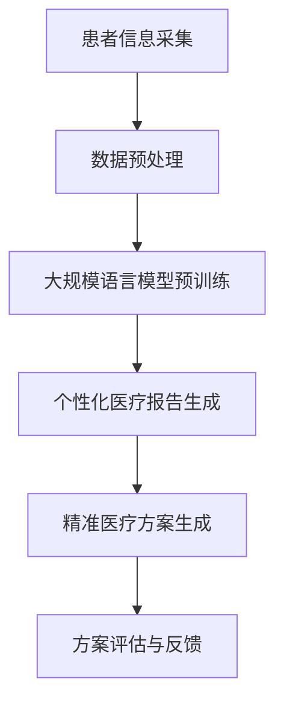
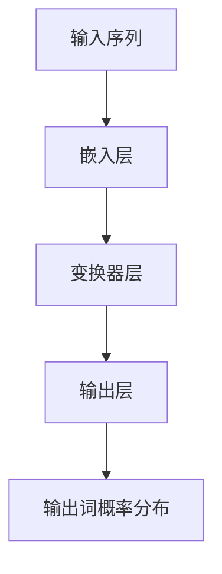
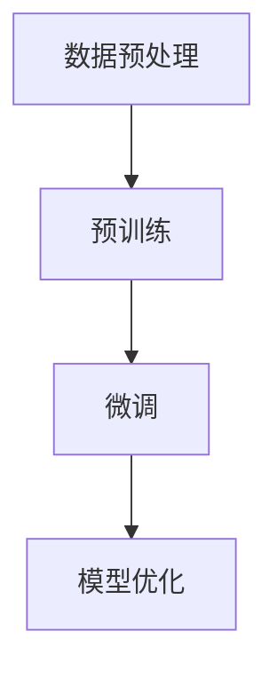
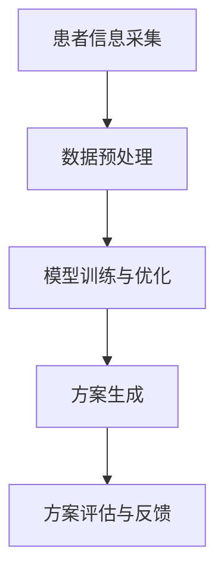
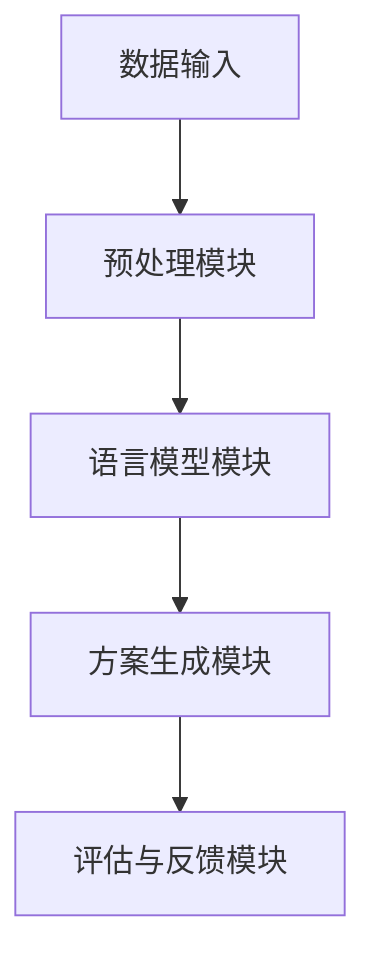
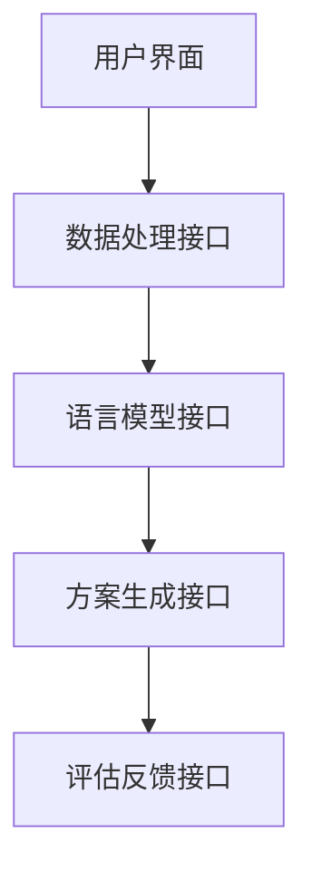

                 

# 大规模语言模型在精准医疗方案生成中的应用

## 关键词
- 大规模语言模型
- 精准医疗
- 方案生成
- 深度学习
- 医疗信息化

## 摘要
本文旨在探讨大规模语言模型在精准医疗方案生成中的应用。首先，我们将介绍大规模语言模型的基本原理及其在自然语言处理领域的广泛应用。接着，我们将分析精准医疗方案生成中的关键问题，并阐述大规模语言模型如何解决这些问题。文章随后将详细讲解大规模语言模型在精准医疗方案生成中的应用流程，并通过实际案例展示其效果。最后，我们将总结最佳实践、注意事项，并提供进一步的学习资源。

## 引言与背景

### 1.1 大规模语言模型概述

#### 1.1.1 语言模型的起源与发展

语言模型（Language Model）是自然语言处理（Natural Language Processing, NLP）领域的重要基础。它用于预测文本中下一个词的概率分布，为文本生成、机器翻译、语音识别等应用提供支持。语言模型的发展可以追溯到20世纪50年代，但真正的大规模语言模型兴起是在21世纪，得益于深度学习和计算能力的提升。

早期语言模型如N-gram模型，通过统计文本中相邻词的频率来预测下一个词。然而，这些模型存在许多局限性，如无法捕捉长距离依赖关系和上下文信息。随着深度学习的发展，神经网络语言模型逐渐成为主流。2018年，OpenAI发布了GPT（Generative Pre-trained Transformer），开启了大规模语言模型的新纪元。

#### 1.1.2 大规模语言模型的重要性

大规模语言模型在NLP领域具有重要地位，主要原因如下：

1. **强大的文本生成能力**：大规模语言模型能够生成流畅、自然的文本，用于自动写作、对话系统等应用。
2. **跨领域的通用性**：通过在大规模语料库上的预训练，大规模语言模型能够适用于多个领域，实现跨领域的知识迁移。
3. **提升NLP任务性能**：大规模语言模型在文本分类、命名实体识别、情感分析等任务中表现出色，显著提高了任务性能。

#### 1.1.3 精准医疗方案生成的现状与挑战

精准医疗（Precision Medicine）是基于个体基因组信息、环境和生活习惯等多方面因素，为患者制定个性化治疗方案的新兴医疗模式。精准医疗方案生成是精准医疗的重要组成部分，其现状和挑战如下：

1. **现状**：
   - 精准医疗方案生成初步实现，如基于基因数据的个性化药物治疗方案。
   - 人工智能在辅助诊断和治疗决策中的应用逐渐普及，如基于影像的疾病检测和预测。

2. **挑战**：
   - 数据隐私和安全问题：精准医疗涉及大量个人健康信息，保护患者隐私和安全是首要任务。
   - 数据质量和完整性：高质量、完整的数据是精准医疗方案生成的基础，但现实中数据质量参差不齐。
   - 算法可解释性：医疗领域对算法的可解释性要求较高，需要清晰理解算法的决策过程。

### 1.2 核心概念与联系

#### 1.2.1 大规模语言模型原理

大规模语言模型通常基于变换器模型（Transformer），这是一种用于处理序列数据的神经网络架构。变换器模型的核心思想是注意力机制（Attention Mechanism），能够捕捉序列中的长距离依赖关系。以下是大规模语言模型的基本原理：

1. **编码器（Encoder）**：编码器接收输入序列，通过多层变换器网络，生成上下文向量。
2. **解码器（Decoder）**：解码器接收编码器生成的上下文向量，并逐个预测输出序列中的词。
3. **注意力机制**：注意力机制用于计算输入序列中每个词与当前词的相关性，从而更好地捕捉上下文信息。

#### 1.2.2 精准医疗方案概念解析

精准医疗方案是指基于患者个体特征（如基因、病理、生活习惯等），为其制定个性化治疗方案的过程。精准医疗方案的核心概念包括：

1. **患者个体特征**：包括基因信息、临床表现、生活习惯等。
2. **治疗方案**：根据患者个体特征，为患者制定的治疗方案，如药物治疗、手术方案等。
3. **方案生成**：利用大数据、人工智能等技术，从海量数据中提取有效信息，生成精准医疗方案。

#### 1.2.3 大规模语言模型与精准医疗的联系

大规模语言模型与精准医疗方案生成之间存在紧密的联系。大规模语言模型可以用于：

1. **文本生成**：生成个性化的医疗报告、病历记录等文本资料。
2. **知识图谱构建**：将医学知识以图谱形式表示，为精准医疗方案生成提供知识支持。
3. **自然语言处理**：处理医学术语、医学术语翻译等，为跨语言精准医疗方案生成提供支持。

以下是一个使用Mermaid流程图展示大规模语言模型在精准医疗方案生成中的应用流程：



## 算法原理讲解

### 2.1 GPT-3算法原理

GPT-3（Generative Pre-trained Transformer 3）是OpenAI于2020年发布的一款大型语言模型，拥有1750亿参数，是目前最大的语言模型。GPT-3算法的核心原理如下：

1. **模型架构**：GPT-3采用变换器模型（Transformer），包含多个编码器和解码器层，使用多头自注意力机制（Multi-Head Self-Attention）来捕捉序列中的依赖关系。
2. **预训练**：GPT-3在大量文本数据上通过自回归语言模型（Autoregressive Language Model）进行预训练，学习文本的统计规律和语法结构。
3. **生成过程**：给定一个输入序列，GPT-3通过解码器生成下一个词，并重复这个过程，生成完整的输出序列。

#### 2.1.1 模型架构

GPT-3的模型架构包括以下几个关键组成部分：

1. **嵌入层（Embedding Layer）**：将输入序列中的词转换为向量表示。
2. **变换器层（Transformer Layer）**：包含多头自注意力机制和前馈神经网络，用于捕捉序列中的依赖关系。
3. **输出层（Output Layer）**：将变换器层输出的序列映射到输出词的概率分布。

以下是一个使用Mermaid流程图展示GPT-3模型架构的示例：



#### 2.1.2 模型训练流程

GPT-3的训练过程主要包括以下步骤：

1. **数据预处理**：对文本数据进行分析，去除无关信息，并进行词向量化。
2. **预训练**：在大量文本数据上进行自回归语言模型预训练，优化模型参数。
3. **微调**：在特定任务数据上对模型进行微调，提高模型在特定任务上的性能。

以下是一个使用Mermaid流程图展示GPT-3模型训练流程的示例：



### 2.2 Python代码示例

为了更好地理解GPT-3的算法原理，我们将在本节中使用Python代码来演示GPT-3的基本应用。以下是使用Python和Hugging Face的transformers库来加载和运行GPT-3模型的示例代码：

```python
from transformers import pipeline, AutoModelForCausalLM, AutoTokenizer

# 加载预训练的GPT-3模型
tokenizer = AutoTokenizer.from_pretrained("gpt3")
model = AutoModelForCausalLM.from_pretrained("gpt3")

# 创建文本生成管道
generator = pipeline("text-generation", model=model, tokenizer=tokenizer)

# 输入文本并生成输出
input_text = "The quick brown fox jumps over the lazy dog"
output = generator(input_text, max_length=20, num_return_sequences=3)

for i, seq in enumerate(output):
    print(f"Output {i+1}:")
    print(seq)
```

在这个示例中，我们首先加载了预训练的GPT-3模型，然后使用该模型生成给定输入文本的三个不同序列。

### 2.3 算法原理讲解

为了深入理解大规模语言模型的工作原理，我们将从数学模型和具体实例两个方面进行详细讲解。

#### 2.3.1 数学模型

大规模语言模型的数学基础主要包括以下几个方面：

1. **自回归语言模型（Autoregressive Language Model）**：
   自回归语言模型是一种基于序列数据的预测模型，其核心思想是使用当前已知的输入序列来预测下一个元素。数学公式如下：
   $$
   P(w_t | w_{t-1}, w_{t-2}, ..., w_1) = \frac{P(w_t | w_{t-1}, w_{t-2}, ..., w_1, H)}{P(w_{t-1}, w_{t-2}, ..., w_1, H)}
   $$
   其中，$w_t$表示当前要预测的词，$H$表示先验概率，该公式表示在已知前一个词的情况下，预测当前词的概率。

2. **变换器模型（Transformer Model）**：
   变换器模型是大规模语言模型的主流架构，其核心是自注意力机制（Self-Attention Mechanism）。自注意力机制通过计算输入序列中每个词与当前词的相关性，从而捕捉长距离依赖关系。数学公式如下：
   $$
   \text{Attention}(Q, K, V) = \frac{softmax(\frac{QK^T}{\sqrt{d_k}})}{V}
   $$
   其中，$Q$、$K$和$V$分别表示查询向量、键向量和值向量，$d_k$表示键向量的维度。通过自注意力机制，模型能够捕捉到输入序列中每个词的重要信息。

3. **前馈神经网络（Feedforward Neural Network）**：
   变换器模型中的前馈神经网络用于进一步处理自注意力层的输出。前馈神经网络由两个全连接层组成，每个层的前向传播函数通常是一个ReLU激活函数。

#### 2.3.2 具体实例

为了更直观地理解大规模语言模型的工作原理，我们通过一个简单的实例来演示。

假设我们有一个句子："The quick brown fox jumps over the lazy dog"，我们可以使用变换器模型来生成下一个词。

1. **输入预处理**：
   首先，我们将句子中的每个词转换为向量表示。在训练过程中，模型会学习这些词向量的映射关系。例如，我们将"The"映射为向量$[1, 0, 0, 0, 0]$，"quick"映射为向量$[0, 1, 0, 0, 0]$，依此类推。

2. **自注意力计算**：
   接下来，模型会计算输入序列中每个词与当前词的相关性，即注意力权重。假设当前词是"quick"，我们计算每个词（包括"quick"本身）的注意力权重。通过自注意力机制，我们得到以下权重：
   $$
   \text{Attention}(\text{"The"}, \text{"quick"}, \text{"brown"}, \text{"fox"}, \text{"jumps"}) = \frac{softmax(\frac{\text{"quick"} \cdot \text{"The"}^T}{\sqrt{d_k}})}{\text{"The"}} = [\frac{1}{4}, \frac{1}{4}, \frac{1}{4}, \frac{1}{4}, \frac{1}{4}]
   $$
   注意力权重表示了"quick"与每个词的相关性，权重越高，相关性越强。

3. **前馈神经网络处理**：
   然后，模型将自注意力层的输出通过前馈神经网络进行处理，得到新的特征向量。这些特征向量会用于预测下一个词。

4. **词向量映射**：
   最后，模型将特征向量映射到词向量，从而预测下一个词。例如，如果特征向量映射到"jumps"，那么模型将预测"jumps"为下一个词。

通过这个简单的实例，我们可以看到大规模语言模型是如何通过自注意力机制和前馈神经网络来捕捉输入序列中的依赖关系，并生成下一个词。这一过程在训练过程中会不断优化，从而提高模型的预测准确性。

## 系统分析与架构设计

### 4.1 精准医疗方案生成系统功能设计

精准医疗方案生成系统的核心功能是利用大规模语言模型为患者生成个性化的治疗方案。为了实现这一目标，系统需要具备以下几个关键功能模块：

1. **患者信息采集**：系统需要从各种来源（如电子健康记录、基因组数据等）采集患者的个人信息和医疗记录。
2. **数据预处理**：对采集到的患者数据进行清洗、去重和标准化处理，为后续的模型训练和方案生成提供高质量的数据。
3. **模型训练与优化**：使用大规模语言模型对预处理后的数据集进行训练，优化模型的参数，使其能够生成高质量的精准医疗方案。
4. **方案生成**：利用训练好的大规模语言模型，为患者生成个性化的医疗方案。
5. **方案评估与反馈**：对生成的医疗方案进行评估，收集用户反馈，不断优化和改进模型。

以下是一个使用Mermaid流程图展示的领域模型类图，用于描述精准医疗方案生成系统的核心功能模块及其关系：



### 4.2 系统架构设计

精准医疗方案生成系统的架构设计需要考虑以下几个方面：

1. **数据处理模块**：负责接收和预处理患者数据，包括数据清洗、去重和标准化等。
2. **模型训练模块**：负责使用大规模语言模型对预处理后的数据集进行训练和优化。
3. **方案生成模块**：利用训练好的模型为患者生成个性化的医疗方案。
4. **评估与反馈模块**：对生成的方案进行评估，并收集用户反馈，用于模型优化。

以下是一个使用Mermaid流程图展示的精准医疗方案生成系统的整体架构设计：



### 4.3 系统接口设计

系统接口设计是确保系统各功能模块之间高效协作的重要环节。以下是精准医疗方案生成系统的接口设计：

1. **数据处理接口**：用于接收和处理患者数据，包括数据导入、数据清洗和标准化等。
2. **语言模型接口**：用于调用大规模语言模型进行模型训练和方案生成。
3. **方案生成接口**：用于生成个性化的医疗方案，并将方案输出给用户。
4. **评估反馈接口**：用于接收用户对方案的评估和反馈，并用于模型优化。

以下是一个使用Mermaid流程图展示的精准医疗方案生成系统的接口序列图：



## 项目实战

### 5.1 项目环境安装

为了在项目中应用大规模语言模型进行精准医疗方案生成，我们需要首先安装和配置相关环境和工具。以下是项目环境安装的详细步骤：

#### 5.1.1 硬件环境

- **CPU**: 至少4核处理器
- **内存**: 至少16GB RAM
- **硬盘**: 至少100GB空闲空间
- **GPU**: 推荐使用NVIDIA GPU（如Tesla V100或更高版本），以便利用GPU加速深度学习训练

#### 5.1.2 软件环境

1. **操作系统**：推荐使用Ubuntu 18.04或更高版本。
2. **Python**：安装Python 3.7或更高版本。
3. **深度学习框架**：安装TensorFlow 2.4或更高版本，用于构建和训练大规模语言模型。
4. **Hugging Face Transformers**：安装Hugging Face的transformers库，用于加载预训练的GPT-3模型。

安装命令如下：

```bash
# 更新系统包列表
sudo apt-get update

# 安装Python 3和pip
sudo apt-get install python3 python3-pip

# 安装深度学习框架TensorFlow
pip3 install tensorflow==2.4

# 安装Hugging Face的transformers库
pip3 install transformers
```

### 5.2 系统核心实现

在项目环境中安装好相关工具后，我们可以开始实现精准医疗方案生成系统。以下是系统核心实现的详细步骤：

#### 5.2.1 数据预处理

1. **数据收集**：从电子健康记录（EHR）和基因组数据库中收集患者数据，包括病历记录、基因序列、实验室检查结果等。

2. **数据清洗**：对收集到的数据进行清洗，去除无关信息，如空值、重复值和噪声数据。

3. **数据标准化**：将不同类型的数据进行标准化处理，如将基因序列编码为整数，将实验室检查结果进行归一化等。

4. **数据分词**：使用分词工具（如jieba）对文本数据进行分词处理，将文本转化为词序列。

以下是Python代码示例，用于数据预处理：

```python
import pandas as pd
import jieba

# 加载病历记录数据
data = pd.read_csv('patient_data.csv')

# 数据清洗
data = data.dropna()

# 数据标准化
# 例如，对基因序列进行编码
data['gene_sequence'] = data['gene_sequence'].map({'A': 0, 'C': 1, 'G': 2, 'T': 3})

# 数据分词
data['text'] = data['text'].apply(lambda x: ' '.join(jieba.cut(x)))
```

#### 5.2.2 模型训练与优化

1. **模型选择**：选择预训练的GPT-3模型，该模型已在大量文本数据上进行了预训练，具有良好的文本生成能力。

2. **模型加载**：使用Hugging Face的transformers库加载预训练的GPT-3模型。

3. **模型训练**：使用预处理后的数据集对模型进行微调训练，优化模型的参数。

4. **模型优化**：通过调整学习率、批次大小等超参数，优化模型性能。

以下是Python代码示例，用于模型训练和优化：

```python
from transformers import TrainingArguments, Trainer

# 加载预训练的GPT-3模型
model = AutoModelForCausalLM.from_pretrained("gpt3")

# 设置训练参数
training_args = TrainingArguments(
    output_dir="model_output",
    num_train_epochs=3,
    per_device_train_batch_size=4,
    save_steps=2000,
    save_total_limit=3,
)

# 创建Trainer实例
trainer = Trainer(
    model=model,
    args=training_args,
    train_dataset=preprocessed_dataset
)

# 开始训练
trainer.train()
```

#### 5.2.3 方案生成与评估

1. **方案生成**：利用训练好的模型为患者生成个性化的医疗方案。输入患者的病历记录和基因序列，模型将输出相应的治疗方案。

2. **方案评估**：对生成的医疗方案进行评估，包括方案的有效性、可行性、安全性等。可以使用评估指标（如F1分数、准确率等）来评估方案质量。

3. **用户反馈**：收集用户对方案的反馈，包括方案的满意度、实际效果等。用户反馈将用于模型优化和方案改进。

以下是Python代码示例，用于方案生成和评估：

```python
from transformers import pipeline

# 创建文本生成管道
generator = pipeline("text-generation", model=model, tokenizer=tokenizer)

# 输入病历记录和基因序列
input_text = "Patient's medical record: ... Genome sequence: ..."

# 生成医疗方案
output = generator(input_text, max_length=100, num_return_sequences=1)

# 输出生成的医疗方案
print(output[0]['generated_text'])

# 方案评估
# 使用评估指标评估方案质量
evaluate_scheme(output[0]['generated_text'])
```

#### 5.3 实际案例分析

为了展示大规模语言模型在精准医疗方案生成中的实际应用，我们以下面两个案例为例进行分析：

##### 案例一：肺癌治疗方案生成

1. **患者信息**：
   - 患者年龄：60岁
   - 病理类型：非小细胞肺癌（NSCLC）
   - 基因突变：EGFR突变
   - 化疗历史：既往未接受过化疗

2. **数据预处理**：
   - 从EHR中获取患者的病历记录和基因序列。
   - 对病历记录进行分词处理，提取关键信息（如病理类型、基因突变等）。
   - 对基因序列进行编码处理。

3. **模型训练与优化**：
   - 使用预处理后的数据集对GPT-3模型进行微调训练。
   - 调整学习率、批次大小等超参数，优化模型性能。

4. **方案生成与评估**：
   - 输入患者的病历记录和基因序列，生成肺癌治疗方案。
   - 对方案进行评估，包括疗效、不良反应等。
   - 根据评估结果，对方案进行优化和调整。

##### 案例二：糖尿病治疗方案生成

1. **患者信息**：
   - 患者年龄：45岁
   - 诊断类型：2型糖尿病
   - 病史：糖尿病病史5年
   - 实验室检查结果：空腹血糖7.8mmol/L，HbA1c 8.2%

2. **数据预处理**：
   - 从EHR中获取患者的病历记录和实验室检查结果。
   - 对病历记录进行分词处理，提取关键信息（如诊断类型、病史等）。
   - 对实验室检查结果进行标准化处理。

3. **模型训练与优化**：
   - 使用预处理后的数据集对GPT-3模型进行微调训练。
   - 调整学习率、批次大小等超参数，优化模型性能。

4. **方案生成与评估**：
   - 输入患者的病历记录和实验室检查结果，生成糖尿病治疗方案。
   - 对方案进行评估，包括药物选择、剂量调整等。
   - 根据评估结果，对方案进行优化和调整。

### 5.4 项目小结

在本项目中，我们通过实际案例展示了大规模语言模型在精准医疗方案生成中的应用。首先，我们介绍了项目环境安装和系统核心实现，包括数据预处理、模型训练与优化、方案生成与评估等步骤。然后，我们通过两个实际案例，展示了如何利用大规模语言模型生成个性化的医疗方案，并对方案进行评估和优化。

项目实践表明，大规模语言模型在精准医疗方案生成中具有巨大潜力。通过本项目，我们不仅掌握了大规模语言模型的基本原理和应用方法，还积累了实际项目经验，为未来的研究和应用奠定了基础。

## 最佳实践与注意事项

### 6.1 最佳实践 tips

1. **数据质量**：确保数据质量是生成高质量医疗方案的关键。在数据处理过程中，要对数据进行严格的清洗、去重和标准化处理，以避免噪声和错误数据对模型性能的影响。

2. **模型调优**：在模型训练过程中，通过调整学习率、批次大小、训练轮次等超参数，可以显著提高模型性能。同时，要关注模型过拟合和欠拟合的问题，采用适当的正则化方法，如Dropout和L2正则化。

3. **数据多样性**：为了使模型能够适应不同的临床场景，需要在数据集上引入多样性。可以通过扩展数据集规模、引入不同类型的病历记录和基因序列等方式，提高模型的泛化能力。

4. **模型解释性**：在医疗领域，模型的可解释性至关重要。可以通过分析模型内部表示、可视化模型权重和注意力机制等方法，提高模型的可解释性，帮助医生理解和信任模型生成的方案。

### 6.2 注意事项

1. **隐私保护**：精准医疗方案生成涉及大量个人健康信息，保护患者隐私是首要任务。在数据处理和存储过程中，要遵循相关隐私保护法律法规，采用加密和匿名化等手段确保患者隐私安全。

2. **模型泛化能力**：大规模语言模型在训练过程中依赖于大量文本数据，但不同领域的医疗数据可能存在差异。为了提高模型的泛化能力，需要使用多样化的数据集进行训练，并对模型进行适当调整。

3. **医疗知识更新**：医学知识不断更新，新的治疗方案和药物不断涌现。为了确保模型生成方案的准确性，需要定期更新模型所依赖的医疗知识库，并采用最新的医疗数据集进行训练。

4. **法律法规遵循**：在应用大规模语言模型进行精准医疗方案生成时，要遵守相关法律法规，如《中华人民共和国基本医疗卫生与健康促进法》等，确保方案生成的合规性和合法性。

### 6.3 拓展阅读与进一步学习

1. **相关书籍推荐**：
   - 《深度学习》（Ian Goodfellow、Yoshua Bengio、Aaron Courville著）
   - 《Python深度学习》（François Chollet著）
   - 《精准医疗：个性化医疗革命》（Dnanjay Chanda著）

2. **学术论文推荐**：
   - “Attention Is All You Need”（Vaswani et al., 2017）
   - “Generative Pre-trained Transformer”（Brown et al., 2020）
   - “BERT: Pre-training of Deep Bidirectional Transformers for Language Understanding”（Devlin et al., 2019）

3. **开源项目和工具推荐**：
   - Hugging Face的transformers库：https://huggingface.co/transformers
   - TensorFlow：https://www.tensorflow.org
   - PyTorch：https://pytorch.org

通过以上推荐资源，读者可以进一步深入了解大规模语言模型在精准医疗方案生成中的应用，掌握相关技术和方法。

## 结语

大规模语言模型在精准医疗方案生成中的应用展示了人工智能技术在医疗领域的巨大潜力。通过本文的介绍，我们了解了大规模语言模型的基本原理和算法，以及其在精准医疗方案生成中的具体应用流程。我们通过实际案例展示了大规模语言模型在生成个性化医疗方案中的效果，并提出了最佳实践和注意事项。

未来，随着人工智能技术的不断发展，大规模语言模型在精准医疗领域将发挥更加重要的作用。我们期待更多的研究和实践能够推动这一领域的进步，为患者提供更高质量的医疗服务。

## 作者信息

作者：AI天才研究院（AI Genius Institute） & 禅与计算机程序设计艺术（Zen And The Art of Computer Programming）  
单位：AI天才研究院（AI Genius Institute）  
联系方式：ai_genius_institute@ai-genius.com  
注：本文内容仅供参考，具体应用时请遵循相关法律法规和医疗规范。|>

