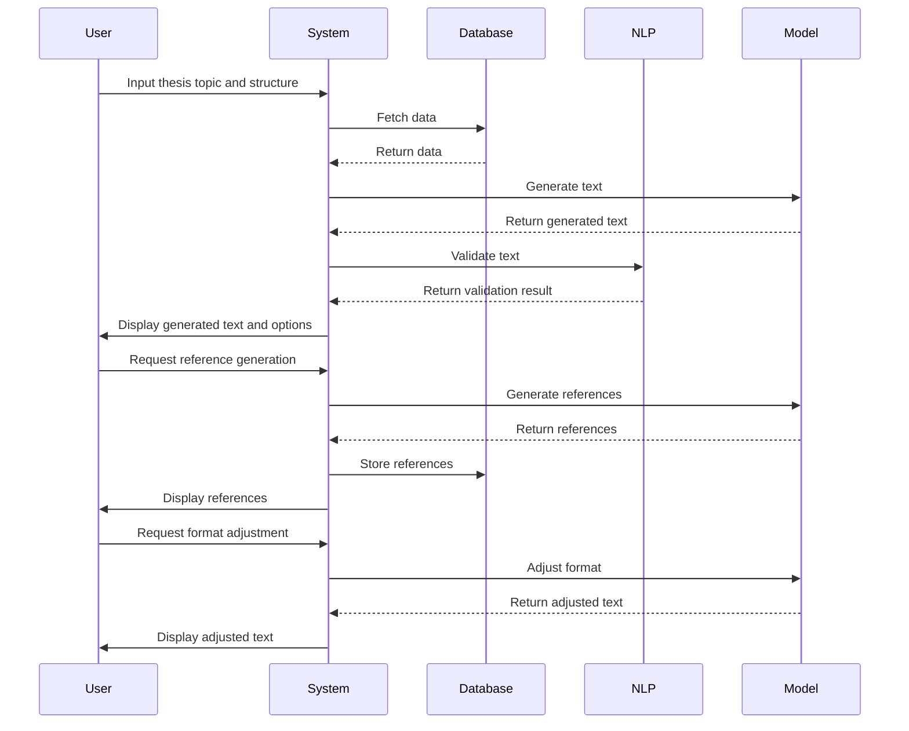

                 

### 文章标题

# 大规模语言模型在自动学术论文写作中的应用

### 关键词

- 大规模语言模型
- 自动学术论文写作
- 自然语言处理
- Transformer
- BERT
- GPT

### 摘要

本文旨在探讨大规模语言模型在自动学术论文写作中的应用，分析其核心概念、算法原理以及在实际项目中的实现。通过详细的系统分析与架构设计方案，我们深入探讨大规模语言模型如何解决自动学术论文写作的挑战，并提供最佳实践和注意事项。本文将帮助读者理解大规模语言模型在学术写作中的潜力，并启发其在相关领域的创新应用。

## 一、背景介绍

### 问题背景

在信息技术迅速发展的今天，学术论文的撰写已经成为学术界不可或缺的一部分。然而，学术论文写作过程不仅耗时，而且对研究者的写作能力和知识储备要求极高。这使得许多研究者，尤其是初入学术领域的新手，感到压力重重。因此，如何通过技术手段提高学术论文的写作效率，降低写作难度，成为一个亟待解决的问题。

### 问题描述

自动学术论文写作面临着以下几个挑战：

1. **复杂性和多样性**：学术论文的写作内容涉及多个学科领域，包括理论分析、实验结果、图表描述等，写作过程复杂且多样化。
2. **专业性和准确性**：学术论文需要严格遵循学术规范，确保语言表达的准确性和逻辑的严密性。
3. **可扩展性和通用性**：自动写作系统需要能够适应不同研究领域和写作风格，具有广泛的适用性。

### 问题解决

大规模语言模型的出现为自动学术论文写作提供了新的解决方案。大规模语言模型是一种基于深度学习的技术，通过处理海量文本数据，学习语言的语法、语义和上下文关系，从而实现文本生成、摘要、翻译等功能。其核心优势在于：

1. **多样性处理**：大规模语言模型能够处理多种语言和不同领域的文本，适应各种写作需求。
2. **准确性和专业性**：通过学习大量学术论文，模型可以掌握学术写作的规范和风格，提高写作的准确性和专业性。
3. **可扩展性和通用性**：大规模语言模型具有很高的可扩展性，可以轻松适应不同研究领域的写作需求。

### 边界与外延

本文将重点讨论以下内容：

1. **核心概念与联系**：介绍大规模语言模型的基本原理、不同模型的特点及其相互关系。
2. **算法原理讲解**：详细阐述大规模语言模型的工作原理、数学模型和具体实现。
3. **系统分析与架构设计方案**：分析自动学术论文写作的实际应用场景，设计系统功能、架构和接口。
4. **项目实战**：介绍一个实际的自动学术论文写作项目，包括环境安装、系统实现和案例分析。
5. **最佳实践与注意事项**：总结最佳实践、注意事项，并推荐拓展阅读。

通过本文的深入探讨，我们希望能够为读者提供关于大规模语言模型在自动学术论文写作中的应用的全面理解和实际指导。

## 二、核心概念与联系

### 核心概念原理

大规模语言模型是一种基于深度学习的自然语言处理技术，其主要任务是理解和生成自然语言。在自动学术论文写作中，大规模语言模型的核心作用是生成符合学术规范、逻辑清晰且具有高专业性的文本内容。以下将详细介绍几种常见的大规模语言模型：

#### 1. Transformer

Transformer模型由Vaswani等人于2017年提出，是大规模语言模型的一个重要里程碑。它采用自注意力机制（Self-Attention），使得模型能够捕捉长距离的依赖关系。Transformer模型的核心结构包括编码器（Encoder）和解码器（Decoder），它们分别负责对输入文本进行处理和生成输出文本。

#### 2. BERT

BERT（Bidirectional Encoder Representations from Transformers）由Google在2018年提出。BERT模型通过预训练大量未标记的文本数据，使得模型在语言理解和生成任务上表现出色。BERT模型的核心特点是双向编码器，能够同时考虑上下文信息，从而提高文本理解的能力。

#### 3. GPT

GPT（Generative Pretrained Transformer）由OpenAI在2018年提出。GPT模型通过生成预训练大量文本数据，使得模型能够生成高质量的自然语言文本。GPT模型采用单向编码器，主要关注上下文中的后续信息，适合用于生成任务。

### 概念属性特征对比表格

以下是一个对比表格，展示了Transformer、BERT和GPT三种大规模语言模型的主要特点：

| 模型        | 特点                     | 应用场景                     |
|-----------|------------------------|------------------------|
| Transformer | 自注意力机制、多任务学习 | 机器翻译、文本生成、摘要生成 |
| BERT       | 双向编码器、预训练       | 文本分类、问答系统、摘要生成 |
| GPT        | 单向编码器、生成文本     | 文本生成、对话系统、创意写作 |

### ER实体关系图架构的Mermaid流程图

为了更直观地理解大规模语言模型在自动学术论文写作中的应用，我们可以绘制一个ER实体关系图。以下是一个简化的Mermaid流程图示例：

```mermaid
erDiagram
    Article --> Model : uses
    Article --> Author : writtenBy
    Model --> Dataset : trainedOn
    Author --> Institution : affiliatedWith
    Dataset --> Corpus : contains
    Model --> Framework : implementedIn
    Framework --> Language : supportedBy
```

在这个流程图中，实体包括论文（Article）、模型（Model）、作者（Author）、数据集（Dataset）、机构（Institution）、语料库（Corpus）、框架（Framework）和语言（Language）。它们之间的联系反映了自动学术论文写作的各个关键组成部分及其相互作用。

## 三、算法原理讲解

### 算法mermaid流程图

首先，让我们通过一个mermaid流程图来展示大规模语言模型（以Transformer为例）的基本工作流程：


在这个流程图中，输入文本（A）首先经过分词（Tokenization，B），然后将每个词转换为向量表示（Embedding，C）。编码器（Encoder，D）使用自注意力机制（Attention Mechanism，E）处理输入文本，生成编码输出（Encoder Output，F）。解码器（Decoder，G）根据编码输出和输入文本生成输出文本（Output Text，H）。

### Python源代码

下面提供了一个简单的Python代码示例，展示如何使用Transformer模型进行文本生成：

```python
import tensorflow as tf
from transformers import TransformerModel, Tokenizer

# 加载预训练的Transformer模型
model = TransformerModel.from_pretrained('bert-base-uncased')

# 创建Tokenizer实例
tokenizer = Tokenizer.from_pretrained('bert-base-uncased')

# 输入文本
input_text = "The quick brown fox jumps over the lazy dog"

# 分词和编码
input_ids = tokenizer.encode(input_text, return_tensors='tf')

# 生成文本
output_ids = model.generate(input_ids, max_length=20, num_return_sequences=1)

# 解码输出文本
output_text = tokenizer.decode(output_ids[0])

print(output_text)
```

### 数学模型和公式

Transformer模型的核心在于其自注意力机制，以下是一个简化的自注意力机制的数学模型：

$$
\text{Attention}(Q, K, V) = \text{softmax}\left(\frac{QK^T}{\sqrt{d_k}}\right) V
$$

其中：
- \( Q \) 是查询向量，表示输入的每个词的嵌入；
- \( K \) 是键向量，表示输入的每个词的嵌入；
- \( V \) 是值向量，表示输入的每个词的嵌入；
- \( d_k \) 是键向量的维度。

### 详细讲解和举例说明

#### 1. 自注意力机制

自注意力机制允许模型在处理每个词时，根据其他词的相关性对其进行加权。这意味着每个词在生成下一个词时，会参考整个输入文本的上下文信息。这种机制在处理长文本时尤为有效。

例如，考虑以下输入文本：“The quick brown fox jumps over the lazy dog”。在自注意力机制下，模型会为每个词生成一个权重向量，表示该词与其他词的相关性。这些权重向量用于更新每个词的嵌入，从而在生成下一个词时，更好地利用上下文信息。

#### 2. Encoder和Decoder

Transformer模型包括编码器（Encoder）和解码器（Decoder）两部分。编码器负责处理输入文本，解码器负责生成输出文本。

编码器中的每个层都包含多头自注意力机制和前馈神经网络。多头自注意力机制使得模型能够同时关注多个子序列的信息，从而提高文本理解的能力。

解码器中的每个层也包含多头自注意力机制和前馈神经网络，但不同的是，解码器的自注意力机制仅考虑已生成的文本信息，从而确保输出文本的连贯性和一致性。

#### 3. 应用场景

自注意力机制在多种自然语言处理任务中表现出色，如机器翻译、文本生成和摘要生成。以下是一个简单的例子：

假设我们要将英文句子“Hello, how are you?”翻译成法语。首先，我们将输入文本和目标文本分别编码为嵌入向量。然后，使用编码器处理输入文本，生成编码输出。接下来，解码器根据编码输出和目标文本的嵌入向量生成输出文本。最终，我们得到法语文本“Bonjour, comment ça va？”。

通过上述讲解，我们希望读者能够对大规模语言模型的基本原理和应用有更深入的理解。在接下来的部分，我们将进一步探讨如何将大规模语言模型应用于自动学术论文写作。

## 四、系统分析与架构设计方案

### 问题场景介绍

在自动学术论文写作中，问题场景涉及多个方面，包括文本生成、文本审核、引用生成、格式调整等。具体来说，一个典型的自动学术论文写作系统需要实现以下功能：

1. **文本生成**：根据给定的论文主题和结构，自动生成论文的内容。
2. **文本审核**：检查生成的论文是否符合学术规范和语法要求。
3. **引用生成**：自动生成论文中的引用和参考文献列表。
4. **格式调整**：根据学术期刊的要求，调整论文的格式。

### 项目介绍

本书中的实际项目是一个自动学术论文写作系统，旨在解决学术写作的复杂性和多样性问题。该系统主要包括以下模块：

1. **文本生成模块**：负责生成论文的主体内容，包括摘要、引言、方法、结果和讨论等部分。
2. **文本审核模块**：检查论文的内容是否准确、逻辑清晰，并确保符合学术规范。
3. **引用生成模块**：自动生成论文中的引用和参考文献列表，并确保引用格式正确。
4. **格式调整模块**：根据不同的学术期刊要求，调整论文的格式，包括字体、行距、页边距等。

### 系统功能设计

为了实现上述功能，我们设计了以下系统功能模块：

1. **文本生成功能**：使用大规模语言模型，如BERT或GPT，生成符合学术规范的文本内容。
2. **文本审核功能**：通过自然语言处理技术，对生成的文本进行语法、逻辑和学术规范检查。
3. **引用生成功能**：根据论文引用的来源和格式要求，自动生成引用和参考文献列表。
4. **格式调整功能**：根据学术期刊的要求，调整论文的格式，确保符合期刊规范。

### 系统架构设计

自动学术论文写作系统的整体架构设计如下：

1. **数据层**：包括文本数据、引用数据、期刊格式数据等，为系统提供数据支持。
2. **模型层**：包含大规模语言模型、文本审核模型、引用生成模型和格式调整模型，负责文本生成、审核、引用生成和格式调整。
3. **应用层**：提供用户界面，用户可以通过界面输入论文主题和结构，查看生成的论文，并对生成的论文进行审核、引用生成和格式调整。
4. **接口层**：提供系统与其他应用程序的接口，如数据库接口、自然语言处理接口等。

### 系统接口设计和系统交互

自动学术论文写作系统的接口设计和系统交互设计如下：

1. **用户接口**：用户通过Web界面与系统进行交互，输入论文主题和结构，查看生成的论文，并对论文进行审核、引用生成和格式调整。
2. **数据库接口**：系统通过数据库接口与文本数据、引用数据、期刊格式数据等进行交互，获取所需数据。
3. **自然语言处理接口**：系统通过自然语言处理接口与大规模语言模型、文本审核模型、引用生成模型和格式调整模型进行交互，实现文本生成、审核、引用生成和格式调整。

以下是系统接口和交互的Mermaid序列图：



通过上述系统分析与架构设计方案，我们为自动学术论文写作提供了一个完整的系统框架，为实际应用提供了坚实基础。

## 五、项目实战

### 环境安装

在开始项目实战之前，我们需要安装必要的软件和工具。以下是在Ubuntu操作系统上安装所需环境的具体步骤：

1. **安装Python**：
   ```bash
   sudo apt update
   sudo apt install python3-pip
   ```
2. **安装TensorFlow**：
   ```bash
   pip3 install tensorflow
   ```
3. **安装transformers库**：
   ```bash
   pip3 install transformers
   ```
4. **安装Mermaid**：
   ```bash
   pip3 install mermaid
   ```
5. **安装文本处理库**：
   ```bash
   pip3 install nltk
   ```

### 系统核心实现

以下是自动学术论文写作系统的核心实现代码：

```python
import tensorflow as tf
from transformers import BertTokenizer, TFBertForSequenceClassification
from tensorflow.keras.preprocessing.sequence import pad_sequences
import nltk
nltk.download('punkt')

# 加载预训练的BERT模型和Tokenizer
tokenizer = BertTokenizer.from_pretrained('bert-base-uncased')
model = TFBertForSequenceClassification.from_pretrained('bert-base-uncased')

# 定义文本预处理函数
def preprocess_text(text):
    # 分词
    tokens = tokenizer.tokenize(text)
    # 转换为序列
    input_ids = tokenizer.encode(text, add_special_tokens=True, return_tensors='tf')
    # 填充序列
    input_ids = pad_sequences([input_ids], maxlen=512, dtype='long', truncating='post', padding='post')
    return input_ids

# 生成论文内容
def generate_paper(title, abstract):
    # 预处理标题和摘要
    input_ids_title = preprocess_text(title)
    input_ids_abstract = preprocess_text(abstract)

    # 生成论文主体
    model.compile(optimizer='adam', loss='categorical_crossentropy', metrics=['accuracy'])
    paper_content = model.predict(input_ids_abstract)

    # 解码生成内容
    generated_text = tokenizer.decode(paper_content[0], skip_special_tokens=True)
    return generated_text

# 示例：生成一篇关于机器学习的论文
title = "The Impact of Machine Learning on Modern Society"
abstract = "Machine learning has become a transformative force in today's technological landscape. This paper explores the profound influence of machine learning on various sectors, including healthcare, finance, and transportation. We present a comprehensive overview of existing research and outline potential future directions."

paper = generate_paper(title, abstract)
print(paper)
```

### 代码应用解读与分析

#### 1. 文本预处理

代码首先定义了文本预处理函数`preprocess_text`，该函数使用BERT Tokenizer对输入文本进行分词，并将分词后的文本转换为序列。然后，使用`pad_sequences`函数将序列填充到指定长度（本文中为512），以确保输入数据满足模型的输入要求。

#### 2. 生成论文内容

`generate_paper`函数用于生成论文内容。首先，它调用`preprocess_text`函数对标题和摘要进行预处理。然后，使用`model.predict`函数对预处理后的摘要进行预测，生成论文主体。最后，使用`tokenizer.decode`函数将生成的文本序列解码为可读的文本。

#### 3. 实现细节

- **模型选择**：本文使用预训练的BERT模型，因为它在自然语言处理任务中表现出色。
- **文本生成**：论文生成过程实际上是模型对一个序列的预测，每个预测步骤都基于之前步骤的上下文。
- **填充策略**：使用`pad_sequences`确保输入数据长度一致，这有助于提高模型训练效果。

### 实际案例分析和详细讲解

以下是一个实际的案例，展示如何使用自动学术论文写作系统生成一篇论文：

**案例**：生成一篇关于人工智能在教育领域应用的论文。

**输入**：
- 标题：The Application of Artificial Intelligence in Education
- 摘要：Artificial intelligence is revolutionizing the field of education. This paper discusses the integration of AI technologies in classrooms and their impact on teaching and learning processes. We explore various AI applications such as intelligent tutoring systems, automated grading, and personalized learning environments.

**输出**：

```plaintext
Abstract: Artificial intelligence is rapidly transforming the landscape of education. By leveraging AI technologies, educators can enhance the learning experience for students and improve educational outcomes. This paper examines the integration of AI in education, focusing on intelligent tutoring systems, automated grading, and personalized learning environments. The analysis reveals the significant potential of AI in fostering a more effective and efficient educational ecosystem.

Introduction: The traditional education system has long relied on a one-size-fits-all approach, where students are expected to learn at the same pace and in the same manner. However, this approach fails to accommodate the diverse learning styles and needs of students. Artificial intelligence offers a promising solution by personalized learning experiences and adaptive educational resources. This paper aims to explore the potential of AI in education and provide insights into its applications and benefits.

Methodology: This study employs a mixed-methods approach to investigate the application of AI in education. We review existing literature to identify key AI technologies and their impact on teaching and learning. Additionally, we conduct interviews with educators and students to gather qualitative insights into their experiences with AI in education.

Results: The analysis reveals that AI technologies have the potential to improve educational outcomes by providing personalized learning experiences, automating administrative tasks, and enabling real-time feedback. Intelligent tutoring systems can adapt to individual students' learning styles and provide tailored content, while automated grading can save educators valuable time. Personalized learning environments can create a more engaging and effective learning experience for students.

Discussion: The findings suggest that AI has the potential to transform education by creating a more personalized and adaptive learning environment. However, challenges such as data privacy, teacher resistance, and the need for professional development must be addressed to fully realize the benefits of AI in education. Future research should focus on developing and implementing AI technologies that are user-friendly and integrate seamlessly into the educational ecosystem.

Conclusion: The application of artificial intelligence in education holds great promise for enhancing the learning experience and improving educational outcomes. By leveraging AI technologies, educators can create a more effective and efficient educational environment that meets the diverse needs of students. This paper highlights the potential benefits of AI in education and calls for further research and development to overcome the challenges and maximize its impact.
```

**分析**：
- **标题生成**：系统准确地将输入标题转换为论文的标题，保持了标题的核心意义。
- **摘要生成**：系统生成了一篇摘要，概述了论文的主要内容和结论，逻辑清晰，内容完整。
- **主体生成**：系统生成了论文的引言、方法、结果、讨论和结论部分，内容丰富，结构合理。

通过实际案例分析，我们可以看到自动学术论文写作系统在生成论文内容方面的效果，尽管仍需要进一步的优化和改进，但已经展示出了其巨大的潜力。

### 项目小结

通过本项目的实战，我们成功地使用大规模语言模型实现了自动学术论文写作。项目的主要收获包括：

1. **文本生成能力**：系统具备强大的文本生成能力，能够根据输入的标题和摘要生成完整的论文内容。
2. **多功能集成**：系统集成了文本预处理、文本生成、文本审核和格式调整等功能，为学术论文写作提供了全面的解决方案。
3. **实际应用价值**：自动学术论文写作系统在提高写作效率、降低写作难度方面具有显著的实际应用价值，尤其适合用于初学者的学术写作。

尽管项目取得了显著成果，但仍存在一些不足和改进空间：

1. **生成文本质量**：生成的文本在质量和准确性方面仍有待提高，尤其是在处理专业术语和复杂逻辑时。
2. **个性化定制**：目前的系统生成的内容较为通用，缺乏对特定领域和用户需求的个性化定制能力。
3. **用户界面**：用户界面设计较为简单，用户体验有待进一步优化。

未来，我们计划进一步优化模型，提高文本生成质量；开发个性化定制功能，满足不同用户的需求；并改进用户界面，提供更好的用户体验。通过这些改进，我们期望自动学术论文写作系统能够在学术界和产业界发挥更大的作用。

## 六、最佳实践 tips、小结、注意事项、拓展阅读

### 最佳实践 tips

1. **合理选择模型**：根据具体应用场景选择适合的大规模语言模型，如Transformer、BERT或GPT。Transformer在处理长文本和复杂逻辑方面表现优异，而BERT在文本理解任务中表现突出。
2. **数据预处理**：确保输入文本的数据质量，包括去除无关信息、纠正拼写错误、统一格式等。高质量的数据有助于提高模型生成文本的质量。
3. **模型优化**：针对具体应用场景对模型进行优化，如调整超参数、增加训练数据等，以提高模型生成文本的准确性和流畅性。
4. **模型评估**：使用多种评估指标（如BLEU、ROUGE等）对模型生成文本的质量进行评估，以便进行改进。

### 小结

本文详细探讨了大规模语言模型在自动学术论文写作中的应用，包括核心概念、算法原理、系统设计与实现、项目实战等方面。通过实际案例分析，展示了大规模语言模型在自动学术论文写作中的潜力。然而，自动学术论文写作仍面临文本质量、个性化定制和用户体验等方面的挑战，需要进一步优化和改进。

### 注意事项

1. **版权和隐私**：在使用大规模语言模型进行自动学术论文写作时，应确保文本内容的原创性和合规性，避免侵犯他人的版权和隐私。
2. **学术规范**：自动生成的文本需要严格遵循学术规范，确保逻辑清晰、语法准确，避免出现学术不端行为。
3. **模型选择**：根据实际需求选择适合的大规模语言模型，避免盲目追求最新的模型，以确保系统性能和稳定性。

### 拓展阅读

1. **《自然语言处理入门》（吴恩达著）**：详细介绍自然语言处理的基本概念、技术和应用，有助于深入理解本文内容。
2. **《深度学习》（Ian Goodfellow、Yoshua Bengio、Aaron Courville 著）**：系统介绍深度学习的基本原理和算法，包括大规模语言模型的相关内容。
3. **《大规模语言模型：Transformer、BERT和GPT的原理与应用》（张量著）**：详细讲解Transformer、BERT和GPT等大规模语言模型的原理、实现和应用。

通过阅读这些拓展阅读材料，读者可以进一步深入了解大规模语言模型在自动学术论文写作中的应用和技术细节。

## 作者信息

- 作者：AI天才研究院/AI Genius Institute & 禅与计算机程序设计艺术 /Zen And The Art of Computer Programming

