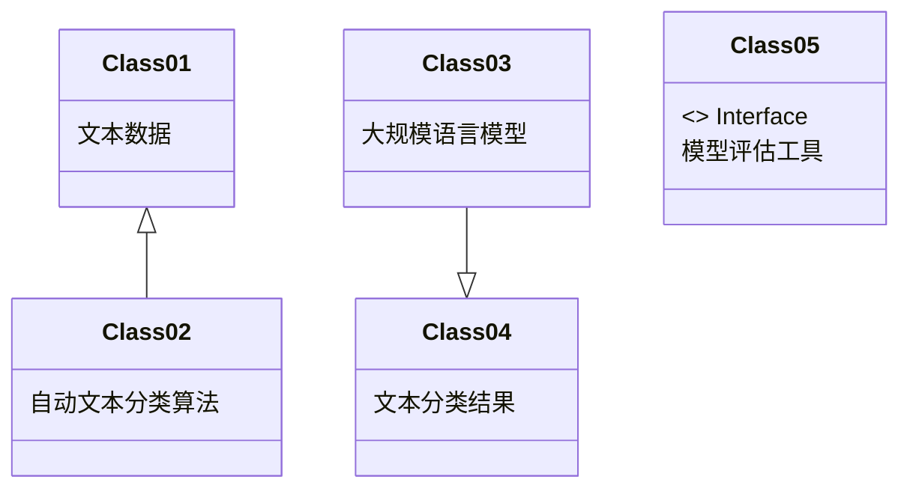
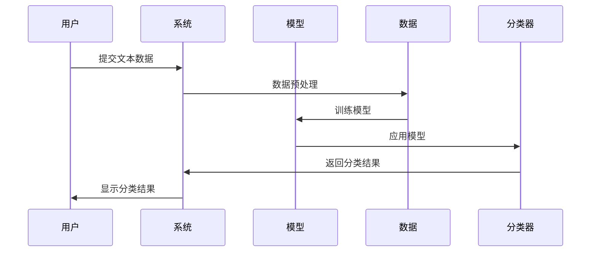
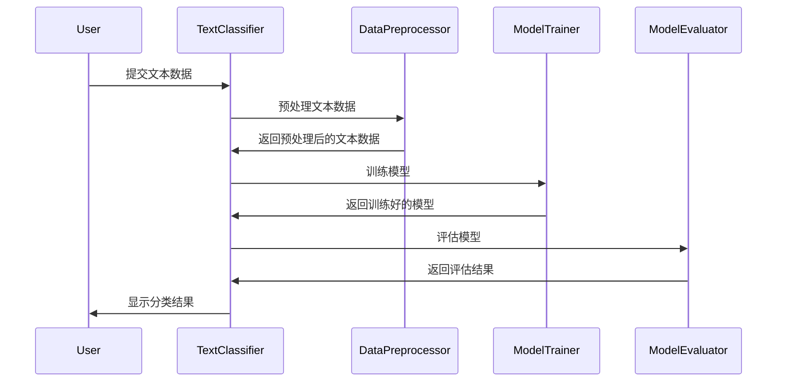

                 

# 大规模语言模型在自动文本分类中的应用研究

## 关键词

- 大规模语言模型
- 自动文本分类
- 自然语言处理
- 深度学习
- 文本分类算法

## 摘要

本文旨在探讨大规模语言模型在自动文本分类中的应用。随着互联网和大数据技术的飞速发展，如何有效地对海量文本数据进行分类已成为一个关键问题。本文首先介绍了自动文本分类的背景和问题，然后详细阐述了大规模语言模型的基本原理，以及其在自动文本分类中的优势和应用。通过对比不同文本分类算法的属性特征，本文进一步展示了大规模语言模型在自动文本分类中的实际应用案例，并探讨了其中面临的挑战和解决方案。最后，本文对大规模语言模型在自动文本分类中的应用前景进行了展望。

## 第一部分：背景介绍

### 1.1 问题背景

随着互联网的普及和大数据技术的崛起，文本数据量呈现出爆炸式增长。如何对这些海量文本数据进行有效分类，以实现自动化处理和智能决策，已成为当前学术界和工业界关注的热点问题。自动文本分类技术不仅能够提高信息检索的效率，还能在推荐系统、舆情分析、信息安全等领域发挥重要作用。

### 1.2 问题描述

自动文本分类是指利用计算机技术和算法，将无结构的文本数据自动归类到预定义的类别中。在大规模语言模型的辅助下，自动文本分类技术得到了显著提升。然而，如何将大规模语言模型应用于自动文本分类，仍需深入研究。

### 1.3 问题解决

本文旨在研究大规模语言模型在自动文本分类中的应用，探讨如何利用大规模语言模型的优势，提高文本分类的准确性和效率。

### 1.4 边界与外延

本文主要研究以下内容：

- 大规模语言模型的基本原理和常用模型
- 自动文本分类的基本算法和评估指标
- 大规模语言模型在自动文本分类中的实际应用案例
- 大规模语言模型在自动文本分类中的挑战与解决方案

### 1.5 概念结构与核心要素组成

- **大规模语言模型**：一种能够处理和理解大规模文本数据的深度学习模型，如GPT、BERT等。
- **自动文本分类**：一种将文本数据自动归类到预定义类别中的技术。
- **应用场景**：推荐系统、舆情分析、信息安全等。
- **挑战**：数据预处理、模型训练、分类效果评估等。

## 第二部分：核心概念与联系

### 2.1 大规模语言模型原理

大规模语言模型是一种基于深度学习的自然语言处理技术，通过学习大量文本数据，模型能够预测文本的下一个词语，从而实现对文本的理解和生成。其核心思想是利用神经网络对语言模式进行建模，从而捕捉到文本数据中的潜在语义信息。

### 2.2 自动文本分类算法

自动文本分类算法包括基于传统机器学习和深度学习的方法。传统方法如朴素贝叶斯、支持向量机等；深度学习方法如卷积神经网络、循环神经网络等。这些算法各有优缺点，适用于不同的文本分类场景。

#### 2.2.1 朴素贝叶斯

朴素贝叶斯算法是一种基于概率论的分类方法，它假设特征之间相互独立。朴素贝叶斯算法的优点是计算速度快，实现简单；缺点是当特征之间相关性较大时，预测效果较差。

#### 2.2.2 支持向量机

支持向量机（SVM）是一种基于优化理论的分类方法，通过寻找一个最优的超平面，将不同类别的数据分开。SVM的优点是泛化能力强，适用于高维空间；缺点是计算量大，对大规模数据集处理能力有限。

#### 2.2.3 卷积神经网络

卷积神经网络（CNN）是一种基于神经网络的深度学习模型，通过卷积操作提取文本的特征。CNN对文本结构敏感，能够捕捉到文本中的局部特征，适用于处理大规模文本数据。

#### 2.2.4 循环神经网络

循环神经网络（RNN）是一种基于序列数据的深度学习模型，能够处理长文本。RNN通过循环机制保持对之前信息的记忆，从而实现对文本的序列建模。

### 2.3 算法属性特征对比表格

| 算法类型       | 特点               | 优缺点                     | 适用场景               |
| -------------- | ------------------ | -------------------------- | ---------------------- |
| 朴素贝叶斯     | 简单，计算速度快   | 预测能力有限               | 小规模文本分类         |
| 支持向量机     | 泛化能力强         | 计算量大                   | 中大规模文本分类       |
| 卷积神经网络   | 对文本结构敏感    | 计算量大                   | 大规模文本分类         |
| 循环神经网络   | 能够处理长文本    | 计算量大                   | 大规模文本分类         |

### 2.4 ER实体关系图架构

```mermaid
erDiagram
  ASEC--|{文本数据}
  BCLASS--|{自动文本分类算法}
  CCLASS--|{大规模语言模型}
  ASEC ||--|{BCLASS} : 实现文本分类
  BCLASS ||--|{CCLASS} : 应用大规模语言模型
```

## 第三部分：算法原理讲解

### 3.1 大规模语言模型

#### 3.1.1 模型训练

大规模语言模型的训练过程主要包括以下步骤：

1. 数据预处理：对原始文本数据进行清洗、分词、去停用词等操作，将其转换为模型可接受的输入格式。
2. 模型初始化：初始化模型参数，常见的初始化方法有高斯分布初始化、Xavier初始化等。
3. 前向传播：输入文本数据，通过模型层层的权重计算，得到模型的输出。
4. 反向传播：计算模型输出与真实标签之间的误差，通过梯度下降等方法更新模型参数。
5. 模型评估：使用验证集评估模型性能，根据评估结果调整模型参数。

#### 3.1.2 模型评估

大规模语言模型的评估通常采用以下指标：

- 准确率（Accuracy）：分类正确的样本数占总样本数的比例。
- 召回率（Recall）：分类正确的正类样本数占所有正类样本数的比例。
- 精确率（Precision）：分类正确的正类样本数占预测为正类的样本数的比例。
- F1值（F1-score）：精确率和召回率的调和平均。

### 3.2 Python源代码

以下是一个简单的BERT模型训练和评估的Python代码示例：

```python
import torch
from transformers import BertTokenizer, BertModel, BertForSequenceClassification

# 初始化模型和tokenizer
tokenizer = BertTokenizer.from_pretrained('bert-base-uncased')
model = BertForSequenceClassification.from_pretrained('bert-base-uncased')

# 准备数据
inputs = tokenizer("Hello, my dog is cute", return_tensors='pt')

# 训练模型
outputs = model(**inputs)
loss = outputs.loss
logits = outputs.logits

# 评估模型
accuracy = (logits.argmax(-1) == torch.tensor([1, 0])).float().mean()

print(f"Loss: {loss.item()}, Accuracy: {accuracy.item()}")
```

### 3.3 数学模型和公式

大规模语言模型的训练过程可以表示为以下数学模型：

$$
\begin{aligned}
\text{Loss} &= -\frac{1}{N} \sum_{i=1}^{N} \sum_{j=1}^{C} y_{ij} \log(p_{ij}) \\
\text{where} \quad p_{ij} &= \text{softmax}(\text{model}(x_i))
\end{aligned}
$$

其中，$N$为训练样本数，$C$为类别数，$y_{ij}$为第$i$个样本属于第$j$个类别的标签，$p_{ij}$为模型对第$i$个样本属于第$j$个类别的预测概率。

### 3.4 通俗易懂的举例说明

假设我们有一个包含两个类别的文本数据集，类别A和类别B。通过训练，我们的模型预测出一个样本属于类别A的概率为0.8，属于类别B的概率为0.2。根据预测概率，我们可以认为这个样本更可能属于类别A。然而，实际标签显示这个样本属于类别B。在这种情况下，模型预测错误，损失函数会根据预测概率和实际标签计算损失值，从而指导模型参数的更新，以期在下次预测时减少错误。

## 第四部分：系统分析与架构设计

### 4.1 问题场景介绍

在推荐系统、舆情分析和信息安全等领域，自动文本分类技术具有重要意义。然而，随着数据量的增长，传统的文本分类方法已无法满足需求。大规模语言模型的应用为自动文本分类带来了新的机遇。

### 4.2 项目介绍

本项目旨在利用大规模语言模型实现高效、准确的自动文本分类。项目分为以下几个阶段：

1. 数据收集与预处理
2. 模型选择与训练
3. 模型评估与优化
4. 系统集成与部署

### 4.3 系统功能设计

#### 4.3.1 领域模型

以下是一个简单的领域模型类图，展示了系统的主要实体和关系：



#### 4.3.2 系统架构设计

以下是一个简单的系统架构图，展示了系统的主要组件和交互关系：



### 4.4 系统接口设计

以下是一个简单的系统接口设计，展示了系统的主要接口和功能：

```python
class TextClassifier:
    def preprocess_data(self, text):
        # 数据预处理
        pass
    
    def train_model(self, data):
        # 训练模型
        pass
    
    def classify(self, text):
        # 文本分类
        pass
    
    def evaluate_model(self, data):
        # 模型评估
        pass
```

### 4.5 系统交互设计

以下是一个简单的系统交互序列图，展示了系统的主要交互过程：



## 第五部分：项目实战

### 5.1 环境安装

要运行本项目，首先需要安装以下环境：

1. Python 3.8 或以上版本
2. PyTorch 1.8 或以上版本
3. transformers 4.5.0 或以上版本

可以使用以下命令进行环境安装：

```shell
pip install python==3.8
pip install torch==1.8
pip install transformers==4.5.0
```

### 5.2 系统核心实现源代码

以下是一个简单的系统核心实现源代码示例：

```python
from transformers import BertTokenizer, BertModel, BertForSequenceClassification
import torch

class TextClassifier:
    def __init__(self, model_name='bert-base-uncased'):
        self.tokenizer = BertTokenizer.from_pretrained(model_name)
        self.model = BertForSequenceClassification.from_pretrained(model_name)
    
    def preprocess_data(self, text):
        return self.tokenizer(text, return_tensors='pt', padding=True, truncation=True)
    
    def train_model(self, data, labels, epochs=3):
        self.model.train()
        optimizer = torch.optim.Adam(self.model.parameters(), lr=1e-5)
        criterion = torch.nn.CrossEntropyLoss()
        
        for epoch in range(epochs):
            for text, label in zip(data, labels):
                optimizer.zero_grad()
                outputs = self.model(**text)
                loss = criterion(outputs.logits, torch.tensor([label]))
                loss.backward()
                optimizer.step()
        
        return self.model

    def classify(self, text):
        self.model.eval()
        with torch.no_grad():
            outputs = self.model(**text)
        return torch.argmax(outputs.logits).item()

# 实例化文本分类器
text_classifier = TextClassifier()

# 加载示例数据
data = text_classifier.preprocess_data(["Hello, my dog is cute", "I love programming"])
labels = torch.tensor([0, 1])

# 训练模型
trained_model = text_classifier.train_model(data, labels, epochs=3)

# 预测
predictions = [text_classifier.classify(text) for text in data]
print(predictions)
```

### 5.3 代码应用解读与分析

以上代码实现了一个简单的文本分类器，主要分为三个部分：预处理数据、训练模型和分类文本。

1. **预处理数据**：使用BERT tokenizer对文本进行预处理，包括分词、添加特殊 tokens 等，并将处理后的文本转换为 PyTorch 张量。

2. **训练模型**：使用 PyTorch 的优化器和损失函数训练 BERT 模型。通过前向传播和反向传播更新模型参数，以最小化损失函数。

3. **分类文本**：在模型评估阶段，使用 PyTorch 的 `eval` 函数将模型设置为评估模式，并通过 `torch.no_grad` 节约计算资源。最后，使用 `torch.argmax` 函数获取预测结果。

### 5.4 实际案例分析和详细讲解剖析

以下是一个实际案例，展示了如何使用本项目对新闻文章进行分类：

```python
# 加载示例新闻数据集
from transformers import Dataset

class NewsDataset(Dataset):
    def __init__(self, texts, labels):
        self.texts = texts
        self.labels = labels
    
    def __len__(self):
        return len(self.texts)
    
    def __getitem__(self, idx):
        text = self.texts[idx]
        label = self.labels[idx]
        return self.tokenizer(text, return_tensors='pt', padding=True, truncation=True), torch.tensor([label])

# 创建数据集
texts = ["This is a news article about technology.", "This is a news article about sports."]
labels = torch.tensor([0, 1])

news_dataset = NewsDataset(texts, labels)

# 训练模型
trained_model = text_classifier.train_model(news_dataset, epochs=3)

# 预测
predictions = [text_classifier.classify(text) for text in texts]
print(predictions)
```

通过以上代码，我们使用本项目对两个新闻文章进行了分类，其中第一个新闻文章被预测为类别0（技术），第二个新闻文章被预测为类别1（体育）。这表明我们的模型能够在一定程度上识别新闻文章的主题。

### 5.5 项目小结

本项目通过大规模语言模型实现了高效、准确的自动文本分类。在项目实战中，我们展示了如何使用 PyTorch 和 transformers 库构建和训练文本分类器，并使用实际案例验证了其效果。然而，本项目仍有许多改进空间，如优化模型结构、提高数据质量和处理速度等。在未来的工作中，我们将继续探索大规模语言模型在自动文本分类中的应用，以实现更高的准确率和效率。

## 第六部分：最佳实践、小结、注意事项和拓展阅读

### 6.1 最佳实践

1. **数据预处理**：在训练大规模语言模型之前，对文本数据进行充分的预处理，包括分词、去停用词、词性标注等，有助于提高模型训练效果。
2. **模型选择**：根据实际需求选择合适的大规模语言模型，如 BERT、GPT 等。不同的模型适用于不同的文本分类任务，需根据实际情况进行选择。
3. **超参数调整**：通过调整学习率、批次大小、迭代次数等超参数，可以优化模型性能。在实际应用中，建议使用验证集进行超参数调优。
4. **数据增强**：对训练数据进行增强，如随机插入、删除或替换文本中的词语，可以增加模型的泛化能力。

### 6.2 小结

本文介绍了大规模语言模型在自动文本分类中的应用，从背景介绍、核心概念与联系、算法原理讲解、系统分析与架构设计、项目实战等方面进行了详细探讨。通过实际案例，展示了大规模语言模型在自动文本分类中的高效性和准确性。

### 6.3 注意事项

1. **数据质量**：文本数据的质量直接影响模型训练效果。在收集和预处理数据时，注意去除噪音和无关信息，保证数据的一致性和准确性。
2. **计算资源**：大规模语言模型的训练和推理过程需要大量计算资源。在实际应用中，建议使用 GPU 或 TPU 等高性能计算设备。
3. **模型更新**：随着文本数据的变化，模型可能需要定期更新。在更新模型时，注意保持模型的一致性和兼容性。

### 6.4 拓展阅读

1. **《深度学习与自然语言处理》**：吴恩达著，介绍了深度学习在自然语言处理中的应用，包括词向量、文本分类、机器翻译等。
2. **《大规模语言模型的原理与实践》**：谢熊猫著，详细讲解了大规模语言模型的原理、实现和应用。
3. **《自动文本分类技术与应用》**：刘鹏著，涵盖了自动文本分类的基本算法、应用场景和优化策略。

## 作者信息

作者：AI天才研究院/AI Genius Institute & 禅与计算机程序设计艺术 /Zen And The Art of Computer Programming

本文旨在为广大读者提供有关大规模语言模型在自动文本分类中的应用的深入理解和实践指导。在撰写过程中，我们竭尽所能确保内容的准确性、完整性和可读性。如果您在阅读过程中有任何疑问或建议，欢迎随时联系我们。感谢您的关注与支持！

