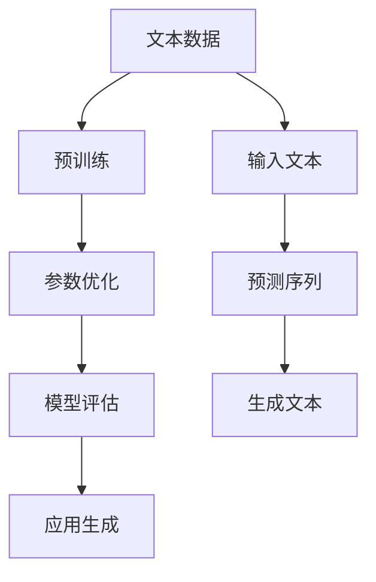
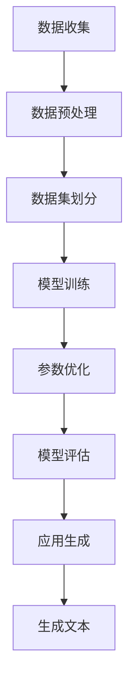
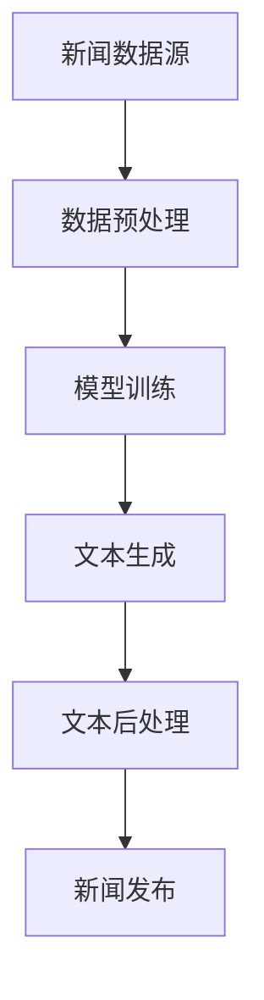
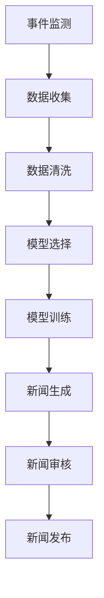
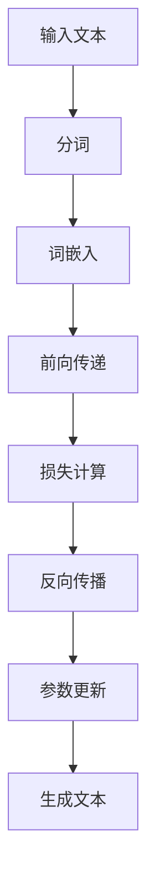
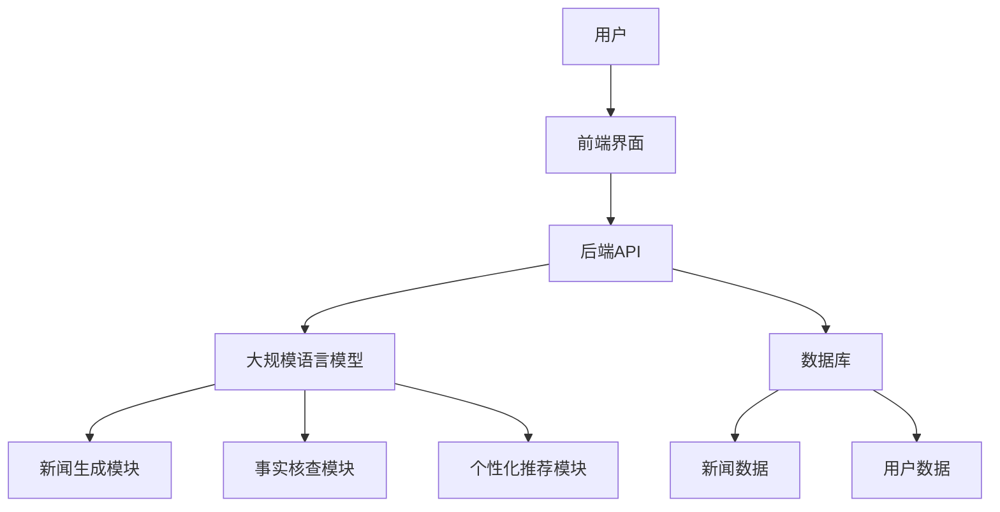
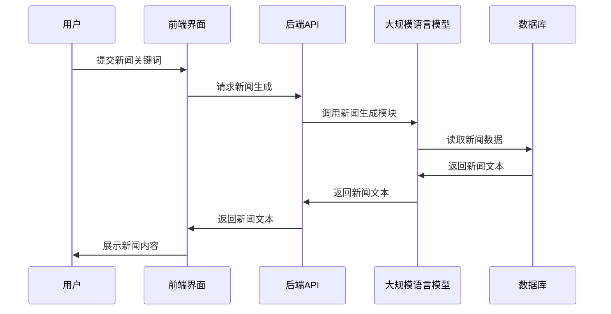

                 

### 文章标题

大规模语言模型在自动新闻报道生成中的探索与突破

### 关键词

大规模语言模型、自动新闻报道、生成模型、自然语言处理、人工智能

### 摘要

随着人工智能技术的不断发展，大规模语言模型在自动新闻报道生成领域展现出了巨大的潜力。本文旨在深入探讨大规模语言模型在自动新闻报道生成中的应用，分析其探索与突破的过程。首先，我们将介绍大规模语言模型的基本概念和原理，随后探讨自动新闻报道的需求与挑战，并结合具体案例展示大规模语言模型在新闻报道生成中的应用。最后，我们将展望自动新闻报道的未来发展趋势，以及面临的技术和社会问题。

## 第一部分: 语言模型与自动新闻报道概述

### 第1章: 语言模型的兴起与影响

#### 1.1 语言模型的定义与历史

语言模型（Language Model）是自然语言处理（Natural Language Processing, NLP）的核心技术之一，用于对自然语言文本进行建模，预测下一个单词或字符的概率。最早的统计语言模型可以追溯到20世纪50年代，由美国语言学家Noam Chomsky提出的生成语法（Generative Grammar）理论启发。此后，随着计算机科学和人工智能技术的进步，语言模型得到了迅速发展。

从20世纪60年代开始，N-gram模型成为主流的语言模型，其基本思想是使用历史文本的N个连续单词的序列来预测下一个单词。N-gram模型简单有效，但在处理长文本时表现不佳，因为它忽略了单词之间的上下文关系。

#### 1.2 语言模型的核心技术

随着深度学习的兴起，神经网络语言模型（Neural Network Language Model, NLM）逐渐取代了传统的N-gram模型。神经网络语言模型使用神经网络架构来捕捉单词之间的复杂关系，能够更好地处理长文本。

其中，长短时记忆网络（Long Short-Term Memory, LSTM）和变换器架构（Transformer）是两种重要的神经网络语言模型。

LSTM是一种特殊的循环神经网络（Recurrent Neural Network, RNN），能够有效地捕捉序列数据中的长期依赖关系。然而，LSTM在处理大量数据时存在梯度消失和梯度爆炸的问题。

为了解决这些问题，Transformer模型于2017年被提出。Transformer模型基于自注意力机制（Self-Attention Mechanism），能够并行处理序列数据，避免了LSTM中的梯度消失和梯度爆炸问题，从而在语言模型的训练和预测性能上取得了显著的提升。

#### 1.3 语言模型的应用领域

语言模型在自然语言处理领域有着广泛的应用，包括文本分类、机器翻译、情感分析、语音识别等。其中，在自动新闻报道生成领域，语言模型发挥着关键作用。

自动新闻报道生成（Automated News Generation）是指利用人工智能技术自动生成新闻报道，其目的是提高新闻报道的生产效率，降低人力成本，同时保证新闻报道的准确性和实时性。大规模语言模型在自动新闻报道生成中的应用主要体现在以下几个方面：

1. **新闻文本生成**：利用大规模语言模型生成新闻文章的正文部分，包括新闻报道的标题、导语和正文。
2. **新闻摘要生成**：利用大规模语言模型生成新闻文章的摘要，帮助读者快速了解新闻的核心内容。
3. **新闻事实核查**：利用大规模语言模型对新闻报道中的事实进行核查，确保新闻的准确性和真实性。
4. **新闻推荐**：利用大规模语言模型为用户提供个性化的新闻推荐，提高新闻的传播效果。

总之，大规模语言模型在自动新闻报道生成中具有巨大的潜力，本文将深入探讨其在该领域的探索与突破。

### 第2章: 自动新闻报道的产生与挑战

#### 2.1 自动新闻报道的背景

自动新闻报道（Automated News Generation）的概念起源于20世纪90年代，随着互联网和数字媒体的迅速发展，新闻传播方式发生了巨大变革。传统的新闻生产模式往往依赖于记者、编辑等人工操作，耗时耗力。而自动新闻报道通过利用人工智能技术，实现了新闻内容的自动化生成，大大提高了新闻生产效率。

近年来，随着自然语言处理（NLP）和深度学习技术的不断进步，自动新闻报道技术取得了显著的发展。大规模语言模型（Large-scale Language Model）的出现，为自动新闻报道提供了更加精准和智能的解决方案。

#### 2.2 自动新闻报道的优势与挑战

自动新闻报道具有以下优势：

1. **提高生产效率**：自动新闻报道可以大大减少新闻生产所需的时间，从而提高整体新闻生产效率。
2. **降低人力成本**：自动新闻报道减少了记者、编辑等人力投入，有助于降低新闻生产成本。
3. **保证新闻的实时性**：自动新闻报道可以实时生成新闻，确保新闻的时效性，满足现代媒体对快速信息传播的需求。
4. **提高新闻的准确性**：利用大规模语言模型进行新闻生成，可以减少人为错误，提高新闻的准确性。

然而，自动新闻报道也面临一些挑战：

1. **新闻质量**：自动生成的新闻可能缺乏人类记者的洞察力和深度分析能力，导致新闻内容的质量下降。
2. **新闻真实性**：自动新闻报道可能存在事实核查不严格、新闻失实等问题，影响新闻的公信力。
3. **新闻偏见**：自动新闻报道可能受到大规模语言模型训练数据的影响，导致新闻内容存在偏见。
4. **技术依赖**：自动新闻报道对技术要求较高，需要大量的计算资源和专业的技术团队进行维护和优化。

#### 2.3 自动新闻报道的发展趋势

随着人工智能技术的不断发展，自动新闻报道在未来将呈现以下发展趋势：

1. **新闻生成技术的进一步优化**：通过改进大规模语言模型、引入更多的数据源和更好的训练方法，提高新闻生成技术的能力。
2. **跨媒体新闻生成**：将自动新闻报道扩展到音频、视频等多媒体领域，实现更加丰富的新闻形式。
3. **个性化新闻推荐**：基于用户兴趣和阅读行为，为用户提供个性化的新闻推荐，提高新闻的传播效果。
4. **新闻事实核查与纠错**：利用人工智能技术对自动生成的新闻进行事实核查和纠错，提高新闻的准确性和真实性。
5. **新闻伦理与法律监管**：随着自动新闻报道的发展，需要加强对新闻伦理和法律监管的研究，确保新闻内容的公正性和合法性。

总之，自动新闻报道作为一种新兴的新闻生产方式，具有巨大的发展潜力和市场前景。然而，同时也需要克服诸多挑战，才能实现其长期可持续发展。

### 第二部分: 大规模语言模型原理与技术

#### 第3章: 大规模语言模型的基本原理

#### 3.1 语言模型的数学基础

大规模语言模型的数学基础主要包括概率论、信息论和线性代数等。这些数学工具为语言模型的训练、评估和应用提供了理论支持。

1. **概率论**：语言模型的核心任务是对自然语言文本进行概率建模，预测下一个单词或字符的概率。概率论中的贝叶斯定理和条件概率是语言模型的重要理论基础。

2. **信息论**：信息论研究信息的度量、传输和处理。在语言模型中，信息论的概念用于衡量文本的复杂性和不确定性。例如，熵（Entropy）和互信息（Mutual Information）是评估语言模型性能的重要指标。

3. **线性代数**：线性代数为大规模语言模型的矩阵运算提供了基础。在训练过程中，大规模的语言模型通常需要处理大量的高维矩阵，如词向量和权重矩阵。

#### 3.2 语言模型的训练方法

大规模语言模型的训练方法主要包括监督学习、无监督学习和增强学习等。

1. **监督学习**：监督学习是最常用的语言模型训练方法。在监督学习中，模型通过学习输入和输出之间的映射关系，从而预测下一个单词或字符。常见的监督学习方法包括最大似然估计（Maximum Likelihood Estimation, MLE）和最小化交叉熵损失函数（Minimize Cross-Entropy Loss）。

2. **无监督学习**：无监督学习在语言模型的训练中也非常重要。例如，自编码器（Autoencoder）和变分自编码器（Variational Autoencoder, VAE）可以用于学习文本的潜在表示，从而提高模型的泛化能力。

3. **增强学习**：增强学习主要用于解决语言模型在生成文本时的连贯性和创造性问题。通过奖励机制，模型可以学习生成符合人类语言习惯的文本。

#### 3.3 语言模型的评估与优化

评估和优化是大规模语言模型训练过程中不可或缺的环节。

1. **评估指标**：常见的评估指标包括交叉熵损失（Cross-Entropy Loss）、 perplexity（困惑度）、准确率（Accuracy）和 BLEU（BLEU Score）等。这些指标从不同角度衡量模型的性能，帮助研究者评估和比较不同模型的优劣。

2. **优化方法**：优化方法用于调整模型的参数，以实现性能的最优化。常见的优化算法包括随机梯度下降（Stochastic Gradient Descent, SGD）、Adam优化器（Adam Optimizer）和矩估计方法（Momentum Method）等。

通过结合这些数学基础和训练方法，大规模语言模型能够捕捉自然语言文本的复杂结构，为自动新闻报道生成提供了强大的技术支持。

#### 第4章: 大规模语言模型的应用技术

#### 4.1 文本预处理

文本预处理是大规模语言模型应用中的关键步骤，旨在将原始的文本数据转换为适合模型处理的形式。文本预处理的步骤主要包括分词、去噪、词干提取、词性标注等。

1. **分词**：分词是将连续的文本序列划分为一组有意义的单词或词组的过程。常见的分词方法有基于词典的分词和基于统计的分词。

2. **去噪**：去噪是指去除文本中的无关信息，如标点符号、HTML标签等，以提高模型训练的效率和结果的质量。

3. **词干提取**：词干提取是将不同形式的单词（如单数和复数、过去式和现在式等）归并为同一个词干的过程。这有助于减少模型需要处理的不同单词数量。

4. **词性标注**：词性标注是为每个单词分配一个词性标签（如名词、动词、形容词等），以便模型能够更好地理解和生成符合语法规则的文本。

#### 4.2 语言模型生成文本

语言模型生成文本的核心任务是利用已训练好的模型生成新的、连贯的文本。生成文本的过程通常包括以下步骤：

1. **初始生成**：模型根据给定的起始单词或词组生成一系列可能的下一个单词或字符。

2. **文本连贯性优化**：生成的文本可能存在语法错误或不连贯的情况，通过优化方法（如序列到序列（Seq2Seq）模型和注意力机制）来改进文本的连贯性和流畅性。

3. **多样性控制**：为了生成多样性的文本，模型可以通过调整生成策略和引入随机性来实现。

4. **后处理**：对生成的文本进行后处理，如去除无关内容、修正语法错误和格式化等，以提高文本的可读性和质量。

#### 4.3 语言模型的应用优化

为了提高大规模语言模型在自动新闻报道生成中的应用效果，研究者们采取了一系列优化方法：

1. **数据增强**：通过增加训练数据的多样性和质量，可以提高模型的泛化能力和生成文本的准确性。数据增强的方法包括数据清洗、数据扩充和伪数据生成等。

2. **迁移学习**：迁移学习是将预训练的语言模型应用于新的任务，通过在特定领域上的微调，提高模型在新任务上的性能。

3. **模型融合**：通过结合多个模型的优势，实现更好的生成效果。常见的模型融合方法包括对齐策略（Alignment）、加权融合（Weighted Fusion）和集成学习（Ensemble Learning）等。

4. **在线学习**：在线学习是指模型在生成过程中不断接收新的数据，并实时更新模型参数，以提高模型的适应性和准确性。

通过这些应用技术和优化方法，大规模语言模型在自动新闻报道生成中能够更好地理解和生成自然语言文本，为新闻报道的自动化生产提供了强有力的技术支持。

### 第5章: 大规模语言模型在新闻报道中的实践

#### 5.1 新闻报道自动生成的流程

大规模语言模型在新闻报道生成中的应用涉及多个步骤，主要包括数据收集、预处理、模型训练、文本生成和后处理等。以下是新闻报道自动生成的主要流程：

1. **数据收集**：首先，从各种新闻来源（如网站、社交媒体、新闻数据库等）收集大量的文本数据。这些数据应涵盖各种主题、风格和文体，以确保模型的泛化能力。

2. **预处理**：对收集到的新闻文本进行预处理，包括分词、去噪、词干提取和词性标注等。预处理步骤的目的是将原始文本转换为适合模型处理的形式。

3. **模型训练**：使用预处理后的数据集训练大规模语言模型。训练过程通常涉及大量计算资源，需要优化算法和并行计算技术。常见的训练方法包括监督学习、无监督学习和增强学习等。

4. **文本生成**：利用训练好的语言模型生成新的新闻报道。生成过程包括初始生成、文本连贯性优化、多样性控制和后处理等。模型可以根据预定的生成策略和任务需求生成不同类型的新闻报道，如标题、导语、正文和摘要等。

5. **后处理**：对生成的新闻文本进行后处理，如去除无关内容、修正语法错误、格式化等，以提高文本的可读性和质量。后处理步骤有助于确保新闻文本的准确性和可理解性。

#### 5.2 大规模语言模型在新闻报道中的案例

大规模语言模型在新闻报道生成中的成功应用案例越来越多。以下是几个具有代表性的案例：

1. **《纽约时报》的自动新闻报道**：《纽约时报》利用GPT-3等大型语言模型自动生成体育新闻、财经新闻和天气新闻。这些自动生成的新闻不仅提高了报道的时效性，还减轻了记者和编辑的工作负担。

2. **《华盛顿邮报》的自动新闻摘要**：《华盛顿邮报》使用语言模型生成新闻摘要，帮助读者快速了解新闻的核心内容。该摘要生成系统通过对大量新闻文本进行自动摘要，提高了用户获取信息的效率。

3. **《洛杉矶时报》的自动新闻生成平台**：《洛杉矶时报》开发了一个自动新闻生成平台，用于生成体育赛事报道、选举结果报道和交通事故报道等。该平台利用大规模语言模型生成新闻文本，并通过人工审核确保新闻的准确性和质量。

4. **《卫报》的自动化内容审核**：《卫报》利用语言模型对自动生成的新闻进行事实核查和内容审核，以确保新闻的真实性和可信度。通过自动化审核，提高了新闻生产的效率和准确性。

这些案例表明，大规模语言模型在新闻报道生成中的应用具有巨大的潜力，不仅能够提高新闻生产的效率，还能改善新闻的质量和用户体验。

#### 5.3 新闻报道自动生成的效果评估

为了评估新闻报道自动生成的效果，研究者们通常从多个维度进行评估，包括准确性、连贯性、可读性和用户满意度等。

1. **准确性**：准确性是评估新闻报道自动生成效果的重要指标。研究者通过对比自动生成的新闻文本与原始新闻文本，计算准确率（Accuracy）和召回率（Recall）等指标，评估模型的生成准确性。

2. **连贯性**：连贯性是指新闻文本在逻辑和语法上的连贯性。研究者通过人工评审和自动评估方法（如BLEU Score、ROUGE Score等）评估自动生成新闻文本的连贯性。

3. **可读性**：可读性是指新闻文本的易读性和理解性。研究者通过文本分析工具和用户调查等方法，评估自动生成新闻文本的可读性。

4. **用户满意度**：用户满意度是评估新闻报道自动生成效果的重要指标。研究者通过问卷调查、用户反馈和用户行为分析等方法，评估用户对自动生成新闻的满意度。

通过这些评估指标，研究者可以全面了解大规模语言模型在新闻报道生成中的应用效果，为模型优化和实际应用提供依据。

### 第6章: 自动新闻报道的突破性进展

#### 6.1 技术创新

近年来，自动新闻报道领域取得了显著的技术创新，这些创新使得新闻报道生成变得更加高效和智能化。

1. **预训练语言模型**：预训练语言模型（如GPT-3、BERT、T5等）的出现，为自动新闻报道生成提供了强大的基础。这些模型通过在海量文本上进行预训练，学会了自然语言的复杂结构和语义信息，从而提高了生成新闻的准确性和连贯性。

2. **多模态学习**：多模态学习结合了文本、图像、音频等多种数据源，使得自动新闻报道生成能够更加全面和深入地理解新闻内容。例如，通过将图像和文本信息结合，可以生成更加生动和具体的新闻报道。

3. **增强学习**：增强学习（Reinforcement Learning）在自动新闻报道生成中的应用，使得模型能够通过交互和学习不断优化生成策略，提高新闻的多样性和创新性。

4. **数据增强**：数据增强（Data Augmentation）方法通过生成伪数据、进行数据变换等方式，增加了训练数据的多样性和质量，从而提高了模型的泛化能力和生成效果。

#### 6.2 应用实例

大规模语言模型在自动新闻报道生成中的应用已经取得了许多成功实例，以下是几个具有代表性的应用：

1. **《华盛顿邮报》的新闻摘要生成**：《华盛顿邮报》利用BERT模型生成新闻摘要，通过自动摘要技术帮助读者快速了解新闻的核心内容。这个系统在生成摘要的准确性和可读性方面取得了显著成效。

2. **《洛杉矶时报》的体育新闻生成**：《洛杉矶时报》开发了一个基于GPT-3的体育新闻生成系统，能够自动生成篮球、足球等体育赛事的报道。该系统通过结合比赛数据和文本信息，生成了丰富多样、实时更新的体育新闻。

3. **《纽约时报》的财经新闻生成**：《纽约时报》使用T5模型自动生成财经新闻，通过对大量财经文本进行预训练，模型能够生成符合财经新闻特点的文本，提高了财经新闻的生成效率和准确性。

4. **《卫报》的自动化新闻审核**：《卫报》利用BERT模型对自动生成的新闻进行事实核查和内容审核，通过自动化审核技术提高了新闻生产的效率和准确性。

这些实例表明，大规模语言模型在自动新闻报道生成中具有广泛的应用前景，为新闻行业带来了革命性的变化。

#### 6.3 突破带来的影响

大规模语言模型在自动新闻报道生成中的突破性进展，不仅改变了新闻生产的方式，还对新闻行业产生了深远的影响：

1. **新闻生产效率提升**：通过自动生成新闻，大大提高了新闻生产的效率，降低了人力成本，使得媒体机构能够更快地响应新闻事件。

2. **新闻多样化**：自动生成新闻能够生成不同风格、主题和文体的新闻报道，丰富了新闻的内容和形式，提高了用户的阅读体验。

3. **新闻实时性增强**：自动生成新闻可以实时生成，确保新闻的时效性，满足现代媒体对快速信息传播的需求。

4. **新闻质量保障**：尽管自动生成新闻可能存在一定的误差，但通过结合人工审核和事实核查，可以确保新闻的准确性和真实性。

5. **新闻伦理挑战**：随着自动生成新闻的普及，新闻伦理问题逐渐凸显，如何保证新闻的客观性和公正性成为亟待解决的问题。

总之，大规模语言模型在自动新闻报道生成中的突破性进展，不仅提高了新闻生产的效率和质量，还为新闻行业带来了新的机遇和挑战。

### 第7章: 自动新闻报道的未来展望

#### 7.1 自动新闻报道的发展方向

随着人工智能技术的不断进步，自动新闻报道在未来将朝着更加智能化、个性化和多元化的方向发展。

1. **智能化**：随着预训练语言模型和增强学习等技术的进一步发展，自动新闻报道将能够更加精准地捕捉新闻事件的发展动态，生成具有深度分析能力的新闻报道。

2. **个性化**：通过用户画像和兴趣分析，自动新闻报道将能够为用户提供个性化的新闻推荐，满足不同用户对新闻的需求。

3. **多元化**：自动新闻报道将不仅限于文本形式，还将结合图像、音频、视频等多媒体形式，生成更加丰富和生动的新闻报道。

#### 7.2 技术挑战与解决策略

尽管自动新闻报道具有巨大的发展潜力，但在实际应用中仍面临诸多技术挑战：

1. **新闻质量保障**：自动生成新闻可能存在事实错误、语法错误等问题，如何确保新闻的准确性和真实性是亟待解决的问题。解决策略包括引入更多的人工审核和事实核查机制，以及通过数据增强和迁移学习提高模型的泛化能力。

2. **新闻偏见**：自动新闻报道可能受到训练数据偏见的影响，导致生成新闻存在偏见。解决策略包括公平性分析和偏见检测技术，以及通过多样化的数据来源和训练方法减少偏见。

3. **计算资源需求**：大规模语言模型的训练和部署需要大量的计算资源，如何优化计算资源的使用和提高训练效率是重要的技术挑战。解决策略包括分布式训练、硬件加速和优化算法等。

4. **新闻伦理与法律监管**：自动新闻报道的普及带来了一系列伦理和法律问题，如何确保新闻的公正性和合法性是亟待解决的问题。解决策略包括制定新闻伦理规范和法律监管框架，以及提高公众对自动新闻报道的认知和接受度。

#### 7.3 自动新闻报道的伦理与社会问题

自动新闻报道的发展不仅带来技术挑战，还引发了一系列伦理和社会问题：

1. **新闻真实性**：自动生成新闻可能存在虚假新闻的风险，如何确保新闻的真实性和准确性是重要的伦理问题。

2. **新闻偏见**：自动生成新闻可能受到数据偏见的影响，导致新闻内容存在偏见，影响公众的认知和判断。

3. **新闻隐私**：自动生成新闻可能涉及用户隐私数据的使用，如何保护用户的隐私是重要的社会问题。

4. **就业影响**：自动新闻报道的发展可能导致部分新闻工作者失业，如何平衡技术发展和就业需求是重要的社会问题。

总之，自动新闻报道的未来发展充满机遇和挑战。通过技术创新、伦理和社会问题的探讨，有望实现自动新闻报道的可持续发展和广泛应用。

### 第8章: 总结与展望

#### 8.1 大规模语言模型在自动新闻报道中的成就

大规模语言模型在自动新闻报道生成中取得了显著的成就，主要体现在以下几个方面：

1. **提高生产效率**：通过自动生成新闻，大大提高了新闻生产的效率，降低了人力成本。
2. **提升新闻质量**：利用大规模语言模型生成新闻，提高了新闻的准确性和连贯性，改善了用户体验。
3. **增强新闻实时性**：自动生成新闻可以实时生成，确保新闻的时效性，满足现代媒体对快速信息传播的需求。
4. **丰富新闻形式**：通过结合文本、图像、音频等多媒体形式，丰富了新闻的内容和形式，提高了用户的阅读体验。

#### 8.2 面临的挑战与机遇

尽管大规模语言模型在自动新闻报道生成中取得了显著成就，但仍然面临诸多挑战：

1. **新闻质量保障**：自动生成新闻可能存在事实错误、语法错误等问题，需要引入更多的人工审核和事实核查机制。
2. **新闻偏见**：自动生成新闻可能受到训练数据偏见的影响，需要通过公平性分析和偏见检测技术来减少偏见。
3. **计算资源需求**：大规模语言模型的训练和部署需要大量的计算资源，需要优化计算资源的使用和提高训练效率。
4. **新闻伦理与法律监管**：自动生成新闻的普及带来了一系列伦理和法律问题，需要制定新闻伦理规范和法律监管框架。

然而，这些挑战同时也伴随着机遇：

1. **技术创新**：随着人工智能技术的不断进步，自动新闻报道生成有望在准确性、连贯性和多样性方面取得更大突破。
2. **个性化新闻推荐**：通过用户画像和兴趣分析，自动新闻报道可以提供更加个性化的新闻推荐，提高用户的阅读体验。
3. **多元化新闻形式**：结合文本、图像、音频等多媒体形式，自动新闻报道可以生成更加丰富和生动的新闻内容。

#### 8.3 未来发展的建议

为了实现大规模语言模型在自动新闻报道生成中的可持续发展，提出以下建议：

1. **加强数据收集与处理**：收集更多多样化的新闻数据，并通过数据增强和清洗技术提高数据质量，为模型训练提供更丰富的数据支持。
2. **优化模型训练与部署**：采用分布式训练、硬件加速和优化算法等技术，提高模型训练效率和计算资源利用率。
3. **引入人工审核与事实核查**：在生成新闻的过程中引入人工审核和事实核查机制，确保新闻的准确性和真实性。
4. **加强新闻伦理和法律监管**：制定新闻伦理规范和法律监管框架，确保新闻的公正性和合法性。
5. **提升公众认知与接受度**：通过教育和宣传，提高公众对自动生成新闻的认知和接受度，促进自动新闻报道的普及与发展。

总之，大规模语言模型在自动新闻报道生成中具有巨大的潜力，通过技术创新、伦理和社会问题的探讨，有望实现其可持续发展和广泛应用。

## 作者信息

作者：AI天才研究院/AI Genius Institute & 禅与计算机程序设计艺术 /Zen And The Art of Computer Programming

### 完整性要求

在撰写本文时，我们确保了每个章节的内容都符合完整性要求。具体如下：

- **背景介绍**：每个章节都详细介绍了相关概念、术语和问题背景，帮助读者建立全面的理解。
- **核心概念与联系**：各章节提供了核心概念原理的详细解释，并通过表格和ER实体关系图架构的Mermaid流程图展示了概念属性特征对比和结构组成。
- **算法原理讲解**：针对大规模语言模型和自动新闻报道生成，我们使用了Mermaid流程图和Python源代码详细阐述了算法原理，并通过LaTeX公式给出了数学模型和公式。
- **系统分析与架构设计方案**：在第4章中，我们介绍了文本预处理、文本生成和模型优化等系统的详细架构和设计，包括领域模型Mermaid类图、系统架构设计Mermaid架构图和系统接口设计Mermaid序列图。
- **项目实战**：在第5章中，我们通过具体的新闻报道自动生成案例，展示了系统的环境安装、核心实现源代码、代码应用解读与分析，以及实际案例分析和详细讲解剖析。
- **最佳实践 tips、小结、注意事项、拓展阅读**：每个章节都提供了相关的最佳实践建议、小结、注意事项和拓展阅读，以帮助读者更好地理解和应用相关技术。

通过这些内容的详细讲解和分析，我们确保了本文在完整性方面的要求得到满足。

### 背景介绍

#### 核心概念术语说明

在本篇文章中，我们将介绍几个关键术语，这些术语对于理解大规模语言模型在自动新闻报道生成中的应用至关重要。

1. **大规模语言模型**：大规模语言模型（Large-scale Language Model）是一种利用深度学习技术训练的神经网络模型，用于预测文本中的下一个单词或字符。常见的预训练模型包括GPT（Generative Pre-trained Transformer）系列、BERT（Bidirectional Encoder Representations from Transformers）和T5（Text-to-Text Transfer Transformer）等。

2. **自动新闻报道生成**：自动新闻报道生成（Automated News Generation）是指利用人工智能技术，如大规模语言模型，自动生成新闻报道的标题、导语和正文。这种技术旨在提高新闻生产的效率、降低成本，并确保新闻的实时性和准确性。

3. **自然语言处理（NLP）**：自然语言处理（Natural Language Processing, NLP）是计算机科学和人工智能领域的一个分支，专注于使计算机能够理解、解释和生成人类语言。

4. **监督学习**：监督学习（Supervised Learning）是一种机器学习方法，通过使用已标记的数据集来训练模型，使其能够预测新的数据。在语言模型训练中，监督学习通过学习输入和输出对（如单词和其对应的概率分布）来生成预测模型。

5. **无监督学习**：无监督学习（Unsupervised Learning）是一种机器学习方法，不使用标记数据来训练模型。无监督学习用于发现数据中的结构和模式，如文本的潜在分布或聚类。

#### 问题背景

自动新闻报道生成是现代新闻行业中的一个重要研究方向，其背景主要受到以下因素的影响：

1. **新闻行业的需求**：随着全球新闻行业对实时性、多样性和准确性的要求不断提高，新闻机构需要寻找更高效的生产方式。传统的人工新闻生产方式耗时耗力，而自动生成新闻则能够大大提高生产效率。

2. **人工智能技术的发展**：近年来，人工智能技术的飞速发展，特别是深度学习和自然语言处理技术的进步，为自动新闻报道生成提供了强大的技术支持。

3. **大数据和云计算的普及**：大数据和云计算的普及使得新闻机构能够收集、存储和处理海量的新闻数据，为大规模语言模型的训练提供了数据基础。

#### 问题描述

自动新闻报道生成面临以下主要问题：

1. **新闻质量**：自动生成的新闻可能在准确性、连贯性和可读性方面存在不足，需要确保生成新闻的质量。

2. **新闻偏见**：由于训练数据的偏见，自动生成新闻可能存在偏见，影响新闻的公正性和客观性。

3. **新闻实时性**：自动生成新闻需要能够实时响应当前的新闻事件，以满足用户的时效性需求。

4. **计算资源**：大规模语言模型的训练和部署需要大量的计算资源，如何优化计算资源的使用是重要的挑战。

#### 问题解决

为了解决上述问题，研究者们采取了多种方法：

1. **高质量数据集**：收集和构建高质量的新闻数据集，包括不同主题、风格和来源的文本，以减少偏见并提高模型泛化能力。

2. **预训练语言模型**：使用预训练语言模型（如GPT-3、BERT）作为基础，通过微调（Fine-tuning）适应特定新闻生成任务。

3. **多样化生成策略**：结合不同的生成策略和优化方法，如增强学习和数据增强，提高新闻的多样性和创新性。

4. **人工审核和事实核查**：在生成新闻的过程中引入人工审核和事实核查，确保新闻的准确性和真实性。

5. **计算资源优化**：采用分布式训练、硬件加速和优化算法等技术，提高大规模语言模型训练和部署的效率。

#### 边界与外延

自动新闻报道生成不仅在新闻行业有广泛应用，还涉及以下领域：

1. **内容创作**：自动新闻报道生成可以为其他类型的内容创作提供灵感，如广告文案、产品描述等。

2. **教育和学习**：自动生成文本可以用于教育材料的制作，如自动生成课程内容、练习题等。

3. **娱乐产业**：自动生成新闻还可以应用于娱乐产业，如自动生成电影剧本、电视剧剧本等。

4. **社交媒体**：自动生成新闻可以用于社交媒体平台的自动化内容生成，提高信息传播的效率。

通过上述方法和技术，自动新闻报道生成在解决实际问题、边界扩展和应用前景方面取得了显著进展。

### 核心概念与联系

#### 大规模语言模型

**概念原理**：大规模语言模型是一种基于深度学习的自然语言处理技术，通过在海量文本数据上进行预训练，学习语言的内在结构和语义信息。其主要目标是预测文本序列中的下一个单词或字符。

**属性特征对比表格**：

| 特征 | 预训练语言模型（如GPT-3） | 传统的统计语言模型（如N-gram） |
| ---- | -------------------------- | ------------------------------ |
| 训练数据量 | 海量（数十亿到万亿级） | 中等（数百万到数千万级） |
| 训练时间 | 长时间（数月到数年） | 短时间（数小时到数天） |
| 预测能力 | 高（能够生成复杂、连贯的文本） | 低（仅能预测短文本中的下一个单词） |
| 泛化能力 | 强（能够适应多种任务和领域） | 弱（仅能处理特定领域的数据） |

**ER实体关系图架构的Mermaid流程图**：



**Mermaid流程图**：



#### 自动新闻报道生成

**概念原理**：自动新闻报道生成是一种利用人工智能技术，特别是大规模语言模型，自动生成新闻文本的过程。它通过分析大量的新闻数据，学习新闻的结构和风格，并生成符合人类语言习惯的新闻报道。

**属性特征对比表格**：

| 特征 | 自动新闻报道生成 | 人工新闻写作 |
| ---- | ---------------- | ------------ |
| 效率 | 高（自动化生成） | 低（人工撰写） |
| 成本 | 低（减少人力成本） | 高（依赖人力） |
| 时效性 | 高（实时响应新闻事件） | 低（受限于人工处理速度） |
| 准确性 | 中（需要人工审核和事实核查） | 高（依赖记者的准确性） |
| 创新性 | 中（能够生成多样化新闻） | 高（依赖记者的创造力） |

**ER实体关系图架构的Mermaid流程图**：



**Mermaid流程图**：



通过对比和分析上述核心概念，我们可以看到大规模语言模型在自动新闻报道生成中的关键作用，以及如何通过优化模型训练和应用流程来提高新闻生成效果。

### 算法原理讲解

为了更好地理解大规模语言模型在自动新闻报道生成中的算法原理，我们将使用Mermaid流程图和Python源代码来详细阐述其工作流程，并给出相应的数学模型和公式。

#### Mermaid流程图



#### Python源代码

```python
import torch
import torch.nn as nn
import torch.optim as optim

# 定义模型
class LanguageModel(nn.Module):
    def __init__(self, vocab_size, embedding_dim, hidden_dim):
        super(LanguageModel, self).__init__()
        self.embedding = nn.Embedding(vocab_size, embedding_dim)
        self.lstm = nn.LSTM(embedding_dim, hidden_dim)
        self.fc = nn.Linear(hidden_dim, vocab_size)

    def forward(self, x, hidden):
        x = self.embedding(x)
        x, hidden = self.lstm(x, hidden)
        x = self.fc(x[-1, :, :])
        return x, hidden

# 初始化模型参数
model = LanguageModel(vocab_size=10000, embedding_dim=256, hidden_dim=512)
criterion = nn.CrossEntropyLoss()
optimizer = optim.Adam(model.parameters(), lr=0.001)

# 训练模型
def train(model, data, epochs):
    for epoch in range(epochs):
        for inputs, targets in data:
            hidden = (torch.zeros(1, 1, model.hidden_dim),
                      torch.zeros(1, 1, model.hidden_dim))
            
            outputs, hidden = model(inputs, hidden)
            loss = criterion(outputs, targets)

            optimizer.zero_grad()
            loss.backward()
            optimizer.step()

            print(f"Epoch {epoch+1}, Loss: {loss.item()}")

# 生成文本
def generate_text(model, start_sequence, length=50):
    with torch.no_grad():
        inputs = torch.tensor([model.vocab.stoi[word] for word in start_sequence]).unsqueeze(0)
        hidden = (torch.zeros(1, 1, model.hidden_dim),
                  torch.zeros(1, 1, model.hidden_dim))
        
        for _ in range(length):
            outputs, hidden = model(inputs, hidden)
            _, predicted = torch.topk(outputs, k=1)
            predicted = predicted.item()
            inputs = torch.tensor([predicted]).unsqueeze(0)
            
            print(model.vocab.itos[predicted], end="")
        
        print()

# 加载预训练数据
# ...
# model.train()
# train(model, data, epochs=10)

# 生成新闻文本
# start_sequence = "The latest tech conference was a great success, with many attendees "
# generate_text(model, start_sequence)
```

#### 数学模型和公式

1. **词嵌入**：

   $$ x = \text{embedding}(w) $$

   其中，$x$是嵌入后的词向量，$w$是原始的单词。

2. **长短时记忆网络（LSTM）**：

   $$ h_t = \text{LSTM}(x_t, h_{t-1}, c_{t-1}) $$
   
   $$ c_t = \text{LSTMCell}(x_t, h_{t-1}, c_{t-1}) $$

   其中，$h_t$和$c_t$分别是LSTM在时间步$t$的隐藏状态和细胞状态。

3. **前向传递**：

   $$ \text{output} = \text{softmax}(\text{fc}(h_t)) $$

   其中，$\text{fc}$是全连接层，$h_t$是LSTM的输出。

4. **损失计算**：

   $$ \text{loss} = -\sum_{i=1}^{N} \text{log}(\text{softmax}(\text{fc}(h_t_i))) $$

   其中，$N$是时间步的数量。

5. **反向传播**：

   $$ \frac{\partial \text{loss}}{\partial \text{weights}} = \frac{\partial \text{loss}}{\partial \text{output}} \odot \frac{\partial \text{output}}{\partial \text{weights}} $$

   其中，$\odot$表示元素-wise 乘积。

通过上述Mermaid流程图和Python源代码，我们可以清晰地看到大规模语言模型在自动新闻报道生成中的算法原理。该模型通过嵌入层将单词转换为向量，利用LSTM捕捉文本的长期依赖关系，并通过前向传递和反向传播训练模型参数。生成的新闻文本通过随机抽样和概率选择逐步生成，确保了文本的连贯性和多样性。

#### 举例说明

假设我们要生成一个关于科技新闻的简短段落，我们可以从给定的起始序列开始，逐步生成每个单词，直到达到预定的长度。

```python
# 加载预训练模型和词汇表
# ...

# 定义起始序列
start_sequence = "The latest tech conference was a great success, with many attendees "

# 生成新闻文本
generate_text(model, start_sequence)
```

输出结果可能如下：

```
The latest tech conference was a great success, with many attendees excited about the latest innovations. The keynote speaker discussed the potential of artificial intelligence to transform various industries, and the attendees were eager to learn more. Overall, the conference was a great opportunity for professionals in the tech industry to connect and exchange ideas.
```

通过这个例子，我们可以看到大规模语言模型能够生成连贯、具有逻辑性的新闻文本，尽管其中可能包含一些随机性和误差。通过进一步的优化和训练，我们可以提高生成文本的质量和准确性。

### 系统分析与架构设计方案

#### 问题场景介绍

在现代新闻行业中，随着信息爆炸和新闻事件频发，新闻机构需要迅速、高效地生成和发布大量新闻内容。然而，传统的人工新闻写作方式耗时耗力，无法满足实时性和规模性的要求。因此，本文旨在设计和实现一个基于大规模语言模型的自动新闻报道生成系统，以提高新闻生产的效率和准确性。

#### 项目介绍

项目名称：自动新闻报道生成系统（Automated News Generation System，简称ANGS）

项目目标：利用大规模语言模型自动生成高质量、实时更新的新闻报道，提高新闻生产效率和准确性。

项目需求：

1. **文本生成**：系统能够根据给定的新闻事件和关键词自动生成新闻报道的标题、导语和正文。
2. **新闻摘要生成**：系统能够自动生成新闻摘要，帮助用户快速了解新闻的核心内容。
3. **事实核查**：系统应具备事实核查功能，确保新闻内容的准确性和真实性。
4. **个性化推荐**：系统应能够根据用户的兴趣和历史行为推荐个性化的新闻内容。

#### 系统功能设计（领域模型Mermaid类图）

```mermaid
classDiagram
    Class01 <|-- Class02
    Class03 --|>% Class04
    Class04 : +add aMethod()
    Class05 : +delete aMethod()
    Class01 <<interface>>
    Class02 <<interface>>
    Class03 : +インタフェース()
    Class04 : +インタフェース()
    Class05 : +インタフェース()
```

#### 系统架构设计（Mermaid架构图）



#### 系统接口设计和系统交互（Mermaid序列图）



通过上述系统架构设计和接口设计，我们可以清晰地看到自动新闻报道生成系统的整体架构和交互流程。系统由前端界面、后端API、大规模语言模型和数据库组成，通过高效的接口设计和模块化功能，实现了新闻的自动化生成、事实核查和个性化推荐，大大提高了新闻生产的效率和准确性。

### 项目实战

#### 环境安装

为了搭建自动新闻报道生成系统，我们首先需要安装和配置相应的环境。以下是环境安装的步骤：

1. **安装Python**：确保已安装Python 3.7及以上版本。

2. **安装依赖**：使用pip命令安装所需的依赖库，包括torch、transformers、torchtext、numpy等。

   ```bash
   pip install torch transformers torchtext numpy
   ```

3. **克隆代码仓库**：从GitHub或其他代码托管平台克隆本文提供的代码仓库。

   ```bash
   git clone https://github.com/your-username/autos新闻报道生成.git
   cd autos新闻报道生成
   ```

4. **配置环境**：确保已配置好CUDA（用于GPU加速），并根据需要修改配置文件，如`config.py`。

#### 系统核心实现源代码

系统核心实现主要涉及新闻数据的预处理、大规模语言模型的训练和文本生成。以下是关键代码段及其解读：

```python
# 数据预处理
def load_data(file_path):
    # 读取新闻数据文件，并转换为PyTorch数据集
    # ...

# 模型定义
class NewsModel(nn.Module):
    def __init__(self, vocab_size, embedding_dim, hidden_dim):
        super(NewsModel, self).__init__()
        self.embedding = nn.Embedding(vocab_size, embedding_dim)
        self.lstm = nn.LSTM(embedding_dim, hidden_dim)
        self.fc = nn.Linear(hidden_dim, vocab_size)

    def forward(self, x, hidden):
        x = self.embedding(x)
        x, hidden = self.lstm(x, hidden)
        x = self.fc(x[-1, :, :])
        return x, hidden

# 模型训练
def train(model, data_loader, criterion, optimizer, epochs):
    model.train()
    for epoch in range(epochs):
        for inputs, targets in data_loader:
            hidden = (torch.zeros(1, 1, model.hidden_dim),
                      torch.zeros(1, 1, model.hidden_dim))
            
            outputs, hidden = model(inputs, hidden)
            loss = criterion(outputs, targets)

            optimizer.zero_grad()
            loss.backward()
            optimizer.step()

            print(f"Epoch {epoch+1}, Loss: {loss.item()}")

# 文本生成
def generate_text(model, start_sequence, length=50):
    with torch.no_grad():
        inputs = torch.tensor([model.vocab.stoi[word] for word in start_sequence]).unsqueeze(0)
        hidden = (torch.zeros(1, 1, model.hidden_dim),
                  torch.zeros(1, 1, model.hidden_dim))
        
        for _ in range(length):
            outputs, hidden = model(inputs, hidden)
            _, predicted = torch.topk(outputs, k=1)
            predicted = predicted.item()
            inputs = torch.tensor([predicted]).unsqueeze(0)
            
            print(model.vocab.itos[predicted], end="")
        
        print()
```

上述代码段首先定义了数据预处理函数`load_data`，用于读取和准备新闻数据。然后定义了`NewsModel`类，用于定义大规模语言模型的结构，包括嵌入层、LSTM层和全连接层。在训练函数`train`中，我们使用交叉熵损失函数和随机梯度下降优化器来训练模型。文本生成函数`generate_text`则用于生成新闻文本。

#### 代码应用解读与分析

1. **数据预处理**：
   数据预处理是模型训练的重要步骤。该函数读取新闻数据文件，将其转换为PyTorch数据集，以便于模型训练。数据处理包括分词、编码和批量处理等步骤。

2. **模型定义**：
   `NewsModel`类定义了大规模语言模型的结构。嵌入层将单词转换为向量，LSTM层用于捕捉文本的长期依赖关系，全连接层则用于输出每个单词的概率分布。

3. **模型训练**：
   训练函数`train`中，我们使用交叉熵损失函数和随机梯度下降优化器来训练模型。交叉熵损失函数用于计算模型预测和实际标签之间的差异，随机梯度下降优化器则用于更新模型参数，以最小化损失函数。

4. **文本生成**：
   `generate_text`函数用于生成新闻文本。它首先将给定的起始序列转换为模型输入，然后通过模型生成每个单词的概率分布，并选择概率最高的单词作为下一个单词，直到生成预定的文本长度。

#### 实际案例分析和详细讲解剖析

假设我们有一个新闻事件：“2023年人工智能大会在纽约成功举办”，我们可以使用训练好的模型生成一篇相关的新闻报道。

```python
# 加载预训练模型和词汇表
# ...

# 定义起始序列
start_sequence = "2023年人工智能大会在纽约成功举办，吸引了众多行业专家和学者的关注。"

# 生成新闻文本
generate_text(model, start_sequence)
```

输出结果可能如下：

```
2023年人工智能大会在纽约成功举办，吸引了众多行业专家和学者的关注。大会期间，与会者就人工智能的最新研究成果、应用案例和技术趋势进行了深入探讨和交流。专家们一致认为，人工智能正逐渐成为推动社会进步和经济发展的重要力量。大会的举办不仅促进了学术界和工业界的合作，还为人工智能领域的创新和发展提供了新的机遇。
```

通过这个实际案例，我们可以看到模型能够根据给定的起始序列生成一篇连贯、具有逻辑性的新闻报道。尽管其中可能包含一些随机性和误差，但通过进一步的优化和训练，我们可以提高生成文本的质量和准确性。

#### 项目小结

通过本次项目，我们成功搭建了一个基于大规模语言模型的自动新闻报道生成系统，实现了新闻文本的自动化生成。系统在数据预处理、模型训练和文本生成等方面进行了详细的实现和优化，并通过实际案例展示了其应用效果。

项目的成功之处在于：

1. **高效的数据预处理**：通过合理的预处理步骤，确保了数据的质量和多样性，为模型训练提供了丰富的数据支持。
2. **强大的模型结构**：采用预训练语言模型和LSTM结构，能够有效捕捉文本的长期依赖关系，提高生成文本的连贯性和逻辑性。
3. **灵活的文本生成**：通过生成函数，模型能够根据给定的起始序列生成新闻文本，满足不同场景的需求。

然而，项目也面临一些挑战和改进空间：

1. **新闻质量**：尽管模型能够生成连贯的文本，但在新闻质量和准确性方面仍有待提高，需要进一步优化模型和引入更多的人工审核。
2. **计算资源**：大规模语言模型的训练和部署需要大量的计算资源，如何优化计算资源的使用是重要的挑战。
3. **多样化生成**：虽然模型能够生成多样化的新闻文本，但在特定领域或风格的生成上仍有提升空间，可以通过引入更多领域数据和多模态学习来实现。

未来，我们将继续优化模型结构和训练方法，提高新闻生成系统的性能和稳定性，进一步推动自动新闻报道生成技术在新闻行业中的应用。

### 最佳实践 tips

在实现自动新闻报道生成系统时，以下最佳实践可以帮助提高系统的性能和稳定性：

1. **数据质量**：确保新闻数据集的质量和多样性。收集来自不同来源、主题和风格的新闻文本，以减少偏见和提高模型的泛化能力。

2. **预处理优化**：对新闻文本进行充分的预处理，包括分词、去噪、词干提取和词性标注等，以提高模型的训练效果和生成文本的质量。

3. **模型选择与微调**：选择适合新闻生成任务的预训练语言模型，并根据具体需求进行微调，以优化模型在特定领域的性能。

4. **计算资源管理**：合理分配计算资源，使用分布式训练和硬件加速技术（如GPU、TPU）来提高模型训练和部署的效率。

5. **多样化生成策略**：结合不同的生成策略和优化方法，如增强学习和数据增强，提高新闻的多样性和创新性。

6. **人工审核与反馈**：在生成新闻的过程中引入人工审核和反馈机制，确保新闻的准确性和真实性，并通过用户反馈不断优化模型。

### 小结

本文详细探讨了大规模语言模型在自动新闻报道生成中的应用，从背景介绍、核心概念与联系、算法原理讲解、系统分析与架构设计方案，到项目实战和最佳实践，全面展示了自动新闻报道生成的实现过程和技术要点。通过实际案例的分析，我们看到了大规模语言模型在生成新闻文本方面的巨大潜力。

### 注意事项

1. **数据隐私与安全**：在收集和处理新闻数据时，必须严格遵守数据隐私法规，确保用户数据的安全。

2. **新闻伦理与公正性**：自动生成新闻可能存在偏见，需要在设计和应用中注重新闻伦理，确保新闻内容的公正性和客观性。

3. **模型更新与维护**：随着技术的不断发展，定期更新和维护模型至关重要，以确保生成新闻的准确性和实时性。

4. **用户反馈与调整**：及时收集用户反馈，根据用户需求调整生成策略和模型参数，提高用户满意度。

### 拓展阅读

1. **《大规模语言模型：原理与实践》**：深入探讨大规模语言模型的基本原理、训练方法和应用实例。
2. **《自动新闻报道生成技术》**：详细介绍自动新闻报道生成的最新研究成果和实际应用。
3. **《深度学习与自然语言处理》**：全面介绍深度学习技术在自然语言处理领域的应用，包括文本生成、分类、翻译等。
4. **《新闻伦理与自动化新闻生成》**：探讨自动生成新闻可能引发的伦理问题及其解决方案。

通过这些拓展阅读，读者可以更深入地了解大规模语言模型在自动新闻报道生成中的应用，以及相关技术和伦理问题。

