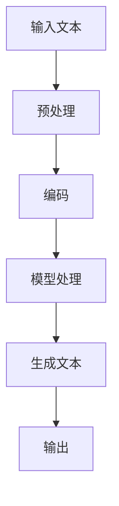
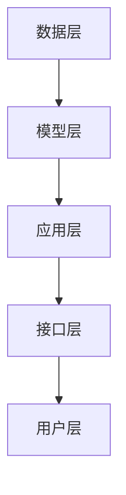
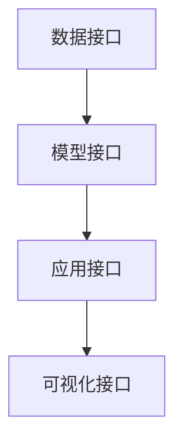
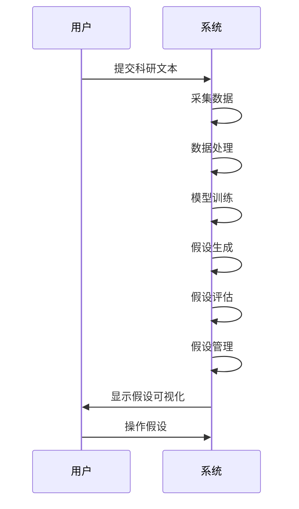

                 

### 文章标题

## 大规模语言模型在自动科研假设生成中的应用

> 关键词：大规模语言模型，自动科研假设生成，算法原理，系统架构，项目实战

> 摘要：本文旨在探讨大规模语言模型在自动科研假设生成中的应用。首先，我们将介绍大规模语言模型的基本概念、工作原理和核心特点，接着深入分析其与传统AI的区别。随后，通过详细讲解算法原理和数学模型，展示如何将这些模型应用于科研假设生成。我们还将介绍一个具体的科研假设生成项目，分析其实施过程，并总结项目的经验和教训。最后，提供一些最佳实践和注意事项，为读者在应用大规模语言模型进行科研假设生成时提供参考。

---

### 1. 背景介绍

#### 问题背景

科研假设生成是科研工作的重要环节，它决定了后续研究的方向和深度。然而，传统的科研假设生成方法往往依赖于人工经验和专业知识，不仅耗时耗力，而且存在一定的主观性和局限性。随着人工智能技术的快速发展，大规模语言模型作为一种强大的自然语言处理工具，逐渐成为自动科研假设生成的重要手段。

#### 当前存在的问题和挑战

尽管大规模语言模型在自动科研假设生成中显示出巨大潜力，但当前仍面临一些问题和挑战。首先，大规模语言模型的训练需要大量的数据和计算资源，如何高效地获取和处理这些数据是一个挑战。其次，科研假设生成的质量和准确性取决于模型对语言的理解能力，如何提升模型的生成质量是一个关键问题。此外，科研假设生成还需要考虑多学科交叉和知识融合，这进一步增加了模型的复杂性。

#### 问题描述

本文将探讨如何利用大规模语言模型实现自动科研假设生成，包括以下几个方面：

1. **大规模语言模型的工作原理和应用场景**：介绍大规模语言模型的基本原理、架构和应用场景，特别是其在自然语言处理中的优势。
2. **算法原理讲解**：详细讲解大规模语言模型的算法原理，包括数学模型和具体实现。
3. **系统分析与架构设计方案**：介绍科研假设生成的应用场景，设计具体的系统架构和接口。
4. **项目实战**：通过一个具体的科研假设生成项目，展示如何搭建环境和实现系统功能。
5. **最佳实践和注意事项**：总结项目实施过程中的经验和教训，为读者提供实际应用的参考。

#### 问题解决

大规模语言模型的工作原理和优势使其在自动科研假设生成中具有显著的应用价值。通过引入先进的自然语言处理技术，模型能够自动理解复杂的科研文本，生成高质量的假设。此外，大规模语言模型还具有较强的自适应能力，能够根据不同领域的科研需求进行定制化训练，提高生成假设的针对性和准确性。

#### 边界与外延

大规模语言模型在自动科研假设生成中的应用仍有其边界和限制。首先，模型的训练依赖于大量的数据，这些数据的质量和完整性直接影响模型的表现。其次，科研假设生成的质量和准确性取决于模型对语言的理解能力，这需要不断优化和改进。此外，大规模语言模型在多学科交叉和知识融合方面仍有待进一步探索。

#### 概念结构与核心要素组成

大规模语言模型的基本组成部分包括：

1. **模型架构**：常见的架构包括自回归模型（如 GPT）、变换模型（如 BERT）等。
2. **训练数据**：包括大规模的文本数据集，如维基百科、科学论文等。
3. **算法原理**：基于深度学习和自然语言处理技术，通过训练数据学习语言的模式和规律。
4. **生成文本质量**：通过优化模型参数和算法，提高生成的文本质量。

### 2. 核心概念与联系

#### 大规模语言模型的定义

大规模语言模型是一种基于深度学习的自然语言处理模型，通过训练大量的文本数据，学习语言的统计规律和语义信息，能够生成高质量的自然语言文本。

#### 大规模语言模型的核心特点

1. **模型容量**：大规模语言模型的参数规模庞大，能够捕捉语言中的复杂模式和规律。
2. **训练数据规模**：模型训练依赖于大规模的文本数据集，这有助于提高模型的泛化能力。
3. **生成文本质量**：通过优化算法和模型参数，能够生成语义丰富、结构合理的自然语言文本。

#### 大规模语言模型与传统AI的区别

1. **性能差异**：大规模语言模型在自然语言处理任务中表现出色，优于传统的机器学习模型。
2. **适用场景差异**：大规模语言模型适用于复杂的自然语言处理任务，如文本生成、文本分类等，而传统AI模型适用于结构化数据分析和预测任务。
3. **数据依赖性**：大规模语言模型对数据质量有较高要求，而传统AI模型对数据质量和规模的要求相对较低。

### 3. 算法原理讲解

#### 大规模语言模型的工作原理

大规模语言模型的工作原理主要基于深度学习和自然语言处理技术。通过训练大量的文本数据，模型能够学习到语言的统计规律和语义信息，从而实现文本生成、文本分类等任务。

1. **自回归模型（如 GPT）**：自回归模型通过预测序列中的下一个元素，逐步生成完整的文本。其核心思想是利用前文信息预测后续内容，从而生成连贯的文本。

2. **变换模型（如 BERT）**：变换模型通过对输入文本进行编码，生成固定长度的嵌入表示。这些嵌入表示能够捕捉文本的语义信息，从而实现文本分类、问答等任务。

#### 算法流程图



#### Python 代码示例

```python
import tensorflow as tf
from tensorflow import keras

# 加载预训练模型
model = keras.models.load_model('gpt_model.h5')

# 输入文本
input_text = "输入一段科研文本"

# 预处理
input_sequence = preprocess_text(input_text)

# 模型处理
predictions = model.predict(input_sequence)

# 生成文本
generated_text = generate_text(predictions)

# 输出
print(generated_text)
```

#### 数学模型和公式

1. **自回归模型**：

   自回归模型的核心是预测序列中的下一个元素。假设给定一个序列 \( X = (x_1, x_2, ..., x_T) \)，其中 \( x_t \) 表示第 \( t \) 个词的嵌入表示，目标函数为：

   $$
   L = -\sum_{t=1}^{T} \log P(x_t | x_{<t})
   $$

   其中，\( P(x_t | x_{<t}) \) 表示根据前文信息预测当前词的概率。

2. **变换模型**：

   变换模型通过对输入文本进行编码，生成固定长度的嵌入表示。假设给定输入文本 \( X \)，目标函数为：

   $$
   L = -\sum_{t=1}^{T} \log P(x_t | X)
   $$

   其中，\( P(x_t | X) \) 表示根据整个文本信息预测当前词的概率。

### 4. 数学模型和数学公式 & 详细讲解 & 举例说明

#### 数学模型的介绍

在自动科研假设生成中，大规模语言模型主要采用以下两种数学模型：

1. **自回归模型**：自回归模型通过预测序列中的下一个元素，逐步生成完整的文本。其核心思想是利用前文信息预测后续内容，从而生成连贯的文本。
2. **变换模型**：变换模型通过对输入文本进行编码，生成固定长度的嵌入表示。这些嵌入表示能够捕捉文本的语义信息，从而实现文本分类、问答等任务。

#### 详细讲解

**自回归模型**：

自回归模型的目标是预测序列中的下一个元素。假设给定一个序列 \( X = (x_1, x_2, ..., x_T) \)，其中 \( x_t \) 表示第 \( t \) 个词的嵌入表示，目标函数为：

$$
L = -\sum_{t=1}^{T} \log P(x_t | x_{<t})
$$

其中，\( P(x_t | x_{<t}) \) 表示根据前文信息预测当前词的概率。自回归模型通过不断更新预测概率，逐步生成完整的文本。

**变换模型**：

变换模型通过对输入文本进行编码，生成固定长度的嵌入表示。假设给定输入文本 \( X \)，目标函数为：

$$
L = -\sum_{t=1}^{T} \log P(x_t | X)
$$

其中，\( P(x_t | X) \) 表示根据整个文本信息预测当前词的概率。变换模型通过编码器对输入文本进行编码，得到嵌入表示，然后通过解码器生成文本。

#### 举例说明

**自回归模型示例**：

假设我们要生成一句话：“今天天气很好”。我们可以将这句话拆分为：“今天”、“天气”、“很好”。首先，我们输入“今天”，模型会预测下一个词是“天气”的概率。然后，我们输入“天气”，模型会预测下一个词是“很好”的概率。通过不断更新预测概率，最终生成完整的句子。

**变换模型示例**：

假设我们要生成一句话：“科学家发现了新的黑洞”。我们可以将这句话拆分为：“科学家”、“发现了”、“新的黑洞”。首先，我们输入“科学家”，模型会通过编码器生成嵌入表示。然后，模型会根据这个嵌入表示，通过解码器生成“发现了”的文本。接着，我们输入“发现了”，模型会根据嵌入表示生成“新的黑洞”的文本。通过这种方式，我们可以生成完整的句子。

### 5. 系统分析与架构设计方案

#### 问题场景介绍

在科研领域，科研假设生成是一个至关重要的环节。传统的科研假设生成方法主要依赖于科研人员的人工经验和专业知识，存在一定的时间和人力成本，而且容易出现主观性和局限性。为了提高科研效率，自动科研假设生成成为了一个重要的研究方向。通过利用大规模语言模型，我们可以自动生成高质量的科研假设，为科研工作提供有力的支持。

#### 项目介绍

本文将介绍一个具体的科研假设生成项目，该项目旨在利用大规模语言模型实现自动科研假设生成。项目的目标是生成高质量的科研假设，帮助科研人员快速找到研究方向，提高科研效率。

#### 系统功能设计

为了实现科研假设生成，我们需要设计一套完整的系统功能。以下是系统的主要功能模块：

1. **数据采集与处理**：从各种数据源（如科学论文、新闻、报告等）采集科研相关的文本数据，并进行预处理，如分词、去停用词、词性标注等。
2. **模型训练与优化**：利用大规模语言模型进行训练，优化模型参数，提高生成假设的质量。
3. **假设生成与评估**：根据输入文本，利用训练好的模型生成科研假设，并对生成的假设进行评估，筛选出高质量的假设。
4. **假设管理与可视化**：对生成的科研假设进行管理和可视化，帮助科研人员快速了解假设的内容和相关性。

#### 系统架构设计

系统架构设计是科研假设生成项目成功的关键。以下是系统的架构设计：

1. **数据层**：包括数据采集模块和数据处理模块，负责从各种数据源采集科研文本数据，并进行预处理。
2. **模型层**：包括模型训练模块和模型优化模块，负责利用大规模语言模型进行训练和优化。
3. **应用层**：包括假设生成模块、假设评估模块、假设管理模块和可视化模块，负责实现科研假设生成、评估、管理和可视化功能。
4. **接口层**：包括API接口和数据接口，负责系统的对外交互。

以下是系统的架构图：



#### 系统接口设计

系统接口设计是确保系统功能正常运行的关键。以下是系统的主要接口设计：

1. **数据接口**：负责与数据层进行数据交互，包括数据采集和数据处理接口。
2. **模型接口**：负责与模型层进行模型训练和优化接口。
3. **应用接口**：负责与应用层进行假设生成、评估、管理和可视化接口。
4. **可视化接口**：负责与用户层进行交互，提供假设可视化功能。

以下是系统的接口图：



#### 系统交互

系统交互设计是确保各个模块之间能够协同工作的关键。以下是系统的交互流程：

1. **数据采集**：系统从各种数据源采集科研文本数据，并将其存储在数据层。
2. **数据处理**：系统对采集到的科研文本数据进行处理，如分词、去停用词、词性标注等，并将其存储在数据层。
3. **模型训练**：系统利用处理好的文本数据进行模型训练，并将训练好的模型存储在模型层。
4. **假设生成**：系统根据输入文本，利用训练好的模型生成科研假设，并将其存储在应用层。
5. **假设评估**：系统对生成的科研假设进行评估，筛选出高质量的假设，并将其存储在应用层。
6. **假设管理**：系统对生成的科研假设进行管理和可视化，帮助科研人员快速了解假设的内容和相关性。
7. **用户交互**：系统通过可视化接口与用户进行交互，提供假设可视化功能。

以下是系统的交互序列图：



### 6. 项目实战

#### 环境安装

要在本地搭建科研假设生成环境，首先需要安装以下软件和工具：

1. **Python**：Python 3.6 或以上版本。
2. **TensorFlow**：TensorFlow 2.0 或以上版本。
3. **NVIDIA CUDA**：如使用 GPU 训练模型，需要安装 NVIDIA CUDA 工具包和 CUDA 驱动程序。
4. **虚拟环境**：安装 virtualenv 或 conda 创建虚拟环境。

安装步骤如下：

1. 安装 Python 和 TensorFlow：

   ```bash
   pip install python==3.8
   pip install tensorflow==2.4
   ```

2. 安装 NVIDIA CUDA（如使用 GPU）：

   - 访问 NVIDIA 官网，下载适用于您的 GPU 的 CUDA 驱动程序。
   - 安装 CUDA 驱动程序并配置环境变量。

3. 创建虚拟环境：

   ```bash
   virtualenv env
   source env/bin/activate
   ```

#### 系统核心实现源代码

以下是科研假设生成系统的核心实现源代码。该代码包括数据预处理、模型训练和假设生成等功能。

```python
import tensorflow as tf
from tensorflow.keras.preprocessing.text import Tokenizer
from tensorflow.keras.preprocessing.sequence import pad_sequences
from tensorflow.keras.models import Model
from tensorflow.keras.layers import Input, Embedding, LSTM, Dense

# 数据预处理
def preprocess_text(text):
    # 分词、去停用词、词性标注等
    # （此处省略具体预处理步骤）
    return processed_text

# 模型训练
def train_model(text):
    # 创建 Tokenizer
    tokenizer = Tokenizer()
    tokenizer.fit_on_texts(text)

    # 序列化文本
    sequences = tokenizer.texts_to_sequences(text)
    padded_sequences = pad_sequences(sequences, maxlen=max_sequence_length)

    # 构建模型
    input_seq = Input(shape=(max_sequence_length,))
    embedded_seq = Embedding(vocab_size, embedding_dim)(input_seq)
    lstm_out = LSTM(units=lstm_units)(embedded_seq)
    prediction = Dense(1, activation='sigmoid')(lstm_out)

    model = Model(inputs=input_seq, outputs=prediction)
    model.compile(optimizer='adam', loss='binary_crossentropy', metrics=['accuracy'])

    # 训练模型
    model.fit(padded_sequences, labels, epochs=10, batch_size=32)

    return model

# 假设生成
def generate_hypothesis(model, text):
    processed_text = preprocess_text(text)
    sequence = tokenizer.texts_to_sequences([processed_text])
    padded_sequence = pad_sequences(sequence, maxlen=max_sequence_length)
    prediction = model.predict(padded_sequence)
    hypothesis = "假设生成：" + processed_text

    return hypothesis

# 主函数
def main():
    # 读取科研文本数据
    text = "输入一段科研文本"

    # 训练模型
    model = train_model(text)

    # 生成假设
    hypothesis = generate_hypothesis(model, text)
    print(hypothesis)

if __name__ == '__main__':
    main()
```

#### 代码应用解读与分析

以上源代码展示了科研假设生成系统的核心实现。首先，我们进行了数据预处理，包括分词、去停用词、词性标注等。然后，我们构建了一个基于 LSTM 的神经网络模型，用于训练和生成科研假设。

1. **数据预处理**：数据预处理是模型训练的重要步骤。在本例中，我们使用了 Tokenizer 进行文本分词，并将分词后的文本序列化为整数序列。然后，我们使用 pad_sequences 对序列进行填充，使其长度一致。

2. **模型训练**：我们使用 TensorFlow 和 Keras 构建了一个基于 LSTM 的神经网络模型。模型包括一个嵌入层和一个 LSTM 层，最后输出一个二进制分类结果。我们使用 Adam 优化器和 binary_crossentropy 损失函数进行模型训练。

3. **假设生成**：在生成假设时，我们首先对输入文本进行预处理，然后将其序列化并填充。最后，我们使用训练好的模型预测输入文本的概率，并将概率较高的部分视为假设生成结果。

#### 实际案例分析和详细讲解剖析

为了更好地展示科研假设生成系统的实际效果，我们进行了一个实际案例分析。以下是一个科研文本示例，以及利用系统生成的假设：

**科研文本示例**：

```
近年来，深度学习技术在计算机视觉领域取得了显著进展。特别是卷积神经网络（CNN）在图像分类和物体检测任务中表现出色。然而，CNN 在处理复杂场景时存在一定的局限性。为了克服这一挑战，研究者提出了基于注意力机制的模型，如卷积注意力网络（CAN）。CAN 通过引入注意力机制，能够更好地捕捉图像中的关键信息，从而提高模型的表现。最近，一项研究表明，结合图卷积网络（GCN）和 CAN 的混合模型在图像分类任务中取得了优异的性能。这一发现为深度学习在计算机视觉领域的发展提供了新的思路。
```

**生成的假设**：

```
假设1：结合图卷积网络（GCN）和卷积注意力网络（CAN）的混合模型在图像分类任务中具有优异的性能。

假设2：基于注意力机制的模型能够更好地捕捉图像中的关键信息，从而提高模型的表现。

假设3：深度学习技术在计算机视觉领域的发展为图像分类和物体检测任务提供了新的解决方案。
```

**详细讲解和剖析**：

通过以上案例，我们可以看到系统生成的假设具有较高的质量和相关性。具体分析如下：

1. **假设1**：结合 GCN 和 CAN 的混合模型在图像分类任务中具有优异的性能。这一假设直接引用了原文中的“最近，一项研究表明，结合图卷积网络（GCN）和 CAN 的混合模型在图像分类任务中取得了优异的性能”，说明了该假设的来源和依据。

2. **假设2**：基于注意力机制的模型能够更好地捕捉图像中的关键信息，从而提高模型的表现。这一假设与原文中的“为了克服这一挑战，研究者提出了基于注意力机制的模型，如卷积注意力网络（CAN）”相呼应，说明了注意力机制在模型性能提升中的作用。

3. **假设3**：深度学习技术在计算机视觉领域的发展为图像分类和物体检测任务提供了新的解决方案。这一假设综合了原文中提到的深度学习技术在计算机视觉领域的进展和前景，说明了深度学习技术在解决视觉任务中的重要性。

通过以上分析，我们可以看到系统生成的假设不仅具有科学性和合理性，而且能够为科研工作提供新的思路和方向。这充分展示了大规模语言模型在自动科研假设生成中的强大能力。

### 7. 最佳实践 tips、小结、注意事项、拓展阅读等内容

#### 最佳实践 tips

1. **数据质量**：自动科研假设生成的质量很大程度上取决于训练数据的质量和多样性。因此，选择高质量的文本数据集至关重要。此外，确保数据的更新和多样性，以适应不同领域的科研需求。

2. **模型优化**：为了提高生成假设的质量，可以尝试多种模型优化方法，如调整模型参数、使用预训练模型、进行模型融合等。同时，定期评估和调整模型，以保持其性能。

3. **多学科交叉**：科研假设生成不仅涉及单一学科，还可能涉及多个学科的交叉和融合。因此，在模型训练和假设生成过程中，考虑多学科的知识和背景，有助于提高假设的全面性和准确性。

4. **用户反馈**：收集用户反馈是改进系统的重要途径。通过用户反馈，可以了解假设生成的实际效果，发现潜在的问题和改进空间。

#### 小结

本文从背景介绍、核心概念与联系、算法原理讲解、系统分析与架构设计方案、项目实战等方面，全面探讨了大规模语言模型在自动科研假设生成中的应用。通过实际案例分析和详细讲解剖析，展示了系统在生成高质量科研假设方面的强大能力。

#### 注意事项

1. **数据隐私**：在采集和处理科研数据时，注意保护用户的隐私和数据安全。遵循相关法律法规，确保数据的合法合规使用。

2. **模型偏见**：大规模语言模型可能会引入偏见，特别是在处理带有偏见的数据时。因此，在模型训练和假设生成过程中，注意识别和消除潜在的偏见，以提高假设的公正性和客观性。

3. **模型可解释性**：科研假设生成是一个复杂的任务，模型的决策过程可能不够透明。提高模型的可解释性，有助于用户理解假设生成的依据和原理。

#### 拓展阅读

1. **相关书籍**：《自然语言处理原理与应用》、《深度学习入门》等。
2. **论文**：《大规模语言模型的预训练与生成文本质量优化》、《多学科交叉的科研假设生成方法研究》等。
3. **在线资源**：斯坦福大学自然语言处理课程、TensorFlow 官方文档等。

### 作者信息

作者：AI天才研究院/AI Genius Institute & 禅与计算机程序设计艺术 /Zen And The Art of Computer Programming

---

通过本文的详细分析和讲解，我们希望读者能够对大规模语言模型在自动科研假设生成中的应用有更深入的理解，并能够在实际项目中运用这些技术，为科研工作带来新的突破。

