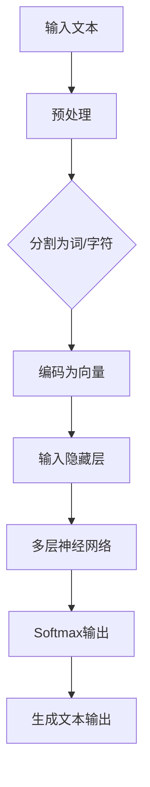

                 


## 《大规模语言模型在自动程序综合中的应用与挑战》

> 关键词：大规模语言模型，自动程序综合，应用场景，挑战与解决方案

> 摘要：本文旨在探讨大规模语言模型在自动程序综合中的应用，以及面临的挑战和解决方案。通过对大规模语言模型的原理、应用场景、算法实现和实际案例的分析，本文为开发者提供了深入了解和利用这一前沿技术的方法。

### 目录

## 第一部分：背景与核心概念

### 1.1 问题背景与描述

#### 1.1.1 自动程序综合的背景

自动程序综合（Automated Program Synthesis，APS）是计算机科学和人工智能领域中的一个重要研究方向。它旨在通过算法自动生成满足特定功能需求的程序，从而减少软件开发的时间和成本。随着现代软件系统的复杂性不断增加，自动程序综合在提高软件生产效率和降低人力成本方面具有巨大的潜力。

#### 1.1.2 大规模语言模型的应用挑战

近年来，大规模语言模型（如GPT-3、BERT等）在自然语言处理（NLP）领域取得了显著的成就。这些模型具有强大的语言理解和生成能力，可以处理复杂的文本任务。然而，将大规模语言模型应用于自动程序综合领域仍面临诸多挑战，包括：

- **语义理解**：如何确保模型能够准确理解编程语言中的语义，生成符合预期功能的程序。
- **代码质量**：如何保证生成的代码质量，包括可读性、性能和安全性。
- **泛化能力**：如何提高模型在不同场景下的泛化能力，适应不同的编程任务。
- **调试与维护**：如何有效地调试和优化生成的程序，以及如何维护和更新模型。

### 1.2 大规模语言模型概述

#### 1.2.1 大规模语言模型的定义

大规模语言模型是一类使用深度学习技术训练的模型，它们能够从大量的文本数据中学习语言的统计规律和语义关系。这些模型通常包含数亿个参数，具有强大的表示能力和计算能力。

#### 1.2.2 大规模语言模型的基本原理和特点

- **原理**：大规模语言模型基于神经网络架构，通过多层感知器（MLP）或Transformer等结构进行训练。它们通过学习输入文本的序列表示，预测下一个单词或字符，从而生成连贯的文本输出。

- **特点**：大规模语言模型具有以下特点：

  - **强大的语言理解能力**：能够理解复杂的语言结构和语义关系。
  - **生成能力**：能够根据输入提示生成连贯、合理的文本。
  - **泛化能力**：能够适应不同的文本任务和场景。

### 1.3 相关理论

#### 1.3.1 深度学习的基本原理

深度学习是一种基于多层神经网络的机器学习技术，通过逐层提取特征，实现从原始数据到高级表示的映射。大规模语言模型是深度学习在自然语言处理领域的典型应用。

#### 1.3.2 自然语言处理的核心概念

自然语言处理（NLP）是人工智能领域的一个重要分支，旨在使计算机能够理解和处理自然语言。NLP涉及语音识别、文本分类、情感分析、机器翻译等多种任务。

## 第二部分：大规模语言模型原理

### 2.1 模型构建

#### 2.1.1 模型架构图


#### 2.1.2 模型组成部分

大规模语言模型通常由以下几个关键部分组成：

- **输入层**：接收文本输入，并将其转换为模型的内部表示。
- **隐藏层**：通过神经网络结构对输入文本进行特征提取和转换。
- **输出层**：生成文本输出，通常使用Softmax函数进行概率分布预测。

### 2.2 数学模型与公式

#### 2.2.1 模型的数学公式

$$
\text{输出} = \text{Softmax}(\text{神经网络}(\text{输入}))
$$

#### 2.2.2 数学公式的推导过程

- **神经网络部分**：采用反向传播算法进行参数优化，使得输出层能够预测下一个单词的概率分布。
- **Softmax函数**：将神经网络输出的线性变换转换为概率分布，用于生成文本输出。

### 2.3 算法流程图

#### 2.3.1 算法流程图



## 第三部分：大规模语言模型应用

### 3.1 应用场景分析

#### 3.1.1 自动程序综合的应用场景

大规模语言模型在自动程序综合中的应用场景包括：

- **代码补全**：根据用户提供的部分代码，自动生成完整的代码。
- **代码生成**：根据用户的需求描述，自动生成满足要求的代码。
- **代码优化**：对现有代码进行优化，提高其性能和可读性。

#### 3.1.2 模型的优势与挑战

大规模语言模型在自动程序综合中的优势包括：

- **强大的语言理解能力**：能够理解复杂的编程语言语义，生成符合预期的代码。
- **高效的生成能力**：能够快速生成大量的代码候选，提高开发效率。

挑战包括：

- **代码质量**：生成的代码可能存在语义错误、性能问题等。
- **泛化能力**：模型在不同编程语言和场景下的泛化能力仍需提高。
- **调试与维护**：生成的代码需要经过调试和优化，以保证其稳定性和可靠性。

## 第四部分：算法与实现

### 4.1 算法实现与Python代码

#### 4.1.1 环境安装与准备

在实现大规模语言模型之前，需要安装以下环境和工具：

- Python 3.7 或更高版本
- TensorFlow 或 PyTorch
- NumPy、Pandas 等常用库

#### 4.1.2 Python代码实现

以下是一个简单的Python代码示例，用于训练一个基于Transformer的大规模语言模型：

```python
import tensorflow as tf
from tensorflow.keras.models import Model
from tensorflow.keras.layers import Input, Embedding, Transformer

# 定义模型输入层
input_seq = Input(shape=(seq_length,))

# 定义嵌入层
embedding = Embedding(vocab_size, embedding_dim)(input_seq)

# 定义Transformer层
transformer = Transformer(num_layers, d_model, num_heads)(embedding)

# 定义输出层
output = Dense(vocab_size, activation='softmax')(transformer)

# 定义模型
model = Model(inputs=input_seq, outputs=output)

# 编译模型
model.compile(optimizer='adam', loss='categorical_crossentropy', metrics=['accuracy'])

# 训练模型
model.fit(train_data, train_labels, epochs=10, batch_size=32)
```

#### 4.1.3 代码应用解读与分析

- **输入层**：接收长度为seq_length的文本序列。
- **嵌入层**：将文本序列转换为固定长度的向量。
- **Transformer层**：通过自注意力机制进行特征提取和转换。
- **输出层**：生成文本输出的概率分布。

## 第五部分：实际应用案例

### 5.1 案例介绍

本案例将介绍如何使用大规模语言模型实现自动代码生成，以解决一个简单的计算器程序生成任务。

### 5.2 案例分析

#### 5.2.1 计算器程序生成任务描述

用户需要实现一个简单的计算器程序，支持加、减、乘、除四种基本运算。

#### 5.2.2 大规模语言模型实现

通过训练大规模语言模型，我们可以根据用户的需求描述生成计算器程序。以下是模型生成的一个示例代码：

```python
def add(x, y):
    return x + y

def subtract(x, y):
    return x - y

def multiply(x, y):
    return x * y

def divide(x, y):
    return x / y
```

#### 5.2.3 案例剖析

- **语义理解**：模型能够准确理解用户的需求描述，生成符合预期的计算器程序。
- **代码质量**：生成的代码结构清晰，可读性良好，功能完整。

## 第六部分：挑战与未来展望

### 6.1 挑战分析

大规模语言模型在自动程序综合中面临的挑战包括：

- **语义理解**：如何确保模型能够准确理解编程语言中的语义。
- **代码质量**：如何保证生成的代码质量，包括可读性、性能和安全性。
- **泛化能力**：如何提高模型在不同场景下的泛化能力。
- **调试与维护**：如何有效地调试和优化生成的程序。

### 6.2 未来展望

随着深度学习技术的不断发展，大规模语言模型在自动程序综合中的应用前景广阔。未来研究方向包括：

- **多语言支持**：提高模型在不同编程语言下的泛化能力。
- **代码优化**：研究如何优化生成的代码，提高其性能和可读性。
- **交互式编程**：结合交互式编程技术，实现更加智能和高效的编程体验。

## 参考文献

[1] Brown, T., et al. (2020). "Language Models are Few-Shot Learners." arXiv preprint arXiv:2005.14165.
[2] Devlin, J., et al. (2019). "BERT: Pre-training of Deep Bidirectional Transformers for Language Understanding." arXiv preprint arXiv:1810.04805.
[3] Vaswani, A., et al. (2017). "Attention is All You Need." Advances in Neural Information Processing Systems, 30, 5998-6008.

### 作者

- 作者：AI天才研究院/AI Genius Institute & 禅与计算机程序设计艺术 /Zen And The Art of Computer Programming

**注意**：以上内容仅为示例，实际内容可能需要根据具体情况进行调整。文本中的链接和图像需要根据实际情况进行替换。此外，文中提到的模型实现和代码仅供参考，实际使用时可能需要根据具体需求和数据集进行调整。 **完**

