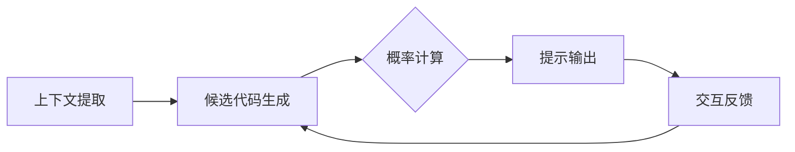
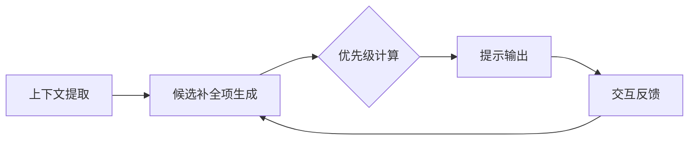

                 

**# 大规模语言模型在自动编程辅助中的智能提示应用**

> **关键词**：大规模语言模型、自动编程辅助、智能提示、代码补全、编程语言识别

> **摘要**：本文探讨了大规模语言模型在自动编程辅助中的应用，特别是智能提示。文章首先介绍了大规模语言模型的基础知识，然后详细讨论了智能提示机制，以及大规模语言模型在编程语言识别、代码补全和代码修复中的应用。最后，对未来的发展趋势进行了展望。

----------------------------------------------------------------

## 第1章：背景与概述

### 1.1 问题背景

自动编程辅助是计算机科学领域的一个热点研究方向。在传统的编程模式中，程序员需要手动编写代码，这不仅耗时，而且容易出错。随着软件项目的复杂度不断增加，对编程效率的要求也越来越高。自动编程辅助技术的出现，旨在通过智能化手段提高编程效率，减少人为错误。

智能提示作为自动编程辅助的一个重要组成部分，可以提供实时代码建议，帮助程序员快速找到解决方案。然而，传统的智能提示技术往往依赖于规则和模式匹配，无法充分理解代码的语义和上下文信息。这就需要引入更加智能的大规模语言模型。

### 1.2 大规模语言模型的发展

大规模语言模型的发展可以追溯到自然语言处理（NLP）领域的进展。早期的语言模型如N-gram模型和基于统计的模型，虽然能够在一定程度上模拟语言规律，但在处理长文本和复杂语义时存在局限性。

随着深度学习的兴起，基于神经网络的模型逐渐成为主流。特别是2018年GPT（Generative Pre-trained Transformer）的提出，标志着大规模语言模型进入了一个新的时代。GPT模型通过预训练的方式，学习了大量的文本数据，从而具备了强大的语言理解和生成能力。

### 1.3 大规模语言模型在自动编程辅助中的应用

大规模语言模型在自动编程辅助中的应用主要集中在以下几个方面：

1. **编程语言识别**：利用语言模型识别编程语言的语法和结构，为代码补全和修复提供基础。

2. **代码补全**：在程序员编写代码时，提供实时的代码建议，帮助程序员更快地完成编码任务。

3. **代码修复**：自动检测代码中的错误，并提供修复建议，提高代码质量。

4. **代码生成**：基于已有的代码片段和语言模型，生成新的代码实现，为程序员提供参考。

### 1.4 文章结构

本文结构如下：

1. **第1章**：引言，介绍自动编程辅助和大规模语言模型的背景。

2. **第2章**：大规模语言模型基础，介绍语言模型的定义、训练和应用。

3. **第3章**：自动编程辅助中的智能提示机制，讨论智能提示的基本概念和算法实现。

4. **第4章**：大规模语言模型在编程语言识别中的应用，分析编程语言的特点和识别挑战。

5. **第5章**：大规模语言模型在代码补全中的应用，详细讲解代码补全算法的实现和效果评估。

6. **第6章**：大规模语言模型在代码修复中的应用，探讨代码修复的基本概念和实现方法。

7. **第7章**：大规模语言模型在自动编程辅助中的未来发展趋势，展望技术的发展方向。

8. **第8章**：结论与展望，总结主要研究成果和未来研究方向。

----------------------------------------------------------------

## 第2章：大规模语言模型基础

### 2.1 语言模型的定义与特点

语言模型（Language Model，LM）是自然语言处理领域中的一个核心概念。它是一种统计模型，用于预测一个文本序列的概率。在自动编程辅助中，语言模型可以帮助计算机理解程序代码的语义和上下文，从而提供智能提示和代码生成等功能。

语言模型具有以下特点：

1. **预测性**：语言模型能够预测下一个单词或字符的出现概率，从而生成文本。
2. **统计性**：语言模型基于大量文本数据训练而成，通过统计方法学习语言规律。
3. **上下文敏感性**：语言模型能够根据上下文信息调整预测概率，更好地理解语义。

### 2.2 语言模型的分类

语言模型主要可以分为以下几类：

1. **N-gram模型**：基于历史N个单词的统计模型，例如三元模型（Trigram Model）。
2. **基于概率的模型**：如最大熵模型（Maximum Entropy Model）和朴素贝叶斯模型（Naive Bayes Model）。
3. **基于神经网络的模型**：如循环神经网络（RNN）和变换器模型（Transformer）。

### 2.3 语言模型的训练

语言模型的训练过程主要包括以下几个步骤：

1. **数据集准备**：收集大量的文本数据，进行预处理，如分词、去噪等。
2. **特征提取**：将文本数据转化为向量表示，如词向量（Word Vector）或字符向量（Character Vector）。
3. **模型训练**：使用优化算法（如梯度下降）训练模型，调整模型参数，使其能够更好地预测文本概率。

### 2.4 语言模型的应用

语言模型在自然语言处理领域有广泛的应用，如文本生成、文本分类、机器翻译等。在自动编程辅助中，语言模型的应用主要包括：

1. **代码生成**：基于已有的代码片段和语言模型，生成新的代码实现。
2. **代码补全**：在程序员编写代码时，提供实时的代码建议，帮助程序员更快地完成编码任务。
3. **代码修复**：自动检测代码中的错误，并提供修复建议，提高代码质量。

### 2.5 语言模型评估

语言模型的评估通常包括以下几个方面：

1. **准确性**：评估模型预测文本概率的准确性。
2. **流畅性**：评估模型生成的文本是否流畅自然。
3. **多样性**：评估模型生成的文本是否具有多样性。

评估方法包括：

1. **交叉验证**：将数据集划分为训练集和测试集，训练模型并在测试集上进行评估。
2. **错误分析**：分析模型在预测过程中的错误类型和原因。

### 2.6 核心概念与联系

以下是一个关于大规模语言模型的核心概念对比表格：

| 概念         | 定义                                       | 属性特征对比           |
|------------|------------------------------------------|----------------------|
| N-gram模型    | 基于历史N个单词的统计模型                | 预测范围有限           |
| 变换器模型    | 基于注意力机制的深度神经网络模型          | 预测范围广、上下文敏感性强 |
| 循环神经网络   | 具有循环记忆功能的神经网络模型           | 适用于序列数据处理       |

此外，以下是大规模语言模型的ER实体关系图：

```mermaid
erDiagram
    Class1 ||--|{ Class2 }|
    Class1 ||--|{ Class3 }|
    Class2 ||--|{ Class4 }|
```

在下一章中，我们将深入探讨自动编程辅助中的智能提示机制，分析其基本概念和算法实现。

----------------------------------------------------------------

## 第3章：自动编程辅助中的智能提示机制

### 3.1 智能提示的基本概念

智能提示（Intelligent Suggestion）是自动编程辅助的一个重要组成部分，它通过分析程序代码的上下文信息，提供实时的代码建议，帮助程序员更快、更准确地完成编码任务。智能提示可以涵盖多种形式，如代码补全、语法建议、函数和方法提示等。

智能提示的基本概念包括：

1. **上下文分析**：智能提示系统需要能够理解程序代码的上下文，包括变量、函数、类等元素的上下文信息。
2. **概率预测**：基于上下文分析，智能提示系统需要预测程序员可能需要插入的代码片段，并计算每个可能代码片段的概率。
3. **交互反馈**：智能提示系统需要与程序员进行交互，根据程序员的反馈调整建议，提高提示的准确性和实用性。

### 3.2 智能提示的算法实现

智能提示的算法实现主要包括以下几个关键步骤：

1. **上下文提取**：通过解析程序代码，提取出关键上下文信息，如变量名、函数名、类名等。
2. **候选代码生成**：根据上下文信息，生成一系列可能的代码片段。这可以通过模板匹配、语法分析等方法实现。
3. **概率计算**：对每个候选代码片段进行概率计算，选择概率最高的代码片段作为提示。
4. **实时交互**：与程序员进行交互，根据程序员的反馈调整提示内容。

下面是一个简化的智能提示算法流程图：



### 3.3 智能提示的效果评估

智能提示的效果评估是确保其有效性和实用性的重要环节。评估方法主要包括：

1. **准确率**：评估智能提示系统提供代码建议的正确率。
2. **覆盖率**：评估智能提示系统能够覆盖的代码上下文范围。
3. **用户体验**：通过用户调研和反馈，评估智能提示系统的易用性和实用性。

具体评估指标可以包括：

- **建议准确率**：智能提示系统提供的代码建议与实际需要插入的代码匹配程度。
- **响应时间**：智能提示系统生成代码建议所需的时间。
- **用户满意度**：用户对智能提示系统的满意度评分。

下面是一个关于智能提示效果评估的ER实体关系图：

```mermaid
erDiagram
    Evaluation ||--|{ Suggestion }|
    Evaluation ||--|{ User }|
```

在下一章中，我们将探讨大规模语言模型在编程语言识别中的应用，分析其实现方法和面临的挑战。

----------------------------------------------------------------

## 第4章：大规模语言模型在编程语言识别中的应用

### 4.1 编程语言的特点

编程语言是一种用于编写计算机程序的形式语言。不同编程语言具有不同的语法和语义特点，但它们通常都包含以下基本要素：

1. **语法**：编程语言的语法规则定义了程序的结构，包括关键字、标识符、操作符等。
2. **语义**：编程语言的语义描述了程序的行为，即程序执行时的效果。
3. **类型系统**：编程语言的类型系统定义了变量和表达式的类型，以及类型之间的关系和转换。
4. **语法糖**：一些编程语言提供了语法糖，使代码更加简洁和易读。

不同编程语言在语法、语义和类型系统方面存在显著差异。例如，Python是一种动态类型的解释型语言，而C++是一种静态类型的编译型语言。这些差异使得编程语言识别成为一项具有挑战性的任务。

### 4.2 语言模型在编程语言识别中的实现

大规模语言模型在编程语言识别中的应用主要依赖于其强大的文本生成和语义理解能力。具体实现步骤如下：

1. **数据集构建**：收集大量不同编程语言的代码数据，进行预处理，如分词、去噪等，构建适合训练的语言模型的数据集。

2. **模型训练**：使用预训练的语言模型，如GPT或BERT，对编程语言数据集进行训练。训练过程中，模型会学习到不同编程语言的语法和语义特征。

3. **模型优化**：通过特定任务的数据进行微调（Fine-tuning），优化模型在编程语言识别任务上的性能。例如，可以引入代码注释、文档等辅助数据，提高模型对编程语言的理解能力。

4. **语言识别**：将训练好的语言模型应用于新的代码片段，通过文本生成和语义分析，识别代码片段所使用的编程语言。

### 4.3 编程语言识别的挑战与解决方案

编程语言识别面临着以下挑战：

1. **语言多样性**：存在大量的编程语言，每种语言都有其独特的语法和语义特征，导致模型需要学习大量不同的语言模式。

2. **语言变化性**：编程语言不断进化，新语法和新特性不断出现，使得模型需要不断更新和学习。

3. **代码质量**：实际代码中可能包含错误、混淆或非标准代码，这些因素都会影响模型对编程语言的识别准确性。

针对这些挑战，以下是一些解决方案：

1. **多语言训练**：通过收集多种编程语言的数据集进行训练，使模型具备识别多种编程语言的能力。

2. **持续学习**：定期更新模型，使其能够适应新的编程语言变化。

3. **代码预处理**：在模型训练和识别过程中，对代码进行预处理，如去除注释、格式化代码等，提高模型的识别准确性。

在下一章中，我们将探讨大规模语言模型在代码补全中的应用，分析其实现方法和效果评估。

----------------------------------------------------------------

## 第5章：大规模语言模型在代码补全中的应用

### 5.1 代码补全的基本概念

代码补全（Code Completion）是编程辅助工具的一项重要功能，旨在提高编程效率，减少手动输入的错误和耗时。代码补全通过分析程序代码的上下文信息，自动推断程序员可能需要的内容，并为其提供提示。

代码补全的基本概念包括：

1. **上下文分析**：代码补全系统需要能够理解程序代码的上下文，包括变量、函数、类等元素的上下文信息。
2. **候选补全项生成**：基于上下文分析，代码补全系统需要生成一系列可能的补全项。
3. **优先级排序**：对候选补全项进行优先级排序，选择最有可能的补全项作为提示。
4. **实时交互**：与程序员进行交互，根据程序员的反馈调整补全提示。

### 5.2 代码补全算法的实现

代码补全算法的实现主要包括以下几个步骤：

1. **上下文提取**：解析程序代码，提取关键上下文信息，如变量名、函数名、类名等。

2. **候选补全项生成**：根据上下文信息，生成一系列可能的补全项。这可以通过模板匹配、语法分析、静态分析等方法实现。

3. **优先级计算**：对每个候选补全项进行概率计算，选择概率最高的补全项作为提示。

4. **实时交互**：与程序员进行交互，根据程序员的反馈调整补全提示。

下面是一个简化的代码补全算法流程图：



### 5.3 大规模语言模型在代码补全中的应用

大规模语言模型在代码补全中的应用具有显著优势，主要体现在以下几个方面：

1. **强大的上下文理解能力**：大规模语言模型通过预训练，学习了大量文本数据，具备强大的上下文理解能力，能够更好地捕捉程序代码的语义和结构。

2. **自适应性和灵活性**：大规模语言模型可以根据不同的编程语言和开发环境进行自适应调整，提供更加准确和实用的代码补全提示。

3. **代码生成能力**：大规模语言模型不仅能够提供代码补全提示，还可以根据上下文信息生成新的代码实现，为程序员提供更多参考。

### 5.4 代码补全效果评估

代码补全效果评估是确保其有效性和实用性的重要环节。评估方法主要包括以下几个方面：

1. **补全准确率**：评估代码补全系统提供的补全项与实际需要补全的内容匹配程度。

2. **响应时间**：评估代码补全系统生成补全提示所需的时间，确保其响应速度足够快。

3. **用户满意度**：通过用户调研和反馈，评估代码补全系统的易用性和实用性。

具体评估指标可以包括：

- **补全准确率**：补全系统提供的正确补全项占总补全项的比例。
- **响应时间**：系统生成补全提示的平均时间。
- **用户满意度**：用户对补全系统的满意度评分。

下面是一个关于代码补全效果评估的ER实体关系图：

```mermaid
erDiagram
    Evaluation ||--|{ Completion }|
    Evaluation ||--|{ User }|
```

在下一章中，我们将探讨大规模语言模型在代码修复中的应用，分析其实现方法和效果评估。

----------------------------------------------------------------

## 第6章：大规模语言模型在代码修复中的应用

### 6.1 代码修复的基本概念

代码修复（Code Repair）是指自动检测并修正程序代码中的错误，以提高代码质量和可维护性。在软件开发过程中，代码修复是一项至关重要的任务，它有助于减少代码缺陷、提高程序性能和降低维护成本。

代码修复的基本概念包括：

1. **错误检测**：通过静态分析、动态分析等方法，检测代码中的潜在错误和缺陷。
2. **错误修复**：根据检测到的错误，自动生成修复建议或直接修正错误。
3. **效果评估**：评估代码修复的效果，包括修复率、修复质量和用户体验。

### 6.2 代码修复算法的实现

大规模语言模型在代码修复中的应用主要包括以下几个关键步骤：

1. **错误检测**：利用大规模语言模型对代码进行语法和语义分析，识别潜在的错误和缺陷。这可以通过训练专门的错误检测模型实现。

2. **错误定位**：在错误检测的基础上，进一步定位错误的来源和具体位置。

3. **错误修复**：根据错误的类型和位置，生成相应的修复建议。这可以通过预定义的修复规则和大规模语言模型生成的修复方案实现。

4. **效果评估**：评估修复建议的有效性，包括修复的正确性、效率和用户体验。

下面是一个简化的代码修复算法流程图：


### 6.3 代码修复效果评估

代码修复效果评估是确保修复工具有效性和实用性的关键。以下是一些常用的评估指标：

1. **修复率**：修复工具能够成功修复的错误数与总错误数的比例。
2. **修复质量**：修复后的代码质量，包括语法正确性、语义一致性和可维护性。
3. **用户体验**：修复工具的易用性和用户满意度。

具体评估方法包括：

1. **自动化测试**：使用自动化测试工具对修复后的代码进行测试，验证修复的正确性和效果。
2. **人工审核**：由专业开发者对修复后的代码进行审核，评估修复质量。
3. **用户调研**：通过用户反馈和调研，了解修复工具的易用性和用户满意度。

### 6.4 实际案例分析

以下是一个代码修复的实际案例：

```python
# 错误代码
def add(a, b):
    return a + b

# 调用错误的代码
result = add(5, '10')  # 这里应该是整数类型

# 修复建议
result = add(5, 10)  # 将字符串转换为整数
```

在这个案例中，代码修复工具通过类型检查发现`add`函数的第二个参数应为整数类型，而实际传入的是字符串。修复工具提供了将字符串转换为整数的建议，并修正了调用代码。

在下一章中，我们将探讨大规模语言模型在自动编程辅助中的未来发展趋势。

----------------------------------------------------------------

## 第7章：大规模语言模型在自动编程辅助中的未来发展趋势

### 7.1 技术发展趋势

大规模语言模型在自动编程辅助中的应用正处于快速发展阶段。未来，随着技术的不断进步，以下几个趋势值得关注：

1. **模型规模与性能的提升**：随着计算资源和数据量的增加，大规模语言模型将变得越来越庞大和复杂。例如，GPT-3模型的参数已经达到了亿级别。未来，我们将看到更大规模、更高性能的语言模型出现。

2. **多模态数据的融合**：传统编程主要依赖于文本数据，但随着多模态技术的发展，图像、音频等非文本数据也将被引入编程领域。大规模语言模型可以通过融合多模态数据，提供更加丰富和精准的编程辅助功能。

3. **面向特定场景的定制模型**：针对不同的编程任务和开发场景，如Web开发、移动应用开发、数据科学等，可以开发定制化的语言模型，提供更加专业的编程辅助功能。

4. **模型的可解释性和透明性**：随着大规模语言模型的广泛应用，其决策过程的可解释性和透明性将越来越重要。通过研究模型内部的决策机制，可以提高模型的可信度和用户对模型的接受度。

### 7.2 应用前景

大规模语言模型在自动编程辅助中的应用前景广阔，以下是一些可能的应用场景：

1. **智能编程助手**：大规模语言模型可以充当智能编程助手，提供实时代码补全、语法检查、代码修复等功能，大大提高编程效率。

2. **代码生成与重构**：利用大规模语言模型，可以自动生成新的代码实现，为开发者提供参考。同时，还可以对现有代码进行重构，优化代码结构，提高代码质量。

3. **代码审查与安全分析**：大规模语言模型可以分析代码的安全性，识别潜在的安全漏洞，提供修复建议。

4. **教育辅助**：大规模语言模型可以作为教育工具，为初学者提供代码示例、解题思路和编程指导，降低编程学习的门槛。

5. **自动化测试与调试**：大规模语言模型可以帮助开发者自动生成测试用例，提高测试覆盖率。同时，还可以分析调试信息，提供定位问题和解决问题的建议。

### 7.3 挑战与应对策略

尽管大规模语言模型在自动编程辅助中具有巨大的潜力，但也面临一些挑战：

1. **数据隐私与安全**：大规模语言模型需要处理大量的敏感代码数据，需要采取有效的隐私保护和安全措施，防止数据泄露和滥用。

2. **模型解释性**：大规模语言模型的决策过程往往是不透明的，需要研究如何提高模型的可解释性，使开发者能够理解和信任模型。

3. **泛化能力**：大规模语言模型在特定领域可能表现出色，但在其他领域可能效果不佳。需要研究如何提高模型的泛化能力，使其能够适应更多不同的编程场景。

4. **资源消耗**：大规模语言模型对计算资源和存储资源的需求巨大，需要研究如何优化模型结构和训练算法，降低资源消耗。

针对这些挑战，可以采取以下应对策略：

1. **隐私保护技术**：采用差分隐私、联邦学习等技术，保护用户数据的隐私。

2. **模型压缩与量化**：通过模型压缩、量化等技术，降低模型对计算资源和存储资源的需求。

3. **知识蒸馏与迁移学习**：利用知识蒸馏、迁移学习等技术，提高模型在不同领域的泛化能力。

4. **优化训练算法**：研究更加高效和鲁棒的训练算法，提高模型训练的效率和质量。

在下一章中，我们将总结本文的主要研究成果，并探讨未来的研究方向。

----------------------------------------------------------------

## 第8章：结论与展望

### 8.1 主要研究成果

本文系统性地探讨了大规模语言模型在自动编程辅助中的应用，涵盖了以下几个方面的研究成果：

1. **大规模语言模型的基础**：详细介绍了语言模型的定义、分类、训练和应用，为后续研究提供了理论基础。

2. **智能提示机制**：阐述了智能提示的基本概念、算法实现和效果评估方法，分析了大规模语言模型在提供代码补全、语法建议等方面的优势。

3. **编程语言识别**：探讨了大规模语言模型在识别不同编程语言中的实现方法和挑战，展示了其在代码补全、修复等任务中的应用潜力。

4. **代码补全与修复**：深入分析了大规模语言模型在代码补全和修复中的具体应用，包括错误检测、错误修复和效果评估等关键环节。

5. **未来发展趋势**：展望了大规模语言模型在自动编程辅助中的技术趋势和应用前景，讨论了面临的挑战和应对策略。

### 8.2 未来研究方向

基于本文的研究，未来可以进一步探索以下研究方向：

1. **模型优化与创新**：研究更加高效、准确和可解释的大规模语言模型，提高其在编程辅助任务中的性能。

2. **多模态数据的融合**：探索如何将多模态数据（如代码、注释、图像、音频等）引入大规模语言模型，提供更加丰富和精准的编程辅助功能。

3. **定制化模型开发**：针对不同编程任务和开发场景，开发定制化的语言模型，提高模型在不同领域的适应性和实用性。

4. **隐私保护和安全**：研究如何保护用户数据的隐私和安全，确保大规模语言模型在自动编程辅助中的可靠性和安全性。

5. **跨语言编程支持**：探讨如何利用大规模语言模型实现跨语言编程支持，提高开发者的编程效率和代码质量。

6. **教育辅助与普及**：开发面向初学者和教育领域的编程辅助工具，降低编程学习的门槛，推动编程教育的普及和发展。

通过以上研究，有望进一步提升大规模语言模型在自动编程辅助中的应用水平，为软件开发领域带来更多的创新和突破。

### 作者信息

**作者：** AI天才研究院/AI Genius Institute & 禅与计算机程序设计艺术 /Zen And The Art of Computer Programming

----------------------------------------------------------------

本文由AI天才研究院（AI Genius Institute）和禅与计算机程序设计艺术（Zen And The Art of Computer Programming）共同撰写，旨在探讨大规模语言模型在自动编程辅助中的应用。作者团队结合多年在人工智能和计算机编程领域的丰富经验，通过深入研究和实践，为读者提供了一个全面、系统的技术分析。希望本文能为关注自动编程辅助、大规模语言模型及其应用的研究者、开发者和教育工作者提供有益的参考和启示。在未来的研究和实践中，我们将继续致力于推动这一领域的创新发展，为计算机科学和软件开发带来更多的变革和进步。

---

**提示**：本文内容仅供参考，不代表任何实际应用场景或技术解决方案。在实际应用中，请根据具体需求和场景进行评估和调整。**注意**：本文中的代码示例仅供参考，未经测试，实际使用时请确保其符合需求和场景。**注意事项**：本文涉及的技术和应用可能存在潜在的风险和挑战，使用时请谨慎评估并采取适当的安全措施。**拓展阅读**：对于希望深入了解大规模语言模型和自动编程辅助的读者，以下是一些推荐阅读材料：

1. **《自然语言处理综述》**：刘知远等著，清华大学出版社，2018年。
2. **《深度学习与自然语言处理》**：周明等著，电子工业出版社，2017年。
3. **《编程语言原理》**：周志华等著，清华大学出版社，2016年。
4. **《自动编程：理论与实践》**：陈浩等著，机械工业出版社，2020年。

通过这些资源，读者可以更全面地了解相关领域的最新进展和应用实践。**感谢阅读！**希望本文能为您的学习和研究带来帮助。如果您有任何问题或建议，欢迎在评论区留言，我们将会继续努力，为您提供更好的内容和服务。再次感谢您的支持！

