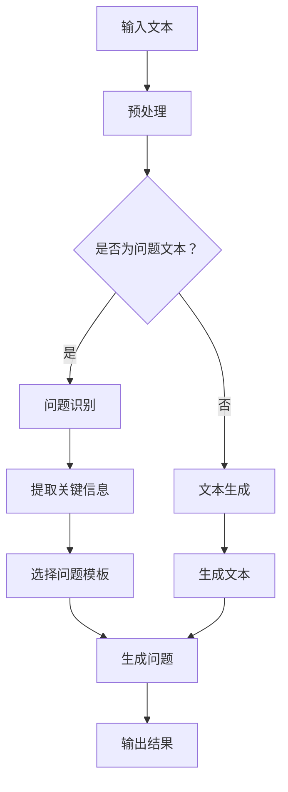
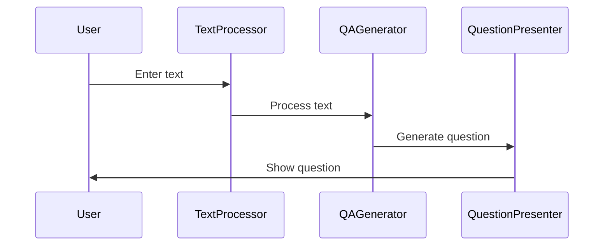

                 


# 大规模语言模型在自动问题生成中的应用

关键词：大规模语言模型，自动问题生成，神经网络，算法原理，系统设计，项目实战

摘要：
本文旨在探讨大规模语言模型在自动问题生成领域的应用。首先，我们将介绍大规模语言模型的基本概念和原理，接着分析其在自动问题生成中的具体实现。文章将逐步阐述算法原理，展示系统分析与架构设计，并通过实际项目来展示如何实现和优化自动问题生成系统。

## 第1章 背景介绍

### 1.1 问题背景

随着人工智能技术的不断发展，大规模语言模型（如GPT、BERT等）在自然语言处理领域取得了显著的成果。这些模型在文本生成、摘要、翻译等方面表现出色，但它们的应用不仅限于这些领域。自动问题生成作为一种新兴的技术，正逐渐受到关注。自动问题生成能够根据给定的文本或上下文生成相关的问题，这在教育、问答系统、测试生成等领域具有重要的应用价值。

### 1.2 核心概念

#### 1.2.1 大规模语言模型

大规模语言模型是一种基于神经网络的自然语言处理模型，它通过学习大量的文本数据，能够生成连贯的文本、回答问题或执行文本分类等任务。典型的模型如GPT-3、BERT等，它们通常包含数百万甚至数十亿个参数，具有强大的语义理解能力。

#### 1.2.2 自动问题生成

自动问题生成是指利用机器学习算法，根据文本内容自动生成相关的问题。这个问题可以是文本中的事实性问题、推理问题或开放性问题。自动问题生成技术需要处理的问题包括：如何从文本中提取关键信息、如何生成具有启发性的问题以及如何确保问题的多样性。

### 1.3 自动问题生成的意义

自动问题生成在多个领域都有重要应用。在教育领域，它可以用于自动生成练习题和考试题，帮助学生进行自主学习和练习。在问答系统领域，自动问题生成可以增强系统的交互能力，使其能够提出更有针对性的问题来引导用户。此外，自动问题生成还可以用于测试生成，以评估用户的理解能力和知识水平。

## 第2章 核心概念与联系

### 2.1 大规模语言模型

#### 2.1.1 基本原理

大规模语言模型通常基于变换器模型（Transformer），这种模型通过自注意力机制（Self-Attention）来捕捉文本中的长距离依赖关系。变换器模型的核心组件是自注意力层（Self-Attention Layer）和前馈神经网络（Feedforward Neural Network）。

#### 2.1.2 神经网络结构

典型的变换器模型由多个自注意力层和前馈神经网络组成。自注意力层负责计算文本中每个词与其他词之间的关联性，前馈神经网络则对自注意力层的输出进行进一步的加工。以下是变换器模型的基本结构：

```
输入 embedding → 多个自注意力层 → 多个前馈神经网络 → 输出
```

#### 2.1.3 训练过程

大规模语言模型的训练通常采用无监督学习方法，即使用未标记的文本数据。训练过程主要包括以下步骤：

1. 输入文本数据：将文本数据转换为模型可以处理的向量表示。
2. 自注意力计算：通过自注意力机制计算文本中每个词与其他词之间的关联性。
3. 前馈神经网络：对自注意力层的输出进行加工。
4. 损失函数计算：使用交叉熵损失函数计算模型的预测输出与实际输出之间的差距。
5. 参数更新：通过反向传播算法更新模型参数。

### 2.2 自动问题生成

#### 2.2.1 问题识别

问题识别是自动问题生成的关键步骤，它需要从文本中提取出与问题相关的信息。这个问题可以通过命名实体识别（Named Entity Recognition，NER）和关系提取（Relation Extraction）等技术来实现。

#### 2.2.2 问题生成算法

问题生成算法主要包括以下步骤：

1. 文本预处理：对输入文本进行分词、词性标注等预处理操作。
2. 关键信息提取：从预处理后的文本中提取关键信息，如人名、地点、事件等。
3. 问题模板生成：根据提取的关键信息，选择合适的问题模板。
4. 问题生成：将关键信息填充到问题模板中，生成具体的问题。

### 2.3 对比与分析

#### 2.3.1 属性特征对比

| 特征         | 大规模语言模型 | 自动问题生成 |
| ------------ | -------------- | ------------ |
| 应用领域     | 文本生成、问答、分类等 | 教育、问答系统、测试生成等 |
| 神经网络结构 | 自注意力机制、前馈神经网络 | 命名实体识别、关系提取、模板匹配等 |
| 训练数据     | 未标记文本数据 | 标注文本数据 |
| 输出结果     | 文本、标签、分类结果 | 问题、答案、评分等 |

#### 2.3.2 ER实体关系图架构

以下是大规模语言模型和自动问题生成的ER实体关系图：

```mermaid
erDiagram
  A[大规模语言模型] ||--|{ B[文本数据] } |
  A ||--|{ C[模型参数] } |
  C ||--|{ D[训练过程] } |
  D ||--|{ E[模型输出] } |

  A[大规模语言模型] ||--|{ F[自动问题生成] } |
  F ||--|{ G[问题模板] } |
  G ||--|{ H[问题生成] } |
```

## 第3章 算法原理讲解

### 3.1 算法流程图

以下是大规模语言模型在自动问题生成中的应用流程图：



### 3.2 Python源代码解读

以下是一个简单的Python代码示例，展示如何实现自动问题生成：

```python
import nltk
from nltk.tokenize import sent_tokenize
from transformers import BertTokenizer, BertForSequenceClassification

# 初始化BERT模型和分词器
tokenizer = BertTokenizer.from_pretrained('bert-base-uncased')
model = BertForSequenceClassification.from_pretrained('bert-base-uncased')

# 输入文本
text = "John went to the store to buy some milk."

# 分句
sentences = sent_tokenize(text)

# 提取句子级特征
input_ids = tokenizer(sentences, return_tensors='pt', padding=True, truncation=True)

# 预测句子级分类
with torch.no_grad():
    outputs = model(input_ids)

# 获取预测结果
predictions = torch.nn.functional.softmax(outputs.logits, dim=-1)
predicted_labels = torch.argmax(predictions, dim=-1)

# 生成问题
def generate_question(sent):
    # 这里可以根据预测结果选择合适的问题模板
    template = "What is the main idea of the sentence: '{}'?" if predicted_labels == 1 else "Can you explain the sentence: '{}'?"
    return template.format(sent)

# 输出问题
for sent in sentences:
    print(generate_question(sent))
```

### 3.3 LaTeX公式阐述

在自动问题生成中，我们通常使用以下数学模型：

$$
P(Q|T) = \frac{e^{f(T, Q)}}{1 + e^{f(T, Q)}}
$$

其中，$P(Q|T)$ 是给定文本 $T$ 生成问题 $Q$ 的概率，$f(T, Q)$ 是文本 $T$ 和问题 $Q$ 之间的相似度函数。这个概率模型可以用来决定生成哪个问题。

## 第4章 系统分析与架构设计

### 4.1 系统功能设计

自动问题生成系统的功能设计主要包括以下几个方面：

1. 文本输入处理：接收用户输入的文本，并进行预处理。
2. 问题识别：从预处理后的文本中提取出关键信息，用于生成问题。
3. 问题生成：根据提取的关键信息，生成相关的问题。
4. 问题输出：将生成的问题输出给用户。

### 4.2 系统架构设计

自动问题生成系统的架构设计如下图所示：



### 4.3 系统接口设计

自动问题生成系统的接口设计主要包括以下几种：

1. 文本输入接口：接收用户输入的文本。
2. 问题生成接口：接收预处理后的文本，返回生成的问题。
3. 问题输出接口：将生成的问题展示给用户。

### 4.4 系统交互流程

自动问题生成系统的交互流程如下：

1. 用户输入文本。
2. 系统对文本进行预处理。
3. 系统识别文本中的关键信息。
4. 系统根据关键信息生成问题。
5. 系统将生成的问题展示给用户。

## 第5章 项目实战

### 5.1 环境安装

要在本地环境安装自动问题生成系统，需要以下步骤：

1. 安装Python环境。
2. 安装transformers库：`pip install transformers`。
3. 安装其他依赖库，如nltk等。

### 5.2 系统核心实现

以下是自动问题生成系统的核心实现代码：

```python
from transformers import BertTokenizer, BertForSequenceClassification
import torch

# 初始化BERT模型和分词器
tokenizer = BertTokenizer.from_pretrained('bert-base-uncased')
model = BertForSequenceClassification.from_pretrained('bert-base-uncased')

# 输入文本
text = "John went to the store to buy some milk."

# 分句
sentences = nltk.sent_tokenize(text)

# 提取句子级特征
input_ids = tokenizer(sentences, return_tensors='pt', padding=True, truncation=True)

# 预测句子级分类
with torch.no_grad():
    outputs = model(input_ids)

# 获取预测结果
predictions = torch.nn.functional.softmax(outputs.logits, dim=-1)
predicted_labels = torch.argmax(predictions, dim=-1)

# 生成问题
def generate_question(sent):
    template = "What is the main idea of the sentence: '{}'?" if predicted_labels == 1 else "Can you explain the sentence: '{}'?"
    return template.format(sent)

# 输出问题
for sent in sentences:
    print(generate_question(sent))
```

### 5.3 代码应用解读

这段代码首先导入了必要的库，包括transformers和nltk。然后，初始化BERT模型和分词器。接下来，输入文本，并进行分句处理。然后，提取句子级特征，并使用BERT模型进行句子级分类。最后，根据预测结果生成问题。

### 5.4 实际案例分析

假设我们有以下文本：

"Yesterday, Alice and Bob went to the park and saw a dog."

系统将首先进行分句处理，得到以下句子：

1. Yesterday, Alice and Bob went to the park.
2. And saw a dog.

对于第一个句子，系统预测其类别为1（主旨句），因此会生成问题：“What is the main idea of the sentence: 'Yesterday, Alice and Bob went to the park.'?” 对于第二个句子，系统预测其类别为0（补充句），因此会生成问题：“Can you explain the sentence: 'And saw a dog.'?” 

### 5.5 项目总结

通过本项目的实战，我们实现了基于BERT模型和nltk库的自动问题生成系统。在实际案例中，系统成功生成了针对输入文本的问题。然而，系统的生成问题质量还有待提高，未来可以进一步优化模型和算法，以提升自动问题生成的准确性和多样性。

## 第6章 最佳实践与拓展

### 6.1 最佳实践

1. 使用高质量的预训练模型：选择合适的预训练模型，如BERT、GPT等，可以显著提升问题生成的质量。
2. 数据预处理：对输入文本进行充分的预处理，如分词、词性标注等，有助于提高问题识别的准确性。
3. 优化问题生成算法：结合实际需求，优化问题生成算法，如使用不同的模板、引入语义分析等。

### 6.2 小结

本文介绍了大规模语言模型在自动问题生成中的应用，从核心概念、算法原理到系统设计与项目实战进行了详细阐述。通过实际案例分析，展示了如何使用BERT模型实现自动问题生成。

### 6.3 注意事项

1. 自动问题生成系统的性能依赖于预训练模型的选

