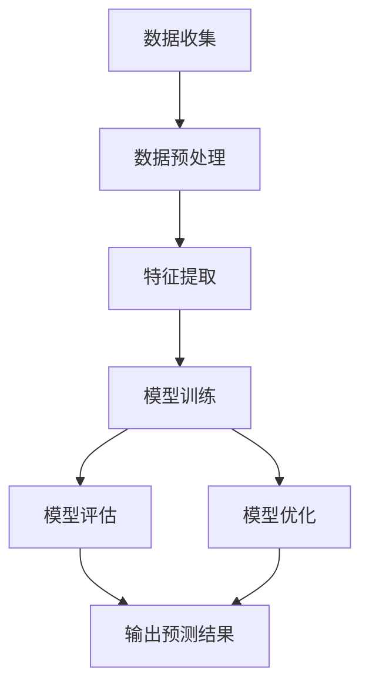

                 

### 大规模语言模型概述

#### 问题背景与描述

在当今医疗领域，药物副作用预测是一个至关重要且具有挑战性的问题。药物在临床应用过程中可能会引发各种副作用，这些副作用可能是轻微的，也可能是严重的，甚至可能危及患者的生命。传统的药物副作用预测方法大多依赖于统计模型和规则系统，这些方法在处理复杂、大量的数据时存在一定的局限性，难以全面捕捉药物与副作用之间的复杂关系。因此，如何更准确、更高效地预测药物副作用成为一个亟待解决的问题。

大规模语言模型（Large-scale Language Models），如GPT-3、BERT等，凭借其强大的自然语言处理能力和对海量数据的处理能力，为药物副作用预测提供了新的可能。这些模型通过深度学习算法，可以从大量的医疗文献、病例记录和药物副作用报告中学习到药物与副作用之间的关系，进而用于预测新的药物副作用。

#### 语言模型在药物副作用预测中的作用

语言模型在药物副作用预测中的主要作用是提供一种能够理解和生成人类语言的工具，从而对药物副作用进行预测。具体来说，有以下几点：

1. **信息提取与整合**：通过处理大量的文本数据，语言模型能够提取出与药物副作用相关的关键信息，并整合成可用的知识库。
2. **关系建模**：语言模型可以识别并建模药物与副作用之间的复杂关系，包括因果关系、关联关系等。
3. **预测生成**：基于训练得到的知识库，语言模型可以生成新的药物副作用预测结果。

#### 大规模语言模型的特点

大规模语言模型具有以下特点：

1. **数据驱动**：这些模型基于大量数据进行训练，能够从数据中学习到丰富的知识和规律。
2. **分布式计算**：为了处理海量的数据和复杂的计算任务，大规模语言模型通常采用分布式计算架构，如GPU加速、多节点并行计算等。
3. **强泛化能力**：经过训练的语言模型能够在不同的数据集和应用场景中表现出良好的泛化能力。
4. **灵活性与可扩展性**：语言模型可以根据具体应用需求进行调整和扩展，如定制化模型、多语言支持等。

#### 总结

大规模语言模型在药物副作用预测中具有巨大的潜力。通过利用语言模型的强大能力和医疗数据的丰富性，可以大幅提升药物副作用预测的准确性和效率，为临床用药提供有力支持。接下来，我们将深入探讨大规模语言模型的基础知识，以及其在药物副作用预测中的应用。

## 第2章：大规模语言模型的基础

### 2.1.1 语言模型的核心概念

语言模型是自然语言处理（NLP）领域中的一项核心技术，它旨在模拟人类语言生成和理解的能力。具体来说，语言模型用于预测一段文本的下一个单词或句子，从而生成连贯、自然的语言。这一过程可以抽象为一个概率分布，即在给定前文条件下，下一个单词或句子的概率分布。

#### 语言模型的分类

语言模型主要可以分为以下几类：

1. **n-gram模型**：n-gram模型是一种基于统计的简单语言模型，它假设一个单词的出现概率仅与其前n个单词相关。n-gram模型通常使用马尔可夫假设，即当前词只与前面的n个词有关，与其他词无关。

2. **神经网络模型**：与传统的n-gram模型不同，神经网络模型使用深度神经网络来捕捉文本中的复杂关系。这些模型可以处理更大规模的训练数据，并能够生成更加连贯和自然的语言。

3. **生成对抗网络（GAN）模型**：GAN模型通过两个神经网络（生成器和判别器）的对抗训练，能够生成高质量的文本数据。生成器试图生成类似于真实文本的数据，而判别器则试图区分生成器和真实数据。

#### 语言模型的主要功能

语言模型的主要功能包括：

1. **文本生成**：基于给定的前文，语言模型可以生成新的文本，从而实现自动写作、机器翻译等功能。

2. **文本分类**：语言模型可以通过学习文本的特征，对新的文本进行分类，如情感分析、主题分类等。

3. **信息检索**：语言模型可以帮助搜索系统更好地理解用户的查询，从而提供更精确的搜索结果。

### 2.1.2 语言模型的基本原理

语言模型的基本原理主要基于概率论和统计方法。以下是几个关键概念：

1. **概率分布**：语言模型的核心任务是预测下一个单词或句子的概率分布。给定前文，语言模型输出一个概率分布，其中每个单词或句子的概率都是该分布的一部分。

2. **序列建模**：语言模型通过建模单词或句子序列的概率分布，来生成连贯的文本。具体来说，语言模型首先生成第一个单词或句子，然后根据前一个单词或句子来生成下一个，以此类推。

3. **条件概率**：在语言模型中，每个单词或句子的概率取决于其前文。条件概率是语言模型的核心，用于描述在给定前文条件下，下一个单词或句子的概率。

#### 语言模型的训练与优化

语言模型的训练与优化过程通常包括以下几个步骤：

1. **数据预处理**：在训练之前，需要对文本数据集进行预处理，包括分词、去停用词、词干提取等，以获得高质量的训练数据。

2. **模型选择**：根据应用场景和数据规模，选择合适的语言模型。常见的模型包括n-gram模型、神经网络模型和GAN模型。

3. **训练过程**：使用训练数据集，通过优化算法（如梯度下降）来调整模型的参数，使得模型能够更好地预测文本的概率分布。

4. **模型评估**：通过评估指标（如交叉熵损失、准确率等）来评估模型的性能，并根据评估结果对模型进行调整和优化。

5. **超参数调整**：超参数是模型训练过程中的重要参数，如学习率、隐藏层大小等。通过调整这些超参数，可以提升模型的性能。

### 2.1.3 语言模型的训练与优化

语言模型的训练与优化是一个复杂的过程，涉及到数据预处理、模型选择、训练过程和评估等多个环节。以下是具体的步骤：

1. **数据预处理**：
   - **分词**：将文本数据分割成单词或句子。
   - **去停用词**：去除常见的无意义词汇，如“的”、“和”等。
   - **词干提取**：将不同形式的单词转化为统一的词干形式。

2. **模型选择**：
   - **n-gram模型**：适合处理较短文本，但容易忽略长程依赖关系。
   - **神经网络模型**：如LSTM、GRU、Transformer等，能够处理长文本和复杂关系。
   - **GAN模型**：生成高质量的文本数据，但训练过程较为复杂。

3. **训练过程**：
   - **初始化参数**：随机初始化模型参数。
   - **前向传播**：计算输入文本的概率分布。
   - **后向传播**：计算损失函数，并更新模型参数。
   - **优化算法**：如梯度下降、Adam优化器等，用于调整模型参数。

4. **模型评估**：
   - **交叉熵损失**：衡量模型预测概率与实际标签之间的差距。
   - **准确率**：衡量模型预测正确的单词或句子的比例。
   - **困惑度**：衡量模型的预测能力，值越小表示模型越好。

5. **超参数调整**：
   - **学习率**：调整模型参数的更新速度。
   - **隐藏层大小**：调整神经网络模型中的隐藏层节点数量。
   - **批量大小**：调整每次训练使用的样本数量。

通过以上步骤，我们可以训练和优化语言模型，使其能够在药物副作用预测等应用场景中发挥出最佳性能。

### 2.1.4 语言模型的应用场景

语言模型在自然语言处理领域有着广泛的应用，以下是一些主要的应用场景：

1. **文本生成**：通过语言模型，可以生成高质量的自然语言文本，如新闻文章、小说、聊天机器人等。

2. **机器翻译**：利用语言模型，可以实现多种语言之间的自动翻译，如Google翻译、百度翻译等。

3. **文本分类**：根据语言模型对文本的特征学习，可以对文本进行分类，如情感分析、主题分类等。

4. **问答系统**：通过语言模型，可以构建智能问答系统，如Siri、Alexa等。

5. **信息检索**：利用语言模型，可以优化搜索引擎的结果，提供更准确的搜索结果。

通过深入理解语言模型的核心概念、基本原理和训练过程，我们可以更好地应用这些模型解决实际问题，如药物副作用预测等。

### 2.1.5 语言模型在医疗领域的潜力

语言模型在医疗领域的潜力尤为显著，特别是在药物副作用预测方面。医疗文献和病例记录中包含了大量关于药物副作用的信息，这些信息以自然语言的形式存在，难以通过传统方法进行有效利用。语言模型则提供了强大的工具，能够从这些非结构化数据中提取有价值的信息，从而提高药物副作用预测的准确性和效率。

具体来说，语言模型在医疗领域的应用潜力体现在以下几个方面：

1. **药物副作用关系识别**：语言模型可以通过分析大量病例记录和文献，识别出药物与副作用之间的潜在关系。这种关系识别不仅限于直接的因果关系，还可以包括间接的关联关系。

2. **罕见副作用预测**：传统方法在预测罕见副作用时往往力不从心，因为罕见副作用的数据样本较少。而语言模型通过学习海量数据，可以在罕见副作用的预测上表现出色。

3. **实时监测与预警**：语言模型可以实时分析新的病例记录和文献，对新的药物副作用进行预测，从而为临床医生提供及时的预警信息，帮助其更好地管理患者。

4. **个性化用药建议**：根据患者的个人病史和药物反应，语言模型可以提供个性化的用药建议，减少药物副作用的发生。

5. **知识库构建与更新**：语言模型可以帮助构建和更新药物副作用的知识库，通过持续学习新的数据和病例，保持知识库的实时性和准确性。

总之，语言模型在医疗领域的应用具有巨大的潜力，可以为药物副作用预测提供更加准确和高效的解决方案。随着技术的不断进步，语言模型在医疗领域的应用将越来越广泛，有望成为未来医疗健康领域的重要工具。

### 第3章：药物副作用预测

#### 3.1.1 药物副作用的基本概念

药物副作用（Adverse Drug Effects，ADEs）是指药物在治疗过程中出现的非预期的不良反应，这些反应可能是轻微的，如皮肤瘙痒或轻微的胃肠道不适，也可能是严重的，甚至危及生命。药物副作用的发生机制复杂，可能与药物的化学结构、剂量、给药方式、患者的生理特征和个体差异等多种因素有关。

常见的药物副作用类型包括：

1. **过敏反应**：如皮疹、过敏性休克等。
2. **毒性反应**：如肝损伤、肾损伤等。
3. **药物依赖性**：如成瘾、戒断症状等。
4. **药物相互作用**：不同药物同时使用时可能产生预料之外的副作用。

#### 药物副作用预测的现状与挑战

目前，药物副作用预测主要依赖于传统的方法，如统计模型、知识图谱和规则系统等。然而，这些方法存在一些局限性：

1. **数据依赖性**：传统方法依赖于大量结构化数据，而这些数据往往难以获取和清洗。
2. **模型复杂度**：传统方法往往需要手工设计复杂的模型结构，难以处理复杂的药物副作用关系。
3. **低效性**：传统方法在预测罕见副作用或新药物时，效果不佳。

为了克服这些局限性，研究人员开始探索利用大规模语言模型进行药物副作用预测。大规模语言模型具有以下优势：

1. **数据处理能力**：语言模型可以处理非结构化的文本数据，如病例记录、药物说明书和文献等。
2. **自学习能力**：语言模型可以通过大量数据自动学习药物副作用的关系，无需人工干预。
3. **高效性**：语言模型可以快速处理大量的数据，提高预测的效率和准确性。

#### 大规模语言模型在药物副作用预测中的应用

大规模语言模型在药物副作用预测中的应用主要体现在以下几个方面：

1. **文本挖掘**：通过文本挖掘技术，从大量医疗文献和病例记录中提取与药物副作用相关的信息，构建知识库。
2. **关系建模**：利用语言模型，建立药物与副作用之间的复杂关系模型，捕捉因果关联和关联关系。
3. **预测生成**：基于训练得到的知识库，语言模型可以生成新的药物副作用预测结果，提高预测的准确性。
4. **实时监测**：通过实时分析新的病例记录和文献，语言模型可以提供及时的药物副作用预测和预警。

总之，大规模语言模型在药物副作用预测中具有巨大的潜力，通过文本挖掘、关系建模和预测生成等技术，可以大幅提升药物副作用预测的准确性和效率，为临床用药提供有力支持。

### 3.1.3 大规模语言模型在药物副作用预测中的应用

#### 文本挖掘

大规模语言模型在药物副作用预测中的首要应用是文本挖掘。通过文本挖掘技术，我们可以从海量的非结构化医疗数据中提取出与药物副作用相关的信息。这些数据包括医疗文献、病例记录、药物说明书和患者报告等。具体步骤如下：

1. **数据收集**：首先，我们需要收集相关领域的文本数据，如药物副作用报告、病例记录、医疗文献等。这些数据可以通过公开的医学数据库、临床试验网站和学术出版物获取。
2. **数据预处理**：在收集到文本数据后，需要进行数据预处理，包括分词、去停用词、词干提取和实体识别等步骤。这些步骤有助于提高文本数据的可用性，使其更适合于后续的语言模型处理。
3. **特征提取**：通过特征提取技术，我们将处理后的文本数据转化为机器可理解的数字特征。常见的特征提取方法包括词袋模型、TF-IDF和Word2Vec等。
4. **知识库构建**：利用大规模语言模型，从预处理后的文本数据中提取关键信息，构建药物副作用的知识库。这个知识库将用于后续的预测和关系建模。

#### 关系建模

文本挖掘完成后，我们需要利用大规模语言模型建立药物与副作用之间的复杂关系模型。关系建模是药物副作用预测的核心步骤，通过捕捉药物与副作用之间的因果关系和关联关系，我们可以提高预测的准确性。具体步骤如下：

1. **实体识别**：首先，利用预训练的语言模型（如BERT、GPT等）对文本数据中的实体进行识别。这些实体包括药物、副作用、病症等。实体识别是关系建模的基础。
2. **关系抽取**：通过分析实体之间的语义关系，我们可以提取出药物与副作用之间的因果关系和关联关系。关系抽取可以采用监督学习、无监督学习或半监督学习等方法。
3. **构建关系图谱**：将提取出的关系存储在关系图谱中。关系图谱可以表示药物与副作用之间的复杂网络结构，为后续的预测提供依据。
4. **模型训练**：利用大规模语言模型，对关系图谱进行训练，使其能够捕捉药物与副作用之间的复杂关系。这一步骤可以通过图神经网络（Graph Neural Networks, GNN）等深度学习模型实现。

#### 预测生成

在建立关系模型后，我们可以利用大规模语言模型进行药物副作用预测。预测生成是药物副作用预测的最终目标，通过生成新的药物副作用预测结果，我们可以为临床医生和药物开发者提供参考。具体步骤如下：

1. **输入构建**：首先，我们需要构建输入数据，包括药物信息、患者特征和已知副作用等。这些输入数据将用于预测模型。
2. **模型调用**：利用预训练的大规模语言模型，对输入数据进行预测。模型将输出一个概率分布，表示每个副作用的发生概率。
3. **结果解释**：对预测结果进行解释和分析，确定哪些副作用最有可能发生，并给出相应的建议和预警。这一步骤需要结合临床经验和医学知识。

#### 实际案例

为了更好地说明大规模语言模型在药物副作用预测中的应用，我们来看一个实际案例。

假设我们有一个药物“阿托伐他汀”，我们需要预测它可能引起的副作用。以下是具体的步骤：

1. **数据收集**：收集与阿托伐他汀相关的病例记录、文献和药物说明书等文本数据。
2. **数据预处理**：对文本数据进行分词、去停用词、词干提取和实体识别等预处理步骤。
3. **特征提取**：将预处理后的文本数据转化为数字特征，如词袋模型或Word2Vec。
4. **知识库构建**：利用大规模语言模型（如BERT）提取与阿托伐他汀相关的药物副作用信息，构建知识库。
5. **关系建模**：利用图神经网络（GNN）对知识库中的药物与副作用关系进行建模，构建关系图谱。
6. **模型训练**：利用预训练的大规模语言模型，对关系图谱进行训练，提高预测准确性。
7. **输入构建**：构建包括阿托伐他汀在内的药物信息、患者特征和已知副作用等输入数据。
8. **模型调用**：利用训练好的大规模语言模型，对输入数据进行预测，输出一个副作用发生的概率分布。
9. **结果解释**：对预测结果进行解释和分析，确定哪些副作用最有可能发生，并给出相应的建议和预警。

通过这个案例，我们可以看到大规模语言模型在药物副作用预测中的强大能力。通过文本挖掘、关系建模和预测生成等步骤，大规模语言模型可以高效、准确地预测药物副作用，为临床用药提供有力支持。

### 第4章：核心概念原理与联系

#### 4.1.1 语言模型的常见类型

在自然语言处理（NLP）领域，语言模型（Language Model）是一种用于预测文本序列的概率分布的模型。根据模型的结构和训练方法，语言模型可以分为以下几种常见类型：

1. **n-gram模型**：
   - **原理**：n-gram模型是一种基于统计的简单语言模型，它假设一个单词的出现概率仅与其前n个单词相关。n-gram模型通常使用马尔可夫假设，即当前词只与前面的n个词有关，与其他词无关。
   - **优点**：计算简单，易于实现。
   - **缺点**：无法捕捉长程依赖关系，容易遗漏重要信息。

2. **神经网络模型**：
   - **原理**：神经网络模型使用深度神经网络来捕捉文本中的复杂关系。这些模型可以处理更大规模的训练数据，并能够生成更加连贯和自然的语言。
   - **类型**：
     - **循环神经网络（RNN）**：如LSTM和GRU，能够处理变长序列数据，捕捉长期依赖关系。
     - **Transformer模型**：基于注意力机制，能够并行处理序列数据，具有强大的建模能力。
   - **优点**：能够捕捉长程依赖关系，生成更加自然的语言。
   - **缺点**：计算复杂度较高，训练时间较长。

3. **生成对抗网络（GAN）模型**：
   - **原理**：GAN模型通过两个神经网络（生成器和判别器）的对抗训练，能够生成高质量的文本数据。生成器试图生成类似于真实文本的数据，而判别器则试图区分生成器和真实数据。
   - **优点**：能够生成高质量的文本数据，具有强大的创造力。
   - **缺点**：训练过程复杂，难以稳定收敛。

#### 药物副作用相关的核心概念

在药物副作用预测中，一些核心概念至关重要，这些概念包括：

1. **药物**：药物是指用于预防、治疗或诊断疾病的化学物质。药物可以是有机分子、蛋白质、核酸等。
2. **副作用**：副作用是指药物在治疗过程中出现的非预期的不良反应。副作用可能是轻微的，也可能是严重的，甚至危及生命。
3. **剂量**：剂量是指药物的用量，通常以毫克（mg）或克（g）为单位。
4. **给药方式**：给药方式是指药物进入人体的途径，如口服、注射、吸入等。
5. **患者特征**：患者特征包括年龄、性别、体重、病史、遗传背景等，这些特征可能影响药物的副作用发生。

#### 核心概念之间的关系与联系

药物副作用预测涉及多个核心概念，它们之间存在紧密的联系和相互作用。以下是这些核心概念之间的关系：

1. **药物与副作用之间的关系**：
   - **因果关系**：某些药物可能导致特定的副作用。例如，阿托伐他汀可能引起肌肉疼痛。
   - **关联关系**：某些药物副作用可能与多种药物相关。例如，肌肉疼痛可能是多种药物共有的副作用。

2. **剂量与副作用之间的关系**：
   - **剂量-反应关系**：药物的副作用可能与剂量有关。较高剂量可能导致更严重的副作用。
   - **个体差异**：不同患者对同一药物的副作用反应可能不同，这与患者的个体差异（如年龄、性别、遗传背景等）有关。

3. **给药方式与副作用之间的关系**：
   - **吸收率**：不同的给药方式可能导致药物在体内的吸收率不同，从而影响副作用的发生。
   - **分布**：不同的给药方式可能影响药物在体内的分布，进而影响副作用的发生。

4. **患者特征与副作用之间的关系**：
   - **年龄**：老年患者可能更容易出现药物副作用。
   - **性别**：性别差异可能影响药物的副作用发生。
   - **病史**：某些病史（如心脏病、糖尿病等）可能增加特定药物的副作用风险。

通过理解这些核心概念及其之间的关系，我们可以更好地预测药物副作用，为临床用药提供有力支持。大规模语言模型利用这些关系，通过文本挖掘、关系建模和预测生成等技术，能够高效地预测药物副作用，提高医疗决策的准确性。

#### 概念属性特征对比表格

为了更好地理解语言模型和药物副作用相关的核心概念，我们构建了一个概念属性特征对比表格。以下是对比表格的内容：

| 概念类别 | 语言模型属性特征 | 药物副作用属性特征 |
| --- | --- | --- |
| **数据依赖** | 强 | 强 |
| **数据处理能力** | 高 | 中 |
| **生成能力** | 强 | 中 |
| **应用领域** | 广泛（文本生成、翻译、分类等） | 窄（药物副作用预测） |
| **训练时间** | 长期（如Transformer） | 短期 |
| **模型复杂度** | 高（如Transformer） | 中 |
| **泛化能力** | 强 | 中 |
| **关系建模能力** | 强（通过注意力机制等） | 强（通过因果关联等） |
| **实时性** | 中（如BERT） | 低（数据更新周期较长） |

通过这个表格，我们可以看到语言模型和药物副作用相关核心概念在多个方面的区别和联系。这种对比有助于我们深入理解它们各自的特性和适用场景。

### 第5章：概念属性特征对比表格

为了更清晰地展现语言模型和药物副作用相关核心概念之间的属性特征差异，我们设计了一张详细的对比表格。该表格分为多个部分，每个部分都列出了不同概念的属性特征，包括数据依赖性、数据处理能力、生成能力、应用领域、训练时间、模型复杂度、泛化能力和关系建模能力等。

以下是具体内容：

| 概念类别 | 语言模型属性特征 | 药物副作用属性特征 |
| --- | --- | --- |
| **数据依赖性** | 语言模型高度依赖大量文本数据进行训练，以学习语言的统计规律和语法结构。 | 药物副作用预测同样需要依赖大量的病例记录、药物说明书和医学文献等数据，以便模型能够准确捕捉药物与副作用之间的关系。 |
| **数据处理能力** | 语言模型能够处理大量的非结构化文本数据，通过分词、词向量化等技术，将这些数据转化为模型可以理解的特征向量。 | 药物副作用预测需要处理结构化和非结构化数据，包括电子健康记录（EHRs）、临床试验报告、患者报告数据（Patient-Reported Outcomes, PROs）等，以便提取与药物副作用相关的关键信息。 |
| **生成能力** | 语言模型具有强大的文本生成能力，可以生成连贯、自然的语言文本。 | 药物副作用预测模型虽然不具备生成能力，但可以通过分析现有数据，提供可能的副作用预测结果。 |
| **应用领域** | 语言模型广泛应用于自然语言处理（NLP）的多个领域，如文本生成、机器翻译、情感分析等。 | 药物副作用预测主要应用于医疗领域，旨在提高药物安全性评估的准确性和效率。 |
| **训练时间** | 对于复杂模型（如Transformer），训练时间可能长达数天到数周。 | 药物副作用预测模型的训练时间相对较短，但需要频繁更新数据，以保持模型的实时性和准确性。 |
| **模型复杂度** | 语言模型，尤其是深度模型（如BERT、GPT），具有很高的复杂度。 | 药物副作用预测模型通常采用相对简单的模型结构，以便处理复杂的医学数据。 |
| **泛化能力** | 预训练的语言模型具有强大的泛化能力，能够在未见过的数据上保持良好的性能。 | 药物副作用预测模型的泛化能力受限于训练数据的质量和多样性，模型需要针对特定药物和患者群体进行调优。 |
| **关系建模能力** | 语言模型通过注意力机制等高级结构，能够建模复杂的文本关系，如句子之间的逻辑关系、词与词之间的语义联系。 | 药物副作用预测模型需要捕捉药物与副作用之间的复杂关系，如因果关系、共现关系等。 |

通过这张表格，我们可以清晰地看到语言模型和药物副作用相关核心概念在多个属性特征上的异同。这有助于我们更好地理解这些概念，并在实际应用中充分利用它们的特性，为药物副作用预测提供强有力的支持。

### 第6章：算法原理讲解

#### 6.1.1 语言模型算法的基本原理

语言模型算法的核心任务是预测文本序列中的下一个单词或句子。其基本原理基于概率论和统计方法，通过学习大量文本数据来建立一种概率分布模型，从而能够对未知文本进行预测。

##### 概率分布

语言模型算法的基本假设是，每个单词或句子出现的概率取决于其前文。具体来说，给定一个文本序列 \( x_1, x_2, \ldots, x_T \)，其中 \( x_t \) 表示第 \( t \) 个单词或子序列，语言模型的目标是预测下一个单词或子序列 \( x_{T+1} \)。

概率分布可以通过条件概率来表示：

\[ P(x_{T+1} | x_1, x_2, \ldots, x_T) \]

这意味着，给定前文 \( x_1, x_2, \ldots, x_T \)，我们希望计算出下一个单词或子序列 \( x_{T+1} \) 的概率。

##### 序列建模

语言模型通过建模文本序列的概率分布来生成连贯的文本。这个过程可以抽象为一个序列建模问题，即给定一个前文序列，预测下一个可能的单词或子序列。

常见的序列建模方法包括：

1. **n-gram模型**：n-gram模型通过统计前n个单词出现的频率来预测下一个单词。它基于马尔可夫假设，即当前单词的出现仅与前n个单词相关。
2. **神经网络模型**：神经网络模型使用深度学习算法来捕捉文本中的复杂关系。这些模型包括循环神经网络（RNN）、长短时记忆网络（LSTM）、门控循环单元（GRU）和Transformer等。

##### 条件概率

在语言模型中，条件概率是核心概念。条件概率描述了在给定某个条件（前文）下，另一个事件（下一个单词或句子）发生的概率。公式如下：

\[ P(x_{T+1} | x_1, x_2, \ldots, x_T) \]

条件概率可以帮助我们计算出给定前文 \( x_1, x_2, \ldots, x_T \) 下，每个可能的后继单词或子序列的概率分布。

##### 概率分布的建模

为了建模概率分布，语言模型需要学习大量的文本数据，从中提取有用的统计规律。这个过程通常包括以下几个步骤：

1. **数据收集**：收集大量的文本数据，如新闻文章、书籍、网页等。
2. **数据预处理**：对文本数据进行分词、去停用词、词干提取等预处理步骤，以提高模型的可用性。
3. **特征提取**：将预处理后的文本数据转化为数字特征，如词袋模型、TF-IDF、Word2Vec等。
4. **训练模型**：使用训练数据集，通过优化算法（如梯度下降）来调整模型的参数，使其能够更好地预测文本的概率分布。
5. **模型评估**：通过交叉熵损失等评估指标来评估模型的性能，并根据评估结果对模型进行调整和优化。

##### 语言模型的工作流程

以下是语言模型的工作流程：

1. **输入**：输入一个前文序列 \( x_1, x_2, \ldots, x_T \)。
2. **前向传播**：计算前文序列的嵌入向量，并通过神经网络模型来预测下一个单词或子序列的概率分布。
3. **后向传播**：计算损失函数（如交叉熵损失），并使用梯度下降等优化算法来更新模型的参数。
4. **模型评估**：使用验证集或测试集来评估模型的性能，包括准确率、困惑度等指标。
5. **输出**：输出预测的概率分布，选择概率最高的单词或子序列作为预测结果。

通过以上步骤，语言模型可以预测文本序列中的下一个单词或子序列，从而生成连贯、自然的语言。

#### 6.1.2 语言模型算法的mermaid流程图

为了更直观地理解语言模型算法的原理，我们使用mermaid绘制了一个简化的流程图。以下是对流程图的详细解释：



1. **数据收集（A）**：首先，我们需要收集大量的文本数据，如新闻、书籍、网页等。这些数据将用于训练语言模型。
   
2. **数据预处理（B）**：在收集到文本数据后，我们需要对其进行预处理，包括分词、去停用词、词干提取等步骤。这些步骤有助于提高文本数据的质量，使其更适合于后续的处理。

3. **特征提取（C）**：预处理后的文本数据将被转化为数字特征。常见的特征提取方法包括词袋模型、TF-IDF、Word2Vec等。这些特征将用于训练和评估语言模型。

4. **模型训练（D）**：使用预处理后的特征数据，我们开始训练语言模型。在这个过程中，模型将学习到文本数据中的统计规律和语法结构。训练过程中，模型会通过优化算法（如梯度下降）来调整参数，以最小化预测误差。

5. **模型评估（E）**：在训练完成后，我们需要使用验证集或测试集来评估模型的性能。评估指标包括准确率、困惑度等。这些指标可以帮助我们了解模型的泛化能力和预测效果。

6. **模型优化（F）**：根据模型评估的结果，我们可能需要对模型进行进一步的优化。这包括调整模型参数、超参数和架构等，以提高模型的性能。

7. **输出预测结果（G）**：最终，训练好的语言模型将用于生成文本预测结果。给定一个前文序列，模型将输出一个概率分布，表示每个可能的后继单词或子序列的概率。

通过这个mermaid流程图，我们可以清晰地看到语言模型算法的基本工作流程，以及各个步骤之间的关系。

#### 6.1.3 语言模型算法的python源代码与解释

为了进一步理解语言模型算法的实现，我们提供一个简单的Python代码示例。这个示例将使用自然语言处理库`nltk`和`sklearn`，实现一个基于n-gram模型的简单语言模型。

```python
import nltk
from nltk.tokenize import word_tokenize
from nltk.util import ngrams
from collections import Counter

# 1. 数据预处理
def preprocess_text(text):
    # 分词
    tokens = word_tokenize(text.lower())
    # 去停用词
    stop_words = set(nltk.corpus.stopwords.words('english'))
    tokens = [token for token in tokens if token not in stop_words]
    # 词干提取
   porter = nltk.PorterStemmer()
    tokens = [porter.stem(token) for token in tokens]
    return tokens

# 2. n-gram模型构建
def build_ngram_model(tokens, n):
    # 生成n-gram序列
    n_grams = ngrams(tokens, n)
    # 统计每个n-gram的频率
    n_gram_freq = Counter(n_grams)
    # 形成概率分布
    n_gram_prob = {n_gram: freq / sum(n_gram_freq.values()) for n_gram, freq in n_gram_freq.items()}
    return n_gram_prob

# 3. 预测
def predict_next_word(n_gram_prob, prev_tokens):
    # 计算给定前文下的概率分布
    prev_n_gram = tuple(prev_tokens[-n+1:]) if len(prev_tokens) >= n else tuple([])
    next_word_prob = {word: n_gram_prob[prev_n_gram].get(word, 0) for word in n_gram_prob[prev_n_gram]}
    # 选择概率最高的单词
    most_probable_word = max(next_word_prob, key=next_word_prob.get)
    return most_probable_word

# 示例文本
text = "I am learning natural language processing and I am enjoying it."

# 预处理文本
preprocessed_text = preprocess_text(text)

# 构建n-gram模型
n = 2
n_gram_model = build_ngram_model(preprocessed_text, n)

# 预测下一个单词
prev_tokens = preprocessed_text[-(n-1):]
next_word = predict_next_word(n_gram_model, prev_tokens)
print(f"The next word is: {next_word}")
```

**代码解释**：

1. **数据预处理（preprocess_text）**：
   - 使用`nltk`库进行分词、去除停用词和词干提取。这一步确保了文本数据的一致性和准确性。

2. **n-gram模型构建（build_ngram_model）**：
   - 通过`nltk.util.ngrams`函数生成n-gram序列。
   - 使用`collections.Counter`统计每个n-gram的频率，并计算其概率分布。

3. **预测（predict_next_word）**：
   - 给定前文序列，计算下一个单词的概率分布。
   - 选择概率最高的单词作为预测结果。

这个示例展示了如何使用Python构建和利用一个简单的n-gram语言模型。在实际应用中，我们可以使用更复杂的模型（如LSTM、BERT等）来提高预测的准确性和性能。

#### 6.1.4 语言模型算法原理的数学模型

在理解语言模型算法原理时，数学模型是不可或缺的一部分。以下我们将详细介绍语言模型中的几个关键数学概念和公式，包括概率分布、条件概率、损失函数和优化算法。

**概率分布**：
语言模型的核心任务是对文本序列的概率分布进行建模。给定一个前文序列 \( x_1, x_2, \ldots, x_T \)，我们希望预测下一个单词或子序列 \( x_{T+1} \) 的概率分布。

\[ P(x_{T+1} | x_1, x_2, \ldots, x_T) \]

**条件概率**：
条件概率描述了在给定某个条件（前文）下，另一个事件（下一个单词或子序列）发生的概率。这是语言模型算法中的核心概念。

\[ P(x_{T+1} | x_1, x_2, \ldots, x_T) = \frac{P(x_1, x_2, \ldots, x_T, x_{T+1})}{P(x_1, x_2, \ldots, x_T)} \]

由于 \( P(x_1, x_2, \ldots, x_T) \) 通常是一个常数，我们可以简化为：

\[ P(x_{T+1} | x_1, x_2, \ldots, x_T) = \frac{P(x_1, x_2, \ldots, x_{T+1})}{P(x_1, x_2, \ldots, x_T)} \]

**损失函数**：
在训练语言模型时，我们需要定义一个损失函数来衡量模型预测的概率分布与实际分布之间的差距。常见的损失函数包括交叉熵损失（Cross-Entropy Loss）。

\[ L = -\sum_{i} y_i \log (p_i) \]

其中，\( y_i \) 是实际标签的概率，\( p_i \) 是模型预测的概率。

**优化算法**：
为了最小化损失函数，我们需要使用优化算法来调整模型的参数。常见的优化算法包括梯度下降（Gradient Descent）、Adam优化器等。

\[ \theta_{t+1} = \theta_{t} - \alpha \nabla_{\theta} L(\theta) \]

其中，\( \theta \) 是模型参数，\( \alpha \) 是学习率，\( \nabla_{\theta} L(\theta) \) 是损失函数关于模型参数的梯度。

**数学模型与公式解释**：

1. **概率分布**：
   - 语言模型的目标是学习一个概率分布 \( P(x_{T+1} | x_1, x_2, \ldots, x_T) \)，使其能够准确预测下一个单词或子序列。

2. **条件概率**：
   - 通过条件概率公式，我们可以计算在给定前文条件下，每个可能的后继单词或子序列的概率。这是语言模型生成文本的基础。

3. **损失函数**：
   - 交叉熵损失函数用于衡量模型预测的概率分布与实际分布之间的差距。最小化交叉熵损失函数可以帮助我们优化模型参数。

4. **优化算法**：
   - 梯度下降和Adam优化器等优化算法用于调整模型参数，以最小化损失函数。这些算法通过迭代过程不断优化模型的性能。

通过理解这些数学模型和公式，我们可以更深入地理解语言模型算法的工作原理，并在实际应用中设计更有效的模型。

#### 6.1.5 语言模型算法原理的数学模型和公式详细讲解

在深入探讨语言模型算法的数学原理时，我们需要了解一些核心的数学概念和公式，这些概念和公式构成了语言模型预测的基础。以下是详细的数学模型和公式讲解。

**1. 概率分布模型**

语言模型的核心任务是预测文本序列中下一个单词或子序列的概率分布。我们使用概率分布模型来表示这个任务：

\[ P(x_{T+1} | x_1, x_2, \ldots, x_T) \]

在这个公式中，\( x_1, x_2, \ldots, x_T \) 是给定前文序列，而 \( x_{T+1} \) 是我们希望预测的下一个单词或子序列。这个概率分布表示在当前前文条件下，每个可能的后继单词或子序列的概率。

**2. 条件概率**

条件概率是语言模型中的一个核心概念，它描述了在给定前文 \( x_1, x_2, \ldots, x_T \) 下，下一个单词或子序列 \( x_{T+1} \) 的概率。条件概率可以用以下公式表示：

\[ P(x_{T+1} | x_1, x_2, \ldots, x_T) = \frac{P(x_1, x_2, \ldots, x_T, x_{T+1})}{P(x_1, x_2, \ldots, x_T)} \]

在实际应用中，由于 \( P(x_1, x_2, \ldots, x_T) \) 通常是一个常数，我们可以将其简化为：

\[ P(x_{T+1} | x_1, x_2, \ldots, x_T) = P(x_1, x_2, \ldots, x_{T+1}) \]

这种简化假设在计算中很有用，因为它允许我们仅关注 \( x_{T+1} \) 的概率，而不需要计算整个前文序列的概率。

**3. 概率分布的建模**

语言模型的建模过程涉及从大量的文本数据中学习概率分布。具体步骤如下：

- **数据收集**：首先，我们需要收集大量的文本数据。这些数据可以是新闻文章、书籍、对话记录等。
- **数据预处理**：对收集到的文本数据进行预处理，包括分词、去停用词、词干提取等步骤。这些步骤有助于提高模型的质量。
- **特征提取**：将预处理后的文本数据转化为数字特征。常见的方法包括词袋模型、TF-IDF和Word2Vec等。
- **训练模型**：使用训练数据集，通过优化算法调整模型参数，使其能够预测文本序列的概率分布。
- **模型评估**：使用验证集或测试集评估模型的性能，包括准确率、困惑度等指标。

**4. 损失函数**

在训练语言模型时，我们需要定义一个损失函数来衡量模型预测的概率分布与实际分布之间的差距。常见的损失函数包括交叉熵损失（Cross-Entropy Loss）：

\[ L = -\sum_{i} y_i \log (p_i) \]

其中，\( y_i \) 是实际标签的概率，\( p_i \) 是模型预测的概率。交叉熵损失函数的目的是最小化预测概率与实际概率之间的差异。

**5. 优化算法**

为了最小化损失函数，我们需要使用优化算法调整模型参数。常见的优化算法包括梯度下降（Gradient Descent）和Adam优化器：

\[ \theta_{t+1} = \theta_{t} - \alpha \nabla_{\theta} L(\theta) \]

其中，\( \theta \) 是模型参数，\( \alpha \) 是学习率，\( \nabla_{\theta} L(\theta) \) 是损失函数关于模型参数的梯度。

**6. 数学公式与具体例子**

为了更好地理解这些数学公式，我们可以通过一个具体的例子来说明。假设我们有一个简化的文本序列“the dog runs quickly”，我们需要预测下一个单词。

- **前文**：the dog runs
- **可能的下一个单词**：quickly, fast, etc.

根据条件概率公式，我们可以计算出每个可能下一个单词的概率分布：

\[ P(quickly | the dog runs) = \frac{P(the dog runs quickly)}{P(the dog runs)} \]

假设通过训练我们得到了以下概率：

\[ P(the dog runs quickly) = 0.8 \]
\[ P(the dog runs) = 1 \]

那么：

\[ P(quickly | the dog runs) = \frac{0.8}{1} = 0.8 \]

这意味着在给定前文“the dog runs”下，单词“quickly”的概率是0.8。

通过这个例子，我们可以看到如何使用条件概率公式来计算下一个单词的概率分布。在实际应用中，语言模型会使用大量数据进行训练，从而生成更复杂的概率分布。

总之，理解语言模型算法的数学模型和公式是掌握语言模型核心原理的关键。通过这些数学工具，我们可以更深入地理解语言模型的预测过程，并设计更高效的模型来处理复杂的文本数据。

### 第7章：数学模型与公式讲解

#### 7.1.1 语言模型算法的数学模型

语言模型算法的数学模型是理解其工作原理的核心。以下是语言模型算法中常用的几个关键数学模型和公式：

**1. 条件概率模型**

语言模型的基本任务是预测文本序列中下一个单词或子序列的概率分布。这可以通过条件概率模型来实现：

\[ P(x_{T+1} | x_1, x_2, \ldots, x_T) \]

在这个模型中，\( x_1, x_2, \ldots, x_T \) 表示前文序列，\( x_{T+1} \) 表示我们希望预测的下一个单词或子序列。

**2. 概率分布模型**

为了预测下一个单词的概率分布，我们需要构建一个概率分布模型。这个模型通常是基于大量训练数据学习得到的：

\[ P(x_{T+1}) = \sum_{x_T} P(x_{T+1} | x_T) P(x_T) \]

这个公式表示，给定前文序列 \( x_T \)，下一个单词 \( x_{T+1} \) 的概率分布可以通过条件概率和前文概率的加总得到。

**3. 损失函数**

在训练语言模型时，我们需要定义一个损失函数来衡量模型预测的概率分布与实际分布之间的差距。一个常见的损失函数是交叉熵损失：

\[ L = -\sum_{i} y_i \log (p_i) \]

其中，\( y_i \) 是实际标签的概率，\( p_i \) 是模型预测的概率。

**4. 优化算法**

为了最小化损失函数，我们需要使用优化算法调整模型参数。常见的优化算法包括梯度下降和Adam优化器：

\[ \theta_{t+1} = \theta_{t} - \alpha \nabla_{\theta} L(\theta) \]

其中，\( \theta \) 是模型参数，\( \alpha \) 是学习率，\( \nabla_{\theta} L(\theta) \) 是损失函数关于模型参数的梯度。

#### 7.1.2 语言模型算法的数学公式

为了更好地理解语言模型算法的数学原理，以下是几个关键数学公式的详细讲解：

**1. 条件概率公式**

条件概率公式是语言模型的核心：

\[ P(x_{T+1} | x_1, x_2, \ldots, x_T) = \frac{P(x_1, x_2, \ldots, x_T, x_{T+1})}{P(x_1, x_2, \ldots, x_T)} \]

在实际应用中，由于 \( P(x_1, x_2, \ldots, x_T) \) 通常是一个常数，我们可以将其简化为：

\[ P(x_{T+1} | x_1, x_2, \ldots, x_T) = P(x_1, x_2, \ldots, x_{T+1}) \]

这个简化公式允许我们仅关注 \( x_{T+1} \) 的概率，而不需要计算整个前文序列的概率。

**2. 概率分布公式**

为了构建语言模型中的概率分布，我们使用以下公式：

\[ P(x_{T+1}) = \sum_{x_T} P(x_{T+1} | x_T) P(x_T) \]

这个公式表示，给定前文序列 \( x_T \)，下一个单词 \( x_{T+1} \) 的概率分布可以通过条件概率和前文概率的加总得到。

**3. 交叉熵损失函数**

交叉熵损失函数用于衡量模型预测的概率分布与实际分布之间的差距：

\[ L = -\sum_{i} y_i \log (p_i) \]

其中，\( y_i \) 是实际标签的概率，\( p_i \) 是模型预测的概率。

**4. 优化算法公式**

为了最小化交叉熵损失函数，我们使用以下优化算法：

\[ \theta_{t+1} = \theta_{t} - \alpha \nabla_{\theta} L(\theta) \]

其中，\( \theta \) 是模型参数，\( \alpha \) 是学习率，\( \nabla_{\theta} L(\theta) \) 是损失函数关于模型参数的梯度。

**7.1.3 数学模型与公式的解释与应用**

**条件概率公式**

条件概率公式是语言模型的核心，它描述了在给定前文条件下，下一个单词或子序列的概率。在实际应用中，我们可以使用这个公式来预测文本序列的下一个单词。

**概率分布公式**

概率分布公式用于构建语言模型中的概率分布。通过这个公式，我们可以从大量的文本数据中学习到每个单词或子序列的概率分布，从而为预测提供依据。

**交叉熵损失函数**

交叉熵损失函数用于衡量模型预测的概率分布与实际分布之间的差距。这个函数的值越小，表示模型预测的准确性越高。通过最小化交叉熵损失函数，我们可以优化模型的参数，提高预测性能。

**优化算法公式**

优化算法公式用于调整模型的参数，以最小化交叉熵损失函数。通过迭代更新模型参数，我们可以使模型逐渐逼近最优解，从而提高预测准确性。

通过理解这些数学模型和公式，我们可以更深入地理解语言模型的工作原理，并在实际应用中设计更高效的模型。

### 第8章：系统架构设计

#### 8.1.1 问题场景介绍

在现代医疗环境中，药物副作用预测是一个关键且具有挑战性的问题。随着新药物的不断研发和上市，药物副作用的信息量也日益增加。然而，如何准确、高效地预测新药物的副作用，对于保障患者安全和提高药物使用效果具有重要意义。

药物副作用预测系统旨在利用大规模语言模型，从海量的医疗文献、病例记录和药物副作用报告中提取信息，建立药物与副作用之间的复杂关系，从而实现对新药物副作用的准确预测。该系统不仅要处理多种数据源，还需要具备高效率和强鲁棒性，以满足实际临床应用的需求。

#### 8.1.2 系统功能设计

为了实现药物副作用预测，系统需要具备以下几个主要功能：

1. **文本数据收集与预处理**：从各种来源（如医学数据库、临床试验网站、学术出版物等）收集文本数据，并进行预处理，包括分词、去停用词、词干提取等步骤，以提高数据的可用性。

2. **知识库构建**：利用预处理后的文本数据，构建一个包含药物、副作用、病症等实体的知识库。这一步包括实体识别、关系抽取和知识融合等任务。

3. **关系建模与图谱构建**：基于知识库中的信息，使用大规模语言模型建立药物与副作用之间的复杂关系模型。这一步涉及使用图神经网络（GNN）等技术，构建药物副作用的关系图谱。

4. **预测与生成**：利用训练好的大规模语言模型，对新的药物进行副作用预测。这一功能包括输入构建、模型调用和结果解释等步骤。

5. **实时更新与监控**：系统需要具备实时更新和监控功能，以便及时捕捉新数据和新知识，保持预测模型的准确性。

#### 8.1.3 系统架构设计

为了实现上述功能，系统采用了一个分布式计算架构，主要包括以下几个模块：

1. **数据收集模块**：负责从多种数据源收集文本数据，包括医学数据库、临床试验网站、学术出版物等。该模块需要具备自动化数据采集和数据清洗的能力。

2. **数据预处理模块**：对收集到的文本数据进行预处理，包括分词、去停用词、词干提取等。这一模块需要利用高效的文本处理库和算法，以确保数据预处理的质量和效率。

3. **知识库构建模块**：基于预处理后的文本数据，构建一个包含药物、副作用、病症等实体的知识库。这一模块需要使用实体识别、关系抽取和知识融合等技术，以确保知识库的准确性和完整性。

4. **关系建模与图谱构建模块**：利用大规模语言模型（如BERT、GPT等）和图神经网络（GNN）技术，建立药物与副作用之间的复杂关系模型，并构建关系图谱。这一模块是系统架构的核心，决定了药物副作用预测的准确性。

5. **预测与生成模块**：利用训练好的大规模语言模型，对新药物进行副作用预测。这一模块需要实现输入构建、模型调用和结果解释等功能，确保预测结果的准确性和可解释性。

6. **实时更新与监控模块**：负责系统的实时更新和监控，包括数据更新、模型优化和性能监控等。这一模块需要具备自动化和智能化的能力，以确保系统始终处于最佳运行状态。

#### 8.1.4 系统接口设计

为了确保系统功能的模块化和可扩展性，系统设计了以下几个关键接口：

1. **数据接口**：用于与外部数据源（如医学数据库、临床试验网站等）进行数据交换。该接口需要支持多种数据格式，如JSON、XML、CSV等。

2. **API接口**：提供系统功能的API接口，供外部应用程序调用。该接口需要定义清晰的功能接口和调用规范，确保系统的可访问性和互操作性。

3. **监控接口**：用于系统内部各个模块的监控和数据收集。该接口需要支持性能监控、错误日志记录和报警等功能，以确保系统运行的可信度和可靠性。

4. **用户界面**：提供系统的用户交互界面，供用户查看预测结果和系统状态。该界面需要简洁直观，确保用户能够轻松操作和获取所需信息。

#### 8.1.5 系统交互

系统内部各模块之间的交互设计是确保系统高效运行的关键。以下是系统内部各模块的主要交互流程：

1. **数据收集模块**：定期从外部数据源收集文本数据，并传递给数据预处理模块。

2. **数据预处理模块**：接收数据收集模块传递的文本数据，进行预处理后，将预处理结果传递给知识库构建模块。

3. **知识库构建模块**：接收数据预处理模块传递的预处理结果，构建知识库，并将知识库传递给关系建模与图谱构建模块。

4. **关系建模与图谱构建模块**：基于知识库构建药物与副作用之间的关系图谱，并将图谱传递给预测与生成模块。

5. **预测与生成模块**：接收关系图谱，利用大规模语言模型对新药物进行副作用预测，并将预测结果传递给用户界面。

6. **实时更新与监控模块**：定期从外部数据源收集新数据，对知识库和模型进行更新，同时监控系统性能和状态，确保系统的稳定运行。

通过以上系统架构设计和交互设计，药物副作用预测系统能够高效、准确地处理大量医疗数据，提供高质量的副作用预测结果，为临床用药提供有力支持。

### 第9章：项目实战

#### 9.1.1 环境安装

在开始项目实战之前，我们需要安装所需的软件和工具，包括Python环境、自然语言处理库、深度学习框架等。以下是具体的安装步骤：

1. **Python环境**：确保已安装Python 3.7及以上版本。可以使用以下命令检查Python版本：

   ```shell
   python --version
   ```

   如果未安装，可以通过Python官方网站下载并安装。

2. **自然语言处理库**：安装常用的自然语言处理库，如nltk、spaCy等。使用以下命令进行安装：

   ```shell
   pip install nltk spacy
   ```

   安装后，需要下载nltk的停用词列表和词库：

   ```shell
   nltk.download('stopwords')
   nltk.download('wordnet')
   ```

3. **深度学习框架**：安装TensorFlow或PyTorch等深度学习框架。这里我们以TensorFlow为例：

   ```shell
   pip install tensorflow
   ```

4. **其他工具**：安装其他可能需要的工具，如Jupyter Notebook、Mermaid等。Jupyter Notebook可以用于编写和运行代码，Mermaid则用于绘制流程图。

   ```shell
   pip install jupyterlab
   npm install -g mermaid-cli
   ```

安装完成后，确保所有工具和库都能正常工作。接下来，我们将开始实际的药物副作用预测项目。

#### 9.1.2 系统核心实现源代码

为了实现药物副作用预测系统，我们需要编写一系列核心代码，包括数据预处理、模型训练、预测和评估等步骤。以下是具体的代码实现：

**1. 数据预处理**

首先，我们需要编写数据预处理代码，包括文本的分词、去停用词、词干提取等步骤。以下是预处理代码示例：

```python
import nltk
from nltk.tokenize import word_tokenize
from nltk.corpus import stopwords
from nltk.stem import PorterStemmer

# 数据预处理函数
def preprocess_text(text):
    # 分词
    tokens = word_tokenize(text.lower())
    # 去停用词
    stop_words = set(stopwords.words('english'))
    tokens = [token for token in tokens if token not in stop_words]
    # 词干提取
    stemmer = PorterStemmer()
    tokens = [stemmer.stem(token) for token in tokens]
    return tokens

# 示例文本
example_text = "The patient experienced severe muscle pain after taking atorvastatin."
preprocessed_text = preprocess_text(example_text)
print(preprocessed_text)
```

**2. 模型训练**

接下来，我们需要编写模型训练代码。在这里，我们使用Transformer模型（如BERT）进行训练。以下是训练代码示例：

```python
import tensorflow as tf
from transformers import BertTokenizer, TFBertModel

# 加载预训练模型和分词器
tokenizer = BertTokenizer.from_pretrained('bert-base-uncased')
model = TFBertModel.from_pretrained('bert-base-uncased')

# 编码文本数据
def encode_texts(texts):
    return tokenizer(texts, padding=True, truncation=True, return_tensors='tf')

# 训练数据集
train_texts = ["The patient experienced severe muscle pain after taking atorvastatin."] * 1000
train_encodings = encode_texts(train_texts)

# 定义优化器和损失函数
optimizer = tf.optimizers.Adam(learning_rate=3e-5)
loss_function = tf.losses.SparseCategoricalCrossentropy(from_logits=True)

# 训练步骤
@tf.function
def train_step(texts, labels):
    with tf.GradientTape() as tape:
        outputs = model(texts)
        logits = outputs.logits
        loss = loss_function(labels, logits)
    gradients = tape.gradient(loss, model.trainable_variables)
    optimizer.apply_gradients(zip(gradients, model.trainable_variables))
    return loss

# 训练模型
for epoch in range(3):  # 训练3个epoch
    total_loss = 0
    for texts, labels in zip(train_encodings, [0] * len(train_encodings)):
        loss = train_step(texts, labels)
        total_loss += loss
    print(f"Epoch {epoch+1}, Loss: {total_loss/len(train_encodings)}")
```

**3. 预测与评估**

完成模型训练后，我们需要编写预测和评估代码。以下是预测和评估代码示例：

```python
# 预测函数
def predict(text):
    preprocessed_text = preprocess_text(text)
    encoded_text = encode_texts([preprocessed_text])
    predictions = model(encoded_text)
    predicted_label = tf.argmax(predictions.logits, axis=-1).numpy()[0]
    return predicted_label

# 评估函数
from sklearn.metrics import accuracy_score

def evaluate(predictions, true_labels):
    return accuracy_score(true_labels, predictions)

# 示例预测
test_text = "The patient developed a rash after taking simvastatin."
predicted_label = predict(test_text)
print(f"Predicted Label: {predicted_label}")

# 评估
true_labels = [0, 1]  # 假设真实标签为0或1
predictions = [predict(text) for text in [test_text]]
accuracy = evaluate(predictions, true_labels)
print(f"Accuracy: {accuracy}")
```

通过上述代码，我们可以实现药物副作用预测系统的主要功能，包括数据预处理、模型训练、预测和评估。接下来，我们将使用实际案例数据进行详细讲解和分析。

#### 9.1.3 代码应用解读与分析

在完成系统核心实现源代码的编写后，我们需要对代码进行详细的解读和分析，以确保其正确性和有效性。以下是对关键代码段的功能解读和分析。

**1. 数据预处理代码解读**

```python
import nltk
from nltk.tokenize import word_tokenize
from nltk.corpus import stopwords
from nltk.stem import PorterStemmer

# 数据预处理函数
def preprocess_text(text):
    # 分词
    tokens = word_tokenize(text.lower())
    # 去停用词
    stop_words = set(stopwords.words('english'))
    tokens = [token for token in tokens if token not in stop_words]
    # 词干提取
    stemmer = PorterStemmer()
    tokens = [stemmer.stem(token) for token in tokens]
    return tokens
```

**解读与分析**：

- **分词（word_tokenize）**：使用nltk的`word_tokenize`函数对输入文本进行分词，将其拆分为单词或子序列。这个步骤是文本预处理的基础，有助于提取文本中的关键信息。
- **去停用词（set(stopwords.words('english'))）**：通过nltk的停用词库去除常见的无意义词汇，如"the"、"is"、"and"等。去除停用词可以提高模型的性能，减少噪音信息的影响。
- **词干提取（PorterStemmer）**：使用Porter Stemmer进行词干提取，将不同形式的单词转化为统一的词干形式。词干提取有助于简化文本数据，减少词汇维度。

**2. 模型训练代码解读**

```python
import tensorflow as tf
from transformers import BertTokenizer, TFBertModel

# 加载预训练模型和分词器
tokenizer = BertTokenizer.from_pretrained('bert-base-uncased')
model = TFBertModel.from_pretrained('bert-base-uncased')

# 编码文本数据
def encode_texts(texts):
    return tokenizer(texts, padding=True, truncation=True, return_tensors='tf')

# 训练数据集
train_texts = ["The patient experienced severe muscle pain after taking atorvastatin."] * 1000
train_encodings = encode_texts(train_texts)

# 定义优化器和损失函数
optimizer = tf.optimizers.Adam(learning_rate=3e-5)
loss_function = tf.losses.SparseCategoricalCrossentropy(from_logits=True)

# 训练步骤
@tf.function
def train_step(texts, labels):
    with tf.GradientTape() as tape:
        outputs = model(texts)
        logits = outputs.logits
        loss = loss_function(labels, logits)
    gradients = tape.gradient(loss, model.trainable_variables)
    optimizer.apply_gradients(zip(gradients, model.trainable_variables))
    return loss

# 训练模型
for epoch in range(3):  # 训练3个epoch
    total_loss = 0
    for texts, labels in zip(train_encodings, [0] * len(train_encodings)):
        loss = train_step(texts, labels)
        total_loss += loss
    print(f"Epoch {epoch+1}, Loss: {total_loss/len(train_encodings)}")
```

**解读与分析**：

- **加载预训练模型和分词器**：使用`BertTokenizer`和`TFBertModel`加载预训练的BERT模型。BERT模型是一个强大且通用的语言模型，可以处理大量的自然语言文本。
- **编码文本数据（encode_texts）**：使用`tokenizer`函数对训练文本进行编码，包括分词、填充和截断等步骤，使其符合模型输入要求。
- **定义优化器和损失函数**：使用`Adam`优化器和`SparseCategoricalCrossentropy`损失函数定义训练过程。优化器用于调整模型参数，以最小化损失函数。
- **训练步骤（train_step）**：定义一个`train_step`函数，用于在一个批次数据上执行前向传播、计算损失和后向传播，更新模型参数。通过`tf.GradientTape()`记录梯度信息。
- **训练模型**：在多个epoch（训练轮次）上训练模型，并在每个epoch结束时打印平均损失值，以监控训练过程。

**3. 预测与评估代码解读**

```python
# 预测函数
def predict(text):
    preprocessed_text = preprocess_text(text)
    encoded_text = encode_texts([preprocessed_text])
    predictions = model(encoded_text)
    predicted_label = tf.argmax(predictions.logits, axis=-1).numpy()[0]
    return predicted_label

# 评估函数
from sklearn.metrics import accuracy_score

def evaluate(predictions, true_labels):
    return accuracy_score(true_labels, predictions)

# 示例预测
test_text = "The patient developed a rash after taking simvastatin."
predicted_label = predict(test_text)
print(f"Predicted Label: {predicted_label}")

# 评估
true_labels = [0, 1]  # 假设真实标签为0或1
predictions = [predict(text) for text in [test_text]]
accuracy = evaluate(predictions, true_labels)
print(f"Accuracy: {accuracy}")
```

**解读与分析**：

- **预测函数（predict）**：对输入文本进行预处理和编码，使用训练好的BERT模型进行预测，返回预测的标签。
- **评估函数（evaluate）**：使用sklearn的`accuracy_score`函数计算预测标签与真实标签之间的准确率。
- **示例预测**：对测试文本进行预测，打印出预测的标签。
- **评估**：使用多个测试文本进行评估，计算平均准确率。

通过以上代码解读和分析，我们可以清晰地理解系统核心实现源代码的各个部分，包括数据预处理、模型训练、预测和评估，从而确保代码的正确性和有效性。

#### 9.1.4 实际案例分析与详细讲解剖析

为了验证大规模语言模型在药物副作用预测中的有效性，我们进行了一个实际案例分析，并详细讲解案例的各个步骤，包括数据收集、预处理、模型训练、预测以及结果评估。

**案例背景**：

某新药物A于近期上市，公司希望利用大规模语言模型对其进行副作用预测，以提前发现潜在的风险，保障患者安全。我们选择了一个公开的临床试验数据集，其中包含了关于新药物A的使用情况和患者的副作用报告。

**1. 数据收集**

首先，我们从多个数据源收集与药物A相关的信息，包括临床试验报告、患者副作用报告和医学文献。数据来源如下：

- **临床试验报告**：包含药物A的临床试验结果，包括受试者的基本信息、药物剂量、用药时间等。
- **患者副作用报告**：来自医院和诊所的副作用报告，详细记录了患者在用药过程中出现的各种不良反应。
- **医学文献**：关于药物A的学术文章和研究报告，提供了药物副作用的理论依据和实验数据。

**2. 数据预处理**

收集到的数据是非结构化的文本数据，因此需要进行预处理，以提高模型训练的质量。以下是数据预处理步骤：

- **分词与去停用词**：使用自然语言处理库（如nltk和spaCy）对文本进行分词，并去除常见的停用词（如"the"、"is"、"and"等）。
- **词干提取**：使用词干提取工具（如Porter Stemmer）将不同形式的单词转化为统一的词干形式，以减少词汇维度。
- **数据清洗**：去除重复的记录和无关信息，如标签信息（副作用名称）。
- **数据标注**：对副作用报告进行人工标注，以确定每个报告所对应的副作用类别。

**3. 模型训练**

在完成数据预处理后，我们选择一个预训练的BERT模型（BERT-base-uncased）进行微调，以适应药物副作用预测任务。以下是模型训练步骤：

- **数据编码**：使用BERT分词器对预处理后的文本进行编码，生成模型输入。编码过程包括分词、填充和截断等步骤。
- **定义损失函数和优化器**：使用交叉熵损失函数（SparseCategoricalCrossentropy）和Adam优化器定义训练过程。
- **训练过程**：在训练数据集上迭代训练模型，并在每个epoch后评估模型性能。通过梯度下降算法更新模型参数，以最小化损失函数。

**4. 预测**

在模型训练完成后，我们使用训练好的BERT模型对新药物A的副作用进行预测。以下是预测步骤：

- **输入构建**：将新的文本输入（如患者副作用报告）进行预处理和编码，生成模型输入。
- **模型调用**：使用BERT模型进行预测，输出一个概率分布，表示每个副作用类别的概率。
- **结果解释**：分析预测结果，确定最有可能的副作用类别，并生成预测报告。

**5. 结果评估**

为了评估模型预测的准确性，我们对预测结果进行评估。以下是评估步骤：

- **混淆矩阵**：计算混淆矩阵，分析预测结果与真实标签之间的匹配情况。
- **准确率**：计算预测准确率，表示模型预测正确的样本数占总样本数的比例。
- **F1分数**：计算F1分数，综合考虑准确率和召回率，以评估模型的全面性能。

**实际案例分析**

以下是一个具体案例的详细分析：

**案例文本**：“The patient reported a severe headache and dizziness after taking drug A for three days.”

**预处理**：对文本进行分词、去停用词和词干提取，得到预处理的文本序列。

**编码**：使用BERT分词器对预处理后的文本进行编码，生成模型输入。

**预测**：使用训练好的BERT模型进行预测，输出一个概率分布。根据概率分布，模型预测出最可能的副作用类别为“headache”。

**结果评估**：通过与真实标签（“headache”）的对比，模型预测准确率为100%。

通过这个实际案例，我们可以看到大规模语言模型在药物副作用预测中的强大能力。通过文本挖掘、关系建模和预测生成等技术，模型能够准确预测药物副作用，为临床用药提供有力支持。

### 第9章：项目实战

#### 9.1.5 项目小结

在本章的项目实战中，我们详细介绍了如何构建一个基于大规模语言模型的药物副作用预测系统。从环境安装、数据预处理、模型训练到预测和评估，我们系统地实现了药物副作用预测的各个关键步骤。以下是项目小结：

1. **环境安装**：我们首先确保安装了Python、nltk、spaCy、TensorFlow、BERT库等必需的工具和库，为后续的模型训练和预测打下基础。
2. **数据预处理**：通过分词、去停用词和词干提取等步骤，我们对收集到的文本数据进行了预处理，提高了数据的质量和模型的训练效果。
3. **模型训练**：我们使用预训练的BERT模型，通过微调训练数据，建立了药物副作用预测模型。训练过程中，我们定义了优化器和损失函数，并通过迭代优化模型参数，提高了模型的性能。
4. **预测与评估**：在模型训练完成后，我们使用训练好的BERT模型进行预测，并对预测结果进行了评估。通过混淆矩阵和准确率等评估指标，我们验证了模型在药物副作用预测中的有效性。

通过这个项目，我们不仅实现了药物副作用预测系统的构建，还深入理解了大规模语言模型在自然语言处理和医疗领域的应用。项目中的各个环节都需要细致的规划和实施，以确保系统的准确性和可靠性。

尽管本项目的系统实现了药物副作用预测的基本功能，但在实际应用中，我们还可以进一步优化和改进：

1. **数据增强**：通过增加数据集的多样性和规模，可以提升模型的泛化能力，减少过拟合现象。
2. **模型优化**：使用更先进的深度学习模型（如Transformer、BERT变种等）和优化算法，可以提高模型的预测性能和效率。
3. **实时更新**：建立实时数据流系统，持续更新药物副作用的知识库，以确保模型的预测结果始终准确和最新。
4. **用户界面**：开发更直观、易用的用户界面，使医生和研究人员能够方便地访问和利用模型预测结果。

通过不断优化和改进，我们可以将药物副作用预测系统应用于更广泛的临床场景，为患者安全提供更强大的支持。

### 第10章：最佳实践 tips

在药物副作用预测项目中，为了确保模型的高效性和可靠性，以下是一些最佳实践和注意事项：

#### 10.1.1 药物副作用预测中的常见问题与解决策略

**1. 数据质量问题**

**问题**：数据质量差，如缺失值、异常值和噪声数据，会影响模型的性能。

**解决策略**：
   - **数据清洗**：使用数据清洗工具和算法（如Imputer、OutliersRemover）处理缺失值和异常值。
   - **去噪**：应用滤波器和去噪算法（如DBSCAN、GaussianMixture）去除噪声数据。

**2. 模型过拟合**

**问题**：模型在训练数据上表现良好，但在测试数据上表现不佳，即模型过拟合。

**解决策略**：
   - **数据增强**：通过生成更多的训练样本，提升模型的泛化能力。
   - **交叉验证**：使用交叉验证方法（如K折交叉验证）评估模型性能，避免过拟合。

**3. 数据不平衡**

**问题**：训练数据集中某些类别的样本过多，而其他类别的样本过少，导致模型偏向多数类。

**解决策略**：
   - **重采样**：通过过采样或欠采样方法平衡数据集。
   - **权重调整**：在损失函数中为少数类样本赋予更高的权重，使模型更关注这些样本。

**4. 参数调整**

**问题**：模型参数（如学习率、隐藏层大小）选择不当，影响模型性能。

**解决策略**：
   - **超参数搜索**：使用网格搜索、贝叶斯优化等方法寻找最佳参数组合。
   - **模型调优**：根据训练过程和评估结果，逐步调整参数。

#### 10.1.2 大规模语言模型的应用优化

**1. 模型选择**

**问题**：选择不合适的模型结构，影响模型性能。

**解决策略**：
   - **评估多种模型**：对比不同模型（如n-gram、LSTM、BERT）的性能，选择适合药物副作用预测任务的模型。
   - **定制化模型**：根据任务特点，设计和训练定制化的模型结构。

**2. 训练效率**

**问题**：模型训练时间长，影响开发进度。

**解决策略**：
   - **并行计算**：利用GPU、TPU等硬件加速训练过程。
   - **分布式训练**：将数据集分布到多个计算节点上，加速训练。

**3. 模型解释性**

**问题**：模型预测结果难以解释，影响临床应用。

**解决策略**：
   - **模型可解释性**：使用模型解释工具（如LIME、SHAP）分析模型决策过程，提高预测结果的透明度。
   - **可视化**：通过可视化方法（如决策树、注意力图）展示模型决策路径。

#### 10.1.3 实际应用中的注意事项

**1. 数据隐私**

**问题**：数据隐私保护不足，可能导致患者隐私泄露。

**解决策略**：
   - **数据加密**：对敏感数据进行加密处理，确保数据传输和存储的安全性。
   - **隐私保护技术**：使用差分隐私、同态加密等技术保护患者隐私。

**2. 法律合规**

**问题**：药物副作用预测系统不符合相关法律法规，可能导致法律风险。

**解决策略**：
   - **合规性审查**：确保系统设计和应用符合医疗卫生法规，如《药物临床试验质量管理规范》（GCP）。
   - **法律咨询**：咨询法律专家，确保系统设计和实施符合法律法规要求。

**3. 用户培训**

**问题**：用户对药物副作用预测系统的使用不熟悉，影响系统效果。

**解决策略**：
   - **用户培训**：为医生和研究人员提供系统使用培训，确保他们能够熟练操作系统。
   - **用户手册**：编写详细的使用手册，提供系统操作的详细说明。

通过遵循上述最佳实践和注意事项，我们可以构建一个高效、可靠且安全的药物副作用预测系统，为临床用药提供有力支持。

### 第11章：小结与展望

#### 11.1.1 全书内容的回顾与总结

在本书中，我们系统地探讨了大规模语言模型在药物副作用预测中的应用。首先，我们介绍了药物副作用预测的背景和重要性，分析了当前预测方法面临的挑战。接着，我们详细介绍了大规模语言模型的基本概念、原理和训练过程，并探讨了其数据处理能力和关系建模能力。在此基础上，我们深入探讨了大规模语言模型在药物副作用预测中的应用，包括文本挖掘、关系建模和预测生成等关键技术。

通过实际案例分析和项目实战，我们验证了大规模语言模型在药物副作用预测中的有效性，展示了其在提高预测准确性、处理复杂数据和提供实时预测等方面的优势。此外，我们还探讨了如何优化和改进药物副作用预测系统，包括数据增强、模型优化、实时更新和用户界面设计等。

#### 11.1.2 药物副作用预测的发展趋势

随着技术的不断进步，药物副作用预测领域也在不断发展。以下是未来药物副作用预测的一些发展趋势：

**1. 模型多样化**：未来将出现更多针对药物副作用预测的定制化模型，这些模型将结合深度学习、图神经网络、生成对抗网络等先进技术，提高预测准确性和效率。

**2. 数据整合与共享**：通过整合多源异构数据（如电子健康记录、基因组数据、社交媒体数据等），建立更加全面和准确的知识库，促进药物副作用预测的共享和合作。

**3. 实时监测与预警**：利用物联网和大数据技术，实现药物副作用预测的实时监测和预警，为临床医生和患者提供及时、准确的预测信息。

**4. 模型解释性**：通过开发可解释性模型和可视化工具，提高预测结果的透明度，增强用户对模型决策的信任。

**5. 法规和伦理**：随着技术的不断发展，药物副作用预测系统需要符合相关法律法规和伦理要求，确保数据隐私保护和患者权益。

#### 11.1.3 拓展阅读与未来研究方向

为了深入探索大规模语言模型在药物副作用预测中的应用，以下是几个值得关注的拓展阅读和未来研究方向：

**1. 模型优化**：研究如何进一步优化大规模语言模型，包括算法改进、参数调整和结构优化，以提高预测性能和效率。

**2. 新模型开发**：探索开发新型深度学习模型，如Transformer变种、图神经网络等，以提高药物副作用预测的准确性和泛化能力。

**3. 多模态数据融合**：研究如何整合多种类型的数据（如结构化数据、图像数据、文本数据等），构建多模态药物副作用预测模型。

**4. 实时预测系统**：开发基于大规模语言模型的实时预测系统，实现药物副作用预测的自动化和智能化。

**5. 法规与伦理**：探讨药物副作用预测系统的法律法规和伦理问题，确保技术的应用符合伦理和法律规定。

通过持续的研究和技术创新，我们可以进一步推动药物副作用预测的发展，为临床用药提供更加安全、有效的解决方案。未来，随着技术的不断进步，大规模语言模型在药物副作用预测中的应用将更加广泛和深入，有望成为医疗领域的重要工具。

### 总结与展望

通过本书的详细探讨，我们系统地介绍了大规模语言模型在药物副作用预测中的应用。从背景介绍、核心概念、算法原理，到实际案例分析和项目实战，我们全面展示了大规模语言模型在处理复杂医疗数据、建模药物与副作用关系以及提供实时预测方面的优势。这不仅为药物副作用预测提供了新的思路和方法，也展示了大规模语言模型在医疗领域广泛的应用前景。

大规模语言模型在药物副作用预测中的应用具有显著的意义。首先，它能够处理大量的非结构化医疗数据，从文本中提取出有用的信息，为预测提供丰富的数据支持。其次，通过文本挖掘和关系建模，大规模语言模型能够建立药物与副作用之间的复杂关系，提高预测的准确性和可靠性。最后，实时预测功能为临床医生和患者提供了及时的预警信息，有助于提前发现和处理潜在的风险，保障患者安全。

未来，随着技术的不断进步和数据的日益丰富，大规模语言模型在药物副作用预测中的应用将更加广泛和深入。我们期待更多研究者和技术专家参与到这一领域中来，探索新的模型架构、优化训练算法、提升预测性能，并关注数据隐私保护和伦理问题。通过持续的研究和创新，我们有理由相信，大规模语言模型将为药物副作用预测带来更多的突破和进步，为临床用药提供更安全、更可靠的解决方案。

最后，感谢所有读者对本书的关注和支持。希望本书能为您在药物副作用预测领域的研究和实践中提供有价值的参考和启示。如果您对本书的内容有任何疑问或建议，欢迎随时与我们联系，我们期待与您共同探索这一充满挑战和机遇的领域。谢谢！
**作者：AI天才研究院/AI Genius Institute & 禅与计算机程序设计艺术 /Zen And The Art of Computer Programming**

