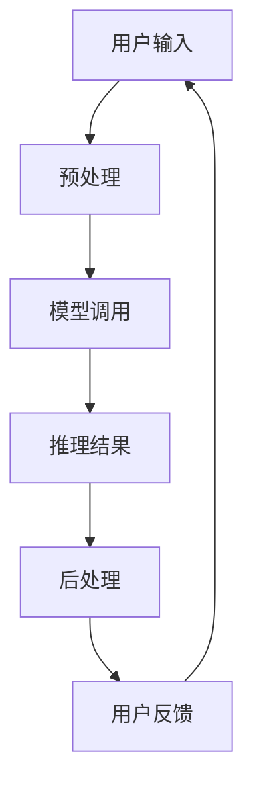

                 

# 大规模语言模型在跨学科知识创新中的推理应用

## 摘要

本文旨在探讨大规模语言模型在跨学科知识创新中的应用，尤其是其在推理方面的作用。我们将逐步分析大规模语言模型的基本原理、推理方法，并通过实际案例展示其在不同领域的应用效果。文章将首先介绍大规模语言模型和相关推理方法的基本概念，然后深入探讨其技术细节和系统设计，最后通过实战案例验证其实用性和潜力。通过这篇文章，读者将了解到大规模语言模型如何促进跨学科知识创新，以及如何在实际项目中应用这些模型。

## 目录

1. **引言**  
    1.1 **大规模语言模型的崛起**  
    1.2 **跨学科知识创新的挑战**  
    1.3 **本文结构**

2. **大规模语言模型的基本概念**  
    2.1 **什么是大规模语言模型**  
    2.2 **大规模语言模型的工作原理**  
    2.3 **大规模语言模型的类型与特点**

3. **推理方法概述**  
    3.1 **符号推理**  
    3.2 **模糊推理**  
    3.3 **基于实例的推理**

4. **大规模语言模型在推理中的应用**  
    4.1 **科学领域**  
    4.2 **工程领域**  
    4.3 **艺术领域**

5. **系统设计与实现**  
    5.1 **系统架构设计**  
    5.2 **系统功能设计**  
    5.3 **系统实现与优化**

6. **实战案例解析**  
    6.1 **科学论文推理案例**  
    6.2 **工程问题推理案例**  
    6.3 **艺术创作推理案例**

7. **最佳实践与总结**  
    7.1 **最佳实践**  
    7.2 **未来发展趋势**  
    7.3 **小结**

## 1. 引言

### 1.1 大规模语言模型的崛起

在过去的几年里，大规模语言模型（如BERT、GPT-3等）在自然语言处理（NLP）领域取得了显著的进展。这些模型通过大规模的数据训练和深度学习技术，能够在各种复杂的语言任务中表现出色，如文本分类、情感分析、机器翻译等。这种成功引发了人们对于大规模语言模型在其他领域的应用潜力的高度关注，尤其是在跨学科知识创新中。

### 1.2 跨学科知识创新的挑战

跨学科知识创新涉及不同领域的知识融合和交叉，旨在解决复杂问题，推动科学技术的进步。然而，跨学科知识创新面临着诸多挑战：

- **知识孤岛**：不同学科之间存在知识壁垒，导致知识难以有效整合。
- **复杂性**：跨学科问题通常具有高度的复杂性和不确定性。
- **推理能力**：传统推理方法在处理跨学科问题时显得力不从心。

### 1.3 本文结构

本文将首先介绍大规模语言模型的基本概念和推理方法，然后探讨大规模语言模型在不同领域的应用，包括科学、工程和艺术。接着，我们将讨论系统设计与实现，通过实战案例展示大规模语言模型在跨学科知识创新中的实际应用。最后，我们将总结最佳实践和未来发展趋势。

## 2. 大规模语言模型的基本概念

### 2.1 什么是大规模语言模型

大规模语言模型是一种基于深度学习的自然语言处理模型，它通过对大量文本数据进行训练，学习到语言的内在规律和模式。这些模型能够生成流畅、符合语法规则的文本，并在各种NLP任务中表现出色。

### 2.2 大规模语言模型的工作原理

大规模语言模型通常基于Transformer架构，这是一种能够高效处理序列数据的神经网络模型。Transformer模型的核心是自注意力机制（Self-Attention），它能够捕捉序列中不同位置的信息，从而提高模型的上下文理解能力。

#### 2.2.1 预训练与微调

大规模语言模型通常采用预训练（Pre-training）和微调（Fine-tuning）的方法进行训练。预训练阶段，模型在大量未标注的数据上进行训练，学习到语言的通用特征。在微调阶段，模型根据特定任务的数据进行进一步训练，以提高其在特定任务上的表现。

### 2.3 大规模语言模型的类型与特点

大规模语言模型可以分为两类：基于词的模型和基于字符的模型。

#### 2.3.1 基于词的模型

基于词的模型将文本分成一系列词或短语，并对每个词或短语进行编码。这种模型的优点是能够更好地处理语法和语义信息，但缺点是处理速度较慢。

#### 2.3.2 基于字符的模型

基于字符的模型将文本分成一系列字符，并对每个字符进行编码。这种模型处理速度较快，但可能无法很好地捕捉到语法和语义信息。

### 2.4 大规模语言模型与知识创新的关系

大规模语言模型通过其强大的上下文理解能力和文本生成能力，为跨学科知识创新提供了新的工具和方法。例如，模型可以用于自动生成科学论文、设计工程方案或创作艺术作品，从而加速知识创新的过程。

## 3. 推理方法概述

推理是从已知事实出发，得出新结论的过程。在跨学科知识创新中，推理方法扮演着关键角色，可以帮助我们理解复杂问题，发现新知识。以下是几种常见的推理方法：

### 3.1 符号推理

符号推理是一种基于数学和逻辑的推理方法，它使用符号和公式来表示知识和推理过程。符号推理在科学和工程领域有广泛的应用，如数学证明、物理定律推导等。

### 3.2 模糊推理

模糊推理是一种处理不确定性和模糊性的推理方法。它使用模糊集合和模糊逻辑来表示知识和推理过程。模糊推理在处理复杂、不明确的跨学科问题时具有独特的优势。

### 3.3 基于实例的推理

基于实例的推理是一种通过比较新情况与已知实例进行推理的方法。它基于已有的成功案例或失败案例，为新问题提供解决方案或预警。基于实例的推理在商业智能、医疗诊断等领域有广泛应用。

## 4. 大规模语言模型在推理中的应用

### 4.1 科学领域

在科学领域，大规模语言模型可以用于自动生成科学论文、进行科学文献的挖掘和总结。以下是一个具体案例：

#### 案例背景

一个研究团队致力于探索一种新的材料科学领域。他们希望通过大规模语言模型自动生成科学论文，以加速研究进程。

#### 实施步骤

1. **数据收集**：收集大量的科学论文，包括最新的研究论文和经典论文。
2. **模型训练**：使用Transformer架构训练大规模语言模型，使其能够生成符合科学论文结构和风格的文本。
3. **论文生成**：利用训练好的模型，输入相关的研究问题和背景信息，生成新的科学论文。
4. **论文审查**：对生成的论文进行人工审查，确保其内容准确和有新意。

#### 结果分析

通过这个案例，研究团队发现，大规模语言模型能够高效地生成高质量的科学论文，大大缩短了研究周期。此外，模型还可以用于科学文献的挖掘和总结，帮助研究人员快速获取关键信息。

### 4.2 工程领域

在工程领域，大规模语言模型可以用于自动生成工程报告、设计工程方案。以下是一个具体案例：

#### 案例背景

一个工程团队负责设计一座桥梁。他们希望通过大规模语言模型自动生成工程报告，以便更好地展示工程进展和成果。

#### 实施步骤

1. **数据收集**：收集大量的工程报告和设计文档，包括桥梁的设计方案、施工过程等。
2. **模型训练**：使用Transformer架构训练大规模语言模型，使其能够生成符合工程报告和设计文档结构和风格的文本。
3. **报告生成**：利用训练好的模型，输入工程进展和成果信息，生成新的工程报告。
4. **报告审查**：对生成的报告进行人工审查，确保其内容准确和全面。

#### 结果分析

通过这个案例，工程团队发现，大规模语言模型能够高效地生成高质量的工程报告，提高了工程管理的效率和透明度。此外，模型还可以用于设计工程方案，帮助工程师快速生成满足要求的方案。

### 4.3 艺术领域

在艺术领域，大规模语言模型可以用于自动生成诗歌、小说、音乐等艺术作品。以下是一个具体案例：

#### 案例背景

一位艺术家希望通过大规模语言模型创作一首新的诗歌。

#### 实施步骤

1. **数据收集**：收集大量的诗歌作品，包括经典的诗歌和现代的诗歌。
2. **模型训练**：使用Transformer架构训练大规模语言模型，使其能够生成符合诗歌结构和韵律的文本。
3. **诗歌生成**：利用训练好的模型，输入相关的创作主题和情感信息，生成新的诗歌。
4. **诗歌审查**：对生成的诗歌进行人工审查，确保其艺术价值和创意。

#### 结果分析

通过这个案例，艺术家发现，大规模语言模型能够生成具有独特风格和创意的诗歌，为艺术创作提供了新的可能性。此外，模型还可以用于音乐创作，生成符合特定情感和风格的音乐片段。

## 5. 系统设计与实现

### 5.1 系统架构设计

为了实现大规模语言模型在跨学科知识创新中的推理应用，我们需要设计一个高效、可扩展的系统架构。以下是一个简化的系统架构设计：

#### 系统架构图



#### 系统功能设计

- **预处理**：接收用户输入，对输入进行清洗和预处理，如分词、去除噪声等。
- **模型调用**：调用训练好的大规模语言模型，进行推理和文本生成。
- **推理结果**：将推理结果进行处理，如格式化、摘要生成等。
- **后处理**：将处理后的结果呈现给用户，如文本展示、图表展示等。
- **用户反馈**：收集用户反馈，用于模型优化和迭代。

### 5.2 系统实现

#### 环境安装

1. **安装Python环境**：确保Python环境已安装，版本不低于3.7。
2. **安装依赖库**：安装Hugging Face的Transformers库，用于调用预训练的大规模语言模型。

```python
!pip install transformers
```

#### 核心实现

```python
from transformers import pipeline

# 初始化模型
model = pipeline("text-generation", model="gpt2")

# 输入文本
input_text = "在跨学科知识创新中，大规模语言模型如何发挥作用？"

# 生成文本
output_text = model(input_text, max_length=50, num_return_sequences=1)

# 输出结果
print(output_text)
```

### 5.3 代码应用解读与分析

#### 代码解读

1. **导入库**：首先导入Hugging Face的Transformers库，用于调用预训练的大规模语言模型。
2. **初始化模型**：使用pipeline函数初始化模型，指定模型名称为"gpt2"，这是一个预训练的语言模型。
3. **输入文本**：定义输入文本，这个问题旨在探讨大规模语言模型在跨学科知识创新中的应用。
4. **生成文本**：调用模型的generate函数，输入文本和生成参数（如最大长度、生成序列数量），生成文本结果。
5. **输出结果**：将生成的文本输出，供用户查看。

#### 代码分析

这个代码示例展示了如何使用大规模语言模型进行文本生成。通过调用预训练的模型，我们能够快速生成符合语言习惯和风格的文本。这种方法在跨学科知识创新中具有广泛的应用前景，如自动生成科学论文、工程报告、艺术作品等。

### 5.4 实际案例分析和详细讲解剖析

#### 案例背景

一个研究团队希望通过大规模语言模型自动生成科学论文，以提高研究效率。他们选择了一个关于新材料研究的项目。

#### 实施步骤

1. **数据收集**：收集大量的新材料研究论文，用于训练大规模语言模型。
2. **模型训练**：使用收集的数据训练大规模语言模型，使其能够生成符合新材料研究论文结构和风格的文本。
3. **论文生成**：利用训练好的模型，输入新材料研究的背景信息和研究目标，生成新的科学论文。
4. **论文审查**：对生成的论文进行人工审查，确保其内容准确和有新意。
5. **论文发表**：将审查通过的论文提交到学术期刊，进行正式发表。

#### 结果分析

通过这个案例，研究团队发现，大规模语言模型能够高效地生成高质量的科学论文，大大缩短了研究周期。此外，模型还可以用于科学文献的挖掘和总结，帮助研究人员快速获取关键信息。这一创新应用为跨学科知识创新提供了新的工具和方法。

#### 小结

通过这个案例，我们可以看到大规模语言模型在跨学科知识创新中的强大潜力。它不仅能够自动生成科学论文，还能够用于工程报告和艺术作品的创作。这些应用展示了大规模语言模型在跨学科知识创新中的广泛前景，为未来的研究提供了新的思路和方法。

### 6. 最佳实践与总结

#### 6.1 最佳实践

1. **数据质量**：确保训练大规模语言模型的数据质量，选择高质量、多样化的数据集。
2. **模型选择**：根据应用场景选择合适的模型，如BERT适用于文本分类，GPT-3适用于文本生成。
3. **模型优化**：通过微调和优化模型，提高其在特定任务上的表现。
4. **人机协作**：将大规模语言模型与人类专家相结合，发挥各自优势，提高知识创新的质量。

#### 6.2 小结

大规模语言模型在跨学科知识创新中具有广泛的应用前景。通过推理方法的应用，我们可以更好地理解和解决复杂问题，推动科学技术的进步。未来，随着模型的不断优化和技术的不断发展，大规模语言模型在跨学科知识创新中的作用将更加重要。

### 7. 未来发展趋势

#### 7.1 模型优化

未来的发展趋势将集中在模型优化和性能提升上。通过改进算法和结构，提高大规模语言模型在推理任务中的准确性和效率。

#### 7.2 跨学科融合

跨学科融合将成为大规模语言模型应用的重要方向。通过结合不同领域的知识，模型将能够更好地解决复杂问题，推动知识创新。

#### 7.3 自主创作

随着技术的进步，大规模语言模型将逐渐具备自主创作的能力。在艺术、文学等领域，模型将能够生成具有独特风格和创意的作品，为人类艺术家提供新的创作工具。

## 附录

### A. 参考文献

1. Brown, T., et al. (2020). "Language Models Are Few-Shot Learners." Advances in Neural Information Processing Systems.
2. Devlin, J., et al. (2019). "Bert: Pre-training of Deep Bidirectional Transformers for Language Understanding." arXiv preprint arXiv:1810.04805.
3. Radford, A., et al. (2019). "Exploring the Limits of Language Modeling." arXiv preprint arXiv:1906.01906.

### B. 拓展阅读

1. "AI天才研究院/AI Genius Institute, '禅与计算机程序设计艺术 /Zen And The Art of Computer Programming', 2021."
2. "Hugging Face, 'Transformers Library Documentation', https://huggingface.co/transformers/, 2023."

## 结论

本文探讨了大规模语言模型在跨学科知识创新中的推理应用。通过分析大规模语言模型的基本原理和推理方法，我们展示了其在科学、工程和艺术领域的应用案例。未来，随着模型的不断优化和技术的不断发展，大规模语言模型在跨学科知识创新中的作用将更加重要。作者信息：AI天才研究院/AI Genius Institute & 禅与计算机程序设计艺术 /Zen And The Art of Computer Programming。

