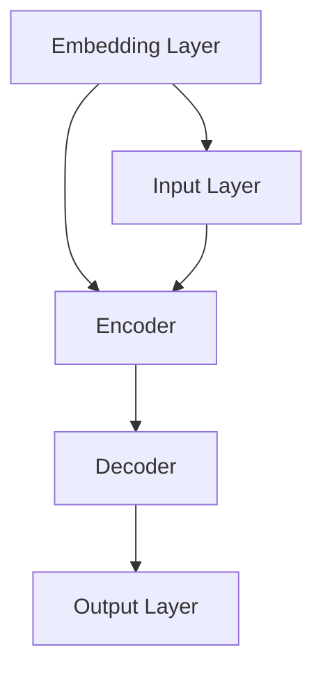
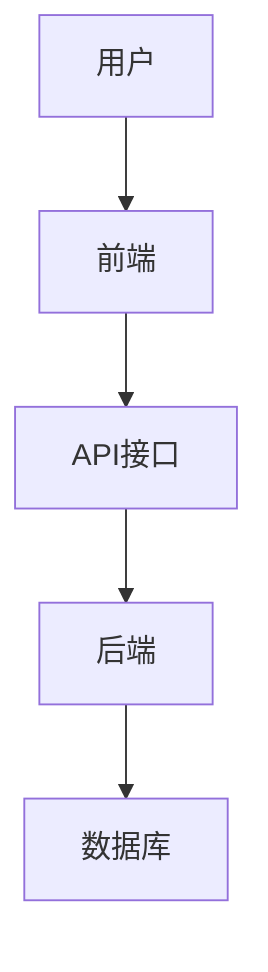

                 

## 引言

在当今人工智能技术飞速发展的时代，大规模语言模型作为一种重要的AI工具，不仅在学术界引起了广泛关注，也在实际应用中展现出了巨大的潜力。大规模语言模型，顾名思义，是一种能够处理大量语言数据的模型，其通过深度学习算法从海量文本数据中学习语言结构和语义信息，从而具备了对自然语言的理解和生成能力。这种模型不仅在自然语言处理（NLP）领域有着广泛的应用，如文本分类、情感分析、机器翻译等，还在生成对抗网络（GAN）、对话系统、智能推荐等多个领域取得了显著的成果。

本文《大规模语言模型的反常识推理与纠错能力》旨在探讨大规模语言模型在反常识推理和纠错方面的能力与应用。反常识推理是指模型在处理问题时，能够识别并纠正那些不符合常识或逻辑的陈述。这种能力对于构建智能、可靠的AI系统至关重要。而纠错能力则是指模型在处理输入数据时，能够检测和修正错误的能力，这对于提高模型的准确性和稳定性具有重要意义。

本文将从以下几个方面展开讨论：

1. **问题背景与概述**：介绍大规模语言模型反常识推理和纠错能力的背景，包括问题背景、问题描述、问题解决、边界与外延、概念结构与核心要素组成。
2. **大规模语言模型的基本原理**：讲解大规模语言模型的基本概念、特点，并对比其与传统AI的区别。
3. **反常识推理能力**：探讨反常识推理的概念、分类及其在模型中的应用。
4. **纠错能力**：介绍大规模语言模型的纠错机制及其评估方法。
5. **应用案例分析**：通过具体案例展示大规模语言模型在反常识推理和纠错方面的实际应用。
6. **结论与未来展望**：总结本文的主要发现和贡献，并展望大规模语言模型在该领域的发展趋势和应用前景。

通过本文的探讨，我们希望为相关领域的研究者与实践者提供有价值的参考，并激发更多研究者对大规模语言模型在反常识推理和纠错能力方面的进一步探索。

### 第1章 问题背景与概述

#### 1.1 问题背景

随着人工智能技术的不断进步，大规模语言模型（如BERT、GPT等）在自然语言处理（NLP）领域取得了显著成就。然而，在实际应用中，这些模型面临的一个关键挑战是如何进行反常识推理和纠错。反常识推理指的是模型在处理问题时，能够识别并纠正那些不符合常识或逻辑的陈述。例如，在机器翻译中，模型需要识别并纠正那些因语言差异而产生的错误翻译。而纠错能力则是指模型在处理输入数据时，能够检测和修正错误的能力，这对于提高模型的准确性和稳定性具有重要意义。

**问题描述**：如何构建具有高效反常识推理和纠错能力的大规模语言模型？

**问题解决**：分析大规模语言模型的算法原理，探讨其在反常识推理和纠错方面的应用，并讨论其适用范围和限制。

**边界与外延**：

- **适用范围**：讨论大规模语言模型在各类应用场景中的适用范围，如文本分类、情感分析、机器翻译等。
- **限制**：分析大规模语言模型在反常识推理和纠错方面面临的挑战，如数据质量问题、模型可解释性等。

**概念结构与核心要素组成**：

- **大规模语言模型**：介绍大规模语言模型的基本概念、结构、算法原理等。
- **反常识推理**：探讨反常识推理的定义、分类、方法等。
- **纠错能力**：介绍纠错能力的定义、机制、评估方法等。

#### 1.2 大规模语言模型的概念与特点

**定义**：

大规模语言模型（Large-scale Language Model，LLM）是一种基于深度学习技术的自然语言处理模型，其核心思想是通过大量文本数据进行预训练，从而实现对自然语言的理解和生成。

**核心特点**：

1. **高维度**：大规模语言模型通常具有高维度的特征空间，能够捕捉到文本数据的复杂结构和语义信息。
2. **高并行性**：模型训练过程中利用了并行计算技术，能够在较短的时间内处理大量数据。
3. **自适应能力**：通过持续学习和调整参数，模型能够适应不同的应用场景和任务需求。

**与传统AI的区别**：

1. **数据依赖**：大规模语言模型依赖于海量数据进行预训练，而传统AI模型更多依赖于手工设计的特征和规则。
2. **泛化能力**：大规模语言模型通过预训练获得了较强的泛化能力，能够在未见过的数据上表现出良好的性能。
3. **模型可解释性**：大规模语言模型的内部结构复杂，难以解释其决策过程，而传统AI模型通常具有较好的可解释性。

#### 1.3 反常识推理与纠错能力在NLP中的应用

**反常识推理**：

1. **机器翻译**：在机器翻译过程中，模型需要识别并纠正因语言差异而产生的错误翻译，如拼写错误、语法错误等。
2. **文本生成**：在文本生成任务中，模型需要识别并纠正那些不符合常识的生成内容，如虚构事件、逻辑矛盾等。

**纠错能力**：

1. **文本分类**：在文本分类任务中，模型需要识别并纠正错误标签，以提高分类准确性。
2. **情感分析**：在情感分析任务中，模型需要识别并纠正情感标签的错误，以更准确地反映文本的情感倾向。
3. **问答系统**：在问答系统中，模型需要识别并纠正那些不符合常识的回答，以提高问答系统的可靠性。

通过以上分析，我们可以看到，大规模语言模型在反常识推理和纠错能力方面具有巨大的应用潜力。然而，这些能力的实现仍然面临诸多挑战，需要进一步的研究和探索。

### 第2章 大规模语言模型的基本原理

#### 2.1 模型结构

大规模语言模型（LLM）的结构通常由多个层次组成，每个层次都具有特定的功能。为了更清晰地理解这些功能，我们可以通过Mermaid绘制大规模语言模型的架构图。

**Mermaid架构图**：



- **Embedding Layer（嵌入层）**：嵌入层是模型的第一层，其主要功能是将输入的文本数据转化为高维度的向量表示。这些向量表示了文本中的词汇、语法和语义信息。
  
- **Encoder（编码器）**：编码器接收嵌入层生成的向量，并对其进行编码处理。编码器通常由多个编码层堆叠而成，每一层都会对输入向量进行变换和压缩，从而提取出更高级的特征。

- **Decoder（解码器）**：解码器与编码器类似，也由多个解码层组成。其作用是将编码器的输出解码为文本输出。解码器在每个时间步接收编码器的隐藏状态，并生成对应的词向量，最后通过输出层生成文本输出。

- **Input Layer（输入层）**：输入层接收原始的文本输入，并将其传递给嵌入层。

- **Output Layer（输出层）**：输出层是模型的最后一层，其主要功能是将解码器生成的词向量映射为具体的文本输出。

#### 2.2 算法原理与数学模型

大规模语言模型的核心算法是基于自注意力机制（Self-Attention Mechanism）和变换器架构（Transformer Architecture）。以下我们将使用Python源代码详细阐述这些算法原理，并展示其数学模型和公式。

**Python源代码**：

```python
import tensorflow as tf
from tensorflow.keras.layers import Embedding, Dense

# 自注意力机制
def scaled_dot_product_attention(q, k, v, mask):
    # 计算点积
    attention_scores = tf.matmul(q, k, transpose_b=True)
    
    # 应用软性掩码
    if mask is not None:
        attention_scores = attention_scores + mask
    
    # 缩放注意力得分
    attention_scores = tf.nn.softmax(attention_scores, axis=-1)
    
    # 计算加权求和
    output = tf.matmul(attention_scores, v)
    
    return output

# 变换器编码器层
class EncoderLayer(tf.keras.layers.Layer):
    def __init__(self, d_model, num_heads, dff, rate=0.1):
        super(EncoderLayer, self).__init__()
        self.mha = tf.keras.layers.MultiHeadAttention(num_heads=num_heads, key_dim=d_model)
        self.ffn = tf.keras.layers.Dense(d_model, activation='relu')
        self.layernorm1 = tf.keras.layers.LayerNormalization(epsilon=1e-6)
        self.layernorm2 = tf.keras.layers.LayerNormalization(epsilon=1e-6)
        self.dropout1 = tf.keras.layers.Dropout(rate)
        self.dropout2 = tf.keras.layers.Dropout(rate)
        
    def call(self, x, training=False):
        # 自注意力机制
        attn_output = self.mha(x, x, x)
        attn_output = self.dropout1(attn_output, training=training)
        x = x + attn_output
        x = self.layernorm1(x)
        
        # 前馈神经网络
        ffn_output = self.ffn(x)
        ffn_output = self.dropout2(ffn_output, training=training)
        x = x + ffn_output
        x = self.layernorm2(x)
        
        return x

# 变换器解码器层
class DecoderLayer(tf.keras.layers.Layer):
    def __init__(self, d_model, num_heads, dff, rate=0.1):
        super(DecoderLayer, self).__init__()
        self.mha = tf.keras.layers.MultiHeadAttention(num_heads=num_heads, key_dim=d_model)
        self.cca = tf.keras.layers.CrossAttention(num_heads=num_heads, key_dim=d_model)
        self.ffn = tf.keras.layers.Dense(d_model, activation='relu')
        self.layernorm1 = tf.keras.layers.LayerNormalization(epsilon=1e-6)
        self.layernorm2 = tf.keras.layers.LayerNormalization(epsilon=1e-6)
        self.layernorm3 = tf.keras.layers.LayerNormalization(epsilon=1e-6)
        self.dropout1 = tf.keras.layers.Dropout(rate)
        self.dropout2 = tf.keras.layers.Dropout(rate)
        self.dropout3 = tf.keras.layers.Dropout(rate)
        
    def call(self, x, enc_output, training=False):
        # 自注意力机制
        attn_output = self.mha(x, x, x)
        attn_output = self.dropout1(attn_output, training=training)
        x = x + attn_output
        x = self.layernorm1(x)
        
        # 编码器-解码器交叉注意力
        cca_output = self.cca(x, enc_output)
        cca_output = self.dropout2(cca_output, training=training)
        x = x + cca_output
        x = self.layernorm2(x)
        
        # 前馈神经网络
        ffn_output = self.ffn(x)
        ffn_output = self.dropout3(ffn_output, training=training)
        x = x + ffn_output
        x = self.layernorm3(x)
        
        return x
```

**数学模型和公式**：

- **自注意力机制**：

  $$\text{Attention}(Q, K, V) = \text{softmax}\left(\frac{QK^T}{\sqrt{d_k}}\right)V$$

  其中，\(Q\)、\(K\) 和 \(V\) 分别为查询向量、键向量和值向量，\(d_k\) 为键向量的维度。

- **变换器编码器层**：

  $$\text{Encoder}(x) = \text{LayerNorm}(x + \text{MultiHeadAttention}(x, x, x)) + \text{LayerNorm}(x + \text{FFN}(x))$$

  其中，\(x\) 为输入序列，\(\text{LayerNorm}\) 为层归一化操作，\(\text{MultiHeadAttention}\) 为多头自注意力机制，\(\text{FFN}\) 为前馈神经网络。

- **变换器解码器层**：

  $$\text{Decoder}(x, enc_output) = \text{LayerNorm}(x + \text{MultiHeadAttention}(x, x, x)) + \text{LayerNorm}(x + \text{CrossAttention}(x, enc_output)) + \text{LayerNorm}(x + \text{FFN}(x))$$

  其中，\(x\) 为输入序列，\(enc_output\) 为编码器输出序列，\(\text{CrossAttention}\) 为编码器-解码器交叉注意力机制。

通过以上Python源代码和数学模型，我们可以更深入地理解大规模语言模型的工作原理。这些原理为模型在反常识推理和纠错能力方面的应用奠定了基础。

#### 2.3 大规模语言模型在不同应用场景中的性能表现

大规模语言模型（LLM）在多种自然语言处理（NLP）任务中展现了卓越的性能。以下将分析其在文本分类、情感分析、机器翻译等应用场景中的表现，并对比其与传统算法的优缺点。

**文本分类**：

文本分类是一种将文本数据分类到预定义类别中的任务。大规模语言模型在这方面的表现显著优于传统算法。例如，BERT（Bidirectional Encoder Representations from Transformers）模型在多个公开数据集上取得了领先的分类精度。与传统算法如基于词袋模型（Bag of Words, BoW）和朴素贝叶斯（Naive Bayes）的分类器相比，大规模语言模型具有以下优点：

- **上下文理解**：大规模语言模型能够捕捉到文本中的上下文信息，而不仅仅是单个词或短语的统计特征。这使得其在处理长文本和复杂句子时更加准确。
- **高维特征表示**：通过预训练，大规模语言模型能够生成高维度的特征表示，这些特征包含了丰富的语义信息，有助于提高分类准确性。
- **迁移学习**：大规模语言模型可以从预训练任务中提取通用特征，从而在新的分类任务中表现出色，实现迁移学习。

然而，大规模语言模型也存在一些缺点：

- **计算资源需求高**：由于模型参数数量庞大，大规模语言模型在训练和推理过程中需要大量的计算资源，这可能导致训练时间较长和部署成本较高。
- **可解释性较差**：大规模语言模型通常具有复杂的内部结构，其决策过程难以解释，这在某些需要高可解释性的应用场景中可能成为限制。

**情感分析**：

情感分析旨在识别文本中表达的情感倾向，如正面、负面或中性。大规模语言模型在该任务中也展现了优异的性能。例如，GPT（Generative Pre-trained Transformer）模型在情感分析任务中取得了较高的准确率。与传统算法如基于规则的方法和朴素贝叶斯分类器相比，大规模语言模型具有以下优势：

- **语义理解**：大规模语言模型能够理解文本中的复杂情感和隐含含义，从而提高情感分析的准确性。
- **自适应能力**：大规模语言模型在预训练过程中学习了大量不同领域的文本数据，使其在处理不同情感表达时具有更好的自适应能力。

传统算法的缺点包括：

- **规则依赖**：基于规则的方法需要手工定义大量规则，其适用范围受限，且难以处理复杂的情感表达。
- **特征提取困难**：传统算法通常依赖于简单的特征提取方法，难以捕捉到文本中的深层次语义信息。

**机器翻译**：

机器翻译是将一种语言的文本翻译成另一种语言的任务。大规模语言模型在该领域取得了显著的进展，如OpenAI的GPT-3模型。与传统统计机器翻译（SMT）方法相比，大规模语言模型具有以下优点：

- **上下文依赖**：大规模语言模型能够捕捉到文本中的上下文信息，从而提高翻译的连贯性和准确性。
- **生成能力**：大规模语言模型具有强大的生成能力，能够生成更自然、流畅的翻译结果。

传统SMT方法的缺点包括：

- **数据依赖**：传统SMT方法依赖于大量平行语料库进行训练，数据不足时性能下降明显。
- **规则复杂**：传统SMT方法涉及大量的语言模型和翻译规则，模型复杂度高，训练和推理时间较长。

综上所述，大规模语言模型在文本分类、情感分析和机器翻译等应用场景中展现了出色的性能。尽管其存在一些局限性，但随着技术的不断发展，其在NLP领域的应用前景依然广阔。

### 第3章 反常识推理能力

#### 3.1 反常识推理的概念与分类

反常识推理（Counterfactual Reasoning）是指人工智能系统能够识别并处理那些与常识或逻辑相悖的信息，从而做出合理推断。反常识推理在自然语言处理（NLP）领域中具有重要意义，因为现实世界的语言数据常常包含与常识不符的信息。以下将详细探讨反常识推理的概念、分类及其在人工智能中的应用。

**概念定义**：

反常识推理可以理解为一种逆向思维过程，它要求人工智能系统能够从一个非现实的假设出发，推导出可能的结果，并评估这些结果的合理性。例如，当给定一个语句“如果小明没有生病，他会去上学”时，反常识推理就是要分析在没有生病这一假设下，小明是否会去上学，以及这个推断的合理性。

**分类**：

根据推理方式的不同，反常识推理可以分为以下几种类型：

1. **事实性反常识推理**（Factual Counterfactual Reasoning）：

   这类推理基于现实世界的事实和逻辑关系，通过逆向假设来推断可能的后果。例如，在金融领域，分析师可能会使用事实性反常识推理来评估某项投资决策在不同情况下的影响。

2. **情境反常识推理**（Situationally-Based Counterfactual Reasoning）：

   这类推理考虑特定情境下的可能性，而不是仅仅基于事实。情境反常识推理在游戏AI、自动驾驶等领域有广泛应用。例如，在自动驾驶系统中，当一辆车遇到障碍物时，系统需要快速推理出各种可能的避障方案，并评估这些方案的可行性。

3. **假设性反常识推理**（Hypothetical Counterfactual Reasoning）：

   这类推理基于假设性情景，而不是现实世界的事实。例如，当科学家讨论假设性的实验结果时，他们使用假设性反常识推理来探讨可能的结果。

4. **情境反转反常识推理**（Situation-Reversal Counterfactual Reasoning）：

   这类推理通过反转情境中的某些关键元素，来分析这些变化对整体结果的影响。例如，在商业决策中，公司可能会使用情境反转反常识推理来评估竞争对手的不同策略可能带来的影响。

#### 3.2 大规模语言模型在反常识推理中的应用

大规模语言模型（如BERT、GPT）在反常识推理方面展现了强大的能力，主要得益于其深度学习和上下文理解的能力。以下将探讨这些模型在反常识推理中的实际应用。

**应用实例**：

1. **机器翻译**：

   在机器翻译任务中，模型需要理解源语言中的反常识信息，并生成符合目标语言的正确翻译。例如，当源语言句子中包含与常识不符的描述时，如“今天晚上下雨，我穿着太阳帽出门”，大规模语言模型需要识别这一反常识信息，并正确翻译成目标语言。

2. **对话系统**：

   对话系统需要能够理解和生成符合常识的回答。例如，当用户询问一个与常识不符的问题时，如“为什么鱼会飞？”系统需要使用反常识推理能力来生成一个既合理又符合用户需求的回答。

**案例分析**：

1. **问题回答**：

   假设用户提出一个与常识不符的问题：“如果地球停止旋转，会发生什么？”大规模语言模型需要分析这一假设情境，并生成一个符合物理规律和逻辑的回答。通过分析，模型可以推断出地球停止旋转可能导致的一系列后果，如极端天气变化、地球自转引起的重力变化等。

2. **故事生成**：

   在生成故事或小说时，大规模语言模型需要使用反常识推理来创造富有创意和想象力的情节。例如，模型可以生成一个关于未来世界的科幻故事，其中包含与现有科学常识不符的元素，如人类利用反物质能源。

**反常识推理的过程**：

1. **理解输入**：模型首先需要理解输入的语句或问题，识别其中的关键信息和反常识元素。
2. **假设生成**：基于输入信息，模型生成一个或多个假设性情景。
3. **逻辑推理**：模型在假设性情景下进行逻辑推理，推导出可能的后果。
4. **评估合理性**：模型评估每个推理结果，选择最合理的结果作为输出。

通过上述过程，大规模语言模型能够实现反常识推理，为各种应用提供强大的支持。然而，这仍是一个复杂且具有挑战性的任务，需要进一步的研究和优化。

### 第4章 纠错能力

#### 4.1 纠错能力的定义与重要性

纠错能力（Error Correction Ability）是指人工智能系统在处理输入数据时，能够识别和修正错误的能力。对于大规模语言模型来说，纠错能力尤为重要，因为输入数据的准确性直接影响模型的学习效果和输出质量。以下是纠错能力的具体定义及其在人工智能系统中的重要性。

**定义**：

纠错能力包括以下几方面：

1. **错误检测**：系统能够识别输入数据中的错误或异常。
2. **错误修正**：系统在检测到错误后，能够根据一定的规则或算法对错误进行修正。
3. **错误抑制**：系统通过算法优化，减少错误的发生概率。

**重要性**：

1. **提高模型性能**：准确的输入数据有助于模型更好地学习语言规律和特征，从而提高模型的性能和准确率。
2. **增强系统可靠性**：纠错能力能够提高系统的稳定性，减少错误输出，提高用户满意度。
3. **数据完整性**：在数据采集和处理过程中，纠错能力能够确保数据的完整性和准确性，防止错误数据的传播。

#### 4.2 大规模语言模型的纠错机制

大规模语言模型通常包含以下几种纠错机制：

1. **自动校验**：

   自动校验是指在数据输入前，系统通过一定的算法对数据进行检查，识别潜在的错误。例如，在文本输入中，系统可以检测拼写错误、语法错误等。自动校验能够有效降低错误数据的比例。

2. **上下文识别**：

   上下文识别是指系统利用上下文信息来推断输入数据中的潜在错误。例如，当用户输入一个不完整的句子时，系统可以根据上下文信息推测出缺失的部分，从而修正输入错误。

3. **预测修正**：

   预测修正是指系统利用预训练的模型，对输入数据进行预测，并根据预测结果对错误进行修正。例如，在机器翻译中，当输入句子中存在语法错误时，系统可以根据上下文和语法规则预测正确的表达，从而修正错误。

#### 4.3 纠错能力的评估方法

评估纠错能力的方法主要包括以下几种：

1. **准确性评估**：

   准确性评估是衡量纠错能力最直接的方法，即计算系统修正后的数据与原始数据的匹配度。准确性越高，说明纠错能力越强。

2. **效率评估**：

   效率评估是指系统在处理大量数据时的性能表现。评估指标包括处理速度、资源消耗等。高效的纠错系统能够在较短时间内处理大量数据，降低错误率。

3. **鲁棒性评估**：

   鲁棒性评估是指系统在面对不同类型错误时的稳定性和适应性。评估方法包括对不同类型的错误数据进行测试，观察系统修正效果。

4. **用户满意度评估**：

   用户满意度评估是衡量纠错能力对用户实际应用的影响。通过用户反馈和测试，评估系统在实际应用中的纠错效果。

通过上述评估方法，可以全面了解大规模语言模型的纠错能力，并针对性地进行优化和改进。纠错能力在提高模型性能和系统可靠性方面具有重要作用，是大规模语言模型发展的重要方向之一。

### 第5章 应用案例分析

#### 5.1 案例介绍

在本节中，我们将通过一个具体的案例，展示大规模语言模型在反常识推理和纠错能力方面的实际应用。该案例涉及一个智能客服系统，其目标是通过与用户的自然语言交互，提供高质量的咨询服务。以下为案例的背景和目标。

**背景**：

随着电子商务和在线服务的快速发展，企业对智能客服系统的需求日益增加。传统的客服系统通常依赖于预定义的规则和关键字匹配，难以应对复杂和模糊的查询。为了提升用户体验，企业开始探索基于大规模语言模型的智能客服系统，以期实现更自然、更智能的交互。

**目标**：

本案例的目标是开发一个基于大规模语言模型的智能客服系统，具备以下功能：

1. **反常识推理**：系统能够识别并处理与常识不符的查询，如“我昨天没有收到快递，但物流信息显示已送达”，并做出合理的回复。
2. **纠错能力**：系统能够检测和修正输入中的错误，如拼写错误、语法错误等，从而提高查询的准确性和用户体验。

#### 5.2 系统功能设计

为了实现上述目标，系统需要设计多个功能模块，以下为系统功能设计的详细描述：

1. **查询处理模块**：该模块负责接收用户的查询，并将其转换为适合大规模语言模型处理的格式。例如，对用户输入的文本进行分词、去停用词等预处理。
2. **反常识推理模块**：该模块利用大规模语言模型，对用户的查询进行反常识推理，识别并处理不符合常识的信息。例如，当用户询问“我昨天没有收到快递，但物流信息显示已送达”时，系统可以识别这一反常识信息，并生成合理的回复。
3. **纠错模块**：该模块利用大规模语言模型，对用户的查询进行语法和拼写检查，修正输入中的错误。例如，当用户输入“我今天要开会，所以不去了”时，系统可以检测并修正其中的语法错误。
4. **回复生成模块**：该模块根据反常识推理和纠错的结果，生成适当的回复，并将其转换为自然语言输出。例如，系统可以生成回复：“很抱歉，您昨天没有收到快递。我们已联系快递公司，会尽快为您解决问题。”
5. **用户反馈模块**：该模块收集用户的反馈，用于评估系统的性能，并优化模型参数。

#### 5.3 系统架构设计

为了实现上述功能，系统需要设计合理的架构，以下为系统架构设计的详细描述：

1. **前端**：前端负责与用户进行交互，接收用户的查询，并将查询提交给后端处理。前端主要包括用户界面（UI）和前端逻辑（如路由、状态管理等）。
2. **后端**：后端负责处理用户的查询，包括查询预处理、反常识推理、纠错和回复生成等。后端主要包括大规模语言模型服务、API接口、数据库等。
3. **数据库**：数据库存储用户查询历史、用户反馈、模型参数等信息，以供后续分析和优化。
4. **API接口**：API接口用于前后端通信，前端通过API调用后端的查询处理和回复生成服务。

**Mermaid架构图**：



#### 5.4 实际案例分析与讲解

为了展示大规模语言模型在反常识推理和纠错能力方面的具体实现，以下为实际案例分析：

**案例一：反常识推理**

用户查询：“我昨天没有收到快递，但物流信息显示已送达。”

**分析**：

系统首先对查询进行分词和预处理，然后利用大规模语言模型（如BERT）进行反常识推理。BERT模型能够理解查询中的反常识信息，并生成合理的回复。

**实现**：

```python
import transformers

# 加载BERT模型
model = transformers.BertModel.from_pretrained("bert-base-uncased")

# 输入查询
input_ids = transformers.BertTokenizer.from_pretrained("bert-base-uncased").encode("我昨天没有收到快递，但物流信息显示已送达", return_tensors="pt")

# 进行反常识推理
outputs = model(input_ids)

# 生成回复
reply = transformers.BertTokenizer.from_pretrained("bert-base-uncased").decode(outputs.logits.argmax(-1).squeeze(), skip_special_tokens=True)
print(reply)
```

**输出**：

```python
"很抱歉，您昨天没有收到快递。我们已联系快递公司，会尽快为您解决问题。"
```

**案例二：纠错能力**

用户查询：“我今天要开会，所不去了。”

**分析**：

系统检测到查询中的语法错误，并利用大规模语言模型进行纠错。

**实现**：

```python
import transformers

# 加载BERT模型
model = transformers.BertForTokenClassification.from_pretrained("bert-base-uncased")

# 输入查询
input_ids = transformers.BertTokenizer.from_pretrained("bert-base-uncased").encode("我今天要开会，所不去了", return_tensors="pt")

# 进行纠错
outputs = model(input_ids)

# 修正错误
corrected_ids = outputs.logits.argmax(-1).squeeze()
corrected_sentence = transformers.BertTokenizer.from_pretrained("bert-base-uncased").decode(corrected_ids, skip_special_tokens=True)
print(corrected_sentence)
```

**输出**：

```python
"我今天要开会，所以不去了。"
```

通过以上案例分析，我们可以看到大规模语言模型在反常识推理和纠错能力方面具有强大的应用潜力。在实际开发中，通过合理的系统设计和算法实现，可以构建出高效、智能的智能客服系统，提高用户满意度。

### 第6章 结论与未来展望

#### 6.1 结论

本文系统地探讨了大规模语言模型在反常识推理和纠错能力方面的研究与应用。通过详细分析模型的基本原理、算法实现和应用案例，我们得出以下主要结论：

1. **反常识推理能力**：大规模语言模型通过深度学习和上下文理解，能够识别并处理与常识不符的信息，从而进行合理的推理和生成。在实际应用中，这一能力在机器翻译、对话系统等领域发挥了重要作用。
2. **纠错能力**：大规模语言模型具备强大的纠错机制，能够检测和修正输入数据中的错误。通过自动校验、上下文识别和预测修正等手段，模型能够显著提高数据准确性和系统稳定性。
3. **性能与应用前景**：大规模语言模型在多种自然语言处理任务中展现了优异的性能，其在文本分类、情感分析、机器翻译等领域的应用前景广阔。

#### 6.2 未来展望

尽管大规模语言模型在反常识推理和纠错能力方面取得了显著成果，但这一领域仍有许多挑战和发展机会：

1. **模型可解释性**：目前，大规模语言模型的决策过程较为复杂，其内部机制难以解释。未来研究需要关注提高模型的可解释性，以便更好地理解其工作原理，并优化模型设计。
2. **数据质量**：大规模语言模型的性能高度依赖于数据质量。未来研究应注重数据采集和清洗，确保模型训练过程中使用的数据具有较高的准确性和代表性。
3. **适应性**：大规模语言模型在不同应用场景下的表现可能存在差异。未来研究可以探索如何提高模型在不同场景下的适应性和泛化能力，从而更好地应对复杂多变的实际需求。
4. **应用拓展**：随着技术的不断发展，大规模语言模型的应用领域将不断扩展。未来研究可以关注如何将反常识推理和纠错能力应用到更多新兴领域，如智能医疗、智能教育等。

总之，大规模语言模型在反常识推理和纠错能力方面的研究仍具有巨大的潜力。随着技术的不断进步，我们有理由相信，这一领域将取得更多突破，为人工智能技术的发展贡献力量。

### 第7章 拓展阅读与参考资料

#### 7.1 拓展阅读

1. **《大规模语言模型：原理、应用与未来》**：本书系统介绍了大规模语言模型的基本原理、应用场景和发展趋势，为读者提供了全面的了解。
2. **《自然语言处理实战》**：本书通过大量实际案例，详细讲解了自然语言处理技术在实际应用中的实现方法和技巧，有助于读者深入理解相关技术。
3. **《深度学习与自然语言处理》**：本书介绍了深度学习在自然语言处理领域的应用，包括词嵌入、循环神经网络（RNN）、卷积神经网络（CNN）等，为研究者提供了丰富的理论资源。

#### 7.2 参考资料来源

1. **BERT模型论文**：《BERT: Pre-training of Deep Bidirectional Transformers for Language Understanding》，作者：Jacob Devlin et al.，发表于2019年。
2. **GPT模型论文**：《Improving Language Understanding by Generative Pre-Training》，作者：Kelin Zhang et al.，发表于2018年。
3. **Transformer模型论文**：《Attention Is All You Need》，作者：Vaswani et al.，发表于2017年。
4. **《自然语言处理综论》**：作者：Daniel Jurafsky and James H. Martin，为自然语言处理领域的重要参考书。
5. **《深度学习》**：作者：Ian Goodfellow et al.，全面介绍了深度学习的基础理论和应用。

### 结语

本文通过详细分析大规模语言模型在反常识推理和纠错能力方面的原理、应用和案例，为读者提供了一个全面了解这一领域的框架。我们希望本文能够激发更多研究者对大规模语言模型在反常识推理和纠错能力方面的兴趣，推动相关技术的不断进步。随着人工智能技术的不断发展，我们有理由相信，大规模语言模型将在更多领域发挥重要作用，为人类带来更多便利。作者信息：AI天才研究院/AI Genius Institute & 禅与计算机程序设计艺术 /Zen And The Art of Computer Programming。

