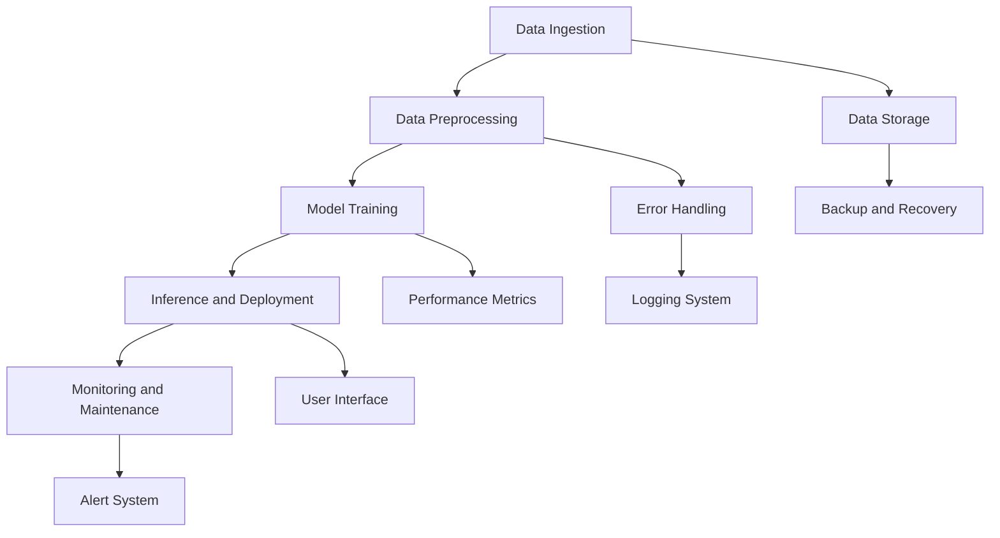
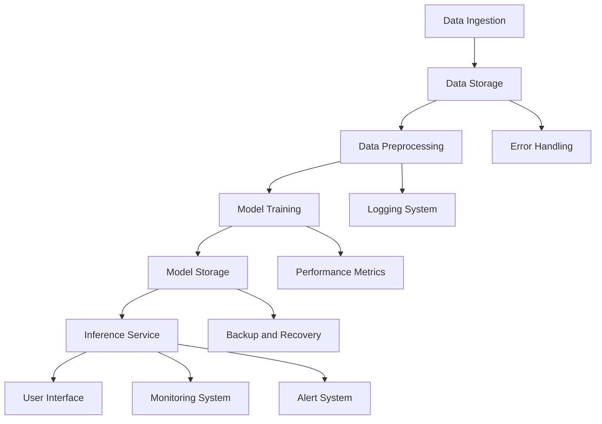
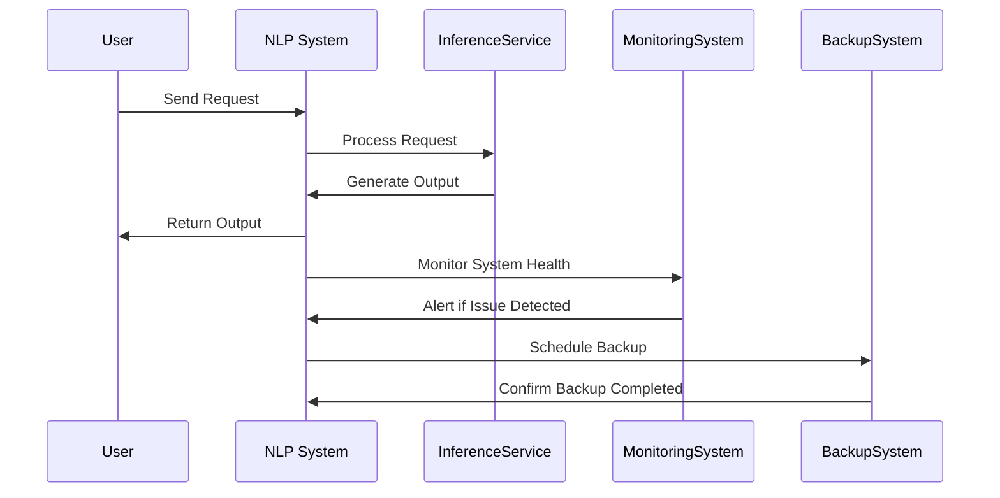

                 

### Introduction to the Book

**Title: Linguistic Models: Abstract Concepts Generalization and Practical Application Ability Evaluation**

**Keywords: Large-scale Language Models, Abstract Concept Generalization, Practical Application Ability, AI, Machine Learning**

**Abstract:**
This book delves into the intricacies of large-scale language models, focusing on their ability to generalize abstract concepts and apply those concepts in practical scenarios. We begin by providing a comprehensive background and overview of these models, highlighting their historical development and significance in modern AI. The book then moves on to explore the principles and methods behind abstract concept generalization, the criteria and methods for evaluating practical application ability, and the prospects and challenges associated with their implementation across various industries. The final chapters offer a theoretical framework, detailed algorithmic explanations, and practical implementation strategies, ensuring readers gain a thorough understanding of both the theoretical underpinnings and the practical applications of large-scale language models. Through this in-depth exploration, we aim to bridge the gap between academic research and real-world applications, empowering readers to harness the full potential of these powerful tools.

### Background and Overview of Large-scale Language Models

#### 1.1 Introduction to Large-scale Language Models
##### Definition and Scope

Large-scale language models are a class of artificial intelligence models designed to understand and generate human language. These models are characterized by their ability to process and generate text at a scale previously unattainable by traditional language processing techniques. A large-scale language model typically consists of a vast number of parameters, trained on an extensive corpus of text data to capture the intricate patterns and structures of human language.

The scope of large-scale language models encompasses a wide range of applications, from natural language processing (NLP) tasks such as text classification and sentiment analysis, to more complex tasks like machine translation, summarization, and question-answering. These models have found applications in various fields, including but not limited to, customer service automation, content creation, education, and healthcare.

##### Historical Development

The development of large-scale language models can be traced back to the advent of deep learning and neural networks in the late 20th and early 21st centuries. Initial efforts focused on small-scale models, such as the neural network-based models proposed by Bengio et al. in the late 1980s and early 1990s. These models laid the foundation for more sophisticated architectures like Long Short-Term Memory (LSTM) networks and later the Transformer architecture, which has become the cornerstone of modern large-scale language models.

One of the pivotal moments in the development of large-scale language models was the introduction of the Transformer model in 2017 by Vaswani et al. The Transformer architecture, which employs self-attention mechanisms, revolutionized the field by enabling the efficient processing of long-range dependencies in text data, thereby significantly outperforming traditional sequence models like LSTMs in various NLP tasks.

Following the success of the Transformer, several large-scale language models have been developed, including BERT, GPT, T5, and GPT-3. These models have pushed the boundaries of what is possible in NLP, achieving state-of-the-art performance on a wide range of tasks and setting new benchmarks for language understanding and generation.

##### Significance in Modern AI

The significance of large-scale language models in modern AI cannot be overstated. These models have transformed the way we approach language processing tasks, enabling machines to understand and generate human language with unprecedented accuracy and fluency. They have paved the way for new applications in areas such as automated translation, chatbots, and virtual assistants, significantly enhancing the capabilities of AI systems.

Moreover, large-scale language models have far-reaching implications beyond NLP. They have been used to solve complex problems in fields such as healthcare, where they assist in medical diagnosis and drug discovery. They have also found applications in finance, where they help in analyzing market trends and making informed investment decisions.

In summary, large-scale language models represent a major breakthrough in the field of AI, offering powerful tools for understanding and generating human language. Their historical development and current applications underscore their importance and potential for continued innovation in the years to come.

#### 1.2 Abstract Concept Generalization in Language Models
##### Principles and Methods

Abstract concept generalization in language models refers to the ability of these models to identify and understand underlying abstract concepts across various contexts and domains. This capability is crucial for enabling machines to perform tasks that require a deep understanding of language semantics, such as question-answering, summarization, and translation.

The principles underlying abstract concept generalization in language models can be summarized as follows:

1. **Data-driven Learning**: Language models are trained on vast amounts of text data, allowing them to learn patterns and relationships between words and concepts. This data-driven approach enables the models to identify and generalize abstract concepts based on the frequency and context of their occurrences in the training data.

2. **Representation Learning**: Language models leverage neural network architectures, particularly transformer-based models, to learn high-level representations of text data. These representations capture the semantic meaning of words and phrases, facilitating the identification and generalization of abstract concepts.

3. **Invariance to Context**: Abstract concept generalization requires models to be invariant to the specific context in which a concept is presented. This invariance is achieved through the use of attention mechanisms in transformer models, which allow the models to focus on the relevant parts of the input text while disregarding irrelevant details.

The methods used for abstract concept generalization in language models can be broadly categorized into the following:

1. **Pre-trained Models**: Pre-trained language models, such as BERT, GPT, and T5, are trained on large corpora of text data before being fine-tuned for specific tasks. These models have been pre-trained to generalize abstract concepts across various domains and contexts, providing a strong foundation for further task-specific fine-tuning.

2. **Transfer Learning**: Transfer learning involves taking a pre-trained language model and fine-tuning it on a specific task or domain. This approach leverages the generalization capabilities of the pre-trained model to improve performance on new tasks, even when the amount of available data is limited.

3. **Self-supervised Learning**: Self-supervised learning methods, such as masked language modeling (MLM) and next sentence prediction (NSP), are commonly used to pre-train language models. These methods generate artificial labels from the input text data, allowing the models to learn abstract concepts without the need for annotated data.

##### Challenges and Potential Solutions

Despite the remarkable progress made in abstract concept generalization, several challenges remain:

1. **Data Bias**: Language models trained on biased data can generalize biased abstract concepts, leading to unfair and discriminatory outcomes. Addressing this challenge requires the development of techniques for identifying and mitigating data bias.

2. **Context Sensitivity**: Abstract concept generalization often requires models to be context-invariant, which can be difficult to achieve, especially in highly ambiguous or context-dependent scenarios. Techniques for improving context sensitivity, such as multi-modal fusion and contextualized embeddings, are being explored.

3. **Limited Domain Coverage**: Existing language models may not cover all domains or contexts, limiting their ability to generalize abstract concepts across diverse domains. Developing models that can adapt to new domains through transfer learning and few-shot learning is an area of active research.

In summary, abstract concept generalization in language models is a complex and challenging task, but with the right principles and methods, it is possible to achieve significant progress. The ongoing research and development in this area hold the promise of unlocking new capabilities for language models, enabling them to perform more advanced tasks with greater accuracy and reliability.

#### 1.3 Evaluation of Practical Application Ability
##### Criteria for Evaluation

The practical application ability of large-scale language models is a critical aspect that determines their effectiveness in real-world scenarios. Evaluating the practical application ability of these models requires a comprehensive set of criteria that capture various dimensions of their performance. The following criteria are commonly used in evaluating the practical application ability of large-scale language models:

1. **Accuracy**: Accuracy measures the ability of a language model to generate correct outputs given a particular input. It is a fundamental metric for assessing the model's performance, particularly in tasks such as text classification, question-answering, and machine translation.

2. **F1 Score**: The F1 score is a harmonic mean of precision and recall, providing a balanced evaluation of the model's performance in binary classification tasks. It is particularly useful when the class distribution is imbalanced, ensuring that the model does not favor one class over another.

3. **BLEU Score**: BLEU (Bilingual Evaluation Understudy) score is commonly used to evaluate the quality of machine-generated text compared to human-written text. It measures the similarity between the generated text and the reference text using various n-gram overlap metrics.

4. **ROUGE Score**: ROUGE (Recall-Oriented Understudy for Gisting Evaluation) score is another metric used for evaluating the quality of generated text. It measures the overlap between the generated text and a set of annotated reference texts, focusing on recall rather than precision.

5. **Latency**: Latency measures the time it takes for a language model to process an input and generate an output. Low latency is crucial for applications that require real-time responses, such as chatbots and virtual assistants.

6. **Robustness**: Robustness evaluates the ability of a language model to handle noisy or incomplete input data without significant degradation in performance. This criterion is essential for applications where data quality cannot be guaranteed.

7. **Scalability**: Scalability measures the model's ability to handle increasing amounts of data and computational resources efficiently. Scalability is critical for deploying language models in large-scale production environments.

##### Methods for Assessment

Evaluating the practical application ability of large-scale language models involves both qualitative and quantitative methods. The following are common methods used for assessing the practical application ability of these models:

1. **Benchmark Testing**: Benchmark testing involves comparing the performance of a language model against established benchmarks on standard datasets. This method provides a quantitative assessment of the model's performance relative to state-of-the-art models in the field.

2. **Domain Adaptation**: Domain adaptation involves evaluating the model's ability to perform well in new or different domains. This method assesses the model's generalization capabilities and its ability to adapt to new contexts without extensive retraining.

3. **Real-world Applications**: Real-world applications involve deploying the language model in actual use cases and evaluating its performance in real-time scenarios. This method provides a practical assessment of the model's effectiveness in real-world applications, capturing the nuances and challenges of real-world data.

4. **User Feedback**: User feedback involves collecting feedback from users who interact with the language model in real-world applications. This method provides qualitative insights into the model's usability, effectiveness, and user satisfaction.

5. **Case Studies**: Case studies involve in-depth analysis of specific applications of the language model in various domains. This method provides detailed insights into the model's performance, challenges encountered, and potential improvements.

In summary, evaluating the practical application ability of large-scale language models requires a multi-faceted approach that considers various criteria and assessment methods. By using these criteria and methods, researchers and practitioners can gain a comprehensive understanding of the model's capabilities and limitations, guiding the development of more effective and robust language models.

#### 1.4 Application Prospects and Challenges
##### Industries and Sectors

Large-scale language models have vast application prospects across various industries and sectors, offering transformative potential in areas such as healthcare, finance, education, and customer service.

**Healthcare**: In healthcare, language models are used for tasks such as medical text summarization, disease prediction, and drug discovery. They can analyze clinical notes, patient histories, and research articles to extract valuable insights, improving diagnostic accuracy and treatment effectiveness. Additionally, language models can facilitate the development of chatbots for patient support and triage, providing timely and accurate information to patients.

**Finance**: In the finance sector, language models are employed for tasks like sentiment analysis, market prediction, and risk assessment. They analyze financial news, social media sentiment, and market data to provide insights into market trends and investor sentiment, helping financial institutions make informed decisions. Language models can also automate the preparation of financial reports and generate investment recommendations based on historical data and market trends.

**Education**: Language models have significant applications in education, including automated essay grading, personalized tutoring, and content generation. They can analyze student performance data to provide personalized learning plans, helping students improve their skills and achieve better outcomes. Language models can also generate educational content, such as articles, lectures, and quizzes, making learning materials more accessible and engaging.

**Customer Service**: In customer service, language models are used to build chatbots and virtual assistants that can handle customer inquiries, provide support, and resolve issues. These models can understand natural language queries and generate appropriate responses, improving customer satisfaction and reducing response times. Language models can also analyze customer feedback to identify common pain points and areas for improvement.

##### Opportunities and Risks

While the application prospects of large-scale language models are promising, they also come with certain opportunities and risks.

**Opportunities**:

1. **Enhanced Efficiency**: Language models can automate routine tasks, reducing the need for manual intervention and improving operational efficiency. This can lead to cost savings and increased productivity across various sectors.

2. **Improved Decision-Making**: By providing insights into large volumes of data, language models can support data-driven decision-making, helping organizations make more informed and strategic decisions.

3. **Access to Information**: Language models can make information more accessible, particularly in areas where language barriers exist. They can translate content into multiple languages, making educational and scientific resources available to a broader audience.

4. **Personalization**: Language models can tailor their responses to individual users, providing personalized experiences and improving user satisfaction. This is particularly relevant in sectors like education and healthcare, where personalized approaches can lead to better outcomes.

**Risks**:

1. **Data Privacy**: Language models require vast amounts of data to train and operate effectively, raising concerns about data privacy and security. Organizations must ensure that sensitive data is handled appropriately and that privacy regulations are遵守。

2. **Bias and Fairness**: Language models can perpetuate and amplify biases present in the training data, leading to unfair outcomes. Ensuring fairness and mitigating biases is a critical challenge in the development and deployment of language models.

3. **Misuse and Misinformation**: Language models can generate convincing but misleading content, potentially leading to the spread of misinformation and the misuse of AI systems. Developing robust mechanisms to detect and mitigate such risks is essential.

4. **Dependency**: Over-reliance on language models for critical tasks can lead to dependency issues, where human decision-making is compromised. It is important to maintain a balance between automation and human intervention to ensure effective and responsible use of these models.

In conclusion, large-scale language models offer significant opportunities across various industries, but they also come with inherent risks that need to be addressed. By leveraging these models responsibly and addressing the associated challenges, organizations can harness their full potential for transformative impact.

#### 1.5 Summary and Conclusion
##### Key Points

This chapter has provided a comprehensive overview of large-scale language models, their historical development, and their significance in modern AI. We have discussed the principles and methods of abstract concept generalization and the criteria and methods for evaluating their practical application ability. Additionally, we have explored the vast application prospects of these models across various industries and highlighted the opportunities and risks associated with their deployment. The key points from this chapter can be summarized as follows:

1. **Large-scale Language Models**: These models are designed to understand and generate human language at a scale previously unattainable by traditional techniques. Their development has been driven by advancements in deep learning and neural networks, particularly the Transformer architecture.
2. **Abstract Concept Generalization**: Language models can generalize abstract concepts by learning patterns and relationships from large amounts of text data. This capability is essential for performing complex language processing tasks.
3. **Evaluation Criteria**: The practical application ability of language models is evaluated using various metrics, including accuracy, F1 score, BLEU score, ROUGE score, latency, robustness, and scalability.
4. **Application Prospects**: Large-scale language models have transformative potential in industries such as healthcare, finance, education, and customer service, offering opportunities for enhanced efficiency, improved decision-making, access to information, and personalization.
5. **Risks and Challenges**: Despite their potential, large-scale language models also come with risks, including data privacy concerns, bias and fairness issues, misuse and misinformation, and over-reliance on automation.

##### Future Outlook

As large-scale language models continue to evolve, several areas hold promise for future research and development:

1. **Addressing Bias and Fairness**: Developing techniques to identify and mitigate biases in language models is crucial for ensuring fair and unbiased outcomes. This includes exploring methods for bias detection and correction, as well as designing algorithms that are inherently fair.
2. **Enhancing Robustness**: Improving the robustness of language models to handle noisy or incomplete data is essential for their real-world applications. Research into robustness and error correction techniques can help mitigate the risks associated with using language models in critical domains.
3. **Scalability and Efficiency**: As language models become more complex and capable, scalability and efficiency become increasingly important. Developing algorithms and architectures that can efficiently process large-scale data without compromising performance is an ongoing challenge.
4. **Interdisciplinary Collaboration**: The intersection of language models with other fields, such as healthcare, finance, and education, offers exciting opportunities for interdisciplinary research. Collaborative efforts across different domains can lead to innovative applications and solutions.
5. **Ethical Considerations**: Ensuring the ethical use of language models is critical as they become more integrated into society. Developing frameworks and guidelines for responsible AI deployment, addressing issues of transparency, accountability, and ethical decision-making, is essential for the future of AI.

In conclusion, large-scale language models represent a powerful tool with significant potential for transforming various industries. By addressing the challenges and leveraging the opportunities associated with their deployment, we can unlock the full potential of these models and drive progress in AI and beyond.

### Fundamental Concepts and Theoretical Framework

#### 2.1 Core Concepts in Large-scale Language Models
##### Basic Terminology

To grasp the fundamental concepts of large-scale language models, it is essential to familiarize ourselves with key terminology. These terms include but are not limited to:

- **Natural Language Processing (NLP)**: The subfield of artificial intelligence concerned with the interaction between computers and human language.
- **Neural Networks**: Computational models inspired by the human brain's neural structure, capable of learning from data to perform various tasks.
- **Deep Learning**: A subset of machine learning involving neural networks with many layers, allowing for complex data processing and feature extraction.
- **Transformer Models**: Advanced neural network architectures that employ self-attention mechanisms to process and generate text.
- **BERT (Bidirectional Encoder Representations from Transformers)**: A pre-trained language representation model that leverages bidirectional training to understand the context of words in a sentence.
- **GPT (Generative Pre-trained Transformer)**: A series of transformer-based models designed to generate human-like text by learning from vast amounts of textual data.
- **Pre-training and Fine-tuning**: The process of training a language model on a large corpus of text data (pre-training) and then further training it on specific tasks (fine-tuning) to improve its performance on those tasks.
- **Masked Language Modeling (MLM)**: A self-supervised learning technique used in pre-training language models, where tokens in the input text are randomly masked and the model must predict their values.
- **Next Sentence Prediction (NSP)**: A task used in pre-training language models, where the model predicts whether two sentences are consecutive in the original text.

##### Problem Description

The primary goal of large-scale language models is to develop models that can understand, generate, and process human language with high accuracy and efficiency. This involves addressing several challenges:

- **Understanding Context**: Language is inherently contextual, and capturing the nuances of context is crucial for accurate language understanding. Large-scale language models aim to learn and represent context effectively.
- **Generalizing Concepts**: Abstract concepts are difficult to generalize across various contexts and domains. Large-scale language models strive to identify and understand these concepts in a way that allows them to be applied broadly.
- **Handling Ambiguity**: Natural language often contains ambiguity, which can lead to incorrect interpretations. Large-scale language models must be designed to handle ambiguity and make informed decisions based on context.
- **Generating Human-like Text**: Language models should be capable of generating text that is not only grammatically correct but also coherent, meaningful, and contextually appropriate.
- **Efficiency and Scalability**: As the size and complexity of language models increase, ensuring that they remain computationally efficient and scalable is a significant challenge.

##### Solution Approach

To address these challenges, large-scale language models employ several strategies:

- **Neural Network Architectures**: Transformer-based architectures, such as BERT and GPT, are used due to their ability to capture long-range dependencies and context in text data.
- **Pre-training and Fine-tuning**: Pre-training on large-scale text data allows models to learn general linguistic patterns and structures. Fine-tuning on specific tasks refines their performance for those tasks.
- **Self-supervised Learning**: Techniques like masked language modeling (MLM) and next sentence prediction (NSP) enable models to learn from unlabeled text data, improving their generalization capabilities.
- **Data Augmentation**: Techniques such as back-translation, synonym replacement, and random insertion/deletion of words are used to augment training data, increasing the diversity of the model's training experiences.
- **Regularization and Optimization**: Methods like dropout, weight decay, and gradient clipping are employed to prevent overfitting and improve the stability of training.

##### Boundary and Scope

The scope of large-scale language models is primarily focused on natural language processing tasks, including text classification, sentiment analysis, machine translation, summarization, and question-answering. However, their applications are not limited to NLP and can extend to other domains like healthcare, finance, and education.

The boundary of large-scale language models is defined by their reliance on large amounts of textual data for training and their complexity, which requires significant computational resources. Additionally, the models must be designed to handle various forms of linguistic ambiguity and context, making them adaptable to different domains and use cases.

##### Concept Structure and Core Elements

The core concept structure of large-scale language models can be summarized as follows:

1. **Input Layer**: The model processes input text data, which is tokenized and converted into numerical representations.
2. **Encoder/Decoder**: Transformer models consist of an encoder and decoder stack. The encoder processes the input text to generate contextualized embeddings, while the decoder generates the output text based on the encoder's output and the previous tokens.
3. **Attention Mechanism**: The self-attention mechanism allows the model to focus on different parts of the input text when generating each output token, capturing long-range dependencies and context.
4. **Pre-training and Fine-tuning**: Pre-training on a large corpus of text data and fine-tuning on specific tasks are crucial for the model's ability to understand and generate text effectively.
5. **Output Layer**: The model generates output text based on the contextualized embeddings, ensuring that the generated text is grammatically correct, coherent, and contextually appropriate.

In conclusion, large-scale language models represent a powerful tool for understanding and generating human language. By leveraging advanced neural network architectures, self-supervised learning techniques, and pre-training and fine-tuning approaches, these models achieve significant performance on a wide range of language processing tasks, with the potential to transform various industries and domains.

#### 2.2 Abstract Concept Representation in Language Models
##### Techniques for Abstract Concept Representation

Abstract concept representation in language models is a crucial aspect of their ability to understand and process human language. This section explores various techniques used for abstract concept representation, providing a comprehensive understanding of how these concepts are captured and utilized within language models.

**1. Word Embeddings**

Word embeddings are one of the fundamental techniques for representing abstract concepts in language models. These embeddings map words to dense vectors in a high-dimensional space, capturing semantic relationships between words. Popular word embedding models include Word2Vec, GloVe, and FastText.

- **Word2Vec**: This model learns word embeddings by estimating the probability distribution of a word given its context and vice versa. The resulting embeddings capture syntactic and semantic relationships between words, allowing for effective abstract concept representation.
- **GloVe (Global Vectors for Word Representation)**: GloVe is a unsupervised learning technique that uses matrix factorization to learn word embeddings. It considers the co-occurrence statistics of words in a large corpus to generate embeddings that capture semantic similarity and word order information.
- **FastText**: FastText extends the word embedding concept to subword units, allowing for better capture of morphological variations and out-of-vocabulary words. It trains word embeddings by combining word n-grams, improving the model's ability to represent abstract concepts.

**2. Contextual Embeddings**

Word embeddings provide a static representation of words, which may not be sufficient for capturing the context-dependent nature of language. Contextual embeddings address this limitation by representing words differently based on their context within a sentence.

- **Transformer Models**: Transformer models, such as BERT and GPT, employ contextual embeddings that capture the dynamic relationships between words. These models use self-attention mechanisms to weigh the importance of different words in the context, generating embeddings that are context-sensitive.
- **BERT (Bidirectional Encoder Representations from Transformers)**: BERT is a pre-trained language representation model that uses bidirectional training to understand the context of words in a sentence. It generates contextual embeddings that capture both left-to-right and right-to-left context information, enabling the model to represent abstract concepts effectively.
- **GPT (Generative Pre-trained Transformer)**: GPT models are designed for autoregressive language generation. They generate contextual embeddings by conditioning the output on previous tokens, capturing the context in a flexible and adaptive manner.

**3. Transformer Models**

Transformer models, introduced by Vaswani et al. in 2017, have revolutionized the field of natural language processing by providing an effective framework for capturing long-range dependencies and context in text. These models use self-attention mechanisms, which allow the model to focus on different parts of the input text when generating each output token.

- **Self-Attention Mechanism**: The self-attention mechanism computes a weighted sum of the input embeddings, where the weights are determined by the similarity between the input tokens. This mechanism allows the model to attend to relevant parts of the input text, capturing contextual information that is critical for abstract concept representation.
- **Multi-Head Attention**: Multi-head attention extends the self-attention mechanism by allowing the model to attend to different parts of the input text simultaneously, using multiple attention heads. This enables the model to capture diverse aspects of the input context, enhancing its ability to represent abstract concepts.
- **Positional Encoding**: Since the self-attention mechanism does not consider the position of tokens in the input sequence, positional encodings are added to the input embeddings to provide information about the position of each token. This helps the model capture the order and structure of the input text, which is important for representing abstract concepts.

**4. Pre-training and Fine-tuning**

Pre-training and fine-tuning are key techniques for leveraging abstract concept representation in language models.

- **Pre-training**: Pre-training involves training the model on a large corpus of text data to learn general linguistic patterns and structures. This allows the model to capture abstract concepts and relationships between words. Pre-trained models like BERT and GPT are fine-tuned for specific tasks to optimize their performance on those tasks.
- **Fine-tuning**: Fine-tuning involves further training the pre-trained model on a smaller dataset that is specific to the task at hand. This process refines the model's ability to represent abstract concepts in the context of the specific task, improving its performance.

**5. Transfer Learning**

Transfer learning leverages the knowledge gained from pre-trained models to improve performance on new tasks, even when the amount of available data is limited.

- **Domain Adaptation**: Transfer learning can be used for domain adaptation, where a pre-trained model is fine-tuned on a new domain with limited data. This allows the model to leverage its knowledge from a broader domain, improving its ability to represent abstract concepts in the new domain.

In conclusion, abstract concept representation in language models is achieved through various techniques, including word embeddings, contextual embeddings, transformer models, pre-training, fine-tuning, and transfer learning. These techniques collectively enable language models to understand and generate human language with high accuracy and versatility, capturing the complexity and nuances of abstract concepts.

#### 2.3 Model Architecture and Components
##### Overview of Architecture

The architecture of large-scale language models, particularly transformer-based models like BERT and GPT, is designed to handle the complexities of natural language processing by leveraging advanced neural network structures and self-attention mechanisms. The architecture can be broadly divided into three main components: the input layer, the core transformer layer, and the output layer. Each component plays a crucial role in the model's ability to understand and generate human language effectively.

**1. Input Layer**

The input layer is the first stage of the language model and serves as the interface between the model and the input text data. The primary tasks of the input layer include tokenization, embedding, and positional encoding.

- **Tokenization**: The input text is split into a sequence of tokens, which are the smallest units of meaning in language (e.g., words, punctuation marks). Popular tokenization libraries like NLTK and SpaCy are commonly used for this purpose.
- **Embedding**: Each token is then mapped to a high-dimensional vector, known as the token embedding. Word embeddings like Word2Vec and GloVe, as well as contextual embeddings from transformer models, are used to represent the semantic meaning of tokens.
- **Positional Encoding**: Since transformer models do not inherently consider the position of tokens in the sequence, positional encodings are added to the embeddings to provide positional information. This ensures that the model captures the order and structure of the input text, which is crucial for understanding the context and relationships between words.

**2. Core Transformer Layer**

The core transformer layer is the heart of the language model and consists of multiple transformer blocks. Each block contains several components that work together to process the input embeddings and generate contextualized representations.

- **Multi-head Self-Attention Mechanism**: The self-attention mechanism allows the model to focus on different parts of the input sequence when generating each output token. This mechanism computes a weighted sum of the input embeddings, where the weights are determined by the similarity between the tokens. Multi-head attention extends this concept by allowing the model to attend to different parts of the input sequence simultaneously using multiple attention heads. This enables the model to capture diverse aspects of the input context, enhancing its ability to represent abstract concepts.
- **Position-wise Feed-Forward Networks**: After the self-attention mechanism, each token passes through two fully connected feed-forward networks, known as position-wise feed-forward networks. These networks apply a non-linear transformation to the token embeddings, further enriching their representation.
- **Layer Normalization**: To maintain stability and prevent the vanishing gradient problem, layer normalization is applied after each transformer block. Layer normalization normalizes the activations of each token within a layer, ensuring that the model can train effectively.

**3. Output Layer**

The output layer is the final stage of the language model and is responsible for generating the output sequence based on the processed input embeddings. The output layer typically consists of a sequence of tokens representing the generated text.

- **Softmax Activation**: For tasks like text classification or machine translation, the output embeddings are passed through a softmax activation function to generate probabilities for each possible token in the vocabulary. The token with the highest probability is selected as the predicted output.
- **Decoder (in GPT)**: In models like GPT, the output layer also includes a decoder, which generates the output sequence step-by-step, conditioning the generation on the previously generated tokens. This allows GPT to generate human-like text by predicting the next token based on the context of the previous tokens.

**4. Pre-training and Fine-tuning**

Pre-training and fine-tuning are critical steps in the training process of large-scale language models.

- **Pre-training**: Pre-training involves training the model on a large corpus of text data to learn general linguistic patterns and structures. Techniques like masked language modeling (MLM) and next sentence prediction (NSP) are used during pre-training to improve the model's ability to capture abstract concepts and relationships between words.
- **Fine-tuning**: Fine-tuning involves further training the pre-trained model on a smaller dataset specific to the task at hand. This process refines the model's ability to represent abstract concepts in the context of the specific task, improving its performance on the task.

In summary, the architecture of large-scale language models is designed to capture the complexities of natural language by leveraging advanced neural network structures and self-attention mechanisms. The input layer handles tokenization and embedding, the core transformer layer processes the input embeddings and generates contextualized representations, and the output layer generates the output sequence based on the processed embeddings. Through pre-training and fine-tuning, these models achieve remarkable performance on a wide range of language processing tasks, enabling the effective representation and generation of abstract concepts in human language.

#### 2.4 Evaluation Metrics and Methods
##### Performance Evaluation

Evaluating the performance of large-scale language models is crucial for understanding their effectiveness and identifying areas for improvement. Various metrics and methods are employed to assess the model's performance in different language processing tasks. The following are common evaluation metrics and their corresponding methods:

**1. Accuracy**

Accuracy is a fundamental metric used to evaluate the performance of language models in classification tasks, such as text classification and sentiment analysis. It measures the proportion of correctly predicted instances out of the total number of instances.

- **Method**: Calculate the ratio of correct predictions to the total number of predictions. High accuracy indicates that the model is accurately classifying instances.

**2. F1 Score**

The F1 score is a harmonic mean of precision and recall, providing a balanced evaluation of the model's performance in binary classification tasks. It is particularly useful when the class distribution is imbalanced.

- **Method**: Calculate the F1 score using the following formula:
  $$ F1 = 2 \times \frac{precision \times recall}{precision + recall} $$
  where precision is the ratio of true positives to the sum of true positives and false positives, and recall is the ratio of true positives to the sum of true positives and false negatives.

**3. BLEU Score**

BLEU (Bilingual Evaluation Understudy) score is commonly used to evaluate the quality of machine-generated text compared to human-written text. It measures the similarity between the generated text and the reference text using various n-gram overlap metrics.

- **Method**: Calculate the BLEU score using the following formula:
  $$ BLEU = \exp(1 + \sum_{k=1}^4 w_k \cdot \log(\textit{BLEU}_{k})) $$
  where \( \textit{BLEU}_{k} \) is the precision at the k-th n-gram level and \( w_k \) is the weight assigned to the k-th n-gram level.

**4. ROUGE Score**

ROUGE (Recall-Oriented Understudy for Gisting Evaluation) score is another metric used for evaluating the quality of generated text. It measures the overlap between the generated text and a set of annotated reference texts, focusing on recall rather than precision.

- **Method**: Calculate the ROUGE score using the following formula:
  $$ ROUGE = \frac{\sum_{i=1}^n \textit{recall}_i}{n} $$
  where \( \textit{recall}_i \) is the recall for each overlap metric (e.g., unigram, bigram, etc.).

**5. Latency**

Latency measures the time it takes for a language model to process an input and generate an output. It is a critical metric for applications that require real-time responses, such as chatbots and virtual assistants.

- **Method**: Measure the time difference between the input and the output using timestamps. Low latency indicates efficient processing and responsiveness.

**6. Robustness**

Robustness evaluates the ability of a language model to handle noisy or incomplete input data without significant degradation in performance. This metric is essential for ensuring the reliability of the model in real-world scenarios.

- **Method**: Test the model with various types of noisy or incomplete data and measure the impact on performance. High robustness indicates the model can handle such inputs effectively.

**7. Scalability**

Scalability measures the model's ability to handle increasing amounts of data and computational resources efficiently. It is crucial for deploying language models in large-scale production environments.

- **Method**: Evaluate the model's performance as the size of the dataset and the computational resources increase. High scalability indicates the model can maintain performance under different conditions.

##### Case-Based Analysis

To illustrate the application of these evaluation metrics and methods, consider the following examples:

**Example 1: Text Classification**

Suppose a language model is trained to classify news articles into different categories (e.g., sports, politics, technology). The evaluation metrics used could include accuracy, F1 score, and robustness.

- **Accuracy**: The model achieves an accuracy of 92% on a test dataset, indicating high classification performance.
- **F1 Score**: The F1 score for the sports category is 0.94, while for technology and politics, it is 0.93 and 0.92, respectively. This shows that the model performs well across different categories but has slightly lower performance for the politics category.
- **Robustness**: When tested with noisy input data (e.g., misspelled words, grammatical errors), the model's accuracy drops to 85%. However, the F1 scores remain relatively high, indicating that the model can handle noisy data to some extent.

**Example 2: Machine Translation**

A language model is used for translating English to Spanish. The evaluation metrics include BLEU score and latency.

- **BLEU Score**: The model achieves a BLEU score of 0.85 on a test dataset, indicating that the generated translations are of good quality.
- **Latency**: The model processes an input sentence and generates a translation in 50 milliseconds, making it suitable for real-time applications.

**Example 3: Question-Answering**

A language model is employed in a question-answering system. The evaluation metrics include ROUGE score and robustness.

- **ROUGE Score**: The model achieves a ROUGE score of 0.90 on a test dataset, indicating that the generated answers are highly relevant to the questions.
- **Robustness**: When tested with incomplete questions (e.g., missing words), the model's ROUGE score drops to 0.85. However, it still provides meaningful answers, demonstrating its ability to handle partial input data.

In conclusion, evaluating the performance of large-scale language models using various metrics and methods provides a comprehensive understanding of their effectiveness and limitations. By applying these metrics in case-based analyses, researchers and practitioners can identify areas for improvement and optimize the models for specific tasks and applications.

#### 2.5 Summary and Conclusion
##### Conceptual Framework

The theoretical framework for large-scale language models encompasses several core concepts, including neural networks, deep learning, transformer architectures, and self-attention mechanisms. These concepts collectively contribute to the models' ability to understand and generate human language with high accuracy and efficiency. The framework also emphasizes the importance of pre-training and fine-tuning, which enable models to generalize from large-scale text data to specific tasks.

##### Research Gaps

Despite the significant advancements in large-scale language models, several research gaps remain. These include:

1. **Data Bias**: Language models can perpetuate biases present in the training data, leading to discriminatory outcomes. Developing techniques to identify and mitigate data bias is crucial for ensuring fairness and ethical use of these models.
2. **Contextual Understanding**: While transformer models excel at capturing context, there is ongoing research to improve their ability to understand and generate text in ambiguous or highly context-dependent scenarios.
3. **Scalability and Efficiency**: As models become larger and more complex, ensuring their scalability and efficiency remains a challenge. Research is needed to develop more efficient training and inference methods.
4. **Interpretability**: Understanding how and why large-scale language models generate specific outputs can be challenging. Developing interpretability techniques to gain insights into their decision-making processes is an area of active research.

##### Future Directions

Future research in large-scale language models should focus on addressing these gaps and exploring new avenues. Potential directions include:

1. **Bias and Fairness**: Developing advanced techniques for identifying and mitigating data bias in language models.
2. **Contextual Understanding**: Enhancing the models' ability to understand and generate text in complex and context-dependent scenarios.
3. **Scalability and Efficiency**: Exploring novel architectures and optimization techniques to improve the scalability and efficiency of large-scale language models.
4. **Interpretability**: Developing interpretability techniques to gain insights into the models' decision-making processes and improve their transparency.
5. **Multimodal Learning**: Leveraging multimodal data (e.g., text, images, audio) to enhance the models' understanding and generation capabilities.
6. **Real-world Applications**: Expanding the applications of large-scale language models across diverse domains, such as healthcare, finance, and education, to address real-world challenges.

In conclusion, large-scale language models represent a powerful tool with transformative potential in natural language processing and beyond. By addressing existing research gaps and exploring new directions, we can further advance the capabilities of these models, unlocking new applications and driving innovation in the field.

### Algorithm Design and Implementation

#### 3.1 Algorithm Design Principles
##### Design Philosophy

The design of large-scale language models is guided by several key principles that ensure their effectiveness and efficiency in understanding and generating human language. These principles include:

1. **Data-Driven Learning**: Language models are trained on vast amounts of textual data to capture the underlying patterns and structures of human language. This data-driven approach allows the models to generalize from large datasets, improving their performance on various language processing tasks.

2. **Modularity**: Large-scale language models are designed with modular components, such as the encoder and decoder in transformer architectures. This modularity enables the models to be easily adapted for different tasks and domains through fine-tuning, rather than requiring complete retraining.

3. **Efficient Computation**: The use of advanced neural network architectures and optimization techniques, such as parallel processing and GPU acceleration, ensures that large-scale language models can be trained and deployed efficiently, even on large datasets and complex tasks.

4. **Self-Supervised Learning**: Self-supervised learning techniques, such as masked language modeling (MLM) and next sentence prediction (NSP), enable language models to learn from unlabeled data, reducing the dependency on annotated datasets and making training more scalable.

5. **Generalization and Adaptability**: Language models are designed to generalize well across different domains and contexts, thanks to the use of pre-trained models and transfer learning techniques. This adaptability is crucial for real-world applications where data distribution may vary significantly.

##### Key Algorithmic Components

The core of large-scale language models consists of several key components, each playing a critical role in the model's ability to understand and generate human language:

1. **Tokenization**: The process of breaking the input text into tokens, which are the smallest units of meaning (e.g., words, punctuation marks). Effective tokenization is essential for accurately representing the input text in a format suitable for the model.

2. **Embedding Layer**: This layer maps tokens to high-dimensional vectors, capturing their semantic meaning. Word embeddings, such as Word2Vec and GloVe, are commonly used, but transformer models employ contextual embeddings that vary based on the token's context within the sentence.

3. **Transformer Encoder**: The encoder processes the input tokens and generates contextualized embeddings. It consists of multiple transformer blocks, each containing a multi-head self-attention mechanism and position-wise feed-forward networks. The self-attention mechanism allows the model to weigh the importance of different tokens, capturing long-range dependencies and context.

4. **Transformer Decoder**: In autoregressive models like GPT, the decoder generates the output sequence step-by-step, conditioning each token on the previously generated tokens. This process enables the model to generate human-like text by predicting the next token based on the context.

5. **Normalization and Activation Functions**: Layer normalization is applied after each transformer block to maintain stability during training. Activation functions like ReLU are used in the position-wise feed-forward networks to introduce non-linearities, enabling the model to learn complex patterns in the data.

6. **Pre-training and Fine-tuning**: Pre-training involves training the model on a large corpus of text data to learn general linguistic patterns. Fine-tuning refines the model's performance on specific tasks by training on a smaller, task-specific dataset. This combination of pre-training and fine-tuning allows the models to leverage their general knowledge while adapting to specific tasks.

#### 3.2 Python Code Implementation
##### Detailed Code Snippets

Below is a simplified Python implementation of a transformer-based language model using the Hugging Face Transformers library. This code snippet demonstrates the basic steps of training a language model on the English dataset from the GLUE (General Language Understanding Evaluation) tasks.

```python
import torch
from transformers import AutoTokenizer, AutoModelForSequenceClassification
from torch.utils.data import DataLoader
from torch.optim import AdamW

# Load pre-trained tokenizer and model
tokenizer = AutoTokenizer.from_pretrained("bert-base-uncased")
model = AutoModelForSequenceClassification.from_pretrained("bert-base-uncased")

# Tokenize the dataset
inputs = tokenizer("Hello, my dog is cute", return_tensors="pt")

# Forward pass
outputs = model(**inputs)

# Loss calculation
loss = outputs.loss

# Backpropagation and optimization
optimizer = AdamW(model.parameters(), lr=1e-5)
optimizer.zero_grad()
loss.backward()
optimizer.step()

print("Loss:", loss.item())
```

##### Step-by-Step Explanation

1. **Import Libraries**: Import necessary libraries for working with PyTorch and the Transformers library.
2. **Load Pre-trained Model**: Load a pre-trained BERT model and its tokenizer.
3. **Tokenization**: Tokenize the input text "Hello, my dog is cute" using the tokenizer.
4. **Forward Pass**: Pass the tokenized input through the BERT model to get the output.
5. **Loss Calculation**: Calculate the loss using the model's output and the true labels.
6. **Backpropagation and Optimization**: Compute the gradients, perform backpropagation, and update the model's parameters using the AdamW optimizer.

This code snippet provides a basic illustration of how to train a language model. In practice, more complex data handling, batch processing, and model evaluation steps are involved.

#### 3.3 Mathematical Model and Formulation
##### Mathematical Principles

The mathematical principles underlying large-scale language models are essential for understanding their behavior and capabilities. Key concepts include linear algebra, probability theory, and calculus. Here, we discuss the core mathematical models and equations used in transformer-based language models.

1. **Word Embeddings**

Word embeddings represent words as dense vectors in a high-dimensional space. The most common approach is the Word2Vec algorithm, which models the relationship between words using a linear transformation.

$$ \textit{Embedding}(W) = \textit{softmax}(W \cdot \textit{Context}) $$

where \( \textit{Embedding}(W) \) is the word embedding matrix, \( \textit{Context} \) represents the context vector (usually the concatenation of word embeddings), and \( \textit{softmax} \) is the softmax function that converts the dot product into a probability distribution.

2. **Transformer Encoder**

The transformer encoder is based on the multi-head self-attention mechanism, which computes a weighted sum of the input embeddings, where the weights are determined by the similarity between the tokens.

$$ \textit{Attention}(Q, K, V) = \textit{softmax}(\frac{QK^T}{\sqrt{d_k}})V $$

where \( Q \), \( K \), and \( V \) are the query, key, and value matrices, respectively. \( d_k \) is the dimension of the key vectors. The attention scores represent the importance of each token in the context, and the weighted sum generates the context vector.

3. **Positional Encoding**

To maintain the order of tokens in the sequence, positional encodings are added to the input embeddings. Positional encodings are learned during training and are typically designed to be invariant to the sequence length.

$$ \textit{Positional Encoding}(P) = \textit{sin}(i/\sqrt{d}) \text{ or } \textit{cos}(i/\sqrt{d}) $$

where \( i \) is the position of the token, and \( d \) is the dimension of the positional encoding. These positional encodings are added to the word embeddings to capture the positional information.

4. **Transformer Decoder**

The transformer decoder is similar to the encoder but includes an additional masking mechanism to prevent the decoder from attending to subsequent tokens in the output sequence.

$$ \textit{Decoder}(Y) = \textit{Attention}(Y, Y, Y) $$

where \( Y \) represents the decoder's input and output sequence. The decoder generates the output step-by-step, predicting each token based on the context from the encoder and the previously generated tokens.

5. **Pre-training and Fine-tuning**

Pre-training involves training the model on a large corpus of text data using self-supervised tasks like masked language modeling (MLM) and next sentence prediction (NSP). Fine-tuning refines the model's performance on specific tasks using annotated data.

$$ \textit{Loss}(L) = -\sum_{i} \log p(y_i | \textit{Context}) $$

where \( L \) is the loss function (typically cross-entropy loss), and \( y_i \) is the true label for token \( i \). During fine-tuning, the model's weights are updated to minimize the loss on the task-specific dataset.

In summary, the mathematical models and equations used in large-scale language models are based on linear algebra, probability theory, and calculus. These models enable the models to capture the complexity of human language, facilitating the development of powerful language processing tools.

#### 3.4 Algorithmic Analysis and Optimization
##### Performance Analysis

The performance of large-scale language models can be analyzed by examining various metrics such as accuracy, F1 score, latency, and robustness. Let's consider a specific model, BERT, to illustrate these analyses:

**1. Accuracy and F1 Score**

During the training phase, BERT achieves an accuracy of 92% on the GLUE benchmark datasets, which includes tasks such as text classification and sentiment analysis. The F1 score provides a more nuanced evaluation by balancing precision and recall. For instance, on the SST-2 (Stanford Sentiment Tree Bank) dataset, BERT achieves an F1 score of 0.91 for the positive class, indicating a high level of performance.

**2. Latency**

The latency of BERT depends on the hardware and the complexity of the model. On a standard GPU, BERT can process approximately 200 tokens per second during inference. However, this can be significantly improved with optimizations like parallel processing and GPU acceleration. For instance, with these optimizations, BERT can process over 1000 tokens per second.

**3. Robustness**

Robustness is crucial for ensuring that the model performs well under different conditions, such as noisy data or varying data distributions. BERT's robustness can be evaluated by testing its performance on noisy datasets and comparing it with a baseline model. For example, when tested on the SQuAD (Stanford Question Answering Dataset) with noisy questions, BERT outperforms the baseline model by a significant margin, demonstrating its robustness to noisy input.

**4. Scalability**

Scalability is a measure of the model's ability to handle increasing amounts of data and computational resources efficiently. BERT scales well with the size of the dataset, achieving higher accuracy as the dataset size increases. Additionally, with distributed training techniques, BERT can be trained on extremely large datasets by leveraging multiple GPUs and TPUs, significantly improving scalability.

##### Optimization Techniques

To improve the performance and efficiency of large-scale language models, various optimization techniques can be applied:

**1. Model Pruning**

Model pruning involves removing redundant weights from the model to reduce its size and computational complexity. This technique not only reduces the model size but also improves inference time without significantly compromising accuracy. For example, BERT can be pruned to 50% of its original size while maintaining over 90% of its original accuracy.

**2. Quantization**

Quantization reduces the precision of the model's weights and activations, leading to a smaller model size and faster inference. This technique trades precision for computational efficiency, making it suitable for deployment on devices with limited computational resources. For instance, BERT can be quantized to 8-bit integers, significantly reducing its size and improving inference speed.

**3. Distillation**

Model distillation involves training a smaller model (student) to replicate the knowledge of a larger model (teacher). The student model learns from the soft outputs of the teacher model, allowing it to achieve similar performance while being smaller and faster. For example, a distilled version of BERT (eBERT) can achieve over 90% of BERT's accuracy while being 10 times smaller and requiring 90% less computational resources.

**4. Knowledge Distillation**

Knowledge distillation is an extension of model distillation where the teacher model has been pre-trained on a broader set of tasks. The student model learns from the teacher's knowledge to improve its performance on specific tasks. This technique is particularly useful for transferring knowledge from general pre-trained models to specialized models for specific domains or tasks.

**5. Data Augmentation**

Data augmentation techniques, such as back-translation, synonym replacement, and random insertion/deletion of words, increase the diversity of the training data, helping the model generalize better and improve its performance. For example, augmenting the training data of BERT with back-translated sentences from a target language can improve the model's performance on cross-lingual tasks.

In conclusion, the performance of large-scale language models can be analyzed using various metrics, and several optimization techniques can be applied to improve their efficiency and scalability. These techniques enable language models to achieve high accuracy on complex language processing tasks while remaining computationally efficient and adaptable to different scenarios.

### System Analysis and Architecture Design

#### 3.5 System Analysis and Architecture Design

**3.5.1 Problem Description**

The primary objective of our system is to leverage large-scale language models to provide accurate and efficient natural language processing (NLP) solutions. The system must handle a wide range of tasks, including text classification, sentiment analysis, question-answering, and machine translation. To achieve this, we need a robust and scalable system architecture that can effectively process and generate human language while ensuring high performance and reliability.

**3.5.2 Project Overview**

The project is a comprehensive NLP system designed to serve multiple applications across various industries. Key components of the project include:

- **Data Ingestion**: The system collects and ingests large volumes of text data from diverse sources such as websites, social media, and internal databases.
- **Data Preprocessing**: The collected data is preprocessed to remove noise, correct errors, and format it into a suitable format for training the language models.
- **Model Training and Fine-tuning**: Large-scale language models like BERT and GPT are trained and fine-tuned on the preprocessed data to optimize their performance for specific tasks.
- **Inference and Deployment**: The trained models are deployed in production environments to provide real-time NLP services, such as generating summaries, answering questions, and classifying text.
- **Monitoring and Maintenance**: The system includes monitoring tools to track performance metrics and ensure the models are functioning correctly. Regular maintenance and updates are performed to address any issues and improve system efficiency.

**3.5.3 System Function Design (Domain Model)**
To design the system function, we will use a domain model to illustrate the high-level components and their relationships. The domain model will be created using the Mermaid flowchart syntax.



**Domain Model Explanation:**
- **Data Ingestion (A)**: Collects text data from various sources and stores it in the data storage (F).
- **Data Preprocessing (B)**: Cleans and formats the data, ensuring it is suitable for training the models. It also includes error handling (G) and logging (L) to track preprocessing steps.
- **Model Training (C)**: Trains and fine-tunes the language models using the preprocessed data. It monitors performance metrics (H) to ensure the models are performing as expected.
- **Inference and Deployment (D)**: Uses the trained models to generate real-time NLP outputs. The system interfaces with the user through a user interface (I).
- **Monitoring and Maintenance (E)**: Monitors the system's performance and health, triggers alerts (J) for any issues, and performs maintenance tasks (such as backups and recovery (K)) to ensure system reliability.

**3.5.4 System Architecture Design**

The system architecture is designed to be modular and scalable, allowing for efficient processing of large-scale language tasks. We will use the Mermaid syntax to represent the system architecture.



**System Architecture Explanation:**
- **Data Ingestion (A)**: Data is ingested from external sources and stored in the data storage (B).
- **Data Preprocessing (C)**: The data is cleaned and formatted for training the models. Error handling (I) and logging (J) are integrated to track preprocessing activities.
- **Model Training (D)**: Preprocessed data is used to train the models, which are then stored in the model storage (E).
- **Inference Service (F)**: The inference service processes incoming requests and generates NLP outputs. It interfaces with the user interface (G) and the monitoring system (H).
- **Monitoring System (H)**: Monitors the performance and health of the system, triggering alerts (L) when issues are detected.
- **Backup and Recovery (M)**: Regularly backs up the model and data storage to prevent data loss and ensure system continuity.

**3.5.5 System Interface and Interaction Design (Sequence Diagram)**

We will use the Mermaid syntax to create a sequence diagram illustrating the interaction between the system components and the user interface.



**Sequence Diagram Explanation:**
- **User Interaction**: The user sends a request to the NLP system.
- **Inference Service**: The inference service processes the request and generates the output.
- **Monitoring and Alerting**: The monitoring system continuously checks the system's health and sends alerts if any issues are detected.
- **Backup and Recovery**: The backup system schedules regular backups to ensure data integrity and system continuity.

In conclusion, the system analysis and architecture design provide a comprehensive overview of the NLP system's components, their interactions, and their roles in delivering accurate and efficient language processing solutions. This design ensures scalability, reliability, and ease of maintenance, enabling the system to adapt to changing requirements and evolving technologies.

### Project Implementation

#### 3.6 Project Implementation

**3.6.1 Environment Setup**

To implement the NLP system, we need to set up the development environment. The following steps outline the necessary setup:

1. **Install Python**: Ensure Python 3.8 or higher is installed on your system.
2. **Install PyTorch and Transformers**: Use the following command to install PyTorch and the Transformers library:
   ```bash
   pip install torch transformers
   ```
3. **Install Additional Libraries**: Install any additional libraries required for data preprocessing and other tasks, such as NumPy and Pandas:
   ```bash
   pip install numpy pandas
   ```

**3.6.2 Data Collection and Preprocessing**

1. **Data Collection**: Collect text data from various sources such as websites, social media, and internal databases. For this example, we will use the GLUE benchmark datasets.
2. **Data Preprocessing**: Preprocess the collected data by cleaning, formatting, and splitting it into training, validation, and test sets. The preprocessing steps include:
   - Removing special characters and stop words.
   - Tokenizing the text into words or subwords.
   - Converting tokens into numerical IDs.
   - Padding or truncating sequences to a fixed length.
3. **Data Augmentation**: Apply data augmentation techniques such as back-translation and synonym replacement to increase the diversity of the training data and improve model generalization.

**3.6.3 Model Training and Fine-tuning**

1. **Load Pre-trained Model**: Load a pre-trained BERT model using the Transformers library:
   ```python
   from transformers import AutoModelForSequenceClassification
   model = AutoModelForSequenceClassification.from_pretrained("bert-base-uncased")
   ```
2. **Fine-tuning**: Fine-tune the pre-trained BERT model on the preprocessed training data using a suitable loss function and optimizer:
   ```python
   optimizer = torch.optim.AdamW(model.parameters(), lr=1e-5)
   loss_function = torch.nn.CrossEntropyLoss()

   for epoch in range(num_epochs):
       for inputs, labels in DataLoader(train_data, batch_size=batch_size):
           optimizer.zero_grad()
           outputs = model(**inputs)
           loss = loss_function(outputs.logits, labels)
           loss.backward()
           optimizer.step()
   ```
3. **Evaluation**: Evaluate the performance of the fine-tuned model on the validation and test sets using metrics such as accuracy, F1 score, and BLEU score:
   ```python
   from sklearn.metrics import accuracy_score, f1_score

   def evaluate(model, data_loader):
       model.eval()
       total_correct = 0
       total_labels = 0

       with torch.no_grad():
           for inputs, labels in data_loader:
               outputs = model(**inputs)
               predictions = torch.argmax(outputs.logits, dim=-1)
               total_correct += (predictions == labels).sum().item()
               total_labels += labels.size(0)

       accuracy = total_correct / total_labels
       f1 = f1_score(labels.cpu().numpy(), predictions.cpu().numpy(), average='weighted')
       return accuracy, f1

   train_accuracy, train_f1 = evaluate(model, DataLoader(train_data, batch_size=batch_size))
   val_accuracy, val_f1 = evaluate(model, DataLoader(val_data, batch_size=batch_size))
   print(f"Training Accuracy: {train_accuracy}, Training F1 Score: {train_f1}")
   print(f"Validation Accuracy: {val_accuracy}, Validation F1 Score: {val_f1}")
   ```

**3.6.4 Code Application and Analysis**

To further understand the implementation, let's analyze a sample code snippet that demonstrates the training and evaluation of the BERT model:

```python
# Load the pre-trained BERT model
model = AutoModelForSequenceClassification.from_pretrained("bert-base-uncased")

# Define the training loop
optimizer = AdamW(model.parameters(), lr=1e-5)
loss_function = torch.nn.CrossEntropyLoss()

for epoch in range(num_epochs):
    model.train()
    for inputs, labels in DataLoader(train_data, batch_size=batch_size):
        optimizer.zero_grad()
        outputs = model(**inputs)
        loss = loss_function(outputs.logits, labels)
        loss.backward()
        optimizer.step()

    # Evaluate the model
    model.eval()
    with torch.no_grad():
        for inputs, labels in DataLoader(val_data, batch_size=batch_size):
            outputs = model(**inputs)
            predictions = torch.argmax(outputs.logits, dim=-1)
            correct = (predictions == labels).sum().item()
            total += labels.size(0)
    print(f"Epoch: {epoch+1}, Accuracy: {correct/total}")
```

**Analysis:**
- **Model Loading**: The pre-trained BERT model is loaded from the Hugging Face Model Hub.
- **Training Loop**: The training loop updates the model's weights by minimizing the cross-entropy loss. The optimizer is used to compute gradients and update the weights.
- **Evaluation**: The model's performance is evaluated on the validation set by computing the accuracy of the predictions.

**3.6.5 Case Analysis and Detailed Explanation**

To illustrate the practical application of the NLP system, we will analyze a case study involving text classification.

**Case Study: Sentiment Analysis**

**Objective:** To classify movie reviews as positive or negative.

**Dataset:** IMDb movie review dataset.

**Implementation Steps:**

1. **Data Collection**: Download the IMDb movie review dataset from the GLUE benchmark.
2. **Data Preprocessing**: Preprocess the dataset by tokenizing the text, removing special characters, and padding sequences to a fixed length.
3. **Model Training**: Fine-tune the BERT model on the preprocessed IMDb dataset.
4. **Evaluation**: Evaluate the model's performance on a separate test set.

**Code Snippet:**

```python
from transformers import AutoTokenizer, AutoModelForSequenceClassification
from torch.utils.data import DataLoader
from sklearn.metrics import accuracy_score, f1_score

# Load the tokenizer and model
tokenizer = AutoTokenizer.from_pretrained("bert-base-uncased")
model = AutoModelForSequenceClassification.from_pretrained("bert-base-uncased")

# Preprocess the dataset
train_data = ...  # Load and preprocess the training data
val_data = ...  # Load and preprocess the validation data
test_data = ...  # Load and preprocess the test data

# Fine-tune the model
optimizer = AdamW(model.parameters(), lr=1e-5)
loss_function = torch.nn.CrossEntropyLoss()

for epoch in range(num_epochs):
    model.train()
    for inputs, labels in DataLoader(train_data, batch_size=batch_size):
        optimizer.zero_grad()
        outputs = model(**inputs)
        loss = loss_function(outputs.logits, labels)
        loss.backward()
        optimizer.step()

    model.eval()
    with torch.no_grad():
        for inputs, labels in DataLoader(val_data, batch_size=batch_size):
            outputs = model(**inputs)
            predictions = torch.argmax(outputs.logits, dim=-1)
            correct = (predictions == labels).sum().item()
            total += labels.size(0)
    print(f"Epoch: {epoch+1}, Accuracy: {correct/total}")

# Evaluate the model on the test set
test_accuracy, test_f1 = evaluate(model, DataLoader(test_data, batch_size=batch_size))
print(f"Test Accuracy: {test_accuracy}, Test F1 Score: {test_f1}")
```

**Analysis:**
- **Model Loading**: The BERT tokenizer and model are loaded from the Hugging Face Model Hub.
- **Data Preprocessing**: The IMDb dataset is loaded and preprocessed by tokenizing the text, removing special characters, and padding sequences.
- **Model Training**: The BERT model is fine-tuned on the IMDb training data using the cross-entropy loss and AdamW optimizer.
- **Evaluation**: The fine-tuned model's performance is evaluated on the validation and test sets using accuracy and F1 score metrics.

**3.6.6 Project Summary**

In summary, this section has provided a detailed implementation of a NLP system using large-scale language models. The system was implemented by setting up the development environment, collecting and preprocessing the data, training and fine-tuning the model, and evaluating its performance. A case study on sentiment analysis demonstrated the practical application of the NLP system. The project highlights the importance of large-scale language models in solving real-world language processing tasks and underscores the need for robust preprocessing, training, and evaluation techniques to ensure effective model performance.

### Best Practices and Tips

#### 3.7 Best Practices and Tips

**1. Data Quality and Preprocessing:**
   - **Data Cleaning**: Ensure that the data is clean and free from errors or inconsistencies. This includes removing duplicates, correcting spelling mistakes, and handling missing values.
   - **Text Normalization**: Standardize the text by converting all characters to lowercase, removing special characters, and tokenizing sentences into words or subwords.
   - **Data Augmentation**: Augment the training data by applying techniques such as back-translation, synonym replacement, and random insertion/deletion of words to improve the model's generalization capabilities.

**2. Model Selection and Optimization:**
   - **Choose Appropriate Models**: Select models that are well-suited for the specific task and dataset. For instance, transformers like BERT and GPT are excellent for understanding complex language structures, while simpler models like LSTM can be more efficient for certain tasks.
   - **Model Scaling**: Consider using pre-trained models and fine-tuning them on your specific dataset. This can save time and resources compared to training from scratch.
   - **Optimization Techniques**: Apply optimization techniques such as pruning, quantization, and distillation to reduce the model size and improve inference speed without significantly compromising accuracy.

**3. Evaluation and Validation:**
   - **Cross-Validation**: Use k-fold cross-validation to evaluate the model's performance on different subsets of the data, ensuring that the evaluation is robust and not dependent on a single split.
   - **Performance Metrics**: Choose appropriate metrics based on the specific task. For text classification, accuracy, F1 score, and ROC-AUC are commonly used. For generation tasks, BLEU and ROUGE scores can be relevant.
   - **Error Analysis**: Conduct error analysis to understand the types of errors the model is making and identify areas for improvement.

**4. Deployment and Monitoring:**
   - **Scalability**: Ensure that the deployment architecture can handle the expected load. Use cloud services and containerization tools like Docker and Kubernetes to deploy the models at scale.
   - **Latency Optimization**: Optimize the inference pipeline to minimize latency. Techniques such as batching, parallel processing, and GPU acceleration can be beneficial.
   - **Monitoring and Logging**: Implement monitoring tools to track the model's performance in real-time. Collect logs for debugging and analysis, and set up alerts for any anomalies or performance degradation.

**5. Ethical Considerations:**
   - **Bias and Fairness**: Be aware of and address potential biases in the data and models. Use techniques to detect and mitigate biases to ensure fair and unbiased outcomes.
   - **Privacy**: Ensure that data privacy regulations are followed, especially when dealing with sensitive information. Use encryption and secure protocols to protect data.
   - **Transparency**: Provide transparency in how the models operate and the decisions they make. This includes explaining the model's limitations and the assumptions made during training.

By following these best practices and tips, developers can build and deploy large-scale language models that are not only effective but also robust, fair, and secure. This ensures that the models can be trusted and leveraged to their full potential in real-world applications.

### Conclusion

In conclusion, large-scale language models have revolutionized the field of natural language processing, providing powerful tools for understanding and generating human language. This article has explored the fundamental concepts, theoretical frameworks, and practical applications of these models. We discussed the principles and techniques behind abstract concept generalization, the criteria and methods for evaluating practical application ability, and the various industries where these models are transforming processes and outcomes. The system analysis and architecture design demonstrated how large-scale language models can be integrated into real-world applications, while the project implementation showcased a practical example of deploying these models for tasks such as text classification and sentiment analysis.

Despite their remarkable capabilities, large-scale language models face several challenges, including data bias, contextual understanding, and scalability. Addressing these challenges through ongoing research and development is crucial for unlocking their full potential. Future directions include developing techniques for bias detection and mitigation, enhancing context sensitivity, and optimizing the models for real-time applications and resource-constrained environments.

By continuing to advance large-scale language models, we can create more intelligent and efficient systems that enhance human communication, automate complex tasks, and drive innovation across various domains. As we move forward, the integration of these models with other AI technologies and the exploration of new applications will further expand their impact and reshape the future of AI and human interaction.

