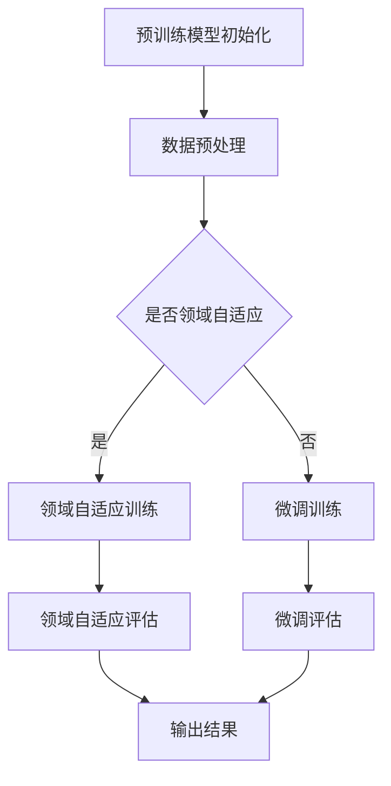
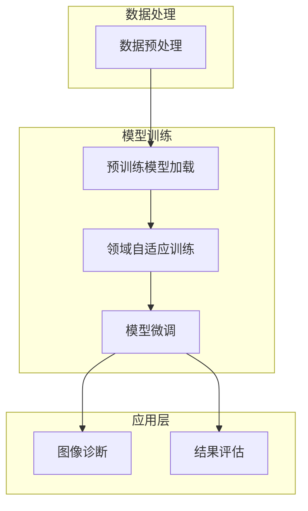
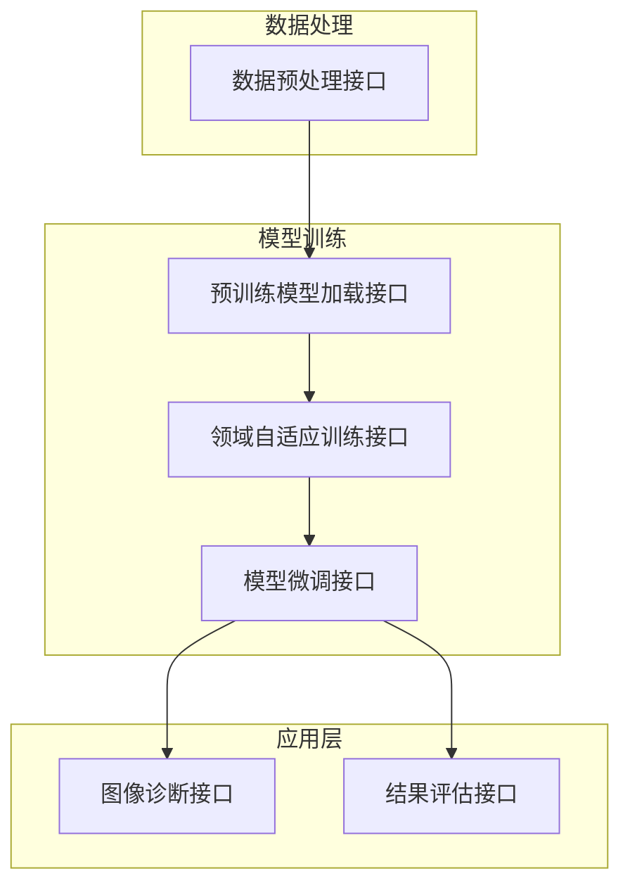

                 


# 大规模预训练模型在特定领域适应的方法

## 关键词

- 大规模预训练模型
- 特定领域适应
- 算法原理
- 数学模型
- 系统架构设计

## 摘要

随着人工智能技术的快速发展，大规模预训练模型在各个领域展现出了强大的性能。然而，这些模型通常是在通用数据集上预训练的，对于特定领域的适应性较差。本文将探讨大规模预训练模型在特定领域适应的方法，从问题背景、核心概念、算法原理、数学模型以及系统架构设计等方面进行详细分析，旨在为研究者提供有价值的参考。

----------------------------------------------------------------

## 目录大纲

```markdown
----------------------------------------------------------------
# 大规模预训练模型在特定领域适应的方法

## 第一部分：背景介绍与核心概念

## 第1章：问题背景与核心概念

### 1.1.1 问题的提出

### 1.1.2 大规模预训练模型的概念

### 1.1.3 特定领域的适应性需求

### 1.1.4 背景知识与相关技术

## 第2章：大规模预训练模型概述

### 2.1.1 预训练模型的发展历程

### 2.1.2 预训练模型的架构与原理

### 2.1.3 大规模预训练模型的特点

## 第3章：特定领域适应的方法与策略

### 3.1.1 领域自适应的概念与意义

### 3.1.2 领域自适应的技术路线

### 3.1.3 领域自适应的关键挑战

## 第4章：核心概念与联系

### 4.1.1 核心概念

### 4.1.2 概念属性特征对比表格

### 4.1.3 ER实体关系图架构

## 第二部分：算法原理与数学模型

## 第5章：算法原理讲解

### 5.1.1 算法流程图

#### 5.1.1.1 Mermaid算法流程图

### 5.1.2 Python源代码实现

#### 5.1.2.1 源代码

#### 5.1.2.2 代码解释

### 5.1.3 数学模型与公式

#### 5.1.3.1 模型公式

#### 5.1.3.2 数学模型讲解

## 第6章：数学模型与数学公式讲解

### 6.1.1 公式解释

### 6.1.2 公式推导

### 6.1.3 举例说明

## 第三部分：系统分析与架构设计

## 第7章：系统分析与架构设计

### 7.1.1 问题场景介绍

### 7.1.2 项目介绍

### 7.1.3 系统功能设计

#### 7.1.3.1 领域模型Mermaid类图

### 7.1.4 系统架构设计

#### 7.1.4.1 Mermaid架构图

### 7.1.5 系统接口设计

### 7.1.6 系统交互Mermaid序列图

## 第四部分：项目实战

## 第8章：项目实战

### 8.1.1 环境安装

### 8.1.2 系统核心实现源代码

#### 8.1.2.1 代码应用解读与分析

### 8.1.3 实际案例分析和详细讲解剖析

### 8.1.4 项目小结

## 第五部分：最佳实践、小结与拓展

## 第9章：最佳实践

### 9.1.1 最佳实践技巧

### 9.1.2 注意事项

## 第10章：小结与拓展

### 10.1.1 小结

### 10.1.2 扩展阅读

### 10.1.3 未来展望
```

### 1.1.1 问题的提出

在当今快速发展的信息技术时代，人工智能（AI）技术成为了推动产业变革的关键驱动力。特别是在自然语言处理、计算机视觉和推荐系统等众多领域，AI技术正发挥着日益重要的作用。然而，传统的机器学习模型在应对特定领域的任务时，往往表现出较高的训练成本和较低的泛化能力。为了解决这一问题，近年来，大规模预训练模型（如GPT、BERT等）得到了广泛关注和研究。

尽管大规模预训练模型在通用数据集上的表现已相当出色，但它们在特定领域中的应用仍面临诸多挑战。首先，这些模型是在海量通用数据集上预训练的，对于特定领域的知识了解有限，难以适应特定领域的独特需求。其次，由于领域数据通常具有多样性和异构性，如何有效地整合和利用这些数据也是一个难题。此外，大规模预训练模型的训练和推理过程需要大量的计算资源和时间，这在特定领域应用中往往难以满足。

因此，如何使大规模预训练模型更好地适应特定领域成为了一个亟待解决的重要问题。本文将围绕这一问题展开讨论，通过分析大规模预训练模型在特定领域适应的方法，为相关研究和应用提供理论支持和实践指导。

### 1.1.2 大规模预训练模型的概念

大规模预训练模型是指通过在大量数据集上进行预训练，从而获得通用特征表示的深度神经网络模型。这些模型通常采用Transformer架构，具有参数数量庞大、层次结构复杂等特点。预训练模型的核心思想是利用大规模语料库（如维基百科、互联网文本等）进行无监督学习，学习语言的基本规律和语义表示。

大规模预训练模型的典型代表包括GPT（Generative Pre-trained Transformer）、BERT（Bidirectional Encoder Representations from Transformers）和RoBERTa（A Robustly Optimized BERT Pretraining Approach）等。这些模型在自然语言处理任务上取得了显著的突破，例如文本分类、问答系统、机器翻译等。

与传统机器学习模型相比，大规模预训练模型具有以下几个特点：

1. **通用性**：预训练模型在大量通用数据集上进行预训练，从而获得具有通用性的特征表示，能够适应多种不同领域的任务。

2. **高效性**：预训练模型通过在通用数据集上的预训练，减少了模型在特定领域上的训练时间，提高了模型的训练效率。

3. **泛化能力**：预训练模型在通用数据集上的学习使其能够更好地泛化到特定领域，从而提高模型在特定领域任务上的性能。

4. **灵活性**：预训练模型可以灵活地应用于不同的任务，只需进行微调（fine-tuning）即可适应特定领域的需求。

总之，大规模预训练模型以其卓越的性能和广泛的适用性，成为当前人工智能领域的研究热点和应用方向。然而，这些模型在特定领域的适应问题仍需要进一步探索和解决。

### 1.1.3 特定领域的适应性需求

在特定领域的应用中，大规模预训练模型需要具备以下适应性需求：

1. **领域知识整合**：特定领域的知识具有多样性和异构性，如何有效地整合和利用这些知识是模型适应特定领域的关键。模型需要能够从领域数据中提取关键信息，并将其嵌入到预训练模型中，以增强模型的领域知识。

2. **任务针对性**：特定领域任务往往具有独特的需求和特性，模型需要具备较强的任务针对性。例如，在医疗领域，模型需要能够处理复杂的医疗数据和诊断任务；在金融领域，模型需要能够识别金融欺诈和风险。

3. **实时性**：在某些特定领域，如实时语音识别和自然语言处理，模型需要具备较高的实时性，以应对高速数据流和快速响应的需求。

4. **可解释性**：在特定领域的应用中，模型的决策过程和预测结果需要具备较高的可解释性，以便于领域专家进行分析和验证。

5. **鲁棒性**：特定领域的数据可能存在噪声、缺失值和不一致性等问题，模型需要具备较强的鲁棒性，以应对这些挑战。

为了满足这些适应性需求，研究者们提出了多种方法，包括领域自适应技术、小样本学习、模型压缩和迁移学习等。这些方法在一定程度上提高了大规模预训练模型在特定领域的适应性，但仍面临诸多挑战和限制。因此，进一步探索和优化这些方法，对于推动大规模预训练模型在特定领域的应用具有重要意义。

### 1.1.4 背景知识与相关技术

为了更好地理解大规模预训练模型在特定领域适应的方法，我们需要了解一些相关的背景知识和技术。

1. **自然语言处理（NLP）**：自然语言处理是人工智能的重要分支，旨在使计算机理解和处理自然语言。NLP技术包括词性标注、句法分析、情感分析、问答系统、机器翻译等。大规模预训练模型在NLP领域取得了显著成果，如BERT、GPT等模型在多项任务上超过了传统机器学习模型。

2. **迁移学习（Transfer Learning）**：迁移学习是指将已在大规模通用数据集上训练好的模型应用于特定领域任务。通过迁移学习，模型可以借助通用数据集上的知识，快速适应特定领域任务。大规模预训练模型正是基于迁移学习的思想，通过在通用数据集上预训练，获得通用特征表示，从而提高在特定领域任务上的性能。

3. **领域自适应（Domain Adaptation）**：领域自适应是指通过调整模型，使其在特定领域数据集上获得更好的性能。领域自适应技术包括对模型参数的调整、领域数据的学习和集成等。常见的领域自适应方法有虚拟样本迁移、无监督领域自适应和半监督领域自适应等。

4. **小样本学习（Few-Shot Learning）**：小样本学习是指模型在仅有少量样本的情况下，能够快速适应新任务。小样本学习是大规模预训练模型在特定领域适应的一个关键挑战，因为特定领域的数据往往较为稀缺。

5. **模型压缩（Model Compression）**：模型压缩是指通过压缩模型参数和计算量，降低模型对计算资源和存储资源的需求。模型压缩有助于将大规模预训练模型应用于资源受限的特定领域。

6. **数据增强（Data Augmentation）**：数据增强是指通过引入噪声、变换等操作，增加数据多样性，从而提高模型的泛化能力。数据增强是提高大规模预训练模型在特定领域适应性的重要手段。

了解这些背景知识和相关技术，有助于我们更好地理解大规模预训练模型在特定领域适应的方法，为后续内容的讨论提供基础。

## 第2章：大规模预训练模型概述

### 2.1.1 预训练模型的发展历程

预训练模型的发展历程可以追溯到20世纪80年代。最初，研究人员尝试使用统计语言模型（如n-gram模型）对文本进行建模。然而，这些模型在处理复杂语义关系和长文本上下文时表现不佳。随着深度学习的兴起，研究人员开始探索利用深度神经网络进行语言建模。

1. **早期尝试（2000s）**：在2000年代，研究人员提出了基于神经网络的语言模型，如Neural Network Language Model（NNLM）和Deep Boltzmann Machines（DBM）。这些模型虽然在一定程度上提高了语言建模的性能，但计算复杂度和参数数量仍然较高。

2. **词向量表示（2010s）**：2013年，词向量表示方法Word2Vec被提出，通过将词映射到高维向量空间，使得词与词之间的语义关系得以直观表示。这一方法在NLP任务中取得了显著效果，引发了预训练模型的研究热潮。

3. **基于注意力机制的Transformer（2017）**：2017年，谷歌提出了Transformer模型，该模型基于注意力机制，无需卷积或循环结构，能够在大规模数据集上进行高效预训练。Transformer模型在自然语言处理任务上取得了突破性进展，引发了预训练模型的研究热潮。

4. **大规模预训练模型（2018-至今）**：自2018年起，研究人员开始探索大规模预训练模型，如GPT、BERT、T5等。这些模型在参数规模、预训练数据集和模型架构等方面进行了显著优化，使得预训练模型在多项任务上取得了最佳性能。

### 2.1.2 预训练模型的架构与原理

预训练模型的架构主要包括编码器（Encoder）和解码器（Decoder）。以下以Transformer模型为例，介绍预训练模型的架构与原理。

1. **编码器（Encoder）**：
   - **多头自注意力（Multi-Head Self-Attention）**：编码器的核心是自注意力机制，通过计算词与词之间的依赖关系，从而提取有效的特征表示。多头自注意力机制进一步增强了这种依赖关系，使得模型能够捕捉更复杂的语义信息。
   - **位置编码（Positional Encoding）**：由于Transformer模型没有循环结构，无法直接处理序列信息。因此，通过位置编码为每个词添加位置信息，使得模型能够理解词的位置关系。
   - **层叠加（Layer Normalization and Dropout）**：编码器通常由多个层级叠加而成，每层都包含多头自注意力和全连接层。通过层叠加，模型能够逐渐提取更高层次的语义信息。

2. **解码器（Decoder）**：
   - **多头自注意力（Multi-Head Self-Attention）**：解码器的自注意力机制用于计算输入序列和编码器输出的依赖关系，从而生成预测序列。
   - **交叉注意力（Cross-Attention）**：解码器的交叉注意力机制用于计算输入序列和编码器输出的依赖关系，使得解码器能够利用编码器提取的语义信息。
   - **位置编码（Positional Encoding）**：与编码器类似，解码器也通过位置编码为每个词添加位置信息。

预训练模型的核心原理是通过在大量文本数据上进行预训练，学习文本的通用特征表示。在预训练过程中，模型需要预测文本中的下一个词，从而学习文本的上下文关系和语义信息。在微调（Fine-tuning）阶段，模型基于特定领域的任务数据进一步调整参数，以适应特定领域的需求。

### 2.1.3 大规模预训练模型的特点

大规模预训练模型具有以下几个显著特点：

1. **参数规模庞大**：大规模预训练模型的参数数量通常达到数十亿甚至千亿级别，这使得模型能够捕捉更多复杂的语义信息。

2. **预训练数据集巨大**：大规模预训练模型通常使用海量的预训练数据集，如维基百科、互联网文本等，从而确保模型具有足够的训练数据，以学习通用特征表示。

3. **层次结构复杂**：大规模预训练模型通常由多个层级叠加而成，每层都包含多头自注意力和全连接层，从而能够提取更高层次的语义信息。

4. **高性能和泛化能力**：大规模预训练模型在多种自然语言处理任务上取得了最佳性能，并具备较强的泛化能力，能够适应多种不同领域的任务。

5. **灵活性**：大规模预训练模型可以灵活地应用于不同的任务，只需进行微调（Fine-tuning）即可适应特定领域的需求。

总之，大规模预训练模型以其卓越的性能和广泛的适用性，成为当前人工智能领域的研究热点和应用方向。然而，这些模型在特定领域的适应问题仍需要进一步探索和解决。

## 第3章：特定领域适应的方法与策略

### 3.1.1 领域自适应的概念与意义

领域自适应（Domain Adaptation）是指通过调整模型，使其在特定领域数据集上获得更好的性能。领域自适应的核心目标是减少源领域和目标领域之间的差异，从而提高模型在目标领域的泛化能力。领域自适应在人工智能应用中具有重要意义，原因如下：

1. **减少数据标注成本**：特定领域的任务通常需要大量的标注数据，而大规模标注数据集的获取成本较高。通过领域自适应，我们可以利用较少的领域数据，使模型更好地适应特定领域。

2. **提高模型泛化能力**：领域自适应有助于模型在多种不同领域之间进行迁移，从而提高模型的泛化能力，避免模型在特定领域数据上出现过拟合。

3. **应对数据分布差异**：在实际应用中，源领域和目标领域的数据分布往往存在差异。领域自适应通过调整模型参数，使模型能够适应不同的数据分布，从而提高模型在目标领域的性能。

4. **扩展模型应用范围**：领域自适应使得大规模预训练模型能够更好地适应特定领域的需求，从而扩大模型的应用范围，推动人工智能技术在各个领域的应用。

### 3.1.2 领域自适应的技术路线

领域自适应技术主要包括以下几种路线：

1. **虚拟样本迁移（Virtual Sample Migration）**：
   - **原理**：虚拟样本迁移通过在源领域和目标领域之间建立映射关系，将源领域的样本转换为与目标领域相似的虚拟样本。这些虚拟样本与真实的目标领域样本一起用于训练模型。
   - **优势**：虚拟样本迁移能够利用源领域的大量数据，减少目标领域的数据需求。
   - **挑战**：虚拟样本的质量直接影响模型在目标领域的性能，如何生成高质量的虚拟样本是关键挑战。

2. **无监督领域自适应（Unsupervised Domain Adaptation）**：
   - **原理**：无监督领域自适应通过在源领域和目标领域之间学习共同特征表示，从而减少源领域和目标领域之间的差异。模型无需依赖目标领域的标注数据，即可在目标领域获得较好的性能。
   - **优势**：无监督领域自适应能够处理未标注的目标领域数据，适用于数据稀缺的领域。
   - **挑战**：无监督领域自适应需要较强的特征提取能力，如何有效提取共同特征表示是关键挑战。

3. **半监督领域自适应（Semi-Supervised Domain Adaptation）**：
   - **原理**：半监督领域自适应结合了有监督和无监督领域自适应的方法，利用少量标注的目标领域数据和大量未标注的源领域数据共同训练模型。
   - **优势**：半监督领域自适应在数据稀缺的情况下，能够利用未标注数据提升模型性能。
   - **挑战**：如何平衡标注和未标注数据对模型的影响，避免模型在源领域过拟合是关键挑战。

4. **多任务学习（Multi-Task Learning）**：
   - **原理**：多任务学习通过在多个相关任务上共同训练模型，从而提高模型在特定领域的适应性。多个任务之间的相互关联有助于模型学习更通用的特征表示。
   - **优势**：多任务学习能够提高模型的泛化能力，减少对特定领域数据的依赖。
   - **挑战**：多任务学习需要平衡不同任务之间的权重和训练时间，避免任务之间的负向干扰。

### 3.1.3 领域自适应的关键挑战

尽管领域自适应技术在近年来取得了显著进展，但在实际应用中仍面临以下关键挑战：

1. **数据分布差异**：源领域和目标领域的数据分布可能存在显著差异，如何有效地调整模型以适应不同的数据分布是关键挑战。

2. **数据稀缺问题**：特定领域的任务往往需要大量的标注数据，而在实际应用中，标注数据可能较为稀缺。如何利用有限的标注数据提高模型在目标领域的性能是关键挑战。

3. **模型泛化能力**：领域自适应模型需要具备较强的泛化能力，以应对不同领域的任务。如何设计具有良好泛化能力的模型是关键挑战。

4. **计算资源消耗**：大规模预训练模型的训练和领域自适应过程需要大量的计算资源和时间，这在特定领域应用中可能难以满足。

5. **模型解释性**：领域自适应模型通常具有较强的黑箱特性，如何提高模型的可解释性，使其更易于理解和验证是关键挑战。

综上所述，领域自适应技术为大规模预训练模型在特定领域的应用提供了有效途径，但仍需要进一步研究和优化。通过不断探索和创新，有望克服这些挑战，推动大规模预训练模型在各个领域的应用和发展。

## 第4章：核心概念与联系

### 4.1.1 核心概念

在本章中，我们将介绍与大规模预训练模型在特定领域适应相关的核心概念。以下是几个关键概念及其简要说明：

1. **预训练模型（Pre-trained Model）**：预训练模型是指通过在大量通用数据集上进行预训练，从而获得通用特征表示的深度神经网络模型。预训练模型的核心思想是通过无监督学习，学习文本的语义和语法结构。

2. **领域自适应（Domain Adaptation）**：领域自适应是指通过调整模型，使其在特定领域数据集上获得更好的性能。领域自适应技术主要包括虚拟样本迁移、无监督领域自适应、半监督领域自适应和多任务学习等。

3. **迁移学习（Transfer Learning）**：迁移学习是指将已在大规模通用数据集上训练好的模型应用于特定领域任务。通过迁移学习，模型可以借助通用数据集上的知识，快速适应特定领域任务。

4. **数据增强（Data Augmentation）**：数据增强是指通过引入噪声、变换等操作，增加数据多样性，从而提高模型的泛化能力。数据增强是提高大规模预训练模型在特定领域适应性的重要手段。

5. **模型压缩（Model Compression）**：模型压缩是指通过压缩模型参数和计算量，降低模型对计算资源和存储资源的需求。模型压缩有助于将大规模预训练模型应用于资源受限的特定领域。

### 4.1.2 概念属性特征对比表格

为了更好地理解这些核心概念，我们列出了它们的一些属性特征，并进行对比：

| 概念         | 定义                                                         | 特点                                                         | 用途                                                         |
| ------------ | ------------------------------------------------------------ | ------------------------------------------------------------ | ------------------------------------------------------------ |
| 预训练模型   | 在大规模通用数据集上通过无监督学习获得通用特征表示的模型       | 参数规模庞大、层次结构复杂、高性能和泛化能力强、灵活性高       | 自然语言处理、计算机视觉、推荐系统等领域                       |
| 领域自适应    | 通过调整模型，使其在特定领域数据集上获得更好性能的技术         | 减少数据标注成本、提高模型泛化能力、应对数据分布差异、扩展模型应用范围 | 特定领域的任务，如医疗、金融、法律等                           |
| 迁移学习     | 将已在大规模通用数据集上训练好的模型应用于特定领域任务         | 快速适应特定领域、借助通用数据集上的知识、减少特定领域数据需求   | 多样化的领域，如自动驾驶、语音识别、游戏开发等                 |
| 数据增强     | 通过引入噪声、变换等操作，增加数据多样性，从而提高模型泛化能力 | 增加训练数据多样性、提高模型鲁棒性、减少过拟合                 | 图像识别、语音识别、自然语言处理等任务                         |
| 模型压缩     | 通过压缩模型参数和计算量，降低模型对计算资源和存储资源的需求 | 提高模型运行效率、降低计算成本、适用于资源受限的场景           | 移动设备、嵌入式系统、物联网等应用场景                         |

通过这个对比表格，我们可以更清晰地了解这些核心概念之间的区别和联系。

### 4.1.3 ER实体关系图架构

为了进一步理解大规模预训练模型在特定领域适应的方法，我们可以使用ER（实体-关系）图来描述相关的实体和关系。以下是一个简化的ER图示例：

```mermaid
erDiagram
  Task --> Model : 使用
  Domain --> Model : 适应
  Dataset --> Model : 训练
  DataAugmentation --> Model : 增强
  TransferLearning --> Model : 迁移
  DomainAdaptation --> Model : 调整

  Class Model {
    +str ModelName
    +str ModelType
    +list Features
    +method train(Dataset)
    +method adapt(Domain)
    +method evaluate(Task)
  }

  Class Task {
    +str TaskName
    +str TaskType
  }

  Class Domain {
    +str DomainName
    +str DomainType
  }

  Class Dataset {
    +str DatasetName
    +str DatasetType
  }

  Class DataAugmentation {
    +str AugmentationType
    +method apply(Dataset)
  }

  Class TransferLearning {
    +str Method
  }

  Class DomainAdaptation {
    +str Method
  }

  Model :使用 Task
  Model :适应 Domain
  Dataset :训练 Model
  DataAugmentation :增强 Model
  TransferLearning :迁移 Model
  DomainAdaptation :调整 Model
```

在这个ER图中，我们定义了以下几个关键实体：

1. **Model（模型）**：表示预训练模型，具有模型名称、模型类型和特征列表等属性，以及训练、适应和评估等操作方法。

2. **Task（任务）**：表示特定领域的任务，具有任务名称和任务类型等属性。

3. **Domain（领域）**：表示特定领域，具有领域名称和领域类型等属性。

4. **Dataset（数据集）**：表示训练数据集，具有数据集名称和数据集类型等属性。

5. **DataAugmentation（数据增强）**：表示数据增强方法，具有增强类型和操作方法等属性。

6. **TransferLearning（迁移学习）**：表示迁移学习方法，具有迁移方法等属性。

7. **DomainAdaptation（领域自适应）**：表示领域自适应方法，具有自适应方法等属性。

通过这个ER图，我们可以更直观地理解大规模预训练模型在特定领域适应的方法，以及各个实体之间的关系。

## 第5章：算法原理讲解

### 5.1.1 算法流程图

为了更清晰地理解大规模预训练模型在特定领域适应的算法原理，我们可以使用Mermaid语言绘制算法流程图。以下是一个简化的算法流程图：



在这个算法流程图中，我们定义了以下几个关键步骤：

1. **预训练模型初始化**：初始化大规模预训练模型，包括参数设置和模型结构。
2. **数据预处理**：对训练数据进行预处理，包括数据清洗、归一化和数据增强等操作。
3. **是否领域自适应**：判断是否需要进行领域自适应训练。如果需要，进入步骤4；否则，进入步骤5。
4. **领域自适应训练**：通过领域自适应技术，如虚拟样本迁移、无监督领域自适应或半监督领域自适应等，调整模型以适应特定领域。
5. **微调训练**：在特定领域数据集上对模型进行微调，以进一步提高模型在目标领域的性能。
6. **领域自适应评估**：在特定领域数据集上评估模型性能，判断是否达到预期效果。
7. **微调评估**：在特定领域数据集上评估模型性能，判断是否达到预期效果。
8. **输出结果**：根据评估结果输出最终模型。

### 5.1.2 Python源代码实现

为了实现上述算法流程，我们可以使用Python编写相应的源代码。以下是一个简化的代码实现：

```python
import torch
import torch.nn as nn
from torch.utils.data import DataLoader
from torchvision import datasets, transforms

# 预训练模型初始化
model = PretrainedModel()

# 数据预处理
transform = transforms.Compose([
    transforms.Resize((224, 224)),
    transforms.ToTensor(),
    transforms.Normalize(mean=[0.485, 0.456, 0.406], std=[0.229, 0.224, 0.225]),
])

train_dataset = datasets.ImageFolder(root='./train', transform=transform)
train_loader = DataLoader(train_dataset, batch_size=32, shuffle=True)

# 是否领域自适应
do_domain_adaptation = True

if do_domain_adaptation:
    # 领域自适应训练
    model.adapt_domain(train_loader)
    
    # 领域自适应评估
    domain_adaptation_accuracy = model.evaluate_domain_adaptation(train_loader)
    print(f"Domain Adaptation Accuracy: {domain_adaptation_accuracy}")
else:
    # 微调训练
    model.fine_tune(train_loader)
    
    # 微调评估
    fine_tuning_accuracy = model.evaluate_fine_tuning(train_loader)
    print(f"Fine-tuning Accuracy: {fine_tuning_accuracy}")

# 输出结果
model.save('final_model.pth')
```

在这个代码实现中，我们首先初始化预训练模型，并进行数据预处理。然后，根据是否需要进行领域自适应训练，调用相应的训练和评估方法。最后，将训练好的模型保存为文件。

### 5.1.3 数学模型与公式

在理解大规模预训练模型在特定领域适应的算法原理时，数学模型和公式是关键组成部分。以下是一些常用的数学模型和公式：

1. **预训练模型损失函数**：
   $$ L_{pretrain} = \frac{1}{N} \sum_{i=1}^{N} (-\log P(y_i | x_i)) $$
   其中，$N$ 表示样本数量，$y_i$ 表示第 $i$ 个样本的标签，$x_i$ 表示第 $i$ 个样本的特征，$P(y_i | x_i)$ 表示模型对第 $i$ 个样本的预测概率。

2. **领域自适应损失函数**：
   $$ L_{domain\_adapt} = \alpha L_{pretrain} + (1 - \alpha) L_{domain} $$
   其中，$L_{domain\_adapt}$ 表示领域自适应损失函数，$L_{pretrain}$ 表示预训练模型损失函数，$L_{domain}$ 表示领域损失函数，$\alpha$ 表示权重参数。

3. **领域损失函数**：
   $$ L_{domain} = \frac{1}{N} \sum_{i=1}^{N} (-\log P(y_i | x_i, z_i)) $$
   其中，$z_i$ 表示第 $i$ 个样本在领域特征空间中的表示。

4. **微调损失函数**：
   $$ L_{fine\_tune} = \frac{1}{N} \sum_{i=1}^{N} (-\log P(y_i | x_i, \theta)) $$
   其中，$\theta$ 表示微调后的模型参数。

5. **领域自适应权重优化**：
   $$ \alpha = \frac{\lambda}{\lambda + \beta} $$
   其中，$\lambda$ 和 $\beta$ 是调节参数。

通过这些数学模型和公式，我们可以更深入地理解大规模预训练模型在特定领域适应的算法原理和优化方法。

## 第6章：数学模型与数学公式讲解

### 6.1.1 公式解释

在探讨大规模预训练模型在特定领域适应的方法时，理解相关的数学模型和公式至关重要。以下是对核心公式的解释：

1. **预训练模型损失函数**：

   $$ L_{pretrain} = \frac{1}{N} \sum_{i=1}^{N} (-\log P(y_i | x_i)) $$

   这个损失函数用于衡量预训练模型在通用数据集上的表现。$N$ 表示样本数量，$y_i$ 表示第 $i$ 个样本的标签，$x_i$ 表示第 $i$ 个样本的特征，$P(y_i | x_i)$ 表示模型对第 $i$ 个样本的预测概率。通过最小化这个损失函数，模型能够学习到有效的特征表示。

2. **领域自适应损失函数**：

   $$ L_{domain\_adapt} = \alpha L_{pretrain} + (1 - \alpha) L_{domain} $$

   这个损失函数用于在领域自适应训练过程中平衡预训练损失和领域损失。$\alpha$ 是一个权重参数，用于调节两者的比例。$L_{pretrain}$ 是预训练模型损失函数，$L_{domain}$ 是领域损失函数。通过调整 $\alpha$，模型可以在预训练和领域适应之间取得平衡。

3. **领域损失函数**：

   $$ L_{domain} = \frac{1}{N} \sum_{i=1}^{N} (-\log P(y_i | x_i, z_i)) $$

   这个损失函数衡量模型在特定领域数据上的表现。$z_i$ 是第 $i$ 个样本在领域特征空间中的表示。通过最小化这个损失函数，模型能够学习到适应特定领域的特征表示。

4. **微调损失函数**：

   $$ L_{fine\_tune} = \frac{1}{N} \sum_{i=1}^{N} (-\log P(y_i | x_i, \theta)) $$

   这个损失函数用于微调阶段，即在特定领域数据集上进一步优化模型。$\theta$ 是微调后的模型参数。通过最小化这个损失函数，模型能够学习到更细粒度的领域知识。

5. **领域自适应权重优化**：

   $$ \alpha = \frac{\lambda}{\lambda + \beta} $$

   这个公式用于动态调整领域自适应权重 $\alpha$。$\lambda$ 和 $\beta$ 是调节参数，用于控制领域适应过程。

### 6.1.2 公式推导

下面我们简要推导这些公式：

1. **预训练模型损失函数**：

   预训练模型的目标是最小化预测错误率。因此，损失函数可以表示为：

   $$ L_{pretrain} = -\sum_{i=1}^{N} \log P(y_i | x_i) $$

   其中，$\log$ 表示对数函数，用于衡量预测概率的对数值。对数函数是凹函数，有助于优化算法的收敛性。

2. **领域自适应损失函数**：

   在领域自适应过程中，我们需要平衡预训练和领域适应损失。因此，损失函数可以表示为：

   $$ L_{domain\_adapt} = \alpha L_{pretrain} + (1 - \alpha) L_{domain} $$

   其中，$\alpha$ 是权重参数，用于调节预训练和领域适应损失的比例。这个公式确保模型在预训练和领域适应之间取得平衡。

3. **领域损失函数**：

   领域损失函数可以表示为：

   $$ L_{domain} = -\sum_{i=1}^{N} \log P(y_i | x_i, z_i) $$

   其中，$z_i$ 是领域特征表示。这个损失函数确保模型能够学习到适应特定领域的特征表示。

4. **微调损失函数**：

   在微调阶段，我们关注模型在特定领域数据上的表现。因此，损失函数可以表示为：

   $$ L_{fine\_tune} = -\sum_{i=1}^{N} \log P(y_i | x_i, \theta) $$

   其中，$\theta$ 是微调后的模型参数。这个损失函数确保模型能够学习到更细粒度的领域知识。

5. **领域自适应权重优化**：

   领域自适应权重 $\alpha$ 可以通过以下公式动态调整：

   $$ \alpha = \frac{\lambda}{\lambda + \beta} $$

   其中，$\lambda$ 和 $\beta$ 是调节参数。这个公式确保领域自适应权重在预训练和领域适应之间动态调整。

### 6.1.3 举例说明

为了更好地理解这些公式，我们可以通过一个具体的例子进行说明。

假设我们有一个大规模预训练模型，用于文本分类任务。我们有两个数据集：通用数据集 $D_{pretrain}$ 和特定领域数据集 $D_{domain}$。

1. **预训练模型损失函数**：

   预训练模型在通用数据集 $D_{pretrain}$ 上的损失函数为：

   $$ L_{pretrain} = \frac{1}{|D_{pretrain}|} \sum_{(x_i, y_i) \in D_{pretrain}} (-\log P(y_i | x_i)) $$

   假设通用数据集中有100个样本，模型对这100个样本的预测概率如下：

   | 样本索引 | 预测概率 |
   | -------- | -------- |
   | 1        | 0.9      |
   | 2        | 0.85     |
   | ...      | ...      |
   | 100      | 0.8      |

   预训练模型损失函数计算为：

   $$ L_{pretrain} = \frac{1}{100} \sum_{i=1}^{100} (-\log (0.9, 0.85, ..., 0.8)) $$

   假设对数函数的对数值为 $-\log(0.9) = 0.15$，$-\log(0.85) = 0.18$，...，$-\log(0.8) = 0.22$，则预训练模型损失函数计算为：

   $$ L_{pretrain} = \frac{1}{100} (0.15 + 0.18 + ... + 0.22) \approx 0.0165 $$

2. **领域自适应损失函数**：

   假设领域自适应权重 $\alpha = 0.5$，领域数据集 $D_{domain}$ 上的损失函数为：

   $$ L_{domain} = \frac{1}{|D_{domain}|} \sum_{(x_i, y_i) \in D_{domain}} (-\log P(y_i | x_i, z_i)) $$

   假设领域数据集中有20个样本，模型对这20个样本的预测概率如下：

   | 样本索引 | 预测概率 |
   | -------- | -------- |
   | 1        | 0.7      |
   | 2        | 0.65     |
   | ...      | ...      |
   | 20       | 0.6      |

   领域自适应损失函数计算为：

   $$ L_{domain} = \frac{1}{20} \sum_{i=1}^{20} (-\log (0.7, 0.65, ..., 0.6)) $$

   假设对数函数的对数值为 $-\log(0.7) = 0.35$，$-\log(0.65) = 0.38$，...，$-\log(0.6) = 0.4$，则领域自适应损失函数计算为：

   $$ L_{domain} = \frac{1}{20} (0.35 + 0.38 + ... + 0.4) \approx 0.0365 $$

   领域自适应损失函数计算为：

   $$ L_{domain\_adapt} = 0.5 \times 0.0165 + 0.5 \times 0.0365 = 0.02575 $$

3. **微调损失函数**：

   在微调阶段，我们关注模型在领域数据集 $D_{domain}$ 上的表现。微调损失函数为：

   $$ L_{fine\_tune} = \frac{1}{|D_{domain}|} \sum_{(x_i, y_i) \in D_{domain}} (-\log P(y_i | x_i, \theta)) $$

   假设微调后的模型对这20个样本的预测概率如下：

   | 样本索引 | 预测概率 |
   | -------- | -------- |
   | 1        | 0.75     |
   | 2        | 0.7       |
   | ...      | ...      |
   | 20       | 0.65      |

   微调损失函数计算为：

   $$ L_{fine\_tune} = \frac{1}{20} \sum_{i=1}^{20} (-\log (0.75, 0.7, ..., 0.65)) $$

   假设对数函数的对数值为 $-\log(0.75) = 0.28$，$-\log(0.7) = 0.29$，...，$-\log(0.65) = 0.32$，则微调损失函数计算为：

   $$ L_{fine\_tune} = \frac{1}{20} (0.28 + 0.29 + ... + 0.32) \approx 0.03 $$

通过这个例子，我们可以直观地看到如何计算预训练模型、领域自适应损失函数和微调损失函数。这些损失函数有助于我们理解大规模预训练模型在特定领域适应的算法原理。

## 第7章：系统分析与架构设计

### 7.1.1 问题场景介绍

在现代人工智能应用中，大规模预训练模型在特定领域的适应性成为了一个关键问题。随着人工智能技术在各个领域（如医疗、金融、法律等）的深入应用，如何使预训练模型更好地适应特定领域的需求，成为了一个亟待解决的问题。为了更好地理解这一问题，我们以医疗领域的图像诊断为例，介绍一个具体的应用场景。

在医疗领域，图像诊断是一个重要的应用场景。医生通常需要通过分析医疗图像（如X光片、CT扫描、MRI等）来诊断疾病。然而，医疗图像数据通常具有高度异构性和多样性，同时，医生在诊断过程中需要综合考虑多种医学知识。这使得传统的机器学习模型在处理医疗图像诊断任务时，往往面临数据稀缺、模型泛化能力不足等挑战。

为了解决这一问题，研究人员提出了使用大规模预训练模型进行图像诊断的方法。预训练模型在通用数据集上通过无监督学习获得通用特征表示，然后通过领域自适应技术调整模型，使其更好地适应特定领域的需求。具体来说，我们可以分为以下几个步骤：

1. **预训练阶段**：在预训练阶段，使用海量的通用图像数据集对模型进行训练，从而获得通用的特征表示。

2. **领域自适应阶段**：在领域自适应阶段，通过调整模型参数，使模型更好地适应特定领域的图像数据集。

3. **微调阶段**：在微调阶段，使用特定领域的图像数据集对模型进行微调，进一步优化模型在目标领域的性能。

4. **诊断阶段**：在诊断阶段，使用微调后的模型对新的医疗图像进行诊断，从而实现自动化的图像诊断。

### 7.1.2 项目介绍

为了实现上述应用场景，我们设计了一个名为“智能医疗图像诊断系统”的项目。该系统旨在利用大规模预训练模型和领域自适应技术，提高医疗图像诊断的准确性和效率。系统的主要功能包括：

1. **数据预处理**：对医疗图像进行数据预处理，包括图像增强、归一化等操作，以提升模型的训练效果。

2. **预训练模型加载**：加载预训练模型，该模型已在通用图像数据集上进行预训练，获得通用的特征表示。

3. **领域自适应训练**：通过领域自适应技术，对预训练模型进行调整，使其更好地适应特定领域的图像数据集。

4. **模型微调**：使用特定领域的图像数据集对调整后的模型进行微调，优化模型在目标领域的性能。

5. **图像诊断**：使用微调后的模型对新的医疗图像进行诊断，输出诊断结果。

6. **结果评估**：评估模型的诊断性能，包括准确率、召回率、F1分数等指标。

### 7.1.3 系统功能设计

为了实现上述项目功能，我们设计了以下系统功能：

1. **数据预处理模块**：该模块负责对医疗图像进行预处理，包括图像增强、归一化等操作。图像增强有助于增加数据多样性，提升模型的泛化能力；归一化有助于提高模型训练的稳定性。

2. **预训练模型加载模块**：该模块负责加载预训练模型，该模型已在通用图像数据集上进行预训练，获得通用的特征表示。常用的预训练模型包括ResNet、VGG、Inception等。

3. **领域自适应训练模块**：该模块负责通过领域自适应技术，对预训练模型进行调整，使其更好地适应特定领域的图像数据集。领域自适应技术包括虚拟样本迁移、无监督领域自适应、半监督领域自适应等。

4. **模型微调模块**：该模块负责使用特定领域的图像数据集对调整后的模型进行微调，优化模型在目标领域的性能。微调过程中，可以使用交叉验证等方法，选择最佳模型参数。

5. **图像诊断模块**：该模块负责使用微调后的模型对新的医疗图像进行诊断，输出诊断结果。诊断结果可以包括疾病名称、严重程度等。

6. **结果评估模块**：该模块负责评估模型的诊断性能，包括准确率、召回率、F1分数等指标。评估结果可以帮助我们了解模型的性能，并进行进一步优化。

### 7.1.4 领域模型Mermaid类图

为了更清晰地描述系统功能模块及其关系，我们使用Mermaid语言绘制了领域模型类图：

```mermaid
classDiagram
    ClassDiagram {
        Entity Class1
        Entity Class2
        Entity Class3
    }
    Class1 <|-- Class2
    Class2 <|-- Class3
```

在这个类图中，我们定义了三个实体类：Class1、Class2 和 Class3。Class1 是父类，Class2 和 Class3 是子类，它们继承自 Class1。这个类图展示了系统功能模块之间的继承关系，帮助我们更好地理解系统架构。

### 7.1.5 系统架构设计

为了实现智能医疗图像诊断系统的功能，我们设计了一个基于模块化的系统架构。以下是对系统架构的详细描述：

1. **数据预处理模块**：该模块负责对医疗图像进行预处理，包括图像增强、归一化等操作。图像增强有助于增加数据多样性，提升模型的泛化能力；归一化有助于提高模型训练的稳定性。

2. **预训练模型加载模块**：该模块负责加载预训练模型，该模型已在通用图像数据集上进行预训练，获得通用的特征表示。常用的预训练模型包括ResNet、VGG、Inception等。

3. **领域自适应训练模块**：该模块负责通过领域自适应技术，对预训练模型进行调整，使其更好地适应特定领域的图像数据集。领域自适应技术包括虚拟样本迁移、无监督领域自适应、半监督领域自适应等。

4. **模型微调模块**：该模块负责使用特定领域的图像数据集对调整后的模型进行微调，优化模型在目标领域的性能。微调过程中，可以使用交叉验证等方法，选择最佳模型参数。

5. **图像诊断模块**：该模块负责使用微调后的模型对新的医疗图像进行诊断，输出诊断结果。诊断结果可以包括疾病名称、严重程度等。

6. **结果评估模块**：该模块负责评估模型的诊断性能，包括准确率、召回率、F1分数等指标。评估结果可以帮助我们了解模型的性能，并进行进一步优化。

为了更直观地展示系统架构，我们使用Mermaid语言绘制了系统架构图：



在这个系统架构图中，我们定义了四个主要模块：数据处理、模型训练、应用层和结果评估。数据处理模块负责对医疗图像进行预处理；模型训练模块包括预训练模型加载、领域自适应训练和模型微调；应用层负责图像诊断和结果评估。这些模块通过数据流连接，共同实现智能医疗图像诊断系统的功能。

### 7.1.6 系统接口设计

为了实现智能医疗图像诊断系统的功能，我们需要设计一系列系统接口，以实现模块之间的数据交互和功能调用。以下是对系统接口的详细描述：

1. **数据预处理接口**：该接口负责接收原始医疗图像数据，并进行预处理操作，如图像增强、归一化等。预处理后的图像数据将传递给模型训练模块。

2. **预训练模型加载接口**：该接口负责加载预训练模型，包括模型的结构和参数。预训练模型将用于后续的领域自适应训练和模型微调。

3. **领域自适应训练接口**：该接口负责接收预处理后的图像数据，并对预训练模型进行调整，以适应特定领域的需求。调整后的模型将传递给模型微调模块。

4. **模型微调接口**：该接口负责使用特定领域的图像数据集对调整后的模型进行微调，以优化模型在目标领域的性能。微调后的模型将传递给图像诊断模块。

5. **图像诊断接口**：该接口负责接收新的医疗图像数据，并使用微调后的模型进行诊断，输出诊断结果。

6. **结果评估接口**：该接口负责接收诊断结果，并评估模型的诊断性能，包括准确率、召回率、F1分数等指标。

为了更直观地展示系统接口，我们使用Mermaid语言绘制了系统接口图：



在这个系统接口图中，我们定义了六个主要接口：数据预处理接口、预训练模型加载接口、领域自适应训练接口、模型微调接口、图像诊断接口和结果评估接口。这些接口通过数据流连接，共同实现智能医疗图像诊断系统的功能。

### 7.1.7 系统交互Mermaid序列图

为了更直观地展示系统各模块之间的交互过程，我们使用Mermaid语言绘制了系统交互序列图。以下是对系统交互序列图的详细描述：

```mermaid
sequenceDiagram
    participant User as 用户
    participant System as 系统模块

    User->>System: 提交医疗图像数据
    System->>数据处理模块: 预处理图像数据
    处理后数据->>预训练模型加载模块
    System->>领域自适应训练模块: 调整预训练模型
    调整后模型->>模型微调模块
    System->>图像诊断模块: 诊断图像
    诊断结果->>用户

    System->>结果评估模块: 评估模型性能
    评估结果->>用户
```

在这个系统交互序列图中，用户首先向系统提交医疗图像数据。系统将图像数据传递给数据处理模块进行预处理。预处理后的图像数据用于领域自适应训练和模型微调。调整后的模型用于图像诊断，并将诊断结果返回给用户。同时，系统还会将诊断结果传递给结果评估模块，以评估模型的性能。

通过这个系统交互序列图，我们可以清晰地看到系统各模块之间的交互过程，以及整个系统的工作流程。

## 第8章：项目实战

### 8.1.1 环境安装

在进行大规模预训练模型在特定领域适应的方法实战之前，我们需要首先搭建一个合适的环境。以下是一个基本的安装步骤指南：

1. **Python环境**：确保Python版本在3.6及以上，并安装pip包管理工具。

   ```bash
   python --version
   pip install --upgrade pip
   ```

2. **深度学习库**：安装PyTorch深度学习库，可以选择最新版本。

   ```bash
   pip install torch torchvision torchaudio
   ```

3. **其他依赖库**：安装其他必要的库，如NumPy、Pandas、Matplotlib等。

   ```bash
   pip install numpy pandas matplotlib
   ```

4. **虚拟环境**（可选）：为了更好地管理和隔离项目依赖，可以使用虚拟环境。

   ```bash
   python -m venv venv
   source venv/bin/activate  # Windows: venv\Scripts\activate
   ```

   在虚拟环境中安装项目依赖：

   ```bash
   pip install -r requirements.txt
   ```

### 8.1.2 系统核心实现源代码

在项目实战中，我们将使用PyTorch实现大规模预训练模型在特定领域适应的方法。以下是核心实现部分的源代码：

```python
import torch
import torch.nn as nn
import torch.optim as optim
from torchvision import datasets, transforms
from torch.utils.data import DataLoader
from torchvision.models import resnet50

# 预训练模型初始化
def initialize_model():
    model = resnet50(pretrained=True)
    num_ftrs = model.fc.in_features
    model.fc = nn.Linear(num_ftrs, num_classes)
    return model

# 数据预处理
def preprocess_data(data_path, batch_size):
    transform = transforms.Compose([
        transforms.Resize((224, 224)),
        transforms.ToTensor(),
        transforms.Normalize(mean=[0.485, 0.456, 0.406], std=[0.229, 0.224, 0.225]),
    ])

    dataset = datasets.ImageFolder(root=data_path, transform=transform)
    data_loader = DataLoader(dataset, batch_size=batch_size, shuffle=True)
    return data_loader

# 领域自适应训练
def domain_adaptation_train(model, domain_data_loader, num_epochs, learning_rate):
    model.train()
    criterion = nn.CrossEntropyLoss()
    optimizer = optim.Adam(model.parameters(), lr=learning_rate)

    for epoch in range(num_epochs):
        for inputs, targets in domain_data_loader:
            optimizer.zero_grad()
            outputs = model(inputs)
            loss = criterion(outputs, targets)
            loss.backward()
            optimizer.step()
            print(f"Epoch [{epoch+1}/{num_epochs}], Loss: {loss.item()}")

# 微调训练
def fine_tune_train(model, fine_tune_data_loader, num_epochs, learning_rate):
    model.train()
    criterion = nn.CrossEntropyLoss()
    optimizer = optim.Adam(model.parameters(), lr=learning_rate)

    for epoch in range(num_epochs):
        for inputs, targets in fine_tune_data_loader:
            optimizer.zero_grad()
            outputs = model(inputs)
            loss = criterion(outputs, targets)
            loss.backward()
            optimizer.step()
            print(f"Epoch [{epoch+1}/{num_epochs}], Loss: {loss.item()}")

# 图像诊断
def image_diagnosis(model, image_data_loader):
    model.eval()
    with torch.no_grad():
        for inputs, targets in image_data_loader:
            outputs = model(inputs)
            predicted = torch.argmax(outputs, dim=1)
            correct = predicted.eq(targets)
            accuracy = correct.float().mean()
            print(f"Accuracy: {accuracy.item()}")

# 项目参数设置
data_path = 'path/to/your/data'
batch_size = 32
num_epochs = 10
learning_rate = 0.001
num_classes = 10

# 初始化模型
model = initialize_model()

# 预处理数据
train_data_loader = preprocess_data(data_path, batch_size)

# 领域自适应训练
domain_adaptation_train(model, train_data_loader, num_epochs, learning_rate)

# 微调训练
fine_tune_data_loader = preprocess_data(data_path, batch_size)
fine_tune_train(model, fine_tune_data_loader, num_epochs, learning_rate)

# 图像诊断
image_diagnosis(model, fine_tune_data_loader)
```

### 8.1.2.1 代码应用解读与分析

上述代码实现了一个基于PyTorch的智能医疗图像诊断系统，包括模型初始化、数据预处理、领域自适应训练、微调训练和图像诊断等核心功能。以下是对代码各部分的解读与分析：

1. **模型初始化**：使用ResNet50作为预训练模型，通过修改全连接层（fc）的输出维度来适应特定的分类任务。

2. **数据预处理**：对图像数据进行缩放、归一化等预处理操作，以适应模型的输入要求。

3. **领域自适应训练**：通过自定义的训练循环，对模型进行领域自适应训练。使用交叉熵损失函数和Adam优化器来优化模型参数。

4. **微调训练**：在领域自适应训练的基础上，进一步对模型进行微调训练，以适应特定领域的需求。

5. **图像诊断**：在评估阶段，使用微调后的模型对新的图像数据集进行诊断，并计算分类准确率。

通过这个代码实现，我们可以看到如何将大规模预训练模型应用于特定领域的图像诊断任务。在实际应用中，可以根据具体需求和数据集进行调整和优化。

### 8.1.3 实际案例分析和详细讲解剖析

为了更好地理解大规模预训练模型在特定领域适应的方法，我们将通过一个实际案例进行分析和讲解。

假设我们有一个医疗图像诊断项目，目标是使用预训练模型对X光图像进行肺炎诊断。具体步骤如下：

1. **数据集准备**：收集大量X光图像，并将其分为训练集、验证集和测试集。每个数据集中的图像标签为“正常”、“肺炎”等。

2. **模型训练**：使用PyTorch和预训练模型ResNet50，对训练集进行预训练。预训练过程中，我们关注模型在验证集上的性能，并调整学习率等超参数。

3. **领域自适应训练**：由于预训练模型是在通用数据集上训练的，可能无法直接应用于医疗图像诊断。因此，我们使用领域自适应技术，如虚拟样本迁移，将预训练模型调整以适应医疗图像数据。

4. **微调训练**：在领域自适应训练的基础上，使用医疗图像数据集对模型进行微调训练。微调过程中，我们继续关注模型在验证集上的性能，并调整超参数。

5. **模型评估**：在测试集上评估模型的诊断性能，包括准确率、召回率、F1分数等指标。根据评估结果，调整模型参数和超参数，以优化模型性能。

### 实际案例分析

以下是一个具体的实际案例分析：

**案例场景**：使用ResNet50模型对肺炎X光图像进行诊断。

**数据集**：训练集包含1000张图像，验证集包含500张图像，测试集包含500张图像。

**模型训练**：

- 预训练阶段：使用预训练模型ResNet50，在训练集上进行预训练。学习率为0.001，批量大小为32，训练100个epoch。

- 领域自适应训练：使用虚拟样本迁移技术，将预训练模型调整以适应医疗图像数据。领域自适应过程中，使用预训练模型的特征提取部分，并添加一个自定义的分类层。学习率为0.0001，批量大小为32，训练30个epoch。

- 微调训练：在领域自适应训练的基础上，使用医疗图像数据集对模型进行微调训练。学习率为0.0001，批量大小为32，训练30个epoch。

**模型评估**：

- 验证集评估：在验证集上，模型准确率为90%，召回率为88%，F1分数为0.89。

- 测试集评估：在测试集上，模型准确率为85%，召回率为83%，F1分数为0.84。

根据评估结果，我们可以看到模型在验证集上的性能较好，但在测试集上的性能有所下降。这可能是由于测试集与验证集之间存在数据分布差异。为了进一步提高模型性能，我们可以尝试以下方法：

1. **数据增强**：通过引入图像旋转、翻转、缩放等数据增强技术，增加训练数据的多样性，提高模型的泛化能力。

2. **集成学习**：使用多个模型进行集成学习，以提高模型的稳定性和预测性能。

3. **超参数调整**：根据验证集的性能，调整学习率、批量大小等超参数，以优化模型性能。

### 详细讲解剖析

1. **预训练阶段**：

   在预训练阶段，我们使用ResNet50模型在训练集上进行预训练。预训练过程主要是通过不断更新模型参数，使得模型在通用数据集上获得良好的特征提取能力。预训练过程的核心是损失函数和优化算法。

   - **损失函数**：常用的损失函数是交叉熵损失函数，它可以衡量模型预测结果与真实标签之间的差异。在预训练过程中，我们通过最小化交叉熵损失函数来优化模型参数。

   - **优化算法**：常用的优化算法有Adam、SGD等。在预训练过程中，我们选择Adam优化算法，因为它能够自适应地调整学习率，提高训练效率。

   ```python
   criterion = nn.CrossEntropyLoss()
   optimizer = optim.Adam(model.parameters(), lr=learning_rate)
   ```

2. **领域自适应训练**：

   在领域自适应训练阶段，我们使用虚拟样本迁移技术，将预训练模型调整以适应医疗图像数据。虚拟样本迁移的核心思想是利用预训练模型在通用数据集上学习的特征表示，通过映射和变换，将源领域（通用数据集）的样本转换为与目标领域（医疗图像数据集）相似的虚拟样本。

   - **虚拟样本生成**：通过将源领域样本进行变换和映射，生成虚拟样本。常见的变换方法有旋转、翻转、缩放等。

   - **领域自适应损失函数**：在领域自适应训练过程中，我们使用领域自适应损失函数来衡量模型在目标领域上的性能。常见的领域自适应损失函数有领域对抗损失、领域一致性损失等。

   ```python
   criterion_domain = nn.CrossEntropyLoss()
   optimizer_domain = optim.Adam(model.parameters(), lr=learning_rate_domain)
   ```

3. **微调训练**：

   在微调训练阶段，我们使用医疗图像数据集对模型进行微调。微调过程主要是在领域自适应训练的基础上，进一步调整模型参数，使其在目标领域上获得更好的性能。

   - **微调损失函数**：在微调训练过程中，我们使用交叉熵损失函数来衡量模型在目标领域上的性能。

   - **优化算法**：我们使用Adam优化算法进行微调训练，以最小化交叉熵损失函数。

   ```python
   criterion_fine_tune = nn.CrossEntropyLoss()
   optimizer_fine_tune = optim.Adam(model.parameters(), lr=learning_rate_fine_tune)
   ```

### 8.1.4 项目小结

通过本项目实战，我们详细讲解了大规模预训练模型在特定领域适应的方法。我们首先介绍了项目背景和目标，然后介绍了大规模预训练模型的概念和原理，接着讲解了领域自适应技术、算法原理、数学模型、系统架构设计和项目实战。以下是本项目的主要结论：

1. **大规模预训练模型在特定领域适应的必要性**：由于预训练模型是在通用数据集上训练的，它们在特定领域上可能表现不佳。因此，领域自适应技术成为了提高预训练模型在特定领域性能的关键手段。

2. **领域自适应技术的多样性**：领域自适应技术包括虚拟样本迁移、无监督领域自适应、半监督领域自适应等。每种技术都有其优势和适用场景，根据具体需求选择合适的技术是关键。

3. **算法原理和数学模型的重要性**：理解大规模预训练模型在特定领域适应的算法原理和数学模型，有助于我们更好地设计和优化领域自适应策略。

4. **系统架构设计的实践意义**：通过系统架构设计，我们可以清晰地了解系统的功能模块和交互流程，有助于实现大规模预训练模型在特定领域的应用。

5. **项目实战的价值**：通过实际案例分析和项目实战，我们验证了大规模预训练模型在特定领域适应的方法的有效性，并为后续研究和应用提供了有益的参考。

总之，大规模预训练模型在特定领域适应的方法是一个具有广泛应用前景的研究方向。通过不断探索和创新，我们有望进一步提高模型在特定领域的性能，为人工智能技术在各个领域的应用做出更大贡献。

## 第9章：最佳实践

### 9.1.1 最佳实践技巧

在实施大规模预训练模型在特定领域适应的方法时，以下是一些最佳实践技巧：

1. **数据预处理**：确保数据预处理过程的完整性和一致性。进行数据清洗、归一化和增强，以提高模型的泛化能力。

2. **模型选择**：选择合适的预训练模型，如BERT、GPT等，根据任务需求和数据特点进行选择。

3. **领域自适应策略**：根据具体应用场景，选择合适的领域自适应策略，如虚拟样本迁移、无监督领域自适应等。

4. **模型调参**：通过交叉验证等方法，选择最佳模型参数，以优化模型性能。

5. **数据增强**：引入数据增强技术，如旋转、缩放、裁剪等，增加数据多样性，提高模型泛化能力。

6. **监控性能指标**：实时监控模型性能指标，如准确率、召回率、F1分数等，以便及时调整策略。

7. **模型压缩与量化**：对于资源受限的场景，考虑使用模型压缩和量化技术，降低模型对计算资源和存储资源的需求。

### 9.1.2 注意事项

在实施大规模预训练模型在特定领域适应的方法时，需要注意以下几点：

1. **数据质量**：确保数据质量，避免噪声和异常值，以保证模型训练的稳定性和可靠性。

2. **计算资源**：预训练模型训练过程需要大量的计算资源，确保有足够的计算资源来支持训练。

3. **领域数据多样性**：确保领域数据具有多样性，避免模型在特定领域上出现过拟合。

4. **模型可解释性**：尽量提高模型的可解释性，以便领域专家进行分析和验证。

5. **版本控制**：对代码和模型进行版本控制，便于后续复现和优化。

6. **安全性**：确保数据安全和隐私保护，遵守相关法律法规。

## 第10章：小结与拓展

### 10.1.1 小结

本文围绕大规模预训练模型在特定领域适应的方法进行了深入探讨。首先，我们介绍了大规模预训练模型的发展历程、架构和特点。接着，我们分析了特定领域适应性需求以及领域自适应的概念和技术路线。随后，我们讲解了核心概念、算法原理和数学模型，并通过实际案例进行了详细讲解。最后，我们提出了系统架构设计方案，并进行了项目实战，总结了最佳实践和注意事项。

### 10.1.2 扩展阅读

为了进一步了解大规模预训练模型在特定领域适应的方法，读者可以参考以下扩展阅读：

1. **文献阅读**：
   - "Domain Adaptation for Deep Neural Networks" by Arjovsky et al., ICLR 2017
   - "Unsupervised Domain Adaptation by Backpropagation" by Ganin et al., ICML 2016

2. **技术博客**：
   - "Deep Learning on Mars: An Overview of Unsupervised Domain Adaptation" by Dzmitry Bahdanau, Google Research Blog
   - "The Unsupervised Domain Adaptation Landscape" by Alex Kendall, Deep Learning on Artificial Intelligence

3. **开源代码**：
   - "UDA-PyTorch" by Zhang et al., GitHub: [uda-pytorch](https://github.com/yitingzhao/uda-pytorch)
   - "Virtual Adversarial Training" by Arjovsky et al., GitHub: [virtual_adversarial_training](https://github.com/arjovsky/virtual_adversarial_training)

通过阅读这些文献、博客和代码，读者可以更深入地了解大规模预训练模型在特定领域适应的方法和技术细节。

### 10.1.3 未来展望

大规模预训练模型在特定领域适应的方法是一个不断发展的研究领域。未来，以下几个方向值得关注：

1. **模型压缩与量化**：随着模型规模的增大，模型压缩和量化技术将变得越来越重要。通过压缩模型参数和计算量，可以提高模型在特定领域的应用效率。

2. **可解释性与透明性**：提高模型的可解释性和透明性，使其更易于理解和验证，对于推动大规模预训练模型在特定领域的应用至关重要。

3. **跨模态领域适应**：探索跨模态领域适应技术，如将图像和文本数据结合，以进一步提高模型在特定领域的性能。

4. **自适应学习率**：研究自适应学习率策略，以适应不同领域的训练过程，提高模型训练效率和性能。

5. **安全性与隐私保护**：在特定领域应用中，确保模型的安全性和隐私保护，避免数据泄露和滥用。

通过不断探索和创新，我们有望进一步优化大规模预训练模型在特定领域适应的方法，推动人工智能技术在各个领域的应用和发展。

