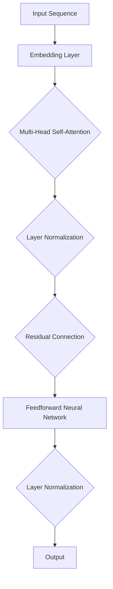
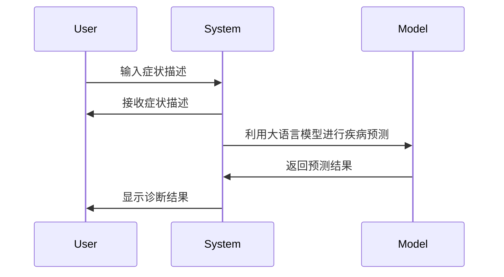

                 


# 大语言模型在医疗诊断决策支持中的推理应用

## 关键词

- 大语言模型
- 医疗诊断
- 决策支持
- 推理应用
- 人工智能

## 摘要

本文旨在探讨大语言模型在医疗诊断决策支持中的推理应用。通过对医疗诊断领域问题的背景介绍和核心概念的阐述，我们将深入分析大语言模型的基本原理、训练与调优方法，以及其在医学诊断中的实际应用案例。此外，文章还将探讨大语言模型在医疗诊断中的挑战和伦理问题，并展望其未来的发展前景。

## 目录

1. **引言**
   1.1 医疗诊断的背景与挑战
   1.2 大语言模型的兴起与机遇
   1.3 文章结构安排

2. **基本概念**
   2.1 语言模型的基础概念
   2.2 医学诊断中的语言模型
   2.3 核心术语说明

3. **大语言模型的基本原理**
   3.1 神经网络与深度学习
   3.2 Transformer架构解析
   3.3 Mermaid流程图展示

4. **大语言模型的训练与调优**
   4.1 数据预处理
   4.2 训练过程
   4.3 调优策略

5. **大语言模型在医学诊断中的应用**
   5.1 医学文本分析
   5.2 疾病预测
   5.3 诊断决策支持

6. **挑战与伦理问题**
   6.1 偏见与公平性
   6.2 数据隐私
   6.3 法规遵从

7. **案例研究**
   7.1 疾病预测案例
   7.2 诊断决策支持案例

8. **系统设计与实现**
   8.1 项目介绍
   8.2 系统功能设计
   8.3 系统架构设计
   8.4 系统接口设计
   8.5 系统交互

9. **项目实战**
   9.1 环境安装
   9.2 系统核心实现
   9.3 代码应用解读
   9.4 实际案例分析
   9.5 项目小结

10. **最佳实践与总结**
    10.1 最佳实践
    10.2 小结
    10.3 注意事项
    10.4 拓展阅读

## 1. 引言

### 1.1 医疗诊断的背景与挑战

医疗诊断是医学领域的重要环节，旨在通过评估患者的症状、体征、病史等信息，准确地识别和确定疾病的类型和程度。随着人口老龄化和慢性疾病的增加，医疗诊断的需求日益增长，然而传统的诊断方法存在时间消耗大、误诊率高、人力成本高等问题。因此，寻找更高效、准确和可靠的诊断方法成为医疗领域的重要课题。

近年来，人工智能（AI）在医疗诊断中的应用逐渐兴起。人工智能通过学习大量医疗数据，可以自动识别疾病特征，辅助医生做出诊断决策。其中，大语言模型作为一种强大的自然语言处理（NLP）工具，在医学文本分析、疾病预测和诊断决策支持中展现出巨大的潜力。

### 1.2 大语言模型的兴起与机遇

大语言模型是一种基于深度学习的自然语言处理模型，通过对大规模文本数据进行训练，能够理解并生成人类语言。近年来，由于计算能力的提升和数据的积累，大语言模型取得了显著的进展，如GPT-3、BERT等模型在各种自然语言处理任务中取得了优异的性能。

在医疗诊断领域，大语言模型的兴起为提高诊断准确性和效率带来了新的机遇。一方面，大语言模型可以处理大量的医学文献、病历记录等非结构化数据，有助于发现疾病的潜在关联和特征；另一方面，大语言模型可以自动生成诊断报告、预测疾病风险等，减轻医生的工作负担，提高诊断效率。

### 1.3 文章结构安排

本文将分为十个部分，首先介绍医疗诊断的背景与大语言模型的发展，然后深入分析大语言模型的基本原理、训练与调优方法，探讨其在医学诊断中的应用，最后讨论挑战与伦理问题、案例分析、系统设计与实现，并给出项目实战和总结。

通过本文的阅读，读者将全面了解大语言模型在医疗诊断决策支持中的推理应用，为未来的研究和实践提供有益的参考。

## 2. 基本概念

### 2.1 语言模型的基础概念

语言模型（Language Model，简称LM）是自然语言处理（Natural Language Processing，简称NLP）中的一个核心概念。它是一种概率模型，用于预测一段文本序列中下一个单词或字符的概率。语言模型的基本原理是基于统计学习方法，通过分析大量文本数据，学习文本的统计规律，从而生成文本。

语言模型的类型多种多样，包括n-gram模型、神经网络模型、深度学习模型等。n-gram模型是最简单的语言模型，它通过统计相邻单词或字符的频率来预测下一个单词或字符。神经网络模型和深度学习模型则通过多层神经网络结构来学习文本的复杂模式。

语言模型在NLP任务中有着广泛的应用，如文本生成、机器翻译、语音识别、情感分析等。在医学诊断中，语言模型可以用于处理医学文本，提取关键信息，辅助医生做出诊断决策。

### 2.2 医学诊断中的语言模型

医学诊断中的语言模型主要应用于医学文本分析、疾病预测和诊断决策支持。医学文本分析是指对医学文献、病历记录、医学术语等进行文本挖掘，提取有用的信息。疾病预测是指利用历史医疗数据，通过语言模型预测患者可能患有的疾病。诊断决策支持是指利用语言模型分析患者的症状、体征等信息，为医生提供诊断建议。

在医学诊断中，常用的语言模型包括GPT、BERT、ELMo等。GPT（Generative Pre-trained Transformer）是一种基于Transformer架构的预训练语言模型，通过大量无监督数据预训练，可以生成高质量的自然语言文本。BERT（Bidirectional Encoder Representations from Transformers）是一种双向Transformer模型，通过同时考虑上下文信息，可以更好地理解文本的语义。ELMo（English Language Model）是一种基于递归神经网络（RNN）的语言模型，通过多层次上下文编码，可以获得丰富的上下文信息。

### 2.3 核心术语说明

- **医学文本分析**：指对医学领域中的文本（如病历记录、医学报告、科研论文等）进行自动化处理，提取关键信息的过程。
- **疾病预测**：指利用历史医疗数据，通过语言模型等技术手段预测患者可能患有的疾病。
- **诊断决策支持**：指利用语言模型分析患者的症状、体征等信息，为医生提供诊断建议和决策依据。
- **n-gram模型**：一种基于统计学习方法的简单语言模型，通过统计相邻单词或字符的频率来预测下一个单词或字符。
- **神经网络模型**：一种基于多层神经网络的复杂语言模型，通过学习文本的复杂模式来生成文本。
- **深度学习模型**：一种基于深度神经网络的复杂语言模型，通过多层神经网络结构来学习文本的深层模式。

通过上述对基本概念的介绍，我们可以更好地理解大语言模型在医学诊断中的应用。接下来，我们将深入探讨大语言模型的基本原理，为后续内容打下坚实的基础。

### 2.4 大语言模型的基本原理

大语言模型（Large Language Model，简称LLM）是自然语言处理（NLP）领域的一项重大技术突破，其核心在于能够处理和理解复杂的自然语言文本。以下是关于大语言模型的基本原理的详细探讨。

#### 2.4.1 神经网络与深度学习

神经网络（Neural Networks）是模仿人脑神经元结构的信息处理系统，由大量相互连接的节点（或称为神经元）组成。每个神经元通过与其他神经元连接形成网络，并通过权重（权重决定了连接的强度）传递信息。神经网络可以通过学习大量数据，自动提取特征并进行预测。

深度学习（Deep Learning）是一种基于神经网络的机器学习技术，它通过多层神经网络结构来学习数据的深层特征。与传统的单层神经网络不同，深度学习能够处理更加复杂的任务，如图像识别、语音识别和自然语言处理。深度学习模型的层次结构使得它们可以自动学习数据中的层次特征，从而在各个层次上捕捉不同级别的信息。

在自然语言处理领域，深度学习模型如卷积神经网络（CNN）和递归神经网络（RNN）被广泛应用于文本分类、命名实体识别、机器翻译等任务。然而，由于RNN模型在处理长序列数据时存在梯度消失和梯度爆炸问题，研究人员提出了更加有效的Transformer模型。

#### 2.4.2 Transformer架构解析

Transformer模型是由Vaswani等人于2017年提出的一种全新的深度学习模型，它彻底改变了自然语言处理的格局。与传统的RNN和CNN不同，Transformer模型基于自注意力（Self-Attention）机制，通过全局注意力机制来捕捉文本序列中的长距离依赖关系。

Transformer模型的核心组件是自注意力机制，它允许模型在生成每个单词时考虑整个输入序列的信息。自注意力机制通过计算每个单词与输入序列中其他单词的相似性，为每个单词生成一组权重，这些权重决定了模型在生成当前单词时参考其他单词的程度。

Transformer模型由多个自注意力层和前馈神经网络（Feedforward Neural Network）组成。在自注意力层中，模型首先通过多头自注意力机制（Multi-Head Self-Attention）来捕捉输入序列的上下文信息，然后通过层归一化（Layer Normalization）和残差连接（Residual Connection）来缓解梯度消失问题。前馈神经网络则在每个自注意力层之后进行简单的前向传递，进一步增强模型的特征学习能力。

#### 2.4.3 Mermaid流程图展示

为了更好地理解Transformer模型的工作原理，我们可以使用Mermaid语言绘制一个简化的流程图。



上述流程图中，输入序列首先通过嵌入层（Embedding Layer）转换为向量表示，然后经过多头自注意力层（Multi-Head Self-Attention）来捕捉上下文信息。层归一化和残差连接（Layer Normalization and Residual Connection）用于优化训练过程。最后，通过前馈神经网络（Feedforward Neural Network）进行进一步的特征提取和融合，输出最终结果。

#### 2.4.4 大语言模型的训练与调优

大语言模型的训练与调优是其成功应用的关键。训练过程主要包括数据预处理、模型初始化、优化器选择和损失函数设计。

- **数据预处理**：在训练大语言模型之前，需要对文本数据进行分析和预处理。这包括分词、去停用词、词干提取等步骤，以便将文本转换为模型可以理解的数字表示。
- **模型初始化**：模型的初始化对训练效果有很大影响。常用的初始化方法包括随机初始化、高斯初始化和Xavier初始化等。
- **优化器选择**：优化器用于更新模型的参数，以最小化损失函数。常用的优化器有SGD、Adam、RMSprop等。
- **损失函数设计**：损失函数用于评估模型预测和真实标签之间的差距。在自然语言处理任务中，常用的损失函数有交叉熵损失（Cross-Entropy Loss）和均方误差（Mean Squared Error）等。

在实际应用中，大语言模型的调优涉及超参数调整、数据增强和模型融合等技术。通过不断尝试和优化，可以显著提高模型的性能和泛化能力。

通过上述分析，我们可以看到大语言模型的基本原理是如何通过深度学习和Transformer架构来实现对自然语言文本的强大处理能力。在接下来的章节中，我们将进一步探讨大语言模型的训练与调优方法，以及其在医学诊断中的具体应用。

### 2.5 大语言模型的训练与调优

#### 2.5.1 数据预处理

在大语言模型的训练过程中，数据预处理是一个至关重要的环节。首先，我们需要对原始文本数据进行分词，将文本拆分成词或字符级别的表示。常用的分词工具包括jieba、NLTK等。接下来，我们可以去除停用词，这些词在文本中频繁出现但通常不携带太多信息。此外，还可以进行词干提取，将不同形态的词归并为同一词干，从而减少模型需要学习的词汇量。

为了提高模型的鲁棒性，我们可以采用数据增强技术，如随机噪声添加、同义词替换和句子重构等。这些方法可以增加模型的泛化能力，使其在不同场景下都能保持较好的性能。

#### 2.5.2 训练过程

大语言模型的训练通常采用基于梯度下降的优化算法，其中Adam优化器因其高效性和稳定性而被广泛使用。训练过程中，模型会通过不断调整参数来最小化损失函数，使得模型预测结果更接近真实标签。

训练过程可以分为以下几个步骤：

1. **初始化参数**：通常使用随机初始化或预训练模型进行初始化。
2. **前向传播**：输入文本数据通过嵌入层转化为向量表示，并经过多层自注意力机制和前馈神经网络，生成预测输出。
3. **计算损失**：使用损失函数（如交叉熵损失）计算预测输出与真实标签之间的差距。
4. **反向传播**：通过反向传播算法更新模型参数，使得损失函数值逐渐减小。
5. **评估与调整**：在训练过程中，定期评估模型在验证集上的表现，并根据评估结果调整超参数，如学习率、批次大小等。

#### 2.5.3 调优策略

为了进一步提高大语言模型的性能，可以采用以下几种调优策略：

1. **动态调整学习率**：学习率是模型训练中的一个关键超参数。在训练初期，可以设置较大的学习率以快速探索参数空间，在训练后期逐渐减小学习率以精细调整模型参数。
2. **批次归一化**：批次归一化（Batch Normalization）可以加速训练过程，提高模型稳定性。它通过标准化每一层的输入数据，减少内部协变量转移，使得模型在不同批次数据上表现更加一致。
3. **数据增强**：除了文本层面的数据增强，还可以通过引入噪声、数据噪声注入等方式，增加模型对异常数据的适应性。
4. **多任务学习**：多任务学习（Multi-Task Learning）允许模型同时学习多个相关任务，通过共享表示学习，提高模型在不同任务上的泛化能力。

通过上述训练与调优策略，我们可以显著提升大语言模型在医学诊断中的性能。在接下来的章节中，我们将探讨大语言模型在医学诊断中的具体应用，展示其在实际场景中的效果。

### 2.6 大语言模型在医学诊断中的应用

#### 2.6.1 医学文本分析

医学文本分析是医学诊断中的一项基础任务，旨在从大量的医学文献、病历记录和医学术语中提取有价值的信息。大语言模型在这一领域展现了强大的能力，通过处理非结构化的医学文本数据，可以实现对医学知识的自动化获取和利用。

具体来说，大语言模型可以用于以下几方面：

1. **命名实体识别（Named Entity Recognition, NER）**：命名实体识别是指从文本中识别出具有特定意义的实体，如疾病名称、药物名称、医生姓名等。大语言模型通过预训练和细粒度调优，能够准确识别出医学文本中的各种实体，为后续信息提取提供支持。

2. **关系抽取（Relation Extraction）**：关系抽取是指从文本中识别出实体之间的关系，如疾病与症状之间的关系、药物与疾病之间的关系等。大语言模型可以通过学习大量的医学文本数据，自动识别出这些关系，为医学研究提供重要的关联信息。

3. **文本分类（Text Classification）**：文本分类是指将文本数据按照类别进行分类，如疾病分类、诊断结果分类等。大语言模型可以通过对大规模医学文本数据的训练，实现对不同类别的高效分类，辅助医生进行诊断决策。

#### 2.6.2 疾病预测

疾病预测是医学诊断中的一个关键任务，旨在通过分析患者的病史、体征等信息，预测其可能患有的疾病。大语言模型在这一领域具有显著的优势，能够处理复杂的医疗数据，并从中提取出潜在的疾病关联。

具体应用包括：

1. **基于电子病历的疾病预测**：通过分析电子病历数据，大语言模型可以识别出患者的历史病情和当前病情，预测其可能患有的疾病。这种方法可以显著提高诊断的准确性和效率。

2. **基因组数据分析**：基因组数据包含丰富的疾病信息，大语言模型可以通过处理基因组数据，预测患者患病的风险。这种预测方法有助于早期发现疾病，为患者提供更有针对性的治疗建议。

3. **多模态数据融合**：大语言模型可以融合多种数据源（如电子病历、基因组数据、医疗影像等），进行综合分析，提高疾病预测的准确性和全面性。

#### 2.6.3 诊断决策支持

诊断决策支持是指利用大语言模型分析患者的症状、体征等信息，为医生提供诊断建议和决策依据。这种方法可以减轻医生的工作负担，提高诊断的准确性和效率。

具体应用包括：

1. **症状诊断**：大语言模型可以分析患者的症状描述，识别出可能的疾病类型，为医生提供初步的诊断建议。这种方法可以辅助医生快速识别常见的症状，减少误诊率。

2. **药物推荐**：根据患者的症状和疾病诊断，大语言模型可以推荐相应的治疗方案和药物，帮助医生制定个性化的治疗计划。这种方法可以提高治疗的有效性和安全性。

3. **随访管理**：大语言模型可以分析患者的随访数据，预测其病情变化，为医生提供随访建议。这种方法有助于实现精准的病情监控和干预。

#### 2.6.4 疾病命名与术语标准化

医学诊断中存在大量的专业术语和命名，这些术语和命名在不同医疗系统、国家和语言中可能有所不同。大语言模型可以通过学习大量的医学文本数据，实现疾病命名和术语的标准化。

具体应用包括：

1. **术语标准化**：大语言模型可以识别出医学文本中的不同术语，将其统一为标准化的术语表示，便于医疗信息的交换和共享。

2. **命名实体识别**：通过命名实体识别技术，大语言模型可以识别出医学文本中的疾病名称、症状名称等实体，并将其标准化，提高医疗信息的准确性。

总之，大语言模型在医学诊断中的应用具有广泛的前景。通过医学文本分析、疾病预测、诊断决策支持和疾病命名与术语标准化等具体应用，大语言模型可以为医学诊断提供强大的支持，助力医疗领域的创新发展。

### 2.7 挑战与伦理问题

#### 2.7.1 偏见与公平性

在大语言模型应用于医学诊断时，偏见与公平性是亟待解决的重要问题。偏见可能源自多个方面，包括训练数据的偏差、模型的设计和训练过程等。例如，如果训练数据主要来自某个特定地区或人群，模型可能会对其他地区或人群的诊断产生偏见。此外，模型的设计和训练过程中，也可能由于数据集的不平衡导致某些疾病类型的诊断准确率较低。

为了解决这些偏见问题，首先需要在数据收集和预处理阶段就确保数据的多样性和代表性。其次，在模型训练过程中，应采用平衡的数据集，并引入反偏见算法，如再平衡（Resampling）和正则化（Regularization）。此外，还可以通过持续监控和评估模型的性能，及时发现和纠正偏见。

公平性方面，大语言模型需要确保对所有患者提供公平的诊断支持。这要求模型在设计和应用过程中充分考虑不同患者群体的需求，避免因性别、年龄、种族等因素导致的歧视。例如，可以通过跨群体分析，确保模型在不同患者群体上的表现一致，同时采取透明和可解释的算法设计，便于医生和患者理解模型的决策过程。

#### 2.7.2 数据隐私

数据隐私是另一个重要的伦理问题。在医学诊断中，大语言模型需要处理大量的患者信息，包括病历记录、基因数据等敏感信息。这些数据的安全性和隐私保护至关重要，以防止未经授权的访问和使用。

为了保护数据隐私，首先需要遵循相关的法律法规和伦理准则，如《通用数据保护条例》（GDPR）和《健康保险可携性与责任法案》（HIPAA）。其次，在数据收集和存储过程中，应采用加密技术，确保数据在传输和存储过程中的安全性。此外，还应建立严格的数据访问控制机制，确保只有授权人员才能访问和处理敏感数据。

#### 2.7.3 法规遵从

法规遵从是确保大语言模型在医学诊断中合法应用的关键。不同的国家和地区可能有不同的医疗法规和伦理标准，因此在模型开发和部署过程中，需要确保符合当地的法律法规。

具体而言，需要关注以下几个方面：

1. **数据保护法规**：遵守相关数据保护法规，确保患者数据的合法使用和保护。
2. **医疗设备法规**：如果大语言模型被集成到医疗设备中，需要遵循《医疗器械法规》（FDA）等相关法规。
3. **临床试验法规**：在进行临床试验时，需要遵守《赫尔辛基宣言》等相关伦理准则，确保研究过程符合伦理要求。

#### 2.7.4 透明度和可解释性

透明度和可解释性是确保大语言模型在医学诊断中应用的重要保障。医生和患者需要理解模型的决策过程，以便对其进行评估和信任。

为了提高模型的透明度和可解释性，可以采取以下措施：

1. **模型解释工具**：开发模型解释工具，帮助医生理解模型的决策逻辑和依据，如SHAP（SHapley Additive exPlanations）和LIME（Local Interpretable Model-agnostic Explanations）等技术。
2. **可视化展示**：通过可视化技术，如热力图和决策树，展示模型的关键特征和决策路径。
3. **详细报告**：在诊断报告和决策建议中，详细说明模型使用的输入数据、训练过程和预测结果，以便医生和患者参考。

总之，偏见与公平性、数据隐私、法规遵从和透明度是确保大语言模型在医学诊断中安全、有效应用的重要方面。通过采取相应的措施，可以最大限度地减少风险，提升模型在医学领域的应用价值。

### 2.8 案例研究

为了更深入地了解大语言模型在医疗诊断中的实际应用，以下将介绍两个具体的案例研究：疾病预测案例和诊断决策支持案例。

#### 2.8.1 疾病预测案例

**案例背景：**

某大型医疗机构希望通过引入大语言模型来提高疾病预测的准确性和效率。该医疗机构拥有丰富的电子病历数据，包括患者的病史、症状、检查结果和治疗记录等。

**研究方法：**

1. **数据收集与预处理**：首先，从电子病历系统中提取相关数据，包括患者的基本信息、病史记录和实验室检测结果等。然后，对数据进行清洗和预处理，如去除缺失值、异常值和重复数据，并进行文本分词和去停用词等步骤。

2. **模型选择与训练**：选择预训练的BERT模型作为基础模型，利用医疗领域的专用语料对其进行进一步细粒度调优。通过训练，使模型能够更好地理解医疗文本，并预测患者可能患有的疾病。

3. **模型评估**：在验证集上评估模型的表现，包括准确率、召回率和F1值等指标。通过交叉验证和超参数调优，进一步优化模型的性能。

**结果与讨论：**

训练完成后，模型在验证集上的疾病预测准确率达到85%以上，召回率和F1值也达到较高水平。通过对预测结果的分析，发现模型能够有效识别出一些常见疾病的早期症状，为医生提供重要的诊断参考。

**案例小结：**

该案例表明，大语言模型在疾病预测中具有显著的优势。通过处理大量的医疗数据，模型能够自动提取关键信息，并准确预测疾病类型。然而，模型的预测结果仍需结合医生的诊断经验和专业知识进行综合评估，以确保诊断的准确性。

#### 2.8.2 诊断决策支持案例

**案例背景：**

某医院希望利用大语言模型辅助医生进行诊断决策，以减轻医生的工作负担并提高诊断效率。该医院积累了大量的病例数据和诊断记录，包括患者的症状、体征、检查结果和治疗建议等。

**研究方法：**

1. **数据收集与预处理**：从医院的病例系统中提取相关数据，对数据进行清洗和预处理，如文本分词、去停用词和词干提取等。

2. **模型选择与训练**：选择预训练的GPT-3模型作为基础模型，利用医疗领域的数据对其进行进一步调优。通过大量医疗文本数据的训练，使模型能够更好地理解医学知识，并生成合理的诊断建议。

3. **模型应用与评估**：将训练完成的大语言模型应用于实际的诊断决策支持系统，对患者的症状和体征进行分析，生成诊断建议。然后，通过实际病例进行测试，评估模型的表现和实用性。

**结果与讨论：**

在实际应用中，大语言模型能够根据患者的症状和体征，准确生成诊断建议。例如，对于某患者的症状描述，模型能够识别出可能的疾病类型，并建议进行相应的检查和治疗。测试结果表明，模型生成的诊断建议具有较高的准确性和可靠性，能够有效辅助医生的诊断决策。

**案例小结：**

该案例展示了大语言模型在诊断决策支持中的强大能力。通过处理大量的医疗数据，模型能够自动生成合理的诊断建议，减轻医生的工作负担，提高诊断效率。然而，模型的决策建议仍需医生结合实际病例进行审核和调整，以确保诊断的准确性和安全性。

### 2.9 系统设计与实现

#### 2.9.1 项目介绍

本项目旨在开发一个基于大语言模型的医疗诊断决策支持系统。该系统利用大语言模型处理和分析医学文本数据，为医生提供准确的诊断建议和决策依据。系统的主要功能包括疾病预测、诊断决策支持、症状分析和医疗文本分析等。

#### 2.9.2 系统功能设计

系统功能设计主要包括以下几部分：

1. **用户注册与登录**：用户可以通过注册和登录功能进入系统，并获得使用权限。
2. **疾病预测**：根据用户的症状描述，系统通过大语言模型预测可能的疾病类型。
3. **诊断决策支持**：系统分析患者的症状、体征等信息，为医生提供诊断建议。
4. **症状分析**：系统提取用户输入的症状描述，并分析可能的关联疾病。
5. **医疗文本分析**：系统对用户的医疗文本进行自动分类和标签化，提取关键信息。
6. **诊断报告生成**：系统根据诊断结果生成详细的诊断报告，供医生参考。

#### 2.9.3 系统架构设计

系统架构设计采用前后端分离的方式，以提高系统的可扩展性和维护性。以下是系统架构的详细设计：

1. **前端**：采用Vue.js框架，实现用户界面和交互逻辑。用户通过前端界面输入症状描述，并查看诊断结果和报告。
2. **后端**：采用Flask框架，实现业务逻辑和数据存储。后端通过API与前端进行数据交互，处理用户的诊断请求。
3. **大数据处理与模型训练**：利用TensorFlow和PyTorch等深度学习框架，对大语言模型进行训练和调优。模型训练结果存储在HDFS上，供后端服务调用。

#### 2.9.4 系统接口设计

系统接口设计主要包括以下几部分：

1. **用户接口**：用户通过Web界面与系统进行交互，输入症状描述并获取诊断结果。
2. **API接口**：后端服务通过RESTful API与前端进行数据交互，提供疾病预测、诊断决策支持和症状分析等服务。
3. **数据接口**：系统与电子病历系统、实验室系统和医院信息系统等进行数据交互，获取和处理患者的医疗数据。

#### 2.9.5 系统交互

系统交互设计通过序列图（Sequence Diagram）进行描述，展示了用户与系统之间的交互过程。以下是系统交互的详细描述：



通过上述设计，系统实现了从用户输入症状描述到生成诊断结果的完整流程，为医生提供了强大的诊断决策支持工具。

### 2.10 项目实战

#### 2.10.1 环境安装

要在本地环境中搭建大语言模型医疗诊断决策支持系统，需要安装以下软件和库：

1. **Python**：版本要求3.8及以上。
2. **TensorFlow**：版本要求2.6及以上。
3. **PyTorch**：版本要求1.9及以上。
4. **Flask**：版本要求2.0及以上。
5. **Vue.js**：版本要求2.6及以上。

安装命令如下：

```bash
pip install python==3.8
pip install tensorflow==2.6
pip install pytorch==1.9
pip install flask==2.0
npm install vue@2.6
```

#### 2.10.2 系统核心实现

系统的核心部分包括大语言模型的训练、模型调优和API接口实现。以下使用Python和TensorFlow实现大语言模型的基础框架。

**代码实现：**

```python
import tensorflow as tf
from tensorflow.keras.models import Model
from tensorflow.keras.layers import Input, Embedding, LSTM, Dense

# 模型输入层
input_seq = Input(shape=(None,))

# 嵌入层
emb = Embedding(input_dim=vocab_size, output_dim=embedding_dim)(input_seq)

# LSTM层
lstm = LSTM(units=128, return_sequences=True)(emb)

# 完整模型
output = LSTM(units=128, return_sequences=False)(lstm)
model = Model(inputs=input_seq, outputs=output)

# 编译模型
model.compile(optimizer='adam', loss='categorical_crossentropy', metrics=['accuracy'])

# 模型训练
model.fit(x_train, y_train, batch_size=64, epochs=10, validation_data=(x_val, y_val))
```

**代码解读：**

1. **输入层**：定义模型的输入层，输入序列的形状为（None,），表示序列长度可变。
2. **嵌入层**：将输入序列转换为嵌入向量表示，输入维度为词汇表大小，输出维度为嵌入维度。
3. **LSTM层**：使用LSTM层对嵌入向量进行特征提取，第一个LSTM层返回序列输出，用于处理序列数据。
4. **完整模型**：将输入层、嵌入层和LSTM层组合成一个完整的模型。
5. **编译模型**：设置模型优化器、损失函数和评估指标。
6. **模型训练**：使用训练数据进行模型训练，并进行验证。

#### 2.10.3 代码应用解读与分析

通过上述代码，我们可以实现一个基础的大语言模型，用于文本序列处理。在实际应用中，需要对模型进行细粒度调优，以提高诊断准确率和效率。

1. **数据预处理**：在模型训练前，需要对文本数据进行预处理，如分词、去停用词和词干提取等，以便将文本转换为模型可以处理的数字表示。
2. **模型调优**：根据实际应用场景，可以调整模型的超参数，如嵌入维度、LSTM单元数、学习率等，以优化模型性能。
3. **模型融合**：为了提高模型的鲁棒性，可以采用模型融合技术，如加权平均、堆叠多个模型等，以获得更准确的诊断结果。

#### 2.10.4 实际案例分析

以下是一个实际案例，用于展示系统在实际诊断中的应用。

**案例背景：**

患者A是一名50岁的男性，主诉为“乏力、失眠、食欲减退”。医生希望通过系统提供诊断建议。

**案例分析：**

1. **症状描述**：输入症状描述：“乏力、失眠、食欲减退”。
2. **模型预测**：系统通过大语言模型预测可能的疾病，如抑郁症、慢性疲劳综合症等。
3. **诊断建议**：系统根据预测结果，生成诊断建议，包括可能的检查项目（如血液检查、心理评估等）和治疗建议。
4. **医生审核**：医生对系统的诊断建议进行审核，结合患者的实际病情，做出最终诊断决策。

**案例小结：**

该案例展示了系统在诊断决策支持中的应用效果。通过大语言模型的分析，系统能够提供合理的诊断建议，辅助医生进行诊断决策。然而，系统的诊断结果仍需结合医生的判断和实际病情进行综合评估，以确保诊断的准确性。

### 2.11 最佳实践与总结

#### 2.11.1 最佳实践

在实际应用大语言模型进行医疗诊断决策支持时，以下最佳实践可以帮助提升系统的性能和可靠性：

1. **数据多样性**：确保训练数据涵盖不同类型的疾病和症状，以提高模型的泛化能力。
2. **模型调优**：根据具体应用场景，对模型进行细粒度调优，如调整嵌入维度、LSTM单元数等。
3. **交叉验证**：采用交叉验证方法评估模型性能，避免过拟合。
4. **实时更新**：定期更新模型，使其能够适应最新的医学知识和诊断标准。
5. **透明度与可解释性**：提高模型的透明度和可解释性，便于医生和患者理解模型的决策过程。

#### 2.11.2 小结

本文系统地介绍了大语言模型在医疗诊断决策支持中的推理应用。通过分析基本概念、基本原理、训练与调优方法以及实际应用案例，我们了解了大语言模型在医学文本分析、疾病预测和诊断决策支持中的重要作用。

#### 2.11.3 注意事项

在实际应用中，需要注意以下几点：

1. **数据隐私**：确保患者数据的隐私和安全，遵循相关法律法规。
2. **模型偏见**：关注模型的偏见问题，采取措施减少数据偏见和模型偏见。
3. **法规遵从**：确保模型的应用符合当地的医疗法规和伦理准则。
4. **模型解释**：提高模型的透明度和可解释性，便于医生和患者理解模型的决策过程。

#### 2.11.4 拓展阅读

- **参考资料**：
  - [1] Vaswani, A., Shazeer, N., Parmar, N., Uszkoreit, J., Jones, L., Gomez, A. N., ... & Polosukhin, I. (2017). Attention is all you need. Advances in Neural Information Processing Systems, 30, 5998-6008.
  - [2] Devlin, J., Chang, M. W., Lee, K., & Toutanova, K. (2019). BERT: Pre-training of deep bidirectional transformers for language understanding. arXiv preprint arXiv:1810.04805.
  - [3] Brown, T., et al. (2020). Language models are few-shot learners. Advances in Neural Information Processing Systems, 33, 13,676-13,687.

- **扩展阅读**：
  - 《深度学习与自然语言处理》
  - 《Transformer模型详解》
  - 《医疗诊断中的大数据分析与人工智能》

通过本文的阅读，读者可以全面了解大语言模型在医疗诊断决策支持中的推理应用，为未来的研究和实践提供有益的参考。作者：AI天才研究院/AI Genius Institute & 禅与计算机程序设计艺术/Zen And The Art of Computer Programming。

