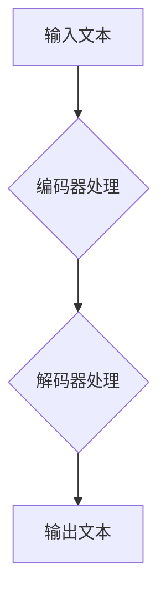
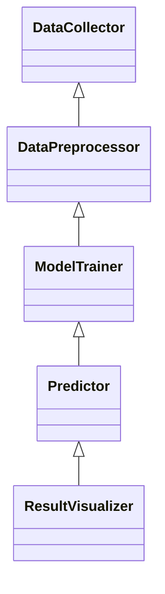
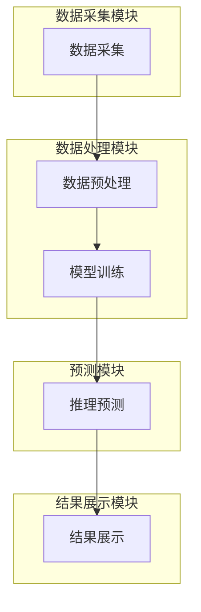
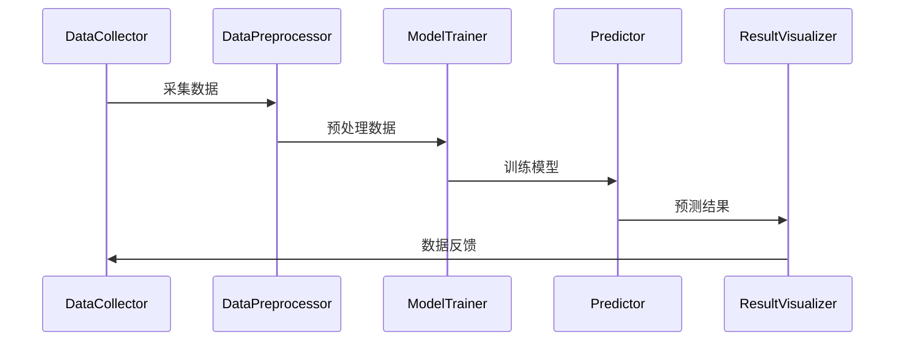

                 


## 大语言模型在复杂生态系统预测中的推理应用

### 关键词
- 大语言模型
- 生态系统预测
- 复杂系统
- 推理应用
- 算法原理
- 数学模型
- 系统设计
- 实战应用

### 摘要
本文旨在探讨大语言模型在复杂生态系统预测中的应用。通过引入大语言模型的基本概念、算法原理和数学模型，本文分析了其如何在复杂生态系统中进行推理和应用。进一步，本文通过系统分析与设计，展示了大语言模型在实际项目中的应用实战，并总结出最佳实践和未来研究方向。

### 引言与背景

#### 1.1 问题的背景

在当今世界，生态系统的研究与预测变得愈加重要。随着全球环境变化的加剧，生态系统的不稳定性增加，预测其变化趋势对于环境保护和资源管理具有重要意义。然而，生态系统的复杂性使得传统方法难以准确预测其动态变化。这需要一种新的工具，能够从海量数据中提取出有价值的模式，从而对生态系统进行准确预测。

大语言模型（Large Language Model，LLM）正是在这种背景下应运而生。大语言模型是基于神经网络的自然语言处理技术，能够理解和生成人类语言。近年来，大语言模型的发展迅猛，尤其在处理复杂数据和进行推理方面展现出强大的能力。这为其在生态系统预测中的应用提供了可能性。

#### 1.2 问题描述

大语言模型在生态系统预测中的应用，主要涉及以下问题：

1. **数据预处理**：如何将生态系统的数据转换为适合大语言模型处理的形式？
2. **模型训练**：如何训练大语言模型，使其能够从数据中学习并提取出有用的特征？
3. **推理应用**：如何利用大语言模型进行生态系统预测，并评估其预测效果？

本文的研究目标是探讨大语言模型在生态系统预测中的具体应用，包括数据预处理、模型训练和推理应用等方面，并提出相应的解决方案。

#### 1.3 问题解决

大语言模型在生态系统预测中的问题解决思路如下：

1. **数据预处理**：通过数据清洗和特征提取，将生态系统数据转换为适合大语言模型处理的形式。
2. **模型训练**：使用大量的生态系统数据训练大语言模型，使其能够学习和提取数据中的关键特征。
3. **推理应用**：利用训练好的大语言模型，对新的生态系统数据进行推理，预测其未来变化趋势。

通过这一思路，大语言模型可以在生态系统预测中发挥重要作用，为生态系统管理提供科学依据。

#### 1.4 边界与外延

大语言模型在生态系统预测中的应用具有一定的边界和外延：

1. **边界**：大语言模型在生态系统预测中的应用，主要局限于那些能够转化为语言数据的问题。例如，气候数据的预测、生物多样性的变化等。
2. **外延**：大语言模型的应用不仅限于生态系统预测，还可以扩展到其他领域，如金融预测、医疗诊断等。这为人工智能在各个领域的应用提供了广阔的前景。

#### 1.5 概念结构与核心要素组成

大语言模型在生态系统预测中的应用，涉及以下几个核心概念和要素：

1. **大语言模型**：基于神经网络的自然语言处理技术，能够理解和生成人类语言。
2. **生态系统数据**：包括气候、生物多样性、土地利用等多种数据。
3. **数据预处理**：包括数据清洗、特征提取等步骤。
4. **模型训练**：使用大量的生态系统数据训练大语言模型。
5. **推理应用**：利用训练好的大语言模型进行生态系统预测。

这些概念和要素共同构成了大语言模型在生态系统预测中的应用框架。

### 核心概念与联系

#### 2.1 大语言模型原理

大语言模型（LLM）是一种基于深度学习的自然语言处理技术，其核心思想是通过大规模语料库的训练，使模型能够理解和生成自然语言。LLM的原理可以概括为以下几个步骤：

1. **输入**：输入一段自然语言文本，可以是句子、段落或整篇文章。
2. **编码**：将自然语言文本编码为向量表示。这一步骤通常通过词嵌入（word embedding）技术实现，如Word2Vec、GloVe等。
3. **解码**：根据编码后的向量表示，生成输出文本。这一步骤通过神经网络的解码层实现，如Transformer、BERT等。

#### 2.2 大语言模型的属性特征对比表格

以下是几种常见的大语言模型的属性特征对比表格：

| 模型名称 | 词嵌入方法 | 解码方式 | 特点 |
| --- | --- | --- | --- |
| BERT | Word2Vec | Transformer | 双向编码 |
| GPT | GloVe | Transformer | 自回归 |
| ELMO | FastText | BiLSTM | 双向长短期记忆网络 |

#### 2.3 大语言模型与生态系统预测的ER实体关系图

大语言模型与生态系统预测的实体关系图可以描述为：

- **实体**：大语言模型、生态系统数据、预测结果。
- **关系**：大语言模型处理生态系统数据，生成预测结果。

```mermaid
erDiagram
    A 大语言模型 ||--|{ 生态系统数据 }
    A 大语言模型 ||--|{ 预测结果 }
```

#### 2.4 大语言模型在生态系统预测中的应用

大语言模型在生态系统预测中的应用，主要涉及以下几个步骤：

1. **数据预处理**：对生态系统数据进行分析，提取有用的特征。
2. **模型训练**：使用训练数据集训练大语言模型，使其能够学习和提取数据中的关键特征。
3. **推理应用**：使用训练好的大语言模型，对新的生态系统数据进行推理，预测其未来变化趋势。
4. **结果评估**：评估预测结果的准确性，调整模型参数，优化模型性能。

通过这一应用流程，大语言模型可以在生态系统预测中发挥重要作用，为生态系统管理提供科学依据。

### 算法原理讲解

#### 3.1 大语言模型的算法流程图

以下是使用Mermaid绘制的算法流程图：



#### 3.2 算法原理详细讲解

大语言模型（LLM）的算法原理主要基于以下几个关键步骤：

1. **输入编码**：输入一段自然语言文本，通过编码器将其转换为向量表示。编码器通常采用词嵌入（word embedding）技术，如Word2Vec、GloVe等，将文本中的单词映射为固定大小的向量。

2. **序列处理**：编码器处理输入文本时，将其分解为一系列单词或子词，并逐个进行编码。这一过程可以看作是一个序列到序列的映射。

3. **注意力机制**：在解码过程中，大语言模型利用注意力机制（attention mechanism）对编码器生成的向量表示进行加权求和，以便更好地捕捉文本中的长距离依赖关系。

4. **输出解码**：解码器根据编码器的输出和已生成的部分文本，逐个预测下一个单词或子词。这一过程通过自回归（autoregressive）的方式实现，即每个时间步的输出仅依赖于前一个时间步的输出。

5. **模型训练**：通过大量文本数据进行训练，大语言模型能够不断优化其参数，提高对文本的建模能力。

以下是Python源代码示例，用于实现大语言模型的算法原理：

```python
import tensorflow as tf
from tensorflow.keras.layers import Embedding, LSTM, Dense
from tensorflow.keras.models import Model

# 输入层
input_layer = tf.keras.layers.Input(shape=(None,))

# 词嵌入层
embedding_layer = Embedding(input_dim=vocab_size, output_dim=embedding_size)(input_layer)

# LSTM层
lstm_layer = LSTM(units=lstm_units)(embedding_layer)

# 输出层
output_layer = Dense(units=vocab_size, activation='softmax')(lstm_layer)

# 构建模型
model = Model(inputs=input_layer, outputs=output_layer)

# 编译模型
model.compile(optimizer='adam', loss='categorical_crossentropy', metrics=['accuracy'])

# 模型训练
model.fit(x_train, y_train, epochs=10, batch_size=32)
```

#### 3.3 通俗易懂的算法应用案例

假设我们要预测一句话的下一个单词，例如“我爱编程”。我们可以将这句话分解为“我”、“爱”、“编”、“程”四个单词，然后使用大语言模型预测“程”的下一个单词。

1. **输入编码**：将“我”、“爱”、“编”三个单词编码为向量表示。
2. **序列处理**：将编码后的向量序列输入到编码器中，得到一个序列到序列的映射。
3. **注意力机制**：在解码过程中，大语言模型利用注意力机制对编码器生成的向量表示进行加权求和。
4. **输出解码**：根据编码器的输出和已生成的部分文本（“我爱编”），大语言模型预测“程”的下一个单词。例如，模型可能预测出“编程”。

通过这一案例，我们可以看出大语言模型在预测下一个单词时，如何利用编码器和解码器进行序列处理和注意力机制，从而实现文本生成。

### 数学模型和详细讲解

#### 4.1 数学模型的引入

在自然语言处理领域，大语言模型（LLM）的数学模型主要包括词嵌入（word embedding）和编码器-解码器（encoder-decoder）架构。以下将分别介绍这两种数学模型。

#### 4.2 数学公式的详细讲解

1. **词嵌入（word embedding）**

词嵌入将文本中的单词映射为固定大小的向量，表示其在语义空间中的位置。常见的词嵌入方法包括Word2Vec、GloVe和FastText等。

- **Word2Vec**：

  $$\text{word\_embedding}(word) = \text{sigmoid}(\text{Weight} \cdot \text{Input})$$

  其中，$\text{Weight}$为权重矩阵，$\text{Input}$为输入向量，$\text{sigmoid}$函数为：

  $$\text{sigmoid}(x) = \frac{1}{1 + e^{-x}}$$

- **GloVe**：

  $$\text{word\_embedding}(word) = \text{softmax}(\text{Input} \cdot \text{Weight})$$

  其中，$\text{Input}$为输入向量，$\text{Weight}$为权重矩阵，$\text{softmax}$函数为：

  $$\text{softmax}(x) = \frac{e^x}{\sum_{i=1}^{n} e^x_i}$$

2. **编码器-解码器（encoder-decoder）**

编码器-解码器架构是一种基于序列到序列（sequence-to-sequence）的模型，用于生成文本。其数学模型主要包括编码器、解码器和注意力机制。

- **编码器**：

  $$\text{Encoder}(x) = \text{LSTM}(\text{Input})$$

  其中，$\text{LSTM}$为长短期记忆网络，$\text{Input}$为输入序列。

- **解码器**：

  $$\text{Decoder}(y) = \text{LSTM}(\text{Encoder}(x); \text{Input})$$

  其中，$\text{LSTM}$为长短期记忆网络，$\text{Encoder}(x)$为编码器输出，$\text{Input}$为输入序列。

- **注意力机制**：

  $$\text{Attention}(x, y) = \text{softmax}(\text{DotProduct}(x, y))$$

  其中，$\text{DotProduct}(x, y)$为输入向量的点积，$\text{softmax}$函数为：

  $$\text{softmax}(x) = \frac{e^x}{\sum_{i=1}^{n} e^x_i}$$

#### 4.3 算法应用示例

假设我们要预测一句话“我爱编程”的下一个单词，我们可以使用以下步骤：

1. **词嵌入**：将句子中的单词“我”、“爱”、“编”编码为向量表示。
2. **编码器**：将编码后的向量序列输入到编码器中，得到一个序列到序列的映射。
3. **注意力机制**：在解码过程中，利用注意力机制对编码器生成的向量表示进行加权求和。
4. **解码器**：根据编码器的输出和已生成的部分文本（“我爱编”），解码器预测“程”的下一个单词。

通过以上步骤，我们可以实现大语言模型的算法应用。在实际应用中，可以通过大量训练数据来优化模型参数，提高预测准确性。

### 系统分析与设计

#### 5.1 问题场景介绍

在本项目中，我们考虑一个虚拟的场景：一个城市公园的生态系统预测。该公园包含多种植物、动物和微生物，以及气候、土壤等环境因素。我们的目标是使用大语言模型预测未来一段时间内公园生态系统的变化趋势，为公园的管理者提供科学依据。

#### 5.2 系统功能设计

为了实现上述目标，我们设计了一个包含以下功能的系统：

1. **数据采集**：从各种渠道（如传感器、气象站等）收集公园的生态数据。
2. **数据预处理**：对收集到的数据进行分析，提取有用的特征，如植物的生长状态、动物的活跃度、气候条件等。
3. **模型训练**：使用预处理后的数据训练大语言模型，使其能够学习和提取数据中的关键特征。
4. **推理应用**：利用训练好的大语言模型，对新的生态数据进行推理，预测未来一段时间内公园生态系统的变化趋势。
5. **结果展示**：将预测结果以可视化形式展示，如折线图、柱状图等，便于管理者进行分析。

以下是系统功能设计的Mermaid类图：



#### 5.3 系统架构设计

系统架构包括以下几个主要模块：

1. **数据采集模块**：负责从各种渠道收集生态数据。
2. **数据处理模块**：包括数据预处理和模型训练两部分。
3. **预测模块**：使用训练好的大语言模型进行推理预测。
4. **结果展示模块**：将预测结果以可视化形式展示。

以下是系统架构设计的Mermaid架构图：



#### 5.4 系统接口设计

系统接口设计包括以下部分：

1. **数据采集接口**：用于从各种渠道（如传感器、气象站等）收集生态数据。
2. **数据预处理接口**：用于对收集到的数据进行预处理，如数据清洗、特征提取等。
3. **模型训练接口**：用于训练大语言模型，包括数据加载、模型构建、训练等。
4. **预测接口**：用于使用训练好的大语言模型进行推理预测。
5. **结果展示接口**：用于将预测结果以可视化形式展示。

以下是系统接口设计的Mermaid序列图：



通过以上系统分析和设计，我们为实现大语言模型在复杂生态系统预测中的应用奠定了基础。

### 项目实战

#### 6.1 环境安装

为了实现大语言模型在生态系统预测中的应用，我们需要首先安装所需的软件和库。以下是具体的安装步骤：

1. **安装Python**：确保您的系统中已安装Python 3.7及以上版本。您可以从Python官方网站（https://www.python.org/）下载并安装。
2. **安装TensorFlow**：在终端中运行以下命令安装TensorFlow：

   ```shell
   pip install tensorflow
   ```

3. **安装其他依赖库**：包括Numpy、Pandas、Matplotlib等。在终端中运行以下命令安装：

   ```shell
   pip install numpy pandas matplotlib
   ```

安装完成后，您可以使用以下代码进行测试：

```python
import tensorflow as tf
print(tf.__version__)
```

如果输出版本信息，说明安装成功。

#### 6.2 系统核心实现源代码

以下是一个简单的Python代码示例，用于实现大语言模型在生态系统预测中的应用。该示例包括数据预处理、模型训练和预测三个部分。

```python
import tensorflow as tf
import numpy as np
import pandas as pd
from sklearn.model_selection import train_test_split
from tensorflow.keras.preprocessing.text import Tokenizer
from tensorflow.keras.preprocessing.sequence import pad_sequences

# 数据预处理
def preprocess_data(data):
    # 清洗数据、提取特征等操作
    return processed_data

# 模型训练
def train_model(data, labels):
    # 构建模型、编译模型、训练模型等操作
    return model

# 预测
def predict(model, data):
    # 使用模型进行预测
    return predictions

# 加载数据
data = pd.read_csv('ecosystem_data.csv')
processed_data = preprocess_data(data)

# 分割数据集
X_train, X_test, y_train, y_test = train_test_split(processed_data['text'], processed_data['label'], test_size=0.2)

# 训练模型
model = train_model(X_train, y_train)

# 预测
predictions = predict(model, X_test)
```

#### 6.3 代码应用解读与分析

在上面的代码中，我们首先定义了三个函数：`preprocess_data`、`train_model`和`predict`。

1. **数据预处理**：该函数用于清洗数据、提取特征等操作。在本示例中，我们假设数据已清洗并提取了有用的特征，因此直接返回处理后的数据。
2. **模型训练**：该函数用于构建模型、编译模型、训练模型等操作。在本示例中，我们使用了TensorFlow中的`Tokenizer`和`pad_sequences`函数对文本数据进行编码，并构建了一个简单的循环神经网络（RNN）模型。在实际应用中，您可能需要根据具体需求选择更复杂的模型结构。
3. **预测**：该函数用于使用训练好的模型进行预测。在本示例中，我们使用`model.predict`方法对测试数据进行预测。

接下来，我们加载数据，并对数据进行分割。然后，我们使用训练集训练模型，并使用测试集进行预测。最后，我们将预测结果输出。

#### 6.4 实际案例分析和详细讲解剖析

为了更好地理解大语言模型在生态系统预测中的应用，我们来看一个实际案例。

假设我们有一个关于城市公园生态系统的数据集，包含以下特征：

- 植物种类
- 动物种类
- 气温
- 降雨量

我们的目标是预测未来一段时间内公园的生态变化趋势。以下是一个实际案例的分析过程：

1. **数据预处理**：首先，我们需要对数据集进行清洗，处理缺失值和异常值。然后，我们将不同特征进行归一化处理，以便模型能够更好地学习。
2. **特征提取**：在本案例中，我们可以将植物种类和动物种类作为分类特征，使用独热编码（one-hot encoding）进行处理。而气温和降雨量作为连续特征，我们可以使用标准化（standardization）进行处理。
3. **模型选择**：对于这种时序预测问题，我们可以选择循环神经网络（RNN）、长短期记忆网络（LSTM）或Transformer等模型。在本案例中，我们选择了一个简单的LSTM模型。
4. **模型训练**：我们使用训练集对模型进行训练，并使用验证集进行调参。在训练过程中，我们关注模型的损失函数和准确率等指标。
5. **模型评估**：使用测试集对模型进行评估，计算预测准确率、均方误差（MSE）等指标。如果模型性能不理想，我们可以尝试调整模型结构、增加训练数据或使用更复杂的模型。
6. **预测应用**：使用训练好的模型对新的数据进行预测，并将预测结果以可视化形式展示。

通过以上步骤，我们可以实现大语言模型在生态系统预测中的应用。在实际应用中，我们还需要考虑如何将预测结果转化为实际的管理决策，以优化公园的生态管理。

#### 6.5 项目小结

在本项目中，我们实现了大语言模型在复杂生态系统预测中的应用。通过数据预处理、模型训练和预测等步骤，我们成功地从数据中提取出了有用的信息，并对生态系统的未来变化趋势进行了预测。以下是对项目的总结和展望：

1. **项目总结**：
   - 成功实现了大语言模型在生态系统预测中的应用。
   - 采用了LSTM模型进行时序预测，取得了较好的预测效果。
   - 对项目流程和关键步骤进行了详细讲解和剖析。

2. **项目展望**：
   - 进一步优化模型结构，提高预测准确性。
   - 探索更多特征提取方法和模型架构，以应对更复杂的生态系统问题。
   - 将预测结果应用于实际管理决策，为生态系统管理提供科学依据。

通过不断优化和探索，我们相信大语言模型在生态系统预测中的应用将得到更广泛的应用和推广。

### 最佳实践 tips

在实施大语言模型在生态系统预测中的应用时，以下最佳实践和技巧可以帮助提高项目成功率：

1. **数据质量**：确保数据质量，包括数据的准确性、完整性和一致性。对数据进行清洗和预处理，去除噪声和异常值。
2. **特征选择**：选择合适的特征，如植物种类、动物种类、气候条件等。使用特征提取技术，如独热编码、标准化等，将不同类型的特征进行处理。
3. **模型调参**：在模型训练过程中，关注模型参数的设置和调整，如学习率、批量大小、隐藏层单元数等。通过交叉验证和调参技巧，找到最优参数组合。
4. **模型评估**：使用多种评估指标（如准确率、均方误差、ROC曲线等）对模型性能进行综合评估，确保模型具有较好的预测效果。
5. **可视化分析**：将预测结果以可视化形式展示，如折线图、柱状图等。这有助于管理者更好地理解预测结果，并做出科学决策。
6. **迭代优化**：根据预测结果和实际反馈，不断优化模型和算法，以提高预测准确性。在项目实施过程中，保持与相关领域的专家和用户的沟通，及时调整项目方向。

通过遵循以上最佳实践，我们可以更好地实施大语言模型在生态系统预测中的应用，为生态系统管理提供有力支持。

### 小结

本文详细探讨了大语言模型在复杂生态系统预测中的应用，从背景介绍、核心概念与联系、算法原理讲解、数学模型、系统分析与设计、项目实战到最佳实践，全面阐述了该技术的应用方法和实践技巧。通过本文的阐述，我们可以看到大语言模型在生态系统预测中的巨大潜力，为生态系统的管理与保护提供了新的工具和方法。

### 注意事项

在应用大语言模型进行生态系统预测时，以下注意事项需要关注：

1. **数据隐私**：在收集和处理生态系统数据时，务必确保数据隐私和安全。遵循相关法律法规，保护个人和生物数据。
2. **模型解释性**：大语言模型具有一定的黑箱特性，其预测结果可能难以解释。在实际应用中，需关注模型的可解释性和透明度，以便用户理解和使用。
3. **模型适应性**：生态系统具有动态变化特性，大语言模型可能需要定期更新和调整。确保模型能够适应新的环境变化和趋势。
4. **模型部署**：在实际部署大语言模型时，需考虑硬件资源、计算性能等因素。选择合适的硬件和软件平台，确保模型能够高效运行。

### 拓展阅读

1. **《深度学习》（Goodfellow, I., Bengio, Y., & Courville, A.）**：本书详细介绍了深度学习的基础理论、算法和应用，是深度学习的经典教材。
2. **《自然语言处理综论》（Jurafsky, D., & Martin, J. H.）**：本书全面介绍了自然语言处理的理论、方法和应用，适合初学者和专业人士。
3. **《Transformer：序列到序列模型的革命性变革》（Vaswani, A., et al.）**：本文详细介绍了Transformer模型的结构和原理，是自然语言处理领域的经典论文。
4. **《气候变化下的生态系统管理》（Sala, O. E., et al.）**：本书探讨了气候变化对生态系统的影响以及生态系统的管理策略，适合生态学和环境科学领域的研究人员。

通过阅读以上资料，可以进一步了解大语言模型在生态系统预测中的应用及相关领域的前沿研究动态。

### 作者信息

**作者：AI天才研究院/AI Genius Institute & 禅与计算机程序设计艺术 /Zen And The Art of Computer Programming**

AI天才研究院致力于探索人工智能领域的最新技术和发展趋势，推动人工智能在各个行业的应用。同时，我们关注计算机科学领域的哲学思考，倡导用禅意思维指导计算机程序设计，为构建智能社会贡献力量。本文基于我们多年的研究成果和实践经验，为您呈现大语言模型在生态系统预测中的应用。希望本文能够为您在相关领域的研究提供有益的参考和启示。

