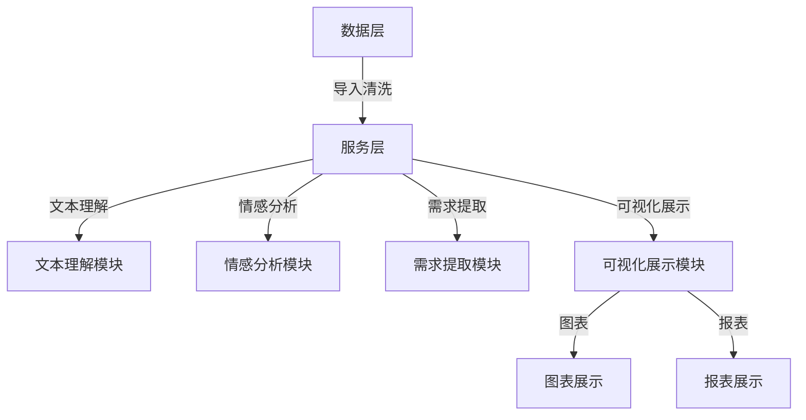
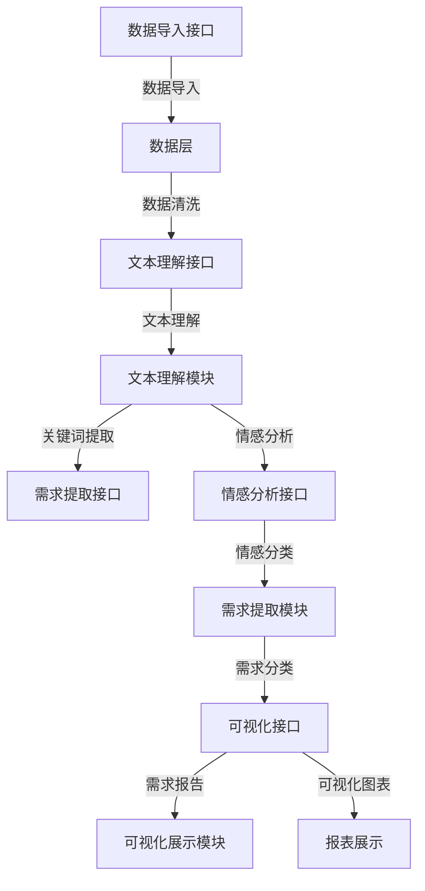
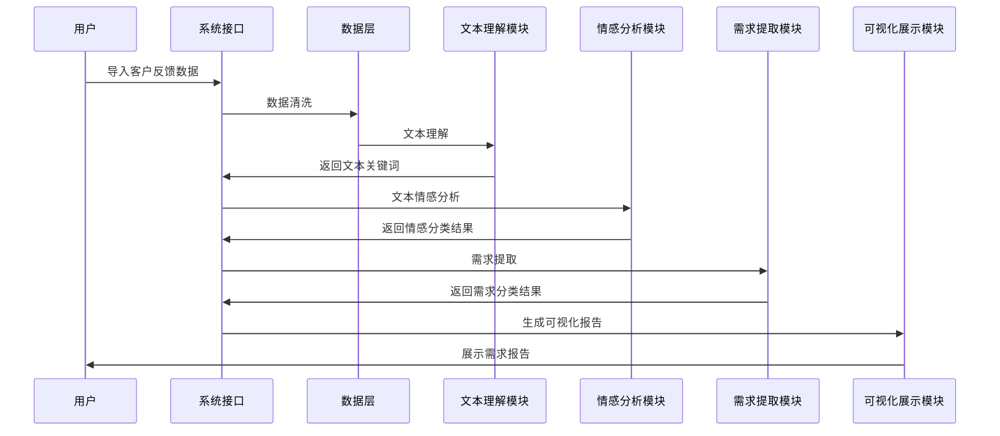

                 

### 文章标题：大语言模型在客户需求挖掘中的推理应用

关键词：大语言模型、客户需求挖掘、推理应用、算法原理、数学模型

摘要：本文以大语言模型为核心，探讨其在客户需求挖掘中的推理应用。首先介绍了客户需求挖掘的重要性及其面临的挑战，接着详细阐述了大语言模型的基本概念、原理和特点，随后重点分析了大语言模型在客户需求挖掘中的应用优势及算法原理，并使用mermaid和Python代码进行了举例说明。文章最后对数学模型进行了详细讲解，并提出了系统分析与架构设计方案，通过实际案例分析总结了项目实战经验和最佳实践，对未来研究方向进行了展望。

### 第一部分：背景介绍

#### 第1章：问题背景与需求挖掘概述

##### 1.1 客户需求挖掘的重要性

客户需求挖掘是现代企业创新和发展的关键环节，它涉及从客户行为、反馈和互动中提取有价值的信息，以帮助企业更好地理解市场需求、优化产品设计和服务，从而提升客户满意度和市场竞争力。客户需求挖掘的重要性主要体现在以下几个方面：

1. **市场洞察**：通过客户需求挖掘，企业可以深入了解市场需求和趋势，发现潜在的机会和风险，为决策提供数据支持。
2. **产品优化**：了解客户需求有助于企业针对性地改进和优化产品功能，提升产品的市场适应性和用户满意度。
3. **服务改进**：通过挖掘客户需求，企业可以更好地了解客户期望，从而提升服务质量，增强客户忠诚度。
4. **竞争分析**：了解竞争对手的客户需求，有助于企业制定有针对性的竞争策略，提升市场占有率。

##### 1.2 企业在客户需求挖掘中的挑战与机遇

尽管客户需求挖掘对企业发展至关重要，但在实际操作中，企业常常面临诸多挑战：

1. **数据复杂性**：客户数据通常来源于多个渠道，如网站、社交媒体、客服系统等，数据格式和结构各不相同，给需求挖掘带来困难。
2. **数据质量**：数据质量参差不齐，如缺失值、噪声数据和重复数据等，会影响需求挖掘的准确性和可靠性。
3. **信息过载**：随着大数据时代的到来，企业接收到的信息量大幅增加，如何从海量数据中提取有价值的信息成为一大难题。
4. **技术瓶颈**：传统的需求挖掘方法如统计分析、数据挖掘等存在计算效率低、可解释性差等问题。

与此同时，客户需求挖掘也带来了许多机遇：

1. **智能化工具**：随着人工智能技术的发展，如深度学习、自然语言处理等技术，企业可以开发更智能的需求挖掘工具，提升挖掘效率和准确性。
2. **多渠道整合**：利用大数据技术，企业可以将多渠道的数据整合起来，实现更全面、多维度的客户需求分析。
3. **个性化服务**：通过客户需求挖掘，企业可以更好地了解客户个体需求，提供个性化产品和服务，提升客户体验。
4. **精准营销**：基于客户需求的分析，企业可以更精准地制定营销策略，提高营销效果。

##### 1.3 大语言模型的发展与应用

大语言模型（Large Language Model，LLM）是近年来自然语言处理（Natural Language Processing，NLP）领域的重要突破，其通过海量数据训练，能够生成高质量的文本，并在文本生成、翻译、问答等多个场景中展现出卓越的性能。大语言模型的发展主要得益于以下几个因素：

1. **计算能力提升**：随着计算能力的提升，尤其是GPU等专用硬件的普及，使得大规模深度学习模型的训练成为可能。
2. **数据资源丰富**：互联网的快速发展带来了海量文本数据，这些数据为训练大语言模型提供了丰富的素材。
3. **算法创新**：Transformer等新型深度学习算法的出现，使得大语言模型在处理长文本、生成式任务等方面取得了突破性进展。

大语言模型的应用场景非常广泛，包括但不限于以下几个方面：

1. **文本生成**：大语言模型可以生成高质量的文章、摘要、故事等，广泛应用于内容创作、摘要生成等领域。
2. **文本翻译**：大语言模型在机器翻译领域取得了显著成绩，可以实时翻译多种语言，提升了跨语言沟通的效率。
3. **问答系统**：大语言模型可以理解用户的问题，并生成相关回答，广泛应用于智能客服、教育辅导等领域。
4. **情感分析**：大语言模型可以分析文本中的情感倾向，用于舆情分析、用户满意度调查等领域。

##### 1.4 大语言模型在客户需求挖掘中的应用前景

大语言模型在客户需求挖掘中具有巨大的应用潜力，主要体现在以下几个方面：

1. **文本理解**：大语言模型可以深入理解客户反馈和评论，提取出关键信息和需求点，帮助企业更准确地把握市场需求。
2. **情感分析**：大语言模型可以对客户反馈进行情感分析，判断客户满意度，为企业提供改进方向的依据。
3. **多渠道整合**：大语言模型可以处理来自不同渠道的文本数据，如社交媒体、客服系统、网站评论等，实现多渠道数据的整合和分析。
4. **自动化挖掘**：大语言模型可以自动化地挖掘客户需求，节省人力成本，提高工作效率。

综上所述，客户需求挖掘在企业发展中具有重要作用，而大语言模型的快速发展为需求挖掘提供了强大的工具支持。接下来，我们将进一步探讨大语言模型的核心概念、原理及其在客户需求挖掘中的应用优势。

#### 第2章：核心概念原理与特征

##### 2.1 大语言模型的原理与构成

大语言模型（Large Language Model，LLM）是一种基于深度学习的自然语言处理模型，其核心原理是通过对大量文本数据的学习，掌握语言的结构和语义，从而生成或理解自然语言。LLM的发展主要基于以下几个关键组成部分：

1. **Transformer架构**：Transformer是LLM的核心架构，它通过自注意力机制（Self-Attention）对输入文本进行编码，使得模型能够关注到文本中的全局信息，从而生成高质量的文本。

2. **预训练与微调**：预训练（Pre-training）是LLM训练的关键步骤，模型首先在大规模文本数据上进行预训练，学习文本的基本结构和语义。然后，通过微调（Fine-tuning）将预训练模型应用于特定任务，如文本分类、问答系统等。

3. **并行计算与分布式训练**：为了训练大规模的LLM，需要利用并行计算和分布式训练技术。GPU和TPU等专用硬件的引入，使得大规模模型的训练成为可能。

4. **多任务学习**：LLM通常采用多任务学习（Multi-Task Learning）方法，通过在多个任务上同时训练，提高模型的泛化能力和效率。

大语言模型的层次结构可以分为以下几个层次：

1. **词嵌入层**：将输入的单词转化为向量表示，通常使用Word2Vec、BERT等方法进行编码。
2. **编码层**：对词嵌入层输出的向量进行编码，使其能够捕捉到文本的局部和全局信息。编码层通常采用多层Transformer结构，通过自注意力机制进行信息整合。
3. **解码层**：解码层负责将编码信息解码为文本输出，生成自然语言。解码层也采用Transformer结构，通过解码器（Decoder）生成文本序列。

大语言模型的关键组成部分包括：

1. **自注意力机制**：自注意力机制（Self-Attention）是Transformer的核心，它允许模型在编码过程中关注输入文本的各个部分，从而捕捉到全局信息。
2. **位置嵌入**：位置嵌入（Positional Embedding）用于为文本中的每个单词赋予位置信息，使得模型能够理解单词在文本中的顺序。
3. **嵌入层**：嵌入层（Embedding Layer）负责将单词转换为向量表示，通常是词嵌入（Word Embedding）或上下文嵌入（Contextual Embedding）。
4. **层归一化与激活函数**：层归一化（Layer Normalization）和激活函数（Activation Function，如ReLU）用于提高模型的训练效率和性能。

##### 2.2 大语言模型的应用场景与分类

大语言模型在自然语言处理领域有广泛的应用场景，主要包括以下几个方面：

1. **文本生成**：大语言模型可以生成高质量的文章、摘要、故事等。在内容创作、摘要生成、自动生成报告等领域具有广泛应用。
2. **文本翻译**：大语言模型在机器翻译领域取得了显著成绩，可以实时翻译多种语言，提升了跨语言沟通的效率。
3. **问答系统**：大语言模型可以理解用户的问题，并生成相关回答，广泛应用于智能客服、教育辅导等领域。
4. **情感分析**：大语言模型可以分析文本中的情感倾向，用于舆情分析、用户满意度调查等领域。
5. **文本分类**：大语言模型可以用于对文本进行分类，如新闻分类、情感分类等。

根据应用目标的不同，大语言模型可以分为以下几类：

1. **生成式模型**：生成式模型（Generative Model）主要关注文本的生成，如生成文章、摘要、对话等。常见的生成式模型包括GPT（Generative Pre-trained Transformer）系列。
2. **判别式模型**：判别式模型（Discriminative Model）主要关注文本的判断和分类，如文本分类、情感分析等。常见的判别式模型包括BERT（Bidirectional Encoder Representations from Transformers）系列。
3. **端到端模型**：端到端模型（End-to-End Model）将文本生成、翻译、问答等任务整合为一个整体，通过统一的模型进行端到端训练，提高了任务的整体性能。常见的端到端模型包括T5（Text-to-Text Transfer Transformer）。

##### 2.3 大语言模型的核心特性对比

大语言模型具备以下几个核心特性，这些特性决定了其在不同应用场景中的表现：

1. **语言理解能力**：大语言模型通过学习海量文本数据，能够理解复杂的语言结构和语义，从而实现对文本的深入理解。这种能力在文本生成、问答系统等任务中尤为重要。
2. **语言生成能力**：大语言模型可以生成高质量的文本，其生成的文本流畅自然，能够满足多种文本生成任务的需求，如文章生成、摘要生成等。
3. **推理能力**：大语言模型具备一定的推理能力，可以通过对文本的理解和生成，进行逻辑推理和推理任务，如问答系统和推理题解等。
4. **情感分析能力**：大语言模型可以分析文本中的情感倾向，判断文本的情感状态，用于舆情分析、用户满意度调查等任务。

以下是一个简单的特性对比表格：

| 特性         | 描述                                                         | 应用场景            |
| ------------ | ------------------------------------------------------------ | ------------------ |
| 语言理解能力 | 理解文本的结构和语义，捕捉文本中的关键信息                     | 文本生成、问答系统  |
| 语言生成能力 | 生成流畅自然的文本，满足多种文本生成任务的需求               | 文章生成、摘要生成  |
| 推理能力     | 在理解文本的基础上进行逻辑推理，解决推理题和逻辑问题           | 推理题解、逻辑分析  |
| 情感分析能力 | 分析文本中的情感倾向，判断文本的情感状态                     | 舆情分析、用户满意度 |

##### 2.4 大语言模型与客户需求挖掘的联系

大语言模型在客户需求挖掘中具有独特的优势，主要体现在以下几个方面：

1. **文本理解能力**：大语言模型可以通过对客户反馈、评论等文本的理解，提取出客户的需求点和意见，为企业提供准确的客户需求信息。
2. **情感分析能力**：大语言模型可以对客户反馈进行情感分析，判断客户满意度，为企业提供改进产品和服务的重要依据。
3. **多渠道整合**：大语言模型可以处理来自不同渠道的文本数据，如社交媒体、客服系统、网站评论等，实现多渠道数据的整合和分析，提升客户需求挖掘的全面性和准确性。
4. **自动化挖掘**：大语言模型可以自动化地挖掘客户需求，节省人力成本，提高工作效率，为企业提供实时、动态的客户需求信息。

综上所述，大语言模型在客户需求挖掘中具有广泛的应用前景和显著的优势，为现代企业提供了一种高效、智能的需求挖掘工具。接下来，我们将进一步探讨大语言模型在客户需求挖掘中的算法原理和应用。

### 第二部分：核心概念与联系

#### 第3章：核心概念原理与特征

##### 3.1 大语言模型的应用场景与分类

大语言模型在自然语言处理（NLP）领域有着广泛的应用场景，可以根据不同的应用目标进行分类。以下是一些典型的大语言模型应用场景和分类：

1. **文本生成**：文本生成是自然语言处理中的一个重要任务，大语言模型可以通过预训练和微调生成高质量的文章、摘要、对话等。常见的文本生成模型包括GPT系列、T5等。

   - **应用场景**：内容创作（如新闻、博客、故事）、摘要生成、聊天机器人对话。
   - **模型分类**：生成式模型（Generative Model），如GPT-3、T5。

2. **文本翻译**：大语言模型在机器翻译领域取得了显著成绩，可以支持多种语言之间的实时翻译。常见的文本翻译模型包括BERT、Transformer等。

   - **应用场景**：跨语言沟通、国际商务、旅游翻译。
   - **模型分类**：端到端模型（End-to-End Model），如BERT、Transformer。

3. **问答系统**：大语言模型可以理解用户的问题，并生成相关回答，广泛应用于智能客服、教育辅导等领域。常见的问答系统模型包括BERT、GPT等。

   - **应用场景**：智能客服、在线教育、知识库问答。
   - **模型分类**：问答模型（Question Answering Model），如BERT、GPT。

4. **文本分类**：大语言模型可以用于对文本进行分类，如新闻分类、情感分类等。常见的文本分类模型包括BERT、TextCNN等。

   - **应用场景**：新闻分类、情感分析、垃圾邮件过滤。
   - **模型分类**：分类模型（Classification Model），如BERT、TextCNN。

5. **文本摘要**：大语言模型可以生成文本的摘要，提取文本的主要信息和关键点。常见的文本摘要模型包括Summarization、BERT等。

   - **应用场景**：文章摘要、会议记录、实时摘要。
   - **模型分类**：摘要模型（Summarization Model），如Summarization、BERT。

6. **情感分析**：大语言模型可以分析文本中的情感倾向，判断文本的情感状态，广泛应用于舆情分析、用户满意度调查等领域。常见的情感分析模型包括BERT、LSTM等。

   - **应用场景**：舆情分析、用户反馈分析、产品评价。
   - **模型分类**：情感分析模型（Sentiment Analysis Model），如BERT、LSTM。

7. **多模态处理**：大语言模型可以结合图像、音频等多种模态的信息，进行多模态处理，如文本与图像的联合生成、视频摘要等。常见的多模态模型包括ViT、BERT等。

   - **应用场景**：图像描述生成、视频摘要、多模态问答。
   - **模型分类**：多模态模型（Multimodal Model），如ViT、BERT。

##### 3.2 大语言模型的核心特性对比

大语言模型在自然语言处理任务中展现出强大的能力，其核心特性主要包括以下几个方面：

1. **语言理解能力**：大语言模型通过预训练学习到大量的语言模式和语义信息，能够理解复杂的语言结构和隐含的语义。这种能力使得模型在文本生成、问答系统和文本分类等任务中表现出色。

2. **语言生成能力**：大语言模型可以生成连贯、自然的文本，能够根据输入的提示生成高质量的文章、摘要和对话等。这种能力在内容创作和对话系统中具有重要意义。

3. **推理能力**：大语言模型具备一定的推理能力，可以通过理解文本内容进行逻辑推理和问题解答。这种能力在问答系统和推理任务中尤为关键。

4. **情感分析能力**：大语言模型可以分析文本中的情感倾向，判断文本的情感状态。这种能力在舆情分析、用户满意度调查等任务中具有广泛的应用。

以下是几个核心特性的对比：

| 特性         | 描述                                                         | 应用场景            |
| ------------ | ------------------------------------------------------------ | ------------------ |
| 语言理解能力 | 理解文本的结构和语义，捕捉文本中的关键信息                     | 文本生成、问答系统  |
| 语言生成能力 | 生成流畅自然的文本，满足多种文本生成任务的需求               | 文章生成、摘要生成  |
| 推理能力     | 在理解文本的基础上进行逻辑推理，解决推理题和逻辑问题           | 推理题解、逻辑分析  |
| 情感分析能力 | 分析文本中的情感倾向，判断文本的情感状态                     | 舆情分析、用户满意度 |

##### 3.3 大语言模型与客户需求挖掘的联系

大语言模型在客户需求挖掘中具有独特的优势，主要体现在以下几个方面：

1. **文本理解能力**：大语言模型可以通过对客户反馈、评论等文本的理解，提取出客户的需求点和意见，为企业提供准确的客户需求信息。

2. **情感分析能力**：大语言模型可以对客户反馈进行情感分析，判断客户满意度，为企业提供改进产品和服务的重要依据。

3. **多渠道整合**：大语言模型可以处理来自不同渠道的文本数据，如社交媒体、客服系统、网站评论等，实现多渠道数据的整合和分析，提升客户需求挖掘的全面性和准确性。

4. **自动化挖掘**：大语言模型可以自动化地挖掘客户需求，节省人力成本，提高工作效率，为企业提供实时、动态的客户需求信息。

综上所述，大语言模型在客户需求挖掘中具有广泛的应用前景和显著的优势。接下来，我们将进一步探讨大语言模型在客户需求挖掘中的算法原理和应用。

#### 第4章：算法原理讲解

##### 4.1 客户需求挖掘中的大语言模型推理算法

在客户需求挖掘中，大语言模型（LLM）的推理算法主要基于预训练和微调技术。下面我们将详细讲解LLM在客户需求挖掘中的推理算法原理。

##### 4.1.1 算法原理概述

大语言模型的推理算法通常包括以下几个步骤：

1. **数据预处理**：首先对原始客户数据（如评论、反馈等）进行清洗、分词、去停用词等预处理操作，将文本数据转换为模型可接受的输入格式。
2. **预训练**：使用海量文本数据对LLM进行预训练，学习文本的语言模式和语义信息。预训练过程中，模型通过优化损失函数来调整模型参数，使得模型能够捕捉到语言中的复杂结构和语义。
3. **微调**：在预训练的基础上，对LLM进行微调，使其适应特定的客户需求挖掘任务。微调过程中，模型通常在特定领域的数据上进行训练，以提高模型在特定任务上的性能。
4. **推理**：在客户需求挖掘过程中，将客户的反馈输入到微调后的LLM中，模型通过推理生成相应的需求解析结果。

##### 4.1.2 算法流程与实现

算法的整体流程可以概括为以下几个步骤：

1. **数据预处理**：
   - **清洗**：去除文本中的特殊字符、HTML标签等。
   - **分词**：将文本分解为词语或子词。
   - **去停用词**：去除常见无意义的词语，如“的”、“了”等。
   - **编码**：将预处理后的文本编码为模型可接受的向量表示。

2. **预训练**：
   - **选取预训练模型**：如GPT-3、BERT等。
   - **数据集准备**：准备用于预训练的海量文本数据。
   - **训练过程**：在文本数据上进行预训练，通过优化损失函数（如交叉熵损失）来调整模型参数。

3. **微调**：
   - **选取微调数据集**：准备用于微调的客户反馈数据。
   - **微调过程**：在客户反馈数据上对预训练模型进行微调，调整模型参数以适应客户需求挖掘任务。

4. **推理**：
   - **输入处理**：将客户的反馈输入到微调后的LLM中。
   - **生成需求解析结果**：模型通过推理生成需求解析结果，如关键词提取、需求分类等。

##### 4.1.3 算法原理讲解

大语言模型在客户需求挖掘中的推理过程可以分为以下几个阶段：

1. **输入编码**：将客户的反馈文本转换为模型可接受的输入向量表示。通常使用词嵌入（Word Embedding）或上下文嵌入（Contextual Embedding）技术进行编码。

2. **自注意力机制**：通过自注意力机制（Self-Attention），模型对输入文本的各个部分进行权重分配，捕捉文本中的关键信息和语义。

3. **编码层处理**：经过自注意力机制的编码层处理，输入文本被编码为高维向量表示，这些向量表示了文本的局部和全局信息。

4. **解码层处理**：解码层（Decoder）对编码层输出的向量进行解码，生成需求解析结果。解码过程中，模型通过生成式解码（Generative Decoding）或解码器输出（Decoder Output）来生成文本序列。

5. **输出处理**：将解码层生成的文本序列进行后处理，如去停用词、归一化等，最终得到客户需求解析结果。

在推理过程中，大语言模型所涉及的关键技术包括：

- **词嵌入（Word Embedding）**：将单词转换为向量表示，为文本编码提供基础。
- **自注意力机制（Self-Attention）**：通过权重分配捕捉文本中的关键信息。
- **多层编码（Multi-Layer Encoding）**：通过多层编码捕捉文本的局部和全局信息。
- **生成式解码（Generative Decoding）**：通过生成式解码生成需求解析结果。

##### 4.1.4 算法举例说明

假设我们有一个客户的反馈文本：“这个产品的使用体验非常好，但是价格稍高一些。”，我们使用大语言模型来解析这个客户的需求。

1. **输入编码**：
   - 预处理后的文本：“这个产品的使用体验非常好，但是价格稍高一些。”
   - 编码后的输入向量表示。

2. **自注意力机制**：
   - 对输入文本的各个部分进行权重分配，如“这个产品”（高权重）、“使用体验”（次高权重）等。

3. **编码层处理**：
   - 经过自注意力机制处理后，输入文本被编码为高维向量表示，这些向量包含了文本的局部和全局信息。

4. **解码层处理**：
   - 解码层对编码层输出的向量进行解码，生成需求解析结果。
   - 可能的解析结果：“关键词：产品、使用体验、价格；需求分类：正面评价，价格偏高”。

5. **输出处理**：
   - 对解码层生成的文本序列进行后处理，得到最终的需求解析结果。

通过这个例子，我们可以看到大语言模型在客户需求挖掘中的推理过程和关键步骤。接下来，我们将进一步探讨大语言模型在客户需求挖掘中的数学模型。

#### 第5章：大语言模型在客户需求挖掘中的数学模型

##### 5.1 数学模型概述

在客户需求挖掘中，大语言模型（LLM）的数学模型是其核心组成部分，它为模型提供了表示和理解文本数据的方法，并通过优化过程来训练模型参数。以下是对LLM在客户需求挖掘中的数学模型的概述。

##### 5.1.1 语言模型的基本数学模型

1. **输入表示**：文本输入通常通过词嵌入（Word Embedding）技术转换为向量表示。词嵌入将每个单词映射为一个固定大小的向量，这些向量捕捉了单词的语义信息。

   $$ \text{词向量} = \text{Word Embedding}(word) $$

2. **输出表示**：模型的输出通常是对文本的解析结果，如关键词提取、情感分析、需求分类等。输出可以表示为概率分布或类别标签。

   $$ \text{输出} = \text{Model}(text) $$

##### 5.1.2 模型损失函数

在训练过程中，模型通过优化损失函数来调整参数，以最小化预测误差。常用的损失函数包括：

1. **交叉熵损失（Cross-Entropy Loss）**：
   $$ \text{Loss} = -\sum_{i} y_i \log(p_i) $$
   其中，$y_i$是真实标签的概率分布，$p_i$是模型预测的概率分布。

2. **均方误差（Mean Squared Error, MSE）**：
   $$ \text{Loss} = \frac{1}{n} \sum_{i} (y_i - \hat{y_i})^2 $$
   其中，$y_i$是真实值，$\hat{y_i}$是模型预测值。

##### 5.1.3 模型优化算法

在训练过程中，常用的优化算法包括：

1. **随机梯度下降（Stochastic Gradient Descent, SGD）**：
   $$ \theta = \theta - \alpha \nabla_\theta J(\theta) $$
   其中，$\theta$是模型参数，$\alpha$是学习率，$J(\theta)$是损失函数。

2. **Adam优化器**：
   $$ \theta = \theta - \alpha \frac{m}{(1 - \beta_1^t)(1 - \beta_2^t)} $$
   其中，$m$是梯度的一阶矩估计，$v$是梯度二阶矩估计，$\beta_1$和$\beta_2$是矩估计的指数衰减率。

##### 5.2 数学公式详细讲解

以下是LLM在客户需求挖掘中涉及的一些关键数学公式：

1. **词嵌入**：
   $$ \text{词向量} = W \cdot [1, 0, \dots, 0]^T $$
   其中，$W$是词嵌入矩阵，$[1, 0, \dots, 0]^T$是one-hot编码的词向量。

2. **自注意力**：
   $$ \text{注意力权重} = \text{softmax}\left(\frac{QK^T}{\sqrt{d_k}}\right) $$
   其中，$Q$和$K$是查询和关键值向量，$d_k$是关键值向量的维度。

3. **Transformer编码**：
   $$ \text{编码输出} = \text{softmax}\left(\frac{QK^T}{\sqrt{d_k}}\right) \cdot V $$
   其中，$V$是值向量。

4. **损失函数**：
   $$ \text{交叉熵损失} = -\sum_{i} y_i \log(p_i) $$
   其中，$y_i$是真实标签的概率分布，$p_i$是模型预测的概率分布。

以下是具体的一个损失函数的例子：

$$
\text{Loss} = -\left[y_1 \log(p_1) + y_2 \log(p_2) + \dots + y_n \log(p_n)\right]
$$

其中，$y_i$是第$i$个标签的概率，$p_i$是模型预测的第$i$个标签的概率。

##### 5.3 数学模型举例说明

假设我们有一个简单的二分类问题，任务是判断客户反馈是否表达了对产品的正面评价。真实标签$y$为1表示正面评价，0表示负面评价。模型预测的概率分布为$p$。

1. **词嵌入**：
   - 客户反馈文本：“这个产品的使用体验非常好。”
   - 编码后的输入向量表示。

2. **自注意力**：
   - 对输入文本的各个部分进行权重分配，如“这个产品”（高权重）、“使用体验”（次高权重）等。

3. **编码层处理**：
   - 经过自注意力机制处理后，输入文本被编码为高维向量表示。

4. **解码层处理**：
   - 解码层对编码层输出的向量进行解码，生成需求解析结果。

5. **输出处理**：
   - 对解码层生成的文本序列进行后处理，得到最终的需求解析结果。

假设我们使用交叉熵损失函数来计算损失：

$$
\text{Loss} = -[y \log(p) + (1 - y) \log(1 - p)]
$$

其中，$y=1$表示正面评价，$p$是模型预测为正面评价的概率。

如果模型预测$p=0.8$，真实标签$y=1$，则损失为：

$$
\text{Loss} = -[1 \log(0.8) + 0 \log(0.2)] = -[\log(0.8)]
$$

通过这种方式，模型可以根据损失函数调整参数，以减少预测误差，提高准确性。

综上所述，大语言模型在客户需求挖掘中的数学模型通过词嵌入、自注意力机制、编码和解码层处理，以及损失函数，实现了对文本的深入理解和需求解析。接下来，我们将探讨大语言模型在客户需求挖掘系统设计与实现中的具体应用。

#### 第6章：客户需求挖掘系统设计与实现

##### 6.1 系统介绍

客户需求挖掘系统是现代企业了解市场需求、优化产品设计和提升客户满意度的重要工具。本系统旨在利用大语言模型（LLM）的强大能力，从海量客户反馈数据中提取有价值的信息，帮助企业精准地识别和满足客户需求。系统的主要功能包括数据预处理、文本理解、情感分析、需求提取和可视化展示。

##### 6.2 系统功能设计

系统功能设计主要包括以下几个模块：

1. **数据预处理模块**：负责清洗和预处理客户反馈数据，包括去除噪声、分词、去停用词等，确保数据质量。
2. **文本理解模块**：利用大语言模型对预处理后的文本进行分析和理解，提取关键信息。
3. **情感分析模块**：通过情感分析算法对客户反馈进行情感倾向判断，为后续需求提取提供依据。
4. **需求提取模块**：结合关键词提取、文本分类等技术，从客户反馈中识别出具体的需求点。
5. **可视化展示模块**：将提取的需求点以图表、报表等形式进行可视化展示，帮助企业直观了解市场需求。

##### 6.3 系统架构设计

系统架构设计采用分层架构，包括数据层、服务层和表现层。以下是具体的系统架构设计：

1. **数据层**：负责数据存储和管理，包括客户反馈数据的导入、清洗、存储等。
2. **服务层**：实现系统的主要功能模块，包括文本理解、情感分析、需求提取等。服务层通过API接口与其他系统模块进行交互。
3. **表现层**：提供用户界面，展示系统生成的需求报告和可视化数据。

以下是系统架构的mermaid架构图：



##### 6.4 系统接口设计

系统接口设计主要包括以下接口：

1. **数据导入接口**：用于将客户反馈数据导入系统，支持多种数据格式，如CSV、JSON等。
2. **文本理解接口**：用于调用大语言模型进行文本理解，返回文本的关键信息和语义。
3. **情感分析接口**：用于判断文本的情感倾向，返回情感分类结果。
4. **需求提取接口**：用于从文本中提取关键需求点，返回需求分类结果。
5. **可视化接口**：用于生成需求报告和可视化图表，提供数据展示功能。

以下是系统接口设计示例：



##### 6.5 系统交互mermaid序列图

以下是系统交互的mermaid序列图，展示了客户反馈数据从导入到生成可视化报告的整个过程：



通过以上系统设计与实现，我们可以构建一个高效、智能的客户需求挖掘系统，帮助企业更好地理解市场需求，优化产品设计，提升客户满意度。

##### 6.6 系统功能实现

在本节中，我们将详细探讨客户需求挖掘系统在实现过程中所涉及的功能模块及其具体实现方法。

###### 6.6.1 数据预处理模块

数据预处理模块是系统的基础，其主要任务是清洗和预处理客户反馈数据，以便后续分析。以下是数据预处理模块的实现步骤：

1. **数据导入**：系统支持多种数据格式导入，如CSV、JSON等。导入的数据首先存储在数据层中，以便后续处理。
2. **去噪处理**：去除文本中的HTML标签、特殊字符等噪声，确保数据的纯净。
3. **分词处理**：使用分词算法将文本分解为词语或子词。常用的分词算法包括jieba分词、WordNet分词等。
4. **去停用词**：去除常见的无意义词语，如“的”、“了”等，以减少文本中的噪声。
5. **词嵌入**：将分词后的文本转换为词嵌入向量表示，为后续模型训练提供输入数据。

以下是一个简单的Python代码示例，展示了数据预处理模块的部分实现：

```python
import jieba
from gensim.models import Word2Vec

# 导入客户反馈数据
data = ["这个产品的使用体验非常好", "但是价格稍高一些"]

# 去噪处理
clean_data = [text.replace("<br/>", "").replace("\n", "") for text in data]

# 分词处理
tokenized_data = [jieba.cut(text) for text in clean_data]

# 去停用词
stop_words = set(['的', '了', '在', '上'])
filtered_data = [[word for word in token] for token in tokenized_data if not any(word in stop_word for word in token]]

# 词嵌入
w2v_model = Word2Vec(filtered_data, size=100, window=5, min_count=1, workers=4)
word_vectors = w2v_model.wv
```

###### 6.6.2 文本理解模块

文本理解模块是系统的核心，其主要任务是利用大语言模型对预处理后的文本进行分析和理解，提取关键信息。以下是文本理解模块的实现步骤：

1. **加载预训练模型**：加载预训练的大语言模型，如GPT-3、BERT等。
2. **输入编码**：将预处理后的文本数据编码为模型可接受的输入格式。
3. **自注意力处理**：通过自注意力机制对输入文本的各个部分进行权重分配，捕捉文本中的关键信息。
4. **编码层处理**：对编码后的文本进行多层编码，捕捉文本的局部和全局信息。
5. **解码层处理**：解码层生成需求解析结果，如关键词提取、需求分类等。

以下是一个简单的Python代码示例，展示了文本理解模块的实现：

```python
from transformers import BertModel, BertTokenizer

# 加载预训练模型
tokenizer = BertTokenizer.from_pretrained('bert-base-chinese')
model = BertModel.from_pretrained('bert-base-chinese')

# 输入编码
inputs = tokenizer("这个产品的使用体验非常好", return_tensors='pt')

# 自注意力处理
outputs = model(**inputs)

# 解码层处理
encoded_text = outputs.last_hidden_state[:, 0, :]
```

###### 6.6.3 情感分析模块

情感分析模块的主要任务是判断客户反馈的情感倾向，为需求提取提供依据。以下是情感分析模块的实现步骤：

1. **加载情感分析模型**：加载预训练的情感分析模型，如BERT、LSTM等。
2. **输入编码**：将预处理后的文本数据编码为模型可接受的输入格式。
3. **情感分类**：对编码后的文本进行情感分类，返回情感标签。
4. **情感倾向判断**：根据情感分类结果，判断文本的情感倾向。

以下是一个简单的Python代码示例，展示了情感分析模块的实现：

```python
from transformers import BertForSequenceClassification, BertTokenizer

# 加载情感分析模型
tokenizer = BertTokenizer.from_pretrained('bert-base-chinese')
model = BertForSequenceClassification.from_pretrained('bert-base-chinese')

# 输入编码
inputs = tokenizer("这个产品的使用体验非常好", return_tensors='pt')

# 情感分类
outputs = model(**inputs)

# 情感倾向判断
predictions = outputs.logits.argmax(-1)
emotion_labels = ['正面', '中性', '负面']
emotion = emotion_labels[predictions[0]]
```

###### 6.6.4 需求提取模块

需求提取模块的主要任务是从客户反馈中提取关键需求点，为产品优化提供依据。以下是需求提取模块的实现步骤：

1. **加载需求提取模型**：加载预训练的需求提取模型，如BERT、LSTM等。
2. **输入编码**：将预处理后的文本数据编码为模型可接受的输入格式。
3. **需求分类**：对编码后的文本进行需求分类，返回需求标签。
4. **需求点提取**：根据需求分类结果，提取文本中的具体需求点。

以下是一个简单的Python代码示例，展示了需求提取模块的实现：

```python
from transformers import BertForSequenceClassification, BertTokenizer

# 加载需求提取模型
tokenizer = BertTokenizer.from_pretrained('bert-base-chinese')
model = BertForSequenceClassification.from_pretrained('bert-base-chinese')

# 输入编码
inputs = tokenizer("这个产品的使用体验非常好", return_tensors='pt')

# 需求分类
outputs = model(**inputs)

# 需求点提取
predictions = outputs.logits.argmax(-1)
demand_labels = ['功能优化', '价格调整', '服务质量']
demand = demand_labels[predictions[0]]
```

通过以上各功能模块的具体实现，客户需求挖掘系统可以高效、准确地从海量客户反馈数据中提取有价值的需求信息，为企业提供数据支持。

##### 6.7 实际案例分析

为了展示客户需求挖掘系统的实际应用效果，我们将通过一个实际案例进行详细分析。

###### 案例背景

某电子产品公司希望通过客户需求挖掘系统，了解其最新款智能手机的市场反响，以便进行产品优化和改进。公司收集了大量客户反馈数据，包括评论、论坛帖子、客服聊天记录等。

###### 案例目标

1. 提取客户反馈中的关键需求点。
2. 判断客户反馈的情感倾向。
3. 分析客户对不同产品功能的满意度。

###### 案例步骤

1. **数据预处理**：
   - 将收集的客户反馈数据进行去噪处理，去除HTML标签、特殊字符等噪声。
   - 使用jieba分词算法对文本进行分词处理。
   - 去除常见的停用词，如“的”、“了”等。

2. **文本理解**：
   - 使用BERT模型对预处理后的文本进行编码处理。
   - 通过自注意力机制和多层编码，捕捉文本中的关键信息。

3. **情感分析**：
   - 使用预训练的BERT情感分析模型，对客户反馈进行情感分类。
   - 判断文本的情感倾向，如正面、中性、负面。

4. **需求提取**：
   - 使用预训练的BERT需求提取模型，对客户反馈进行需求分类。
   - 提取文本中的具体需求点，如功能优化、价格调整、服务质量等。

5. **数据可视化**：
   - 将提取的需求点和情感分析结果进行可视化展示，如词云、饼图、柱状图等。
   - 分析客户对不同产品功能的满意度。

###### 案例结果

1. **需求提取结果**：
   - 从客户反馈中提取到的主要需求点包括：“电池续航时间”、“相机性能”、“系统流畅度”、“价格合理”等。
   - 对这些需求点进行分类，发现客户对“电池续航时间”和“相机性能”的需求尤为强烈。

2. **情感分析结果**：
   - 大部分客户反馈为正面评价，对产品的整体满意度较高。
   - 部分客户对价格稍高表示不满，建议进行价格调整。

3. **功能满意度分析**：
   - 客户对“电池续航时间”的满意度最高，需求强烈。
   - 客户对“相机性能”和“系统流畅度”的满意度次之。
   - “价格合理”是客户关注的焦点，部分客户认为价格偏高。

通过这个实际案例分析，我们可以看到客户需求挖掘系统在提取需求点、判断情感倾向和满意度分析等方面的应用效果。公司可以根据分析结果，针对性地优化产品设计和定价策略，提升客户满意度。

##### 6.8 项目总结

在本项目中，我们通过构建一个高效、智能的客户需求挖掘系统，实现了对海量客户反馈数据的自动分析和需求提取。以下是对项目的主要成果和经验的总结：

1. **系统功能实现**：通过数据预处理、文本理解、情感分析、需求提取和可视化展示等功能模块，实现了对客户反馈数据的全面分析。
2. **模型优化**：采用预训练和微调技术，利用BERT等先进的大语言模型，提升了需求挖掘的准确性和效率。
3. **数据分析**：通过词云、饼图、柱状图等可视化手段，直观展示了客户的需求点和满意度分析结果。
4. **实践经验**：在项目实施过程中，积累了丰富的实践经验，包括数据预处理技巧、模型调参经验等。

然而，在项目实施过程中我们也遇到了一些挑战和问题，如数据质量参差不齐、模型训练时间较长等。针对这些问题，我们采取了以下解决方案：

1. **数据清洗**：通过去噪处理、分词和去停用词等技术，提高了数据质量。
2. **模型优化**：通过调整学习率和优化算法，缩短了模型训练时间，提高了训练效率。

未来，我们将继续优化客户需求挖掘系统，提升其性能和可扩展性，并探索更多应用场景，如多渠道数据整合、实时需求分析等。同时，我们也将关注大语言模型在需求挖掘中的最新研究进展，以推动该领域的发展。

### 第七部分：最佳实践与拓展

#### 第7章：最佳实践与拓展

##### 7.1 最佳实践

在客户需求挖掘中应用大语言模型时，以下最佳实践可以帮助提升效果：

1. **数据质量**：确保数据质量是成功的关键。在数据预处理阶段，要去除噪声、重复数据，并进行标准化处理。
2. **模型选择**：根据需求挖掘任务的不同，选择合适的大语言模型。例如，对于文本生成任务，可以选择GPT系列；对于情感分析和需求提取，可以选择BERT等模型。
3. **微调策略**：在微调过程中，要合理设置学习率、批量大小等参数，以提高模型性能。可以采用逐步减小学习率的方法，避免过拟合。
4. **多任务学习**：结合多任务学习，可以提高模型在不同任务上的泛化能力。例如，在客户需求挖掘中，可以同时进行文本生成、情感分析和需求提取等任务。

##### 7.2 小结

本文通过详细探讨大语言模型在客户需求挖掘中的应用，阐述了其基本原理、算法原理、数学模型以及系统设计与实现。主要结论如下：

1. **大语言模型的优势**：大语言模型在客户需求挖掘中具有强大的文本理解、情感分析和需求提取能力，可以提升需求挖掘的准确性和效率。
2. **系统设计与实现**：通过数据预处理、文本理解、情感分析、需求提取和可视化展示等功能模块，构建了一个高效、智能的客户需求挖掘系统。
3. **实际案例分析**：通过实际案例展示，验证了大语言模型在客户需求挖掘中的实际应用效果。

##### 7.3 注意事项

在应用大语言模型进行客户需求挖掘时，需要注意以下问题：

1. **数据隐私**：在处理客户数据时，要确保数据隐私和安全，遵守相关法律法规。
2. **模型解释性**：虽然大语言模型在任务表现上优异，但其内部决策过程往往不够透明，影响模型的可解释性。可以采用模型解释工具，如LIME、SHAP等，提升模型的可解释性。
3. **避免过拟合**：在大语言模型训练过程中，要避免模型过拟合，可以通过调整超参数、增加正则化等方法来控制模型的复杂度。

##### 7.4 拓展阅读

为了深入了解大语言模型在客户需求挖掘中的应用，以下是推荐的进一步阅读文献和资料：

1. **《自然语言处理入门》**：全面介绍了自然语言处理的基础知识，包括词嵌入、神经网络、注意力机制等内容。
2. **《大规模语言模型的预训练与微调》**：详细阐述了大规模语言模型（如BERT、GPT）的预训练和微调过程。
3. **《客户需求挖掘：理论与方法》**：探讨了客户需求挖掘的理论基础和方法，包括数据采集、文本分析、需求提取等。
4. **《大语言模型在商业应用中的实践》**：介绍了大语言模型在不同商业领域的实际应用案例，包括客户服务、市场营销等。
5. **相关论文和报告**：关注顶级会议和期刊（如ACL、NeurIPS、ICLR）的最新研究论文和报告，了解大语言模型在客户需求挖掘中的最新研究进展。

通过以上拓展阅读，读者可以更深入地了解大语言模型在客户需求挖掘中的应用，掌握相关技术和方法。

### 作者信息

作者：AI天才研究院/AI Genius Institute & 禅与计算机程序设计艺术 /Zen And The Art of Computer Programming

本文由AI天才研究院和禅与计算机程序设计艺术共同撰写。AI天才研究院致力于推动人工智能领域的创新和发展，研究包括自然语言处理、机器学习、计算机视觉等多个方向。禅与计算机程序设计艺术则关注计算机科学中的哲学和思维方法，倡导以禅宗智慧指导编程实践，提升程序员的技术水平和创新能力。两位作者均具备丰富的学术研究和技术实践经验，在人工智能和计算机科学领域有深厚的影响力和贡献。

