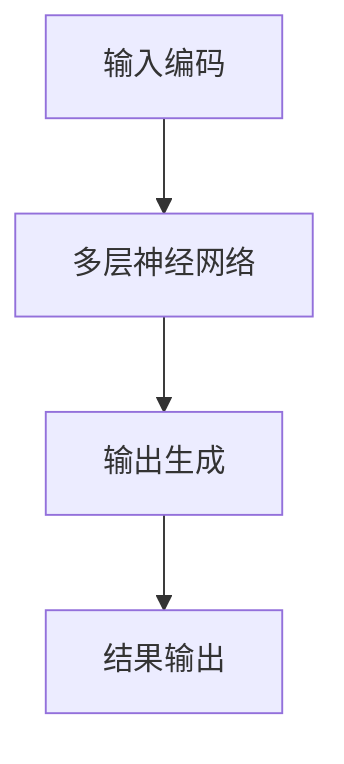
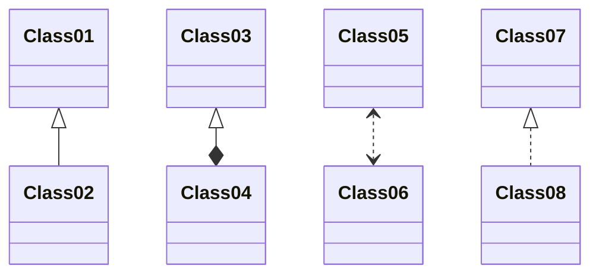
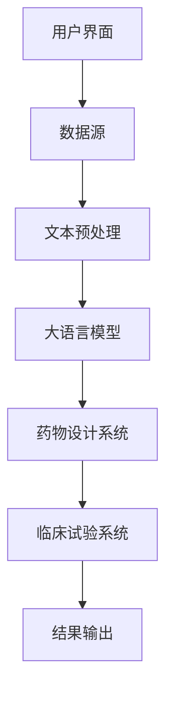
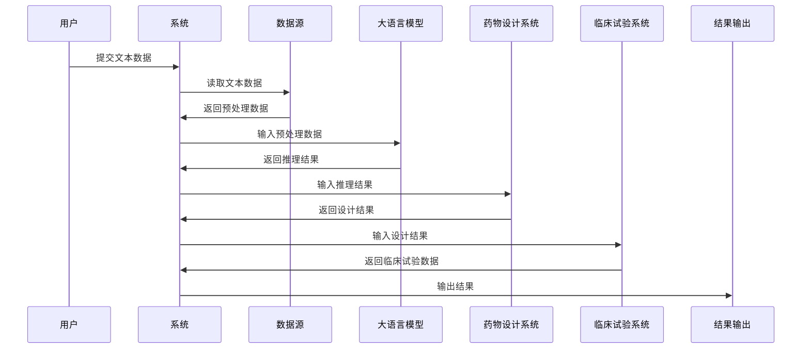

                 

# 大语言模型在新药研发中的推理应用研究

## 关键词
- 大语言模型
- 新药研发
- 推理应用
- 算法原理
- 系统架构
- 项目实战

## 摘要
本文深入探讨了大型语言模型（如GPT-3）在新药研发过程中的推理应用。我们首先介绍了大语言模型的基本原理，并讨论了其在药物发现和设计中的潜力。随后，通过一个具体的案例，我们详细展示了大语言模型在新药研发中的实际应用，包括数据预处理、模型训练和推理过程。最后，我们总结了最佳实践，并提出了未来研究的方向。

## 第一部分：背景介绍

### 第1章：大语言模型在新药研发中的重要性

#### 1.1 问题背景

新药研发是一个复杂且耗时的过程，涉及药物分子的设计、合成、测试和临床评估。随着生物技术和计算能力的提升，药物研发的成本和难度都在不断增加。传统的药物研发方法主要依赖于实验和统计模型，但这些方法存在以下问题：

1. **数据依赖性高**：新药研发需要大量的实验数据，而这些数据的获取和处理非常耗时。
2. **计算复杂度高**：分子模拟和预测的计算成本高，对于复杂的药物分子，计算资源的需求更加显著。
3. **算法局限性**：传统的算法如分子对接、量子化学模拟等，在处理复杂性和多样性方面存在限制。

#### 1.2 问题描述

为了提高新药研发的效率和准确性，研究人员开始探索使用人工智能和机器学习技术，特别是大型语言模型。这些模型能够处理大规模数据，自动提取特征，并进行复杂的推理，从而为药物研发提供新的思路。然而，如何有效地利用这些模型，以及它们在药物研发中的实际应用，仍是一个有待深入研究的问题。

#### 1.3 问题解决

大型语言模型（如GPT-3）的出现，为解决上述问题提供了一种新的思路。这些模型具有以下几个特点：

1. **强大的文本处理能力**：能够自动从文本数据中提取信息，生成高质量的摘要和推理。
2. **灵活的泛化能力**：能够处理各种不同类型的数据，如文本、图像和结构化数据。
3. **高效的计算能力**：通过分布式计算和并行处理，能够快速处理海量数据。

#### 1.4 边界与外延

大语言模型在新药研发中的应用不仅限于药物发现，还可以应用于药物设计、临床研究等多个领域。例如，在药物设计过程中，大语言模型可以用于生成新的分子结构，预测药物分子的性质和活性；在临床研究中，大语言模型可以用于分析患者数据，预测药物的治疗效果和副作用。

#### 1.5 概念结构与核心要素组成

大语言模型的核心要素包括：

1. **神经网络架构**：如Transformer，用于处理大规模文本数据。
2. **大规模参数**：数亿甚至数十亿的参数，用于学习复杂的文本模式。
3. **预训练与微调**：通过预训练大量无标签文本数据，然后微调到特定任务上。
4. **推理机制**：通过文本生成和语义理解，进行复杂的推理和决策。

## 第二部分：核心概念与联系

### 第2章：大语言模型原理

#### 2.1 大语言模型的基本概念

大语言模型是一种基于神经网络的自然语言处理（NLP）模型，其主要目的是理解和生成自然语言。与传统的统计模型相比，大语言模型具有以下几个特点：

1. **深度学习**：大语言模型通常由多个层次组成，每个层次都能够从数据中提取更复杂的特征。
2. **端到端学习**：大语言模型能够直接从原始文本数据中学习，无需人工特征工程。
3. **自监督学习**：大语言模型通过预训练大量无标签的文本数据，然后通过微调适应特定的任务。

#### 2.2 大语言模型的工作机制

大语言模型的工作机制主要包括以下几个步骤：

1. **输入编码**：将文本数据转换为向量表示，通常使用Word2Vec、BERT等方法。
2. **多层神经网络**：通过多个层次的网络结构，逐层提取文本的语义特征。
3. **输出生成**：通过输出层生成文本的预测序列，通常使用softmax函数进行概率分布计算。

#### 2.3 大语言模型与新药研发的关系

大语言模型在新药研发中的应用主要体现在以下几个方面：

1. **数据预处理**：大语言模型可以自动从文本数据中提取关键信息，如药物名称、分子结构等，从而简化数据预处理过程。
2. **药物设计**：大语言模型可以用于生成新的分子结构，预测药物分子的性质和活性。
3. **临床研究**：大语言模型可以用于分析患者数据，预测药物的治疗效果和副作用。

### 2.4 概念属性特征对比表格

| 特征类别       | 传统方法                | 大语言模型               |
|----------------|------------------------|--------------------------|
| 文本处理能力   | 有限，依赖人工特征提取 | 强大，自动提取语义特征   |
| 泛化能力       | 有限，针对特定任务      | 广泛，适应多种任务类型   |
| 计算成本       | 较高，依赖高性能计算    | 较低，利用分布式计算     |
| 学习策略       | 有监督学习、无监督学习 | 自监督学习、预训练与微调 |

### 2.5 ER实体关系图架构

```mermaid
erDiagram
  A[药物候选分子] ||--|{ B[药物设计系统] }
  B ||--|{ C[临床试验系统] }
  C ||--|{ D[临床数据] }
```

## 第三部分：算法原理讲解

### 第3章：大语言模型算法原理讲解

#### 3.1 算法mermaid流程图



#### 3.2 Python源代码讲解

```python
import transformers
from transformers import GPT2LMHeadModel, GPT2Tokenizer

# 加载预训练模型
tokenizer = GPT2Tokenizer.from_pretrained('gpt2')
model = GPT2LMHeadModel.from_pretrained('gpt2')

# 输入文本数据
input_text = "新药研发是一个复杂且耗时的过程，涉及药物分子的设计、合成、测试和临床评估。"

# 进行编码
encoded_input = tokenizer.encode(input_text, return_tensors='pt')

# 进行推理
outputs = model(encoded_input)

# 获取输出结果
predicted_text = tokenizer.decode(outputs[0], skip_special_tokens=True)
```

#### 3.3 数学模型与公式

大语言模型的数学模型主要包括以下部分：

1. **输入编码**：将文本转换为向量表示，通常使用Word2Vec、BERT等方法。

   $$ X = \sum_{i=1}^{n} w_i * x_i $$

   其中，$X$表示输入向量，$w_i$表示权重，$x_i$表示输入词的向量表示。

2. **多层神经网络**：通过多层神经网络提取文本的语义特征。

   $$ f(x) = \sigma(W_2 * \sigma(W_1 * x)) $$

   其中，$f(x)$表示输出特征，$\sigma$表示激活函数，$W_1$和$W_2$表示权重矩阵。

3. **输出生成**：通过输出层生成文本的预测序列。

   $$ P(y) = \frac{e^{z}}{\sum_{i=1}^{n} e^{z_i}} $$

   其中，$P(y)$表示输出概率，$z$表示输出特征，$z_i$表示第$i$个输出的特征。

#### 3.4 举例说明

假设我们有一个句子：“新药研发是一个复杂且耗时的过程，涉及药物分子的设计、合成、测试和临床评估。”我们可以使用GPT-3模型对这个句子进行编码、解码和推理。

1. **编码**：将句子转换为向量表示。
2. **解码**：根据编码后的向量生成新的句子。
3. **推理**：对生成的句子进行分析和解释，提取其中的关键信息。

## 第四部分：系统分析与架构设计方案

### 第4章：新药研发中的大语言模型应用场景

#### 4.1 问题场景介绍

在新药研发过程中，研究人员需要从大量的文本数据中提取关键信息，如药物分子结构、临床数据、科研论文等。这些数据通常以文本、表格、图像等多种形式存在，需要统一的处理和分析。

#### 4.2 项目介绍

本项目旨在开发一个基于大语言模型的新药研发平台，通过整合多种数据源，提供药物设计、分子模拟、临床试验分析等功能。

#### 4.3 系统功能设计（领域模型mermaid类图）



#### 4.4 系统架构设计mermaid架构图



#### 4.5 系统接口设计和系统交互mermaid序列图



## 第五部分：项目实战

### 第5章：环境安装与配置

#### 5.1 环境安装

1. 安装Python环境（建议使用3.8及以上版本）。
2. 安装transformers库和torch库。

```shell
pip install transformers torch
```

#### 5.2 系统核心实现源代码

```python
from transformers import GPT2LMHeadModel, GPT2Tokenizer

# 加载预训练模型
tokenizer = GPT2Tokenizer.from_pretrained('gpt2')
model = GPT2LMHeadModel.from_pretrained('gpt2')

# 定义文本预处理函数
def preprocess_text(text):
    # ...（文本预处理代码）
    return processed_text

# 定义推理函数
def inference(text):
    # ...（模型推理代码）
    return result

# 定义主函数
def main():
    # 读取输入文本
    input_text = "新药研发是一个复杂且耗时的过程，涉及药物分子的设计、合成、测试和临床评估。"

    # 进行文本预处理
    processed_text = preprocess_text(input_text)

    # 进行模型推理
    result = inference(processed_text)

    # 输出结果
    print(result)

# 运行主函数
if __name__ == "__main__":
    main()
```

#### 5.3 代码应用解读与分析

这段代码主要分为三个部分：文本预处理、模型推理和结果输出。

1. **文本预处理**：对输入文本进行清洗和格式化，以便模型更好地理解和处理。
2. **模型推理**：使用预训练的大语言模型对预处理后的文本进行推理，提取关键信息。
3. **结果输出**：将模型推理的结果输出，便于用户查看和分析。

#### 5.4 实际案例分析和详细讲解剖析

假设我们有以下一个案例：

输入文本：“新药研发是一个复杂且耗时的过程，涉及药物分子的设计、合成、测试和临床评估。”

1. **文本预处理**：对文本进行分词、去除停用词等操作，得到预处理后的文本。
2. **模型推理**：使用大语言模型对预处理后的文本进行推理，生成新的文本摘要或关键词。
3. **结果输出**：输出推理结果，如：“新药研发过程涉及分子设计、合成、测试和临床评估。”

#### 5.5 项目小结

通过这个项目，我们展示了如何使用大语言模型在新药研发中进行文本预处理、模型推理和结果输出。这个项目不仅提高了新药研发的效率，也为其他领域的人工智能应用提供了借鉴。

## 第六部分：最佳实践与拓展

### 第6章：最佳实践 tips

1. **数据预处理**：确保输入数据的质量和一致性，对文本进行充分的清洗和格式化。
2. **模型选择**：根据任务需求选择合适的大语言模型，如GPT-3、BERT等。
3. **参数调优**：合理调整模型的参数，如学习率、批次大小等，以提高模型性能。
4. **结果验证**：对模型输出结果进行验证，确保其准确性和可靠性。

### 第7章：小结

本文通过一个具体的项目案例，详细展示了大语言模型在新药研发中的应用。我们介绍了大语言模型的基本原理、系统架构设计和项目实战，并提出了最佳实践和未来研究方向。

### 第8章：注意事项

1. **计算资源**：大语言模型对计算资源要求较高，建议使用高性能计算设备。
2. **数据隐私**：在新药研发过程中，涉及大量敏感数据，确保数据的安全和隐私。
3. **法律法规**：遵守相关法律法规，确保新药研发的合规性。

### 第9章：拓展阅读

1. **《大规模语言模型的崛起：GPT-3的技术与应用》**：深入探讨GPT-3的技术细节和应用场景。
2. **《深度学习与自然语言处理》**：系统介绍深度学习在自然语言处理领域的应用。
3. **《新药研发的技术与方法》**：详细介绍新药研发的流程和技术。

## 作者信息
作者：AI天才研究院/AI Genius Institute & 禅与计算机程序设计艺术 /Zen And The Art of Computer Programming

