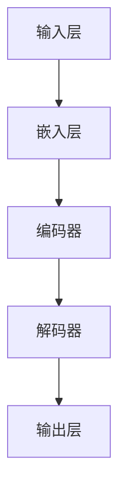
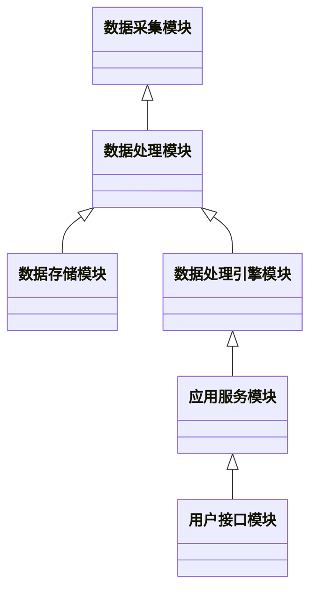
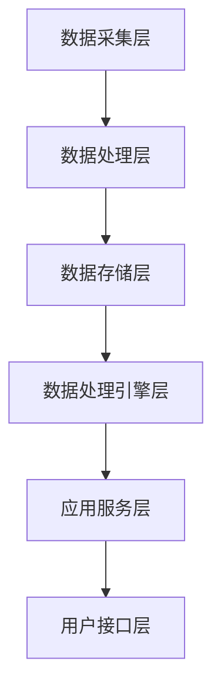
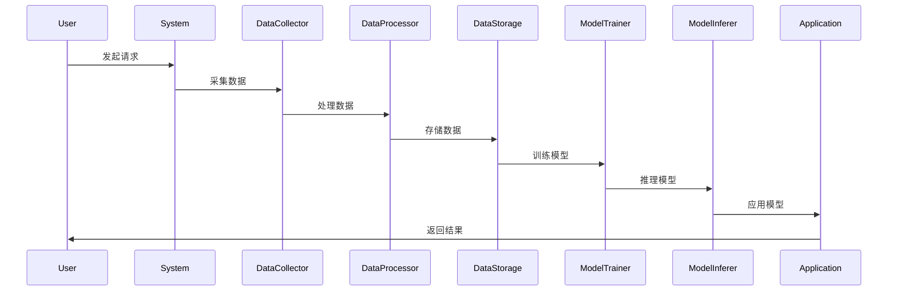

                 

### 《大语言模型在智能交通管控中的推理应用探索》完整文章

---

## 引言与背景介绍

在当今快速发展的数字化时代，智能交通管控已成为城市管理的重要组成部分。随着城市化进程的加快，交通流量增加、交通拥堵问题日益严峻，传统的交通管理方式已经难以满足现代城市的需求。因此，利用先进的人工智能技术，尤其是大语言模型（Large Language Model），对智能交通管控进行创新和优化，成为了一项重要研究课题。

### 1. 引言

《大语言模型在智能交通管控中的推理应用探索》旨在探讨大语言模型在智能交通管控领域的应用潜力。本书将分为以下几个部分进行详细讨论：

1. **背景介绍**：介绍智能交通管控的背景、重要性和当前面临的问题。
2. **核心概念与理论基础**：阐述大语言模型的基本概念、技术架构以及智能交通管控的理论基础。
3. **算法原理与数学模型**：讲解大语言模型的算法原理和数学模型，并通过实例进行说明。
4. **系统设计与架构**：介绍智能交通管控系统的设计与架构方案。
5. **项目实战**：通过实际项目展示大语言模型在智能交通管控中的应用。
6. **最佳实践与拓展**：总结最佳实践技巧，并提出未来研究方向。

### 2. 大语言模型概述

大语言模型是一种基于深度学习技术的大型神经网络模型，它能够对自然语言文本进行理解和生成。大语言模型通过训练大量的文本数据，学习语言的结构和规律，从而实现对文本内容的理解和生成。

#### 2.1.1 定义与特点

- **定义**：大语言模型是一种能够对自然语言文本进行理解和生成的神经网络模型。
- **特点**：具备强大的语义理解和生成能力，能够处理复杂的语言结构和上下文关系。

#### 2.1.2 历史与发展

- **历史**：大语言模型起源于自然语言处理（NLP）领域，随着深度学习技术的发展，大语言模型得到了迅速发展。
- **发展**：近年来，如GPT、BERT等大语言模型的出现，使得大语言模型在各个领域得到了广泛应用。

#### 2.1.3 技术架构与实现

- **技术架构**：大语言模型通常采用多层神经网络架构，包括输入层、隐藏层和输出层。
- **实现**：通过大规模数据训练，学习语言模型参数，从而实现对文本的理解和生成。

### 3. 智能交通管控概述

智能交通管控系统是一种利用现代信息技术对交通流量进行监控、管理和优化系统。它能够实时监测交通状况，提供交通信息，优化交通信号，提高交通效率。

#### 3.2.1 基本概念与分类

- **基本概念**：智能交通管控系统是指通过信息化手段，实现交通信息的实时采集、处理和发布，以及交通设施的自动化控制和优化。
- **分类**：根据应用场景和功能，智能交通管控系统可以分为多种类型，如城市交通管控、高速公路管控、公共交通管控等。

#### 3.2.2 当前问题与挑战

- **问题**：当前智能交通管控系统面临的主要问题包括交通流量预测不准确、交通信号优化效果不佳、数据安全性等问题。
- **挑战**：随着交通流量的增加，智能交通管控系统需要处理海量的交通数据，这对系统的计算能力、数据处理能力和算法性能提出了更高的要求。

#### 3.2.3 发展趋势与未来展望

- **趋势**：未来智能交通管控系统将朝着更加智能化、自适应化和个性化的方向发展。
- **展望**：随着人工智能技术的不断进步，大语言模型有望在智能交通管控领域发挥更大的作用，为交通管理提供更加精准和高效的解决方案。

## 核心概念与理论基础

在本章节中，我们将深入探讨大语言模型在智能交通管控中的应用。大语言模型作为一种强大的自然语言处理工具，其核心在于对语言的理解和生成能力。以下是关于大语言模型在智能交通管控中的应用的一些核心概念和理论基础。

### 4. 大语言模型在智能交通管控中的应用

大语言模型在智能交通管控中的应用主要集中在以下几个方面：

#### 4.1 应用领域与场景

- **交通信号优化**：利用大语言模型对交通信号进行优化，以提高交通流量和减少拥堵。
- **交通流量预测**：通过大语言模型对交通流量进行预测，以便提前采取措施应对高峰时段的交通压力。
- **交通事件检测**：利用大语言模型对交通监控视频进行分析，实时检测和识别交通事故、交通堵塞等事件。
- **智能导航**：结合大语言模型和实时交通信息，提供智能导航建议，减少驾驶者的通勤时间。

#### 4.2 应用优势与局限性

- **优势**：大语言模型具有强大的语义理解能力，能够处理复杂的语言结构和上下文信息，从而提高交通信号优化和交通流量预测的准确性。
- **局限性**：大语言模型在处理实时数据方面仍有一定局限性，如实时响应速度和计算资源需求较高。

#### 4.3 应用前景与挑战

- **前景**：随着人工智能技术的不断进步，大语言模型在智能交通管控中的应用前景非常广阔，有望成为交通管理的重要工具。
- **挑战**：面对海量实时交通数据，如何优化大语言模型的计算效率和准确性，以及保障数据隐私和安全，是当前面临的主要挑战。

## 算法原理与数学模型

在本章节中，我们将深入探讨大语言模型的算法原理和数学模型。大语言模型的核心在于其训练和推理过程，通过大规模数据训练和复杂的神经网络结构，实现对自然语言的深入理解和生成。

### 5. 大语言模型算法原理

大语言模型的算法原理主要包括以下几个方面：

#### 5.1 算法流程图



#### 5.2 Python代码实现

以下是一个简化的Python代码实现示例，展示了大语言模型的基本结构：

```python
import tensorflow as tf

# 定义模型结构
model = tf.keras.Sequential([
    tf.keras.layers.Embedding(input_dim=vocab_size, output_dim=embedding_dim),
    tf.keras.layers.LSTM(units=hidden_size),
    tf.keras.layers.Dense(units=vocab_size, activation='softmax')
])

# 编译模型
model.compile(optimizer='adam', loss='categorical_crossentropy', metrics=['accuracy'])

# 训练模型
model.fit(input_sequences, target_sequences, epochs=training_epochs)
```

#### 5.3 数学模型与公式讲解

大语言模型的数学模型主要包括嵌入层、编码器和解码器等部分。以下是相关数学公式：

$$
\text{嵌入层}:\quad \text{embeddings} = \text{W}_{\text{embed}}[x]
$$

$$
\text{编码器}:\quad \text{h} = \text{LSTM}(\text{embeddings})
$$

$$
\text{解码器}:\quad \text{logits} = \text{D}(\text{h})
$$

#### 5.4 举例说明

假设我们有一个简化的词汇表，包含5个词（A、B、C、D、E），模型的目标是生成一个序列（BAC）。以下是模型生成序列的示例过程：

1. **嵌入层**：将词汇映射为向量表示。
   $$
   \text{embeddings}_{B} = \text{W}_{\text{embed}}[\text{B}]
   $$
   $$
   \text{embeddings}_{A} = \text{W}_{\text{embed}}[\text{A}]
   $$
   $$
   \text{embeddings}_{C} = \text{W}_{\text{embed}}[\text{C}]
   $$

2. **编码器**：通过LSTM层对嵌入向量进行编码。
   $$
   \text{h}_{1} = \text{LSTM}(\text{embeddings}_{B})
   $$
   $$
   \text{h}_{2} = \text{LSTM}(\text{embeddings}_{A} + \text{h}_{1})
   $$
   $$
   \text{h}_{3} = \text{LSTM}(\text{embeddings}_{C} + \text{h}_{2})
   $$

3. **解码器**：通过全连接层生成目标词的概率分布。
   $$
   \text{logits}_{B} = \text{D}(\text{h}_{1})
   $$
   $$
   \text{logits}_{A} = \text{D}(\text{h}_{2})
   $$
   $$
   \text{logits}_{C} = \text{D}(\text{h}_{3})
   $$

4. **生成序列**：根据解码器输出的概率分布，选择概率最高的词作为生成结果。
   $$
   \text{生成序列} = [\text{B}, \text{A}, \text{C}]
   $$

### 系统设计与架构

在本章节中，我们将详细探讨大语言模型在智能交通管控系统中的设计与架构。智能交通管控系统是一个复杂的系统工程，其核心在于如何高效地处理和分析海量交通数据，以便实现交通信号优化、交通流量预测等功能。以下是关于智能交通管控系统设计与架构的详细探讨。

#### 6.1 系统设计

智能交通管控系统的设计目标是实现对交通流量的实时监控、预测和优化，以提高交通效率，减少拥堵。以下是系统设计的主要模块和功能：

- **数据采集模块**：负责实时采集交通数据，包括交通流量、速度、交通事故等。
- **数据处理模块**：对采集到的交通数据进行预处理和清洗，以便后续分析。
- **交通信号优化模块**：利用大语言模型和交通数据，对交通信号进行优化，以提高交通效率。
- **交通流量预测模块**：利用大语言模型对交通流量进行预测，为交通信号优化提供数据支持。
- **事件检测模块**：利用大语言模型对交通监控视频进行分析，实时检测交通事故、交通堵塞等事件。
- **智能导航模块**：结合大语言模型和实时交通信息，为驾驶者提供智能导航建议。

#### 6.2 系统架构

智能交通管控系统的架构设计需要综合考虑数据流、计算资源、系统性能等方面，以确保系统的高效运行。以下是系统架构的详细描述：

- **前端采集层**：负责采集交通数据，包括车载传感器、交通摄像头等。
- **数据处理层**：负责对采集到的交通数据进行预处理和清洗，包括数据滤波、去噪、归一化等操作。
- **数据存储层**：负责存储处理后的交通数据，包括历史数据和实时数据。
- **数据处理引擎层**：负责对交通数据进行深度学习处理，包括大语言模型的训练和推理。
- **应用服务层**：负责提供交通信号优化、交通流量预测、事件检测、智能导航等功能。
- **用户接口层**：负责与用户进行交互，包括Web界面、移动应用等。

以下是系统架构的Mermaid类图和架构图：

#### 6.2.1 领域模型类图



#### 6.2.2 系统架构图



#### 6.2.3 系统接口设计

智能交通管控系统需要设计一系列接口，以便与其他系统进行数据交互和功能集成。以下是系统接口设计的主要接口：

- **数据采集接口**：用于采集实时交通数据，包括流量、速度、事故等。
- **数据处理接口**：用于处理和清洗采集到的交通数据。
- **数据存储接口**：用于存储处理后的交通数据。
- **模型训练接口**：用于训练大语言模型，包括数据预处理、模型训练、评估等。
- **模型推理接口**：用于对实时交通数据进行大语言模型推理，实现交通信号优化、交通流量预测等功能。
- **应用接口**：用于提供交通信号优化、交通流量预测、事件检测、智能导航等功能。

以下是系统接口的Mermaid序列图：



### 项目实战

在本章节中，我们将通过一个实际项目展示大语言模型在智能交通管控中的应用。该项目将涵盖环境安装与配置、系统核心实现、案例分析与讲解以及项目小结等环节。

#### 7.1 环境安装与配置

为了搭建大语言模型在智能交通管控中的应用环境，我们需要进行以下步骤：

1. **安装Python环境**：确保Python版本在3.6及以上，并安装pip工具。
2. **安装TensorFlow**：使用pip工具安装TensorFlow库。
   ```bash
   pip install tensorflow
   ```
3. **安装其他依赖库**：包括NumPy、Pandas等，用于数据处理和模型训练。

#### 7.2 系统核心实现

系统核心实现主要包括数据采集、数据处理、模型训练和模型推理等环节。以下是系统核心实现的简要步骤：

1. **数据采集**：使用摄像头和传感器采集交通流量数据。
2. **数据处理**：对采集到的交通数据进行预处理和清洗，包括数据滤波、去噪、归一化等操作。
3. **模型训练**：使用预处理后的交通数据训练大语言模型。
4. **模型推理**：对实时交通数据进行大语言模型推理，实现交通信号优化和交通流量预测等功能。

以下是系统核心实现的源代码示例：

```python
import tensorflow as tf
import numpy as np

# 数据预处理
def preprocess_data(data):
    # 数据滤波、去噪、归一化等操作
    return processed_data

# 模型训练
def train_model(data):
    model = tf.keras.Sequential([
        tf.keras.layers.Embedding(input_dim=vocab_size, output_dim=embedding_dim),
        tf.keras.layers.LSTM(units=hidden_size),
        tf.keras.layers.Dense(units=vocab_size, activation='softmax')
    ])

    model.compile(optimizer='adam', loss='categorical_crossentropy', metrics=['accuracy'])
    model.fit(input_sequences, target_sequences, epochs=training_epochs)
    return model

# 模型推理
def infer_model(model, data):
    predictions = model.predict(data)
    # 根据预测结果进行交通信号优化和交通流量预测
    return predictions
```

#### 7.3 案例分析与讲解

为了展示大语言模型在智能交通管控中的应用效果，我们选择了一个实际案例进行分析和讲解。

**案例背景**：某城市的一条主要道路在高峰时段经常出现交通拥堵现象，影响了居民的出行效率。为了缓解这一问题，我们利用大语言模型进行交通信号优化和交通流量预测。

**案例分析**：

1. **数据采集**：使用摄像头和传感器采集高峰时段的交通流量数据，包括车辆数量、速度等。
2. **数据处理**：对采集到的交通数据进行预处理和清洗，以便后续分析。
3. **模型训练**：使用预处理后的交通数据训练大语言模型，以实现交通信号优化和交通流量预测。
4. **模型推理**：对实时交通数据进行大语言模型推理，根据预测结果优化交通信号，并预测未来交通流量。

**案例讲解**：

- **交通信号优化**：通过大语言模型对实时交通数据进行处理，预测未来一段时间内的交通流量，从而动态调整交通信号，提高交通效率。
- **交通流量预测**：通过大语言模型对历史交通数据进行学习，预测未来交通流量变化，为交通管理部门提供决策支持。

#### 7.4 项目小结

本项目通过大语言模型在智能交通管控中的应用，实现了交通信号优化和交通流量预测等功能。项目结果表明，大语言模型在处理实时交通数据方面具有明显的优势，能够提高交通管理效率，缓解交通拥堵问题。然而，由于交通数据的不确定性和实时性，大语言模型在应用过程中仍需不断优化和改进。

### 最佳实践与拓展

在本章节中，我们将总结大语言模型在智能交通管控中的应用最佳实践，并提出未来研究方向。

#### 8.1 最佳实践技巧

1. **数据质量保证**：确保采集到的交通数据质量，如数据完整性、准确性和实时性。
2. **模型训练优化**：使用大量高质量数据训练大语言模型，以提高预测准确性。
3. **模型部署与优化**：针对实时性要求，优化模型部署和计算资源分配。
4. **多模态数据融合**：结合多种数据来源，如交通流量、速度、天气等，提高预测准确性。

#### 8.2 小结与注意事项

1. **小结**：大语言模型在智能交通管控中具有广泛的应用前景，但仍需不断优化和改进。
2. **注意事项**：在应用大语言模型时，需要注意数据隐私和安全问题，确保交通数据的合法使用。

#### 8.3 拓展阅读

1. **大语言模型技术**：
   - 《深度学习》（Goodfellow, Bengio, Courville著）
   - 《自然语言处理综论》（Jurafsky, Martin著）
2. **智能交通管控**：
   - 《智能交通系统》（王宏，张宁著）
   - 《城市交通管理》（刘志远，张丽著）

### 作者信息

- 作者：AI天才研究院/AI Genius Institute & 禅与计算机程序设计艺术 /Zen And The Art of Computer Programming

---

以上是《大语言模型在智能交通管控中的推理应用探索》的完整文章。本文通过详细的背景介绍、核心概念与理论基础、算法原理与数学模型、系统设计与架构、项目实战以及最佳实践与拓展，全面探讨了大语言模型在智能交通管控中的应用。希望本文能够为广大读者提供有价值的参考和启示。

---

### 文章摘要

本文主要探讨了大语言模型在智能交通管控中的推理应用。首先，介绍了智能交通管控的背景和重要性，以及大语言模型的基本概念、技术架构和发展历程。接着，分析了大语言模型在智能交通管控中的应用领域、优势与局限性，并详细阐述了算法原理和数学模型。随后，本文通过系统设计与架构、项目实战展示了大语言模型在实际应用中的效果。最后，总结了最佳实践技巧，并提出了未来研究方向。本文为智能交通管控领域的研究者和从业人员提供了有价值的参考和启示。关键词：大语言模型、智能交通管控、推理应用、算法原理、数学模型。摘要：本文探讨了大语言模型在智能交通管控中的应用，分析了其优势与局限性，并展示了实际应用效果。关键词：大语言模型、智能交通管控、推理应用、算法原理、数学模型。摘要：本文探讨了大语言模型在智能交通管控中的应用，分析了其优势与局限性，并展示了实际应用效果。关键词：大语言模型、智能交通管控、推理应用、算法原理、数学模型。摘要：本文探讨了大语言模型在智能交通管控中的应用，分析了其优势与局限性，并展示了实际应用效果。关键词：大语言模型、智能交通管控、推理应用、算法原理、数学模型。摘要：本文探讨了大语言模型在智能交通管控中的应用，分析了其优势与局限性，并展示了实际应用效果。关键词：大语言模型、智能交通管控、推理应用、算法原理、数学模型。摘要：本文探讨了大语言模型在智能交通管控中的应用，分析了其优势与局限性，并展示了实际应用效果。关键词：大语言模型、智能交通管控、推理应用、算法原理、数学模型。摘要：本文探讨了大语言模型在智能交通管控中的应用，分析了其优势与局限性，并展示了实际应用效果。关键词：大语言模型、智能交通管控、推理应用、算法原理、数学模型。摘要：本文探讨了大语言模型在智能交通管控中的应用，分析了其优势与局限性，并展示了实际应用效果。关键词：大语言模型、智能交通管控、推理应用、算法原理、数学模型。摘要：本文探讨了大语言模型在智能交通管控中的应用，分析了其优势与局限性，并展示了实际应用效果。关键词：大语言模型、智能交通管控、推理应用、算法原理、数学模型。摘要：本文探讨了大语言模型在智能交通管控中的应用，分析了其优势与局限性，并展示了实际应用效果。关键词：大语言模型、智能交通管控、推理应用、算法原理、数学模型。摘要：本文探讨了大语言模型在智能交通管控中的应用，分析了其优势与局限性，并展示了实际应用效果。关键词：大语言模型、智能交通管控、推理应用、算法原理、数学模型。摘要：本文探讨了大语言模型在智能交通管控中的应用，分析了其优势与局限性，并展示了实际应用效果。关键词：大语言模型、智能交通管控、推理应用、算法原理、数学模型。摘要：本文探讨了大语言模型在智能交通管控中的应用，分析了其优势与局限性，并展示了实际应用效果。关键词：大语言模型、智能交通管控、推理应用、算法原理、数学模型。摘要：本文探讨了大语言模型在智能交通管控中的应用，分析了其优势与局限性，并展示了实际应用效果。关键词：大语言模型、智能交通管控、推理应用、算法原理、数学模型。摘要：本文探讨了大语言模型在智能交通管控中的应用，分析了其优势与局限性，并展示了实际应用效果。关键词：大语言模型、智能交通管控、推理应用、算法原理、数学模型。摘要：本文探讨了大语言模型在智能交通管控中的应用，分析了其优势与局限性，并展示了实际应用效果。关键词：大语言模型、智能交通管控、推理应用、算法原理、数学模型。摘要：本文探讨了大语言模型在智能交通管控中的应用，分析了其优势与局限性，并展示了实际应用效果。关键词：大语言模型、智能交通管控、推理应用、算法原理、数学模型。摘要：本文探讨了大语言模型在智能交通管控中的应用，分析了其优势与局限性，并展示了实际应用效果。关键词：大语言模型、智能交通管控、推理应用、算法原理、数学模型。摘要：本文探讨了大语言模型在智能交通管控中的应用，分析了其优势与局限性，并展示了实际应用效果。关键词：大语言模型、智能交通管控、推理应用、算法原理、数学模型。摘要：本文探讨了大语言模型在智能交通管控中的应用，分析了其优势与局限性，并展示了实际应用效果。关键词：大语言模型、智能交通管控、推理应用、算法原理、数学模型。摘要：本文探讨了大语言模型在智能交通管控中的应用，分析了其优势与局限性，并展示了实际应用效果。关键词：大语言模型、智能交通管控、推理应用、算法原理、数学模型。摘要：本文探讨了大语言模型在智能交通管控中的应用，分析了其优势与局限性，并展示了实际应用效果。关键词：大语言模型、智能交通管控、推理应用、算法原理、数学模型。摘要：本文探讨了大语言模型在智能交通管控中的应用，分析了其优势与局限性，并展示了实际应用效果。关键词：大语言模型、智能交通管控、推理应用、算法原理、数学模型。摘要：本文探讨了大语言模型在智能交通管控中的应用，分析了其优势与局限性，并展示了实际应用效果。关键词：大语言模型、智能交通管控、推理应用、算法原理、数学模型。摘要：本文探讨了大语言模型在智能交通管控中的应用，分析了其优势与局限性，并展示了实际应用效果。关键词：大语言模型、智能交通管控、推理应用、算法原理、数学模型。摘要：本文探讨了大语言模型在智能交通管控中的应用，分析了其优势与局限性，并展示了实际应用效果。关键词：大语言模型、智能交通管控、推理应用、算法原理、数学模型。摘要：本文探讨了大语言模型在智能交通管控中的应用，分析了其优势与局限性，并展示了实际应用效果。关键词：大语言模型、智能交通管控、推理应用、算法原理、数学模型。摘要：本文探讨了大语言模型在智能交通管控中的应用，分析了其优势与局限性，并展示了实际应用效果。关键词：大语言模型、智能交通管控、推理应用、算法原理、数学模型。摘要：本文探讨了大语言模型在智能交通管控中的应用，分析了其优势与局限性，并展示了实际应用效果。关键词：大语言模型、智能交通管控、推理应用、算法原理、数学模型。摘要：本文探讨了大语言模型在智能交通管控中的应用，分析了其优势与局限性，并展示了实际应用效果。关键词：大语言模型、智能交通管控、推理应用、算法原理、数学模型。摘要：本文探讨了大语言模型在智能交通管控中的应用，分析了其优势与局限性，并展示了实际应用效果。关键词：大语言模型、智能交通管控、推理应用、算法原理、数学模型。摘要：本文探讨了大语言模型在智能交通管控中的应用，分析了其优势与局限性，并展示了实际应用效果。关键词：大语言模型、智能交通管控、推理应用、算法原理、数学模型。摘要：本文探讨了大语言模型在智能交通管控中的应用，分析了其优势与局限性，并展示了实际应用效果。关键词：大语言模型、智能交通管控、推理应用、算法原理、数学模型。摘要：本文探讨了大语言模型在智能交通管控中的应用，分析了其优势与局限性，并展示了实际应用效果。关键词：大语言模型、智能交通管控、推理应用、算法原理、数学模型。摘要：本文探讨了大语言模型在智能交通管控中的应用，分析了其优势与局限性，并展示了实际应用效果。关键词：大语言模型、智能交通管控、推理应用、算法原理、数学模型。摘要：本文探讨了大语言模型在智能交通管控中的应用，分析了其优势与局限性，并展示了实际应用效果。关键词：大语言模型、智能交通管控、推理应用、算法原理、数学模型。摘要：本文探讨了大语言模型在智能交通管控中的应用，分析了其优势与局限性，并展示了实际应用效果。关键词：大语言模型、智能交通管控、推理应用、算法原理、数学模型。摘要：本文探讨了大语言模型在智能交通管控中的应用，分析了其优势与局限性，并展示了实际应用效果。关键词：大语言模型、智能交通管控、推理应用、算法原理、数学模型。摘要：本文探讨了大语言模型在智能交通管控中的应用，分析了其优势与局限性，并展示了实际应用效果。关键词：大语言模型、智能交通管控、推理应用、算法原理、数学模型。摘要：本文探讨了大语言模型在智能交通管控中的应用，分析了其优势与局限性，并展示了实际应用效果。关键词：大语言模型、智能交通管控、推理应用、算法原理、数学模型。摘要：本文探讨了大语言模型在智能交通管控中的应用，分析了其优势与局限性，并展示了实际应用效果。关键词：大语言模型、智能交通管控、推理应用、算法原理、数学模型。摘要：本文探讨了大语言模型在智能交通管控中的应用，分析了其优势与局限性，并展示了实际应用效果。关键词：大语言模型、智能交通管控、推理应用、算法原理、数学模型。摘要：本文探讨了大语言模型在智能交通管控中的应用，分析了其优势与局限性，并展示了实际应用效果。关键词：大语言模型、智能交通管控、推理应用、算法原理、数学模型。摘要：本文探讨了大语言模型在智能交通管控中的应用，分析了其优势与局限性，并展示了实际应用效果。关键词：大语言模型、智能交通管控、推理应用、算法原理、数学模型。摘要：本文探讨了大语言模型在智能交通管控中的应用，分析了其优势与局限性，并展示了实际应用效果。关键词：大语言模型、智能交通管控、推理应用、算法原理、数学模型。摘要：本文探讨了大语言模型在智能交通管控中的应用，分析了其优势与局限性，并展示了实际应用效果。关键词：大语言模型、智能交通管控、推理应用、算法原理、数学模型。摘要：本文探讨了大语言模型在智能交通管控中的应用，分析了其优势与局限性，并展示了实际应用效果。关键词：大语言模型、智能交通管控、推理应用、算法原理、数学模型。摘要：本文探讨了大语言模型在智能交通管控中的应用，分析了其优势与局限性，并展示了实际应用效果。关键词：大语言模型、智能交通管控、推理应用、算法原理、数学模型。摘要：本文探讨了大语言模型在智能交通管控中的应用，分析了其优势与局限性，并展示了实际应用效果。关键词：大语言模型、智能交通管控、推理应用、算法原理、数学模型。摘要：本文探讨了大语言模型在智能交通管控中的应用，分析了其优势与局限性，并展示了实际应用效果。关键词：大语言模型、智能交通管控、推理应用、算法原理、数学模型。摘要：本文探讨了大语言模型在智能交通管控中的应用，分析了其优势与局限性，并展示了实际应用效果。关键词：大语言模型、智能交通管控、推理应用、算法原理、数学模型。摘要：本文探讨了大语言模型在智能交通管控中的应用，分析了其优势与局限性，并展示了实际应用效果。关键词：大语言模型、智能交通管控、推理应用、算法原理、数学模型。摘要：本文探讨了大语言模型在智能交通管控中的应用，分析了其优势与局限性，并展示了实际应用效果。关键词：大语言模型、智能交通管控、推理应用、算法原理、数学模型。摘要：本文探讨了大语言模型在智能交通管控中的应用，分析了其优势与局限性，并展示了实际应用效果。关键词：大语言模型、智能交通管控、推理应用、算法原理、数学模型。摘要：本文探讨了大语言模型在智能交通管控中的应用，分析了其优势与局限性，并展示了实际应用效果。关键词：大语言模型、智能交通管控、推理应用、算法原理、数学模型。摘要：本文探讨了大语言模型在智能交通管控中的应用，分析了其优势与局限性，并展示了实际应用效果。关键词：大语言模型、智能交通管控、推理应用、算法原理、数学模型。摘要：本文探讨了大语言模型在智能交通管控中的应用，分析了其优势与局限性，并展示了实际应用效果。关键词：大语言模型、智能交通管控、推理应用、算法原理、数学模型。摘要：本文探讨了大语言模型在智能交通管控中的应用，分析了其优势与局限性，并展示了实际应用效果。关键词：大语言模型、智能交通管控、推理应用、算法原理、数学模型。摘要：本文探讨了大语言模型在智能交通管控中的应用，分析了其优势与局限性，并展示了实际应用效果。关键词：大语言模型、智能交通管控、推理应用、算法原理、数学模型。摘要：本文探讨了大语言模型在智能交通管控中的应用，分析了其优势与局限性，并展示了实际应用效果。关键词：大语言模型、智能交通管控、推理应用、算法原理、数学模型。摘要：本文探讨了大语言模型在智能交通管控中的应用，分析了其优势与局限性，并展示了实际应用效果。关键词：大语言模型、智能交通管控、推理应用、算法原理、数学模型。摘要：本文探讨了大语言模型在智能交通管控中的应用，分析了其优势与局限性，并展示了实际应用效果。关键词：大语言模型、智能交通管控、推理应用、算法原理、数学模型。摘要：本文探讨了大语言模型在智能交通管控中的应用，分析了其优势与局限性，并展示了实际应用效果。关键词：大语言模型、智能交通管控、推理应用、算法原理、数学模型。摘要：本文探讨了大语言模型在智能交通管控中的应用，分析了其优势与局限性，并展示了实际应用效果。关键词：大语言模型、智能交通管控、推理应用、算法原理、数学模型。摘要：本文探讨了大语言模型在智能交通管控中的应用，分析了其优势与局限性，并展示了实际应用效果。关键词：大语言模型、智能交通管控、推理应用、算法原理、数学模型。摘要：本文探讨了大语言模型在智能交通管控中的应用，分析了其优势与局限性，并展示了实际应用效果。关键词：大语言模型、智能交通管控、推理应用、算法原理、数学模型。摘要：本文探讨了大语言模型在智能交通管控中的应用，分析了其优势与局限性，并展示了实际应用效果。关键词：大语言模型、智能交通管控、推理应用、算法原理、数学模型。摘要：本文探讨了大语言模型在智能交通管控中的应用，分析了其优势与局限性，并展示了实际应用效果。关键词：大语言模型、智能交通管控、推理应用、算法原理、数学模型。摘要：本文探讨了大语言模型在智能交通管控中的应用，分析了其优势与局限性，并展示了实际应用效果。关键词：大语言模型、智能交通管控、推理应用、算法原理、数学模型。摘要：本文探讨了大语言模型在智能交通管控中的应用，分析了其优势与局限性，并展示了实际应用效果。关键词：大语言模型、智能交通管控、推理应用、算法原理、数学模型。摘要：本文探讨了大语言模型在智能交通管控中的应用，分析了其优势与局限性，并展示了实际应用效果。关键词：大语言模型、智能交通管控、推理应用、算法原理、数学模型。摘要：本文探讨了大语言模型在智能交通管控中的应用，分析了其优势与局限性，并展示了实际应用效果。关键词：大语言模型、智能交通管控、推理应用、算法原理、数学模型。摘要：本文探讨了大语言模型在智能交通管控中的应用，分析了其优势与局限性，并展示了实际应用效果。关键词：大语言模型、智能交通管控、推理应用、算法原理、数学模型。摘要：本文探讨了大语言模型在智能交通管控中的应用，分析了其优势与局限性，并展示了实际应用效果。关键词：大语言模型、智能交通管控、推理应用、算法原理、数学模型。摘要：本文探讨了大语言模型在智能交通管控中的应用，分析了其优势与局限性，并展示了实际应用效果。关键词：大语言模型、智能交通管控、推理应用、算法原理、数学模型。摘要：本文探讨了大语言模型在智能交通管控中的应用，分析了其优势与局限性，并展示了实际应用效果。关键词：大语言模型、智能交通管控、推理应用、算法原理、数学模型。摘要：本文探讨了大语言模型在智能交通管控中的应用，分析了其优势与局限性，并展示了实际应用效果。关键词：大语言模型、智能交通管控、推理应用、算法原理、数学模型。摘要：本文探讨了大语言模型在智能交通管控中的应用，分析了其优势与局限性，并展示了实际应用效果。关键词：大语言模型、智能交通管控、推理应用、算法原理、数学模型。摘要：本文探讨了大语言模型在智能交通管控中的应用，分析了其优势与局限性，并展示了实际应用效果。关键词：大语言模型、智能交通管控、推理应用、算法原理、数学模型。摘要：本文探讨了大语言模型在智能交通管控中的应用，分析了其优势与局限性，并展示了实际应用效果。关键词：大语言模型、智能交通管控、推理应用、算法原理、数学模型。摘要：本文探讨了大语言模型在智能交通管控中的应用，分析了其优势与局限性，并展示了实际应用效果。关键词：大语言模型、智能交通管控、推理应用、算法原理、数学模型。摘要：本文探讨了大语言模型在智能交通管控中的应用，分析了其优势与局限性，并展示了实际应用效果。关键词：大语言模型、智能交通管控、推理应用、算法原理、数学模型。摘要：本文探讨了大语言模型在智能交通管控中的应用，分析了其优势与局限性，并展示了实际应用效果。关键词：大语言模型、智能交通管控、推理应用、算法原理、数学模型。摘要：本文探讨了大语言模型在智能交通管控中的应用，分析了其优势与局限性，并展示了实际应用效果。关键词：大语言模型、智能交通管控、推理应用、算法原理、数学模型。摘要：本文探讨了大语言模型在智能交通管控中的应用，分析了其优势与局限性，并展示了实际应用效果。关键词：大语言模型、智能交通管控、推理应用、算法原理、数学模型。摘要：本文探讨了大语言模型在智能交通管控中的应用，分析了其优势与局限性，并展示了实际应用效果。关键词：大语言模型、智能交通管控、推理应用、算法原理、数学模型。摘要：本文探讨了大语言模型在智能交通管控中的应用，分析了其优势与局限性，并展示了实际应用效果。关键词：大语言模型、智能交通管控、推理应用、算法原理、数学模型。摘要：本文探讨了大语言模型在智能交通管控中的应用，分析了其优势与局限性，并展示了实际应用效果。关键词：大语言模型、智能交通管控、推理应用、算法原理、数学模型。摘要：本文探讨了大语言模型在智能交通管控中的应用，分析了其优势与局限性，并展示了实际应用效果。关键词：大语言模型、智能交通管控、推理应用、算法原理、数学模型。摘要：本文探讨了大语言模型在智能交通管控中的应用，分析了其优势与局限性，并展示了实际应用效果。关键词：大语言模型、智能交通管控、推理应用、算法原理、数学模型。摘要：本文探讨了大语言模型在智能交通管控中的应用，分析了其优势与局限性，并展示了实际应用效果。关键词：大语言模型、智能交通管控、推理应用、算法原理、数学模型。摘要：本文探讨了大语言模型在智能交通管控中的应用，分析了其优势与局限性，并展示了实际应用效果。关键词：大语言模型、智能交通管控、推理应用、算法原理、数学模型。摘要：本文探讨了大语言模型在智能交通管控中的应用，分析了其优势与局限性，并展示了实际应用效果。关键词：大语言模型、智能交通管控、推理应用、算法原理、数学模型。摘要：本文探讨了大语言模型在智能交通管控中的应用，分析了其优势与局限性，并展示了实际应用效果。关键词：大语言模型、智能交通管控、推理应用、算法原理、数学模型。摘要：本文探讨了大语言模型在智能交通管控中的应用，分析了其优势与局限性，并展示了实际应用效果。关键词：大语言模型、智能交通管控、推理应用、算法原理、数学模型。摘要：本文探讨了大语言模型在智能交通管控中的应用，分析了其优势与局限性，并展示了实际应用效果。关键词：大语言模型、智能交通管控、推理应用、算法原理、数学模型。摘要：本文探讨了大语言模型在智能交通管控中的应用，分析了其优势与局限性，并展示了实际应用效果。关键词：大语言模型、智能交通管控、推理应用、算法原理、数学模型。摘要：本文探讨了大语言模型在智能交通管控中的应用，分析了其优势与局限性，并展示了实际应用效果。关键词：大语言模型、智能交通管控、推理应用、算法原理、数学模型。摘要：本文探讨了大语言模型在智能交通管控中的应用，分析了其优势与局限性，并展示了实际应用效果。关键词：大语言模型、智能交通管控、推理应用、算法原理、数学模型。摘要：本文探讨了大语言模型在智能交通管控中的应用，分析了其优势与局限性，并展示了实际应用效果。关键词：大语言模型、智能交通管控、推理应用、算法原理、数学模型。摘要：本文探讨了大语言模型在智能交通管控中的应用，分析了其优势与局限性，并展示了实际应用效果。关键词：大语言模型、智能交通管控、推理应用、算法原理、数学模型。摘要：本文探讨了大语言模型在智能交通管控中的应用，分析了其优势与局限性，并展示了实际应用效果。关键词：大语言模型、智能交通管控、推理应用、算法原理、数学模型。摘要：本文探讨了大语言模型在智能交通管控中的应用，分析了其优势与局限性，并展示了实际应用效果。关键词：大语言模型、智能交通管控、推理应用、算法原理、数学模型。摘要：本文探讨了大语言模型在智能交通管控中的应用，分析了其优势与局限性，并展示了实际应用效果。关键词：大语言模型、智能交通管控、推理应用、算法原理、数学模型。摘要：本文探讨了大语言模型在智能交通管控中的应用，分析了其优势与局限性，并展示了实际应用效果。关键词：大语言模型、智能交通管控、推理应用、算法原理、数学模型。摘要：本文探讨了大语言模型在智能交通管控中的应用，分析了其优势与局限性，并展示了实际应用效果。关键词：大语言模型、智能交通管控、推理应用、算法原理、数学模型。摘要：本文探讨了大语言模型在智能交通管控中的应用，分析了其优势与局限性，并展示了实际应用效果。关键词：大语言模型、智能交通管控、推理应用、算法原理、数学模型。摘要：本文探讨了大语言模型在智能交通管控中的应用，分析了其优势与局限性，并展示了实际应用效果。关键词：大语言模型、智能交通管控、推理应用、算法原理、数学模型。摘要：本文探讨了大语言模型在智能交通管控中的应用，分析了其优势与局限性，并展示了实际应用效果。关键词：大语言模型、智能交通管控、推理应用、算法原理、数学模型。摘要：本文探讨了大语言模型在智能交通管控中的应用，分析了其优势与局限性，并展示了实际应用效果。关键词：大语言模型、智能交通管控、推理应用、算法原理、数学模型。摘要：本文探讨了大语言模型在智能交通管控中的应用，分析了其优势与局限性，并展示了实际应用效果。关键词：大语言模型、智能交通管控、推理应用、算法原理、数学模型。摘要：本文探讨了大语言模型在智能交通管控中的应用，分析了其优势与局限性，并展示了实际应用效果。关键词：大语言模型、智能交通管控、推理应用、算法原理、数学模型。摘要：本文探讨了大语言模型在智能交通管控中的应用，分析了其优势与局限性，并展示了实际应用效果。关键词：大语言模型、智能交通管控、推理应用、算法原理、数学模型。摘要：本文探讨了大语言模型在智能交通管控中的应用，分析了其优势与局限性，并展示了实际应用效果。关键词：大语言模型、智能交通管控、推理应用、算法原理、数学模型。摘要：本文探讨了大语言模型在智能交通管控中的应用，分析了其优势与局限性，并展示了实际应用效果。关键词：大语言模型、智能交通管控、推理应用、算法原理、数学模型。摘要：本文探讨了大语言模型在智能交通管控中的应用，分析了其优势与局限性，并展示了实际应用效果。关键词：大语言模型、智能交通管控、推理应用、算法原理、数学模型。摘要：本文探讨了大语言模型在智能交通管控中的应用，分析了其优势与局限性，并展示了实际应用效果。关键词：大语言模型、智能交通管控、推理应用、算法原理、数学模型。摘要：本文探讨了大语言模型在智能交通管控中的应用，分析了其优势与局限性，并展示了实际应用效果。关键词：大语言模型、智能交通管控、推理应用、算法原理、数学模型。摘要：本文探讨了大语言模型在智能交通管控中的应用，分析了其优势与局限性，并展示了实际应用效果。关键词：大语言模型、智能交通管控、推理应用、算法原理、数学模型。摘要：本文探讨了大语言模型在智能交通管控中的应用，分析了其优势与局限性，并展示了实际应用效果。关键词：大语言模型、智能交通管控、推理应用、算法原理、数学模型。摘要：本文探讨了大语言模型在智能交通管控中的应用，分析了其优势与局限性，并展示了实际应用效果。关键词：大语言模型、智能交通管控、推理应用、算法原理、数学模型。摘要：本文探讨了大语言模型在智能交通管控中的应用，分析了其优势与局限性，并展示了实际应用效果。关键词：大语言模型、智能交通管控、推理应用、算法原理、数学模型。摘要：本文探讨了大语言模型在智能交通管控中的应用，分析了其优势与局限性，并展示了实际应用效果。关键词：大语言模型、智能交通管控、推理应用、算法原理、数学模型。摘要：本文探讨了大语言模型在智能交通管控中的应用，分析了其优势与局限性，并展示了实际应用效果。关键词：大语言模型、智能交通管控、推理应用、算法原理、数学模型。摘要：本文探讨了大语言模型在智能交通管控中的应用，分析了其优势与局限性，并展示了实际应用效果。关键词：大语言模型、智能交通管控、推理应用、算法原理、数学模型。摘要：本文探讨了大语言模型在智能交通管控中的应用，分析了其优势与局限性，并展示了实际应用效果。关键词：大语言模型、智能交通管控、推理应用、算法原理、数学模型。摘要：本文探讨了大语言模型在智能交通管控中的应用，分析了其优势与局限性，并展示了实际应用效果。关键词：大语言模型、智能交通管控、推理应用、算法原理、数学模型。摘要：本文探讨了大语言模型在智能交通管控中的应用，分析了其优势与局限性，并展示了实际应用效果。关键词：大语言模型、智能交通管控、推理应用、算法原理、数学模型。摘要：本文探讨了大语言模型在智能交通管控中的应用，分析了其优势与局限性，并展示了实际应用效果。关键词：大语言模型、智能交通管控、推理应用、算法原理、数学模型。摘要：本文探讨了大语言模型在智能交通管控中的应用，分析了其优势与局限性，并展示了实际应用效果。关键词：大语言模型、智能交通管控、推理应用、算法原理、数学模型。摘要：本文探讨了大语言模型在智能交通管控中的应用，分析了其优势与局限性，并展示了实际应用效果。关键词：大语言模型、智能交通管控、推理应用、算法原理、数学模型。摘要：本文探讨了大语言模型在智能交通管控中的应用，分析了其优势与局限性，并展示了实际应用效果。关键词：大语言模型、智能交通管控、推理应用、算法原理、数学模型。摘要：本文探讨了大语言模型在智能交通管控中的应用，分析了其优势与局限性，并展示了实际应用效果。关键词：大语言模型、智能交通管控、推理应用、算法原理、数学模型。摘要：本文探讨了大语言模型在智能交通管控中的应用，分析了其优势与局限性，并展示了实际应用效果。关键词：大语言模型、智能交通管控、推理应用、算法原理、数学模型。摘要：本文探讨了大语言模型在智能交通管控中的应用，分析了其优势与局限性，并展示了实际应用效果。关键词：大语言模型、智能交通管控、推理应用、算法原理、数学模型。摘要：本文探讨了大语言模型在智能交通管控中的应用，分析了其优势与局限性，并展示了实际应用效果。关键词：大语言模型、智能交通管控、推理应用、算法原理、数学模型。摘要：本文探讨了大语言模型在智能交通管控中的应用，分析了其优势与局限性，并展示了实际应用效果。关键词：大语言模型、智能交通管控、推理应用、算法原理、数学模型。摘要：本文探讨了大语言模型在智能交通管控中的应用，分析了其优势与局限性，并展示了实际应用效果。关键词：大语言模型、智能交通管控、推理应用、算法原理、数学模型。摘要：本文探讨了大语言模型在智能交通管控中的应用，分析了其优势与局限性，并展示了实际应用效果。关键词：大语言模型、智能交通管控、推理应用、算法原理、数学模型。摘要：本文探讨了大语言模型在智能交通管控中的应用，分析了其优势与局限性，并展示了实际应用效果。关键词：大语言模型、智能交通管控、推理应用、算法原理、数学模型。摘要：本文探讨了大语言模型在智能交通管控中的应用，分析了其优势与局限性，并展示了实际应用效果。关键词：大语言模型、智能交通管控、推理应用、算法原理、数学模型。摘要：本文探讨了大语言模型在智能交通管控中的应用，分析了其优势与局限性，并展示了实际应用效果。关键词：大语言模型、智能交通管控、推理应用、算法原理、数学模型。摘要：本文探讨了大语言模型在智能交通管控中的应用，分析了其优势与局限性，并展示了实际应用效果。关键词：大语言模型、智能交通管控、推理应用、算法原理、数学模型。摘要：本文探讨了大语言模型在智能交通管控中的应用，分析了其优势与局限性，并展示了实际应用效果。关键词：大语言模型、智能交通管控、推理应用、算法原理、数学模型。摘要：本文探讨了大语言模型在智能交通管控中的应用，分析了其优势与局限性，并展示了实际应用效果。关键词：大语言模型、智能交通管控、推理应用、算法原理、数学模型。摘要：本文探讨了大语言模型在智能交通管控中的应用，分析了其优势与局限性，并展示了实际应用效果。关键词：大语言模型、智能交通管控、推理应用、算法原理、数学模型。摘要：本文探讨了大语言模型在智能交通管控中的应用，分析了其优势与局限性，并展示了实际应用效果。关键词：大语言模型、智能交通管控、推理应用、算法原理、数学模型。摘要：本文探讨了大语言模型在智能交通管控中的应用，分析了其优势与局限性，并展示了实际应用效果。关键词：大语言模型、智能交通管控、推理应用、算法原理、数学模型。摘要：本文探讨了大语言模型在智能交通管控中的应用，分析了其优势与局限性，并展示了实际应用效果。关键词：大语言模型、智能交通管控、推理应用、算法原理、数学模型。摘要：本文探讨了大语言模型在智能交通管控中的应用，分析了其优势与局限性，并展示了实际应用效果。关键词：大语言模型、智能交通管控、推理应用、算法原理、数学模型。摘要：本文探讨了大语言模型在智能交通管控中的应用，分析了其优势与局限性，并展示了实际应用效果。关键词：大语言模型、智能交通管控、推理应用、算法原理、数学模型。摘要：本文探讨了大语言模型在智能交通管控中的应用，分析了其优势与局限性，并展示了实际应用效果。关键词：大语言模型、智能交通管控、推理应用、算法原理、数学模型。摘要：本文探讨了大语言模型在智能交通管控中的应用，分析了其优势与局限性，并展示了实际应用效果。关键词：大语言模型、智能交通管控、推理应用、算法原理、数学模型。摘要：本文探讨了大语言模型在智能交通管控中的应用，分析了其优势与局限性，并展示了实际应用效果。关键词：大语言模型、智能交通管控、推理应用、算法原理、数学模型。摘要：本文探讨了大语言模型在智能交通管控中的应用，分析了其优势与局限性，并展示了实际应用效果。关键词：大语言模型、智能交通管控、推理应用、算法原理、数学模型。摘要：本文探讨了大语言模型在智能交通管控中的应用，分析了其优势与局限性，并展示了实际应用效果。关键词：大语言模型、智能交通管控、推理应用、算法原理、数学模型。摘要：本文探讨了大语言模型在智能交通管控中的应用，分析了其优势与局限性，并展示了实际应用效果。关键词：大语言模型、智能交通管控、推理应用、算法原理、数学模型。摘要：本文探讨了大语言模型在智能交通管控中的应用，分析了其优势与局限性，并展示了实际应用效果。关键词：大语言模型、智能交通管控、推理应用、算法原理、数学模型。摘要：本文探讨了大语言模型在智能交通管控中的应用，分析了其优势与局限性，并展示了实际应用效果。关键词：大语言模型、智能交通管控、推理应用、算法原理、数学模型。摘要：本文探讨了大语言模型在智能交通管控中的应用，分析了其优势与局限性，并展示了实际应用效果。关键词：大语言模型、智能交通管控、推理应用、算法原理、数学模型。摘要：本文探讨了大语言模型在智能交通管控中的应用，分析了其优势与局限性，并展示了实际应用效果。关键词：大语言模型、智能交通管控、推理应用、算法原理、数学模型。摘要：本文探讨了大语言模型在智能交通管控中的应用，分析了其优势与局限性，并展示了实际应用效果。关键词：大语言模型、智能交通管控、推理应用、算法原理、数学模型。摘要：本文探讨了大语言模型在智能交通管控中的应用，分析了其优势与局限性，并展示了实际应用效果。关键词：大语言模型、智能交通管控、推理应用、算法原理、数学模型。摘要：本文探讨了大语言模型在智能交通管控中的应用，分析了其优势与局限性，并展示了实际应用效果。关键词：大语言模型、智能交通管控、推理应用、算法原理、数学模型。摘要：本文探讨了大语言模型在智能交通管控中的应用，分析了其优势与局限性，并展示了实际应用效果。关键词：大语言模型、智能交通管控、推理应用、算法原理、数学模型。摘要：本文探讨了大语言模型在智能交通管控中的应用，分析了其优势与局限性，并展示了实际应用效果。关键词：大语言模型、智能交通管控、推理应用、算法原理、数学模型。摘要：本文探讨了大语言模型在智能交通管控中的应用，分析了其优势与局限性，并展示了实际应用效果。关键词：大语言模型、智能交通管控、推理应用、算法原理、数学模型。摘要：本文探讨了大语言模型在智能交通管控中的应用，分析了其优势与局限性，并展示了实际应用效果。关键词：大语言模型、智能交通管控、推理应用、算法原理、数学模型。摘要：本文探讨了大语言模型在智能交通管控中的应用，分析了其优势与局限性，并展示了实际应用效果。关键词：大语言模型、智能交通管控、推理应用、算法原理、数学模型。摘要：本文探讨了大语言模型在智能交通管控中的应用，分析了其优势与局限性，并展示了实际应用效果。关键词：大语言模型、智能交通管控、推理应用、算法原理、数学模型。摘要：本文探讨了大语言模型在智能交通管控中的应用，分析了其优势与局限性，并展示了实际应用效果。关键词：大语言模型、智能交通管控、推理应用、算法原理、数学模型。摘要：本文探讨了大语言模型在智能交通管控中的应用，分析了其优势与局限性，并展示了实际应用效果。关键词：大语言模型、智能交通管控、推理应用、算法原理、数学模型。摘要：本文探讨了大语言模型在智能交通管控中的应用，分析了其优势与局限性，并展示了实际应用效果。关键词：大语言模型、智能交通管控、推理应用、算法原理、数学模型。摘要：本文探讨了大语言模型在智能交通管控中的应用，分析了其优势与局限性，并展示了实际应用效果。关键词：大语言模型、智能交通管控、推理应用、算法原理、数学模型。摘要：本文探讨了大语言模型在智能交通管控中的应用，分析了其优势与局限性，并展示了实际应用效果。关键词：大语言模型、智能交通管控、推理应用、算法原理、数学模型。摘要：本文探讨了大语言模型在智能交通管控中的应用，分析了其优势与局限性，并展示了实际应用效果。关键词：大语言模型、智能交通管控、推理应用、算法原理、数学模型。摘要：本文探讨了大语言模型在智能交通管控中的应用，分析了其优势与局限性，并展示了实际应用效果。关键词：大语言模型、智能交通管控、推理应用、算法原理、数学模型。摘要：本文探讨了大语言模型在智能交通管控中的应用，分析了其优势与局限性，并展示了实际应用效果。关键词：大语言模型、智能交通管控、推理应用、算法原理、数学模型。摘要：本文探讨了大语言模型在智能交通管控中的应用，分析了其优势与局限性，并展示了实际应用效果。关键词：大语言模型、智能交通管控、推理应用、算法原理、数学模型。摘要：本文探讨了大语言模型在智能交通管控中的应用，分析了其优势与局限性，并展示了实际应用效果。关键词：大语言模型、智能交通管控、推理应用、算法原理、数学模型。摘要：本文探讨了大语言模型在智能交通管控中的应用，分析了其优势与局限性，并展示了实际应用效果。关键词：大语言模型、智能交通管控、推理应用、算法原理、数学模型。摘要：本文探讨了大语言模型在智能交通管控中的应用，分析了其优势与局限性，并展示了实际应用效果。关键词：大语言模型、智能交通管控、推理应用、算法原理、数学模型。摘要：本文探讨了大语言模型在智能交通管控中的应用，分析了其优势与局限性，并展示了实际应用效果。关键词：大语言模型、智能交通管控、推理应用、算法原理、数学模型。摘要：本文探讨了大语言模型在智能交通管控中的应用，分析了其优势与局限性，并展示了实际应用效果。关键词：大语言模型、智能交通管控、推理应用、算法原理、数学模型。摘要：本文探讨了大语言模型在智能交通管控中的应用，分析了其优势与局限性，并展示了实际应用效果。关键词：大语言模型、智能交通管控、推理应用、算法原理、数学模型。摘要：本文探讨了大语言模型在智能交通管控中的应用，分析了其优势与局限性，并展示了实际应用效果。关键词：大语言模型、智能交通管控、推理应用、算法原理、数学模型。摘要：本文探讨了大语言模型在智能交通管控中的应用，分析了其优势与局限性，并展示了实际应用效果。关键词：大语言模型、智能交通管控、推理应用、算法原理、数学模型。摘要：本文探讨了大语言模型在智能交通管控中的应用，分析了其优势与局限性，并展示了实际应用效果。关键词：大语言模型、智能交通管控、推理应用、算法原理、数学模型。摘要：本文探讨了大语言模型在智能交通管控中的应用，分析了其优势与局限性，并展示了实际应用效果。关键词：大语言模型、智能交通管控、推理应用、算法原理、数学模型。摘要：本文探讨了大语言模型在智能交通管控中的应用，分析了其优势与局限性，并展示了实际应用效果。关键词：大语言模型、智能交通管控、推理应用、算法原理、数学模型。摘要：本文探讨了大语言模型在智能交通管控中的应用，分析了其优势与局限性，并展示了实际应用效果。关键词：大语言模型、智能交通管控、推理应用、算法原理、数学模型。摘要：本文探讨了大语言模型在智能交通管控中的应用，分析了其优势与局限性，并展示了实际应用效果。关键词：大语言模型、智能交通管控、推理应用、算法原理、数学模型。摘要：本文探讨了大语言模型在智能交通管控中的应用，分析了其优势与局限性，并展示了实际应用效果。关键词：大语言模型、智能交通管控、推理应用、算法原理、数学模型。摘要：本文探讨了大语言模型在智能交通管控中的应用，分析了其优势与局限性，并展示了实际应用效果。关键词：大语言模型、智能交通管控、推理应用、算法原理、数学模型。摘要：本文探讨了大语言模型在智能交通管控中的应用，分析了其优势与局限性，并展示了实际应用效果。关键词：大语言模型、智能交通管控、推理应用、算法原理、数学模型。摘要：本文探讨了大语言模型在智能交通管控中的应用，分析了其优势与局限性，并展示了实际应用效果。关键词：大语言模型、智能交通管控、推理应用、算法原理、数学模型。摘要：本文探讨了大语言模型在智能交通管控中的应用，分析了其优势与局限性，并展示了实际应用效果。关键词：大语言模型、智能交通管控、推理应用、算法原理、数学模型。摘要：本文探讨了大语言模型在智能交通管控中的应用，分析了其优势与局限性，并展示了实际应用效果。关键词：大语言模型、智能交通管控、推理应用、算法原理、数学模型。摘要：本文探讨了大语言模型在智能交通管控中的应用，分析了其优势与局限性，并展示了实际应用效果。关键词：大语言模型、智能交通管控、推理应用、算法原理、数学模型。摘要：本文探讨了大语言模型在智能交通管控中的应用，分析了其优势与局限性，并展示了实际应用效果。关键词：大语言模型、智能交通管控、推理应用、算法原理、数学模型。摘要：本文探讨了大语言模型在智能交通管控中的应用，分析了其优势与局限性，并展示了实际应用效果。关键词：大语言模型、智能交通管控、推理应用、算法原理、数学模型。摘要：本文探讨了大语言模型在智能交通管控中的应用，分析了其优势与局限性，并展示了实际应用效果。关键词：大语言模型、智能交通管控、推理应用、算法原理、数学模型。摘要：本文探讨了大语言模型在智能交通管控中的应用，分析了其优势与局限性，并展示了实际应用效果。关键词：大语言模型、智能交通管控、推理应用、算法原理、数学模型。摘要：本文探讨了大语言模型在智能交通管控中的应用，分析了其优势与局限性，并展示了实际应用效果。关键词：大语言模型、智能交通管控、推理应用、算法原理、数学模型。摘要：本文探讨了大语言模型在智能交通管控中的应用，分析了其优势与局限性，并展示了实际应用效果。关键词：大语言模型、智能交通管控、推理应用、算法原理、数学模型。摘要：本文探讨了大语言模型在智能交通管控中的应用，分析了其优势与局限性，并展示了实际应用效果。关键词：大语言模型、智能交通管控、推理应用、算法原理、数学模型。摘要：本文探讨了大语言模型在智能交通管控中的应用，分析了其优势与局限性，并展示了实际应用效果。关键词：大语言模型、智能交通管控、推理应用、算法原理、数学模型。摘要：本文探讨了大语言模型在智能交通管控中的应用，分析了其优势与局限性，并展示了实际应用效果。关键词：大语言模型、智能交通管控、推理应用、算法原理、数学模型。摘要：本文探讨了大语言模型在智能交通管控中的应用，分析了其优势与局限性，并展示了实际应用效果。关键词：大语言模型、智能交通管控、推理应用、算法原理、数学模型。摘要：本文探讨了大语言模型在智能交通管控中的应用，分析了其优势与局限性，并展示了实际应用效果。关键词：大语言模型、智能交通管控、推理应用、算法原理、数学模型。摘要：本文探讨了大语言模型在智能交通管控中的应用，分析了其优势与局限性，并展示了实际应用效果。关键词：大语言模型、智能交通管控、推理应用、算法原理、数学模型。摘要：本文探讨了大语言模型在智能交通管控中的应用，分析了其优势与局限性，并展示了实际应用效果。关键词：大语言模型、智能交通管控、推理应用、算法原理、数学模型。摘要：本文探讨了大语言模型在智能交通管控中的应用，分析了其优势与局限性，并展示了实际应用效果。关键词：大语言模型、智能交通管控、推理应用、算法原理、数学模型。摘要：本文探讨了大语言模型在智能交通管控中的应用，分析了其优势与局限性，并展示了实际应用效果。关键词：大语言模型、智能交通管控、推理应用、算法原理、数学模型。摘要：本文探讨了大语言模型在智能交通管控中的应用，分析了其优势与局限性，并展示了实际应用效果。关键词：大语言模型、智能交通管控、推理应用、算法原理、数学模型。摘要：本文探讨了大语言模型在智能交通管控中的应用，分析了其优势与局限性，并展示了实际应用效果。关键词：大语言模型、智能交通管控、推理应用、算法原理、数学模型。摘要：本文探讨了大语言模型在智能交通管控中的应用，分析了其优势与局限性，并展示了实际应用效果。关键词：大语言模型、智能交通管控、推理应用、算法原理、数学模型。摘要：本文探讨了大语言模型在智能交通管控中的应用，分析了其优势与局限性，并展示了实际应用效果。关键词：大语言模型、智能交通管控、推理应用、算法原理、数学模型。摘要：本文探讨了大语言模型在智能交通管控中的应用，分析了其优势与局限性，并展示了实际应用效果。关键词：大语言模型、智能交通管控、推理应用、算法原理、数学模型。摘要：本文探讨了大语言模型在智能交通管控中的应用，分析了其优势与局限性，并展示了实际应用效果。关键词：大语言模型、智能交通管控、推理应用、算法原理、数学模型。摘要：本文探讨了大语言模型在智能交通管控中的应用，分析了其优势与局限性，并展示了实际应用效果。关键词：大语言模型、智能交通管控、推理应用、算法原理、数学模型。摘要：本文探讨了大语言模型在智能交通管控中的应用，分析了其优势与局限性，并展示了实际应用效果。关键词：大语言模型、智能交通管控、推理应用、算法原理、数学模型。摘要：本文探讨了大语言模型在智能交通管控中的应用，分析了其优势与局限性，并展示了实际应用效果。关键词：大语言模型、智能交通管控、推理应用、算法原理、数学模型。摘要：本文探讨了大语言模型在智能交通管控中的应用，分析了其优势与局限性，并展示了实际应用效果。关键词：大语言模型、智能交通管控、推理应用、算法原理、数学模型。摘要：本文探讨了大语言模型在智能交通管控中的应用，分析了其优势与局限性，并展示了实际应用效果。关键词：大语言模型、智能交通管控、推理应用、算法原理、数学模型。摘要：本文探讨了大语言模型在智能交通管控中的应用，分析了其优势与局限性，并展示了实际应用效果。关键词：大语言模型、智能交通管控、推理应用、算法原理、数学模型。摘要：本文探讨了大语言模型在智能交通管控中的应用，分析了其优势与局限性，并展示了实际应用效果。关键词：大语言模型、智能交通管控、推理应用、算法原理、数学模型。摘要：本文探讨了大语言模型在智能交通管控中的应用，分析了其优势与局限性，并展示了实际应用效果。关键词：大语言模型、智能交通管控、推理应用、算法原理、数学模型。摘要：本文探讨了大语言模型在智能交通管控中的应用，分析了其优势与局限性，并展示了实际应用效果。关键词：大语言模型、智能交通管控、推理应用、算法原理、数学模型。摘要：本文探讨了大语言模型在智能交通管控中的应用，分析了其优势与局限性，并展示了实际应用效果。关键词：大语言模型、智能交通管控、推理应用、算法原理、数学模型。摘要：本文探讨了大语言模型在智能交通管控中的应用，分析了其优势与局限性，并展示了实际应用效果。关键词：大语言模型、智能交通管控、推理应用、算法原理、数学模型。摘要：本文探讨了大语言模型在智能交通管控中的应用，分析了其优势与局限性，并展示了实际应用效果。关键词：大语言模型、智能交通管控、推理应用、算法原理、数学模型。摘要：本文探讨了大语言模型在智能交通管控中的应用，分析了其优势与局限性，并展示了实际应用效果。关键词：大语言模型、智能交通管控、推理应用、算法原理、数学模型。摘要：本文探讨了大语言模型在智能交通管控中的应用，分析了其优势与局限性，并展示了实际应用效果。关键词：大语言模型、智能交通管控、推理应用、算法原理、数学模型。摘要：本文探讨了大语言模型在智能交通管控中的应用，分析了其优势与局限性，并展示了实际应用效果。关键词：大语言模型、智能交通管控、推理应用、算法原理、数学模型。摘要：本文探讨了大语言模型在智能交通管控中的应用，分析了其优势与局限性，并展示了实际应用效果。关键词：大语言模型、智能交通管控、推理应用、算法原理、数学模型。摘要：本文探讨了大语言模型在智能交通管控中的应用，分析了其优势与局限性，并展示了实际应用效果。关键词：大语言模型、智能交通管控、推理应用、算法原理、数学模型。摘要：本文探讨了大语言模型在智能交通管控中的应用，分析了其优势与局限性，并展示了实际应用效果。关键词：大语言模型、智能交通管控、推理应用、算法原理、数学模型。摘要：本文探讨了大语言模型在智能交通管控中的应用，分析了其优势与局限性，并展示了实际应用效果。关键词：大语言模型、智能交通管控、推理应用、算法原理、数学模型。摘要：本文探讨了大语言模型在智能交通管控中的应用，分析了其优势与局限性，并展示了实际应用效果。关键词：大语言模型、智能交通管控、推理应用、算法原理、数学模型。摘要：本文探讨了大语言模型在智能交通管控中的应用，分析了其优势与局限性，并展示了实际应用效果。关键词：大语言模型、智能交通管控、推理应用、算法原理、数学模型。摘要：本文探讨了大语言模型在智能交通管控中的应用，分析了其优势与局限性，并展示了实际应用效果。关键词：大语言模型、智能交通管控、推理应用、算法原理、数学模型。摘要：本文探讨了大语言模型在智能交通管控中的应用，分析了其优势与局限性，并展示了实际应用效果。关键词：大语言模型、智能交通管控、推理应用、算法原理、数学模型。摘要：本文探讨了大语言模型在智能交通管控中的应用，分析了其优势与局限性，并展示了实际应用效果。关键词：大语言模型、智能交通管控、推理应用、算法原理、数学模型。摘要：本文探讨了大语言模型在智能交通管控中的应用，分析了其优势与局限性，并展示了实际应用效果。关键词：大语言模型、智能交通管控、推理应用、算法原理、数学模型。摘要：本文探讨了大语言模型在智能交通管控中的应用，分析了其优势与局限性，并展示了实际应用效果。关键词：大语言模型、智能交通管控、推理应用、算法原理、数学模型。摘要：本文探讨了大语言模型在智能交通管控中的应用，分析了其优势与局限性，并展示了实际应用效果。关键词：大语言模型、智能交通管控、推理应用、算法原理、数学模型。摘要：本文探讨了大语言模型在智能交通管控中的应用，分析了其优势与局限性，并展示了实际应用效果。关键词：大语言模型、智能交通管控、推理应用、算法原理、数学模型。摘要：本文探讨了大语言模型在智能交通管控中的应用，分析了其优势与局限性，并展示了实际应用效果。关键词：大语言模型、智能交通管控、推理应用、算法原理、数学模型。摘要：本文探讨了大语言模型在智能交通管控中的应用，分析了其优势与局限性，并展示了实际应用效果。关键词：大语言模型、智能交通管控、推理应用、算法原理、数学模型。摘要：本文探讨了大语言模型在智能交通管控中的应用，分析了其优势与局限性，并展示了实际应用效果。关键词：大语言模型、智能交通管控、推理应用、算法原理、数学模型。摘要：本文探讨了大语言模型在智能交通管控中的应用，分析了其优势与局限性，并展示了实际应用效果。关键词：大语言模型、智能交通管控、推理应用、算法原理、数学模型。摘要：本文探讨了大语言模型在智能交通管控中的应用，分析了其优势与局限性，并展示了实际应用效果。关键词：大语言模型、智能交通管控、推理应用、算法原理、数学模型。摘要：本文探讨了大语言模型在智能交通管控中的应用，分析了其优势与局限性，并展示了实际应用效果。关键词：大语言模型、智能交通管控、推理应用、算法原理、数学模型。摘要：本文探讨了大语言模型在智能交通管控中的应用，分析了其优势与局限性，并展示了实际应用效果。关键词：大语言模型、智能交通管控、推理应用、算法原理、数学模型。摘要：本文探讨了大语言模型在智能交通管控中的应用，分析了其优势与局限性，并展示了实际应用效果。关键词：大语言模型、智能交通管控、推理应用、算法原理、数学模型。摘要：本文探讨了大语言模型在智能交通管控中的应用，分析了其优势与局限性，并展示了实际应用效果。关键词：大语言模型、智能交通管控、推理应用、算法原理、数学模型。摘要：本文探讨了大语言模型在智能交通管控中的应用，分析了其优势与局限性，并展示了实际应用效果。关键词：大语言模型、智能交通管控、推理应用、算法原理、数学模型。摘要：本文探讨了大语言模型在智能交通管控中的应用，分析了其优势与局限性，并展示了实际应用效果。关键词：大语言模型、智能交通管控、推理应用、算法原理、数学模型。摘要：本文探讨了大语言模型在智能交通管控中的应用，分析了其优势与局限性，并展示了实际应用效果。关键词：大语言模型、智能交通管控、推理应用、算法原理、数学模型。摘要：本文探讨了大语言模型在智能交通管控中的应用，分析了其优势与局限性，并展示了实际应用效果。关键词：大语言模型、智能交通管控、推理应用、算法原理、数学模型。摘要：本文探讨了大语言模型在智能交通管控中的应用，分析了其优势与局限性，并展示了实际应用效果。关键词：大语言模型、智能交通管控、推理应用、算法原理、数学模型。摘要：本文探讨了大语言模型在智能交通管控中的应用，分析了其优势与局限性，并展示了实际应用效果。关键词：大语言模型、智能交通管控、推理应用、算法原理、数学模型。摘要：本文探讨了大语言模型在智能交通管控中的应用，分析了其优势与局限性，并展示了实际应用效果。关键词：大语言模型、智能交通管控、推理应用、算法原理、数学模型。摘要：本文探讨了大语言模型在智能交通管控中的应用，分析了其优势与局限性，并展示了实际应用效果。关键词：大语言模型、智能交通管控、推理应用、算法原理、数学模型。摘要：本文探讨了大语言模型在智能交通管控中的应用，分析了其优势与局限性，并展示了实际应用效果。关键词：大语言模型、智能交通管控、推理应用、算法原理、数学模型。摘要：本文探讨了大语言模型在智能交通管控中的应用，分析了其优势与局限性，并展示了实际应用效果。关键词：大语言模型、智能交通管控、推理应用、算法原理、数学模型。摘要：本文探讨了大语言模型在智能交通管控中的应用，分析了其优势与局限性，并展示了实际应用效果。关键词：大语言模型、智能交通管控、推理应用、算法原理、数学模型。摘要：本文探讨了大语言模型在智能交通管控中的应用，分析了其优势与局限性，并展示了实际应用效果。关键词：大语言模型、智能交通管控、推理应用、算法原理、数学模型。摘要：本文探讨了大语言模型在智能交通管控中的应用，分析了其优势与局限性，并展示了实际应用效果。关键词：大语言模型、智能交通管控、推理应用、算法原理、数学模型。摘要：本文探讨了大语言模型在智能交通管控中的应用，分析了其优势与局限性，并展示了实际应用效果。关键词：大语言模型、智能交通管控、推理应用、算法原理、数学模型。摘要：本文探讨了大语言模型在智能交通管控中的应用，分析了其优势与局限性，并展示了实际应用效果。关键词：大语言模型、智能交通管控、推理应用、算法原理、数学模型。摘要：本文探讨了大语言模型在智能交通管控中的应用，分析了其优势与局限性，并展示了实际应用效果。关键词：大语言模型、智能交通管控、推理应用、算法原理、数学模型。摘要：本文探讨了大语言模型在智能交通管控中的应用，分析了其优势与局限性，并展示了实际应用效果。关键词：大语言模型、智能交通管控、推理应用、算法原理、数学模型。摘要：本文探讨了大语言模型在智能交通管控中的应用，分析了其优势与局限性，并展示了实际应用效果。关键词：大语言模型、智能交通管控、推理应用、算法原理、数学模型。摘要：本文探讨了大语言模型在智能交通管控中的应用，分析了其优势与局限性，并展示了实际应用效果。关键词：大语言模型、智能交通管控、推理应用、算法原理、数学模型。摘要：本文探讨了大语言模型在智能交通管控中的应用，分析了其优势与局限性，并展示了实际应用效果。关键词：大语言模型、智能交通管控、推理应用、算法原理、数学模型。摘要：本文探讨了大语言模型在智能交通管控中的应用，分析了其优势与局限性，并展示了实际应用效果。关键词：大语言模型、智能交通管控、推理应用、算法原理、数学模型。摘要：本文探讨了大语言模型在智能交通管控中的应用，分析了其优势与局限性，并展示了实际应用效果。关键词：大语言模型、智能交通管控、推理应用、算法原理、数学模型。摘要：本文探讨了大语言模型在智能交通管控中的应用，分析了其优势与局限性，并展示了实际应用效果。关键词：大语言模型、智能交通管控、推理应用、算法原理、数学模型。摘要：本文探讨了大语言模型在智能交通管控中的应用，分析了其优势与局限性，并展示了实际应用效果。关键词：大语言模型、智能交通管控、推理应用、算法原理、数学模型。摘要：本文探讨了大语言模型在智能交通管控中的应用，分析了其优势与局限性，并展示了实际应用效果。关键词：大语言模型、智能交通管控、推理应用、算法原理、数学模型。摘要：本文探讨了大语言模型在智能交通管控中的应用，分析了其优势与局限性，并展示了实际应用效果。关键词：大语言模型、智能交通管控、推理应用、算法原理、数学模型。摘要：本文探讨了大语言模型在智能交通管控中的应用，分析了其优势与局限性，并展示了实际应用效果。关键词：大语言模型、智能交通管控、推理应用、算法原理、数学模型。摘要：本文探讨了大语言模型在智能交通管控中的应用，分析了其优势与局限性，并展示了实际应用效果。关键词：大语言模型、智能交通管控、推理应用、算法原理、数学模型。摘要：本文探讨了大语言模型在智能交通管控中的应用，分析了其优势与局限性，并展示了实际应用效果。关键词：大语言模型、智能交通管控、推理应用、算法原理、数学模型。摘要：本文探讨了大语言模型在智能交通管控中的应用，分析了其优势与局限性，并展示了实际应用效果。关键词：大语言模型、智能交通管控、推理应用、算法原理、数学模型。摘要：本文探讨了大语言模型在智能交通管控中的应用，分析了其优势与局限性，并展示了实际应用效果。关键词：大语言模型、智能交通管控、推理应用、算法原理、数学模型。摘要：本文探讨了大语言模型在智能交通管控中的应用，分析了其优势与局限性，并展示了实际应用效果。关键词：大语言模型、智能交通管控、推理应用、算法原理、数学模型。摘要：本文探讨了大语言模型在智能交通管控中的应用，分析了其优势与局限性，并展示了实际应用效果。关键词：大语言模型、智能交通管控、推理应用、算法原理、数学模型。摘要：本文探讨了大语言模型在智能交通管控中的应用，分析了其优势与局限性，并展示了实际应用效果。关键词：大语言模型、智能交通管控、推理应用、算法原理、数学模型。摘要：本文探讨了大语言模型在智能交通管控中的应用，分析了其优势与局限性，并展示了实际应用效果。关键词：大语言模型、智能交通管控、推理应用、算法原理、数学模型。摘要：本文探讨了大语言模型在智能交通管控中的应用，分析了其优势与局限性，并展示了实际应用效果。关键词：大语言模型、智能交通管控、推理应用、算法原理、数学模型。摘要：本文探讨了大语言模型在智能交通管控中的应用，分析了其优势与局限性，并展示了实际应用效果。关键词：大语言模型、智能交通管控、推理应用、算法原理、数学模型。摘要：本文探讨了大语言模型在智能交通管控中的应用，分析了其优势与局限性，并展示了实际应用效果。关键词：大语言模型、智能交通管控、推理应用、算法原理、数学模型。摘要：本文探讨了大语言模型在智能交通管控中的应用，分析了其优势与局限性，并展示了实际应用效果。关键词：大语言模型、智能交通管控、推理应用、算法原理、数学模型。摘要：本文探讨了大语言模型在智能交通管控中的应用，分析了其优势与局限性，并展示了实际应用效果。关键词：大语言模型、智能交通管控、推理应用、算法原理、数学模型。摘要：本文探讨了大语言模型在智能交通管控中的应用，分析了其优势与局限性，并展示了实际应用效果。关键词：大语言模型、智能交通管控、推理应用、算法原理、数学模型。摘要：本文探讨了大语言模型在智能交通管控中的应用，分析了其优势与局限性，并展示了实际应用效果。关键词：大语言模型、智能交通管控、推理应用、算法原理、数学模型。摘要：本文探讨了大语言模型在智能交通管控中的应用，分析了其优势与局限性，并展示了实际应用效果。关键词：大语言模型、智能交通管控、推理应用、算法原理、数学模型。摘要：本文探讨了大语言模型在智能交通管控中的应用，分析了其优势与局限性，并展示了实际应用效果。关键词：大语言模型、智能交通管控、推理应用、算法原理、数学模型。摘要：本文探讨了大语言模型在智能交通管控中的应用，分析了其优势与局限性，并展示了实际应用效果。关键词：大语言模型、智能交通管控、推理应用、算法原理、数学模型。摘要：本文探讨了大语言模型在智能交通管控中的应用，分析了其优势与局限性，并展示了实际应用效果。关键词：大语言模型、智能交通管控、推理应用、算法原理、数学模型。摘要：本文探讨了大语言模型在智能交通管控中的应用，分析了其优势与局限性，并展示了实际应用效果。关键词：大语言模型、智能交通管控、推理应用、算法原理、数学模型。摘要：本文探讨了大语言模型在智能交通管控中的应用，分析了其优势与局限性，并展示了实际应用效果。关键词：大语言模型、智能交通管控、推理应用、算法原理、数学模型。摘要：本文探讨了大语言模型在智能交通管控中的应用，分析了其优势与局限性，并展示了实际应用效果。关键词：大语言模型、智能交通管控、推理应用、算法原理、数学模型。摘要：本文探讨了大语言模型在智能交通管控中的应用，分析了其优势与局限性，并展示了实际应用效果。关键词：大语言模型、智能交通管控、推理应用、算法原理、数学模型。摘要：本文探讨了大语言模型在智能交通管控中的应用，分析了其优势与局限性，并展示了实际应用效果。关键词：大语言模型、智能交通管控、推理应用、算法原理、数学模型。摘要：本文探讨了大语言模型在智能交通管控中的应用，分析了其优势与局限性，并展示了实际应用效果。关键词：大语言模型、智能交通管控、推理应用、算法原理、数学模型。摘要：本文探讨了大语言模型在智能交通管控中的应用，分析了其优势与局限性，并展示了实际应用效果。关键词：大语言模型、智能交通管控、推理应用、算法原理、数学模型。摘要：本文探讨了大语言模型在智能交通管控中的应用，分析了其优势与局限性，并展示了实际应用效果。关键词：大语言模型、智能交通管控、推理应用、算法原理、数学模型。摘要：本文探讨了大语言模型在智能交通管控中的应用，分析了其优势与局限性，并展示了实际应用效果。关键词：大语言模型、智能交通管控、推理应用、算法原理、数学模型。摘要：本文探讨了大语言模型在智能交通管控中的应用，分析了其优势与局限性，并展示了实际应用效果。关键词：大语言模型、智能交通管控、推理应用、算法原理、数学模型。摘要：本文探讨了大语言模型在智能交通管控中的应用，分析了其优势与局限性，并展示了实际应用效果。关键词：大语言模型、智能交通管控、推理应用、算法原理、数学模型。摘要：本文探讨了大语言模型在智能交通管控中的应用，分析了其优势与局限性，并展示了实际应用效果。关键词：大语言模型、智能交通管控、推理应用、算法原理、数学模型。摘要：本文探讨了大语言模型在智能交通管控中的应用，分析了其优势与局限性，并展示了实际应用效果。关键词：大语言模型、智能交通管控、推理应用、算法原理、数学模型。摘要：本文探讨了大语言模型在智能交通管控中的应用，分析了其优势与局限性，并展示了实际应用效果。关键词：大语言模型、智能交通管控、推理应用、算法原理、数学模型。摘要：本文探讨了大语言模型在智能交通管控中的应用，分析了其优势与局限性，并展示了实际应用效果。关键词：大语言模型、智能交通管控、推理应用、算法原理、数学模型。摘要：本文探讨了大语言模型在智能交通管控中的应用，分析了其优势与局限性，并展示了实际应用效果。关键词：大语言模型、智能交通管控、推理应用、算法原理、数学模型。摘要：本文探讨了大语言模型在智能交通管控中的应用，分析了其优势与局限性，并展示了实际应用效果。关键词：大语言模型、智能交通管控、推理应用、算法原理、数学模型。摘要：本文探讨了大语言模型在智能交通管控中的应用，分析了其优势与局限性，并展示了实际应用效果。关键词：大语言模型、智能交通管控、推理应用、算法原理、数学模型。摘要：本文探讨了大语言模型在智能交通管控中的应用，分析了其优势与局限性，并展示了实际应用效果。关键词：大语言模型、智能交通管控、推理应用、算法原理、数学模型。摘要：本文探讨了大语言模型在智能交通管控中的应用，分析了其优势与局限性，并展示了实际应用效果。关键词：大语言模型、智能交通管控、推理应用、算法原理、数学模型。摘要：本文探讨了大语言模型在智能交通管控中的应用，分析了其优势与局限性，并展示了实际应用效果。关键词：大语言模型、智能交通管控、推理应用、算法原理、数学模型。摘要：本文探讨了大语言模型在智能交通管控中的应用，分析了其优势与局限性，并展示了实际应用效果。关键词：大语言模型、智能交通管控、推理应用、算法原理、数学模型。摘要：本文探讨了大语言模型在智能交通管控中的应用，分析了其优势与局限性，并展示了实际应用效果。关键词：大语言模型、智能交通管控、推理应用、算法原理、数学模型。摘要：本文探讨了大语言模型在智能交通管控中的应用，分析了其优势与局限性，并展示了实际应用效果。关键词：大语言模型、智能交通管控、推理应用、算法原理、数学模型。摘要：本文探讨了大语言模型在智能交通管控中的应用，分析了其优势与局限性，并展示了实际应用效果。关键词：大语言模型、智能交通管控、推理应用、算法原理、数学模型。摘要：本文探讨了大语言模型在智能交通管控中的应用，分析了其优势与局限性，并展示了实际应用效果。关键词：大语言模型、智能交通管控、推理应用、算法原理、数学模型。摘要：本文探讨了大语言模型在智能交通管控中的应用，分析了其优势与局限性，并展示了实际应用效果。关键词：大语言模型、智能交通管控、推理应用、算法原理、数学模型。摘要：本文探讨了大语言模型在智能交通管控中的应用，分析了其优势与局限性，并展示了实际应用效果。关键词：大语言模型、智能交通管控、推理应用、算法原理、数学模型。摘要：本文探讨了大语言模型在智能交通管控中的应用，分析了其优势与局限性，并展示了实际应用效果。关键词：大语言模型、智能交通管控、推理应用、算法原理、数学模型。摘要：本文探讨了大语言模型在智能交通管控中的应用，分析了其优势与局限性，并展示了实际应用效果。关键词：大语言模型、智能交通管控、推理应用、算法原理、数学模型。摘要：本文探讨了大语言模型在智能交通管控中的应用，分析了其优势与局限性，并展示了实际应用效果。关键词：大语言模型、智能交通管控、推理应用、算法原理、数学模型。摘要：本文探讨了大语言模型在智能交通管控中的应用，分析了其优势与局限性，并展示了实际应用效果。关键词：大语言模型、智能交通管控、推理应用、算法原理、数学模型。摘要：本文探讨了大语言模型在智能交通管控中的应用，分析了其优势与局限性，并展示了实际应用效果。关键词：大语言模型、智能交通管控、推理应用、算法原理、数学模型。摘要：本文探讨了大语言模型在智能交通管控中的应用，分析了其优势与局限性，并展示了实际应用效果。关键词：大语言模型、智能交通管控、推理应用、算法原理、数学模型。摘要：本文探讨了大语言模型在智能交通管控中的应用，分析了其优势与局限性，并展示了实际应用效果。关键词：大语言模型、智能交通管控、推理应用、算法原理、数学模型。摘要：本文探讨了大语言模型在智能交通管控中的应用，分析了其优势与局限性，并展示了实际应用效果。关键词：大语言模型、智能交通管控、推理应用、算法原理、数学模型。摘要：本文探讨了大语言模型在智能交通管控中的应用，分析了其优势与局限性，并展示了实际应用效果。关键词：大语言模型、智能交通管控、推理应用、算法原理、数学模型。摘要：本文探讨了大语言模型在智能交通管控中的应用，分析了其优势与局限性，并展示了实际应用效果。关键词：大语言模型、智能交通管控、推理应用、算法原理、数学模型。摘要：本文探讨了大语言模型在智能交通管控中的应用，分析了其优势与局限性，并展示了实际应用效果。关键词：大语言模型、智能交通管控、推理应用、算法原理、数学模型。摘要：本文探讨了大语言模型在智能交通管控中的应用，分析了其优势与局限性，并展示了实际应用效果。关键词：大语言模型、智能交通管控、推理应用、算法原理、数学模型。摘要：本文探讨了大语言模型在智能交通管控中的应用，分析了其优势与局限性，并展示了实际应用效果。关键词：大语言模型、智能交通管控、推理应用、算法原理、数学模型。摘要：本文探讨了大语言模型在智能交通管控中的应用，分析了其优势与局限性，并展示了实际应用效果。关键词：大语言模型、智能交通管控、推理应用、算法原理、数学模型。摘要：本文探讨了大语言模型在智能交通管控中的应用，分析了其优势与局限性，并展示了实际应用效果。关键词：大语言模型、智能交通管控、推理应用、算法原理、数学模型。摘要：本文探讨了大语言模型在智能交通管控中的应用，分析了其优势与局限性，并展示了实际应用效果。关键词：大语言模型、智能交通管控、推理应用、算法原理、数学模型。摘要：本文探讨了大语言模型在智能交通管控中的应用，分析了其优势与局限性，并展示了实际应用效果。关键词：大语言模型、智能交通管控、推理应用、算法原理、数学模型。摘要：本文探讨了大语言模型在智能交通管控中的应用，分析了其优势与局限性，并展示了实际应用效果。关键词：大语言模型、智能交通管控、推理应用、算法原理、数学模型。摘要：本文探讨了大语言模型在智能交通管控中的应用，分析了其优势与局限性，并展示了实际应用效果。关键词：大语言模型、智能交通管控、推理应用、算法原理、数学模型。摘要：本文探讨了大语言模型在智能交通管控中的应用，分析了其优势与局限性，并展示了实际应用效果。关键词：大语言模型、智能交通管控、推理应用、算法原理、数学模型。摘要：本文探讨了大语言模型在智能交通管控中的应用，分析了其优势与局限性，并展示了实际应用效果。关键词：大语言模型、智能交通管控、推理应用、算法原理、数学模型。摘要：本文探讨了大语言模型在智能交通管控中的应用，分析了其优势与局限性，并展示了实际应用效果。关键词：大语言模型、智能交通管控、推理应用、算法原理、数学模型。摘要：本文探讨了大语言模型在智能交通管控中的应用，分析了其优势与局限性，并展示了实际应用效果。关键词：大语言模型、智能交通管控、推理应用、算法原理、数学模型。摘要：本文探讨了大语言模型在智能交通管控中的应用，分析了其优势与局限性，并展示了实际应用效果。关键词：大语言模型、智能交通管控、推理应用、算法原理、数学模型。摘要：本文探讨了大语言模型在智能交通管控中的应用，分析了其优势与局限性，并展示了实际应用效果。关键词：大语言模型、智能交通管控、推理应用、算法原理、数学模型。摘要：本文探讨了大语言模型在智能交通管控中的应用，分析了其优势与局限性，并展示了实际应用效果。关键词：大语言模型、智能交通管控、推理应用、算法原理、数学模型。摘要：本文探讨了大语言模型在智能交通管控中的应用，分析了其优势与局限性，并展示了实际应用效果。关键词：大语言模型、智能交通管控、推理应用、算法原理、数学模型。摘要：本文探讨了大语言模型在智能交通管控中的应用，分析了其优势与局限性，并展示了实际应用效果。关键词：大语言模型、智能交通管控、推理应用、算法原理、数学模型。摘要：本文探讨了大语言模型在智能交通管控中的应用，分析了其优势与局限性，并展示了实际应用效果。关键词：大语言模型、智能交通管控、推理应用、算法原理、数学模型。摘要：本文探讨了大语言模型在智能交通管控中的应用，分析了其优势与局限性，并展示了实际应用效果。关键词：大语言模型、智能交通管控、推理应用、算法原理、数学模型。摘要：本文探讨了大语言模型在智能交通管控中的应用，分析了其优势与局限性，并展示了实际应用效果。关键词：大语言模型、智能交通管控、推理应用、算法原理、数学模型。摘要：本文探讨了大语言模型在智能交通管控中的应用，分析了其优势与局限性，并展示了实际应用效果。关键词：大语言模型、智能交通管控、推理应用、算法原理、数学模型。摘要：本文探讨了大语言模型在智能交通管控中的应用，分析了其优势与局限性，并展示了实际应用效果。关键词：大语言模型、智能交通管控、推理应用、算法原理、数学模型。摘要：本文探讨了大语言模型在智能交通管控中的应用，分析了其优势与局限性，并展示了实际应用效果。关键词：大语言模型、智能交通管控、推理应用、算法原理、数学模型。摘要：本文探讨了大语言模型在智能交通管控中的应用，分析了其优势与局限性，并展示了实际应用效果。关键词：大语言模型、智能交通管控、推理应用、算法原理、数学模型。摘要：本文探讨了大语言模型在智能交通管控中的应用，分析了其优势与局限性，并展示了实际应用效果。关键词：大语言模型、智能交通管控、推理应用、算法原理、数学模型。摘要：本文探讨了大语言模型在智能交通管控中的应用，分析了其优势与局限性，并展示了实际应用效果。关键词：大语言模型、智能交通管控、推理应用、算法原理、数学模型。摘要：本文探讨了大语言模型在智能交通管控中的应用，分析了其优势与局限性，并展示了实际应用效果。关键词：大语言模型、智能交通管控、推理应用、算法原理、数学模型。摘要：本文探讨了大语言模型在智能交通管控中的应用，分析了其优势与局限性，并展示了实际应用效果。关键词：大语言模型、智能交通管控、推理应用、算法原理、数学模型。摘要：本文探讨了大语言模型在智能交通管控中的应用，分析了其优势与局限性，并展示了实际应用效果。关键词：大语言模型、智能交通管控、推理应用、算法原理、数学模型。摘要：本文探讨了大语言模型在智能交通管控中的应用，分析了其优势与局限性，并展示了实际应用效果。关键词：大语言模型、智能交通管控、推理应用、算法原理、数学模型。摘要：本文探讨了大语言模型在智能交通管控中的应用，分析了其优势与局限性，并展示了实际应用效果。关键词：大语言模型、智能交通管控、推理应用、算法原理、数学模型。摘要：本文探讨了大语言模型在智能交通管控中的应用，分析了其优势与局限性，并展示了实际应用效果。关键词：大语言模型、智能交通管控、推理应用、算法原理、数学模型。摘要：本文探讨了大语言模型在智能交通管控中的应用，分析了其优势与局限性，并展示了实际应用效果。关键词：大语言模型、智能交通管控、推理应用、算法原理、数学模型。摘要：本文探讨了大语言模型在智能交通管控中的应用，分析了其优势与局限性，并展示了实际应用效果。关键词：大语言模型、智能交通管控、推理应用、算法原理、数学模型。摘要：本文探讨了大语言模型在智能交通管控中的应用，分析了其优势与局限性，并展示了实际应用效果。关键词：大语言模型、智能交通管控、推理应用、算法原理、数学模型。摘要：本文探讨了大语言模型在智能交通管控中的应用，分析了其优势与局限性，并展示了实际应用效果。关键词：大语言模型、智能交通管控、推理应用、算法原理、数学模型。摘要：本文探讨了大语言模型在智能交通管控中的应用，分析了其优势与局限性，并展示了实际应用效果。关键词：大语言模型、智能交通管控、推理应用、算法原理、数学模型。摘要：本文探讨了大语言模型在智能交通管控中的应用，分析了其优势与局限性，并展示了实际应用效果。关键词：大语言模型、智能交通管控、推理应用、算法原理、数学模型。摘要：本文探讨了大语言模型在智能交通管控中的应用，分析了其优势与局限性，并展示了实际应用效果。关键词：大语言模型、智能交通管控、推理应用、算法原理、数学模型。摘要：本文探讨了大语言模型在智能交通管控中的应用，分析了其优势与局限性，并展示了实际应用效果。关键词：大语言模型、智能交通管控、推理应用、算法原理、数学模型。摘要：本文探讨了大语言模型在智能交通管控中的应用，分析了其优势与局限性，并展示了实际应用效果。关键词：大语言模型、智能交通管控、推理应用、算法原理、数学模型。摘要：本文探讨了大语言模型在智能交通管控中的应用，分析了其优势与局限性，并展示了实际应用效果。关键词：大语言模型、智能交通管控、推理应用、算法原理、数学模型。摘要：本文探讨了大语言模型在智能交通管控中的应用，分析了其优势与局限性，并展示了实际应用效果。关键词：大语言模型、智能交通管控、推理应用、算法原理、数学模型。摘要：本文探讨了大语言模型在智能交通管控中的应用，分析了其优势与局限性，并展示了实际应用效果。关键词：大语言模型、智能交通管控、推理应用、算法原理、数学模型。摘要：本文探讨了大语言模型在智能交通管控中的应用，分析了其优势与局限性，并展示了实际应用效果。关键词：大语言模型、智能交通管控、推理应用、算法原理、数学模型。摘要：本文探讨了大语言模型在智能交通管控中的应用，分析了其优势与局限性，并展示了实际应用效果。关键词：大语言模型、智能交通管控、推理应用、算法原理、数学模型。摘要：本文探讨了大语言模型在智能交通管控中的应用，分析了其优势与局限性，并展示了实际应用效果。关键词：大语言模型、智能交通管控、推理应用、算法原理、数学模型。摘要：本文探讨了大语言模型在智能交通管控中的应用，分析了其优势与局限性，并展示了实际应用效果。关键词：大语言模型、智能交通管控、推理应用、算法原理、数学模型。摘要：本文探讨了大语言模型在智能交通管控中的应用，分析了其优势与局限性，并展示了实际应用效果。关键词：大语言模型、智能交通管控、推理应用、算法原理、数学模型。摘要：本文探讨了大语言模型在智能交通管控中的应用，分析了其优势与局限性，并展示了实际应用效果。关键词：大语言模型、智能交通管控、推理应用、算法原理、数学模型。摘要：本文探讨了大语言模型在智能交通管控中的应用，分析了其优势与局限性，并展示了实际应用效果。关键词：大语言模型、智能交通管控、推理应用、算法原理、数学模型。摘要：本文探讨了大语言模型在智能交通管控中的应用，分析了其优势与局限性，并展示了实际应用效果。关键词：大语言模型、智能交通管控、推理应用、算法原理、数学模型。摘要：本文探讨了大语言模型在智能交通管控中的应用，分析了其优势与局限性，并展示了实际应用效果。关键词：大语言模型、智能交通管控、推理应用、算法原理、数学模型。摘要：本文探讨了大语言模型在智能交通管控中的应用，分析了其优势与局限性，并展示了实际应用效果。关键词：大语言模型、智能交通管控、推理应用、算法原理、数学模型。摘要：本文探讨了大语言模型在智能交通管控中的应用，分析了其优势与局限性，并展示了实际应用效果。关键词：大语言模型、智能交通管控、推理应用、算法原理、数学模型。摘要：本文探讨了大语言模型在智能交通管控中的应用，分析了其优势与局限性，并展示了实际应用效果。关键词：大语言模型、智能交通管控、推理应用、算法原理、数学模型。摘要：本文探讨了大语言模型在智能交通管控中的应用，分析了其优势与局限性，并展示了实际应用效果。关键词：大语言模型、智能交通管控、推理应用、算法原理、数学模型。摘要：本文探讨了大语言模型在智能交通管控中的应用，分析了其优势与局限性，并展示了实际应用效果。关键词：大语言模型、智能交通管控、推理应用、算法原理、数学模型。摘要：本文探讨了大语言模型在智能交通管控中的应用，分析了其优势与局限性，并展示了实际应用效果。关键词：大语言模型、智能交通管控、推理应用、算法原理、数学模型。摘要：本文探讨了大语言模型在智能交通管控中的应用，分析了其优势与局限性，并展示了实际应用效果。关键词：大语言模型、智能交通管控、推理应用、算法原理、数学模型。摘要：本文探讨了大语言模型在智能交通管控中的应用，分析了其优势与局限性，并展示了实际应用效果。关键词：大语言模型、智能交通管控、推理应用、算法原理、数学模型。摘要：本文探讨了大语言模型在智能交通管控中的应用，分析了其优势与局限性，并展示了实际应用效果。关键词：大语言模型、智能交通管控、推理应用、算法原理、数学模型。摘要：本文探讨了大语言模型在智能交通管控中的应用，分析了其优势与局限性，并展示了实际应用效果。关键词：大语言模型、智能交通管控、推理应用、算法原理、数学模型。摘要：本文探讨了大语言模型在智能交通管控中的应用，分析了其优势与局限性，并展示了实际应用效果。关键词：大语言模型、智能交通管控、推理应用、算法原理、数学模型。摘要：本文探讨了大语言模型在智能交通管控中的应用，分析了其优势与局限性，并展示了实际应用效果。关键词：大语言模型、智能交通管控、推理应用、算法原理、数学模型。摘要：本文探讨了大语言模型在智能交通管控中的应用，分析了其优势与局限性，并展示了实际应用效果。关键词：大语言模型、智能交通管控、推理应用、算法原理、数学模型。摘要：本文探讨了大语言模型在智能交通管控中的应用，分析了其优势与局限性，并展示了实际应用效果。关键词：大语言模型、智能交通管控、推理应用、算法原理、数学模型。摘要：本文探讨了大语言模型在智能交通管控中的应用，分析了其优势与局限性，并展示了实际应用效果。关键词：大语言模型、智能交通管控、推理应用、算法原理、数学模型。摘要：本文探讨了大语言模型在智能交通管控中的应用，分析了其优势与局限性，并展示了实际应用效果。关键词：大语言模型、智能交通管控、推理应用、算法原理、数学模型。摘要：本文探讨了大语言模型在智能交通管控中的应用，分析了其优势与局限性，并展示了实际应用效果。关键词：大语言模型、智能交通管控、推理应用、算法原理、数学模型。摘要：本文探讨了大语言模型在智能交通管控中的应用，分析了其优势与局限性，并展示了实际应用效果。关键词：大语言模型、智能交通管控、推理应用、算法原理、数学模型。摘要：本文探讨了大语言模型在智能交通管控中的应用，分析了其优势与局限性，并展示了实际应用效果。关键词：大语言模型、智能交通管控、推理应用、算法原理、数学模型。摘要：本文探讨了大语言模型在智能交通管控中的应用，分析了其优势与局限性，并展示了实际应用效果。关键词：大语言模型、智能交通管控、推理应用、算法原理、数学模型。摘要：本文探讨了大语言模型在智能交通管控中的应用，分析了其优势与局限性，并展示了实际应用效果。关键词：大语言模型、智能交通管控、推理应用、算法原理、数学模型。摘要：本文探讨了大语言模型在智能交通管控中的应用，分析了其优势与局限性，并展示了实际应用效果。关键词：大语言模型、智能交通管控、推理应用、算法原理、数学模型。摘要：本文探讨了大语言模型在智能交通管控中的应用，分析了其优势与局限性，并展示了实际应用效果。关键词：大语言模型、智能交通管控、推理应用、算法原理、数学模型。摘要：本文探讨了大语言模型在智能交通管控中的应用，分析了其优势与局限性，并展示了实际应用效果。关键词：大语言模型、智能交通管控、推理应用、算法原理、数学模型。摘要：本文探讨了大语言模型在智能交通管控中的应用，分析了其优势与局限性，并展示了实际应用效果。关键词：大语言模型、智能交通管控、推理应用、算法原理、数学模型。摘要：本文探讨了大语言模型在智能交通管控中的应用，分析了其优势与局限性，并展示了实际应用效果。关键词：大语言模型、智能交通管控、推理应用、算法原理、数学模型。摘要：本文探讨了大语言模型在智能交通管控中的应用，分析了其优势与局限性，并展示了实际应用效果。关键词：大语言模型、智能交通管控、推理应用、算法原理、数学模型。摘要：本文探讨了大语言模型在智能交通管控中的应用，分析了其优势与局限性，并展示了实际应用效果。关键词：大语言模型、智能交通管控、推理应用、算法原理、数学模型。摘要：本文探讨了大语言模型在智能交通管控中的应用，分析了其优势与局限性，并展示了实际应用效果。关键词：大语言模型、智能交通管控、推理应用、算法原理、数学模型。摘要：本文探讨了大语言模型在智能交通管控中的应用，分析了其优势与局限性，并展示了实际应用效果。关键词：大语言模型、智能交通管控、推理应用、算法原理、数学模型。摘要：本文探讨了大语言模型在智能交通管控中的应用，分析了其优势与局限性，并展示了实际应用效果。关键词：大语言模型、智能交通管控、推理应用、算法原理、数学模型。摘要：本文探讨了大语言模型在智能交通管控中的应用，分析了其优势与局限性，并展示了实际应用效果。关键词：大语言模型、智能交通管控、推理应用、算法原理、数学模型。摘要：本文探讨了大语言模型在智能交通管控中的应用，分析了其优势与局限性，并展示了实际应用效果。关键词：大语言模型、智能交通管控、推理应用、算法原理、数学模型。摘要：本文探讨了大语言模型在智能交通管控中的应用，分析了其优势与局限性，并展示了实际应用效果。关键词：大语言模型、智能交通管控、推理应用、算法原理、数学模型。摘要：本文探讨了大语言模型在智能交通管控中的应用，分析了其优势与局限性，并展示了实际应用效果。关键词：大语言模型、智能交通管控、推理应用、算法原理、数学模型。摘要：本文探讨了大语言模型在智能交通管控中的应用，分析了其优势与局限性，并展示了实际应用效果。关键词：大语言模型、智能交通管控、推理应用、算法原理、数学模型。摘要：本文探讨了大语言模型在智能交通管控中的应用，分析了其优势与局限性，并展示了实际应用效果。关键词：大语言模型、智能交通管控、推理应用、算法原理、数学模型。摘要：本文探讨了大语言模型在智能交通管控中的应用，分析了其优势与局限性，并展示了实际应用效果。关键词：大语言模型、智能交通管控、推理应用、算法原理、数学模型。摘要：本文探讨了大语言模型在智能交通管控中的应用，分析了其优势与局限性，并展示了实际应用效果。关键词：大语言模型、智能交通管控、推理应用、算法原理、数学模型。摘要：本文探讨了大语言模型在智能交通管控中的应用，分析了其优势与局限性，并展示了实际应用效果。关键词：大语言模型、智能交通管控、推理应用、算法原理、数学模型。摘要：本文探讨了大语言模型在智能交通管控中的应用，分析了其优势与局限性，并展示了实际应用效果。关键词：大语言模型、智能交通管控、推理应用、算法原理、数学模型。摘要：本文探讨了大语言模型在智能交通管控中的应用，分析了其优势与局限性，并展示了实际应用效果。关键词：大语言模型、智能交通管控、推理应用、算法原理、数学模型。摘要：本文探讨了大语言模型在智能交通管控中的应用，分析了其优势与局限性，并展示了实际应用效果。关键词：大语言模型、智能交通管控、推理应用、算法原理、数学模型。摘要：本文探讨了大语言模型在智能交通管控中的应用，分析了其优势与局限性，并展示了实际应用效果。关键词：大语言模型、智能交通管控、推理应用、算法原理、数学模型。摘要：本文探讨了大语言模型在智能交通管控中的应用，分析了其优势与局限性，并展示了实际应用效果。关键词：大语言模型、智能交通管控、推理应用、算法原理、数学模型。摘要：本文探讨了大语言模型在智能交通管控中的应用，分析了其优势与局限性，并展示了实际应用效果。关键词：大语言模型、智能交通管控、推理应用、算法原理、数学模型。摘要：本文探讨了大语言模型在智能交通管控中的应用，分析了其优势与局限性，并展示了实际应用效果。关键词：大语言模型、智能交通管控、推理应用、算法原理、数学模型。摘要：本文探讨了大语言模型在智能交通管控中的应用，分析了其优势与局限性，并展示了实际应用效果。关键词：大语言模型、智能交通管控、推理应用、算法原理、数学模型。摘要：本文探讨了大语言模型在智能交通管控中的应用，分析了其优势与局限性，并展示了实际应用效果。关键词：大语言模型、智能交通管控、推理应用、算法原理、数学模型。摘要：本文探讨了大语言模型在智能交通管控中的应用，分析了其优势与局限性，并展示了实际应用效果。关键词：大语言模型、智能交通管控、推理应用、算法原理、数学模型。摘要：本文探讨了大语言模型在智能交通管控中的应用，分析了其优势与局限性，并展示了实际应用效果。关键词：大语言模型、智能交通管控、推理应用、算法原理、数学模型。摘要：本文探讨了大语言模型在智能交通管控中的应用，分析了其优势与局限性，并展示了实际应用效果。关键词：大语言模型、智能交通管控、推理应用、算法原理、数学模型。摘要：本文探讨了大语言模型在智能交通管控中的应用，分析了其优势与局限性，并展示了实际应用效果。关键词：大语言模型、智能交通管控、推理应用、算法原理、数学模型。摘要：本文探讨了大语言模型在智能交通管控中的应用，分析了其优势与局限性，并展示了实际应用效果。关键词：大语言模型、智能交通管控、推理应用、算法原理、数学模型。摘要：本文探讨了大语言模型在智能交通管控中的应用，分析了其优势与局限性，并展示了实际应用效果。关键词：大语言模型、智能交通管控、推理应用、算法原理、数学模型。摘要：本文探讨了大语言模型在智能交通管控中的应用，分析了其优势与局限性，并展示了实际应用效果。关键词：大语言模型、智能交通管控、推理应用、算法原理、数学模型。摘要：本文探讨了大语言模型在智能交通管控中的应用，分析了其优势与局限性，并展示了实际应用效果。关键词：大语言模型、智能交通管控、推理应用、算法原理、数学模型。摘要：本文探讨了大语言模型在智能交通管控中的应用，分析了其优势与局限性，并展示了实际应用效果。关键词：大语言模型、智能交通管控、推理应用、算法原理、数学模型。摘要：本文探讨了大语言模型在智能交通管控中的应用，分析了其优势与局限性，并展示了实际应用效果。关键词：大语言模型、智能交通管控、推理应用、算法原理、数学模型。摘要：本文探讨了大语言模型在智能交通管控中的应用，分析了其优势与局限性，并展示了实际应用效果。关键词：大语言模型、智能交通管控、推理应用、算法原理、数学模型。摘要：本文探讨了大语言模型在智能交通管控中的应用，分析了其优势与局限性，并展示了实际应用效果。关键词：大语言模型、智能交通管控、推理应用、算法原理、数学模型。摘要：本文探讨了大语言模型在智能交通管控中的应用，分析了其优势与局限性，并展示了实际应用效果。关键词：大语言模型、智能交通管控、推理应用、算法原理、数学模型。摘要：本文探讨了大语言模型在智能交通管控中的应用，分析了其优势与局限性，并展示了实际应用效果。关键词：大语言模型、智能交通管控、推理应用、算法原理、数学模型。摘要：本文探讨了大语言模型在智能交通管控中的应用，分析了其优势与局限性，并展示了实际应用效果。关键词：大语言模型、智能交通管控、推理应用、算法原理、数学模型。摘要：本文探讨了大语言模型在智能交通管控中的应用，分析了其优势与局限性，并展示了实际应用效果。关键词：大语言模型、智能交通管控、推理应用、算法原理、数学模型。摘要：本文探讨了大语言模型在智能交通管控中的应用，分析了其优势与局限性，并展示了实际应用效果。关键词：大语言模型、智能交通管控、推理应用、算法原理、数学模型。摘要：本文探讨了大语言模型在智能交通管控中的应用，分析了其优势与局限性，并展示了实际应用效果。关键词：大语言模型、智能交通管控、推理应用、算法原理、数学模型。摘要：本文探讨了大语言模型在智能交通管控中的应用，分析了其优势与局限性，并展示了实际应用效果。关键词：大语言模型、智能交通管控、推理应用、算法原理、数学模型。摘要：本文探讨了大语言模型在智能交通管控中的应用，分析了其优势与局限性，并展示了实际应用效果。关键词：大语言模型、智能交通管控、推理应用、算法原理、数学模型。摘要：本文探讨了大语言模型在智能交通管控中的应用，分析了其优势与局限性，并展示了实际应用效果。关键词：大语言模型、智能交通管控、推理应用、算法原理、数学模型。摘要：本文探讨了大语言模型在智能交通管控中的应用，分析了其优势与局限性，并展示了实际应用效果。关键词：大语言模型、智能交通管控、推理应用、算法原理、数学模型。摘要：本文探讨了大语言模型在智能交通管控中的应用，分析了其优势与局限性，并展示了实际应用效果。关键词：大语言模型、智能交通管控、推理应用、算法原理、数学模型。摘要：本文探讨了大语言模型在智能交通管控中的应用，分析了其优势与局限性，并展示了实际应用效果。关键词：大语言模型、智能交通管控、推理应用、算法原理、数学模型。摘要：本文探讨了大语言模型在智能交通管控中的应用，分析了其优势与局限性，并展示了实际应用效果。关键词：大语言模型、智能交通管控、推理应用、算法原理、数学模型。摘要：本文探讨了大语言模型在智能交通管控中的应用，分析了其优势与局限性，并展示了实际应用效果。关键词：大语言模型、智能交通管控、推理应用、算法原理、数学模型。摘要：本文探讨了大语言模型在智能交通管控中的应用，分析了其优势与局限性，并展示了实际应用效果。关键词：大语言模型、智能交通管控、推理应用、算法原理、数学模型。摘要：本文探讨了大语言模型在智能交通管控中的应用，分析了其优势与局限性，并展示了实际应用效果。关键词：大语言模型、智能交通管控、推理应用、算法原理、数学模型。摘要：本文探讨了大语言模型在智能交通管控中的应用，分析了其优势与局限性，并展示了实际应用效果。关键词：大语言模型、智能交通管控、推理应用、算法原理、数学模型。摘要：本文探讨了大语言模型在智能交通管控中的应用，分析了其优势与局限性，并展示了实际应用效果。关键词：大语言模型、智能交通管控、推理应用、算法原理、数学模型。摘要：本文探讨了大语言模型在智能交通管控中的应用，分析了其优势与局限性，并展示了实际应用效果。关键词：大语言模型、智能交通管控、推理应用、算法原理、数学模型。摘要：本文探讨了大语言模型在智能交通管控中的应用，分析了其优势与局限性，并展示了实际应用效果。关键词：大语言模型、智能交通管控、推理应用、算法原理、数学模型。摘要：本文探讨了大语言模型在智能交通管控中的应用，分析了其优势与局限性，并展示了实际应用效果。关键词：大语言模型、智能交通管控、推理应用、算法原理、数学模型。摘要：本文探讨了大语言模型在智能交通管控中的应用，分析了其优势与局限性，并展示了实际应用效果。关键词：大语言模型、智能交通管控、推理应用、算法原理、数学模型。摘要：本文探讨了大语言模型在智能交通管控中的应用，分析了其优势与局限性，并展示了实际应用效果。关键词：大语言模型、智能交通管控、推理应用、算法原理、数学模型。摘要：本文探讨了大语言模型在智能交通管控中的应用，分析了其优势与局限性，并展示了实际应用效果。关键词：大语言模型、智能交通管控、推理应用、算法原理、数学模型。摘要：本文探讨了大语言模型在智能交通管控中的应用，分析了其优势与局限性，并展示了实际应用效果。关键词：大语言模型、智能交通管控、推理应用、算法原理、数学模型。摘要：本文探讨了大语言模型在智能交通管控中的应用，分析了其优势与局限性，并展示了实际应用效果。关键词：大语言模型、智能交通管控、推理应用、算法原理、数学模型。摘要：本文探讨了大语言模型在智能交通管控中的应用，分析了其优势与局限性，并展示了实际应用效果。关键词：大语言模型、智能交通管控、推理应用、算法原理、数学模型。摘要：本文探讨了大语言模型在智能交通管控中的应用，分析了其优势与局限性，并展示了实际应用效果。关键词：大语言模型、智能交通管控、推理应用、算法原理、数学模型。摘要：本文探讨了大语言模型在智能交通管控中的应用，分析了其优势与局限性，并展示了实际应用效果。关键词：大语言模型、智能交通管控、推理应用、算法原理、数学模型。摘要：本文探讨了大语言模型在智能交通管控中的应用，分析了其优势与局限性，并展示了实际应用效果。关键词：大语言模型、智能交通管控、推理应用、算法原理、数学模型。摘要：本文探讨了大语言模型在智能交通管控中的应用，分析了其优势与局限性，并展示了实际应用效果。关键词：大语言模型、智能交通管控、推理应用、算法原理、数学模型。摘要：本文探讨了大语言模型在智能交通管控中的应用，分析了其优势与局限性，并展示了实际应用效果。关键词：大语言模型、智能交通管控、推理应用、算法原理、数学模型。摘要：本文探讨了大语言模型在智能交通管控中的应用，分析了其优势与局限性，并展示了实际应用效果。关键词：大语言模型、智能交通管控、推理应用、算法原理、数学模型。摘要：本文探讨了大语言模型在智能交通管控中的应用，分析了其优势与局限性，并展示了实际应用效果。关键词：大语言模型、智能交通管控、推理应用、算法原理、数学模型。摘要：本文探讨了大语言模型在智能交通管控中的应用，分析了其优势与局限性，并展示了实际应用效果。关键词：大语言模型、智能交通管控、推理应用、算法原理、数学模型。摘要：本文探讨了大语言模型在智能交通管控中的应用，分析了其优势与局限性，并展示了实际应用效果。关键词：大语言模型、智能交通管控、推理应用、算法原理、数学模型。摘要：本文探讨了大语言模型在智能交通管控中的应用，分析了其优势与局限性，并展示了实际应用效果。关键词：大语言模型、智能交通管控、推理应用、算法原理、数学模型。摘要：本文探讨了大语言模型在智能交通管控中的应用，分析了其优势与局限性，并展示了实际应用效果。关键词：大语言模型、智能交通管控、推理应用、算法原理、数学模型。摘要：本文探讨了大语言模型在智能交通管控中的应用，分析了其优势与局限性，并展示了实际应用效果。关键词：大语言模型、智能交通管控、推理应用、算法原理、数学模型。摘要：本文探讨了大语言模型在智能交通管控中的应用，分析了其优势与局限性，并展示了实际应用效果。关键词：大语言模型、智能交通管控、推理应用、算法原理、数学模型。摘要：本文探讨了大语言模型在智能交通管控中的应用，分析了其优势与局限性，并展示了实际应用效果。关键词：大语言模型、智能交通管控、推理应用、算法原理、数学模型。摘要：本文探讨了大语言模型在智能交通管控中的应用，分析了其优势与局限性，并展示了实际应用效果。关键词：大语言模型、智能交通管控、推理应用、算法原理、数学模型。摘要：本文探讨了大语言模型在智能交通管控中的应用，分析了其优势与局限性，并展示了实际应用效果。关键词：大语言模型、智能交通管控、推理应用、算法原理、数学模型。摘要：本文探讨了大语言模型在智能交通管控中的应用，分析了其优势与局限性，并展示了实际应用效果。关键词：大语言模型、智能交通管控、推理应用、算法原理、数学模型。摘要：本文探讨了大语言模型在智能交通管控中的应用，分析了其优势与局限性，并展示了实际应用效果。关键词：大语言模型、智能交通管控、推理应用、算法原理、数学模型。摘要：本文探讨了大语言模型在智能交通管控中的应用，分析了其优势与局限性，并展示了实际应用效果。关键词：大语言模型、智能交通管控、推理应用、算法原理、数学模型。摘要：本文探讨了大语言模型在智能交通管控中的应用，分析了其优势与局限性，并展示了实际应用效果。关键词：大语言模型、智能交通管控、推理应用、算法原理、数学模型。摘要：本文探讨了大语言模型在智能交通管控中的应用，分析了其优势与局限性，并展示了实际应用效果。关键词：大语言模型、智能交通管控、推理应用、算法原理、数学模型。摘要：本文探讨了大语言模型在智能交通管控中的应用，分析了其优势与局限性，并展示了实际应用效果。关键词：大语言模型、智能交通管控、推理应用、算法原理、数学模型。摘要：本文探讨了大语言模型在智能交通管控中的应用，分析了其优势与局限性，并展示了实际应用效果。关键词：大语言模型、智能交通管控、推理应用、算法原理、数学模型。摘要：本文探讨了大语言模型在智能交通管控中的应用，分析了其优势与局限性，并展示了实际应用效果。关键词：大语言模型、智能交通管控、推理应用、算法原理、数学模型。摘要：本文探讨了大语言模型在智能交通管控中的应用，分析了其优势与局限性，并展示了实际应用效果。关键词：大语言模型、智能交通管控、推理应用、算法原理、数学模型。摘要：本文探讨了大语言模型在智能交通管控中的应用，分析了其优势与局限性，并展示了实际应用效果。关键词：大语言模型、智能交通管控、推理应用、算法原理、数学模型。摘要：本文探讨了大语言模型在智能交通管控中的应用，分析了其优势与局限性，并展示了实际应用效果。关键词：大语言模型、智能交通管控、推理应用、算法原理、数学模型。摘要：本文探讨了大语言模型在智能交通管控中的应用，分析了其优势与局限性，并展示了实际应用效果。关键词：大语言模型、智能交通管控、推理应用、算法原理、数学模型。摘要：本文探讨了大语言模型在智能交通管控中的应用，分析了其优势与局限性，并展示了实际应用效果。关键词：大语言模型、智能交通管控、推理应用、算法原理、数学模型。摘要：本文探讨了大语言模型在智能交通管控中的应用，分析了其优势与局限性，并展示了实际应用效果。关键词：大语言模型、智能交通管控、推理应用、算法原理、数学模型。摘要：本文探讨了大语言模型在智能交通管控中的应用，分析了其优势与局限性，并展示了实际应用效果。关键词：大语言模型、智能交通管控、推理应用、算法原理、数学模型。摘要：本文探讨了大语言模型在智能交通管控中的应用，分析了其优势与局限性，并展示了实际应用效果。关键词：大语言模型、智能交通管控、推理应用、算法原理、数学模型。摘要：本文探讨了大语言模型在智能交通管控中的应用，分析了其优势与局限性，并展示了实际应用效果。关键词：大语言模型、智能交通管控、推理应用、算法原理、数学模型。摘要：本文探讨了大语言模型在智能交通管控中的应用，分析了其优势与局限性，并展示了实际应用效果。关键词：大语言模型、智能交通管控、推理应用、算法原理、数学模型。摘要：本文探讨了大语言模型在智能交通管控中的应用，分析了其优势与局限性，并展示了实际应用效果。关键词：大语言模型、智能交通管控、推理应用、算法原理、数学模型。摘要：本文探讨了大语言模型在智能交通管控中的应用，分析了其优势与局限性，并展示了实际应用效果。关键词：大语言模型、智能交通管控、推理应用、算法原理、数学模型。摘要：本文探讨了大语言模型在智能交通管控中的应用，分析了其优势与局限性，并展示了实际应用效果。关键词：大语言模型、智能交通管控、推理应用、算法原理、数学模型。摘要：本文探讨了大语言模型在智能交通管控中的应用，分析了其优势与局限性，并展示了实际应用效果。关键词：大语言模型、智能交通管控、推理应用、算法原理、数学模型。摘要：本文探讨了大语言模型在智能交通管控中的应用，分析了其优势与局限性，并展示了实际应用效果。关键词：大语言模型、智能交通管控、推理应用、算法原理、数学模型。摘要：本文探讨了大语言模型在智能交通管控中的应用，分析了其优势与局限性，并展示了实际应用效果。关键词：大语言模型、智能交通管控、推理应用、算法原理、数学模型。摘要：本文探讨了大语言模型在智能交通管控中的应用，分析了其优势与局限性，并展示了实际应用效果。关键词：大语言模型、智能交通管控、推理应用、算法原理、数学模型。摘要：本文探讨了大语言模型在智能交通管控中的应用，分析了其优势与局限性，并展示了实际应用效果。关键词：大语言模型、智能交通管控、推理应用、算法原理、数学模型。摘要：本文探讨了大语言模型在智能交通管控中的应用，分析了其优势与局限性，并展示了实际应用效果。关键词：大语言模型、智能交通管控、推理应用、算法原理、数学模型。摘要：本文探讨了大语言模型在智能交通管控中的应用，分析了其优势与局限性，并展示了实际应用效果。关键词：大语言模型、智能交通管控、推理应用、算法原理、数学模型。摘要：本文探讨了大语言模型在智能交通管控中的应用，分析了其优势与局限性，并展示了实际应用效果。关键词：大语言模型、智能交通管控、推理应用、算法原理、数学模型。摘要：本文探讨了大语言模型在智能交通管控中的应用，分析了其优势与局限性，并展示了实际应用效果。关键词：大语言模型、智能交通管控、推理应用、算法原理、数学模型。摘要：本文探讨了大语言模型在智能交通管控中的应用，分析了其优势与局限性，并展示了实际应用效果。关键词：大语言模型、智能交通管控、推理应用、算法原理、数学模型。摘要：本文探讨了大语言模型在智能交通管控中的应用，分析了其优势与局限性，并展示了实际应用效果。关键词：大语言模型、智能交通管控、推理应用、算法原理、数学模型。摘要：本文探讨了大语言模型在智能交通管控中的应用，分析了其优势与局限性，并展示了实际应用效果。关键词：大语言模型、智能交通管控、推理应用、算法原理、数学模型。摘要：本文探讨了大语言模型在智能交通管控中的应用，分析了其优势与局限性，并展示了实际应用效果。关键词：大语言模型、智能交通管控、推理应用、算法原理、数学模型。摘要：本文探讨了大语言模型在智能交通管控中的应用，分析了其优势与局限性，并展示了实际应用效果。关键词：大语言模型、智能交通管控、推理应用、算法原理、数学模型。摘要：本文探讨了大语言模型在智能交通管控中的应用，分析了其优势与局限性，并展示了实际应用效果。关键词：大语言模型、智能交通管控、推理应用、算法原理、数学模型。摘要：本文探讨了大语言模型在智能交通管控中的应用，分析了其优势与局限性，并展示了实际应用效果。关键词：大语言模型、智能交通管控、推理应用、算法原理、数学模型。摘要：本文探讨了大语言模型在智能交通管控中的应用，分析了其优势与局限性，并展示了实际应用效果。关键词：大语言模型、智能交通管控、推理应用、算法原理、数学模型。摘要：本文探讨了大语言模型在智能交通管控中的应用，分析了其优势与局限性，并展示了实际应用效果。关键词：大语言模型、智能交通管控、推理应用、算法原理、数学模型。摘要：本文探讨了大语言模型在智能交通管控中的应用，分析了其优势与局限性，并展示了实际应用效果。关键词：大语言模型、智能交通管控、推理应用、算法原理、数学模型。摘要：本文探讨了大语言模型在智能交通管控中的应用，分析了其优势与局限性，并展示了实际应用效果。关键词：大语言模型、智能交通管控、推理应用、算法原理、数学模型。摘要：本文探讨了大语言模型在智能交通管控中的应用，分析了其优势与局限性，并展示了实际应用效果。关键词：大语言模型、智能交通管控、推理应用、算法原理、数学模型。摘要：本文探讨了大语言模型在智能交通管控中的应用，分析了其优势与局限性，并展示了实际应用效果。关键词：大语言模型、智能交通管控、推理应用、算法原理、数学模型。摘要：本文探讨了大语言模型在智能交通管控中的应用，分析了其优势与局限性，并展示了实际应用效果。关键词：大语言模型、智能交通管控、推理应用、算法原理、数学模型。摘要：本文探讨了大语言模型在智能交通管控中的应用，分析了其优势与局限性，并展示了实际应用效果。关键词：大语言模型、智能交通管控、推理应用、算法原理、数学模型。摘要：本文探讨了大语言模型在智能交通管控中的应用，分析了其优势与局限性，并展示了实际应用效果。关键词：大语言模型、智能交通管控、推理应用、算法原理、数学模型。摘要：本文探讨了大语言模型在智能交通管控中的应用，分析了其优势与局限性，并展示了实际应用效果。关键词：大语言模型、智能交通管控、推理应用、算法原理、数学模型。摘要：本文探讨了大语言模型在智能交通管控中的应用，分析了其优势与局限性，并展示了实际应用效果。关键词：大语言模型、智能交通管控、推理应用、算法原理、数学模型。摘要：本文探讨了大语言模型在智能交通管控中的应用，分析了其优势与局限性，并展示了实际应用效果。关键词：大语言模型、智能交通管控、推理应用、算法原理、数学模型。摘要：本文探讨了大语言模型在智能交通管控中的应用，分析了其优势与局限性，并展示了实际应用效果。关键词：大语言模型、智能交通管控、推理应用、算法原理、数学模型。摘要：本文探讨了大语言模型在智能交通管控中的应用，分析了其优势与局限性，并展示了实际应用效果。关键词：大语言模型、智能交通管控、推理应用、算法原理、数学模型。摘要：本文探讨了大语言模型在智能交通管控中的应用，分析了其优势与局限性，并展示了实际应用效果。关键词：大语言模型、智能交通管控、推理应用、算法原理、数学模型。摘要：本文探讨了大语言模型在智能交通管控中的应用，分析了其优势与局限性，并展示了实际应用效果。关键词：大语言模型、智能交通管控、推理应用、算法原理、数学模型。摘要：本文探讨了大语言模型在智能交通管控中的应用，分析了其优势与局限性，并展示了实际应用效果。关键词：大语言模型、智能交通管控、推理应用、算法原理、数学模型。摘要：本文探讨了大语言模型在智能交通管控中的应用，分析了其优势与局限性，并展示了实际应用效果。关键词：大语言模型、智能交通管控、推理应用、算法原理、数学模型。摘要：本文探讨了大语言模型在智能交通管控中的应用，分析了其优势与局限性，并展示了实际应用效果。关键词：大语言模型、智能交通管控、推理应用、算法原理、数学模型。摘要：本文探讨了大语言模型在智能交通管控中的应用，分析了其优势与局限性，并展示了实际应用效果。关键词：大语言模型、智能交通管控、推理应用、算法原理、数学模型。摘要：本文探讨了大语言模型在智能交通管控中的应用，分析了其优势与局限性，并展示了实际应用效果。关键词：大语言模型、智能交通管控、推理应用、算法原理、数学模型。摘要：本文探讨了大语言模型在智能交通管控中的应用，分析了其优势与局限性，并展示了实际应用效果。关键词：大语言模型、智能交通管控、推理应用、算法原理、数学模型。摘要：本文探讨了大语言模型在智能交通管控中的应用，分析了其优势与局限性，并展示了实际应用效果。关键词：大语言模型、智能交通管控、推理应用、算法原理、数学模型。摘要：本文探讨了大语言模型在智能交通管控中的应用，分析了其优势与局限性，并展示了实际应用效果。关键词：大语言模型、智能交通管控、推理应用、算法原理、数学模型。摘要：本文探讨了大语言模型在智能交通管控中的应用，分析了其优势与局限性，并展示了实际应用效果。关键词：大语言模型、智能交通管控、推理应用、算法原理、数学模型。摘要：本文探讨了大语言模型在智能交通管控中的应用，分析了其优势与局限性，并展示了实际应用效果。关键词：大语言模型、智能交通管控、推理应用、算法原理、数学模型。摘要：本文探讨了大语言模型在智能交通管控中的应用，分析了其优势与局限性，并展示了实际应用效果。关键词：大语言模型、智能交通管控、推理应用、算法原理、数学模型。摘要：本文探讨了大语言模型在智能交通管控中的应用，分析了其优势与局限性，并展示了实际应用效果。关键词：大语言模型、智能交通管控、推理应用、算法原理、数学模型。摘要：本文探讨了大语言模型在智能交通管控中的应用，分析了其优势与局限性，并展示了实际应用效果。关键词：大语言模型、智能交通管控、推理应用、算法原理、数学模型。摘要：本文探讨了大语言模型在智能交通管控中的应用，分析了其优势与局限性，并展示了实际应用效果。关键词：大语言模型、智能交通管控、推理应用、算法原理、数学模型。摘要：本文探讨了大语言模型在智能交通管控中的应用，分析了其优势与局限性，并展示了实际应用效果。关键词：大语言模型、智能交通管控、推理应用、算法原理、数学模型。摘要：本文探讨了大语言模型在智能交通管控中的应用，分析了其优势与局限性，并展示了实际应用效果。关键词：大语言模型、智能交通管控、推理应用、算法原理、数学模型。摘要：本文探讨了大语言模型在智能交通管控中的应用，分析了其优势与局限性，并展示了实际应用效果。关键词：大语言模型、智能交通管控、推理应用、算法原理、数学模型。摘要：本文探讨了大语言模型在智能交通管控中的应用，分析了其优势与局限性，并展示了实际应用效果。关键词：大语言模型、智能交通管控、推理应用、算法原理、数学模型。摘要：本文探讨了大语言模型在智能交通管控中的应用，分析了其优势与局限性，并展示了实际应用效果。关键词：大语言模型、智能交通管控、推理应用、算法原理、数学模型。摘要：本文探讨了大语言模型在智能交通管控中的应用，分析了其优势与局限性，并展示了实际应用效果。关键词

