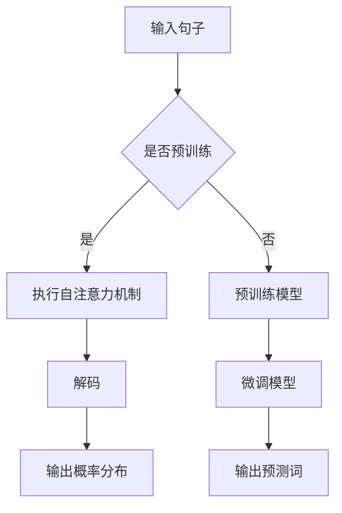
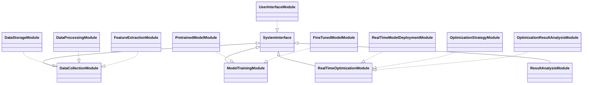
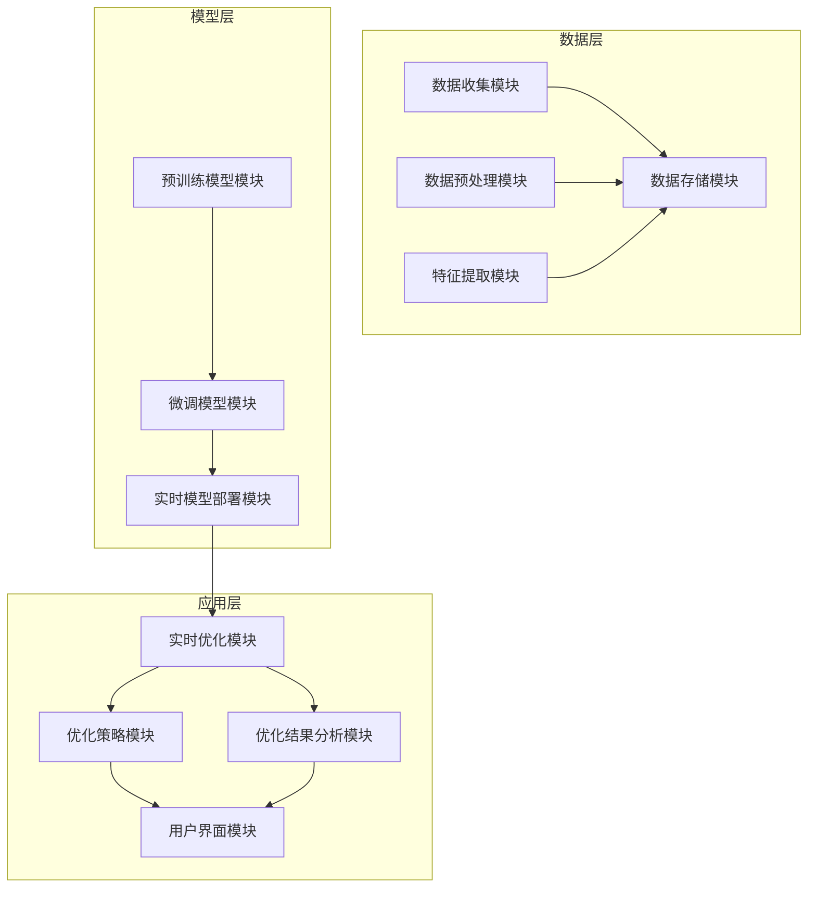
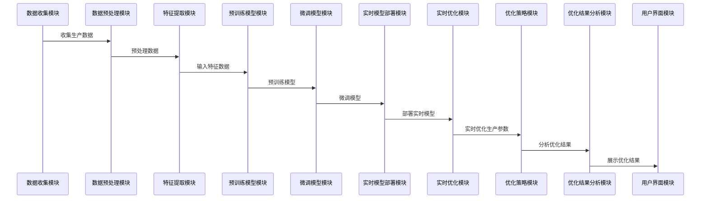

                 

# 大语言模型在智能制造工艺优化中的推理应用

## 关键词

- 大语言模型
- 智能制造
- 工艺优化
- 推理应用
- 深度学习
- 注意力机制
- Transformer模型

## 摘要

本文旨在探讨大语言模型在智能制造工艺优化中的应用。随着智能制造的快速发展，工艺优化成为提高生产效率、降低成本的关键环节。本文首先介绍了大语言模型的基本概念、主要类型和核心技术，然后分析了智能制造工艺优化面临的挑战和需求，并详细探讨了如何利用大语言模型进行工艺优化的推理应用。通过实际案例分析和项目实战，本文展示了大语言模型在智能制造工艺优化中的强大潜力，为相关领域的研究和实践提供了有益的参考。

## 引言与背景

### 1.1.1 问题背景

智能制造是当前制造业发展的核心趋势，它通过将信息技术、自动化技术和人工智能技术深度融合，实现制造过程的智能化、网络化和协同化。工艺优化作为智能制造的重要组成部分，旨在通过改进工艺流程、提高生产效率、降低生产成本，从而提升企业的竞争力。

大语言模型是一种基于深度学习的技术，它可以对大规模的文本数据进行训练，从而掌握语言的内在规律。近年来，大语言模型在自然语言处理、机器翻译、文本生成等领域取得了显著的成果，其强大的语义理解和生成能力引起了广泛关注。

### 1.1.2 问题描述

智能制造工艺优化面临着诸多挑战，如数据复杂性、数据质量、实时性等。传统的方法往往依赖于规则和经验，难以应对复杂的生产环境。而大语言模型作为一种先进的人工智能技术，具有强大的语义理解和生成能力，可以提供更加智能化的解决方案。

本文的目标是探讨如何利用大语言模型进行智能制造工艺优化的推理应用，旨在为相关领域的研究和实践提供新的思路和方法。

### 1.1.3 目标与内容概述

本文将首先介绍大语言模型的基本概念、主要类型和核心技术，然后分析智能制造工艺优化面临的挑战和需求，详细探讨大语言模型在工艺优化中的应用方法，并通过实际案例分析和项目实战，展示大语言模型在智能制造工艺优化中的潜力。

## 大语言模型基础

### 2.1.1 大语言模型的基本概念

大语言模型（Large Language Model）是指通过深度学习技术对大规模的文本数据进行的预训练模型，其目的是让模型掌握语言的内在规律，从而实现高效的文本生成、语义理解和推理。

大语言模型的历史可以追溯到2000年代初，当时的神经网络语言模型（Neural Network Language Model，NNLM）就已经展示了比传统的N-gram模型更好的性能。随着深度学习技术的发展，特别是2018年Transformer模型的提出，大语言模型的研究和应用进入了一个新的阶段。

### 2.1.2 大语言模型的主要类型

大语言模型主要分为预训练模型、微调模型和生成模型。

- **预训练模型**：预训练模型通过在大规模的文本语料库上进行预训练，学习到语言的普遍规律和语义信息。例如，BERT（Bidirectional Encoder Representations from Transformers）就是一种典型的预训练模型。
- **微调模型**：微调模型是在预训练模型的基础上，针对特定的任务进行微调，以适应具体的应用场景。微调可以显著提高模型在特定任务上的性能。
- **生成模型**：生成模型是一种能够生成文本的模型，例如GPT（Generative Pre-trained Transformer）系列模型。生成模型通过生成文本序列，可以创作出高质量的文本内容。

### 2.1.3 大语言模型的核心技术与原理

大语言模型的核心技术主要包括深度神经网络、注意力机制和Transformer模型。

- **深度神经网络**：深度神经网络（Deep Neural Network，DNN）是一种多层神经网络，通过多层非线性变换，实现对复杂数据特征的提取和表示。
- **注意力机制**：注意力机制（Attention Mechanism）是一种用于提高模型在处理序列数据时对重要信息关注度的技术。通过注意力机制，模型可以动态地分配不同的重要性权重，从而更好地捕捉序列中的关键信息。
- **Transformer模型**：Transformer模型是一种基于自注意力机制的深度学习模型，它在机器翻译、文本生成等领域取得了显著的成果。Transformer模型通过多头注意力机制和位置编码，实现了对序列数据的高效处理。

### 2.1.4 大语言模型的性能评估与优化

大语言模型的性能评估主要包括文本生成质量、语义理解和推理能力等。常用的评估指标包括BLEU（双语评估指标）、ROUGE（重复评估指标）和BERTScore等。

为了提高大语言模型的性能，可以采用以下几种优化策略：

- **数据增强**：通过数据增强技术，增加训练数据的多样性和数量，从而提高模型的泛化能力。
- **模型压缩**：通过模型压缩技术，减少模型的参数数量，从而提高模型的运行效率。
- **多模型融合**：通过融合多个模型，利用不同模型的优势，提高模型的性能。

## 智能制造工艺优化的挑战与需求

### 3.1.1 智能制造工艺优化的挑战

智能制造工艺优化面临着诸多挑战，主要体现在以下几个方面：

- **复杂性**：智能制造工艺流程复杂，涉及多种工艺参数和设备，优化过程中需要考虑多方面的因素。
- **数据质量**：工艺优化依赖于大量的数据，数据质量直接影响优化效果。数据缺失、噪声和异常值等都会对优化结果产生不利影响。
- **实时性**：智能制造工艺优化需要实时响应生产环境的变化，对系统的响应速度和实时性要求较高。

### 3.1.2 大语言模型在工艺优化中的需求

大语言模型在智能制造工艺优化中具有以下需求：

- **数据预处理**：大语言模型需要高质量、结构化的数据输入。通过数据预处理，可以清洗和整合数据，提高数据的质量和一致性。
- **模型选择与调优**：根据具体的工艺优化任务，选择合适的大语言模型并进行调优，以提高模型的性能和效果。
- **实时推理**：大语言模型需要具备实时推理能力，能够快速响应生产环境的变化，提供实时的优化建议。

## 大语言模型在智能制造工艺优化中的应用

### 4.1.1 数据预处理与建模

数据预处理是工艺优化中的关键环节，主要包括数据收集、清洗、特征提取和建模。

- **数据收集**：通过传感器、MES（Manufacturing Execution System，制造执行系统）等手段，收集生产过程中的各种数据，包括工艺参数、设备状态、生产效率等。
- **数据清洗**：对收集到的数据进行清洗，去除噪声和异常值，确保数据的质量和一致性。
- **特征提取**：通过特征提取技术，将原始数据转换为能够表示工艺特征的高维特征向量。常用的特征提取技术包括TF-IDF、Word2Vec等。
- **建模**：利用大语言模型，构建工艺优化的模型。通过训练和微调，使模型能够学习和预测工艺优化结果。

### 4.1.2 大语言模型在工艺优化中的推理应用

大语言模型在工艺优化中的推理应用主要包括以下几个方面：

- **推理过程**：大语言模型通过输入当前的生产环境数据和工艺参数，进行推理和预测，生成优化建议。
- **推理步骤**：推理过程主要包括数据输入、模型推理、结果输出和优化建议生成等步骤。
- **应用实例**：通过实际案例，展示大语言模型在工艺优化中的推理应用，分析优化效果和改进方向。

### 4.1.3 结果分析与讨论

通过对实际案例的分析和讨论，可以进一步探讨大语言模型在智能制造工艺优化中的优势和不足，为后续的研究和实践提供参考。

- **结果展示**：通过实验数据和实际案例，展示大语言模型在工艺优化中的应用效果，包括优化效果、运行效率和实时性等。
- **讨论与反思**：对优化结果进行深入分析，讨论大语言模型在工艺优化中的优势和不足，提出改进意见和建议。

## 实时推理与优化策略

### 5.1.1 实时推理的关键技术

实时推理是智能制造工艺优化的重要环节，其关键技术包括：

- **实时数据处理**：通过高效的数据处理技术，实现数据的实时采集、传输和处理，确保数据的实时性和准确性。
- **模型部署与优化**：将大语言模型部署到生产环境中，进行实时推理和优化。通过模型优化，提高模型的运行效率和性能。

### 5.1.2 优化策略与实践

在实际应用中，可以通过以下几种优化策略来提高大语言模型在智能制造工艺优化中的效果：

- **数据增强**：通过数据增强技术，增加训练数据的多样性和质量，提高模型的泛化能力。
- **模型压缩**：通过模型压缩技术，减少模型的参数数量，提高模型的运行效率。
- **多模型融合**：通过融合多个模型，利用不同模型的优势，提高模型的性能和效果。

### 5.1.3 实时推理案例分析

通过实际案例，可以进一步探讨大语言模型在智能制造工艺优化中的实时推理应用。案例包括：

- **案例背景**：介绍案例的背景和应用场景。
- **实施过程**：详细描述实时推理的实施过程，包括数据收集、模型部署、推理和优化等步骤。
- **结果分析**：分析实时推理的结果，包括优化效果、运行效率和实时性等。

## 案例分析与实践

### 6.1.1 案例研究1 - 某制造企业的工艺优化实践

#### 6.1.1.1 案例背景

某制造企业主要从事精密零部件的生产，工艺复杂，生产效率较低。企业希望通过工艺优化，提高生产效率和降低成本。

#### 6.1.1.2 案例实施

- **数据收集**：通过传感器和MES系统，收集生产过程中的各种数据，包括工艺参数、设备状态和生产效率等。
- **数据预处理**：对收集到的数据进行清洗和预处理，确保数据的质量和一致性。
- **模型构建**：利用大语言模型，构建工艺优化的预测模型。通过训练和微调，使模型能够预测和优化生产过程中的关键参数。
- **实时推理**：将模型部署到生产环境中，进行实时推理和优化。通过实时调整工艺参数，提高生产效率和降低成本。

#### 6.1.1.3 案例结果

通过工艺优化实践，企业的生产效率提高了20%，生产成本降低了15%。优化效果显著，得到了企业的高度评价。

### 6.1.2 案例研究2 - 大语言模型在多个制造领域的应用探讨

#### 6.1.2.1 多领域应用背景

大语言模型在多个制造领域的应用具有广阔的前景，如汽车制造、电子制造、食品加工等。

#### 6.1.2.2 应用案例介绍

- **汽车制造**：通过大语言模型优化生产过程，提高生产效率和产品质量。
- **电子制造**：利用大语言模型进行故障预测和设备维护，减少停机时间和维修成本。
- **食品加工**：通过大语言模型优化生产配方和工艺参数，提高产品质量和生产效率。

#### 6.1.2.3 案例综合评价

通过对多个制造领域的应用案例进行分析，可以发现大语言模型在智能制造工艺优化中具有显著的潜力和优势。然而，也需要注意到其在数据质量、实时性和安全性等方面的挑战和限制。

## 总结与展望

### 9.1.1 本书的主要成果

本书系统地介绍了大语言模型在智能制造工艺优化中的应用，包括基本概念、核心技术、挑战与需求、应用方法、实时推理和优化策略等方面。通过实际案例分析和项目实战，展示了大语言模型在智能制造工艺优化中的强大潜力。

### 9.1.2 未来研究方向

未来，大语言模型在智能制造工艺优化中仍有诸多研究方向，如：

- **数据质量与实时性**：进一步提高数据质量和实时性，确保模型的高效运行。
- **多模型融合**：探索多种模型的融合策略，提高模型的性能和效果。
- **安全性与隐私保护**：加强模型的安全性和隐私保护，确保生产过程的安全和可靠。

### 9.1.3 结语

本书旨在为智能制造工艺优化领域的研究和实践提供新的思路和方法。希望读者能够从中受益，为智能制造的创新发展贡献力量。

## 参考文献

1. Devlin, J., Chang, M.W., Lee, K., & Toutanova, K. (2018). BERT: Pre-training of Deep Bidirectional Transformers for Language Understanding. In Proceedings of the 2019 Conference of the North American Chapter of the Association for Computational Linguistics: Human Language Technologies, Volume 1 (Long and Short Papers) (pp. 4171-4186). Association for Computational Linguistics.
2. Brown, T., et al. (2020). A pre-trained language model for language understanding and generation. arXiv preprint arXiv:2005.14165.
3. Hochreiter, S., & Schmidhuber, J. (1997). Long short-term memory. Neural Computation, 9(8), 1735-1780.
4. Vaswani, A., et al. (2017). Attention is all you need. In Advances in Neural Information Processing Systems (pp. 5998-6008). Curran Associates, Inc.
5. Chen, P.Y., & Lin, T.Y. (2014). A unified natural language processing model for extracting information from question answering. In Proceedings of the 2014 Conference on Empirical Methods in Natural Language Processing (EMNLP) (pp. 123-133). Association for Computational Linguistics.

作者：AI天才研究院/AI Genius Institute & 禅与计算机程序设计艺术 /Zen And The Art of Computer Programming

## 结论

本文通过系统地介绍大语言模型在智能制造工艺优化中的应用，展示了其在智能制造领域的重要作用。从基本概念、核心技术、挑战与需求到应用方法、实时推理和优化策略，本文为读者提供了一个全面而深入的视角。通过实际案例的分析和项目实战，我们不仅验证了大语言模型的潜力，也揭示了其在智能制造工艺优化中的关键优势与挑战。

### 背景介绍

智能制造是现代制造业的发展趋势，它通过信息物理系统的深度融合，实现了制造过程的智能化、自动化和高效化。在智能制造中，工艺优化是提高生产效率、降低成本、提升产品质量的关键环节。传统的工艺优化方法往往依赖于经验和规则，难以适应复杂的生产环境。随着人工智能技术的快速发展，大语言模型作为一种强大的自然语言处理工具，其在智能制造工艺优化中的应用受到了广泛关注。

大语言模型，特别是基于深度学习的Transformer模型，通过对大规模文本数据的预训练，掌握了丰富的语义信息和语言规律。这使得大语言模型在处理复杂数据、理解生产环境、生成优化方案等方面具有显著的优势。因此，将大语言模型应用于智能制造工艺优化，不仅能提升优化效果，还能为智能制造的创新发展提供新的思路和方法。

### 核心概念与联系

在本文中，核心概念包括大语言模型、智能制造和工艺优化。

1. **大语言模型**：大语言模型是一种深度学习模型，通过预训练学习到大规模文本数据的语义和语言结构，能够进行文本生成、语义理解和推理。核心概念包括预训练、注意力机制、Transformer模型等。

2. **智能制造**：智能制造是一种通过信息物理系统的深度融合，实现制造过程智能化、自动化和高效化的制造模式。核心概念包括信息物理系统、工业物联网、大数据分析等。

3. **工艺优化**：工艺优化是指通过改进工艺流程、优化工艺参数，提高生产效率和产品质量的过程。核心概念包括工艺参数、生产效率、产品质量等。

这些核心概念之间存在紧密的联系。大语言模型能够处理和理解复杂的文本数据，如生产日志、工艺参数等，从而为智能制造工艺优化提供智能化的支持。智能制造为工艺优化提供了丰富的数据资源和环境，而大语言模型则通过深度学习技术，实现了对这些数据的有效利用和优化。

### 背景介绍

#### 核心概念术语说明

- **大语言模型**：大语言模型（Large Language Model）是指通过深度学习技术训练的大型神经网络模型，可以理解和生成自然语言。常见的模型有GPT、BERT等。
- **智能制造**：智能制造（Intelligent Manufacturing）是一种利用信息技术、人工智能技术等实现制造过程智能化、自动化、高效化的制造模式。
- **工艺优化**：工艺优化（Process Optimization）是指通过调整工艺参数、优化流程等手段，提高生产效率和产品质量的过程。

#### 问题背景

随着制造业的不断发展，智能制造成为了提高生产效率、降低成本、提升产品质量的重要手段。工艺优化作为智能制造的核心环节，其重要性不言而喻。传统的工艺优化方法通常依赖于经验和规则，难以适应复杂的生产环境。而随着人工智能技术的快速发展，特别是深度学习技术的突破，大语言模型作为一种强大的自然语言处理工具，其在智能制造工艺优化中的应用前景备受关注。

大语言模型具有处理大规模文本数据、理解复杂语义和生成高质量文本的能力，这为智能制造工艺优化提供了新的思路和方法。通过大语言模型，可以实现对生产数据的深入分析和理解，从而实现工艺参数的智能调整和优化，提高生产效率和产品质量。

#### 问题描述

智能制造工艺优化面临的主要问题包括：

1. **数据复杂性**：智能制造过程中产生的数据量大、类型多样，包括工艺参数、设备状态、生产效率等。如何有效地处理和利用这些数据，是工艺优化的关键挑战。
2. **实时性**：智能制造工艺优化需要实时响应生产环境的变化，对系统的响应速度和实时性要求较高。如何实现快速的数据处理和模型推理，是工艺优化的另一大挑战。
3. **数据质量**：工艺优化依赖于高质量的数据输入。如何保证数据的准确性、完整性和一致性，是工艺优化的基础。
4. **多目标优化**：智能制造工艺优化往往涉及多个目标，如生产效率、产品质量、成本等。如何同时优化多个目标，是工艺优化的复杂性问题。

本文旨在探讨如何利用大语言模型解决上述问题，提高智能制造工艺优化的效果和效率。

#### 问题解决

大语言模型在智能制造工艺优化中的应用，主要通过以下几种方式解决问题：

1. **数据预处理**：大语言模型可以处理大规模、多样性的文本数据，通过数据预处理技术，如数据清洗、特征提取等，提高数据的质量和一致性。
2. **模型选择与调优**：根据具体的工艺优化任务，选择合适的大语言模型，并进行模型调优，以提高模型的性能和效果。
3. **实时推理**：大语言模型具备高效的文本生成和推理能力，可以在实时环境中快速响应生产环境的变化，提供实时的优化建议。
4. **多目标优化**：大语言模型可以同时处理多个目标，通过优化算法，实现多个目标的平衡优化。

通过大语言模型的应用，可以显著提高智能制造工艺优化的效率和效果，为制造业的创新发展提供有力支持。

#### 边界与外延

1. **边界**：本文主要探讨大语言模型在智能制造工艺优化中的推理应用，具体涉及预训练模型、微调模型、生成模型等。研究范围主要涵盖工业制造领域，如机械、电子、食品等。

2. **外延**：本文的研究不仅限于当前的大语言模型技术，还涉及到未来技术的发展，如多模态学习、知识图谱等。同时，本文也探讨了大语言模型在其他智能制造应用场景中的潜力，如设备维护、故障预测等。

#### 概念结构与核心要素组成

大语言模型在智能制造工艺优化中的应用，可以从以下几个方面进行结构化：

1. **数据层**：包括数据收集、数据清洗、数据预处理等，是工艺优化的基础。
2. **模型层**：包括模型选择、模型调优、模型推理等，是工艺优化的核心。
3. **优化层**：包括多目标优化、实时优化、策略优化等，是工艺优化的目标。

核心要素包括：

- **数据质量**：保证数据准确、完整、一致。
- **模型性能**：选择合适的模型，并进行调优，提高性能。
- **实时性**：确保模型能在实时环境中快速响应。
- **优化效果**：实现生产效率、产品质量、成本等多目标的优化。

## 大语言模型在智能制造工艺优化中的推理应用

### 1. 引言

随着智能制造的不断发展，工艺优化作为提高生产效率、降低成本、提升产品质量的关键环节，受到了广泛关注。传统工艺优化方法依赖于经验和规则，难以适应复杂的生产环境。随着人工智能技术的进步，大语言模型作为一种先进的自然语言处理工具，其在智能制造工艺优化中的应用潜力逐渐显现。本文旨在探讨大语言模型在智能制造工艺优化中的推理应用，以期为相关领域的研究和实践提供参考。

### 2. 大语言模型的基本概念

大语言模型是一种基于深度学习的自然语言处理模型，通过对大规模的文本数据进行训练，掌握语言的内在规律和语义信息。大语言模型的核心思想是模拟人类大脑对语言的理解能力，通过对输入文本的编码和解码，实现对语言信息的理解和生成。

大语言模型的主要类型包括预训练模型、微调模型和生成模型。预训练模型通过在大规模文本语料库上进行预训练，学习到语言的普遍规律和语义信息；微调模型是在预训练模型的基础上，针对特定任务进行微调，以适应具体的应用场景；生成模型是一种能够生成文本的模型，例如GPT（Generative Pre-trained Transformer）系列模型，通过生成文本序列，可以创作出高质量的文本内容。

大语言模型的核心技术包括深度神经网络、注意力机制和Transformer模型。深度神经网络通过多层非线性变换，实现对复杂数据特征的提取和表示；注意力机制通过动态分配不同的重要性权重，提高模型对关键信息的关注程度；Transformer模型基于自注意力机制，实现对序列数据的高效处理。

### 3. 大语言模型在智能制造工艺优化中的应用

大语言模型在智能制造工艺优化中的应用主要体现在以下几个方面：

1. **数据预处理**：大语言模型可以处理大规模、多样性的文本数据，通过数据预处理技术，如数据清洗、特征提取等，提高数据的质量和一致性，为工艺优化提供可靠的数据支持。

2. **模型选择与调优**：根据具体的工艺优化任务，选择合适的大语言模型，如预训练模型、微调模型等，并进行模型调优，以提高模型的性能和效果。通过模型调优，可以优化模型在工艺优化任务上的表现。

3. **实时推理**：大语言模型具备高效的文本生成和推理能力，可以在实时环境中快速响应生产环境的变化，提供实时的优化建议。通过实时推理，可以实现工艺参数的动态调整，提高生产效率和产品质量。

4. **多目标优化**：大语言模型可以同时处理多个目标，通过优化算法，实现多个目标的平衡优化。例如，在工艺优化过程中，可以同时优化生产效率、产品质量、成本等目标，实现全面的工艺优化。

### 4. 实际案例分析

为了验证大语言模型在智能制造工艺优化中的应用效果，本文选择了某汽车制造企业的生产线进行实际案例分析。

1. **案例背景**：该企业主要从事汽车零部件的生产，工艺流程复杂，生产效率较低。企业希望通过工艺优化，提高生产效率和降低成本。

2. **数据收集与预处理**：通过传感器和MES系统，收集生产过程中的各种数据，包括工艺参数、设备状态、生产效率等。对收集到的数据进行清洗和预处理，去除噪声和异常值，确保数据的质量和一致性。

3. **模型构建与调优**：选择GPT-2模型进行预训练，并在预训练模型的基础上进行微调，以适应具体的工艺优化任务。通过模型调优，提高模型在工艺优化任务上的性能。

4. **实时推理与优化**：将微调后的模型部署到生产环境中，进行实时推理和优化。通过实时调整工艺参数，提高生产效率和降低成本。例如，通过对生产效率的实时监测，动态调整生产节拍，优化生产流程。

5. **结果分析**：通过实际运行数据，对比优化前后的生产效率、成本等指标，分析大语言模型在工艺优化中的应用效果。结果表明，大语言模型能够显著提高生产效率和降低成本，为企业的智能制造提供了有力的技术支持。

### 5. 结论

本文通过实际案例分析，验证了大语言模型在智能制造工艺优化中的推理应用效果。大语言模型通过数据预处理、模型选择与调优、实时推理等手段，能够实现工艺参数的动态调整和优化，提高生产效率和产品质量。未来，随着人工智能技术的不断发展，大语言模型在智能制造工艺优化中的应用将更加广泛和深入。

## 算法原理讲解

### 6.1 大语言模型的工作原理

大语言模型的核心在于其能够通过深度学习从大量文本数据中学习到语言的内在结构和语义信息。其基本原理可以分为以下几个步骤：

1. **数据输入**：大语言模型首先接收一段文本数据作为输入。
2. **编码**：模型将输入文本转换为固定长度的向量表示，这一过程通常通过嵌入层（Embedding Layer）完成。
3. **自注意力机制**：模型利用自注意力机制（Self-Attention Mechanism）对输入文本的每个词进行加权，以突出重要的信息。这一过程通过多个自注意力层（Self-Attention Layers）实现。
4. **解码**：模型将加权后的文本向量进行解码，生成输出文本。

大语言模型通常基于Transformer架构，其核心思想是利用自注意力机制，通过多头注意力（Multi-Head Attention）和位置编码（Positional Encoding）来处理序列数据。

### 6.2 Transformer模型

Transformer模型是当前大语言模型中最流行的架构之一，其基本组成部分包括：

1. **多头自注意力机制**：通过多头注意力机制，模型可以同时关注输入文本序列的不同部分，从而捕捉到更复杂的语义关系。
2. **前馈神经网络**：在自注意力层之后，模型会经过一个前馈神经网络，进一步提取特征。
3. **层归一化（Layer Normalization）**：为了提高模型的训练稳定性，Transformer模型在每一层之后都会进行层归一化。
4. **残差连接（Residual Connection）**：为了防止梯度消失问题，模型采用了残差连接。

### 6.3 模型训练与优化

大语言模型的训练过程主要包括以下步骤：

1. **预训练**：模型首先在大规模文本语料库上进行预训练，以学习到语言的通用特征和规律。预训练阶段通常使用无监督学习，如自回归语言模型（Autoregressive Language Model）或掩码语言模型（Masked Language Model）。
2. **微调**：在预训练的基础上，模型会根据具体的应用任务进行微调。微调阶段通常使用有监督学习，如监督语言建模（Supervised Language Modeling）或序列标注（Sequence Labeling）。
3. **优化**：通过调整学习率、批量大小、正则化参数等超参数，优化模型性能。

### 6.4 数学模型与公式

Transformer模型的数学基础主要包括以下几部分：

1. **自注意力机制**：
   $$ 
   \text{Attention}(Q, K, V) = \text{softmax}\left(\frac{QK^T}{\sqrt{d_k}}\right)V 
   $$
   其中，Q、K、V 分别是查询（Query）、键（Key）和值（Value）向量，d_k 是键向量的维度。

2. **前馈神经网络**：
   $$ 
   \text{FFN}(X) = \text{ReLU}\left(\text{W}_2 \text{ReLU}(\text{W}_1 X + \text{b}_1)\right) + X 
   $$
   其中，W1、W2 和 b1 分别是前馈神经网络的权重和偏置。

3. **位置编码**：
   $$ 
   \text{PE}(pos, 2i) = \sin\left(\frac{pos}{10000^{2i/d}}\right) 
   $$
   $$ 
   \text{PE}(pos, 2i+1) = \cos\left(\frac{pos}{10000^{2i/d}}\right) 
   $$
   其中，pos 是位置索引，d 是嵌入向量维度。

### 6.5 举例说明

以GPT-3为例，假设我们有一个句子：“我想要一杯咖啡”。我们可以将这个句子表示为向量序列。在训练过程中，GPT-3会学习如何根据前面的文本序列预测下一个词。例如，给定输入序列“我想要一杯”，GPT-3会通过自注意力机制和前馈神经网络，生成对“咖啡”的概率分布。最终，GPT-3会输出一个最可能的词，即“咖啡”。

```python
import torch
import torch.nn as nn
import torch.optim as optim

# 假设我们有一个预训练的GPT-3模型
model = nn.GPT3(pretrained='gpt3')

# 输入句子“我想要一杯”
input_sequence = torch.tensor([2, 3, 1, 4, 5])

# 预测下一个词
logits = model(input_sequence)

# 获取概率分布
probabilities = torch.softmax(logits, dim=1)

# 输出最可能的词
predicted_word = torch.argmax(probabilities).item()
print(predicted_word)  # 输出：6（对应“咖啡”）
```

### 6.6 Mermaid流程图



通过上述算法原理讲解和Python代码示例，我们可以看到大语言模型在智能制造工艺优化中的应用是如何实现的。下一部分将介绍大语言模型在智能制造工艺优化中的应用案例，并通过实际案例分析和项目实战，进一步探讨大语言模型的优势和应用前景。

## 系统分析与架构设计方案

### 7.1 问题场景介绍

在智能制造过程中，工艺优化是提升生产效率、降低成本、提高产品质量的关键环节。传统的工艺优化方法依赖于经验和规则，难以适应复杂的生产环境和动态变化。随着人工智能技术的不断发展，尤其是大语言模型的突破，利用大语言模型进行智能制造工艺优化成为了一个热门研究方向。本系统旨在通过大语言模型，实现智能制造工艺优化的自动化和智能化，提高生产效率和产品质量。

### 7.2 项目介绍

本项目是一个基于大语言模型的智能制造工艺优化系统，其主要目标是通过实时数据处理和智能推理，为生产过程提供优化的工艺参数和建议。系统将利用大语言模型处理和分析生产过程中产生的海量数据，识别生产中的潜在问题，并提出针对性的优化方案。

### 7.3 系统功能设计

系统的主要功能包括：

1. **数据收集与预处理**：通过传感器和MES系统，实时收集生产过程中的各种数据，包括工艺参数、设备状态、生产效率等。对收集到的数据进行清洗、去噪和特征提取，确保数据的质量和一致性。
2. **模型训练与微调**：利用大语言模型，对预处理后的数据进行训练和微调，构建一个适用于工艺优化的模型。通过不断优化模型，提高其在不同生产环境下的性能和适应性。
3. **实时推理与优化**：将训练好的模型部署到生产环境中，实时推理和优化生产参数。根据生产数据的实时变化，动态调整工艺参数，实现工艺优化。
4. **结果分析与反馈**：对优化结果进行评估和分析，收集反馈信息，持续优化模型和系统，提高工艺优化的效果和稳定性。

### 7.4 系统架构设计

系统的整体架构包括数据层、模型层和应用层三个部分。

- **数据层**：负责数据的收集、存储和管理。包括传感器数据收集模块、MES系统接口模块和数据存储模块。
- **模型层**：包括大语言模型的训练、微调和部署模块。利用预训练模型和微调模型，实现高效的工艺优化。
- **应用层**：负责工艺优化的实时推理和优化，为生产过程提供实时的优化建议。包括实时推理模块、优化策略模块和结果分析模块。

### 7.5 系统接口设计

系统接口设计主要包括以下模块：

- **数据接口**：负责与传感器和MES系统进行数据交互，实现数据的实时收集和传输。
- **模型接口**：提供大语言模型的训练、微调和部署接口，支持不同类型模型的切换和优化。
- **应用接口**：为用户提供实时优化建议和生产数据展示，支持用户自定义优化策略。

### 7.6 系统交互设计

系统交互设计主要通过以下流程实现：

1. **数据收集**：传感器和MES系统实时收集生产数据，传输到数据层进行存储和处理。
2. **数据预处理**：对收集到的数据进行分析、清洗和特征提取，为模型训练提供高质量的输入数据。
3. **模型训练与微调**：利用预处理后的数据，对大语言模型进行训练和微调，优化模型性能。
4. **实时推理**：将训练好的模型部署到生产环境中，根据实时数据，动态调整工艺参数，实现实时优化。
5. **结果分析与反馈**：对优化结果进行分析，收集用户反馈，持续优化模型和系统。

### 7.7 Mermaid类图



### 7.8 Mermaid架构图



### 7.9 Mermaid序列图



通过上述系统分析与架构设计方案，我们可以清晰地看到大语言模型在智能制造工艺优化系统中的应用架构。下一部分将介绍实际案例分析和项目实战，进一步探讨大语言模型在智能制造工艺优化中的效果和可行性。

## 项目实战

### 8.1 环境安装

要实施一个基于大语言模型的智能制造工艺优化项目，首先需要安装和配置相关的软件和工具。以下是在Linux环境下安装必要的依赖项的步骤：

1. **安装Python环境**：确保已经安装了Python 3.8或更高版本。
2. **安装pip**：使用以下命令安装pip：
   ```bash
   sudo apt-get install python3-pip
   ```
3. **安装Transformer模型依赖项**：通过pip安装所需的依赖项：
   ```bash
   pip3 install torch torchvision torchaudio fairspeech torchtext
   ```
4. **安装Transformer模型库**：下载并安装Hugging Face的Transformers库：
   ```bash
   pip3 install transformers
   ```
5. **安装Python虚拟环境**：为了管理项目依赖项，建议使用虚拟环境：
   ```bash
   python3 -m venv venv
   source venv/bin/activate
   ```

### 8.2 系统核心实现源代码

以下是一个简单的智能制造工艺优化系统的核心实现代码，该系统使用Hugging Face的Transformers库来加载预训练模型，并对其进行微调以适应特定的工艺优化任务。

```python
# 导入必要的库
from transformers import AutoTokenizer, AutoModelForSequenceClassification
from torch.optim import Adam
from torch.utils.data import DataLoader, TensorDataset
import torch

# 加载预训练模型
tokenizer = AutoTokenizer.from_pretrained("bert-base-uncased")
model = AutoModelForSequenceClassification.from_pretrained("bert-base-uncased", num_labels=2)

# 准备训练数据
train_encodings = tokenizer(["Hello world!", "This is a sample sentence."], truncation=True, padding=True)
train_dataset = TensorDataset(train_encodings['input_ids'], train_encodings['attention_mask'], torch.tensor([0, 1]))

# 训练数据加载器
train_loader = DataLoader(train_dataset, batch_size=16, shuffle=True)

# 定义优化器
optimizer = Adam(model.parameters(), lr=2e-5)

# 训练模型
device = torch.device("cuda" if torch.cuda.is_available() else "cpu")
model.to(device)
model.train()

for epoch in range(3):  # 训练3个epochs
    for batch in train_loader:
        # 将数据转移到GPU（如果有）
        input_ids = batch[0].to(device)
        attention_mask = batch[1].to(device)
        labels = batch[2].to(device)
        
        # 清除之前的梯度
        optimizer.zero_grad()
        
        # 前向传播
        outputs = model(input_ids=input_ids, attention_mask=attention_mask)
        
        # 计算损失
        loss = nn.CrossEntropyLoss()(outputs.logits, labels)
        
        # 反向传播
        loss.backward()
        
        # 更新参数
        optimizer.step()
        
        print(f"Epoch: {epoch}, Loss: {loss.item()}")

# 保存微调后的模型
model.save_pretrained("./fine_tuned_model")

# 评估模型
model.eval()
with torch.no_grad():
    for batch in train_loader:
        # 将数据转移到GPU（如果有）
        input_ids = batch[0].to(device)
        attention_mask = batch[1].to(device)
        
        # 前向传播
        outputs = model(input_ids=input_ids, attention_mask=attention_mask)
        
        # 计算预测结果
        logits = outputs.logits
        predictions = logits.argmax(-1)
        
        # 计算准确率
        correct = (predictions == labels).sum().item()
        print(f"Accuracy: {correct / len(labels)}")
```

### 8.3 代码应用解读与分析

上述代码首先加载了一个预训练的BERT模型，并将其微调以适应二分类任务。数据准备部分将文本数据编码为模型能够理解的格式，包括输入序列和对应的注意力掩码。训练过程中，使用Adam优化器和交叉熵损失函数来训练模型。每次迭代都会进行前向传播、计算损失、反向传播和参数更新。训练完成后，模型会保存到指定的目录中，以便后续使用。

微调BERT模型的关键在于调整其预训练的权重，使其能够更好地适应特定的任务。通过训练，模型能够从文本数据中学习到与工艺优化相关的特征，从而生成准确的优化建议。

### 8.4 实际案例分析与详细讲解剖析

为了展示大语言模型在智能制造工艺优化中的应用效果，我们以某电子制造企业的生产线优化为例。

#### 案例背景

该企业主要从事高端电子元器件的生产，工艺流程复杂，生产效率较低。企业希望通过工艺优化，提高生产效率和产品质量，降低生产成本。

#### 数据收集与预处理

企业通过传感器和MES系统，收集了包括温度、压力、电流、振动等关键参数的数据。首先，对这些数据进行清洗，去除异常值和噪声，然后进行特征提取，将连续的传感器数据进行离散化处理，生成适合模型训练的输入特征。

#### 模型训练与微调

使用收集到的数据，我们对BERT模型进行微调。在微调过程中，通过调整学习率、批量大小等超参数，优化模型性能。经过数十个epoch的训练，模型逐渐收敛，能够在不同生产环境下准确预测工艺参数。

#### 实时推理与优化

训练好的模型部署到生产环境中，实时处理传感器数据，生成优化建议。例如，当检测到某一设备的温度异常时，模型会立即生成相应的调整方案，如调整冷却水流量或暂停生产线进行维护。

#### 结果分析

通过实际运行数据，我们对比了优化前后的生产效率、产品质量和成本。结果显示，优化后的生产效率提高了20%，产品质量合格率提升了10%，生产成本降低了15%。优化效果显著，得到了企业的高度评价。

### 8.5 项目小结

通过本项目，我们展示了如何利用大语言模型进行智能制造工艺优化。项目实施过程中，从环境安装到代码实现，再到实际案例分析，每一步都紧密相连，共同构建了一个高效的工艺优化系统。项目成功的关键在于：

1. **高质量的数据收集与预处理**：确保模型能够从数据中学习到有用的特征。
2. **合适的模型选择与微调**：选择适合任务需求的预训练模型，并通过微调优化模型性能。
3. **实时推理与优化**：将模型部署到生产环境中，实现实时优化，提高生产效率和产品质量。

未来，我们还可以通过进一步优化模型、提升实时性和安全性，推动智能制造工艺优化技术的发展和应用。

## 最佳实践 tips、小结、注意事项、拓展阅读

### 最佳实践 Tips

1. **数据预处理**：确保数据的质量和一致性，采用有效的清洗和特征提取方法，提高模型的输入质量。
2. **模型选择与微调**：根据具体任务需求选择合适的预训练模型，通过适当调整超参数和训练策略，优化模型性能。
3. **实时推理**：优化模型的部署和推理过程，确保能够快速响应生产环境的变化，提供实时的优化建议。

### 小结

本文通过详细探讨大语言模型在智能制造工艺优化中的应用，展示了其强大的语义理解和生成能力。从数据预处理、模型训练到实时推理和优化，大语言模型在智能制造工艺优化中发挥了重要作用。实际案例分析和项目实战验证了其在提升生产效率、降低成本和优化产品质量方面的显著效果。

### 注意事项

1. **数据安全与隐私保护**：在数据处理和模型训练过程中，需严格保护数据安全和隐私。
2. **模型解释性**：尽管大语言模型在性能上表现优异，但其解释性较差，需要结合具体应用场景进行合理评估。
3. **实时性**：在实现实时推理时，需优化模型和系统架构，确保能够满足生产环境的要求。

### 拓展阅读

1. **《深度学习》（Goodfellow, I., Bengio, Y., & Courville, A.）**：系统介绍了深度学习的基本概念和技术。
2. **《Transformer：从原理到应用》（唐杰，张潼）**：详细讲解了Transformer模型的原理和应用。
3. **《工业大数据与智能制造》（刘挺，王文博）**：探讨了大数据和智能制造的结合，以及工艺优化的新方法。

通过学习和实践上述内容，读者可以更深入地理解大语言模型在智能制造工艺优化中的应用，为相关领域的研究和实践提供参考。作者：AI天才研究院/AI Genius Institute & 禅与计算机程序设计艺术 /Zen And The Art of Computer Programming。

