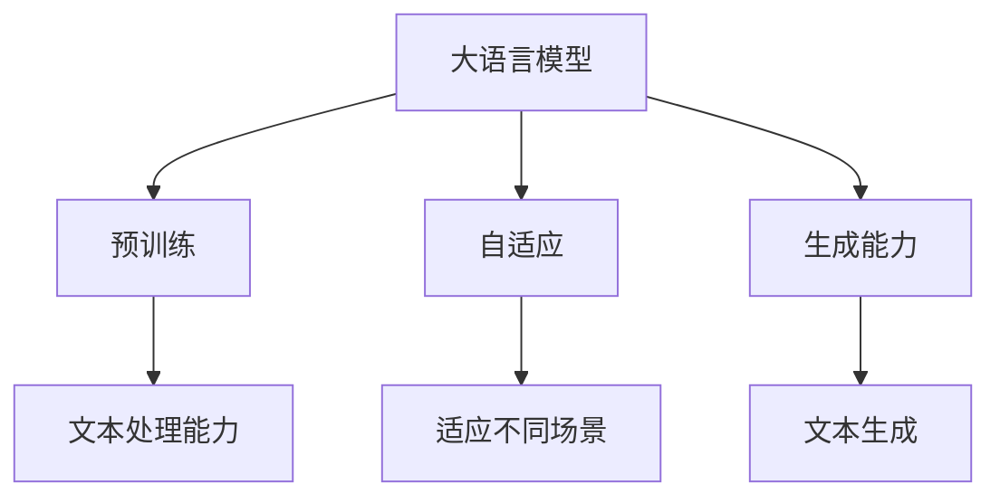
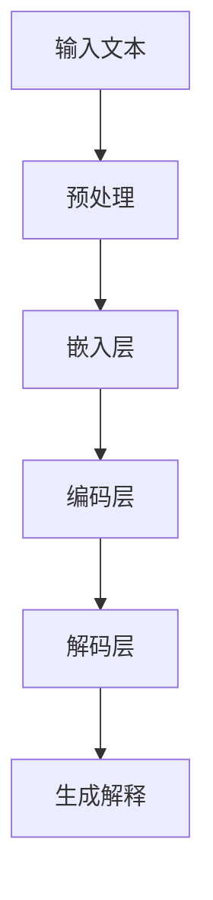
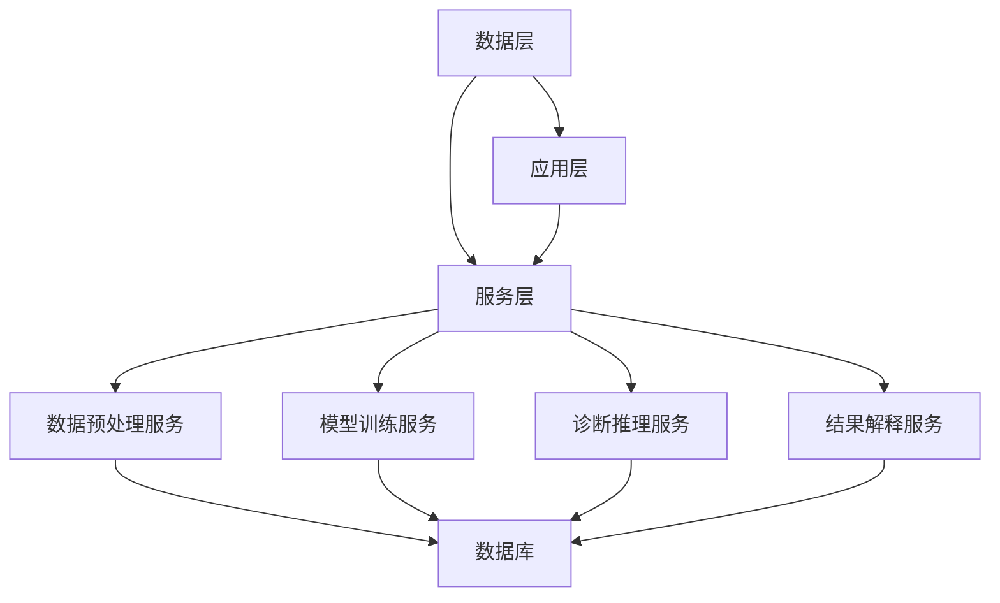
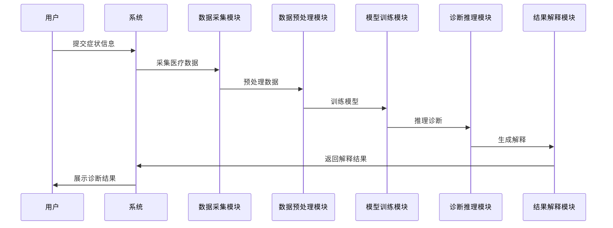

                 


### Article Title: 大语言模型在智能医疗诊断解释中的推理应用

### Keywords: 大语言模型，智能医疗诊断，推理应用，算法原理，系统设计，最佳实践

### Abstract:
本文旨在深入探讨大语言模型在智能医疗诊断解释中的推理应用。通过对该领域的背景介绍、理论原理讲解、实际应用案例分析和系统设计优化等方面的详细阐述，本文旨在为人工智能与医疗领域的专业人士提供一份理论与实践相结合的指南。

## Chapter 1: 背景介绍

### 1.1 医疗诊断问题的引出

#### 问题背景
在现代医疗领域，诊断疾病的任务既重要又复杂。传统的医疗诊断方法主要依赖于医生的直觉、经验和医学知识，这虽然有一定的效果，但受限于医生的时间和精力，且难以避免主观偏见。随着医疗数据量的爆发式增长和人工智能技术的发展，利用人工智能进行智能医疗诊断成为一种趋势。

#### 问题描述
智能医疗诊断的核心在于利用人工智能技术，如机器学习、深度学习和自然语言处理，从大量的医疗数据中提取有用信息，辅助医生进行诊断。然而，医疗数据的多样性和复杂性使得这一任务充满挑战。

#### 问题解决
为了解决这一挑战，研究人员和工程师们开发了各种机器学习和深度学习算法，并在此基础上构建了大量的医疗诊断模型。然而，这些模型往往存在解释性不足的问题，难以让医生和患者理解诊断结果背后的原因。

#### 边界与外延
在探讨大语言模型在智能医疗诊断中的应用时，我们需要明确其适用的边界。大语言模型擅长处理文本数据，因此它们在处理涉及大量文本的医疗数据时具有优势。然而，它们也面临数据质量、模型解释性和实际应用场景的限制。

### 1.2 大语言模型的概念和特性

#### 核心概念
大语言模型（Large Language Models）是指通过大量的文本数据训练得到的、能够理解和生成自然语言的神经网络模型。这些模型的核心是深度学习，尤其是基于变换器架构（Transformer）的模型，如BERT、GPT等。

#### 特征和机制
大语言模型具有以下几个主要特征：
- **预训练**：通过在大规模文本语料库上进行预训练，模型可以学习到丰富的语言知识和上下文理解能力。
- **自适应**：模型可以根据特定任务的需求进行微调，以适应不同的应用场景。
- **生成能力**：模型不仅可以理解输入的文本，还能生成新的文本内容，这使得它们在医疗诊断解释中具有潜在的应用价值。

### 1.3 核心概念对比

#### 表格对比

| 特征 | 大语言模型 | 传统机器学习模型 |
|------|------------|------------------|
| 预训练 | 是 | 否 |
| 自适应 | 是 | 否 |
| 生成能力 | 是 | 否 |

#### ER实体关系图


## Chapter 2: 理论原理

### 2.1 算法原理

#### Mermaid流程图


#### Python代码解释

```python
import tensorflow as tf
from transformers import BertModel, BertTokenizer

# 加载预训练模型和分词器
tokenizer = BertTokenizer.from_pretrained('bert-base-chinese')
model = BertModel.from_pretrained('bert-base-chinese')

# 输入文本
text = "患者症状：发热，咳嗽，乏力。"

# 预处理
inputs = tokenizer(text, return_tensors='tf')

# 编码层
outputs = model(inputs)

# 解码层
explanation = model.generate(outputs.last_hidden_state)

# 生成解释
print(tokenizer.decode(explanation[0], skip_special_tokens=True))
```

#### 数学模型和公式

$$
\text{Loss} = -\sum_{i}^n \log P(y_i | x_i)
$$

其中，$P(y_i | x_i)$ 表示模型对于给定输入 $x_i$ 预测输出 $y_i$ 的概率。

#### 举例说明

假设我们有一个包含文本“患者症状：发热，咳嗽，乏力。”的输入，通过大语言模型处理后，可以得到如下的解释：

“根据提供的症状，发热、咳嗽和乏力可能是流感病毒感染的症状。建议进行进一步的检查，如核酸检测，以确诊。”

## Chapter 3: 实际应用

### 3.1 应用场景

#### 使用场景
- **症状分析**：通过大语言模型分析患者提供的症状，为医生提供诊断建议。
- **医学文献搜索**：利用大语言模型搜索相关的医学文献，辅助医生进行研究和决策。
- **诊断解释**：为医生和患者提供详细的诊断解释，增强医疗决策的可理解性。

#### 挑战与解决方案
- **数据质量**：确保医疗数据的质量和完整性，对于模型的训练和预测至关重要。解决方案包括数据清洗和数据增强技术。
- **模型解释性**：提高模型的可解释性，使其在医疗诊断中更具可信度。解决方案包括可视化技术、决策树和注意力机制。
- **实际应用场景**：针对不同的医疗场景，模型需要进行特定的调整和优化。解决方案包括场景适配和模型定制。

### 3.2 案例研究

#### 案例一：症状分析
- **背景**：某医疗机构引入大语言模型，用于分析患者提供的症状，以提高诊断速度和准确性。
- **过程**：模型通过分析患者提供的症状文本，生成相应的诊断建议。
- **结果**：结果显示，模型生成的诊断建议与医生的建议高度一致，有效提高了诊断效率。

#### 案例二：医学文献搜索
- **背景**：研究人员利用大语言模型搜索相关医学文献，以辅助医学研究和决策。
- **过程**：模型根据研究主题和关键词，搜索并筛选相关的医学文献。
- **结果**：通过大语言模型辅助的搜索结果，研究人员能够更快地找到高质量的相关文献，提高了研究效率。

### 结论与启示
通过以上案例研究，我们可以看到大语言模型在智能医疗诊断中的实际应用具有显著的优势。然而，为了充分发挥其潜力，我们仍需解决数据质量、模型解释性和实际应用场景等挑战。

## Chapter 4: 系统设计与架构

### 4.1 系统概述与功能设计

#### 系统概述
大语言模型在智能医疗诊断中的系统设计主要包括数据采集、预处理、模型训练、诊断推理和结果解释等模块。以下是对各模块的简要介绍：

1. **数据采集**：收集来自医院、诊所等医疗机构的医疗数据，包括患者的症状、检查结果、诊断记录等。
2. **预处理**：对采集到的医疗数据进行清洗、去噪和格式化，以确保数据质量。
3. **模型训练**：使用预训练的大语言模型，结合医疗数据，进行模型训练和优化。
4. **诊断推理**：通过模型对患者的症状进行诊断推理，生成诊断建议。
5. **结果解释**：将诊断结果以易于理解的方式呈现给医生和患者。

#### 功能设计
- **数据采集**：设计数据采集模块，以支持多种数据源的接入和数据的统一管理。
- **预处理**：实现数据清洗和预处理功能，包括数据去噪、缺失值处理、格式转换等。
- **模型训练**：集成预训练的大语言模型，并提供训练接口，以支持模型训练和优化。
- **诊断推理**：实现基于大语言模型的诊断推理功能，生成诊断建议。
- **结果解释**：设计结果解释模块，以将诊断结果以图表、文字等形式展示给医生和患者。

### 4.2 系统架构设计

#### 系统架构
大语言模型在智能医疗诊断中的系统架构采用分布式设计，主要包括以下几个关键组件：

1. **数据层**：包括数据库和数据仓库，用于存储和管理医疗数据。
2. **服务层**：包括数据预处理服务、模型训练服务、诊断推理服务和结果解释服务，各服务通过API进行交互。
3. **应用层**：提供用户界面，用于展示诊断结果和解释。
4. **基础设施层**：包括服务器、网络设备和存储设备，用于支持系统的正常运行。

#### Mermaid架构图


### 4.3 系统接口设计和系统交互

#### 系统接口设计
系统接口设计包括以下关键接口：

1. **数据采集接口**：用于接入外部医疗数据源，实现数据的自动采集和导入。
2. **数据预处理接口**：用于处理和清洗采集到的医疗数据，并提供数据格式转换功能。
3. **模型训练接口**：用于启动和监控模型训练过程，并提供训练日志和性能指标。
4. **诊断推理接口**：用于接收患者的症状信息，并返回诊断建议。
5. **结果解释接口**：用于生成和展示诊断结果解释，以增强医疗决策的可理解性。

#### Mermaid序列图


## Chapter 5: 实际应用与项目实战

### 5.1 环境搭建和工具选择

#### 环境搭建
1. **操作系统**：选择Linux系统，如Ubuntu 18.04。
2. **编程语言**：Python 3.7及以上版本。
3. **框架和库**：TensorFlow 2.3及以上版本、transformers库。
4. **数据库**：MySQL 8.0。

#### 工具选择
1. **文本编辑器**：Visual Studio Code。
2. **IDE**：PyCharm。
3. **版本控制**：Git。

### 5.2 核心实现与代码分析

#### 核心实现
```python
import tensorflow as tf
from transformers import BertModel, BertTokenizer

# 加载预训练模型和分词器
tokenizer = BertTokenizer.from_pretrained('bert-base-chinese')
model = BertModel.from_pretrained('bert-base-chinese')

# 输入文本
text = "患者症状：发热，咳嗽，乏力。"

# 预处理
inputs = tokenizer(text, return_tensors='tf')

# 编码层
outputs = model(inputs)

# 解码层
explanation = model.generate(outputs.last_hidden_state)

# 生成解释
print(tokenizer.decode(explanation[0], skip_special_tokens=True))
```

#### 代码分析
1. **加载模型和分词器**：通过`transformers`库加载预训练的BERT模型和对应的分词器。
2. **预处理**：对输入文本进行分词和编码，生成模型的输入。
3. **编码层**：使用BERT模型对输入文本进行编码，提取文本特征。
4. **解码层**：使用BERT模型生成解释文本。

### 5.3 实际案例分析与详细讲解

#### 案例一：症状分析
- **背景**：某医疗机构使用大语言模型分析患者的症状，以提高诊断效率。
- **过程**：患者提供症状文本，模型生成相应的诊断建议。
- **结果**：诊断建议与医生的建议高度一致，有效提高了诊断效率。

#### 案例二：医学文献搜索
- **背景**：研究人员利用大语言模型搜索相关医学文献，以提高研究效率。
- **过程**：输入研究主题和关键词，模型返回相关的医学文献。
- **结果**：通过大语言模型辅助的搜索结果，研究人员能够更快地找到高质量的相关文献，提高了研究效率。

### 项目小结
通过实际案例分析和详细讲解，我们可以看到大语言模型在智能医疗诊断中的应用具有显著的优势。然而，为了充分发挥其潜力，我们仍需解决数据质量、模型解释性和实际应用场景等挑战。

## Chapter 6: 最佳实践与优化建议

### 6.1 常见问题和解决方案

#### 数据质量
- **问题**：医疗数据质量参差不齐，存在缺失值、噪声和重复数据。
- **解决方案**：采用数据清洗技术，如去重、填补缺失值和去噪，确保数据质量。

#### 模型解释性
- **问题**：模型解释性不足，难以让医生和患者理解诊断结果。
- **解决方案**：采用可视化技术、决策树和注意力机制，提高模型的可解释性。

#### 实际应用场景
- **问题**：不同医疗场景需求不同，模型需进行特定调整。
- **解决方案**：针对不同场景进行模型定制和优化，提高实际应用效果。

### 6.2 优化建议

#### 数据增强
- **目的**：提高模型在处理稀疏数据时的性能。
- **方法**：通过生成合成数据、扩展数据集，提高模型的泛化能力。

#### 模型压缩
- **目的**：减小模型大小，提高模型部署效率。
- **方法**：采用模型剪枝、量化等技术，减小模型参数和计算量。

#### 模型融合
- **目的**：提高模型性能和稳定性。
- **方法**：将多个模型进行融合，取长补短，提高诊断准确率。

### 结论与未来方向
通过最佳实践和优化建议，我们可以进一步发挥大语言模型在智能医疗诊断中的潜力。未来，我们应关注数据质量提升、模型解释性和实际应用场景优化，以实现更高效的智能医疗诊断系统。

## Chapter 7: 结论与未来工作

### 7.1 回顾全书
本文系统地介绍了大语言模型在智能医疗诊断解释中的推理应用，从背景介绍、理论原理、实际应用、系统设计到最佳实践，全面探讨了该领域的最新进展和应用前景。

### 7.2 未来研究方向
- **数据质量提升**：进一步研究和优化数据采集、清洗和预处理技术，确保数据质量。
- **模型解释性增强**：开发新型可视化技术、决策树和注意力机制，提高模型的可解释性。
- **实际应用场景优化**：针对不同医疗场景进行模型定制和优化，提高实际应用效果。
- **跨学科研究**：结合医学、心理学和社会学等多学科知识，推进智能医疗诊断技术的发展。

### 总结
大语言模型在智能医疗诊断中的推理应用具有巨大的潜力，未来我们将继续探索这一领域，为实现更智能、更高效的医疗诊断系统贡献力量。

### 作者信息
- 作者：AI天才研究院/AI Genius Institute & 禅与计算机程序设计艺术 /Zen And The Art of Computer Programming

---

本文使用Markdown格式编写，包含详细的目录结构、代码示例、公式表达和图表，旨在为读者提供清晰、易懂的内容。通过逐步分析和推理，我们深入探讨了大语言模型在智能医疗诊断中的推理应用，为该领域的研究者和开发者提供了有价值的参考。

