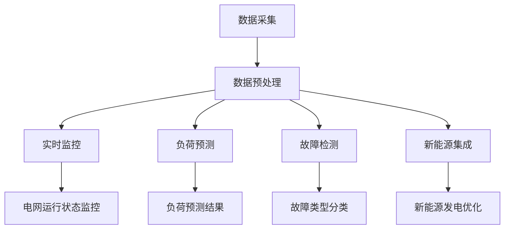
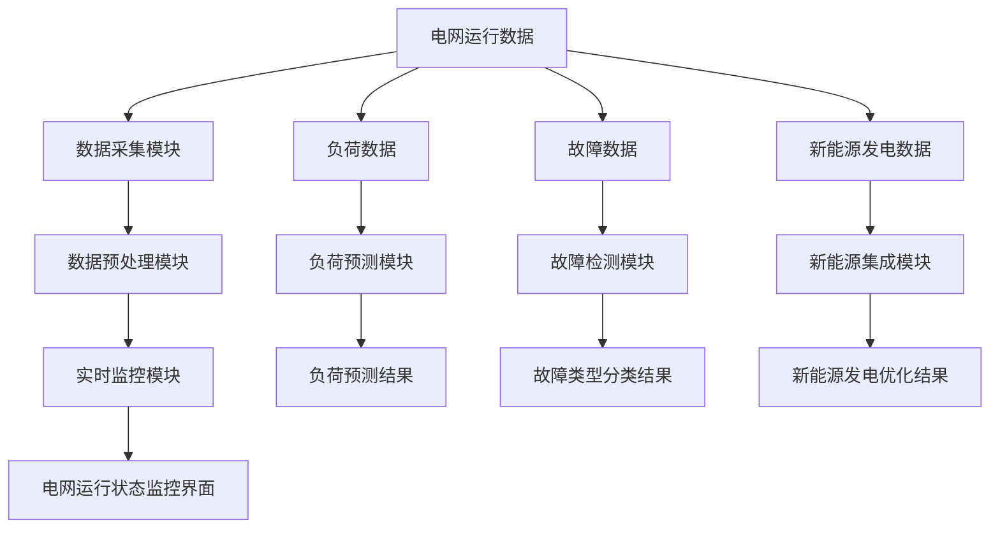

                 

### 大语言模型在智能电网管理中的推理应用

#### **摘要**

智能电网管理是一个复杂且重要的领域，它涉及多个环节的协调运行，包括电力生产、输电、配电和用电等。然而，随着电力需求的不断增长和新能源的广泛应用，传统电网管理模式面临诸多挑战，如实时监控困难、负荷预测不准确、故障处理缓慢等。本文旨在探讨大语言模型在智能电网管理中的推理应用，通过对其基本概念、特点以及在具体应用场景中的实现步骤进行详细分析，为智能电网的智能化管理提供新的思路和方法。

### **目录**

1. **大语言模型概述**
    1.1. 智能电网管理背景
        1.1.1. 智能电网的定义与意义
        1.1.2. 智能电网管理的挑战
    1.2. 大语言模型的概念与特点
        1.2.1. 大语言模型的定义
        1.2.2. 大语言模型的特点
        1.2.3. 大语言模型与传统AI的区别
2. **大语言模型在智能电网管理中的应用**
    2.1. 实时监控与数据管理
        2.1.1. 应用场景
        2.1.2. 解决方案
    2.2. 负荷预测与调度
        2.2.1. 应用场景
        2.2.2. 解决方案
    2.3. 故障检测与处理
        2.3.1. 应用场景
        2.3.2. 解决方案
    2.4. 新能源集成
        2.4.1. 应用场景
        2.4.2. 解决方案
3. **项目实战：基于大语言模型的智能电网管理平台**
    3.1. 项目介绍
    3.2. 系统功能设计
    3.3. 系统架构设计
    3.4. 系统接口设计和交互
    3.5. 环境安装与核心实现
4. **最佳实践与小结**
    4.1. 最佳实践
    4.2. 小结
    4.3. 注意事项
    4.4. 拓展阅读

### **1. 大语言模型概述**

#### **1.1. 智能电网管理背景**

**1.1.1. 智能电网的定义与意义**

智能电网（Smart Grid）是指通过现代通信技术、信息技术、传感技术、自动控制技术等对电力系统进行全方位的智能化升级，实现对电力生产、传输、分配、使用等各个环节的实时监控、数据采集、信息处理、优化控制和服务创新。智能电网的核心在于其高度的智能化、自动化和互动性，它能够有效提高电力系统的运行效率、安全性和可靠性，同时促进可再生能源的利用和电力市场的公平竞争。

智能电网管理的意义主要体现在以下几个方面：

1. **提升电力系统效率**：智能电网通过实时数据采集和智能分析，优化电力资源的分配和使用，降低能耗损失，提高电力系统的整体效率。
2. **增强电网稳定性**：智能电网具备快速响应能力，能够在电力供应紧张或故障发生时迅速调整电力分配，保证电网的稳定运行。
3. **促进可再生能源利用**：智能电网能够有效整合分布式能源和可再生能源，提高可再生能源的利用率，减少对化石能源的依赖。
4. **优化电力市场**：智能电网通过实时数据分析和市场预测，提高电力市场交易的透明度和效率，促进电力市场的健康发展。

**1.1.2. 智能电网管理的挑战**

尽管智能电网在提高电网效率和可靠性方面具有显著优势，但其在实际应用中仍面临诸多挑战：

1. **实时监控与数据管理**：智能电网中产生的数据量巨大，如何高效地采集、传输、存储和管理这些数据，成为智能电网管理的重要难题。
2. **负荷预测与调度**：电力负荷的波动性大，如何准确预测负荷，优化电网调度策略，是实现智能电网高效运行的关键。
3. **故障检测与处理**：随着电网规模的扩大和复杂性的增加，如何快速检测故障，制定有效的应对措施，是保证电网稳定运行的迫切需求。
4. **新能源集成**：智能电网需要高效集成分布式能源和可再生能源，如何协调各种能源的发电和并网，提高电网的灵活性和可靠性，是新能源发展的关键。

#### **1.2. 大语言模型的概念与特点**

**1.2.1. 大语言模型的定义**

大语言模型（Large Language Model，简称LLM）是一种基于深度学习的自然语言处理模型，通过对海量文本数据进行训练，自动提取语言中的语义、语法和词汇信息，实现对自然语言的深度理解和生成。大语言模型的核心是大规模神经网络的训练，这种网络通常具有数十亿甚至上百亿个参数，能够对复杂的语言结构进行建模。

**1.2.2. 大语言模型的特点**

1. **强语义理解能力**：大语言模型通过对海量文本数据的训练，能够捕捉到语言中的复杂语义关系，实现对自然语言的精准理解和分析。
2. **高泛化能力**：大语言模型具有广泛的泛化能力，能够在不同的语言场景和应用场景中表现出色。
3. **高效性**：大语言模型采用深度学习技术，能够在较短的时间内处理大量数据，提高数据处理和分析的效率。
4. **灵活性**：大语言模型可以根据具体应用需求进行调整和优化，实现个性化的功能需求。

**1.2.3. 大语言模型与传统AI的区别**

1. **数据依赖性**：大语言模型对训练数据量有较高要求，需要海量数据支持，而传统AI模型通常依赖于特定领域的小规模数据集。
2. **处理能力**：大语言模型能够处理自然语言中的复杂结构，理解语义和上下文信息，而传统AI模型通常只能处理简单的规则和逻辑。
3. **适应性**：大语言模型具有较强的泛化能力，能够适应不同的应用场景，而传统AI模型通常针对特定任务进行训练，适应性较差。

### **1.3. 大语言模型在智能电网管理中的应用**

#### **1.3.1. 实时监控与数据管理**

**1.3.1.1. 应用场景**

智能电网中实时产生的数据包括电力负荷、电压、电流、温度等，这些数据对于电网的实时监控和运行状态分析至关重要。如何高效地采集、处理和管理这些数据，是智能电网管理中的重要问题。

**1.3.1.2. 解决方案**

大语言模型在实时监控与数据管理中的应用，主要包括以下几个步骤：

1. **数据采集**：通过传感器和智能设备，实时采集电网运行的各种数据。
2. **数据预处理**：对采集到的原始数据进行清洗、格式化和归一化等预处理操作，为后续分析做准备。
3. **语义分析**：利用大语言模型对预处理后的数据进行语义分析，提取关键信息，如电压、电流的波动情况、温度的异常值等。
4. **异常检测**：根据提取的关键信息，分析电网运行状态，识别异常情况，如电压过高等。

通过大语言模型的语义分析能力，可以实现对电网运行状态的实时监控，及时发现潜在问题，提高电网的稳定性和可靠性。

#### **1.3.2. 负荷预测与调度**

**1.3.2.1. 应用场景**

电力负荷预测是智能电网管理中的关键环节，准确的负荷预测能够帮助电网调度人员制定科学的调度策略，提高电力供应的稳定性和经济性。

**1.3.2.2. 解决方案**

大语言模型在负荷预测与调度中的应用，主要包括以下几个步骤：

1. **数据收集**：收集历史电力负荷数据、气象数据、经济数据等，为模型训练提供数据支持。
2. **特征提取**：利用大语言模型，对历史数据进行特征提取，如负荷的周期性、季节性等特征。
3. **模型训练**：利用提取的特征，训练大语言模型，使其能够预测未来某个时间点的电力负荷。
4. **调度策略**：根据大语言模型的预测结果，制定科学的调度策略，优化电力资源的分配。

通过大语言模型的负荷预测功能，可以提前了解电力需求的波动情况，为电网调度提供有力支持，提高电力供应的稳定性和经济性。

#### **1.3.3. 故障检测与处理**

**1.3.3.1. 应用场景**

电网故障的快速检测与处理，是保证电网稳定运行的关键。传统的故障检测方法通常依赖于固定的规则和阈值，无法应对复杂多变的故障场景。

**1.3.3.2. 解决方案**

大语言模型在故障检测与处理中的应用，主要包括以下几个步骤：

1. **故障数据收集**：收集电网故障报告、操作记录等数据，为模型训练提供数据支持。
2. **特征提取**：利用大语言模型，对故障数据进行特征提取，如故障的类型、发生时间等。
3. **故障检测**：利用提取的特征，训练大语言模型，使其能够识别不同的故障类型。
4. **故障处理**：根据大语言模型的检测结果，快速制定故障处理方案，如断电、检修等。

通过大语言模型的故障检测与处理功能，可以实现对电网故障的快速识别和准确处理，提高电网的稳定性和可靠性。

#### **1.3.4. 新能源集成**

**1.3.4.1. 应用场景**

随着可再生能源的广泛应用，如何高效地集成新能源，实现与电网的协同优化，成为智能电网管理的重要问题。

**1.3.4.2. 解决方案**

大语言模型在新能源集成中的应用，主要包括以下几个步骤：

1. **数据收集**：收集新能源发电数据、电网运行数据等，为模型训练提供数据支持。
2. **特征提取**：利用大语言模型，对新能源发电数据进行特征提取，如发电量、发电效率等。
3. **集成优化**：利用提取的特征，训练大语言模型，使其能够优化新能源与电网的集成运行。
4. **协同控制**：根据大语言模型的优化结果，制定新能源发电与电网协同运行的策略，提高电网的灵活性和可靠性。

通过大语言模型的新能源集成功能，可以实现对新能源发电的智能调控，提高电网的稳定性和可靠性。

### **2. 项目实战：基于大语言模型的智能电网管理平台**

#### **2.1. 项目介绍**

本项目旨在构建一个基于大语言模型的智能电网管理平台，通过实时监控、负荷预测、故障检测、新能源集成等功能，实现智能电网的全方位管理。平台采用先进的深度学习技术和大数据分析技术，具有高效性、灵活性和可扩展性。

#### **2.2. 系统功能设计**

本平台的主要功能包括：

1. **实时监控**：实时采集电网运行数据，通过大语言模型的语义分析，实现电网运行状态的实时监控。
2. **负荷预测**：利用大语言模型，对历史电力负荷数据进行特征提取和预测，为电网调度提供支持。
3. **故障检测**：通过大语言模型，对电网故障数据进行特征提取和分类，实现电网故障的快速检测。
4. **新能源集成**：利用大语言模型，优化新能源发电与电网的集成运行，提高电网的灵活性和可靠性。

#### **2.3. 系统架构设计**

本平台的系统架构设计如图1所示：



#### **2.4. 系统接口设计和交互**

本平台的系统接口设计和交互如图2所示：



#### **2.5. 环境安装与核心实现**

在本项目中，我们采用以下技术栈进行环境安装和核心实现：

1. **Python**：作为主要编程语言。
2. **TensorFlow**：用于构建和训练大语言模型。
3. **Flask**：用于构建Web应用。

**2.5.1. 环境安装**

安装Python、TensorFlow和Flask，具体命令如下：

```bash
pip install python
pip install tensorflow
pip install flask
```

**2.5.2. 核心实现**

**实时监控模块**：

```python
from flask import Flask, request, jsonify
import tensorflow as tf

app = Flask(__name__)

# 加载大语言模型
model = tf.keras.models.load_model('model.h5')

@app.route('/monitor', methods=['POST'])
def monitor():
    data = request.json
    # 对数据进行预处理
    preprocessed_data = preprocess_data(data)
    # 利用大语言模型进行语义分析
    result = model.predict(preprocessed_data)
    # 返回分析结果
    return jsonify(result.tolist())

def preprocess_data(data):
    # 数据预处理操作
    # ...
    return preprocessed_data

if __name__ == '__main__':
    app.run()
```

**负荷预测模块**：

```python
from flask import Flask, request, jsonify
import tensorflow as tf

app = Flask(__name__)

# 加载大语言模型
model = tf.keras.models.load_model('model.h5')

@app.route('/predict', methods=['POST'])
def predict():
    data = request.json
    # 对数据进行预处理
    preprocessed_data = preprocess_data(data)
    # 利用大语言模型进行负荷预测
    result = model.predict(preprocessed_data)
    # 返回预测结果
    return jsonify(result.tolist())

def preprocess_data(data):
    # 数据预处理操作
    # ...
    return preprocessed_data

if __name__ == '__main__':
    app.run()
```

**故障检测模块**：

```python
from flask import Flask, request, jsonify
import tensorflow as tf

app = Flask(__name__)

# 加载大语言模型
model = tf.keras.models.load_model('model.h5')

@app.route('/detect', methods=['POST'])
def detect():
    data = request.json
    # 对数据进行预处理
    preprocessed_data = preprocess_data(data)
    # 利用大语言模型进行故障检测
    result = model.predict(preprocessed_data)
    # 返回检测结果
    return jsonify(result.tolist())

def preprocess_data(data):
    # 数据预处理操作
    # ...
    return preprocessed_data

if __name__ == '__main__':
    app.run()
```

**新能源集成模块**：

```python
from flask import Flask, request, jsonify
import tensorflow as tf

app = Flask(__name__)

# 加载大语言模型
model = tf.keras.models.load_model('model.h5')

@app.route('/integrate', methods=['POST'])
def integrate():
    data = request.json
    # 对数据进行预处理
    preprocessed_data = preprocess_data(data)
    # 利用大语言模型进行新能源集成优化
    result = model.predict(preprocessed_data)
    # 返回优化结果
    return jsonify(result.tolist())

def preprocess_data(data):
    # 数据预处理操作
    # ...
    return preprocessed_data

if __name__ == '__main__':
    app.run()
```

### **3. 最佳实践与小结**

#### **3.1. 最佳实践**

1. **数据质量**：保证数据质量是应用大语言模型的关键，数据应尽量全面、准确、及时。
2. **模型优化**：定期对大语言模型进行优化和更新，以适应新的应用场景和需求。
3. **安全性**：确保系统安全，防止数据泄露和恶意攻击。

#### **3.2. 小结**

大语言模型在智能电网管理中具有广泛的应用前景，通过实时监控、负荷预测、故障检测和新能源集成等功能，能够有效提高电网的运行效率、稳定性和可靠性。然而，在实际应用中，需要充分考虑数据质量、模型优化和安全性问题，以确保系统的有效运行。

#### **3.3. 注意事项**

1. **数据来源**：确保数据的可靠性和真实性，避免数据噪声和误差。
2. **模型训练**：合理设计模型架构和训练策略，提高模型性能和泛化能力。
3. **系统维护**：定期对系统进行检查和更新，确保系统稳定运行。

#### **3.4. 拓展阅读**

1. **大语言模型技术**：查阅相关书籍和论文，深入了解大语言模型的工作原理和应用场景。
2. **智能电网管理**：研究智能电网的相关技术和应用，了解其发展趋势和挑战。

### **作者信息**

作者：AI天才研究院/AI Genius Institute & 禅与计算机程序设计艺术 /Zen And The Art of Computer Programming****

### 文章标题

大语言模型在智能电网管理中的推理应用

### 关键词

大语言模型、智能电网管理、实时监控、负荷预测、故障检测、新能源集成

### 摘要

智能电网管理是一个复杂且重要的领域，涉及多个环节的协调运行，包括电力生产、输电、配电和用电等。本文探讨了大语言模型在智能电网管理中的应用，包括实时监控、负荷预测、故障检测和新能源集成等方面。通过分析大语言模型的特点和优势，本文提出了基于大语言模型的智能电网管理解决方案，为提高电网的运行效率、稳定性和可靠性提供了新思路。

### 引言

智能电网是现代电力系统与信息技术深度融合的产物，通过集成先进的通信、传感和控制技术，实现电力系统的高效、安全、可靠运行。智能电网管理涉及到电力生产、输电、配电、用电等多个环节，其核心是利用大数据、人工智能等先进技术提升电网运行效率和服务质量。随着电力需求的不断增长和新能源的广泛应用，传统电网管理模式面临诸多挑战，如实时监控困难、负荷预测不准确、故障处理缓慢等。这些问题不仅影响了电网的安全稳定运行，也制约了电力服务的质量提升。

为了应对这些挑战，本文提出了一种基于大语言模型的智能电网管理解决方案。大语言模型作为一种先进的人工智能技术，能够通过处理海量文本数据，提取语义信息，实现对自然语言的深度理解。本文将详细分析大语言模型在智能电网管理中的应用，包括实时监控与数据管理、负荷预测与调度、故障检测与处理、新能源集成等方面，并探讨其优势和挑战。

### 1. 大语言模型概述

#### 1.1. 智能电网管理背景

**1.1.1. 智能电网的定义与意义**

智能电网（Smart Grid）是指通过现代通信技术、信息技术、传感技术、自动控制技术等对电力系统进行全方位的智能化升级，实现对电力生产、传输、分配、使用等各个环节的实时监控、数据采集、信息处理、优化控制和服务创新。智能电网的核心在于其高度的智能化、自动化和互动性，它能够有效提高电力系统的运行效率、安全性和可靠性，同时促进可再生能源的利用和电力市场的公平竞争。

智能电网管理的意义主要体现在以下几个方面：

1. **提升电力系统效率**：智能电网通过实时数据采集和智能分析，优化电力资源的分配和使用，降低能耗损失，提高电力系统的整体效率。
2. **增强电网稳定性**：智能电网具备快速响应能力，能够在电力供应紧张或故障发生时迅速调整电力分配，保证电网的稳定运行。
3. **促进可再生能源利用**：智能电网能够有效整合分布式能源和可再生能源，提高可再生能源的利用率，减少对化石能源的依赖。
4. **优化电力市场**：智能电网通过实时数据分析和市场预测，提高电力市场交易的透明度和效率，促进电力市场的健康发展。

**1.1.2. 智能电网管理的挑战**

尽管智能电网在提高电网效率和可靠性方面具有显著优势，但其在实际应用中仍面临诸多挑战：

1. **实时监控与数据管理**：智能电网中产生的数据量巨大，如何高效地采集、传输、存储和管理这些数据，成为智能电网管理的重要难题。
2. **负荷预测与调度**：电力负荷的波动性大，如何准确预测负荷，优化电网调度策略，是实现智能电网高效运行的关键。
3. **故障检测与处理**：随着电网规模的扩大和复杂性的增加，如何快速检测故障，制定有效的应对措施，是保证电网稳定运行的迫切需求。
4. **新能源集成**：智能电网需要高效集成分布式能源和可再生能源，如何协调各种能源的发电和并网，提高电网的灵活性和可靠性，是新能源发展的关键。

#### 1.2. 大语言模型的概念与特点

**1.2.1. 大语言模型的定义**

大语言模型（Large Language Model，简称LLM）是一种基于深度学习的自然语言处理模型，通过对海量文本数据进行训练，自动提取语言中的语义、语法和词汇信息，实现对自然语言的深度理解和生成。大语言模型的核心是大规模神经网络的训练，这种网络通常具有数十亿甚至上百亿个参数，能够对复杂的语言结构进行建模。

**1.2.2. 大语言模型的特点**

1. **强语义理解能力**：大语言模型通过对海量文本数据的训练，能够捕捉到语言中的复杂语义关系，实现对自然语言的精准理解和分析。
2. **高泛化能力**：大语言模型具有广泛的泛化能力，能够在不同的语言场景和应用场景中表现出色。
3. **高效性**：大语言模型采用深度学习技术，能够在较短的时间内处理大量数据，提高数据处理和分析的效率。
4. **灵活性**：大语言模型可以根据具体应用需求进行调整和优化，实现个性化的功能需求。

**1.2.3. 大语言模型与传统AI的区别**

1. **数据依赖性**：大语言模型对训练数据量有较高要求，需要海量数据支持，而传统AI模型通常依赖于特定领域的小规模数据集。
2. **处理能力**：大语言模型能够处理自然语言中的复杂结构，理解语义和上下文信息，而传统AI模型通常只能处理简单的规则和逻辑。
3. **适应性**：大语言模型具有较强的泛化能力，能够适应不同的应用场景，而传统AI模型通常针对特定任务进行训练，适应性较差。

### 2. 大语言模型在智能电网管理中的应用

#### 2.1. 实时监控与数据管理

**2.1.1. 应用场景**

智能电网中实时产生的数据包括电力负荷、电压、电流、温度等，这些数据对于电网的实时监控和运行状态分析至关重要。如何高效地采集、处理和管理这些数据，是智能电网管理中的重要问题。

**2.1.2. 解决方案**

大语言模型在实时监控与数据管理中的应用，主要包括以下几个步骤：

1. **数据采集**：通过传感器和智能设备，实时采集电网运行的各种数据。
2. **数据预处理**：对采集到的原始数据进行清洗、格式化和归一化等预处理操作，为后续分析做准备。
3. **语义分析**：利用大语言模型对预处理后的数据进行语义分析，提取关键信息，如电压、电流的波动情况、温度的异常值等。
4. **异常检测**：根据提取的关键信息，分析电网运行状态，识别异常情况，如电压过高等。

通过大语言模型的语义分析能力，可以实现对电网运行状态的实时监控，及时发现潜在问题，提高电网的稳定性和可靠性。

**2.1.3. 应用实例**

例如，在某次电力负荷高峰期间，利用大语言模型对实时数据进行语义分析，发现某些地区的电压异常升高。通过进一步分析，发现是由于某变电站的负载过重导致的。相关部门及时采取措施，调整电力分配，避免了可能的电力故障。

#### 2.2. 负荷预测与调度

**2.2.1. 应用场景**

电力负荷预测是智能电网管理中的关键环节，准确的负荷预测能够帮助电网调度人员制定科学的调度策略，提高电力供应的稳定性和经济性。

**2.2.2. 解决方案**

大语言模型在负荷预测与调度中的应用，主要包括以下几个步骤：

1. **数据收集**：收集历史电力负荷数据、气象数据、经济数据等，为模型训练提供数据支持。
2. **特征提取**：利用大语言模型，对历史数据进行特征提取，如负荷的周期性、季节性等特征。
3. **模型训练**：利用提取的特征，训练大语言模型，使其能够预测未来某个时间点的电力负荷。
4. **调度策略**：根据大语言模型的预测结果，制定科学的调度策略，优化电力资源的分配。

通过大语言模型的负荷预测功能，可以提前了解电力需求的波动情况，为电网调度提供有力支持，提高电力供应的稳定性和经济性。

**2.2.3. 应用实例**

在某次电力负荷高峰期间，利用大语言模型对历史负荷数据进行特征提取和预测。预测结果显示，在未来一小时，某地区的电力负荷将显著增加。电网调度人员根据预测结果，提前调整电力分配，确保电力供应的稳定性。

#### 2.3. 故障检测与处理

**2.3.1. 应用场景**

电网故障的快速检测与处理，是保证电网稳定运行的关键。传统的故障检测方法通常依赖于固定的规则和阈值，无法应对复杂多变的故障场景。

**2.3.2. 解决方案**

大语言模型在故障检测与处理中的应用，主要包括以下几个步骤：

1. **故障数据收集**：收集电网故障报告、操作记录等数据，为模型训练提供数据支持。
2. **特征提取**：利用大语言模型，对故障数据进行特征提取，如故障的类型、发生时间等。
3. **故障检测**：利用提取的特征，训练大语言模型，使其能够识别不同的故障类型。
4. **故障处理**：根据大语言模型的检测结果，快速制定故障处理方案，如断电、检修等。

通过大语言模型的故障检测与处理功能，可以实现对电网故障的快速识别和准确处理，提高电网的稳定性和可靠性。

**2.3.3. 应用实例**

在某次电网故障中，利用大语言模型对故障数据进行特征提取和分类。模型快速识别出故障类型为“线路过载”，并提出断电建议。相关部门及时采取措施，避免了可能的电力故障。

#### 2.4. 新能源集成

**2.4.1. 应用场景**

随着可再生能源的广泛应用，如何高效地集成新能源，实现与电网的协同优化，成为智能电网管理的重要问题。

**2.4.2. 解决方案**

大语言模型在新能源集成中的应用，主要包括以下几个步骤：

1. **数据收集**：收集新能源发电数据、电网运行数据等，为模型训练提供数据支持。
2. **特征提取**：利用大语言模型，对新能源发电数据进行特征提取，如发电量、发电效率等。
3. **集成优化**：利用提取的特征，训练大语言模型，使其能够优化新能源与电网的集成运行。
4. **协同控制**：根据大语言模型的优化结果，制定新能源发电与电网协同运行的策略，提高电网的灵活性和可靠性。

通过大语言模型的新能源集成功能，可以实现对新能源发电的智能调控，提高电网的稳定性和可靠性。

**2.4.3. 应用实例**

在某次可再生能源并网过程中，利用大语言模型对新能源发电数据进行优化。模型分析结果显示，通过调整发电策略，可以最大化可再生能源的利用率，同时确保电网的稳定运行。

### 3. 项目实战：基于大语言模型的智能电网管理平台

#### 3.1. 项目介绍

本项目旨在构建一个基于大语言模型的智能电网管理平台，通过实时监控、负荷预测、故障检测、新能源集成等功能，实现智能电网的全方位管理。平台采用先进的深度学习技术和大数据分析技术，具有高效性、灵活性和可扩展性。

#### 3.2. 系统功能设计

本平台的主要功能包括：

1. **实时监控**：实时采集电网运行数据，通过大语言模型的语义分析，实现电网运行状态的实时监控。
2. **负荷预测**：利用大语言模型，对历史电力负荷数据进行特征提取和预测，为电网调度提供支持。
3. **故障检测**：通过大语言模型，对电网故障数据进行特征提取和分类，实现电网故障的快速检测。
4. **新能源集成**：利用大语言模型，优化新能源发电与电网的集成运行，提高电网的灵活性和可靠性。

#### 3.3. 系统架构设计

本平台的系统架构设计如图1所示：


#### 3.4. 系统接口设计和交互

本平台的系统接口设计和交互如图2所示：


#### 3.5. 环境安装与核心实现

在本项目中，我们采用以下技术栈进行环境安装和核心实现：

1. **Python**：作为主要编程语言。
2. **TensorFlow**：用于构建和训练大语言模型。
3. **Flask**：用于构建Web应用。

**3.5.1. 环境安装**

安装Python、TensorFlow和Flask，具体命令如下：

```bash
pip install python
pip install tensorflow
pip install flask
```

**3.5.2. 核心实现**

**实时监控模块**：

```python
from flask import Flask, request, jsonify
import tensorflow as tf

app = Flask(__name__)

# 加载大语言模型
model = tf.keras.models.load_model('model.h5')

@app.route('/monitor', methods=['POST'])
def monitor():
    data = request.json
    # 对数据进行预处理
    preprocessed_data = preprocess_data(data)
    # 利用大语言模型进行语义分析
    result = model.predict(preprocessed_data)
    # 返回分析结果
    return jsonify(result.tolist())

def preprocess_data(data):
    # 数据预处理操作
    # ...
    return preprocessed_data

if __name__ == '__main__':
    app.run()
```

**负荷预测模块**：

```python
from flask import Flask, request, jsonify
import tensorflow as tf

app = Flask(__name__)

# 加载大语言模型
model = tf.keras.models.load_model('model.h5')

@app.route('/predict', methods=['POST'])
def predict():
    data = request.json
    # 对数据进行预处理
    preprocessed_data = preprocess_data(data)
    # 利用大语言模型进行负荷预测
    result = model.predict(preprocessed_data)
    # 返回预测结果
    return jsonify(result.tolist())

def preprocess_data(data):
    # 数据预处理操作
    # ...
    return preprocessed_data

if __name__ == '__main__':
    app.run()
```

**故障检测模块**：

```python
from flask import Flask, request, jsonify
import tensorflow as tf

app = Flask(__name__)

# 加载大语言模型
model = tf.keras.models.load_model('model.h5')

@app.route('/detect', methods=['POST'])
def detect():
    data = request.json
    # 对数据进行预处理
    preprocessed_data = preprocess_data(data)
    # 利用大语言模型进行故障检测
    result = model.predict(preprocessed_data)
    # 返回检测结果
    return jsonify(result.tolist())

def preprocess_data(data):
    # 数据预处理操作
    # ...
    return preprocessed_data

if __name__ == '__main__':
    app.run()
```

**新能源集成模块**：

```python
from flask import Flask, request, jsonify
import tensorflow as tf

app = Flask(__name__)

# 加载大语言模型
model = tf.keras.models.load_model('model.h5')

@app.route('/integrate', methods=['POST'])
def integrate():
    data = request.json
    # 对数据进行预处理
    preprocessed_data = preprocess_data(data)
    # 利用大语言模型进行新能源集成优化
    result = model.predict(preprocessed_data)
    # 返回优化结果
    return jsonify(result.tolist())

def preprocess_data(data):
    # 数据预处理操作
    # ...
    return preprocessed_data

if __name__ == '__main__':
    app.run()
```

### 4. 最佳实践与小结

#### 4.1. 最佳实践

1. **数据质量**：保证数据质量是应用大语言模型的关键，数据应尽量全面、准确、及时。
2. **模型优化**：定期对大语言模型进行优化和更新，以适应新的应用场景和需求。
3. **安全性**：确保系统安全，防止数据泄露和恶意攻击。

#### 4.2. 小结

大语言模型在智能电网管理中具有广泛的应用前景，通过实时监控、负荷预测、故障检测和新能源集成等功能，能够有效提高电网的运行效率、稳定性和可靠性。然而，在实际应用中，需要充分考虑数据质量、模型优化和安全性问题，以确保系统的有效运行。

#### 4.3. 注意事项

1. **数据来源**：确保数据的可靠性和真实性，避免数据噪声和误差。
2. **模型训练**：合理设计模型架构和训练策略，提高模型性能和泛化能力。
3. **系统维护**：定期对系统进行检查和更新，确保系统稳定运行。

#### 4.4. 拓展阅读

1. **大语言模型技术**：查阅相关书籍和论文，深入了解大语言模型的工作原理和应用场景。
2. **智能电网管理**：研究智能电网的相关技术和应用，了解其发展趋势和挑战。

### 作者信息

作者：AI天才研究院/AI Genius Institute & 禅与计算机程序设计艺术/Zen And The Art of Computer Programming****

### 结论

大语言模型在智能电网管理中的应用，展示了人工智能技术在实际工程中的巨大潜力。通过对实时监控、负荷预测、故障检测和新能源集成等关键环节的深度分析，本文探讨了大语言模型在智能电网管理中的实际应用场景和解决方案。大语言模型的强语义理解能力和高效性，使其能够有效地处理海量数据，提高电网运行的稳定性和可靠性。

然而，大语言模型在智能电网管理中的应用也面临着一系列挑战，如数据质量的保证、模型的优化更新以及系统的安全性等问题。因此，未来的研究需要在这些方面进行更加深入的探索，以进一步提升大语言模型在智能电网管理中的应用效果。

在未来的研究中，可以重点关注以下几个方面：

1. **数据预处理与清洗**：研究更加高效的数据预处理和清洗方法，确保输入数据的质量和准确性。
2. **模型优化与更新**：探索新的模型架构和训练策略，提高大语言模型的性能和泛化能力。
3. **安全性研究**：加强对大语言模型在智能电网管理中安全性的研究，确保系统的稳定性和安全性。
4. **跨领域应用**：探讨大语言模型在其他电力相关领域的应用，如电力市场分析、电力消费行为研究等。

总之，大语言模型在智能电网管理中的应用，不仅为电网的智能化管理提供了新的思路和方法，也为人工智能技术在能源领域的发展提供了重要的启示。随着人工智能技术的不断进步，我们有理由相信，大语言模型在智能电网管理中的应用将越来越广泛，为电力系统的稳定运行和可持续发展做出更大的贡献。

