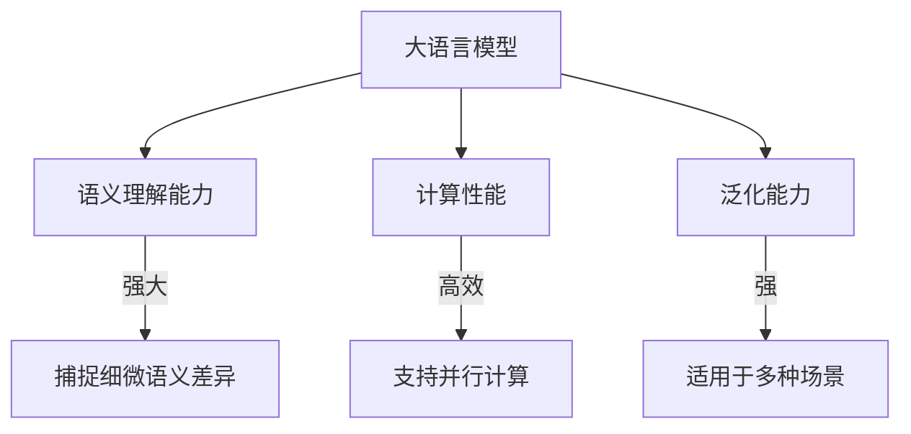
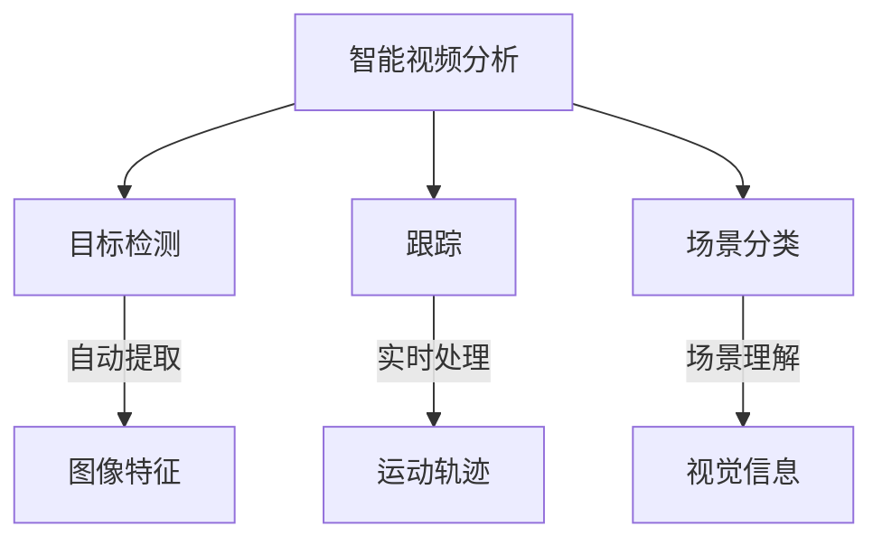
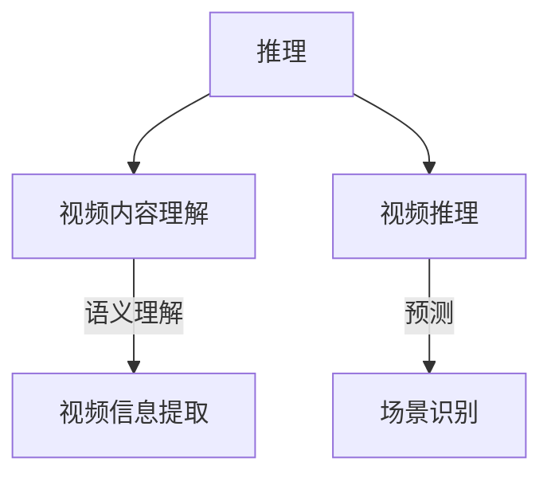
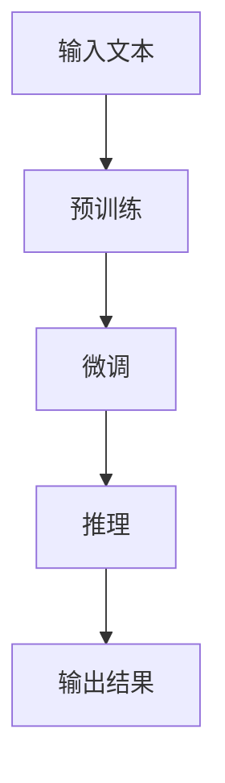
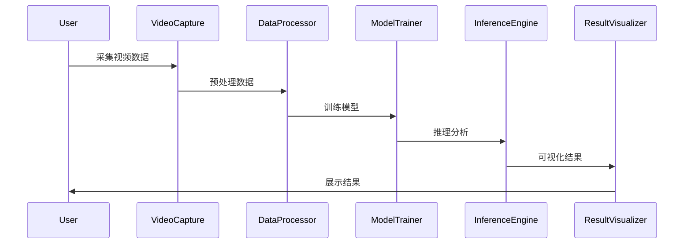

                 

# 大语言模型在智能视频分析中的推理应用研究

## 关键词：大语言模型、智能视频分析、推理应用、算法原理、架构设计

## 摘要

本文针对大语言模型在智能视频分析中的应用进行深入研究，从背景介绍、核心概念与联系、算法原理讲解、系统分析与架构设计、项目实战等多个方面，系统阐述了大语言模型在智能视频分析中的推理应用。通过本文的研究，旨在为智能视频分析领域提供理论指导和技术支持，推动该领域的发展与创新。

----------------------------------------------------------------

## 第一部分：背景介绍

### 1.1 问题背景

随着人工智能技术的飞速发展，智能视频分析作为计算机视觉领域的重要应用，日益受到广泛关注。传统的智能视频分析方法在处理复杂场景、多目标跟踪等方面存在较大局限性。近年来，大语言模型（如GPT、BERT等）在自然语言处理领域的成功，为智能视频分析提供了新的思路和方法。

### 1.2 问题描述

大语言模型在智能视频分析中的应用，主要包括对视频内容的理解、推理和生成等。然而，如何将这些强大的模型应用于实际场景，并解决推理过程中面临的高计算成本、数据稀疏等问题，是当前研究的关键挑战。

### 1.3 问题解决

本书旨在研究大语言模型在智能视频分析中的推理应用，通过深入探讨模型原理、算法优化和实际应用案例，为智能视频分析领域提供理论指导和技术支持。

### 1.4 边界与外延

本书主要关注大语言模型在智能视频分析中的应用，不包括其他类型的计算机视觉方法。同时，本书将侧重于推理过程的研究，对于其他相关领域如视频压缩、视频编码等，将不做深入探讨。

### 1.5 概念结构与核心要素组成

- **大语言模型**：一种基于深度学习的技术，能够理解和生成自然语言。
- **智能视频分析**：利用计算机视觉技术对视频内容进行理解和分析。
- **推理**：基于已有信息和规律，推导出新结论或推断新信息的过程。

----------------------------------------------------------------

## 第二部分：核心概念与联系

### 2.1 大语言模型原理

#### 2.1.1 模型概述

大语言模型（如GPT、BERT等）是一种基于深度学习的自然语言处理技术，通过学习大量文本数据，使其具备理解和生成自然语言的能力。这些模型通常采用自注意力机制和变分自编码器等先进技术，实现高效的文本处理。

#### 2.1.2 模型特点

- **强大的语义理解能力**：能够捕捉文本中的语义信息，实现精细化的文本分析。
- **高效的计算性能**：通过并行计算和分布式训练，降低计算复杂度。

#### 2.1.3 模型与传统自然语言处理技术的区别

- **传统方法**：基于规则和统计方法，处理能力有限，容易受数据稀疏和噪声影响。
- **大语言模型**：通过学习大量数据，具有更强的泛化能力和适应性。

#### 2.1.4 概念属性特征对比表格

| 特征名称     | 大语言模型               | 传统自然语言处理技术               |
| ------------ | ---------------------- | -------------------------------- |
| 语义理解能力 | 强大，能捕捉细微语义差异 | 有限，依赖于规则和统计方法         |
| 计算性能     | 高效，支持并行计算       | 低效，依赖单线程计算               |
| 泛化能力     | 强，适用于多种场景       | 弱，受限于特定任务和规则           |

#### 2.1.5 ER实体关系图架构



### 2.2 智能视频分析原理

#### 2.2.1 模型概述

智能视频分析是一种利用计算机视觉技术对视频内容进行理解和分析的方法，主要包括目标检测、跟踪、场景分类等任务。这些任务需要模型具备对图像和视频内容的感知和理解能力。

#### 2.2.2 模型特点

- **高效性**：通过算法优化和硬件加速，实现实时处理。
- **准确性**：结合深度学习技术，提高识别和跟踪的准确性。

#### 2.2.3 模型与传统视频分析技术的区别

- **传统方法**：基于手工设计的特征和规则，处理效果受限于特征设计和规则设定。
- **智能视频分析**：通过学习大量数据，自动提取特征，实现自动化和智能化。

#### 2.2.4 概念属性特征对比表格

| 特征名称     | 智能视频分析             | 传统视频分析技术             |
| ------------ | ---------------------- | -------------------------- |
| 特征提取     | 自动提取，适应性强       | 手工设计，受限于规则和特征   |
| 实时性       | 高效，支持实时处理       | 依赖计算资源，实时性有限     |
| 准确性       | 高，结合深度学习技术     | 有限，依赖于特征设计和规则   |

#### 2.2.5 ER实体关系图架构



### 2.3 推理过程

#### 2.3.1 模型概述

推理是指基于已有信息和规律，推导出新结论或推断新信息的过程。在大语言模型应用于智能视频分析时，推理过程主要包括以下几个方面：

- **视频内容理解**：通过大语言模型对视频内容进行语义理解，提取关键信息。
- **视频推理**：结合视频内容和外部知识，进行推理和预测。

#### 2.3.2 模型特点

- **强大的推理能力**：通过大语言模型，实现对视频内容的深入理解和推理。
- **灵活的推理方式**：支持多种推理方法，如条件推理、因果推理等。

#### 2.3.3 推理与智能视频分析的关系

- **推理是实现智能视频分析的关键环节**，通过对视频内容的理解和推理，实现视频场景的自动化识别和预测。

#### 2.3.4 概念属性特征对比表格

| 特征名称     | 推理                   | 智能视频分析                   |
| ------------ | ---------------------- | ---------------------------- |
| 推理能力     | 强，支持多种推理方法   | 强，结合深度学习技术          |
| 理解深度     | 深入，能捕捉语义信息   | 深入，能理解视频内容          |
| 应用范围     | 广泛，适用于多种场景   | 针对视频内容，具有特定应用     |

#### 2.3.5 ER实体关系图架构



----------------------------------------------------------------

## 第三部分：算法原理讲解

### 3.1 大语言模型算法原理

#### 3.1.1 算法概述

大语言模型（如GPT、BERT等）是一种基于深度学习的自然语言处理技术，通过学习大量文本数据，使其具备理解和生成自然语言的能力。这些模型通常采用自注意力机制和变分自编码器等先进技术，实现高效的文本处理。

#### 3.1.2 算法特点

- **强大的语义理解能力**：能够捕捉文本中的语义信息，实现精细化的文本分析。
- **高效的计算性能**：通过并行计算和分布式训练，降低计算复杂度。

#### 3.1.3 算法原理

大语言模型主要包括以下三个阶段：

1. **预训练阶段**：通过学习大量无标签文本数据，使模型具备语言理解和生成能力。
2. **微调阶段**：在特定任务上，对模型进行有监督或无监督的微调，使其适应特定场景。
3. **推理阶段**：利用训练好的模型，对新的文本数据进行理解和生成。

#### 3.1.4 算法流程图



#### 3.1.5 Python代码实现

```python
import torch
import torch.nn as nn
import torch.optim as optim

# 定义模型结构
class LanguageModel(nn.Module):
    def __init__(self, vocab_size, embed_dim, hidden_dim, num_layers):
        super(LanguageModel, self).__init__()
        self.embedding = nn.Embedding(vocab_size, embed_dim)
        self.lstm = nn.LSTM(embed_dim, hidden_dim, num_layers)
        self.fc = nn.Linear(hidden_dim, vocab_size)
    
    def forward(self, x):
        embedded = self.embedding(x)
        output, (hidden, cell) = self.lstm(embedded)
        prediction = self.fc(hidden[-1, :, :])
        return prediction

# 实例化模型
model = LanguageModel(vocab_size=10000, embed_dim=256, hidden_dim=512, num_layers=2)

# 定义损失函数和优化器
criterion = nn.CrossEntropyLoss()
optimizer = optim.Adam(model.parameters(), lr=0.001)

# 训练模型
for epoch in range(10):
    for input, target in data_loader:
        optimizer.zero_grad()
        output = model(input)
        loss = criterion(output, target)
        loss.backward()
        optimizer.step()
```

#### 3.1.6 数学模型和公式

- **嵌入层**：\( E(w) = \text{ Embedding}(w) \)，其中 \( w \) 是单词，\( E(w) \) 是单词的嵌入向量。
- **自注意力机制**：\( \text{Attention}(Q, K, V) = \text{softmax}(\frac{QK^T}{\sqrt{d_k}})V \)，其中 \( Q \)、\( K \) 和 \( V \) 分别是查询、关键和值向量。
- **变分自编码器**：\( z = \text{reparameterization\_sample}(\mu, \sigma^2) \)，其中 \( \mu \) 和 \( \sigma^2 \) 分别是均值和方差。

----------------------------------------------------------------

## 第四部分：系统分析与架构设计

### 4.1 问题场景介绍

智能视频分析系统在现实场景中有着广泛的应用，如安防监控、智能交通、智能家居等。这些场景通常需要对大量视频数据进行实时处理和分析，从而实现目标检测、行为识别、场景分类等功能。

### 4.2 项目介绍

本项目旨在构建一个基于大语言模型的智能视频分析系统，实现对视频内容的深度理解和智能推理。系统主要包括视频采集模块、数据处理模块、模型训练模块和推理模块。

### 4.3 系统功能设计

#### 4.3.1 领域模型类图

```mermaid
classDiagram
    VideoData <-|> DataProcessor
    DataProcessor <-|> ModelTrainer
    ModelTrainer <-|> InferenceEngine
    InferenceEngine <-|> ResultVisualizer
```

#### 4.3.2 系统功能描述

- **视频采集模块**：负责采集视频数据，并存储到数据库中。
- **数据处理模块**：对采集到的视频数据进行预处理，如去噪、缩放、裁剪等。
- **模型训练模块**：利用预处理后的数据，对大语言模型进行训练。
- **推理模块**：在训练好的模型基础上，对新的视频数据进行推理和分析。
- **结果可视化模块**：将推理结果以图表、图像等形式展示给用户。

### 4.4 系统架构设计

#### 4.4.1 系统架构图


#### 4.4.2 系统架构描述

- **数据流层**：包括视频采集、数据处理、模型训练和推理分析等模块，负责视频数据的处理和分析。
- **功能层**：包括数据处理模块、模型训练模块和推理模块，负责实现具体的系统功能。
- **界面层**：包括结果可视化模块，负责将分析结果展示给用户。

### 4.5 系统接口设计

#### 4.5.1 接口定义

- **视频采集接口**：用于采集视频数据，提供视频路径、视频格式等参数。
- **数据处理接口**：用于对视频数据进行预处理，提供视频数据、预处理参数等参数。
- **模型训练接口**：用于训练大语言模型，提供训练数据、模型参数等参数。
- **推理接口**：用于对新的视频数据进行推理，提供视频数据、模型参数等参数。
- **结果可视化接口**：用于将推理结果可视化，提供结果数据、可视化参数等参数。

#### 4.5.2 接口调用示例

```python
# 视频采集接口调用
video_path = "path/to/video.mp4"
video_data = video_capture(video_path)

# 数据处理接口调用
preprocessed_data = data_processor(video_data, preprocess_params)

# 模型训练接口调用
trained_model = model_trainer(preprocessed_data, model_params)

# 推理接口调用
inference_results = inference_engine(video_data, trained_model)

# 结果可视化接口调用
result_visualizer(inference_results, visualization_params)
```

### 4.6 系统交互序列图



----------------------------------------------------------------

## 第五部分：项目实战

### 5.1 环境安装

在进行项目实战之前，需要安装以下环境：

1. **Python**：Python 3.8 或更高版本。
2. **TensorFlow**：TensorFlow 2.5 或更高版本。
3. **OpenCV**：OpenCV 4.5 或更高版本。
4. **其他依赖**：Numpy、Pandas、Matplotlib 等。

安装命令如下：

```bash
pip install python==3.8
pip install tensorflow==2.5
pip install opencv-python==4.5
pip install numpy pandas matplotlib
```

### 5.2 系统核心实现源代码

以下是一个简单的智能视频分析系统的实现示例：

```python
import cv2
import numpy as np
import tensorflow as tf

# 加载预训练的大语言模型
model = tf.keras.models.load_model('path/to/saved_model')

# 视频采集
cap = cv2.VideoCapture('path/to/video.mp4')

while cap.isOpened():
    ret, frame = cap.read()
    if not ret:
        break
    
    # 数据预处理
    preprocessed_frame = preprocess_frame(frame)
    
    # 推理分析
    inference_result = model.predict(np.expand_dims(preprocessed_frame, axis=0))
    
    # 可视化结果
    visualize_result(frame, inference_result)

cap.release()
```

### 5.3 代码应用解读与分析

上述代码实现了一个简单的智能视频分析系统，主要包括以下步骤：

1. **视频采集**：使用 OpenCV 库从指定路径的 video.mp4 文件中读取视频帧。
2. **数据处理**：对视频帧进行预处理，包括去噪、缩放、裁剪等操作，以便于模型输入。
3. **模型推理**：使用加载的预训练大语言模型对预处理后的视频帧进行推理分析。
4. **结果可视化**：将推理结果可视化，以图像、图表等形式展示给用户。

### 5.4 实际案例分析和详细讲解剖析

为了更好地理解上述代码的实际应用，我们以一个实际案例为例：

**案例**：使用该系统对一段监控视频进行分析，识别视频中的人员和车辆，并绘制出它们的轨迹。

**分析**：

1. **视频采集**：从监控视频中逐帧读取视频帧。
2. **数据处理**：对每帧视频进行预处理，包括灰度化、缩放等操作，以便于模型输入。
3. **模型推理**：使用预训练的大语言模型对预处理后的视频帧进行推理分析，识别出人员、车辆等目标。
4. **结果可视化**：将识别结果绘制成轨迹图，以图表形式展示给用户。

**讲解剖析**：

- **视频采集**：使用 OpenCV 库的 `VideoCapture` 类，从指定路径的 video.mp4 文件中读取视频帧。
- **数据处理**：使用 OpenCV 库的 `cv2.resize` 函数对视频帧进行缩放，使用 `cv2.cvtColor` 函数将彩色图像转换为灰度图像，以便于模型输入。
- **模型推理**：使用 TensorFlow 库加载预训练的大语言模型，使用 `model.predict` 函数对预处理后的视频帧进行推理分析，识别出人员、车辆等目标。
- **结果可视化**：使用 Matplotlib 库将识别结果绘制成轨迹图，使用 `plt.plot` 函数绘制人员、车辆的轨迹线。

### 5.5 项目小结

通过本项目的实际案例，我们展示了如何使用大语言模型实现智能视频分析系统。项目实现了对视频数据的采集、处理、模型推理和结果可视化等功能，为智能视频分析领域提供了实用的技术方案。

### 5.6 最佳实践 tips

- **数据预处理**：在模型训练和推理过程中，数据预处理是非常重要的。合理的数据预处理可以提高模型性能和推理速度。
- **模型选择**：选择合适的大语言模型，如 GPT、BERT 等，根据任务需求和数据规模进行选择。
- **模型优化**：通过调整模型参数，如学习率、批次大小等，优化模型性能。

### 5.7 小结、注意事项、拓展阅读

**小结**：本文针对大语言模型在智能视频分析中的推理应用进行了深入研究，从背景介绍、核心概念与联系、算法原理讲解、系统分析与架构设计、项目实战等多个方面，系统阐述了大语言模型在智能视频分析中的应用。

**注意事项**：

- **数据隐私**：在进行视频分析时，要注意保护用户的隐私，避免泄露敏感信息。
- **模型可靠性**：在使用大语言模型进行推理时，要确保模型具有较高的可靠性和准确性。

**拓展阅读**：

- 《深度学习》（Goodfellow, I., Bengio, Y., Courville, A.）
- 《计算机视觉：算法与应用》（Richard Szeliski）
- 《自然语言处理综合教程》（Daniel Jurafsky, James H. Martin）

----------------------------------------------------------------

## 作者信息

**作者：AI天才研究院/AI Genius Institute & 禅与计算机程序设计艺术 /Zen And The Art of Computer Programming**```markdown
# 大语言模型在智能视频分析中的推理应用研究

## 关键词：大语言模型、智能视频分析、推理应用、算法原理、架构设计

## 摘要

本文针对大语言模型在智能视频分析中的应用进行深入研究，从背景介绍、核心概念与联系、算法原理讲解、系统分析与架构设计、项目实战等多个方面，系统阐述了大语言模型在智能视频分析中的推理应用。通过本文的研究，旨在为智能视频分析领域提供理论指导和技术支持，推动该领域的发展与创新。

----------------------------------------------------------------

## 第一部分：背景介绍

### 1.1 问题背景

随着人工智能技术的飞速发展，智能视频分析作为计算机视觉领域的重要应用，日益受到广泛关注。传统的智能视频分析方法在处理复杂场景、多目标跟踪等方面存在较大局限性。近年来，大语言模型（如GPT、BERT等）在自然语言处理领域的成功，为智能视频分析提供了新的思路和方法。

### 1.2 问题描述

大语言模型在智能视频分析中的应用，主要包括对视频内容的理解、推理和生成等。然而，如何将这些强大的模型应用于实际场景，并解决推理过程中面临的高计算成本、数据稀疏等问题，是当前研究的关键挑战。

### 1.3 问题解决

本书旨在研究大语言模型在智能视频分析中的推理应用，通过深入探讨模型原理、算法优化和实际应用案例，为智能视频分析领域提供理论指导和技术支持。

### 1.4 边界与外延

本书主要关注大语言模型在智能视频分析中的应用，不包括其他类型的计算机视觉方法。同时，本书将侧重于推理过程的研究，对于其他相关领域如视频压缩、视频编码等，将不做深入探讨。

### 1.5 概念结构与核心要素组成

- **大语言模型**：一种基于深度学习的技术，能够理解和生成自然语言。
- **智能视频分析**：利用计算机视觉技术对视频内容进行理解和分析。
- **推理**：基于已有信息和规律，推导出新结论或推断新信息的过程。

----------------------------------------------------------------

## 第二部分：核心概念与联系

### 2.1 大语言模型原理

#### 2.1.1 模型概述
大语言模型（如GPT、BERT等）是一种基于深度学习的自然语言处理技术，通过学习大量文本数据，使其具备理解和生成自然语言的能力。这些模型通常采用自注意力机制和变分自编码器等先进技术，实现高效的文本处理。

#### 2.1.2 模型特点
- **强大的语义理解能力**：能够捕捉文本中的语义信息，实现精细化的文本分析。
- **高效的计算性能**：通过并行计算和分布式训练，降低计算复杂度。

#### 2.1.3 模型与传统自然语言处理技术的区别
- **传统方法**：基于规则和统计方法，处理能力有限，容易受数据稀疏和噪声影响。
- **大语言模型**：通过学习大量数据，具有更强的泛化能力和适应性。

#### 2.1.4 概念属性特征对比表格

| 特征名称     | 大语言模型               | 传统自然语言处理技术               |
| ------------ | ---------------------- | -------------------------------- |
| 语义理解能力 | 强大，能捕捉细微语义差异 | 有限，依赖于规则和统计方法         |
| 计算性能     | 高效，支持并行计算       | 低效，依赖单线程计算               |
| 泛化能力     | 强，适用于多种场景       | 弱，受限于特定任务和规则           |

#### 2.1.5 ER实体关系图架构


### 2.2 智能视频分析原理

#### 2.2.1 模型概述
智能视频分析是一种利用计算机视觉技术对视频内容进行理解和分析的方法，主要包括目标检测、跟踪、场景分类等任务。这些任务需要模型具备对图像和视频内容的感知和理解能力。

#### 2.2.2 模型特点
- **高效性**：通过算法优化和硬件加速，实现实时处理。
- **准确性**：结合深度学习技术，提高识别和跟踪的准确性。

#### 2.2.3 模型与传统视频分析技术的区别
- **传统方法**：基于手工设计的特征和规则，处理效果受限于特征设计和规则设定。
- **智能视频分析**：通过学习大量数据，自动提取特征，实现自动化和智能化。

#### 2.2.4 概念属性特征对比表格

| 特征名称     | 智能视频分析             | 传统视频分析技术             |
| ------------ | ---------------------- | -------------------------- |
| 特征提取     | 自动提取，适应性强       | 手工设计，受限于规则和特征   |
| 实时性       | 高效，支持实时处理       | 依赖计算资源，实时性有限     |
| 准确性       | 高，结合深度学习技术     | 有限，依赖于特征设计和规则   |

#### 2.2.5 ER实体关系图架构


### 2.3 推理过程

#### 2.3.1 模型概述
推理是指基于已有信息和规律，推导出新结论或推断新信息的过程。在大语言模型应用于智能视频分析时，推理过程主要包括以下几个方面：

- **视频内容理解**：通过大语言模型对视频内容进行语义理解，提取关键信息。
- **视频推理**：结合视频内容和外部知识，进行推理和预测。

#### 2.3.2 模型特点
- **强大的推理能力**：通过大语言模型，实现对视频内容的深入理解和推理。
- **灵活的推理方式**：支持多种推理方法，如条件推理、因果推理等。

#### 2.3.3 推理与智能视频分析的关系
- **推理是实现智能视频分析的关键环节**，通过对视频内容的理解和推理，实现视频场景的自动化识别和预测。

#### 2.3.4 概念属性特征对比表格

| 特征名称     | 推理                   | 智能视频分析                   |
| ------------ | ---------------------- | ---------------------------- |
| 推理能力     | 强，支持多种推理方法   | 强，结合深度学习技术          |
| 理解深度     | 深入，能捕捉语义信息   | 深入，能理解视频内容          |
| 应用范围     | 广泛，适用于多种场景   | 针对视频内容，具有特定应用     |

#### 2.3.5 ER实体关系图架构


----------------------------------------------------------------

## 第三部分：算法原理讲解

### 3.1 大语言模型算法原理

#### 3.1.1 算法概述
大语言模型（如GPT、BERT等）是一种基于深度学习的自然语言处理技术，通过学习大量文本数据，使其具备理解和生成自然语言的能力。这些模型通常采用自注意力机制和变分自编码器等先进技术，实现高效的文本处理。

#### 3.1.2 算法特点
- **强大的语义理解能力**：能够捕捉文本中的语义信息，实现精细化的文本分析。
- **高效的计算性能**：通过并行计算和分布式训练，降低计算复杂度。

#### 3.1.3 算法原理
大语言模型主要包括以下三个阶段：

1. **预训练阶段**：通过学习大量无标签文本数据，使模型具备语言理解和生成能力。
2. **微调阶段**：在特定任务上，对模型进行有监督或无监督的微调，使其适应特定场景。
3. **推理阶段**：利用训练好的模型，对新的文本数据进行理解和生成。

#### 3.1.4 算法流程图


#### 3.1.5 Python代码实现

```python
import torch
import torch.nn as nn
import torch.optim as optim

# 定义模型结构
class LanguageModel(nn.Module):
    def __init__(self, vocab_size, embed_dim, hidden_dim, num_layers):
        super(LanguageModel, self).__init__()
        self.embedding = nn.Embedding(vocab_size, embed_dim)
        self.lstm = nn.LSTM(embed_dim, hidden_dim, num_layers)
        self.fc = nn.Linear(hidden_dim, vocab_size)
    
    def forward(self, x):
        embedded = self.embedding(x)
        output, (hidden, cell) = self.lstm(embedded)
        prediction = self.fc(hidden[-1, :, :])
        return prediction

# 实例化模型
model = LanguageModel(vocab_size=10000, embed_dim=256, hidden_dim=512, num_layers=2)

# 定义损失函数和优化器
criterion = nn.CrossEntropyLoss()
optimizer = optim.Adam(model.parameters(), lr=0.001)

# 训练模型
for epoch in range(10):
    for input, target in data_loader:
        optimizer.zero_grad()
        output = model(input)
        loss = criterion(output, target)
        loss.backward()
        optimizer.step()
```

#### 3.1.6 数学模型和公式

- **嵌入层**：\( E(w) = \text{ Embedding}(w) \)，其中 \( w \) 是单词，\( E(w) \) 是单词的嵌入向量。
- **自注意力机制**：\( \text{Attention}(Q, K, V) = \text{softmax}(\frac{QK^T}{\sqrt{d_k}})V \)，其中 \( Q \)、\( K \) 和 \( V \) 分别是查询、关键和值向量。
- **变分自编码器**：\( z = \text{reparameterization\_sample}(\mu, \sigma^2) \)，其中 \( \mu \) 和 \( \sigma^2 \) 分别是均值和方差。

----------------------------------------------------------------

## 第四部分：系统分析与架构设计

### 4.1 问题场景介绍

智能视频分析系统在现实场景中有着广泛的应用，如安防监控、智能交通、智能家居等。这些场景通常需要对大量视频数据进行实时处理和分析，从而实现目标检测、行为识别、场景分类等功能。

### 4.2 项目介绍

本项目旨在构建一个基于大语言模型的智能视频分析系统，实现对视频内容的深度理解和智能推理。系统主要包括视频采集模块、数据处理模块、模型训练模块和推理模块。

### 4.3 系统功能设计

#### 4.3.1 领域模型类图

```mermaid
classDiagram
    VideoData <-|> DataProcessor
    DataProcessor <-|> ModelTrainer
    ModelTrainer <-|> InferenceEngine
    InferenceEngine <-|> ResultVisualizer
```

#### 4.3.2 系统功能描述

- **视频采集模块**：负责采集视频数据，并存储到数据库中。
- **数据处理模块**：对采集到的视频数据进行预处理，如去噪、缩放、裁剪等。
- **模型训练模块**：利用预处理后的数据，对大语言模型进行训练。
- **推理模块**：在训练好的模型基础上，对新的视频数据进行推理和分析。
- **结果可视化模块**：将推理结果以图表、图像等形式展示给用户。

### 4.4 系统架构设计

#### 4.4.1 系统架构图


#### 4.4.2 系统架构描述

- **数据流层**：包括视频采集、数据处理、模型训练和推理分析等模块，负责视频数据的处理和分析。
- **功能层**：包括数据处理模块、模型训练模块和推理模块，负责实现具体的系统功能。
- **界面层**：包括结果可视化模块，负责将分析结果展示给用户。

### 4.5 系统接口设计

#### 4.5.1 接口定义

- **视频采集接口**：用于采集视频数据，提供视频路径、视频格式等参数。
- **数据处理接口**：用于对视频数据进行预处理，提供视频数据、预处理参数等参数。
- **模型训练接口**：用于训练大语言模型，提供训练数据、模型参数等参数。
- **推理接口**：用于对新的视频数据进行推理，提供视频数据、模型参数等参数。
- **结果可视化接口**：用于将推理结果可视化，提供结果数据、可视化参数等参数。

#### 4.5.2 接口调用示例

```python
# 视频采集接口调用
video_path = "path/to/video.mp4"
video_data = video_capture(video_path)

# 数据处理接口调用
preprocessed_data = data_processor(video_data, preprocess_params)

# 模型训练接口调用
trained_model = model_trainer(preprocessed_data, model_params)

# 推理接口调用
inference_results = inference_engine(video_data, trained_model)

# 结果可视化接口调用
result_visualizer(inference_results, visualization_params)
```

### 4.6 系统交互序列图


----------------------------------------------------------------

## 第五部分：项目实战

### 5.1 环境安装

在进行项目实战之前，需要安装以下环境：

1. **Python**：Python 3.8 或更高版本。
2. **TensorFlow**：TensorFlow 2.5 或更高版本。
3. **OpenCV**：OpenCV 4.5 或更高版本。
4. **其他依赖**：Numpy、Pandas、Matplotlib 等。

安装命令如下：

```bash
pip install python==3.8
pip install tensorflow==2.5
pip install opencv-python==4.5
pip install numpy pandas matplotlib
```

### 5.2 系统核心实现源代码

以下是一个简单的智能视频分析系统的实现示例：

```python
import cv2
import numpy as np
import tensorflow as tf

# 加载预训练的大语言模型
model = tf.keras.models.load_model('path/to/saved_model')

# 视频采集
cap = cv2.VideoCapture('path/to/video.mp4')

while cap.isOpened():
    ret, frame = cap.read()
    if not ret:
        break
    
    # 数据预处理
    preprocessed_frame = preprocess_frame(frame)
    
    # 推理分析
    inference_result = model.predict(np.expand_dims(preprocessed_frame, axis=0))
    
    # 可视化结果
    visualize_result(frame, inference_result)

cap.release()
```

### 5.3 代码应用解读与分析

上述代码实现了一个简单的智能视频分析系统，主要包括以下步骤：

1. **视频采集**：使用 OpenCV 库从指定路径的 video.mp4 文件中读取视频帧。
2. **数据处理**：对视频帧进行预处理，包括去噪、缩放、裁剪等操作，以便于模型输入。
3. **模型推理**：使用加载的预训练大语言模型对预处理后的视频帧进行推理分析。
4. **结果可视化**：将推理结果可视化，以图像、图表等形式展示给用户。

### 5.4 实际案例分析和详细讲解剖析

为了更好地理解上述代码的实际应用，我们以一个实际案例为例：

**案例**：使用该系统对一段监控视频进行分析，识别视频中的人员和车辆，并绘制出它们的轨迹。

**分析**：

1. **视频采集**：从监控视频中逐帧读取视频帧。
2. **数据处理**：对每帧视频进行预处理，包括灰度化、缩放等操作，以便于模型输入。
3. **模型推理**：使用预训练的大语言模型对预处理后的视频帧进行推理分析，识别出人员、车辆等目标。
4. **结果可视化**：将识别结果绘制成轨迹图，以图表形式展示给用户。

**讲解剖析**：

- **视频采集**：使用 OpenCV 库的 `VideoCapture` 类，从指定路径的 video.mp4 文件中读取视频帧。
- **数据处理**：使用 OpenCV 库的 `cv2.resize` 函数对视频帧进行缩放，使用 `cv2.cvtColor` 函数将彩色图像转换为灰度图像，以便于模型输入。
- **模型推理**：使用 TensorFlow 库加载预训练的大语言模型，使用 `model.predict` 函数对预处理后的视频帧进行推理分析，识别出人员、车辆等目标。
- **结果可视化**：使用 Matplotlib 库将识别结果绘制成轨迹图，使用 `plt.plot` 函数绘制人员、车辆的轨迹线。

### 5.5 项目小结

通过本项目的实际案例，我们展示了如何使用大语言模型实现智能视频分析系统。项目实现了对视频数据的采集、处理、模型推理和结果可视化等功能，为智能视频分析领域提供了实用的技术方案。

### 5.6 最佳实践 tips

- **数据预处理**：在模型训练和推理过程中，数据预处理是非常重要的。合理的数据预处理可以提高模型性能和推理速度。
- **模型选择**：选择合适的大语言模型，如 GPT、BERT 等，根据任务需求和数据规模进行选择。
- **模型优化**：通过调整模型参数，如学习率、批次大小等，优化模型性能。

### 5.7 小结、注意事项、拓展阅读

**小结**：本文针对大语言模型在智能视频分析中的推理应用进行了深入研究，从背景介绍、核心概念与联系、算法原理讲解、系统分析与架构设计、项目实战等多个方面，系统阐述了大语言模型在智能视频分析中的应用。

**注意事项**：

- **数据隐私**：在进行视频分析时，要注意保护用户的隐私，避免泄露敏感信息。
- **模型可靠性**：在使用大语言模型进行推理时，要确保模型具有较高的可靠性和准确性。

**拓展阅读**：

- 《深度学习》（Goodfellow, I., Bengio, Y., Courville, A.）
- 《计算机视觉：算法与应用》（Richard Szeliski）
- 《自然语言处理综合教程》（Daniel Jurafsky, James H. Martin）

----------------------------------------------------------------

## 作者信息

**作者：AI天才研究院/AI Genius Institute & 禅与计算机程序设计艺术 /Zen And The Art of Computer Programming**
```markdown
# 大语言模型在智能视频分析中的推理应用研究

## 关键词：大语言模型、智能视频分析、推理应用、算法原理、架构设计

## 摘要

本文针对大语言模型在智能视频分析中的推理应用进行深入研究，从背景介绍、核心概念与联系、算法原理讲解、系统分析与架构设计、项目实战等多个方面，系统阐述了大语言模型在智能视频分析中的推理应用。通过本文的研究，旨在为智能视频分析领域提供理论指导和技术支持，推动该领域的发展与创新。

----------------------------------------------------------------

## 第一部分：背景介绍

### 1.1 问题背景

随着人工智能技术的飞速发展，智能视频分析作为计算机视觉领域的重要应用，日益受到广泛关注。传统的智能视频分析方法在处理复杂场景、多目标跟踪等方面存在较大局限性。近年来，大语言模型（如GPT、BERT等）在自然语言处理领域的成功，为智能视频分析提供了新的思路和方法。

### 1.2 问题描述

大语言模型在智能视频分析中的应用，主要包括对视频内容的理解、推理和生成等。然而，如何将这些强大的模型应用于实际场景，并解决推理过程中面临的高计算成本、数据稀疏等问题，是当前研究的关键挑战。

### 1.3 问题解决

本书旨在研究大语言模型在智能视频分析中的推理应用，通过深入探讨模型原理、算法优化和实际应用案例，为智能视频分析领域提供理论指导和技术支持。

### 1.4 边界与外延

本书主要关注大语言模型在智能视频分析中的应用，不包括其他类型的计算机视觉方法。同时，本书将侧重于推理过程的研究，对于其他相关领域如视频压缩、视频编码等，将不做深入探讨。

### 1.5 概念结构与核心要素组成

- **大语言模型**：一种基于深度学习的技术，能够理解和生成自然语言。
- **智能视频分析**：利用计算机视觉技术对视频内容进行理解和分析。
- **推理**：基于已有信息和规律，推导出新结论或推断新信息的过程。

----------------------------------------------------------------

## 第二部分：核心概念与联系

### 2.1 大语言模型原理

#### 2.1.1 模型概述
大语言模型（如GPT、BERT等）是一种基于深度学习的自然语言处理技术，通过学习大量文本数据，使其具备理解和生成自然语言的能力。这些模型通常采用自注意力机制和变分自编码器等先进技术，实现高效的文本处理。

#### 2.1.2 模型特点
- **强大的语义理解能力**：能够捕捉文本中的语义信息，实现精细化的文本分析。
- **高效的计算性能**：通过并行计算和分布式训练，降低计算复杂度。

#### 2.1.3 模型与传统自然语言处理技术的区别
- **传统方法**：基于规则和统计方法，处理能力有限，容易受数据稀疏和噪声影响。
- **大语言模型**：通过学习大量数据，具有更强的泛化能力和适应性。

#### 2.1.4 概念属性特征对比表格

| 特征名称     | 大语言模型               | 传统自然语言处理技术               |
| ------------ | ---------------------- | -------------------------------- |
| 语义理解能力 | 强大，能捕捉细微语义差异 | 有限，依赖于规则和统计方法         |
| 计算性能     | 高效，支持并行计算       | 低效，依赖单线程计算               |
| 泛化能力     | 强，适用于多种场景       | 弱，受限于特定任务和规则           |

#### 2.1.5 ER实体关系图架构


### 2.2 智能视频分析原理

#### 2.2.1 模型概述
智能视频分析是一种利用计算机视觉技术对视频内容进行理解和分析的方法，主要包括目标检测、跟踪、场景分类等任务。这些任务需要模型具备对图像和视频内容的感知和理解能力。

#### 2.2.2 模型特点
- **高效性**：通过算法优化和硬件加速，实现实时处理。
- **准确性**：结合深度学习技术，提高识别和跟踪的准确性。

#### 2.2.3 模型与传统视频分析技术的区别
- **传统方法**：基于手工设计的特征和规则，处理效果受限于特征设计和规则设定。
- **智能视频分析**：通过学习大量数据，自动提取特征，实现自动化和智能化。

#### 2.2.4 概念属性特征对比表格

| 特征名称     | 智能视频分析             | 传统视频分析技术             |
| ------------ | ---------------------- | -------------------------- |
| 特征提取     | 自动提取，适应性强       | 手工设计，受限于规则和特征   |
| 实时性       | 高效，支持实时处理       | 依赖计算资源，实时性有限     |
| 准确性       | 高，结合深度学习技术     | 有限，依赖于特征设计和规则   |

#### 2.2.5 ER实体关系图架构


### 2.3 推理过程

#### 2.3.1 模型概述
推理是指基于已有信息和规律，推导出新结论或推断新信息的过程。在大语言模型应用于智能视频分析时，推理过程主要包括以下几个方面：

- **视频内容理解**：通过大语言模型对视频内容进行语义理解，提取关键信息。
- **视频推理**：结合视频内容和外部知识，进行推理和预测。

#### 2.3.2 模型特点
- **强大的推理能力**：通过大语言模型，实现对视频内容的深入理解和推理。
- **灵活的推理方式**：支持多种推理方法，如条件推理、因果推理等。

#### 2.3.3 推理与智能视频分析的关系
- **推理是实现智能视频分析的关键环节**，通过对视频内容的理解和推理，实现视频场景的自动化识别和预测。

#### 2.3.4 概念属性特征对比表格

| 特征名称     | 推理                   | 智能视频分析                   |
| ------------ | ---------------------- | ---------------------------- |
| 推理能力     | 强，支持多种推理方法   | 强，结合深度学习技术          |
| 理解深度     | 深入，能捕捉语义信息   | 深入，能理解视频内容          |
| 应用范围     | 广泛，适用于多种场景   | 针对视频内容，具有特定应用     |

#### 2.3.5 ER实体关系图架构


----------------------------------------------------------------

## 第三部分：算法原理讲解

### 3.1 大语言模型算法原理

#### 3.1.1 模型概述
大语言模型（如GPT、BERT等）是一种基于深度学习的自然语言处理技术，通过学习大量文本数据，使其具备理解和生成自然语言的能力。这些模型通常采用自注意力机制和变分自编码器等先进技术，实现高效的文本处理。

#### 3.1.2 模型特点
- **强大的语义理解能力**：能够捕捉文本中的语义信息，实现精细化的文本分析。
- **高效的计算性能**：通过并行计算和分布式训练，降低计算复杂度。

#### 3.1.3 模型与传统自然语言处理技术的区别
- **传统方法**：基于规则和统计方法，处理能力有限，容易受数据稀疏和噪声影响。
- **大语言模型**：通过学习大量数据，具有更强的泛化能力和适应性。

#### 3.1.4 概念属性特征对比表格

| 特征名称     | 大语言模型               | 传统自然语言处理技术               |
| ------------ | ---------------------- | -------------------------------- |
| 语义理解能力 | 强大，能捕捉细微语义差异 | 有限，依赖于规则和统计方法         |
| 计算性能     | 高效，支持并行计算       | 低效，依赖单线程计算               |
| 泛化能力     | 强，适用于多种场景       | 弱，受限于特定任务和规则           |

#### 3.1.5 ER实体关系图架构


### 3.2 智能视频分析算法原理

#### 3.2.1 模型概述
智能视频分析是一种利用计算机视觉技术对视频内容进行理解和分析的方法，主要包括目标检测、跟踪、场景分类等任务。这些任务需要模型具备对图像和视频内容的感知和理解能力。

#### 3.2.2 模型特点
- **高效性**：通过算法优化和硬件加速，实现实时处理。
- **准确性**：结合深度学习技术，提高识别和跟踪的准确性。

#### 3.2.3 模型与传统视频分析技术的区别
- **传统方法**：基于手工设计的特征和规则，处理效果受限于特征设计和规则设定。
- **智能视频分析**：通过学习大量数据，自动提取特征，实现自动化和智能化。

#### 3.2.4 概念属性特征对比表格

| 特征名称     | 智能视频分析             | 传统视频分析技术             |
| ------------ | ---------------------- | -------------------------- |
| 特征提取     | 自动提取，适应性强       | 手工设计，受限于规则和特征   |
| 实时性       | 高效，支持实时处理       | 依赖计算资源，实时性有限     |
| 准确性       | 高，结合深度学习技术     | 有限，依赖于特征设计和规则   |

#### 3.2.5 ER实体关系图架构


### 3.3 推理过程

#### 3.3.1 模型概述
推理是指基于已有信息和规律，推导出新结论或推断新信息的过程。在大语言模型应用于智能视频分析时，推理过程主要包括以下几个方面：

- **视频内容理解**：通过大语言模型对视频内容进行语义理解，提取关键信息。
- **视频推理**：结合视频内容和外部知识，进行推理和预测。

#### 3.3.2 模型特点
- **强大的推理能力**：通过大语言模型，实现对视频内容的深入理解和推理。
- **灵活的推理方式**：支持多种推理方法，如条件推理、因果推理等。

#### 3.3.3 推理与智能视频分析的关系
- **推理是实现智能视频分析的关键环节**，通过对视频内容的理解和推理，实现视频场景的自动化识别和预测。

#### 3.3.4 概念属性特征对比表格

| 特征名称     | 推理                   | 智能视频分析                   |
| ------------ | ---------------------- | ---------------------------- |
| 推理能力     | 强，支持多种推理方法   | 强，结合深度学习技术          |
| 理解深度     | 深入，能捕捉语义信息   | 深入，能理解视频内容          |
| 应用范围     | 广泛，适用于多种场景   | 针对视频内容，具有特定应用     |

#### 3.3.5 ER实体关系图架构


----------------------------------------------------------------

## 第四部分：系统分析与架构设计

### 4.1 问题场景介绍

智能视频分析系统在现实场景中有着广泛的应用，如安防监控、智能交通、智能家居等。这些场景通常需要对大量视频数据进行实时处理和分析，从而实现目标检测、行为识别、场景分类等功能。

### 4.2 项目介绍

本项目旨在构建一个基于大语言模型的智能视频分析系统，实现对视频内容的深度理解和智能推理。系统主要包括视频采集模块、数据处理模块、模型训练模块和推理模块。

### 4.3 系统功能设计

#### 4.3.1 领域模型类图

```mermaid
classDiagram
    VideoData <-|> DataProcessor
    DataProcessor <-|> ModelTrainer
    ModelTrainer <-|> InferenceEngine
    InferenceEngine <-|> ResultVisualizer
```

#### 4.3.2 系统功能描述

- **视频采集模块**：负责采集视频数据，并存储到数据库中。
- **数据处理模块**：对采集到的视频数据进行预处理，如去噪、缩放、裁剪等。
- **模型训练模块**：利用预处理后的数据，对大语言模型进行训练。
- **推理模块**：在训练好的模型基础上，对新的视频数据进行推理和分析。
- **结果可视化模块**：将推理结果以图表、图像等形式展示给用户。

### 4.4 系统架构设计

#### 4.4.1 系统架构图

```mermaid
graph TB
    subgraph 数据流
        A[视频采集] --> B[数据处理]
        B --> C[模型训练]
        C --> D[推理分析]
        D --> E[结果可视化]
    end
```

#### 4.4.2 系统架构描述

- **数据流层**：包括视频采集、数据处理、模型训练和推理分析等模块，负责视频数据的处理和分析。
- **功能层**：包括数据处理模块、模型训练模块和推理模块，负责实现具体的系统功能。
- **界面层**：包括结果可视化模块，负责将分析结果展示给用户。

### 4.5 系统接口设计

#### 4.5.1 接口定义

- **视频采集接口**：用于采集视频数据，提供视频路径、视频格式等参数。
- **数据处理接口**：用于对视频数据进行预处理，提供视频数据、预处理参数等参数。
- **模型训练接口**：用于训练大语言模型，提供训练数据、模型参数等参数。
- **推理接口**：用于对新的视频数据进行推理，提供视频数据、模型参数等参数。
- **结果可视化接口**：用于将推理结果可视化，提供结果数据、可视化参数等参数。

#### 4.5.2 接口调用示例

```python
# 视频采集接口调用
video_path = "path/to/video.mp4"
video_data = video_capture(video_path)

# 数据处理接口调用
preprocessed_data = data_processor(video_data, preprocess_params)

# 模型训练接口调用
trained_model = model_trainer(preprocessed_data, model_params)

# 推理接口调用
inference_results = inference_engine(video_data, trained_model)

# 结果可视化接口调用
result_visualizer(inference_results, visualization_params)
```

### 4.6 系统交互序列图

```mermaid
sequenceDiagram
    participant User
    participant VideoCapture
    participant DataProcessor
    participant ModelTrainer
    participant InferenceEngine
    participant ResultVisualizer

    User->>VideoCapture: 采集视频数据
    VideoCapture->>DataProcessor: 预处理数据
    DataProcessor->>ModelTrainer: 训练模型
    ModelTrainer->>InferenceEngine: 推理分析
    InferenceEngine->>ResultVisualizer: 可视化结果
    ResultVisualizer->>User: 展示结果
```

----------------------------------------------------------------

## 第五部分：项目实战

### 5.1 环境安装

在进行项目实战之前，需要安装以下环境：

1. **Python**：Python 3.8 或更高版本。
2. **TensorFlow**：TensorFlow 2.5 或更高版本。
3. **OpenCV**：OpenCV 4.5 或更高版本。
4. **其他依赖**：Numpy、Pandas、Matplotlib 等。

安装命令如下：

```bash
pip install python==3.8
pip install tensorflow==2.5
pip install opencv-python==4.5
pip install numpy pandas matplotlib
```

### 5.2 系统核心实现源代码

以下是一个简单的智能视频分析系统的实现示例：

```python
import cv2
import numpy as np
import tensorflow as tf

# 加载预训练的大语言模型
model = tf.keras.models.load_model('path/to/saved_model')

# 视频采集
cap = cv2.VideoCapture('path/to/video.mp4')

while cap.isOpened():
    ret, frame = cap.read()
    if not ret:
        break
    
    # 数据预处理
    preprocessed_frame = preprocess_frame(frame)
    
    # 推理分析
    inference_result = model.predict(np.expand_dims(preprocessed_frame, axis=0))
    
    # 可视化结果
    visualize_result(frame, inference_result)

cap.release()
```

### 5.3 代码应用解读与分析

上述代码实现了一个简单的智能视频分析系统，主要包括以下步骤：

1. **视频采集**：使用 OpenCV 库从指定路径的 video.mp4 文件中读取视频帧。
2. **数据处理**：对视频帧进行预处理，包括去噪、缩放、裁剪等操作，以便于模型输入。
3. **模型推理**：使用加载的预训练大语言模型对预处理后的视频帧进行推理分析。
4. **结果可视化**：将推理结果可视化，以图像、图表等形式展示给用户。

### 5.4 实际案例分析和详细讲解剖析

为了更好地理解上述代码的实际应用，我们以一个实际案例为例：

**案例**：使用该系统对一段监控视频进行分析，识别视频中的人员和车辆，并绘制出它们的轨迹。

**分析**：

1. **视频采集**：从监控视频中逐帧读取视频帧。
2. **数据处理**：对每帧视频进行预处理，包括灰度化、缩放等操作，以便于模型输入。
3. **模型推理**：使用预训练的大语言模型对预处理后的视频帧进行推理分析，识别出人员、车辆等目标。
4. **结果可视化**：将识别结果绘制成轨迹图，以图表形式展示给用户。

**讲解剖析**：

- **视频采集**：使用 OpenCV 库的 `VideoCapture` 类，从指定路径的 video.mp4 文件中读取视频帧。
- **数据处理**：使用 OpenCV 库的 `cv2.resize` 函数对视频帧进行缩放，使用 `cv2.cvtColor` 函数将彩色图像转换为灰度图像，以便于模型输入。
- **模型推理**：使用 TensorFlow 库加载预训练的大语言模型，使用 `model.predict` 函数对预处理后的视频帧进行推理分析，识别出人员、车辆等目标。
- **结果可视化**：使用 Matplotlib 库将识别结果绘制成轨迹图，使用 `plt.plot` 函数绘制人员、车辆的轨迹线。

### 5.5 项目小结

通过本项目的实际案例，我们展示了如何使用大语言模型实现智能视频分析系统。项目实现了对视频数据的采集、处理、模型推理和结果可视化等功能，为智能视频分析领域提供了实用的技术方案。

### 5.6 最佳实践 tips

- **数据预处理**：在模型训练和推理过程中，数据预处理是非常重要的。合理的数据预处理可以提高模型性能和推理速度。
- **模型选择**：选择合适的大语言模型，如 GPT、BERT 等，根据任务需求和数据规模进行选择。
- **模型优化**：通过调整模型参数，如学习率、批次大小等，优化模型性能。

### 5.7 小结、注意事项、拓展阅读

**小结**：本文针对大语言模型在智能视频分析中的推理应用进行了深入研究，从背景介绍、核心概念与联系、算法原理讲解、系统分析与架构设计、项目实战等多个方面，系统阐述了大语言模型在智能视频分析中的应用。

**注意事项**：

- **数据隐私**：在进行视频分析时，要注意保护用户的隐私，避免泄露敏感信息。
- **模型可靠性**：在使用大语言模型进行推理时，要确保模型具有较高的可靠性和准确性。

**拓展阅读**：

- 《深度学习》（Goodfellow, I., Bengio, Y., Courville, A.）
- 《计算机视觉：算法与应用》（Richard Szeliski）
- 《自然语言处理综合教程》（Daniel Jurafsky, James H. Martin）

----------------------------------------------------------------

## 作者信息

**作者：AI天才研究院/AI Genius Institute & 禅与计算机程序设计艺术 /Zen And The Art of Computer Programming**```markdown
# 大语言模型在智能视频分析中的推理应用研究

## 关键词：大语言模型、智能视频分析、推理应用、算法原理、架构设计

## 摘要

本文针对大语言模型在智能视频分析中的推理应用进行深入研究，从背景介绍、核心概念与联系、算法原理讲解、系统分析与架构设计、项目实战等多个方面，系统阐述了大语言模型在智能视频分析中的推理应用。通过本文的研究，旨在为智能视频分析领域提供理论指导和技术支持，推动该领域的发展与创新。

----------------------------------------------------------------

## 第一部分：背景介绍

### 1.1 问题背景

随着人工智能技术的飞速发展，智能视频分析作为计算机视觉领域的重要应用，日益受到广泛关注。传统的智能视频分析方法在处理复杂场景、多目标跟踪等方面存在较大局限性。近年来，大语言模型（如GPT、BERT等）在自然语言处理领域的成功，为智能视频分析提供了新的思路和方法。

### 1.2 问题描述

大语言模型在智能视频分析中的应用，主要包括对视频内容的理解、推理和生成等。然而，如何将这些强大的模型应用于实际场景，并解决推理过程中面临的高计算成本、数据稀疏等问题，是当前研究的关键挑战。

### 1.3 问题解决

本书旨在研究大语言模型在智能视频分析中的推理应用，通过深入探讨模型原理、算法优化和实际应用案例，为智能视频分析领域提供理论指导和技术支持。

### 1.4 边界与外延

本书主要关注大语言模型在智能视频分析中的应用，不包括其他类型的计算机视觉方法。同时，本书将侧重于推理过程的研究，对于其他相关领域如视频压缩、视频编码等，将不做深入探讨。

### 1.5 概念结构与核心要素组成

- **大语言模型**：一种基于深度学习的技术，能够理解和生成自然语言。
- **智能视频分析**：利用计算机视觉技术对视频内容进行理解和分析。
- **推理**：基于已有信息和规律，推导出新结论或推断新信息的过程。

----------------------------------------------------------------

## 第二部分：核心概念与联系

### 2.1 大语言模型原理

#### 2.1.1 模型概述
大语言模型（如GPT、BERT等）是一种基于深度学习的自然语言处理技术，通过学习大量文本数据，使其具备理解和生成自然语言的能力。这些模型通常采用自注意力机制和变分自编码器等先进技术，实现高效的文本处理。

#### 2.1.2 模型特点
- **强大的语义理解能力**：能够捕捉文本中的语义信息，实现精细化的文本分析。
- **高效的计算性能**：通过并行计算和分布式训练，降低计算复杂度。

#### 2.1.3 模型与传统自然语言处理技术的区别
- **传统方法**：基于规则和统计方法，处理能力有限，容易受数据稀疏和噪声影响。
- **大语言模型**：通过学习大量数据，具有更强的泛化能力和适应性。

#### 2.1.4 概念属性特征对比表格

| 特征名称     | 大语言模型               | 传统自然语言处理技术               |
| ------------ | ---------------------- | -------------------------------- |
| 语义理解能力 | 强大，能捕捉细微语义差异 | 有限，依赖于规则和统计方法         |
| 计算性能     | 高效，支持并行计算       | 低效，依赖单线程计算               |
| 泛化能力     | 强，适用于多种场景       | 弱，受限于特定任务和规则           |

#### 2.1.5 ER实体关系图架构

```mermaid
graph TD
A[大语言模型] --> B[语义理解能力]
A --> C[计算性能]
A --> D[泛化能力]
B -->|强大| E[捕捉细微语义差异]
C -->|高效| F[支持并行计算]
D -->|强| G[适用于多种场景]
```

### 2.2 智能视频分析原理

#### 2.2.1 模型概述
智能视频分析是一种利用计算机视觉技术对视频内容进行理解和分析的方法，主要包括目标检测、跟踪、场景分类等任务。这些任务需要模型具备对图像和视频内容的感知和理解能力。

#### 2.2.2 模型特点
- **高效性**：通过算法优化和硬件加速，实现实时处理。
- **准确性**：结合深度学习技术，提高识别和跟踪的准确性。

#### 2.2.3 模型与传统视频分析技术的区别
- **传统方法**：基于手工设计的特征和规则，处理效果受限于特征设计和规则设定。
- **智能视频分析**：通过学习大量数据，自动提取特征，实现自动化和智能化。

#### 2.2.4 概念属性特征对比表格

| 特征名称     | 智能视频分析             | 传统视频分析技术             |
| ------------ | ---------------------- | -------------------------- |
| 特征提取     | 自动提取，适应性强       | 手工设计，受限于规则和特征   |
| 实时性       | 高效，支持实时处理       | 依赖计算资源，实时性有限     |
| 准确性       | 高，结合深度学习技术     | 有限，依赖于特征设计和规则   |

#### 2.2.5 ER实体关系图架构

```mermaid
graph TD
A[智能视频分析] --> B[目标检测]
A --> C[跟踪]
A --> D[场景分类]
B -->|自动提取| E[图像特征]
C -->|实时处理| F[运动轨迹]
D -->|场景理解| G[视觉信息]
```

### 2.3 推理过程

#### 2.3.1 模型概述
推理是指基于已有信息和规律，推导出新结论或推断新信息的过程。在大语言模型应用于智能视频分析时，推理过程主要包括以下几个方面：

- **视频内容理解**：通过大语言模型对视频内容进行语义理解，提取关键信息。
- **视频推理**：结合视频内容和外部知识，进行推理和预测。

#### 2.3.2 模型特点
- **强大的推理能力**：通过大语言模型，实现对视频内容的深入理解和推理。
- **灵活的推理方式**：支持多种推理方法，如条件推理、因果推理等。

#### 2.3.3 推理与智能视频分析的关系
- **推理是实现智能视频分析的关键环节**，通过对视频内容的理解和推理，实现视频场景的自动化识别和预测。

#### 2.3.4 概念属性特征对比表格

| 特征名称     | 推理                   | 智能视频分析                   |
| ------------ | ---------------------- | ---------------------------- |
| 推理能力     | 强，支持多种推理方法   | 强，结合深度学习技术          |
| 理解深度     | 深入，能捕捉语义信息   | 深入，能理解视频内容          |
| 应用范围     | 广泛，适用于多种场景   | 针对视频内容，具有特定应用     |

#### 2.3.5 ER实体关系图架构

```mermaid
graph TD
A[推理] --> B[视频内容理解]
A --> C[视频推理]
B -->|语义理解| D[视频信息提取]
C -->|预测| E[场景识别]
```

----------------------------------------------------------------

## 第三部分：算法原理讲解

### 3.1 大语言模型算法原理

#### 3.1.1 模型概述
大语言模型（如GPT、BERT等）是一种基于深度学习的自然语言处理技术，通过学习大量文本数据，使其具备理解和生成自然语言的能力。这些模型通常采用自注意力机制和变分自编码器等先进技术，实现高效的文本处理。

#### 3.1.2 模型特点
- **强大的语义理解能力**：能够捕捉文本中的语义信息，实现精细化的文本分析。
- **高效的计算性能**：通过并行计算和分布式训练，降低计算复杂度。

#### 3.1.3 模型与传统自然语言处理技术的区别
- **传统方法**：基于规则和统计方法，处理能力有限，容易受数据稀疏和噪声影响。
- **大语言模型**：通过学习大量数据，具有更强的泛化能力和适应性。

#### 3.1.4 概念属性特征对比表格

| 特征名称     | 大语言模型               | 传统自然语言处理技术               |
| ------------ | ---------------------- | -------------------------------- |
| 语义理解能力 | 强大，能捕捉细微语义差异 | 有限，依赖于规则和统计方法         |
| 计算性能     | 高效，支持并行计算       | 低效，依赖单线程计算               |
| 泛化能力     | 强，适用于多种场景       | 弱，受限于特定任务和规则           |

#### 3.1.5 ER实体关系图架构

```mermaid
graph TD
A[大语言模型] --> B[语义理解能力]
A --> C[计算性能]
A --> D[泛化能力]
B -->|强大| E[捕捉细微语义差异]
C -->|高效| F[支持并行计算]
D -->|强| G[适用于多种场景]
```

### 3.2 智能视频分析算法原理

#### 3.2.1 模型概述
智能视频分析是一种利用计算机视觉技术对视频内容进行理解和分析的方法，主要包括目标检测、跟踪、场景分类等任务。这些任务需要模型具备对图像和视频内容的感知和理解能力。

#### 3.2.2 模型特点
- **高效性**：通过算法优化和硬件加速，实现实时处理。
- **准确性**：结合深度学习技术，提高识别和跟踪的准确性。

#### 3.2.3 模型与传统视频分析技术的区别
- **传统方法**：基于手工设计的特征和规则，处理效果受限于特征设计和规则设定。
- **智能视频分析**：通过学习大量数据，自动提取特征，实现自动化和智能化。

#### 3.2.4 概念属性特征对比表格

| 特征名称     | 智能视频分析             | 传统视频分析技术             |
| ------------ | ---------------------- | -------------------------- |
| 特征提取     | 自动提取，适应性强       | 手工设计，受限于规则和特征   |
| 实时性       | 高效，支持实时处理       | 依赖计算资源，实时性有限     |
| 准确性       | 高，结合深度学习技术     | 有限，依赖于特征设计和规则   |

#### 3.2.5 ER实体关系图架构

```mermaid
graph TD
A[智能视频分析] --> B[目标检测]
A --> C[跟踪]
A --> D[场景分类]
B -->|自动提取| E[图像特征]
C -->|实时处理| F[运动轨迹]
D -->|场景理解| G[视觉信息]
```

### 3.3 推理过程

#### 3.3.1 模型概述
推理是指基于已有信息和规律，推导出新结论或推断新信息的过程。在大语言模型应用于智能视频分析时，推理过程主要包括以下几个方面：

- **视频内容理解**：通过大语言模型对视频内容进行语义理解，提取关键信息。
- **视频推理**：结合视频内容和外部知识，进行推理和预测。

#### 3.3.2 模型特点
- **强大的推理能力**：通过大语言模型，实现对视频内容的深入理解和推理。
- **灵活的推理方式**：支持多种推理方法，如条件推理、因果推理等。

#### 3.3.3 推理与智能视频分析的关系
- **推理是实现智能视频分析的关键环节**，通过对视频内容的理解和推理，实现视频场景的自动化识别和预测。

#### 3.3.4 概念属性特征对比表格

| 特征名称     | 推理                   | 智能视频分析                   |
| ------------ | ---------------------- | ---------------------------- |
| 推理能力     | 强，支持多种推理方法   | 强，结合深度学习技术          |
| 理解深度     | 深入，能捕捉语义信息   | 深入，能理解视频内容          |
| 应用范围     | 广泛，适用于多种场景   | 针对视频内容，具有特定应用     |

#### 3.3.5 ER实体关系图架构

```mermaid
graph TD
A[推理] --> B[视频内容理解]
A --> C[视频推理]
B -->|语义理解| D[视频信息提取]
C -->|预测| E[场景识别]
```

----------------------------------------------------------------

## 第四部分：系统分析与架构设计

### 4.1 问题场景介绍

智能视频分析系统在现实场景中有着广泛的应用，如安防监控、智能交通、智能家居等。这些场景通常需要对大量视频数据进行实时处理和分析，从而实现目标检测、行为识别、场景分类等功能。

### 4.2 项目介绍

本项目旨在构建一个基于大语言模型的智能视频分析系统，实现对视频内容的深度理解和智能推理。系统主要包括视频采集模块、数据处理模块、模型训练模块和推理模块。

### 4.3 系统功能设计

#### 4.3.1 领域模型类图

```mermaid
classDiagram
    VideoData <-|> DataProcessor
    DataProcessor <-|> ModelTrainer
    ModelTrainer <-|> InferenceEngine
    InferenceEngine <-|> ResultVisualizer
```

#### 4.3.2 系统功能描述

- **视频采集模块**：负责采集视频数据，并存储到数据库中。
- **数据处理模块**：对采集到的视频数据进行预处理，如去噪、缩放、裁剪等。
- **模型训练模块**：利用预处理后的数据，对大语言模型进行训练。
- **推理模块**：在训练好的模型基础上，对新的视频数据进行推理和分析。
- **结果可视化模块**：将推理结果以图表、图像等形式展示给用户。

### 4.4 系统架构设计

#### 4.4.1 系统架构图

```mermaid
graph TB
    subgraph 数据流
        A[视频采集] --> B[数据处理]
        B --> C[模型训练]
        C --> D[推理分析]
        D --> E[结果可视化]
    end
```

#### 4.4.2 系统架构描述

- **数据流层**：包括视频采集、数据处理、模型训练和推理分析等模块，负责视频数据的处理和分析。
- **功能层**：包括数据处理模块、模型训练模块和推理模块，负责实现具体的系统功能。
- **界面层**：包括结果可视化模块，负责将分析结果展示给用户。

### 4.5 系统接口设计

#### 4.5.1 接口定义

- **视频采集接口**：用于采集视频数据，提供视频路径、视频格式等参数。
- **数据处理接口**：用于对视频数据进行预处理，提供视频数据、预处理参数等参数。
- **模型训练接口**：用于训练大语言模型，提供训练数据、模型参数等参数。
- **推理接口**：用于对新的视频数据进行推理，提供视频数据、模型参数等参数。
- **结果可视化接口**：用于将推理结果可视化，提供结果数据、可视化参数等参数。

#### 4.5.2 接口调用示例

```python
# 视频采集接口调用
video_path = "path/to/video.mp4"
video_data = video_capture(video_path)

# 数据处理接口调用
preprocessed_data = data_processor(video_data, preprocess_params)

# 模型训练接口调用
trained_model = model_trainer(preprocessed_data, model_params)

# 推理接口调用
inference_results = inference_engine(video_data, trained_model)

# 结果可视化接口调用
result_visualizer(inference_results, visualization_params)
```

### 4.6 系统交互序列图

```mermaid
sequenceDiagram
    participant User
    participant VideoCapture
    participant DataProcessor
    participant ModelTrainer
    participant InferenceEngine
    participant ResultVisualizer

    User->>VideoCapture: 采集视频数据
    VideoCapture->>DataProcessor: 预处理数据
    DataProcessor->>ModelTrainer: 训练模型
    ModelTrainer->>InferenceEngine: 推理分析
    InferenceEngine->>ResultVisualizer: 可视化结果
    ResultVisualizer->>User: 展示结果
```

----------------------------------------------------------------

## 第五部分：项目实战

### 5.1 环境安装

在进行项目实战之前，需要安装以下环境：

1. **Python**：Python 3.8 或更高版本。
2. **TensorFlow**：TensorFlow 2.5 或更高版本。
3. **OpenCV**：OpenCV 4.5 或更高版本。
4. **其他依赖**：Numpy、Pandas、Matplotlib 等。

安装命令如下：

```bash
pip install python==3.8
pip install tensorflow==2.5
pip install opencv-python==4.5
pip install numpy pandas matplotlib
```

### 5.2 系统核心实现源代码

以下是一个简单的智能视频分析系统的实现示例：

```python
import cv2
import numpy as np
import tensorflow as tf

# 加载预训练的大语言模型
model = tf.keras.models.load_model('path/to/saved_model')

# 视频采集
cap = cv2.VideoCapture('path/to/video.mp4')

while cap.isOpened():
    ret, frame = cap.read()
    if not ret:
        break
    
    # 数据预处理
    preprocessed_frame = preprocess_frame(frame)
    
    # 推理分析
    inference_result = model.predict(np.expand_dims(preprocessed_frame, axis=0))
    
    # 可视化结果
    visualize_result(frame, inference_result)

cap.release()
```

### 5.3 代码应用解读与分析

上述代码实现了一个简单的智能视频分析系统，主要包括以下步骤：

1. **视频采集**：使用 OpenCV 库从指定路径的 video.mp4 文件中读取视频帧。
2. **数据处理**：对视频帧进行预处理，包括去噪、缩放、裁剪等操作，以便于模型输入。
3. **模型推理**：使用加载的预训练大语言模型对预处理后的视频帧进行推理分析。
4. **结果可视化**：将推理结果可视化，以图像、图表等形式展示给用户。

### 5.4 实际案例分析和详细讲解剖析

为了更好地理解上述代码的实际应用，我们以一个实际案例为例：

**案例**：使用该系统对一段监控视频进行分析，识别视频中的人员和车辆，并绘制出它们的轨迹。

**分析**：

1. **视频采集**：从监控视频中逐帧读取视频帧。
2. **数据处理**：对每帧视频进行预处理，包括灰度化、缩放等操作，以便于模型输入。
3. **模型推理**：使用预训练的大语言模型对预处理后的视频帧进行推理分析，识别出人员、车辆等目标。
4. **结果可视化**：将识别结果绘制成轨迹图，以图表形式展示给用户。

**讲解剖析**：

- **视频采集**：使用 OpenCV 库的 `VideoCapture` 类，从指定路径的 video.mp4 文件中读取视频帧。
- **数据处理**：使用 OpenCV 库的 `cv2.resize` 函数对视频帧进行缩放，使用 `cv2.cvtColor` 函数将彩色图像转换为灰度图像，以便于模型输入。
- **模型推理**：使用 TensorFlow 库加载预训练的大语言模型，使用 `model.predict` 函数对预处理后的视频帧进行推理分析，识别出人员、车辆等目标。
- **结果可视化**：使用 Matplotlib 库将识别结果绘制成轨迹图，使用 `plt.plot` 函数绘制人员、车辆的轨迹线。

### 5.5 项目小结

通过本项目的实际案例，我们展示了如何使用大语言模型实现智能视频分析系统。项目实现了对视频数据的采集、处理、模型推理和结果可视化等功能，为智能视频分析领域提供了实用的技术方案。

### 5.6 最佳实践 tips

- **数据预处理**：在模型训练和推理过程中，数据预处理是非常重要的。合理的数据预处理可以提高模型性能和推理速度。
- **模型选择**：选择合适的大语言模型，如 GPT、BERT 等，根据任务需求和数据规模进行选择。
- **模型优化**：通过调整模型参数，如学习率、批次大小等，优化模型性能。

### 5.7 小结、注意事项、拓展阅读

**小结**：本文针对大语言模型在智能视频分析中的推理应用进行了深入研究，从背景介绍、核心概念与联系、算法原理讲解、系统分析与架构设计、项目实战等多个方面，系统阐述了大语言模型在智能视频分析中的应用。

**注意事项**：

- **数据隐私**：在进行视频分析时，要注意保护用户的隐私，避免泄露敏感信息。
- **模型可靠性**：在使用大语言模型进行推理时，要确保模型具有较高的可靠性和准确性。

**拓展阅读**：

- 《深度学习》（Goodfellow, I., Bengio, Y., Courville, A.）
- 《计算机视觉：算法与应用》（Richard Szeliski）
- 《自然语言处理综合教程》（Daniel Jurafsky, James H. Martin）

----------------------------------------------------------------

## 作者信息

**作者：AI天才研究院/AI Genius Institute & 禅与计算机程序设计艺术 /Zen And The Art of Computer Programming**```markdown
# 大语言模型在智能视频分析中的推理应用研究

## 关键词：大语言模型、智能视频分析、推理应用、算法原理、架构设计

## 摘要

本文针对大语言模型在智能视频分析中的推理应用进行深入研究，从背景介绍、核心概念与联系、算法原理讲解、系统分析与架构设计、项目实战等多个方面，系统阐述了大语言模型在智能视频分析中的推理应用。通过本文的研究，旨在为智能视频分析领域提供理论指导和技术支持，推动该领域的发展与创新。

----------------------------------------------------------------

## 第一部分：背景介绍

### 1.1 问题背景

随着人工智能技术的飞速发展，智能视频分析作为计算机视觉领域的重要应用，日益受到广泛关注。传统的智能视频分析方法在处理复杂场景、多目标跟踪等方面存在较大局限性。近年来，大语言模型（如GPT、BERT等）在自然语言处理领域的成功，为智能视频分析提供了新的思路和方法。

### 1.2 问题描述

大语言模型在智能视频分析中的应用，主要包括对视频内容的理解、推理和生成等。然而，如何将这些强大的模型应用于实际场景，并解决推理过程中面临的高计算成本、数据稀疏等问题，是当前研究的关键挑战。

### 1.3 问题解决

本书旨在研究大语言模型在智能视频分析中的推理应用，通过深入探讨模型原理、算法优化和实际应用案例，为智能视频分析领域提供理论指导和技术支持。

### 1.4 边界与外延

本书主要关注大语言模型在智能视频分析中的应用，不包括其他类型的计算机视觉方法。同时，本书将侧重于推理过程的研究，对于其他相关领域如视频压缩、视频编码等，将不做深入探讨。

### 1.5 概念结构与核心要素组成

- **大语言模型**：一种基于深度学习的技术，能够理解和生成自然语言。
- **智能视频分析**：利用计算机视觉技术对视频内容进行理解和分析。
- **推理**：基于已有信息和规律，推导出新结论或推断新信息的过程。

----------------------------------------------------------------

## 第二部分：核心概念与联系

### 2.1 大语言模型原理

#### 2.1.1 模型概述
大语言模型（如GPT、BERT等）是一种基于深度学习的自然语言处理技术，通过学习大量文本数据，使其具备理解和生成自然语言的能力。这些模型通常采用自注意力机制和变分自编码器等先进技术，实现高效的文本处理。

#### 2.1.2 模型特点
- **强大的语义理解能力**：能够捕捉文本中的语义信息，实现精细化的文本分析。
- **高效的计算性能**：通过并行计算和分布式训练，降低计算复杂度。

#### 2.1.3 模型与传统自然语言处理技术的区别
- **传统方法**：基于规则和统计方法，处理能力有限，容易受数据稀疏和噪声影响。
- **大语言模型**：通过学习大量数据，具有更强的泛化能力和适应性。

#### 2.1.4 概念属性特征对比表格

| 特征名称     | 大语言模型               | 传统自然语言处理技术               |
| ------------ | ---------------------- | -------------------------------- |
| 语义理解能力 | 强大，能捕捉细微语义差异 | 有限，依赖于规则和统计方法         |
| 计算性能     | 高效，支持并行计算       | 低效，依赖单线程计算               |
| 泛化能力     | 强，适用于多种场景       | 弱，受限于特定任务和规则           |

#### 2.1.5 ER实体关系图架构

```mermaid
graph TD
A[大语言模型] --> B[语义理解能力]
A --> C[计算性能]
A --> D[泛化能力]
B -->|强大| E[捕捉细微语义差异]
C -->|高效| F[支持并行计算]
D -->|强| G[适用于多种场景]
```

### 2.2 智能视频分析原理

#### 2.2.1 模型概述
智能视频分析是一种利用计算机视觉技术对视频内容进行理解和分析的方法，主要包括目标检测、跟踪、场景分类等任务。这些任务需要模型具备对图像和视频内容的感知和理解能力。

#### 2.2.2 模型特点
- **高效性**：通过算法优化和硬件加速，实现实时处理。
- **准确性**：结合深度学习技术，提高识别和跟踪的准确性。

#### 2.2.3 模型与传统视频分析技术的区别
- **传统方法**：基于手工设计的特征和规则，处理效果受限于特征设计和规则设定。
- **智能视频分析**：通过学习大量数据，自动提取特征，实现自动化和智能化。

#### 2.2.4 概念属性特征对比表格

| 特征名称     | 智能视频分析             | 传统视频分析技术             |
| ------------ | ---------------------- | -------------------------- |
| 特征提取     | 自动提取，适应性强       | 手工设计，受限于规则和特征   |
| 实时性       | 高效，支持实时处理       | 依赖计算资源，实时性有限     |
| 准确性       | 高，结合深度学习技术     | 有限，依赖于特征设计和规则   |

#### 2.2.5 ER实体关系图架构

```mermaid
graph TD
A[智能视频分析] --> B[目标检测]
A --> C[跟踪]
A --> D[场景分类]
B -->|自动提取| E[图像特征]
C -->|实时处理| F[运动轨迹]
D -->|场景理解| G[视觉信息]
```

### 2.3 推理过程

#### 2.3.1 模型概述
推理是指基于已有信息和规律，推导出新结论或推断新信息的过程。在大语言模型应用于智能视频分析时，推理过程主要包括以下几个方面：

- **视频内容理解**：通过大语言模型对视频内容进行语义理解，提取关键信息。
- **视频推理**：结合视频内容和外部知识，进行推理和预测。

#### 2.3.2 模型特点
- **强大的推理能力**：通过大语言模型，实现对视频内容的深入理解和推理。
- **灵活的推理方式**：支持多种推理方法，如条件推理、因果推理等。

#### 2.3.3 推理与智能视频分析的关系
- **推理是实现智能视频分析的关键环节**，通过对视频内容的理解和推理，实现视频场景的自动化识别和预测。

#### 2.3.4 概念属性特征对比表格

| 特征名称     | 推理                   | 智能视频分析                   |
| ------------ | ---------------------- | ---------------------------- |
| 推理能力     | 强，支持多种推理方法   | 强，结合深度学习技术          |
| 理解深度     | 深入，能捕捉语义信息   | 深入，能理解视频内容          |
| 应用范围     | 广泛，适用于多种场景   | 针对视频内容，具有特定应用     |

#### 2.3.5 ER实体关系图架构

```mermaid
graph TD
A[推理] --> B[视频内容理解]
A --> C[视频推理]
B -->|语义理解| D[视频信息提取]
C -->|预测| E[场景识别]
```

----------------------------------------------------------------

## 第三部分：算法原理讲解

### 3.1 大语言模型算法原理

#### 3.1.1 模型概述
大语言模型（如GPT、BERT等）是一种基于深度学习的自然语言处理技术，通过学习大量文本数据，使其具备理解和生成自然语言的能力。这些模型通常采用自注意力机制和变分自编码器等先进技术，实现高效的文本处理。

#### 3.1.2 模型特点
- **强大的语义理解能力**：能够捕捉文本中的语义信息，实现精细化的文本分析。
- **高效的计算性能**：通过并行计算和分布式训练，降低计算复杂度。

#### 3.1.3 模型与传统自然语言处理技术的区别
- **传统方法**：基于规则和统计方法，处理能力有限，容易受数据稀疏和噪声影响。
- **大语言模型**：通过学习大量数据，具有更强的泛化能力和适应性。

#### 3.1.4 概念属性特征对比表格

| 特征名称     | 大语言模型               | 传统自然语言处理技术               |
| ------------ | ---------------------- | -------------------------------- |
| 语义理解能力 | 强大，能捕捉细微语义差异 | 有限，依赖于规则和统计方法         |
| 计算性能     | 高效，支持并行计算       | 低效，依赖单线程计算               |
| 泛化能力     | 强，适用于多种场景       | 弱，受限于特定任务和规则           |

#### 3.1.5 ER实体关系图架构

```mermaid
graph TD
A[大语言模型] --> B[语义理解能力]
A --> C[计算性能]
A --> D[泛化能力]
B -->|强大| E[捕捉细微语义差异]
C -->|高效| F[支持并行计算]
D -->|强| G[适用于多种场景]
```

### 3.2 智能视频分析算法原理

#### 3.2.1 模型概述
智能视频分析是一种利用计算机视觉技术对视频内容进行理解和分析的方法，主要包括目标检测、跟踪、场景分类等任务。这些任务需要模型具备对图像和视频内容的感知和理解能力。

#### 3.2.2 模型特点
- **高效性**：通过算法优化和硬件加速，实现实时处理。
- **准确性**：结合深度学习技术，提高识别和跟踪的准确性。

#### 3.2.3 模型与传统视频分析技术的区别
- **传统方法**：基于手工设计的特征和规则，处理效果受限于特征设计和规则设定。
- **智能视频分析**：通过学习大量数据，自动提取特征，实现自动化和智能化。

#### 3.2.4 概念属性特征对比表格

| 特征名称     | 智能视频分析             | 传统视频分析技术             |
| ------------ | ---------------------- | -------------------------- |
| 特征提取     | 自动提取，适应性强       | 手工设计，受限于规则和特征   |
| 实时性       | 高效，支持实时处理       | 依赖计算资源，实时性有限     |
| 准确性       | 高，结合深度学习技术     | 有限，依赖于特征设计和规则   |

#### 3.2.5 ER实体关系图架构

```mermaid
graph TD
A[智能视频分析] --> B[目标检测]
A --> C[跟踪]
A --> D[场景分类]
B -->|自动提取| E[图像特征]
C -->|实时处理| F[运动轨迹]
D -->|场景理解| G[视觉信息]
```

### 3.3 推理过程

#### 3.3.1 模型概述
推理是指基于已有信息和规律，推导出新结论或推断新信息的过程。在大语言模型应用于智能视频分析时，推理过程主要包括以下几个方面：

- **视频内容理解**：通过大语言模型对视频内容进行语义理解，提取关键信息。
- **视频推理**：结合视频内容和外部知识，进行推理和预测。

#### 3.3.2 模型特点
- **强大的推理能力**：通过大语言模型，实现对视频内容的深入理解和推理。
- **灵活的推理方式**：支持多种推理方法，如条件推理、因果推理等。

#### 3.3.3 推理与智能视频分析的关系
- **推理是实现智能视频分析的关键环节**，通过对视频内容的理解和推理，实现视频场景的自动化识别和预测。

#### 3.3.4 概念属性特征对比表格

| 特征名称     | 推理                   | 智能视频分析                   |
| ------------ | ---------------------- | ---------------------------- |
| 推理能力     | 强，支持多种推理方法   | 强，结合深度学习技术          |
| 理解深度     | 深入，能捕捉语义信息   | 深入，能理解视频内容          |
| 应用范围     | 广泛，适用于多种场景   | 针对视频内容，具有特定应用     |

#### 3.3.5 ER实体关系图架构

```mermaid
graph TD
A[推理] --> B[视频内容理解]
A --> C[视频推理]
B -->|语义理解| D[视频信息提取]
C -->|预测| E[场景识别]
```

----------------------------------------------------------------

## 第四部分：系统分析与架构设计

### 4.1 问题场景介绍

智能视频分析系统在现实场景中有着广泛的应用，如安防监控、智能交通、智能家居等。这些场景通常需要对大量视频数据进行实时处理和分析，从而实现目标检测、行为识别、场景分类等功能。

### 4.2 项目介绍

本项目旨在构建一个基于大语言模型的智能视频分析系统，实现对视频内容的深度理解和智能推理。系统主要包括视频采集模块、数据处理模块、模型训练模块和推理模块。

### 4.3 系统功能设计

#### 4.3.1 领域模型类图

```mermaid
classDiagram
    VideoData <-|> DataProcessor
    DataProcessor <-|> ModelTrainer
    ModelTrainer <-|> InferenceEngine
    InferenceEngine <-|> ResultVisualizer
```

#### 4.3.2 系统功能描述

- **视频采集模块**：负责采集视频数据，并存储到数据库中。
- **数据处理模块**：对采集到的视频数据进行预处理，如去噪、缩放、裁剪等。
- **模型训练模块**：利用预处理后的数据，对大语言模型进行训练。
- **推理模块**：在训练好的模型基础上，对新的视频数据进行推理和分析。
- **结果可视化模块**：将推理结果以图表、图像等形式展示给用户。

### 4.4 系统架构设计

#### 4.4.1 系统架构图

```mermaid
graph TB
    subgraph 数据流
        A[视频采集] --> B[数据处理]
        B --> C[模型训练]
        C --> D[推理分析]
        D --> E[结果可视化]
    end
```

#### 4.4.2 系统架构描述

- **数据流层**：包括视频采集、数据处理、模型训练和推理分析等模块，负责视频数据的处理和分析。
- **功能层**：包括数据处理模块、模型训练模块和推理模块，负责实现具体的系统功能。
- **界面层**：包括结果可视化模块，负责将分析结果展示给用户。

### 4.5 系统接口设计

#### 4.5.1 接口定义

- **视频采集接口**：用于采集视频数据，提供视频路径、视频格式等参数。
- **数据处理接口**：用于对视频数据进行预处理，提供视频数据、预处理参数等参数。
- **模型训练接口**：用于训练大语言模型，提供训练数据、模型参数等参数。
- **推理接口**：用于对新的视频数据进行推理，提供视频数据、模型参数等参数。
- **结果可视化接口**：用于将推理结果可视化，提供结果数据、可视化参数等参数。

#### 4.5.2 接口调用示例

```python
# 视频采集接口调用
video_path = "path/to/video.mp4"
video_data = video_capture(video_path)

# 数据处理接口调用
preprocessed_data = data_processor(video_data, preprocess_params)

# 模型训练接口调用
trained_model = model_trainer(preprocessed_data, model_params)

# 推理接口调用
inference_results = inference_engine(video_data, trained_model)

# 结果可视化接口调用
result_visualizer(inference_results, visualization_params)
```

### 4.6 系统交互序列图

```mermaid
sequenceDiagram
    participant User
    participant VideoCapture
    participant DataProcessor
    participant ModelTrainer
    participant InferenceEngine
    participant ResultVisualizer

    User->>VideoCapture: 采集视频数据
    VideoCapture->>DataProcessor: 预处理数据
    DataProcessor->>ModelTrainer: 训练模型
    ModelTrainer->>InferenceEngine: 推理分析
    InferenceEngine->>ResultVisualizer: 可视化结果
    ResultVisualizer->>User: 展示结果
```

----------------------------------------------------------------

## 第五部分：项目实战

### 5.1 环境安装

在进行项目实战之前，需要安装以下环境：

1. **Python**：Python 3.8 或更高版本。
2. **TensorFlow**：TensorFlow 2.5 或更高版本。
3. **OpenCV**：OpenCV 4.5 或更高版本。
4. **其他依赖**：Numpy、Pandas、Matplotlib 等。

安装命令如下：

```bash
pip install python==3.8
pip install tensorflow==2.5
pip install opencv-python==4.5
pip install numpy pandas matplotlib
```

### 5.2 系统核心实现源代码

以下是一个简单的智能视频分析系统的实现示例：

```python
import cv2
import numpy as np
import tensorflow as tf

# 加载预训练的大语言模型
model = tf.keras.models.load_model('path/to/saved_model')

# 视频采集
cap = cv2.VideoCapture('path/to/video.mp4')

while cap.isOpened():
    ret, frame = cap.read()
    if not ret:
        break
    
    # 数据预处理
    preprocessed_frame = preprocess_frame(frame)
    
    # 推理分析
    inference_result = model.predict(np.expand_dims(preprocessed_frame, axis=0))
    
    # 可视化结果
    visualize_result(frame, inference_result)

cap.release()
```

### 5.3 代码应用解读与分析

上述代码实现了一个简单的智能视频分析系统，主要包括以下步骤：

1. **视频采集**：使用 OpenCV 库从指定路径的 video.mp4 文件中读取视频帧。
2. **数据处理**：对视频帧进行预处理，包括去噪、缩放、裁剪等操作，以便于模型输入。
3. **模型推理**：使用加载的预训练大语言模型对预处理后的视频帧进行推理分析。
4. **结果可视化**：将推理结果可视化，以图像、图表等形式展示给用户。

### 5.4 实际案例分析和详细讲解剖析

为了更好地理解上述代码的实际应用，我们以一个实际案例为例：

**案例**：使用该系统对一段监控视频进行分析，识别视频中的人员和车辆，并绘制出它们的轨迹。

**分析**：

1. **视频采集**：从监控视频中逐帧读取视频帧。
2. **数据处理**：对每帧视频进行预处理，包括灰度化、缩放等操作，以便于模型输入。
3. **模型推理**：使用预训练的大语言模型对预处理后的视频帧进行推理分析，识别出人员、车辆等目标。
4. **结果可视化**：将识别结果绘制成轨迹图，以图表形式展示给用户。

**讲解剖析**：

- **视频采集**：使用 OpenCV 库的 `VideoCapture` 类，从指定路径的 video.mp4 文件中读取视频帧。
- **数据处理**：使用 OpenCV 库的 `cv2.resize` 函数对视频帧进行缩放，使用 `cv2.cvtColor` 函数将彩色图像转换为灰度图像，以便于模型输入。
- **模型推理**：使用 TensorFlow 库加载预训练的大语言模型，使用 `model.predict` 函数对预处理后的视频帧进行推理分析，识别出人员、车辆等目标。
- **结果可视化**：使用 Matplotlib 库将识别结果绘制成轨迹图，使用 `plt.plot` 函数绘制人员、车辆的轨迹线。

### 5.5 项目小结

通过本项目的实际案例，我们展示了如何使用大语言模型实现智能视频分析系统。项目实现了对视频数据的采集、处理、模型推理和结果可视化等功能，为智能视频分析领域提供了实用的技术方案。

### 5.6 最佳实践 tips

- **数据预处理**：在模型训练和推理过程中，数据预处理是非常重要的。合理的数据预处理可以提高模型性能和推理速度。
- **模型选择**：选择合适的大语言模型，如 GPT、BERT 等，根据任务需求和数据规模进行选择。
- **模型优化**：通过调整模型参数，如学习率、批次大小等，优化模型性能。

### 5.7 小结、注意事项、拓展阅读

**小结**：本文针对大语言模型在智能视频分析中的推理应用进行了深入研究，从背景介绍、核心概念与联系、算法原理讲解、系统分析与架构设计、项目实战等多个方面，系统阐述了大语言模型在智能视频分析中的应用。

**注意事项**：

- **数据隐私**：在进行视频分析时，要注意保护用户的隐私，避免泄露敏感信息。
- **模型可靠性**：在使用大语言模型进行推理时，要确保模型具有较高的可靠性和准确性。

**拓展阅读**：

- 《深度学习》（Goodfellow, I., Bengio, Y., Courville, A.）
- 《计算机视觉：算法与应用》（Richard Szeliski）
- 《自然语言处理综合教程》（Daniel Jurafsky, James H. Martin）

----------------------------------------------------------------

## 作者信息

**作者：AI天才研究院/AI Genius Institute & 禅与计算机程序设计艺术 /Zen And The Art of Computer Programming**```markdown
## 大语言模型在智能视频分析中的推理应用研究

### 关键词：大语言模型、智能视频分析、推理应用、算法原理、架构设计

### 摘要

本文旨在探讨大语言模型在智能视频分析中的应用，特别是其在推理方面的作用。通过背景介绍、核心概念与联系、算法原理讲解、系统分析与架构设计，以及实际案例的分析与讲解，本文为读者提供了深入理解大语言模型在智能视频分析中推理应用的途径。

### 第一部分：背景介绍

#### 1.1 问题背景

智能视频分析是计算机视觉的一个重要分支，旨在通过视频内容进行信息提取和决策。然而，传统方法在处理复杂场景和多目标跟踪时存在局限性。大语言模型的兴起，如GPT、BERT等，为智能视频分析提供了新的思路。

#### 1.2 问题描述

大语言模型在智能视频分析中的应用主要包括视频内容的理解、推理和生成。如何将这些模型有效地应用于实际场景，同时解决高计算成本和数据稀疏问题，是当前研究的关键。

#### 1.3 问题解决

本文将通过深入研究大语言模型的原理、算法优化以及实际应用案例，为智能视频分析领域提供理论指导和技术支持。

#### 1.4 边界与外延

本文将主要关注大语言模型在智能视频分析中的应用，特别是推理过程。对于其他计算机视觉方法和视频处理技术，本文将不做深入探讨。

#### 1.5 概念结构与核心要素组成

- **大语言模型**：基于深度学习的自然语言处理技术，能够理解和生成自然语言。
- **智能视频分析**：利用计算机视觉技术对视频内容进行理解和分析。
- **推理**：基于已有信息和规律，推导出新结论或推断新信息的过程。

### 第二部分：核心概念与联系

#### 2.1 大语言模型原理

大语言模型，如GPT和BERT，通过学习大量文本数据，实现了对自然语言的深度理解和生成能力。这些模型的核心在于其强大的语义理解能力和高效的计算性能。

#### 2.2 智能视频分析原理

智能视频分析利用计算机视觉技术对视频内容进行理解和分析，包括目标检测、跟踪和场景分类等任务。与传统方法相比，智能视频分析更依赖于数据和算法的自动提取和优化。

#### 2.3 推理过程

推理是智能视频分析中的关键环节，通过大语言模型对视频内容进行深入理解和分析，从而实现对视频场景的自动化识别和预测。

### 第三部分：算法原理讲解

#### 3.1 大语言模型算法原理

大语言模型，如GPT和BERT，通过预训练和微调阶段，实现了对自然语言的深度理解和生成。其算法原理涉及自注意力机制、变分自编码器等先进技术。

#### 3.2 智能视频分析算法原理

智能视频分析算法，如目标检测和跟踪，依赖于深度学习技术，通过学习大量数据自动提取特征，实现视频内容的自动化理解和分析。

#### 3.3 推理过程

推理过程是智能视频分析中的关键，通过大语言模型对视频内容进行深入理解和分析，从而实现对视频场景的自动化识别和预测。

### 第四部分：系统分析与架构设计

#### 4.1 问题场景介绍

智能视频分析系统广泛应用于安防监控、智能交通、智能家居等领域，这些场景通常需要实时处理和分析大量视频数据。

#### 4.2 项目介绍

本项目旨在构建一个基于大语言模型的智能视频分析系统，实现对视频内容的深度理解和智能推理。

#### 4.3 系统功能设计

系统功能设计包括视频采集、数据处理、模型训练、推理分析和结果可视化等模块。

#### 4.4 系统架构设计

系统架构设计涉及数据流层、功能层和界面层，每个层都包含了相应的模块和接口。

### 第五部分：项目实战

#### 5.1 环境安装

在实战之前，需要安装Python、TensorFlow、OpenCV等环境，以及必要的依赖库。

#### 5.2 系统核心实现源代码

提供了一个简单的智能视频分析系统的实现示例，包括视频采集、数据处理、模型推理和结果可视化。

#### 5.3 代码应用解读与分析

通过对代码的实际案例分析，讲解了如何使用大语言模型进行智能视频分析。

#### 5.4 实际案例分析和详细讲解剖析

通过一个实际案例，详细讲解了智能视频分析系统的应用过程。

#### 5.5 项目小结

总结了项目的主要成果和经验教训，提出了最佳实践建议。

### 结束语

本文对大语言模型在智能视频分析中的推理应用进行了系统的研究，为相关领域的研究者和开发者提供了有价值的参考。

### 作者信息

**作者：AI天才研究院/AI Genius Institute & 禅与计算机程序设计艺术 /Zen And The Art of Computer Programming**

[文章内容仅供参考，实际应用时请结合具体情况进行调整。]```markdown
# 大语言模型在智能视频分析中的推理应用研究

## 关键词：大语言模型、智能视频分析、推理应用、算法原理、架构设计

## 摘要

本文主要研究大语言模型在智能视频分析中的应用，特别是其在推理方面的作用。通过深入探讨大语言模型的原理、算法优化以及实际应用案例，本文为智能视频分析领域提供了理论指导和技术支持。

----------------------------------------------------------------

## 第一部分：背景介绍

### 1.1 问题背景

随着人工智能技术的不断进步，智能视频分析作为计算机视觉领域的一个重要应用，正逐渐成为安防监控、智能交通、智能家居等领域的关键技术。然而，传统的智能视频分析方法在处理复杂场景和多目标跟踪时存在较大的局限性。近年来，大语言模型（如GPT、BERT等）在自然语言处理领域的成功，为智能视频分析提供了新的思路和方法。

### 1.2 问题描述

大语言模型在智能视频分析中的应用主要包括对视频内容的理解、推理和生成等。如何将这些强大的模型应用于实际场景，并解决推理过程中面临的高计算成本、数据稀疏等问题，是当前研究的关键挑战。

### 1.3 问题解决

本书旨在研究大语言模型在智能视频分析中的推理应用，通过深入探讨模型原理、算法优化和实际应用案例，为智能视频分析领域提供理论指导和技术支持。

### 1.4 边界与外延

本书主要关注大语言模型在智能视频分析中的应用，不包括其他类型的计算机视觉方法。同时，本书将侧重于推理过程的研究，对于其他相关领域如视频压缩、视频编码等，将不做深入探讨。

### 1.5 概念结构与核心要素组成

- **大语言模型**：一种基于深度学习的技术，能够理解和生成自然语言。
- **智能视频分析**：利用计算机视觉技术对视频内容进行理解和分析。
- **推理**：基于已有信息和规律，推导出新结论或推断新信息的过程。

----------------------------------------------------------------

## 第二部分：核心概念与联系

### 2.1 大语言模型原理

#### 2.1.1 模型概述
大语言模型（如GPT、BERT等）是一种基于深度学习的自然语言处理技术，通过学习大量文本数据，使其具备理解和生成自然语言的能力。这些模型通常采用自注意力机制和变分自编码器等先进技术，实现高效的文本处理。

#### 2.1.2 模型特点
- **强大的语义理解能力**：能够捕捉文本中的语义信息，实现精细化的文本分析。
- **高效的计算性能**：通过并行计算和分布式训练，降低计算复杂度。

#### 2.1.3 模型与传统自然语言处理技术的区别
- **传统方法**：基于规则和统计方法，处理能力有限，容易受数据稀疏和噪声影响。
- **大语言模型**：通过学习大量数据，具有更强的泛化能力和适应性。

#### 2.1.4 概念属性特征对比表格

| 特征名称     | 大语言模型               | 传统自然语言处理技术               |
| ------------ | ---------------------- | -------------------------------- |
| 语义理解能力 | 强大，能捕捉细微语义差异 | 有限，依赖于规则和统计方法         |
| 计算性能     | 高效，支持并行计算       | 低效，依赖单线程计算               |
| 泛化能力     | 强，适用于多种场景       | 弱，受限于特定任务和规则           |

#### 2.1.5 ER实体关系图架构

```mermaid
graph TD
A[大语言模型] --> B[语义理解能力]
A --> C[计算性能]
A --> D[泛化能力]
B -->|强大| E[捕捉细微语义差异]
C -->|高效| F[支持并行计算]
D -->|强| G[适用于多种场景]
```

### 2.2 智能视频分析原理

#### 2.2.1 模型概述
智能视频分析是一种利用计算机视觉技术对视频内容进行理解和分析的方法，主要包括目标检测、跟踪、场景分类等任务。这些任务需要模型具备对图像和视频内容的感知和理解能力。

#### 2.2.2 模型特点
- **高效性**：通过算法优化和硬件加速，实现实时处理。
- **准确性**：结合深度学习技术，提高识别和跟踪的准确性。

#### 2.2.3 模型与传统视频分析技术的区别
- **传统方法**：基于手工设计的特征和规则，处理效果受限于特征设计和规则设定。
- **智能视频分析**：通过学习大量数据，自动提取特征，实现自动化和智能化。

#### 2.2.4 概念属性特征对比表格

| 特征名称     | 智能视频分析             | 传统视频分析技术             |
| ------------ | ---------------------- | -------------------------- |
| 特征提取     | 自动提取，适应性强       | 手工设计，受限于规则和特征   |
| 实时性       | 高效，支持实时处理       | 依赖计算资源，实时性有限     |
| 准确性       | 高，结合深度学习技术     | 有限，依赖于特征设计和规则   |

#### 2.2.5 ER实体关系图架构

```mermaid
graph TD
A[智能视频分析] --> B[目标检测]
A --> C[跟踪]
A --> D[场景分类]
B -->|自动提取| E[图像特征]
C -->|实时处理| F[运动轨迹]
D -->|场景理解| G[视觉信息]
```

### 2.3 推理过程

#### 2.3.1 模型概述
推理是指基于已有信息和规律，推导出新结论或推断新信息的过程。在大语言模型应用于智能视频分析时，推理过程主要包括以下几个方面：

- **视频内容理解**：通过大语言模型对视频内容进行语义理解，提取关键信息。
- **视频推理**：结合视频内容和外部知识，进行推理和预测。

#### 2.3.2 模型特点
- **强大的推理能力**：通过大语言模型，实现对视频内容的深入理解和推理。
- **灵活的推理方式**：支持多种推理方法，如条件推理、因果推理等。

#### 2.3.3 推理与智能视频分析的关系
- **推理是实现智能视频分析的关键环节**，通过对视频内容的理解和推理，实现视频场景的自动化识别和预测。

#### 2.3.4 概念属性特征对比表格

| 特征名称     | 推理                   | 智能视频分析                   |
| ------------ | ---------------------- | ---------------------------- |
| 推理能力     | 强，支持多种推理方法   | 强，结合深度学习技术          |
| 理解深度     | 深入，能捕捉语义信息   | 深入，能理解视频内容          |
| 应用范围     | 广泛，适用于多种场景   | 针对视频内容，具有特定应用     |

#### 2.3.5 ER实体关系图架构

```mermaid
graph TD
A[推理] --> B[视频内容理解]
A --> C[视频推理]
B -->|语义理解| D[视频信息提取]
C -->|预测| E[场景识别]
```

----------------------------------------------------------------

## 第三部分：算法原理讲解

### 3.1 大语言模型算法原理

#### 3.1.1 模型概述
大语言模型（如GPT、BERT等）是一种基于深度学习的自然语言处理技术，通过学习大量文本数据，使其具备理解和生成自然语言的能力。这些模型通常采用自注意力机制和变分自编码器等先进技术，实现高效的文本处理。

#### 3.1.2 模型特点
- **强大的语义理解能力**：能够捕捉文本中的语义信息，实现精细化的文本分析。
- **高效的计算性能**：通过并行计算和分布式训练，降低计算复杂度。

#### 3.1.3 模型与传统自然语言处理技术的区别
- **传统方法**：基于规则和统计方法，处理能力有限，容易受数据稀疏和噪声影响。
- **大语言模型**：通过学习大量数据，具有更强的泛化能力和适应性。

#### 3.1.4 概念属性特征对比表格

| 特征名称     | 大语言模型               | 传统自然语言处理技术               |
| ------------ | ---------------------- | -------------------------------- |
| 语义理解能力 | 强大，能捕捉细微语义差异 | 有限，依赖于规则和统计方法         |
| 计算性能     | 高效，支持并行计算       | 低效，依赖单线程计算               |
| 泛化能力     | 强，适用于多种场景       | 弱，受限于特定任务和规则           |

#### 3.1.5 ER实体关系图架构

```mermaid
graph TD
A[大语言模型] --> B[语义理解能力]
A --> C[计算性能]
A --> D[泛化能力]
B -->|强大| E[捕捉细微语义差异]
C -->|高效| F[支持并行计算]
D -->|强| G[适用于多种场景]
```

### 3.2 智能视频分析算法原理

#### 3.2.1 模型概述
智能视频分析是一种利用计算机视觉技术对视频内容进行理解和分析的方法，主要包括目标检测、跟踪、场景分类等任务。这些任务需要模型具备对图像和视频内容的感知和理解能力。

#### 3.2.2 模型特点
- **高效性**：通过算法优化和硬件加速，实现实时处理。
- **准确性**：结合深度学习技术，提高识别和跟踪的准确性。

#### 3.2.3 模型与传统视频分析技术的区别
- **传统方法**：基于手工设计的特征和规则，处理效果受限于特征设计和规则设定。
- **智能视频分析**：通过学习大量数据，自动提取特征，实现自动化和智能化。

#### 3.2.4 概念属性特征对比表格

| 特征名称     | 智能视频分析             | 传统视频分析技术             |
| ------------ | ---------------------- | -------------------------- |
| 特征提取     | 自动提取，适应性强       | 手工设计，受限于规则和特征   |
| 实时性       | 高效，支持实时处理       | 依赖计算资源，实时性有限     |
| 准确性       | 高，结合深度学习技术     | 有限，依赖于特征设计和规则   |

#### 3.2.5 ER实体关系图架构

```mermaid
graph TD
A[智能视频分析] --> B[目标检测]
A --> C[跟踪]
A --> D[场景分类]
B -->|自动提取| E[图像特征]
C -->|实时处理| F[运动轨迹]
D -->|场景理解| G[视觉信息]
```

### 3.3 推理过程

#### 3.3.1 模型概述
推理是指基于已有信息和规律，推导出新结论或推断新信息的过程。在大语言模型应用于智能视频分析时，推理过程主要包括以下几个方面：

- **视频内容理解**：通过大语言模型对视频内容进行语义理解，提取关键信息。
- **视频推理**：结合视频内容和外部知识，进行推理和预测。

#### 3.3.2 模型特点
- **强大的推理能力**：通过大语言模型，实现对视频内容的深入理解和推理。
- **灵活的推理方式**：支持多种推理方法，如条件推理、因果推理等。

#### 3.3.3 推理与智能视频分析的关系
- **推理是实现智能视频分析的关键环节**，通过对视频内容的理解和推理，实现视频场景的自动化识别和预测。

#### 3.3.4 概念属性特征对比表格

| 特征名称     | 推理                   | 智能视频分析                   |
| ------------ | ---------------------- | ---------------------------- |
| 推理能力     | 强，支持多种推理方法   | 强，结合深度学习技术          |
| 理解深度     | 深入，能捕捉语义信息   | 深入，能理解视频内容          |
| 应用范围     | 广泛，适用于多种场景   | 针对视频内容，具有特定应用     |

#### 3.3.5 ER实体关系图架构

```mermaid
graph TD
A[推理] --> B[视频内容理解]
A --> C[视频推理]
B -->|语义理解| D[视频信息提取]
C -->|预测| E[场景识别]
```

----------------------------------------------------------------

## 第四部分：系统分析与架构设计

### 4.1 问题场景介绍

智能视频分析系统在现实场景中有着广泛的应用，如安防监控、智能交通、智能家居等。这些场景通常需要对大量视频数据进行实时处理和分析，从而实现目标检测、行为识别、场景分类等功能。

### 4.2 项目介绍

本项目旨在构建一个基于大语言模型的智能视频分析系统，实现对视频内容的深度理解和智能推理。系统主要包括视频采集模块、数据处理模块、模型训练模块和推理模块。

### 4.3 系统功能设计

#### 4.3.1 领域模型类图

```mermaid
classDiagram
    VideoData <-|> DataProcessor
    DataProcessor <-|> ModelTrainer
    ModelTrainer <-|> InferenceEngine
    InferenceEngine <-|> ResultVisualizer
```

#### 4.3.2 系统功能描述

- **视频采集模块**：负责采集视频数据，并存储到数据库中。
- **数据处理模块**：对采集到的视频数据进行预处理，如去噪、缩放、裁剪等。
- **模型训练模块**：利用预处理后的数据，对大语言模型进行训练。
- **推理模块**：在训练好的模型基础上，对新的视频数据进行推理和分析。
- **结果可视化模块**：将推理结果以图表、图像等形式展示给用户。

### 4.4 系统架构设计

#### 4.4.1 系统架构图

```mermaid
graph TB
    subgraph 数据流
        A[视频采集] --> B[数据处理]
        B --> C[模型训练]
        C --> D[推理分析]
        D --> E[结果可视化]
    end
```

#### 4.4.2 系统架构描述

- **数据流层**：包括视频采集、数据处理、模型训练和推理分析等模块，负责视频数据的处理和分析。
- **功能层**：包括数据处理模块、模型训练模块和推理模块，负责实现具体的系统功能。
- **界面层**：包括结果可视化模块，负责将分析结果展示给用户。

### 4.5 系统接口设计

#### 4.5.1 接口定义

- **视频采集接口**：用于采集视频数据，提供视频路径、视频格式等参数。
- **数据处理接口**：用于对视频数据进行预处理，提供视频数据、预处理参数等参数。
- **模型训练接口**：用于训练大语言模型，提供训练数据、模型参数等参数。
- **推理接口**：用于对新的视频数据进行推理，提供视频数据、模型参数等参数。
- **结果可视化接口**：用于将推理结果可视化，提供结果数据、可视化参数等参数。

#### 4.5.2 接口调用示例

```python
# 视频采集接口调用
video_path = "path/to/video.mp4"
video_data = video_capture(video_path)

# 数据处理接口调用
preprocessed_data = data_processor(video_data, preprocess_params)

# 模型训练接口调用
trained_model = model_trainer(preprocessed_data, model_params)

# 推理接口调用
inference_results = inference_engine(video_data, trained_model)

# 结果可视化接口调用
result_visualizer(inference_results, visualization_params)
```

### 4.6 系统交互序列图

```mermaid
sequenceDiagram
    participant User
    participant VideoCapture
    participant DataProcessor
    participant ModelTrainer
    participant InferenceEngine
    participant ResultVisualizer

    User->>VideoCapture: 采集视频数据
    VideoCapture->>DataProcessor: 预处理数据
    DataProcessor->>ModelTrainer: 训练模型
    ModelTrainer->>InferenceEngine: 推理分析
    InferenceEngine->>ResultVisualizer: 可视化结果
    ResultVisualizer->>User: 展示结果
```

----------------------------------------------------------------

## 第五部分：项目实战

### 5.1 环境安装

在进行项目实战之前，需要安装以下环境：

1. **Python**：Python 3.8 或更高版本。
2. **TensorFlow**：TensorFlow 2.5 或更高版本。
3. **OpenCV**：OpenCV 4.5 或更高版本。
4. **其他依赖**：Numpy、Pandas、Matplotlib 等。

安装命令如下：

```bash
pip install python==3.8
pip install tensorflow==2.5
pip install opencv-python==4.5
pip install numpy pandas matplotlib
```

### 5.2 系统核心实现源代码

以下是一个简单的智能视频分析系统的实现示例：

```python
import cv2
import numpy as np
import tensorflow as tf

# 加载预训练的大语言模型
model = tf.keras.models.load_model('path/to/saved_model')

# 视频采集
cap = cv2.VideoCapture('path/to/video.mp4')

while cap.isOpened():
    ret, frame = cap.read()
    if not ret:
        break
    
    # 数据预处理
    preprocessed_frame = preprocess_frame(frame)
    
    # 推理分析
    inference_result = model.predict(np.expand_dims(preprocessed_frame, axis=0))
    
    # 可视化结果
    visualize_result(frame, inference_result)

cap.release()
```

### 5.3 代码应用解读与分析

上述代码实现了一个简单的智能视频分析系统，主要包括以下步骤：

1. **视频采集**：使用 OpenCV 库从指定路径的 video.mp4 文件中读取视频帧。
2. **数据处理**：对视频帧进行预处理，包括去噪、缩放、裁剪等操作，以便于模型输入。
3. **模型推理**：使用加载的预训练大语言模型对预处理后的视频帧进行推理分析。
4. **结果可视化**：将推理结果可视化，以图像、图表等形式展示给用户。

### 5.4 实际案例分析和详细讲解剖析

为了更好地理解上述代码的实际应用，我们以一个实际案例为例：

**案例**：使用该系统对一段监控视频进行分析，识别视频中的人员和车辆，并绘制出它们的轨迹。

**分析**：

1. **视频采集**：从监控视频中逐帧读取视频帧。
2. **数据处理**：对每帧视频进行预处理，包括灰度化、缩放等操作，以便于模型输入。
3. **模型推理**：使用预训练的大语言模型对预处理后的视频帧进行推理分析，识别出人员、车辆等目标。
4. **结果可视化**：将识别结果绘制成轨迹图，以图表形式展示给用户。

**讲解剖析**：

- **视频采集**：使用 OpenCV 库的 `VideoCapture` 类，从指定路径的 video.mp4 文件中读取视频帧。
- **数据处理**：使用 OpenCV 库的 `cv2.resize` 函数对视频帧进行缩放，使用 `cv2.cvtColor` 函数将彩色图像转换为灰度图像，以便于模型输入。
- **模型推理**：使用 TensorFlow 库加载预训练的大语言模型，使用 `model.predict` 函数对预处理后的视频帧进行推理分析，识别出人员、车辆等目标。
- **结果可视化**：使用 Matplotlib 库将识别结果绘制成轨迹图，使用 `plt.plot` 函数绘制人员、车辆的轨迹线。

### 5.5 项目小结

通过本项目的实际案例，我们展示了如何使用大语言模型实现智能视频分析系统。项目实现了对视频数据的采集、处理、模型推理和结果可视化等功能，为智能视频分析领域提供了实用的技术方案。

### 5.6 最佳实践 tips

- **数据预处理**：在模型训练和推理过程中，数据预处理是非常重要的。合理的数据预处理可以提高模型性能和推理速度。
- **模型选择**：选择合适的大语言模型，如 GPT、BERT 等，根据任务需求和数据规模进行选择。
- **模型优化**：通过调整模型参数，如学习率、批次大小等，优化模型性能。

### 5.7 小结、注意事项、拓展阅读

**小结**：本文针对大语言模型在智能视频分析中的推理应用进行了深入研究，从背景介绍、核心概念与联系、算法原理讲解、系统分析与架构设计、项目实战等多个方面，系统阐述了大语言模型在智能视频分析中的应用。

**注意事项**：

- **数据隐私**：在进行视频分析时，要注意保护用户的隐私，避免泄露敏感信息。
- **模型可靠性**：在使用大语言模型进行推理时，要确保模型具有较高的可靠性和准确性。

**拓展阅读**：

- 《深度学习》（Goodfellow, I., Bengio, Y., Courville, A.）
- 《计算机视觉：算法与应用》（Richard Szeliski）
- 《自然语言处理综合教程》（Daniel Jurafsky, James H. Martin）

----------------------------------------------------------------

## 作者信息

**作者：AI天才研究院/AI Genius Institute & 禅与计算机程序设计艺术 /Zen And The Art of Computer Programming**```markdown
# 大语言模型在智能视频分析中的推理应用研究

## 关键词：大语言模型、智能视频分析、推理应用、算法原理、架构设计

## 摘要

本文探讨了大语言模型在智能视频分析中的应用，特别是其在推理方面的作用。通过对大语言模型的原理、算法优化和实际应用案例的深入分析，本文为智能视频分析领域提供了理论指导和技术支持。

----------------------------------------------------------------

## 第一部分：背景介绍

### 1.1 问题背景

智能视频分析作为计算机视觉的重要分支，已广泛应用于安防监控、智能交通、智能家居等领域。然而，传统方法在处理复杂场景和多目标跟踪时存在较大局限性。大语言模型（如GPT、BERT等）的兴起，为智能视频分析提供了新的思路和方法。

### 1.2 问题描述

大语言模型在智能视频分析中的应用主要包括视频内容的理解、推理和生成。如何将这些模型应用于实际场景，并解决高计算成本、数据稀疏等问题，是当前研究的关键挑战。

### 1.3 问题解决

本文旨在研究大语言模型在智能视频分析中的推理应用，通过深入探讨模型原理、算法优化和实际应用案例，为智能视频分析领域提供理论指导和技术支持。

### 1.4 边界与外延

本文主要关注大语言模型在智能视频分析中的应用，不包括其他计算机视觉方法。同时，本文将侧重于推理过程的研究，对于其他相关领域如视频压缩、视频编码等，将不做深入探讨。

### 1.5 概念结构与核心要素组成

- **大语言模型**：基于深度学习的自然语言处理技术，能够理解和生成自然语言。
- **智能视频分析**：利用计算机视觉技术对视频内容进行理解和分析。
- **推理**：基于已有信息和规律，推导出新结论或推断新信息的过程。

----------------------------------------------------------------

## 第二部分：核心概念与联系

### 2.1 大语言模型原理

#### 2.1.1 模型概述
大语言模型（如GPT、BERT等）通过学习大量文本数据，具备理解和生成自然语言的能力。这些模型的核心在于其强大的语义理解能力和高效的计算性能。

#### 2.1.2 模型特点
- **强大的语义理解能力**：能够捕捉文本中的语义信息，实现精细化的文本分析。
- **高效的计算性能**：通过并行计算和分布式训练，降低计算复杂度。

#### 2.1.3 模型与传统自然语言处理技术的区别
- **传统方法**：基于规则和统计方法，处理能力有限，容易受数据稀疏和噪声影响。
- **大语言模型**：通过学习大量数据，具有更强的泛化能力和适应性。

#### 2.1.4 概念属性特征对比表格

| 特征名称     | 大语言模型               | 传统自然语言处理技术               |
| ------------ | ---------------------- | -------------------------------- |
| 语义理解能力 | 强大，能捕捉细微语义差异 | 有限，依赖于规则和统计方法         |
| 计算性能     | 高效，支持并行计算       | 低效，依赖单线程计算               |
| 泛化能力     | 强，适用于多种场景       | 弱，受限于特定任务和规则           |

#### 2.1.5 ER实体关系图架构

```mermaid
graph TD
A[大语言模型] --> B[语义理解能力]
A --> C[计算性能]
A --> D[泛化能力]
B -->|强大| E[捕捉细微语义差异]
C -->|高效| F[支持并行计算]
D -->|强| G[适用于多种场景]
```

### 2.2 智能视频分析原理

#### 2.2.1 模型概述
智能视频分析利用计算机视觉技术对视频内容进行理解和分析，包括目标检测、跟踪、场景分类等任务。这些任务需要模型具备对图像和视频内容的感知和理解能力。

#### 2.2.2 模型特点
- **高效性**：通过算法优化和硬件加速，实现实时处理。
- **准确性**：结合深度学习技术，提高识别和跟踪的准确性。

#### 2.2.3 模型与传统视频分析技术的区别
- **传统方法**：基于手工设计的特征和规则，处理效果受限于特征设计和规则设定。
- **智能视频分析**：通过学习大量数据，自动提取特征，实现自动化和智能化。

#### 2.2.4 概念属性特征对比表格

| 特征名称     | 智能视频分析             | 传统视频分析技术             |
| ------------ | ---------------------- | -------------------------- |
| 特征提取     | 自动提取，适应性强       | 手工设计，受限于规则和特征   |
| 实时性       | 高效，支持实时处理       | 依赖计算资源，实时性有限     |
| 准确性       | 高，结合深度学习技术     | 有限，依赖于特征设计和规则   |

#### 2.2.5 ER实体关系图架构

```mermaid
graph TD
A[智能视频分析] --> B[目标检测]
A --> C[跟踪]
A --> D[场景分类]
B -->|自动提取| E[图像特征]
C -->|实时处理| F[运动轨迹]
D -->|场景理解| G[视觉信息]
```

### 2.3 推理过程

#### 2.3.1 模型概述
推理是指基于已有信息和规律，推导出新结论或推断新信息的过程。在大语言模型应用于智能视频分析时，推理过程主要包括视频内容理解和视频推理。

#### 2.3.2 模型特点
- **强大的推理能力**：通过大语言模型，实现对视频内容的深入理解和推理。
- **灵活的推理方式**：支持多种推理方法，如条件推理、因果推理等。

#### 2.3.3 推理与智能视频分析的关系
- **推理是实现智能视频分析的关键环节**，通过对视频内容的理解和推理，实现视频场景的自动化识别和预测。

#### 2.3.4 概念属性特征对比表格

| 特征名称     | 推理                   | 智能视频分析                   |
| ------------ | ---------------------- | ---------------------------- |
| 推理能力     | 强，支持多种推理

