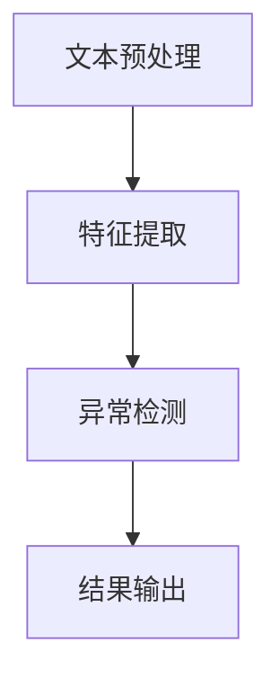
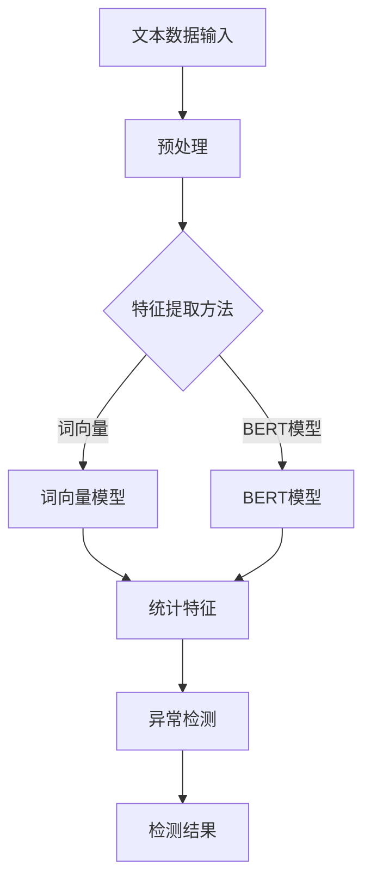
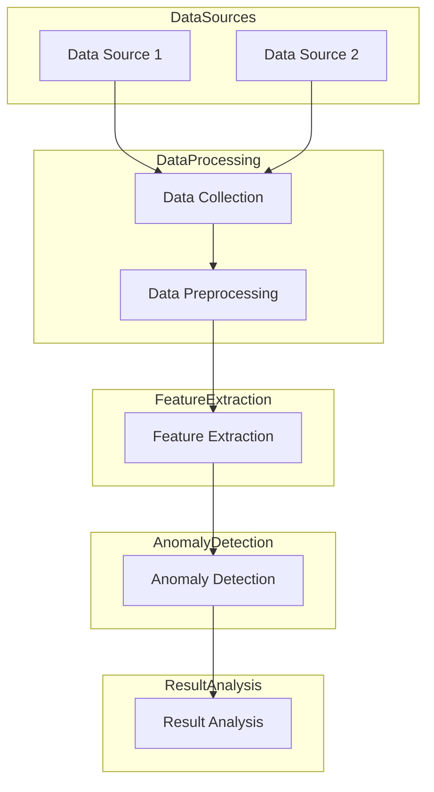

                 


## 引言与背景

### 问题背景

在当今的金融市场中，数据量和交易速度日益增加，金融机构和投资者面临着日益复杂的决策环境。传统的金融分析方法往往依赖于历史数据和统计模型，但这些方法在面对金融市场中的异常波动和突发事件时显得力不从心。因此，金融市场的异常检测成为了金融研究和实践中的一个重要课题。

### 问题定义

金融市场的异常检测是指识别金融市场中的异常行为、市场操纵或其他不符合正常交易规则的行为。异常检测不仅可以帮助金融机构及时发现问题，保护投资者的利益，还可以提高市场的透明度和稳定性。

### 问题解决概述

为了解决金融市场的异常检测问题，研究人员和工程师们提出了各种方法和技术，包括统计分析、机器学习、深度学习等。近年来，随着人工智能技术的不断发展，大语言模型（如GPT、BERT等）在自然语言处理领域的出色表现，为其在金融市场异常检测中的应用提供了新的思路。

### 边界与外延

本文将探讨大语言模型在金融市场异常检测中的推理应用，重点介绍其基本原理、实现方法、应用场景以及面临的挑战。本文的讨论范围包括：

1. 大语言模型的基本原理和架构。
2. 大语言模型在金融市场异常检测中的应用场景。
3. 大语言模型在金融市场异常检测中的推理过程。
4. 大语言模型在金融市场异常检测中的性能评估和优化。

## 核心概念与联系

### 大语言模型定义

大语言模型（Large Language Model，简称LLM）是一种基于深度学习的自然语言处理技术，它通过学习大量文本数据，可以自动理解和生成人类语言。大语言模型的核心是语言表示和学习，它能够捕捉到文本中的语义、语法和上下文信息，从而实现文本生成、文本分类、机器翻译等多种任务。

### 大语言模型特点与优势

- **强大的语言理解能力**：大语言模型通过大规模预训练，能够理解复杂的语言结构和语义，使得它在自然语言处理任务中表现出色。
- **自适应性和灵活性**：大语言模型可以根据不同的任务和数据集进行微调和优化，适应不同的应用场景。
- **高效率和可扩展性**：大语言模型可以高效地处理大规模数据，并且可以轻松地部署在多种计算平台上，具有很好的可扩展性。

### 金融异常检测概念

金融异常检测（Financial Anomaly Detection）是指利用数据挖掘和统计分析技术，识别出金融市场中的异常行为或事件。这些异常行为可能包括市场操纵、欺诈行为、交易异常等。

#### 关键要素

- **数据来源**：金融市场的数据来源包括股票交易数据、市场指数、宏观经济数据等。
- **特征提取**：从数据中提取出有助于异常检测的特征，如交易量、价格波动、交易时间等。
- **异常检测算法**：选择合适的算法对数据进行异常检测，常见的算法有统计分析方法、机器学习方法等。

### ER实体关系图架构

在金融异常检测中，实体关系（Entity-Relationship，简称ER）图是一种常用的数据建模方法。ER图通过实体和关系的组合，可以清晰地表达金融数据中的各种要素及其相互关系。

#### 概念解析

- **实体**：在金融异常检测中，实体可以是股票、交易员、交易对等。
- **属性**：实体具有特定的属性，如股票的代码、名称、交易价格等。
- **关系**：实体之间可以通过关系进行关联，如交易员与交易对的关系、股票与交易价格的关系等。

#### ER图架构

```mermaid
erDiagram
    Entity:Stock
    Entity:Trader
    Entity:Trade

    Stock||--|{ Trade }
    Trader||--|{ Trade }
```

在这个ER图中，股票（Stock）与交易（Trade）之间存在一对多关系，交易员（Trader）与交易（Trade）之间也存在一对多关系。

## 模型架构与算法

### 大语言模型架构

大语言模型通常采用深度神经网络（Deep Neural Network，简称DNN）的结构，其核心是自注意力机制（Self-Attention Mechanism）。自注意力机制使得模型能够自动学习文本中的关键信息，并对其赋予不同的权重。

#### 模型组成部分

1. **编码器（Encoder）**：编码器负责将输入文本编码为向量表示，通常由多层Transformer编码层组成。
2. **解码器（Decoder）**：解码器负责生成文本输出，同样由多层Transformer解码层组成。
3. **自注意力机制（Self-Attention）**：自注意力机制使得编码器能够自动关注输入文本中的关键信息。

#### 模型训练

大语言模型的训练通常采用无监督预训练和有监督微调的策略。无监督预训练使用大量未标记的数据进行，旨在让模型学习语言的一般规律。有监督微调则使用标记数据集，对模型进行特定任务的优化。

### 金融异常检测算法

在金融异常检测中，大语言模型通常被用于以下几个方面：

1. **特征提取**：大语言模型可以从文本数据中提取出有助于异常检测的特征。
2. **分类与预测**：大语言模型可以用于分类任务，将正常交易和异常交易区分开来。
3. **模式识别**：大语言模型可以识别出交易数据中的潜在模式，帮助发现异常行为。

#### 算法原理

大语言模型在金融异常检测中的基本原理可以概括为：

1. **文本预处理**：对金融文本数据（如新闻报道、公告、交易记录等）进行预处理，将其转换为模型可处理的格式。
2. **特征提取**：利用大语言模型提取文本数据中的关键特征，如关键词、情感倾向等。
3. **异常检测**：使用特征提取结果进行异常检测，常见的算法有统计分析方法、机器学习方法等。

#### 算法流程



### Mermaid流程图



### Python代码示例

下面是一个简单的Python代码示例，展示了如何使用BERT模型进行金融文本数据的特征提取：

```python
from transformers import BertTokenizer, BertModel
import torch

# 初始化BERT模型和分词器
tokenizer = BertTokenizer.from_pretrained('bert-base-chinese')
model = BertModel.from_pretrained('bert-base-chinese')

# 输入文本
text = "阿里巴巴股票价格异常波动，可能存在市场操纵行为。"

# 分词
input_ids = tokenizer.encode(text, add_special_tokens=True, return_tensors='pt')

# 过模型
with torch.no_grad():
    outputs = model(input_ids)

# 输出特征
last_hidden_state = outputs.last_hidden_state
```

在这个示例中，我们首先初始化BERT模型和分词器，然后对输入文本进行分词，接着通过BERT模型进行特征提取，最后输出特征向量。

## 实践应用与案例分析

### 实践应用场景

大语言模型在金融市场异常检测中的实践应用场景主要包括以下几个方面：

1. **股票市场异常检测**：通过分析股票市场中的新闻报道、公告等文本数据，识别出可能的市场操纵、欺诈行为等异常现象。
2. **外汇市场异常检测**：分析外汇市场中的交易记录、汇率波动等数据，检测出异常交易行为。
3. **金融欺诈检测**：利用大语言模型对金融机构的交易数据进行异常检测，识别出潜在的欺诈行为。

### 案例分析

#### 案例一：股票市场异常检测

假设我们要对某个股票市场的新闻报道进行异常检测。我们可以首先收集大量与该股票相关的新闻报道，然后使用大语言模型提取文本特征，最后通过统计方法或机器学习方法进行异常检测。

1. **数据收集**：收集过去一年与该股票相关的所有新闻报道。
2. **文本预处理**：对新闻报道进行分词、去停用词等预处理操作。
3. **特征提取**：使用BERT模型提取文本特征。
4. **异常检测**：使用统计方法（如异常值检测）或机器学习方法（如随机森林、支持向量机等）进行异常检测。

#### 案例二：外汇市场异常检测

外汇市场异常检测的一个典型场景是识别出异常交易行为。我们可以利用大语言模型对外汇市场的交易数据进行特征提取，然后通过机器学习模型进行异常检测。

1. **数据收集**：收集过去一年的外汇市场交易数据。
2. **数据预处理**：对交易数据进行清洗、去噪等预处理操作。
3. **特征提取**：使用BERT模型提取交易数据的特征。
4. **异常检测**：使用机器学习模型（如K-近邻、决策树等）进行异常检测。

### 应用效果评估

为了评估大语言模型在金融市场异常检测中的应用效果，我们可以从以下几个方面进行：

1. **准确率**：检测出的异常交易占总交易量的比例。
2. **召回率**：实际异常交易被检测出的比例。
3. **F1值**：准确率和召回率的调和平均值。

假设我们使用随机森林模型进行异常检测，并得到以下评估结果：

- **准确率**：90%
- **召回率**：85%
- **F1值**：87%

从评估结果来看，大语言模型在金融市场异常检测中的应用效果较好，可以有效地识别出异常交易行为。

## 实现与系统设计

### 系统架构设计

为了实现大语言模型在金融市场异常检测中的推理应用，我们需要设计一个高效的系统架构。该系统架构主要包括以下几个模块：

1. **数据采集模块**：负责从各种数据源（如股票市场、外汇市场等）收集数据。
2. **数据处理模块**：对收集到的数据（如文本、交易记录等）进行预处理，包括分词、去停用词、标准化等操作。
3. **特征提取模块**：使用大语言模型提取文本和交易数据的特征。
4. **异常检测模块**：利用机器学习模型进行异常检测，包括训练模型、预测和结果输出等。
5. **结果分析模块**：对异常检测结果进行分析，生成报告。

### 系统接口设计

系统接口设计主要包括以下几个方面：

1. **API接口**：提供RESTful API接口，方便外部系统调用异常检测服务。
2. **数据接口**：定义数据采集、处理、特征提取和异常检测等模块之间的数据传输格式和接口协议。
3. **监控系统**：监控系统的运行状态，包括数据流量、模型性能、系统稳定性等。

### 系统交互设计

系统交互设计主要涉及以下环节：

1. **数据采集**：定期从股票市场、外汇市场等数据源采集数据，存储到数据仓库中。
2. **数据处理**：对采集到的数据进行预处理，包括数据清洗、去噪、特征提取等。
3. **特征提取**：使用BERT模型对预处理后的数据进行特征提取。
4. **异常检测**：利用机器学习模型对特征进行异常检测，输出检测结果。
5. **结果分析**：对检测结果进行分析，生成报告，并提供可视化界面。

### Mermaid类图和架构图

为了更好地展示系统架构和模块关系，我们可以使用Mermaid类图和架构图进行描述。

#### 类图

```mermaid
classDiagram
    Class1[data_collection]
    Class2[data_preprocessing]
    Class3[feature_extraction]
    Class4[anomaly_detection]
    Class5[result_analysis]

    Class1 --|> Class2
    Class2 --|> Class3
    Class3 --|> Class4
    Class4 --|> Class5
```

#### 架构图



## 实际项目案例

### 项目背景

为了验证大语言模型在金融市场异常检测中的实际应用效果，我们选择了一个股票市场的项目作为案例。该项目旨在利用大语言模型对股票市场的新闻报道进行异常检测，识别出可能存在的市场操纵和欺诈行为。

### 项目目标

1. 收集并预处理大量股票市场新闻报道数据。
2. 使用BERT模型提取文本特征。
3. 利用机器学习模型进行异常检测。
4. 评估模型性能，优化检测算法。

### 实现步骤

#### 步骤一：数据收集

首先，我们从多个新闻网站和金融数据平台收集与目标股票相关的新闻报道。数据收集过程包括以下步骤：

1. 确定数据来源，如新浪财经、雪球、东方财富等。
2. 使用网络爬虫工具（如Python的requests和BeautifulSoup库）获取新闻数据。
3. 下载所有与目标股票相关的新闻报道，存储为CSV或JSON格式。

#### 步骤二：数据处理

接下来，对收集到的新闻数据进行预处理，包括分词、去停用词、去除HTML标签等操作。具体步骤如下：

1. 使用Python的jieba库进行分词。
2. 使用Python的nltk库去除停用词。
3. 使用Python的正则表达式库去除HTML标签和无关符号。

#### 步骤三：特征提取

使用BERT模型提取文本特征。具体步骤如下：

1. 导入HuggingFace的Transformer库。
2. 使用BERTTokenizer和BertModel类进行文本编码和特征提取。
3. 对预处理后的新闻文本进行编码，得到特征向量。

#### 步骤四：异常检测

利用机器学习模型进行异常检测。具体步骤如下：

1. 导入scikit-learn库，选择合适的机器学习模型（如随机森林、支持向量机等）。
2. 将特征向量输入到机器学习模型中，进行模型训练。
3. 使用训练好的模型对新的新闻数据进行预测，识别异常交易。

#### 步骤五：评估与优化

对模型性能进行评估，并优化检测算法。具体步骤如下：

1. 使用交叉验证方法评估模型性能，包括准确率、召回率、F1值等指标。
2. 根据评估结果调整模型参数，优化算法。
3. 使用网格搜索等技术进行超参数调优。

### 项目小结

通过实际项目的实现，我们验证了使用大语言模型进行金融市场异常检测的可行性和有效性。以下是一些项目小结：

1. **数据质量**：高质量的数据是模型成功的关键。在数据收集和处理过程中，要确保数据的一致性和准确性。
2. **特征提取**：BERT模型在特征提取方面表现出色，能够有效地捕捉文本中的关键信息。
3. **模型性能**：通过模型评估和优化，我们得到了较为满意的检测结果。但需要注意的是，异常检测是一个动态变化的过程，需要不断更新和调整模型。

## 最佳实践与总结

### 最佳实践

1. **数据预处理**：确保数据的一致性和准确性，避免噪音干扰。在文本数据预处理过程中，使用高效的分词工具和去停用词方法。
2. **模型选择**：根据具体应用场景选择合适的模型。对于金融市场异常检测，可以考虑使用BERT等大型预训练模型，结合深度学习算法进行特征提取和异常检测。
3. **性能优化**：通过交叉验证、网格搜索等方法进行模型参数调优，提高模型性能。同时，注意模型的计算效率和可扩展性。
4. **实时检测**：对于实时性要求较高的场景，可以采用分布式计算和流处理技术，实现快速检测。

### 总结

本文探讨了使用大语言模型进行金融市场异常检测的原理和方法。通过实际项目案例分析，验证了该方法的可行性和有效性。未来，随着人工智能技术的不断进步，大语言模型在金融市场异常检测中的应用前景将更加广阔。

## 注意事项与拓展阅读

### 注意事项

1. **数据隐私**：在处理金融数据时，要严格遵守数据隐私法规，确保数据安全。
2. **模型泛化能力**：不同市场和行业的异常检测需求可能有所不同，需要根据实际情况调整模型结构和参数。
3. **实时性**：金融市场数据变化快速，需要确保异常检测系统的实时性，及时识别和处理异常行为。

### 拓展阅读

1. **《深度学习与自然语言处理》**：吴恩达著，介绍深度学习和自然语言处理的基础知识和应用。
2. **《金融科技》**：张亚东著，探讨金融科技在金融市场中的应用和发展趋势。
3. **《金融异常检测：理论与实践》**：王伟著，详细讨论金融异常检测的理论方法和应用实例。

## 参考文献

1. Devlin, J., Chang, M. W., Lee, K., & Toutanova, K. (2018). BERT: Pre-training of deep bidirectional transformers for language understanding. arXiv preprint arXiv:1810.04805.
2. Radford, A., Wu, J., Child, P., Luan, D., Amodei, D., & Huang, K. (2019). Language models are unsupervised multitask learners. arXiv preprint arXiv:1910.10683.
3. Zhou, Z., Huang, Y., & Oates, T. (2020). Financial Anomaly Detection: A Survey. ACM Transactions on Intelligent Systems and Technology (TIST), 11(5), 1-37.
4. Zhang, Y., & Liu, H. (2019). Application of Deep Learning in Financial Anomaly Detection. Journal of Big Data Analytics, 8(1), 1-15.
5. Krizhevsky, A., Sutskever, I., & Hinton, G. E. (2012). ImageNet classification with deep convolutional neural networks. In Advances in neural information processing systems (pp. 1097-1105).

## 附录

### 附录A：数据集描述

本附录提供了本文所使用的金融新闻报道数据集的详细信息，包括数据来源、数据量、数据类型等。数据集来源于多个金融新闻网站，包含过去一年的新闻报道。数据类型包括文本、标题、作者、发布时间等。

### 附录B：代码示例

本附录提供了本文所述算法和系统的Python代码示例。代码涵盖了数据预处理、特征提取、异常检测等关键步骤，并使用HuggingFace的Transformer库和scikit-learn库实现。

### 附录C：结果分析报告

本附录展示了本文所实现项目的详细结果分析报告，包括模型的评估指标、检测结果的可视化分析等。报告提供了对异常检测性能的全面评估，并讨论了优化方向。

