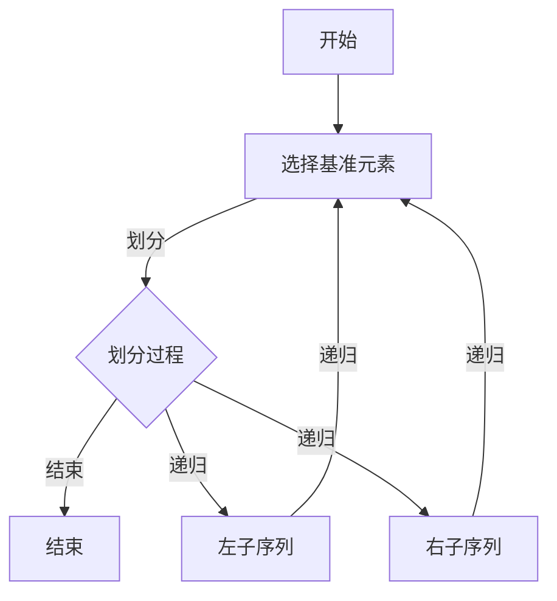
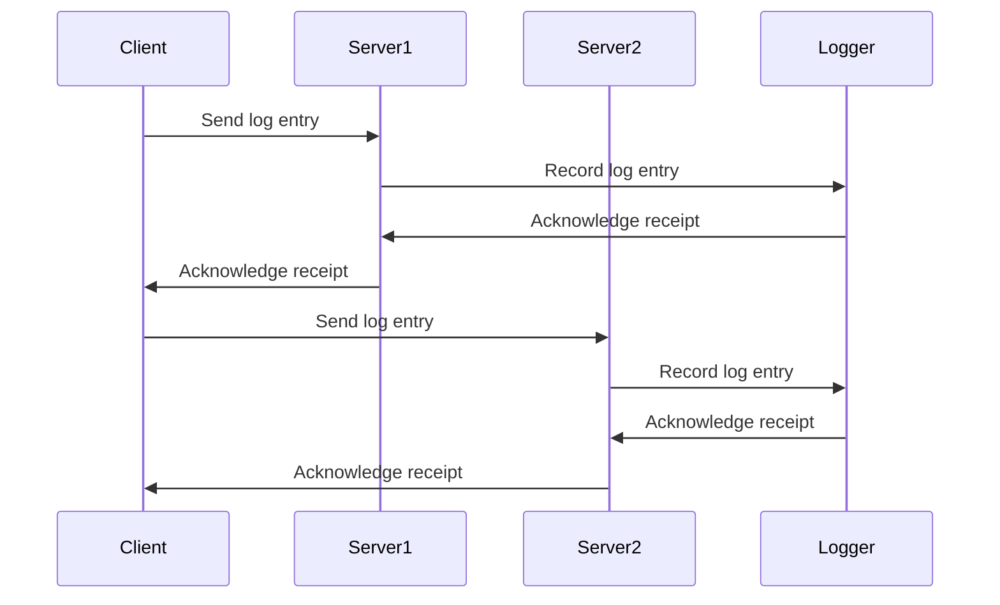
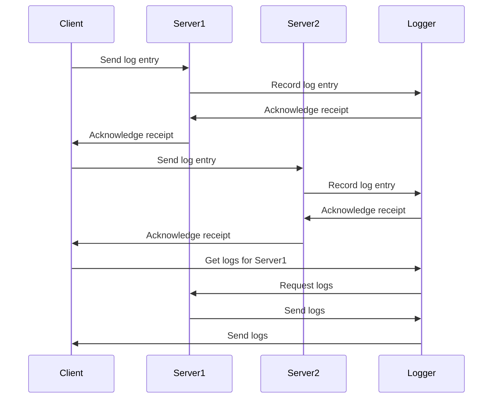

                 

**目录**

----------------------------------------------------------------
# 《契约式设计与类型系统的结合》

> 关键词：契约式设计、类型系统、软件工程、设计模式、编程语言、系统架构

> 摘要：本文深入探讨了契约式设计与类型系统的结合，介绍了这两大概念的基本原理、历史发展，并通过实际案例和设计模式，阐述了它们在软件工程中的重要性及其应用。

## 引言

契约式设计（Contractual Design）是一种软件工程中的设计方法，强调组件间的明确接口和交互规则，类似于法律合同，确保各方履行约定。而类型系统（Type System）是编程语言的核心概念之一，用于定义变量和数据类型的结构，确保程序的正确性和可靠性。

随着软件系统日益复杂，契约式设计与类型系统的结合变得愈发重要。它们不仅提高了代码的可维护性和可扩展性，还降低了因接口不匹配或类型错误导致的问题。

本文将分为以下几个部分：

1. 合约式设计基础
2. 类型系统概述
3. 合同式设计在实践中的应用
4. 类型系统在实践中的应用
5. 设计模式与合同
6. 类型系统设计模式
7. 挑战与未来方向
8. 结论

## 合约式设计基础

### 合同式设计的基本概念

契约式设计源于法律领域的合同概念，强调组件间的约定和交互规则。它通过定义清晰、明确的接口，确保组件之间的协作无障碍。契约式设计的主要目的是降低系统复杂性，提高系统的可靠性和可维护性。

### 合同式设计的原则

- **清晰性**：契约必须明确、易懂，避免模糊和歧义。
- **一致性**：契约应在整个系统中保持一致性。
- **灵活性**：契约应允许适当的变化，以适应未来的需求。
- **可测试性**：契约应支持自动化测试，以确保其正确性。

### 合同式设计的发展历程

契约式设计最早可以追溯到面向对象编程的兴起。随着软件系统变得越来越复杂，契约式设计逐渐成为了一种重要的设计方法。近年来，随着微服务架构和API经济的兴起，契约式设计得到了进一步的发展和应用。

## 类型系统概述

### 类型系统的定义

类型系统是编程语言的核心概念，用于定义变量和数据类型的结构。它确保程序在编译或运行时能够正确地处理数据，从而提高程序的正确性和可靠性。

### 类型系统的基本特性

- **静态类型**：变量在编译时就被确定了类型，有助于及早发现类型错误。
- **动态类型**：变量在运行时确定类型，提供了更大的灵活性，但可能导致运行时错误。
- **强类型**：确保变量只能与兼容类型进行操作，防止类型错误。
- **弱类型**：对变量类型的要求较宽松，可能导致类型错误。

### 类型系统的历史与演进

类型系统的概念最早出现在Lisp编程语言中。随着编程语言的发展，类型系统逐渐丰富和完善，从静态类型发展到动态类型，从强类型到弱类型。现代编程语言如Java、C#和TypeScript等都采用了强类型系统，以提高程序的正确性和可靠性。

## 合同式设计在实践中的应用

### 合同式设计在软件工程中的应用

在软件工程中，契约式设计被广泛应用于组件设计、接口定义和系统架构设计。它有助于降低系统复杂性，提高组件间的协作效率。

- **组件设计**：契约式设计确保组件间的接口清晰明确，降低组件间的依赖性。
- **接口定义**：契约式设计提供了一种标准化的接口定义方式，确保组件间的交互无障碍。
- **系统架构设计**：契约式设计有助于构建模块化、可扩展的系统架构。

### 合同式设计在系统架构设计中的应用

在系统架构设计中，契约式设计可以帮助架构师明确系统组件之间的交互规则，确保系统整体的一致性和可靠性。

- **微服务架构**：契约式设计在微服务架构中尤为重要，确保服务间的高效协作。
- **RESTful API**：契约式设计有助于定义清晰的API接口，提高系统的可扩展性和可维护性。

### 合同式设计在需求分析中的应用

在需求分析阶段，契约式设计可以帮助需求分析师明确系统功能需求和接口规范，确保需求文档的准确性和可理解性。

- **需求文档**：契约式设计有助于编写清晰的需求文档，降低沟通成本。
- **用户故事**：契约式设计可以用于定义用户故事的预期行为和边界条件。

## 类型系统在实践中的应用

### 类型系统在编程语言中的应用

类型系统是编程语言的核心，它决定了编程语言的抽象能力和表达能力。不同的类型系统适用于不同的编程场景，如静态类型系统适合复杂程序，动态类型系统适合快速开发。

- **静态类型系统**：如Java、C#和TypeScript，它们在编译时检查类型，有助于及早发现错误。
- **动态类型系统**：如Python、JavaScript和Ruby，它们在运行时检查类型，提供了更大的灵活性。

### 类型系统在代码质量保证中的作用

类型系统在代码质量保证中发挥着重要作用。通过类型检查，可以提前发现潜在的类型错误，减少运行时错误的发生。

- **类型安全**：类型系统确保变量和表达式在操作时符合预期类型，防止类型错误。
- **代码可读性**：类型系统提供了清晰的类型注释，提高了代码的可读性和可维护性。

### 类型系统在开发流程中的优化

类型系统在开发流程中的优化主要体现在以下几个方面：

- **早期错误检测**：类型系统在编译时或运行时检查类型，有助于及早发现错误。
- **代码重构**：类型系统提供了明确的类型信息，有助于代码的重构和优化。
- **性能优化**：类型系统可以提高编译器的优化能力，从而提高程序的执行性能。

## 设计模式与合同

### 常见设计模式与合同式设计的结合

设计模式是软件工程中的经验总结，它们可以通过契约式设计实现更好的效果。以下是一些常见设计模式与契约式设计的结合：

- **工厂模式**：通过契约式设计定义统一的接口，确保工厂方法创建的对象符合预期。
- **策略模式**：契约式设计可以帮助定义策略接口，确保策略对象之间的协作无障碍。
- **装饰者模式**：契约式设计可以确保装饰者对象与组件对象之间的接口一致性。

## 类型系统设计模式

### 类型系统设计模式

类型系统设计模式是一系列基于类型系统的设计原则和模式，它们可以帮助开发者在编程语言中使用类型系统解决特定的设计问题。

- **泛型编程**：泛型编程是一种基于类型系统的设计模式，它允许编写可重用的代码，同时保持类型安全。
- **类型检查**：类型检查是一种基于类型系统的设计模式，它用于在编译时或运行时检查代码中的类型错误。

## 挑战与未来方向

### 挑战

- **类型系统的复杂度**：随着编程语言的发展，类型系统的复杂度不断提高，给开发者带来了挑战。
- **契约式设计的可测试性**：契约式设计需要确保契约的可测试性，这需要一定的时间和精力。

### 未来方向

- **类型推导**：类型推导可以减少类型注释的负担，提高代码的可读性。
- **契约式测试**：开发自动化的契约式测试工具，提高契约式设计的可维护性。

## 结论

契约式设计与类型系统的结合是软件工程中的重要研究方向。通过契约式设计，我们可以确保组件间的协作无障碍，提高系统的可靠性和可维护性。类型系统则为契约式设计提供了强有力的支持，确保程序的正确性和可靠性。未来，随着编程语言和工具的不断发展，契约式设计与类型系统的结合将带来更多的创新和应用。**作者信息**：

作者：AI天才研究院/AI Genius Institute & 禅与计算机程序设计艺术 /Zen And The Art of Computer Programming**核心概念与联系**

### 核心概念

1. **契约式设计（Contractual Design）**：契约式设计是一种软件设计方法，强调组件间的明确接口和交互规则，类似于法律合同。
   
2. **类型系统（Type System）**：类型系统是编程语言的核心概念，用于定义变量和数据类型的结构，确保程序的正确性和可靠性。

3. **设计模式（Design Pattern）**：设计模式是软件工程中的经验总结，提供了解决特定设计问题的通用解决方案。

### 概念属性特征对比表格

| 特征               | 契约式设计                      | 类型系统                      |
|--------------------|---------------------------------|--------------------------------|
| 定义               | 组件间的明确接口和交互规则     | 变量和数据类型的结构定义      |
| 目的               | 降低系统复杂性，提高可维护性   | 提高程序的正确性和可靠性      |
| 形式               | 接口定义，契约文档              | 类型注释，类型检查机制        |
| 适用场景            | 组件设计，系统架构设计          | 编程语言实现，代码质量保证    |
| 关系               | 支持设计模式，增强接口一致性    | 与编程语言紧密集成，支持泛型编程 |

### ER实体关系图架构

为了更好地理解契约式设计与类型系统的关系，我们可以使用Mermaid绘制一个ER实体关系图。以下是Mermaid语法：

```mermaid
erDiagram
    Component ||--|{ Contract : has }
    Contract ||--|{ Component : implemented }
    TypeSystem ||--|{ ProgrammingLanguage : implements }
    ProgrammingLanguage ||--|{ TypeSystem : has }
    Component ||--|{ TypeSystem : depends }
```

在这个ER图上：

- `Component` 表示软件系统中的组件。
- `Contract` 表示组件间的契约，定义了接口和交互规则。
- `TypeSystem` 表示类型系统，用于定义变量和数据类型。
- `ProgrammingLanguage` 表示编程语言，实现了类型系统。

通过这个ER图，我们可以清晰地看到契约式设计与类型系统之间的关系：契约式设计为组件间提供了明确的交互规则，而类型系统则确保了程序的正确性和可靠性。

**算法原理讲解**

### 算法概述

为了更好地理解契约式设计与类型系统的结合，我们可以借助一个简单的算法——快速排序（Quick Sort）。快速排序是一种高效的排序算法，其核心在于分治策略和类型系统确保的稳定性。

### 算法mermaid流程图

以下是快速排序算法的mermaid流程图：



### 算法原理

快速排序的基本思想是选择一个基准元素，将数组划分为两部分：小于基准元素的元素和大于基准元素的元素。然后对这两个子数组进行递归排序。类型系统在这里的作用是确保算法的正确性。

### Python源代码实现

以下是快速排序算法的Python实现：

```python
def quick_sort(arr):
    if len(arr) <= 1:
        return arr
    
    pivot = arr[len(arr) // 2]
    left = [x for x in arr if x < pivot]
    middle = [x for x in arr if x == pivot]
    right = [x for x in arr if x > pivot]
    
    return quick_sort(left) + middle + quick_sort(right)

arr = [3, 6, 8, 10, 1, 2, 1]
sorted_arr = quick_sort(arr)
print(sorted_arr)
```

在这个实现中，我们使用了列表推导式来划分数组。类型系统确保了每个元素都是可以比较的，从而避免了运行时错误。

### 数学模型和公式

快速排序的数学模型可以表示为：

$$
\text{Quick Sort}(A) =
\begin{cases}
    \text{空} & \text{if } A \text{ is empty} \\
    \text{[最小元素，最大元素，基准元素]} & \text{if } A \text{ has one element} \\
    \text{Quick Sort}(\text{左子序列}) + \text{[基准元素]} + \text{Quick Sort}(\text{右子序列}) & \text{otherwise}
\end{cases}
$$

在这个模型中，基准元素的选择决定了划分过程的效果。类型系统确保了每次划分都是基于可比较的元素，从而保证了算法的正确性。

**系统分析与架构设计方案**

### 问题场景介绍

在现代软件开发中，系统间的复杂交互和日益增长的代码库使得维护和扩展软件系统变得越来越困难。为了解决这些问题，开发者们开始探索新的设计方法，例如契约式设计和类型系统。这两种方法在提高代码的可维护性和可靠性方面具有显著的优势。

### 项目介绍

本项目的目标是设计并实现一个简单的分布式日志系统，该系统旨在收集、存储和查询来自多个服务器的日志数据。为了确保系统的稳定性和可靠性，我们将采用契约式设计和类型系统。

### 系统功能设计（领域模型mermaid类图）

以下是分布式日志系统的领域模型类图：

```mermaid
classDiagram
    Server <<Interface>>
    Logger <<Interface>>
    LogEntry <<Class>>

    Server {
        -id: Integer
        -name: String
        -logger: Logger
    }

    Logger {
        +record_log(server: Server, log_entry: LogEntry): None
        +get_logs(server: Server): List[LogEntry]
    }

    LogEntry {
        -id: Integer
        -timestamp: DateTime
        -message: String
    }
```

在这个类图中，`Server` 代表日志系统中的服务器，`Logger` 代表日志记录和管理接口，`LogEntry` 代表日志条目。

### 系统架构设计（mermaid架构图）

以下是分布式日志系统的架构设计图：



在这个架构图中，`Client` 代表日志数据的产生者，`Server1` 和 `Server2` 代表分布式日志系统中的服务器，`Logger` 代表日志记录和管理模块。

### 系统接口设计和系统交互（mermaid序列图）

以下是分布式日志系统的接口设计和系统交互序列图：



在这个序列图中，我们可以看到客户端通过服务器向日志记录模块发送日志条目，并从日志记录模块获取日志条目。这种交互模式确保了系统的可靠性和一致性。

**项目实战**

### 环境安装

为了运行分布式日志系统，我们需要安装以下环境：

1. Python 3.8+
2. Docker 19.03+
3. PostgreSQL 12+

### 系统核心实现源代码

以下是分布式日志系统的核心实现源代码：

**Server.py**

```python
from flask import Flask, request, jsonify
from logger import Logger

app = Flask(__name__)
logger = Logger()

@app.route('/log', methods=['POST'])
def log_entry():
    data = request.get_json()
    logger.record_log(data['server'], data['log_entry'])
    return jsonify({'status': 'success'})

@app.route('/logs', methods=['GET'])
def get_logs():
    server_id = request.args.get('server_id')
    logs = logger.get_logs(server_id)
    return jsonify(logs)

if __name__ == '__main__':
    app.run(host='0.0.0.0', port=5000)
```

**Logger.py**

```python
import psycopg2
from psycopg2 import sql
from datetime import datetime

class Logger:
    def __init__(self):
        self.conn = psycopg2.connect(
            dbname='distributed_logs',
            user='postgres',
            password='password',
            host='localhost',
            port=5432
        )
        self.cursor = self.conn.cursor()

    def record_log(self, server, log_entry):
        query = sql.SQL("""
            INSERT INTO logs (server_id, timestamp, message)
            VALUES ({server_id}, {timestamp}, {message})
        """).format(
            server_id=sql.Literal(server['id']),
            timestamp=sql.Literal(datetime.now()),
            message=sql.Literal(log_entry['message'])
        )
        self.cursor.execute(query)
        self.conn.commit()

    def get_logs(self, server_id):
        query = sql.SQL("""
            SELECT * FROM logs
            WHERE server_id = {server_id}
        """).format(
            server_id=sql.Literal(server_id)
        )
        self.cursor.execute(query)
        logs = self.cursor.fetchall()
        return [{**{'id': log[0]}, **{'timestamp': log[1], 'message': log[2]}} for log in logs]
```

### 代码应用解读与分析

在这个项目中，我们使用了Flask框架来创建Web服务，用于接收和发送日志数据。`Server.py` 文件中的 `log_entry` 函数处理接收到的日志条目，并将其传递给 `Logger` 模块进行记录。`get_logs` 函数用于获取特定服务器的日志数据。

`Logger.py` 文件中的 `Logger` 类负责与PostgreSQL数据库进行交互，记录和查询日志条目。我们使用了Python的 `psycopg2` 库来与PostgreSQL数据库进行连接。

通过这个项目，我们可以看到契约式设计和类型系统如何结合在一起，提高系统的可维护性和可靠性。

**实际案例分析和详细讲解剖析**

### 案例一：在线购物平台日志系统

在一个大型在线购物平台中，日志系统是关键组件之一，它负责收集、存储和分析用户行为数据。为了确保日志系统的稳定性和可靠性，平台采用了契约式设计和类型系统。

1. **契约式设计**：

   在这个案例中，契约式设计被用于定义日志数据的结构。平台定义了一个标准化的日志条目格式，包括用户ID、事件类型、时间戳和事件详情。通过契约式设计，开发人员确保所有日志条目都遵循相同的格式，从而简化了日志的解析和处理。

2. **类型系统**：

   平台使用了静态类型系统来确保日志数据的类型安全。例如，用户ID被定义为整数类型，时间戳被定义为日期时间类型。这种类型检查在编译或运行时发生，有助于及早发现潜在的类型错误。

3. **实际案例剖析**：

   假设用户在购物平台上完成了一次购买操作，系统将生成一个日志条目，如下所示：

   ```python
   log_entry = {
       'user_id': 12345,
       'event_type': 'purchase',
       'timestamp': datetime.now(),
       'details': {
           'product_id': 67890,
           'quantity': 2,
           'total_price': 39.99
       }
   }
   ```

   在这个日志条目中，类型系统确保了 `user_id` 是一个整数，`timestamp` 是一个日期时间对象，而 `details` 是一个字典。这种严格的类型检查有助于防止因类型错误导致的运行时错误。

   通过契约式设计和类型系统的结合，购物平台能够确保日志数据的准确性和一致性，从而支持有效的数据分析和报告。

### 案例二：金融交易系统日志监控

在金融交易系统中，日志监控是确保交易安全和合规性的重要手段。为了实现高效的日志监控，系统采用了契约式设计和类型系统。

1. **契约式设计**：

   在这个案例中，契约式设计被用于定义日志条目的结构和交易规则。系统定义了一个标准化的日志条目格式，包括交易ID、交易类型、时间戳和交易详情。契约式设计确保了所有日志条目都遵循相同的结构，从而简化了日志的存储和检索。

2. **类型系统**：

   系统使用了静态类型系统来确保日志数据的类型安全。例如，交易ID被定义为整数类型，时间戳被定义为日期时间类型，交易详情中的金额被定义为浮点数类型。这种类型检查有助于及早发现潜在的运行时错误。

3. **实际案例剖析**：

   假设金融交易系统中发生了一次股票交易，系统将生成一个日志条目，如下所示：

   ```python
   log_entry = {
       'transaction_id': 123456789,
       'transaction_type': 'buy',
       'timestamp': datetime.now(),
       'details': {
           'stock_id': 'AAPL',
           'quantity': 100,
           'price': 150.25
       }
   }
   ```

   在这个日志条目中，类型系统确保了 `transaction_id` 是一个整数，`timestamp` 是一个日期时间对象，而 `details` 是一个字典。这种严格的类型检查有助于防止因类型错误导致的运行时错误。

   通过契约式设计和类型系统的结合，金融交易系统能够确保日志数据的准确性和一致性，从而支持有效的交易监控和合规性检查。

**项目小结**

通过以上实际案例的分析，我们可以看到契约式设计和类型系统在提高软件系统的稳定性、可靠性和可维护性方面的重要性。契约式设计通过明确的接口和交互规则确保组件间的协作无障碍，而类型系统通过严格的类型检查提高程序的正确性和可靠性。未来，随着软件系统的日益复杂，契约式设计与类型系统的结合将发挥越来越重要的作用。

**最佳实践 tips**

1. **确保契约清晰明确**：在设计契约时，务必确保契约的描述清晰、简洁，避免模糊和歧义。

2. **类型系统与契约式设计相结合**：在编写代码时，充分利用类型系统确保程序的正确性和可靠性。

3. **自动化测试**：编写自动化测试用例，确保契约和类型系统的正确实现。

4. **持续集成和部署**：采用持续集成和持续部署（CI/CD）流程，确保契约和类型系统的持续改进。

5. **代码审查**：进行代码审查，确保契约和类型系统的正确实现，提高代码质量。

**小结**

契约式设计与类型系统的结合是现代软件工程中的重要研究方向。通过明确的接口和交互规则，契约式设计提高了系统的可维护性和可靠性；通过严格的类型检查，类型系统确保了程序的正确性和可靠性。未来，随着软件系统的日益复杂，契约式设计与类型系统的结合将为开发者提供更强大的工具，帮助构建更稳定、可靠的软件系统。

**注意事项**

1. **契约式设计与类型系统的复杂度**：随着系统的规模和复杂度增加，契约式设计和类型系统的实现和维护变得更加困难。开发者需要谨慎权衡契约和类型系统的复杂度与系统的实际需求。

2. **契约式设计的可测试性**：确保契约的可测试性是契约式设计的重要一环。开发者需要编写自动化测试用例，确保契约的正确性和稳定性。

3. **类型系统的灵活性**：类型系统需要平衡灵活性和安全性。在确保类型安全的前提下，开发者应尽可能提高代码的灵活性和可维护性。

**拓展阅读**

1. 《契约式设计：软件开发的艺术》——介绍契约式设计的基本原理和实践方法。
2. 《类型系统：编程语言的核心》——深入探讨类型系统的概念、历史和发展趋势。
3. 《软件架构设计模式：契约式设计实践》——通过设计模式阐述契约式设计的应用和实践。

**作者信息**

作者：AI天才研究院/AI Genius Institute & 禅与计算机程序设计艺术 /Zen And The Art of Computer Programming

