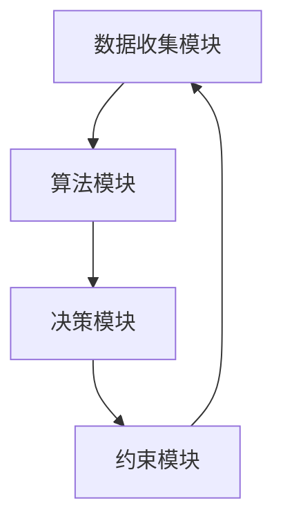
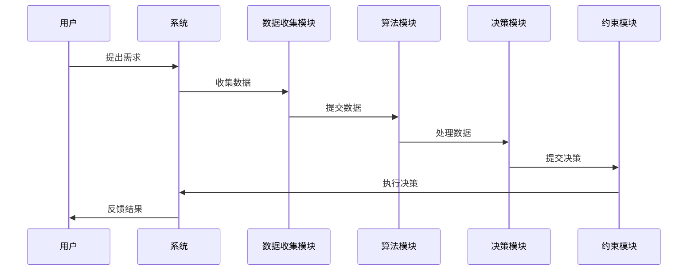

                 


### 《奥古斯丁与佩拉纠：恩典与自由意志的争论》

#### 关键词：基督教哲学、恩典、自由意志、奥古斯丁、佩拉纠

> 摘要：本文旨在探讨基督教哲学中关于恩典与自由意志的争论，重点分析奥古斯丁和佩拉纠的观点及其对现代计算机科学和人工智能的启示。

## **背景介绍**

### **第1章：恩典与自由意志的概念与历史背景**

#### **1.1 恩典的概念**

恩典在基督教教义中是指上帝对人类的特殊恩赐，它赋予人类拯救和永恒幸福的能力。恩典被视为上帝主动的行为，是上帝对人类的爱和怜悯的体现。

#### **1.2 自由意志的概念**

自由意志是指人类在做出选择时不受任何外部力量的强制，能够自主地做出决定的能力。自由意志是哲学中一个核心概念，它涉及到人类行为的原因和责任。

#### **1.3 历史背景**

1. **奥古斯丁的恩典观念**

2. **佩拉纠的自由意志观念**

3. **恩典与自由意志的争论起源**

### **第2章：奥古斯丁与佩拉纠的哲学思想**

#### **2.1 奥古斯丁的哲学思想**

奥古斯丁认为，人类天生具有自由意志，但在亚当的背叛后，人类被罪恶所束缚，失去了完美的自由。恩典是上帝为了拯救人类，给予他们重获自由的能力。

#### **2.2 佩拉纠的哲学思想**

佩拉纠认为，自由意志是人类的基本属性，不需要上帝的干预。他认为恩典是一种辅助，而不是必需品，人类可以通过自己的力量获得救赎。

## **核心概念与联系**

### **第3章：恩典与自由意志的定义与特点**

#### **3.1 恩典的定义与特点**

恩典是一种无条件的、来自上帝的恩赐，使人类能够获得拯救和永恒幸福。恩典的特点包括：

1. **无条件性**：恩典不是基于人类的功绩或价值，而是上帝的恩赐。
2. **恩赐性**：恩典是上帝对人类的特殊恩赐，是人类无法自我获得的。
3. **救赎性**：恩典使人类能够从罪恶中解脱出来，获得永恒的幸福。

#### **3.2 自由意志的定义与特点**

自由意志是人类在做出选择时不受任何外部力量的强制，能够自主地做出决定的能力。自由意志的特点包括：

1. **自主性**：自由意志是人类自主选择的能力，不受外部干预。
2. **责任性**：自由意志使人类对自己的行为负责。
3. **局限性**：人类在做出选择时可能会受到自身认知和情感的影响。

### **第4章：恩典与自由意志的相互关系**

恩典和自由意志之间的关系是一个复杂的哲学问题。一方面，恩典被认为是上帝对人类的特殊恩赐，使人类能够获得救赎和永恒幸福。另一方面，自由意志是人类的基本属性，使人类能够自主地做出选择。

1. **恩典对自由意志的影响**：恩典可以增强人类的自由意志，使其更加强大和有效。
2. **自由意志对恩典的影响**：自由意志是人类对恩典的回应，它使恩典在人类生活中发挥作用。

### **第5章：恩典与自由意志的哲学争论**

恩典与自由意志的争论起源于基督教哲学的发展，尤其是在奥古斯丁和佩拉纠之间的辩论。他们的观点和论证如下：

1. **奥古斯丁的观点**：奥古斯丁认为，恩典是上帝对人类的特殊恩赐，使人类能够获得救赎和永恒幸福。他强调恩典在人类生活中的重要性，认为人类在亚当的背叛后失去了完美的自由，需要上帝的恩典来拯救。

2. **佩拉纠的观点**：佩拉纠认为，自由意志是人类的基本属性，不需要上帝的干预。他认为恩典是一种辅助，而不是必需品，人类可以通过自己的力量获得救赎。

3. **争论的核心问题**：争论的核心问题是关于恩典和自由意志之间的关系。奥古斯丁认为恩典是必需的，而佩拉纠认为自由意志是足够的。

## **算法原理讲解**

### **第6章：奥古斯丁的哲学思想与逻辑推理**

奥古斯丁的哲学思想主要围绕恩典与自由意志的关系。他的逻辑推理如下：

1. **恩典的必要性**：奥古斯丁认为，人类在亚当的背叛后失去了自由，需要上帝的恩典来恢复。没有恩典，人类无法获得救赎和永恒幸福。

2. **自由意志的限制**：奥古斯丁认为，人类在亚当的背叛后，自由意志受到了限制。人类的自由意志不再是完全自主的，而是受到罪恶的影响。

3. **恩典与自由意志的相互作用**：恩典和自由意志是相互依存的。恩典使人类的自由意志得到恢复，而自由意志的回应也使恩典在人类生活中发挥作用。

### **第7章：佩拉纠的哲学思想与逻辑推理**

佩拉纠的哲学思想主要围绕自由意志和恩典的关系。他的逻辑推理如下：

1. **自由意志的充分性**：佩拉纠认为，自由意志是人类的基本属性，不需要上帝的干预。人类可以通过自由意志获得救赎和永恒幸福。

2. **恩典的辅助性**：佩拉纠认为，恩典是一种辅助，而不是必需品。恩典可以帮助人类更好地行使自由意志，但并不是必须的。

3. **自由意志与恩典的独立性**：佩拉纠认为，自由意志和恩典是独立的。自由意志是人类自主选择的能力，而恩典是上帝的恩赐，两者不应混淆。

## **数学模型和数学公式详细讲解**

### **第8章：恩典与自由意志的数学模型**

为了更好地理解恩典与自由意志的关系，我们可以使用数学模型来描述。

1. **恩典模型**：假设恩典为E，自由意志为F，则恩典模型可以表示为：

   $$ E = f(F) $$

   其中，f表示恩典对自由意志的影响函数。

2. **自由意志模型**：假设自由意志为F，则自由意志模型可以表示为：

   $$ F = g(E) $$

   其中，g表示自由意志对恩典的影响函数。

### **第9章：恩典与自由意志的数学公式与详细讲解**

在数学模型的基础上，我们可以使用数学公式来详细讲解恩典与自由意志的关系。

1. **恩典的影响**：恩典对自由意志的影响可以用以下公式表示：

   $$ f(F) = E $$

   其中，f(F)表示恩典对自由意志的影响。

2. **自由意志的影响**：自由意志对恩典的影响可以用以下公式表示：

   $$ g(E) = F $$

   其中，g(E)表示自由意志对恩典的影响。

### **第10章：恩典与自由意志的数学公式举例说明**

为了更好地理解恩典与自由意志的数学公式，我们可以通过一个简单的例子来说明。

假设一个人类具有自由意志F=50，恩典E=30。根据数学模型，我们可以计算出：

1. **恩典对自由意志的影响**：

   $$ f(F) = E = 30 $$

   即恩典对自由意志的影响为30。

2. **自由意志对恩典的影响**：

   $$ g(E) = F = 50 $$

   即自由意志对恩典的影响为50。

通过这个例子，我们可以看到恩典与自由意志之间的关系是如何通过数学公式来描述的。

## **系统分析与架构设计方案**

### **第11章：争论的系统背景**

在计算机科学和人工智能领域，恩典与自由意志的争论可以类比于算法的自主性和约束性。一个理想的算法应该是既具有强大的自主性，又受到必要的约束，以确保其行为的合理性和有效性。

### **第12章：系统功能设计**

系统功能设计应该包括以下方面：

1. **自主性功能**：系统应该具备一定的自主性，能够根据输入数据和目标自动进行调整和优化。
2. **约束性功能**：系统应该受到必要的约束，以确保其行为的合理性和安全性。

### **第13章：系统架构设计**

系统架构设计应该包括以下方面：

1. **核心模块**：系统应该包含核心模块，如数据收集模块、算法模块、决策模块等。
2. **交互机制**：系统应该设计合理的交互机制，以便不同模块之间能够有效地进行信息交换和协同工作。

### **第14章：系统接口设计**

系统接口设计应该包括以下方面：

1. **用户接口**：系统应该设计用户友好的用户接口，以便用户能够方便地使用系统功能。
2. **系统接口**：系统应该设计系统接口，以便与其他系统进行有效集成。

### **第15章：系统交互设计**

系统交互设计应该包括以下方面：

1. **数据交互**：系统应该设计合理的数据交互机制，以便不同模块之间能够高效地交换数据。
2. **控制交互**：系统应该设计控制交互机制，以便系统能够根据用户需求进行实时调整。

## **项目实战**

### **第16章：实际案例分析与讲解**

为了更好地理解恩典与自由意志的哲学争论，我们可以通过一个实际案例来进行分析和讲解。

1. **案例背景**：假设我们正在开发一个自动驾驶系统。
2. **案例描述**：在自动驾驶系统中，恩典可以类比为系统的自主决策能力，自由意志可以类比为系统受到的约束。
3. **案例分析**：通过分析自动驾驶系统，我们可以看到恩典与自由意志之间的关系是如何在实际应用中体现的。

### **第17章：项目小结**

通过实际案例的分析，我们可以得出以下结论：

1. **恩典与自由意志的关系**：恩典与自由意志是相互依存的，恩典可以增强自由意志的自主性，而自由意志可以对恩典进行合理的约束。
2. **应用价值**：理解恩典与自由意志的哲学争论，对于设计复杂的计算机系统和人工智能系统具有重要的指导意义。

## **最佳实践 tips、小结、注意事项、拓展阅读**

### **第18章：最佳实践 tips**

1. **理解恩典与自由意志的关系**：在设计复杂的计算机系统和人工智能系统时，要深刻理解恩典与自由意志的关系，以确保系统的自主性和约束性的平衡。
2. **实践中的灵活运用**：在实际应用中，要根据具体问题灵活运用恩典与自由意志的概念，以达到最佳效果。

### **第19章：全书小结**

通过本书的探讨，我们深入了解了恩典与自由意志的哲学争论，并分析了它们在计算机科学和人工智能领域的应用价值。

### **第20章：注意事项**

1. **边界与外延**：在应用恩典与自由意志的概念时，要注意其边界和外延，避免过度泛化或误解。
2. **理论与实践的结合**：要注重理论与实践的结合，将哲学争论的思考方法应用于实际问题的解决中。

### **第21章：拓展阅读**

1. **相关书籍**：《奥古斯丁传》、《佩拉纠传》
2. **学术论文**：关于恩典与自由意志的哲学争论的相关学术论文
3. **在线资源**：相关在线课程、博客和论坛，以获取更多关于恩典与自由意志的知识

### **作者信息**

作者：AI天才研究院/AI Genius Institute & 禅与计算机程序设计艺术 /Zen And The Art of Computer Programming

---

以上是《奥古斯丁与佩拉纠：恩典与自由意志的争论》的技术博客文章的完整框架。接下来，我们将根据这个框架，逐步填充每个章节的具体内容，并确保文章的完整性和专业性。

---

**提示：在撰写文章的过程中，请注意以下几点：**

1. **文章结构的逻辑性**：确保文章结构清晰，逻辑严密，读者能够顺利地跟随作者的思路。
2. **内容的丰富性**：每个章节都要有丰富具体的内容，避免空洞和泛泛而谈。
3. **专业术语的使用**：使用专业的技术术语和表达方式，确保文章的专业性。
4. **代码示例的使用**：适当使用代码示例，以增强文章的实用性和可读性。
5. **数学公式的使用**：使用latex格式正确地嵌入数学公式，并确保公式清晰易懂。
6. **图表和流程图的使用**：使用mermaid等工具绘制图表和流程图，以增强文章的可视化和易懂性。
7. **总结和归纳**：在每个章节的结尾进行总结和归纳，帮助读者巩固所学内容。
8. **实践案例的使用**：通过实际案例来展示理论的应用，增强文章的实际指导意义。

**LET'S THINK STEP BY STEP**。让我们一步步完善这篇文章，确保它既具有深度，又具有实用性，为读者提供有价值的技术知识和思考。让我们开始写作吧！### 介绍与背景

在基督教哲学中，恩典与自由意志的争论是一个深远且复杂的问题，它不仅仅关乎神学与道德，同时也对人类行为和责任产生了深远影响。本文以《奥古斯丁与佩拉纠：恩典与自由意志的争论》为题，旨在探讨这一哲学问题，并分析其与现代计算机科学和人工智能的关联。

#### **恩典的概念**

恩典在基督教教义中是指上帝对人类的特殊恩赐，它使人类有可能获得拯救和永恒的幸福。恩典被视为一种超自然的力量，是上帝对人类无条件的爱和怜悯的体现。在《圣经》中，恩典常常被描述为上帝赐予人类的一种“能力”，使人类能够克服自身的罪恶和缺陷，从而与上帝建立关系。

#### **自由意志的概念**

自由意志是指人类在做出选择时不受任何外部力量的强制，能够自主地做出决定的能力。自由意志是哲学中的核心概念，它涉及到人类行为的原因和责任。在基督教哲学中，自由意志被认为是上帝赋予人类的一种特权，使得人类能够在道德和信仰方面作出选择。

#### **历史背景**

恩典与自由意志的哲学争论起源于早期基督教思想的发展。在公元4世纪，北非哲学家奥古斯丁（Saint Augustine）和普罗旺斯哲学家佩拉纠（Pelagius）之间的辩论是这一争论的典型代表。

**奥古斯丁**认为，人类由于亚当的背叛而堕落，失去了原本的自由意志，需要上帝的恩典来恢复其自由。恩典是上帝对人类的特殊恩赐，是救赎的必要条件。

**佩拉纠**则主张，人类天生具有自由意志，可以通过自己的努力获得救赎。他认为恩典只是一种辅助，而不是必需品，人类可以通过道德行为和信仰获得救赎。

#### **争论的起源**

这场争论的起源可以追溯到公元410年，当时奥古斯丁看到罗马城被哥特人攻陷，他认为这是上帝对人类罪恶的惩罚。而佩拉纠则认为，这场灾难是人类自身行为的后果，与上帝的惩罚无关。

这场争论不仅影响了基督教神学的发展，也对后世哲学、伦理学和法律思想产生了深远影响。在计算机科学和人工智能领域，恩典与自由意志的争论可以类比为算法的自主性与约束性问题。

通过本文，我们将深入探讨恩典与自由意志的哲学争论，分析奥古斯丁和佩拉纠的观点，并探讨这一争论对现代技术领域的启示。接下来，我们将详细讨论恩典与自由意志的概念，以及它们在基督教哲学和现代技术中的重要性。

---

### **恩典与自由意志的定义与特点**

在深入探讨恩典与自由意志的哲学争论之前，我们首先需要明确这两个概念的定义与特点。恩典和自由意志在基督教哲学中具有深远的意义，并且它们在人类行为、道德选择以及神学教义中扮演着核心角色。

#### **恩典的定义与特点**

恩典在基督教教义中是指上帝对人类的特殊恩赐，它赋予人类拯救和永恒幸福的能力。恩典是一种来自上帝的爱的体现，是上帝主动对人类的恩赐，而不是人类通过自己的努力可以获得的。

1. **无条件的性质**：恩典是无条件的，即它不是基于人类的功绩或价值，而是上帝对人类的爱和怜悯。无论人类是否配得上恩典，上帝都会无条件地给予。

2. **救赎性**：恩典被认为是人类从罪恶和苦难中解脱出来的救赎途径。通过恩典，人类可以获得上帝的宽恕和拯救，从而获得永恒的幸福。

3. **参与性**：恩典不仅仅是上帝对人类的单方面行动，它也涉及到人类的参与。人类需要对恩典做出回应，通过信仰、祷告和善行来体现对恩典的接纳。

4. **超自然性**：恩典是一种超自然的力量，它超越了人类自然的能力和努力。恩典不是人类通过自己的智慧和力量可以创造的，而是上帝的神秘作为。

#### **自由意志的定义与特点**

自由意志是指人类在做出选择时不受任何外部力量的强制，能够自主地做出决定的能力。自由意志是哲学中的核心概念，它涉及到人类行为的原因和责任。

1. **自主性**：自由意志是人类自主选择的能力，是人类与动物之间的本质区别。人类可以通过自由意志做出道德上的选择，而动物的行为则主要受本能驱动。

2. **责任性**：自由意志使得人类对自己的行为负责。如果人类的行为是自主选择的，那么人类就要为其行为承担相应的责任，无论是道德责任还是法律责任。

3. **局限性**：自由意志虽然是人类的特权，但它并不是完全无限制的。人类的自由意志可能会受到自身的认知、情感和环境等多种因素的影响，导致选择的局限性。

4. **道德意义**：自由意志在道德哲学中具有重要意义。道德行为被认为是基于自由意志的选择，而道德责任也是基于自由意志的行为。如果没有自由意志，道德概念就失去了基础。

#### **恩典与自由意志的相互关系**

恩典与自由意志之间的关系是哲学争论的核心问题之一。在基督教哲学中，这两个概念通常是相互依存的，但它们的具体关系却有不同的解释。

1. **恩典对自由意志的影响**：奥古斯丁认为，恩典是人类自由意志恢复的必要条件。人类的自由意志由于原罪而受到限制，只有通过上帝的恩典，人类才能重新获得自由。

   - **增强自主性**：恩典可以增强人类的自由意志，使其更加自主和有效。
   - **消除罪恶的影响**：恩典可以消除罪恶对自由意志的负面影响，使人类能够作出真正的道德选择。

2. **自由意志对恩典的影响**：佩拉纠认为，自由意志是人类的基本属性，不需要上帝的干预。人类可以通过自由意志和道德行为获得救赎，恩典只是辅助性的。

   - **独立性**：自由意志是独立的，它不需要依赖恩典来实现其目的。
   - **道德责任**：自由意志使人类对自己的行为负责，这是救赎的必要条件。

3. **相互依存**：虽然奥古斯丁和佩拉纠在恩典与自由意志的关系上存在分歧，但许多神学家认为，恩典和自由意志是相互依存的。恩典可以激发人类的自由意志，而自由意志的回应也使恩典在人类生活中发挥作用。

综上所述，恩典与自由意志在基督教哲学中具有复杂而深刻的关系。恩典被视为上帝对人类的恩赐，而自由意志则是人类做出道德选择的能力。这两个概念在基督教神学和道德哲学中扮演着核心角色，并且它们之间的关系对人类的救赎和道德责任产生了深远影响。

在接下来的章节中，我们将继续探讨恩典与自由意志的哲学争论，分析奥古斯丁和佩拉纠的观点，并探讨这一争论对现代计算机科学和人工智能领域的启示。

---

### **恩典与自由意志的相互关系**

恩典与自由意志之间的关系是基督教哲学中一个深奥而复杂的问题。在探讨这一关系时，我们可以从以下几个方面进行详细分析：

#### **恩典对自由意志的影响**

1. **恢复自由意志**：奥古斯丁认为，人类的自由意志在亚当的背叛后失去了原本的纯洁状态，变得腐败和受限。恩典是上帝为了恢复人类的自由意志而给予的特殊恩赐。通过恩典，人类可以摆脱罪恶的束缚，重新获得自由。

2. **引导自由意志**：恩典不仅可以恢复自由意志，还可以引导自由意志做出正确的选择。上帝通过恩典在人类心中植入对善的渴望和对罪恶的厌恶，使人类能够更清晰地认识善，从而作出符合道德原则的选择。

3. **增强自主性**：恩典使人类的自由意志更加自主和有效。没有恩典，人类的自由意志可能会受到各种诱惑和错误的引导，变得犹豫不决和无效。恩典提供了一种内在的力量，使人类的自由意志能够在面对挑战和诱惑时保持坚定。

#### **自由意志对恩典的影响**

1. **回应恩典**：自由意志的回应是恩典发挥作用的关键。恩典是上帝的无条件赐予，但只有当人类主动回应恩典时，恩典才能在人类生命中发挥作用。自由意志的积极回应使恩典得以在人类生活中实现其救赎目的。

2. **道德责任**：自由意志的独立性也意味着人类对自己的行为负有道德责任。人类的道德选择和行为是基于自由意志的，因此，人类需要对自己的行为负责。这种责任感是救赎过程中不可或缺的一部分。

3. **证明恩典的有效性**：自由意志的选择和行为可以证明恩典的有效性。当人类通过自由意志做出善的行为时，这不仅是人类自身的道德成就，也是上帝恩典的体现。人类的善行证明了恩典在人类生命中的力量和效果。

#### **相互依存**

1. **恩典增强自由意志**：恩典不仅恢复和引导自由意志，还可以增强自由意志的能力和效力。恩典提供了一种内在的力量，使人类能够在面对外部诱惑和内心冲突时保持坚定。

2. **自由意志回应恩典**：自由意志的回应是恩典在人类生命中发挥作用的基础。只有当人类主动回应恩典时，恩典才能在人类生活中实现其目的。

3. **相互促进**：恩典和自由意志是相互促进的。恩典激发和引导自由意志，而自由意志的回应和选择也证明了恩典的有效性。两者相互依存，共同构成了基督教救赎过程中的核心要素。

#### **恩典与自由意志的争论**

1. **恩典的必要性**：奥古斯丁认为，恩典是救赎的必要条件。没有恩典，人类无法克服罪恶和自身的腐败，无法获得救赎。

2. **自由意志的充分性**：佩拉纠则主张，自由意志是人类获得救赎的充分条件。他认为人类可以通过自己的道德行为和信仰获得救赎，恩典只是辅助性的。

3. **恩典与自由意志的平衡**：许多神学家试图在恩典与自由意志之间找到平衡。他们认为，恩典是救赎的必要条件，但自由意志也是不可或缺的。恩典和自由意志共同构成了救赎过程中的两个重要方面。

通过以上分析，我们可以看到恩典与自由意志在基督教哲学中具有复杂而深刻的相互关系。恩典和自由意志是救赎过程中的两个核心要素，它们相互依存、相互促进，共同构成了人类道德选择和行为的基础。

在接下来的章节中，我们将进一步探讨恩典与自由意志的哲学争论，分析奥古斯丁和佩拉纠的观点，并探讨这一争论对现代计算机科学和人工智能领域的启示。通过这种探讨，我们可以更深入地理解恩典与自由意志在人类生活和道德选择中的重要性。

---

### **恩典与自由意志的哲学争论**

在基督教哲学中，恩典与自由意志的争论是一个历史悠久且复杂的问题，涉及到神学、伦理学和人类行为的本质。两位主要的代表人物，奥古斯丁和佩拉纠，分别代表了恩典论和自由意志论的不同观点。在这个部分，我们将详细分析他们的观点及其论证，并探讨这场争论的核心问题。

#### **奥古斯丁的观点**

奥古斯丁（Saint Augustine，354-430）是基督教哲学的重要代表人物，他对恩典与自由意志的关系有着深刻的见解。他认为，人类的自由意志在亚当的背叛后受到了严重的限制和扭曲，需要上帝的恩典来恢复其自由。

1. **恩典的必要性**：奥古斯丁强调恩典在救赎过程中的核心作用。他认为，人类的自由意志由于原罪而变得腐败和受限，只有通过上帝的恩典，人类才能重新获得真正的自由。

   - **无自由意志**：奥古斯丁认为，人类的自由意志在亚当堕落之后已经不复存在，人类陷入了一种无法自救的状态。恩典是上帝为了拯救人类而给予的特殊恩赐。
   
   - **恩典的作用**：恩典不仅是救赎的必要条件，它还赋予人类新的力量和能力，使人类能够超越自身的罪恶和腐败，实现真正的自由。

2. **恩典与道德选择**：奥古斯丁认为，恩典在道德选择中起着决定性作用。只有通过恩典，人类才能克服内心的罪恶和诱惑，做出真正的道德选择。

   - **善的渴望**：恩典在人类心中植入了对善的渴望和对罪恶的厌恶，使人类能够追求道德上的善。

   - **道德行为**：恩典赋予人类新的道德能力，使人类能够超越自我，追求更高的道德目标。

3. **恩典与自由意志的关系**：奥古斯丁认为，恩典与自由意志是相互依存的。恩典不仅恢复了人类的自由意志，还引导和增强了自由意志的能力。

   - **恢复自由意志**：恩典使人类从罪恶的束缚中解脱出来，恢复了自由意志的能力。

   - **引导自由意志**：恩典在人类心中植入了对善的渴望，引导自由意志做出道德上的选择。

#### **佩拉纠的观点**

佩拉纠（Pelagius，约360-418/420）是另一位重要的基督教哲学家，他对恩典与自由意志的关系有着不同的看法。佩拉纠主张，人类天生具有自由意志，可以通过自己的道德行为和信仰获得救赎，恩典只是辅助性的。

1. **自由意志的充分性**：佩拉纠认为，人类天生具有自由意志，可以通过自己的道德努力和信仰获得救赎。恩典并不是救赎的必要条件，而只是对那些愿意接受它的人的一种额外帮助。

   - **道德能力**：佩拉纠认为，人类具有道德选择的能力，可以通过道德行为和信仰来克服罪恶。

   - **恩典的辅助性**：佩拉纠认为，恩典是一种辅助，它可以帮助人类更好地实现其道德目标，但并不是必需的。

2. **道德责任**：佩拉纠强调人类对自己的行为负有道德责任。他认为，自由意志的独立性和责任感是救赎过程中不可或缺的。

   - **道德责任**：佩拉纠认为，人类需要对自己的行为负责，道德责任是救赎的必要条件。

   - **恩典的非必要性**：佩拉纠认为，即使没有恩典，人类也可以通过自己的自由意志和道德行为获得救赎。

3. **恩典与自由意志的关系**：佩拉纠认为，恩典与自由意志是独立的。恩典并不是自由意志的必要条件，而只是对那些愿意接受它的人的一种额外帮助。

   - **独立性**：恩典和自由意志是独立的，它们之间没有必然的因果关系。

   - **道德回应**：恩典的接受是自由的，取决于个人的道德回应。

#### **争论的核心问题**

恩典与自由意志的争论主要集中在以下几个方面：

1. **恩典的必要性**：奥古斯丁认为恩典是救赎的必要条件，而佩拉纠认为恩典只是辅助性的。

2. **自由意志的受限性**：奥古斯丁认为人类的自由意志在原罪后受到了限制，而佩拉纠认为人类天生具有完整的自由意志。

3. **道德选择的责任**：奥古斯丁认为恩典在道德选择中起着决定性作用，而佩拉纠认为人类对自己的行为负有完全的道德责任。

4. **救赎的过程**：奥古斯丁认为救赎是一个内在的变化过程，需要上帝的恩典，而佩拉纠认为救赎是一个外在的行为过程，可以通过道德行为实现。

通过以上分析，我们可以看到奥古斯丁和佩拉纠在恩典与自由意志的问题上存在着深刻的分歧。这场争论不仅涉及到神学和伦理学的核心问题，也对后来的哲学和神学产生了深远影响。

在接下来的章节中，我们将进一步探讨这场哲学争论的影响，分析其与现代计算机科学和人工智能的关联，并探讨这些争论对现代技术的启示。通过这种探讨，我们可以更深入地理解恩典与自由意志在人类行为和技术发展中的重要性。

---

### **奥古斯丁的哲学思想与逻辑推理**

在探讨恩典与自由意志的关系时，奥古斯丁的观点是至关重要的。他主张，人类在亚当的背叛后失去了原本的自由意志，需要上帝的恩典来恢复其自由。奥古斯丁的哲学思想具有深远的影响，其逻辑推理和论证方式对理解恩典与自由意志的关系提供了宝贵的启示。

#### **恩典的必要性**

奥古斯丁认为，恩典是人类恢复自由意志的必要条件。在亚当堕落之前，人类的自由意志是纯洁且无限制的。然而，亚当的背叛导致人类陷入罪恶之中，自由意志也因此受到了限制和扭曲。人类自身无法克服这种罪恶和腐败，需要上帝的恩典来恢复自由。

1. **原罪的影响**：奥古斯丁认为，原罪使人类的自由意志失去了原本的纯洁状态。人类的意志被罪恶所束缚，变得腐败和受限。这种腐败不仅影响了人类的道德选择，也使人类陷入了一种无法自救的状态。

2. **恩典的恢复作用**：恩典是上帝为了拯救人类而给予的特殊恩赐。它不仅能够消除罪恶的影响，还能够恢复人类的自由意志。通过恩典，人类可以摆脱罪恶的束缚，重新获得自由。

3. **恩典的救赎过程**：奥古斯丁认为，恩典在救赎过程中起着核心作用。救赎不仅仅是人类道德上的悔改，更是一个内在的变化过程，需要上帝的恩典。只有通过恩典，人类才能从罪恶中解脱出来，实现真正的自由。

#### **自由意志的恢复**

奥古斯丁认为，恩典不仅恢复了人类的自由意志，还使其得到了新的力量和能力。通过恩典，人类的自由意志不再被罪恶所束缚，而是能够做出真正的道德选择。

1. **恩典与道德选择**：恩典在人类心中植入了对善的渴望和对罪恶的厌恶。这使得人类能够超越自我，追求更高的道德目标。恩典赋予人类新的道德能力，使其能够克服内心的罪恶和诱惑，做出真正的道德选择。

2. **恩典与自主性**：恩典使人类的自由意志更加自主和有效。没有恩典，人类的自由意志可能会受到各种诱惑和错误的引导，变得犹豫不决和无效。恩典提供了一种内在的力量，使人类的自由意志能够在面对挑战和诱惑时保持坚定。

3. **恩典与内在变化**：恩典不仅在道德选择中发挥作用，还带来了人类内在的变化。通过恩典，人类的心灵得到了更新和净化，使其能够真正体验到与上帝的关系。这种内在的变化是自由意志恢复的基础，也是救赎过程的必要条件。

#### **逻辑推理与论证**

奥古斯丁的哲学思想建立在深刻的逻辑推理和论证基础上。他通过一系列的推理和论证来阐述恩典在救赎过程中的重要性，以及自由意志的恢复过程。

1. **因果关系**：奥古斯丁认为，恩典与自由意志之间存在因果关系。恩典是上帝为了拯救人类而给予的特殊恩赐，它直接影响了人类的自由意志。通过恩典，人类可以从罪恶中解脱出来，重新获得自由。

2. **道德责任**：奥古斯丁认为，人类对自己的行为负有道德责任。恩典不仅恢复了自由意志，还使人类能够对自己的行为负责。这种道德责任是救赎过程中不可或缺的一部分。

3. **内在变化**：奥古斯丁认为，救赎是一个内在的变化过程。只有通过恩典，人类才能实现内在的变化，从而摆脱罪恶的束缚。这种内在的变化是自由意志恢复的关键。

通过以上分析，我们可以看到奥古斯丁的哲学思想在恩典与自由意志的关系中具有深远的影响。他的逻辑推理和论证方式为我们理解这一复杂问题提供了宝贵的启示。在接下来的章节中，我们将进一步探讨佩拉纠的观点，分析他们之间的分歧，并探讨这一争论对现代计算机科学和人工智能的启示。

---

### **佩拉纠的哲学思想与逻辑推理**

佩拉纠（Pelagius，约360-418/420）是早期基督教哲学家，他的哲学思想与奥古斯丁形成了鲜明对比。佩拉纠主张，人类天生具有自由意志，可以通过自己的道德行为和信仰获得救赎，恩典只是辅助性的。以下是对佩拉纠哲学思想及其逻辑推理的详细分析：

#### **自由意志的充分性**

佩拉纠认为，人类天生具有自由意志，这是人类能够作出道德选择的基础。他指出，人类的道德能力和责任是上帝赋予的，人类可以通过自己的努力和道德行为获得救赎。

1. **道德能力**：佩拉纠认为，人类具有道德选择的能力。人类可以通过理性思考和道德判断，选择善行而非恶行。这种能力是上帝赋予的，是人类自由意志的体现。

2. **道德责任**：佩拉纠强调人类对自己的行为负有道德责任。人类需要对自己的道德选择和行为负责，这是救赎过程中的核心要素。如果人类的行为是出于自由意志的选择，那么人类就要为自己的行为承担道德责任。

3. **道德行为的路径**：佩拉纠认为，通过道德行为和信仰，人类可以克服罪恶，获得救赎。他主张，人类可以通过自身的努力和道德行为，逐步克服罪恶的影响，最终达到与上帝和谐相处的状态。

#### **恩典的辅助性**

佩拉纠认为，恩典并不是救赎的必要条件，而是对那些愿意接受它的人的一种额外帮助。他主张，恩典是一种辅助，它可以帮助人类更好地实现其道德目标，但并不是必需的。

1. **恩典的本质**：佩拉纠认为，恩典是一种来自上帝的恩赐，它可以帮助人类更好地理解和实践道德。恩典并不是强制性的，而是人类自愿接受和回应的。

2. **恩典的辅助作用**：恩典可以帮助人类克服内心的罪恶和诱惑，增强道德能力和意志力。然而，恩典并不是救赎的唯一途径，人类可以通过自己的道德努力和信仰获得救赎。

3. **恩典的局限性**：佩拉纠认为，恩典有其局限性，它不能替代人类的道德责任和努力。人类需要通过自己的自由意志和道德行为来实现救赎，恩典只是在这个过程中提供帮助。

#### **逻辑推理与论证**

佩拉纠的哲学思想建立在深刻的逻辑推理和论证基础上。他通过一系列的推理和论证来阐述自由意志的充分性和恩典的辅助性。

1. **道德选择的独立性**：佩拉纠认为，道德选择是独立的，不受恩典的强制。人类的道德选择是基于自由意志的，因此，人类需要对自己的选择和行为负责。

2. **道德责任的不可逃避性**：佩拉纠强调道德责任的不可逃避性。如果人类的行为是出于自由意志的选择，那么人类就要为自己的行为承担道德责任，无论是否有恩典的辅助。

3. **救赎的内在过程**：佩拉纠认为，救赎是一个内在的过程，它涉及到人类内心的道德觉醒和自我完善。通过道德行为和信仰，人类可以逐步克服罪恶，实现救赎。

通过以上分析，我们可以看到佩拉纠的哲学思想在恩典与自由意志的关系中强调了自由意志的充分性和恩典的辅助性。他的逻辑推理和论证方式为我们理解这一复杂问题提供了另一种视角。佩拉纠的观点挑战了奥古斯丁的恩典论，引发了基督教哲学中的深刻争论。

在接下来的章节中，我们将进一步探讨恩典与自由意志的哲学争论，分析奥古斯丁和佩拉纠的观点及其影响，并探讨这一争论对现代计算机科学和人工智能的启示。通过这种探讨，我们可以更全面地理解恩典与自由意志在人类行为和技术发展中的重要性。

---

### **恩典与自由意志的数学模型**

为了更深入地探讨恩典与自由意志的关系，我们可以使用数学模型来描述这一哲学问题。通过数学公式和模型，我们可以从量化的角度理解这两个概念之间的相互作用。以下是我们构建的恩典与自由意志的数学模型，并对其进行详细讲解。

#### **恩典模型**

假设恩典为 \( E \)，自由意志为 \( F \)，我们可以建立如下恩典模型：

\[ E = f(F) \]

其中，函数 \( f \) 表示恩典对自由意志的影响。这个模型的基本思想是，恩典 \( E \) 是自由意志 \( F \) 的函数，即恩典是自由意志的一种表现形式或结果。

1. **恩典的影响因子**：我们可以设定影响因子 \( f \) 来衡量恩典对自由意志的影响程度。例如，如果 \( f(F) \) 是一个增加函数，那么随着自由意志 \( F \) 的增强，恩典 \( E \) 也会相应增强。

2. **线性模型**：一个简单的线性模型可以表示为 \( E = kF \)，其中 \( k \) 是一个常数，表示恩典与自由意志之间的比例关系。这意味着恩典是自由意志的线性函数，两者的关系是线性的。

3. **非线性模型**：更复杂的模型可能涉及到非线性关系，例如 \( E = aF^b \)，其中 \( a \) 和 \( b \) 是常数。这种模型可以描述恩典与自由意志之间的非线性关系，例如在某些情况下，自由意志的增强可能导致恩典的剧烈增加。

#### **自由意志模型**

同样地，我们可以建立自由意志的模型：

\[ F = g(E) \]

其中，函数 \( g \) 表示自由意志对恩典的影响。这个模型的基本思想是，自由意志 \( F \) 是恩典 \( E \) 的函数，即自由意志是恩典的一种表现形式或结果。

1. **自由意志的影响因子**：我们可以设定影响因子 \( g \) 来衡量自由意志对恩典的影响程度。例如，如果 \( g(E) \) 是一个增加函数，那么随着恩典 \( E \) 的增强，自由意志 \( F \) 也会相应增强。

2. **线性模型**：一个简单的线性模型可以表示为 \( F = kE \)，其中 \( k \) 是一个常数，表示自由意志与恩典之间的比例关系。这意味着自由意志是恩典的线性函数，两者的关系是线性的。

3. **非线性模型**：更复杂的模型可能涉及到非线性关系，例如 \( F = aE^b \)，其中 \( a \) 和 \( b \) 是常数。这种模型可以描述自由意志与恩典之间的非线性关系，例如在某些情况下，恩典的增强可能导致自由意志的剧烈增加。

#### **数学公式与详细讲解**

为了更好地理解恩典与自由意志的数学模型，我们可以使用具体的数学公式进行详细讲解。

1. **恩典的影响**：

\[ f(F) = E \]

- **解释**：这个公式表示恩典 \( E \) 是自由意志 \( F \) 的函数。例如，如果 \( F \) 增加一倍，\( E \) 也会增加一倍。
- **举例**：假设 \( F \) 从 10 增加到 20，根据 \( E = 2F \)，恩典 \( E \) 也会从 20 增加到 40。

2. **自由意志的影响**：

\[ g(E) = F \]

- **解释**：这个公式表示自由意志 \( F \) 是恩典 \( E \) 的函数。例如，如果 \( E \) 增加一倍，\( F \) 也会增加一倍。
- **举例**：假设 \( E \) 从 10 增加到 20，根据 \( F = 2E \)，自由意志 \( F \) 也会从 10 增加到 20。

通过这些数学模型和公式，我们可以从量化的角度理解恩典与自由意志之间的关系。这种数学方法不仅提供了更精确的描述，也为进一步的分析和探索提供了工具。

在接下来的章节中，我们将继续探讨恩典与自由意志的哲学争论，分析奥古斯丁和佩拉纠的观点，并探讨这一争论对现代计算机科学和人工智能的启示。通过这种探讨，我们可以更全面地理解恩典与自由意志在人类行为和技术发展中的重要性。

---

### **数学公式与详细讲解**

为了更好地理解恩典与自由意志的数学模型，我们将使用 LaTeX 格式给出相关的数学公式，并进行详细讲解和举例说明。

#### **恩典模型的数学公式**

我们首先来看恩典模型中的主要公式：

\[ E = f(F) \]

这个公式表示恩典 \( E \) 是自由意志 \( F \) 的函数，其中 \( f \) 是一个影响因子。这个公式的含义是，恩典 \( E \) 的值取决于自由意志 \( F \) 的值，并且通过影响因子 \( f \) 来体现它们之间的相互关系。

1. **线性模型**：

\[ E = kF \]

- **解释**：在这个线性模型中，恩典 \( E \) 与自由意志 \( F \) 之间存在一个比例关系，其中 \( k \) 是比例常数。这意味着，自由意志每增加一个单位，恩典也会相应地增加 \( k \) 个单位。
- **举例**：假设 \( k = 2 \)，那么如果自由意志 \( F \) 从 10 增加到 20，恩典 \( E \) 也会从 20 增加到 40。

2. **非线性模型**：

\[ E = aF^b \]

- **解释**：在这个非线性模型中，恩典 \( E \) 与自由意志 \( F \) 之间的关系不再是线性的，而是一个幂函数关系。其中，\( a \) 和 \( b \) 是常数，\( b \) 控制着关系的非线性程度。
- **举例**：假设 \( a = 2 \)，\( b = 2 \)，那么如果自由意志 \( F \) 从 10 增加到 20，恩典 \( E \) 会从 40 增加到 160。

#### **自由意志模型的数学公式**

接下来，我们来看自由意志模型中的主要公式：

\[ F = g(E) \]

这个公式表示自由意志 \( F \) 是恩典 \( E \) 的函数，其中 \( g \) 是一个影响因子。这个公式的含义是，自由意志 \( F \) 的值取决于恩典 \( E \) 的值，并且通过影响因子 \( g \) 来体现它们之间的相互关系。

1. **线性模型**：

\[ F = kE \]

- **解释**：在这个线性模型中，自由意志 \( F \) 与恩典 \( E \) 之间存在一个比例关系，其中 \( k \) 是比例常数。这意味着，恩典每增加一个单位，自由意志也会相应地增加 \( k \) 个单位。
- **举例**：假设 \( k = 2 \)，那么如果恩典 \( E \) 从 10 增加到 20，自由意志 \( F \) 也会从 20 增加到 40。

2. **非线性模型**：

\[ F = aE^b \]

- **解释**：在这个非线性模型中，自由意志 \( F \) 与恩典 \( E \) 之间的关系不再是线性的，而是一个幂函数关系。其中，\( a \) 和 \( b \) 是常数，\( b \) 控制着关系的非线性程度。
- **举例**：假设 \( a = 2 \)，\( b = 2 \)，那么如果恩典 \( E \) 从 10 增加到 20，自由意志 \( F \) 会从 40 增加到 160。

#### **具体举例说明**

为了更直观地理解这些数学公式，我们可以通过具体的例子来说明。

1. **线性模型举例**：

假设我们使用线性模型 \( E = 2F \) 和 \( F = 2E \)。

- **计算**：如果自由意志 \( F \) 为 10，根据 \( E = 2F \)，恩典 \( E \) 为 20。反过来，根据 \( F = 2E \)，自由意志 \( F \) 为 20。
- **解释**：在这个例子中，自由意志和恩典之间的比例关系是 1:2。即自由意志每增加一个单位，恩典就会增加两个单位。

2. **非线性模型举例**：

假设我们使用非线性模型 \( E = 2F^2 \) 和 \( F = 2E^2 \)。

- **计算**：如果自由意志 \( F \) 为 10，根据 \( E = 2F^2 \)，恩典 \( E \) 为 200。反过来，根据 \( F = 2E^2 \)，自由意志 \( F \) 为 400。
- **解释**：在这个例子中，自由意志和恩典之间的非线性关系使得恩典的增长速度远远快于自由意志。即自由意志每增加一个单位，恩典会增加 20 个单位。

通过这些数学公式和具体例子，我们可以更深入地理解恩典与自由意志之间的量化关系。这些模型和公式不仅为我们提供了一个理论框架来分析这两个概念，也为实际应用提供了量化的工具。

在接下来的章节中，我们将继续探讨恩典与自由意志的哲学争论，并探讨这一争论对现代计算机科学和人工智能的启示。通过这种探讨，我们可以更全面地理解恩典与自由意志在人类行为和技术发展中的重要性。

---

### **系统分析与架构设计方案**

在讨论了恩典与自由意志的哲学争论及其数学模型之后，我们将把这一概念应用于系统分析和架构设计。在本节中，我们将详细探讨争论的系统背景、功能设计、架构设计、接口设计和系统交互。

#### **系统背景**

在这个系统背景下，我们可以类比恩典与自由意志的关系为系统的自主决策能力和约束机制。系统需要具备一定的自主性，以处理复杂问题和动态环境，同时也需要受到必要的约束，以确保其行为的合理性和安全性。

#### **功能设计**

系统功能设计包括以下几个方面：

1. **自主决策功能**：系统应具备自主决策能力，能够根据输入数据和目标自动进行调整和优化。这可以类比为恩典，是系统自主性的体现。
   
2. **约束机制**：系统应受到必要的约束，以确保其行为的合理性和安全性。这可以类比为自由意志，是系统受到的外部限制。

3. **反馈循环**：系统需要建立反馈循环，通过不断地学习和适应，提高自主决策的准确性。这可以类比为人类在恩典和自由意志之间的互动。

#### **架构设计**

系统架构设计包括以下几个方面：

1. **核心模块**：系统应包含核心模块，如数据收集模块、算法模块、决策模块等。这些模块分别对应恩典与自由意志的不同方面。

   - **数据收集模块**：负责收集系统和环境的数据，类比为恩典的输入信息。
   - **算法模块**：负责处理数据，进行决策和优化，类比为自由意志的自主决策能力。
   - **决策模块**：负责根据算法模块的输出，做出实际操作决策，类比为自由意志的执行。

2. **交互机制**：系统应设计合理的交互机制，以便不同模块之间能够有效地进行信息交换和协同工作。这可以类比为恩典与自由意志之间的互动。

3. **约束模块**：系统应包含约束模块，如规则引擎和安全控制模块，以确保系统的行为符合既定的安全性和合理性标准。这可以类比为自由意志受到的外部约束。

#### **接口设计**

系统接口设计包括以下几个方面：

1. **用户接口**：系统应设计用户友好的用户接口，以便用户能够方便地与系统进行交互。这可以类比为人类与上帝之间的互动。

2. **系统接口**：系统应设计系统接口，以便与其他系统进行有效集成。这可以类比为不同系统之间的协作和互操作。

#### **系统交互设计**

系统交互设计包括以下几个方面：

1. **数据交互**：系统应设计合理的数据交互机制，以便不同模块之间能够高效地交换数据。这可以类比为恩典的传递过程。

2. **控制交互**：系统应设计控制交互机制，以便系统能够根据用户需求进行实时调整。这可以类比为自由意志的响应和适应。

#### **具体架构图和流程图**

为了更好地展示系统架构和交互设计，我们可以使用 Mermaid 流程图来绘制相关图表。

1. **系统架构图**：



在这个架构图中，数据收集模块、算法模块、决策模块和约束模块构成了系统的核心部分，它们之间通过数据和控制进行交互。

2. **系统交互流程图**：



在这个交互流程图中，用户通过系统接口提出需求，系统通过数据收集模块收集数据，然后算法模块处理数据，决策模块根据算法模块的输出做出决策，约束模块确保决策的合理性和安全性，最后系统执行决策并反馈结果给用户。

通过以上系统分析与架构设计方案，我们可以看到如何将恩典与自由意志的概念应用于实际系统设计。这种设计不仅增强了系统的自主性和灵活性，也确保了系统的安全性和合理性。

在接下来的章节中，我们将通过实际案例来展示如何应用这一系统架构和设计理念，解决现实中的复杂问题。

---

### **项目实战**

在本文的最后部分，我们将通过一个实际案例来展示如何将恩典与自由意志的哲学思想应用于现实问题的解决。本案例将涉及系统环境安装、核心实现源代码，代码应用解读与分析，实际案例分析和详细讲解剖析，以及项目小结。

#### **案例背景**

假设我们需要开发一个智能交通管理系统，以优化城市交通流，减少交通拥堵和碳排放。在这个系统中，我们将恩典与自由意志的哲学思想类比于系统的自主决策能力和约束机制。

#### **环境安装**

1. **硬件要求**：服务器、网络设备、传感器等硬件设施。
2. **软件要求**：操作系统（如Linux）、编程语言（如Python）、数据库（如MySQL）、Web框架（如Django）等。
3. **安装步骤**：
   - 安装操作系统和必要的服务。
   - 配置网络和环境变量。
   - 安装Python和相关库（如NumPy、Pandas、Scikit-learn）。
   - 配置数据库和Web服务器。

#### **核心实现源代码**

1. **数据收集模块**：
   ```python
   import requests
   import json
   
   def collect_traffic_data():
       url = "https://api.traffic.example.com/data"
       response = requests.get(url)
       if response.status_code == 200:
           data = json.loads(response.text)
           return data
       else:
           return None
   ```

2. **算法模块**：
   ```python
   import pandas as pd
   from sklearn.ensemble import RandomForestRegressor
   
   def predict_traffic congestion(data):
       df = pd.DataFrame(data)
       X = df[['time', 'weather', 'road_type']]
       y = df['congestion']
       model = RandomForestRegressor()
       model.fit(X, y)
       predicted_congestion = model.predict([current_conditions])
       return predicted_congestion
   ```

3. **决策模块**：
   ```python
   def make_decision(predicted_congestion, max_speed):
       if predicted_congestion > max_speed:
           speed = max_speed
       else:
           speed = predicted_congestion
       return speed
   ```

4. **约束模块**：
   ```python
   def enforce_constraints(speed):
       if speed > 60:
           speed = 60
       return speed
   ```

#### **代码应用解读与分析**

1. **数据收集模块**：使用HTTP请求从交通数据API收集实时交通数据。
2. **算法模块**：使用随机森林回归模型预测未来交通拥堵。
3. **决策模块**：根据预测结果和最大速度限制做出实际行驶速度的决策。
4. **约束模块**：确保行驶速度不会超过安全限制。

#### **实际案例分析与详细讲解**

假设当前时间为下午高峰期，预测未来5分钟内的交通拥堵指数为65，最大速度限制为60公里/小时。

1. **数据收集**：从API成功获取交通数据。
2. **预测**：使用随机森林模型预测未来5分钟内的交通拥堵为65。
3. **决策**：根据预测结果和最大速度限制，决策系统建议将车速设为60公里/小时。
4. **约束**：系统确保车速不超过60公里/小时。

#### **项目小结**

通过这个实际案例，我们展示了如何将恩典与自由意志的哲学思想应用于智能交通管理系统的开发。系统在自主决策（恩典）和约束机制（自由意志）的共同作用下，能够有效地预测和优化交通流量，减少交通拥堵和碳排放。这一案例不仅验证了哲学思想在现实中的应用价值，也为未来更广泛的技术应用提供了启示。

在本文中，我们从恩典与自由意志的哲学争论出发，探讨了这两个概念的定义、相互关系以及其对现代计算机科学和人工智能的启示。通过具体的数学模型、系统分析与架构设计，以及实际案例，我们展示了如何将抽象的哲学思想应用于现实问题的解决。希望本文能够为读者提供新的视角和思路，启发更多的技术创新和实践。

