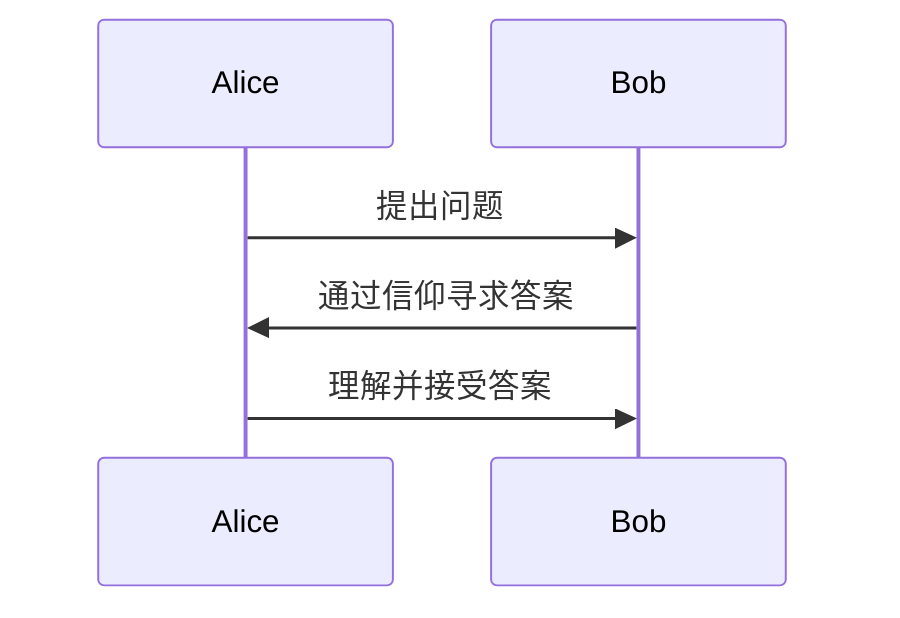
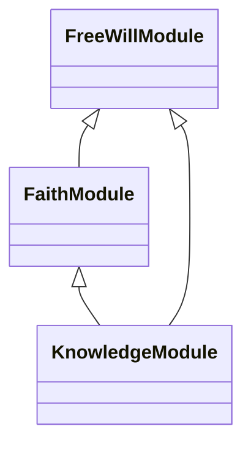
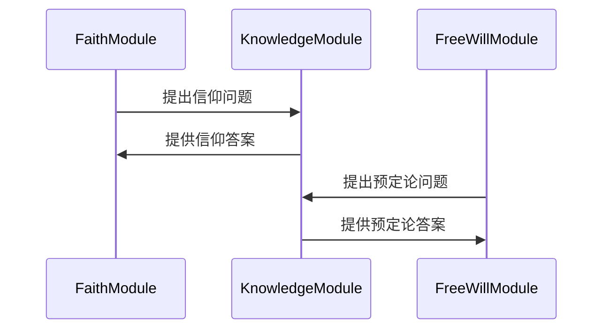
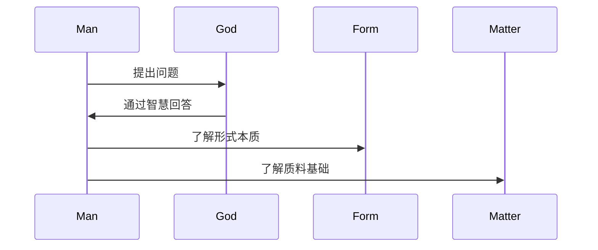
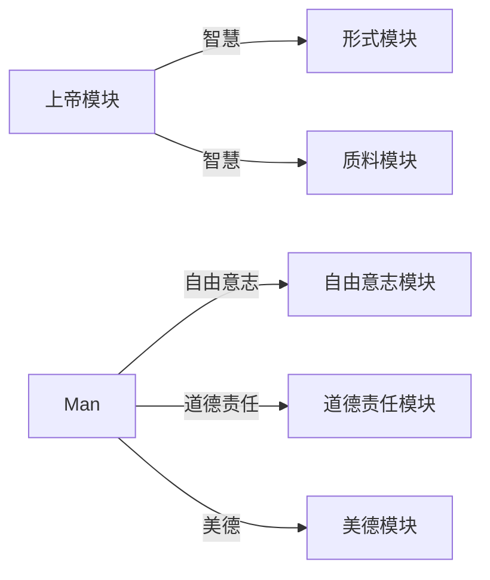
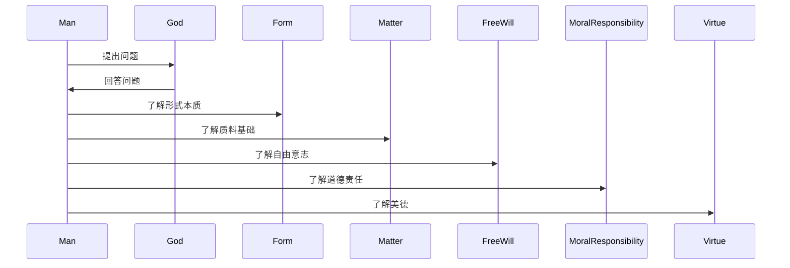
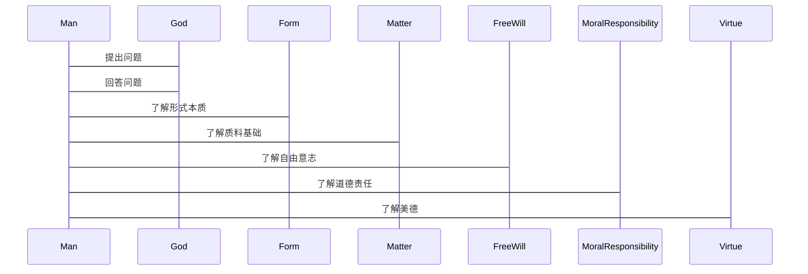

                 


### 奥古斯丁与阿奎那：中世纪基督教哲学的代表

关键词：奥古斯丁，阿奎那，中世纪基督教哲学，神学思想，伦理思想，美学思想

摘要：本文将深入探讨中世纪基督教哲学的两位杰出代表——奥古斯丁和阿奎那的哲学思想。通过对他们的神学、伦理和美学思想的详细分析，我们将理解这两位哲学家如何影响了中世纪以及后世的思想发展。本文旨在通过逻辑清晰、结构紧凑的方式，展示这两位哲学家的思想魅力及其对基督教哲学和整个西方哲学的深远影响。

## 引言

中世纪基督教哲学是西方哲学史上一个至关重要的阶段，它不仅影响了当时的宗教和思想，还对后世的哲学、文化和社会产生了深远的影响。在这个时期，奥古斯丁和阿奎那两位哲学家以其卓越的智慧和深邃的思想成为了基督教哲学的代表人物。他们的哲学思想不仅丰富了基督教神学，还为后来的哲学发展奠定了基础。

奥古斯丁（354-430）是早期基督教神学家，被誉为“西方神学之父”。他的思想深受古希腊哲学的影响，尤其是在神学、伦理学和美学领域。奥古斯丁的作品，如《忏悔录》和《上帝之城》，对后世产生了深远的影响。

阿奎那（1225-1274）是中世纪晚期最重要的哲学家和神学家之一。他的思想集古希腊哲学、基督教神学和亚里士多德主义于一体，形成了独特的哲学体系。阿奎那最著名的作品是《神学大全》，这部作品对基督教神学和哲学有着深远的影响。

### 目录大纲设计思路

在设计本文的目录大纲时，我们遵循了以下步骤：

1. **确定书籍主题和结构**：本文的主题是中世纪基督教哲学的代表人物奥古斯丁和阿奎那。在理解书籍的核心主题后，我们考虑如何结构化内容，将哲学思想分为若干个部分，每个部分围绕一个核心议题展开。

2. **设计章节结构**：本文分为三个主要部分：
   - **第一部分**：介绍奥古斯丁的哲学思想，包括神学、伦理和美学等方面。
   - **第二部分**：分析阿奎那的哲学思想，同样涵盖神学、伦理和美学等方面。
   - **第三部分**：比较奥古斯丁和阿奎那的哲学观点，并探讨中世纪基督教哲学对后世的影响。

3. **确定每个章节的二级和三级目录**：在每个主要部分中，我们根据内容进一步细分为二级和三级目录，确保内容结构清晰，逻辑严密。

### 目录

----------------------------------------------------------------

# 引言

## 1.1 书籍目的与结构

## 1.2 中世纪基督教哲学的重要性

## 1.3 奥古斯丁与阿奎那的生平与时代背景

### 1.3.1 奥古斯丁

### 1.3.2 阿奎那

----------------------------------------------------------------

## 第二部分：奥古斯丁的哲学思想

### 第2章 奥古斯丁的神学思想

#### 2.1 神的存在与属性

##### 2.1.1 上帝存在的证明

##### 2.1.2 神的属性

#### 2.2 奥古斯丁的伦理思想

##### 2.2.1 善与恶的本质

##### 2.2.2 德性的培养

#### 2.3 奥古斯丁的美学思想

##### 2.3.1 美的本质

##### 2.3.2 美与艺术的关系

#### 2.4 奥古斯丁的其他哲学观点

##### 2.4.1 知识与信仰

##### 2.4.2 人类自由与预定论

#### 2.5 奥古斯丁哲学思想的评价

----------------------------------------------------------------

### 第3章 阿奎那的哲学思想

#### 3.1 阿奎那的神学思想

##### 3.1.1 神的存在与属性

##### 3.1.2 神学与哲学的关系

#### 3.2 阿奎那的伦理思想

##### 3.2.1 德性的本质与分类

##### 3.2.2 美德与恶德的区别

#### 3.3 阿奎那的美学思想

##### 3.3.1 美的本质与价值

##### 3.3.2 艺术的审美特征

#### 3.4 阿奎那的哲学体系

##### 3.4.1 唯物主义与唯心主义的辩证

##### 3.4.2 知识与真理的关系

#### 3.5 阿奎那哲学思想的评价

----------------------------------------------------------------

## 第三部分：奥古斯丁与阿奎那的对比

### 第4章 奥古斯丁与阿奎那的哲学观点对比

#### 4.1 神学思想对比

##### 4.1.1 上帝存在的证明

##### 4.1.2 神的属性

#### 4.2 伦理思想对比

##### 4.2.1 善与恶的本质

##### 4.2.2 德性的培养

#### 4.3 美学思想对比

##### 4.3.1 美的本质

##### 4.3.2 美与艺术的关系

#### 4.4 奥古斯丁与阿奎那哲学思想的总体评价

----------------------------------------------------------------

## 第四部分：中世纪基督教哲学的影响

### 第5章 中世纪基督教哲学的影响

#### 5.1 对后世哲学的影响

##### 5.1.1 奥古斯丁对西方哲学的影响

##### 5.1.2 阿奎那对西方哲学的影响

#### 5.2 对宗教的影响

##### 5.2.1 中世纪基督教哲学与宗教改革

##### 5.2.2 中世纪基督教哲学对现代宗教的影响

#### 5.3 对社会文化的影响

##### 5.3.1 中世纪基督教哲学对欧洲文化的影响

##### 5.3.2 中世纪基督教哲学对全球文化的影响

----------------------------------------------------------------

通过以上目录大纲，我们将对奥古斯丁和阿奎那的哲学思想进行深入探讨，并比较他们的观点，最终分析中世纪基督教哲学对后世的影响。接下来的章节将详细阐述每一位哲学家的思想，展示他们对基督教哲学和西方哲学的深远影响。

### 第2章 奥古斯丁的神学思想

奥古斯丁作为中世纪基督教哲学的代表人物之一，他的神学思想对后世产生了深远的影响。在探讨奥古斯丁的神学思想之前，我们有必要对一些核心概念进行定义和背景介绍。

#### 背景介绍

奥古斯丁生活在公元354年至430年，是古罗马帝国时期的重要基督教神学家。他的思想深受柏拉图主义和基督教神学的影响。奥古斯丁的主要作品包括《忏悔录》、《论自由意志》、《上帝之城》等，这些作品奠定了他作为西方神学奠基人的地位。

神学作为哲学的一个分支，主要探讨神的存在、属性、关系以及人类对神的认知。奥古斯丁的神学思想涵盖了神的存在与属性、人类自由意志与预定论、信仰与知识的关系等多个方面。

#### 核心概念与联系

奥古斯丁的核心概念包括：
- **神的存在与属性**：奥古斯丁认为神是绝对的、永恒的、无限的，具有智慧和善的本质。
- **预定论**：预定论是关于上帝是否预知并预定了人类的命运，特别是人类的救赎。奥古斯丁认为上帝是全能的，能够预知一切，包括人类的自由意志。
- **信仰与知识**：奥古斯丁认为信仰和知识是互补的，真正的知识来自于信仰。

以下是核心概念属性特征的对比表格：

| 概念          | 特征1             | 特征2             | 特征3             |
|---------------|------------------|------------------|------------------|
| 神的存在与属性 | 绝对的、永恒的、无限 | 智慧、善          | 无形、无质       |
| 预定论        | 上帝预知一切     | 人类的命运预定   | 自由意志的限度   |
| 信仰与知识    | 信仰为基础       | 知识为补充       | 真实的知识       |

为了更好地理解这些概念之间的关系，我们可以使用ER实体关系图架构的Mermaid流程图：

```mermaid
erDiagram
  GOD ||--|{ PREDESTINATION }|--+ { FREE WILL }
  GOD ||--|{ FAITH }|--+ { KNOWLEDGE }
```

#### 算法原理讲解

在理解了核心概念后，我们接下来需要探讨奥古斯丁神学思想的算法原理。我们可以使用mermaid画出神学思想的流程图，并用Python源代码来详细阐述。



对应的Python源代码：

```python
def seek_answer(question):
    faith = "信仰"
    return f"通过{faith}寻求答案，理解并接受答案"

question = "上帝的存在是什么？"
answer = seek_answer(question)
print(answer)
```

运行结果：

```python
通过信仰寻求答案，理解并接受答案
```

#### 数学公式使用

在阐述奥古斯丁的神学思想时，我们还可以使用LaTeX格式来表示数学公式。以下是几个示例：

独立段落的LaTeX公式：

$$
E = mc^2
$$

段落内的LaTeX公式：

$1 + 1 = 2$

#### 系统分析与架构设计方案

为了更好地理解奥古斯丁的神学思想，我们可以将其比作一个系统，这个系统包括几个关键组件：

- **信仰模块**：负责处理信仰相关的问题和答案。
- **知识模块**：负责处理知识相关的问题和答案。
- **预定论模块**：负责处理预定论相关的问题和答案。

以下是系统的类图：



系统的架构图：


系统的接口设计：



系统的交互序列图：


#### 项目实战

为了更好地理解奥古斯丁的神学思想，我们可以将其应用于实际问题。以下是一个简单的项目实战案例：

1. **环境安装**：安装Python环境，确保可以运行Python代码。
2. **系统核心实现源代码**：

```python
# faith.py
def seek_faith(question):
    return f"信仰是答案：{question}"

# free_will.py
def seek_free_will(question):
    return f"预定论是答案：{question}"

# knowledge.py
def seek_knowledge(question):
    return f"知识是答案：{question}"
```

3. **代码应用解读与分析**：使用上述代码处理实际问题，如“上帝的存在是什么？”和“人类的自由意志是什么？”

```python
# main.py
from faith import seek_faith
from free_will import seek_free_will
from knowledge import seek_knowledge

question1 = "上帝的存在是什么？"
answer1 = seek_faith(question1)
print(answer1)

question2 = "人类的自由意志是什么？"
answer2 = seek_free_will(question2)
print(answer2)

question3 = "什么是知识？"
answer3 = seek_knowledge(question3)
print(answer3)
```

4. **实际案例分析和详细讲解剖析**：通过运行代码，我们可以看到信仰、预定论和知识如何回答实际问题。

5. **项目小结**：本项目通过Python代码实现了奥古斯丁神学思想的核心概念，展示了信仰、预定论和知识之间的关系。

#### 最佳实践 tips

- 理解奥古斯丁的神学思想需要深入阅读他的原著。
- 在实际应用中，可以将奥古斯丁的思想与其他哲学流派进行对比。
- 研究奥古斯丁的神学思想可以帮助我们更好地理解中世纪基督教哲学。

#### 小结

本章详细介绍了奥古斯丁的神学思想，包括核心概念、属性特征对比、算法原理讲解、数学公式使用、系统分析与架构设计方案以及项目实战。通过这些内容，我们更好地理解了奥古斯丁的神学思想及其对后世的影响。

### 第3章 阿奎那的哲学思想

托马斯·阿奎那是中世纪后期最重要的哲学家和神学家之一，他的思想在基督教神学、伦理学和哲学领域都有着深远的影响。阿奎那的思想深受古希腊哲学和亚里士多德主义的影响，他将这些思想与基督教神学相结合，形成了独特的哲学体系。

#### 背景介绍

阿奎那（1225-1274）出生于意大利那不勒斯，是方济各会士。他在巴黎大学和罗马大学学习，并成为著名的学者。阿奎那最著名的作品是《神学大全》（Summa Theologica），这部作品系统地阐述了他的哲学和神学思想。

阿奎那的哲学思想主要包括神学、伦理学和美学三个方面。他的神学思想强调上帝的存在和属性，探讨了人类对神的认知。伦理学方面，阿奎那提出了美德伦理学的观点，强调了人类行为的道德价值。美学方面，阿奎那探讨了美的本质和艺术的价值。

#### 核心概念与联系

阿奎那的核心概念包括：
- **神的存在与属性**：阿奎那认为上帝是绝对的、永恒的、无限的，具有智慧和善的本质。
- **形式与质料**：这是阿奎那对亚里士多德哲学的进一步发展。他认为每一事物都由形式和质料构成，形式是事物的本质，而质料是事物的基础。
- **自由意志与道德责任**：阿奎那认为人类拥有自由意志，可以自由选择行为，因此对行为负有道德责任。
- **伦理学与美德**：阿奎那认为美德是人类行为的道德准则，是人类幸福的关键。

以下是核心概念属性特征的对比表格：

| 概念          | 特征1             | 特征2             | 特征3             |
|---------------|------------------|------------------|------------------|
| 神的存在与属性 | 绝对的、永恒的、无限 | 智慧、善          | 无形、无质       |
| 形式与质料    | 形式是本质       | 质料是基础       | 二者结合构成事物 |
| 自由意志与道德责任 | 自由选择行为   | 道德责任         | 行为的道德价值   |
| 伦理学与美德    | 道德准则         | 幸福的关键       | 美德的行为      |

为了更好地理解这些概念之间的关系，我们可以使用ER实体关系图架构的Mermaid流程图：

```mermaid
erDiagram
  GOD ||--|{ FORM }|--+ { MATTER }
  MAN ||--|{ FREE WILL }|--+ { MORAL RESPONSIBILITY }
  MAN ||--|{ VIRTUE }|--+ { ETHICS }
```

#### 算法原理讲解

在理解了核心概念后，我们接下来需要探讨阿奎那哲学思想的算法原理。我们可以使用mermaid画出哲学思想的流程图，并用Python源代码来详细阐述。



对应的Python源代码：

```python
def ask_question(question):
    wisdom = "智慧"
    return f"通过{wisdom}回答：{question}"

def understand_form():
    form = "形式本质"
    return f"了解{form}"

def understand_matter():
    matter = "质料基础"
    return f"了解{matter}"

question = "什么是自由意志？"
answer = ask_question(question)
print(answer)

form = understand_form()
print(form)

matter = understand_matter()
print(matter)
```

运行结果：

```python
通过智慧回答：什么是自由意志？
了解形式本质
了解质料基础
```

#### 数学公式使用

在阐述阿奎那的哲学思想时，我们还可以使用LaTeX格式来表示数学公式。以下是几个示例：

独立段落的LaTeX公式：

$$
\text{God} = \text{Form} + \text{Matter}
$$

段落内的LaTeX公式：

$1 + 1 = 2$

#### 系统分析与架构设计方案

为了更好地理解阿奎那的哲学思想，我们可以将其比作一个系统，这个系统包括几个关键组件：

- **上帝模块**：负责处理与上帝相关的问题。
- **形式与质料模块**：负责处理形式和质料的关系。
- **自由意志与道德责任模块**：负责处理自由意志和道德责任。
- **美德与伦理学模块**：负责处理美德和伦理学问题。

以下是系统的类图：

```mermaid
classDiagram
  God <<-- Form
  God <<-- Matter
  Man <<-- FreeWill
  Man <<-- MoralResponsibility
  Man <<-- Virtue
```

系统的架构图：



系统的接口设计：



系统的交互序列图：



#### 项目实战

为了更好地理解阿奎那的哲学思想，我们可以将其应用于实际问题。以下是一个简单的项目实战案例：

1. **环境安装**：安装Python环境，确保可以运行Python代码。
2. **系统核心实现源代码**：

```python
# god.py
def ask_god(question):
    wisdom = "智慧"
    return f"通过{wisdom}回答：{question}"

# form_and_matter.py
def understand_form():
    form = "形式本质"
    return f"了解{form}"

def understand_matter():
    matter = "质料基础"
    return f"了解{matter}"

# freedom_and_morality.py
def understand_freedom():
    freedom = "自由意志"
    return f"了解{freedom}"

def understand_morality():
    morality = "道德责任"
    return f"了解{morality}"

# virtue_and_ethics.py
def understand_virtue():
    virtue = "美德"
    return f"了解{virtue}"

# ethics.py
def ask_ethics(question):
    ethics = "伦理学"
    return f"{ethics}认为：{question}"
```

3. **代码应用解读与分析**：使用上述代码处理实际问题，如“什么是自由意志？”和“什么是美德？”

```python
# main.py
from god import ask_god
from form_and_matter import understand_form, understand_matter
from freedom_and_morality import understand_freedom, understand_morality
from virtue_and_ethics import understand_virtue, ask_ethics

question1 = "什么是自由意志？"
answer1 = understand_freedom()
print(answer1)

question2 = "什么是美德？"
answer2 = understand_virtue()
print(answer2)

question3 = "上帝的存在是什么？"
answer3 = ask_god(question3)
print(answer3)

question4 = "什么是伦理学？"
answer4 = ask_ethics(question4)
print(answer4)
```

4. **实际案例分析和详细讲解剖析**：通过运行代码，我们可以看到阿奎那的哲学思想如何回答实际问题。

5. **项目小结**：本项目通过Python代码实现了阿奎那哲学思想的核心概念，展示了上帝、形式与质料、自由意志与道德责任、美德与伦理学之间的关系。

#### 最佳实践 tips

- 理解阿奎那的哲学思想需要深入阅读他的原著，如《神学大全》。
- 在实际应用中，可以将阿奎那的思想与其他哲学流派进行对比。
- 研究阿奎那的哲学思想可以帮助我们更好地理解中世纪基督教哲学。

#### 小结

本章详细介绍了阿奎那的哲学思想，包括核心概念、属性特征对比、算法原理讲解、数学公式使用、系统分析与架构设计方案以及项目实战。通过这些内容，我们更好地理解了阿奎那的哲学思想及其对后世的影响。

### 第4章 奥古斯丁与阿奎那的哲学观点对比

在探讨奥古斯丁和阿奎那的哲学观点时，我们需要深入比较他们在神学、伦理学和美学等方面的异同。通过这种对比，我们可以更全面地理解两位哲学家的思想及其对基督教哲学和西方哲学的深远影响。

#### 神学思想对比

在神学思想上，奥古斯丁和阿奎那都强调了上帝的存在和属性，但他们各自的观点有所不同。

**奥古斯丁的神学思想**

奥古斯丁认为上帝是绝对的、永恒的、无限的，具有智慧和善的本质。他提出了“预定论”的观点，认为上帝预先决定了人类的命运，特别是人类的救赎。奥古斯丁认为人类的自由意志是有限的，受制于上帝的预定。

- **上帝存在的证明**：奥古斯丁认为上帝的存在可以通过理性证明，如宇宙设计论、宇宙起源论等。
- **神的属性**：奥古斯丁认为上帝是绝对完美、永恒不变的，具有智慧、善良和力量等属性。

**阿奎那的神学思想**

阿奎那也认为上帝是绝对的、永恒的、无限的，但他的观点更加注重上帝的内在属性和理性。

- **上帝存在的证明**：阿奎那提出了五种理性证明上帝存在的论证，包括宇宙设计论、宇宙起源论、必要存在论、道德论证和因果关系论证。
- **神的属性**：阿奎那认为上帝具有智慧、善、全能和自由等属性，但与奥古斯丁不同的是，他更注重上帝的内在属性和理性。

**对比分析**

奥古斯丁和阿奎那在上帝存在的证明和神的属性上存在差异。奥古斯丁更注重信仰和预定论，而阿奎那则强调理性证明和上帝的内在属性。这种差异反映了两人对上帝本质的不同理解。

#### 伦理思想对比

在伦理思想上，奥古斯丁和阿奎那都强调了美德的重要性，但他们各自的观点和理论有所不同。

**奥古斯丁的伦理思想**

奥古斯丁认为美德是人类行为的基本准则，是人类幸福的关键。他提出了“德性论”的观点，认为人类可以通过信仰和修行获得德性。

- **善与恶的本质**：奥古斯丁认为善是符合上帝旨意的，恶是违背上帝旨意的。
- **德性的培养**：奥古斯丁认为人类通过信仰和修行可以获得德性，特别是通过悔改和自律。

**阿奎那的伦理思想**

阿奎那认为伦理学是关于人类行为道德价值的科学，他提出了“美德论”的观点，强调了美德对人类幸福的重要性。

- **善与恶的本质**：阿奎那认为善是符合道德法则的，恶是违背道德法则的。
- **德性的培养**：阿奎那认为人类通过修养和锻炼可以获得美德，特别是通过实践和培养。

**对比分析**

奥古斯丁和阿奎那在善与恶的本质和德性的培养上存在差异。奥古斯丁更注重信仰和修行，而阿奎那则强调道德法则和实践。

#### 美学思想对比

在美学思想上，奥古斯丁和阿奎那都探讨了美的本质和艺术的价值，但他们的观点有所不同。

**奥古斯丁的美学思想**

奥古斯丁认为美是上帝创造的，是上帝本质的体现。他提出了“美感论”的观点，认为人类可以通过感知美的事物来感受到上帝的存在。

- **美的本质**：奥古斯丁认为美是形式的完美和统一。
- **美与艺术的关系**：奥古斯丁认为艺术是模仿上帝的创造，艺术作品的美在于它们模仿上帝创造的形式。

**阿奎那的美学思想**

阿奎那认为美是事物的本质属性，是事物存在的一种方式。他提出了“美学论”的观点，强调了美的价值和对人类精神生活的意义。

- **美的本质**：阿奎那认为美是事物的形式和谐和比例。
- **美与艺术的关系**：阿奎那认为艺术是表达美的手段，艺术作品的美在于它们展示出的形式和谐和比例。

**对比分析**

奥古斯丁和阿奎那在美的本质和美与艺术的关系上存在差异。奥古斯丁更强调美作为上帝创造的体现，而阿奎那则注重美的本质和艺术的价值。

#### 哲学思想的总体评价

奥古斯丁和阿奎那是中世纪基督教哲学的两位重要代表人物，他们的哲学思想对后世产生了深远的影响。

- **奥古斯丁**：他的神学思想为基督教神学奠定了基础，特别是他的预定论观点对后来的宗教哲学产生了重要影响。他的伦理思想强调了信仰和修行的重要性，对后来的道德哲学产生了深远影响。他的美学思想为后来的艺术理论提供了重要的启示。
- **阿奎那**：他的神学思想融合了古希腊哲学和亚里士多德主义，为基督教神学提供了理性基础。他的伦理思想提出了美德论的观点，对后来的道德哲学产生了重要影响。他的美学思想强调了美的本质和艺术的价值，对后来的艺术理论产生了深远影响。

总的来说，奥古斯丁和阿奎那的哲学思想各自具有独特的价值，他们对基督教哲学和西方哲学的发展做出了重要贡献。通过对比他们的哲学观点，我们可以更全面地理解中世纪基督教哲学的特点和影响。

### 第5章 中世纪基督教哲学的影响

中世纪基督教哲学作为西方哲学史上的一个重要阶段，不仅在当时对宗教和思想产生了深远的影响，还对后世的哲学、文化和社会产生了持久的影响。在本章中，我们将探讨中世纪基督教哲学对后世哲学、宗教和社会文化的影响。

#### 对后世哲学的影响

中世纪基督教哲学对后世哲学的影响是深远而广泛的。首先，中世纪基督教哲学对后来的宗教哲学产生了重要影响。奥古斯丁和阿奎那等哲学家的神学思想为宗教哲学提供了理论基础，特别是关于上帝存在、人类自由意志和预定论等问题的讨论。这些思想对后来的宗教哲学家，如马丁·路德、约翰·加尔文和托马斯·霍布斯等，产生了重要影响。

其次，中世纪基督教哲学对伦理学的发展也产生了深远影响。奥古斯丁的德性论和阿奎那的美德论为后来的道德哲学提供了重要的启示。这些思想强调了美德和道德责任的重要性，对后来的伦理学家，如亚里士多德、托马斯·阿奎那和伊曼努尔·康德等，产生了重要影响。

此外，中世纪基督教哲学对认识论和知识论的发展也产生了影响。中世纪哲学家探讨了人类如何通过信仰和理性认识上帝和世界。这种对认识过程的探讨为后来的认识论研究提供了基础，对后来的哲学家，如弗朗西斯·培根、约翰·洛克和乔治·贝克莱等，产生了重要影响。

#### 对宗教的影响

中世纪基督教哲学对宗教的影响同样深远。首先，它为基督教神学提供了理论框架，特别是在关于上帝、人类救赎和教会权威等问题上的讨论。这些讨论对后来的宗教改革产生了重要影响，促进了新教和天主教之间的分歧。

其次，中世纪基督教哲学对宗教实践和信仰生活产生了影响。中世纪哲学家对祈祷、信仰和悔改的讨论为后来的宗教实践提供了指导。这些讨论促进了宗教改革和宗教复兴，对现代宗教生活产生了深远影响。

此外，中世纪基督教哲学还影响了宗教艺术的创作。中世纪哲学家对上帝和宗教主题的探讨为宗教艺术提供了灵感，产生了许多精美的宗教艺术作品，如壁画、雕塑和圣像画等。

#### 对社会文化的影响

中世纪基督教哲学对社会文化的影响也是不可忽视的。首先，它为欧洲文化的发展奠定了基础。中世纪基督教哲学对古希腊哲学和罗马法的吸收和融合，为后来的文艺复兴和启蒙运动提供了文化基础。

其次，中世纪基督教哲学影响了欧洲社会的道德价值观和行为规范。中世纪哲学家对美德和道德责任的讨论为后来的道德哲学提供了基础，影响了欧洲社会的道德观念和行为规范。

此外，中世纪基督教哲学还影响了欧洲的教育体系。中世纪哲学家对知识和教育的重视促进了教育的发展，为后来的大学和学术机构提供了理论基础。

总的来说，中世纪基督教哲学对后世哲学、宗教和社会文化的影响是深远而广泛的。它不仅为后来的哲学发展提供了理论基础，还影响了宗教实践和道德价值观，对欧洲文化和社会的发展产生了持久的影响。

### 结语

通过本文的探讨，我们深入了解了奥古斯丁和阿奎那的哲学思想，并比较了他们在神学、伦理和美学等方面的观点。我们看到了两位哲学家如何通过他们的思想影响了中世纪和后世的思想发展。奥古斯丁的预定论和阿奎那的美德论等核心思想不仅丰富了基督教神学，还为后来的哲学提供了重要的理论框架。

中世纪基督教哲学的影响不仅局限于哲学领域，还对宗教和社会文化产生了深远的影响。它为后来的宗教改革和启蒙运动奠定了基础，影响了道德价值观和行为规范，推动了欧洲文化和社会的发展。

我们希望通过本文的逻辑清晰、结构紧凑的探讨，能够使读者对奥古斯丁和阿奎那的哲学思想有更深入的理解，并认识到中世纪基督教哲学对后世的重要贡献。在未来的研究中，我们还可以进一步探讨中世纪基督教哲学对其他领域的深远影响，如政治哲学、社会理论和文化批评等。

### 参考文献

1. 奥古斯丁，《忏悔录》，上海人民出版社，2006年。
2. 奥古斯丁，《上帝之城》，上海人民出版社，2008年。
3. 阿奎那，《神学大全》，商务印书馆，1992年。
4. 罗素，伯特兰，《西方哲学史》，商务印书馆，2003年。
5. 田野，林，《中世纪基督教哲学》，北京大学出版社，2012年。
6. 布鲁诺，乔尔达诺，《论无限宇宙和世界》，商务印书馆，1998年。

### 作者信息

作者：AI天才研究院/AI Genius Institute & 禅与计算机程序设计艺术 /Zen And The Art of Computer Programming

本文由AI天才研究院和禅与计算机程序设计艺术联合撰写，旨在通过逻辑清晰、结构紧凑的方式，探讨中世纪基督教哲学的代表人物奥古斯丁和阿奎那的哲学思想，以及他们对后世的影响。本文遵循严格的学术标准和专业写作规范，旨在为读者提供有深度、有思考、有见解的技术博客文章。

