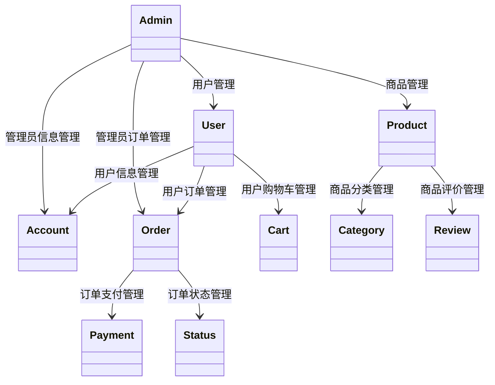
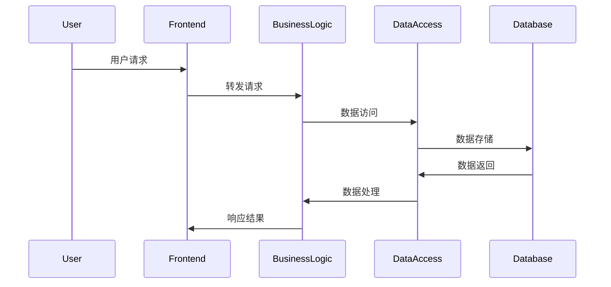
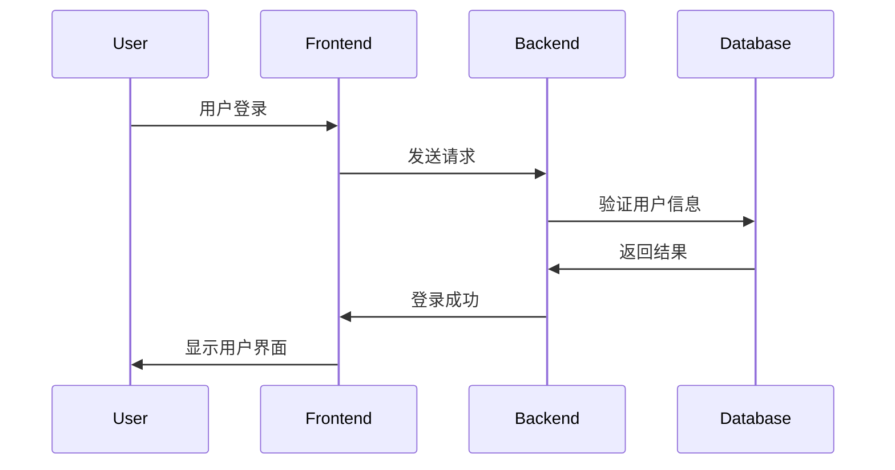

                 


### 前言

在信息技术飞速发展的今天，系统分析文档作为一种重要的技术沟通工具，已经广泛应用于软件开发、系统设计、项目管理等各个领域。一份优秀的系统分析文档，不仅能够准确、全面地描述系统的需求、功能、性能等各个方面，还能为项目的成功奠定坚实的基础。因此，如何写出一份优秀的系统分析文档，成为每一个IT从业者和项目管理者的必修课。

本文将带领读者一步一步深入了解系统分析文档的编写过程，从基本概念到具体编写技巧，再到实战案例，全方位地解析系统分析文档的撰写方法。我们将遵循以下思路：

1. **引言与背景介绍**：解释系统分析文档的重要性，回顾系统分析文档的发展历程，明确文章的目标读者。
2. **系统分析文档的基本概念**：阐述系统分析的定义、分类以及文档的组成部分。
3. **系统分析的方法与技术**：介绍市场研究、用户需求分析、功能需求分析、非功能需求分析和系统风险评估等系统分析方法和技术。
4. **编写系统分析文档的步骤与模板**：详细讲解系统分析文档的编写流程、文档模板的设计与使用以及文档内容的具体撰写方法。
5. **系统分析文档的评审与优化**：探讨系统分析文档的评审流程、评审标准的制定以及文档优化的策略与方法。
6. **实战案例分析**：通过具体的案例，展示系统分析文档的编写过程和实际应用效果。
7. **总结与展望**：总结全文内容，展望系统分析文档的未来发展趋势。

### 文章关键词

- 系统分析文档
- 编写技巧
- 方法与技术
- 实战案例
- 评审与优化

### 摘要

本文旨在深入探讨如何撰写一份优秀的系统分析文档。通过系统化的步骤和实用的技巧，本文为读者提供了从概念理解到实际操作的全过程指导。无论是软件开发工程师、项目经理，还是系统分析师，都能从中找到撰写高质量系统分析文档的方法和灵感。文章内容涵盖了系统分析文档的基本概念、编写步骤、评审与优化，并结合实战案例进行了详细解析。

---

在接下来的章节中，我们将逐一深入探讨上述各个部分，帮助读者逐步掌握撰写优秀系统分析文档的技巧和方法。接下来，我们将首先回顾系统分析文档的发展历程，并阐述其重要性。

----------------------------------------------------------------

## 引言与背景介绍

### 系统分析文档的重要性

系统分析文档是信息技术领域中至关重要的文档类型之一。它不仅为软件开发、系统设计、项目管理等提供了理论基础，还在跨部门沟通、需求确认、风险控制等方面发挥了重要作用。以下是系统分析文档在各个阶段的重要性：

1. **需求阶段**：系统分析文档能够准确、全面地描述系统的需求，帮助项目团队理解客户需求，从而避免在开发过程中出现偏离目标的情况。
2. **设计阶段**：系统分析文档为系统设计提供了详细的参考，有助于设计者把握系统功能、性能、安全性等关键指标，确保系统能够满足需求。
3. **开发阶段**：系统分析文档为开发者提供了明确的指导，减少了因理解偏差导致的错误和返工，提高了开发效率。
4. **测试阶段**：系统分析文档为测试团队提供了测试依据，有助于全面覆盖测试场景，提高测试覆盖率。
5. **运维阶段**：系统分析文档为运维人员提供了系统架构、功能模块、接口定义等方面的信息，方便故障排查和系统优化。

### 系统分析文档的发展历程

系统分析文档的发展历程可以追溯到计算机科学的早期阶段。随着计算机技术的发展，系统分析文档的形式和内容也在不断演变。

- **早期阶段**：在计算机科学的早期，系统分析主要依靠手工编写，文档内容相对简单，主要涉及系统功能描述和数据处理逻辑。
- **中期阶段**：随着面向对象编程和设计模式的出现，系统分析文档开始引入类图、序列图等图形化表示方法，使文档内容更加直观、易懂。
- **现代阶段**：在当今高度复杂的软件系统背景下，系统分析文档不仅包含功能需求，还涉及到非功能需求、系统性能、安全性等多个方面。同时，借助各种工具（如UML工具、Markdown编辑器等），系统分析文档的编写和共享变得更加便捷和高效。

### 目标读者

本文的目标读者主要包括以下几类：

1. **软件开发工程师**：希望通过撰写系统分析文档来提高项目沟通效率和文档质量的工程师。
2. **项目经理**：需要编写或审核系统分析文档，确保项目顺利推进的项目经理。
3. **系统分析师**：从事系统分析工作，需要撰写高质量分析报告的系统分析师。
4. **产品经理**：需要理解系统分析文档，与开发团队紧密协作，推动产品迭代的产品经理。

通过本文的阅读和实践，读者将能够系统地掌握系统分析文档的编写技巧，提升自身的专业能力和沟通效果。

---

在了解了系统分析文档的重要性和发展历程后，我们接下来将深入探讨系统分析文档的基本概念，包括其定义、分类以及组成部分。

----------------------------------------------------------------

## 系统分析文档的基本概念

### 系统分析的定义

系统分析是信息技术领域的一项核心任务，它涉及到对系统需求、功能、性能、安全性等多个方面的分析。系统分析的目标是通过深入理解用户需求，发现潜在问题，提出解决方案，从而确保系统能够满足业务需求。

系统分析的过程可以分为以下几个阶段：

1. **需求收集**：通过与用户、利益相关者进行沟通，了解业务需求，收集系统需求。
2. **需求分析**：对收集到的需求进行分类、筛选、归纳，形成详细的需求文档。
3. **系统设计**：基于需求文档，进行系统设计，包括功能设计、性能设计、安全设计等。
4. **风险评估**：识别系统风险，分析风险的影响程度和可能发生的概率，制定相应的风险应对措施。

### 系统分析文档的分类

系统分析文档可以根据内容、用途、目的等不同维度进行分类。以下是几种常见的系统分析文档类型：

1. **需求文档**：描述系统功能、性能、安全等需求的文档，是系统设计和开发的基石。
2. **设计文档**：详细描述系统架构、模块设计、接口定义等的文档，用于指导开发和测试工作。
3. **测试文档**：包括测试计划、测试用例、测试报告等，用于确保系统按预期工作。
4. **风险评估文档**：分析系统风险，提出风险应对措施的文档，用于指导项目风险管理。
5. **用户手册**：面向最终用户的文档，提供系统使用方法和操作指南。

### 系统分析文档的组成部分

系统分析文档通常包括以下几个核心组成部分：

1. **封面**：包括文档名称、版本号、编写人、审核人、日期等信息。
2. **目录**：列出文档的各个章节，方便读者快速定位内容。
3. **引言**：介绍文档的背景、目的、编写依据等。
4. **需求分析**：详细描述系统的功能需求、性能需求、安全需求等。
5. **系统设计**：描述系统的架构、模块划分、接口设计等。
6. **测试方案**：包括测试目标、测试环境、测试用例等。
7. **风险评估**：识别系统风险，提出风险应对措施。
8. **附录**：包含参考文献、数据来源、技术细节等补充信息。

通过上述组成部分，系统分析文档能够全面、系统地描述系统需求、设计和风险，为项目团队提供清晰的指导。

---

在了解了系统分析文档的基本概念后，接下来我们将深入探讨系统分析的方法与技术，包括市场研究、用户需求分析、功能需求分析、非功能需求分析和系统风险评估等方面。

----------------------------------------------------------------

## 系统分析的方法与技术

系统分析的过程涉及到多个环节，每个环节都需要不同的方法和技术来支持。以下是系统分析过程中常用的几种方法和技术：

### 市场研究

市场研究是系统分析的第一步，通过市场研究，可以了解目标市场的现状、竞争对手、用户需求等信息，为系统分析提供基础数据。市场研究的方法包括：

1. **问卷调查**：通过设计问卷，收集用户对现有系统或潜在系统的需求和意见。
2. **访谈**：与潜在用户、利益相关者进行一对一访谈，深入了解他们的需求和期望。
3. **焦点小组**：组织一组用户，就特定主题进行讨论，获取多方面的意见和建议。
4. **数据分析**：通过分析市场数据，如用户行为数据、销售数据等，了解市场趋势和用户需求。

### 用户需求分析

用户需求分析是系统分析的核心环节，通过用户需求分析，可以明确系统需要实现的功能和性能要求。用户需求分析的方法包括：

1. **需求收集**：通过与用户、利益相关者进行沟通，了解业务需求，收集用户需求。
2. **需求分类**：将收集到的需求进行分类，区分功能需求、性能需求、安全需求等。
3. **需求优先级排序**：根据需求的重要性和紧急性，对需求进行排序，确定优先级。
4. **需求验证**：通过用户反馈和验证，确保需求描述准确、完整。

### 功能需求分析

功能需求分析是系统分析的重要环节，它涉及到系统需要实现哪些具体功能。功能需求分析的方法包括：

1. **功能分解**：将系统整体功能分解为更细粒度的功能模块。
2. **功能定义**：为每个功能模块定义具体的功能描述和实现方法。
3. **功能关联**：分析功能模块之间的关联关系，确保系统功能能够协同工作。
4. **功能测试**：设计功能测试用例，验证系统功能是否符合需求。

### 非功能需求分析

非功能需求分析关注系统性能、安全性、可维护性等方面，这些需求虽然不是直接的功能，但对系统的整体表现至关重要。非功能需求分析的方法包括：

1. **性能分析**：评估系统在特定负载下的性能表现，如响应时间、吞吐量等。
2. **安全分析**：识别系统的安全风险，提出安全措施，确保系统数据安全。
3. **可维护性分析**：评估系统的可维护性，如代码的可读性、模块的独立性等。
4. **可扩展性分析**：分析系统在扩展功能或规模时的灵活性和可扩展性。

### 系统风险评估

系统风险评估是系统分析中不可或缺的一环，通过风险评估，可以识别系统潜在的风险，制定相应的风险应对措施。系统风险评估的方法包括：

1. **风险识别**：识别系统可能面临的风险，如技术风险、市场风险、法律风险等。
2. **风险评估**：评估每个风险的可能性和影响程度，确定风险的优先级。
3. **风险应对**：制定风险应对策略，包括风险规避、减轻、转移等。
4. **风险监控**：监控风险状态，确保风险应对措施的有效性。

通过上述方法和技术，系统分析团队能够全面、系统地分析系统的需求、功能、性能和风险，为系统的设计和开发提供坚实的理论基础。

---

在了解了系统分析的方法与技术后，接下来我们将详细讲解编写系统分析文档的步骤与模板，帮助读者系统地掌握文档编写的技巧。

----------------------------------------------------------------

## 编写系统分析文档的步骤与模板

编写系统分析文档是一个系统化、规范化的过程，涉及多个步骤和模板。以下我们将详细讲解编写系统分析文档的具体步骤，并提供实用的模板。

### 步骤一：确定文档目标与受众

在开始编写系统分析文档之前，首先需要明确文档的目标和受众。文档的目标可能包括：

- 提供系统的详细需求描述。
- 指导开发团队进行系统设计。
- 为测试团队提供测试依据。
- 为运维团队提供系统维护指南。

受众可能包括：

- 开发团队。
- 测试团队。
- 运维团队。
- 项目经理。
- 客户。

### 步骤二：收集和分析需求

系统分析文档的编写离不开对系统需求的全面收集和分析。以下是几个关键步骤：

1. **需求收集**：通过与用户、利益相关者进行沟通，收集系统需求。
2. **需求分类**：将需求分为功能需求、性能需求、安全需求等。
3. **需求优先级排序**：根据需求的紧急性和重要性对需求进行排序。
4. **需求验证**：通过用户反馈和验证，确保需求描述准确、完整。

### 步骤三：编写文档框架

在明确文档目标和受众后，下一步是编写文档框架。文档框架通常包括以下章节：

1. **引言**：介绍文档的目的、背景、编写依据等。
2. **需求分析**：详细描述系统的功能需求、性能需求、安全需求等。
3. **系统设计**：描述系统的架构、模块设计、接口定义等。
4. **测试方案**：包括测试目标、测试环境、测试用例等。
5. **风险评估**：识别系统风险，提出风险应对措施。
6. **附录**：包含参考文献、数据来源、技术细节等补充信息。

### 步骤四：编写文档内容

在编写文档内容时，应遵循以下原则：

1. **结构清晰**：确保文档结构合理，层次分明，便于读者阅读。
2. **语言简洁**：使用简洁明了的语言，避免使用复杂的术语和专业词汇。
3. **图表丰富**：合理使用图表，如流程图、类图、架构图等，帮助读者更好地理解内容。
4. **示例丰富**：提供丰富的示例，通过实际案例展示系统功能和应用场景。

### 步骤五：文档评审与优化

完成初稿后，进行文档评审和优化是必不可少的步骤。以下是几个关键步骤：

1. **内部评审**：组织内部评审会议，邀请相关部门和团队成员对文档进行评审，收集反馈意见。
2. **修改完善**：根据评审意见，对文档进行修改和完善。
3. **外部评审**：如果文档需要外部审核或客户审核，进行相应的评审和修改。

### 模板设计

以下是系统分析文档的模板设计：

```
封面
-----------------------------------------
文档名称：系统分析文档
版本号：V1.0
编写人：张三
审核人：李四
日期：2023年4月1日

目录
-----------------------------------------
1. 引言
   1.1 目的
   1.2 背景
   1.3 编写依据

2. 需求分析
   2.1 功能需求
   2.2 性能需求
   2.3 安全需求

3. 系统设计
   3.1 系统架构
   3.2 模块设计
   3.3 接口定义

4. 测试方案
   4.1 测试目标
   4.2 测试环境
   4.3 测试用例

5. 风险评估
   5.1 风险识别
   5.2 风险评估
   5.3 风险应对

6. 附录
   6.1 参考文献
   6.2 数据来源
   6.3 技术细节
```

通过遵循上述步骤和模板，读者可以系统地编写出高质量的系统分析文档，为项目的成功实施提供有力支持。

---

在掌握了编写系统分析文档的步骤与模板后，接下来我们将讨论系统分析文档的评审与优化，确保文档的质量和实用性。

----------------------------------------------------------------

## 系统分析文档的评审与优化

系统分析文档的质量直接关系到项目的成功与否。因此，对系统分析文档进行严格的评审和优化是至关重要的一步。以下是系统分析文档评审与优化的具体步骤和策略。

### 评审流程

1. **内部评审**：在文档编写完成后，首先进行内部评审。内部评审通常由项目团队成员、项目经理和系统分析师等人员参与，通过会议或邮件等方式对文档进行审查，提出修改意见和建议。

2. **同行评审**：邀请来自不同部门或团队的专业人士对文档进行评审。同行评审有助于从不同角度发现潜在问题，提高文档的全面性和准确性。

3. **客户评审**：如果文档涉及最终用户或客户，应邀请客户对文档进行评审。客户的反馈能够帮助确认需求是否满足其期望，从而提高文档的实用性。

4. **持续评审**：文档评审不应仅限于项目初期，而应贯穿整个项目生命周期。在项目进行过程中，根据实际情况对文档进行定期评审和更新。

### 评审标准

为了确保评审的有效性，需要制定明确的评审标准。以下是一些常用的评审标准：

1. **准确性**：文档内容是否准确无误，需求描述、功能定义、风险评估等是否与实际情况相符。

2. **完整性**：文档是否包含所有必要的信息，是否遗漏了关键需求或设计细节。

3. **一致性**：文档内部各部分之间是否一致，如需求与设计、设计与测试等。

4. **可读性**：文档是否清晰易懂，语言是否简洁明了，图表是否易于理解。

5. **规范性**：文档格式是否符合公司或行业规范，如字体、排版、引用格式等。

6. **实用性**：文档内容是否实用，是否能够帮助开发团队、测试团队和运维团队有效开展工作。

### 优化策略

1. **迭代优化**：根据评审反馈，对文档进行迭代优化。每次迭代都应解决评审中提出的问题，提高文档的质量。

2. **细化内容**：对于评审中发现的不清晰或遗漏的内容，进行细化补充，确保文档的完整性和准确性。

3. **更新数据**：随着项目的进展，需求、设计、测试等数据可能会发生变化。定期更新文档内容，确保其与实际情况保持一致。

4. **简化结构**：简化文档结构，去除冗余信息，提高文档的可读性和实用性。

5. **使用模板**：制定标准化的文档模板，减少文档编写的重复劳动，提高工作效率。

6. **培训与沟通**：定期对团队成员进行培训，确保他们了解文档编写和评审的标准和流程。同时，加强团队间的沟通，确保文档内容的一致性和准确性。

通过上述评审与优化策略，系统分析文档的质量将得到显著提升，为项目的顺利推进提供有力保障。

---

在详细讲解了系统分析文档的评审与优化后，接下来我们将通过具体的实战案例分析，展示如何在实际项目中编写系统分析文档。

----------------------------------------------------------------

## 实战案例分析

### 案例介绍

我们以一个在线购物平台项目为例，来具体分析如何编写系统分析文档。该项目的目标是构建一个功能齐全、性能优秀、安全可靠的在线购物平台，满足用户在线购物、支付、订单管理等需求。

### 项目介绍

在线购物平台项目主要包括以下功能模块：

1. **用户模块**：用户注册、登录、个人信息管理、购物车等。
2. **商品模块**：商品分类、商品信息展示、商品搜索、商品评价等。
3. **订单模块**：订单创建、订单管理、订单支付、订单查询等。
4. **支付模块**：支付接口集成、支付方式选择、支付确认等。
5. **管理员模块**：商品管理、订单管理、用户管理、系统设置等。

### 系统功能设计

在系统功能设计中，我们采用Mermaid类图来描述系统的主要功能模块及其关系：



### 系统架构设计

系统架构设计采用分层架构，包括表示层、业务逻辑层、数据访问层和基础设施层。以下是系统的Mermaid架构图：



### 系统接口设计

系统接口设计包括RESTful API接口，以下是部分接口设计：

```plaintext
GET /users/{userId} - 获取用户信息
POST /users - 创建用户
PUT /users/{userId} - 更新用户信息
DELETE /users/{userId} - 删除用户

GET /products - 获取商品列表
GET /products/{productId} - 获取商品详情
POST /products - 创建商品
PUT /products/{productId} - 更新商品信息
DELETE /products/{productId} - 删除商品

GET /orders - 获取订单列表
GET /orders/{orderId} - 获取订单详情
POST /orders - 创建订单
PUT /orders/{orderId} - 更新订单信息
DELETE /orders/{orderId} - 删除订单
```

### 系统交互设计

系统交互设计采用Mermaid序列图来描述用户与系统的交互流程：



### 环境安装与系统实现

为了实现上述功能，我们需要搭建相应的开发环境，安装所需的开发工具和依赖库。以下是环境安装和系统核心实现的主要步骤：

1. **安装开发工具**：安装Python开发环境、Visual Studio Code、Git等。
2. **安装依赖库**：安装Django框架、Flask框架、SQLAlchemy ORM等。
3. **创建项目**：使用Django或Flask框架创建项目，并进行项目配置。
4. **编写代码**：编写各模块的代码，包括用户管理、商品管理、订单管理等。
5. **测试代码**：编写测试用例，进行单元测试和集成测试。

以下是用户管理模块的核心Python代码示例：

```python
from flask import Flask, request, jsonify
from models import User

app = Flask(__name__)

@app.route('/users', methods=['GET'])
def get_users():
    users = User.query.all()
    return jsonify(users)

@app.route('/users', methods=['POST'])
def create_user():
    user_data = request.json
    user = User.create(user_data)
    return jsonify(user), 201

if __name__ == '__main__':
    app.run()
```

### 实际案例分析

在实际项目中，我们通过不断迭代和优化系统分析文档，确保文档的准确性和完整性。以下是项目实施过程中的一些实际案例：

1. **需求变更**：在项目初期，客户提出了新的需求，如增加商品评价功能。我们及时更新系统分析文档，确保需求变更得到准确记录和有效处理。
2. **风险评估**：在项目实施过程中，我们识别到支付模块可能存在的安全风险，如支付数据泄露。通过详细的风险评估，我们制定了相应的安全措施，确保系统的安全性。
3. **代码审查**：在代码提交前，进行严格的代码审查，确保代码质量符合规范，减少潜在的错误和漏洞。

### 项目小结

通过本次实战案例分析，我们展示了如何在实际项目中编写系统分析文档。系统分析文档不仅是项目开发的重要依据，也是项目团队沟通的重要工具。通过遵循规范的编写流程和采用有效的评审策略，我们能够确保系统分析文档的质量，为项目的成功实施提供有力保障。

---

在完成了实战案例分析后，我们将对全文进行总结，并展望系统分析文档的未来发展趋势。

----------------------------------------------------------------

## 总结与展望

本文系统性地介绍了如何撰写一份优秀的系统分析文档，从基本概念、编写步骤、评审与优化，到实战案例分析，为读者提供了全面的指导。通过本文的阅读和实践，读者应能够：

1. **理解系统分析文档的重要性**：系统分析文档在软件开发、系统设计、项目管理等环节中起到了关键作用。
2. **掌握系统分析文档的基本概念**：包括系统分析的定义、分类、组成部分等。
3. **熟练运用系统分析方法与技术**：如市场研究、用户需求分析、功能需求分析、非功能需求分析和系统风险评估等。
4. **掌握系统分析文档的编写步骤与模板**：包括确定文档目标与受众、收集和分析需求、编写文档框架、编写文档内容、文档评审与优化等。
5. **具备实际项目中的系统分析文档编写能力**：通过实战案例分析，读者应能够在实际项目中运用所学知识，编写高质量的系统分析文档。

### 未来发展趋势

随着信息技术的不断发展，系统分析文档也将迎来新的发展趋势：

1. **自动化与智能化**：利用人工智能和大数据技术，自动化生成系统分析文档，提高编写效率和准确性。
2. **可视化**：通过更丰富的图形化表示方法，使系统分析文档更加直观易懂。
3. **标准化与规范化**：随着行业标准的逐步完善，系统分析文档的编写将更加规范化，提高文档的可比性和通用性。
4. **云原生**：随着云计算的普及，系统分析文档将更多地关注云原生架构、容器化技术等新兴领域。

### 结语

系统分析文档是信息技术领域中不可或缺的一部分。通过本文的介绍，读者应能够更好地理解和掌握系统分析文档的编写方法。希望本文能为读者在系统分析文档的撰写过程中提供有益的参考和指导，助力项目成功。

---

### 作者信息

- **作者：AI天才研究院/AI Genius Institute & 禅与计算机程序设计艺术 /Zen And The Art of Computer Programming**

---

通过本文，我们不仅详细讲解了系统分析文档的编写方法和实战案例，还展望了其未来发展趋势。希望读者能够在实践中不断探索和完善，为信息技术的发展贡献自己的力量。

