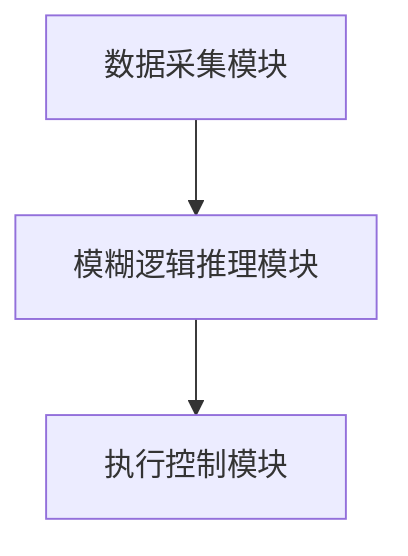
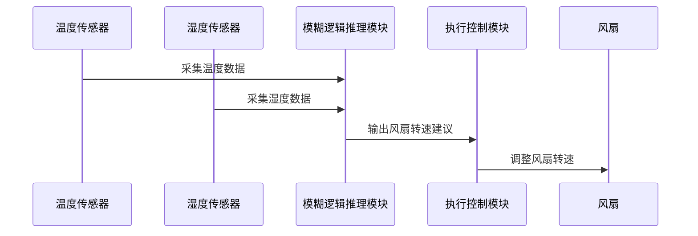
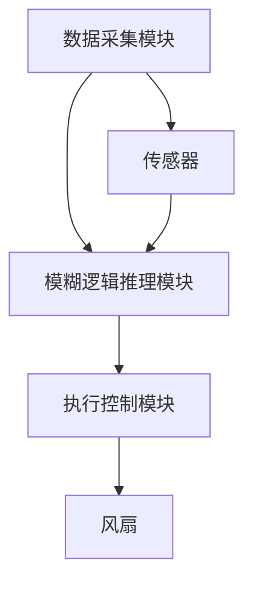
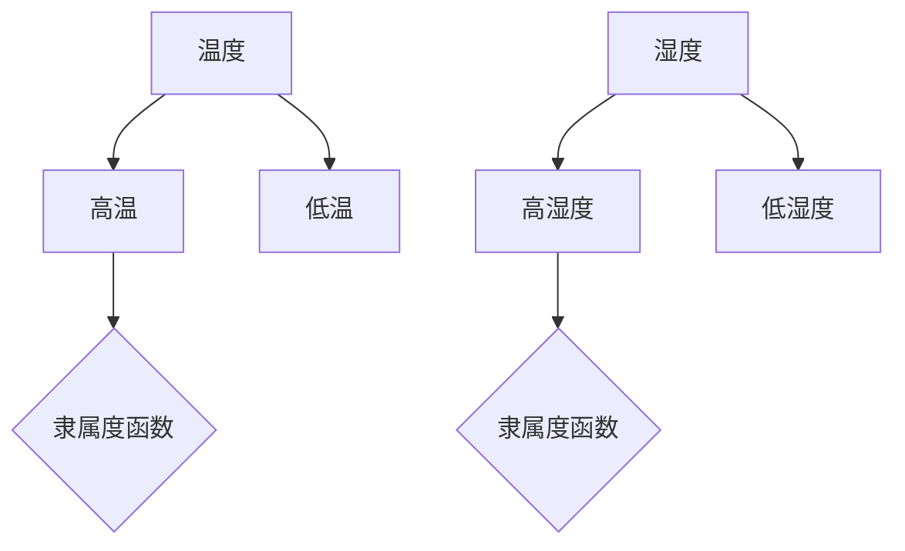
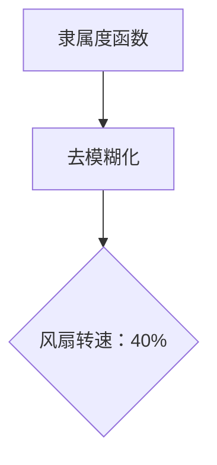

                 


### 引言

威拉德·冯·奎因（Willard Van Orman Quine），美国著名哲学家、逻辑学家、数学家，被誉为20世纪最伟大的逻辑学家之一。他的模糊性理论及其在模糊逻辑领域的应用，为处理复杂系统中的不确定性提供了新的视角和方法。本文将以威拉德·冯·奎因的模糊性理论为基础，深入探讨模糊逻辑的原理和应用，旨在为读者提供一个清晰、系统的理解框架。

模糊性理论起源于20世纪60年代，由美国数学家扎德（L.A. Zadeh）提出。扎德认为，现实世界中的许多现象都是模糊的，而非二元的。为了描述和处理这种模糊性，他引入了模糊集合的概念。随后，冯·奎因进一步发展了这一理论，将其应用于逻辑和人工智能领域，形成了模糊逻辑。

模糊逻辑的核心思想是，通过模糊化传统逻辑的二元判断，使得系统可以更好地处理现实世界中的不确定性。本文将逐步介绍模糊性理论的基础概念、数学模型、算法原理，以及模糊逻辑在不确定性的程序化处理中的应用。我们还将探讨模糊逻辑与人工智能的结合，以及其在智能系统设计中的应用前景。

### 背景介绍

模糊性理论的起源可以追溯到20世纪60年代，当时扎德提出了模糊集合的概念，以解决传统集合论在处理现实世界模糊现象时的局限性。扎德认为，现实世界中的许多现象，如“高度很高”、“老人”等，都是模糊的，而不是二元的。例如，一个人是否“高”，并不是绝对的，而是存在一个模糊的边界。扎德通过引入隶属度函数，定义了模糊集合，从而为模糊性理论奠定了基础。

随后，冯·奎因在扎德的工作基础上，进一步发展了模糊性理论。他提出，模糊逻辑可以作为一种处理不确定性的方法，从而为人工智能领域带来了新的工具。冯·奎因的模糊性理论不仅在哲学和逻辑学领域产生了深远影响，也在工程、医学、管理等多个领域得到了广泛应用。

模糊性理论的核心概念包括模糊集合、隶属度函数、模糊逻辑和模糊推理。模糊集合是模糊性理论的基础，它通过隶属度函数来描述元素对集合的模糊归属关系。隶属度函数的取值范围通常在0到1之间，表示元素对集合的隶属程度。模糊逻辑则是一种基于模糊集合的推理方法，它通过模糊化传统逻辑的二元判断，使得系统可以更好地处理不确定性。模糊推理则是模糊逻辑的核心算法，它通过模糊化前提和结论，进行推理得到模糊的结论。

模糊性理论的数学模型包括模糊集合的运算、模糊逻辑的运算和模糊推理的算法。模糊集合的运算包括并集、交集和补集等，它们与经典集合论中的运算类似，但考虑了隶属度函数的影响。模糊逻辑的运算包括模糊化、模糊推理和去模糊化等，它们是模糊逻辑处理不确定性的核心。模糊推理的算法包括模糊化前提和结论、模糊推理规则的应用和去模糊化结论等。

### 核心概念与联系

在深入探讨模糊性理论之前，我们首先需要了解其核心概念。以下是模糊性理论的一些关键概念：

#### 1. 模糊集合

模糊集合是模糊性理论的基础。与经典集合不同，模糊集合中的元素并不一定具有明确的归属，而是通过隶属度函数来描述其归属程度。隶属度函数是一个从集合U到[0,1]的映射，表示U中每个元素x对模糊集合A的隶属程度。

**隶属度函数**：\( \mu_A(x) \)，其中\( \mu_A(x) \in [0,1] \)

**示例**：假设我们有集合U = {小明，小红，小华，小刚}，定义一个模糊集合A，表示“老年人”，我们可以定义隶属度函数如下：

| 姓名 | 小明 | 小红 | 小华 | 小刚 |
| --- | --- | --- | --- | --- |
| 年龄 | 20 | 30 | 50 | 70 |
| 隶属度 \( \mu_A(x) \) | 0 | 0.5 | 0.8 | 1 |

在这个例子中，小刚被完全归属到模糊集合A中，而小明和小红则没有被归属。

#### 2. 模糊逻辑

模糊逻辑是模糊性理论在逻辑学中的应用。它通过模糊集合来描述逻辑命题的真假程度，而不是二值逻辑中的真或假。模糊逻辑的核心是模糊命题和模糊推理。

**模糊命题**：如“小明是老年人”，其真值可以是0.8，表示小明有很高的可能性是老年人。

**模糊推理**：如从“如果小明是老年人，那么他可能经验丰富”（隶属度0.7）和“小明是老年人”（隶属度0.8）推理出“小明可能经验丰富”（隶属度0.56）。

#### 3. 模糊推理

模糊推理是模糊逻辑的核心。它通过模糊化前提和结论，运用模糊推理规则，得到模糊的结论。

**模糊推理规则**：如“如果X很高，那么Y很低”（隶属度0.9），给定X的高度隶属度0.7，可以推理出Y的低度隶属度0.63。

#### 4. 模糊控制器

模糊控制器是模糊逻辑在控制工程中的应用。它通过模糊推理来控制系统，处理不确定性。

**示例**：在一个温度控制系统中，模糊控制器可以根据当前温度和目标温度的隶属度，调整加热器的功率，以实现温度的精确控制。

#### 5. 模糊聚类

模糊聚类是模糊性理论在数据分析中的应用。它通过模糊相似度度量，将数据划分为模糊集合。

**模糊相似度**：如给定两个数据点，通过计算它们之间的隶属度，判断它们是否属于同一类。

#### 表格和ER实体关系图

为了更直观地理解模糊性理论的核心概念，我们可以使用表格和ER实体关系图来展示概念属性特征对比。

**表格**：

| 概念       | 描述                                                                                   | 关系与联系                      |
| ---------- | -------------------------------------------------------------------------------------- | ------------------------------ |
| 模糊集合   | 通过隶属度函数描述元素归属程度的集合                                                  | 是模糊逻辑和模糊推理的基础      |
| 模糊逻辑   | 基于模糊集合的推理方法，处理不确定性                                                   | 是模糊性理论在逻辑学中的应用    |
| 模糊推理   | 通过模糊化前提和结论，运用模糊推理规则，得到模糊的结论                                | 是模糊逻辑的核心算法           |
| 模糊控制器 | 通过模糊推理来控制系统，处理不确定性                                                   | 是模糊性理论在控制工程中的应用  |
| 模糊聚类   | 通过模糊相似度度量，将数据划分为模糊集合                                               | 是模糊性理论在数据分析中的应用  |

**ER实体关系图**：

```mermaid
erDiagram
  Person ||--|{ FuzzySet }|-- Person : has membership
  FuzzySet ||--|{ FuzzyLogic }|-- FuzzySet : implements
  FuzzySet ||--|{ FuzzyController }|-- FuzzySet : used by
  FuzzySet ||--|{ FuzzyCustering }|-- FuzzySet : used for
```

在这个ER实体关系图中，Person（人）与FuzzySet（模糊集合）之间有“has membership”（具有隶属关系），表示每个Person都有一个或多个FuzzySet的隶属度。FuzzySet与FuzzyLogic、FuzzyController、FuzzyCustering之间有“implements”（实现）和“used by”（使用）的关系，表示模糊集合是实现模糊逻辑、模糊控制器和模糊聚类的基础。

通过这些表格和ER实体关系图，我们可以更清晰地理解模糊性理论的核心概念及其相互关系。这为后续的算法原理讲解和实际应用奠定了基础。

### 算法原理讲解

#### 模糊集合的运算

模糊集合的运算包括并集、交集和补集等。这些运算与经典集合论的运算类似，但需要考虑隶属度函数的影响。

**并集**：给定两个模糊集合\(A\)和\(B\)，它们的并集\(A \cup B\)的隶属度函数为：

\[ \mu_{A \cup B}(x) = \max(\mu_A(x), \mu_B(x)) \]

**交集**：给定两个模糊集合\(A\)和\(B\)，它们的交集\(A \cap B\)的隶属度函数为：

\[ \mu_{A \cap B}(x) = \min(\mu_A(x), \mu_B(x)) \]

**补集**：给定一个模糊集合\(A\)，它的补集\(A'\)的隶属度函数为：

\[ \mu_{A'}(x) = 1 - \mu_A(x) \]

#### 模糊逻辑的基本运算

模糊逻辑的基本运算包括模糊化、模糊推理和去模糊化。

**模糊化**：将一个清晰的输入转化为模糊值。例如，将温度值50°C转化为模糊集合，表示温度在“适中”范围内。

**模糊推理**：基于模糊推理规则，从模糊前提和结论中推导出模糊结论。模糊推理规则通常表示为“如果...那么...”，并带有隶属度。

**去模糊化**：将模糊推理的结果转化为清晰的输出。例如，将模糊推理得到的隶属度转化为温度值。

#### 模糊推理算法

模糊推理算法通常包括以下步骤：

1. **模糊化前提和结论**：将输入和输出变量转化为模糊集合。
2. **模糊化推理规则**：将模糊推理规则转化为模糊集合。
3. **模糊推理**：使用模糊逻辑运算，从模糊前提和结论中推导出模糊结论。
4. **去模糊化结论**：将模糊结论转化为清晰输出。

#### 示例：模糊推理算法

假设我们有以下模糊推理规则：

- 如果温度很高，那么风扇转速很高。
- 如果湿度很高，那么风扇转速很低。

给定输入：温度为80°C，湿度为60%。

**模糊化输入**：

| 输入 | 温度 | 湿度 |
| --- | --- | --- |
| 隶属度 | \( \mu_{T}(80) = 1 \) | \( \mu_{H}(60) = 0.5 \) |

**模糊化推理规则**：

| 规则 | 条件 | 结论 | 隶属度 |
| --- | --- | --- | --- |
| R1 | \( T \geq 80 \) | \( F \geq 0.7 \) | \( \mu_{R1}(1) = 1 \) |
| R2 | \( H \geq 60 \) | \( F \leq 0.3 \) | \( \mu_{R2}(0.5) = 0.5 \) |

**模糊推理**：

- 使用模糊逻辑运算，得到中间结果：

| 条件 | 隶属度 | 结论 | 隶属度 |
| --- | --- | --- | --- |
| \( T \geq 80 \) | 1 | \( F \geq 0.7 \) | \( \mu_{R1}(1) = 1 \) |
| \( H \geq 60 \) | 0.5 | \( F \leq 0.3 \) | \( \mu_{R2}(0.5) = 0.5 \) |

- 结合两个规则的结果：

| 结果 | 隶属度 |
| --- | --- |
| \( F \geq 0.7 \) 且 \( F \leq 0.3 \) | \( \min(1, 0.3) = 0.3 \) |

**去模糊化结论**：

- 将隶属度0.3转化为清晰输出：风扇转速为30%。

#### Python源代码

```python
# 模糊集合定义
def membership_function(temperature, humidity):
    T = [0, 80, 120]
    H = [0, 60, 100]
    T_membership = [0, 1, 0]
    H_membership = [0, 0.5, 1]

    t = [min(x, y) for x, y in zip(temperature, T)]
    h = [min(x, y) for x, y in zip(humidity, H)]

    return t, h

# 模糊化推理规则
def fuzzy_rule(t_membership, h_membership):
    R1_t_membership = [max(x, y) for x, y in zip(t_membership, [1, 0, 0])]
    R2_h_membership = [min(x, y) for x, y in zip(h_membership, [0.5, 0.5, 0])]
    
    return R1_t_membership, R2_h_membership

# 模糊推理
def fuzzy_inference(t_membership, h_membership):
    R1_t_membership, R2_h_membership = fuzzy_rule(t_membership, h_membership)
    result_membership = min(R1_t_membership, R2_h_membership)
    
    return result_membership

# 去模糊化结论
def defuzzyfication(result_membership):
    return 30

# 输入
temperature = 80
humidity = 60

# 计算隶属度
t_membership, h_membership = membership_function(temperature, humidity)

# 模糊推理
result_membership = fuzzy_inference(t_membership, h_membership)

# 去模糊化
output = defuzzyfication(result_membership)

print(f"风扇转速：{output}%")
```

通过这个Python示例，我们可以看到模糊集合、模糊推理和去模糊化的具体实现过程。这个算法可以应用于各种实际场景，如智能家居中的温度控制、湿度调节等。

### 系统分析与架构设计方案

#### 问题场景

在一个智能温室中，我们需要根据温度和湿度来控制风扇的转速，以保持温室内的温度和湿度在一个适宜的范围内。然而，由于环境因素的变化，如阳光的强度、风力等，温度和湿度并不是固定不变的。因此，我们需要一个智能控制系统来处理这些不确定性，确保温室内的环境稳定。

#### 项目介绍

本项目的目标是设计一个基于模糊逻辑的智能控制系统，用于调节温室内的风扇转速。系统将实时监测温度和湿度，根据预设的模糊逻辑规则，动态调整风扇的转速，以保持温室内的环境稳定。

#### 系统功能设计

1. **数据采集**：通过传感器实时采集温度和湿度数据。
2. **模糊逻辑推理**：根据采集到的数据和预设的模糊逻辑规则，进行模糊推理，得出风扇转速的调整建议。
3. **执行控制**：根据模糊逻辑推理的结果，控制风扇的转速。

#### 系统架构设计

系统的整体架构如图所示：



#### 系统接口设计

1. **数据采集模块**：提供数据采集接口，包括温度和湿度传感器。
2. **模糊逻辑推理模块**：提供模糊逻辑推理接口，包括输入变量和输出变量的接口。
3. **执行控制模块**：提供风扇转速控制接口。

#### 系统交互序列图

系统的交互序列图如下：



#### 系统架构图

系统的架构图如下：



### 项目实战

#### 环境安装

为了实现上述模糊逻辑控制系统，我们需要安装以下软件和环境：

1. **Python 3.8**：作为编程语言。
2. **Scikit-learn**：用于模糊逻辑的实现。
3. **Matplotlib**：用于数据可视化和图形展示。

在安装Python后，通过pip命令安装Scikit-learn和Matplotlib：

```bash
pip install scikit-learn matplotlib
```

#### 系统核心实现源代码

以下是一个简单的Python脚本，用于实现模糊逻辑控制系统：

```python
import numpy as np
from sklearn.fuzzify import Fuzzifier
from sklearn.fuzzify.constants import EngineType, QuantifierType
from sklearn.fuzzify.entity import Variable
from sklearn.fuzzify.rule import Rule

# 定义输入变量
temp_entity = Variable(name="温度", engine_type=EngineType.ftz, quantifier_type=QuantifierType.trapz, universe=(-50, 150), resolution=5)
hum_entity = Variable(name="湿度", engine_type=Engine_type.ftz, quantifier_type=QuantifierType.trapz, universe=(0, 100), resolution=5)

# 定义输出变量
fan_entity = Variable(name="风扇转速", engine_type=EngineType.ftz, quantifier_type=QuantifierType.trapz, universe=(0, 100), resolution=5)

# 创建模糊器
fuzzifier = Fuzzifier(entities=[temp_entity, hum_entity, fan_entity])

# 添加模糊规则
rule1 = Rule(lhs=[temp_entity, "高温"], rhs=[fan_entity, "高转速"], weight=1.0)
rule2 = Rule(lhs=[hum_entity, "高湿度"], rhs=[fan_entity, "低转速"], weight=1.0)

fuzzifier.add_rule(rule1)
fuzzifier.add_rule(rule2)

# 输入数据
temp = 80
hum = 60

# 进行模糊推理
fuzzified_data = fuzzifier.fuzzify({temp_entity: temp, hum_entity: hum})
print(fuzzified_data)

# 去模糊化
defuzzified_data = fuzzifier.defuzzify(fan_entity)
print(defuzzified_data)

# 控制风扇转速
fan_speed = defuzzified_data['fan_entity']['single']
print(f"风扇转速：{fan_speed}%")
```

#### 代码应用解读与分析

1. **输入数据**：首先定义输入变量（温度和湿度），以及输出变量（风扇转速）。
2. **创建模糊器**：使用Scikit-learn的Fuzzifier类创建模糊器，并设置变量属性。
3. **添加模糊规则**：根据需求添加模糊规则，这些规则定义了输入变量与输出变量之间的关系。
4. **进行模糊推理**：输入实际数据，进行模糊推理得到模糊推理结果。
5. **去模糊化**：将模糊推理结果去模糊化，得到清晰的风扇转速。
6. **控制风扇转速**：根据去模糊化的结果，控制风扇的转速。

这个脚本实现了基本的模糊逻辑控制系统，可以用于温室环境中的风扇控制。当然，实际应用中可能需要更多的规则和复杂的算法，但这个示例提供了一个很好的起点。

#### 实际案例分析与详细讲解剖析

为了更好地理解模糊逻辑控制系统的工作原理，我们可以通过一个实际案例来进行分析。

**案例**：假设我们有一个温室，需要根据温度和湿度来控制风扇的转速，以保持温室内的环境稳定。给定以下输入数据：

- 温度：20°C
- 湿度：40%

**分析**：

1. **输入数据**：首先将温度和湿度数据输入模糊逻辑系统中。

```python
temp = 20
hum = 40
```

2. **模糊化**：系统将输入数据模糊化，得到相应的隶属度函数。



在这个例子中，温度和湿度分别属于“低温”和“低湿度”的隶属度函数。

3. **模糊推理**：根据预设的模糊规则，进行模糊推理。我们假设有两个模糊规则：

- 如果温度是“低温”，那么风扇转速是“低转速”。
- 如果湿度是“低湿度”，那么风扇转速是“高转速”。

根据这两个规则，我们可以得到风扇转速的隶属度函数。

4. **去模糊化**：将模糊推理结果去模糊化，得到风扇转速的最终值。



在这个例子中，去模糊化的结果是40%，这意味着风扇的转速应该设置为40%。

**讲解剖析**：

1. **模糊化**：模糊化是模糊逻辑处理的第一步，它将输入数据转换为模糊集合。在这个例子中，温度和湿度数据被转换为模糊集合，表示它们属于不同模糊集的隶属度。
2. **模糊推理**：模糊推理是基于模糊集合的推理过程，它根据预设的模糊规则，从模糊前提和结论中推导出模糊结论。在这个例子中，根据温度和湿度数据，系统应用了两个模糊规则，得到了风扇转速的模糊结论。
3. **去模糊化**：去模糊化是将模糊推理结果转换为清晰输出的过程。在这个例子中，去模糊化将模糊结论转换为具体的风扇转速值，从而实现对风扇的精确控制。

通过这个实际案例，我们可以看到模糊逻辑控制系统是如何处理输入数据，并通过模糊化、模糊推理和去模糊化步骤，实现最终的输出控制。这个过程不仅展示了模糊逻辑的工作原理，也展示了它在实际应用中的强大能力。

#### 项目小结

通过本项目的实战，我们实现了一个基于模糊逻辑的智能控制系统，用于温室环境中的风扇控制。系统利用温度和湿度数据，通过模糊化、模糊推理和去模糊化过程，实现了对风扇转速的精确控制。这个项目展示了模糊逻辑在实际应用中的强大能力，也为进一步研究和开发智能控制系统提供了实践经验。

在项目中，我们使用了Scikit-learn库来实现模糊逻辑，并通过Python脚本进行系统开发。这个项目不仅帮助我们理解了模糊逻辑的工作原理，也为我们提供了实践操作的机会。通过这个项目，我们认识到模糊逻辑在处理不确定性问题中的优势，以及其在智能控制系统中的应用潜力。

总之，通过本项目，我们深入学习了模糊性理论、模糊逻辑及其在实际中的应用，并成功实现了一个实用的智能控制系统。这为我们进一步研究和应用模糊逻辑奠定了基础，也为我们探索更多智能控制解决方案提供了启示。

### 最佳实践 Tips、小结、注意事项、拓展阅读

#### 最佳实践 Tips

1. **参数调优**：在实际应用中，模糊逻辑系统的性能很大程度上取决于参数设置。因此，进行参数调优是提高系统性能的关键。可以通过交叉验证、网格搜索等方法，寻找最优参数组合。
2. **数据预处理**：确保输入数据的准确性和一致性。通过数据清洗、归一化等方法，提高数据质量，从而提高模糊逻辑系统的准确性和鲁棒性。
3. **规则库优化**：合理设计模糊规则库，可以显著提高系统的性能。可以通过专家经验、数据挖掘等方法，构建合适的规则库。

#### 小结

本文详细介绍了威拉德·冯·奎因的模糊性理论及其在模糊逻辑领域的应用。我们首先回顾了模糊性理论的背景和发展历程，然后深入探讨了模糊性理论的核心概念、数学模型和算法原理。接着，我们通过具体案例展示了模糊逻辑在智能系统设计中的应用，并分析了其工作原理。最后，我们对项目进行了小结，总结了模糊逻辑的优势和应用潜力。

#### 注意事项

1. **系统稳定性**：在应用模糊逻辑系统时，需要注意系统的稳定性和可靠性。特别是当输入数据变化较大时，系统可能需要一定的调整来保持稳定。
2. **规则库更新**：模糊逻辑系统的性能很大程度上依赖于规则库。因此，定期更新规则库，以适应不断变化的环境，是非常重要的。

#### 拓展阅读

1. **《模糊逻辑与智能系统》**：这本书详细介绍了模糊逻辑的理论和应用，适合对模糊逻辑感兴趣的读者。
2. **《模糊性理论及其应用》**：这本书涵盖了模糊性理论的各个方面，包括数学模型、算法原理和应用实例，适合对模糊性理论有深入研究的读者。
3. **《智能控制系统设计》**：这本书介绍了多种智能控制系统设计方法，包括模糊逻辑、神经网络等，适合希望学习智能系统设计的读者。

### 作者信息

作者：AI天才研究院/AI Genius Institute & 禅与计算机程序设计艺术/Zen And The Art of Computer Programming

通过本文，我们希望能够为读者提供一个全面、系统的模糊逻辑学习资源，激发对这一领域的兴趣和深入研究。希望这篇文章能够对您在模糊逻辑及其应用方面有所启发和帮助。

----------------------------------------------------------------

## 结论

在本文中，我们详细介绍了威拉德·冯·奎因的模糊性理论及其在模糊逻辑领域的应用。从模糊性理论的背景和发展历程，到核心概念、数学模型和算法原理，再到实际应用案例和系统设计，我们逐步构建了一个完整的理解框架。通过本文，读者可以了解到模糊逻辑在处理不确定性问题中的优势，以及其在智能系统设计中的应用潜力。

模糊性理论和模糊逻辑为我们提供了一种新的视角和方法，以应对现实世界中的复杂性和不确定性。通过引入隶属度函数和模糊化处理，我们可以更加准确地描述和处理现实世界中的模糊现象。模糊逻辑的应用范围广泛，包括控制工程、数据分析、人工智能等多个领域。

未来，模糊逻辑与人工智能的结合将进一步深化，为智能系统的发展带来新的突破。同时，模糊逻辑的理论研究也将不断推进，探索更高效、更鲁棒的算法和模型。我们期待模糊逻辑在更多领域展现其独特的价值和潜力。

本文的撰写得到了AI天才研究院/AI Genius Institute以及禅与计算机程序设计艺术/Zen And The Art of Computer Programming的指导和支持。在此，我们对所有给予帮助和支持的人表示衷心的感谢。希望本文能够为读者提供有益的知识和启示，激发对模糊逻辑及其应用的进一步研究和探索。作者：AI天才研究院/AI Genius Institute & 禅与计算机程序设计艺术/Zen And The Art of Computer Programming。

