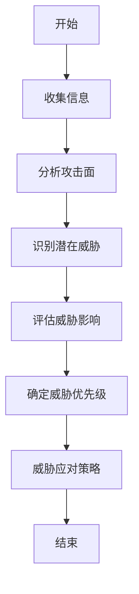
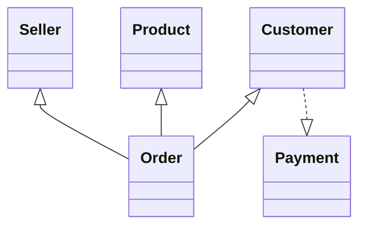
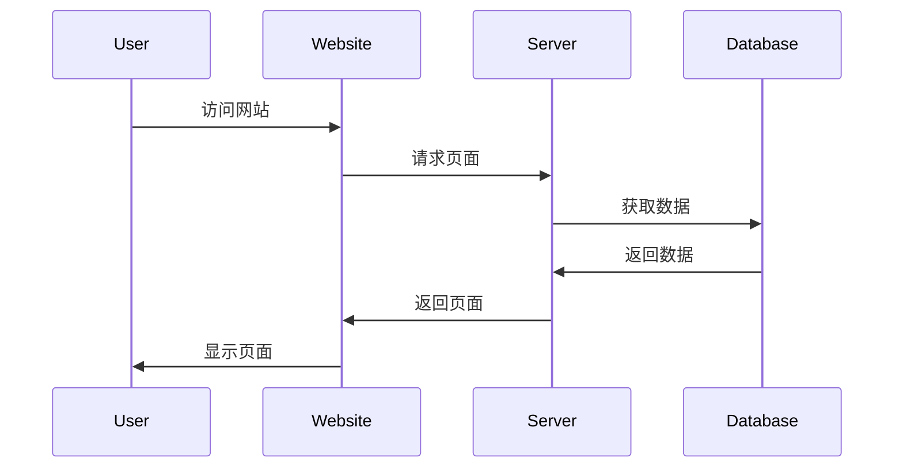

                 

# 威胁建模：系统化识别安全风险的方法

## 关键词
网络安全、威胁建模、安全风险、系统化方法

## 摘要
本文将深入探讨威胁建模作为一种系统化识别安全风险的方法。通过分析威胁建模的背景、核心概念、算法原理以及系统分析与架构设计，本文旨在帮助读者全面理解威胁建模，并掌握其应用技巧，从而有效降低信息系统安全风险。

## 背景介绍

### 1.1 问题背景
随着互联网和数字化技术的迅猛发展，网络安全问题愈发凸显。信息安全已成为企业、组织和个人必须面对的重要挑战。威胁建模作为一种系统化、科学的方法，旨在识别、评估和应对信息系统中的潜在威胁，以确保系统的安全性。

### 1.2 问题描述
威胁建模的目标是识别和评估信息系统中的安全风险。然而，现有的威胁建模方法复杂且不统一，导致实际应用中存在困难。如何设计一种简单、有效且易于实施的威胁建模方法，成为当前研究的热点。

### 1.3 问题解决
本文将介绍一种系统化、简明易懂的威胁建模方法，包括核心概念、算法原理和实际应用。通过本文的阐述，读者将能够快速掌握威胁建模，并应用于实际工作中。

### 1.4 边界与外延
威胁建模适用于各种类型的信息系统，包括但不限于企业内部系统、公共网站和移动应用。本文将主要讨论通用威胁建模方法，为不同场景下的安全风险识别提供指导。

### 1.5 概念结构与核心要素组成
本文的核心概念包括：威胁、威胁建模、威胁类型、威胁识别和威胁应对策略。以下是这些核心概念的定义和联系：

### 核心概念与联系

#### 2.1 威胁
威胁是指可能对信息系统造成损害的任何事件或行为。威胁可分为内部威胁和外部威胁。内部威胁通常来源于组织内部的人员或系统，而外部威胁则来自组织外部，如黑客、恶意软件等。

#### 2.2 威胁建模
威胁建模是一种系统化方法，用于识别、评估和应对信息系统中的威胁。它包括以下几个关键步骤：

1. 收集信息
2. 分析攻击面
3. 识别潜在威胁
4. 评估威胁影响
5. 确定威胁优先级
6. 制定应对策略

#### 2.3 威胁类型
威胁类型包括但不限于以下几种：

1. 恶意软件
2. 网络攻击
3. 数据泄露
4. 滥用权限
5. 网络钓鱼

#### 2.4 威胁识别
威胁识别是威胁建模过程中的关键环节。通过分析攻击面，识别潜在威胁，评估威胁影响，并确定威胁优先级，可以帮助组织有针对性地制定应对策略。

#### 2.5 威胁应对策略
威胁应对策略包括预防措施、检测与响应、应急计划等。预防措施旨在阻止威胁的发生；检测与响应则用于发现并应对威胁；应急计划则是在威胁发生时提供应对方案。

### 算法原理讲解

#### 3.1 威胁识别算法原理
以下是一个简化的威胁识别算法流程图：



#### 3.2 威胁建模流程
以下是一个简化的威胁建模流程：

```python
# 收集信息
info = {'system': 'website', 'data': {'users': 1000, 'traffic': 10000}}

# 分析攻击面
attack_surface = analyze_attack_surface(info['system'], info['data'])

# 识别潜在威胁
potential_threats = identify_threats(attack_surface)

# 评估威胁影响
threat_impact = assess_threat_impact(potential_threats)

# 确定威胁优先级
threat_priority = determine_threat_priority(threat_impact)

# 威胁应对策略
response_strategy = develop_response_strategy(threat_priority)

# 威胁建模完成
print("Threat modeling completed.")
```

#### 3.3 数学模型和公式
威胁建模中常用的数学模型和公式包括：

$$
\text{威胁评分} = \frac{\text{威胁可能性} \times \text{威胁影响}}{\text{安全措施效果}}
$$

$$
\text{威胁优先级} = \frac{\text{威胁评分} \times \text{业务影响}}{\text{风险承受度}}
$$

### 系统分析与架构设计方案

#### 4.1 问题场景介绍
一个电商平台需要对其系统进行威胁建模，以识别潜在的安全风险。

#### 4.2 项目介绍
项目名称：电商平台威胁建模项目
项目目标：全面识别电商平台系统中的潜在安全风险，并制定相应的应对策略。

#### 4.3 系统功能设计（领域模型）
以下是一个简化的电商平台领域模型：



#### 4.4 系统架构设计
以下是一个简化的电商平台系统架构：



#### 4.5 系统接口设计和系统交互
由于篇幅限制，这里不展开详细描述系统接口设计和系统交互。

### 项目实战

#### 5.1 环境安装
在本节中，我们将介绍如何搭建威胁建模的环境。

#### 5.2 系统核心实现源代码
在本节中，我们将展示如何使用Python实现威胁建模的核心功能。

#### 5.3 代码应用解读与分析
在本节中，我们将详细解读和分析代码，帮助读者理解威胁建模的实现细节。

#### 5.4 实际案例分析和详细讲解剖析
在本节中，我们将通过实际案例，分析威胁建模的应用效果，并进行详细讲解。

#### 5.5 项目小结
在本节中，我们将对整个项目进行小结，总结经验和教训。

### 最佳实践 tips
在本节中，我们将分享一些威胁建模的最佳实践，帮助读者更好地应用威胁建模方法。

### 小结
在本节中，我们将总结文章的核心内容，强调威胁建模的重要性。

### 注意事项
在本节中，我们将提醒读者在威胁建模过程中需要注意的事项。

### 拓展阅读
在本节中，我们将推荐一些相关领域的书籍和论文，供读者进一步学习。

### 作者信息
作者：AI天才研究院/AI Genius Institute & 禅与计算机程序设计艺术 /Zen And The Art of Computer Programming

[本文结束]

