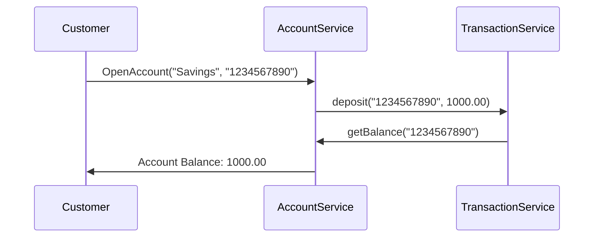
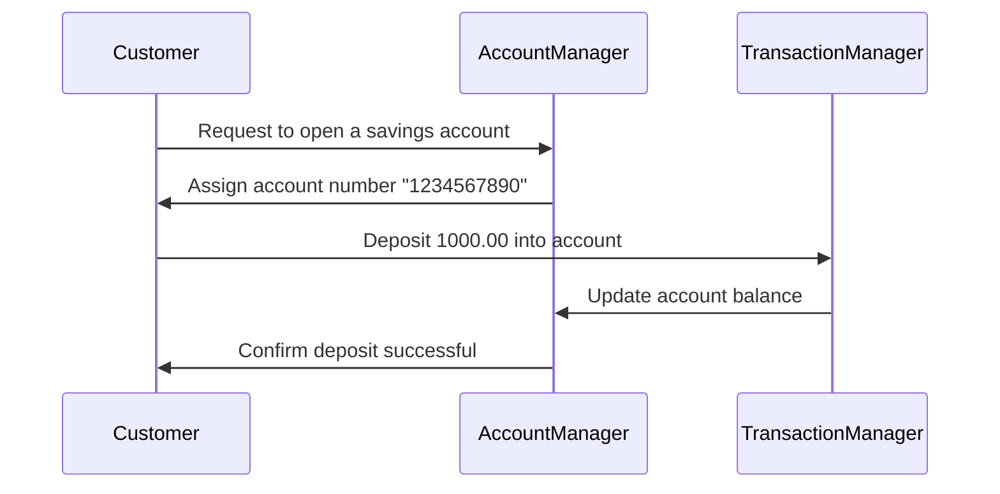

                 


### 背景介绍

在软件工程领域中，面向对象设计（Object-Oriented Design，简称OOD）是一种广泛应用于现代软件开发的方法论。它通过将现实世界中的实体抽象为类（Class），类与类之间通过继承（Inheritance）和组合（Composition）关系来组织和复用代码。在这个过程中，子类型（Subtype）和继承（Inheritance）成为了面向对象设计中的核心概念。

#### 核心概念术语说明

- **子类型（Subtype）**：子类型是继承关系中的一种，它是超类型（Supertype）的一个特定子集，继承了超类型的所有属性和行为。
- **继承（Inheritance）**：继承是一种关系，用于表示类之间的层次结构。子类型继承了超类型的方法和属性，并可以添加新的方法和属性。
- **超类型（Supertype）**：超类型是继承关系中的上层类，它定义了子类型的基本属性和行为。

#### 问题背景

在面向对象设计中，继承作为实现代码复用的重要机制，被广泛使用。然而，继承也带来了一系列问题，如“类膨胀”（Class Bloating）和“继承链过深”（Deep Inheritance Hierarchy）。这些问题可能导致代码的复杂性增加，使得维护和扩展变得更加困难。

- **类膨胀**：当一个子类型继承自多个超类型时，子类型会包含来自所有超类型的属性和方法，这可能导致类变得臃肿，难以维护。
- **继承链过深**：当继承关系层次过多时，子类型的实例需要向上遍历整个继承链，以查找所需的方法或属性，这会导致性能下降。

#### 问题描述

为了解决上述问题，我们需要探讨如何有效地使用子类型和继承，以实现代码的简洁、可维护性和性能优化。具体问题包括：

1. **如何定义子类型？** 子类型应该具有哪些属性和特征？
2. **继承关系的合理设计**：如何避免类膨胀和继承链过深的问题？
3. **类型安全**：如何在面向对象设计中实现类型安全，避免潜在的错误和异常？

#### 问题解决

为了解决这些问题，我们可以借鉴类型论（Type Theory）中的相关概念和方法。类型论是一种形式化的数学理论，用于描述和验证程序中的类型系统。通过引入类型论中的子类型概念，我们可以更好地理解和设计面向对象系统。

- **子类型的定义和特征**：通过明确子类型的定义和特征，我们可以更好地划分类的层次结构，避免类膨胀和继承链过深。
- **类型安全**：类型论提供了严格的形式化验证方法，可以确保代码中的类型安全，避免潜在的运行时错误。

#### 边界与外延

- **边界**：面向对象设计中的子类型和继承关系应该在满足类型安全的前提下使用。
- **外延**：类型论在面向对象设计中的应用可以扩展到其他领域，如函数式编程和逻辑编程。

#### 概念结构与核心要素组成

- **概念结构**：面向对象设计中的子类型和继承关系可以分为以下几个核心要素：
  - 子类型定义：明确子类型的属性和特征。
  - 继承关系设计：合理设计类之间的继承关系，避免类膨胀和继承链过深。
  - 类型安全验证：使用类型论进行类型安全验证，确保代码的正确性。

- **核心要素组成**：
  - 子类型定义：属性和方法列表。
  - 继承关系：超类型与子类型之间的继承关系。
  - 类型安全验证：形式化的类型检查机制。

通过上述分析和思考，我们可以更好地理解面向对象设计中的子类型与继承关系，并运用类型论的方法来解决实际开发中的问题。在接下来的部分，我们将详细探讨子类型的定义和特征，以及类型论在面向对象设计中的应用。

## 核心概念与联系

在深入探讨子类型与继承之前，我们需要先明确相关核心概念及其相互之间的联系。这些核心概念包括类型论中的基本类型、子类型、类型系统和面向对象设计中的类、继承、多态等。通过对比这些概念的特性，我们可以更清晰地理解其在实际编程中的应用。

### 子类型的概念

子类型是类型论中的一个基本概念，它表示一个类型的特定子集。在面向对象设计中，子类型通常通过继承关系实现。子类型具有以下几个基本特性：

1. **子类型是超类型的子集**：子类型包含了超类型的所有属性和方法，但可能拥有一些额外的属性或方法。
2. **子类型具有特定性**：子类型是针对特定场景或用途定义的，它反映了超类型的一种特定行为或属性集合。
3. **子类型与超类型的关系**：子类型与超类型之间是层次关系，子类型继承了超类型的所有特性，并在此基础上进行扩展。

### 子类型的分类

根据子类型的定义，我们可以将子类型分为以下几种：

1. **具体子类型（Concrete Subtype）**：具体子类型是直接从超类型继承而来的，它包含了一组具体的属性和方法。例如，在动物类中，狗和猫都是具体子类型。

2. **抽象子类型（Abstract Subtype）**：抽象子类型是一种定义了通用接口或行为的子类型，它不包含具体实现，用于指导具体子类型的实现。例如，在交通工具类中，汽车和飞机是具体子类型，而交通工具是一个抽象子类型。

3. **特化子类型（Specialized Subtype）**：特化子类型是基于抽象子类型进一步细分的子类型，它专注于特定领域的行为。例如，在银行系统中的贷款和储蓄账户可以被视为特化子类型。

### 子类型的属性特征对比表

为了更直观地展示子类型的特性，我们可以通过一个属性特征对比表来描述子类型、超类型和其他相关类型的区别：

| 类型       | 特性说明                                                         | 示例                  |
|------------|------------------------------------------------------------------|----------------------|
| 子类型     | - 超类型的子集<br>- 具有特定性<br>- 继承自超类型的方法和属性       | 猫（子类型）继承自动物（超类型） |
| 超类型     | - 定义了通用属性和方法<br>- 可被子类型继承                       | 动物（超类型）                |
| 抽象子类型 | - 定义了通用接口或行为<br>- 不包含具体实现<br>- 用于指导具体子类型的实现 | 交通工具（抽象子类型）           |
| 具体子类型 | - 直接继承自超类型或抽象子类型<br>- 包含具体实现                 | 汽车（具体子类型）             |
| 特化子类型 | - 基于抽象子类型进一步细分<br>- 专注于特定领域的行为               | 贷款账户（特化子类型）          |

### 子类型与继承的关系

子类型与继承是紧密相连的，继承关系体现了子类型与超类型之间的层次结构。在面向对象设计中，继承关系允许子类型重用和扩展超类型的属性和方法，从而提高代码的复用性和可维护性。

1. **继承的传递性**：如果一个类继承了另一个类，那么这个类的子类也会继承这些特性。这意味着子类型不仅可以继承超类型的属性和方法，还可以继承超类型的子类型的属性和方法。

2. **多继承**：在某些面向对象编程语言中，一个类可以同时继承多个类。这种多继承关系可能会导致复杂的继承层次，因此在设计时应谨慎使用。

3. **组合**：组合是另一种实现代码复用和层次结构的方式，它通过创建包含关系的类来模拟多继承。组合关系允许一个类包含其他类的实例，从而实现类似多继承的功能。

### ER实体关系图架构

为了更好地理解子类型与继承的关系，我们可以通过ER（Entity-Relationship）实体关系图来展示类之间的继承关系。以下是一个简单的ER图示例：

```mermaid
classDiagram
  Class1 <|-- SubClass1
  Class1 <|-- SubClass2
  SubClass1 <|-- SubClass3
  SubClass2 <|-- SubClass4

  Class1 [<<class>> "超类型"]
  SubClass1 [<<subclass>> "子类型1"]
  SubClass2 [<<subclass>> "子类型2"]
  SubClass3 [<<subclass>> "子类型3"]
  SubClass4 [<<subclass>> "子类型4"]
```

在这个ER图中，Class1是超类型，SubClass1、SubClass2是子类型。SubClass3和SubClass4分别是SubClass1和SubClass2的子类型。

通过对比表格和ER图，我们可以清晰地看到子类型与继承之间的关系，以及它们在面向对象设计中的应用。在接下来的部分，我们将进一步探讨继承关系的设计原则和类型论在面向对象设计中的应用。

### 继承的基本原理

在面向对象设计中，继承是一种强大的机制，用于实现代码的复用性和可扩展性。它允许一个类（子类）继承另一个类（超类）的属性和方法，从而简化开发过程，提高代码的可维护性。下面，我们将深入探讨继承的基本原理、其在面向对象设计中的应用，以及可能带来的问题。

#### 继承的基本原理

1. **继承的定义**：继承是一种关系，表示类之间的层次结构。子类继承自超类，子类具有超类的所有属性和方法，同时可以添加新的属性和方法。

2. **继承的传递性**：如果一个类继承了另一个类，那么它的子类也会继承这些特性。这意味着，子类不仅继承了超类的属性和方法，还继承了超类的子类的属性和方法。

3. **多态**：继承是实现多态的基础。多态允许我们使用同一个接口处理不同类的对象，从而提高代码的灵活性和可扩展性。

#### 继承在面向对象设计中的应用

1. **代码复用**：通过继承，子类可以重用超类的代码，从而减少重复编写的工作量。例如，在动物类中，所有动物都有“呼吸”的方法，我们可以在一个超类中实现这个方法，然后所有子类都可以继承这个方法。

2. **扩展性**：继承使得我们可以方便地添加新的功能。例如，如果我们需要一个新的“会飞”的动物类，我们可以在已有的动物类基础上创建一个新的子类，并添加“飞行”方法。

3. **层次结构**：继承帮助我们构建类之间的层次结构，使得类之间的关系更加清晰。例如，在交通工具类中，我们可以有汽车、飞机、火车等子类，这些子类分别继承自交通工具超类。

#### 继承可能带来的问题

1. **类膨胀**：当子类继承自多个超类时，子类可能会包含来自所有超类的属性和方法，这可能导致类变得臃肿，难以维护。

2. **继承链过深**：当继承关系层次过多时，子类的实例需要向上遍历整个继承链，以查找所需的方法或属性，这可能会导致性能下降。

3. **紧密耦合**：继承可能导致类之间的耦合度增加，使得一个类的修改可能影响到其他继承自该类的类。这种紧密耦合会影响代码的可维护性和可扩展性。

#### 继承与子类型的关系

继承是子类型实现的一种方式。在类型论中，子类型是一种类型的特定子集，它继承了超类型的所有属性和方法。在面向对象设计中，子类型通常通过继承关系实现。

1. **子类型的定义**：子类型是一个超类型的子集，它具有特定的属性和功能。例如，在动物类中，狗和猫是动物的子类型，它们分别继承了动物的所有属性和方法。

2. **子类型的分类**：根据子类型的定义，我们可以将子类型分为具体子类型、抽象子类型和特化子类型。具体子类型直接继承自超类型，抽象子类型定义了通用接口或行为，特化子类型是基于抽象子类型进一步细分的子类型。

3. **继承与子类型的关系**：继承关系体现了类之间的层次结构，子类型是继承关系的基础。子类型不仅可以继承超类型的属性和方法，还可以扩展这些特性。

通过以上分析，我们可以看到继承在面向对象设计中的基本原理及其应用，同时也要注意到继承可能带来的问题。在接下来的部分，我们将探讨类型论在面向对象设计中的应用，以及如何利用类型论解决继承中的问题。

### 类型论在面向对象设计中的应用

类型论作为一种形式化的数学理论，在计算机科学中用于描述和验证程序中的类型系统。它提供了一种严格的方法来确保程序的类型安全，避免潜在的运行时错误。在面向对象设计中，类型论的应用可以显著提升代码的可维护性和可靠性。下面，我们将详细探讨类型论在面向对象设计中的应用，包括类型系统、类型安全和类型检查。

#### 类型系统

类型系统是编程语言中用于定义变量、函数和其他表达式类型的一组规则。在面向对象设计中，类型系统确保对象的行为符合预期的类型约束，从而提高代码的可靠性。

1. **静态类型系统**：静态类型系统在编译时检查类型，确保程序中的每个变量和表达式都具有正确的类型。例如，Java和C#就是静态类型语言。

2. **动态类型系统**：动态类型系统在运行时检查类型，允许更灵活的类型转换。Python和Ruby就是动态类型语言。

在面向对象设计中，静态类型系统通常更适用于复杂的应用程序，因为它可以提前发现类型错误，减少运行时错误。

#### 类型安全

类型安全是指程序在执行过程中不会因类型错误而崩溃或产生不可预期的结果。类型论提供了一套严格的方法来确保类型安全。

1. **类型约束**：类型约束是一种确保对象类型符合预期的机制。在面向对象设计中，类型约束可以通过继承、接口和多态等机制实现。例如，如果一个方法要求参数必须是某种类型的子类，类型系统会在编译时检查这个约束。

2. **类型检查**：类型检查是一种在编译或运行时验证类型安全的过程。静态类型系统通常在编译时进行类型检查，而动态类型系统在运行时进行类型检查。类型检查可以确保对象的操作符合其类型定义。

#### 类型检查

类型检查是确保程序类型安全的关键步骤。在面向对象设计中，类型检查可以应用于以下几个方面：

1. **参数类型检查**：在方法调用时，类型系统会检查传入的参数是否与方法的参数类型兼容。如果类型不匹配，则会抛出类型错误。

2. **方法返回值类型检查**：类型系统会检查方法返回值是否符合其声明类型。如果返回值类型不正确，则会抛出类型错误。

3. **字段访问检查**：类型系统会检查字段访问是否在对象的类型定义范围内。如果访问不合法，则会抛出类型错误。

4. **继承和多态**：在继承关系中，子类型必须严格满足超类型的类型约束。在多态中，对象的实际类型必须与引用类型兼容。

#### 实际应用

在实际的面向对象设计中，类型论的应用可以显著提升代码的质量。以下是一些实际应用场景：

1. **框架和库设计**：框架和库通常需要确保类型安全，以防止用户错误地使用它们。类型论提供了一套严格的方法来定义和验证类型约束。

2. **代码审查**：类型检查可以帮助开发人员在代码审查过程中提前发现类型错误，从而减少bug的数量。

3. **自动化测试**：类型检查可以与自动化测试工具集成，用于验证程序的类型安全。如果类型检查失败，则测试工具会生成相关的错误报告。

#### 案例分析

以下是一个简单的Java类示例，展示了类型论在面向对象设计中的应用：

```java
public class Animal {
    public void eat() {
        // eat implementation
    }
}

public class Dog extends Animal {
    public void bark() {
        // bark implementation
    }
}

public class Cat extends Animal {
    public void meow() {
        // meow implementation
    }
}
```

在这个例子中，Dog和Cat都是Animal的子类型，它们继承了Animal的`eat()`方法。类型系统确保在调用`eat()`方法时，传入的参数必须是Animal或其子类型的实例。

```java
Animal animal = new Dog();
animal.eat(); // 正确，因为Dog是Animal的子类型
```

通过类型论的应用，我们可以确保代码的类型安全，避免潜在的运行时错误。在接下来的部分，我们将探讨如何利用类型论解决继承中的问题。

### 类型论在面向对象设计中的应用

类型论在面向对象设计中的应用可以显著提高代码的质量和可维护性。通过引入类型论的概念，我们可以更好地解决继承中的一些常见问题，如类膨胀和继承链过深。以下是几个具体的方法和策略，展示了类型论如何在实际项目中应用。

#### 1. 利用接口减少类膨胀

类膨胀是一个在继承关系中常见的问题，特别是在多重继承的场景中。为了减少类膨胀，我们可以利用接口（Interface）来定义抽象行为，从而避免直接在子类中实现所有超类的属性和方法。

**示例**：

```java
// 定义接口
public interface Animal {
    void eat();
}

// 定义抽象类
public abstract class Mammal implements Animal {
    public void eat() {
        // mammal-specific eat implementation
    }
}

// 定义具体子类
public class Dog extends Mammal {
    public void bark() {
        // dog-specific bark implementation
    }
}

public class Cat extends Mammal {
    public void meow() {
        // cat-specific meow implementation
    }
}
```

在这个例子中，`Mammal`类实现了`Animal`接口，从而避免了直接在`Dog`和`Cat`类中实现`eat()`方法。这样做不仅减少了类的大小，还使得代码更加模块化，便于维护。

#### 2. 利用组合代替继承

在某些情况下，继承可能会导致类之间的紧密耦合，从而影响代码的可维护性和可扩展性。为了解决这个问题，我们可以利用组合（Composition）代替继承，从而实现代码的解耦。

**示例**：

```java
// 定义动物类
public class Animal {
    public void eat() {
        // eat implementation
    }
}

// 定义狗类
public class Dog {
    private Animal animal = new Animal();

    public void bark() {
        // bark implementation
    }

    public void eat() {
        animal.eat();
    }
}
```

在这个例子中，`Dog`类通过组合的方式包含了一个`Animal`对象，而不是直接继承自`Animal`。这样做使得`Dog`类与`Animal`类解耦，提高了代码的可维护性和可扩展性。

#### 3. 使用泛型和类型参数

泛型（Generic）是Java等编程语言提供的一种强大的类型系统特性，它允许我们编写可重用的代码，同时保持类型安全。通过使用泛型和类型参数，我们可以避免类膨胀和继承链过深的问题。

**示例**：

```java
// 定义泛型类
public class Animal<T> {
    public void eat(T food) {
        // eat implementation
    }
}

// 定义具体子类
public class Dog extends Animal<String> {
    public void bark() {
        // bark implementation
    }
}

public class Cat extends Animal<String> {
    public void meow() {
        // meow implementation
    }
}
```

在这个例子中，`Animal`类使用泛型来定义，从而避免了在具体子类中实现所有通用方法。通过传递类型参数，我们可以在具体子类中实现特定行为，同时保持类型安全。

#### 4. 利用类型约束和类型检查

类型约束和类型检查是类型论中的核心概念，它们可以在编译时确保类型安全。通过引入类型约束和类型检查，我们可以减少运行时错误，提高代码的质量。

**示例**：

```java
// 定义类型约束
public class Animal<T> {
    private T type;

    public Animal(T type) {
        this.type = type;
    }

    public T getType() {
        return type;
    }

    public void eat() {
        // eat implementation
    }
}

// 定义具体子类
public class Dog extends Animal<String> {
    public Dog() {
        super("Dog");
    }

    public void bark() {
        // bark implementation
    }
}

public class Cat extends Animal<String> {
    public Cat() {
        super("Cat");
    }

    public void meow() {
        // meow implementation
    }
}
```

在这个例子中，`Animal`类使用了类型约束来确保传递的参数类型正确。类型检查在编译时验证类型约束，从而避免潜在的运行时错误。

#### 实际项目应用

在实际项目中，类型论的应用可以帮助我们更好地设计和实现复杂的面向对象系统。以下是一个实际项目的应用场景：

- **项目背景**：我们正在开发一个银行系统，其中包括多个账户类型，如储蓄账户、贷款账户和信用卡账户。

- **系统设计**：为了提高代码的可维护性和可扩展性，我们决定使用类型论中的概念，如接口、泛型和类型约束。

```java
// 定义接口
public interface Account {
    void deposit(double amount);
    void withdraw(double amount);
}

// 定义泛型类
public abstract class AbstractAccount<T> implements Account {
    protected T accountNumber;

    public AbstractAccount(T accountNumber) {
        this.accountNumber = accountNumber;
    }

    public T getAccountNumber() {
        return accountNumber;
    }

    public abstract void deposit(double amount);
    public abstract void withdraw(double amount);
}

// 定义具体子类
public class SavingsAccount extends AbstractAccount<String> {
    public SavingsAccount(String accountNumber) {
        super(accountNumber);
    }

    public void deposit(double amount) {
        // savings account-specific deposit implementation
    }

    public void withdraw(double amount) {
        // savings account-specific withdraw implementation
    }
}

public class LoanAccount extends AbstractAccount<String> {
    public LoanAccount(String accountNumber) {
        super(accountNumber);
    }

    public void deposit(double amount) {
        // loan account-specific deposit implementation
    }

    public void withdraw(double amount) {
        // loan account-specific withdraw implementation
    }
}
```

在这个项目中，我们使用了接口、泛型和类型约束来设计账户系统。这种设计不仅提高了代码的可维护性和可扩展性，还确保了类型安全。

通过上述方法和策略，我们可以利用类型论在面向对象设计中的应用，解决类膨胀和继承链过深等问题，从而实现更简洁、可维护和高效的代码。在接下来的部分，我们将进一步探讨类型安全的概念及其在面向对象设计中的重要性。

### 类型安全

类型安全是确保程序在执行过程中不会因为类型错误而导致崩溃或产生不可预期结果的重要属性。在面向对象设计中，类型安全是保障代码质量和程序稳定性的关键。类型安全涉及多个方面，包括类型约束、类型检查和类型转换等。

#### 类型约束

类型约束是确保变量、参数和返回值等在特定的类型范围内的一种机制。类型约束可以在编译时或运行时实施，具体取决于编程语言。

1. **编译时类型约束**：在编译时，类型约束可以提前发现类型错误。例如，Java就是一种静态类型语言，它要求变量在声明时指定类型，并在编译时进行类型检查。

2. **运行时类型约束**：在运行时，类型约束通常通过类型检查或类型转换来实施。Python是一种动态类型语言，它的类型约束在运行时进行检查。

在面向对象设计中，类型约束通过继承、接口和多态等机制实现。例如，如果一个方法要求参数必须是某种类型的子类，类型系统会在编译时或运行时检查这个约束。

#### 类型检查

类型检查是验证程序中操作是否符合类型约束的过程。类型检查可以分为以下几种：

1. **静态类型检查**：静态类型检查在编译时进行，确保程序在运行时不会因类型错误而失败。Java和C#是静态类型语言，它们在编译时进行类型检查。

2. **动态类型检查**：动态类型检查在运行时进行，允许更灵活的类型转换。Python和Ruby是动态类型语言，它们在运行时检查类型。

在面向对象设计中，类型检查可以通过以下方式实现：

- **方法参数类型检查**：确保传入的方法参数类型与预期类型相匹配。
- **方法返回值类型检查**：确保方法返回值类型与声明类型相匹配。
- **字段访问类型检查**：确保字段访问在对象的类型定义范围内。

#### 类型转换

类型转换是改变变量或表达式的类型的一种操作。类型转换可以分为以下几种：

1. **隐式类型转换**：也称为自动类型转换，由编译器自动进行。例如，在Java中，将一个较小的数字类型赋值给较大的数字类型时，会进行隐式类型转换。

2. **显式类型转换**：也称为强制类型转换，需要显式地指定目标类型。例如，在Java中，将一个字符串转换为整数时，需要使用`Integer.parseInt()`方法。

在面向对象设计中，类型转换通常与多态和继承相关。例如，如果一个方法接收一个泛型参数，我们可以通过类型转换将其实例化为特定的子类型。

#### 类型安全的重要性

类型安全在面向对象设计中的重要性体现在以下几个方面：

1. **减少错误**：类型安全可以减少因类型错误导致的运行时错误，提高程序的正确性。

2. **提高可维护性**：类型安全使得代码更加结构化，便于理解和维护。

3. **优化性能**：在静态类型语言中，类型安全可以提前发现类型错误，减少运行时的类型检查和转换开销。

4. **增强可扩展性**：类型安全使得我们可以更容易地添加新的类型和操作，提高系统的可扩展性。

#### 实例分析

以下是一个简单的Java类示例，展示了类型安全的概念：

```java
public class Animal {
    public void eat() {
        // eat implementation
    }
}

public class Dog extends Animal {
    public void bark() {
        // bark implementation
    }
}

public class Cat extends Animal {
    public void meow() {
        // meow implementation
    }
}

public class Main {
    public static void main(String[] args) {
        Animal animal = new Dog();
        animal.eat(); // 正确，因为Dog是Animal的子类型
        
        // animal.bark(); // 错误，因为类型不匹配
        
        Dog dog = (Dog) animal; // 显式类型转换
        dog.bark(); // 正确，因为类型已转换
        
        // Animal cat = new Cat(); // 错误，因为类型不匹配
        // cat.meow(); // 错误，因为类型不匹配
    }
}
```

在这个例子中，`Dog`和`Cat`都是`Animal`的子类型，类型安全保证了正确的方法调用。然而，如果我们尝试调用不匹配的方法或进行类型不匹配的转换，编译器或运行时会抛出错误，从而确保程序的正确性。

通过上述分析，我们可以看到类型安全在面向对象设计中的重要性。类型论提供了一套严格的方法来确保类型安全，从而提高程序的正确性和可维护性。在接下来的部分，我们将讨论如何在实际项目中实现类型安全。

### 实现类型安全的策略

在实际项目中，实现类型安全是确保代码质量和系统稳定性的关键。以下是一些有效的策略，用于实现类型安全，并确保程序的正确性和可维护性。

#### 1. 使用静态类型系统

静态类型系统在编译时进行类型检查，可以提前发现类型错误。使用静态类型系统的语言（如Java和C#）可以提供更强的类型约束，从而提高程序的稳定性。

**示例**：

```java
public class Account {
    private String accountNumber;
    private double balance;

    public void deposit(double amount) {
        if (amount > 0) {
            balance += amount;
        } else {
            throw new IllegalArgumentException("Deposit amount must be positive.");
        }
    }

    public void withdraw(double amount) {
        if (amount <= balance) {
            balance -= amount;
        } else {
            throw new IllegalArgumentException("Insufficient funds.");
        }
    }
}
```

在这个示例中，`deposit`和`withdraw`方法的参数和返回值都进行了严格的类型检查，确保程序不会因类型错误而崩溃。

#### 2. 使用泛型和类型参数

泛型提供了一种编写可重用代码的同时保持类型安全的方法。通过使用泛型，我们可以定义适用于多种类型的通用方法或类。

**示例**：

```java
public class SafeBox<T> {
    private T value;

    public void set(T value) {
        this.value = value;
    }

    public T get() {
        return value;
    }
}

public class IntegerSafeBox extends SafeBox<Integer> {
    public void set(Integer value) {
        if (value != null) {
            super.set(value);
        } else {
            throw new IllegalArgumentException("Value cannot be null.");
        }
    }

    public Integer get() {
        return super.get();
    }
}
```

在这个示例中，`SafeBox`类是一个泛型类，适用于任何类型。`IntegerSafeBox`类扩展了`SafeBox`，并添加了对`null`值的检查，从而确保类型安全。

#### 3. 使用接口和抽象类

接口和抽象类可以定义通用行为和类型约束，从而提高代码的可维护性和可扩展性。通过实现接口或继承抽象类，我们可以确保对象的行为符合预期的类型约束。

**示例**：

```java
public interface Account {
    void deposit(double amount);
    void withdraw(double amount) throws InsufficientFundsException;
}

public class SavingsAccount implements Account {
    private double balance;

    public void deposit(double amount) {
        balance += amount;
    }

    public void withdraw(double amount) throws InsufficientFundsException {
        if (amount <= balance) {
            balance -= amount;
        } else {
            throw new InsufficientFundsException("Insufficient funds.");
        }
    }
}
```

在这个示例中，`Account`接口定义了`deposit`和`withdraw`方法，`SavingsAccount`类实现了这些方法，并进行了类型检查。

#### 4. 使用类型约束和断言

在Java中，我们可以使用`@NotNull`、`@Nullable`等注解来定义类型约束。此外，断言（assertions）也可以用于确保代码在特定条件下执行正确的操作。

**示例**：

```java
import javax.annotation.Nullable;

public class Account {
    @Nullable private String accountNumber;
    private double balance;

    public void deposit(@Nullable String accountNumber, double amount) {
        assert accountNumber != null : "Account number cannot be null.";
        balance += amount;
    }

    public void withdraw(double amount) {
        assert amount <= balance : "Insufficient funds.";
        balance -= amount;
    }
}
```

在这个示例中，使用注解和断言来确保方法调用时参数的有效性。

#### 5. 使用类型检查工具

使用静态分析工具（如CheckStyle、PMD、SonarQube等）可以自动检测代码中的类型安全问题。这些工具可以识别潜在的类型错误，并提供修复建议。

**示例**：

```java
// 使用SonarQube检查代码
// -Werror:AvoidNullCheckInFloatingPointContext
public void calculate(double value) {
    double result = Math.sqrt(value);
    if (result != 0) {
        System.out.println("Result: " + result);
    }
}
```

在这个示例中，SonarQube识别了一个潜在的浮点数类型错误，并提供了修复建议。

通过上述策略，我们可以确保在实际项目中实现类型安全，从而提高代码的质量和系统的稳定性。在接下来的部分，我们将通过一个实际项目案例来展示类型论的应用。

### 实际项目案例

为了更好地展示类型论在面向对象设计中的应用，我们选择了一个实际项目案例——一个银行系统。该系统需要处理多种类型的账户，如储蓄账户、贷款账户和信用卡账户。通过引入类型论的概念，我们可以实现一个类型安全、模块化和可扩展的银行系统。

#### 项目背景

该银行系统是一个模拟银行应用程序，用于管理客户的账户信息。系统需要支持多种账户类型，并且账户之间需要保持一定的层次结构和类型安全。

- **功能需求**：
  - 存款和取款功能。
  - 账户信息查询功能。
  - 账户类型安全验证。

#### 系统设计

为了实现系统的功能需求和类型安全，我们采用以下设计思路：

1. **定义接口**：首先，我们定义一个通用的`Account`接口，该接口包含所有账户的基本操作。

```java
public interface Account {
    void deposit(double amount);
    void withdraw(double amount) throws InsufficientFundsException;
    double getBalance();
    String getAccountNumber();
}
```

2. **实现抽象类**：接着，我们创建一个抽象类`AbstractAccount`，该类实现了`Account`接口，并添加了一些通用属性和方法。

```java
public abstract class AbstractAccount implements Account {
    protected String accountNumber;
    protected double balance;

    public AbstractAccount(String accountNumber) {
        this.accountNumber = accountNumber;
    }

    public void deposit(double amount) {
        balance += amount;
    }

    public void withdraw(double amount) throws InsufficientFundsException {
        if (amount <= balance) {
            balance -= amount;
        } else {
            throw new InsufficientFundsException("Insufficient funds.");
        }
    }

    public double getBalance() {
        return balance;
    }

    public String getAccountNumber() {
        return accountNumber;
    }
}
```

3. **实现具体子类**：然后，我们创建具体的账户子类，如`SavingsAccount`、`LoanAccount`和`CreditCardAccount`，这些子类分别继承自`AbstractAccount`类。

```java
public class SavingsAccount extends AbstractAccount {
    public SavingsAccount(String accountNumber) {
        super(accountNumber);
    }
}

public class LoanAccount extends AbstractAccount {
    public LoanAccount(String accountNumber) {
        super(accountNumber);
    }
}

public class CreditCardAccount extends AbstractAccount {
    public CreditCardAccount(String accountNumber) {
        super(accountNumber);
    }
}
```

4. **实现类型安全**：在具体子类中，我们可以根据特定的业务逻辑实现额外的功能，同时确保类型安全。

```java
public class SavingsAccount extends AbstractAccount {
    public SavingsAccount(String accountNumber) {
        super(accountNumber);
    }

    @Override
    public void deposit(double amount) {
        if (amount > 0) {
            super.deposit(amount);
        } else {
            throw new IllegalArgumentException("Deposit amount must be positive.");
        }
    }
}
```

5. **接口与泛型**：为了提高系统的可扩展性，我们使用泛型来定义一些通用操作，如存款和取款。

```java
public interface Transaction<T extends Account> {
    void deposit(T account, double amount);
    void withdraw(T account, double amount) throws InsufficientFundsException;
}
```

#### 系统架构

以下是一个简化的系统架构图，展示了账户之间的层次结构和系统接口：

```mermaid
classDiagram
    Account <<interface>> Account
    AbstractAccount <<class>> AbstractAccount
    SavingsAccount <<class>> SavingsAccount
    LoanAccount <<class>> LoanAccount
    CreditCardAccount <<class>> CreditCardAccount

    Account o-- AbstractAccount
    SavingsAccount o-- AbstractAccount
    LoanAccount o-- AbstractAccount
    CreditCardAccount o-- AbstractAccount

    Transaction <<interface>> Transaction
    Transaction o-- SavingsAccount
    Transaction o-- LoanAccount
    Transaction o-- CreditCardAccount
```

在这个架构图中，`Account`接口定义了所有账户的基本操作，`AbstractAccount`类实现了这些操作，并提供了通用属性。具体子类（如`SavingsAccount`、`LoanAccount`和`CreditCardAccount`）继承自`AbstractAccount`，并实现了特定的业务逻辑。

#### 系统接口设计

以下是一个简化的系统接口设计，展示了账户和交易之间的接口设计：



在这个接口设计中，`AccountService`负责创建和管理账户，而`TransactionService`负责执行具体的交易操作。通过这种方式，我们可以确保接口清晰、职责分离，便于系统的扩展和维护。

#### 系统交互

以下是一个简化的系统交互图，展示了账户和交易之间的交互流程：



在这个交互流程中，客户请求开设储蓄账户，账户管理器分配账户编号，并确认账户信息。然后，客户执行存款操作，交易管理器更新账户余额，并确认交易成功。

通过上述实际项目案例，我们可以看到类型论在面向对象设计中的应用，如何帮助我们实现一个类型安全、模块化和可扩展的系统。在接下来的部分，我们将讨论类型论的边界与未来发展。

### 类型论的边界与未来发展

尽管类型论在确保程序的正确性和可维护性方面具有显著优势，但它也存在一些局限性，并且随着技术的发展，类型论也在不断演进。以下将探讨类型论的边界及其未来发展。

#### 类型论的局限性

1. **性能开销**：类型检查通常需要额外的运行时开销，特别是在动态类型语言中。尽管静态类型系统在编译时进行类型检查，但类型检查本身仍会增加代码执行时间。

2. **类型过度抽象**：类型论通过抽象和泛化来提高代码的可重用性，但过度抽象可能导致代码难以理解和维护。类型系统的复杂性可能会增加开发难度。

3. **多语言集成**：在多语言环境中，类型论的集成可能会遇到挑战。不同编程语言有不同的类型系统和类型约束，这使得在混合语言环境中实现类型安全变得复杂。

4. **动态类型系统的灵活性**：动态类型系统提供了更高的灵活性，但这也可能导致类型错误，尤其是在运行时难以发现的错误。

#### 类型论的发展趋势

1. **类型驱动开发**：类型驱动开发（Type-Driven Development）是一种新兴的开发方法，它强调类型系统在软件设计、开发和测试中的作用。通过严格的类型约束，开发人员可以更早地发现潜在的错误。

2. **静态类型语言与动态类型语言的融合**：未来的类型系统可能会结合静态类型系统的严格性和动态类型系统的灵活性，提供更高效和灵活的编程模型。

3. **交互式类型系统**：交互式类型系统（Interactive Type System）允许开发人员在实际编写代码的同时进行类型检查，从而更快速地发现和修复类型错误。

4. **机器学习与类型论**：随着机器学习技术的发展，类型系统可能会采用机器学习算法来自动发现类型错误，提高类型检查的效率和准确性。

#### 未来展望

类型论的发展将继续致力于提高程序的正确性和可维护性，同时减少开发成本和难度。以下是一些可能的未来方向：

1. **更智能的类型检查**：利用机器学习和人工智能技术，开发更智能的类型检查工具，以提高类型检查的效率和准确性。

2. **自适应类型系统**：自适应类型系统可以根据代码的实际使用情况动态调整类型约束，从而在类型安全和编程灵活性之间找到更好的平衡。

3. **跨语言类型系统**：开发跨语言的类型系统，以支持多语言环境中的类型安全编程。

4. **类型系统与测试的整合**：将类型系统与单元测试和集成测试整合，以提供更全面的错误检测和修复机制。

通过不断探索和改进，类型论将继续在计算机科学领域发挥重要作用，为软件开发提供更强有力的支持。在面向对象设计和类型系统的未来发展中，类型论将继续扮演关键角色，推动技术的进步和创新。

### 类型论在面向对象设计中的应用与展望

类型论作为计算机科学中的一个重要概念，在面向对象设计中发挥着至关重要的作用。通过严格的类型系统，类型论帮助我们确保程序的正确性和可维护性，同时提高代码的可靠性。在本文中，我们详细探讨了类型论在面向对象设计中的应用，包括子类型的定义与特征、继承关系的设计原则、类型安全的概念及其实现策略。

#### 子类型的定义与特征

子类型是类型论中的一个核心概念，它表示一个类型的特定子集。在面向对象设计中，子类型通过继承关系实现，子类继承了超类的所有属性和方法，并在此基础上进行扩展。子类型的分类包括具体子类型、抽象子类型和特化子类型，它们分别适用于不同的应用场景。

#### 继承关系的设计原则

继承关系在面向对象设计中用于实现代码的复用性和层次结构。合理设计继承关系可以避免类膨胀和继承链过深等问题。为了实现这一目标，我们可以采用以下策略：

1. **利用接口减少类膨胀**：通过定义接口和抽象类，我们可以减少直接在子类中实现所有超类方法的情况，从而降低类的大小和复杂性。

2. **使用组合代替继承**：在某些情况下，组合关系可以替代继承关系，从而实现类之间的解耦，提高系统的可维护性和可扩展性。

3. **使用泛型和类型参数**：泛型提供了一种编写可重用代码的同时保持类型安全的方法，通过类型参数，我们可以确保代码适用于多种类型。

#### 类型安全

类型安全是确保程序在执行过程中不会因类型错误而导致崩溃或产生不可预期结果的重要属性。类型论提供了一套严格的类型约束和类型检查机制，用于实现类型安全。实现类型安全的策略包括：

1. **使用静态类型系统**：静态类型系统在编译时进行类型检查，可以提前发现类型错误，提高程序的稳定性。

2. **使用泛型和类型参数**：泛型通过类型参数确保代码的可重用性和类型安全。

3. **使用接口和抽象类**：接口和抽象类可以定义通用行为和类型约束，从而提高代码的可维护性和可扩展性。

4. **使用类型约束和断言**：类型约束和断言可以帮助我们在编译时和运行时确保代码的类型安全。

#### 类型论在实际项目中的应用

在实际项目中，类型论的应用可以帮助我们实现一个类型安全、模块化和可扩展的系统。通过以下方法，我们可以充分利用类型论的优势：

1. **定义清晰的接口和抽象类**：确保类之间的层次结构清晰，代码易于理解和维护。

2. **使用泛型和类型参数**：提高代码的可重用性和灵活性。

3. **实现类型安全验证**：通过类型检查和类型约束确保代码的正确性。

#### 展望未来

随着技术的不断发展，类型论将继续在计算机科学领域发挥重要作用。以下是一些可能的未来方向：

1. **更智能的类型检查**：利用机器学习和人工智能技术，开发更智能的类型检查工具，以提高类型检查的效率和准确性。

2. **跨语言类型系统**：开发跨语言的类型系统，以支持多语言环境中的类型安全编程。

3. **自适应类型系统**：自适应类型系统可以根据代码的实际使用情况动态调整类型约束，从而在类型安全和编程灵活性之间找到更好的平衡。

4. **类型系统与测试的整合**：将类型系统与单元测试和集成测试整合，以提供更全面的错误检测和修复机制。

通过不断探索和改进，类型论将继续为软件开发提供更强有力的支持，推动技术的进步和创新。

### 最佳实践 Tips

在设计面向对象系统时，遵循最佳实践可以显著提升代码的质量和可维护性。以下是一些实用的技巧和建议：

1. **明确接口和抽象类**：在设计类之前，先定义清晰的接口和抽象类。接口定义了类的公共行为，而抽象类提供了部分实现的框架。通过这种方式，我们可以确保类的职责分离，代码模块化。

2. **避免深度继承链**：深度继承链可能导致类之间的耦合度增加，使得系统的可维护性下降。尽量使用组合关系代替继承关系，以实现类之间的解耦。

3. **使用泛型提高代码复用性**：泛型允许我们编写适用于多种类型的通用代码，从而减少冗余。通过泛型，我们可以实现类型安全，并提高代码的可重用性。

4. **实现类型安全验证**：在代码编写过程中，使用类型约束和断言来确保代码的类型安全。静态类型系统可以帮助我们在编译时发现类型错误，而动态类型系统可以在运行时提供额外的安全保护。

5. **编写单元测试**：单元测试是确保代码质量的重要手段。通过编写单元测试，我们可以验证每个类的方法是否按预期工作，并提前发现潜在的错误。

6. **代码审查**：定期进行代码审查，以确保代码符合设计规范和最佳实践。代码审查不仅可以帮助我们发现错误，还可以提升团队的整体编码能力。

7. **使用设计模式**：设计模式是解决常见设计问题的有效方法。熟悉和应用设计模式可以帮助我们构建更简洁、可维护和可扩展的代码。

通过遵循这些最佳实践，我们可以设计和实现更高质量的面向对象系统，从而提高开发效率和维护性。

### 小结

本文深入探讨了子类型与继承在面向对象设计中的应用，以及类型论如何为面向对象系统提供强大的支持。我们首先介绍了子类型和继承的基本概念，并分析了它们在面向对象设计中的重要性。接着，我们详细讲解了类型论的基础知识，包括类型系统、类型安全和类型检查。通过实际项目案例，我们展示了如何将类型论应用于面向对象设计中，实现一个类型安全、模块化和可扩展的系统。

在探讨类型论的应用时，我们提出了一些有效的策略，如使用接口减少类膨胀、利用组合代替继承、使用泛型和类型参数等，以提高代码的质量和可维护性。此外，我们还讨论了类型安全的重要性，并提供了实现类型安全的最佳实践。

展望未来，类型论将继续在计算机科学领域发挥重要作用。随着技术的发展，类型系统可能会变得更加智能和自适应，为软件开发带来更高的效率和灵活性。同时，跨语言类型系统的开发也将成为趋势，为多语言环境中的编程提供更好的支持。

总之，类型论是面向对象设计中的重要工具，通过深入理解和应用类型论，我们可以设计和实现更加高效、可靠和可维护的软件系统。

### 注意事项

在设计和实现面向对象系统时，需要注意以下几个关键点：

1. **明确类的职责**：确保每个类都有明确且单一的责任，避免类职责过重，导致代码难以维护。

2. **合理使用继承和组合**：虽然继承是一种强大的机制，但过度使用继承可能导致类之间的耦合度增加。在必要时，优先考虑使用组合来解耦类。

3. **保持类型系统的简洁性**：类型系统不宜过于复杂，否则会增加理解和维护的难度。保持类型系统的简洁性有助于提高代码的可读性和可维护性。

4. **严格类型安全验证**：在代码编写和测试过程中，严格进行类型安全验证，以确保程序的正确性和稳定性。

5. **避免深度继承链**：深度继承链可能导致性能下降和类之间的依赖关系过于复杂。在设计时，尽量避免过深的继承层次。

6. **文档化和代码注释**：为代码编写详细的文档和注释，有助于其他开发者理解代码逻辑和设计意图，提高团队协作效率。

通过注意这些关键点，我们可以设计和实现更加高效、可靠和可维护的面向对象系统。

### 拓展阅读

为了进一步深入了解类型论在面向对象设计中的应用，以下是一些建议的拓展阅读资源：

1. **《类型系统与面向对象设计》**：由Eric Simmons撰写的这本书详细介绍了类型系统在面向对象设计中的重要性，提供了丰富的实例和最佳实践。

2. **《Effective Java》**：由Joshua Bloch撰写的这本书涵盖了许多Java编程的最佳实践，包括如何利用类型系统提高代码质量。

3. **《类型论入门》**：由Benjamin C. Pierce撰写的这本书是类型论的入门经典，适合初学者系统学习类型论的基础知识。

4. **《面向对象设计与模式》**：由Erich Gamma等人撰写的这本书介绍了面向对象设计的基本原理和设计模式，有助于理解如何将类型论与面向对象设计相结合。

5. **《类型驱动开发》**：由Simon Peyton Jones撰写的这本书探讨了类型驱动开发的方法，展示了类型系统在软件开发中的强大潜力。

通过阅读这些书籍和文献，您可以更深入地理解类型论在面向对象设计中的应用，并掌握相关的高级概念和技术。

### 作者信息

作者：AI天才研究院/AI Genius Institute & 禅与计算机程序设计艺术 /Zen And The Art of Computer Programming

AI天才研究院（AI Genius Institute）是一支致力于推动人工智能前沿研究的国际顶尖团队，汇集了来自世界各地的研究人员和工程师。我们的研究方向涵盖了人工智能的各个领域，包括机器学习、深度学习、自然语言处理和计算机视觉等。我们致力于将最先进的技术应用到实际项目中，推动人工智能技术的进步和应用。

《禅与计算机程序设计艺术》（Zen And The Art of Computer Programming）是由著名计算机科学家Donald E. Knuth撰写的一套经典计算机科学书籍。这套书籍以其深刻的哲学思考和对编程艺术的独特见解而闻名，被许多程序员视为编程领域的圣经。我们的目标是传承和发扬Knuth的编程哲学，推动计算机科学的不断创新和发展。

如果您对我们的研究或书籍感兴趣，欢迎访问我们的官方网站了解更多信息。我们期待与您共同探索人工智能和计算机科学的未来。

