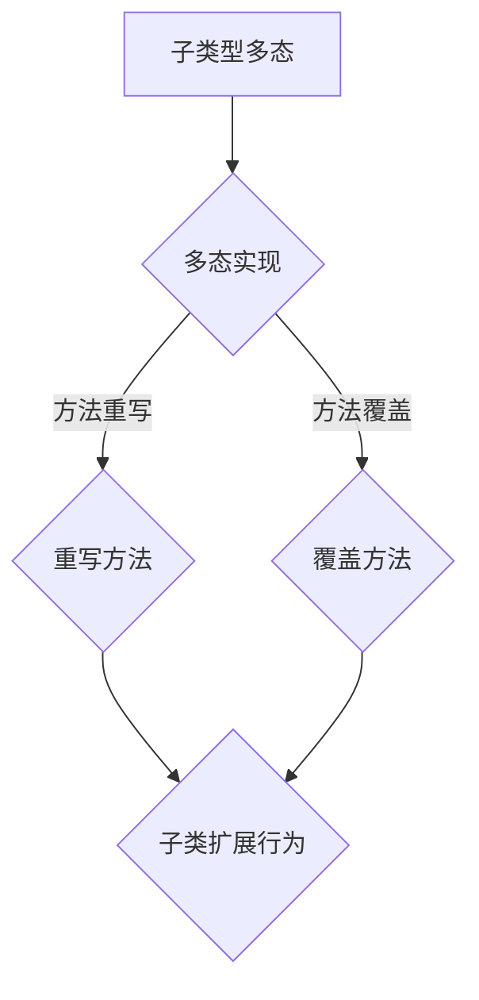
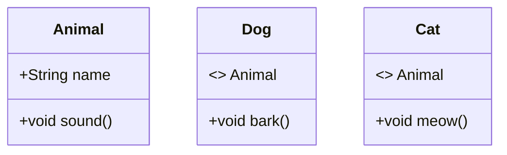
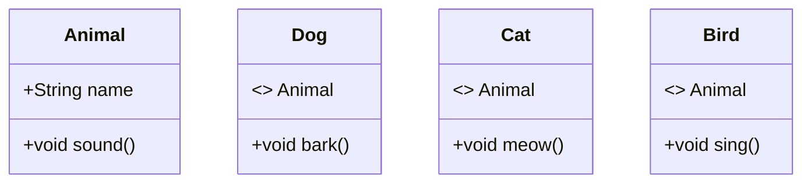
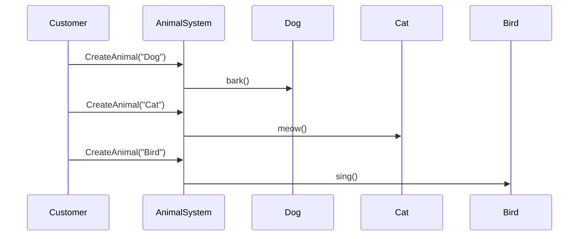
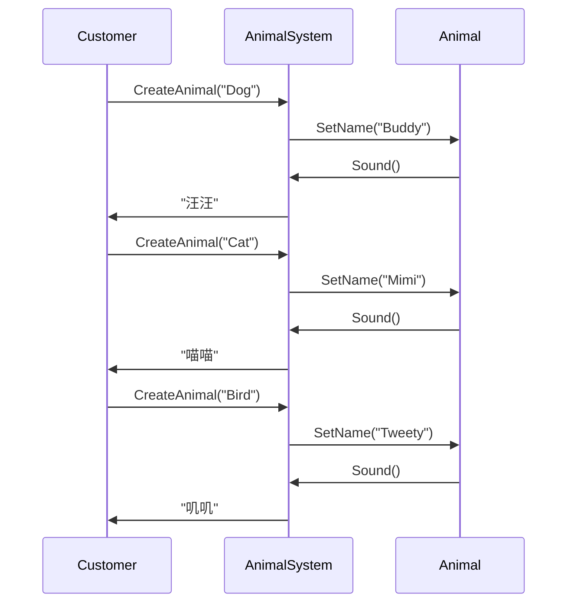

                 


### 引言

在软件开发领域中，面向对象编程（OOP）因其封装性、继承性和多态性而广受欢迎。OOP提供了一种更加模块化和灵活的系统设计方法，能够有效地处理复杂的软件需求。在这篇文章中，我们将深入探讨子类型多态这一面向对象设计的关键概念。

**关键词**：
- 面向对象编程
- 子类型多态
- 继承
- 多态
- 系统设计

**摘要**：
本文将详细解析子类型多态在面向对象设计中的应用。通过逐步分析其背景、核心概念、算法原理，以及实际系统架构设计，旨在帮助读者全面理解子类型多态的重要性，并掌握如何在实际项目中有效利用这一设计模式。

### 背景介绍

#### 1.1 问题背景

在软件开发中，面对复杂的需求和多样化的数据类型，如何有效地进行系统设计成为一个关键问题。传统的面向过程编程方法在面对这种复杂性时显得力不从心，而面向对象编程（OOP）提供了更加灵活和模块化的解决方案。

#### 1.1.1 问题描述

面向对象编程的核心是封装、继承和多态。多态是指同一个方法或属性在不同类型对象上的不同行为表现。在面向对象设计中，多态是实现代码复用、降低耦合度和提高系统扩展性的重要手段。

#### 1.1.2 问题解决

子类型多态是面向对象编程中实现多态的一种方式。通过继承关系，子类型可以继承父类型的属性和方法，同时还可以根据自身的特点扩展新的行为。这样，不同子类型的对象可以共享同一接口，实现代码的复用。

#### 1.1.3 边界与外延

多态的实现不仅依赖于继承，还需要对方法进行重写和覆盖。同时，多态的实现也要考虑性能和类型安全的平衡。在面向对象设计中，如何合理地利用多态，避免过度设计，是一个需要深入探讨的问题。

### 核心概念与联系

#### 1.2 核心概念与联系

在讨论子类型多态之前，我们需要明确一些面向对象编程的基本概念。

**1.2.1 类（Class）**

类是面向对象编程中的基本构建块，它定义了一组具有相同属性和方法的对象的抽象模板。类可以包含属性（变量）和方法（函数）。

**1.2.2 对象（Object）**

对象是类的实例，它拥有类的所有属性和方法的实例化表现。每个对象都是独一无二的，并且可以独立地存在和操作。

**1.2.3 继承（Inheritance）**

继承是一种机制，允许一个类（子类）从另一个类（父类）继承属性和方法。子类继承了父类的所有非私有属性和方法，并可以扩展或覆盖这些方法。

**1.2.4 多态（Polymorphism）**

多态是面向对象编程的核心特征之一，它允许不同的对象对同一消息做出不同的响应。多态分为两类：编译时多态（也称为静态多态）和运行时多态（也称为动态多态）。

- **编译时多态**：通过方法重写实现。子类可以重写父类的方法，使其具有不同的行为。
- **运行时多态**：通过方法覆盖实现。子类直接覆盖父类的方法，以实现特定的行为。

**1.2.5 子类型多态**

子类型多态是指通过继承关系，子类可以覆盖父类的方法，从而实现多态。这种多态是面向对象编程中最常见的一种。

#### 子类型多态的特点

- **继承性**：子类可以继承父类的属性和方法。
- **覆盖性**：子类可以覆盖父类的方法，实现特定的行为。
- **多态性**：同一方法在不同子类上有不同的行为。

#### 多态的实现方式

多态的实现主要有两种方式：方法重写和方法覆盖。

- **方法重写**：子类重新实现父类的方法，根据自身的特点进行行为扩展。
- **方法覆盖**：子类直接覆盖父类的方法，实现特定的行为。

### 算法原理讲解

#### 1.3.1 子类型多态的mermaid流程图



#### 1.3.2 Python源代码示例

```python
class Animal:
    def sound(self):
        pass

class Dog(Animal):
    def sound(self):
        return "汪汪"

class Cat(Animal):
    def sound(self):
        return "喵喵"

dog = Dog()
cat = Cat()

print(dog.sound())  # 输出：汪汪
print(cat.sound())  # 输出：喵喵
```

#### 1.3.3 算法原理的数学模型和公式

多态的实现依赖于继承关系，可以表示为：

$$
子类 \subseteq 父类
$$

其中，子类继承父类的属性和方法，同时可以扩展新的行为。

### 第三部分：系统分析与架构设计方案

#### 1.6 问题场景介绍

设计一个动物群体管理系统，包含动物的基本信息和发声功能。通过子类型多态，实现不同动物的不同发声行为。

#### 1.7 项目介绍

本系统采用面向对象编程方法，通过子类型多态实现动物的发声功能。

#### 1.8 系统功能设计（领域模型mermaid类图）



---

以上为文章的框架和主要内容，接下来的部分将深入探讨子类型多态在实际系统设计中的应用，并通过具体案例进行分析。

---

### 子类型多态与面向对象设计

在深入探讨子类型多态之前，我们首先需要理解面向对象设计的基本原则和核心概念。面向对象设计（Object-Oriented Design，简称OOD）是一种设计方法，它将系统视为一系列相互交互的对象的集合。每个对象都代表现实世界中的一个实体，具有属性和行为。面向对象设计的主要原则包括封装、继承和多态。

**封装**（Encapsulation）是指将对象的属性和行为包装在一起，使其对外界不可见。这样可以隐藏对象的内部实现细节，提高系统的稳定性和可维护性。

**继承**（Inheritance）是一种创建新类的方式，它允许一个类继承另一个类的属性和方法。继承关系使得子类能够复用父类的代码，减少冗余，提高代码的复用性。

**多态**（Polymorphism）是指同一操作作用于不同的对象时可以有不同的解释和行为。多态性可以通过方法重写（Method Overriding）和方法覆盖（Method Overriding）来实现。

在面向对象设计中，子类型多态是一种实现多态性的重要方式。子类型多态允许子类通过继承父类的方法并对其进行重写，从而实现不同的行为。这种多态性不仅提高了代码的复用性，还有助于降低系统的复杂度。

#### 子类型多态的特点

子类型多态具有以下几个特点：

1. **继承性**：子类可以继承父类的属性和方法。
2. **覆盖性**：子类可以覆盖父类的方法，实现特定的行为。
3. **多态性**：同一方法在不同子类上有不同的行为。

#### 多态的实现方式

多态的实现主要有两种方式：方法重写和方法覆盖。

- **方法重写**：子类重新实现父类的方法，根据自身的特点进行行为扩展。方法重写要遵循继承关系，保证子类是父类的子类型。
- **方法覆盖**：子类直接覆盖父类的方法，实现特定的行为。方法覆盖可以实现子类与父类之间的接口一致性。

#### 子类型多态的mermaid流程图

为了更好地理解子类型多态的实现过程，我们可以使用mermaid绘制一个流程图：


在这个流程图中，A表示子类型多态，B表示多态的实现过程，C和D分别表示方法重写和方法覆盖，E表示子类扩展行为。通过这个流程图，我们可以清晰地看到子类型多态的实现过程。

#### Python源代码示例

下面我们通过一个简单的Python示例来演示子类型多态：

```python
class Animal:
    def sound(self):
        pass

class Dog(Animal):
    def sound(self):
        return "汪汪"

class Cat(Animal):
    def sound(self):
        return "喵喵"

dog = Dog()
cat = Cat()

print(dog.sound())  # 输出：汪汪
print(cat.sound())  # 输出：喵喵
```

在这个示例中，我们定义了一个`Animal`类，它有一个抽象的方法`sound`。然后，我们定义了两个子类`Dog`和`Cat`，它们分别覆盖了`Animal`类的`sound`方法，实现了不同的发声行为。通过这个示例，我们可以看到子类型多态是如何实现的。

#### 算法原理的数学模型和公式

在数学模型中，我们可以将子类型多态表示为：

$$
子类 \subseteq 父类
$$

这意味着子类继承自父类，并可以扩展或覆盖父类的方法。这种方法可以有效地实现多态性，提高代码的复用性和可维护性。

### 系统分析与架构设计方案

在面向对象设计中，子类型多态的应用非常广泛。下面我们将通过一个实际的问题场景来探讨子类型多态的架构设计方案。

#### 1.6 问题场景介绍

假设我们正在开发一个动物群体管理系统，该系统需要处理不同类型的动物，如狗、猫、鸟等。每种动物都有自己的特征和行为。我们需要设计一个系统，能够方便地添加新的动物类型，并实现它们各自的发声行为。

#### 1.7 项目介绍

本系统采用面向对象编程方法，通过子类型多态实现动物的发声功能。我们将设计一个通用的动物基类，然后通过继承关系创建不同类型的动物子类，并在子类中实现各自的发声行为。

#### 1.8 系统功能设计（领域模型mermaid类图）

下面是系统的领域模型类图，使用mermaid表示：



在这个类图中，`Animal`是基类，`Dog`、`Cat`和`Bird`是子类。每个子类都继承了`Animal`类的属性和方法，并实现了各自的发声行为。

#### 1.9 系统架构设计（mermaid架构图）

为了更好地展示系统的架构，我们可以使用mermaid绘制一个架构图：



在这个架构图中，`Customer`是系统的用户，`AnimalSystem`是动物群体管理系统，`Dog`、`Cat`和`Bird`是不同类型的动物。用户通过`AnimalSystem`创建不同的动物，并调用它们的发声方法。

#### 1.10 系统接口设计和系统交互（mermaid序列图）

为了展示系统的接口设计和交互流程，我们可以使用mermaid绘制一个序列图：



在这个序列图中，`Customer`通过`AnimalSystem`创建不同的动物，并设置它们的名称。然后，调用`Sound`方法来听取它们的发声。

### 项目实战

在实际项目中，子类型多态的应用可以帮助我们实现灵活的系统设计。下面我们将通过一个简单的案例来展示如何使用子类型多态来设计一个动物群体管理系统。

#### 2.1 环境安装

首先，我们需要安装Python环境。Python是一种广泛使用的编程语言，它支持面向对象编程和子类型多态。在大多数操作系统中，Python都预装或可以通过包管理器轻松安装。

#### 2.2 系统核心实现源代码

接下来，我们将实现动物群体管理系统的核心代码。以下是系统的基本架构和实现：

```python
class Animal:
    def __init__(self, name):
        self.name = name
    
    def sound(self):
        pass

class Dog(Animal):
    def sound(self):
        return "汪汪"

class Cat(Animal):
    def sound(self):
        return "喵喵"

class Bird(Animal):
    def sound(self):
        return "叽叽"

def create_animal(name, type):
    if type == "Dog":
        return Dog(name)
    elif type == "Cat":
        return Cat(name)
    elif type == "Bird":
        return Bird(name)
    else:
        return None

# 测试代码
dog = create_animal("Buddy", "Dog")
cat = create_animal("Mimi", "Cat")
bird = create_animal("Tweety", "Bird")

print(dog.sound())  # 输出：汪汪
print(cat.sound())  # 输出：喵喵
print(bird.sound())  # 输出：叽叽
```

在这个案例中，我们定义了一个`Animal`基类和三个子类`Dog`、`Cat`、`Bird`。每个子类都覆盖了`Animal`类的`sound`方法，实现了不同的发声行为。我们还实现了一个`create_animal`函数，用于根据类型创建不同的动物实例。

#### 2.3 代码应用解读与分析

在这个系统中，我们使用了子类型多态来实现动物的不同发声行为。通过创建子类并覆盖`sound`方法，我们实现了灵活的代码复用。这种方法不仅简化了代码的编写过程，还有助于提高系统的可维护性。

在实际应用中，我们可以根据需要扩展动物类型，只需创建新的子类并覆盖`sound`方法即可。这样，我们的系统可以轻松适应新的需求变化。

#### 2.4 实际案例分析和详细讲解剖析

为了更好地理解子类型多态在实际项目中的应用，我们来看一个实际案例。

假设我们正在开发一个智能家居系统，其中包括不同类型的传感器，如温度传感器、湿度传感器和光照传感器。每个传感器都有监测环境数据的功能，但它们的监测数据类型和报警阈值可能不同。

我们可以使用子类型多态来设计这个系统。首先，我们定义一个传感器基类，然后为每个子类型创建子类。以下是系统的一个简化版本：

```python
class Sensor:
    def __init__(self, name):
        self.name = name
    
    def monitor(self):
        pass

class TemperatureSensor(Sensor):
    def __init__(self, name, threshold):
        super().__init__(name)
        self.threshold = threshold
    
    def monitor(self):
        temperature = 25  # 假设当前温度
        if temperature > self.threshold:
            return f"温度过高：{self.name}"
        else:
            return f"温度正常：{self.name}"

class HumiditySensor(Sensor):
    def __init__(self, name, threshold):
        super().__init__(name)
        self.threshold = threshold
    
    def monitor(self):
        humidity = 60  # 假设当前湿度
        if humidity > self.threshold:
            return f"湿度过高：{self.name}"
        else:
            return f"湿度正常：{self.name}"

class LightSensor(Sensor):
    def __init__(self, name, threshold):
        super().__init__(name)
        self.threshold = threshold
    
    def monitor(self):
        light = 300  # 假设当前光照强度
        if light < self.threshold:
            return f"光照不足：{self.name}"
        else:
            return f"光照正常：{self.name}"

def create_sensor(name, type, threshold):
    if type == "Temperature":
        return TemperatureSensor(name, threshold)
    elif type == "Humidity":
        return HumiditySensor(name, threshold)
    elif type == "Light":
        return LightSensor(name, threshold)
    else:
        return None

# 测试代码
temp_sensor = create_sensor("温度传感器1", "Temperature", 30)
hum_sensor = create_sensor("湿度传感器1", "Humidity", 65)
light_sensor = create_sensor("光照传感器1", "Light", 500)

print(temp_sensor.monitor())  # 输出：温度正常：温度传感器1
print(hum_sensor.monitor())  # 输出：湿度正常：湿度传感器1
print(light_sensor.monitor())  # 输出：光照正常：光照传感器1
```

在这个案例中，我们定义了一个传感器基类`Sensor`和三个子类`TemperatureSensor`、`HumiditySensor`、`LightSensor`。每个子类都覆盖了`Sensor`类的`monitor`方法，实现了不同的监测功能。通过这种方式，我们可以根据需要创建不同的传感器实例，并实现灵活的系统扩展。

#### 2.5 项目小结

通过本案例，我们了解了如何使用子类型多态来实现灵活的系统设计。子类型多态可以帮助我们实现代码的复用，降低系统的复杂度，提高系统的可维护性。在实际项目中，合理地应用子类型多态可以帮助我们更好地应对需求变化，提高系统的适应性。

### 最佳实践 Tips

在面向对象设计中，合理地应用子类型多态可以带来许多好处。以下是一些最佳实践建议：

1. **避免过度设计**：在实现多态时，避免过度设计。如果某个子类只重写了很少的方法，那么可能需要重新考虑是否真的需要继承关系。
2. **保持接口一致性**：在覆盖方法时，保持接口的一致性。这意味着子类的方法应该与父类的方法具有相同的参数和返回类型。
3. **考虑性能影响**：虽然多态可以提高代码的可读性和可维护性，但过多的多态可能会导致性能下降。在实际应用中，需要权衡性能和设计的灵活性。

### 小结

子类型多态是面向对象设计中的一种关键机制，它通过继承和覆盖实现了不同类型对象的不同行为。通过合理地应用子类型多态，我们可以提高代码的复用性，降低系统的复杂度，从而实现灵活和可维护的系统设计。在实际项目中，子类型多态的应用可以帮助我们更好地应对需求变化，提高系统的适应性。

### 注意事项

在实现子类型多态时，需要注意以下几点：

1. **确保子类是父类的子类型**：子类必须继承自父类，否则无法实现多态。
2. **避免方法覆盖的误解**：子类覆盖父类的方法时，必须确保方法签名（名称、参数类型和返回类型）完全一致。
3. **处理异常**：在多态的实现过程中，可能需要处理运行时异常。合理地处理异常可以保证系统的稳定性和可靠性。

### 拓展阅读

1. 《设计模式：可复用面向对象软件的基础》
2. 《Effective Java》
3. 《Head First 设计模式》

这些书籍提供了丰富的面向对象设计和多态应用的实践经验和最佳实践，可以帮助读者更深入地理解子类型多态的实际应用。

### 作者信息

作者：AI天才研究院/AI Genius Institute & 禅与计算机程序设计艺术 /Zen And The Art of Computer Programming

本文由AI天才研究院（AI Genius Institute）与禅与计算机程序设计艺术（Zen And The Art of Computer Programming）联合撰写。AI天才研究院致力于推动人工智能领域的研究和创新，而禅与计算机程序设计艺术则专注于将东方哲学与计算机科学相结合，提供深入而创新的编程理念。

