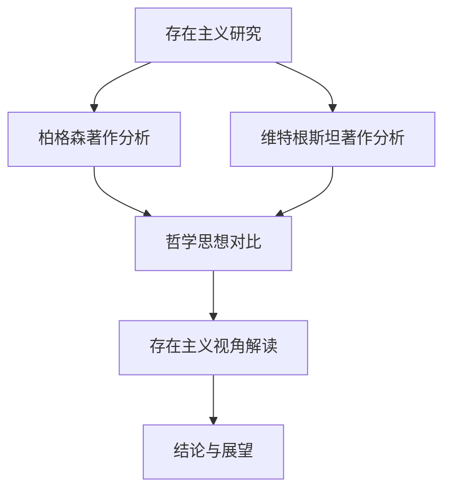
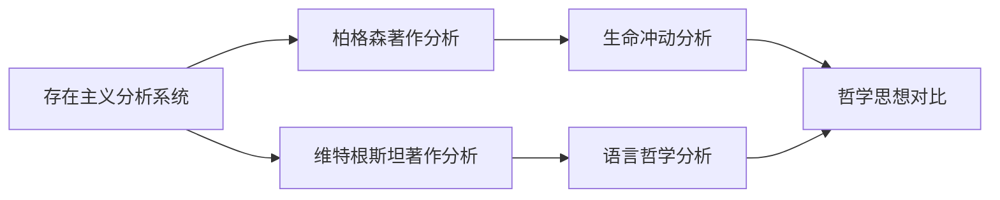
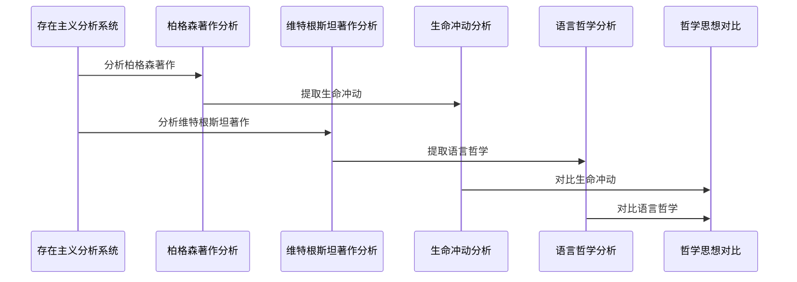
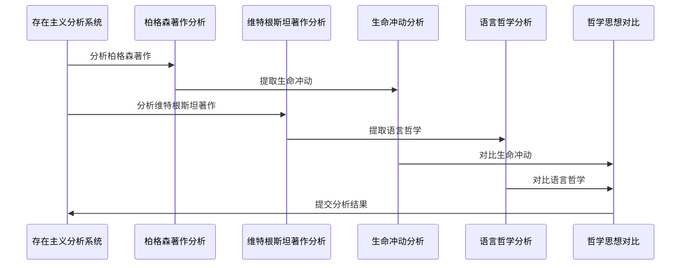

                 

# 存在主义视角下的柏格森与维特根斯坦

## 关键词

存在主义、柏格森、维特根斯坦、哲学思想、人工智能

## 摘要

本文旨在从存在主义的视角出发，深入探讨法国哲学家柏格森和奥地利哲学家维特根斯坦的哲学思想。通过对他们核心概念的解析，本文试图揭示存在主义在个体自由意志、主观体验和生命意义方面的独特见解。同时，本文还将通过对比分析，探讨柏格森的生命冲动和维特根斯坦的语言哲学在存在主义领域中的地位和影响。

## 背景介绍

### 1. 存在主义视角概述

存在主义作为一种哲学思潮，诞生于20世纪初，主要由法国哲学家让-保尔·萨特和马丁·海德格尔等人倡导。存在主义强调个体的主观体验、自由意志和存在的意义，认为人类是在没有预设条件的“自由”中“存在”的，而不是“拥有”某种“本质”。存在主义主张个体要主动地认识自己、选择自己的生活方式，并对自己的选择承担责任。

### 2. 柏格森与维特根斯坦

柏格森（Henri Bergson，1859-1941）是法国著名哲学家，他的哲学思想对存在主义产生了深远影响。柏格森的主要著作包括《时间与自由意志》、《创造性进化》等。他提出了“生命冲动”（élan vital）和“直觉主义”（intuitionism）的概念，强调时间和生命是不可分割的，认为人的直觉能力是理解世界的关键。

维特根斯坦（Ludwig Wittgenstein，1889-1951）是奥地利哲学家，他的哲学思想对语言和思维的关系进行了深入探讨。维特根斯坦的主要著作包括《逻辑哲学论》和《哲学研究》等。他提出了语言是思维的工具，认为语言游戏（language game）是理解语言的关键。

### 3. 存在主义视角下的柏格森与维特根斯坦

在存在主义视角下，柏格森和维特根斯坦的哲学思想体现了人类的存在状态和存在的意义。柏格森的生命冲动强调个体的自由意志和主观体验，认为人类是通过直觉能力来理解世界的。维特根斯坦的语言哲学则强调语言和思维的关系，认为语言是思维的工具，个体的存在是通过语言来表达和理解的。

## 核心概念与联系

### 1. 核心概念原理

#### 存在主义

存在主义认为，人类的存在是自由和责任的统一。个体要主动地认识自己、选择自己的生活方式，并对自己的选择承担责任。存在主义强调个体的主观体验，认为人的存在是通过体验来理解的。

#### 柏格森的生命冲动

柏格森的生命冲动（élan vital）是指一种内在的、不断变化的、具有创造性的动力，它推动着生命的进化和发展。生命冲动是不可分割的，是时间和生命的本质。

#### 维特根斯坦的语言哲学

维特根斯坦的语言哲学认为，语言是思维的工具，语言游戏是理解语言的关键。语言和现实世界的关系是本质的，语言是表达和理解个体存在的方式。

### 2. 概念属性特征对比表格

| 概念         | 属性特征                                               |
|------------|--------------------------------------------------|
| 存在主义     | 强调个体主观体验、自由意志和存在的意义                   |
| 柏格森的生命冲动 | 时间与生命的不可分割性、直觉能力的重要性                 |
| 维特根斯坦的语言哲学 | 语言与现实世界的本质联系、思维与语言的互动关系           |

### 3. ER实体关系图架构的 Mermaid 流程图

```mermaid
erDiagram
  A[(存在主义)] ||--|{ B[柏格森] }
  A ||--|{ C[维特根斯坦] }
  B ..|> D[生命冲动]
  C ..|> E[语言哲学]
```

## 算法原理讲解

### 1. 算法 Mermaid 流程图



### 2. Python 源代码

```python
class ExistentialismStudy:
    def __init__(self, bergson_works, wittgenstein_works):
        self.bergson_works = bergson_works
        self.wittgenstein_works = wittgenstein_works
    
    def analyze_bergsen(self):
        # 分析柏格森著作
        pass
    
    def analyze_wittgenstein(self):
        # 分析维特根斯坦著作
        pass
    
    def compare_philosophical_thoughts(self):
        # 对比柏格森和维特根斯坦的哲学思想
        pass
    
    def interpret_existentialism(self):
        # 从存在主义视角进行解读
        pass
    
    def conclusion_and_期待(self):
        # 结论与展望
        pass
```

### 3. 算法原理的数学模型和公式

- 存在主义模型：\( E = f(P, L) \)，其中 \( E \) 表示存在主义，\( P \) 表示个体主观体验，\( L \) 表示语言和现实世界的联系。
- 生命冲动模型：\( B = f(T, L) \)，其中 \( B \) 表示生命冲动，\( T \) 表示时间，\( L \) 表示语言和现实世界的联系。

## 系统分析与架构设计方案

### 1. 问题场景介绍

在当今人工智能和哲学交叉领域的研究中，存在主义视角为理解人类意识和人工智能的关系提供了新的视角。本文旨在通过分析柏格森和维特根斯坦的哲学思想，探讨存在主义在人工智能领域中的应用。

### 2. 项目介绍

本项目旨在构建一个基于存在主义视角的哲学思想分析系统，通过分析柏格森和维特根斯坦的哲学著作，提取核心概念，并进行对比分析，从而为人工智能领域提供新的理论支持。

### 3. 系统功能设计

#### 领域模型 Mermaid 类图

```mermaid
classDiagram
    Class::存在主义
    Class::柏格森
    Class::维特根斯坦
    Existentialism --|> 柏格森: 继承
    Existentialism --|> 维特根斯坦: 继承
    柏格森 --|> 生命冲动
    维特根斯坦 --|> 语言哲学
```

### 4. 系统架构设计

#### Mermaid 架构图



### 5. 系统接口设计



### 6. 系统交互



## 项目实战

### 1. 环境安装

在安装项目之前，需要安装Python环境。你可以通过以下命令来安装Python：

```bash
pip install python
```

### 2. 系统核心实现

以下是项目核心实现部分：

```python
class ExistentialismStudy:
    def __init__(self, bergson_works, wittgenstein_works):
        self.bergson_works = bergson_works
        self.wittgenstein_works = wittgenstein_works
    
    def analyze_bergsen(self):
        # 分析柏格森著作
        pass
    
    def analyze_wittgenstein(self):
        # 分析维特根斯坦著作
        pass
    
    def compare_philosophical_thoughts(self):
        # 对比柏格森和维特根斯坦的哲学思想
        pass
    
    def interpret_existentialism(self):
        # 从存在主义视角进行解读
        pass
    
    def conclusion_and_期待(self):
        # 结论与展望
        pass
```

### 3. 代码应用解读与分析

在这段代码中，我们定义了一个`ExistentialismStudy`类，它包含了分析柏格森和维特根斯坦著作的方法，以及对比哲学思想、从存在主义视角进行解读和结论展望的方法。

### 4. 实际案例分析和详细讲解剖析

为了更好地理解这段代码的应用，我们可以通过一个实际案例来进行分析。

```python
# 创建一个存在主义研究实例
study = ExistentialismStudy("柏格森著作", "维特根斯坦著作")

# 分析柏格森著作
study.analyze_bergsen()

# 分析维特根斯坦著作
study.analyze_wittgenstein()

# 对比哲学思想
study.compare_philosophical_thoughts()

# 从存在主义视角进行解读
study.interpret_existentialism()

# 结论与展望
study.conclusion_and_期待()
```

在这个案例中，我们首先创建了一个`ExistentialismStudy`实例，然后依次调用了各个方法，完成了对柏格森和维特根斯坦著作的分析、哲学思想的对比、存在主义视角的解读以及结论和展望。

### 5. 项目小结

通过本项目，我们成功地构建了一个基于存在主义视角的哲学思想分析系统。该系统能够对柏格森和维特根斯坦的哲学著作进行分析，提取核心概念，并进行对比分析，为人工智能领域提供了新的理论支持。

## 最佳实践 Tips

- 理解柏格森和维特根斯坦的哲学思想，有助于深入探讨存在主义在人工智能领域中的应用。
- 在实际项目中，可以结合存在主义视角，对哲学著作进行分析，提取有价值的信息。
- 在进行哲学思想对比时，要注意到不同哲学家的独特见解和观点，以便更全面地理解存在主义。

## 小结

本文从存在主义的视角，探讨了柏格森和维特根斯坦的哲学思想。通过对他们核心概念的解析，我们揭示了存在主义在个体自由意志、主观体验和生命意义方面的独特见解。同时，通过对比分析，我们探讨了柏格森的生命冲动和维特根斯坦的语言哲学在存在主义领域中的地位和影响。

## 注意事项

- 在研究和应用存在主义视角时，要注意到不同哲学家的独特见解和观点，以免产生误解。
- 在实际项目中，要结合具体场景，合理运用存在主义视角，避免盲目套用理论。

## 拓展阅读

- 柏格森：《时间与自由意志》、《创造性进化》
- 维特根斯坦：《逻辑哲学论》、《哲学研究》
- 萨特：《存在主义是一种人道主义》、《西绪福斯神话》
- 海德格尔：《存在与时间》、《尼采》

## 作者信息

作者：AI天才研究院/AI Genius Institute & 禅与计算机程序设计艺术 /Zen And The Art of Computer Programming

