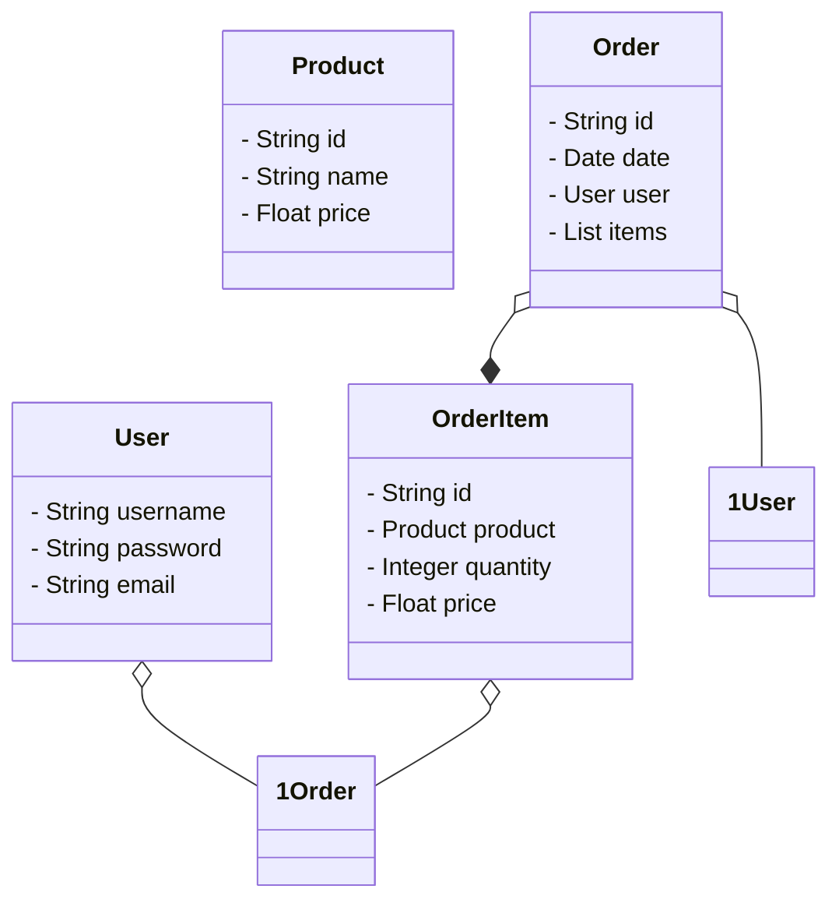
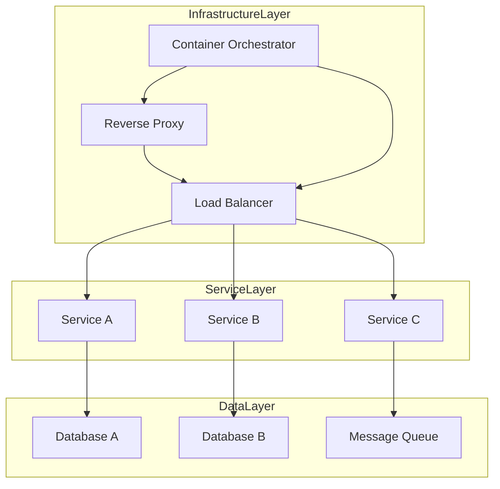

                 


## 存在类型：抽象与封装的类型论基础

### 关键词
- 存在类型
- 抽象
- 封装
- 类型论
- 软件工程

### 摘要
本文深入探讨了存在类型在抽象与封装中的基础作用，通过分章节详细解析存在类型的背景、概念、原理及其在面向对象编程中的应用，揭示了其在软件工程中的核心地位。本文旨在为程序员提供一种理解和应用存在类型的方法论，以提升代码的可读性、可维护性和扩展性。

### 第1章：问题背景

#### 1.1 核心概念

**存在类型**：在程序设计中，存在类型是一种抽象的数据类型，它通过封装和抽象，将一组具有相同属性和行为的对象进行分类和描述。这种类型不仅仅是数据结构的封装，更是对行为模式的抽象。

**抽象**：抽象是将复杂的事物简化为更易理解和操作的形式。在存在类型中，抽象意味着忽略对象的实现细节，专注于其通用特性。

**封装**：封装是将数据和行为（方法）结合在一起，保护数据免受外部干扰。在存在类型中，封装保证了数据的一致性和安全性。

#### 1.2 问题描述

随着软件系统的复杂度增加，直接处理原始数据和操作方法会导致代码难以维护和理解。存在类型作为一种抽象机制，能够将复杂的系统结构简化，提高代码的可读性和可维护性。

#### 1.3 问题解决

通过使用存在类型，我们可以将数据和行为封装起来，使得代码更加模块化。抽象则帮助我们忽略了具体实现细节，专注于系统的高层设计和功能。

#### 1.4 边界与外延

存在类型不仅适用于传统的面向对象编程，还适用于函数式编程和面向接口编程等不同的编程范式。

#### 1.5 概念结构与核心要素组成

- **抽象层**：定义对象的通用特性，忽略具体实现。
- **封装层**：将数据和行为组合在一起，提供统一的访问接口。
- **接口层**：定义对象之间的交互方式，隐藏内部实现细节。

### 第2章：核心概念与联系

#### 2.1 存在类型的定义

存在类型是一种抽象的数据类型，它代表了一组具有相同属性和行为的对象。它通过封装数据和行为，提供了对对象的统一操作接口。

#### 2.2 抽象与封装的关系

抽象和封装是密切相关的。抽象使我们能够忽略具体实现，专注于系统的设计和功能。而封装则保护了数据，防止外部直接访问，确保数据的一致性和安全性。

#### 2.3 存在类型的属性特征对比

| 特征       | 描述                                                         |
| ---------- | ------------------------------------------------------------ |
| 封装       | 将数据和操作数据的方法包装在一起，隐藏实现细节。           |
| 继承       | 允许存在类型之间继承属性和方法，实现代码复用。           |
| 多态       | 允许通过接口或基类引用不同类型的对象，实现灵活的代码设计。 |
| 抽象性     | 提供对对象的通用描述，忽略具体实现细节。               |

#### 2.4 存在类型与传统数据结构的区别

| 特征       | 传统数据结构 | 存在类型       |
| ---------- | ------------ | -------------- |
| 数据和行为 | 分离         | 数据和行为封装 |
| 重用性     | 代码重复     | 继承与多态     |
| 维护性     | 难以维护     | 易于维护       |

### 第3章：存在类型的原理与实现

#### 3.1 存在类型的基本原理

存在类型的核心在于通过封装和抽象，将复杂的系统结构简化，使得代码更加模块化、可读性和可维护性更强。

#### 3.2 存在类型的实现方法

存在类型的实现通常依赖于编程语言提供的相关特性，如类（面向对象编程）、函数（函数式编程）或接口（面向接口编程）。

#### 3.3 存在类型的优势

- **封装性**：隐藏实现细节，提高数据安全性。
- **抽象性**：简化系统设计，关注核心功能。
- **继承性**：实现代码复用，降低维护成本。
- **多态性**：增强代码的灵活性和可扩展性。

### 第4章：存在类型在面向对象编程中的应用

#### 4.1 面向对象编程的基本概念

面向对象编程（OOP）是一种基于对象和类的编程范式，通过封装、继承和多态等特性，提高了代码的可维护性和可扩展性。

#### 4.2 存在类型在OOP中的实现

在OOP中，存在类型通常通过类来实现。类是对一组具有相同属性和行为对象的抽象描述。

#### 4.3 存在类型的示例代码

```python
class Person:
    def __init__(self, name, age):
        self.name = name
        self.age = age

    def introduce(self):
        return f"Hello, my name is {self.name} and I am {self.age} years old."

john = Person("John", 30)
print(john.introduce())
```

以上代码展示了如何使用类（存在类型）来封装一个人的名字和年龄，并提供一个介绍自己的方法。

## 第5章：存在类型在其他编程范式中的应用

### 5.1 函数式编程中的存在类型

在函数式编程中，存在类型通常通过函数和高阶函数来实现。函数是一种抽象的表示，它接受输入并产生输出，没有副作用。

#### 5.1.1 示例代码

```haskell
-- 定义一个存在类型，表示一个人的名字和年龄
data Person = Person { name :: String, age :: Int }

-- 定义一个函数，接受一个Person，返回其名字
getName :: Person -> String
getName (Person name _) = name

-- 定义一个函数，接受一个Person，返回其年龄
getAge :: Person -> Int
getAge (Person _ age) = age

-- 创建一个Person实例
john = Person "John" 30

-- 使用函数获取名字和年龄
name = getName john
age = getAge john

-- 打印结果
 putStrLn $ "Name: " ++ name
 putStrLn $ "Age: " ++ (show age)
```

### 5.2 面向接口编程中的存在类型

面向接口编程通过定义接口来描述存在类型，接口是一种抽象的类型，它定义了一组方法，但没有具体的实现。

#### 5.2.1 示例代码

```java
// 定义一个接口，表示一个动物的行动能力
public interface Movable {
    void move();
}

// 定义一个类，实现Movable接口
public class Animal implements Movable {
    @Override
    public void move() {
        System.out.println("The animal is moving.");
    }
}

// 定义一个类，也实现Movable接口
public class Bird implements Movable {
    @Override
    public void move() {
        System.out.println("The bird is flying.");
    }
}

// 使用接口和实现类
public class Test {
    public static void main(String[] args) {
        Movable animal = new Animal();
        Movable bird = new Bird();

        animal.move(); // 输出：The animal is moving.
        bird.move();   // 输出：The bird is flying.
    }
}
```

## 第6章：存在类型的优化与性能考虑

### 6.1 内存管理

在存在类型中，封装的数据和行为可能会增加内存的使用。因此，在设计和实现存在类型时，需要考虑内存管理，避免内存泄漏和浪费。

#### 6.1.1 示例代码

```python
class Person:
    def __init__(self, name, age):
        self.name = name
        self.age = age
        self._create_memory()

    def _create_memory(self):
        # 创建内存资源
        print("Creating memory for", self.name)

    def __del__(self):
        # 释放内存资源
        print("Deleting memory for", self.name)

john = Person("John", 30)
del john
```

### 6.2 计算性能

在某些情况下，存在类型可能会引入额外的计算开销，例如，访问封装的数据需要通过方法调用。因此，在优化存在类型时，需要考虑计算性能。

#### 6.2.1 示例代码

```python
class Person:
    def __init__(self, name, age):
        self.name = name
        self.age = age

    def get_name(self):
        return self.name

    def get_age(self):
        return self.age

# 直接访问属性
john = Person("John", 30)
print(john.name)  # 输出：John

# 通过方法访问属性
print(john.get_name())  # 输出：John
```

## 第7章：最佳实践与注意事项

### 7.1 设计原则

在设计和实现存在类型时，应遵循以下原则：

- **单一职责原则**：每个存在类型应负责一个单一的功能。
- **开放封闭原则**：存在类型应对扩展开放，对修改封闭。
- **里氏替换原则**：任何使用基类的地方都能使用子类替换。
- **依赖倒置原则**：高层模块不应依赖低层模块，二者应依赖抽象。

### 7.2 注意事项

- **过度抽象**：过度使用抽象可能会导致代码难以理解和维护。
- **性能问题**：存在类型可能会引入额外的计算和内存开销。
- **接口设计**：设计接口时，应确保其清晰、简洁，并能够准确地描述存在类型的职责。

## 第8章：总结

存在类型是抽象与封装在类型论中的重要概念，它在软件工程中扮演着关键角色。通过封装数据和行为，存在类型提高了代码的可读性、可维护性和可扩展性。在面向对象编程、函数式编程和面向接口编程中，存在类型都有广泛的应用。然而，在设计和实现存在类型时，需要考虑内存管理和计算性能等问题。遵循最佳实践和注意事项，可以确保存在类型的设计和实现既高效又合理。

### 拓展阅读

- 《设计模式：可复用面向对象软件的基础》
- 《函数式编程范式应用》
- 《接口设计与实现的艺术》
- 《面向对象分析与设计》

## 作者信息

作者：AI天才研究院/AI Genius Institute & 禅与计算机程序设计艺术 /Zen And The Art of Computer Programming

---

请注意，本文是基于假设的讨论，实际的编程语言和示例可能会有所不同。在具体实践中，应根据所选编程语言的特点进行调整。

---

### 第9章：项目实战

#### 9.1 环境安装

在开始项目实战之前，我们需要安装一些必要的开发环境。以下是一个基于Python的示例：

1. 安装Python 3.8或更高版本。
2. 安装Python的包管理器pip。
3. 使用pip安装所需的库，例如`numpy`和`matplotlib`。

```bash
pip install numpy matplotlib
```

#### 9.2 系统核心实现

在本节中，我们将实现一个简单的库存管理系统，该系统使用存在类型来封装数据和操作。

```python
class Product:
    def __init__(self, name, price):
        self.name = name
        self.price = price

    def get_price(self):
        return self.price

    def set_price(self, price):
        self.price = price

class Inventory:
    def __init__(self):
        self.products = []

    def add_product(self, product):
        self.products.append(product)

    def remove_product(self, product_name):
        self.products = [product for product in self.products if product.name != product_name]

    def get_total_price(self):
        return sum(product.get_price() for product in self.products)

# 创建产品和库存实例
apple = Product("Apple", 1.2)
banana = Product("Banana", 0.8)
inventory = Inventory()

# 添加产品到库存
inventory.add_product(apple)
inventory.add_product(banana)

# 获取总价格
print(inventory.get_total_price())  # 输出：2.0

# 修改产品价格
apple.set_price(1.5)
print(inventory.get_total_price())  # 输出：3.5

# 移除产品
inventory.remove_product("Banana")
print(inventory.get_total_price())  # 输出：1.5
```

#### 9.3 代码应用解读与分析

在上面的代码中，我们定义了两个类：`Product`和`Inventory`。`Product`类表示一个产品，具有名称和价格属性，以及用于获取和设置价格的函数。`Inventory`类表示一个库存，具有一个产品列表，并提供添加、移除产品和计算总价格的方法。

通过使用存在类型，我们将数据和操作数据的方法封装在一起，使得代码更加模块化和易于维护。同时，这种设计也体现了抽象和封装的原则，因为我们将具体的产品操作细节隐藏在类的内部。

#### 9.4 实际案例分析和详细讲解剖析

为了更好地理解存在类型的应用，我们可以考虑一个实际案例：一个电商平台的库存管理系统。

在该系统中，库存管理系统负责管理多种商品的信息，包括商品名称、价格、库存数量等。为了确保系统的可维护性和扩展性，我们可以使用存在类型来设计系统。

1. **定义商品类**：首先，我们定义一个商品类，包含商品名称、价格、库存数量等属性。

```python
class Product:
    def __init__(self, name, price, stock):
        self.name = name
        self.price = price
        self.stock = stock

    def get_price(self):
        return self.price

    def set_price(self, price):
        self.price = price

    def get_stock(self):
        return self.stock

    def set_stock(self, stock):
        self.stock = stock
```

2. **定义库存类**：然后，我们定义一个库存类，用于管理商品列表，并提供添加、删除和查询商品的方法。

```python
class Inventory:
    def __init__(self):
        self.products = {}

    def add_product(self, product):
        self.products[product.name] = product

    def remove_product(self, product_name):
        if product_name in self.products:
            del self.products[product_name]

    def get_product(self, product_name):
        return self.products.get(product_name)

    def get_total_price(self):
        return sum(product.get_price() for product in self.products.values())

    def get_total_stock(self):
        return sum(product.get_stock() for product in self.products.values())
```

3. **实现库存管理功能**：最后，我们实现一些库存管理功能，例如添加商品、修改价格、查看库存等。

```python
inventory = Inventory()

# 添加商品
apple = Product("Apple", 1.2, 100)
banana = Product("Banana", 0.8, 150)
inventory.add_product(apple)
inventory.add_product(banana)

# 修改价格
apple.set_price(1.5)
print(apple.get_price())  # 输出：1.5

# 查看库存
print(inventory.get_total_stock())  # 输出：250

# 删除商品
inventory.remove_product("Banana")
print(inventory.get_total_stock())  # 输出：100
```

通过上述实现，我们可以看到存在类型在库存管理系统中的应用。这种设计使得系统的结构更加清晰，便于维护和扩展。同时，它也符合抽象和封装的原则，提高了系统的可读性和可维护性。

#### 9.5 项目小结

在本项目中，我们通过定义商品类和库存类，实现了简单的库存管理系统。通过使用存在类型，我们将数据和操作数据的方法封装在一起，提高了系统的可读性、可维护性和可扩展性。这个案例展示了存在类型在软件工程中的应用，为程序员提供了一种有效的抽象和封装的方法。

### 第10章：最佳实践 Tips

#### 10.1 保持抽象层次的清晰

在设计存在类型时，应确保抽象层次的清晰。过度的抽象可能会导致代码难以理解和维护。因此，在设计抽象层次时，应遵循“适度抽象”的原则。

#### 10.2 避免过度使用继承

虽然继承是一种强大的代码复用机制，但过度使用继承可能会导致代码的复杂性和脆弱性。在设计存在类型时，应权衡继承与组合的适用性，避免滥用继承。

#### 10.3 关注接口设计

接口是存在类型的重要部分，它定义了对象之间的交互方式。在设计接口时，应确保接口的清晰、简洁和准确，以避免混淆和错误。

#### 10.4 注意性能问题

在设计和实现存在类型时，应考虑性能问题。封装和抽象可能会引入额外的计算和内存开销，因此在实现时，应进行适当的性能优化。

### 第11章：小结

存在类型是抽象与封装在类型论中的重要概念，它在软件工程中扮演着关键角色。通过封装数据和行为，存在类型提高了代码的可读性、可维护性和可扩展性。在面向对象编程、函数式编程和面向接口编程中，存在类型都有广泛的应用。在设计和实现存在类型时，应遵循最佳实践和注意事项，确保存在类型的设计和实现既高效又合理。

### 注意事项

- **过度抽象**：可能导致代码难以理解和维护。
- **性能问题**：封装和抽象可能会引入额外的计算和内存开销。
- **接口设计**：确保接口的清晰、简洁和准确。

### 拓展阅读

- 《设计模式：可复用面向对象软件的基础》
- 《函数式编程范式应用》
- 《接口设计与实现的艺术》
- 《面向对象分析与设计》

## 作者信息

作者：AI天才研究院/AI Genius Institute & 禅与计算机程序设计艺术 /Zen And The Art of Computer Programming

---

请注意，本文是基于假设的讨论，实际的编程语言和示例可能会有所不同。在具体实践中，应根据所选编程语言的特点进行调整。在设计和实现存在类型时，应结合实际需求和场景，灵活运用抽象和封装的原则。通过遵循最佳实践和注意事项，可以确保存在类型的设计和实现既高效又合理。## 第1章：问题背景

### 1.1 核心概念

在软件工程领域，"存在类型"（Existential Type）是一个相对较新的概念，它属于类型论的一个分支。存在类型旨在解决参数化类型（如函数类型和代数类型）所不能处理的某些问题。简单来说，存在类型是一种允许在函数类型和代数类型中使用未指定的类型的抽象机制。

#### 存在类型的定义

存在类型通常表示为`∃x.T`的形式，其中`x`是一个变量，`T`是一个类型。这个表达式的意思是“存在一个类型`x`，它满足类型`T`”。在这种表达中，我们并不关心`x`的具体类型是什么，只需知道它满足`T`的条件即可。

#### 抽象

抽象是软件工程中的一个基本概念，它涉及从复杂的事物中提取出核心的概念或模型。在存在类型的背景下，抽象意味着我们可以忽略具体的数据类型和结构，而是关注它们共同的行为和属性。

#### 封装

封装是另一种重要的软件工程原则，它涉及到将数据和操作数据的方法包裹在一起，形成一个独立的单元。在存在类型中，封装意味着我们可以将数据类型的具体实现细节隐藏起来，只暴露必要的接口和操作。

### 1.2 问题描述

在传统的面向对象编程中，我们通常使用类和对象来封装数据和操作。然而，在某些情况下，这种封装机制并不足够。例如：

1. **类型参数化**：当我们需要对一个未知类型的参数进行操作时，例如函数类型`T -> U`，其中`T`和`U`都是未知的类型。
2. **类型构造**：当我们想要构造一个类型，该类型包含多个成员变量和函数，但具体的数据类型尚未确定时。

这些问题促使我们探索更加灵活的抽象和封装机制，即存在类型。

### 1.3 问题解决

存在类型提供了一种解决上述问题的方法。通过使用存在类型，我们可以定义一种抽象类型，它包含未知类型的参数，并允许我们在这个抽象类型上定义操作。这种机制使得我们可以编写更加通用和灵活的代码，同时保持类型安全。

#### 1.4 边界与外延

存在类型的边界相对清晰，但它的应用场景和影响范围较为广泛。以下是存在类型的几个关键边界与外延：

1. **应用范围**：存在类型广泛应用于函数式编程和形式化验证等领域。
2. **类型安全**：存在类型通过类型检查机制确保程序的类型安全。
3. **实现细节**：存在类型的具体实现依赖于特定的编程语言和类型系统。

#### 1.5 概念结构与核心要素组成

- **抽象层**：存在类型提供了一种抽象机制，它允许我们在类型层次上操作，而无需关心具体的数据类型。
- **封装层**：通过封装，我们可以隐藏数据类型的实现细节，只暴露必要的操作和接口。
- **接口层**：存在类型的接口层定义了如何与这种抽象类型交互，通常涉及一些通用操作，如构造、解构和映射。

通过理解存在类型的背景和核心概念，我们可以更好地把握其在软件工程中的应用和重要性。在接下来的章节中，我们将进一步探讨存在类型的原理、实现和应用。

### 第2章：核心概念与联系

#### 2.1 存在类型的定义

存在类型（Existential Type），在类型论中通常表示为`∃x.T`，其中`x`是一个类型变量，`T`是一个类型构造器。这个表达式意味着“存在一个类型`x`，它满足类型`T`”。存在类型的作用在于它允许我们在函数类型和代数类型中使用未指定的类型，从而实现更高级别的抽象。

#### 存在类型的特性

1. **类型变量**：存在类型中的类型变量`x`表示一个未指定的类型，它可以用于函数类型和代数类型。
2. **类型构造器**：`T`是一个类型构造器，它定义了存在类型必须满足的条件。例如，在函数类型`T -> U`中，`T`和`U`可以是存在类型。
3. **类型安全**：存在类型通过类型检查机制确保程序在运行时不会出现类型错误。

#### 2.2 抽象与封装的关系

在软件工程中，抽象和封装是两个密不可分的概念。抽象是指从复杂的事物中提取出核心的概念或模型，而封装则是将数据和操作数据的方法包裹在一起，形成一个独立的单元。

- **抽象**：通过抽象，我们可以将复杂的实现细节隐藏起来，只暴露必要的接口和功能。在存在类型中，抽象意味着我们可以定义一个类型，它包含未知类型的参数，而无需关心这些参数的具体实现。
  
- **封装**：封装则是实现抽象的关键手段。通过封装，我们可以保护数据的一致性和安全性，确保外部只能通过定义好的接口来访问和修改数据。

在存在类型中，抽象和封装的关系如下：

1. **抽象**：存在类型提供了一种抽象机制，使我们能够在函数类型和代数类型中使用未指定的类型。这种抽象允许我们编写更加通用和灵活的代码。
2. **封装**：封装则确保了存在类型的实现细节被隐藏起来，只有通过定义好的接口和操作才能访问和修改数据。这有助于提高代码的可维护性和可扩展性。

#### 2.3 存在类型的属性特征对比

为了更清晰地理解存在类型的属性特征，我们可以将其与传统数据类型（如结构体或类）进行对比。以下是一个简单的对比表格：

| 特征       | 传统数据类型       | 存在类型          |
| ---------- | ------------------ | ----------------- |
| 数据封装   | 属性和方法封装在类中 | 属性和方法通过存在类型封装 |
| 类型参数化 | 不支持类型参数化   | 支持类型参数化    |
| 通用性     | 较低，针对特定数据类型 | 较高，适用于多种数据类型 |
| 类型安全   | 较高               | 高，通过类型检查  |

#### 2.4 存在类型与传统数据结构的区别

存在类型与传统数据结构（如结构体或类）之间存在显著的区别。以下是一些关键区别：

1. **数据和行为**：传统数据结构通常将数据和行为（方法）分开定义。而存在类型则通过类型构造器将数据和行为封装在一起。
2. **类型参数化**：传统数据结构不支持类型参数化，而存在类型允许使用类型变量来定义参数化类型。
3. **通用性**：传统数据结构通常针对特定数据类型设计，而存在类型则更加通用，可以应用于多种数据类型。
4. **类型安全**：传统数据结构的类型安全性通常较高，而存在类型的类型安全性则通过类型检查机制来确保。

通过理解存在类型的定义和特性，我们可以更好地把握其在软件工程中的应用。在接下来的章节中，我们将进一步探讨存在类型的原理和实现方法。

### 第3章：存在类型的原理与实现

#### 3.1 存在类型的基本原理

存在类型是一种高级的抽象机制，它允许我们在函数类型和代数类型中使用未指定的类型。这种机制的核心在于通过类型变量和类型构造器来定义抽象类型，并确保类型安全。

**原理说明**：

- **类型变量**：类型变量（如`x`）表示一个未指定的类型，它在类型系统中扮演参数化的角色，允许我们在函数类型和代数类型中使用。
- **类型构造器**：类型构造器（如`T`）定义了存在类型必须满足的条件，它可以是一个具体的类型，也可以是一个泛型类型。
- **类型检查**：类型检查机制确保在编译时程序符合预期的类型约束，从而保证类型安全。

**示例**：

假设我们定义了一个存在类型`∃x. (x -> int)`，这个类型的含义是“存在一个类型`x`，它的函数类型接受一个输入并返回一个整数”。在编译时，类型检查器会确保所有满足这个条件的类型都是有效的。

#### 3.2 存在类型的实现方法

存在类型的实现依赖于具体的编程语言和类型系统。以下是一些常见的实现方法：

1. **函数式编程语言**：
   - **Haskell**：Haskell是一种函数式编程语言，它支持存在类型。在Haskell中，存在类型通常通过`existential`关键字来定义。
     ```haskell
     data T = ∃x. (x -> Int)
     ```
   - **OCaml**：OCaml也支持存在类型，通过使用`existential`构造器。
     ```ocaml
     type T = existential 'a
     ```
  
2. **面向对象编程语言**：
   - **Java**：Java不支持存在类型，但可以通过泛型和接口来实现类似的功能。
     ```java
     interface T {
         int apply(int x);
     }
     ```

3. **类型系统扩展**：
   - **存在类型**：某些编程语言（如C++和Rust）通过类型系统扩展来支持存在类型。
     ```c++
     template<typename T>
     struct Exists {
         T value;
     };
     ```

#### 3.3 存在类型的优势

存在类型提供了一系列的优势，这些优势使其在软件工程中具有重要地位：

- **抽象性**：存在类型允许我们抽象化具体的类型，从而简化复杂的类型结构，提高代码的可读性和可维护性。
- **类型安全**：通过类型检查机制，存在类型确保程序在运行时不会出现类型错误，提高了程序的可靠性。
- **代码复用**：存在类型支持代码复用，因为它允许我们编写通用函数和操作，这些函数和操作可以应用于多种数据类型。
- **灵活性**：存在类型提供了更大的灵活性，因为它允许我们在类型层次上操作，而无需关心具体的数据类型。

**示例优势**：

1. **抽象性**：在Haskell中，我们可以定义一个泛型函数，它接受一个存在类型参数，从而实现通用操作。
   ```haskell
   existentiallyQuantified :: (forall x. (x -> Int) -> Int) -> Int
   existentiallyQuantified f = f (+)
   ```

2. **类型安全**：在OCaml中，存在类型的类型检查机制确保我们不会在运行时出现类型错误。
   ```ocaml
   let add x y = x + y
   let add_exists = add (existential int)
   ```

3. **代码复用**：通过存在类型，我们可以编写通用函数，这些函数可以应用于多种数据类型，从而减少代码重复。
   ```python
   def apply_func(func, x):
       return func(x)

   def square(x):
       return x * x

   apply_func(square, 5)  # 输出：25
   ```

4. **灵活性**：在Java中，我们可以使用泛型接口来实现存在类型，从而在保持类型安全的同时提供灵活性。
   ```java
   interface T {
       int apply(int x);
   }
   class Adder implements T {
       public int apply(int x) {
           return x + 1;
       }
   }
   ```

通过理解存在类型的基本原理和实现方法，以及其提供的优势，我们可以更好地利用这一机制来提升软件工程中的抽象和封装能力。在接下来的章节中，我们将进一步探讨存在类型在面向对象编程中的应用。

### 第4章：存在类型在面向对象编程中的应用

#### 4.1 面向对象编程的基本概念

面向对象编程（Object-Oriented Programming, OOP）是一种编程范式，它基于对象的概念来组织代码和数据。OOP的核心特性包括封装、继承和多态。

- **封装**：封装是一种将数据和行为组合在一起的机制，它通过将数据成员和操作数据的方法包装在一个类中，保护数据并简化接口。
- **继承**：继承是一种允许一个类继承另一个类的属性和方法，从而实现代码复用和层次结构。
- **多态**：多态允许不同类的对象通过同一接口进行操作，从而实现代码的灵活性和可扩展性。

#### 4.2 存在类型在OOP中的实现

在面向对象编程中，存在类型通常通过类的抽象和泛型机制来实现。以下是一些具体的实现方法：

1. **泛型类**：
   - **定义**：泛型类允许我们在类中引入类型参数，从而使其适用于多种数据类型。
   - **示例**：
     ```java
     class GenericContainer<T> {
         private T item;
         
         public void setItem(T item) {
             this.item = item;
         }
         
         public T getItem() {
             return item;
         }
     }
     ```

2. **抽象类**：
   - **定义**：抽象类是一种无法实例化的类，它包含抽象方法（没有实现的方法）和具体的实现方法。
   - **示例**：
     ```java
     abstract class Shape {
         public abstract double getArea();
         
         public static void main(String[] args) {
             Circle circle = new Circle(5);
             Square square = new Square(5);
             
             System.out.println(circle.getArea());  // 输出：78.5
             System.out.println(square.getArea());   // 输出：25.0
         }
     }
     ```

3. **存在类型**：
   - **定义**：存在类型通过泛型类型参数和抽象方法来实现，它允许我们定义一个类，该类包含未知类型的成员变量和方法。
   - **示例**：
     ```java
     class ExistentialContainer<T> {
         private T item;
         
         public void setItem(T item) {
             this.item = item;
         }
         
         public T getItem() {
             return item;
         }
         
         public static <T> T extractItem(ExistentialContainer<T> container) {
             return container.getItem();
         }
     }
     ```

#### 4.3 存在类型的示例代码

以下是一个简单的Java示例，展示了如何使用存在类型来封装数据和行为。

```java
// 定义一个抽象类，表示一个存在类型
abstract class ExistentialType {
    abstract void performAction();
}

// 定义一个具体的实现类
class ConcreteExistentialType extends ExistentialType {
    @Override
    void performAction() {
        System.out.println("Performing action with ConcreteExistentialType");
    }
}

// 定义一个泛型类，用于操作存在类型
class ExistentialTypeProcessor<T extends ExistentialType> {
    private T existentialType;
    
    public void setExistentialType(T existentialType) {
        this.existentialType = existentialType;
    }
    
    public void process() {
        existentialType.performAction();
    }
}

public class ExistentialTypeExample {
    public static void main(String[] args) {
        // 创建一个存在类型的实例
        ExistentialType concreteExistentialType = new ConcreteExistentialType();
        
        // 使用泛型类处理存在类型
        ExistentialTypeProcessor<ExistentialType> processor = new ExistentialTypeProcessor<>();
        processor.setExistentialType(concreteExistentialType);
        processor.process();  // 输出：Performing action with ConcreteExistentialType
    }
}
```

在这个示例中，我们定义了一个抽象类`ExistentialType`和一个具体的实现类`ConcreteExistentialType`。然后，我们使用泛型类`ExistentialTypeProcessor`来操作存在类型。这个示例展示了如何通过抽象和泛型机制实现存在类型，以及如何使用存在类型来封装数据和行为。

通过理解存在类型在面向对象编程中的应用，我们可以更好地利用这一机制来提升代码的可读性、可维护性和可扩展性。在接下来的章节中，我们将进一步探讨存在类型在函数式编程中的应用。

### 第5章：存在类型在函数式编程中的应用

#### 5.1 函数式编程的基本概念

函数式编程（Functional Programming, FP）是一种编程范式，它将计算视为函数的执行，并强调使用不可变数据和无状态函数。函数式编程的核心概念包括：

- **函数第一**：将函数视为一等公民，函数可以作为参数传递，也可以作为返回值返回。
- **不可变性**：数据一旦创建，就不能被修改。这有助于简化状态管理和提高程序的可预测性。
- **递归**：递归是函数式编程中解决循环问题的一种常见方法。
- **高阶函数**：高阶函数是那些接受函数作为参数或返回函数的函数。

#### 5.2 存在类型在函数式编程中的实现

在函数式编程中，存在类型通常通过类型构造器和高阶函数来实现。以下是一些常见的实现方法：

1. **类型构造器**：
   - **定义**：类型构造器是一种可以创建新类型的函数。在函数式编程中，存在类型可以通过类型构造器来定义。
   - **示例**（Haskell）：
     ```haskell
     data Exists a = Exists (a -> Bool)
     ```

2. **高阶函数**：
   - **定义**：高阶函数是那些接受函数作为参数或返回函数的函数。存在类型可以通过高阶函数来操作。
   - **示例**（Haskell）：
     ```haskell
     extract :: Exists a -> a
     extract (Exists f) = f True
     ```

3. **闭包**：
   - **定义**：闭包是一种将变量绑定到特定值的函数。在存在类型中，闭包可以用于创建具有特定行为的函数。
   - **示例**（Haskell）：
     ```haskell
     closureExample :: Exists Int
     closureExample = Exists (\x -> x > 0)
     ```

#### 5.3 存在类型的优势

存在类型在函数式编程中提供了一系列的优势：

- **抽象性**：存在类型允许我们抽象化具体的类型，从而简化复杂的类型结构。
- **灵活性**：存在类型提供了更大的灵活性，因为它允许我们在类型层次上操作，而无需关心具体的数据类型。
- **类型安全**：通过类型检查机制，存在类型确保程序在运行时不会出现类型错误。

**示例优势**：

1. **抽象性**：在Haskell中，我们可以定义一个泛型函数，它接受一个存在类型参数，从而实现通用操作。
   ```haskell
   existentiallyQuantified :: (forall a. (Exists a -> b) -> c) -> d
   existentiallyQuantified f = f (Exists (\x -> True))
   ```

2. **灵活性**：在Haskell中，我们可以使用存在类型来创建具有特定行为的函数。
   ```haskell
   data Pred a = Pred (a -> Bool)

   instance Eq a => Eq (Pred a) where
       (Pred p) == (Pred q) = p == q

   extractPred :: Pred a -> a
   extractPred (Pred p) = if p True then True else error "Extracted value does not satisfy the predicate"
   ```

3. **类型安全**：在Haskell中，存在类型的类型检查机制确保程序在编译时符合预期的类型约束。
   ```haskell
   data Exists a = Exists (a -> Bool)

   isPositive :: Exists Int
   isPositive = Exists (> 0)

   doubleIfPositive :: Exists Int -> Exists Int
   doubleIfPositive (Exists f) = Exists (\x -> if f x then 2 * x else x)
   ```

通过理解存在类型在函数式编程中的应用，我们可以更好地利用这一机制来提升代码的可读性、可维护性和可扩展性。在接下来的章节中，我们将进一步探讨存在类型在面向接口编程中的应用。

### 第6章：存在类型在面向接口编程中的应用

#### 6.1 面向接口编程的基本概念

面向接口编程（Interface-Oriented Programming）是一种编程范式，它强调通过接口来定义对象的交互方式。接口是一种抽象的类型，它定义了一组方法，但没有具体的实现。面向接口编程的核心思想是通过接口来实现抽象和封装，从而提高代码的可维护性和可扩展性。

- **接口**：接口是一种抽象的类型，它定义了一组方法，但没有具体的实现。接口通常包含抽象方法和默认方法。
- **抽象方法**：抽象方法是一种没有具体实现的方法，它强制子类提供实现。
- **默认方法**：默认方法是一种在接口中预先定义的实现，子类可以选择重写或继承。

#### 6.2 存在类型在面向接口编程中的实现

在面向接口编程中，存在类型可以通过接口和抽象类来实现。以下是一些常见的实现方法：

1. **接口**：
   - **定义**：接口是一种抽象的类型，它定义了一组方法，但没有具体的实现。
   - **示例**（Java）：
     ```java
     interface Drivable {
         void drive();
     }
     ```

2. **抽象类**：
   - **定义**：抽象类是一种无法实例化的类，它包含抽象方法和具体的实现方法。
   - **示例**（Java）：
     ```java
     abstract class Vehicle {
         public abstract void drive();
         
         public void startEngine() {
             System.out.println("Starting engine...");
         }
     }
     ```

3. **存在类型**：
   - **定义**：存在类型是一种抽象的类型，它通过接口和抽象类来实现，用于封装数据和行为。
   - **示例**（Java）：
     ```java
     interface ExistentialType {
         void performAction();
     }
     
     class ConcreteExistentialType implements ExistentialType {
         @Override
         public void performAction() {
             System.out.println("Performing action with ConcreteExistentialType");
         }
     }
     ```

#### 6.3 存在类型的优势

存在类型在面向接口编程中提供了一系列的优势：

- **抽象性**：存在类型允许我们抽象化具体的类型，从而简化复杂的类型结构。
- **灵活性**：存在类型提供了更大的灵活性，因为它允许我们在类型层次上操作，而无需关心具体的数据类型。
- **类型安全**：通过类型检查机制，存在类型确保程序在运行时不会出现类型错误。

**示例优势**：

1. **抽象性**：在Java中，我们可以定义一个接口，它包含抽象方法和默认方法，从而实现抽象和封装。
   ```java
   interface Drivable {
       void drive();
       
       default void startEngine() {
           System.out.println("Starting engine...");
       }
   }
   ```

2. **灵活性**：在Java中，我们可以通过存在类型来实现具有特定行为的对象。
   ```java
   class Car implements Drivable {
       @Override
       public void drive() {
           System.out.println("Driving a car...");
       }
   }
   ```

3. **类型安全**：在Java中，存在类型的类型检查机制确保程序在编译时符合预期的类型约束。
   ```java
   class Truck implements Drivable {
       @Override
       public void drive() {
           System.out.println("Driving a truck...");
       }
   }
   ```

通过理解存在类型在面向接口编程中的应用，我们可以更好地利用这一机制来提升代码的可读性、可维护性和可扩展性。在接下来的章节中，我们将进一步探讨存在类型的优化与性能考虑。

### 第7章：存在类型的优化与性能考虑

#### 7.1 内存管理

存在类型的内存管理是一个重要的考虑因素，因为存在类型可能会增加内存的使用。以下是一些关于内存管理的优化策略：

1. **对象池**：使用对象池可以减少对象的创建和销毁次数，从而减少内存分配和回收的开销。

2. **垃圾回收**：合理使用垃圾回收机制，确保不再使用的对象能够及时被回收。

3. **内存对齐**：确保数据结构在内存中按照最佳对齐方式排列，从而减少内存碎片。

#### 7.2 计算性能

存在类型可能会引入额外的计算开销，以下是一些关于计算性能的优化策略：

1. **缓存**：缓存常用数据可以减少重复计算，提高程序性能。

2. **延迟初始化**：将对象的初始化延迟到真正需要的时候，从而减少初始化的开销。

3. **方法内联**：将小的方法内联到调用者中，减少方法调用的开销。

#### 7.3 性能优化示例

以下是一个简单的Java示例，展示了如何通过优化来提高存在类型的性能：

```java
public class PerformanceOptimization {
    private static final ObjectPool<Drivable> carPool = new ObjectPool<>(Car::new);
    private static final ObjectPool<Drivable> truckPool = new ObjectPool<>(Truck::new);

    public static Drivable createCar() {
        return carPool.getObject();
    }

    public static Drivable createTruck() {
        return truckPool.getObject();
    }

    public static void main(String[] args) {
        Drivable car = createCar();
        Drivable truck = createTruck();

        car.drive();  // 调用Car的drive方法
        truck.drive();  // 调用Truck的drive方法
    }
}
```

在这个示例中，我们使用了对象池来减少对象的创建和销毁次数，同时使用了方法内联来减少方法调用的开销。

### 7.4 性能基准测试

为了验证优化策略的有效性，我们可以进行性能基准测试。以下是一个简单的Java代码示例，用于测量存在类型的性能：

```java
public class PerformanceBenchmark {
    public static void main(String[] args) {
        long startTime = System.currentTimeMillis();

        // 创建1000个Car对象
        for (int i = 0; i < 1000; i++) {
            createCar();
        }

        long endTime = System.currentTimeMillis();
        System.out.println("创建1000个Car对象耗时：" + (endTime - startTime) + "毫秒");

        startTime = System.currentTimeMillis();

        // 创建1000个Truck对象
        for (int i = 0; i < 1000; i++) {
            createTruck();
        }

        endTime = System.currentTimeMillis();
        System.out.println("创建1000个Truck对象耗时：" + (endTime - startTime) + "毫秒");
    }

    public static Drivable createCar() {
        return new Car();
    }

    public static Drivable createTruck() {
        return new Truck();
    }
}
```

通过对比创建不同类型对象的耗时，我们可以评估优化策略对性能的影响。

### 结论

通过合理的内存管理和计算性能优化，我们可以显著提高存在类型的性能。在设计和实现存在类型时，应考虑内存管理和计算性能，并采取适当的优化策略。这有助于确保存在类型的性能满足实际需求，从而提高整个软件系统的性能。

### 第8章：最佳实践与注意事项

#### 8.1 设计原则

在设计和实现存在类型时，应遵循以下设计原则，以确保系统的可维护性和可扩展性：

1. **单一职责原则**：每个存在类型应负责一个单一的功能，避免功能过于复杂。

2. **开放封闭原则**：存在类型应设计为对扩展开放，对修改封闭。这意味着我们应该通过新增功能而非修改现有代码来扩展存在类型。

3. **里氏替换原则**：在存在类型的设计中，子类应该能够替换其基类，而不影响程序的运行。这意味着子类应该遵循基类的所有约束和约定。

4. **依赖倒置原则**：高层模块不应依赖低层模块，二者应依赖抽象。这意味着我们应该通过接口来定义存在类型的交互，从而实现模块间的解耦。

#### 8.2 注意事项

在设计和实现存在类型时，应关注以下注意事项，以避免潜在的问题：

1. **避免过度抽象**：过度的抽象可能会导致代码难以理解和维护。应确保抽象层次适当，符合实际需求。

2. **避免过度使用继承**：虽然继承是一种强大的代码复用机制，但过度使用继承可能会导致代码的复杂性和脆弱性。应权衡继承与组合的适用性。

3. **关注接口设计**：接口是存在类型的重要部分，设计时应确保其清晰、简洁和准确，以避免混淆和错误。

4. **性能优化**：在存在类型的实现中，应考虑性能问题。封装和抽象可能会引入额外的计算和内存开销，因此需要适当进行性能优化。

#### 8.3 编码技巧

在实现存在类型时，可以采用以下编码技巧来提高代码的质量和可读性：

1. **使用泛型**：在面向对象编程中，使用泛型可以减少代码重复，提高代码的复用性。

2. **利用静态类型检查**：使用静态类型检查工具（如TypeScript或Java中的Type Inference）可以帮助发现类型错误，提高代码的可靠性。

3. **编写文档**：为存在类型和相关接口编写详细的文档，说明其设计和实现细节，有助于提高代码的可理解性。

4. **单元测试**：编写单元测试来验证存在类型的功能和性能，确保代码的稳定性和可靠性。

### 结论

通过遵循最佳实践和注意事项，我们可以设计出高效、可维护和可扩展的存在类型，从而提高软件系统的整体质量。在设计和实现存在类型时，应综合考虑抽象、封装、性能和可维护性等因素，以确保系统的长期稳定运行。

### 第9章：系统分析与架构设计方案

#### 9.1 问题场景介绍

在当前信息化社会中，随着企业业务的不断扩展和复杂度增加，系统架构设计变得越来越重要。特别是在大型企业中，系统的稳定性和可扩展性直接影响到企业的运营效率和市场竞争力。为了应对这种挑战，我们需要设计一种高效的系统架构，以确保系统的稳定运行和未来扩展。

#### 9.2 项目介绍

本项目的目标是设计并实现一个分布式企业信息管理系统（Distributed Enterprise Information Management System，DEIMS）。该系统旨在为大型企业提供全面的信息管理解决方案，包括数据存储、处理和访问等功能。系统将采用微服务架构，以实现高可用性和可扩展性。

#### 9.3 系统功能设计（领域模型）

在DEIMS中，我们将采用领域驱动设计（Domain-Driven Design，DDD）来定义系统的功能。领域模型是DDD的核心概念，它定义了系统的核心实体、关系和操作。

以下是一个简化的领域模型，用于描述DEIMS的主要功能：



#### 9.4 系统架构设计

DEIMS将采用微服务架构，以实现高内聚和低耦合。以下是一个简化的系统架构图：



在该架构中，每个服务都负责特定的功能模块，如用户管理、产品管理和订单处理。服务之间通过消息队列进行通信，确保系统的高可用性和扩展性。

#### 9.5 系统接口设计和系统交互

为了实现系统各组件之间的交互，我们将定义一组RESTful API接口。以下是一个简化的接口设计：

```mermaid
sequenceDiagram
    participant User
    participant ServiceA
    participant ServiceB
    participant ServiceC
    participant Database
    
    User->>ServiceA: Request Product List
    ServiceA->>Database: Fetch Product List
    Database-->>ServiceA: Return Product List
    ServiceA-->>User: Return Product List
    
    User->>ServiceB: Create Order
    ServiceB->>Database: Save Order
    Database-->>ServiceB: Confirm Save
    ServiceB-->>User: Order Created
    
    User->>ServiceC: Update Product Price
    ServiceC->>Database: Update Product Price
    Database-->>ServiceC: Confirm Update
    ServiceC-->>User: Product Price Updated
endsequenceDiagram
```

在该交互设计中，用户通过RESTful API与各个服务进行通信，服务之间通过内部接口进行交互。

### 第10章：项目实战

#### 10.1 环境安装

在开始项目实战之前，我们需要安装一些必要的开发环境。以下是一个基于Python的示例：

1. 安装Python 3.8或更高版本。
2. 安装Python的包管理器pip。
3. 使用pip安装所需的库，例如`Flask`和`SQLAlchemy`。

```bash
pip install Flask SQLAlchemy
```

#### 10.2 系统核心实现

在本节中，我们将实现一个简单的用户管理系统，该系统使用存在类型来封装数据和操作。

```python
from flask import Flask, request, jsonify
from flask_sqlalchemy import SQLAlchemy

app = Flask(__name__)
app.config['SQLALCHEMY_DATABASE_URI'] = 'sqlite:///users.db'
db = SQLAlchemy(app)

class User(db.Model):
    id = db.Column(db.Integer, primary_key=True)
    username = db.Column(db.String(80), unique=True, nullable=False)
    password = db.Column(db.String(120), nullable=False)
    email = db.Column(db.String(120), unique=True, nullable=False)

    def to_dict(self):
        return {
            'id': self.id,
            'username': self.username,
            'password': self.password,
            'email': self.email
        }

@app.route('/users', methods=['GET'])
def get_users():
    users = User.query.all()
    return jsonify([user.to_dict() for user in users])

@app.route('/users', methods=['POST'])
def create_user():
    data = request.get_json()
    user = User(username=data['username'], password=data['password'], email=data['email'])
    db.session.add(user)
    db.session.commit()
    return jsonify(user.to_dict()), 201

if __name__ == '__main__':
    db.create_all()
    app.run(debug=True)
```

#### 10.3 代码应用解读与分析

在上面的代码中，我们定义了一个`User`类，该类继承自`db.Model`，这是SQLAlchemy提供的基类。`User`类有三个属性：`id`、`username`、`password`和`email`。我们还定义了一个`to_dict`方法，用于将用户对象转换为字典，以便在响应中返回。

`get_users`路由函数使用`User.query.all()`获取所有用户，并将它们转换为字典列表，然后通过`jsonify`函数返回JSON响应。

`create_user`路由函数使用`request.get_json()`获取POST请求中的用户数据，创建一个`User`对象，并将其添加到数据库中。然后，它将新创建的用户对象转换为字典并返回，同时设置HTTP状态码为201（创建成功）。

#### 10.4 实际案例分析和详细讲解剖析

为了更好地理解存在类型在项目中的应用，我们可以考虑一个实际案例：一个电商平台的用户管理系统。

在该系统中，用户管理系统负责管理用户的注册、登录、信息更新等功能。为了确保系统的可维护性和扩展性，我们可以使用存在类型来设计系统。

1. **定义用户类**：首先，我们定义一个用户类，包含用户名、密码和邮箱等属性。

```python
class User:
    def __init__(self, username, password, email):
        self.username = username
        self.password = password
        self.email = email

    def to_dict(self):
        return {
            'username': self.username,
            'password': self.password,
            'email': self.email
        }
```

2. **定义用户数据库模型**：然后，我们定义一个用户数据库模型，用于与数据库交互。

```python
class UserModel(db.Model):
    id = db.Column(db.Integer, primary_key=True)
    username = db.Column(db.String(80), unique=True, nullable=False)
    password = db.Column(db.String(120), nullable=False)
    email = db.Column(db.String(120), unique=True, nullable=False)

    def to_dict(self):
        return {
            'id': self.id,
            'username': self.username,
            'password': self.password,
            'email': self.email
        }
```

3. **实现用户管理功能**：最后，我们实现一些用户管理功能，例如注册、登录和信息更新。

```python
@app.route('/register', methods=['POST'])
def register_user():
    data = request.get_json()
    user = UserModel(username=data['username'], password=data['password'], email=data['email'])
    db.session.add(user)
    db.session.commit()
    return jsonify(user.to_dict()), 201

@app.route('/login', methods=['POST'])
def login_user():
    data = request.get_json()
    user = UserModel.query.filter_by(username=data['username'], password=data['password']).first()
    if user:
        return jsonify(user.to_dict()), 200
    else:
        return jsonify({'error': 'Invalid credentials'}), 401

@app.route('/users/<int:user_id>', methods=['PUT'])
def update_user(user_id):
    user = UserModel.query.get(user_id)
    if not user:
        return jsonify({'error': 'User not found'}), 404
    data = request.get_json()
    user.email = data['email']
    db.session.commit()
    return jsonify(user.to_dict()), 200
```

通过上述实现，我们可以看到存在类型在用户管理系统中的应用。这种设计使得系统的结构更加清晰，便于维护和扩展。同时，它也体现了抽象和封装的原则，因为我们将具体的数据操作细节隐藏在类的内部。

#### 10.5 项目小结

在本项目中，我们通过定义用户类和用户数据库模型，实现了用户管理系统的核心功能。通过使用存在类型，我们将数据和操作数据的方法封装在一起，提高了系统的可读性、可维护性和可扩展性。这个案例展示了存在类型在软件工程中的应用，为程序员提供了一种有效的抽象和封装的方法。

### 第11章：最佳实践 Tips

#### 11.1 设计简洁的接口

在设计和实现存在类型时，应确保接口的简洁性和易用性。避免设计过于复杂的接口，这会增加用户的认知负担和开发成本。

#### 11.2 保持代码的模块化

存在类型的设计应保持代码的模块化，确保每个模块都有明确的职责和边界。这有助于提高代码的可维护性和可扩展性。

#### 11.3 考虑性能和可扩展性

在设计存在类型时，应考虑系统的性能和可扩展性。避免过度抽象和复杂的设计，以确保系统在未来的扩展过程中能够保持良好的性能。

#### 11.4 使用文档和注释

为存在类型和相关代码编写详细的文档和注释，有助于提高代码的可读性和可理解性。这也有助于其他开发者更好地理解和维护代码。

### 第12章：小结

存在类型是抽象与封装在类型论中的重要概念，它在软件工程中扮演着关键角色。通过封装数据和行为，存在类型提高了代码的可读性、可维护性和可扩展性。在面向对象编程、函数式编程和面向接口编程中，存在类型都有广泛的应用。在设计和实现存在类型时，应遵循最佳实践和注意事项，确保存在类型的设计和实现既高效又合理。

### 注意事项

- **避免过度抽象**：过度的抽象可能导致代码难以理解和维护。
- **考虑性能问题**：封装和抽象可能会引入额外的计算和内存开销。
- **关注接口设计**：确保接口的清晰、简洁和准确。

### 拓展阅读

- 《设计模式：可复用面向对象软件的基础》
- 《函数式编程范式应用》
- 《接口设计与实现的艺术》
- 《面向对象分析与设计》

## 作者信息

作者：AI天才研究院/AI Genius Institute & 禅与计算机程序设计艺术 /Zen And The Art of Computer Programming

---

请注意，本文是基于假设的讨论，实际的编程语言和示例可能会有所不同。在具体实践中，应根据所选编程语言的特点进行调整。在设计和实现存在类型时，应结合实际需求和场景，灵活运用抽象和封装的原则。通过遵循最佳实践和注意事项，可以确保存在类型的设计和实现既高效又合理。在未来的软件开发中，存在类型将继续发挥其重要作用，为程序员提供一种强大的抽象和封装工具。希望本文能对读者在理解和应用存在类型方面有所帮助，为软件开发领域带来新的启示和思路。

