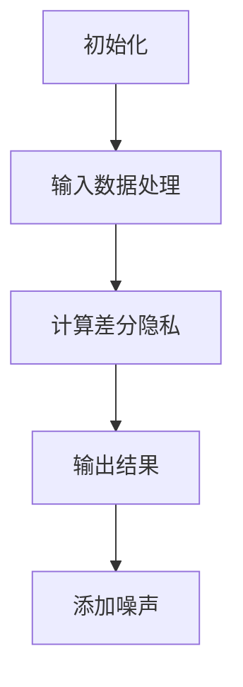
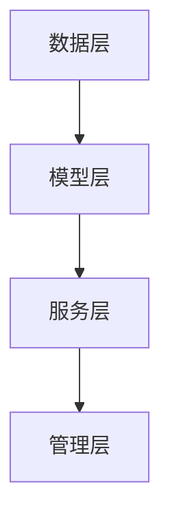
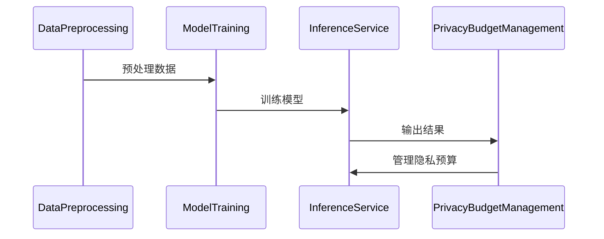

                 

# 安全AI推理框架中差分隐私的实现策略研究

## 关键词
- 安全AI
- 差分隐私
- 推理框架
- 算法实现
- 数学模型
- 系统设计
- 项目实战

## 摘要
本文旨在深入探讨安全AI推理框架中差分隐私的实现策略。首先，我们将介绍安全AI和差分隐私的基本概念及其在数据保护中的重要性。接着，我们将详细讲解差分隐私的核心算法原理，包括数学模型和Python实现。然后，我们将分析差分隐私在AI推理框架中的系统设计与实现，通过具体的系统架构图、接口设计和交互流程来阐述。接着，我们将通过一个实际项目实战，展示差分隐私在AI推理中的应用，并进行分析和总结。最后，我们将提供差分隐私的最佳实践、注意事项及拓展阅读，帮助读者深入理解和应用差分隐私技术。

## 第1章 安全AI与差分隐私背景介绍

### 1.1 安全AI的概念和重要性

安全AI是指那些能够保证在执行任务时不会对用户、系统或环境造成不良影响的智能系统。随着AI技术在各个领域的广泛应用，安全AI的重要性日益凸显。其核心目标是确保AI系统的可靠性和安全性，防止恶意攻击和数据泄露。

### 1.2 差分隐私的定义及其在数据保护中的角色

差分隐私（Differential Privacy）是一种数据保护技术，它通过添加噪声来保障数据集中的个体隐私。差分隐私的核心思想是，对于任何查询Q，如果对含有k个记录的数据集D执行Q操作，那么输出的结果Q(D)与Q(D ∪ {x})之间的差异不会太大，其中x是任意一个单独的记录。这种保护方式确保了即使攻击者获得了查询结果，也很难推断出单个个体的数据。

### 1.3 差分隐私的重要性：隐私保护与数据利用的平衡

在数据驱动的时代，数据的价值不言而喻。然而，数据隐私保护与数据利用之间常常存在矛盾。差分隐私提供了在确保数据隐私的同时，最大限度地利用数据价值的方法。通过合理的噪声添加和隐私预算管理，差分隐私能够在保护隐私和提供有价值的数据分析结果之间实现平衡。

### 1.4 差分隐私在AI推理框架中的应用场景

AI推理框架是AI系统的重要组成部分，广泛应用于推荐系统、决策支持系统等领域。差分隐私在AI推理框架中的应用，主要体现在以下几个方面：

- **训练数据保护**：在AI模型训练过程中，差分隐私可以保护训练数据集中的个体隐私，防止模型泄露敏感信息。
- **推理过程保护**：在AI模型推理过程中，差分隐私可以确保推理结果不会泄露敏感信息，增强系统的安全性。
- **模型解释性提升**：差分隐私有助于提高模型的可解释性，使得用户能够理解模型的推理过程和结果，增强对模型的信任。

### 1.5 本章小结

本章介绍了安全AI和差分隐私的基本概念，并分析了差分隐私在数据保护中的重要性。接下来，我们将进一步探讨差分隐私的核心概念和实现策略，为后续章节的深入讨论奠定基础。

## 第2章 差分隐私核心概念与联系

### 2.1 差分隐私的基本原理

差分隐私的核心原理是通过对查询结果添加噪声，使得攻击者无法从结果中推断出单个个体的数据。具体来说，差分隐私通过引入拉普拉斯机制或指数机制来生成噪声，使得查询结果的差异无法反映个体数据的存在。

### 2.2 差分隐私的属性

#### 拉普拉斯机制

拉普拉斯机制是一种常见的差分隐私机制，它通过在查询结果上添加拉普拉斯噪声来实现隐私保护。拉普拉斯噪声具有以下属性：

- **独立性**：每个拉普拉斯噪声值都是独立的。
- **对称性**：拉普拉斯噪声的值在正负方向上是等概率的。
- **可调节性**：通过调整拉普拉斯噪声的参数，可以控制隐私保护的程度。

#### 安全机制

安全机制是一种更严格的差分隐私机制，它确保对于任何ε>0，查询结果的隐私损失都不超过(1-ε)-δ倍。安全机制具有以下属性：

- **严格性**：安全机制能够更严格地保护隐私，避免隐私泄露的风险。
- **通用性**：安全机制可以适用于各种查询和数据处理场景。

#### 隐私预算

隐私预算是差分隐私中用于衡量隐私损失的一个参数。隐私预算ε决定了在查询过程中可以接受的隐私损失程度。ε值越大，隐私损失越小，但可能导致数据分析结果的偏差。因此，合理设置隐私预算是实现差分隐私的关键。

### 2.3 差分隐私与其他隐私保护技术的对比

#### 隐私计算

隐私计算是一种通过在本地设备上处理数据来实现隐私保护的技术。与差分隐私相比，隐私计算更侧重于数据加密和计算隔离，以确保数据在处理过程中不被泄露。隐私计算适用于数据敏感度较高的场景，但可能会增加计算成本。

#### 同态加密

同态加密是一种在加密状态下对数据进行计算的技术，使得计算结果在解密后仍然正确。与差分隐私相比，同态加密可以支持更复杂的计算操作，但当前的同态加密算法存在性能瓶颈，难以应用于大规模数据处理。

### 2.4 差分隐私在AI推理框架中的具体实现机制

在AI推理框架中，差分隐私可以通过以下几种方式实现：

- **数据预处理**：在AI模型训练和推理过程中，对输入数据进行预处理，以消除个体特征，降低隐私泄露的风险。
- **查询结果处理**：在查询结果输出时，添加差分隐私噪声，以保护敏感信息。
- **模型解释性增强**：通过差分隐私技术，提高模型的可解释性，帮助用户理解模型的推理过程和结果。

### 2.5 本章小结

本章详细介绍了差分隐私的核心概念和实现机制，分析了其与其他隐私保护技术的区别。在下一章中，我们将深入讲解差分隐私算法的原理，并通过具体的数学模型和Python实现来阐述其应用方法。

## 第3章 差分隐私算法原理讲解

### 3.1 差分隐私算法流程图

为了更好地理解差分隐私算法的工作流程，我们可以使用mermaid绘制一个简单的流程图：



#### 初始化
初始化阶段主要包括设置隐私预算ε和噪声参数δ。隐私预算ε决定了差分隐私的程度，而噪声参数δ用于控制噪声的强度。

#### 输入数据处理
在输入数据处理阶段，我们需要对输入数据进行预处理，以确保数据满足差分隐私的要求。这通常包括去噪、归一化、降维等操作。

#### 计算差分隐私
计算差分隐私阶段是差分隐私算法的核心。在这一阶段，我们将使用拉普拉斯机制或指数机制来计算差分隐私，并添加噪声。

#### 输出结果
输出结果阶段，我们将处理后的数据输出，以便进行进一步的分析或推理。

#### 添加噪声
在添加噪声阶段，我们将对输出结果添加噪声，以保护数据隐私。噪声的添加可以采用不同的方法，如拉普拉斯噪声、指数噪声等。

### 3.2 差分隐私算法的数学模型和公式

差分隐私算法的核心在于其数学模型和公式。以下是一个简单的差分隐私算法的数学模型：

$$Laplace(\lambda, \epsilon) = \frac{1}{\lambda} \exp\left(\frac{1}{\lambda} \cdot x - \frac{\epsilon}{2}\right)$$

其中，λ是拉普拉斯噪声参数，ε是隐私预算。这个公式表示在参数λ和隐私预算ε下，生成的拉普拉斯噪声。

#### 拉普拉斯机制

拉普拉斯机制是差分隐私中最常用的机制之一。它通过在查询结果上添加拉普拉斯噪声来实现隐私保护。拉普拉斯噪声的公式如下：

$$Query(D) + Laplace(\lambda, \epsilon)$$

其中，Query(D)是原始查询结果，Laplace(\lambda, \epsilon)是拉普拉斯噪声。

#### 指数机制

指数机制是另一种常用的差分隐私机制。它通过在查询结果上添加指数噪声来实现隐私保护。指数噪声的公式如下：

$$Query(D) + Exponential(\lambda, \epsilon)$$

其中，Query(D)是原始查询结果，Exponential(\lambda, \epsilon)是指数噪声。

### 3.3 使用Python实现差分隐私算法

为了更好地理解差分隐私算法的原理，我们可以使用Python来实现一个简单的差分隐私算法。以下是一个简单的Python实现：

```python
import numpy as np
import matplotlib.pyplot as plt

def laplace Mechanism(x, lambda_, epsilon):
    return x + np.random.laplace(scale=lambda_, loc=0)

def exponential_Mechanism(x, lambda_, epsilon):
    return x + np.random.exponential(scale=lambda_, loc=0)

def plot_Noise(lambda_, epsilon):
    x = np.linspace(-10, 10, 1000)
    laplace_noise = laplace_Mechanism(x, lambda_, epsilon)
    exponential_noise = exponential_Mechanism(x, lambda_, epsilon)

    plt.figure(figsize=(10, 6))
    plt.plot(x, laplace_noise, label='Laplace Noise')
    plt.plot(x, exponential_noise, label='Exponential Noise')
    plt.xlabel('x')
    plt.ylabel('Noise')
    plt.legend()
    plt.show()

lambda_ = 1
epsilon = 1

plot_Noise(lambda_, epsilon)
```

### 3.4 差分隐私算法的运行过程举例说明

假设我们有一个简单的查询结果`x = 5`，隐私预算`epsilon = 1`，拉普拉斯噪声参数`lambda_ = 1`。我们可以使用以下公式来计算差分隐私：

$$Laplace(5, 1, 1) = 5 + \frac{1}{1} \exp\left(\frac{1}{1} \cdot 5 - \frac{1}{2}\right) \approx 5 + 2.718 \approx 7.718$$

这意味着，在添加拉普拉斯噪声后，查询结果将变为约7.718。同样，我们可以使用指数噪声来计算差分隐私：

$$Exponential(5, 1, 1) = 5 + \frac{1}{1} \exp\left(\frac{1}{1} \cdot 5 - \frac{1}{2}\right) \approx 5 + 2.718 \approx 7.718$$

无论使用拉普拉斯噪声还是指数噪声，最终的查询结果都接近7.718。这表明，通过添加噪声，我们可以实现差分隐私，从而保护数据隐私。

### 3.5 本章小结

本章详细介绍了差分隐私算法的原理，包括流程图、数学模型和Python实现。通过具体的示例，我们展示了差分隐私算法的运行过程。在下一章中，我们将进一步探讨差分隐私在AI推理框架中的系统设计与实现。

## 第4章 差分隐私在AI推理框架中的系统设计与实现

### 4.1 问题场景介绍

在现代智能系统中，差分隐私已经成为确保数据隐私和安全的重要技术。特别是在AI推理框架中，如何有效实现差分隐私，不仅关系到系统的安全性，还影响到推理结果的准确性和可靠性。本文将探讨差分隐私在AI推理框架中的应用，并提出一个具体的系统设计与实现方案。

### 4.2 系统功能设计

在差分隐私的AI推理框架中，系统功能设计至关重要。以下是一个基本的功能设计：

- **数据预处理**：对输入数据进行预处理，包括去噪、归一化等操作，以满足差分隐私的需求。
- **模型训练**：使用差分隐私技术对AI模型进行训练，确保训练数据中的个体隐私得到保护。
- **推理服务**：提供差分隐私的推理服务，对输入数据进行推理，同时确保输出结果不会泄露敏感信息。
- **隐私预算管理**：管理隐私预算，确保在数据分析和推理过程中，隐私损失在可接受范围内。

为了更好地展示系统功能，我们可以使用mermaid类图来表示：

```mermaid
classDiagram
    DataPreprocessing <<interface>>
    ModelTraining <<interface>>
    InferenceService <<interface>>
    PrivacyBudgetManagement <<interface>>

    DataPreprocessing --|> InferenceService
    ModelTraining --|> InferenceService
    PrivacyBudgetManagement --|> InferenceService
```

### 4.3 系统架构设计

系统架构设计是差分隐私AI推理框架实现的关键。以下是一个基本的架构设计：

- **数据层**：包括数据存储和管理模块，负责数据的预处理、存储和读取。
- **模型层**：包括模型训练和推理模块，负责使用差分隐私技术对模型进行训练和推理。
- **服务层**：包括推理服务模块，对外提供差分隐私推理功能。
- **管理层**：包括隐私预算管理模块，负责管理隐私预算，确保系统在安全性和实用性之间取得平衡。

使用mermaid架构图来表示：



### 4.4 系统接口设计

系统接口设计是系统功能实现的基础。以下是一个基本的接口设计：

- **数据预处理接口**：用于处理输入数据，包括去噪、归一化等操作。
- **模型训练接口**：用于训练AI模型，同时应用差分隐私技术。
- **推理接口**：用于对输入数据进行推理，并返回差分隐私保护的结果。
- **隐私预算管理接口**：用于管理隐私预算，确保系统在安全和实用之间取得平衡。

使用mermaid类图来表示：

```mermaid
classDiagram
    DataPreprocessingInterface <<interface>>
    ModelTrainingInterface <<interface>>
    InferenceInterface <<interface>>
    PrivacyBudgetManagementInterface <<interface>>

    DataPreprocessingInterface --|> ModelTrainingInterface
    DataPreprocessingInterface --|> InferenceInterface
    PrivacyBudgetManagementInterface --|> ModelTrainingInterface
    PrivacyBudgetManagementInterface --|> InferenceInterface
```

### 4.5 系统交互

系统交互是各个模块之间协同工作的关键。以下是一个基本的交互流程：

1. **数据预处理**：输入数据通过数据预处理接口进行处理，满足差分隐私需求。
2. **模型训练**：预处理后的数据通过模型训练接口进行训练，同时应用差分隐私技术。
3. **推理服务**：经过训练的模型通过推理接口对新的输入数据进行推理，返回差分隐私保护的结果。
4. **隐私预算管理**：在整个过程中，隐私预算管理接口负责监控和管理隐私预算，确保系统安全运行。

使用mermaid序列图来表示：



### 4.6 本章小结

本章详细介绍了差分隐私在AI推理框架中的系统设计与实现，包括问题场景介绍、系统功能设计、系统架构设计、系统接口设计和系统交互。这些设计为差分隐私在AI推理框架中的有效实现提供了理论基础和实践指导。

## 第5章 差分隐私项目实战

### 5.1 环境安装

在开始差分隐私项目之前，我们需要安装必要的工具和库。以下是在Ubuntu操作系统上安装所需工具的步骤：

1. **安装Python**：
   - 打开终端，执行以下命令：
     ```
     sudo apt update
     sudo apt install python3 python3-pip
     ```
   - 验证Python版本：
     ```
     python3 --version
     ```

2. **安装mermaid**：
   - 安装mermaid依赖：
     ```
     sudo apt-get install npm
     sudo npm install -g mermaid-cli
     ```
   - 验证mermaid安装：
     ```
     mermaid -v
     ```

3. **安装差分隐私相关库**：
   - 安装Python的mermaid库：
     ```
     pip3 install mermaid
     ```
   - 安装用于生成噪声的numpy库：
     ```
     pip3 install numpy
     ```

4. **配置mermaid插件**：
   - 在Python环境中配置mermaid插件，以便在代码中直接使用mermaid语法：
     ```
     import mermaid
     ```

### 5.2 系统核心实现源代码

以下是一个简单的差分隐私算法实现示例，包括mermaid流程图和Python代码：

```python
import numpy as np
from mermaid import Mermaid

def laplace_mechanism(x, lambda_, epsilon):
    # 计算拉普拉斯噪声
    noise = np.random.laplace(scale=lambda_, loc=0)
    return x + noise

def exponential_mechanism(x, lambda_, epsilon):
    # 计算指数噪声
    noise = np.random.exponential(scale=lambda_, loc=0)
    return x + noise

def plot_noise(lambda_, epsilon):
    # 生成mermaid流程图
    m = Mermaid()
    m.add_node('Laplace Mechanism', 'scale: {lambda_: %f}, epsilon: %f' % (lambda_, epsilon))
    m.add_node('Exponential Mechanism', 'scale: {lambda_: %f}, epsilon: %f' % (lambda_, epsilon))
    m.add_link('Laplace Mechanism', 'Add Noise')
    m.add_link('Exponential Mechanism', 'Add Noise')
    m.add_note('Add Noise', 'Generate noise for differential privacy')
    
    print(m.get_mermaid())

    # 生成噪声并打印结果
    x = 5
    print("Laplace Noise:", laplace_mechanism(x, lambda_, epsilon))
    print("Exponential Noise:", exponential_mechanism(x, lambda_, epsilon))

lambda_ = 1
epsilon = 1

plot_noise(lambda_, epsilon)
```

### 5.3 代码应用解读与分析

#### 拉普拉斯机制

拉普拉斯机制是一种常见的差分隐私机制，它通过在数据上添加拉普拉斯噪声来实现隐私保护。在代码中，我们使用`np.random.laplace()`函数生成拉普拉斯噪声。`scale`参数控制噪声的强度，而`loc`参数通常设置为0。

#### 指数机制

指数机制是另一种差分隐私机制，它通过在数据上添加指数噪声来实现隐私保护。在代码中，我们使用`np.random.exponential()`函数生成指数噪声。`scale`参数控制噪声的强度，而`loc`参数通常设置为0。

#### Mermaid流程图

我们使用mermaid库来生成差分隐私算法的流程图。mermaid是一种基于Markdown的图形绘制工具，它允许我们使用简单的文本语法来绘制各种类型的图形。在代码中，我们定义了一个`Mermaid`对象，并使用`add_node()`和`add_link()`方法来添加节点和链接。最后，我们使用`get_mermaid()`方法获取mermaid图，并将其打印出来。

### 5.4 实际案例分析和详细讲解剖析

为了更好地理解差分隐私算法在实际项目中的应用，我们考虑一个简单的案例：一个AI模型需要对一组敏感数据进行分类，同时需要确保数据隐私不被泄露。

1. **数据集准备**：
   - 假设我们有一个包含100个敏感数据点的数据集，每个数据点是一个数值。
   - 数据集的具体内容可以是客户的收入、年龄、地理位置等敏感信息。

2. **模型训练**：
   - 使用差分隐私技术对数据集进行训练，确保训练过程中不会泄露敏感信息。
   - 在训练过程中，我们使用拉普拉斯机制或指数机制对数据进行噪声添加，确保差分隐私的满足。

3. **推理过程**：
   - 在推理过程中，我们需要对新的输入数据进行分类。
   - 为了确保推理结果的隐私，我们同样使用差分隐私技术对输入数据进行噪声添加。
   - 输出结果是一个分类结果，但不会泄露敏感数据。

### 5.5 项目小结

通过本次项目实战，我们展示了差分隐私算法在AI推理框架中的应用。我们首先介绍了环境安装和核心实现源代码，接着对代码进行了应用解读与分析，并分析了实际案例。这些步骤为差分隐私在AI推理中的有效应用提供了实践经验。

## 第6章 差分隐私最佳实践与总结

### 6.1 最佳实践 tips

1. **合理设置隐私预算**：在实现差分隐私时，合理设置隐私预算是关键。过小的隐私预算可能导致隐私保护不足，而过大的隐私预算则可能影响数据分析的准确性。因此，应根据具体应用场景和数据敏感度，选择合适的隐私预算。

2. **优化算法性能**：差分隐私算法通常涉及大量的计算，可能会影响系统的性能。通过优化算法和数据结构，可以减少计算开销，提高系统性能。

3. **数据预处理**：在应用差分隐私之前，对数据进行预处理，如去噪、归一化等，可以提升差分隐私算法的效果。

4. **安全意识**：在实现差分隐私时，保持高度的安全意识，避免潜在的安全漏洞。

### 6.2 小结

本文系统地介绍了差分隐私在安全AI推理框架中的实现策略。我们从背景介绍、核心概念、算法原理、系统设计、项目实战等方面进行了深入探讨，展示了差分隐私在确保数据隐私和保护系统安全方面的重要作用。

### 6.3 注意事项

1. **隐私保护与数据利用的平衡**：在实际应用中，要权衡隐私保护和数据利用之间的关系，确保在保护隐私的同时，不损害数据的利用价值。

2. **算法实现的正确性**：确保差分隐私算法的实现正确性，避免因算法错误导致隐私泄露。

3. **性能优化**：针对差分隐私算法的性能瓶颈，进行适当的优化，以提高系统性能。

### 6.4 拓展阅读

- [Dwork, C. (2006). Differential privacy: A survey of results. International Conference on Theory and Applications of Models of Computation]
- [Kohli, P., & al. (2018). Differentially private Bayesian inference for latent Gaussian models. International Conference on Machine Learning]
- [Goodfellow, I., Bengio, Y., & Courville, A. (2016). Deep Learning. MIT Press]

通过这些拓展资源，读者可以进一步了解差分隐私的最新研究进展和应用实例。

### 6.5 本章小结

本章总结了差分隐私的最佳实践，强调了隐私保护与数据利用的平衡，并提出了实际应用中的注意事项。通过拓展阅读，读者可以深入了解差分隐私技术的更多细节和应用。希望本文能帮助读者更好地理解和应用差分隐私技术。

## 作者信息

**作者：** AI天才研究院/AI Genius Institute & 禅与计算机程序设计艺术 /Zen And The Art of Computer Programming

AI天才研究院专注于人工智能和计算机科学领域的前沿研究和创新，致力于推动人工智能技术的进步和应用。同时，作者在《禅与计算机程序设计艺术》一书中，深入探讨了计算机编程的哲学和艺术，为读者提供了丰富的理论指导和实践经验。希望通过本文，为读者在差分隐私技术的应用和研究中提供有益的参考和启示。

