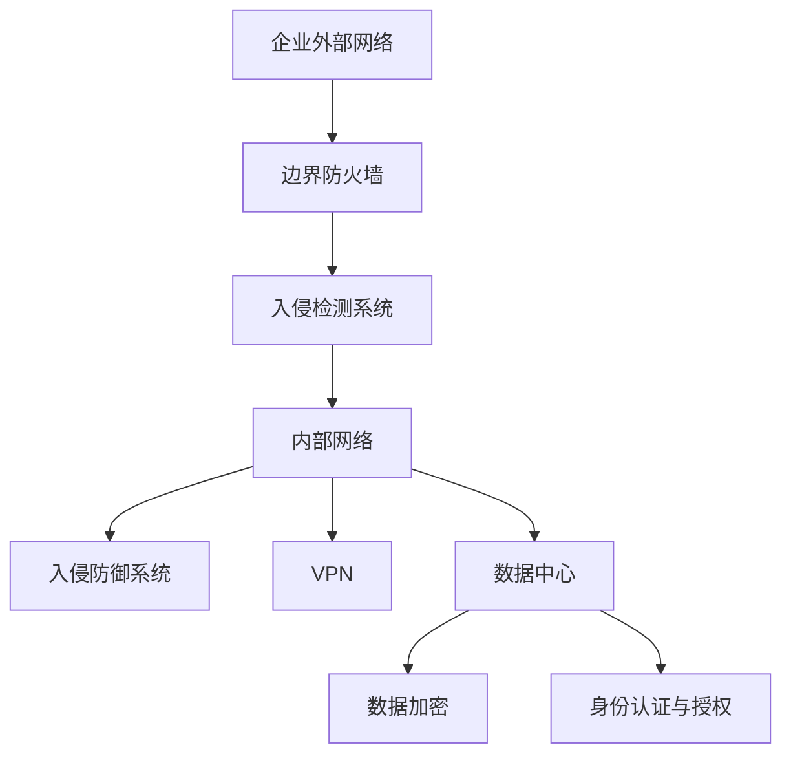
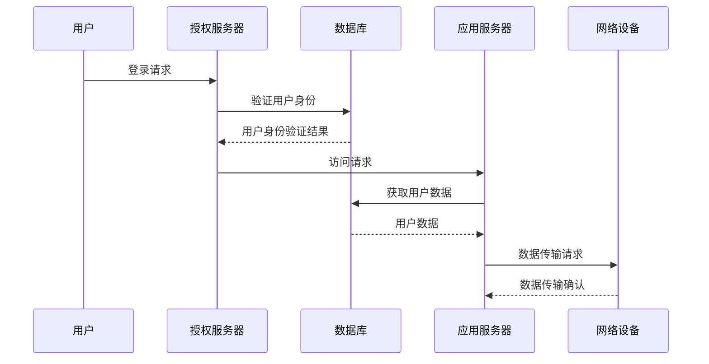
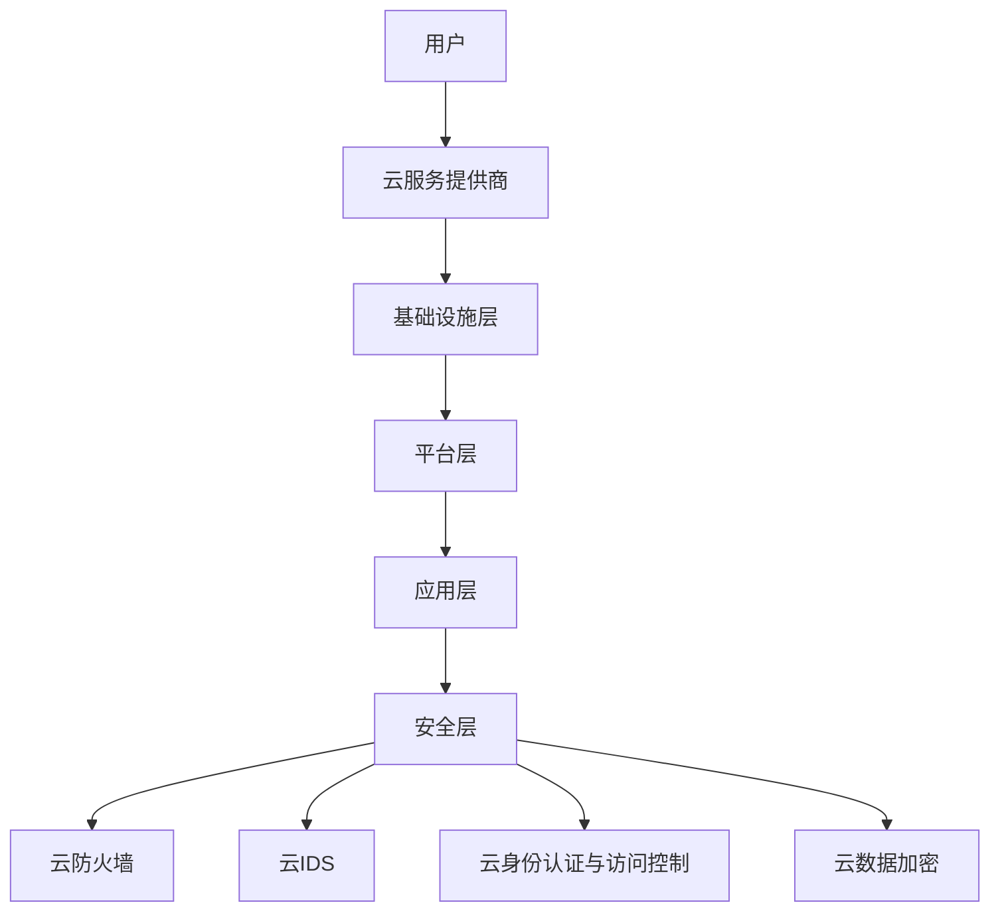
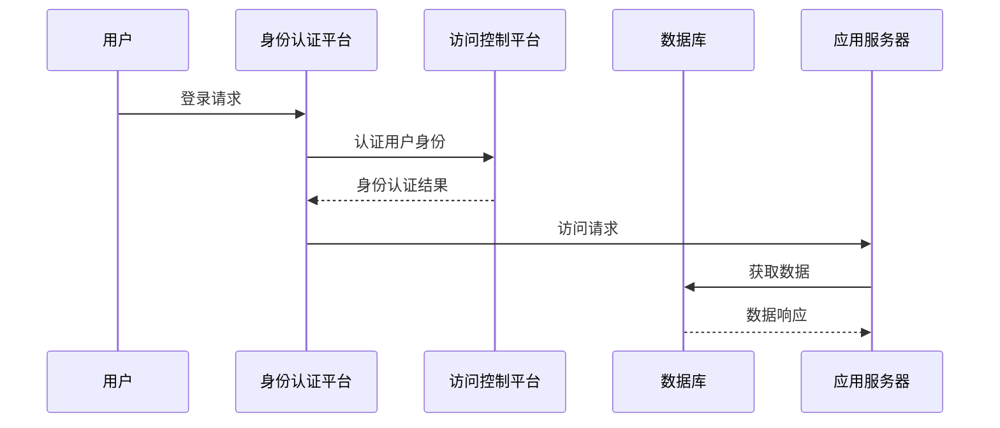

                 

# 安全架构设计：P9工程师的责任与使命

关键词：安全架构设计、P9工程师、网络安全、架构设计原则、实战案例分析

摘要：随着信息技术的发展，网络安全问题日益突出，安全架构设计成为保护企业信息资产的关键。本文将探讨安全架构设计的基本原理、流程和最佳实践，重点分析P9工程师在这一领域的责任与使命，以期为P9工程师提供实用的指导和建议。

## 第一部分：安全架构设计与P9工程师的角色

### 第1章：问题背景与安全架构概述

#### 1.1 问题背景

网络安全已成为当今社会最为关注的议题之一。随着互联网的普及，网络攻击手段日益翻新，黑客攻击、数据泄露、网络诈骗等问题层出不穷。对于企业而言，网络安全问题不仅会带来经济损失，还可能损害企业的声誉，影响业务的持续发展。因此，建立完善的安全架构设计至关重要。

#### 1.2 核心概念

安全架构设计是指将安全策略、安全需求和最佳实践转化为具体的架构方案，以保护企业信息资产的过程。它包括安全模型、安全框架、安全需求分析、安全架构设计、安全测试与评估等关键环节。

#### 1.3 P9工程师的角色

P9工程师是企业技术团队的领导者，他们在安全架构设计中的角色至关重要。P9工程师需要具备丰富的安全知识和经验，能够从整体上把握企业安全需求，设计出高效、可靠的安全架构。

### 第二部分：安全架构设计原理

#### 第2章：安全架构设计原则

安全架构设计需要遵循一系列原则，以确保其有效性。以下是一些关键原则：

- **最小权限原则**：用户和系统组件只能访问其完成任务所需的最低权限资源。
- **决策分层原则**：安全决策应该分层处理，以减少单点故障的风险。
- **安全集中与分散原则**：在某些关键领域实现安全集中管理，而在其他领域实现安全分散管理。

#### 第3章：安全架构设计流程

安全架构设计是一个复杂的过程，需要经历以下几个阶段：

- **安全需求分析**：明确企业安全需求，包括数据保护、访问控制、安全监测等方面。
- **安全架构设计**：根据安全需求，设计出具体的安全架构方案。
- **安全测试与评估**：对安全架构进行测试和评估，以确保其满足安全需求。

### 第三部分：P9工程师实战案例分析

#### 第4章：案例一：企业网络安全架构设计

本章节将详细介绍一个企业网络安全架构设计的案例，包括安全需求分析、系统功能设计、系统架构设计、系统接口设计以及系统实现与代码解析。

#### 第5章：案例二：云安全架构设计

本章节将分析一个云安全架构设计的案例，探讨云环境下安全架构设计的特点和挑战。

### 第四部分：最佳实践与未来展望

#### 第6章：最佳实践

本章节将总结安全架构设计的最佳实践，包括流程优化、安全模型与框架应用、安全测试与评估策略等。

#### 第7章：未来展望

本章节将探讨安全架构设计的发展趋势，以及P9工程师在这一领域的责任与使命。

## 结论

安全架构设计是企业网络安全的关键，P9工程师在其中扮演着重要角色。通过本文的探讨，我们希望能为P9工程师提供有价值的指导，帮助他们更好地应对网络安全挑战。让我们共同为构建一个安全、可靠的信息技术环境而努力。

作者：AI天才研究院/AI Genius Institute & 禅与计算机程序设计艺术 /Zen And The Art of Computer Programming## 第一部分：安全架构设计与P9工程师的角色

### 第1章：问题背景与安全架构概述

#### 1.1 问题背景

在当今数字化时代，网络安全已成为企业生存与发展的关键因素。随着信息技术的飞速发展，网络攻击手段日趋复杂和多样化，企业面临的网络安全威胁不断增加。据《2021年网络安全态势报告》显示，全球范围内的网络攻击事件每年呈上升趋势，其中数据泄露、恶意软件、网络钓鱼等攻击方式对企业造成严重损失。因此，如何构建一个可靠的安全架构来保护企业信息资产，已成为企业信息安全管理的重要课题。

网络安全威胁的演变也是一个值得关注的话题。早期的网络安全威胁主要集中在系统漏洞和恶意软件，如病毒、蠕虫等。然而，随着网络环境的复杂化，攻击手段逐渐向高级持续性威胁（APT）和勒索软件等方向演变。APT攻击通常针对特定目标，长期潜伏在目标系统中，窃取敏感信息或破坏系统功能。而勒索软件则通过加密企业数据，勒索赎金，对企业的正常运营造成严重影响。这些威胁要求企业必须具备更高的安全防护能力。

安全架构设计的必要性体现在多个方面。首先，它能够帮助企业全面识别和管理安全风险，确保企业关键信息的安全。其次，安全架构设计可以为企业提供一套系统化的安全解决方案，使企业在面对各种安全威胁时能够迅速响应和应对。此外，良好的安全架构设计有助于企业降低安全成本，提高安全管理的效率。

#### 1.2 核心概念

安全架构的定义是指一个组织为了保护其信息资产，通过系统化的方法和工具，将安全需求转化为安全措施和安全控制的总体设计。安全架构的核心要素包括安全策略、安全需求、安全控制、安全模型和安全框架等。

- **安全策略**：安全策略是企业安全管理的指导方针，包括安全目标、安全原则和安全管理流程等。
- **安全需求**：安全需求是指企业业务运营过程中必须满足的安全要求，包括数据保护、访问控制、安全监测等。
- **安全控制**：安全控制是指为了实现安全策略和安全需求，采取的具体安全措施和技术手段。
- **安全模型**：安全模型是描述安全架构中各元素之间关系的抽象概念，如贝叶斯网络、访问控制模型等。
- **安全框架**：安全框架是提供安全架构设计方法和工具的指导性文档，如ISO/IEC 27001、NIST SP 800-53等。

#### 1.3 安全架构与传统IT架构的区别

安全架构与传统IT架构在目标、方法和内容上存在显著差异。

- **目标差异**：传统IT架构的目标是确保系统的性能、可用性和可扩展性，而安全架构的目标是保护系统的安全性和隐私性。
- **方法差异**：传统IT架构通常采用自下而上的方法，从硬件、软件和网络等方面逐步构建，而安全架构设计则采用自上而下的方法，首先确定安全需求和安全策略，再根据这些需求设计具体的安全控制措施。
- **内容差异**：传统IT架构关注系统的功能性和效率，而安全架构设计则关注系统的安全性、可靠性和合规性。

#### 1.4 P9工程师的角色

P9工程师是企业技术团队中的高级技术专家，通常负责技术战略规划、系统架构设计和关键技术难题的解决。在安全架构设计方面，P9工程师的角色至关重要。

- **安全需求分析**：P9工程师需要深入理解企业业务需求，识别潜在的安全威胁和风险，制定详细的安全需求文档。
- **安全架构设计**：P9工程师需要根据安全需求，设计出符合企业实际需求的安全架构方案，包括安全模型、安全控制和安全框架等。
- **安全测试与评估**：P9工程师需要负责安全架构的测试和评估，确保架构方案能够有效应对各种安全威胁。
- **安全培训与指导**：P9工程师需要向企业内部其他团队成员提供安全培训，提高他们的安全意识和技能。

#### 1.5 P9工程师所需技能

P9工程师在安全架构设计方面需要具备以下技能：

- **深入理解网络安全知识**：熟悉各种网络攻击手段、安全防护技术和安全协议。
- **掌握安全架构设计原则**：了解最小权限原则、决策分层原则、安全集中与分散原则等。
- **具备系统分析能力**：能够从整体上分析企业安全需求，设计出高效、可靠的安全架构。
- **熟练使用安全工具**：掌握各种安全测试工具、安全监控工具和安全管理系统。
- **沟通与协作能力**：能够与不同部门和技术团队有效沟通，协调各方资源，共同推进安全架构设计工作。

#### 1.6 P9工程师在安全架构设计中的角色

在安全架构设计中，P9工程师扮演着多重角色：

- **领导者**：P9工程师需要带领团队完成安全架构设计任务，确保项目按时按质完成。
- **专家顾问**：P9工程师需要为企业提供专业的安全架构设计建议，帮助企业应对复杂的网络安全挑战。
- **实施者**：P9工程师需要亲自参与安全架构的实施和部署，确保安全架构方案能够顺利落地。
- **维护者**：P9工程师需要持续关注安全架构的运行状况，及时发现和解决潜在的安全问题。

通过以上分析，我们可以看出，安全架构设计对于企业信息安全管理至关重要，而P9工程师在其中扮演着关键角色。只有充分发挥P9工程师的专业能力，才能为企业构建一个安全、可靠的信息技术环境。在下一部分中，我们将深入探讨安全架构设计的基本原理和流程，帮助P9工程师更好地理解和实施安全架构设计。

### 第2章：安全架构设计原则

安全架构设计原则是确保安全架构设计有效性和可靠性的基础。这些原则不仅指导安全架构的设计过程，还确保安全架构能够满足企业的安全需求。以下是一些关键的安全架构设计原则：

#### 2.1 最小权限原则

最小权限原则是指用户和系统组件只能拥有完成任务所需的最低权限。这一原则的目的是减少恶意行为或错误操作对系统的影响范围。例如，一个普通的员工账户只需要访问与工作相关的文件和系统，而不应该拥有管理系统的权限。

- **核心概念**：最小权限原则强调权限的严格控制和限制。
- **优势**：减少权限滥用和内部威胁的风险。
- **应用场景**：在操作系统、网络设备和应用程序中广泛应用。

#### 2.2 决策分层原则

决策分层原则是指安全决策应该在不同层次进行，以减少单点故障的风险。在安全架构设计中，不同的决策层次可以分别处理不同类型的安全问题，确保整个系统的安全性。

- **核心概念**：安全决策分为策略层、管理层和技术层。
- **优势**：提高系统的弹性和鲁棒性。
- **应用场景**：在企业安全策略制定、安全管理流程设计和安全控制实现中广泛应用。

#### 2.3 安全集中与分散原则

安全集中与分散原则是指在安全架构设计中，某些关键领域可以采用集中式管理，而在其他领域可以采用分散式管理。集中式管理可以提供统一的控制和监控，而分散式管理则可以提高系统的灵活性和适应性。

- **核心概念**：安全集中与分散取决于系统的具体需求和复杂性。
- **优势**：平衡系统的安全性和灵活性。
- **应用场景**：在大型企业或复杂网络环境中广泛应用。

#### 2.4 安全模型与框架

安全模型是描述安全架构中各元素之间关系的抽象概念，而安全框架是提供安全架构设计方法和工具的指导性文档。

- **常见安全模型**：
  - **贝叶斯网络**：用于概率推理和风险评估。
  - **访问控制模型**：如自主访问控制（DAC）和强制访问控制（MAC）。
  - **安全协议模型**：如SSL/TLS协议模型。
- **常见安全框架**：
  - **ISO/IEC 27001**：信息安全管理系统（ISMS）的标准框架。
  - **NIST SP 800-53**：联邦信息安全管理标准。
  - **SANS Top 20**：网络安全最佳实践。

#### 2.5 安全架构设计流程

安全架构设计流程是一个系统化的过程，包括以下几个关键步骤：

1. **安全需求分析**：收集和整理企业的安全需求，包括数据保护、访问控制、安全监测等。
2. **安全架构设计**：根据安全需求设计出符合企业实际需求的安全架构方案。
3. **安全测试与评估**：对安全架构进行测试和评估，确保其能够有效应对各种安全威胁。
4. **安全架构部署与实施**：将安全架构方案部署到实际环境中，并进行持续维护和优化。

#### 2.6 安全架构设计原则的应用

在安全架构设计过程中，遵循上述原则可以帮助工程师设计出更加安全、可靠和高效的架构方案。

- **最小权限原则**：在设计应用程序时，应确保每个用户和组件只能访问其必需的资源。
- **决策分层原则**：在安全策略制定时，应明确不同层次的决策责任和权限。
- **安全集中与分散原则**：在设计安全控制系统时，应综合考虑集中管理和分散管理的优点和适用场景。

通过以上分析，我们可以看出，安全架构设计原则是构建企业安全架构的基础。P9工程师需要深入理解这些原则，并在实际设计中灵活应用，以确保企业信息系统的安全性。

### 第3章：安全架构设计流程

安全架构设计流程是一个系统化的过程，涉及多个阶段和步骤。以下是安全架构设计的详细流程：

#### 3.1 安全需求分析

安全需求分析是安全架构设计的第一步，其目的是明确企业的安全需求，为后续的设计工作提供基础。

- **安全需求收集**：通过访谈、问卷调查和文档分析等方式，收集企业内部和外部的安全需求。内部需求包括业务流程、关键信息、用户权限等；外部需求包括行业法规、标准、最佳实践等。
- **安全需求分析**：对收集到的安全需求进行深入分析，识别潜在的安全威胁和风险，并确定安全需求的具体内容和优先级。
- **安全需求文档编写**：将分析结果整理成文档，明确安全需求的描述、原因、优先级和实施计划。

#### 3.2 安全架构设计

安全架构设计是根据安全需求，设计出符合企业实际需求的安全架构方案。

- **安全架构设计流程**：包括需求分析、架构设计、评审和优化等步骤。具体流程如下：
  1. **需求分析**：根据安全需求文档，明确架构设计的目标和范围。
  2. **架构设计**：设计出具体的架构方案，包括安全模型、安全控制和安全框架等。
  3. **评审**：组织专家对架构设计方案进行评审，确保方案的科学性和可行性。
  4. **优化**：根据评审结果对架构设计方案进行优化，提高其安全性和可靠性。
- **安全架构设计方法**：包括以下几种方法：
  - **自顶向下方法**：从整体上分析企业安全需求，逐步分解为具体的架构组件和功能。
  - **自底向上方法**：从现有的安全组件和功能出发，逐步构建出整体的安全架构。
  - **组合方法**：结合自顶向下和自底向上的方法，灵活应对复杂的安全需求。
- **安全架构设计工具**：包括以下几种工具：
  - **UML工具**：用于绘制安全架构的类图、用例图等。
  - **安全模型工具**：如贝叶斯网络分析工具、访问控制模型工具等。
  - **安全测试工具**：如漏洞扫描工具、安全测试平台等。

#### 3.3 安全测试与评估

安全测试与评估是确保安全架构设计有效性和可靠性的关键步骤。

- **安全测试策略**：包括以下内容：
  1. **测试目的**：明确安全测试的目标和范围，确保测试能够覆盖关键的安全需求和功能。
  2. **测试方法**：选择合适的测试方法，如黑盒测试、白盒测试、灰盒测试等。
  3. **测试工具**：使用安全测试工具，如漏洞扫描器、入侵检测系统等。
- **安全测试方法**：包括以下几种方法：
  - **功能测试**：验证安全架构的功能是否满足需求，如访问控制、数据加密等。
  - **性能测试**：评估安全架构的性能，如响应时间、吞吐量等。
  - **漏洞测试**：发现并验证安全架构中的潜在漏洞，如SQL注入、跨站脚本攻击等。
- **安全测试工具**：包括以下几种工具：
  - **漏洞扫描工具**：如Nessus、OpenVAS等。
  - **入侵检测系统**：如Snort、Suricata等。
  - **安全测试平台**：如OWASP ZAP、Burp Suite等。

#### 3.4 安全架构部署与实施

安全架构部署与实施是将安全架构设计转化为实际运行的系统。

- **部署计划**：制定详细的部署计划，包括部署环境、部署步骤、部署时间和资源需求等。
- **实施步骤**：根据部署计划，逐步实施安全架构方案，包括安装、配置和测试等。
- **持续维护**：对安全架构进行持续维护和优化，确保其能够适应不断变化的安全需求。

通过以上步骤，P9工程师可以系统地设计和实施安全架构，确保企业信息系统的安全性。在下一部分中，我们将通过具体案例分析，进一步探讨安全架构设计的实际应用。

### 第4章：案例一：企业网络安全架构设计

#### 4.1 案例背景

某大型企业，拥有数千名员工和复杂的IT基础设施，包括企业内部网络、数据中心、云计算平台等。随着业务的快速发展，企业面临的网络安全威胁也日益增加。为了确保企业信息系统的安全，企业决定进行一次全面的网络安全架构设计。

#### 4.2 安全需求分析

在进行安全需求分析时，企业需要明确以下安全需求：

1. **数据保护**：保护企业关键数据的安全，包括客户信息、财务数据、商业机密等。
2. **访问控制**：确保只有授权用户能够访问相应的数据和系统资源。
3. **安全监测**：实时监测网络安全状态，及时发现并响应潜在的安全威胁。
4. **安全合规**：遵守相关法律法规和行业标准，如ISO/IEC 27001、NIST SP 800-53等。

#### 4.3 系统功能设计

根据安全需求，企业设计了一套完整的网络安全系统，包括以下几个关键功能模块：

1. **防火墙**：用于保护企业内部网络，防止外部攻击。
2. **入侵检测系统（IDS）**：实时监测网络流量，发现并报警潜在的安全威胁。
3. **入侵防御系统（IPS）**：自动阻止已知的攻击行为。
4. **虚拟专用网络（VPN）**：为远程用户和分支机构提供安全的远程访问。
5. **数据加密**：对关键数据进行加密存储和传输，确保数据安全性。
6. **身份认证与授权**：确保只有授权用户能够访问企业系统。

#### 4.4 系统架构设计

企业网络安全架构设计包括以下几个关键层次：

1. **边界防护**：在企业的网络边界部署防火墙和入侵检测系统，防止外部攻击。
2. **内部网络防护**：在内部网络中部署入侵防御系统和虚拟专用网络，确保内部网络的安全性。
3. **数据中心防护**：在数据中心部署高级的安全控制措施，如数据加密、身份认证与授权等。
4. **安全监测与响应**：建立24/7的安全监测和响应机制，及时发现并应对安全威胁。

以下是一个简化的系统架构图（使用Mermaid绘制）：



#### 4.5 系统接口设计

为了确保系统各组件之间的协调和高效运行，企业设计了一套接口，用于系统组件之间的通信。以下是一个简化的接口设计（使用Mermaid绘制）：



#### 4.6 系统实现与代码解析

以下是一个简单的Python代码示例，用于实现用户认证功能：

```python
import hashlib
import sqlite3

# 连接数据库
conn = sqlite3.connect('user.db')
cursor = conn.cursor()

# 创建用户表
cursor.execute('''CREATE TABLE IF NOT EXISTS users (username TEXT PRIMARY KEY, password_hash TEXT)''')

# 用户登录函数
def login(username, password):
    password_hash = hashlib.sha256(password.encode()).hexdigest()
    cursor.execute("SELECT * FROM users WHERE username=? AND password_hash=?", (username, password_hash))
    user = cursor.fetchone()
    if user:
        return True
    else:
        return False

# 用户注册函数
def register(username, password):
    password_hash = hashlib.sha256(password.encode()).hexdigest()
    cursor.execute("INSERT INTO users (username, password_hash) VALUES (?, ?)", (username, password_hash))
    conn.commit()

# 测试
print(login('testuser', 'password123'))  # 输出：True 或 False
print(register('testuser2', 'password321'))  # 输出：None
```

通过以上代码，用户可以登录系统或注册新用户。实际应用中，还需要实现更多的功能，如权限管理、数据加密等。

#### 4.7 案例小结

本案例通过对一个大型企业的网络安全架构设计进行详细分析，展示了安全需求分析、系统功能设计、系统架构设计、系统接口设计和系统实现与代码解析的全过程。通过本案例，我们可以了解到企业网络安全架构设计的关键环节和实际应用方法，为P9工程师在实际工作中提供参考。

### 第5章：案例二：云安全架构设计

#### 5.1 案例背景

随着云计算技术的普及，越来越多的企业选择将业务迁移到云端。然而，云环境下的安全性也成为了企业关注的重要问题。为了确保云环境中的数据安全和系统稳定性，企业需要进行云安全架构设计。

#### 5.2 安全需求分析

在进行云安全架构设计之前，企业需要明确以下安全需求：

1. **数据保护**：保护企业关键数据的安全，包括数据备份、数据恢复和数据加密等。
2. **身份认证与访问控制**：确保只有授权用户能够访问云资源，如虚拟机、存储和数据库等。
3. **安全监测与响应**：实时监测云环境中的安全事件，并快速响应潜在的安全威胁。
4. **合规性**：遵守相关法律法规和行业标准，如GDPR、ISO/IEC 27001等。
5. **安全性评估**：定期对云架构进行安全评估，识别和修复潜在的安全漏洞。

#### 5.3 系统功能设计

根据安全需求，企业设计了一套云安全系统，包括以下几个关键功能模块：

1. **云防火墙**：用于保护云资源，防止外部攻击。
2. **云入侵检测系统（IDS）**：实时监测云资源的安全事件，发现并报警潜在的安全威胁。
3. **云身份认证与访问控制**：确保只有授权用户能够访问云资源。
4. **云数据加密**：对云中的数据进行加密存储和传输，确保数据安全性。
5. **云安全监控与响应**：实时监控云环境中的安全事件，并快速响应安全威胁。

#### 5.4 系统架构设计

云安全架构设计需要考虑以下几个方面：

1. **基础设施层**：包括云主机、存储和网络等基础设施资源。
2. **平台层**：包括云操作系统、数据库、存储和管理平台等。
3. **应用层**：包括企业业务应用、网站和API等。
4. **安全层**：包括云防火墙、IDS、身份认证、访问控制和数据加密等安全组件。

以下是一个简化的系统架构图（使用Mermaid绘制）：



#### 5.5 系统接口设计

云安全架构的接口设计需要确保各个组件之间的协调和高效通信。以下是一个简化的接口设计（使用Mermaid绘制）：



#### 5.6 系统实现与代码解析

以下是一个简单的Python代码示例，用于实现云身份认证功能：

```python
import requests
import json

# 身份认证API地址
IDP_API_URL = "https://idp.example.com/authenticate"

# 用户登录函数
def login(username, password):
    payload = {
        "username": username,
        "password": password
    }
    response = requests.post(IDP_API_URL, json=payload)
    if response.status_code == 200:
        return json.loads(response.text)
    else:
        return None

# 用户注册函数
def register(username, password):
    payload = {
        "username": username,
        "password": password
    }
    response = requests.post(IDP_API_URL, json=payload)
    if response.status_code == 200:
        return json.loads(response.text)
    else:
        return None

# 测试
print(login('testuser', 'password123'))  # 输出：认证结果 或 None
print(register('testuser2', 'password321'))  # 输出：注册结果 或 None
```

通过以上代码，用户可以登录系统或注册新用户。实际应用中，还需要实现更多的功能，如访问控制、数据加密等。

#### 5.7 案例小结

本案例通过对一个云环境的安全架构设计进行详细分析，展示了安全需求分析、系统功能设计、系统架构设计、系统接口设计和系统实现与代码解析的全过程。通过本案例，我们可以了解到云安全架构设计的关键环节和实际应用方法，为P9工程师在实际工作中提供参考。

### 第6章：最佳实践

在安全架构设计过程中，遵循最佳实践可以帮助企业构建高效、可靠的安全架构。以下是一些安全架构设计最佳实践：

#### 6.1 安全架构设计流程优化

1. **需求分析阶段**：深入理解业务需求，确保安全需求与业务目标一致。
2. **架构设计阶段**：采用自顶向下的设计方法，从整体上规划安全架构。
3. **测试与评估阶段**：采用自动化测试工具，提高测试效率和覆盖率。
4. **部署与实施阶段**：制定详细的部署计划，确保安全架构顺利上线。

#### 6.2 安全模型与框架应用

1. **选择合适的模型**：根据企业需求选择合适的模型，如贝叶斯网络、访问控制模型等。
2. **框架应用**：结合ISO/IEC 27001、NIST SP 800-53等框架，确保安全架构设计的合规性。

#### 6.3 安全测试与评估策略

1. **制定测试计划**：明确测试目标、方法、工具和责任人。
2. **采用多种测试方法**：包括功能测试、性能测试和漏洞测试等。
3. **定期评估**：定期对安全架构进行评估，发现和修复潜在的安全问题。

#### 6.4 P9工程师职业发展

1. **持续学习**：关注安全领域的新技术、新趋势，不断提升自己的专业能力。
2. **实践经验**：积极参与实际项目，积累丰富的安全架构设计经验。
3. **职业规划**：明确职业目标，制定职业发展路径，如成为安全专家、CTO等。

#### 6.5 职业素养培养

1. **责任心**：对企业的信息安全负责，确保安全架构的有效性和可靠性。
2. **沟通能力**：与业务团队、技术团队和管理层保持良好沟通，确保安全需求得到充分理解和满足。
3. **团队合作**：与团队成员紧密合作，共同完成安全架构设计任务。

通过以上最佳实践，P9工程师可以更好地完成安全架构设计工作，为企业构建一个安全、可靠的信息技术环境。

### 第7章：未来展望

#### 7.1 安全架构设计发展趋势

随着信息技术的发展，安全架构设计也在不断演进。以下是一些安全架构设计的发展趋势：

1. **云安全架构设计**：随着云计算的普及，云安全架构设计变得越来越重要。未来，云安全架构设计将更加注重安全性、灵活性和可扩展性。
2. **物联网安全架构设计**：随着物联网设备的普及，物联网安全架构设计将成为安全架构设计的一个重要方向。未来，物联网安全架构设计将注重设备间的安全通信和数据保护。
3. **零信任架构设计**：零信任安全架构设计强调“永不信任，总是验证”，未来，零信任架构设计将逐渐取代传统的边界防御，成为企业安全架构设计的主流。
4. **人工智能与安全架构设计**：随着人工智能技术的不断发展，未来，人工智能将在安全架构设计中发挥重要作用，如自动化威胁检测、自适应安全控制等。

#### 7.2 P9工程师的责任与使命

作为企业技术团队的领导者，P9工程师在安全架构设计中承担着重要责任和使命：

1. **引领技术创新**：P9工程师需要关注安全领域的新技术、新趋势，不断推动安全架构设计的创新和发展。
2. **保障企业安全**：P9工程师需要确保企业信息系统的安全性，防范各种安全威胁，保障企业业务的持续运行。
3. **培养团队人才**：P9工程师需要培养和带领一支专业的安全团队，提升团队的整体安全能力和技术水平。
4. **推动安全文化建设**：P9工程师需要推动企业内部的安全文化建设，提高全体员工的安全意识和素养。

通过以上分析，我们可以看到，未来安全架构设计将面临更多的挑战和机遇。作为P9工程师，我们需要不断提升自己的专业能力和综合素质，为企业构建一个安全、可靠的信息技术环境，为企业的可持续发展保驾护航。让我们共同迎接未来的挑战，为实现这一目标而努力。

