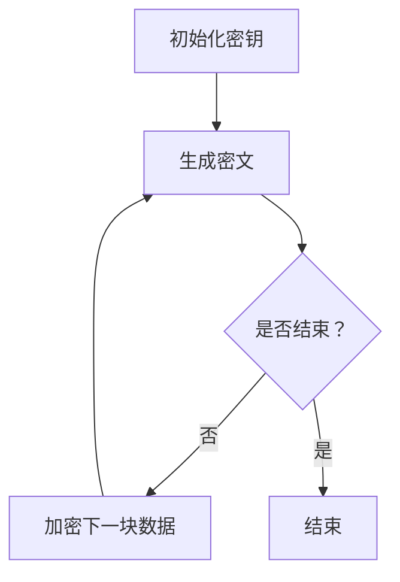

                 

### 安全架构：在设计阶段考虑安全因素

> 关键词：安全架构、设计阶段、安全因素、系统安全性、风险控制

> 摘要：本文将探讨在系统设计阶段考虑安全因素的重要性。通过详细阐述安全架构的定义、设计原则、核心概念、算法原理以及实际应用，我们旨在帮助读者理解如何将安全因素融入到系统设计之中，从而提升系统的整体安全性。

## 引言

在当今数字化时代，系统的安全性越来越受到关注。随着互联网和移动设备的普及，黑客攻击、数据泄露等安全事件频发，给企业和个人带来了巨大的损失。因此，如何构建一个安全可靠的信息系统成为了研发团队的重要课题。安全架构作为一种系统化的方法，其核心在于在设计阶段就将安全因素纳入考虑，从而预防潜在的安全威胁。本文将分几个部分详细讨论安全架构的相关内容，帮助读者理解和应用这一重要概念。

## 第一部分：问题背景与安全架构概述

### 第1章：安全架构的概念与重要性

#### 1.1 安全架构的定义与边界

安全架构是一种系统化的方法，它旨在定义、设计和实现一个组织的信息系统安全。具体来说，它包括以下核心要素：

- **安全目标**：明确组织需要保护的数据和资源，以及可接受的风险水平。
- **安全策略**：指导安全架构设计和实施的指南，通常包括安全政策、标准、目标和控制措施。
- **安全控制**：实现安全策略的具体措施，包括技术和管理控制。
- **安全流程**：确保安全控制有效运行的操作步骤，如风险评估、安全培训、安全审计等。

#### 1.2 安全架构的重要性

安全架构的重要性主要体现在以下几个方面：

- **提高安全性**：通过在设计阶段考虑安全因素，可以提前识别和消除潜在的安全漏洞。
- **降低成本**：预防性安全措施比事后修复漏洞更经济，可以有效降低企业的安全成本。
- **提高合规性**：符合行业标准和法规要求，减少法律风险。

### 第2章：安全架构的设计原则

#### 2.1 敏捷性与灵活性

敏捷性和灵活性是现代安全架构设计的关键原则。随着业务需求和技术环境的变化，安全架构需要能够快速适应这些变化。这意味着在设计安全架构时，应采用模块化、可扩展的方法，以便在必要时进行修改和升级。

#### 2.2 最小化攻击面

最小化攻击面是指通过减少暴露在公共网络上的服务和端口，来降低系统被攻击的风险。这可以通过以下几种方式实现：

- **减少不必要的开放端口和服务**：只开放必需的服务端口，关闭其他所有未使用的端口。
- **使用防火墙和入侵检测系统**：防火墙和入侵检测系统能够监控网络流量，阻止未经授权的访问。

#### 2.3 安全性与可用性平衡

安全性和可用性是安全架构设计中必须平衡的两个方面。过于严格的安全措施可能会导致系统可用性下降，而过于宽松的安全措施则会增加安全风险。因此，设计安全架构时需要找到一个合适的平衡点，确保系统既安全又可用。

#### 2.4 可测试性与可审计性

可测试性和可审计性是确保安全架构有效运行的重要条件。设计安全架构时，应确保安全控制措施可以被自动化测试，并且系统能够被审计，以验证安全措施的执行情况。

## 第二部分：核心概念与联系

### 第3章：安全架构的核心概念

#### 3.1 安全需求分析

安全需求分析是安全架构设计的第一步，其目的是确定系统必须保护的数据和资源。这通常包括以下步骤：

- **识别关键信息资产**：确定系统中的敏感数据和资源。
- **评估安全风险**：分析可能的安全威胁和漏洞，评估其风险程度。
- **制定安全策略**：根据风险评估结果，制定具体的安全策略。

#### 3.2 安全策略与控制措施

安全策略是指导安全架构设计和实施的核心指南，它通常包括以下内容：

- **安全目标**：明确组织的安全目标。
- **安全原则**：定义组织的安全原则，如保密性、完整性和可用性。
- **安全措施**：确定具体的安全措施，如加密、访问控制、监控等。

控制措施是实现安全策略的具体手段，包括以下几种类型：

- **技术控制**：使用技术手段实现安全措施，如防火墙、加密、入侵检测系统等。
- **管理控制**：通过管理手段实现安全措施，如安全培训、安全审计等。
- **物理控制**：保护物理设备和网络，如安全门禁、摄像头等。

#### 3.3 安全模型与框架

安全模型与框架是构建安全架构的重要基础。常见的安全模型和框架包括：

- **ISO 27001**：国际标准化组织制定的信息安全管理体系标准。
- **NIST**：美国国家标准与技术研究所制定的一系列安全指南，如NIST SP 800-53。
- **SANS**：国际信息安全合作组织制定的安全框架，如SANS Top 20。

这些模型和框架提供了系统化的方法，帮助组织设计和实施安全架构。

## 第三部分：算法原理讲解

### 第4章：安全算法原理

#### 4.1 密码学基础

密码学是安全架构的核心组成部分，它涉及加密、解密等技术。以下是几种常见的密码学基础概念：

- **加密算法**：将明文转换为密文的算法，如AES、RSA等。
- **解密算法**：将密文转换为明文的算法，与加密算法相对应。
- **散列函数**：将输入数据转换为固定长度的字符串，如SHA-256。
- **数字签名**：使用私钥对数据进行签名，确保数据的完整性和真实性。

#### 4.2 安全协议

安全协议是确保数据在传输过程中不被窃听、篡改和伪造的一系列规则。以下是几种常见的安全协议：

- **SSL/TLS**：安全套接字层/传输层安全协议，用于保护网络通信。
- **SSH**：安全外壳协议，用于安全远程登录和文件传输。
- **IPSec**：互联网安全协议，用于在IP层保护网络通信。

### 第5章：算法mermaid流程图与Python代码讲解

#### 5.1 算法mermaid流程图

使用mermaid可以轻松绘制算法流程图，以下是一个简单的加密算法流程图示例：



#### 5.2 Python代码讲解

以下是一个使用Python实现AES加密算法的示例：

```python
from Crypto.Cipher import AES
from Crypto.Util.Padding import pad, unpad
from Crypto.Random import get_random_bytes

# 生成密钥和初始化向量
key = get_random_bytes(16)
cipher = AES.new(key, AES.MODE_CBC)

# 待加密的数据
plaintext = b"Hello, World!"

# 填充数据以符合块大小
ciphertext = cipher.encrypt(pad(plaintext, AES.block_size))

# 解密数据
decrypted = unpad(cipher.decrypt(ciphertext), AES.block_size)

print("密文：", ciphertext)
print("明文：", decrypted)
```

在上面的代码中，我们首先使用`Crypto.Random.get_random_bytes`生成一个随机密钥，然后使用`Crypto.Cipher.AES.new`创建一个加密对象。接下来，我们使用`pad`函数对数据进行填充，以满足AES的块大小要求。加密后的数据存储在`ciphertext`变量中。解密过程使用`unpad`函数去除填充数据，并使用相同的密钥和模式进行解密。

## 第四部分：系统分析与架构设计方案

### 第6章：系统功能设计与架构设计

#### 6.1 系统功能设计

系统功能设计是安全架构设计的重要一环，它涉及到系统的核心功能和业务逻辑。以下是一个企业内部网络安全系统的功能设计示例：

- **身份验证**：验证用户身份，包括用户名和密码、双因素认证等。
- **访问控制**：根据用户的角色和权限，控制对系统资源的访问。
- **数据加密**：对传输和存储的数据进行加密，确保数据安全。
- **安全审计**：记录和监控系统的安全事件，以便进行事后分析。

#### 6.2 系统架构设计

系统架构设计是系统功能设计的具体实现，它涉及到系统的整体结构和各个模块的交互。以下是一个企业内部网络安全系统的架构设计示例：

- **网络层**：包括防火墙、入侵检测系统等，用于保护网络边界。
- **应用层**：包括身份验证模块、访问控制模块等，用于处理具体的业务逻辑。
- **数据层**：包括数据库、数据存储等，用于存储和管理系统数据。

### 第7章：问题场景介绍

#### 7.1 场景设定

假设我们正在设计一个企业内部网络安全系统，该系统需要保护企业敏感数据和资源，如员工档案、财务报表等。同时，系统需要满足以下要求：

- **高安全性**：确保数据在传输和存储过程中不被窃取或篡改。
- **高可用性**：系统在遭受攻击或故障时能够快速恢复。
- **易维护性**：系统易于更新和升级，以适应不断变化的安全需求。

### 第8章：系统功能设计与架构设计

#### 8.1 系统功能设计

基于上述场景设定，我们可以设计以下系统功能：

- **身份验证**：使用双因素认证（2FA）来提高身份验证的安全性。
- **访问控制**：通过角色和权限管理，确保用户只能访问其有权访问的资源。
- **数据加密**：使用AES-256加密算法对敏感数据进行加密存储。
- **安全审计**：记录所有重要操作和系统事件，以便进行审计和监控。

#### 8.2 系统架构设计

基于上述功能设计，我们可以设计以下系统架构：

- **网络层**：使用防火墙和入侵检测系统（IDS）来监控网络流量，阻止恶意攻击。
- **应用层**：使用负载均衡器来分发请求，提高系统的可用性。
- **数据层**：使用数据库集群来存储和管理数据，提高数据的可靠性和性能。

### 第9章：环境安装与系统核心实现

#### 9.1 环境安装

在开始系统核心实现之前，我们需要搭建一个合适的环境。以下是基本的安装步骤：

1. **安装操作系统**：选择一个稳定的操作系统，如CentOS或Ubuntu。
2. **安装数据库**：安装并配置MySQL或PostgreSQL数据库。
3. **安装Web服务器**：安装并配置Apache或Nginx服务器。
4. **安装开发环境**：安装Python、Node.js等开发工具。

#### 9.2 系统核心实现

系统核心实现是整个项目的关键部分，以下是一些核心功能的实现步骤：

- **身份验证**：使用OAuth 2.0或JWT（JSON Web Tokens）实现用户身份验证。
- **访问控制**：使用RBAC（基于角色的访问控制）来实现权限管理。
- **数据加密**：使用AES-256算法对敏感数据进行加密存储。
- **安全审计**：使用日志记录和监控工具（如ELK栈）来记录和监控系统事件。

### 第10章：代码应用解读与分析

#### 10.1 代码应用解读

在系统核心实现过程中，我们使用了多种技术和工具。以下是对关键代码段的解读：

- **身份验证模块**：解读OAuth 2.0的认证流程，包括认证请求、响应处理等。
- **访问控制模块**：分析RBAC的实现方式，包括角色分配、权限验证等。
- **数据加密模块**：解释AES-256加密算法的使用，包括密钥生成、数据加密和解密等。

#### 10.2 实际案例分析与详细讲解

为了更好地理解安全架构的应用效果，我们可以通过一个实际案例来进行分析。以下是一个企业内部网络攻击案例的分析：

- **攻击场景**：黑客试图通过漏洞攻击企业内部网络，窃取敏感数据。
- **防御措施**：分析系统在攻击过程中采取的防御措施，如防火墙、入侵检测系统、数据加密等。
- **攻击结果**：描述攻击者的最终结果，以及系统如何成功防御攻击。

### 第11章：最佳实践

在设计和实施安全架构时，以下是一些最佳实践：

- **定期安全培训**：确保团队成员了解最新的安全威胁和防御措施。
- **安全测试**：定期进行安全测试和渗透测试，以发现潜在的安全漏洞。
- **日志监控**：启用详细的日志记录，并使用监控工具实时监控系统事件。
- **数据备份**：定期备份数据，确保在发生数据丢失或损坏时能够快速恢复。

### 第12章：小结

本文通过详细讨论安全架构的概念、设计原则、核心概念、算法原理以及实际应用，帮助读者理解了如何将安全因素融入到系统设计之中。安全架构的目的是在设计阶段就考虑安全因素，从而预防潜在的安全威胁。通过本文的讨论，我们希望能够帮助读者构建一个安全、可靠的信息系统。

### 第13章：拓展阅读

为了进一步了解安全架构的深入内容，以下是一些拓展阅读材料：

- **《网络安全：设计与实现》（Craig Rice）**：这是一本详细介绍网络安全技术和实践的书籍。
- **《软件安全：构建安全可靠的应用程序》（Mark Dowd、John McDonald、Justin Schuh）**：这本书提供了关于软件安全的深入讨论。
- **《信息安全管理体系：基于ISO 27001》（Jesper Bertelsen、Willy Therkelsen）**：这是一本关于ISO 27001信息安全管理体系的标准指南。

通过这些拓展阅读材料，读者可以进一步深入了解安全架构的设计、实施和运营。

### 总结

安全架构是确保信息系统安全的关键方法。在设计阶段考虑安全因素，可以提前识别和消除潜在的安全漏洞，提高系统的整体安全性。本文详细讨论了安全架构的概念、设计原则、核心概念、算法原理以及实际应用，帮助读者理解如何将安全因素融入到系统设计之中。通过本文的学习，读者可以更好地设计和实施安全架构，构建一个安全、可靠的信息系统。作者：AI天才研究院/AI Genius Institute & 禅与计算机程序设计艺术 /Zen And The Art of Computer Programming。

