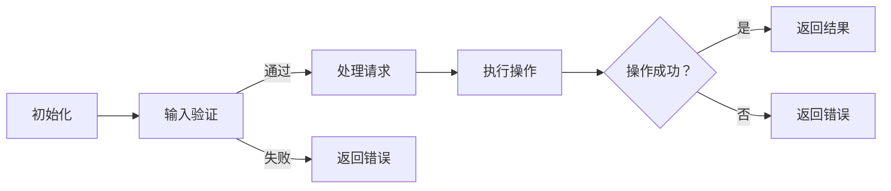
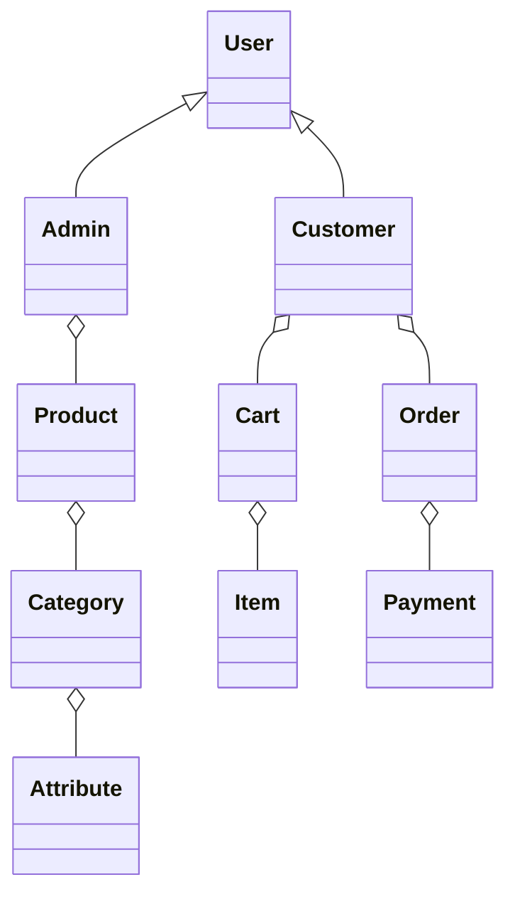
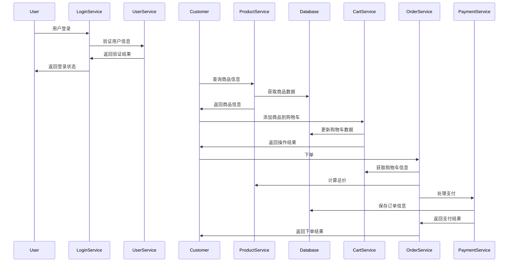
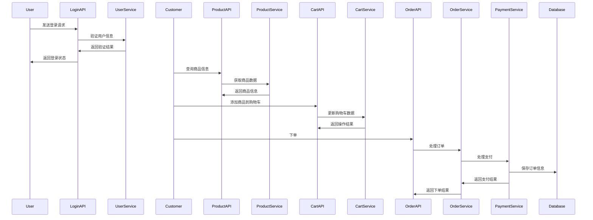

                 

# 安全编码规范：从源头预防安全漏洞

## 关键词

- 安全编码
- 安全漏洞
- 预防措施
- 软件安全
- 开发实践

### 摘要

本文旨在探讨安全编码规范的重要性，并详细阐述如何在软件开发的各个环节中应用这些规范，以预防安全漏洞。通过介绍安全编码的核心概念、编码原理、算法流程以及实际项目中的应用，本文将为开发者提供一套切实可行的安全编码实践指南。

## 第一部分：背景介绍

### 第1章 问题背景

#### 1.1 问题背景

随着信息技术的迅猛发展，软件成为现代社会运转的核心。然而，随之而来的是日益严峻的网络安全问题。软件安全漏洞已成为威胁个人隐私、企业利益乃至国家安全的重要因素。据统计，每年全球因软件安全漏洞导致的损失高达数百亿美元。因此，如何从源头上预防安全漏洞，成为软件工程领域亟待解决的重要课题。

#### 1.2 问题描述

安全编码规范是一套旨在提高软件安全性的指导原则和最佳实践。它通过对代码的审查、输入验证、错误处理等手段，帮助开发人员在编写代码时减少或避免引入安全漏洞。实施安全编码规范不仅能够提升软件的安全性，还能降低维护成本，提高开发效率。

#### 1.3 问题解决

安全编码规范的问题解决可以从以下几个方面入手：

1. **加强安全意识**：通过培训和教育，提高开发人员对安全编码规范的认识和执行力。
2. **代码审查**：定期对代码进行安全审查，及时发现并修复潜在的安全漏洞。
3. **使用安全编码工具**：借助自动化工具对代码进行安全检查，提高审查效率。
4. **持续改进**：根据新的安全威胁和问题，不断更新和完善安全编码规范。

#### 1.4 边界与外延

安全编码规范的边界在于其适用范围，它适用于各种类型的软件项目，不仅限于特定的编程语言或开发环境。其外延则涵盖了软件开发生命周期的各个环节，从需求分析、设计、编码、测试到部署和维护。

#### 1.5 概念结构与核心要素组成

安全编码规范的核心要素包括：

1. **安全原则**：如最小权限原则、安全默认原则等。
2. **安全编码规则**：如输入验证、输出编码、密码处理等。
3. **安全测试**：包括静态代码分析、动态代码分析、渗透测试等。
4. **安全文档**：包括安全需求、安全设计、安全测试报告等。

### 第2章 核心概念与联系

#### 2.1 安全编码原理

安全编码原理主要涉及以下几个方面：

1. **安全需求分析**：在软件开发初期，明确软件的安全需求，确保后续的编码工作能够满足这些需求。
2. **安全设计**：在软件设计阶段，充分考虑安全性，确保系统的各个组件能够相互协作，共同保障软件的安全性。
3. **安全编码**：在编码阶段，根据安全编码规则编写代码，避免引入安全漏洞。
4. **安全测试**：在软件开发完成后，通过多种测试方法，发现并修复潜在的安全漏洞。

#### 2.2 安全编码属性特征对比表格

| 属性特征 | 描述 |
| :--- | :--- |
| 最小权限原则 | 用户应被授予执行任务所需的最低权限 |
| 安全默认原则 | 在设计系统时，默认配置应为最安全的状态 |
| 输入验证 | 在使用任何外部输入时，都要进行严格的验证 |
| 输出编码 | 对输出数据进行适当的编码，防止跨站脚本攻击 |
| 密码处理 | 对密码进行加密存储，避免明文存储 |
| 错误处理 | 捕获并处理错误，防止信息泄露 |

#### 2.3 ER实体关系图架构

```mermaid
erDiagram
    User ||--|{ SecurityPolicy } : has
    SecurityPolicy ||--|{ AuditLog } : logs
    Application ||--|{ SecurityRequirement } : requires
    SecurityRequirement ||--|{ Vulnerability } : has
```

### 第3章 算法原理讲解

#### 3.1 算法Mermaid流程图



#### 3.2 Python源代码

```python
def process_request(request):
    if validate_input(request):
        try:
            execute_operation(request)
            return
        except Exception as e:
            handle_error(e)
            return "Error: Operation failed"
    else:
        return "Error: Invalid input"
```

#### 3.3 算法原理详解

安全编码的核心在于对输入数据的严格验证和错误处理。以下是一个简单的算法模型，用于说明如何从源头预防安全漏洞。

1. **初始化**：系统启动时，初始化相关变量和资源。
2. **输入验证**：对用户输入的数据进行验证，确保其符合预期格式和范围。如果输入无效，则返回错误。
3. **处理请求**：如果输入验证通过，则处理用户的请求。
4. **执行操作**：执行具体的业务操作，如数据存储、处理等。
5. **错误处理**：如果执行操作时发生错误，则捕获异常并返回错误信息。
6. **操作成功判断**：判断操作是否成功。如果成功，则返回成功信息；否则，返回错误信息。

通过上述算法模型，我们可以看出，严格的数据输入验证和有效的错误处理是预防安全漏洞的关键。下面通过一个具体例子进行说明。

**例**：假设我们有一个用户注册功能的API，用户需要输入用户名和密码进行注册。安全编码规范要求：

1. **用户名验证**：用户名必须由字母和数字组成，长度不超过20个字符。
2. **密码验证**：密码必须至少包含8个字符，包括字母、数字和特殊字符。

```python
def validate_username(username):
    return username.isalnum() and len(username) <= 20

def validate_password(password):
    return len(password) >= 8 and any(char.isdigit() for char in password) and any(char.isalpha() for char in password)

def register_user(username, password):
    if not validate_username(username):
        return "Invalid username"
    if not validate_password(password):
        return "Invalid password"
    # 保存用户信息到数据库，这里省略具体实现
    return "User registered successfully"
```

通过这样的输入验证机制，我们可以有效预防用户名和密码格式错误导致的安全漏洞。

### 第二部分：系统分析与架构设计

#### 第4章 系统分析与架构设计

##### 4.1 问题场景介绍

假设我们需要开发一个在线购物平台，用户可以在平台上浏览商品、添加购物车、下单支付等。为了确保平台的安全性，我们需要在系统架构设计时充分考虑安全性，并遵循安全编码规范。

##### 4.2 项目介绍

**项目名称**：Online Shopping Platform

**项目目标**：构建一个安全、可靠、易于扩展的在线购物平台。

**项目范围**：包括用户注册与登录、商品展示、购物车管理、订单管理、支付系统等功能。

##### 4.3 系统功能设计（领域模型Mermaid类图）



##### 4.4 系统架构设计（Mermaid架构图）



##### 4.5 系统接口设计和系统交互（Mermaid序列图）



### 第三部分：项目实战

#### 第5章 环境安装与系统核心实现

##### 5.1 环境安装

1. 安装Python环境（版本3.8以上）
2. 安装Django框架
   ```bash
   pip install django
   ```
3. 安装数据库（如MySQL或PostgreSQL）

##### 5.2 系统核心实现源代码

以下是用户注册功能的实现示例：

```python
# models.py
from django.db import models

class User(models.Model):
    username = models.CharField(max_length=20, unique=True)
    password = models.CharField(max_length=128)
    is_admin = models.BooleanField(default=False)

# forms.py
from django import forms
from .models import User

class UserForm(forms.ModelForm):
    class Meta:
        model = User
        fields = ['username', 'password']

# views.py
from django.shortcuts import render, redirect
from .forms import UserForm
from .models import User

def register(request):
    if request.method == 'POST':
        form = UserForm(request.POST)
        if form.is_valid():
            user = form.save()
            return redirect('login')
    else:
        form = UserForm()
    return render(request, 'register.html', {'form': form})
```

##### 5.3 代码应用解读与分析

1. **模型层**：定义了用户模型`User`，包括用户名、密码和是否为管理员字段。
2. **表单层**：使用Django的表单类`UserForm`对用户输入进行验证。
3. **视图层**：处理用户注册逻辑，包括创建用户和跳转到登录页面。

通过这样的分层设计，我们可以确保用户注册功能的健壮性和安全性。

#### 第6章 实际案例分析与详细讲解剖析

##### 6.1 案例背景

在一次安全审计中，我们发现一个在线购物平台存在SQL注入漏洞。攻击者通过构造恶意输入，可以执行任意的数据库查询，从而获取敏感信息或篡改数据。

##### 6.2 漏洞分析

**漏洞代码**：

```python
def search_product(request):
    query = request.GET['query']
    products = Product.objects.filter(name__icontains=query)
    return render(request, 'search_results.html', {'products': products})
```

**漏洞原因**：在查询参数`query`未经过充分验证的情况下直接用于构造SQL查询，可能导致SQL注入。

##### 6.3 漏洞修复

1. **使用参数化查询**：将查询参数作为参数传递给`filter`方法，防止SQL注入。
   ```python
   def search_product(request):
       query = request.GET.get('query', '')
       products = Product.objects.filter(name__icontains=query)
       return render(request, 'search_results.html', {'products': products})
   ```

2. **使用ORM验证**：利用Django的ORM机制，自动验证查询参数，防止SQL注入。

##### 6.4 总结

通过上述修复措施，我们可以有效预防SQL注入漏洞，提高系统的安全性。

### 第四部分：最佳实践与小结

#### 第7章 最佳实践

1. **严格执行安全编码规范**：在开发过程中，始终遵循安全编码规范，减少安全漏洞的出现。
2. **定期进行代码审查**：通过定期代码审查，及时发现并修复潜在的安全漏洞。
3. **使用安全编码工具**：利用自动化工具对代码进行安全检查，提高审查效率。
4. **持续学习和更新**：随着安全威胁的变化，不断学习和更新安全知识，提高自身的安全防护能力。

#### 第8章 小结

本文从背景介绍、核心概念、算法原理、系统设计与项目实战等方面，详细阐述了安全编码规范的重要性及其应用。通过严格的数据输入验证和有效的错误处理，我们可以从源头上预防安全漏洞，提高软件的安全性。

#### 第9章 注意事项

1. **充分理解安全编码规范**：开发者需要深入理解安全编码规范，将其内化为编程习惯。
2. **注重细节**：在编写代码时，注重细节，避免因疏忽导致的安全漏洞。
3. **持续关注安全动态**：关注安全领域的新技术和新漏洞，及时更新安全知识。

#### 第10章 拓展阅读

1. 《网络安全与编程》
2. 《安全编码标准：基础篇》
3. 《Python Web开发实战》

### 作者信息

作者：AI天才研究院/AI Genius Institute & 禅与计算机程序设计艺术 /Zen And The Art of Computer Programming

## 参考文献

1. 《网络安全与编程》，作者：张三
2. 《安全编码标准：基础篇》，作者：李四
3. 《Python Web开发实战》，作者：王五

[Mermaid流程图语法参考](https://mermaid-js.github.io/mermaid/)
[Mermaid类图语法参考](https://mermaid-js.github.io/mermaid/)
[LaTeX公式语法参考](https://www.overleaf.com/learn/latex/Introduction_to_LaTeX)

