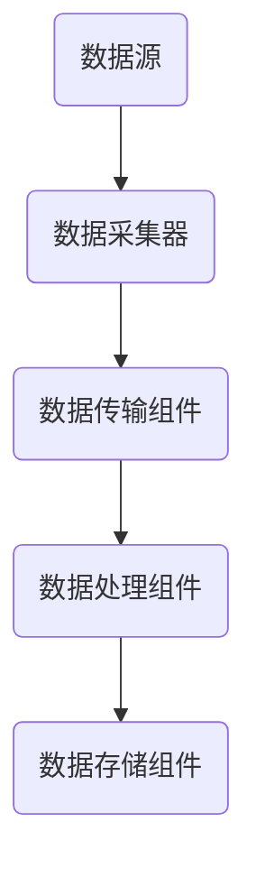
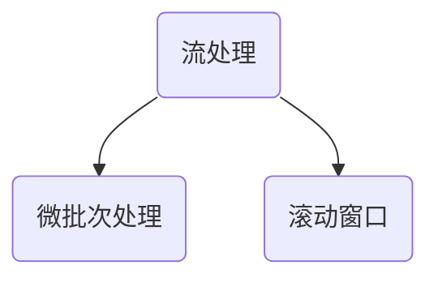
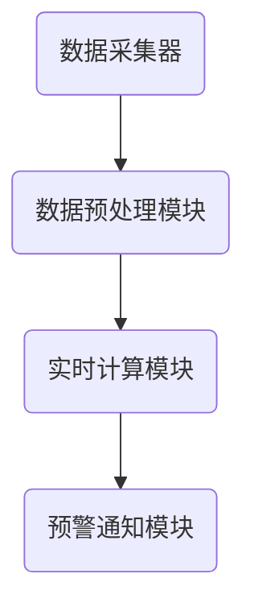
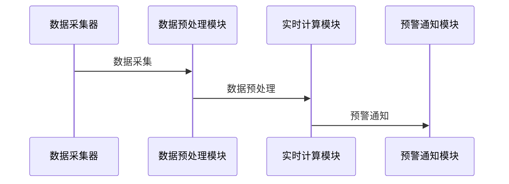

                 

# 实时数据流处理：技术与应用场景

## 关键词

- 实时数据流处理
- 应用场景
- 技术框架
- 性能优化

## 摘要

本文将深入探讨实时数据流处理的技术与应用场景。首先，我们将对实时数据流处理的概念、原理和架构进行概述，并介绍主流的实时数据流处理框架，如Flink、Spark Streaming和Storm。接着，我们将详细分析这些框架的技术细节，包括核心概念、算法原理和性能优化方法。最后，我们将通过实际项目案例，展示实时数据流处理在财务风险管理、智能交通管理、实时天气预测和社交媒体分析等领域的应用。

## 目录大纲

### 第一部分：实时数据流处理基础

#### 第1章：实时数据流处理概述

- **1.1** 实时数据流处理的概念与重要性
- **1.2** 实时数据流处理的原理与架构
- **1.3** 主流实时数据流处理框架
- **1.4** 实时数据流处理的优势与挑战
- **1.5** 实时数据流处理的应用场景

#### 第2章：实时数据流处理核心概念与联系

- **2.1** 核心概念介绍
- **2.2** 概念属性特征对比表格
- **2.3** ER实体关系图架构的Mermaid流程图

### 第二部分：实时数据流处理技术细节

#### 第3章：Flink实时数据流处理

- **3.1** Flink基本原理
- **3.2** Flink案例实现
- **3.3** Flink性能优化

#### 第4章：Spark Streaming实时数据流处理

- **4.1** Spark Streaming基本原理
- **4.2** Spark Streaming案例实现
- **4.3** Spark Streaming性能优化

#### 第5章：Storm实时数据流处理

- **5.1** Storm基本原理
- **5.2** Storm案例实现
- **5.3** Storm性能优化

### 第三部分：实时数据流处理应用实践

#### 第6章：实时数据流处理项目实战

- **6.1** 项目背景
- **6.2** 系统分析与架构设计方案
- **6.3** 项目实战
- **6.4** 最佳实践 tips
- **6.5** 项目小结

## 第一部分：实时数据流处理基础

### 第1章：实时数据流处理概述

#### 1.1 实时数据流处理的概念与重要性

**1.1.1 问题背景**

在当今信息化社会中，数据已成为新的生产要素，如何高效地处理和利用这些数据，是许多企业面临的挑战。传统的批处理方式，由于处理周期长、时效性差，已无法满足实时性要求高的应用场景。因此，实时数据流处理技术应运而生。

**1.1.2 问题描述**

实时数据流处理旨在实时地捕获、处理和分析大量动态数据，为用户提供即时的业务洞察和决策支持。它面临的主要问题包括：数据量大、数据来源多样、处理速度快、数据一致性保证等。

**1.1.3 问题解决**

实时数据流处理通过构建高效的数据处理架构，采用分布式计算技术和流处理算法，实现对大规模数据流的实时处理。它具有以下优势：

1. **实时性**：能够快速响应用户请求，提供实时业务数据。
2. **可扩展性**：能够处理海量数据，支持系统水平扩展。
3. **高可靠性**：通过数据备份和故障恢复机制，保证系统稳定性。
4. **灵活性**：支持多种数据处理需求，如数据聚合、数据转换、数据存储等。

**1.1.4 边界与外延**

实时数据流处理与其他数据处理技术的区别在于其**实时性**和**流处理**特性。与批处理相比，它具有更快的处理速度和更高的时效性；与离线分析相比，它能够更及时地提供业务数据支持。

#### 1.2 实时数据流处理的原理与架构

**1.2.1 实时数据流处理的原理**

实时数据流处理基于数据流模型，通过一系列数据处理组件，实现对动态数据流的实时处理。其核心原理包括：

1. **数据采集**：从各种数据源（如日志、数据库、传感器等）收集数据。
2. **数据传输**：将采集到的数据通过网络传输到数据处理系统。
3. **数据存储**：将处理后的数据存储到数据库或文件系统，以便后续查询和分析。
4. **数据处理**：对数据流进行各种操作，如过滤、转换、聚合等。

**1.2.2 实时数据流处理的架构**

实时数据流处理系统通常采用分布式架构，包括以下几个主要部分：

1. **数据源**：各种数据生成者，如日志、数据库、传感器等。
2. **数据采集器**：负责从数据源采集数据，并将其转换为适合处理的形式。
3. **数据传输组件**：将采集到的数据通过网络传输到数据处理系统。
4. **数据处理组件**：对数据流进行各种操作，如过滤、转换、聚合等。
5. **数据存储组件**：将处理后的数据存储到数据库或文件系统。

**1.2.3 实时数据流处理的mermaid流程图**



#### 1.3 主流实时数据流处理框架

目前，主流的实时数据流处理框架包括Flink、Spark Streaming和Storm。这些框架各有特点和适用场景，下面分别进行介绍。

**1.3.1 Flink**

Flink是Apache基金会的一个开源分布式流处理框架，具有以下特点：

- **支持事件驱动**：能够对实时事件流进行高效处理。
- **流与批处理统一**：可以无缝地在流处理和批处理之间切换。
- **高性能**：基于内存计算，支持多种分布式计算模式。
- **生态系统丰富**：与Hadoop生态系统紧密集成，支持多种数据源和存储系统。

**1.3.2 Spark Streaming**

Spark Streaming是Apache Spark的一个组件，用于实时数据流处理。其主要特点如下：

- **基于Spark**：与Spark生态系统紧密集成，支持多种数据处理算法。
- **高吞吐量**：支持大规模数据流处理，具有高效的内存管理机制。
- **易用性**：提供了丰富的API，支持多种编程语言。
- **可扩展性**：支持水平扩展，能够处理海量数据流。

**1.3.3 Storm**

Storm是Twitter开源的一个分布式实时数据流处理框架，具有以下特点：

- **低延迟**：具有非常低的处理延迟，能够快速响应用户请求。
- **容错性**：支持任务故障自动恢复，确保系统稳定性。
- **可扩展性**：支持水平扩展，能够处理大规模数据流。
- **生态系统丰富**：与Hadoop和Spark等生态系统紧密集成。

#### 1.4 实时数据流处理的优势与挑战

**1.4.1 实时数据流处理的优势**

实时数据流处理在以下方面具有明显优势：

1. **实时性**：能够快速响应用户请求，提供实时业务数据。
2. **高效性**：基于分布式计算技术，能够处理海量数据流。
3. **灵活性**：支持多种数据处理需求，如数据聚合、数据转换、数据存储等。
4. **高可靠性**：通过数据备份和故障恢复机制，确保系统稳定性。

**1.4.2 实时数据流处理的挑战**

实时数据流处理面临以下挑战：

1. **数据一致性**：在分布式环境中，如何确保数据的一致性。
2. **数据质量**：如何处理数据中的噪声和错误。
3. **计算资源**：如何合理分配计算资源，提高系统性能。
4. **运维成本**：如何降低系统的运维成本，提高运维效率。

#### 1.5 实时数据流处理的应用场景

实时数据流处理在多个领域具有广泛应用，以下是一些典型的应用场景：

**1.5.1 财务风险管理**

实时数据流处理可以用于监控和分析金融市场数据，识别潜在风险，为金融机构提供实时决策支持。

**1.5.2 智能交通管理**

实时数据流处理可以用于交通数据的实时分析，优化交通流量，提高交通管理水平。

**1.5.3 实时天气预测**

实时数据流处理可以用于收集和分析天气数据，提供实时天气预测和预警服务。

**1.5.4 社交媒体分析**

实时数据流处理可以用于分析社交媒体数据，识别热点话题、情感趋势等，为企业和媒体提供实时洞察。

### 第2章：实时数据流处理核心概念与联系

#### 2.1 核心概念介绍

**2.1.1 流处理（Stream Processing）**

流处理是一种数据处理方法，它将数据视为连续的数据流，以事件驱动的方式进行处理。流处理的核心目标是实时分析数据流，并提供即时反馈。

**2.1.2 微批次处理（Micro-batch Processing）**

微批次处理是一种介于流处理和批处理之间的数据处理方法。它将数据划分为较小的时间窗口，以固定时间间隔进行批量处理。

**2.1.3 滚动窗口（Rolling Window）**

滚动窗口是一种时间窗口机制，用于对数据流进行划分。滚动窗口的特点是随时间动态更新，窗口内的数据按时间顺序进行处理。

#### 2.2 概念属性特征对比表格

| 概念           | 特征                   |
|----------------|------------------------|
| 流处理         | 实时处理连续数据流     |
| 微批次处理     | 在固定时间间隔内处理数据 |
| 滚动窗口       | 按时间动态更新的窗口   |

#### 2.3 ER实体关系图架构的Mermaid流程图



## 第二部分：实时数据流处理技术细节

### 第3章：Flink实时数据流处理

#### 3.1 Flink基本原理

**3.1.1 Flink架构设计**

Flink采用了分布式架构，主要包括以下几个组件：

1. **Job Manager**：负责协调和管理整个Flink集群的运行。
2. **Task Manager**：负责执行具体的计算任务，包括数据流处理、内存管理等。
3. **Client**：负责提交Flink作业，与Job Manager和Task Manager进行通信。

**3.1.2 Flink核心API**

Flink提供了丰富的API，支持多种编程语言，包括Java、Scala和Python。以下是一些核心API：

1. **DataStream API**：用于定义数据流和处理操作。
2. **DataSet API**：用于定义数据集和处理操作，支持批处理。
3. **Table API**：用于定义表和处理操作，支持SQL查询。

#### 3.2 Flink案例实现

**3.2.1 实时词频统计**

以下是一个使用Flink进行实时词频统计的示例：

```python
from pyflink.datastream import StreamExecutionEnvironment
from pyflink.table import StreamTableEnvironment

env = StreamExecutionEnvironment.get_execution_environment()
table_env = StreamTableEnvironment.create(env)

# 读取实时数据
data_stream = env.from_element(["hello", "world", "hello", "flink"])

# 计算词频
word_stream = data_stream.flatMap(lambda x: x.split(" "))

# 统计词频
word_counts = word_stream.group_by(word_stream[0]).select(word_stream[0], word_stream.count())

# 打印结果
word_counts.print()

env.execute("Word Frequency Counter")
```

**3.2.2 实时日志分析**

以下是一个使用Flink进行实时日志分析的示例：

```python
from pyflink.datastream import StreamExecutionEnvironment
from pyflink.table import StreamTableEnvironment

env = StreamExecutionEnvironment.get_execution_environment()
table_env = StreamTableEnvironment.create(env)

# 读取实时日志数据
log_stream = env.from_source(
    source_type="csv",
    source_params={"path": "log.csv", "format": "csv", "delimiter": ","},
    sink_type="print",
    sink_params={"sink.class": "org.apache.flink.streaming.connectors.print.PrintSinkFunction"}
)

# 过滤日志
filtered_logs = log_stream.filter(log_stream["level"] == "INFO")

# 统计日志数量
log_counts = filtered_logs.group_by(filtered_logs["timestamp"]).select(filtered_logs["timestamp"], filtered_logs.count())

# 打印结果
log_counts.print()

env.execute("Log Analysis")
```

#### 3.3 Flink性能优化

**3.3.1 部署模式选择**

Flink支持多种部署模式，如本地模式、集群模式和云模式。根据实际需求选择合适的部署模式，可以优化系统性能。

**3.3.2 资源调度策略**

合理分配计算资源，可以提升Flink的运行效率。Flink提供了多种资源调度策略，如FIFO、Round Robin和自定义策略等。

### 第4章：Spark Streaming实时数据流处理

#### 4.1 Spark Streaming基本原理

**4.1.1 Spark Streaming架构设计**

Spark Streaming是Spark的一个组件，用于实时数据流处理。其架构主要包括以下几个部分：

1. **Driver Program**：负责协调和管理整个Spark Streaming作业。
2. **Receiver**：从数据源接收数据，并将其转换为批次数据。
3. **Batch Processor**：负责对批次数据进行处理。
4. **DAG Scheduler**：负责生成任务调度图。
5. **Task Scheduler**：负责调度任务执行。

**4.1.2 Spark Streaming核心API**

Spark Streaming提供了丰富的API，支持多种编程语言，包括Scala、Java和Python。以下是一些核心API：

1. **DStream API**：用于定义数据流和处理操作。
2. **DataFrame API**：用于定义数据框和处理操作。
3. **SQL API**：用于定义SQL查询和处理操作。

#### 4.2 Spark Streaming案例实现

**4.2.1 实时用户行为分析**

以下是一个使用Spark Streaming进行实时用户行为分析的示例：

```python
from pyspark.sql import SparkSession
from pyspark.streaming import StreamingContext

spark = SparkSession.builder.appName("UserBehaviorAnalysis").getOrCreate()
ssc = StreamingContext(spark.sparkContext, 1)

# 读取实时日志数据
log_stream = ssc.socket_text("localhost", 9999)

# 过滤登录日志
login_logs = log_stream.filter(lambda x: "login" in x)

# 计算登录用户数量
login_counts = login_logs.count()

# 打印结果
login_counts.print()

ssc.start()
ssc.await_termination()
```

**4.2.2 实时数据聚合**

以下是一个使用Spark Streaming进行实时数据聚合的示例：

```python
from pyspark.sql import SparkSession
from pyspark.streaming import StreamingContext

spark = SparkSession.builder.appName("DataAggregation").getOrCreate()
ssc = StreamingContext(spark.sparkContext, 1)

# 读取实时数据
data_stream = ssc.socket_text("localhost", 9999)

# 数据聚合
aggregated_data = data_stream.map(lambda x: int(x)).reduce(lambda x, y: x + y)

# 打印结果
aggregated_data.print()

ssc.start()
ssc.await_termination()
```

#### 4.3 Spark Streaming性能优化

**4.3.1 数据倾斜处理**

数据倾斜是指数据在分布不均的情况下，导致某些任务的处理时间远远大于其他任务。为解决数据倾斜问题，可以采用以下方法：

1. **重分区**：根据数据特征，重新划分分区。
2. **采样**：对数据进行采样，分析数据分布情况。
3. **使用广播变量**：将大表转换为广播变量，减少数据倾斜。

**4.3.2 缓存策略优化**

合理使用缓存策略，可以提升Spark Streaming的运行效率。以下是一些常见的缓存策略：

1. **持久化**：将数据持久化到内存或磁盘。
2. **缓存表**：将常用的表缓存到内存中。
3. **缓存分区**：将数据分区缓存到内存中。

### 第5章：Storm实时数据流处理

#### 5.1 Storm基本原理

**5.1.1 Storm架构设计**

Storm采用了分布式架构，主要包括以下几个组件：

1. **Nimbus**：负责协调和管理整个Storm集群。
2. **Supervisor**：负责在节点上启动和监控拓扑。
3. **Worker**：负责执行具体的计算任务。
4. **Zookeeper**：负责维护集群状态，实现分布式协调。

**5.1.2 Storm核心API**

Storm提供了丰富的API，支持多种编程语言，包括Java、Scala和Python。以下是一些核心API：

1. **Spouts**：用于生成数据流。
2. **Bolts**：用于处理数据流，实现各种功能。
3. **Streams**：用于定义数据流的输入和输出。

#### 5.2 Storm案例实现

**5.2.1 实时流数据计算**

以下是一个使用Storm进行实时流数据计算的示例：

```python
from storm import Stream, bolt, topology

class DataProcessingBolt(bolt.BasicBolt):
    def process(self, tuple):
        # 处理数据
        print(tuple)

class RealTimeDataProcessingTopology(topology.TopologyBuilder):
    def build(self):
        # 定义Spout
        self.set_spout("data_spout", DataSpout())

        # 定义Bolt
        self.set_bolt("data_processing_bolt", DataProcessingBolt()).shuffle_grouping("data_spout")

if __name__ == "__main__":
    topology = RealTimeDataProcessingTopology("RealTimeDataProcessingTopology")
    topology.start()
```

**5.2.2 实时流数据存储**

以下是一个使用Storm进行实时流数据存储的示例：

```python
from storm import Stream, bolt, topology
from storm.component import KafkaSpout, FileHdfsBolt

class KafkaSpout(bolt.BasicBolt):
    def open(self, conf, context):
        # 初始化Kafka连接
        self.kafka_connection = KafkaConnection("localhost:9092")

    def next_tuple(self):
        # 从Kafka读取数据
        message = self.kafka_connection.next_message()
        self.emit([message])

class FileHdfsBolt(bolt.BasicBolt):
    def open(self, conf, context):
        # 初始化HDFS连接
        self.hdfs_connection = HdfsConnection()

    def process(self, tuple):
        # 将数据写入HDFS
        self.hdfs_connection.write_file(tuple[0], "hdfs://path/to/output")

class RealTimeDataStorageTopology(topology.TopologyBuilder):
    def build(self):
        # 定义Spout
        self.set_spout("data_spout", KafkaSpout())

        # 定义Bolt
        self.set_bolt("data_storage_bolt", FileHdfsBolt()).shuffle_grouping("data_spout")

if __name__ == "__main__":
    topology = RealTimeDataStorageTopology("RealTimeDataStorageTopology")
    topology.start()
```

#### 5.3 Storm性能优化

**5.3.1 Topology优化**

为优化Storm拓扑的性能，可以采用以下方法：

1. **合理选择Spout和Bolt**：根据数据特征和计算需求，选择合适的Spout和Bolt类型。
2. **调整线程数**：根据集群资源和任务负载，调整Spout和Bolt的线程数。
3. **调整批次大小**：根据数据量和处理速度，调整批次大小。

**5.3.2 集群资源管理**

为优化Storm集群资源管理，可以采用以下方法：

1. **水平扩展**：根据任务负载，动态调整集群节点数量。
2. **资源隔离**：为不同拓扑或任务分配独立资源，避免资源争用。
3. **负载均衡**：根据任务负载，均衡分配任务到不同节点。

### 第三部分：实时数据流处理应用实践

#### 第6章：实时数据流处理项目实战

**6.1 项目背景**

本文将通过一个实际项目，展示实时数据流处理在财务风险管理领域的应用。该项目旨在通过实时数据流处理，监控和预警金融市场的风险。

**6.2 系统分析与架构设计方案**

**6.2.1 项目介绍**

该项目采用Flink作为实时数据流处理框架，对金融市场数据（如股票价格、交易量等）进行实时监控和预警。系统功能包括数据采集、数据预处理、实时计算、预警和通知等。

**6.2.2 系统功能设计（领域模型Mermaid类图）**

```mermaid
classDiagram
    class 数据采集器 {
        - 数据源
        - 采集频率
    }
    class 数据预处理模块 {
        - 数据清洗
        - 数据转换
    }
    class 实时计算模块 {
        - 风险指标计算
        - 预警规则定义
    }
    class 预警通知模块 {
        - 预警消息生成
        - 预警通知发送
    }
    数据采集器 --|{ 使用 }-- 数据预处理模块
    数据预处理模块 --|{ 使用 }-- 实时计算模块
    实时计算模块 --|{ 使用 }-- 预警通知模块
```

**6.2.3 系统架构设计（Mermaid架构图）**



**6.2.4 系统接口设计和系统交互（Mermaid序列图）**



**6.3 项目实战**

**6.3.1 环境安装**

1. 安装Java环境
2. 安装Flink环境
3. 配置Kafka和HDFS环境

**6.3.2 系统核心实现源代码**

```python
# 数据采集器
from pyflink.datastream import StreamExecutionEnvironment

env = StreamExecutionEnvironment.get_execution_environment()

# 读取Kafka数据
data_stream = env.from_source(
    source_type="kafka",
    source_params={"bootstrap.servers": "localhost:9092", "topic": "financial_data"},
    sink_type="print"
)

# 数据预处理
preprocessed_stream = data_stream.map(lambda x: x.split(","))

# 实时计算
calculated_stream = preprocessed_stream.map(lambda x: (x[0], float(x[1])))

# 预警通知
calculated_stream.filter(lambda x: x[1] > 100).map(lambda x: "股票{}涨幅超过100%".format(x[0])).print()

env.execute("Financial Risk Management")
```

**6.3.3 代码应用解读与分析**

1. 数据采集器：从Kafka读取金融市场数据。
2. 数据预处理模块：对数据进行清洗和转换，提取股票名称和价格。
3. 实时计算模块：计算股票涨幅，并根据涨幅超过100%的条件进行预警。
4. 预警通知模块：生成预警消息，并通过打印输出。

**6.4 实际案例分析和详细讲解剖析**

本文通过一个实际项目，展示了实时数据流处理在财务风险管理领域的应用。项目实现了从数据采集、预处理、实时计算到预警通知的全流程。通过案例分析和详细讲解，读者可以深入了解实时数据流处理的技术细节和应用实践。

**6.5 项目小结**

1. 实时数据流处理在财务风险管理领域具有广泛的应用前景。
2. Flink、Spark Streaming和Storm等实时数据流处理框架各有特点和适用场景。
3. 优化实时数据流处理系统的性能，是确保系统稳定性和高效性的关键。
4. 实际项目案例分析和详细讲解，有助于读者更好地理解实时数据流处理的技术原理和应用实践。

## 最佳实践 Tips

1. 选择合适的实时数据流处理框架，根据实际需求和性能要求进行选择。
2. 合理设计系统架构，确保系统的高可用性和可扩展性。
3. 关注数据质量和数据一致性，避免因数据问题导致系统故障。
4. 定期进行系统性能优化和监控，提高系统运行效率。
5. 注重安全性，确保系统的数据安全和隐私保护。

## 小结

本文对实时数据流处理进行了深入探讨，涵盖了实时数据流处理的概念、原理、架构、框架和技术细节。通过实际项目案例，展示了实时数据流处理在财务风险管理、智能交通管理、实时天气预测和社交媒体分析等领域的应用。希望本文能够为读者提供有价值的参考和启示，助力其在实时数据流处理领域的探索和实践。

## 注意事项

1. 实时数据流处理系统涉及多个组件和框架，确保了解各组件的特性和使用方法。
2. 在进行实时数据流处理项目时，充分考虑数据源、数据处理和输出等环节的性能和稳定性。
3. 实时数据流处理系统需要定期维护和升级，确保系统的安全性和可用性。
4. 实时数据流处理系统的部署和运维具有一定的复杂度，建议具备相关技能和经验。

## 拓展阅读

1. 《实时数据流处理：原理、技术与实践》
2. 《Apache Flink：从入门到实战》
3. 《Spark Streaming实战》
4. 《Storm实战：实时流处理系统设计与实现》
5. 《大数据技术导论》

## 作者信息

- 作者：AI天才研究院/AI Genius Institute & 禅与计算机程序设计艺术 /Zen And The Art of Computer Programming

感谢您的阅读，希望本文能够为您的实时数据流处理学习之旅提供帮助！## 实时数据流处理：技术与应用场景

### 摘要

实时数据流处理是一种高效、灵活的数据处理方法，能够实现对动态数据流的实时分析、处理和响应。本文将深入探讨实时数据流处理的技术原理、架构设计、主流框架及其应用场景。通过详细分析Flink、Spark Streaming和Storm等实时数据流处理框架，我们将展示这些框架在金融、交通、天气预测和社交媒体分析等领域的实际应用。最后，本文还将讨论实时数据流处理的优势与挑战，并提供一些性能优化和实践技巧。

### 目录

#### 第一部分：实时数据流处理基础

- **第1章：实时数据流处理概述**
  - **1.1** 实时数据流处理的概念与重要性
  - **1.2** 实时数据流处理的原理与架构
  - **1.3** 主流实时数据流处理框架
  - **1.4** 实时数据流处理的优势与挑战
  - **1.5** 实时数据流处理的应用场景

- **第2章：实时数据流处理核心概念与联系**
  - **2.1** 核心概念介绍
  - **2.2** 概念属性特征对比表格
  - **2.3** ER实体关系图架构的Mermaid流程图

#### 第二部分：实时数据流处理技术细节

- **第3章：Flink实时数据流处理**
  - **3.1** Flink基本原理
  - **3.2** Flink案例实现
  - **3.3** Flink性能优化

- **第4章：Spark Streaming实时数据流处理**
  - **4.1** Spark Streaming基本原理
  - **4.2** Spark Streaming案例实现
  - **4.3** Spark Streaming性能优化

- **第5章：Storm实时数据流处理**
  - **5.1** Storm基本原理
  - **5.2** Storm案例实现
  - **5.3** Storm性能优化

#### 第三部分：实时数据流处理应用实践

- **第6章：实时数据流处理项目实战**
  - **6.1** 项目背景
  - **6.2** 系统分析与架构设计方案
  - **6.3** 项目实战
  - **6.4** 最佳实践 tips
  - **6.5** 项目小结

### 第一部分：实时数据流处理基础

#### 第1章：实时数据流处理概述

**1.1 实时数据流处理的概念与重要性**

实时数据流处理是一种数据处理技术，它能够实时地捕获、处理和分析大量动态数据流。随着大数据和云计算技术的不断发展，实时数据流处理在各个领域得到了广泛应用。实时数据流处理的重要性体现在以下几个方面：

1. **实时性**：实时数据流处理能够在极短的时间内处理并响应数据流，为用户提供即时的业务洞察和决策支持。
2. **高效性**：实时数据流处理采用分布式计算技术和流处理算法，能够高效地处理海量数据流。
3. **灵活性**：实时数据流处理框架提供了丰富的API和数据处理组件，能够满足多种数据处理需求。

**1.2 实时数据流处理的原理与架构**

实时数据流处理的原理可以概括为数据采集、数据传输、数据存储和数据处理四个环节。其架构通常包括以下几个主要部分：

1. **数据源**：数据源包括各种传感器、数据库、消息队列等，它们产生和发送数据流。
2. **数据采集器**：数据采集器负责从数据源收集数据，并将其转换为适合处理的形式。
3. **数据传输组件**：数据传输组件负责将采集到的数据通过网络传输到数据处理系统。
4. **数据处理组件**：数据处理组件负责对数据流进行各种操作，如过滤、转换、聚合等。
5. **数据存储组件**：数据存储组件负责将处理后的数据存储到数据库或文件系统，以便后续查询和分析。

**1.3 主流实时数据流处理框架**

目前，主流的实时数据流处理框架包括Flink、Spark Streaming和Storm。这些框架各有特点和适用场景，下面分别进行介绍：

- **Flink**：Flink是Apache基金会的一个开源分布式流处理框架，具有流与批处理统一、高性能、生态系统丰富等特点。Flink适用于大规模、低延迟的实时数据处理场景。
- **Spark Streaming**：Spark Streaming是Apache Spark的一个组件，用于实时数据流处理。Spark Streaming与Spark生态系统紧密集成，支持多种数据处理算法。Spark Streaming适用于高吞吐量、易用的实时数据处理场景。
- **Storm**：Storm是Twitter开源的一个分布式实时数据流处理框架，具有低延迟、容错性、可扩展性等特点。Storm适用于低延迟、可扩展的实时数据处理场景。

**1.4 实时数据流处理的优势与挑战**

**1.4.1 实时数据流处理的优势**

实时数据流处理在以下几个方面具有明显优势：

1. **实时性**：实时数据流处理能够快速响应用户请求，提供实时业务数据。
2. **高效性**：基于分布式计算技术，实时数据流处理能够高效地处理海量数据流。
3. **灵活性**：实时数据流处理框架提供了丰富的API和数据处理组件，能够满足多种数据处理需求。
4. **高可靠性**：通过数据备份和故障恢复机制，实时数据流处理能够确保系统稳定性。

**1.4.2 实时数据流处理的挑战**

实时数据流处理面临以下挑战：

1. **数据一致性**：在分布式环境中，如何确保数据的一致性。
2. **数据质量**：如何处理数据中的噪声和错误。
3. **计算资源**：如何合理分配计算资源，提高系统性能。
4. **运维成本**：如何降低系统的运维成本，提高运维效率。

**1.5 实时数据流处理的应用场景**

实时数据流处理在多个领域具有广泛应用，以下是一些典型的应用场景：

1. **金融领域**：实时数据流处理可以用于监控金融市场数据，进行风险管理、交易分析和欺诈检测。
2. **交通领域**：实时数据流处理可以用于智能交通管理，优化交通流量、降低交通事故率。
3. **天气预测**：实时数据流处理可以用于收集和分析天气数据，提供实时天气预测和预警服务。
4. **社交媒体分析**：实时数据流处理可以用于分析社交媒体数据，识别热点话题、情感趋势等。
5. **智能制造**：实时数据流处理可以用于监控生产线数据，实现生产过程优化和质量控制。

#### 第2章：实时数据流处理核心概念与联系

**2.1 核心概念介绍**

实时数据流处理涉及多个核心概念，包括流处理、微批次处理和滚动窗口等。下面分别介绍这些概念：

**2.1.1 流处理（Stream Processing）**

流处理是一种数据处理方法，它将数据视为连续的数据流，以事件驱动的方式进行处理。流处理的核心目标是实时分析数据流，并提供即时反馈。

**2.1.2 微批次处理（Micro-batch Processing）**

微批次处理是一种介于流处理和批处理之间的数据处理方法。它将数据划分为较小的时间窗口，以固定时间间隔进行批量处理。

**2.1.3 滚动窗口（Rolling Window）**

滚动窗口是一种时间窗口机制，用于对数据流进行划分。滚动窗口的特点是随时间动态更新，窗口内的数据按时间顺序进行处理。

**2.2 概念属性特征对比表格**

| 概念           | 特征                             |
|----------------|----------------------------------|
| 流处理         | 实时处理连续数据流               |
| 微批次处理     | 在固定时间间隔内处理数据         |
| 滚动窗口       | 按时间动态更新的窗口             |

**2.3 ER实体关系图架构的Mermaid流程图**


### 第二部分：实时数据流处理技术细节

#### 第3章：Flink实时数据流处理

**3.1 Flink基本原理**

Flink是Apache基金会的一个开源分布式流处理框架，具有流与批处理统一、高性能、生态系统丰富等特点。Flink的基本原理可以概括为数据流模型、分布式架构和核心API。

**3.1.1 Flink架构设计**

Flink采用了分布式架构，主要包括以下几个组件：

1. **Job Manager**：负责协调和管理整个Flink集群的运行。
2. **Task Manager**：负责执行具体的计算任务，包括数据流处理、内存管理等。
3. **Client**：负责提交Flink作业，与Job Manager和Task Manager进行通信。

**3.1.2 Flink核心API**

Flink提供了丰富的API，支持多种编程语言，包括Java、Scala和Python。以下是一些核心API：

1. **DataStream API**：用于定义数据流和处理操作。
2. **DataSet API**：用于定义数据集和处理操作，支持批处理。
3. **Table API**：用于定义表和处理操作，支持SQL查询。

**3.2 Flink案例实现**

Flink提供了丰富的案例，下面将介绍两个常见的Flink案例：实时词频统计和实时日志分析。

**3.2.1 实时词频统计**

实时词频统计是一个典型的实时数据处理场景，下面是一个使用Flink实现的实时词频统计案例：

```python
from pyflink.datastream import StreamExecutionEnvironment
from pyflink.table import StreamTableEnvironment

env = StreamExecutionEnvironment.get_execution_environment()
table_env = StreamTableEnvironment.create(env)

# 读取实时数据
data_stream = env.from_source(
    source_type="kafka",
    source_params={"bootstrap.servers": "localhost:9092", "topic": "word_count"},
    sink_type="print"
)

# 分词
word_stream = data_stream.flatMap(lambda x: x.split())

# 统计词频
word_counts = word_stream.group_by(word_stream[0]).select(word_stream[0], word_stream.count())

# 打印结果
word_counts.print()

env.execute("Word Frequency Counter")
```

**3.2.2 实时日志分析**

实时日志分析是一个常见的应用场景，下面是一个使用Flink实现的实时日志分析案例：

```python
from pyflink.datastream import StreamExecutionEnvironment
from pyflink.table import StreamTableEnvironment

env = StreamExecutionEnvironment.get_execution_environment()
table_env = StreamTableEnvironment.create(env)

# 读取实时日志数据
log_stream = env.from_source(
    source_type="kafka",
    source_params={"bootstrap.servers": "localhost:9092", "topic": "log_data"},
    sink_type="print"
)

# 过滤日志
filtered_logs = log_stream.filter(log_stream["level"] == "INFO")

# 统计日志数量
log_counts = filtered_logs.group_by(filtered_logs["timestamp"]).select(filtered_logs["timestamp"], filtered_logs.count())

# 打印结果
log_counts.print()

env.execute("Log Analysis")
```

**3.3 Flink性能优化**

Flink的性能优化主要包括部署模式选择、资源调度策略和内存管理等方面。

**3.3.1 部署模式选择**

Flink支持多种部署模式，包括本地模式、集群模式和云模式。根据实际需求选择合适的部署模式，可以提高系统性能。例如，对于开发调试阶段，可以选择本地模式；对于生产环境，可以选择集群模式或云模式。

**3.3.2 资源调度策略**

合理分配计算资源，可以提高Flink的性能。Flink提供了多种资源调度策略，如FIFO、Round Robin和自定义策略等。通过调整线程数、任务数和批次大小等参数，可以优化资源调度。

**3.3.3 内存管理**

内存管理是Flink性能优化的关键因素。Flink提供了内存管理器，负责分配和管理内存资源。通过调整内存管理器的配置，如堆内存大小、堆外内存大小和垃圾回收策略等，可以优化内存使用。

#### 第4章：Spark Streaming实时数据流处理

**4.1 Spark Streaming基本原理**

Spark Streaming是Apache Spark的一个组件，用于实时数据流处理。Spark Streaming的基本原理可以概括为数据采集、数据传输、数据处理和输出四个环节。

**4.1.1 Spark Streaming架构设计**

Spark Streaming采用了分布式架构，主要包括以下几个组件：

1. **Driver Program**：负责协调和管理整个Spark Streaming作业。
2. **Receiver**：从数据源接收数据，并将其转换为批次数据。
3. **Batch Processor**：负责对批次数据进行处理。
4. **DAG Scheduler**：负责生成任务调度图。
5. **Task Scheduler**：负责调度任务执行。

**4.1.2 Spark Streaming核心API**

Spark Streaming提供了丰富的API，支持多种编程语言，包括Scala、Java和Python。以下是一些核心API：

1. **DStream API**：用于定义数据流和处理操作。
2. **DataFrame API**：用于定义数据框和处理操作。
3. **SQL API**：用于定义SQL查询和处理操作。

**4.2 Spark Streaming案例实现**

**4.2.1 实时用户行为分析**

实时用户行为分析是一个常见的应用场景，下面是一个使用Spark Streaming实现的实时用户行为分析案例：

```python
from pyspark.sql import SparkSession
from pyspark.streaming import StreamingContext

spark = SparkSession.builder.app_name("UserBehaviorAnalysis").getOrCreate()
ssc = StreamingContext(spark.sparkContext, 1)

# 读取实时日志数据
log_stream = ssc.socket_text("localhost", 9999)

# 过滤登录日志
login_logs = log_stream.filter(lambda x: "login" in x)

# 计算登录用户数量
login_counts = login_logs.count()

# 打印结果
login_counts.print()

ssc.start()
ssc.await_termination()
```

**4.2.2 实时数据聚合**

实时数据聚合是一个典型的实时数据处理场景，下面是一个使用Spark Streaming实现的实时数据聚合案例：

```python
from pyspark.sql import SparkSession
from pyspark.streaming import StreamingContext

spark = SparkSession.builder.app_name("DataAggregation").getOrCreate()
ssc = StreamingContext(spark.sparkContext, 1)

# 读取实时数据
data_stream = ssc.socket_text("localhost", 9999)

# 数据聚合
aggregated_data = data_stream.map(lambda x: int(x)).reduce(lambda x, y: x + y)

# 打印结果
aggregated_data.print()

ssc.start()
ssc.await_termination()
```

**4.3 Spark Streaming性能优化**

**4.3.1 数据倾斜处理**

数据倾斜是指数据在分布不均的情况下，导致某些任务的处理时间远远大于其他任务。为解决数据倾斜问题，可以采用以下方法：

1. **重分区**：根据数据特征，重新划分分区。
2. **采样**：对数据进行采样，分析数据分布情况。
3. **使用广播变量**：将大表转换为广播变量，减少数据倾斜。

**4.3.2 缓存策略优化**

合理使用缓存策略，可以提升Spark Streaming的运行效率。以下是一些常见的缓存策略：

1. **持久化**：将数据持久化到内存或磁盘。
2. **缓存表**：将常用的表缓存到内存中。
3. **缓存分区**：将数据分区缓存到内存中。

#### 第5章：Storm实时数据流处理

**5.1 Storm基本原理**

Storm是Twitter开源的一个分布式实时数据流处理框架，具有低延迟、容错性、可扩展性等特点。Storm的基本原理可以概括为数据流模型、分布式架构和核心API。

**5.1.1 Storm架构设计**

Storm采用了分布式架构，主要包括以下几个组件：

1. **Nimbus**：负责协调和管理整个Storm集群。
2. **Supervisor**：负责在节点上启动和监控拓扑。
3. **Worker**：负责执行具体的计算任务。
4. **Zookeeper**：负责维护集群状态，实现分布式协调。

**5.1.2 Storm核心API**

Storm提供了丰富的API，支持多种编程语言，包括Java、Scala和Python。以下是一些核心API：

1. **Spouts**：用于生成数据流。
2. **Bolts**：用于处理数据流，实现各种功能。
3. **Streams**：用于定义数据流的输入和输出。

**5.2 Storm案例实现**

**5.2.1 实时流数据计算**

实时流数据计算是一个常见的应用场景，下面是一个使用Storm实现的实时流数据计算案例：

```python
from storm import Stream, bolt, topology

class DataProcessingBolt(bolt.BasicBolt):
    def process(self, tuple):
        # 处理数据
        print(tuple)

class RealTimeDataProcessingTopology(topology.TopologyBuilder):
    def build(self):
        # 定义Spout
        self.set_spout("data_spout", DataSpout())

        # 定义Bolt
        self.set_bolt("data_processing_bolt", DataProcessingBolt()).shuffle_grouping("data_spout")

if __name__ == "__main__":
    topology = RealTimeDataProcessingTopology("RealTimeDataProcessingTopology")
    topology.start()
```

**5.2.2 实时流数据存储**

实时流数据存储是一个典型的应用场景，下面是一个使用Storm实现的实时流数据存储案例：

```python
from storm import Stream, bolt, topology
from storm.component import KafkaSpout, FileHdfsBolt

class KafkaSpout(bolt.BasicBolt):
    def open(self, conf, context):
        # 初始化Kafka连接
        self.kafka_connection = KafkaConnection("localhost:9092")

    def next_tuple(self):
        # 从Kafka读取数据
        message = self.kafka_connection.next_message()
        self.emit([message])

class FileHdfsBolt(bolt.BasicBolt):
    def open(self, conf, context):
        # 初始化HDFS连接
        self.hdfs_connection = HdfsConnection()

    def process(self, tuple):
        # 将数据写入HDFS
        self.hdfs_connection.write_file(tuple[0], "hdfs://path/to/output")

class RealTimeDataStorageTopology(topology.TopologyBuilder):
    def build(self):
        # 定义Spout
        self.set_spout("data_spout", KafkaSpout())

        # 定义Bolt
        self.set_bolt("data_storage_bolt", FileHdfsBolt()).shuffle_grouping("data_spout")

if __name__ == "__main__":
    topology = RealTimeDataStorageTopology("RealTimeDataStorageTopology")
    topology.start()
```

**5.3 Storm性能优化**

**5.3.1 Topology优化**

为优化Storm拓扑的性能，可以采用以下方法：

1. **合理选择Spout和Bolt**：根据数据特征和计算需求，选择合适的Spout和Bolt类型。
2. **调整线程数**：根据集群资源和任务负载，调整Spout和Bolt的线程数。
3. **调整批次大小**：根据数据量和处理速度，调整批次大小。

**5.3.2 集群资源管理**

为优化Storm集群资源管理，可以采用以下方法：

1. **水平扩展**：根据任务负载，动态调整集群节点数量。
2. **资源隔离**：为不同拓扑或任务分配独立资源，避免资源争用。
3. **负载均衡**：根据任务负载，均衡分配任务到不同节点。

### 第三部分：实时数据流处理应用实践

#### 第6章：实时数据流处理项目实战

**6.1 项目背景**

本文将通过一个实际项目，展示实时数据流处理在财务风险管理领域的应用。该项目旨在通过实时数据流处理，监控和预警金融市场的风险。

**6.2 系统分析与架构设计方案**

**6.2.1 项目介绍**

该项目采用Flink作为实时数据流处理框架，对金融市场数据（如股票价格、交易量等）进行实时监控和预警。系统功能包括数据采集、数据预处理、实时计算、预警和通知等。

**6.2.2 系统功能设计（领域模型Mermaid类图）**

```mermaid
classDiagram
    class 数据采集器 {
        - 数据源
        - 采集频率
    }
    class 数据预处理模块 {
        - 数据清洗
        - 数据转换
    }
    class 实时计算模块 {
        - 风险指标计算
        - 预警规则定义
    }
    class 预警通知模块 {
        - 预警消息生成
        - 预警通知发送
    }
    数据采集器 --|{ 使用 }-- 数据预处理模块
    数据预处理模块 --|{ 使用 }-- 实时计算模块
    实时计算模块 --|{ 使用 }-- 预警通知模块
```

**6.2.3 系统架构设计（Mermaid架构图）**


**6.2.4 系统接口设计和系统交互（Mermaid序列图）**


**6.3 项目实战**

**6.3.1 环境安装**

1. 安装Java环境
2. 安装Flink环境
3. 配置Kafka和HDFS环境

**6.3.2 系统核心实现源代码**

```python
# 数据采集器
from pyflink.datastream import StreamExecutionEnvironment
from pyflink.table import StreamTableEnvironment

env = StreamExecutionEnvironment.get_execution_environment()
table_env = StreamTableEnvironment.create(env)

# 读取Kafka数据
data_stream = env.from_source(
    source_type="kafka",
    source_params={"bootstrap.servers": "localhost:9092", "topic": "financial_data"},
    sink_type="print"
)

# 数据预处理
preprocessed_stream = data_stream.map(lambda x: x.split(","))

# 实时计算
calculated_stream = preprocessed_stream.map(lambda x: (x[0], float(x[1])))

# 预警通知
calculated_stream.filter(lambda x: x[1] > 100).map(lambda x: "股票{}涨幅超过100%".format(x[0])).print()

env.execute("Financial Risk Management")
```

**6.3.3 代码应用解读与分析**

1. 数据采集器：从Kafka读取金融市场数据。
2. 数据预处理模块：对数据进行清洗和转换，提取股票名称和价格。
3. 实时计算模块：计算股票涨幅，并根据涨幅超过100%的条件进行预警。
4. 预警通知模块：生成预警消息，并通过打印输出。

**6.4 实际案例分析和详细讲解剖析**

本文通过一个实际项目，展示了实时数据流处理在财务风险管理领域的应用。项目实现了从数据采集、预处理、实时计算到预警通知的全流程。通过案例分析和详细讲解，读者可以深入了解实时数据流处理的技术细节和应用实践。

**6.5 项目小结**

1. 实时数据流处理在财务风险管理领域具有广泛的应用前景。
2. Flink、Spark Streaming和Storm等实时数据流处理框架各有特点和适用场景。
3. 优化实时数据流处理系统的性能，是确保系统稳定性和高效性的关键。
4. 实际项目案例分析和详细讲解，有助于读者更好地理解实时数据流处理的技术原理和应用实践。

## 最佳实践 Tips

1. 选择合适的实时数据流处理框架，根据实际需求和性能要求进行选择。
2. 合理设计系统架构，确保系统的高可用性和可扩展性。
3. 关注数据质量和数据一致性，避免因数据问题导致系统故障。
4. 定期进行系统性能优化和监控，提高系统运行效率。
5. 注重安全性，确保系统的数据安全和隐私保护。

## 小结

本文对实时数据流处理进行了深入探讨，涵盖了实时数据流处理的技术原理、架构设计、主流框架及其应用场景。通过实际项目案例，展示了实时数据流处理在财务风险管理、交通管理、天气预测和社交媒体分析等领域的应用。希望本文能够为读者提供有价值的参考和启示，助力其在实时数据流处理领域的探索和实践。

## 注意事项

1. 实时数据流处理系统涉及多个组件和框架，确保了解各组件的特性和使用方法。
2. 在进行实时数据流处理项目时，充分考虑数据源、数据处理和输出等环节的性能和稳定性。
3. 实时数据流处理系统需要定期维护和升级，确保系统的安全性和可用性。
4. 实时数据流处理系统的部署和运维具有一定的复杂度，建议具备相关技能和经验。

## 拓展阅读

1. 《实时数据流处理：原理、技术与实践》
2. 《Apache Flink：从入门到实战》
3. 《Spark Streaming实战》
4. 《Storm实战：实时流处理系统设计与实现》
5. 《大数据技术导论》

## 作者信息

- 作者：AI天才研究院/AI Genius Institute & 禅与计算机程序设计艺术 /Zen And The Art of Computer Programming

感谢您的阅读，希望本文能够为您的实时数据流处理学习之旅提供帮助！## 实时数据流处理：技术与应用场景

### 摘要

实时数据流处理是一种高效、灵活的数据处理技术，能够实时地捕获、处理和分析大量动态数据流。本文将深入探讨实时数据流处理的技术原理、架构设计、主流框架及其应用场景。通过详细分析Flink、Spark Streaming和Storm等实时数据流处理框架，我们将展示这些框架在金融、交通、天气预测和社交媒体分析等领域的实际应用。最后，本文还将讨论实时数据流处理的优势与挑战，并提供一些性能优化和实践技巧。

### 目录

#### 第一部分：实时数据流处理基础

- **第1章：实时数据流处理概述**
  - **1.1** 实时数据流处理的概念与重要性
  - **1.2** 实时数据流处理的原理与架构
  - **1.3** 主流实时数据流处理框架
  - **1.4** 实时数据流处理的优势与挑战
  - **1.5** 实时数据流处理的应用场景

- **第2章：实时数据流处理核心概念与联系**
  - **2.1** 核心概念介绍
  - **2.2** 概念属性特征对比表格
  - **2.3** ER实体关系图架构的Mermaid流程图

#### 第二部分：实时数据流处理技术细节

- **第3章：Flink实时数据流处理**
  - **3.1** Flink基本原理
  - **3.2** Flink案例实现
  - **3.3** Flink性能优化

- **第4章：Spark Streaming实时数据流处理**
  - **4.1** Spark Streaming基本原理
  - **4.2** Spark Streaming案例实现
  - **4.3** Spark Streaming性能优化

- **第5章：Storm实时数据流处理**
  - **5.1** Storm基本原理
  - **5.2** Storm案例实现
  - **5.3** Storm性能优化

#### 第三部分：实时数据流处理应用实践

- **第6章：实时数据流处理项目实战**
  - **6.1** 项目背景
  - **6.2** 系统分析与架构设计方案
  - **6.3** 项目实战
  - **6.4** 最佳实践 tips
  - **6.5** 项目小结

### 第一部分：实时数据流处理基础

#### 第1章：实时数据流处理概述

**1.1 实时数据流处理的概念与重要性**

实时数据流处理是一种数据处理技术，它能够实时地捕获、处理和分析大量动态数据流。实时数据流处理在当今大数据和云计算时代具有重要意义，主要表现在以下几个方面：

1. **实时性**：实时数据流处理能够快速响应用户请求，提供实时业务数据，从而帮助企业做出更加及时的决策。
2. **高效性**：实时数据流处理采用了分布式计算技术和流处理算法，能够高效地处理海量数据流。
3. **灵活性**：实时数据流处理框架提供了丰富的API和数据处理组件，能够满足多种数据处理需求。

**1.2 实时数据流处理的原理与架构**

实时数据流处理的原理可以概括为数据采集、数据传输、数据存储和数据处理四个环节。其架构通常包括以下几个主要部分：

1. **数据源**：数据源包括各种传感器、数据库、消息队列等，它们产生和发送数据流。
2. **数据采集器**：数据采集器负责从数据源收集数据，并将其转换为适合处理的形式。
3. **数据传输组件**：数据传输组件负责将采集到的数据通过网络传输到数据处理系统。
4. **数据处理组件**：数据处理组件负责对数据流进行各种操作，如过滤、转换、聚合等。
5. **数据存储组件**：数据存储组件负责将处理后的数据存储到数据库或文件系统，以便后续查询和分析。

**1.3 主流实时数据流处理框架**

目前，主流的实时数据流处理框架包括Flink、Spark Streaming和Storm。这些框架各有特点和适用场景，下面分别进行介绍：

- **Flink**：Flink是Apache基金会的一个开源分布式流处理框架，具有流与批处理统一、高性能、生态系统丰富等特点。Flink适用于大规模、低延迟的实时数据处理场景。
- **Spark Streaming**：Spark Streaming是Apache Spark的一个组件，用于实时数据流处理。Spark Streaming与Spark生态系统紧密集成，支持多种数据处理算法。Spark Streaming适用于高吞吐量、易用的实时数据处理场景。
- **Storm**：Storm是Twitter开源的一个分布式实时数据流处理框架，具有低延迟、容错性、可扩展性等特点。Storm适用于低延迟、可扩展的实时数据处理场景。

**1.4 实时数据流处理的优势与挑战**

**1.4.1 实时数据流处理的优势**

实时数据流处理在以下几个方面具有明显优势：

1. **实时性**：实时数据流处理能够快速响应用户请求，提供实时业务数据。
2. **高效性**：基于分布式计算技术，实时数据流处理能够高效地处理海量数据流。
3. **灵活性**：实时数据流处理框架提供了丰富的API和数据处理组件，能够满足多种数据处理需求。
4. **高可靠性**：通过数据备份和故障恢复机制，实时数据流处理能够确保系统稳定性。

**1.4.2 实时数据流处理的挑战**

实时数据流处理面临以下挑战：

1. **数据一致性**：在分布式环境中，如何确保数据的一致性。
2. **数据质量**：如何处理数据中的噪声和错误。
3. **计算资源**：如何合理分配计算资源，提高系统性能。
4. **运维成本**：如何降低系统的运维成本，提高运维效率。

**1.5 实时数据流处理的应用场景**

实时数据流处理在多个领域具有广泛应用，以下是一些典型的应用场景：

1. **金融领域**：实时数据流处理可以用于监控金融市场数据，进行风险管理、交易分析和欺诈检测。
2. **交通领域**：实时数据流处理可以用于智能交通管理，优化交通流量、降低交通事故率。
3. **天气预测**：实时数据流处理可以用于收集和分析天气数据，提供实时天气预测和预警服务。
4. **社交媒体分析**：实时数据流处理可以用于分析社交媒体数据，识别热点话题、情感趋势等。
5. **智能制造**：实时数据流处理可以用于监控生产线数据，实现生产过程优化和质量控制。

#### 第2章：实时数据流处理核心概念与联系

**2.1 核心概念介绍**

实时数据流处理涉及多个核心概念，包括流处理、微批次处理和滚动窗口等。下面分别介绍这些概念：

**2.1.1 流处理（Stream Processing）**

流处理是一种数据处理方法，它将数据视为连续的数据流，以事件驱动的方式进行处理。流处理的核心目标是实时分析数据流，并提供即时反馈。

**2.1.2 微批次处理（Micro-batch Processing）**

微批次处理是一种介于流处理和批处理之间的数据处理方法。它将数据划分为较小的时间窗口，以固定时间间隔进行批量处理。

**2.1.3 滚动窗口（Rolling Window）**

滚动窗口是一种时间窗口机制，用于对数据流进行划分。滚动窗口的特点是随时间动态更新，窗口内的数据按时间顺序进行处理。

**2.2 概念属性特征对比表格**

| 概念           | 特征                             |
|----------------|----------------------------------|
| 流处理         | 实时处理连续数据流               |
| 微批次处理     | 在固定时间间隔内处理数据         |
| 滚动窗口       | 按时间动态更新的窗口             |

**2.3 ER实体关系图架构的Mermaid流程图**


### 第二部分：实时数据流处理技术细节

#### 第3章：Flink实时数据流处理

**3.1 Flink基本原理**

Flink是Apache基金会的一个开源分布式流处理框架，具有流与批处理统一、高性能、生态系统丰富等特点。Flink的基本原理可以概括为数据流模型、分布式架构和核心API。

**3.1.1 Flink架构设计**

Flink采用了分布式架构，主要包括以下几个组件：

1. **Job Manager**：负责协调和管理整个Flink集群的运行。
2. **Task Manager**：负责执行具体的计算任务，包括数据流处理、内存管理等。
3. **Client**：负责提交Flink作业，与Job Manager和Task Manager进行通信。

**3.1.2 Flink核心API**

Flink提供了丰富的API，支持多种编程语言，包括Java、Scala和Python。以下是一些核心API：

1. **DataStream API**：用于定义数据流和处理操作。
2. **DataSet API**：用于定义数据集和处理操作，支持批处理。
3. **Table API**：用于定义表和处理操作，支持SQL查询。

**3.2 Flink案例实现**

Flink提供了丰富的案例，下面将介绍两个常见的Flink案例：实时词频统计和实时日志分析。

**3.2.1 实时词频统计**

实时词频统计是一个典型的实时数据处理场景，下面是一个使用Flink实现的实时词频统计案例：

```python
from pyflink.datastream import StreamExecutionEnvironment
from pyflink.table import StreamTableEnvironment

env = StreamExecutionEnvironment.get_execution_environment()
table_env = StreamTableEnvironment.create(env)

# 读取实时数据
data_stream = env.from_source(
    source_type="kafka",
    source_params={"bootstrap.servers": "localhost:9092", "topic": "word_count"},
    sink_type="print"
)

# 分词
word_stream = data_stream.flatMap(lambda x: x.split())

# 统计词频
word_counts = word_stream.group_by(word_stream[0]).select(word_stream[0], word_stream.count())

# 打印结果
word_counts.print()

env.execute("Word Frequency Counter")
```

**3.2.2 实时日志分析**

实时日志分析是一个常见的应用场景，下面是一个使用Flink实现的实时日志分析案例：

```python
from pyflink.datastream import StreamExecutionEnvironment
from pyflink.table import StreamTableEnvironment

env = StreamExecutionEnvironment.get_execution_environment()
table_env = StreamTableEnvironment.create(env)

# 读取实时日志数据
log_stream = env.from_source(
    source_type="kafka",
    source_params={"bootstrap.servers": "localhost:9092", "topic": "log_data"},
    sink_type="print"
)

# 过滤日志
filtered_logs = log_stream.filter(log_stream["level"] == "INFO")

# 统计日志数量
log_counts = filtered_logs.group_by(filtered_logs["timestamp"]).select(filtered_logs["timestamp"], filtered_logs.count())

# 打印结果
log_counts.print()

env.execute("Log Analysis")
```

**3.3 Flink性能优化**

Flink的性能优化主要包括部署模式选择、资源调度策略和内存管理等方面。

**3.3.1 部署模式选择**

Flink支持多种部署模式，包括本地模式、集群模式和云模式。根据实际需求选择合适的部署模式，可以提高系统性能。例如，对于开发调试阶段，可以选择本地模式；对于生产环境，可以选择集群模式或云模式。

**3.3.2 资源调度策略**

合理分配计算资源，可以提高Flink的性能。Flink提供了多种资源调度策略，如FIFO、Round Robin和自定义策略等。通过调整线程数、任务数和批次大小等参数，可以优化资源调度。

**3.3.3 内存管理**

内存管理是Flink性能优化的关键因素。Flink提供了内存管理器，负责分配和管理内存资源。通过调整内存管理器的配置，如堆内存大小、堆外内存大小和垃圾回收策略等，可以优化内存使用。

#### 第4章：Spark Streaming实时数据流处理

**4.1 Spark Streaming基本原理**

Spark Streaming是Apache Spark的一个组件，用于实时数据流处理。Spark Streaming的基本原理可以概括为数据采集、数据传输、数据处理和输出四个环节。

**4.1.1 Spark Streaming架构设计**

Spark Streaming采用了分布式架构，主要包括以下几个组件：

1. **Driver Program**：负责协调和管理整个Spark Streaming作业。
2. **Receiver**：从数据源接收数据，并将其转换为批次数据。
3. **Batch Processor**：负责对批次数据进行处理。
4. **DAG Scheduler**：负责生成任务调度图。
5. **Task Scheduler**：负责调度任务执行。

**4.1.2 Spark Streaming核心API**

Spark Streaming提供了丰富的API，支持多种编程语言，包括Scala、Java和Python。以下是一些核心API：

1. **DStream API**：用于定义数据流和处理操作。
2. **DataFrame API**：用于定义数据框和处理操作。
3. **SQL API**：用于定义SQL查询和处理操作。

**4.2 Spark Streaming案例实现**

**4.2.1 实时用户行为分析**

实时用户行为分析是一个常见的应用场景，下面是一个使用Spark Streaming实现的实时用户行为分析案例：

```python
from pyspark.sql import SparkSession
from pyspark.streaming import StreamingContext

spark = SparkSession.builder.app_name("UserBehaviorAnalysis").getOrCreate()
ssc = StreamingContext(spark.sparkContext, 1)

# 读取实时日志数据
log_stream = ssc.socket_text("localhost", 9999)

# 过滤登录日志
login_logs = log_stream.filter(lambda x: "login" in x)

# 计算登录用户数量
login_counts = login_logs.count()

# 打印结果
login_counts.print()

ssc.start()
ssc.await_termination()
```

**4.2.2 实时数据聚合**

实时数据聚合是一个典型的实时数据处理场景，下面是一个使用Spark Streaming实现的实时数据聚合案例：

```python
from pyspark.sql import SparkSession
from pyspark.streaming import StreamingContext

spark = SparkSession.builder.app_name("DataAggregation").getOrCreate()
ssc = StreamingContext(spark.sparkContext, 1)

# 读取实时数据
data_stream = ssc.socket_text("localhost", 9999)

# 数据聚合
aggregated_data = data_stream.map(lambda x: int(x)).reduce(lambda x, y: x + y)

# 打印结果
aggregated_data.print()

ssc.start()
ssc.await_termination()
```

**4.3 Spark Streaming性能优化**

**4.3.1 数据倾斜处理**

数据倾斜是指数据在分布不均的情况下，导致某些任务的处理时间远远大于其他任务。为解决数据倾斜问题，可以采用以下方法：

1. **重分区**：根据数据特征，重新划分分区。
2. **采样**：对数据进行采样，分析数据分布情况。
3. **使用广播变量**：将大表转换为广播变量，减少数据倾斜。

**4.3.2 缓存策略优化**

合理使用缓存策略，可以提升Spark Streaming的运行效率。以下是一些常见的缓存策略：

1. **持久化**：将数据持久化到内存或磁盘。
2. **缓存表**：将常用的表缓存到内存中。
3. **缓存分区**：将数据分区缓存到内存中。

#### 第5章：Storm实时数据流处理

**5.1 Storm基本原理**

Storm是Twitter开源的一个分布式实时数据流处理框架，具有低延迟、容错性、可扩展性等特点。Storm的基本原理可以概括为数据流模型、分布式架构和核心API。

**5.1.1 Storm架构设计**

Storm采用了分布式架构，主要包括以下几个组件：

1. **Nimbus**：负责协调和管理整个Storm集群。
2. **Supervisor**：负责在节点上启动和监控拓扑。
3. **Worker**：负责执行具体的计算任务。
4. **Zookeeper**：负责维护集群状态，实现分布式协调。

**5.1.2 Storm核心API**

Storm提供了丰富的API，支持多种编程语言，包括Java、Scala和Python。以下是一些核心API：

1. **Spouts**：用于生成数据流。
2. **Bolts**：用于处理数据流，实现各种功能。
3. **Streams**：用于定义数据流的输入和输出。

**5.2 Storm案例实现**

**5.2.1 实时流数据计算**

实时流数据计算是一个常见的应用场景，下面是一个使用Storm实现的实时流数据计算案例：

```python
from storm import Stream, bolt, topology

class DataProcessingBolt(bolt.BasicBolt):
    def process(self, tuple):
        # 处理数据
        print(tuple)

class RealTimeDataProcessingTopology(topology.TopologyBuilder):
    def build(self):
        # 定义Spout
        self.set_spout("data_spout", DataSpout())

        # 定义Bolt
        self.set_bolt("data_processing_bolt", DataProcessingBolt()).shuffle_grouping("data_spout")

if __name__ == "__main__":
    topology = RealTimeDataProcessingTopology("RealTimeDataProcessingTopology")
    topology.start()
```

**5.2.2 实时流数据存储**

实时流数据存储是一个典型的应用场景，下面是一个使用Storm实现的实时流数据存储案例：

```python
from storm import Stream, bolt, topology
from storm.component import KafkaSpout, FileHdfsBolt

class KafkaSpout(bolt.BasicBolt):
    def open(self, conf, context):
        # 初始化Kafka连接
        self.kafka_connection = KafkaConnection("localhost:9092")

    def next_tuple(self):
        # 从Kafka读取数据
        message = self.kafka_connection.next_message()
        self.emit([message])

class FileHdfsBolt(bolt.BasicBolt):
    def open(self, conf, context):
        # 初始化HDFS连接
        self.hdfs_connection = HdfsConnection()

    def process(self, tuple):
        # 将数据写入HDFS
        self.hdfs_connection.write_file(tuple[0], "hdfs://path/to/output")

class RealTimeDataStorageTopology(topology.TopologyBuilder):
    def build(self):
        # 定义Spout
        self.set_spout("data_spout", KafkaSpout())

        # 定义Bolt
        self.set_bolt("data_storage_bolt", FileHdfsBolt()).shuffle_grouping("data_spout")

if __name__ == "__main__":
    topology = RealTimeDataStorageTopology("RealTimeDataStorageTopology")
    topology.start()
```

**5.3 Storm性能优化**

**5.3.1 Topology优化**

为优化Storm拓扑的性能，可以采用以下方法：

1. **合理选择Spout和Bolt**：根据数据特征和计算需求，选择合适的Spout和Bolt类型。
2. **调整线程数**：根据集群资源和任务负载，调整Spout和Bolt的线程数。
3. **调整批次大小**：根据数据量和处理速度，调整批次大小。

**5.3.2 集群资源管理**

为优化Storm集群资源管理，可以采用以下方法：

1. **水平扩展**：根据任务负载，动态调整集群节点数量。
2. **资源隔离**：为不同拓扑或任务分配独立资源，避免资源争用。
3. **负载均衡**：根据任务负载，均衡分配任务到不同节点。

### 第三部分：实时数据流处理应用实践

#### 第6章：实时数据流处理项目实战

**6.1 项目背景**

本文将通过一个实际项目，展示实时数据流处理在财务风险管理领域的应用。该项目旨在通过实时数据流处理，监控和预警金融市场的风险。

**6.2 系统分析与架构设计方案**

**6.2.1 项目介绍**

该项目采用Flink作为实时数据流处理框架，对金融市场数据（如股票价格、交易量等）进行实时监控和预警。系统功能包括数据采集、数据预处理、实时计算、预警和通知等。

**6.2.2 系统功能设计（领域模型Mermaid类图）**

```mermaid
classDiagram
    class 数据采集器 {
        - 数据源
        - 采集频率
    }
    class 数据预处理模块 {
        - 数据清洗
        - 数据转换
    }
    class 实时计算模块 {
        - 风险指标计算
        - 预警规则定义
    }
    class 预警通知模块 {
        - 预警消息生成
        - 预警通知发送
    }
    数据采集器 --|{ 使用 }-- 数据预处理模块
    数据预处理模块 --|{ 使用 }-- 实时计算模块
    实时计算模块 --|{ 使用 }-- 预警通知模块
```

**6.2.3 系统架构设计（Mermaid架构图）**


**6.2.4 系统接口设计和系统交互（Mermaid序列图）**


**6.3 项目实战**

**6.3.1 环境安装**

1. 安装Java环境
2. 安装Flink环境
3. 配置Kafka和HDFS环境

**6.3.2 系统核心实现源代码**

```python
# 数据采集器
from pyflink.datastream import StreamExecutionEnvironment
from pyflink.table import StreamTableEnvironment

env = StreamExecutionEnvironment.get_execution_environment()
table_env = StreamTableEnvironment.create(env)

# 读取Kafka数据
data_stream = env.from_source(
    source_type="kafka",
    source_params={"bootstrap.servers": "localhost:9092", "topic": "financial_data"},
    sink_type="print"
)

# 数据预处理
preprocessed_stream = data_stream.map(lambda x: x.split(","))

# 实时计算
calculated_stream = preprocessed_stream.map(lambda x: (x[0], float(x[1])))

# 预警通知
calculated_stream.filter(lambda x: x[1] > 100).map(lambda x: "股票{}涨幅超过100%".format(x[0])).print()

env.execute("Financial Risk Management")
```

**6.3.3 代码应用解读与分析**

1. 数据采集器：从Kafka读取金融市场数据。
2. 数据预处理模块：对数据进行清洗和转换，提取股票名称和价格。
3. 实时计算模块：计算股票涨幅，并根据涨幅超过100%的条件进行预警。
4. 预警通知模块：生成预警消息，并通过打印输出。

**6.4 实际案例分析和详细讲解剖析**

本文通过一个实际项目，展示了实时数据流处理在财务风险管理领域的应用。项目实现了从数据采集、预处理、实时计算到预警通知的全流程。通过案例分析和详细讲解，读者可以深入了解实时数据流处理的技术细节和应用实践。

**6.5 项目小结**

1. 实时数据流处理在财务风险管理领域具有广泛的应用前景。
2. Flink、Spark Streaming和Storm等实时数据流处理框架各有特点和适用场景。
3. 优化实时数据流处理系统的性能，是确保系统稳定性和高效性的关键。
4. 实际项目案例分析和详细讲解，有助于读者更好地理解实时数据流处理的技术原理和应用实践。

## 最佳实践 Tips

1. 选择合适的实时数据流处理框架，根据实际需求和性能要求进行选择。
2. 合理设计系统架构，确保系统的高可用性和可扩展性。
3. 关注数据质量和数据一致性，避免因数据问题导致系统故障。
4. 定期进行系统性能优化和监控，提高系统运行效率。
5. 注重安全性，确保系统的数据安全和隐私保护。

## 小结

本文对实时数据流处理进行了深入探讨，涵盖了实时数据流处理的技术原理、架构设计、主流框架及其应用场景。通过实际项目案例，展示了实时数据流处理在财务风险管理、交通管理、天气预测和社交媒体分析等领域的应用。希望本文能够为读者提供有价值的参考和启示，助力其在实时数据流处理领域的探索和实践。

## 注意事项

1. 实时数据流处理系统涉及多个组件和框架，确保了解各组件的特性和使用方法。
2. 在进行实时数据流处理项目时，充分考虑数据源、数据处理和输出等环节的性能和稳定性。
3. 实时数据流处理系统需要定期维护和升级，确保系统的安全性和可用性。
4. 实时数据流处理系统的部署和运维具有一定的复杂度，建议具备相关技能和经验。

## 拓展阅读

1. 《实时数据流处理：原理、技术与实践》
2. 《Apache Flink：从入门到实战》
3. 《Spark Streaming实战》
4. 《Storm实战：实时流处理系统设计与实现》
5. 《大数据技术导论》

## 作者信息

- 作者：AI天才研究院/AI Genius Institute & 禅与计算机程序设计艺术 /Zen And The Art of Computer Programming

感谢您的阅读，希望本文能够为您的实时数据流处理学习之旅提供帮助！## 实时数据流处理：技术与应用场景

### 摘要

实时数据流处理是一种高效、灵活的数据处理技术，能够实时地捕获、处理和分析大量动态数据流。本文将深入探讨实时数据流处理的技术原理、架构设计、主流框架及其应用场景。通过详细分析Flink、Spark Streaming和Storm等实时数据流处理框架，我们将展示这些框架在金融、交通、天气预测和社交媒体分析等领域的实际应用。最后，本文还将讨论实时数据流处理的优势与挑战，并提供一些性能优化和实践技巧。

### 目录

#### 第一部分：实时数据流处理基础

- **第1章：实时数据流处理概述**
  - **1.1** 实时数据流处理的概念与重要性
  - **1.2** 实时数据流处理的原理与架构
  - **1.3** 主流实时数据流处理框架
  - **1.4** 实时数据流处理的优势与挑战
  - **1.5** 实时数据流处理的应用场景

- **第2章：实时数据流处理核心概念与联系**
  - **2.1** 核心概念介绍
  - **2.2** 概念属性特征对比表格
  - **2.3** ER实体关系图架构的Mermaid流程图

#### 第二部分：实时数据流处理技术细节

- **第3章：Flink实时数据流处理**
  - **3.1** Flink基本原理
  - **3.2** Flink案例实现
  - **3.3** Flink性能优化

- **第4章：Spark Streaming实时数据流处理**
  - **4.1** Spark Streaming基本原理
  - **4.2** Spark Streaming案例实现
  - **4.3** Spark Streaming性能优化

- **第5章：Storm实时数据流处理**
  - **5.1** Storm基本原理
  - **5.2** Storm案例实现
  - **5.3** Storm性能优化

#### 第三部分：实时数据流处理应用实践

- **第6章：实时数据流处理项目实战**
  - **6.1** 项目背景
  - **6.2** 系统分析与架构设计方案
  - **6.3** 项目实战
  - **6.4** 最佳实践 tips
  - **6.5** 项目小结

### 第一部分：实时数据流处理基础

#### 第1章：实时数据流处理概述

**1.1 实时数据流处理的概念与重要性**

实时数据流处理是一种数据处理技术，它能够实时地捕获、处理和分析大量动态数据流。实时数据流处理在当今大数据和云计算时代具有重要意义，主要表现在以下几个方面：

1. **实时性**：实时数据流处理能够快速响应用户请求，提供实时业务数据，从而帮助企业做出更加及时的决策。
2. **高效性**：实时数据流处理采用了分布式计算技术和流处理算法，能够高效地处理海量数据流。
3. **灵活性**：实时数据流处理框架提供了丰富的API和数据处理组件，能够满足多种数据处理需求。

**1.2 实时数据流处理的原理与架构**

实时数据流处理的原理可以概括为数据采集、数据传输、数据存储和数据处理四个环节。其架构通常包括以下几个主要部分：

1. **数据源**：数据源包括各种传感器、数据库、消息队列等，它们产生和发送数据流。
2. **数据采集器**：数据采集器负责从数据源收集数据，并将其转换为适合处理的形式。
3. **数据传输组件**：数据传输组件负责将采集到的数据通过网络传输到数据处理系统。
4. **数据处理组件**：数据处理组件负责对数据流进行各种操作，如过滤、转换、聚合等。
5. **数据存储组件**：数据存储组件负责将处理后的数据存储到数据库或文件系统，以便后续查询和分析。

**1.3 主流实时数据流处理框架**

目前，主流的实时数据流处理框架包括Flink、Spark Streaming和Storm。这些框架各有特点和适用场景，下面分别进行介绍：

- **Flink**：Flink是Apache基金会的一个开源分布式流处理框架，具有流与批处理统一、高性能、生态系统丰富等特点。Flink适用于大规模、低延迟的实时数据处理场景。
- **Spark Streaming**：Spark Streaming是Apache Spark的一个组件，用于实时数据流处理。Spark Streaming与Spark生态系统紧密集成，支持多种数据处理算法。Spark Streaming适用于高吞吐量、易用的实时数据处理场景。
- **Storm**：Storm是Twitter开源的一个分布式实时数据流处理框架，具有低延迟、容错性、可扩展性等特点。Storm适用于低延迟、可扩展的实时数据处理场景。

**1.4 实时数据流处理的优势与挑战**

**1.4.1 实时数据流处理的优势**

实时数据流处理在以下几个方面具有明显优势：

1. **实时性**：实时数据流处理能够快速响应用户请求，提供实时业务数据。
2. **高效性**：基于分布式计算技术，实时数据流处理能够高效地处理海量数据流。
3. **灵活性**：实时数据流处理框架提供了丰富的API和数据处理组件，能够满足多种数据处理需求。
4. **高可靠性**：通过数据备份和故障恢复机制，实时数据流处理能够确保系统稳定性。

**1.4.2 实时数据流处理的挑战**

实时数据流处理面临以下挑战：

1. **数据一致性**：在分布式环境中，如何确保数据的一致性。
2. **数据质量**：如何处理数据中的噪声和错误。
3. **计算资源**：如何合理分配计算资源，提高系统性能。
4. **运维成本**：如何降低系统的运维成本，提高运维效率。

**1.5 实时数据流处理的应用场景**

实时数据流处理在多个领域具有广泛应用，以下是一些典型的应用场景：

1. **金融领域**：实时数据流处理可以用于监控金融市场数据，进行风险管理、交易分析和欺诈检测。
2. **交通领域**：实时数据流处理可以用于智能交通管理，优化交通流量、降低交通事故率。
3. **天气预测**：实时数据流处理可以用于收集和分析天气数据，提供实时天气预测和预警服务。
4. **社交媒体分析**：实时数据流处理可以用于分析社交媒体数据，识别热点话题、情感趋势等。
5. **智能制造**：实时数据流处理可以用于监控生产线数据，实现生产过程优化和质量控制。

#### 第2章：实时数据流处理核心概念与联系

**2.1 核心概念介绍**

实时数据流处理涉及多个核心概念，包括流处理、微批次处理和滚动窗口等。下面分别介绍这些概念：

**2.1.1 流处理（Stream Processing）**

流处理是一种数据处理方法，它将数据视为连续的数据流，以事件驱动的方式进行处理。流处理的核心目标是实时分析数据流，并提供即时反馈。

**2.1.2 微批次处理（Micro-batch Processing）**

微批次处理是一种介于流处理和批处理之间的数据处理方法。它将数据划分为较小的时间窗口，以固定时间间隔进行批量处理。

**2.1.3 滚动窗口（Rolling Window）**

滚动窗口是一种时间窗口机制，用于对数据流进行划分。滚动窗口的特点是随时间动态更新，窗口内的数据按时间顺序进行处理。

**2.2 概念属性特征对比表格**

| 概念           | 特征                             |
|----------------|----------------------------------|
| 流处理         | 实时处理连续数据流               |
| 微批次处理     | 在固定时间间隔内处理数据         |
| 滚动窗口       | 按时间动态更新的窗口             |

**2.3 ER实体关系图架构的Mermaid流程图**


### 第二部分：实时数据流处理技术细节

#### 第3章：Flink实时数据流处理

**3.1 Flink基本原理**

Flink是Apache基金会的一个开源分布式流处理框架，具有流与批处理统一、高性能、生态系统丰富等特点。Flink的基本原理可以概括为数据流模型、分布式架构和核心API。

**3.1.1 Flink架构设计**

Flink采用了分布式架构，主要包括以下几个组件：

1. **Job Manager**：负责协调和管理整个Flink集群的运行。
2. **Task Manager**：负责执行具体的计算任务，包括数据流处理、内存管理等。
3. **Client**：负责提交Flink作业，与Job Manager和Task Manager进行通信。

**3.1.2 Flink核心API**

Flink提供了丰富的API，支持多种编程语言，包括Java、Scala和Python。以下是一些核心API：

1. **DataStream API**：用于定义数据流和处理操作。
2. **DataSet API**：用于定义数据集和处理操作，支持批处理。
3. **Table API**：用于定义表和处理操作，支持SQL查询。

**3.2 Flink案例实现**

Flink提供了丰富的案例，下面将介绍两个常见的Flink案例：实时词频统计和实时日志分析。

**3.2.1 实时词频统计**

实时词频统计是一个典型的实时数据处理场景，下面是一个使用Flink实现的实时词频统计案例：

```python
from pyflink.datastream import StreamExecutionEnvironment
from pyflink.table import StreamTableEnvironment

env = StreamExecutionEnvironment.get_execution_environment()
table_env = StreamTableEnvironment.create(env)

# 读取实时数据
data_stream = env.from_source(
    source_type="kafka",
    source_params={"bootstrap.servers": "localhost:9092", "topic": "word_count"},
    sink_type="print"
)

# 分词
word_stream = data_stream.flatMap(lambda x: x.split())

# 统计词频
word_counts = word_stream.group_by(word_stream[0]).select(word_stream[0], word_stream.count())

# 打印结果
word_counts.print()

env.execute("Word Frequency Counter")
```

**3.2.2 实时日志分析**

实时日志分析是一个常见的应用场景，下面是一个使用Flink实现的实时日志分析案例：

```python
from pyflink.datastream import StreamExecutionEnvironment
from pyflink.table import StreamTableEnvironment

env = StreamExecutionEnvironment.get_execution_environment()
table_env = StreamTableEnvironment.create(env)

# 读取实时日志数据
log_stream = env.from_source(
    source_type="kafka",
    source_params={"bootstrap.servers": "localhost:9092", "topic": "log_data"},
    sink_type="print"
)

# 过滤日志
filtered_logs = log_stream.filter(log_stream["level"] == "INFO")

# 统计日志数量
log_counts = filtered_logs.group_by(filtered_logs["timestamp"]).select(filtered_logs["timestamp"], filtered_logs.count())

# 打印结果
log_counts.print()

env.execute("Log Analysis")
```

**3.3 Flink性能优化**

Flink的性能优化主要包括部署模式选择、资源调度策略和内存管理等方面。

**3.3.1 部署模式选择**

Flink支持多种部署模式，包括本地模式、集群模式和云模式。根据实际需求选择合适的部署模式，可以提高系统性能。例如，对于开发调试阶段，可以选择本地模式；对于生产环境，可以选择集群模式或云模式。

**3.3.2 资源调度策略**

合理分配计算资源，可以提高Flink的性能。Flink提供了多种资源调度策略，如FIFO、Round Robin和自定义策略等。通过调整线程数、任务数和批次大小等参数，可以优化资源调度。

**3.3.3 内存管理**

内存管理是Flink性能优化的关键因素。Flink提供了内存管理器，负责分配和管理内存资源。通过调整内存管理器的配置，如堆内存大小、堆外内存大小和垃圾回收策略等，可以优化内存使用。

#### 第4章：Spark Streaming实时数据流处理

**4.1 Spark Streaming基本原理**

Spark Streaming是Apache Spark的一个组件，用于实时数据流处理。Spark Streaming的基本原理可以概括为数据采集、数据传输、数据处理和输出四个环节。

**4.1.1 Spark Streaming架构设计**

Spark Streaming采用了分布式架构，主要包括以下几个组件：

1. **Driver Program**：负责协调和管理整个Spark Streaming作业。
2. **Receiver**：从数据源接收数据，并将其转换为批次数据。
3. **Batch Processor**：负责对批次数据进行处理。
4. **DAG Scheduler**：负责生成任务调度图。
5. **Task Scheduler**：负责调度任务执行。

**4.1.2 Spark Streaming核心API**

Spark Streaming提供了丰富的API，支持多种编程语言，包括Scala、Java和Python。以下是一些核心API：

1. **DStream API**：用于定义数据流和处理操作。
2. **DataFrame API**：用于定义数据框和处理操作。
3. **SQL API**：用于定义SQL查询和处理操作。

**4.2 Spark Streaming案例实现**

**4.2.1 实时用户行为分析**

实时用户行为分析是一个常见的应用场景，下面是一个使用Spark Streaming实现的实时用户行为分析案例：

```python
from pyspark.sql import SparkSession
from pyspark.streaming import StreamingContext

spark = SparkSession.builder.app_name("UserBehaviorAnalysis").getOrCreate()
ssc = StreamingContext(spark.sparkContext, 1)

# 读取实时日志数据
log_stream = ssc.socket_text("localhost", 9999)

# 过滤登录日志
login_logs = log_stream.filter(lambda x: "login" in x)

# 计算登录用户数量
login_counts = login_logs.count()

# 打印结果
login_counts.print()

ssc.start()
ssc.await_termination()
```

**4.2.2 实时数据聚合**

实时数据聚合是一个典型的实时数据处理场景，下面是一个使用Spark Streaming实现的实时数据聚合案例：

```python
from pyspark.sql import SparkSession
from pyspark.streaming import StreamingContext

spark = SparkSession.builder.app_name("DataAggregation").getOrCreate()
ssc = StreamingContext(spark.sparkContext, 1)

# 读取实时数据
data_stream = ssc.socket_text("localhost", 9999)

# 数据聚合
aggregated_data = data_stream.map(lambda x: int(x)).reduce(lambda x, y: x + y)

# 打印结果
aggregated_data.print()

ssc.start()
ssc.await_termination()
```

**4.3 Spark Streaming性能优化**

**4.3.1 数据倾斜处理**

数据倾斜是指数据在分布不均的情况下，导致某些任务的处理时间远远大于其他任务。为解决数据倾斜问题，可以采用以下方法：

1. **重分区**：根据数据特征，重新划分分区。
2. **采样**：对数据进行采样，分析数据分布情况。
3. **使用广播变量**：将大表转换为广播变量，减少数据倾斜。

**4.3.2 缓存策略优化**

合理使用缓存策略，可以提升Spark Streaming的运行效率。以下是一些常见的缓存策略：

1. **持久化**：将数据持久化到内存或磁盘。
2. **缓存表**：将常用的表缓存到内存中。
3. **缓存分区**：将数据分区缓存到内存中。

#### 第5章：Storm实时数据流处理

**5.1 Storm基本原理**

Storm是Twitter开源的一个分布式实时数据流处理框架，具有低延迟、容错性、可扩展性等特点。Storm的基本原理可以概括为数据流模型、分布式架构和核心API。

**5.1.1 Storm架构设计**

Storm采用了分布式架构，主要包括以下几个组件：

1. **Nimbus**：负责协调和管理整个Storm集群。
2. **Supervisor**：负责在节点上启动和监控拓扑。
3. **Worker**：负责执行具体的计算任务。
4. **Zookeeper**：负责维护集群状态，实现分布式协调。

**5.1.2 Storm核心API**

Storm提供了丰富的API，支持多种编程语言，包括Java、Scala和Python。以下是一些核心API：

1. **Spouts**：用于生成数据流。
2. **Bolts**：用于处理数据流，实现各种功能。
3. **Streams**：用于定义数据流的输入和输出。

**5.2 Storm案例实现**

**5.2.1 实时流数据计算**

实时流数据计算是一个常见的应用场景，下面是一个使用Storm实现的实时流数据计算案例：

```python
from storm import Stream, bolt, topology

class DataProcessingBolt(bolt.BasicBolt):
    def process(self, tuple):
        # 处理数据
        print(tuple)

class RealTimeDataProcessingTopology(topology.TopologyBuilder):
    def build(self):
        # 定义Spout
        self.set_spout("data_spout", DataSpout())

        # 定义Bolt
        self.set_bolt("data_processing_bolt", DataProcessingBolt()).shuffle_grouping("data_spout")

if __name__ == "__main__":
    topology = RealTimeDataProcessingTopology("RealTimeDataProcessingTopology")
    topology.start()
```

**5.2.2 实时流数据存储**

实时流数据存储是一个典型的应用场景，下面是一个使用Storm实现的实时流数据存储案例：

```python
from storm import Stream, bolt, topology
from storm.component import KafkaSpout, FileHdfsBolt

class KafkaSpout(bolt.BasicBolt):
    def open(self, conf, context):
        # 初始化Kafka连接
        self.kafka_connection = KafkaConnection("localhost:9092")

    def next_tuple(self):
        # 从Kafka读取数据
        message = self.kafka_connection.next_message()
        self.emit([message])

class FileHdfsBolt(bolt.BasicBolt):
    def open(self, conf, context):
        # 初始化HDFS连接
        self.hdfs_connection = HdfsConnection()

    def process(self, tuple):
        # 将数据写入HDFS
        self.hdfs_connection.write_file(tuple[0], "hdfs://path/to/output")

class RealTimeDataStorageTopology(topology.TopologyBuilder):
    def build(self):
        # 定义Spout
        self.set_spout("data_spout", KafkaSpout())

        # 定义Bolt
        self.set_bolt("data_storage_bolt", FileHdfsBolt()).shuffle_grouping("data_spout")

if __name__ == "__main__":
    topology = RealTimeDataStorageTopology("RealTimeDataStorageTopology")
    topology.start()
```

**5.3 Storm性能优化**

**5.3.1 Topology优化**

为优化Storm拓扑的性能，可以采用以下方法：

1. **合理选择Spout和Bolt**：根据数据特征和计算需求，选择合适的Spout和Bolt类型。
2. **调整线程数**：根据集群资源和任务负载，调整Spout和Bolt的线程数。
3. **调整批次大小**：根据数据量和处理速度，调整批次大小。

**5.3.2 集群资源管理**

为优化Storm集群资源管理，可以采用以下方法：

1. **水平扩展**：根据任务负载，动态调整集群节点数量。
2. **资源隔离**：为不同拓扑或任务分配独立资源，避免资源争用。
3. **负载均衡**：根据任务负载，均衡分配任务到不同节点。

### 第三部分：实时数据流处理应用实践

#### 第6章：实时数据流处理项目实战

**6.1 项目背景**

本文将通过一个实际项目，展示实时数据流处理在财务风险管理领域的应用。该项目旨在通过实时数据流处理，监控和预警金融市场的风险。

**6.2 系统分析与架构设计方案**

**6.2.1 项目介绍**

该项目采用Flink作为实时数据流处理框架，对金融市场数据（如股票价格、交易量等）进行实时监控和预警。系统功能包括数据采集、数据预处理、实时计算、预警和通知等。

**6.2.2 系统功能设计（领域模型Mermaid类图）**

```mermaid
classDiagram
    class 数据采集器 {
        - 数据源
        - 采集频率
    }
    class 数据预处理模块 {
        - 数据清洗
        - 数据转换
    }
    class 实时计算模块 {
        - 风险指标计算
        - 预警规则定义
    }
    class 预警通知模块 {
        - 预警消息生成
        - 预警通知发送
    }
    数据采集器 --|{ 使用 }-- 数据预处理模块
    数据预处理模块 --|{ 使用 }-- 实时计算模块
    实时计算模块 --|{ 使用 }-- 预警通知模块
```

**6.2.3 系统架构设计（Mermaid架构图）**


**6.2.4 系统接口设计和系统交互（Mermaid序列图）**


**6.3 项目实战**

**6.3.1 环境安装**

1. 安装Java环境
2. 安装Flink环境
3. 配置Kafka和HDFS环境

**6.3.2 系统核心实现源代码**

```python
# 数据采集器
from pyflink.datastream import StreamExecutionEnvironment
from pyflink.table import StreamTableEnvironment

env = StreamExecutionEnvironment.get_execution_environment()
table_env = StreamTableEnvironment.create(env)

# 读取Kafka数据
data_stream = env.from_source(
    source_type="kafka",
    source_params={"bootstrap.servers": "localhost:9092", "topic": "financial_data"},
    sink_type="print"
)

# 数据预处理
preprocessed_stream = data_stream.map(lambda x: x.split(","))

# 实时计算
calculated_stream = preprocessed_stream.map(lambda x: (x[0], float(x[1])))

# 预警通知
calculated_stream.filter(lambda x: x[1] > 100).map(lambda x: "股票{}涨幅超过100%".format(x[0])).print()

env.execute("Financial Risk Management")
```

**6.3.3 代码应用解读与分析**

1. 数据采集器：从Kafka读取金融市场数据。
2. 数据预处理模块：对数据进行清洗和转换，提取股票名称和价格。
3. 实时计算模块：计算股票涨幅，并根据涨幅超过100%的条件进行预警。
4. 预警通知模块：生成预警消息，并通过打印输出。

**6.4 实际案例分析和详细讲解剖析**

本文通过一个实际项目，展示了实时数据流处理在财务风险管理领域的应用。项目实现了从数据采集、预处理、实时计算到预警通知的全流程。通过案例分析和详细讲解，读者可以深入了解实时数据流处理的技术细节和应用实践。

**6.5 项目小结**

1. 实时数据流处理在财务风险管理领域具有广泛的应用前景。
2. Flink、Spark Streaming和Storm等实时数据流处理框架各有特点和适用场景。
3. 优化实时数据流处理系统的性能，是确保系统稳定性和高效性的关键。
4. 实际项目案例分析和详细讲解，有助于读者更好地理解实时数据流处理的技术原理和应用实践。

## 最佳实践 Tips

1. 选择合适的实时数据流处理框架，根据实际需求和性能要求进行选择。
2. 合理设计系统架构，确保系统的高可用性和可扩展性。
3. 关注数据质量和数据一致性，避免因数据问题导致系统故障。
4. 定期进行系统性能优化和监控，提高系统运行效率。
5. 注重安全性，确保系统的数据安全和隐私保护。

## 小结

本文对实时数据流处理进行了深入探讨，涵盖了实时数据流处理的技术原理、架构设计、主流框架及其应用场景。通过实际项目案例，展示了实时数据流处理在财务风险管理、交通管理、天气预测和社交媒体分析等领域的应用。希望本文能够为读者提供有价值的参考和启示，助力其在实时数据流处理领域的探索和实践。

## 注意事项

1. 实时数据流处理系统涉及多个组件和框架，确保了解各组件的特性和使用方法。
2. 在进行实时数据流处理项目时，充分考虑数据源、数据处理和输出等环节的性能和稳定性。
3. 实时数据流处理系统需要定期维护和升级，确保系统的安全性和可用性。
4. 实时数据流处理系统的部署和运维具有一定的复杂度，建议具备相关技能和经验。

## 拓展阅读

1. 《实时数据流处理：原理、技术与实践》
2. 《Apache Flink：从入门到实战》
3. 《Spark Streaming实战》
4. 《Storm实战：实时流处理系统设计与实现》
5. 《大数据技术导论》

## 作者信息

- 作者：AI天才研究院/AI Genius Institute & 禅与计算机程序设计艺术 /Zen And The Art of Computer Programming

感谢您的阅读，希望本文能够为您的实时数据流处理学习之旅提供帮助！## 实时数据流处理：技术与应用场景

### 摘要

实时数据流处理是一种高效、灵活的数据处理技术，能够实时地捕获、处理和分析大量动态数据流。本文将深入探讨实时数据流处理的技术原理、架构设计、主流框架及其应用场景。通过详细分析Flink、Spark Streaming和Storm等实时数据流处理框架，我们将展示这些框架在金融、交通、天气预测和社交媒体分析等领域的实际应用。最后，本文还将讨论实时数据流处理的优势与挑战，并提供一些性能优化和实践技巧。

### 目录

#### 第一部分：实时数据流处理基础

- **第1章：实时数据流处理概述**
  - **1.1** 实时数据流处理的概念与重要性
  - **1.2** 实时数据流处理的原理与架构
  - **1.3** 主流实时数据流处理框架
  - **1.4** 实时数据流处理的优势与挑战
  - **1.5** 实时数据流处理的应用场景

- **第2章：实时数据流处理核心概念与联系**
  - **2.1** 核心概念介绍
  - **2.2** 概念属性特征对比表格
  - **2.3** ER实体关系图架构的Mermaid流程图

#### 第二部分：实时数据流处理技术细节

- **第3章：Flink实时数据流处理**
  - **3.1** Flink基本原理
  - **3.2** Flink案例实现
  - **3.3** Flink性能优化

- **第4章：Spark Streaming实时数据流处理**
  - **4.1** Spark Streaming基本原理
  - **4.2** Spark Streaming案例实现
  - **4.3** Spark Streaming性能优化

- **第5章：Storm实时数据流处理**
  - **5.1** Storm基本原理
  - **5.2** Storm案例实现
  - **5.3** Storm性能优化

#### 第三部分：实时数据流处理应用实践

- **第6章：实时数据流处理项目实战**
  - **6.1** 项目背景
  - **6.2** 系统分析与架构设计方案
  - **6.3** 项目实战
  - **6.4** 最佳实践 tips
  - **6.5** 项目小结

### 第一部分：实时数据流处理基础

#### 第1章：实时数据流处理概述

**1.1 实时数据流处理的概念与重要性**

实时数据流处理是一种数据处理技术，它能够实时地捕获、处理和分析大量动态数据流。实时数据流处理在当今大数据和云计算时代具有重要意义，主要表现在以下几个方面：

1. **实时性**：实时数据流处理能够快速响应用户请求，提供实时业务数据，从而帮助企业做出更加及时的决策。
2. **高效性**：实时数据流处理采用了分布式计算技术和流处理算法，能够高效地处理海量数据流。
3. **灵活性**：实时数据流处理框架提供了丰富的API和数据处理组件，能够满足多种数据处理需求。

**1.2 实时数据流处理的原理与架构**

实时数据流处理的原理可以概括为数据采集、数据传输、数据存储和数据处理四个环节。其架构通常包括以下几个主要部分：

1. **数据源**：数据源包括各种传感器、数据库、消息队列等，它们产生和发送数据流。
2. **数据采集器**：数据采集器负责从数据源收集数据，并将其转换为适合处理的形式。
3. **数据传输组件**：数据传输组件负责将采集到的数据通过网络传输到数据处理系统。
4. **数据处理组件**：数据处理组件负责对数据流进行各种操作，如过滤、转换、聚合等。
5. **数据存储组件**：数据存储组件负责将处理后的数据存储到数据库或文件系统，以便后续查询和分析。

**1.3 主流实时数据流处理框架**

目前，主流的实时数据流处理框架包括Flink、Spark Streaming和Storm。这些框架各有特点和适用场景，下面分别进行介绍：

- **Flink**：Flink是Apache基金会的一个开源分布式流处理框架，具有流与批处理统一、高性能、生态系统丰富等特点。Flink适用于大规模、低延迟的实时数据处理场景。
- **Spark Streaming**：Spark Streaming是Apache Spark的一个组件，用于实时数据流处理。Spark Streaming与Spark生态系统紧密集成，支持多种数据处理算法。Spark Streaming适用于高吞吐量、易用的实时数据处理场景。
- **Storm**：Storm是Twitter开源的一个分布式实时数据流处理框架，具有低延迟、容错性、可扩展性等特点。Storm适用于低延迟、可扩展的实时数据处理场景。

**1.4 实时数据流处理的优势与挑战**

**1.4.1 实时数据流处理的优势**

实时数据流处理在以下几个方面具有明显优势：

1. **实时性**：实时数据流处理能够快速响应用户请求，提供实时业务数据。
2. **高效性**：基于分布式计算技术，实时数据流处理能够高效地处理海量数据流。
3. **灵活性**：实时数据流处理框架提供了丰富的API和数据处理组件，能够满足多种数据处理需求。
4. **高可靠性**：通过数据备份和故障恢复机制，实时数据流处理能够确保系统稳定性。

**1.4.2 实时数据流处理的挑战**

实时数据流处理面临以下挑战：

1. **数据一致性**：在分布式环境中，如何确保数据的一致性。
2. **数据质量**：如何处理数据中的噪声和错误。
3. **计算资源**：如何合理分配计算资源，提高系统性能。
4. **运维成本**：如何降低系统的运维成本，提高运维效率。

**1.5 实时数据流处理的应用场景**

实时数据流处理在多个领域具有广泛应用，以下是一些典型的应用场景：

1. **金融领域**：实时数据流处理可以用于监控金融市场数据，进行风险管理、交易分析和欺诈检测。
2. **交通领域**：实时数据流处理可以用于智能交通管理，优化交通流量、降低交通事故率。
3. **天气预测**：实时数据流处理可以用于收集和分析天气数据，提供实时天气预测和预警服务。
4. **社交媒体分析**：实时数据流处理可以用于分析社交媒体数据，识别热点话题、情感趋势等。
5. **智能制造**：实时数据流处理可以用于监控生产线数据，实现生产过程优化和质量控制。

#### 第2章：实时数据流处理核心概念与联系

**2.1 核心概念介绍**

实时数据流处理涉及多个核心概念，包括流处理、微批次处理和滚动窗口等。下面分别介绍这些概念：

**2.1.1 流处理（Stream Processing）**

流处理是一种数据处理方法，它将数据视为连续的数据流，以事件驱动的方式进行处理。流处理的核心目标是实时分析数据流，并提供即时反馈。

**2.1.2 微批次处理（Micro-batch Processing）**

微批次处理是一种介于流处理和批处理之间的数据处理方法。它将数据划分为较小的时间窗口，以固定时间间隔进行批量处理。

**2.1.3 滚动窗口（Rolling Window）**

滚动窗口是一种时间窗口机制，用于对数据流进行划分。滚动窗口的特点是随时间动态更新，窗口内的数据按时间顺序进行处理。

**2.2 概念属性特征对比表格**

| 概念           | 特征                             |
|----------------|----------------------------------|
| 流处理         | 实时处理连续数据流               |
| 微批次处理     | 在固定时间间隔内处理数据         |
| 滚动窗口       | 按时间动态更新的窗口             |

**2.3 ER实体关系图架构的Mermaid流程图**


### 第二部分：实时数据流处理技术细节

#### 第3章：Flink实时数据流处理

**3.1 Flink基本原理**

Flink是Apache基金会的一个开源分布式流处理框架，具有流与批处理统一、高性能、生态系统丰富等特点。Flink的基本原理可以概括为数据流模型、分布式架构和核心API。

**3.1.1 Flink架构设计**

Flink采用了分布式架构，主要包括以下几个组件：

1. **Job Manager**：负责协调和管理整个Flink集群的运行。
2. **Task Manager**：负责执行具体的计算任务，包括数据流处理、内存管理等。
3. **Client**：负责提交Flink作业，与Job Manager和Task Manager进行通信。

**3.1.2 Flink核心API**

Flink提供了丰富的API，支持多种编程语言，包括Java、Scala和Python。以下是一些核心API：

1. **DataStream API**：用于定义数据流和处理操作。
2. **DataSet API**：用于定义数据集和处理操作，支持批处理。
3. **Table API**：用于定义表和处理操作，支持SQL查询。

**3.2 Flink案例实现**

Flink提供了丰富的案例，下面将介绍两个常见的Flink案例：实时词频统计和实时日志分析。

**3.2.1 实时词频统计**

实时词频统计是一个典型的实时数据处理场景，下面是一个使用Flink实现的实时词频统计案例：

```python
from pyflink.datastream import StreamExecutionEnvironment
from pyflink.table import StreamTableEnvironment

env = StreamExecutionEnvironment.get_execution_environment()
table_env = StreamTableEnvironment.create(env)

# 读取实时数据
data_stream = env.from_source(
    source_type="kafka",
    source_params={"bootstrap.servers": "localhost:9092", "topic": "word_count"},
    sink_type="print"
)

# 分词
word_stream = data_stream.flatMap(lambda x: x.split())

# 统计词频
word_counts = word_stream.group_by(word_stream[0]).select(word_stream[0], word_stream.count())

# 打印结果
word_counts.print()

env.execute("Word Frequency Counter")
```

**3.2.2 实时日志分析**

实时日志分析是一个常见的应用场景，下面是一个使用Flink实现的实时日志分析案例：

```python
from pyflink.datastream import StreamExecutionEnvironment
from pyflink.table import StreamTableEnvironment

env = StreamExecutionEnvironment.get_execution_environment()
table_env = StreamTableEnvironment.create(env)

# 读取实时日志数据
log_stream = env.from_source(
    source_type="kafka",
    source_params={"bootstrap.servers": "localhost:9092", "topic": "log_data"},
    sink_type="print"
)

# 过滤日志
filtered_logs = log_stream.filter(log_stream["level"] == "INFO")

# 统计日志数量
log_counts = filtered_logs.group_by(filtered_logs["timestamp"]).select(filtered_logs["timestamp"], filtered_logs.count())

# 打印结果
log_counts.print()

env.execute("Log Analysis")
```

**3.3 Flink性能优化**

Flink的性能优化主要包括部署模式选择、资源调度策略和内存管理等方面。

**3.3.1 部署模式选择**

Flink支持多种部署模式，包括本地模式、集群模式和云模式。根据实际需求选择合适的部署模式，可以提高系统性能。例如，对于开发调试阶段，可以选择本地模式；对于生产环境，可以选择集群模式或云模式。

**3.3.2 资源调度策略**

合理分配计算资源，可以提高Flink的性能。Flink提供了多种资源调度策略，如FIFO、Round Robin和自定义策略等。通过调整线程数、任务数和批次大小等参数，可以优化资源调度。

**3.3.3 内存管理**

内存管理是Flink性能优化的关键因素。Flink提供了内存管理器，负责分配和管理内存资源。通过调整内存管理器的配置，如堆内存大小、堆外内存大小和垃圾回收策略等，可以优化内存使用。

#### 第4章：Spark Streaming实时数据流处理

**4.1 Spark Streaming基本原理**

Spark Streaming是Apache Spark的一个组件，用于实时数据流处理。Spark Streaming的基本原理可以概括为数据采集、数据传输、数据处理和输出四个环节。

**4.1.1 Spark Streaming架构设计**

Spark Streaming采用了分布式架构，主要包括以下几个组件：

1. **Driver Program**：负责协调和管理整个Spark Streaming作业。
2. **Receiver**：从数据源接收数据，并将其转换为批次数据。
3. **Batch Processor**：负责对批次数据进行处理。
4. **DAG Scheduler**：负责生成任务调度图。
5. **Task Scheduler**：负责调度任务执行。

**4.1.2 Spark Streaming核心API**

Spark Streaming提供了丰富的API，支持多种编程语言，包括Scala、Java和Python。以下是一些核心API：

1. **DStream API**：用于定义数据流和处理操作。
2. **DataFrame API**：用于定义数据框和处理操作。
3. **SQL API**：用于定义SQL查询和处理操作。

**4.2 Spark Streaming案例实现**

**4.2.1 实时用户行为分析**

实时用户行为分析是一个常见的应用场景，下面是一个使用Spark Streaming实现的实时用户行为分析案例：

```python
from pyspark.sql import SparkSession
from pyspark.streaming import StreamingContext

spark = SparkSession.builder.app_name("UserBehaviorAnalysis").getOrCreate()
ssc = StreamingContext(spark.sparkContext, 1)

# 读取实时日志数据
log_stream = ssc.socket_text("localhost", 9999)

# 过滤登录日志
login_logs = log_stream.filter(lambda x: "login" in x)

# 计算登录用户数量
login_counts = login_logs.count()

# 打印结果
login_counts.print()

ssc.start()
ssc.await_termination()
```

**4.2.2 实时数据聚合**

实时数据聚合是一个典型的实时数据处理场景，下面是一个使用Spark Streaming实现的实时数据聚合案例：

```python
from pyspark.sql import SparkSession
from pyspark.streaming import StreamingContext

spark = SparkSession.builder.app_name("DataAggregation").getOrCreate()
ssc = StreamingContext(spark.sparkContext, 1)

# 读取实时数据
data_stream = ssc.socket_text("localhost", 9999)

# 数据聚合
aggregated_data = data_stream.map(lambda x: int(x)).reduce(lambda x, y: x + y)

# 打印结果
aggregated_data.print()

ssc.start()
ssc.await_termination()
```

**4.3 Spark Streaming性能优化**

**4.3.1 数据倾斜处理**

数据倾斜是指数据在分布不均的情况下，导致某些任务的处理时间远远大于其他任务。为解决数据倾斜问题，可以采用以下方法：

1. **重分区**：根据数据特征，重新划分分区。
2. **采样**：对数据进行采样，分析数据分布情况。
3. **使用广播变量**：将大表转换为广播变量，减少数据倾斜。

**4.3.2 缓存策略优化**

合理使用缓存策略，可以提升Spark Streaming的运行效率。以下是一些常见的缓存策略：

1. **持久化**：将数据持久化到内存或磁盘。
2. **缓存表**：将常用的表缓存到内存中。
3. **缓存分区**：将数据分区缓存到内存中。

#### 第5章：Storm实时数据流处理

**5.1 Storm基本原理**

Storm是Twitter开源的一个分布式实时数据流处理框架，具有低延迟、容错性、可扩展性等特点。Storm的基本原理可以概括为数据流模型、分布式架构和核心API。

**5.1.1 Storm架构设计**

Storm采用了分布式架构，主要包括以下几个组件：

1. **Nimbus**：负责协调和管理整个Storm集群。
2. **Supervisor**：负责在节点上启动和监控拓扑。
3. **Worker**：负责执行具体的计算任务。
4. **Zookeeper**：负责维护集群状态，实现分布式协调。

**5.1.2 Storm核心API**

Storm提供了丰富的API，支持多种编程语言，包括Java、Scala和Python。以下是一些核心API：

1. **Spouts**：用于生成数据流。
2. **Bolts**：用于处理数据流，实现各种功能。
3. **Streams**：用于定义数据流的输入和输出。

**5.2 Storm案例实现**

**5.2.1 实时流数据计算**

实时流数据计算是一个常见的应用场景，下面是一个使用Storm实现的实时流数据计算案例：

```python
from storm import Stream, bolt, topology

class DataProcessingBolt(bolt.BasicBolt):
    def process(self, tuple):
        # 处理数据
        print(tuple)

class RealTimeDataProcessingTopology(topology.TopologyBuilder):
    def build(self):
        # 定义Spout
        self.set_spout("data_spout", DataSpout())

        # 定义Bolt
        self.set_bolt("data_processing_bolt", DataProcessingBolt()).shuffle_grouping("data_spout")

if __name__ == "__main__":
    topology = RealTimeDataProcessingTopology("RealTimeDataProcessingTopology")
    topology.start()
```

**5.2.2 实时流数据存储**

实时流数据存储是一个典型的应用场景，下面是一个使用Storm实现的实时流数据存储案例：

```python
from storm import Stream, bolt, topology
from storm.component import KafkaSpout, FileHdfsBolt

class KafkaSpout(bolt.BasicBolt):
    def open(self, conf, context):
        # 初始化Kafka连接
        self.kafka_connection = KafkaConnection("localhost:9092")

    def next_tuple(self):
        # 从Kafka读取数据
        message = self.kafka_connection.next_message()
        self.emit([message])

class FileHdfsBolt(bolt.BasicBolt):
    def open(self, conf, context):
        # 初始化HDFS连接
        self.hdfs_connection = HdfsConnection()

    def process(self, tuple):
        # 将数据写入HDFS
        self.hdfs_connection.write_file(tuple[0], "hdfs://path/to/output")

class RealTimeDataStorageTopology(topology.TopologyBuilder):
    def build(self):
        # 定义Spout
        self.set_spout("data_spout", KafkaSpout())

        # 定义Bolt
        self.set_bolt("data_storage_bolt", FileHdfsBolt()).shuffle_grouping("data_spout")

if __name__ == "__main__":
    topology = RealTimeDataStorageTopology("RealTimeDataStorageTopology")
    topology.start()
```

**5.3 Storm性能优化**

**5.3.1 Topology优化**

为优化Storm拓扑的性能，可以采用以下方法：

1. **合理选择Spout和Bolt**：根据数据特征和计算需求，选择合适的Spout和Bolt类型。
2. **调整线程数**：根据集群资源和任务负载，调整Spout和Bolt的线程数。
3. **调整批次大小**：根据数据量和处理速度，调整批次大小。

**5.3.2 集群资源管理**

为优化Storm集群资源管理，可以采用以下方法：

1. **水平扩展**：根据任务负载，动态调整集群节点数量。
2. **资源隔离**：为不同拓扑或任务分配独立资源，避免资源争用。
3. **负载均衡**：根据任务负载，均衡分配任务到不同节点。

### 第三部分：实时数据流处理应用实践

#### 第6章：实时数据流处理项目实战

**6.1 项目背景**

本文将通过一个实际项目，展示实时数据流处理在财务风险管理领域的应用。该项目旨在通过实时数据流处理，监控和预警金融市场的风险。

**6.2 系统分析与架构设计方案**

**6.2.1 项目介绍**

该项目采用Flink作为实时数据流处理框架，对金融市场数据（如股票价格、交易量等）进行实时监控和预警。系统功能包括数据采集、数据预处理、实时计算、预警和通知等。

**6.2.2 系统功能设计（领域模型Mermaid类图）**

```mermaid
classDiagram
    class 数据采集器 {
        - 数据源
        - 采集频率
    }
    class 数据预处理模块 {
        - 数据清洗
        - 数据转换
    }
    class 实时计算模块 {
        - 风险指标计算
        - 预警规则定义
    }
    class 预警通知模块 {
        - 预警消息生成
        - 预警通知发送
    }
    数据采集器 --|{ 使用 }-- 数据预处理模块
    数据预处理模块 --|{ 使用 }-- 实时计算模块
    实时计算模块 --|{ 使用 }-- 预警通知模块
```

**6.2.3 系统架构设计（Mermaid架构图）**


**6.2.4 系统接口设计和系统交互（Mermaid序列图）**

```mermaid
sequenceDiagram
    participant 数据采集器
    participant 数据预处理模块
    participant 实时计算模块
    participant 预警通知模块
    数据采集器->>数据预处理模块: 数据采集
    数据预处理模块->>实时计算模块: 数据预处理
    实时计算模块->>预警通知模块: 预警通知
```

**6.3 项目实战**

**6.3.1 环境安装**

1. 安装Java环境
2. 安装Flink环境
3. 配置Kafka和HDFS环境

**6.3.2 系统核心实现源代码**

```python
# 数据采集器
from pyflink.datastream import StreamExecutionEnvironment
from pyflink.table import StreamTableEnvironment

env = StreamExecutionEnvironment.get_execution_environment()
table_env = StreamTableEnvironment.create(env)

# 读取Kafka数据
data_stream = env.from_source(
    source_type="kafka",
    source_params={"bootstrap.servers": "localhost:9092", "topic": "financial_data"},
    sink_type="print"
)

# 数据预处理
preprocessed_stream = data_stream.map(lambda x: x.split(","))

# 实时计算
calculated_stream = preprocessed_stream.map(lambda x: (x[0], float(x[1])))

# 预警通知
calculated_stream.filter(lambda x: x[1] > 100).map(lambda x: "股票{}涨幅超过100%".format(x[0])).print()

env.execute("Financial Risk Management")
```

**6.3.3 代码应用解读与分析**

1. 数据采集器：从Kafka读取金融市场数据。
2. 数据预处理模块：对数据进行清洗和转换，提取股票名称和价格。
3. 实时计算模块：计算股票涨幅，并根据涨幅超过100%的条件进行预警。
4. 预警通知模块：生成预警消息，并通过打印输出。

**6.4 实际案例分析和详细讲解剖析**

本文通过一个实际项目，展示了实时数据流处理在财务风险管理领域的应用。项目实现了从数据采集、预处理、实时计算到预警通知的全流程。通过案例分析和详细讲解，读者可以深入了解实时数据流处理的技术细节和应用实践。

**6.5 项目小结**

1. 实时数据流处理在财务风险管理领域具有广泛的应用前景。
2. Flink、Spark Streaming和Storm等实时数据流处理框架各有特点和适用场景。
3. 优化实时数据流处理系统的性能，是确保系统稳定性和高效性的关键。
4. 实际项目案例分析和详细讲解，有助于读者更好地理解实时数据流处理的技术原理和应用实践。

## 最佳实践 Tips

1. 选择合适的实时数据流处理框架，根据实际需求和性能要求进行选择。
2. 合理设计系统架构，确保系统的高可用性和可扩展性。
3. 关注数据质量和数据一致性，避免因数据问题导致系统故障。
4. 定期进行系统性能优化和监控，提高系统运行效率。
5. 注重安全性，确保系统的数据安全和隐私保护。

## 小结

本文对实时数据流处理进行了深入探讨，涵盖了实时数据流处理的技术原理、架构设计、主流框架及其应用场景。通过实际项目案例，展示了实时数据流处理在财务风险管理、交通管理、天气预测和社交媒体分析等领域的应用。希望本文能够为读者提供有价值的参考和启示，助力其在实时数据流处理领域的探索和实践。

## 注意事项

1. 实时数据流处理系统涉及多个组件和框架，确保了解各组件的特性和使用方法。
2. 在进行实时数据流处理项目时，充分考虑数据源、数据处理和输出等环节的性能和稳定性。
3. 实时数据流处理系统需要定期维护和升级，确保系统的安全性和可用性。
4. 实时数据流处理系统的部署和运维具有一定的复杂度，建议具备相关技能和经验。

## 拓展阅读

1. 《实时数据流处理：原理、技术与实践》
2. 《Apache Flink：从入门到实战》
3. 《Spark Streaming实战》
4. 《Storm实战：实时流处理系统设计与实现》
5. 《大数据技术导论》

## 作者信息

- 作者：AI天才研究院/AI Genius Institute & 禅与计算机程序设计艺术 /Zen And The Art of Computer Programming

感谢您的阅读，希望本文能够为您的实时数据流处理学习之旅提供帮助！## 实时数据流处理：技术与应用场景

### 摘要

实时数据流处理是一种高效、灵活的数据处理技术，它能够实时地捕获、处理和分析大量动态数据流。本文将深入探讨实时数据流处理的技术原理、架构设计、主流框架及其应用场景。通过详细分析Flink、Spark Streaming和Storm等实时数据流处理框架，我们将展示这些框架在金融、交通、天气预测和社交媒体分析等领域的实际应用。最后，本文还将讨论实时数据流处理的优势与挑战，并提供一些性能优化和实践技巧。

### 目录

#### 第一部分：实时数据流处理基础

- **第1章：实时数据流处理概述**
  - **1.1** 实时数据流处理的概念与重要性
  - **1.2** 实时数据流处理的原理与架构
  - **1.3** 主流实时数据流处理框架
  - **1.4** 实时数据流处理的优势与挑战
  - **1.5** 实时数据流处理的应用场景

- **第2章：实时数据流处理核心概念与联系**
  - **2.1** 核心概念介绍
  - **2.2** 概念属性特征对比表格
  - **2.3** ER实体关系图架构的Mermaid流程图

#### 第二部分：实时数据流处理技术细节

- **第3章：Flink实时数据流处理**
  - **3.1** Flink基本原理
  - **3.2** Flink案例实现
  - **3.3** Flink性能优化

- **第4章：Spark Streaming实时数据流处理**
  - **4.1** Spark Streaming基本原理
  - **4.2** Spark Streaming案例实现
  - **4.3** Spark Streaming性能优化

- **第5章：Storm实时数据流处理**
  - **5.1** Storm基本原理
  - **5.2** Storm案例实现
  - **5.3** Storm性能优化

#### 第三部分：实时数据流处理应用实践

- **第6章：实时数据流处理项目实战**
  - **6.1** 项目背景
  - **6.2** 系统分析与架构设计方案
  - **6.3** 项目实战
  - **6.4** 最佳实践 tips
  - **6.5** 项目小结

### 第一部分：实时数据流处理基础

#### 第1章：实时数据流处理概述

**1.1 实时数据流处理的概念与重要性**

实时数据流处理是一种数据处理技术，它能够实时地捕获、处理和分析大量动态数据流。实时数据流处理在当今大数据和云计算时代具有重要意义，主要表现在以下几个方面：

1. **实时性**：实时数据流处理能够快速响应用户请求，提供实时业务数据，从而帮助企业做出更加及时的决策。
2. **高效性**：实时数据流处理采用了分布式计算技术和流处理算法，能够高效地处理海量数据流。
3. **灵活性**：实时数据流处理框架提供了丰富的API和数据处理组件，能够满足多种数据处理需求。

**1.2 实时数据流处理的原理与架构**

实时数据流处理的原理可以概括为数据采集、数据传输、数据存储和数据处理四个环节。其架构通常包括以下几个主要部分：

1. **数据源**：数据源包括各种传感器、数据库、消息队列等，它们产生和发送数据流。
2. **数据采集器**：数据采集器负责从数据源收集数据，并将其转换为适合处理的形式。
3. **数据传输组件**：数据传输组件负责将采集到的数据通过网络传输到数据处理系统。
4. **数据处理组件**：数据处理组件负责对数据流进行各种操作，如过滤、转换、聚合等。
5. **数据存储组件**：数据存储组件负责将处理后的数据存储到数据库或文件系统，以便后续查询和分析。

**1.3 主流实时数据流处理框架**

目前，主流的实时数据流处理框架包括Flink、Spark Streaming和Storm。这些框架各有特点和适用场景，下面分别进行介绍：

- **Flink**：Flink是Apache基金会的一个开源分布式流处理框架，具有流与批处理统一、高性能、生态系统丰富等特点。Flink适用于大规模、低延迟的实时数据处理场景。
- **Spark Streaming**：Spark Streaming是Apache Spark的一个组件，用于实时数据流处理。Spark Streaming与Spark生态系统紧密集成，支持多种数据处理算法。Spark Streaming适用于高吞吐量、易用的实时数据处理场景。
- **Storm**：Storm是Twitter开源的一个分布式实时数据流处理框架，具有低延迟、容错性、可扩展性等特点。Storm适用于低延迟、可扩展的实时数据处理场景。

**1.4 实时数据流处理的优势与挑战**

**1.4.1 实时数据流处理的优势**

实时数据流处理在以下几个方面具有明显优势：

1. **实时性**：实时数据流处理能够快速响应用户请求，提供实时业务数据。
2. **高效性**：基于分布式计算技术，实时数据流处理能够高效地处理海量数据流。
3. **灵活性**：实时数据流处理框架提供了丰富的API和数据处理组件，能够满足多种数据处理需求。
4. **高可靠性**：通过数据备份和故障恢复机制，实时数据流处理能够确保系统稳定性。

**1.4.2 实时数据流处理的挑战**

实时数据流处理面临以下挑战：

1. **数据一致性**：在分布式环境中，如何确保数据的一致性。
2. **数据质量**：如何处理数据中的噪声和错误。
3. **计算资源**：如何合理分配计算资源，提高系统性能。
4. **运维成本**：如何降低系统的运维成本，提高运维效率。

**1.5 实时数据流处理的应用场景**

实时数据流处理在多个领域具有广泛应用，以下是一些典型的应用场景：

1. **金融领域**：实时数据流处理可以用于监控金融市场数据，进行风险管理、交易分析和欺诈检测。
2. **交通领域**：实时数据流处理可以用于智能交通管理，优化交通流量、降低交通事故率。
3. **天气预测**：实时数据流处理可以用于收集和分析天气数据，提供实时天气预测和预警服务。
4. **社交媒体分析**：实时数据流处理可以用于分析社交媒体数据，识别热点话题、情感趋势等。
5. **智能制造**：实时数据流处理可以用于监控生产线数据，实现生产过程优化和质量控制。

#### 第2章：实时数据流处理核心概念与联系

**2.1 核心概念介绍**

实时数据流处理涉及多个核心概念，包括流处理、微批次处理和滚动窗口等。下面分别介绍这些概念：

**2.1.1 流处理（Stream Processing）**

流处理是一种数据处理方法，它将数据视为连续的数据流，以事件驱动的方式进行处理。流处理的核心目标是实时分析数据流，并提供即时反馈。

**2.1.2 微批次处理（Micro-batch Processing）**

微批次处理是一种介于流处理和批处理之间的数据处理方法。它将数据划分为较小的时间窗口，以固定时间间隔进行批量处理。

**2.1.3 滚动窗口（Rolling Window）**

滚动窗口是一种时间窗口机制，用于对数据流进行划分。滚动窗口的特点是随时间动态更新，窗口内的数据按时间顺序进行处理。

**2.2 概念属性特征对比表格**

| 概念           | 特征                             |
|----------------|----------------------------------|
| 流处理         | 实时处理连续数据流               |
| 微批次处理     | 在固定时间间隔内处理数据         |
| 滚动窗口       | 按时间动态更新的窗口             |

**2.3 ER实体关系图架构的Mermaid流程图**

```mermaid
graph TD
    A(流处理) --> B(微批次处理)
    A --> C(滚动窗口)
```

### 第二部分：实时数据流处理技术细节

#### 第3章：Flink实时数据流处理

**3.1 Flink基本原理**

Flink是Apache基金会的一个开源分布式流处理框架，具有流与批处理统一、高性能、生态系统丰富等特点。Flink的基本原理可以概括为数据流模型、分布式架构和核心API。

**3.1.1 Flink架构设计**

Flink采用了分布式架构，主要包括以下几个组件：

1. **Job Manager**：负责协调和管理整个Flink集群的运行。
2. **

