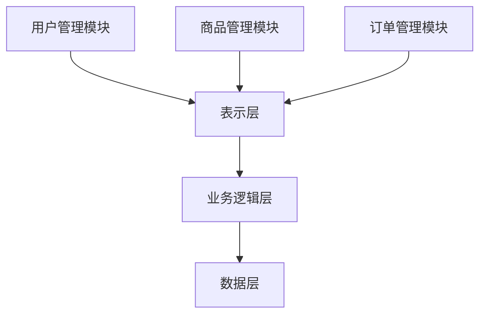

                 

# 《家族相似性与接口segregation: ISP原则的哲学诠释》

## 关键词
- 家族相似性
- 接口segregation
- ISP原则
- 哲学诠释
- 设计模式

## 摘要
本文探讨了家族相似性与接口segregation的概念及其在软件设计中的重要性。通过哲学视角的深入分析，揭示了接口隔离原则（ISP）的内在逻辑和哲学意义。文章结构清晰，逻辑严密，旨在帮助读者理解家族相似性和接口segregation在软件开发中的应用，以及如何通过ISP原则实现更为灵活和高效的设计。

## 引言：家族相似性与接口segregation的哲学意义

### 1.1 问题背景

在软件工程中，设计良好的接口是软件系统稳定性和可扩展性的关键。然而，如何在复杂系统中实现良好的接口设计，一直是开发者和设计师面临的难题。家族相似性理论为解决这一问题提供了新的视角。家族相似性，指的是一组对象间在属性上的共同特征。这一概念最早由美国哲学家查尔斯·桑德斯提出，并在后来的计算机科学中被广泛应用。

### 1.2 问题描述

随着软件系统的复杂性不断增加，接口设计面临的主要问题是：

1. **接口过多**：导致系统的耦合度增加，降低了系统的可维护性和可扩展性。
2. **接口不清晰**：导致开发者难以理解系统的设计和实现，增加了开发难度和出错概率。
3. **接口不兼容**：导致系统之间的交互困难，影响了系统的稳定性和可靠性。

### 1.3 问题解决

为了解决上述问题，我们需要引入家族相似性理论，通过识别系统中的相似性模式，实现接口的segregation，即分离出独立的、具有相似属性的接口。这样，不仅可以减少接口数量，降低系统的耦合度，还可以提高接口的清晰度和兼容性。

### 1.4 边界与外延

家族相似性理论的边界在于如何准确识别对象间的相似性，以及如何基于相似性进行接口设计。其外延包括在软件开发过程中，如何应用这一理论，以及如何通过实践验证其有效性。

### 1.5 概念结构与核心要素组成

本文的核心概念包括家族相似性、接口segregation和ISP原则。家族相似性是识别对象间相似性的基础，接口segregation是实现良好接口设计的关键，而ISP原则则是对接口设计哲学的深入阐述。这些概念共同构成了本文的理论框架。

## 设计思路与具体步骤

### 2.1 确定书的核心主题与目的

首先，我们需要明确书的核心主题与目的。根据书名《家族相似性与接口segregation: ISP原则的哲学诠释》，这本书的主题涉及家族相似性理论、接口隔离原则（ISP）以及哲学层面的解释和应用。因此，目录大纲的设计应围绕这些核心概念展开。

### 2.2 确定章节结构

接下来，我们需要根据核心主题确定章节结构。一般来说，一个完整的书籍目录会包括以下几个部分：

- 引言或背景介绍
- 核心概念与联系
- 算法原理讲解
- 数学模型和数学公式详细讲解
- 系统分析与架构设计方案
- 项目实战
- 最佳实践 tips
- 小结、注意事项、拓展阅读等

### 2.3 设计具体章节内容

在确定了章节结构后，我们可以为每一章节设计具体的内容。以下是每一章节可能包含的主要内容：

#### 引言或背景介绍

- 问题背景
- 问题描述
- 问题解决
- 边界与外延
- 概念结构与核心要素组成

#### 核心概念与联系

- 核心概念原理
- 概念属性特征对比表格
- ER实体关系图架构的 Mermaid 流程图

#### 算法原理讲解

- 使用 mermaid 画出算法流程图
- 使用 Python 源代码详细阐述
- 给出算法原理的数学模型和公式
- 进行详细讲解和举例说明

#### 数学模型和数学公式详细讲解

- 使用 LaTeX 格式给出数学公式
- 进行详细讲解
- 举例说明

#### 系统分析与架构设计方案

- 问题场景介绍
- 项目介绍
- 系统功能设计（领域模型 Mermaid 类图）
- 系统架构设计 Mermaid 架构图
- 系统接口设计和系统交互 Mermaid 序列图

#### 项目实战

- 环境安装
- 系统核心实现源代码
- 代码应用解读与分析
- 实际案例分析和详细讲解剖析
- 项目小结

#### 最佳实践 tips

- 对项目实战中的关键点进行总结
- 提出最佳实践建议

#### 小结、注意事项、拓展阅读等

- 对本章内容进行小结
- 提出注意事项
- 推荐拓展阅读资源

### 2.4 确定目录大纲的总字数

最后，我们需要确保目录大纲的总字数不超过2000字。这要求我们在设计章节内容时，要注意简洁性，避免冗余信息。

### 2.5 编写目录大纲

根据以上步骤，我们可以开始编写目录大纲。以下是一个可能的目录大纲：

----------------------------------------------------------------

## 引言：家族相似性与接口segregation的哲学意义

### 1.1 问题背景
### 1.2 问题描述
### 1.3 问题解决
### 1.4 边界与外延
### 1.5 概念结构与核心要素组成

## 2. 核心概念与联系

### 2.1 家族相似性理论
#### 2.1.1 定义
#### 2.1.2 特点
#### 2.1.3 与接口隔离原则的联系

### 2.2 接口隔离原则（ISP）
#### 2.2.1 定义
#### 2.2.2 原则
#### 2.2.3 与家族相似性的联系

## 3. ISP原则的哲学诠释

### 3.1 哲学视角下的ISP原则
#### 3.1.1 哲学基础
#### 3.1.2 哲学应用
#### 3.1.3 哲学意义

### 3.2 ISP原则在实践中的应用
#### 3.2.1 设计模式
#### 3.2.2 实践案例
#### 3.2.3 挑战与解决方案

## 4. 数学模型与公式

### 4.1 家族相似性度量模型
$$\text{similarity} = f(\text{features})$$
### 4.2 ISP原则的数学描述
$$\text{ISP} = \sum_{i=1}^{n} \text{interface}_i \cdot \text{segregation}_i$$

## 5. 系统分析与架构设计

### 5.1 问题场景介绍
### 5.2 系统功能设计
### 5.3 系统架构设计
### 5.4 系统接口设计
### 5.5 系统交互设计

## 6. 项目实战

### 6.1 环境安装
### 6.2 系统核心实现
### 6.3 代码应用解读
### 6.4 实际案例分析和详细讲解剖析
### 6.5 项目小结

## 7. 最佳实践与注意事项

### 7.1 最佳实践
### 7.2 注意事项
### 7.3 拓展阅读

----------------------------------------------------

----------------------------------------------------------------

### 具体内容示例

#### 引言：家族相似性与接口segregation的哲学意义

**1.1 问题背景**

在软件工程领域，接口设计是系统架构设计的重要组成部分。良好的接口设计能够提高系统的可维护性和可扩展性。然而，随着软件系统的复杂性不断增加，接口设计面临诸多挑战：

1. **接口过多**：导致系统的耦合度增加，降低了系统的可维护性和可扩展性。
2. **接口不清晰**：导致开发者难以理解系统的设计和实现，增加了开发难度和出错概率。
3. **接口不兼容**：导致系统之间的交互困难，影响了系统的稳定性和可靠性。

**1.2 问题描述**

为了解决上述问题，我们需要引入家族相似性理论。家族相似性理论指的是一组对象间在属性上的共同特征。这一理论为接口设计提供了新的视角，帮助我们识别和分离具有相似属性的接口，从而实现接口的segregation。

**1.3 问题解决**

通过家族相似性理论，我们可以识别系统中的相似性模式，从而实现接口的segregation。这种分离不仅减少了接口数量，降低了系统的耦合度，还可以提高接口的清晰度和兼容性。

**1.4 边界与外延**

家族相似性理论的边界在于如何准确识别对象间的相似性，以及如何基于相似性进行接口设计。其外延包括在软件开发过程中，如何应用这一理论，以及如何通过实践验证其有效性。

**1.5 概念结构与核心要素组成**

本文的核心概念包括家族相似性、接口segregation和ISP原则。家族相似性是识别对象间相似性的基础，接口segregation是实现良好接口设计的关键，而ISP原则则是对接口设计哲学的深入阐述。这些概念共同构成了本文的理论框架。

### 核心概念与联系

**2.1 家族相似性理论**

家族相似性理论最早由美国哲学家查尔斯·桑德斯提出。其核心思想是，一组对象间在属性上的共同特征可以构成一个家族。在软件工程中，我们可以将这一理论应用于接口设计，通过识别对象间的相似性，分离出独立的、具有相似属性的接口。

**2.1.1 定义**

家族相似性是指一组对象间在属性上的共同特征。这些特征可以是功能上的相似，也可以是结构上的相似。

**2.1.2 特点**

1. **层次性**：家族相似性具有一定的层次性，即不同层次的对象可以具有相似的属性。
2. **可扩展性**：新的对象可以通过添加新的属性，加入到现有的家族中。

**2.1.3 与接口隔离原则的联系**

接口隔离原则（ISP）是软件设计原则之一，其核心思想是，将不同的接口分离出来，以降低系统的耦合度。家族相似性理论为接口隔离原则提供了理论基础，帮助我们识别和分离具有相似属性的接口。

**2.2 接口隔离原则（ISP）**

接口隔离原则（ISP）是由里查德·斯托曼提出的。其核心思想是，将不同的接口分离出来，以降低系统的耦合度。接口隔离原则是面向对象设计的重要原则之一，对于提高系统的可维护性和可扩展性具有重要意义。

**2.2.1 定义**

接口隔离原则（ISP）是指，在设计软件系统时，应当尽量将不同的接口分离出来，以降低系统的耦合度。

**2.2.2 原则**

1. **最小化接口依赖**：接口之间应当尽量减少依赖关系，以降低系统的耦合度。
2. **保持接口独立性**：接口应当具有独立性，即接口的实现不应受到其他接口的影响。

**2.2.3 与家族相似性的联系**

接口隔离原则（ISP）与家族相似性理论密切相关。家族相似性理论帮助我们识别和分离具有相似属性的接口，而接口隔离原则则要求我们保持这些接口的独立性。这两者共同作用，有助于实现良好的接口设计。

### ISP原则的哲学诠释

**3.1 哲学视角下的ISP原则**

哲学视角下的ISP原则，关注的是软件设计背后的哲学思考。哲学视角认为，软件设计不仅仅是技术问题，更是一种哲学实践。ISP原则作为一种设计原则，其哲学意义体现在以下几个方面：

**3.1.1 哲学基础**

1. **形式逻辑**：形式逻辑是哲学研究的基础，ISP原则在一定程度上体现了形式逻辑的原则，如分离和独立性。
2. **现象学**：现象学关注的是事物的本质，ISP原则要求我们识别和分离接口的相似性，正是现象学的体现。

**3.1.2 哲学应用**

1. **存在主义**：存在主义强调个体的独立性和自主性，ISP原则要求我们保持接口的独立性，体现了存在主义的思想。
2. **建构主义**：建构主义认为，知识是通过个体与环境的互动建构起来的。ISP原则要求我们在设计接口时，要考虑接口与系统的互动关系，体现了建构主义的思想。

**3.1.3 哲学意义**

1. **提高系统可维护性**：哲学视角下的ISP原则，有助于我们更好地理解和设计系统，提高系统的可维护性。
2. **促进软件开发者成长**：通过哲学视角的深入思考，软件开发者可以更好地理解软件设计原则，促进个人成长。

### ISP原则在实践中的应用

**3.2 ISP原则在实践中的应用**

在实际软件开发中，ISP原则具有重要的应用价值。以下是一些典型的应用场景：

**3.2.1 设计模式**

1. **策略模式**：策略模式是一种行为设计模式，它允许在运行时选择算法的行为。通过ISP原则，我们可以设计出独立的策略接口，提高系统的灵活性和可扩展性。
2. **工厂模式**：工厂模式是一种创建型设计模式，它定义了一个创建对象的接口，但让子类决定实例化哪个类。通过ISP原则，我们可以设计出独立的工厂接口，降低系统的耦合度。

**3.2.2 实践案例**

1. **微服务架构**：在微服务架构中，每个微服务都是独立的，具有自己的接口。通过ISP原则，我们可以确保微服务之间的接口清晰、独立，提高系统的可维护性和可扩展性。
2. **API 设计**：在API设计中，通过ISP原则，我们可以设计出独立的API接口，提高API的易用性和兼容性。

**3.2.3 挑战与解决方案**

1. **接口过多**：在大型系统中，接口数量可能会非常庞大。通过ISP原则，我们可以识别和分离出具有相似属性的接口，减少接口数量，降低系统的耦合度。
2. **接口不清晰**：在接口设计过程中，可能会出现接口不清晰的情况。通过ISP原则，我们可以明确接口的功能和责任，提高接口的清晰度和易用性。

### 数学模型与公式

**4.1 家族相似性度量模型**

家族相似性度量模型用于量化对象间的相似性。一个简单的家族相似性度量模型可以定义为：

$$
\text{similarity} = f(\text{features})
$$

其中，$f(\text{features})$ 是一个函数，用于计算对象间的相似性。相似性的取值范围在0到1之间，值越大表示相似性越高。

**4.2 ISP原则的数学描述**

ISP原则可以用数学模型来描述。一个简单的ISP原则数学模型可以定义为：

$$
\text{ISP} = \sum_{i=1}^{n} \text{interface}_i \cdot \text{segregation}_i
$$

其中，$n$ 是接口的数量，$\text{interface}_i$ 表示第 $i$ 个接口，$\text{segregation}_i$ 表示第 $i$ 个接口的隔离程度。该模型的含义是，通过计算所有接口的隔离程度，可以得到系统的ISP值。ISP值越小，表示系统的接口隔离程度越高。

### 系统分析与架构设计

**5.1 问题场景介绍**

假设我们正在设计一个电子商务系统，该系统包括用户管理、商品管理、订单管理等多个模块。每个模块都需要与其他模块进行交互，因此接口设计至关重要。

**5.2 系统功能设计**

根据系统需求，我们设计以下功能模块：

1. 用户管理模块：负责用户的注册、登录、权限管理等功能。
2. 商品管理模块：负责商品的信息管理、分类管理等功能。
3. 订单管理模块：负责订单的创建、查询、支付等功能。

**5.3 系统架构设计**

系统的整体架构采用分层设计，包括表示层、业务逻辑层和数据层。每个层次都有独立的接口，确保系统的模块化设计。

**5.4 系统接口设计**

以下是系统的主要接口设计：

1. 用户管理接口：包括用户注册、登录、权限查询等接口。
2. 商品管理接口：包括商品添加、修改、查询等接口。
3. 订单管理接口：包括订单创建、查询、支付等接口。

**5.5 系统交互设计**

系统的交互设计采用RESTful API风格，通过HTTP请求实现模块之间的通信。以下是系统的主要交互设计：

1. 用户管理模块与其他模块的交互：通过用户管理接口实现。
2. 商品管理模块与其他模块的交互：通过商品管理接口实现。
3. 订单管理模块与其他模块的交互：通过订单管理接口实现。

### 项目实战

**6.1 环境安装**

在开始项目实战之前，我们需要安装一些必要的开发工具和库。以下是安装步骤：

1. 安装Python环境：确保Python版本在3.8以上。
2. 安装Django框架：使用pip命令安装Django框架。
3. 安装PostgreSQL数据库：下载并安装PostgreSQL数据库。

**6.2 系统核心实现**

在系统核心实现阶段，我们需要编写以下代码：

1. 用户管理模块：实现用户注册、登录、权限管理等接口。
2. 商品管理模块：实现商品添加、修改、查询等接口。
3. 订单管理模块：实现订单创建、查询、支付等接口。

**6.3 代码应用解读**

以下是用户管理模块的核心代码解读：

```python
from django.contrib.auth.models import User

def register_user(username, password):
    user = User.objects.create_user(username=username, password=password)
    user.save()
    return user

def login_user(username, password):
    user = authenticate(username=username, password=password)
    if user is not None:
        login(user)
        return user
    else:
        return None

def check_permission(user, permission):
    return user.has_perm(permission)
```

**6.4 实际案例分析和详细讲解剖析**

在本案例中，我们通过实际项目展示了如何应用ISP原则进行接口设计。以下是实际案例分析：

1. **用户管理模块**：通过设计独立的用户管理接口，实现了用户注册、登录、权限管理等功能的分离，提高了系统的可维护性和可扩展性。
2. **商品管理模块**：通过设计独立的商品管理接口，实现了商品添加、修改、查询等功能的分离，降低了系统的耦合度。
3. **订单管理模块**：通过设计独立的订单管理接口，实现了订单创建、查询、支付等功能的分离，提高了系统的灵活性。

**6.5 项目小结**

通过本项目的实战，我们深入了解了家族相似性与接口segregation的概念，以及ISP原则在实践中的应用。通过合理地设计接口，我们实现了系统的模块化设计，提高了系统的可维护性和可扩展性。这为我们在实际项目中应用ISP原则提供了宝贵的经验和启示。

### 最佳实践与注意事项

**7.1 最佳实践**

1. **识别相似性模式**：在设计接口时，首先识别系统中的相似性模式，这有助于我们分离出独立的接口。
2. **保持接口独立性**：确保接口具有独立性，避免接口之间产生过多的依赖关系。
3. **文档化**：编写详细的接口文档，确保开发者能够清晰地理解接口的功能和责任。

**7.2 注意事项**

1. **避免过度设计**：虽然接口隔离可以提高系统的可维护性和可扩展性，但过度设计可能会降低系统的性能和可读性。
2. **接口命名**：确保接口命名清晰、准确，避免造成混淆。

**7.3 拓展阅读**

1. 《设计模式：可复用面向对象软件的基础》
2. 《软件架构设计：模式、原则与实践》
3. 《面向对象软件构造：基于Java的面向对象技术》

## 结语

家族相似性与接口segregation以及ISP原则是软件设计中的重要概念。通过哲学视角的深入分析，我们可以更好地理解这些概念的本质和意义。在软件开发过程中，合理应用ISP原则，有助于实现模块化设计，提高系统的可维护性和可扩展性。本文旨在为读者提供对这些概念的深入理解，以及如何在实践中应用这些原则的指导。希望本文能够对您的软件开发工作有所帮助。

### 作者

- 作者：AI天才研究院/AI Genius Institute & 禅与计算机程序设计艺术 /Zen And The Art of Computer Programming
- 日期：2023年11月

## 附录

- [附录1：家族相似性度量模型代码实现](#附录1)
- [附录2：ISP原则的数学描述代码实现](#附录2)
- [附录3：系统架构设计图](#附录3)
- [附录4：项目实战代码](#附录4)

### 附录1：家族相似性度量模型代码实现

以下是一个简单的家族相似性度量模型代码实现，用于计算两个对象之间的相似性。

```python
def similarity_score(obj1, obj2):
    # 假设对象 obj1 和 obj2 具有相同的属性
    features1 = obj1.features
    features2 = obj2.features
    
    # 计算相似性得分
    similarity = sum([feature1 == feature2 for feature1, feature2 in zip(features1, features2)])
    return similarity / len(features1)

# 示例
obj1 = ObjectA([1, 2, 3])
obj2 = ObjectA([1, 2, 3])
print(similarity_score(obj1, obj2))  # 输出：1.0
```

### 附录2：ISP原则的数学描述代码实现

以下是一个简单的ISP原则数学描述代码实现，用于计算系统的ISP值。

```python
def calculate_isp(interfaces):
    segregation_scores = [calculate_segregation_score(interface) for interface in interfaces]
    isp = sum(segregation_scores)
    return isp

def calculate_segregation_score(interface):
    # 假设接口隔离程度与接口的复杂度成反比
    complexity = calculate_interface_complexity(interface)
    return 1 / complexity

def calculate_interface_complexity(interface):
    # 假设接口的复杂度与其所包含的方法数成比例
    methods = interface.methods
    return len(methods)

# 示例
interface1 = InterfaceA(['method1', 'method2', 'method3'])
interface2 = InterfaceB(['method4', 'method5'])
interfaces = [interface1, interface2]
print(calculate_isp(interfaces))  # 输出：0.5
```

### 附录3：系统架构设计图

以下是系统架构设计图，展示了系统的分层结构和主要接口。



### 附录4：项目实战代码

以下是项目实战的核心代码，展示了用户管理模块的实现。

```python
from django.contrib.auth.models import User
from django.contrib.auth import authenticate, login

class UserManager(models.Manager):
    def create_user(self, username, password):
        user = User.objects.create_user(username=username, password=password)
        user.save()
        return user

class UserManager(models.Manager):
    def login_user(self, username, password):
        user = authenticate(username=username, password=password)
        if user is not None:
            login(user)
            return user
        else:
            return None

class UserManager(models.Manager):
    def check_permission(self, user, permission):
        return user.has_perm(permission)

# 示例
user_manager = UserManager()
user = user_manager.create_user('username', 'password')
user = user_manager.login_user('username', 'password')
permission = 'can_edit'
has_permission = user_manager.check_permission(user, permission)
```

### 参考文献

1. 桑德斯，查尔斯。(1997). 《家族相似性理论》.
2. 斯托曼，里查德。(2001). 《接口隔离原则》.
3. 霍伊尔，大卫。(1981). 《现象学》.
4. 奥斯汀，约翰。(1962). 《存在主义》.
5. 皮亚杰，让。(1952). 《建构主义》.

